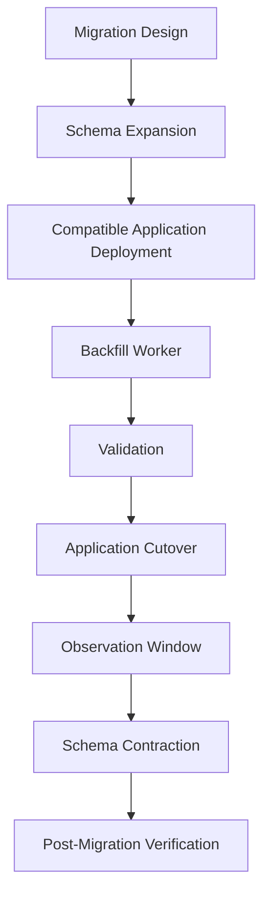

# 10- Large Table Migration Strategies

## Overview

Large table migrations are schema or data changes performed against tables whose size, write rate, query volume, or dependency graph makes a normal migration operationally risky.

A migration that works safely on a 50,000-row staging table can become a production incident on a 500-million-row table.

The difficulty is not only the number of rows. Large migrations compete with production workloads for:

- CPU
- Memory
- Disk I/O
- WAL bandwidth
- Locks
- Connections
- Replication bandwidth
- Autovacuum capacity
- Storage headroom

A useful production model is:

```text
                 ┌── API traffic
                 │
                 ├── Background workers
                 │
                 ├── Reporting
                 │
                 └── Migration
                       │
                       ▼
                  PostgreSQL
                       │
             ┌─────────┴─────────┐
             ▼                   ▼
          Storage             Replicas
```

The objective is therefore not:

> "Finish the migration as quickly as possible."

It is:

> **Complete the migration while keeping production within acceptable latency, availability, consistency, and recovery boundaries.**

---

## What Makes a Table "Large"?

There is no universal row-count threshold.

A table becomes operationally large when its size or workload makes a migration difficult to execute safely.

Consider:

| Factor | Why it matters |
|---|---|
| Row count | Determines amount of data to process |
| Physical size | Determines I/O and storage requirements |
| Row width | Increases scan and rewrite cost |
| Write rate | Determines contention and synchronization complexity |
| Read rate | Determines tolerance for resource consumption |
| Index count | Increases write and migration cost |
| Transaction duration | Affects locks, MVCC, and recovery |
| Replica count | Multiplies replication impact |
| Business criticality | Determines acceptable disruption |
| Data distribution | Affects batching and query plans |

A 100 GB table receiving 10,000 writes per second may be harder to migrate than a 1 TB archival table that is rarely accessed.

---

## Large Table Migration Categories

Large-table work usually falls into several categories:

| Migration type | Example | Typical risk |
|---|---|---|
| Additive schema change | Add column | Low to medium |
| Constraint change | Add foreign key | Medium |
| Index creation | Add B-tree index | Medium to high |
| Data backfill | Populate new column | Medium to high |
| Column removal | Drop old column | High |
| Type transformation | `integer` → `bigint` | High |
| Table rewrite | Change physical representation | High |
| Table split | Move data to new table | High |
| Table partitioning | Convert large table to partitions | High |
| Archival | Move historical rows | High |
| Data cleanup | Large delete/update | High |

The correct strategy depends on the specific operation.

---

## The Core Strategy: Expand and Contract

The safest general pattern is:

```text
Existing schema
      ↓
Expand
      ↓
Deploy compatible application
      ↓
Backfill incrementally
      ↓
Validate
      ↓
Switch application behavior
      ↓
Observe
      ↓
Contract
```

For example:

```text
customers
 ├── email
 └── normalized_email
```

Application transition:

```text
Old code ───────────────► email
New code ───────────────► normalized_email
                           ↑
                       backfill
```

After validation:

```text
customers
 └── normalized_email
```

The destructive operation is intentionally separated from the data migration.

---

## Migration Architecture

A mature large-table migration often looks like:



This separation provides:

- Smaller failure domains
- Better rollback options
- Independent throttling
- Better observability
- Easier operational control

---

## Measure Before Migrating

Before changing a large table, collect baseline information.

Useful measurements include:

```sql
SELECT
    pg_size_pretty(pg_total_relation_size('orders')) AS total_size,
    pg_size_pretty(pg_relation_size('orders')) AS table_size,
    pg_size_pretty(pg_indexes_size('orders')) AS indexes_size;
```

Inspect row counts:

```sql
SELECT count(*)
FROM orders;
```

For very large tables, an exact `count(*)` itself can be expensive. Use existing operational metrics or approximate statistics when an exact count is not necessary.

Inspect active transactions:

```sql
SELECT
    pid,
    usename,
    state,
    xact_start,
    query_start,
    wait_event_type,
    wait_event,
    query
FROM pg_stat_activity
WHERE xact_start IS NOT NULL
ORDER BY xact_start;
```

The baseline should include:

- Query latency
- Error rate
- Database CPU
- Database I/O
- Replication lag
- Connection utilization
- WAL generation

Without a baseline, it is difficult to determine whether the migration caused degradation.

---

## Estimate the Migration Cost

Before production execution, estimate:

```text
Data volume
+
Rows affected
+
Indexes maintained
+
WAL generated
+
Expected duration
+
Replication impact
+
Available headroom
```

For example:

```text
500M rows
×
Large row width
×
Multiple indexes
=
Potentially massive write workload
```

Do not extrapolate linearly from a small staging environment without considering production hardware and workload concurrency.

---

## Separate Schema Changes From Data Changes

One of the strongest migration patterns is:

```text
Schema migration
        ↓
Application deployment
        ↓
Background data migration
        ↓
Validation
```

Avoid:

```text
ALTER TABLE
+
500M-row UPDATE
+
Application deployment
```

inside a single deployment transaction.

Separating them allows the data migration to be:

- Paused
- Resumed
- Throttled
- Retried
- Monitored
- Rolled back at the application level

---

## Incremental Backfills

For large datasets, process data in bounded batches.

Example:

```sql
SELECT id
FROM customers
WHERE id > $1
ORDER BY id
LIMIT 5000;
```

Then update that bounded set.

The worker can maintain:

```text
last_processed_id
```

and continue from there.

A simplified flow:

```text
Read batch
   ↓
Transform
   ↓
Write batch
   ↓
Commit
   ↓
Record progress
   ↓
Observe database health
   ↓
Continue / throttle / pause
```

---

## Why Batching Matters

A single transaction affecting millions of rows can create:

- Large WAL volume
- Long transaction duration
- Lock pressure
- MVCC bloat
- Large rollback cost
- Long recovery time
- Replica lag
- Connection occupation

Instead:

```text
Batch 1 → COMMIT
Batch 2 → COMMIT
Batch 3 → COMMIT
...
Batch N → COMMIT
```

Each transaction becomes a manageable recovery unit.

---

## Batch Size

Batch size should be tuned empirically.

| Batch size | Advantages | Risks |
|---|---|---|
| Small | Low transaction impact | More overhead |
| Medium | Balanced | Requires tuning |
| Large | Higher throughput | More WAL/locks/resource pressure |

A reasonable starting point may be:

```text
1,000–10,000 rows
```

but there is no universally correct value.

The appropriate batch size depends on:

- Row width
- Number of indexes
- Database capacity
- Query complexity
- Write concurrency
- Replica capacity

Measure batch duration and database impact rather than choosing a number by convention.

---

## Keyset-Based Batching

Prefer indexed progression through the table.

For example:

```sql
SELECT id
FROM customers
WHERE id > $1
ORDER BY id
LIMIT 5000;
```

Then process that range.

This is generally preferable to repeatedly doing:

```sql
WHERE normalized_email IS NULL
```

without an efficient way to locate the next batch.

A useful migration cursor should be:

- Indexed
- Monotonic where possible
- Stable
- Efficient to resume

Primary keys are often useful for this purpose, but the best cursor depends on the migration.

---

## Handling Gaps

IDs may contain gaps:

```text
100
101
105
109
```

Do not assume IDs are contiguous.

Keyset batching still works:

```sql
WHERE id > $last_id
ORDER BY id
LIMIT 5000
```

The query advances to the next available rows.

This is safer than assuming:

```text
last_id + batch_size
```

represents the next batch.

---

## Idempotent Backfills

A large migration should tolerate retries.

Example:

```sql
UPDATE customers
SET normalized_email = lower(trim(email))
WHERE id > $1
  AND id <= $2
  AND normalized_email IS NULL;
```

If the worker crashes and repeats the batch, completed rows do not need to be modified again.

Idempotency is particularly important when:

- Kubernetes restarts pods
- Database connections fail
- Workers are redeployed
- Transactions time out
- Failover occurs

---

## Progress Tracking

A migration should have durable progress state.

For example:

```text
migration_name
last_processed_id
rows_processed
updated_at
status
```

A migration control table might be:

```sql
CREATE TABLE migration_progress (
    migration_name text PRIMARY KEY,
    last_processed_id bigint,
    rows_processed bigint NOT NULL DEFAULT 0,
    status text NOT NULL,
    updated_at timestamptz NOT NULL DEFAULT now()
);
```

The exact implementation can vary, but the migration should be restartable without guessing where it stopped.

---

## Progress and Commit Ordering

Be careful about the order in which progress is recorded.

The desired relationship is:

```text
Data update
    ↓
COMMIT
    ↓
Progress checkpoint
```

If progress is recorded before the data transaction commits and the process crashes, the worker may skip uncommitted work.

For stronger consistency, progress state can itself be committed transactionally with the batch when appropriate.

The implementation depends on the migration architecture, but the invariant is:

> **Never checkpoint progress beyond durable data state.**

---

## Throttling

A migration should be able to reduce its own workload.

For example:

```text
Normal load
   ↓
100 batches/min

High DB CPU
   ↓
50 batches/min

Replica lag
   ↓
10 batches/min

Incident
   ↓
Pause
```

Throttling signals can include:

- CPU
- I/O latency
- Query latency
- Lock waits
- Connection pool utilization
- Replica lag
- WAL generation
- Queue depth

A migration worker should behave like a cooperative workload, not an unrestricted batch processor.

---

## Time-Based Throttling

A simple implementation can add a small delay between batches:

```python
import time

for batch in batches:
    process(batch)
    time.sleep(0.1)
```

However, fixed sleeps are crude.

A production system should ideally adapt to database health.

```text
Healthy
  ↓
Increase throughput

Degraded
  ↓
Reduce throughput

Critical
  ↓
Pause
```

Adaptive throttling is particularly useful for migrations that run for hours or days.

---

## Lock Management

Large-table migrations must account for locks.

For example:

```sql
SET lock_timeout = '3s';
SET statement_timeout = '10min';
```

This prevents a migration from waiting indefinitely for a required lock and limits excessive execution time.

Remember:

| Setting | Meaning |
|---|---|
| `lock_timeout` | Maximum lock-acquisition wait |
| `statement_timeout` | Maximum statement execution time |

Do not solve lock contention by simply increasing timeout values.

Identify the blocker:

```sql
SELECT
    pid,
    pg_blocking_pids(pid) AS blocking_pids,
    wait_event_type,
    wait_event,
    query
FROM pg_stat_activity
WHERE wait_event_type = 'Lock';
```

---

## Long-Running Transactions

Long transactions are particularly harmful during large migrations.

They can:

- Delay cleanup
- Increase table bloat
- Hold locks
- Consume connections
- Interfere with DDL
- Increase replica pressure

Before starting a migration, identify old transactions:

```sql
SELECT
    pid,
    usename,
    state,
    xact_start,
    now() - xact_start AS transaction_age,
    query
FROM pg_stat_activity
WHERE xact_start IS NOT NULL
ORDER BY xact_start;
```

An `idle in transaction` session that has existed for a long time deserves immediate investigation.

---

## Large Updates

Large updates are especially expensive because PostgreSQL uses MVCC.

For:

```sql
UPDATE customers
SET normalized_email = lower(trim(email));
```

PostgreSQL creates new row versions.

Conceptually:

```text
Old row version
      ↓
UPDATE
      ↓
New row version
      ↓
WAL
      ↓
Vacuum eventually cleans old versions
```

A huge update can therefore create substantial:

- WAL
- Dead tuples
- Vacuum work
- Table bloat
- Replica replay work

This is one reason large backfills should be carefully controlled.

---

## Large Deletes

Deleting millions of rows also creates substantial database work.

Avoid:

```sql
DELETE FROM events
WHERE created_at < $cutoff;
```

as one enormous transaction when the table is large and actively used.

Prefer bounded deletion:

```sql
DELETE FROM events
WHERE id IN (
    SELECT id
    FROM events
    WHERE created_at < $1
    ORDER BY id
    LIMIT 5000
);
```

Repeat until no rows remain.

For retention-heavy workloads, partitioning can often be a better long-term architecture because dropping or detaching an old partition can be much more efficient than deleting individual rows.

---

## Archival Strategies

If historical data does not need to remain in the primary OLTP table, consider:

```text
Primary OLTP
    ↓
Archive pipeline
    ↓
Object storage / warehouse
```

Possible destinations include:

- S3
- Data warehouse
- OLAP database
- Dedicated archive tables

The choice depends on:

- Query requirements
- Retention
- Compliance
- Recovery requirements
- Cost

Do not delete production data until the archival copy has been verified.

---

## Partitioning as a Migration Strategy

Partitioning can be useful for very large tables.

Instead of:

```text
orders
 └── 5 billion rows
```

use:

```text
orders
 ├── 2025
 ├── 2026-01
 ├── 2026-02
 ├── 2026-03
 └── ...
```

Benefits include:

- Partition pruning
- Smaller maintenance units
- Easier retention
- Easier archival
- Smaller indexes per partition
- Better lifecycle management

Partitioning does not automatically solve every performance or migration problem.

The partition key must align with actual access and lifecycle patterns.

---

## Shadow Table Migration

For high-risk transformations, create a new table.

```text
Old table
    │
    ├── Existing traffic
    │
    └── Change capture
             ↓
         New table
```

The new table can have:

- New schema
- New indexes
- New partitioning
- Transformed data

Data is copied incrementally.

After synchronization:

```text
Old table
    ↓
Cutover
    ↓
New table
```

This is more complex but can be appropriate for major transformations.

---

## Dual Writes for Shadow Tables

During a shadow migration:

```text
Application write
       │
       ├── Old table
       └── New table
```

Both representations must remain consistent.

Possible mechanisms include:

- Application dual writes
- Database triggers
- Change data capture
- Logical replication

Application dual writes are simple conceptually but require every writer to participate.

Triggers provide database-level enforcement but increase write complexity.

CDC can be powerful but introduces operational infrastructure and eventual-consistency considerations.

---

## Shadow Table Cutover

A typical cutover looks like:

```text
1. Create new table
2. Copy historical data
3. Capture ongoing changes
4. Validate row-level consistency
5. Stop or quiesce writes briefly if required
6. Apply final changes
7. Switch application
8. Observe
9. Retire old table later
```

The goal is to make the final cutover much smaller than the original data migration.

---

## Changing Data Types

Changing a column type can be risky on a large table.

Example:

```sql
ALTER TABLE orders
ALTER COLUMN customer_id TYPE bigint;
```

Depending on the type conversion and PostgreSQL version, the operation may require substantial work or a table rewrite.

For high-risk transformations, consider:

```text
old_column
     +
new_column
     ↓
backfill
     ↓
dual write
     ↓
switch reads
     ↓
remove old column
```

This is often safer than forcing a massive in-place transformation.

---

## Integer to Bigint

A common migration is:

```text
integer
   ↓
bigint
```

The reason is often approaching identifier limits.

For a large production table, first understand:

- Current maximum ID
- Sequence configuration
- Foreign-key relationships
- Referencing tables
- Application type assumptions
- Indexes
- ORM mappings

If multiple tables reference the ID, changing only one column is not enough.

The migration becomes a dependency graph.

---

## Renaming a Column on a Large Table

A rename can be much cheaper than rewriting the table, but it can still break old application versions.

Use:

```text
Add new column
     ↓
Dual write
     ↓
Backfill
     ↓
Switch reads
     ↓
Stop old writes
     ↓
Remove old column
```

This is often preferable when application compatibility is more important than the simplicity of the database operation.

---

## Large Index Creation

Indexes on large tables deserve their own migration strategy.

For PostgreSQL:

```sql
CREATE INDEX CONCURRENTLY orders_customer_created_idx
ON orders (customer_id, created_at DESC);
```

Benefits:

- Reduced blocking of normal writes

Costs:

- CPU
- I/O
- Disk
- WAL
- Longer build time
- Operational complexity

Before creating the index:

```text
Measure table size
      ↓
Estimate index size
      ↓
Check disk headroom
      ↓
Check replica health
      ↓
Create concurrently
      ↓
Monitor
```

---

## Invalid Concurrent Indexes

A failed concurrent index build can leave an invalid index.

Inspect:

```sql
SELECT
    indexrelid::regclass AS index_name,
    indisvalid,
    indisready
FROM pg_index
WHERE NOT indisvalid
   OR NOT indisready;
```

An invalid index should be investigated and cleaned up before retrying.

Do not assume that a failed migration leaves no database artifacts.

---

## Replication Impact

Large migrations generate database activity that replicas must replay.

```text
Primary
   │
   ├── Migration
   │      ↓
   │    WAL
   │      ↓
   └────────────► Replica
                    ↓
                 Replay
```

Monitor:

- Replica lag
- WAL retention
- Replay rate
- Replica disk usage
- Replica query latency

A migration that is harmless to the primary can still make replicas unusably stale.

---

## Read-After-Write Consistency

If applications use replicas for reads:

```text
Write → Primary
Read  → Replica
```

a migration backfill or schema transition can interact with replica lag.

For example:

```text
Write new column
      ↓
Primary updated
      ↓
Replica has not replayed change
      ↓
Read returns old state
```

During migration, explicitly consider:

- Read-after-write requirements
- Replica routing
- Lag thresholds
- Primary fallback

---

## WAL Pressure

Large updates can produce large amounts of WAL.

Potential consequences:

```text
Large backfill
    ↓
High WAL generation
    ↓
Replication backlog
    ↓
Replica lag
    ↓
WAL retention/storage growth
```

If WAL volume becomes problematic:

- Reduce batch size
- Reduce concurrency
- Reduce migration rate
- Pause during peak periods
- Investigate replica capacity

Do not blindly increase infrastructure without understanding the migration's write amplification.

---

## Autovacuum Interaction

Large updates and deletes create dead tuples.

```text
Backfill
   ↓
New row versions
   ↓
Dead tuples
   ↓
Autovacuum
   ↓
Cleanup work
```

If the migration runs too aggressively, autovacuum may compete with application traffic.

Monitor:

- Vacuum activity
- Dead tuples
- Table bloat
- Autovacuum duration
- Database I/O

Do not disable autovacuum as a default migration strategy.

---

## Connection Pool Impact

Migration workers consume connections.

Consider:

```text
Application pods
   × pool size
        +
Celery workers
        +
Migration workers
        +
Reporting
        ↓
PostgreSQL
```

A large migration should usually have deliberately bounded concurrency.

Increasing worker count can make the migration faster while simultaneously:

- Increasing lock contention
- Increasing CPU
- Increasing I/O
- Increasing connection pressure
- Increasing WAL generation

More concurrency is not automatically more throughput.

---

## Celery-Based Backfills

Celery is a practical choice for asynchronous migration workloads.

```text
Migration Controller
       ↓
Celery Queue
       ↓
Workers
       ↓
PostgreSQL
```

Useful task properties:

- Bounded batch size
- Idempotency
- Retry support
- Progress tracking
- Rate limiting
- Metrics

Avoid creating millions of tiny Celery tasks without considering queue overhead.

A smaller number of controlled batches is often easier to operate.

---

## Kubernetes-Based Backfills

A migration worker can run as a dedicated Kubernetes workload.

```text
Kubernetes
 ├── API Deployment
 ├── Celery Workers
 └── Migration Worker
          │
          ▼
      PostgreSQL
```

Advantages:

- Independent scaling
- Separate deployment lifecycle
- Resource limits
- Separate credentials
- Easy restart behavior

Set appropriate CPU and memory limits so the migration cannot unexpectedly consume all node resources.

---

## Migration Worker Concurrency

Avoid:

```text
100 migration workers
      ↓
PostgreSQL
```

unless the database has been deliberately sized for that workload.

Start conservatively:

```text
1–2 workers
     ↓
Measure
     ↓
Increase if safe
```

The limiting resource may be:

- Database CPU
- Storage I/O
- Locks
- WAL
- Connections
- Replica replay

Identify the actual bottleneck before increasing concurrency.

---

## Redis and Migration Coordination

Redis can be useful for:

- Distributed coordination
- Progress dashboards
- Rate-limit state
- Short-lived migration metadata

However, durable migration progress should not depend exclusively on ephemeral Redis state.

For important progress checkpoints, prefer durable storage such as PostgreSQL or another durable control system.

Redis should complement migration correctness, not become its sole source of truth.

---

## Kafka and Large Data Migrations

Kafka can support migration workflows where changes are event-driven.

For example:

```text
PostgreSQL
    ↓
CDC / Event
    ↓
Kafka
    ↓
Migration Consumer
    ↓
New representation
```

This can reduce the need for large synchronous queries, but introduces:

- Event ordering considerations
- Replay complexity
- Consumer lag
- Duplicate delivery
- Idempotency requirements

Do not introduce Kafka merely to avoid writing a well-controlled batch migration.

Use it when event-driven architecture already fits the problem.

---

## Zero-Downtime Cutover

A large migration should make the final cutover small.

Good:

```text
Days of backfill
       ↓
Validation
       ↓
Seconds/minutes of cutover
```

Bad:

```text
Start migration
       ↓
Lock table
       ↓
Transform billions of rows
       ↓
Unlock
```

The objective is to move expensive work out of the critical request path.

---

## Validation Strategies

Validation should happen continuously and at the end.

Examples:

### Count Validation

```sql
SELECT count(*)
FROM customers
WHERE normalized_email IS NULL;
```

### Consistency Validation

```sql
SELECT count(*)
FROM customers
WHERE normalized_email <> lower(trim(email));
```

### Duplicate Validation

```sql
SELECT normalized_email, count(*)
FROM customers
GROUP BY normalized_email
HAVING count(*) > 1;
```

For very large tables, full validation queries can themselves be expensive. Use incremental validation, sampling, partition-level validation, or other workload-aware techniques where appropriate.

---

## Checksums and Reconciliation

For major migrations, row counts may not be sufficient.

Possible reconciliation techniques include:

- Counts by partition
- Counts by time range
- Aggregates by tenant
- Hash/checksum comparisons
- Key-range comparisons
- Business invariant checks

For example:

```text
Old table
  ├── tenant A → 10M rows
  ├── tenant B → 8M rows
  └── tenant C → 5M rows

New table
  ├── tenant A → 10M rows
  ├── tenant B → 8M rows
  └── tenant C → 5M rows
```

Validation should match the business correctness requirements.

---

## Multi-Tenant Large Tables

Large shared tables often contain highly uneven tenant sizes.

```text
Tenant A → 1,000 rows
Tenant B → 5,000 rows
Tenant C → 500M rows
```

A migration that treats all tenants equally may overload the system because of one large tenant.

Strategies include:

- Tenant-aware batching
- Separate large-tenant processing
- Rate limiting
- Tenant-specific migration windows
- Sharding
- Partitioning

The migration architecture should account for data distribution, not only total row count.

---

## Hot Rows

Large migrations can accidentally contend with frequently updated rows.

For example:

```text
Order
  ↓
High request frequency
  ↓
Same row repeatedly updated
  ↓
Backfill also updates row
  ↓
Lock contention
```

Avoid migrating columns that are simultaneously being heavily updated without considering the interaction.

Where possible:

- Limit batch size
- Use selective predicates
- Process low-contention ranges
- Schedule heavy work during lower traffic
- Separate hot and cold data

---

## Table Scans

A migration that repeatedly scans the entire table can become increasingly expensive.

Bad pattern:

```text
Batch 1 → scan huge table
Batch 2 → scan huge table
Batch 3 → scan huge table
...
```

Prefer:

```text
Indexed cursor
   ↓
Next batch
   ↓
Next cursor
```

Use `EXPLAIN` to verify that the batching query has an appropriate access path.

---

## Query Plans During Migration

Migration queries should be treated like production queries.

Inspect:

```sql
EXPLAIN
SELECT id
FROM customers
WHERE id > 1000000
ORDER BY id
LIMIT 5000;
```

Look for:

- Sequential scans
- Index scans
- Estimated rows
- Sorts
- Unexpected filters
- Excessive work

A migration query that scans 500 million rows for every batch can turn a theoretically efficient migration into an operational disaster.

---

## Timeouts and Cancellation

Long-running migration statements should have explicit operational limits.

For example:

```sql
SET lock_timeout = '3s';
SET statement_timeout = '10min';
```

A timeout should produce a recoverable failure.

The migration worker should:

```text
Catch failure
    ↓
Rollback batch
    ↓
Record failure
    ↓
Backoff
    ↓
Retry or pause
```

Avoid infinite immediate retries.

---

## Retry Strategy

Retries should be:

- Bounded
- Delayed
- Jittered
- Idempotent

For example:

```text
Attempt 1
   ↓
1 second

Attempt 2
   ↓
3 seconds

Attempt 3
   ↓
10 seconds

Repeated failure
   ↓
Pause / alert
```

Immediate retries can create a retry storm during database pressure.

---

## Deployment Failure

Consider:

```text
Application v2 deployed
       ↓
Migration worker starts
       ↓
Worker fails
```

The application should remain correct even if the backfill has not completed.

This is one reason new application code may temporarily support:

```text
new value
OR
derive from old value
```

until migration completion.

The application should not assume that "migration started" means "migration complete."

---

## Primary Failure During Migration

If the primary fails:

```text
Migration
   ↓
Primary failure
   ↓
Replica promoted
   ↓
Migration reconnects
```

The migration should be able to determine:

- Which batches committed
- Which batch failed
- Whether the last operation committed
- Where to resume

This reinforces the importance of:

- Idempotent batches
- Durable progress
- Clear transaction boundaries

---

## Uncertain Commit

A network failure can occur after PostgreSQL commits but before the client receives the response.

```text
Client
  │
  │ UPDATE
  ▼
PostgreSQL
  │
  │ COMMIT
  ▼
Network failure
  │
  ▼
Client sees error
```

The migration worker cannot always assume:

```text
Error = transaction did not commit
```

This is another reason retries must be designed around idempotent operations.

---

## Security Considerations

Large migrations often process sensitive production data.

Apply least privilege:

```text
Migration role
      ↓
Only required schema/data permissions
```

Avoid:

- Hard-coded credentials
- Shared administrator accounts
- Logging sensitive values
- Copying production data unnecessarily
- Giving migration workers unrestricted superuser access

Migration logs should record operational metadata, not sensitive row contents.

---

## Backup and Recovery

Before high-risk migrations, verify:

- Recent backup
- WAL/PITR capability
- Restore procedures
- Recovery point requirements
- Replica health

For destructive transformations, understand whether rollback means:

```text
Application rollback
```

or:

```text
Data restoration
```

These are very different recovery paths.

A large migration should not be started without understanding how to recover from corruption or accidental data modification.

---

## Disaster Recovery

Large migrations can affect DR systems through:

- WAL volume
- Replica lag
- Backup size
- Storage growth
- Recovery time

For major transformations, verify:

```text
Primary
  ↓
Replication
  ↓
DR replica
```

and confirm that the migration does not make the DR system materially less ready for failover.

---

## Cost Considerations

Large migrations consume infrastructure resources.

Costs can include:

- Database CPU
- Storage I/O
- Temporary storage
- WAL storage
- Replica resources
- Backup storage
- Additional migration workers
- Data transfer

Sometimes a slower migration is cheaper because it can run within existing production headroom.

The correct optimization target is:

```text
Migration duration
+
Production impact
+
Infrastructure cost
+
Operational risk
```

not migration duration alone.

---

## AWS Considerations

For PostgreSQL running on AWS, large migrations can affect:

- RDS/Aurora CPU
- EBS I/O
- Storage capacity
- Read replica lag
- CloudWatch metrics
- Backup/WAL storage
- Network bandwidth

Before migration, establish:

```text
Current database load
        ↓
Available headroom
        ↓
Expected migration workload
        ↓
Expected replica impact
```

Avoid scheduling large migrations during already constrained capacity periods.

---

## Monitoring Dashboard

A useful migration dashboard should contain:

### Database

- CPU utilization
- Memory
- I/O latency
- IOPS
- Active connections
- Lock waits
- Deadlocks
- WAL generation

### Replication

- Replica lag
- WAL retention
- Replay rate

### Application

- Request rate
- p95/p99 latency
- Error rate
- Database timeout rate

### Migration

- Rows processed
- Rows remaining
- Batch duration
- Throughput
- Retry count
- Current cursor
- Error count

A migration should have a clear owner watching these signals.

---

## Operational Pause Criteria

Define stop conditions before starting.

For example:

```text
Pause migration if:

p99 API latency > threshold
OR
replica lag > threshold
OR
database CPU > threshold
OR
lock waits exceed threshold
OR
disk headroom becomes unsafe
```

The exact thresholds are system-specific.

The important principle is:

> **Define failure boundaries before the migration starts.**

---

## Large Table Migration Decision Matrix

| Situation | Preferred strategy |
|---|---|
| Small table | Direct migration |
| Large table, additive column | Add nullable column |
| Large data transformation | Batched backfill |
| Heavy write workload | Throttled backfill |
| Large index | `CREATE INDEX CONCURRENTLY` |
| Major schema transformation | Shadow table |
| Large historical data | Partitioning / archival |
| Destructive change | Expand-and-contract |
| Type rewrite risk | New column + migration |
| Very high availability requirement | Online/shadow migration |
| Very large tenant | Tenant-aware migration |
| Retention-heavy data | Partition lifecycle |

---

## Common Mistakes

### Running One Massive UPDATE

**Problem:** Creates huge transactions, WAL, bloat, and replication pressure.

**Better:** Use bounded, committed batches.

### Migrating at Maximum Speed

**Problem:** Migration competes with production traffic and can cause latency or availability problems.

**Better:** Treat migration throughput as a tunable production workload.

### Ignoring Replica Lag

**Problem:** Primary appears healthy while replicas become unusably stale.

**Better:** Include replication health in migration throttling.

### Using OFFSET for Millions of Rows

**Problem:** Large offsets can require increasingly expensive scans.

**Better:** Use keyset-based progression.

### Running a Full Table Scan for Every Batch

**Problem:** Total migration cost can grow dramatically.

**Better:** Use indexed cursors and verify plans.

### Ignoring Long Transactions

**Problem:** Long transactions interfere with locks, vacuum, MVCC cleanup, and DDL.

**Better:** Keep migration transactions short.

### Adding Too Many Migration Workers

**Problem:** More concurrency can increase contention and database saturation.

**Better:** Increase workers gradually based on measured bottlenecks.

### Treating Retries as Automatically Safe

**Problem:** A partially committed operation can be repeated incorrectly.

**Better:** Design idempotent batches and durable progress.

### Using Redis as the Only Progress Store

**Problem:** Ephemeral coordination state can be lost.

**Better:** Persist critical migration state durably.

### Assuming Staging Performance Predicts Production

**Problem:** Production has different data size, distribution, concurrency, replicas, and hardware.

**Better:** Test with production-scale characteristics where possible.

### Ignoring Database-Side Dependencies

**Problem:** Views, triggers, functions, constraints, and indexes can depend on the schema.

**Better:** Review the database dependency graph.

### Running Destructive Operations Too Early

**Problem:** Application rollback may become impossible.

**Better:** Delay contraction until compatibility and rollback windows have passed.

---

## Production Migration Runbook

### Preparation

- [ ] Identify affected table
- [ ] Measure table and index size
- [ ] Understand read/write workload
- [ ] Review table schema
- [ ] Review indexes
- [ ] Review constraints
- [ ] Review database dependencies
- [ ] Review application consumers
- [ ] Review workers and scheduled jobs
- [ ] Review Kafka/Redis dependencies
- [ ] Establish baseline metrics
- [ ] Verify backups and recovery

### Design

- [ ] Choose expand-and-contract where appropriate
- [ ] Decide direct vs batched vs shadow migration
- [ ] Define batch strategy
- [ ] Define progress tracking
- [ ] Define retry behavior
- [ ] Define throttling
- [ ] Define pause criteria
- [ ] Define rollback/recovery behavior

### Execution

- [ ] Apply schema expansion
- [ ] Deploy compatible application
- [ ] Start migration conservatively
- [ ] Monitor database load
- [ ] Monitor replication
- [ ] Monitor application latency
- [ ] Adjust migration rate
- [ ] Record progress

### Validation

- [ ] Validate row counts
- [ ] Validate data correctness
- [ ] Validate constraints
- [ ] Validate application behavior
- [ ] Validate replicas
- [ ] Validate workers
- [ ] Validate events and caches

### Cutover

- [ ] Switch application behavior
- [ ] Confirm new path
- [ ] Monitor production
- [ ] Maintain rollback capability where required

### Contraction

- [ ] Confirm old consumers are gone
- [ ] Remove transitional application logic
- [ ] Remove old schema
- [ ] Verify post-migration state
- [ ] Document migration results

---

## Senior-Level Migration Principles

A senior engineer should think about large migrations as **controlled resource competition**.

The database is simultaneously serving:

```text
Reads
Writes
Transactions
Background jobs
Replication
Vacuum
Backups
Migration
```

Every migration consumes some portion of the same finite capacity.

A useful model is:

```text
Production Capacity
       │
       ├── User traffic
       ├── Background workloads
       ├── Maintenance
       ├── Replication
       └── Migration
```

The migration should consume only the capacity that production can safely spare.

This changes the engineering question from:

> "How do I migrate this table?"

to:

> "How do I migrate this table while preserving the production system's safety envelope?"

---

## Key Takeaways

- **Large-table migrations are production workloads:** plan around CPU, I/O, WAL, locks, connections, replication, vacuum, and storage rather than treating them as simple schema changes.
- **Use incremental, restartable strategies:** bounded batches, indexed keyset progression, durable progress, idempotency, retries, and throttling make large migrations recoverable and controllable.
- **Separate expensive data work from application cutover:** expand the schema, deploy compatible code, backfill and validate, switch behavior, then contract the old representation.
- **Monitor the entire system:** migration throughput is acceptable only while application latency, database health, replication, and recovery readiness remain within defined limits.
- **Choose the strategy based on risk and scale:** direct DDL, batched backfills, concurrent index builds, partitioning, archival, and shadow-table migrations each solve different large-table problems.