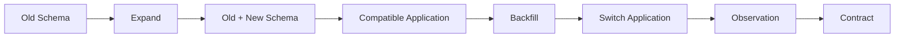
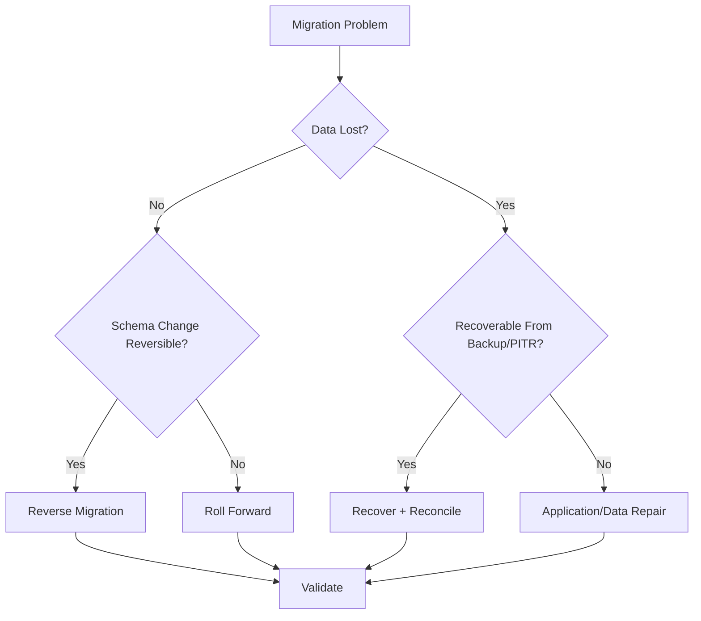

# 11- Migration Rollback Strategies

## Overview

Database migrations change persistent state, so rollback is fundamentally different from rolling back application code.

An application deployment can often be reverted by deploying the previous container image:

```text
Application v2
     ↓
Problem detected
     ↓
Deploy Application v1
```

A database migration may have already:

- Added or removed schema objects
- Modified millions of rows
- Changed constraints
- Created indexes
- Deleted data
- Changed application-visible semantics
- Produced events
- Replicated changes
- Changed external data representations

Therefore:

> **A migration rollback strategy must be designed before the migration is executed.**

A useful production model is:

```text
                    Deployment
                        │
             ┌──────────┴──────────┐
             ▼                     ▼
       Application              Database
             │                     │
             ▼                     ▼
        New behavior          Schema/data change
             │                     │
             └──────────┬──────────┘
                        ▼
                 Validation
                        │
                 ┌──────┴──────┐
                 │             │
               Healthy       Failure
                 │             │
                 ▼             ▼
              Continue      Recover
                               │
                    ┌──────────┼──────────┐
                    ▼          ▼          ▼
                 Rollback   Roll-forward  Restore
```

The safest recovery mechanism depends on the type and stage of the migration.

---

## Rollback vs Roll-Forward

A common mistake is assuming every migration should have a reverse migration.

There are actually several recovery strategies.

| Strategy | Meaning | Typical use |
|---|---|---|
| Reversible migration | Execute a defined inverse operation | Simple additive schema changes |
| Roll-forward | Deploy another migration that fixes the problem | Production schema/data issues |
| Application rollback | Revert application code while retaining compatible schema | Expand-and-contract |
| Restore | Recover database state from backup/PITR | Destructive or severe corruption |
| Shadow cutover reversal | Switch traffic back to old representation | Major table transformations |
| No-op rollback | Leave safe schema change in place | Additive changes |

Senior database engineering requires choosing the recovery mechanism rather than blindly executing a down migration.

---

## Why Database Rollback Is Hard

Consider:

```sql
ALTER TABLE customers
DROP COLUMN legacy_email;
```

Before the operation:

```text
customers
 ├── id
 ├── email
 └── legacy_email
```

After:

```text
customers
 ├── id
 └── email
```

A reverse migration such as:

```sql
ALTER TABLE customers
ADD COLUMN legacy_email text;
```

does not restore the lost values.

The schema may be restored while the data is not.

Therefore:

> **Schema reversibility does not imply data reversibility.**

This distinction is critical for production migrations.

---

## Migration Risk Categories

| Migration | Rollback difficulty |
|---|---|
| Add nullable column | Low |
| Add unused index | Low |
| Add compatible table | Low |
| Add non-validated constraint | Medium |
| Backfill data | Medium |
| Rename column | Medium |
| Change application semantics | Medium to high |
| Remove column | High |
| Large delete | High |
| Destructive transformation | High |
| Type rewrite | High |
| Table replacement | High |
| Cross-system migration | Very high |

The more information destroyed or externally propagated, the harder rollback becomes.

---

## Transaction Rollback

Some database operations can be protected by a transaction.

For example:

```sql
BEGIN;

ALTER TABLE customers
ADD COLUMN normalized_email text;

ROLLBACK;
```

If the statements are transactional in the target database/version and no external side effects are involved, the schema change can be reverted atomically.

This is the easiest form of rollback.

However, not every PostgreSQL operation has the same transactional behavior or migration-tool constraints.

For example, PostgreSQL's concurrent index operations have restrictions that prevent them from running inside a transaction block.

Therefore:

> **Do not assume a migration framework's transaction automatically makes every migration safely reversible.**

---

## Atomic vs Non-Atomic Migrations

### Atomic Migration

```text
BEGIN
  ↓
Schema/data changes
  ↓
COMMIT
```

If something fails:

```text
ROLLBACK
```

Advantages:

- Strong atomicity
- Simple failure semantics
- No partially committed changes

Limitations:

- Large transactions can be expensive
- Long locks may block production
- Large data changes create significant WAL
- Some operations cannot run inside a transaction

### Non-Atomic Migration

```text
Step 1 → COMMIT
Step 2 → COMMIT
Step 3 → COMMIT
```

Advantages:

- Smaller transactions
- Better control over large migrations
- Easier throttling

Limitations:

- Failure can leave a partially completed migration
- Each step needs its own recovery strategy
- Rollback becomes a workflow rather than one database transaction

---

## Reversible Schema Changes

Some changes are naturally reversible.

Example:

```sql
ALTER TABLE customers
ADD COLUMN marketing_opt_in boolean;
```

A reverse operation can be:

```sql
ALTER TABLE customers
DROP COLUMN marketing_opt_in;
```

This is reasonably reversible if:

- The column has not accumulated important data
- Application code no longer depends on it
- No external systems rely on it

Even simple reversals require deployment coordination.

---

## Additive Changes Are Usually Safer

Prefer:

```text
Add
  ↓
Use
  ↓
Migrate
  ↓
Remove later
```

over:

```text
Remove
  ↓
Hope rollback works
```

For example:

```sql
ALTER TABLE customers
ADD COLUMN normalized_email text;
```

Then:

```text
Deploy compatible code
      ↓
Backfill
      ↓
Switch reads
      ↓
Stop old writes
      ↓
Observe
      ↓
Remove old column
```

This creates multiple recovery points.

---

## Expand-and-Contract and Rollback

Expand-and-contract is particularly valuable because it separates compatibility from destruction.



Suppose:

```text
old_column
new_column
```

exist simultaneously.

If the new application fails:

```text
Application v2
      ↓
Failure
      ↓
Application v1
      ↓
Still uses old_column
```

The database does not need to be immediately reverted.

This is significantly safer than:

```text
Drop old column
      ↓
Deploy new application
      ↓
Failure
      ↓
Cannot safely deploy old application
```

---

## Application Rollback Compatibility

The most important migration question is often:

> **Can the previous application version continue operating against the new schema?**

Consider:

```text
Database schema v2
        ↑
Application v1
Application v2
```

If both versions work:

```text
Rollback application
       ↓
Safe
```

If only v2 works:

```text
Rollback application
       ↓
Application failure
```

Therefore database changes should often be designed around a compatibility matrix.

| Database | App v1 | App v2 |
|---|---:|---:|
| Schema v1 | Yes | No |
| Schema v2 | Yes | Yes |

This is an excellent deployment target.

---

## Dangerous Migration Pattern

Avoid:

```text
Migration
   ↓
DROP old_column
   ↓
Deploy application
```

If the application fails, reverting the application may not work.

Prefer:

```text
Add new_column
   ↓
Deploy compatible application
   ↓
Backfill
   ↓
Switch reads/writes
   ↓
Observe
   ↓
Remove old_column later
```

---

## Data Rollback

Data changes are more difficult.

Consider:

```sql
UPDATE customers
SET normalized_email = lower(trim(email));
```

The transformation may be reversible if the original value remains:

```text
email
   ↓
normalized_email
```

But if the migration overwrites the source:

```sql
UPDATE customers
SET email = lower(trim(email));
```

the original representation may be lost.

A rollback cannot reconstruct arbitrary original values from the transformed value.

For destructive transformations, preserve the original data until the rollback window has passed.

---

## Backfill Rollback

Suppose a new column is populated in batches:

```text
Batch 1 → committed
Batch 2 → committed
Batch 3 → committed
...
Batch 1000 → committed
```

A worker failure does not mean the database is automatically rolled back.

Instead:

```text
Migration state
      ↓
Partially complete
      ↓
Pause
      ↓
Investigate
      ↓
Resume / reverse / roll-forward
```

This is why large backfills should be:

- Idempotent
- Restartable
- Observable
- Checkpointed
- Independently controllable

---

## Idempotent Rollback

An operation is easier to recover when it can safely be repeated.

For example:

```sql
UPDATE customers
SET normalized_email = lower(trim(email))
WHERE normalized_email IS NULL;
```

A retry does not repeatedly transform already processed rows.

Similarly, cleanup should be designed carefully:

```sql
DROP INDEX CONCURRENTLY IF EXISTS customers_old_idx;
```

Idempotent migration operations reduce operational ambiguity.

---

## Roll-Forward Strategy

In production, roll-forward is often safer than reversing a partially executed migration.

Example:

```text
Migration A
  ↓
Adds new column
  ↓
Bug discovered
  ↓
Migration B
  ↓
Corrects data/schema
```

Instead of:

```text
Migration A
  ↓
Attempt complicated reverse
  ↓
Unknown partial state
```

Roll-forward is especially useful when:

- Data has already changed
- Multiple application versions interacted with the schema
- Events were emitted
- External systems consumed the new state
- The reverse operation is lossy

---

## Example: Incorrect Backfill

Suppose a backfill incorrectly populates:

```sql
UPDATE customers
SET normalized_email = lower(email);
```

with incorrect normalization rules.

A safer response may be:

```text
Stop backfill
      ↓
Prevent new incorrect writes
      ↓
Assess affected rows
      ↓
Fix transformation logic
      ↓
Run corrective backfill
      ↓
Validate
```

rather than dropping the column and assuming the system is restored.

---

## Schema Rollback vs Data Rollback

These should be evaluated separately.

| Change | Schema rollback | Data rollback |
|---|---:|---:|
| Add nullable column | Easy | Usually unnecessary |
| Add index | Easy | Not applicable |
| Backfill new column | Easy | Requires clearing/rebuilding |
| Rename column | Usually easy | Usually unchanged |
| Drop column | Easy to recreate | Potentially impossible |
| Delete rows | Easy to recreate schema | Requires backup/archive |
| Transform values | Easy | May be impossible |
| Replace table | Complex | Potentially complex |

This distinction should be documented in every high-risk migration plan.

---

## Backup as a Rollback Mechanism

Backups are not usually the first choice for a simple schema migration.

They are essential for recovery from:

- Data corruption
- Accidental deletion
- Incorrect destructive migrations
- Application bugs that modify large amounts of data
- Operational mistakes

Possible recovery mechanisms include:

```text
Backup
   ↓
Restore
```

or:

```text
Base backup
   +
WAL
   ↓
Point-in-time recovery
```

The latter can recover the database to a point before the destructive operation.

---

## Point-in-Time Recovery

For a destructive migration:

```text
10:00 Backup state
10:30 Normal traffic
11:00 Migration begins
11:15 Bad migration
11:20 Incident detected
```

PITR may allow recovery to:

```text
10:59:59
```

rather than restoring the entire database to the latest state.

However, PITR is usually a database-wide recovery mechanism, not a convenient way to undo one application's migration while preserving all subsequent writes.

This distinction matters.

---

## Restore Is Not a Simple Undo Button

Suppose the database contains:

```text
Migration
+
Customer orders created afterward
+
Payments
+
Events
+
Audit records
```

Restoring to before the migration can also remove legitimate activity that occurred afterward.

Therefore:

> **Database restore is a recovery operation, not a precise migration undo mechanism.**

For selective recovery, you may need:

- Point-in-time recovery to a temporary environment
- Extraction of required records
- Reconciliation
- Controlled reinsertion
- Application-level repair

---

## Shadow Table Rollback

For high-risk table transformations:

```text
old_table
    │
    ├── Existing traffic
    │
    └── Change capture
             ↓
         new_table
```

After validation:

```text
Application
     ↓
new_table
```

If problems occur:

```text
Application
     ↓
old_table
```

This can provide a much cleaner rollback path.

The trade-off is operational complexity.

---

## Blue-Green Database Migration

For major transformations:

```text
              ┌── Old database
Application ──┤
              └── New database
```

Data synchronization keeps the new database current.

After validation:

```text
Traffic
  ↓
New database
```

Rollback:

```text
Traffic
  ↓
Old database
```

This is appropriate only when the synchronization and consistency model can be made sufficiently reliable.

It can require:

- CDC
- Dual writes
- Replication
- Reconciliation
- Cutover coordination

---

## Dual Writes and Rollback

During dual-write migration:

```text
Application
   │
   ├── Old representation
   └── New representation
```

If the new path fails:

```text
Disable new path
      ↓
Continue old path
```

This is a strong rollback mechanism because both representations remain available.

However, dual writes introduce their own failure modes:

- One write succeeds while the other fails
- Ordering problems
- Retry duplication
- Partial consistency
- Increased application complexity

Use transactional or reliable synchronization mechanisms where appropriate.

---

## Event and Message Rollback

Database changes can trigger external side effects.

Example:

```text
Database transaction
      ↓
Outbox
      ↓
Kafka
      ↓
Consumer
      ↓
External system
```

Once an event has been published, simply rolling back the database does not retract what consumers already processed.

Therefore:

```text
Database rollback
       ≠
Distributed rollback
```

External consumers may require:

- Compensating events
- Idempotent processing
- Reconciliation
- Explicit versioning
- Roll-forward correction

---

## Transactional Outbox

For database-to-event workflows:

```text
BEGIN
  ↓
Update database
  ↓
Insert outbox event
  ↓
COMMIT
```

Then:

```text
Outbox worker
      ↓
Kafka
```

If the database transaction rolls back:

```text
Database update ❌
Outbox event ❌
```

This prevents many inconsistent database/event states.

However, once the event is delivered, downstream rollback still requires consumer-level compensation.

---

## Redis and Rollback

Redis may contain cached representations of migrated data.

Example:

```text
PostgreSQL
    ↓
Application
    ↓
Redis cache
```

After rollback:

```text
Database → old state
Redis    → new state
```

This creates stale data.

Recovery may require:

- Cache invalidation
- Versioned cache keys
- Cache rebuild
- TTL expiration
- Explicit namespace changes

Do not assume database rollback automatically repairs caches.

---

## Celery and Background Workers

Background workers may continue processing during a migration.

For example:

```text
Application
   ↓
Celery
   ↓
Database
```

If a migration is rolled back while workers still expect the new schema:

```text
Worker → old schema
Worker → failure
```

Before rollback:

- Pause incompatible workers
- Drain relevant queues where appropriate
- Stop scheduled jobs
- Deploy compatible worker code
- Verify task retries

Workers are part of the deployment compatibility surface.

---

## Kafka Consumers

Kafka consumers can also outlive an application deployment.

If a new event schema is rolled back:

```text
Producer v2
   ↓
Kafka
   ↓
Consumer v1
```

the consumer may fail.

Use:

- Backward-compatible event schemas
- Versioned events
- Consumer compatibility
- Idempotency
- Controlled rollout

Database rollback planning must include event consumers when schema changes affect event payloads or semantics.

---

## Rollback Decision Tree



The first question should often be:

> **What state is the system actually in?**

Do not execute a rollback command before understanding the current state.

---

## Rollback State Assessment

Before recovery, determine:

```text
Schema state
Data state
Application version
Worker version
Event state
Cache state
Replica state
Migration progress
```

A practical incident checklist:

```text
1. Stop further harmful writes.
2. Determine migration progress.
3. Identify affected rows/schema objects.
4. Determine whether data was lost.
5. Determine which application versions are running.
6. Determine whether external events were emitted.
7. Select reverse, roll-forward, or restore.
8. Validate recovery.
9. Resume traffic gradually.
```

---

## Application Rollback Procedure

For an application-compatible migration:

```text
1. Detect failure
2. Stop deployment
3. Disable new feature if possible
4. Roll back application
5. Keep compatible database schema
6. Monitor errors
7. Investigate migration
```

This is preferable to immediately modifying the database again.

---

## Database Rollback Procedure

For a safely reversible schema migration:

```text
1. Stop incompatible application traffic
2. Confirm migration state
3. Execute reverse migration
4. Verify schema
5. Deploy compatible application version
6. Run smoke tests
7. Monitor production
```

Do not combine multiple recovery actions without validating each intermediate state.

---

## Large Migration Rollback

For a large backfill:

```text
Backfill
   ↓
Failure
   ↓
Pause worker
   ↓
Record last checkpoint
   ↓
Determine affected range
   ↓
Validate data
   ↓
Resume / correct / reverse
```

Do not automatically attempt to undo millions of rows immediately.

A corrective roll-forward may be safer.

---

## Rollback Testing

A rollback plan that has never been tested is an assumption.

Test:

- Application rollback
- Migration reversal
- Partial migration recovery
- Worker restart
- Database failover
- PITR
- Cache invalidation
- Event reconciliation
- Shadow-table cutover reversal

A useful exercise is:

```text
Production-like environment
        ↓
Run migration
        ↓
Inject failure
        ↓
Execute recovery
        ↓
Measure RTO
        ↓
Validate correctness
```

---

## Failure Injection

Examples include:

- Kill migration worker
- Terminate database connection
- Force statement timeout
- Restart application pods
- Simulate replica lag
- Interrupt backfill
- Stop Kafka consumer
- Introduce invalid data
- Simulate database failover

The goal is not to create chaos for its own sake.

The goal is to verify that:

```text
Failure
  ↓
Known state
  ↓
Known recovery
  ↓
Validated result
```

---

## Migration Metadata

Every production migration should ideally record:

- Migration identifier
- Start time
- End time
- Current state
- Rows processed
- Rows remaining
- Application version
- Schema version
- Operator/automation identity
- Errors
- Recovery action

For large asynchronous migrations, durable progress tracking is especially valuable.

---

## Rollback Observability

Monitor:

### Application

- Error rate
- p95/p99 latency
- Request volume
- Dependency failures

### Database

- CPU
- I/O
- Connections
- Lock waits
- Deadlocks
- Transaction duration
- WAL generation

### Replication

- Replica lag
- Replay status
- WAL retention

### Migration

- Progress
- Batch duration
- Retry count
- Failure count
- Rows affected

### Messaging

- Kafka consumer lag
- Queue depth
- Failed tasks
- Retry volume

Rollback is not complete until the entire system is healthy.

---

## Security Considerations

Rollback operations can require elevated privileges.

Do not give every application role unrestricted rollback access.

Use:

- Dedicated migration roles
- Least privilege
- Audited administrative access
- Protected backup access
- Controlled production credentials

A restore operation is especially sensitive because it can expose or overwrite large amounts of data.

---

## High Availability Considerations

Do not assume a migration rollback affects only the primary.

Consider:

```text
Primary
   │
   ├── Read Replica
   ├── Read Replica
   └── DR Replica
```

Recovery may affect:

- Replication
- Failover readiness
- Replica lag
- WAL retention
- Connection routing

After rollback or restore, verify all HA components.

---

## Disaster Recovery Considerations

For destructive migrations, document:

```text
RPO
RTO
Backup location
PITR capability
Restore procedure
Validation procedure
Recovery owner
```

A database backup is useful only if:

```text
Backup
  +
Recoverability
  +
Tested procedure
```

exist together.

---

## Cost Considerations

Rollback strategies have different infrastructure costs.

| Strategy | Cost profile |
|---|---|
| Reverse migration | Low to medium |
| Roll-forward | Low to medium |
| Shadow table | High storage |
| Dual writes | Higher application cost |
| Temporary recovery database | High during recovery |
| PITR | Operational/storage cost |
| Full restore | High recovery time/resource cost |

The cheapest strategy is not necessarily the safest.

---

## Production Rollback Checklist

### Before Migration

- [ ] Define rollback strategy
- [ ] Determine whether migration is reversible
- [ ] Determine whether data is reversible
- [ ] Verify backup/PITR capability
- [ ] Test application compatibility
- [ ] Define roll-forward alternative
- [ ] Identify external systems
- [ ] Identify workers and consumers
- [ ] Define success criteria
- [ ] Define stop conditions
- [ ] Assign migration ownership

### During Migration

- [ ] Monitor migration progress
- [ ] Monitor application health
- [ ] Monitor database health
- [ ] Monitor replication
- [ ] Monitor queues/events
- [ ] Record checkpoints
- [ ] Pause on defined failure thresholds

### During Rollback

- [ ] Stop incompatible writers
- [ ] Determine actual migration state
- [ ] Protect new writes if necessary
- [ ] Select recovery strategy
- [ ] Execute one recovery step at a time
- [ ] Validate intermediate state
- [ ] Repair caches
- [ ] Reconcile events
- [ ] Verify replicas

### After Recovery

- [ ] Run schema checks
- [ ] Run data integrity checks
- [ ] Run application smoke tests
- [ ] Verify background workers
- [ ] Verify Kafka/Celery processing
- [ ] Verify Redis consistency
- [ ] Monitor production metrics
- [ ] Document incident and recovery

---

## Common Mistakes

### Assuming Every Migration Needs a Down Migration

**Problem:** A syntactically valid reverse migration may not restore data.

**Better:** Classify schema and data reversibility separately.

### Dropping Data Before the Rollback Window Ends

**Problem:** Lost information cannot be recreated by adding the column back.

**Better:** Delay destructive changes until compatibility and recovery windows have passed.

### Rolling Back the Application Without Checking Schema Compatibility

**Problem:** Old application code may expect columns or constraints that no longer exist.

**Better:** Design backward-compatible schema changes.

### Using Restore as the First Response

**Problem:** Restoring the entire database may remove legitimate writes made after the migration.

**Better:** Prefer application rollback, corrective migration, or selective repair when safe.

### Ignoring Background Workers

**Problem:** Celery workers can continue using the incompatible schema.

**Better:** Treat workers as part of the application deployment.

### Ignoring Kafka Consumers

**Problem:** Consumers may process incompatible event schemas.

**Better:** Maintain event compatibility and versioning.

### Forgetting Redis

**Problem:** Cache may continue serving the rolled-forward representation.

**Better:** Invalidate or version affected cache entries.

### Immediately Undoing a Partially Completed Backfill

**Problem:** The rollback itself can create another large workload and new failures.

**Better:** Stop, assess, and choose resume, corrective migration, or restore deliberately.

### Treating Rollback as an Instant Operation

**Problem:** Large migrations can take significant time to reverse.

**Better:** Design recovery around realistic RTO requirements.

### Not Testing Recovery

**Problem:** The first real rollback becomes an experiment during an incident.

**Better:** Test recovery in a production-like environment.

---

## Interview Traps

### "Can Every SQL Migration Be Rolled Back?"

No.

Some schema changes are reversible, but destructive data transformations may not be.

---

### "Is a Down Migration Enough?"

No.

A down migration may restore schema shape without restoring data.

---

### "Should You Always Roll Back a Failed Migration?"

No.

Depending on the state, roll-forward may be safer than reverse migration.

---

### "Does Database Rollback Undo Kafka Events?"

No.

Once external consumers process an event, database transaction rollback cannot automatically undo the external side effect.

---

### "Does PITR Undo Only the Migration?"

No.

PITR restores database state to a point in time and can also remove legitimate transactions that occurred afterward.

---

### "Why Is Expand-and-Contract Good for Rollbacks?"

Because old and new application versions can often coexist with the expanded schema, allowing application rollback without immediately changing the database.

---

### "What Is the Best Rollback Strategy for a Destructive Migration?"

There is no universal answer.

A senior engineer evaluates:

```text
Data loss
+
Schema compatibility
+
External side effects
+
Recovery time
+
Backup capability
+
Application state
+
Business impact
```

and then chooses reverse, roll-forward, selective repair, shadow cutover, or restore.

---

## Production Decision Framework

Use this sequence when deciding how to recover:

```text
Is the application failing?
        │
        ├── No → Continue monitoring
        │
        └── Yes
             ↓
     Is the schema still compatible?
             │
        ┌────┴────┐
       Yes       No
        │         │
        ▼         ▼
 App rollback   Can schema safely
                be reversed?
                    │
              ┌─────┴─────┐
             Yes          No
              │            │
              ▼            ▼
        Reverse safely   Roll forward
                              │
                         Data lost?
                              │
                         ┌────┴────┐
                        No         Yes
                        │           │
                        ▼           ▼
                   Corrective   PITR / restore
                   migration    + reconciliation
```

The diagram is a decision aid, not a substitute for incident-specific analysis.

---

## Senior-Level Rollback Principles

A senior engineer designs migrations so that rollback becomes less necessary.

The strongest strategy is:

```text
Backward-compatible schema
        ↓
Backward-compatible application
        ↓
Small reversible steps
        ↓
Incremental data migration
        ↓
Validation
        ↓
Delayed destructive cleanup
```

This creates multiple recovery points.

The hierarchy of safety is often:

```text
Avoid destructive change
        ↓
Make change backward compatible
        ↓
Make migration idempotent
        ↓
Make progress observable
        ↓
Prepare corrective migration
        ↓
Prepare restore/PITR
```

Rollback should therefore be treated as part of migration architecture, not as an emergency command added after something goes wrong.

---

## Key Takeaways

- **Schema rollback and data rollback are different problems:** recreating a dropped column or table does not necessarily restore the data that was lost.
- **Prefer backward-compatible migrations and expand-and-contract:** keeping old and new application versions compatible provides a much safer recovery path than immediate destructive changes.
- **Roll-forward is often safer than reverse migration:** once data, events, caches, or external systems have changed, corrective migrations can be more reliable than attempting to reconstruct the previous state.
- **Backups and PITR are recovery mechanisms, not precise undo buttons:** restoring the database can also remove legitimate transactions that occurred after the migration.
- **Test rollback as a production capability:** recovery must include applications, workers, replicas, caches, messaging, data validation, and realistic RTO requirements.