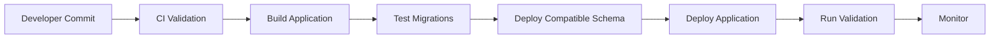
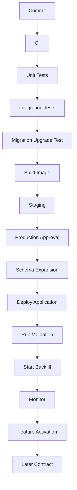

# 12- Database Deployment in CI CD

## Overview

Database deployment in CI/CD is the controlled process of validating, applying, and monitoring database schema and data changes as part of software delivery.

For a backend system, application code and database schema form a single compatibility boundary:

```text
Application
     │
     ▼
Database Contract
     │
     ▼
Schema + Data + Constraints + Indexes
```

Deploying only the application is insufficient when the application depends on a changed schema.

A production deployment therefore needs to coordinate:

- Application code
- Database migrations
- Background workers
- API contracts
- Events
- Cache behavior
- Read replicas
- Rollback strategy
- Observability

A typical pipeline is:



The central principle is:

> **Database changes should be deployed through the same controlled engineering lifecycle as application code, but with database-specific safety rules.**

---

## Why Database CI/CD Is Different

Application deployments are often replaceable:

```text
Container v1
    ↓
Container v2
    ↓
Rollback to v1
```

Database changes modify persistent state:

```text
Migration
    ↓
Persistent schema/data
    ↓
Future application versions depend on it
```

A migration may:

- Change table definitions
- Add or remove columns
- Create indexes
- Modify constraints
- Backfill data
- Rewrite tables
- Delete data
- Change query plans
- Affect replicas
- Generate large amounts of WAL

Therefore database deployment must consider **state**, not just artifact replacement.

---

## Database Deployment Architecture

A production CI/CD system may look like:

```text
Developer
   │
   ▼
Git Repository
   │
   ▼
CI Pipeline
   ├── Unit Tests
   ├── Integration Tests
   ├── Migration Validation
   ├── Build Image
   └── Security Checks
          │
          ▼
      Artifact Registry
          │
          ▼
    Deployment Pipeline
          │
      ┌───┴────────┐
      ▼            ▼
 Database       Application
 Migration      Deployment
      │            │
      └─────┬──────┘
            ▼
       PostgreSQL
            │
       ┌────┴─────┐
       ▼          ▼
   Replicas      Backup
```

The database migration should be an explicit deployment step rather than an accidental side effect of application startup.

---

## Migration Files as Code

Database migrations should live in version control.

For Django:

```text
app/
└── migrations/
    ├── 0001_initial.py
    ├── 0002_add_customer_status.py
    └── 0003_add_order_index.py
```

For Alembic:

```text
alembic/
└── versions/
    ├── 001_create_customers.py
    ├── 002_add_status.py
    └── 003_add_order_index.py
```

This provides:

- Review history
- Reproducibility
- Environment consistency
- Deployment traceability
- Rollback context
- Automated execution

A migration should be treated as a production code artifact.

---

## Migration Versioning

A deployment system should know which migration state the database is in.

Conceptually:

```text
Database
   ↓
Migration version
   ↓
Apply pending migrations
   ↓
New migration version
```

Django tracks applied migrations through its migration system.

Alembic uses a version table to identify the current revision.

The deployment pipeline should fail clearly if migration state is unexpected.

---

## CI Pipeline

A useful CI pipeline can include:

```text
Checkout
   ↓
Install dependencies
   ↓
Static checks
   ↓
Unit tests
   ↓
Create test database
   ↓
Apply migrations
   ↓
Integration tests
   ↓
Migration safety checks
   ↓
Build artifact
```

The important property is:

> **A migration that cannot build a clean database from the expected state should fail CI before reaching production.**

---

## Testing Migrations

At minimum, test:

- Fresh database creation
- Migration from previous production-like state
- Application startup after migration
- ORM queries
- Constraints
- Indexes
- Data transformations
- Migration ordering

A fresh database test answers:

```text
Can the complete migration history construct the expected schema?
```

An upgrade test answers:

```text
Can an existing database safely transition to the new state?
```

Both are important.

---

## Fresh Database vs Upgrade Testing

| Test | Validates |
|---|---|
| Fresh migration | Complete schema construction |
| Upgrade migration | Real deployment path |
| Rollback test | Recovery behavior |
| Data migration test | Transformation correctness |
| Performance test | Large-data behavior |
| Compatibility test | Old/new application coexistence |

A migration can pass a fresh-database test while failing against a real production-like database.

---

## Production-Like Migration Testing

Migration testing should use realistic characteristics where possible:

- Representative table sizes
- Existing indexes
- Existing constraints
- Realistic data distribution
- Existing application traffic patterns
- Long-running transactions
- Replica topology

For large tables, a migration that takes:

```text
2 seconds on staging
```

may take:

```text
2 hours in production
```

because staging contains only a small fraction of the production data.

---

## Migration Safety Classification

Classify migrations before deployment.

| Migration | Typical risk |
|---|---|
| Add nullable column | Low |
| Add table | Low |
| Add index | Medium |
| Add unique constraint | Medium |
| Large backfill | High |
| Large delete | High |
| Drop column | High |
| Type rewrite | High |
| Table rewrite | High |
| Table replacement | Very high |

Risk classification determines:

- Testing depth
- Deployment timing
- Approval requirements
- Monitoring
- Rollback strategy

---

## Schema Compatibility

The safest deployment sequence usually maintains compatibility between application versions.

Suppose:

```text
Application v1
Application v2
Database schema v2
```

Ideally:

```text
App v1 → Schema v2 ✓
App v2 → Schema v2 ✓
```

This allows:

```text
Deploy schema
      ↓
Deploy application
      ↓
Rollback application if necessary
```

without immediately reverting the database.

---

## Expand-and-Contract in CI/CD

For a column migration:

```text
Old schema
    ↓
Add new column
    ↓
Deploy compatible application
    ↓
Backfill
    ↓
Switch reads/writes
    ↓
Remove old column later
```

This is safer than:

```text
Drop old column
    ↓
Deploy application
```

because the old application may no longer function.

---

## Example: Adding a Column

Suppose the existing table is:

```sql
CREATE TABLE customers (
    id bigint PRIMARY KEY,
    email text NOT NULL
);
```

Add a nullable column:

```sql
ALTER TABLE customers
ADD COLUMN normalized_email text;
```

Deploy application code that can handle both states:

```text
normalized_email exists
but
normalized_email may be NULL
```

Then backfill asynchronously:

```sql
UPDATE customers
SET normalized_email = lower(trim(email))
WHERE normalized_email IS NULL
  AND id > $1
  AND id <= $2;
```

Only after validation should the migration enforce stronger assumptions.

---

## Migration Ordering

A deployment may require:

```text
1. Schema expansion
2. Application deployment
3. Data backfill
4. Validation
5. Application cutover
6. Schema contraction
```

Do not compress these into one deployment simply because the final state is simple.

The intermediate states are part of the deployment design.

---

## Kubernetes Migration Jobs

In Kubernetes, avoid making every application pod execute migrations simultaneously.

Risky pattern:

```text
Pod A ─┐
Pod B ─┤
Pod C ─┤── migrate
Pod D ─┤
Pod E ─┘
```

This can create:

- Race conditions
- Lock contention
- Duplicate migration attempts
- Deployment instability

Prefer a dedicated migration job:

```text
Deployment
   │
   ├── Migration Job
   │       ↓
   │   PostgreSQL
   │
   └── Application Pods
```

The migration job should complete successfully before incompatible application behavior is enabled.

---

## CI/CD Migration Job

Conceptually:

```yaml
apiVersion: batch/v1
kind: Job
metadata:
  name: database-migration
spec:
  template:
    spec:
      restartPolicy: Never
      containers:
        - name: migrate
          image: backend:latest
          command:
            - python
            - manage.py
            - migrate
```

Production configuration should additionally address:

- Database credentials
- Secret management
- Resource limits
- Network policies
- Retry behavior
- Observability
- Job ownership
- Deployment ordering

---

## Migration Job Ownership

Only one controlled process should normally own schema migration execution.

For example:

```text
CI/CD
  ↓
Migration Job
  ↓
PostgreSQL
```

Avoid:

```text
Every application startup
  ↓
Run migrations
```

Application startup should not become the mechanism that performs potentially expensive production schema changes.

---

## Deployment Strategies

Several strategies are common.

| Strategy | Description | Best fit |
|---|---|---|
| Migration before app | Apply DB change first | Compatible additive changes |
| App before migration | Deploy code first | Rare, only when code does not require new schema |
| Expand → app → contract | Multi-phase | Zero-downtime changes |
| Separate migration job | Independent execution | Kubernetes/CI/CD |
| Manual approval | Human gate | High-risk production changes |
| Online migration | Background/incremental | Large tables |

The correct strategy depends on compatibility and risk.

---

## Migration Before Application

For additive changes:

```text
Database
   ↓
Add column/index
   ↓
Application
   ↓
Uses new schema
```

This is usually safe when the old application can continue operating.

Example:

```text
Schema v2
   ↑
App v1 ✓
App v2 ✓
```

This provides rollback flexibility.

---

## Application Before Migration

Sometimes the application can be deployed first if it does not immediately require the new database object.

Example:

```text
Application v2
   ↓
Still uses old schema
   ↓
Migration
   ↓
Enable new behavior
```

This can be useful when feature flags control the new path.

However, application startup must not fail because the migration has not yet run.

---

## Feature Flags

Feature flags can decouple deployment from activation.

```text
Deploy code
     ↓
Feature disabled
     ↓
Migrate database
     ↓
Backfill
     ↓
Validate
     ↓
Enable feature
```

If problems occur:

```text
Disable feature
```

without immediately changing the database.

This is especially useful for high-risk application/database transitions.

---

## Database Feature Flags

Database state can also be represented by application configuration:

```text
USE_NEW_CUSTOMER_FIELDS=false
```

Then:

```text
false → old path
true  → new path
```

Keep feature-flag logic temporary and remove it after the migration stabilizes.

Permanent migration flags become operational debt.

---

## CI Migration Validation

Useful automated checks include:

```text
Migration applies
       ↓
Application starts
       ↓
Existing tests pass
       ↓
Expected schema exists
       ↓
Expected indexes exist
       ↓
Constraints behave correctly
```

For PostgreSQL, schema inspection can be automated.

Example:

```sql
SELECT
    column_name,
    data_type,
    is_nullable
FROM information_schema.columns
WHERE table_name = 'customers'
ORDER BY ordinal_position;
```

---

## Detecting Dangerous Operations

CI can flag potentially risky migration patterns:

```text
DROP COLUMN
DROP TABLE
ALTER COLUMN TYPE
Large UPDATE
Large DELETE
Non-concurrent index creation
Blocking constraint validation
```

These checks do not replace human review.

They create an early warning system.

---

## Static Migration Review

A pull request should answer:

- What schema changes?
- Why is the change needed?
- Is it backward compatible?
- Can it run online?
- Does it rewrite the table?
- Does it require a lock?
- How much data is affected?
- Is a backfill required?
- How will it be rolled back?
- What happens to replicas?

Migration review is database architecture review.

---

## Large Backfills in CI/CD

Do not automatically execute a multi-hour backfill as part of the deployment command:

```text
kubectl apply
   ↓
Migration
   ↓
500M-row UPDATE
   ↓
Deployment blocked for hours
```

Separate schema migration from data migration:

```text
Deployment
   ↓
Schema change
   ↓
Application release
   ↓
Migration worker
   ↓
Incremental backfill
```

This allows the backfill to be throttled independently.

---

## Backfill Worker

A production backfill may use:

```text
Celery
   ↓
Migration queue
   ↓
Worker
   ↓
PostgreSQL
```

The worker should support:

- Batch processing
- Idempotency
- Progress tracking
- Retries
- Throttling
- Pause/resume
- Metrics

The CI/CD pipeline should trigger or schedule the worker rather than remain blocked waiting for every row to finish.

---

## Migration Progress

For large migrations, track:

```text
Rows processed
Rows remaining
Current cursor
Batch duration
Throughput
Error count
Retry count
```

For example:

```text
Migration: normalize_customer_email

Processed: 182,000,000
Remaining: 318,000,000
Rate:      7,500 rows/sec
Errors:    12
Status:    running
```

This makes long-running migrations operationally visible.

---

## Backfill Throttling

Migration workers should respect production capacity.

Conceptually:

```text
Healthy database
      ↓
Increase throughput

High CPU / I/O
      ↓
Reduce throughput

Replica lag
      ↓
Reduce throughput

Critical database health
      ↓
Pause
```

This is safer than running unrestricted workers.

---

## Index Migrations

Large indexes require special handling.

For PostgreSQL:

```sql
CREATE INDEX CONCURRENTLY orders_customer_created_idx
ON orders (customer_id, created_at DESC);
```

For large production tables, consider:

- Disk headroom
- CPU
- I/O
- WAL
- Replica lag
- Build duration
- Lock behavior

`CREATE INDEX CONCURRENTLY` cannot run inside a transaction block.

Migration tooling must account for this.

---

## Django Migration Example

A PostgreSQL concurrent index may require a non-atomic migration:

```python
from django.db import migrations


class Migration(migrations.Migration):
    atomic = False

    operations = [
        migrations.RunSQL(
            sql="""
                CREATE INDEX CONCURRENTLY orders_customer_created_idx
                ON orders (customer_id, created_at DESC)
            """,
            reverse_sql="""
                DROP INDEX CONCURRENTLY IF EXISTS orders_customer_created_idx
            """,
        ),
    ]
```

Do not assume ORM-generated migration operations automatically provide the production-safe behavior required for large tables.

Review generated SQL.

---

## Database Credentials in CI/CD

CI/CD requires database access, but credentials should be tightly scoped.

Avoid:

```text
CI system
   ↓
Production superuser
```

Prefer:

```text
CI/CD
   ↓
Migration identity
   ↓
Required database permissions
```

Use:

- AWS IAM where applicable
- AWS Secrets Manager
- OIDC-based CI authentication
- Short-lived credentials
- Dedicated migration roles

Do not hard-code passwords in pipeline configuration.

---

## Migration and Application Roles

Separate responsibilities where practical:

```text
app_runtime
     ↓
Application queries

app_migration
     ↓
Schema changes

app_readonly
     ↓
Reporting / diagnostics
```

The runtime application should generally not have schema-modification privileges.

This reduces the blast radius of application compromise.

---

## Secrets in CI/CD

Never place database credentials directly in:

```text
Git repository
Dockerfile
Migration source code
CI logs
Pull requests
```

Use a secret manager and inject credentials only when required.

Also ensure failed migration commands do not print connection strings or secrets.

---

## Production Approval Gates

High-risk migrations may require an explicit approval stage.

Example:

```text
CI
 ↓
Tests
 ↓
Build
 ↓
Staging
 ↓
Production migration approval
 ↓
Migration
 ↓
Verification
 ↓
Application rollout
```

Use approval gates for:

- Destructive migrations
- Large backfills
- Major table rewrites
- Large indexes
- Data transformations
- Production database replacements

---

## Automated vs Manual Migrations

| Approach | Advantages | Risks |
|---|---|---|
| Fully automated | Fast, repeatable | Unsafe if checks are weak |
| Manual | Strong human control | Error-prone and inconsistent |
| Automated + approval | Balanced | Requires good pipeline design |
| Scheduled migration | Predictable workload | Requires operational ownership |

A mature organization generally automates execution while preserving appropriate controls for high-risk changes.

---

## Deployment Ordering With Workers

Workers must be compatible with the database.

Consider:

```text
Database expansion
      ↓
Application deployment
      ↓
Worker deployment
      ↓
Backfill
      ↓
Feature activation
```

Or, depending on compatibility:

```text
Database expansion
      ↓
Worker deployment
      ↓
Application deployment
```

The key requirement is that no process expects schema capabilities that do not yet exist.

---

## REST and gRPC Compatibility

Database changes can affect API behavior.

Suppose a new field is introduced:

```json
{
  "id": 123,
  "normalized_email": "user@example.com"
}
```

Old clients may not understand the field, while that is usually safe for additive response fields.

More dangerous is removing or changing existing fields:

```text
Database migration
      ↓
Application change
      ↓
REST clients
      ↓
Mobile / external systems
```

Database deployment should therefore consider the complete API compatibility chain.

---

## Kafka Schema Compatibility

Database deployments may also produce events.

```text
Database
   ↓
Outbox
   ↓
Kafka
   ↓
Consumers
```

If the migration changes event semantics, ensure consumers remain compatible.

Use:

- Additive event fields
- Explicit event versions
- Consumer compatibility testing
- Idempotent processing

A database rollback does not automatically undo already-consumed Kafka events.

---

## Redis During Deployment

Schema changes can make cached representations obsolete.

For example:

```text
PostgreSQL schema v2
       ↓
Application
       ↓
Redis cache containing schema v1 representation
```

Possible strategies include:

- Cache invalidation
- Versioned cache keys
- TTL
- Cache rebuild
- Dual-read compatibility

Cache behavior should be part of migration design.

---

## Read Replicas

Before a migration:

```text
Primary
  ├── Replica A
  └── Replica B
```

After a high-write migration:

```text
Primary
  │
  ├── High WAL generation
  │
  └────────────► Replicas
                   ↓
                Lag
```

Monitor:

- Replica lag
- Replay status
- WAL retention
- Replica query latency

A migration is not successful if the primary remains healthy while read replicas become unusable.

---

## Database Failures During Deployment

A migration can fail because of:

- Lock timeout
- Statement timeout
- Connection failure
- Database failover
- Disk exhaustion
- Constraint violation
- Deadlock
- Replica pressure
- Application incompatibility

The pipeline should surface the failure clearly and avoid automatically executing unrelated recovery actions.

---

## Retry Behavior

Retries require special care.

Safe:

```text
Idempotent migration step
     ↓
Retry
```

Dangerous:

```text
Partially executed data transformation
     ↓
Automatic retry
     ↓
Duplicate / incorrect mutation
```

Migration retries should be based on known state.

For large backfills:

```text
Batch transaction
     ↓
Failure
     ↓
Rollback batch
     ↓
Retry batch
```

This is much easier to reason about than one enormous transaction.

---

## Migration Rollback

The pipeline should know whether a migration is:

- Reversible
- Roll-forward only
- Data destructive
- Restore dependent

Example:

```text
Add nullable column
    ↓
Easy schema rollback

Drop column
    ↓
Potential data loss

Large delete
    ↓
Restore / reconciliation may be required
```

Never assume that a generated "down migration" fully restores production state.

---

## Roll-Forward Is Often Safer

Suppose:

```text
Migration A
   ↓
Bug discovered
```

Instead of:

```text
Migration A
   ↓
Complex reverse
```

a corrective migration may be safer:

```text
Migration A
   ↓
Migration B
   ↓
Correct state
```

This is especially true after:

- Data backfills
- Event publication
- Cache updates
- External integrations

---

## Blue-Green Application Deployment

Application blue-green deployment can coexist with database compatibility.

```text
             PostgreSQL
                 │
        ┌────────┴────────┐
        ▼                 ▼
   Application Blue   Application Green
```

The database must support both versions during the transition.

This is another reason schema changes should usually be backward compatible.

---

## Canary Deployment

For risky changes:

```text
Migration
   ↓
Application deployment
   ↓
1% traffic
   ↓
Observe
   ↓
10%
   ↓
50%
   ↓
100%
```

Observe:

- API latency
- Database query latency
- Error rates
- CPU
- I/O
- Lock waits
- Replica lag

Database migrations should be evaluated together with application behavior.

---

## Observability

Every production migration should produce identifiable telemetry.

Useful fields:

```text
migration_name
migration_version
deployment_id
application_version
environment
start_time
end_time
duration
status
```

Metrics should include:

```text
migration_duration
migration_failures
migration_rows_processed
migration_batch_duration
migration_retry_count
```

Logs should include enough context to correlate migration activity with application incidents.

---

## Database Monitoring

Monitor:

### Resource

- CPU
- Memory
- I/O
- Storage
- Connections

### Query

- Query latency
- Slow queries
- Query volume
- Plan changes

### Concurrency

- Lock waits
- Deadlocks
- Long transactions

### Replication

- Replica lag
- WAL generation
- Replay delay

### Migration

- Progress
- Throughput
- Errors
- Retries

---

## Migration SLOs

For important migration systems, define operational expectations.

Examples:

```text
Maximum migration duration
Maximum acceptable replica lag
Maximum API latency increase
Maximum migration error rate
Maximum lock wait
```

This turns migration execution into an observable operational process.

---

## CI/CD Pipeline Example

A mature deployment may look like:



This separates deployment phases so each has a clear responsibility.

---

## GitHub Actions Example

A simplified workflow could be:

```yaml
name: Deploy

on:
  push:
    branches:
      - main

jobs:
  test:
    runs-on: ubuntu-latest
    steps:
      - uses: actions/checkout@v4

      - name: Install dependencies
        run: pip install -r requirements.txt

      - name: Run tests
        run: pytest

      - name: Validate migrations
        run: python manage.py makemigrations --check

  deploy:
    needs: test
    runs-on: ubuntu-latest
    steps:
      - uses: actions/checkout@v4

      - name: Deploy application
        run: ./scripts/deploy.sh
```

A production workflow would add controlled database migration execution, secret management, environment approvals, deployment verification, and rollback handling.

---

## Migration Verification

After applying migrations, verify expected state.

For Django:

```bash
python manage.py showmigrations
```

For PostgreSQL:

```sql
SELECT
    current_database(),
    current_user;
```

Then verify schema-specific expectations.

For example:

```sql
SELECT
    column_name,
    data_type
FROM information_schema.columns
WHERE table_name = 'customers'
  AND column_name = 'normalized_email';
```

Verification should fail the deployment if the expected state is absent.

---

## Health Checks

Application health should include database compatibility.

For example:

```text
Liveness
   ↓
Process is running

Readiness
   ↓
Application can serve traffic safely
   ↓
Database contract is compatible
```

Do not make liveness checks dependent on expensive database queries.

Readiness checks should also have bounded timeouts.

---

## Deployment Failure Handling

If migration succeeds but application deployment fails:

```text
Database schema remains v2
Application rollback to v1
```

This is safe only if:

```text
App v1 → Schema v2
```

is supported.

If not, the deployment design has created a rollback trap.

This is one of the strongest arguments for backward-compatible database changes.

---

## Disaster Recovery

CI/CD database deployment must not bypass backup and recovery processes.

For high-risk changes:

- Verify recent backups
- Confirm PITR availability
- Know the recovery owner
- Understand RPO/RTO
- Know whether restoration is practical
- Test recovery separately

For destructive changes, explicitly document whether recovery requires:

```text
Application rollback
Corrective migration
Selective data repair
PITR
Full restore
```

---

## Security Considerations

CI/CD database deployment has privileged access.

Use:

- Dedicated migration identities
- Least privilege
- Secret managers
- Short-lived credentials
- Audit logs
- Environment isolation
- Production approval controls

Never give normal application containers unrestricted schema-management privileges simply because migrations need them.

---

## Multi-Environment Strategy

A common progression is:

```text
Developer
   ↓
CI database
   ↓
Staging
   ↓
Production
```

Each environment should apply the same migration history.

Avoid manually modifying production schema outside version control unless handling an emergency.

Manual emergency changes should subsequently be reconciled into the migration history.

---

## Schema Drift

Schema drift occurs when environments no longer match expected migration state.

Example:

```text
Git migration state
        ≠
Production schema
```

Causes include:

- Manual SQL changes
- Failed deployments
- Partial migrations
- Environment-specific modifications
- Incorrect migration history

Drift makes future deployments unpredictable.

Detect it early.

---

## Production Schema Drift Response

If drift is discovered:

```text
Detect
  ↓
Stop automatic changes
  ↓
Inspect actual schema
  ↓
Compare migration history
  ↓
Determine source of drift
  ↓
Create reconciliation plan
  ↓
Restore controlled state
```

Do not simply rerun migrations blindly.

---

## Migration Concurrency

Only one migration process should normally be responsible for changing schema at a time.

A deployment system may need:

```text
Deployment A
   ↓
Migration lock
   ↓
Migration
   ↓
Release lock
```

The database itself may serialize certain migration operations through locks, but CI/CD should still avoid deliberately running competing migration jobs.

---

## Database Deployment in Microservices

With database-per-service:

```text
Service A → Database A
Service B → Database B
Service C → Database C
```

Each service can own its schema lifecycle.

This reduces cross-service schema coupling.

With a shared database:

```text
Service A ─┐
Service B ─┼── PostgreSQL
Service C ─┘
```

database deployment becomes more difficult because multiple services may depend on the same schema.

Schema ownership should be explicit.

---

## Database-per-Service CI/CD

A mature architecture can have:

```text
Service A pipeline
   ↓
Migration A
   ↓
Database A

Service B pipeline
   ↓
Migration B
   ↓
Database B
```

This aligns schema ownership with service ownership.

Cross-service database access should be minimized because it creates deployment coupling.

---

## Migration Dependency Graph

Migration dependencies can become complex:

```text
Migration A
   ↓
Migration B
   ├── Migration C
   └── Migration D
          ↓
      Migration E
```

CI should detect:

- Conflicting migrations
- Missing dependencies
- Branch merge problems
- Duplicate migration identifiers
- Unexpected ordering

Framework tooling should be used to validate the migration graph.

---

## Migration Squashing

Long-lived projects can accumulate many migrations.

Squashing can simplify migration history, but should be done carefully.

Consider:

- Existing production databases
- Deployment state
- Old environments
- CI test databases
- Rollback procedures

Never rewrite migration history casually once it is relied upon by deployed environments.

---

## Operational Maintenance Windows

Some migrations cannot safely run during peak traffic.

Schedule them according to:

```text
Traffic
+
Database headroom
+
Replica capacity
+
Business requirements
```

For high-availability systems, prefer online strategies where practical rather than assuming a maintenance window will always be available.

---

## Cost Considerations

CI/CD database deployment can increase costs through:

- Temporary migration workers
- Additional staging databases
- Larger database instances for migrations
- Storage growth
- WAL retention
- Replica capacity
- Monitoring infrastructure

Do not permanently overprovision production solely because one migration occasionally requires more resources.

For large one-time operations, controlled temporary capacity may be more economical.

---

## Common Mistakes

### Running Migrations From Every Application Pod

**Problem:** Multiple pods may execute the same migration concurrently.

**Better:** Use a dedicated migration job.

### Giving the Runtime Role DDL Privileges

**Problem:** Application compromise gains schema modification capability.

**Better:** Separate runtime and migration identities.

### Running Large Backfills During Deployment

**Problem:** Deployment becomes long-running and database load becomes difficult to control.

**Better:** Separate schema migration from asynchronous backfill.

### Testing Only Fresh Databases

**Problem:** Production upgrades an existing database, not an empty one.

**Better:** Test upgrade paths against realistic schemas and data.

### Assuming Generated Migrations Are Safe

**Problem:** ORM migration generation does not understand every production workload implication.

**Better:** Review generated SQL and operational behavior.

### Automatically Running Migrations on Startup

**Problem:** Application startup becomes coupled to potentially expensive database operations.

**Better:** Use explicit migration jobs.

### Using Production Superuser Credentials in CI

**Problem:** Pipeline compromise can become complete database compromise.

**Better:** Use dedicated least-privileged migration identities.

### Ignoring Replica Lag

**Problem:** Primary remains healthy while replicas become stale.

**Better:** Include replication in migration monitoring and stop criteria.

### Treating Rollback as Guaranteed

**Problem:** Destructive data changes may not be reversible.

**Better:** Define rollback, roll-forward, and recovery strategies before deployment.

### Ignoring Workers

**Problem:** Celery workers may run incompatible code against the new schema.

**Better:** Treat workers as part of the deployment compatibility matrix.

### Ignoring Events

**Problem:** Kafka consumers may process state that cannot be undone by database rollback.

**Better:** Design event compatibility and compensation strategies.

### Allowing Schema Drift

**Problem:** Migration history no longer represents production reality.

**Better:** Detect and reconcile drift quickly.

---

## Production CI/CD Checklist

### CI

- [ ] Migration files are version controlled
- [ ] Fresh database migrations pass
- [ ] Upgrade migrations pass
- [ ] Integration tests pass
- [ ] Dangerous migration patterns are reviewed
- [ ] Migration dependencies are valid
- [ ] Security checks pass

### Pre-Production

- [ ] Production-like data volume tested where necessary
- [ ] Execution time estimated
- [ ] Lock behavior evaluated
- [ ] Disk headroom checked
- [ ] WAL impact considered
- [ ] Replica impact evaluated
- [ ] Rollback strategy documented
- [ ] Recovery path documented

### Production

- [ ] Correct migration identity configured
- [ ] Secrets retrieved securely
- [ ] Migration job is controlled
- [ ] Application compatibility verified
- [ ] Migration progress monitored
- [ ] Database health monitored
- [ ] Replica health monitored
- [ ] Application health monitored
- [ ] Stop criteria defined

### Post-Deployment

- [ ] Schema verified
- [ ] Application smoke tests pass
- [ ] Query performance checked
- [ ] Error rates checked
- [ ] Replica lag normalized
- [ ] Backfill status verified
- [ ] Feature enabled only after validation
- [ ] Transitional schema retained until safe to remove

---

## Senior-Level Design Principles

A senior backend engineer should treat database deployment as a **state transition system**.

Instead of:

```text
Deploy application
   ↓
Run migrations
   ↓
Done
```

think:

```text
State A
  ↓
Compatible State B
  ↓
Data Migration
  ↓
Validated State C
  ↓
Application Cutover
  ↓
Contracted State D
```

Each state should have:

- Known schema
- Known application compatibility
- Known operational behavior
- Known recovery strategy

This makes deployment predictable even when individual operations fail.

---

## Production Deployment Model

A strong default architecture is:

```text
Git
 │
 ▼
CI
 ├── Test
 ├── Migration validation
 ├── Security checks
 └── Build
 │
 ▼
Artifact
 │
 ▼
Staging
 │
 ▼
Approval
 │
 ▼
Migration Job
 │
 ▼
Schema Expansion
 │
 ▼
Application Deployment
 │
 ▼
Validation
 │
 ▼
Backfill Worker
 │
 ▼
Feature Activation
 │
 ▼
Observation
 │
 ▼
Schema Contraction
```

The most important property is that expensive, risky, or destructive operations are separated from the critical application rollout whenever possible.

---

## Key Takeaways

- **Treat database migrations as version-controlled deployment artifacts:** validate fresh and upgrade paths in CI, review generated SQL, and maintain explicit schema ownership.
- **Design CI/CD around backward-compatible state transitions:** expand the schema, deploy compatible application versions, backfill and validate, activate behavior, then contract old structures later.
- **Use dedicated migration execution:** a controlled CI/CD or Kubernetes migration job with least-privileged credentials is safer than allowing every application pod to modify the schema.
- **Separate large data operations from deployment:** run backfills as observable, idempotent, throttled workloads rather than blocking application deployment on massive transactions.
- **Make database health part of deployment success:** monitor locks, CPU, I/O, connections, WAL, replication lag, query latency, application errors, and migration progress throughout the rollout.