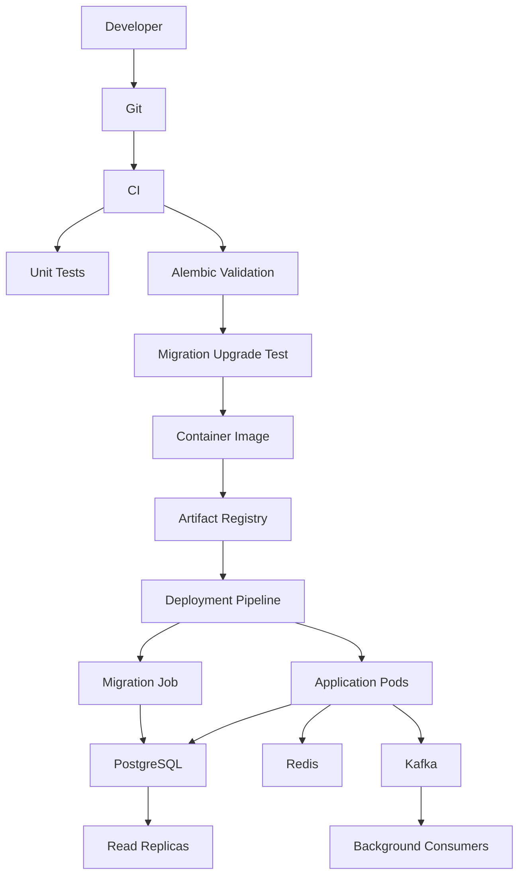

# 13- SQLAlchemy and Alembic Migrations

## Overview

SQLAlchemy provides Python applications with a database abstraction and SQL toolkit, while Alembic provides schema migration management for SQLAlchemy-based systems.

A common production stack is:

```text
FastAPI
   │
   ▼
SQLAlchemy
   │
   ▼
psycopg
   │
   ▼
PostgreSQL
```

with Alembic managing schema evolution:

```text
Git
 │
 ▼
Alembic Migration Files
 │
 ▼
Migration Job
 │
 ▼
PostgreSQL Schema
```

The important distinction is:

> **SQLAlchemy manages application/database interaction; Alembic manages database schema evolution.**

SQLAlchemy models describe the application's intended data structures, but models alone do not safely change an existing production database.

Alembic provides versioned migration scripts that can be reviewed, tested, executed, and tracked across environments.

---

## SQLAlchemy and Alembic Responsibilities

| Component | Responsibility |
|---|---|
| SQLAlchemy Engine | Database connectivity and connection pooling |
| SQLAlchemy Session | Unit of work and transaction management |
| SQLAlchemy ORM | Mapping Python objects to relational data |
| SQLAlchemy Core | SQL expressions and database operations |
| SQLAlchemy Models | Application-side schema representation |
| Alembic | Database schema migration management |
| PostgreSQL | Persistent schema, data, constraints, indexes, transactions |

A useful mental model is:

```text
SQLAlchemy Model
      │
      │ describes
      ▼
Application Data Model
      │
      │ migrated by
      ▼
Alembic
      │
      │ executes SQL against
      ▼
PostgreSQL Schema
```

---

## Why Alembic Exists

Suppose a model initially contains:

```python
class Customer(Base):
    __tablename__ = "customers"

    id: Mapped[int] = mapped_column(primary_key=True)
    email: Mapped[str]
```

Later, the application requires:

```python
status: Mapped[str]
```

Changing the Python model does not automatically alter the production table.

Without a migration system:

```text
Developer changes model
        ↓
Production database unchanged
        ↓
Application expects column
        ↓
Runtime failure
```

Alembic creates an explicit schema transition:

```text
Schema v1
   ↓
Alembic revision
   ↓
Schema v2
```

---

## Alembic Migration Architecture

A typical project:

```text
project/
├── app/
│   ├── models/
│   ├── api/
│   └── db/
├── alembic/
│   ├── versions/
│   │   ├── 001_create_customers.py
│   │   └── 002_add_customer_status.py
│   ├── env.py
│   └── script.py.mako
├── alembic.ini
└── pyproject.toml
```

The important files are:

| File | Purpose |
|---|---|
| `alembic.ini` | Alembic configuration |
| `alembic/env.py` | Migration runtime configuration |
| `alembic/versions/` | Versioned migration scripts |
| `script.py.mako` | Migration file template |

---

## Initializing Alembic

A project can initialize Alembic with:

```bash
alembic init alembic
```

This creates the migration environment.

The generated `env.py` must be configured to know about the application's SQLAlchemy metadata.

For example:

```python
from alembic import context

from app.db.base import Base

target_metadata = Base.metadata
```

The exact project structure may differ, but the important requirement is that Alembic can inspect the application's metadata for autogeneration.

---

## SQLAlchemy Declarative Models

Modern SQLAlchemy supports typed declarative mappings.

Example:

```python
from sqlalchemy import String
from sqlalchemy.orm import DeclarativeBase, Mapped, mapped_column


class Base(DeclarativeBase):
    pass


class Customer(Base):
    __tablename__ = "customers"

    id: Mapped[int] = mapped_column(primary_key=True)
    email: Mapped[str] = mapped_column(String(320), nullable=False)
```

The model describes the desired application-side schema.

It does **not** mean that the production database has already been changed.

---

## Creating a Migration

After a model change:

```bash
alembic revision --autogenerate -m "add customer status"
```

Alembic compares metadata with the current database schema and generates a candidate migration.

For example:

```python
def upgrade() -> None:
    op.add_column(
        "customers",
        sa.Column("status", sa.String(length=32), nullable=True),
    )


def downgrade() -> None:
    op.drop_column("customers", "status")
```

This generated migration must be reviewed.

> **Autogenerate is a migration assistant, not an automatic production-safety mechanism.**

---

## Autogenerate Limitations

Alembic can detect many schema differences, but it cannot reliably infer every semantic database change.

Potentially problematic areas include:

- Data migrations
- Renames
- Complex constraints
- Custom SQL
- PostgreSQL-specific features
- Partial indexes
- Complex expressions
- Some server-side defaults
- Changes whose intent cannot be inferred from metadata

For example, renaming:

```text
old_email → email
```

may be interpreted as:

```text
DROP old_email
ADD email
```

rather than:

```text
RENAME COLUMN old_email TO email
```

That could cause data loss.

Always inspect generated migrations.

---

## Migration Revisions

Each Alembic revision contains identifiers such as:

```python
revision = "8a7d2c1e4f10"
down_revision = "31f5a7c2d901"
```

This creates a migration graph:

```text
31f5a7c2d901
       │
       ▼
8a7d2c1e4f10
       │
       ▼
next_revision
```

The `down_revision` establishes dependency ordering.

---

## Migration Graphs

Migration history is a graph rather than simply a collection of files.

A normal sequence:

```text
A → B → C → D
```

A team working on separate branches may temporarily create:

```text
       ┌→ B → C
A ─────┤
       └→ D
```

This creates multiple heads.

Check migration state with:

```bash
alembic heads
```

A multiple-head situation may require merging revisions.

---

## Applying Migrations

Apply all pending migrations:

```bash
alembic upgrade head
```

Move to a specific revision:

```bash
alembic upgrade 8a7d2c1e4f10
```

Move backward:

```bash
alembic downgrade -1
```

or:

```bash
alembic downgrade <revision>
```

The production safety of a downgrade depends entirely on the migration and the data state.

---

## Checking Current Revision

Use:

```bash
alembic current
```

View migration history:

```bash
alembic history
```

View heads:

```bash
alembic heads
```

A production deployment should know both:

```text
Expected revision
       vs
Actual database revision
```

Unexpected divergence should be investigated before applying further migrations.

---

## Alembic Version Table

Alembic stores migration state in a version table, commonly:

```text
alembic_version
```

Conceptually:

```text
PostgreSQL
 ├── application tables
 ├── indexes
 ├── constraints
 └── alembic_version
```

The version table tells Alembic which revision has been applied.

It is migration metadata, not a complete description of the actual schema.

Manual schema changes can therefore create schema drift even when `alembic_version` appears correct.

---

## Migration Transactions

Alembic can execute migrations within transactions depending on configuration and the database operations involved.

For PostgreSQL, many DDL operations are transactional.

For example:

```sql
BEGIN;

ALTER TABLE customers
ADD COLUMN status text;

ROLLBACK;
```

The schema change is rolled back.

However, PostgreSQL operations such as:

```sql
CREATE INDEX CONCURRENTLY ...
```

cannot run inside a transaction block.

Migration design must therefore account for operation-specific transaction requirements.

---

## Data Migrations

Schema migrations and data migrations are different workloads.

Schema:

```python
def upgrade() -> None:
    op.add_column(
        "customers",
        sa.Column("normalized_email", sa.String(length=320)),
    )
```

Data:

```sql
UPDATE customers
SET normalized_email = lower(trim(email))
WHERE normalized_email IS NULL;
```

For small tables, combining them may be acceptable.

For large production tables, prefer:

```text
Schema migration
      ↓
Deploy compatible application
      ↓
Incremental backfill
      ↓
Validation
      ↓
Constraint/cutover migration
```

---

## Large Backfills

Avoid embedding a massive update directly into a deployment migration:

```text
alembic upgrade head
       ↓
500M-row UPDATE
       ↓
Deployment blocked
       ↓
Database under heavy load
```

Instead:

```text
Alembic
  ↓
Add column
  ↓
Application deployment
  ↓
Background backfill
  ↓
Validation
```

The backfill can be implemented through:

- Celery
- Kubernetes Jobs
- Dedicated workers
- Controlled operational scripts

---

## Batch Backfill

Use indexed keyset progression rather than large OFFSET-based scans.

For example:

```sql
UPDATE customers
SET normalized_email = lower(trim(email))
WHERE id > :last_id
  AND id <= :batch_end
  AND normalized_email IS NULL;
```

A production backfill should support:

- Bounded batches
- Idempotency
- Progress tracking
- Retry
- Pause/resume
- Throttling
- Metrics

Alembic should establish the schema needed by the backfill rather than necessarily performing the entire operation itself.

---

## Expand-and-Contract With Alembic

A safe multi-release migration may look like:

```text
Release A
   ↓
Alembic: add new column
   ↓
Release B
   ↓
Application writes both
   ↓
Backfill
   ↓
Release C
   ↓
Application reads new column
   ↓
Release D
   ↓
Alembic: remove old column
```

This approach provides compatibility between application versions and reduces rollback risk.

---

## SQLAlchemy Sessions and Transactions

SQLAlchemy's `Session` manages ORM state and transaction boundaries.

A common application pattern is:

```python
from sqlalchemy.orm import Session


def create_customer(session: Session, email: str) -> Customer:
    customer = Customer(email=email)
    session.add(customer)
    session.commit()
    session.refresh(customer)
    return customer
```

In production applications, transaction ownership should usually be defined at the service/request boundary rather than scattered throughout repository methods.

For example:

```text
API request
    ↓
Service layer
    ↓
Transaction
 ┌──┴─────────────┐
 ▼                ▼
Insert customer  Insert audit event
 └──────┬─────────┘
        ▼
      Commit
```

---

## FastAPI Integration

A common FastAPI structure is:

```text
FastAPI
   ↓
Dependency
   ↓
SQLAlchemy Session
   ↓
PostgreSQL
```

A session dependency might look like:

```python
from collections.abc import Generator

from sqlalchemy.orm import Session


def get_db() -> Generator[Session, None, None]:
    with Session(engine) as session:
        yield session
```

The application should establish clear rules for:

- Session lifetime
- Transaction boundaries
- Commit behavior
- Rollback behavior
- Exception handling

---

## Engine and Connection Pooling

SQLAlchemy's engine manages database connections and pooling.

Example:

```python
from sqlalchemy import create_engine

engine = create_engine(
    "postgresql+psycopg://user:password@db:5432/app",
    pool_size=10,
    max_overflow=5,
    pool_timeout=10,
    pool_recycle=1800,
    pool_pre_ping=True,
)
```

Important considerations:

- `pool_size` controls persistent pooled connections
- `max_overflow` allows temporary additional connections
- `pool_timeout` limits waiting for a pool connection
- `pool_pre_ping` detects stale connections
- Aggregate pool capacity must be calculated across all application processes and pods

For large Kubernetes deployments, blindly giving every pod a large pool can exhaust PostgreSQL.

---

## Async SQLAlchemy

FastAPI applications may use SQLAlchemy's async APIs.

Example:

```python
from sqlalchemy.ext.asyncio import AsyncSession, async_sessionmaker, create_async_engine

engine = create_async_engine(
    "postgresql+psycopg://user:password@db:5432/app",
    pool_size=10,
    max_overflow=5,
)

SessionLocal = async_sessionmaker(
    engine,
    class_=AsyncSession,
    expire_on_commit=False,
)
```

The important design issue is not simply synchronous vs asynchronous APIs.

The system must still control:

```text
Concurrency
+
Connection count
+
Transaction duration
+
Query latency
```

Async code can increase concurrency and therefore amplify database pressure if pool sizing is poorly designed.

---

## Migration Configuration and Database URLs

Avoid hard-coding production credentials in:

```text
alembic.ini
Git
Migration files
Dockerfiles
```

Prefer environment-specific configuration:

```text
CI/CD
  ↓
Secret manager
  ↓
Environment
  ↓
Alembic
  ↓
PostgreSQL
```

For example, `env.py` can obtain the database URL from environment-specific configuration rather than committing credentials.

---

## Environment Separation

Use separate databases or database identities for:

```text
Development
Staging
Production
```

Migration history should be consistent across environments:

```text
Development → Revision C
Staging     → Revision C
Production  → Revision C
```

Environment-specific manual schema changes should be avoided.

---

## Migration Configuration

A deployment can inject:

```text
DATABASE_URL
```

into the migration environment.

For example:

```bash
export DATABASE_URL="postgresql+psycopg://..."
alembic upgrade head
```

Production pipelines should obtain the value securely rather than storing it in source control.

---

## Production Migration Jobs

For Kubernetes, use a dedicated migration Job:

```text
CI/CD
  │
  ▼
Migration Job
  │
  ▼
Alembic
  │
  ▼
PostgreSQL
```

Do not normally let every application pod run:

```bash
alembic upgrade head
```

during startup.

Otherwise:

```text
Pod A ─┐
Pod B ─┤
Pod C ─┼── Alembic
Pod D ─┤
Pod E ─┘
```

can create unnecessary concurrency and deployment coupling.

---

## CI/CD Deployment Flow

A production pipeline can use:

```mermaid
flowchart LR
    A[Git Commit] --> B[CI]
    B --> C[Tests]
    C --> D[Migration Validation]
    D --> E[Build Image]
    E --> F[Staging]
    F --> G[Production Approval]
    G --> H[Alembic Migration Job]
    H --> I[Schema Validation]
    I --> J[Application Deployment]
    J --> K[Smoke Tests]
    K --> L[Monitoring]
```



For compatible migrations, schema changes can often be applied before the application rollout.

---

## Migration Validation in CI

Useful checks include:

```bash
alembic check
```

This can detect whether model metadata and migration state indicate unapplied autogenerate changes.

Also test:

```bash
alembic upgrade head
```

against a clean test database.

For upgrade-path testing, start with a database at a previous revision and apply the pending migrations.

---

## Fresh Database Testing

A clean database test validates:

```text
Base schema
   ↓
Migration A
   ↓
Migration B
   ↓
Migration C
   ↓
Expected final schema
```

This catches:

- Broken migration ordering
- Missing dependencies
- Invalid SQL
- Incorrect metadata imports
- Migration graph problems

---

## Upgrade Testing

Production rarely starts with an empty database.

Test:

```text
Production-like schema v1
       ↓
Alembic upgrade
       ↓
Schema v2
```

This is especially important for:

- Large tables
- Existing constraints
- Existing indexes
- Existing data
- Legacy schema states

---

## Downgrade Testing

A downgrade can be tested with:

```bash
alembic downgrade -1
```

But downgrade tests do not prove production data is recoverable.

For example:

```text
ADD COLUMN
```

may be reversible.

But:

```text
DROP COLUMN containing data
```

is not meaningfully reversible merely because the column can be recreated.

Treat downgrade support as a property of the specific migration.

---

## Migration Review

Every Alembic migration should be reviewed for:

- Generated SQL
- Lock behavior
- Transaction behavior
- Data impact
- Index impact
- Constraint validation
- Replica impact
- Backward compatibility
- Rollback strategy

Useful command:

```bash
alembic upgrade head --sql
```

This generates SQL for inspection without applying the migration.

It is particularly useful during review and release preparation.

---

## Autogenerated Migration Review

Suppose Alembic produces:

```python
op.drop_column("customers", "email")
op.add_column(
    "customers",
    sa.Column("contact_email", sa.String(), nullable=True),
)
```

If the intended operation was a rename, this is dangerous.

The migration should instead express the intended operation explicitly, for example:

```python
op.alter_column(
    "customers",
    "email",
    new_column_name="contact_email",
)
```

The exact operation should be reviewed against the target PostgreSQL behavior and deployment requirements.

---

## PostgreSQL-Specific Operations

Alembic supports arbitrary SQL through `op.execute()`.

Example:

```python
def upgrade() -> None:
    op.execute(
        """
        UPDATE customers
        SET normalized_email = lower(trim(email))
        WHERE normalized_email IS NULL
        """
    )
```

This is useful when SQLAlchemy's generic schema operations are insufficient.

However, PostgreSQL-specific SQL creates tighter database coupling.

That is often acceptable when PostgreSQL is an intentional platform choice.

---

## Concurrent Index Creation

For a production PostgreSQL table:

```python
from alembic import op


def upgrade() -> None:
    op.execute(
        """
        CREATE INDEX CONCURRENTLY IF NOT EXISTS
        orders_customer_created_idx
        ON orders (customer_id, created_at DESC)
        """
    )
```

Because `CREATE INDEX CONCURRENTLY` cannot execute inside a transaction block, the migration must be configured appropriately.

A migration may use:

```python
from alembic import op


def upgrade() -> None:
    op.execute(
        """
        CREATE INDEX CONCURRENTLY IF NOT EXISTS
        orders_customer_created_idx
        ON orders (customer_id, created_at DESC)
        """
    )


def downgrade() -> None:
    op.execute(
        """
        DROP INDEX CONCURRENTLY IF EXISTS orders_customer_created_idx
        """
    )
```

Production index deployment should additionally consider disk, WAL, replication, duration, and failure recovery.

---

## Constraints

Constraints should be deployed carefully on large tables.

For example:

```sql
ALTER TABLE orders
ADD CONSTRAINT orders_total_positive
CHECK (total_amount >= 0);
```

For large existing tables, immediate validation may cause significant work.

PostgreSQL supports adding certain constraints as `NOT VALID` and validating them separately.

Conceptually:

```text
Add constraint
      ↓
Existing rows not immediately scanned
      ↓
Validate later
      ↓
Constraint fully trusted for future rows
```

This can be useful for large production systems.

---

## Foreign Keys

Foreign-key deployment requires attention to:

- Existing invalid data
- Lock behavior
- Indexing
- Large table size
- Write traffic

A foreign key may also affect delete/update behavior.

Before deploying:

```text
Parent table
     ↓
Referenced key
     ↓
Child table
```

verify existing data and appropriate indexes.

---

## Naming Conventions

Alembic works better with consistent naming conventions.

SQLAlchemy can define naming conventions through `MetaData`:

```python
from sqlalchemy import MetaData
from sqlalchemy.orm import DeclarativeBase


convention = {
    "ix": "ix_%(column_0_label)s",
    "uq": "uq_%(table_name)s_%(column_0_name)s",
    "ck": "ck_%(table_name)s_%(constraint_name)s",
    "fk": "fk_%(table_name)s_%(column_0_name)s_%(referred_table_name)s",
    "pk": "pk_%(table_name)s",
}


class Base(DeclarativeBase):
    metadata = MetaData(naming_convention=convention)
```

Consistent names make migrations, troubleshooting, and schema inspection easier.

---

## Migration Branching

Multiple developers can create migrations simultaneously.

Example:

```text
main
 │
 ├── Feature A → revision A
 │
 └── Feature B → revision B
```

After merging, Alembic may have:

```text
       ┌── A
Base ──┤
       └── B
```

Use:

```bash
alembic heads
```

to detect multiple heads.

A merge revision can reconcile them when appropriate.

---

## Migration Merge Conflicts

Do not resolve migration conflicts by arbitrarily editing revision identifiers.

Review:

```text
Revision graph
+
Actual database state
+
Dependency ordering
```

The resulting migration graph must represent a valid sequence of schema transitions.

---

## Multiple Services and Alembic

With database-per-service architecture:

```text
Service A
   ↓
Alembic
   ↓
Database A

Service B
   ↓
Alembic
   ↓
Database B
```

Each service can independently own its migration lifecycle.

With a shared database:

```text
Service A ─┐
Service B ─┼── PostgreSQL
Service C ─┘
```

migration coordination becomes significantly more difficult.

Avoid having unrelated services independently modify shared tables.

---

## Microservice Schema Ownership

A useful rule is:

> **The service that owns the data should own its schema migrations.**

Other services should generally interact through:

- REST
- gRPC
- Kafka
- Explicit integration contracts

rather than directly modifying another service's tables.

This reduces deployment coupling.

---

## Redis and Alembic

Alembic changes PostgreSQL schema, not Redis data structures.

If an application changes:

```text
PostgreSQL representation
        +
Redis cache representation
```

the deployment must handle both.

Example:

```text
Alembic
  ↓
New column
  ↓
Application
  ↓
New cache representation
```

Cache invalidation or versioned cache keys may be required.

---

## Kafka and Alembic

A database migration may affect event generation.

Example:

```text
PostgreSQL
    ↓
Outbox
    ↓
Kafka
    ↓
Consumers
```

If an application changes event payloads or semantics at the same time as a database migration, ensure:

- Producer compatibility
- Consumer compatibility
- Event versioning
- Idempotency
- Deployment ordering

Alembic cannot roll back events already consumed by external systems.

---

## Celery and Alembic

Celery workers must remain compatible with the database schema.

Example:

```text
Schema expansion
      ↓
Deploy compatible worker
      ↓
Backfill
      ↓
Switch behavior
      ↓
Contract schema
```

If old workers remain active during deployment, the expanded schema should not break their queries.

---

## Docker

A migration image should use the same application dependencies as the application where practical.

For example:

```text
Docker Image
 ├── FastAPI
 ├── SQLAlchemy
 ├── Alembic
 ├── psycopg
 └── Application code
```

This reduces differences between CI, migration execution, and runtime environments.

---

## AWS Deployment

A typical AWS architecture might be:

```text
GitHub
   ↓
CI/CD
   ↓
Container Registry
   ↓
ECS / EKS
   │
   ├── Migration Job
   │
   └── Application
   │
   ▼
RDS / Aurora PostgreSQL
```

Consider:

- RDS/Aurora capacity
- Storage
- I/O
- CPU
- Connections
- Replica lag
- Backup/PITR
- Multi-AZ failover
- Migration execution time

Large migrations can generate substantial WAL and affect replicas.

---

## Database Failover During Migration

A migration may encounter a PostgreSQL failover:

```text
Alembic
   ↓
Primary
   ↓
Failover
   ↓
New primary
   ↓
Connection failure
```

The migration process may not know whether its last operation committed.

Do not blindly retry non-idempotent data changes.

Recovery should first determine:

```text
Did the transaction commit?
What revision does Alembic report?
What schema actually exists?
```

Then continue from the known state.

---

## Connection Pooling During Migrations

Migration processes should use controlled database concurrency.

Do not create a large SQLAlchemy pool for a one-shot migration job.

The migration workload usually needs:

```text
Migration process
      ↓
Small connection footprint
      ↓
PostgreSQL
```

while application traffic continues using its own connection pools.

---

## Migration Locks and Deployment Concurrency

A deployment platform may accidentally launch:

```text
Migration Job A
Migration Job B
```

simultaneously.

Use deployment orchestration to ensure a single migration owner.

PostgreSQL locking can protect certain schema operations, but relying on database contention as deployment coordination is undesirable.

---

## Migration Timeouts

Production migrations should consider:

- `lock_timeout`
- `statement_timeout`
- Connection timeout
- CI/CD job timeout

For example, PostgreSQL can reject operations that wait too long for a lock.

The objective is to fail predictably rather than allowing a migration to block production indefinitely.

---

## Monitoring Migrations

Monitor during execution:

### Database

- CPU
- Memory
- I/O
- Connections
- Locks
- Deadlocks
- WAL generation

### Replication

- Replica lag
- Replay delay
- WAL retention

### Application

- Error rate
- p95/p99 latency
- Request throughput

### Migration

- Duration
- Progress
- Rows processed
- Failures
- Retries

Migration observability should be correlated with deployment identifiers.

---

## Logging

A migration should log:

```text
migration revision
deployment ID
environment
start time
end time
status
duration
```

Avoid logging:

- Passwords
- Connection strings
- Tokens
- Sensitive row contents

Migration SQL can contain sensitive information depending on how it is constructed.

---

## Migration Performance

Migration performance depends on:

```text
Operation cost
+
Table size
+
Indexes
+
Lock behavior
+
WAL generation
+
Disk throughput
+
Concurrent workload
+
Replica topology
```

A migration that is fast on an empty database tells you little about production behavior.

---

## Schema Migration vs Query Performance

A migration can change query plans even when application code is unchanged.

Examples:

```text
New index
   ↓
Different execution plan
```

or:

```text
Large backfill
   ↓
Statistics/data distribution change
   ↓
Different planner behavior
```

After important migrations, inspect production query performance.

---

## Statistics

After substantial data changes, PostgreSQL statistics may become less representative until analyzed.

Consider appropriate statistics maintenance after large backfills.

For example:

```sql
ANALYZE customers;
```

The exact operational strategy should depend on table size, workload, autovacuum behavior, and the scale of the change.

---

## Migration and Locks

Schema changes can acquire locks.

For example:

```text
Alembic
   ↓
ALTER TABLE
   ↓
Lock
   ↓
Application queries wait
```

Before deploying a potentially blocking migration, inspect:

- Table size
- Active transactions
- Lock holders
- Traffic level
- Timeout configuration

A migration should not be judged only by how long the DDL takes when the table is idle.

---

## Zero-Downtime Migration Pattern

A production-safe sequence commonly looks like:

```text
Release 1
  ↓
Alembic: expand schema
  ↓
Release 2
  ↓
Application uses compatible schema
  ↓
Background backfill
  ↓
Validation
  ↓
Feature activation
  ↓
Release 3
  ↓
Alembic: contract schema
```

This minimizes deployment coupling and creates recovery points.

---

## Rollback Strategy

For every Alembic revision, classify:

```text
Reversible
Partially reversible
Roll-forward only
Restore dependent
```

Example:

```text
ADD COLUMN
    → Usually reversible

CREATE INDEX
    → Usually reversible

DROP COLUMN
    → Schema reversible, data may not be

DELETE DATA
    → Potentially non-reversible

Large transformation
    → Often requires corrective migration or recovery
```

A `downgrade()` function is not a guarantee of full production rollback.

---

## Production Migration Runbook

A practical runbook:

### Before Deployment

```text
1. Review migration SQL.
2. Validate compatibility.
3. Test upgrade path.
4. Estimate runtime.
5. Check database capacity.
6. Check replica health.
7. Verify backups/PITR.
8. Define rollback or roll-forward.
9. Define stop conditions.
```

### During Deployment

```text
1. Start migration job.
2. Monitor locks and resource usage.
3. Monitor application latency.
4. Monitor replica lag.
5. Verify migration completion.
```

### After Deployment

```text
1. Verify schema.
2. Run application smoke tests.
3. Check query performance.
4. Validate constraints/data.
5. Monitor production.
6. Start backfill if required.
7. Delay destructive cleanup until safe.
```

---

## Security Considerations

Alembic requires privileged database access.

Use a dedicated migration identity where practical:

```text
app_runtime
     ↓
Normal application operations

app_migration
     ↓
Schema changes
```

The runtime role should not automatically receive unrestricted DDL privileges.

Protect migration credentials using:

- AWS Secrets Manager
- Kubernetes Secrets with appropriate controls
- OIDC/workload identity where applicable
- CI/CD secret stores
- Short-lived credentials

Audit production migration execution.

---

## Disaster Recovery

Database migration deployment should integrate with existing recovery capabilities.

For high-risk changes:

```text
Migration
   ↓
Potential corruption
   ↓
PITR / backup
   ↓
Recovery environment
   ↓
Validation
   ↓
Selective repair / cutover
```

Do not assume a downgrade is sufficient for destructive data changes.

---

## Cost Considerations

Migration workloads can temporarily increase:

- Database CPU
- Storage I/O
- WAL volume
- Replica resources
- Backup storage
- Monitoring volume
- Kubernetes compute

For very large migrations, controlled temporary capacity may be cheaper than allowing an uncontrolled migration to degrade the production database.

---

## Common Mistakes

### Treating Autogenerate as a Final Migration

**Problem:** Alembic cannot infer every semantic schema change.

**Better:** Review every generated revision.

### Assuming Model Changes Update Production

**Problem:** SQLAlchemy models do not automatically alter deployed PostgreSQL schemas.

**Better:** Generate, review, test, and apply Alembic migrations.

### Using Downgrade as Guaranteed Rollback

**Problem:** Recreating schema does not restore destroyed data.

**Better:** Design explicit recovery and roll-forward strategies.

### Running Large Backfills Inside Alembic

**Problem:** Deployment becomes a long-running database workload.

**Better:** Separate schema changes from large asynchronous backfills.

### Running Alembic From Every Pod

**Problem:** Multiple pods compete for migration execution.

**Better:** Use one controlled migration job.

### Trusting Fresh Database Tests

**Problem:** Production contains data, indexes, locks, and long-running transactions.

**Better:** Test realistic upgrade paths.

### Ignoring Migration SQL

**Problem:** ORM metadata may not express the intended database operation.

**Better:** Review generated SQL and migration code.

### Ignoring PostgreSQL-Specific Restrictions

**Problem:** Operations such as concurrent index creation have transaction restrictions.

**Better:** Understand the actual PostgreSQL operation before embedding it in Alembic.

### Giving Runtime Applications Migration Privileges

**Problem:** Application compromise gains unnecessary schema authority.

**Better:** Separate runtime and migration identities.

### Ignoring Replica Lag

**Problem:** Large migrations can generate substantial WAL and delay replicas.

**Better:** Monitor replication throughout the migration.

### Deploying Incompatible Application and Schema Changes Together

**Problem:** Application rollback may become impossible.

**Better:** Use expand-and-contract and backward-compatible deployments.

---

## Interview Traps

### "Does SQLAlchemy Automatically Migrate the Database When the Model Changes?"

No.

SQLAlchemy models describe application mappings. Alembic is responsible for versioned schema migrations.

### "Can Alembic Autogenerate Every Migration Correctly?"

No.

Autogenerate detects many schema differences but cannot reliably infer every semantic operation, especially renames and complex data transformations.

### "Is Alembic Only for PostgreSQL?"

No.

Alembic is designed for SQLAlchemy-supported relational databases, although production migrations often use database-specific capabilities.

### "Why Review Autogenerated Migrations?"

Because the generated operation may be technically valid but semantically wrong.

A rename can become:

```text
DROP + ADD
```

which can destroy data.

### "Why Separate Backfills From Alembic?"

Large data changes are operational workloads. Running them synchronously as part of deployment can create long transactions, locks, WAL pressure, and deployment delays.

### "Why Use a Dedicated Migration Job?"

It provides a single controlled migration owner and avoids multiple application pods attempting schema changes concurrently.

### "Does `downgrade()` Guarantee Rollback?"

No.

It reverses the migration operations it defines. It cannot automatically reconstruct data or external side effects that were destroyed or propagated.

### "Why Is Expand-and-Contract Important?"

It allows old and new application versions to coexist with the database during rolling deployments and provides safer application rollback.

---

## Production Checklist

### Migration Development

- [ ] Models are correct
- [ ] Alembic revision generated
- [ ] Generated revision reviewed
- [ ] SQL semantics verified
- [ ] Upgrade path tested
- [ ] Downgrade behavior classified
- [ ] Data migration separated where appropriate

### CI

- [ ] Fresh database migration passes
- [ ] Upgrade migration passes
- [ ] `alembic check` passes where applicable
- [ ] Migration graph has expected heads
- [ ] Integration tests pass
- [ ] Dangerous operations reviewed

### Production

- [ ] Migration identity is secured
- [ ] Dedicated migration job configured
- [ ] Database capacity checked
- [ ] Replica health checked
- [ ] Backup/PITR verified
- [ ] Lock behavior evaluated
- [ ] Timeout strategy defined
- [ ] Rollback/roll-forward strategy documented
- [ ] Monitoring enabled

### Post-Deployment

- [ ] Expected revision verified
- [ ] Schema verified
- [ ] Application smoke tests pass
- [ ] Query performance checked
- [ ] Replica lag checked
- [ ] Backfill monitored
- [ ] Transitional schema retained until safe to remove

---

## Senior-Level Design Principles

The mature way to use SQLAlchemy and Alembic is not:

```text
Change model
   ↓
Autogenerate
   ↓
Deploy
```

Instead:

```text
Understand desired state
        ↓
Design compatibility strategy
        ↓
Generate migration candidate
        ↓
Review SQL
        ↓
Assess locks/data/WAL
        ↓
Test upgrade path
        ↓
Deploy schema safely
        ↓
Deploy compatible application
        ↓
Backfill asynchronously
        ↓
Validate
        ↓
Contract later
```

Alembic is the mechanism for expressing schema evolution, not a substitute for database architecture.

---

## Recommended Architecture

For a FastAPI + SQLAlchemy + PostgreSQL production system:



The database migration path should remain explicit:

```text
Git
 ↓
CI
 ↓
Migration Review
 ↓
Migration Job
 ↓
PostgreSQL
```

while application traffic follows:

```text
Client
 ↓
Nginx / Load Balancer
 ↓
FastAPI
 ↓
SQLAlchemy
 ↓
PostgreSQL
```

This separation makes deployment behavior easier to reason about and operate.

---

## Key Takeaways

- **SQLAlchemy models and Alembic migrations have different responsibilities:** SQLAlchemy defines application/database interaction, while Alembic manages versioned schema evolution.
- **Autogenerated migrations must be reviewed:** Alembic can detect many schema differences but cannot reliably infer semantic operations such as safe renames or complex data transformations.
- **Production migrations should be compatibility-driven:** use expand-and-contract, separate large backfills from schema deployment, and preserve compatibility between rolling application versions.
- **Run Alembic through a controlled migration process:** use dedicated CI/CD or Kubernetes migration jobs, least-privileged credentials, and explicit monitoring rather than running migrations from every application pod.
- **Treat migrations as database workloads:** evaluate locks, transaction behavior, WAL, replication, query performance, rollback limitations, and recovery procedures before production execution.