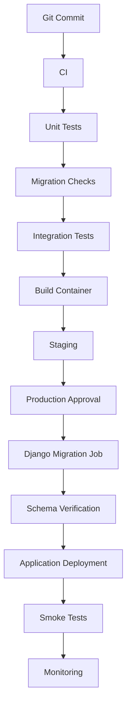
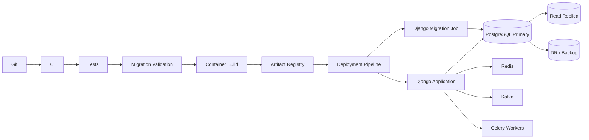

# 14- Django Database Migrations

## Overview

Django database migrations provide a version-controlled mechanism for evolving a relational database alongside Django models.

A Django application typically has this relationship:

```text
Django Models
     │
     ▼
Migration Operations
     │
     ▼
Migration Files
     │
     ▼
Database Schema
     │
     ▼
PostgreSQL
```

The key distinction is:

> **Django models describe the desired application schema; migrations describe how to transition an existing database to that schema.**

For production systems, migrations are deployment artifacts. They must be:

- Version controlled
- Reviewed
- Tested
- Ordered correctly
- Compatible with rolling deployments
- Observable
- Recoverable

A migration is not merely a generated file. It is a database change that can acquire locks, consume resources, modify persistent data, affect replicas, and influence application availability.

---

## Why Django Migrations Exist

Suppose the original model is:

```python
class Customer(models.Model):
    email = models.EmailField()
```

Later, the application requires:

```python
class Customer(models.Model):
    email = models.EmailField()
    status = models.CharField(max_length=32, default="active")
```

Changing the Python model does not automatically update an existing production table.

Without migrations:

```text
Developer changes model
        ↓
Production schema unchanged
        ↓
Application expects new column
        ↓
Runtime database error
```

With migrations:

```text
Model change
    ↓
makemigrations
    ↓
Migration file
    ↓
Review + test
    ↓
migrate
    ↓
Database schema updated
```

---

## Django Migration Architecture

A typical Django project contains:

```text
project/
├── manage.py
├── config/
│   ├── settings.py
│   └── urls.py
├── customers/
│   ├── models.py
│   └── migrations/
│       ├── __init__.py
│       ├── 0001_initial.py
│       └── 0002_customer_status.py
└── orders/
    └── migrations/
```

Each Django application can maintain its own migration history.

Migration dependencies connect migrations across applications when necessary.

---

## Migration Lifecycle

The normal development lifecycle is:


Typical commands:

```bash
python manage.py makemigrations
python manage.py showmigrations
python manage.py migrate
```

The commands have different responsibilities.

| Command | Purpose |
|---|---|
| `makemigrations` | Generate migration files from model changes |
| `showmigrations` | Display migration state |
| `migrate` | Apply migrations |
| `sqlmigrate` | Display SQL for a migration |
| `migrate --plan` | Show planned migration operations |
| `migrate app zero` | Roll an app's migration history back to zero |

---

## Creating Migrations

After changing a model:

```bash
python manage.py makemigrations customers
```

Django may generate:

```python
from django.db import migrations, models


class Migration(migrations.Migration):
    dependencies = [
        ("customers", "0001_initial"),
    ]

    operations = [
        migrations.AddField(
            model_name="customer",
            name="status",
            field=models.CharField(
                default="active",
                max_length=32,
            ),
        ),
    ]
```

The generated migration should be reviewed before committing it.

---

## Migration Files Are Source Code

Migration files belong in Git.

A production repository should generally contain:

```text
models.py
migrations/
Dockerfile
CI configuration
```

Do not add migration files to `.gitignore`.

A developer's migration history is part of the application's database contract.

---

## Migration Dependencies

Django migrations explicitly declare dependencies:

```python
dependencies = [
    ("customers", "0004_add_status"),
]
```

This creates a dependency graph:

```text
customers.0001
      ↓
customers.0002
      ↓
customers.0003

orders.0001
      ↓
orders.0002
      ↓
orders.0003
```

Cross-application dependencies can create:

```text
customers.0004
       ↑
       │
orders.0007
```

Django uses this graph to determine migration ordering.

---

## Migration Graph

Migration history is not simply a list of filenames.

Conceptually:

```text
       ┌── Feature A migration
Base ──┤
       └── Feature B migration
```

Multiple branches can occur when developers create migrations concurrently.

Check the graph with:

```bash
python manage.py showmigrations
```

Django also provides migration graph information through its migration tooling.

When branches need reconciliation, generate an appropriate merge migration rather than arbitrarily editing migration dependencies.

---

## `makemigrations` Is Not a Database Deployment

This distinction is fundamental.

```bash
python manage.py makemigrations
```

creates migration files.

It does not change the production database.

```bash
python manage.py migrate
```

applies migration operations to the configured database.

Therefore:

```text
Model change
    ↓
makemigrations
    ↓
Git
    ↓
CI/CD
    ↓
migrate
    ↓
Production database
```

---

## Inspecting Generated SQL

Before deploying an important migration:

```bash
python manage.py sqlmigrate customers 0002
```

This displays the SQL Django intends to execute.

For example:

```sql
ALTER TABLE "customers_customer"
ADD COLUMN "status" varchar(32) DEFAULT 'active' NOT NULL;
```

Reviewing SQL helps identify:

- Table rewrites
- Locks
- Defaults
- Constraint changes
- Index creation
- Database-specific behavior

Do not judge migration safety only from the Python migration operations.

---

## Migration Plan

Before applying changes:

```bash
python manage.py migrate --plan
```

This helps verify which migrations Django intends to apply.

A production deployment should know:

```text
Expected migration state
        vs
Actual database state
```

Unexpected pending or missing migrations should be investigated.

---

## Migration State

Django records applied migrations in:

```text
django_migrations
```

Conceptually:

```text
PostgreSQL
 ├── application tables
 ├── indexes
 ├── constraints
 └── django_migrations
```

The migration table records Django's migration state.

It does not guarantee that the actual database schema has never been modified manually.

Manual database changes can create schema drift.

---

## Schema Drift

Schema drift occurs when:

```text
Migration history
       ≠
Actual database schema
```

Common causes include:

- Manual production SQL
- Failed operational changes
- Incomplete migrations
- Incorrect migration state
- Environment-specific modifications

If drift exists, do not blindly run more migrations.

First inspect:

```text
Migration history
+
Actual schema
+
Application expectations
```

then create a controlled reconciliation plan.

---

## Model Changes and Migration Generation

Django detects many model changes automatically.

Examples include:

- Adding fields
- Removing fields
- Changing field properties
- Adding indexes
- Adding constraints
- Creating models
- Deleting models

However, Django cannot infer every semantic intent.

For example, changing:

```python
email = models.EmailField()
```

to:

```python
contact_email = models.EmailField()
```

may represent either:

```text
Rename
```

or:

```text
Delete old field + create new field
```

Those operations have very different data implications.

Review generated migrations carefully.

---

## Field Renames

A safe rename should preserve existing data.

Django can represent a field rename explicitly:

```python
migrations.RenameField(
    model_name="customer",
    old_name="email",
    new_name="contact_email",
)
```

This is different from:

```text
DROP email
ADD contact_email
```

The latter may destroy existing values.

For large production systems, the application compatibility implications of a rename must also be considered.

---

## Adding Nullable Fields

A safer production pattern is often:

```python
status = models.CharField(
    max_length=32,
    null=True,
)
```

Then:

```text
Deploy schema
   ↓
Deploy compatible application
   ↓
Backfill
   ↓
Validate
   ↓
Enforce required state later
```

This avoids forcing an expensive data transformation during a critical deployment.

---

## Adding Required Fields

Suppose a new field must eventually be:

```python
status = models.CharField(
    max_length=32,
    null=False,
)
```

For a large existing table, a safer sequence is:

```text
1. Add nullable column
2. Deploy compatible code
3. Backfill existing rows
4. Verify all rows
5. Add NOT NULL requirement
```

This separates schema expansion from data migration.

---

## Defaults

Defaults deserve careful review.

A model-level default:

```python
status = models.CharField(
    max_length=32,
    default="active",
)
```

can affect both:

- Django application behavior
- Migration/database behavior

Understand whether the migration introduces a database-level default, a Django-side default, or both.

Do not assume a default is operationally free on a large table.

---

## Data Migrations

Django supports custom data migrations through `RunPython`.

Example:

```python
from django.db import migrations


def populate_normalized_email(apps, schema_editor):
    Customer = apps.get_model("customers", "Customer")

    Customer.objects.filter(
        normalized_email__isnull=True,
    ).update(
        normalized_email=models.functions.Lower("email"),
    )


class Migration(migrations.Migration):
    dependencies = [
        ("customers", "0005_add_normalized_email"),
    ]

    operations = [
        migrations.RunPython(populate_normalized_email),
    ]
```

For production-scale tables, avoid treating a large `RunPython` operation as a free deployment step.

Large data transformations often belong in a separately controlled backfill process.

---

## Historical Models in Data Migrations

Inside `RunPython`, use:

```python
apps.get_model(...)
```

rather than importing the current model directly.

Example:

```python
Customer = apps.get_model("customers", "Customer")
```

This matters because migrations represent historical application states.

The current `models.py` may have changed significantly since the migration was created.

Direct imports can therefore make old migrations depend on future model definitions.

---

## Why Historical Models Matter

Consider:

```text
Migration 0005
   ↓
expects field A

Current models.py
   ↓
field A removed
```

If migration `0005` imports the current model, it may no longer behave as intended.

Using Django's historical model registry allows the migration to operate against the model state associated with that point in migration history.

---

## Reversing Data Migrations

A `RunPython` migration can provide both directions:

```python
migrations.RunPython(
    forwards_func,
    reverse_code,
)
```

However, reverse logic must be genuinely safe.

For example:

```text
Transform A → B
```

does not necessarily mean:

```text
B → A
```

can reconstruct the original data.

If the transformation is destructive, classify the migration as effectively irreversible and document the recovery strategy.

---

## `RunPython.noop`

When a reverse operation has no meaningful action:

```python
migrations.RunPython(
    forwards_func,
    migrations.RunPython.noop,
)
```

This explicitly communicates that Django should not attempt to reverse the data operation.

Do not use `noop` simply to make a migration appear reversible.

---

## Atomic Migrations

Django migrations are atomic by default on databases that support transactional DDL, subject to operation-specific behavior.

You can explicitly control migration atomicity:

```python
class Migration(migrations.Migration):
    atomic = False
```

This can be required for operations that cannot run inside a transaction.

For example, PostgreSQL's:

```sql
CREATE INDEX CONCURRENTLY ...
```

cannot run inside a transaction block.

---

## Non-Atomic Migrations

A non-atomic migration means the operations are not wrapped as one transaction by Django.

This can be useful for:

- Concurrent index creation
- Large operational migrations
- Explicitly controlled batch operations

But it changes failure semantics.

Instead of:

```text
Operation A
Operation B
Operation C
    ↓
One rollback
```

you may have:

```text
Operation A → committed
Operation B → committed
Operation C → failed
```

Recovery must therefore be designed explicitly.

---

## Concurrent Indexes

For PostgreSQL, large indexes may be created with:

```sql
CREATE INDEX CONCURRENTLY ...
```

Django provides:

```python
class Migration(migrations.Migration):
    atomic = False

    operations = [
        migrations.RunSQL(
            """
            CREATE INDEX CONCURRENTLY
            orders_customer_created_idx
            ON orders (customer_id, created_at DESC)
            """,
            """
            DROP INDEX CONCURRENTLY IF EXISTS
            orders_customer_created_idx
            """,
        ),
    ]
```

This can reduce blocking of normal writes, but the operation is slower and has operational restrictions.

For large tables, monitor:

- Disk usage
- CPU
- I/O
- WAL
- Replica lag
- Index build duration

---

## Django Migration and PostgreSQL Locks

A migration may acquire locks:

```text
Django migrate
      ↓
PostgreSQL DDL
      ↓
Lock
      ↓
Concurrent application queries
```

A migration that executes quickly on an idle database may behave differently under production traffic.

Before risky changes, consider:

- Active transactions
- Lock holders
- Table size
- Query traffic
- Lock timeout
- Deployment timing

---

## Large Table Migrations

Avoid:

```python
migrations.RunPython(
    migrate_500_million_rows,
)
```

as an unbounded deployment operation.

Prefer:

```text
Django migration
      ↓
Add schema
      ↓
Deploy application
      ↓
Celery / Job
      ↓
Batched backfill
      ↓
Validation
      ↓
Constraint migration
```

Large backfills should support:

- Batch size
- Keyset progression
- Idempotency
- Checkpointing
- Retry
- Pause/resume
- Throttling

---

## Batch Backfills

For large tables, use an indexed progression.

Conceptually:

```text
id > last_processed_id
       ↓
ORDER BY id
       ↓
LIMIT batch_size
```

For example:

```python
BATCH_SIZE = 5_000

while True:
    rows = list(
        Customer.objects
        .filter(
            id__gt=last_id,
            normalized_email__isnull=True,
        )
        .order_by("id")
        .values_list("id", flat=True)[:BATCH_SIZE]
    )

    if not rows:
        break

    # Process this bounded batch.
    last_id = rows[-1]
```

Production backfills should also persist progress and handle concurrent writes correctly.

---

## Migration and Application Compatibility

Django applications may be deployed using rolling updates:

```text
Pod A → Application v1
Pod B → Application v1
Pod C → Application v2
Pod D → Application v2
```

During this period:

```text
Application v1
Application v2
```

may simultaneously access the database.

Therefore schema changes should usually support both versions during the transition.

---

## Expand-and-Contract

A safe Django deployment pattern is:

```text
Release 1
   ↓
Migration: add new structure
   ↓
Release 2
   ↓
Application supports old + new
   ↓
Backfill
   ↓
Release 3
   ↓
Application uses new structure
   ↓
Release 4
   ↓
Migration removes old structure
```

This is especially useful for:

- Renames
- Splitting columns
- Replacing fields
- Changing data representation
- Large table transformations

---

## Migration and Feature Flags

Feature flags can separate deployment from activation:

```text
Deploy code
      ↓
Feature disabled
      ↓
Run migration
      ↓
Backfill
      ↓
Validate
      ↓
Enable feature
```

If the new behavior fails:

```text
Disable feature
```

without necessarily reverting the database.

This reduces rollback pressure.

---

## Migration and Celery

For asynchronous data migrations:

```text
Django migration
      ↓
Create schema
      ↓
Application deployment
      ↓
Celery task
      ↓
Batched backfill
```

The Celery task should be:

- Idempotent
- Bounded
- Observable
- Retry-safe

Do not assume Celery retries are automatically safe for database mutations.

---

## Migration and Redis

Django migrations modify the relational database, not Redis.

If cached objects depend on a changed schema:

```text
PostgreSQL
   ↓
Django
   ↓
Redis
```

the migration may require:

- Cache invalidation
- Cache key versioning
- Cache rebuild
- TTL strategy

Database schema deployment should therefore account for cached representations.

---

## Migration and Kafka

If a migration changes application data that produces Kafka events:

```text
PostgreSQL
    ↓
Django transaction
    ↓
Outbox
    ↓
Kafka
    ↓
Consumers
```

database rollback does not automatically undo events already published or consumed.

Use:

- Compatible event schemas
- Versioning
- Idempotent consumers
- Reconciliation
- Compensating events where required

---

## Django and Transactions

Django provides transaction management through:

```python
from django.db import transaction
```

For application operations:

```python
with transaction.atomic():
    customer = Customer.objects.create(
        email="user@example.com",
        status="active",
    )

    AuditLog.objects.create(
        customer=customer,
        action="created",
    )
```

Migration transactions are managed by Django's migration framework separately from normal request-level application transactions.

Do not confuse:

```text
Application transaction
```

with:

```text
Migration execution transaction
```

They have different operational contexts.

---

## Migration and Connection Pooling

Django's database configuration may use persistent connections through:

```python
DATABASES = {
    "default": {
        "ENGINE": "django.db.backends.postgresql",
        "NAME": "app",
        "CONN_MAX_AGE": 60,
    }
}
```

`CONN_MAX_AGE` controls connection persistence. It is not a configurable maximum-size connection pool.

In production, consider:

```text
Django processes
   +
Celery workers
   +
Migration jobs
   ↓
PostgreSQL connection budget
```

A deployment can exhaust database connections even when each individual component appears correctly configured.

---

## Kubernetes Deployment

A common Kubernetes architecture is:

```text
CI/CD
  │
  ▼
Migration Job
  │
  ▼
PostgreSQL
  │
  ├── Application Pods
  └── Celery Workers
```

Avoid having every pod execute:

```bash
python manage.py migrate
```

on startup.

Instead, use a controlled migration Job.

---

## Kubernetes Migration Job

A simplified example:

```yaml
apiVersion: batch/v1
kind: Job
metadata:
  name: django-migrations
spec:
  template:
    spec:
      restartPolicy: Never
      containers:
        - name: migrate
          image: backend:latest
          command:
            - python
            - manage.py
            - migrate
```

Production configuration should additionally handle:

- Database credentials
- Secret management
- Resource limits
- Network policies
- Job retries
- Observability
- Deployment ordering

---

## CI/CD Pipeline

A mature Django deployment can follow:



The migration job should be an explicit deployment stage.

---

## Migration Checks in CI

Useful checks include:

```bash
python manage.py makemigrations --check --dry-run
python manage.py migrate --plan
```

The first detects model changes that have not been captured in migration files.

The second helps inspect pending migration operations.

Also test migrations against a real test database:

```bash
python manage.py migrate
```

---

## Fresh Database Testing

A fresh database test verifies:

```text
0001
 ↓
0002
 ↓
0003
 ↓
...
 ↓
Latest schema
```

This catches:

- Broken migration dependencies
- Invalid operations
- Missing migration files
- Incorrect migration ordering

---

## Upgrade Testing

Production is usually not an empty database.

Test:

```text
Production-like database
        ↓
Existing migration state
        ↓
New migration
        ↓
Expected schema
```

This is particularly important for:

- Large tables
- Existing data
- Existing indexes
- Existing constraints
- Legacy deployments

---

## Migration Testing Matrix

| Test | Purpose |
|---|---|
| Fresh migration | Validate complete migration history |
| Upgrade migration | Validate real deployment path |
| Reverse migration | Validate defined downgrade behavior |
| Data migration | Validate transformation |
| Large-data test | Estimate operational impact |
| Compatibility test | Validate rolling deployment |
| Failure test | Validate recovery behavior |

---

## Reversing Migrations

Django supports migration reversal:

```bash
python manage.py migrate customers 0005
```

This attempts to reverse migrations after `0005`.

However:

> **A reversible migration operation does not guarantee that production state can be perfectly restored.**

For example:

```text
Add column
   ↓
Populate data
   ↓
Drop column
```

Recreating the column does not reconstruct the deleted values.

---

## Migration Rollback Strategy

Classify migrations:

| Migration | Rollback |
|---|---|
| Add nullable field | Usually straightforward |
| Add index | Usually straightforward |
| Rename field | Usually possible |
| Data transformation | Depends on reversibility |
| Drop field | Potential data loss |
| Delete rows | Potentially irreversible |
| Large rewrite | May require roll-forward/recovery |

For destructive changes, rely on:

- Backups
- PITR
- Data preservation
- Corrective migrations
- Reconciliation

rather than assuming a reverse migration is sufficient.

---

## `SeparateDatabaseAndState`

Django provides:

```python
migrations.SeparateDatabaseAndState
```

for cases where Django's migration state and actual database operation need to be represented differently.

Conceptually:

```text
Django migration state
        ≠
Direct database operation
```

This can be useful for advanced migrations such as database structures managed outside Django's normal schema operations.

It should be used carefully because incorrect state/database alignment can make future migrations unsafe.

---

## `RunSQL`

Use `RunSQL` when Django's built-in migration operations cannot express the required database change.

Example:

```python
migrations.RunSQL(
    sql="""
        CREATE INDEX CONCURRENTLY
        orders_customer_created_idx
        ON orders (customer_id, created_at DESC)
    """,
    reverse_sql="""
        DROP INDEX CONCURRENTLY IF EXISTS
        orders_customer_created_idx
    """,
)
```

Use database-specific SQL deliberately.

It is often appropriate when PostgreSQL-specific production behavior matters more than database portability.

---

## Migration Naming

Migration names should describe the change:

```text
0008_add_customer_status.py
0009_add_order_created_index.py
0010_add_customer_external_id.py
```

Prefer names that help operators understand migration intent.

Avoid vague names such as:

```text
0008_changes.py
0009_update.py
```

Clear migration names improve incident investigation.

---

## Migration Review

A pull request containing migrations should answer:

- What changes?
- Why is it required?
- What SQL will execute?
- Does it acquire locks?
- Does it rewrite the table?
- Does it modify existing data?
- Is it backward compatible?
- Can old application versions continue operating?
- Is the migration reversible?
- What is the roll-forward strategy?
- What happens to replicas?
- Is a backfill required?

Migration review should be treated as production database review.

---

## Migration Performance

Migration performance depends on:

```text
Table size
+
Row count
+
Indexes
+
Constraints
+
Concurrent traffic
+
Locks
+
Disk I/O
+
WAL
+
Replication
```

Do not estimate production migration duration solely from development execution.

---

## PostgreSQL and Large Tables

For a large PostgreSQL table:

```text
Django migration
       ↓
ALTER TABLE
       ↓
Potential lock
       ↓
Application traffic
       ↓
Latency / blocking
```

Before deploying:

- Inspect table size
- Understand PostgreSQL's operation
- Check lock behavior
- Estimate duration
- Check disk headroom
- Check replica capacity
- Plan monitoring

---

## Migration and Replication

A migration on the primary can produce substantial WAL:

```text
Primary
  │
  ├── Schema change
  ├── Data backfill
  └── WAL generation
         │
         ▼
      Replicas
         │
         ▼
      Replay lag
```

Monitor:

- Replica lag
- WAL volume
- Replay rate
- Storage
- Read latency

A migration should not be considered successful if it leaves critical replicas unhealthy.

---

## Migration and Read Replicas

If application reads use replicas:

```text
Write
 ↓
Primary
 ↓
Replica
```

a deployment can create temporary read-after-write inconsistencies.

For operations requiring immediate consistency:

```text
Write to primary
     ↓
Read from primary
```

or use an appropriate consistency-aware routing strategy.

Migration deployment should not accidentally change the application's consistency assumptions.

---

## Migration and Database Constraints

Constraints are part of the database contract.

Examples:

```python
class Order(models.Model):
    total = models.DecimalField(
        max_digits=12,
        decimal_places=2,
    )

    class Meta:
        constraints = [
            models.CheckConstraint(
                condition=models.Q(total__gte=0),
                name="order_total_non_negative",
            ),
        ]
```

For existing large tables, adding a constraint may require validating existing data.

A production migration should distinguish:

```text
Constraint creation
```

from:

```text
Validation of existing data
```

when the database supports a safer staged approach.

---

## Foreign Keys

Django migrations can create foreign keys:

```python
customer = models.ForeignKey(
    "customers.Customer",
    on_delete=models.PROTECT,
)
```

Before deploying to large tables, consider:

- Existing invalid data
- Lock behavior
- Indexing
- Delete/update behavior
- Table size
- Replica impact

A foreign key is a correctness mechanism, not merely an ORM relationship.

---

## Indexes

Django can define indexes:

```python
class Order(models.Model):
    customer_id = models.BigIntegerField()
    created_at = models.DateTimeField()

    class Meta:
        indexes = [
            models.Index(
                fields=["customer_id", "-created_at"],
                name="order_customer_created_idx",
            ),
        ]
```

Index deployment should consider:

- Query access patterns
- Index size
- Write amplification
- Build duration
- Disk capacity
- Replica impact

Do not add indexes simply because a column is frequently queried.

---

## Migration and Query Plans

A migration can change query performance without changing application code.

For example:

```text
Add index
   ↓
Planner chooses new plan
   ↓
Query latency changes
```

Or:

```text
Large backfill
   ↓
Data distribution changes
   ↓
Planner estimates change
```

After significant migrations, monitor critical query performance.

---

## Migration and Cache Invalidation

Suppose cached data contains:

```json
{
  "customer_id": 123,
  "status": "active"
}
```

After a schema/data migration:

```text
PostgreSQL state
        ≠
Redis state
```

If necessary:

```text
Migration
   ↓
Cache invalidation/version change
   ↓
Application
```

Cache consistency must be considered separately from database migration correctness.

---

## Migration and Background Jobs

Background workers can continue operating during a rolling deployment:

```text
Old worker
New worker
Migration
Database
```

Design migrations so both worker versions remain compatible when required.

For incompatible changes:

```text
Expand schema
   ↓
Deploy compatible workers
   ↓
Drain old workers
   ↓
Switch behavior
   ↓
Contract schema
```

---

## Security Considerations

Migration execution requires elevated database privileges.

Prefer:

```text
app_runtime
    ↓
Normal CRUD/query operations

app_migration
    ↓
Schema changes
```

Protect migration credentials with:

- AWS Secrets Manager
- Kubernetes secret management
- CI/CD secret stores
- Short-lived credentials where possible
- IAM/workload identity mechanisms

Do not give normal application containers unrestricted schema privileges solely because the deployment pipeline needs them.

---

## Migration Auditability

Production migrations should be traceable to:

```text
Git commit
+
Migration filename
+
Deployment ID
+
Application version
+
Operator / automation identity
+
Execution timestamp
```

This makes incidents easier to investigate.

---

## Observability

Monitor:

### Migration

- Migration duration
- Migration failures
- Current migration state
- Data migration progress

### Database

- CPU
- Memory
- I/O
- Connections
- Locks
- Deadlocks
- Transaction duration

### Replication

- Replica lag
- WAL generation
- Replay delay

### Application

- Error rate
- p95/p99 latency
- Request throughput

Migration observability should correlate with the application deployment.

---

## Timeouts

Migration execution should account for:

```text
Database connection timeout
+
lock_timeout
+
statement_timeout
+
CI/CD job timeout
```

A migration waiting indefinitely for a production lock can become an availability incident.

Timeout strategy should be deliberate and appropriate for the operation.

---

## High Availability

Django migrations normally execute against the writable primary.

Consider:

```text
Migration
   ↓
Primary
   ├── Replica A
   ├── Replica B
   └── DR Replica
```

After high-impact migrations verify:

- Primary health
- Replica health
- Failover readiness
- WAL retention
- Storage
- Application connectivity

---

## Disaster Recovery

For high-risk migrations:

```text
Before migration
      ↓
Verify backup/PITR
      ↓
Migration
      ↓
Validation
```

For destructive data changes, know whether recovery requires:

- Application rollback
- Corrective migration
- Selective repair
- PITR
- Full restore

A reverse migration should not be the only recovery plan.

---

## Cost Considerations

Large migrations can increase:

- Database CPU
- Storage I/O
- WAL
- Replica resources
- Backup storage
- Kubernetes compute
- Monitoring volume

A controlled migration may justify temporary additional capacity.

Avoid permanently overprovisioning production for occasional migration workloads.

---

## Common Mistakes

### Changing Models Without Creating Migrations

**Problem:** Production schema does not match application expectations.

**Better:**

```bash
python manage.py makemigrations
```

and commit the generated migration.

### Treating Generated Migrations as Automatically Safe

**Problem:** Django cannot infer every semantic intent.

**Better:** Review migration operations and generated SQL.

### Importing Current Models in `RunPython`

**Problem:** Historical migrations can break when current models change.

**Better:** Use:

```python
apps.get_model(...)
```

### Running Huge Data Migrations During Deployment

**Problem:** Deployment becomes a long-running database workload.

**Better:** Separate schema changes from large asynchronous backfills.

### Running Migrations From Every Kubernetes Pod

**Problem:** Multiple processes can attempt schema changes concurrently.

**Better:** Use one controlled migration Job.

### Dropping a Field Before Application Compatibility Is Removed

**Problem:** Older application instances may still query the field.

**Better:** Use expand-and-contract.

### Assuming Reverse Migration Restores Data

**Problem:** Schema recreation does not reconstruct deleted values.

**Better:** Preserve data or use backup/PITR/reconciliation strategies.

### Ignoring `RunSQL` Transaction Restrictions

**Problem:** PostgreSQL operations such as concurrent index creation cannot execute inside a transaction block.

**Better:** Use `atomic = False` where appropriate and understand the database operation.

### Ignoring Replica Lag

**Problem:** Large data operations generate WAL and can delay replicas.

**Better:** Monitor replication during migration.

### Giving Runtime Roles DDL Privileges

**Problem:** Application compromise gains unnecessary schema authority.

**Better:** Separate runtime and migration database identities.

### Testing Only a Fresh Database

**Problem:** Production contains real data, indexes, constraints, and concurrent workloads.

**Better:** Test upgrade paths against production-like states.

### Using `--fake` Without Understanding State

**Problem:** Django may record a migration as applied without actually performing its database changes.

**Better:** Use fake application only when the actual schema already matches the migration's intended state and the implications are fully understood.

---

## Migration Recovery

When a migration fails:

```text
Migration failure
      ↓
Stop automatic retries
      ↓
Inspect database state
      ↓
Inspect django_migrations
      ↓
Inspect actual schema
      ↓
Determine transaction state
      ↓
Choose recovery
```

Possible recovery paths:

```text
Reverse safely
     OR
Roll forward
     OR
Repair data
     OR
Restore/PITR
```

Do not blindly rerun a failed migration until the actual state is known.

---

## Production Deployment Runbook

### Before Deployment

```text
1. Review migration files.
2. Inspect generated SQL.
3. Validate migration dependencies.
4. Test fresh database migration.
5. Test upgrade path.
6. Check production table sizes.
7. Evaluate lock behavior.
8. Verify backup/PITR.
9. Confirm application compatibility.
10. Define rollback/roll-forward strategy.
```

### During Deployment

```text
1. Start controlled migration job.
2. Monitor database health.
3. Monitor locks.
4. Monitor application latency.
5. Monitor replica lag.
6. Verify migration completion.
```

### After Deployment

```text
1. Verify migration state.
2. Verify schema.
3. Run smoke tests.
4. Check query performance.
5. Check application errors.
6. Monitor replicas.
7. Start backfills if required.
8. Delay destructive cleanup.
```

---

## Production Architecture

A robust Django deployment can follow:



The important deployment boundaries are:

```text
CI
 ↓
Validate migration
 ↓
Controlled migration job
 ↓
Database
 ↓
Compatible application rollout
 ↓
Backfill
 ↓
Validation
 ↓
Contract
```

This makes database changes predictable and reduces the probability that a schema change becomes an application availability incident.

---

## Senior-Level Design Principles

A mature Django migration strategy follows these principles:

```text
Migration files are code
        ↓
Generated migrations are reviewed
        ↓
SQL is inspected for important changes
        ↓
Schema changes remain backward compatible
        ↓
Large data work is separated
        ↓
Migration execution is controlled
        ↓
Database health is monitored
        ↓
Rollback and recovery are planned
```

The objective is not simply:

```text
"Does `python manage.py migrate` succeed?"
```

The real production question is:

```text
Can the database transition safely from its current state
to the desired state while the system remains correct,
available, observable, and recoverable?
```

That is the level at which Django migrations should be evaluated.

---

## Key Takeaways

- **Django migrations are version-controlled database deployment artifacts:** models describe desired state, while migration files define the controlled transition of an existing database.
- **Review generated migrations and SQL:** `makemigrations` is useful automation, but semantic changes such as renames, large data transformations, locks, and database-specific operations require engineering review.
- **Use expand-and-contract for production changes:** preserve compatibility across rolling application and worker deployments, separate large backfills from schema changes, and delay destructive cleanup.
- **Treat migrations as production workloads:** evaluate transactions, locks, table size, WAL, replicas, connection usage, performance, security, and observability rather than only migration correctness.
- **Plan recovery before deployment:** a reverse migration may not restore lost data, so high-risk changes need explicit roll-forward, repair, backup, or PITR strategies.