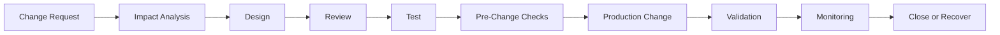
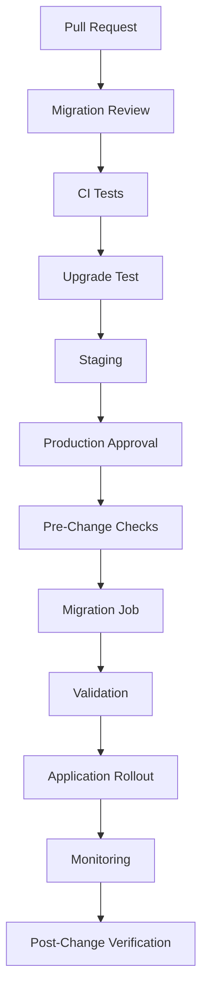

# 15- Production Database Change Checklist

## Overview

Production database changes are controlled modifications to schema, data, indexes, constraints, configuration, or database topology while the application is serving real traffic.

A production database change is not complete merely because the SQL executes successfully.

The real success criteria are:

```text
Database change
      ↓
Correct schema/data state
      ↓
Application compatibility
      ↓
Acceptable performance
      ↓
Healthy replication
      ↓
No unexpected security impact
      ↓
Known recovery path
```

A production change should therefore be treated as an operational change with:

- A clear objective
- Defined scope
- Compatibility analysis
- Performance analysis
- Rollout strategy
- Monitoring
- Stop conditions
- Recovery strategy
- Post-change validation

Typical changes include:

| Change | Examples | Typical risk |
|---|---|---|
| Schema | Add/drop/rename columns | Low to high |
| Index | Add/remove/modify indexes | Low to high |
| Constraint | FK, unique, check, NOT NULL | Medium to high |
| Data | Backfill, update, delete | Medium to very high |
| Partitioning | Create/move/detach partitions | Medium to high |
| Configuration | Connection limits, memory settings | Medium |
| Topology | Replica/failover changes | High |
| Security | Roles, privileges, RLS | Medium to high |

---

## Production Change Lifecycle

A disciplined lifecycle is:



Each stage answers a different question.

| Stage | Primary question |
|---|---|
| Request | What problem are we solving? |
| Analysis | What can this change affect? |
| Design | What is the safest implementation? |
| Review | Has another engineer challenged the assumptions? |
| Test | Does it work against realistic conditions? |
| Pre-check | Is production currently safe for the change? |
| Execution | Can we make the change in controlled steps? |
| Validation | Did the intended state actually occur? |
| Monitoring | Did the system remain healthy? |
| Recovery | What happens if the change fails? |

---

## Change Classification

Before deployment, classify the change.

### Additive

Examples:

```sql
ALTER TABLE customers
ADD COLUMN normalized_email text;
```

Usually easier to make backward compatible.

### Destructive

Examples:

```sql
ALTER TABLE customers
DROP COLUMN legacy_email;
```

Potentially irreversible because existing data may be lost.

### Data Transformation

Examples:

```sql
UPDATE customers
SET normalized_email = lower(trim(email));
```

Risk depends heavily on row count, transaction size, correctness, and reversibility.

### Performance Change

Examples:

```sql
CREATE INDEX ...
```

The schema may remain logically unchanged while resource consumption and query plans change.

### Operational Change

Examples:

```text
Connection pool size
Database parameter
Replica topology
Failover configuration
```

These may not change schema but can significantly affect availability.

---

## Define the Desired State

Before executing a change, document:

```text
Current state
     ↓
Desired state
     ↓
Transition
```

Example:

```text
Current:
customers.email

Desired:
customers.email
customers.normalized_email

Transition:
1. Add column
2. Deploy compatible code
3. Backfill
4. Validate
5. Switch reads
6. Remove old representation later
```

This prevents implementation details from obscuring the actual goal.

---

## Identify Dependencies

A database object rarely exists in isolation.

For a column:

```text
Column
 ├── Application code
 ├── ORM model
 ├── Queries
 ├── Indexes
 ├── Constraints
 ├── Views
 ├── Functions
 ├── Triggers
 ├── Reports
 ├── ETL
 └── External integrations
```

Before changing it, identify all consumers and producers.

---

## Application Dependency Analysis

Search application code for:

```text
Table names
Column names
ORM fields
Raw SQL
Stored procedures
Reports
Background tasks
```

For Django, inspect:

```text
models.py
QuerySets
RawSQL
RunSQL migrations
Celery tasks
Management commands
```

For SQLAlchemy/FastAPI, inspect:

```text
ORM models
SQLAlchemy Core statements
Repository code
Background jobs
Raw SQL
```

Do not assume the ORM is the only database consumer.

---

## Database Dependency Analysis

Inspect:

- Indexes
- Constraints
- Foreign keys
- Views
- Materialized views
- Triggers
- Functions
- Procedures
- Generated columns
- Partitions
- RLS policies
- Grants

For PostgreSQL, catalog inspection is often useful before destructive changes.

---

## Data Volume

Determine:

```text
Approximate row count
Table size
Index size
Write rate
Read rate
Growth rate
```

Useful PostgreSQL queries include:

```sql
SELECT
    pg_size_pretty(pg_relation_size('customers')) AS table_size,
    pg_size_pretty(pg_indexes_size('customers')) AS indexes_size,
    pg_size_pretty(pg_total_relation_size('customers')) AS total_size;
```

Exact row counts can be expensive on large tables, so choose an appropriate measurement strategy.

---

## Workload Analysis

Understand how the table behaves in production.

Measure:

- Requests per second
- Queries per second
- Write rate
- Peak traffic
- Long-running queries
- Lock waits
- Connection utilization
- CPU
- I/O

A migration that is safe during low traffic may be unsafe during peak traffic.

---

## Table Criticality

Not all tables deserve the same deployment process.

| Table type | Example | Change strategy |
|---|---|---|
| Non-critical | Internal metadata | Standard |
| Important | Customer profile | Controlled |
| High traffic | Orders | Carefully staged |
| Financial | Payments | Strong validation |
| Audit | Compliance records | Highly controlled |
| Security | Permissions | Strict review |

Business criticality should influence technical controls.

---

## Backward Compatibility

For rolling deployments:

```text
Application v1
Application v2
        │
        ▼
    PostgreSQL
```

Both application versions may run simultaneously.

The safest database state is one where:

```text
App v1 → Schema v2 ✓
App v2 → Schema v2 ✓
```

This enables application rollback without immediately reverting the database.

---

## Expand-and-Contract

Prefer:

```text
Expand
  ↓
Compatible application
  ↓
Backfill
  ↓
Switch
  ↓
Observe
  ↓
Contract
```

Example:

```text
Add new column
      ↓
Deploy code supporting both
      ↓
Backfill
      ↓
Switch reads
      ↓
Stop old writes
      ↓
Remove old column later
```

This is particularly important for:

- Renames
- Field replacements
- Table restructuring
- Large transformations
- Zero-downtime deployments

---

## Production Lock Analysis

Before executing DDL, determine what locks it can acquire.

Conceptually:

```text
Migration
   ↓
DDL
   ↓
PostgreSQL lock
   ↓
Concurrent queries
   ↓
Possible blocking
```

A command taking one second on an idle database can cause significant impact if it waits behind a long-running transaction.

Consider:

- Lock mode
- Lock duration
- Existing transactions
- Concurrent traffic
- `lock_timeout`
- `statement_timeout`

---

## Long-Running Transactions

Long transactions are dangerous during schema changes because they can:

- Hold locks
- Prevent cleanup
- Increase MVCC bloat
- Delay DDL
- Increase connection usage

Before a high-risk change, inspect active transactions.

For PostgreSQL:

```sql
SELECT
    pid,
    usename,
    state,
    xact_start,
    query_start,
    wait_event_type,
    wait_event,
    query
FROM pg_stat_activity
WHERE xact_start IS NOT NULL
ORDER BY xact_start;
```

---

## Lock Contention

During a change, identify both:

```text
Waiter
```

and:

```text
Blocker
```

Useful PostgreSQL diagnostics include:

```sql
SELECT
    pid,
    pg_blocking_pids(pid) AS blocking_pids,
    wait_event_type,
    wait_event,
    query
FROM pg_stat_activity
WHERE wait_event_type = 'Lock';
```

Do not simply kill waiting sessions without understanding the workload.

---

## Index Changes

Before adding an index:

- Identify the query it improves
- Inspect existing indexes
- Check selectivity
- Evaluate composite column order
- Estimate index size
- Estimate build duration
- Consider write amplification
- Consider replication impact

For large PostgreSQL tables:

```sql
CREATE INDEX CONCURRENTLY orders_customer_created_idx
ON orders (customer_id, created_at DESC);
```

`CREATE INDEX CONCURRENTLY` can reduce blocking of normal writes, but it is slower, has additional operational complexity, and cannot run inside a transaction block.

---

## Index Removal

Before dropping an index:

```text
Is it redundant?
Is it unused?
Is it supporting a constraint?
Is usage history long enough?
Is the workload seasonal?
```

Low observed usage does not automatically prove an index is unnecessary.

Consider historical observation and business-critical query patterns.

---

## Constraint Changes

Constraints enforce database invariants.

Examples:

```text
NOT NULL
UNIQUE
CHECK
FOREIGN KEY
PRIMARY KEY
```

Before adding a constraint:

```text
Existing data
      ↓
Does it satisfy the constraint?
```

For large tables, use staged validation where the database supports it.

A constraint deployment should not unexpectedly turn a data-quality problem into a production outage.

---

## Foreign Key Checklist

Before adding a foreign key:

- [ ] Existing rows satisfy the relationship
- [ ] Referenced key is valid
- [ ] Child-side indexing is appropriate
- [ ] Lock behavior is understood
- [ ] Delete/update behavior is intentional
- [ ] Large-table validation strategy exists
- [ ] Replica impact is understood

---

## NOT NULL Changes

Avoid immediately changing a large production column from:

```text
nullable
```

to:

```text
NOT NULL
```

without checking existing data and deployment compatibility.

A safer pattern is:

```text
Add nullable field
      ↓
Backfill
      ↓
Validate no NULLs
      ↓
Deploy compatible application
      ↓
Enforce NOT NULL
```

The exact PostgreSQL/Django strategy should account for table size and lock behavior.

---

## Large Data Changes

A large update:

```sql
UPDATE customers
SET normalized_email = lower(trim(email));
```

can create:

- WAL
- Dead tuples
- Vacuum work
- CPU usage
- I/O
- Lock pressure
- Replica lag

For large tables, prefer bounded batches.

Conceptually:

```text
Select bounded range
       ↓
Update batch
       ↓
Commit
       ↓
Record progress
       ↓
Throttle if required
       ↓
Next batch
```

---

## Batch Size

Batch size should be chosen based on production behavior, not an arbitrary number.

Monitor:

```text
Batch duration
CPU
I/O
Lock waits
Replica lag
WAL
Query latency
```

If a batch causes excessive load:

```text
Reduce batch size
```

If the system has substantial headroom:

```text
Increase carefully
```

---

## Backfill Idempotency

A backfill should ideally tolerate retries.

For example:

```sql
UPDATE customers
SET normalized_email = lower(trim(email))
WHERE id > $1
  AND id <= $2
  AND normalized_email IS NULL;
```

The predicate prevents already-processed rows from being unnecessarily modified.

Idempotency is especially important when using Celery, Kubernetes Jobs, or other retry-capable workers.

---

## Migration Progress

For large migrations, track:

```text
Migration name
Current cursor
Rows processed
Rows remaining
Batch duration
Errors
Retries
Status
```

Progress should be stored durably.

Redis can assist with coordination, but migration correctness should not depend solely on ephemeral Redis state.

---

## Pause Criteria

Define stop conditions before execution.

Examples:

```text
Pause if:
- Database CPU > threshold
- Replica lag > threshold
- Lock waits exceed threshold
- Error rate increases
- p99 latency exceeds threshold
- WAL growth becomes unsafe
- Disk headroom becomes insufficient
```

This is better than deciding during an incident whether the migration should continue.

---

## Connection Budget

A migration worker consumes database connections.

Consider the complete budget:

```text
Application pods
+
Celery workers
+
Admin sessions
+
Migration jobs
+
Monitoring
+
Failover headroom
```

A migration should not consume the capacity required by normal application traffic.

---

## Connection Pool Impact

For Django:

```text
Web processes
+
Celery workers
+
Management commands
```

can all create database connections.

For SQLAlchemy:

```text
pool_size
+
max_overflow
```

must be evaluated across all application processes and pods.

A migration deployment can fail even when the migration SQL itself is correct because PostgreSQL cannot accept another connection.

---

## Replica Impact

A primary migration can generate substantial WAL:

```text
Primary
   │
   ├── Migration writes
   │
   └── WAL
        │
        ▼
     Replicas
        │
        ▼
    Replay workload
```

Monitor:

- Replica lag
- WAL generation
- Replay rate
- Replica storage
- Query latency

A primary-only health check is insufficient.

---

## Read-After-Write Behavior

During schema/data deployment, applications may read from replicas.

For consistency-sensitive operations:

```text
Write → Primary
Read  → Primary
```

may be required temporarily.

Do not introduce migration-related consistency problems by assuming all reads are immediately available everywhere.

---

## Cache Considerations

If Redis caches affected data:

```text
Database
   ↓
Application
   ↓
Redis
```

a database change can invalidate cached assumptions.

Potential strategies:

- Explicit invalidation
- Versioned cache keys
- TTL
- Cache rebuild
- Dual-read compatibility

The database change checklist should include cache state when relevant.

---

## Kafka and Event Changes

If the changed data produces events:

```text
PostgreSQL
   ↓
Outbox
   ↓
Kafka
   ↓
Consumers
```

consider:

- Event schema compatibility
- Consumer versions
- Ordering
- Idempotency
- Replay behavior
- Compensating events

A database rollback does not automatically undo an event already consumed by another service.

---

## Celery and Background Jobs

Before changing schema, identify:

```text
Scheduled tasks
Queued tasks
Long-running workers
Retrying tasks
```

Old workers may continue running during a rolling deployment.

Therefore:

```text
Old worker
New worker
Database
```

must remain compatible during the transition.

---

## API Compatibility

Database changes can indirectly alter APIs.

For example:

```text
Database field rename
      ↓
ORM field rename
      ↓
Serializer change
      ↓
REST API response
```

External clients may still depend on the previous representation.

Coordinate database changes with:

- REST contracts
- gRPC contracts
- Mobile clients
- External consumers
- Kafka schemas

---

## Migration Timing

Prefer execution during periods with:

- Lower traffic
- Adequate database headroom
- Healthy replicas
- Low lock contention
- Available engineering support

However, a maintenance window is not a substitute for a safe migration design.

Zero-downtime strategies should still be used where practical.

---

## Pre-Change Health Check

Before production execution, verify:

```text
Database
 ├── CPU healthy
 ├── Memory healthy
 ├── Storage healthy
 ├── Connections healthy
 ├── Replicas healthy
 └── No abnormal lock contention
```

Also verify:

```text
Application
 ├── Error rate normal
 ├── Latency normal
 └── Traffic within expected range
```

Do not start a risky migration during an unrelated database incident.

---

## Backup and Recovery

Before destructive or high-risk changes:

```text
Verify backup
      ↓
Verify PITR
      ↓
Verify retention
      ↓
Verify recovery procedure
```

A backup is useful only if it can actually be restored.

For high-risk changes, know:

```text
RPO
RTO
Recovery owner
Recovery environment
Validation process
```

---

## Rollback Strategy

Classify the recovery path before execution.

| Change | Preferred recovery |
|---|---|
| Add nullable field | Application rollback / reverse |
| Add index | Drop index |
| Backfill | Pause / correct / roll forward |
| Rename | Reverse if safe |
| Drop field | Restore/recovery may be required |
| Large delete | PITR/selective repair may be required |
| Data transformation | Corrective migration or recovery |
| Table replacement | Cutover reversal / recovery |

A migration's `down` or reverse operation is not automatically a complete rollback strategy.

---

## Roll-Forward Strategy

For data-changing migrations, roll-forward is often safer.

Example:

```text
Migration A
    ↓
Incorrect transformation
    ↓
Stop migration
    ↓
Identify affected rows
    ↓
Migration B
    ↓
Correct transformation
```

This can be safer than trying to reconstruct the previous state.

---

## Change Execution

Use a controlled procedure:

```text
1. Confirm change approval.
2. Verify current database state.
3. Verify application compatibility.
4. Verify backup/recovery readiness.
5. Confirm monitoring.
6. Execute smallest safe step.
7. Observe.
8. Validate.
9. Continue only if healthy.
```

Avoid combining unrelated database changes into one high-risk deployment.

---

## Progressive Execution

For high-risk operations:

```text
Small scope
   ↓
Observe
   ↓
Increase scope
   ↓
Observe
   ↓
Complete
```

Examples:

- Canary tenant
- Limited batch
- Small partition set
- Small traffic percentage
- One service instance

Progressive execution reduces blast radius.

---

## Change Validation

Validation should check the desired state, not merely command success.

For a new column:

```sql
SELECT
    column_name,
    data_type,
    is_nullable
FROM information_schema.columns
WHERE table_name = 'customers'
  AND column_name = 'normalized_email';
```

For data:

```sql
SELECT count(*)
FROM customers
WHERE normalized_email IS NULL;
```

For indexes:

```sql
SELECT indexname
FROM pg_indexes
WHERE tablename = 'customers';
```

Validation queries should be appropriate for the table size and production workload.

---

## Application Validation

After a schema change:

- Run smoke tests
- Execute representative API calls
- Verify critical workflows
- Check ORM queries
- Check background jobs
- Verify error rates

For example:

```text
Migration
   ↓
Schema validation
   ↓
API smoke test
   ↓
Critical workflow test
   ↓
Monitoring
```

---

## Query Performance Validation

After adding or changing indexes, inspect important queries.

Use:

```sql
EXPLAIN (ANALYZE, BUFFERS)
SELECT id
FROM orders
WHERE customer_id = 123
ORDER BY created_at DESC
LIMIT 50;
```

Remember that `EXPLAIN ANALYZE` executes the statement.

For data-changing statements, use extra caution because the statement will actually modify data.

---

## Query Plan Regression

A database change can alter planner decisions.

For example:

```text
New index
   ↓
Different execution plan
   ↓
Different latency
```

Monitor critical query performance after deployment.

Do not assume a new index automatically improves every workload.

---

## Monitoring During Change

At minimum monitor:

### Database

- CPU
- Memory
- I/O
- Storage
- Connections
- Lock waits
- Deadlocks
- Transaction duration

### Queries

- Latency
- Throughput
- Error rate
- Slow queries
- Plan changes

### Replication

- Replica lag
- WAL generation
- Replay delay

### Application

- Error rate
- p95/p99 latency
- Request rate
- Timeouts

---

## Monitoring After Change

Continue monitoring after the migration completes.

Some effects appear later:

```text
Migration
   ↓
New query plans
   ↓
Cache behavior
   ↓
Autovacuum
   ↓
Replica replay
   ↓
Delayed performance impact
```

For large data changes, continue observation until the system returns to normal operating characteristics.

---

## Security Checklist

Before changing database security objects:

- [ ] Correct role identified
- [ ] Least privilege preserved
- [ ] `PUBLIC` privileges reviewed
- [ ] RLS behavior verified
- [ ] Runtime role remains restricted
- [ ] Migration identity protected
- [ ] Secrets are not logged
- [ ] Audit trail exists where required

Security changes can silently create authorization failures or data exposure.

---

## Multi-Tenant Systems

For shared-schema multi-tenant databases:

```text
Tenant A
Tenant B
Tenant C
     ↓
Shared PostgreSQL
```

A migration must preserve tenant isolation.

Consider:

- Tenant filters
- RLS policies
- Composite indexes
- Tenant-specific data volumes
- Large tenants
- Noisy neighbors

A backfill should not accidentally process another tenant's data.

---

## Large Tenants

In multi-tenant systems, one tenant may represent a disproportionate percentage of the table.

Avoid assuming:

```text
Average tenant size
=
Largest tenant size
```

Migration capacity should account for:

```text
Small tenants
+
Large tenants
+
Hot tenants
```

Tenant-aware batching can reduce operational impact.

---

## Partitioned Tables

If the table is partitioned, determine whether the change applies to:

```text
Parent table
+
Existing partitions
+
Future partitions
```

Consider:

- Partition pruning
- Partition-specific indexes
- Constraints
- Default partitions
- Partition creation automation

Do not assume a parent-level operation has the same operational impact as a small unpartitioned table.

---

## Sharded Databases

For sharded systems:

```text
Shard 1
Shard 2
Shard 3
...
Shard N
```

migration orchestration becomes more complex.

Consider:

- Schema version consistency
- Partial shard failure
- Retry behavior
- Per-shard progress
- Rollout ordering
- Capacity imbalance

Do not assume a migration succeeded globally because one shard succeeded.

---

## Microservices

With database-per-service:

```text
Service A → DB A
Service B → DB B
```

schema ownership is usually straightforward.

With a shared database:

```text
Service A ─┐
Service B ─┼── PostgreSQL
Service C ─┘
```

database changes can create cross-service deployment coupling.

Identify all services before modifying shared structures.

---

## CI/CD Integration

A mature production pipeline can follow:



High-risk changes may require explicit human approval.

---

## Kubernetes

Prefer a dedicated migration Job:

```text
CI/CD
   ↓
Migration Job
   ↓
PostgreSQL
```

rather than:

```text
Every application pod
   ↓
python manage.py migrate
```

or:

```text
Every application pod
   ↓
alembic upgrade head
```

Migration ownership should be explicit.

---

## Django Checklist

For Django:

```bash
python manage.py makemigrations
python manage.py sqlmigrate app_name 000X
python manage.py migrate --plan
python manage.py showmigrations
```

Before deployment:

- Review migration file
- Review generated SQL
- Check compatibility
- Check large-table behavior
- Separate large backfills
- Verify rollback strategy

---

## SQLAlchemy and Alembic Checklist

For Alembic:

```bash
alembic check
alembic history
alembic heads
alembic current
alembic upgrade head --sql
```

Before deployment:

- Review autogenerated migration
- Check revision dependencies
- Inspect SQL
- Identify transaction restrictions
- Evaluate locks
- Test upgrade path
- Define recovery strategy

---

## AWS Considerations

For RDS or Aurora PostgreSQL, monitor:

- CPU utilization
- Free storage
- IOPS
- Database connections
- Read replica lag
- WAL-related pressure
- Backup status
- Failover readiness

Large migrations may require temporary capacity planning.

Do not assume AWS-managed infrastructure eliminates migration risk.

---

## Cost Considerations

Production database changes can temporarily increase:

```text
CPU
I/O
Storage
WAL
Backup storage
Replica capacity
Kubernetes compute
Monitoring volume
```

For large one-time operations, controlled temporary capacity may be more economical than allowing the primary database to remain overloaded for an extended period.

---

## Change Communication

For important changes, communicate:

```text
What is changing
Why it is changing
When it will happen
Expected duration
Expected impact
Monitoring owner
Rollback strategy
Escalation path
```

The communication should be concise but sufficient for operators and dependent teams.

---

## Change Record

Maintain an operational record containing:

```text
Change ID
Migration/revision
Git commit
Application version
Database environment
Start time
End time
Operator
Result
Observed impact
Recovery action
```

This improves incident investigation and auditability.

---

## Common Mistakes

### Executing SQL Without Impact Analysis

**Problem:** The SQL may be correct but operationally unsafe.

**Better:** Evaluate locks, table size, workload, replication, and dependencies.

### Assuming Migration Success Means Deployment Success

**Problem:** SQL can succeed while application latency, replicas, or background workers fail.

**Better:** Validate the complete system.

### Running One Huge Transaction

**Problem:** Large transactions increase WAL, lock duration, MVCC bloat, and recovery complexity.

**Better:** Use bounded transactions where appropriate.

### Using `OFFSET` for Large Backfills

**Problem:** Large offsets become increasingly expensive.

**Better:** Use indexed keyset progression.

### Ignoring Replica Lag

**Problem:** Primary remains healthy while replicas become stale.

**Better:** Include replication metrics in stop criteria.

### Adding an Index Without Measuring Its Value

**Problem:** The index may consume significant storage and write resources without improving important queries.

**Better:** Start from a real query and validate with execution plans.

### Dropping an "Unused" Index Immediately

**Problem:** Observation windows may be too short or workloads may be seasonal.

**Better:** Evaluate historical usage and dependency information.

### Treating `DROP COLUMN` as Easily Reversible

**Problem:** Recreating the column does not restore destroyed data.

**Better:** Preserve data until the recovery window has passed or maintain an explicit recovery mechanism.

### Running Large Backfills Inside CI/CD

**Problem:** Deployment becomes coupled to a long-running database workload.

**Better:** Separate schema migration from background data migration.

### Running Migrations From Every Pod

**Problem:** Multiple pods compete to change schema.

**Better:** Use a dedicated migration process.

### Ignoring Old Application Versions

**Problem:** Rolling deployments can leave old code running against the changed schema.

**Better:** Preserve backward compatibility.

### Ignoring Background Workers

**Problem:** Celery workers may still use the old schema.

**Better:** Include workers in the compatibility matrix.

### Ignoring External Events

**Problem:** Kafka events cannot be automatically retracted by database rollback.

**Better:** Use compatible event schemas and compensating/reconciliation workflows.

### Logging Sensitive Data

**Problem:** Migration scripts can expose credentials or customer data through logs.

**Better:** Log identifiers and operational metrics, not sensitive values.

### Changing Production Schema Manually

**Problem:** Manual changes create migration drift.

**Better:** Use version-controlled migrations and reconcile emergency changes afterward.

---

## Emergency Change Checklist

Sometimes a production incident requires immediate database intervention.

Use:

```text
1. Confirm incident scope.
2. Identify exact database symptom.
3. Minimize change scope.
4. Verify current database state.
5. Check active locks/transactions.
6. Check replication health.
7. Confirm backup/recovery state if destructive.
8. Execute smallest safe action.
9. Monitor immediately.
10. Validate application behavior.
11. Record exactly what changed.
12. Reconcile the change into version control afterward.
```

Emergency access should be audited and tightly controlled.

---

## When to Stop a Change

Stop or pause when:

```text
Unexpected lock waits
+
High database CPU
+
High I/O
+
Rapid replica lag
+
Unexpected errors
+
Connection exhaustion
+
Disk pressure
+
Application latency degradation
```

Do not continue simply because the migration is already partially complete.

A partial migration can often be resumed or corrected later.

---

## Post-Change Validation

A complete validation should answer:

```text
Did the schema change?
Did the intended data change?
Did application behavior remain correct?
Did query performance remain acceptable?
Did replicas remain healthy?
Did background processing remain healthy?
Did caches remain consistent?
Did events remain compatible?
```

A database change should be closed only after these questions have acceptable answers.

---

## Production Change Template

A reusable change record:

```text
Change:
    Add normalized_customer_email

Objective:
    Support normalized email lookup

Scope:
    customers table

Expected impact:
    New nullable column + asynchronous backfill

Compatibility:
    Old and new application versions supported

Execution:
    1. Add nullable column
    2. Deploy compatible application
    3. Start throttled backfill
    4. Validate data
    5. Add required constraint if applicable
    6. Switch reads

Monitoring:
    CPU
    I/O
    locks
    replica lag
    API latency
    error rate
    backfill progress

Stop conditions:
    Replica lag > threshold
    p99 latency > threshold
    Lock waits > threshold

Recovery:
    Pause backfill
    Roll forward or repair data
    Restore/PITR if destructive corruption occurs

Owner:
    Database/application team

Validation:
    Schema + data + API + performance + replication
```

---

## Senior-Level Decision Framework

Before approving a production database change, reason through:

```text
1. What changes?
2. What data is affected?
3. How much data is affected?
4. What locks are acquired?
5. How long can they last?
6. What application versions are running?
7. What workers are running?
8. What replicas are affected?
9. What caches/events are affected?
10. What happens if execution stops halfway?
11. Can the change be reversed?
12. If not, can it be repaired?
13. Can PITR recover the required state?
14. What metrics prove success?
15. What metrics trigger a pause?
```

This turns a checklist into an engineering decision process.

---

## Production Change Maturity

| Level | Characteristics |
|---|---|
| Basic | Manual SQL, limited testing |
| Developing | Version-controlled migrations |
| Controlled | CI validation and approvals |
| Mature | Backward-compatible deployments and monitoring |
| Advanced | Automated safety checks, progressive rollout, tested recovery |

The goal is not to eliminate all manual intervention.

The goal is to make database changes **predictable, observable, reversible where possible, and recoverable when not**.

---

## Final Production Checklist

### Change Definition

- [ ] Objective documented
- [ ] Scope identified
- [ ] Risk classified
- [ ] Dependencies identified
- [ ] Data volume measured

### Compatibility

- [ ] Application compatibility checked
- [ ] Worker compatibility checked
- [ ] API compatibility checked
- [ ] Event compatibility checked
- [ ] Cache implications checked

### Database Safety

- [ ] Lock behavior understood
- [ ] Transaction behavior understood
- [ ] Index impact evaluated
- [ ] Constraint impact evaluated
- [ ] WAL impact evaluated
- [ ] Connection impact evaluated
- [ ] Replica impact evaluated

### Recovery

- [ ] Rollback strategy documented
- [ ] Roll-forward strategy documented
- [ ] Backup/PITR verified
- [ ] Recovery owner identified
- [ ] Recovery procedure understood

### Execution

- [ ] Migration tested
- [ ] Production-like data tested where necessary
- [ ] Pre-change health verified
- [ ] Monitoring active
- [ ] Stop conditions defined
- [ ] Change owner available

### Validation

- [ ] Schema verified
- [ ] Data verified
- [ ] Application verified
- [ ] Query performance verified
- [ ] Replica health verified
- [ ] Background workers verified
- [ ] Cache/event behavior verified
- [ ] Post-change monitoring completed

---

## Key Takeaways

- **A production database change is a system change, not just a SQL command:** evaluate schema, data, application compatibility, locks, replication, caches, workers, events, and recovery.
- **Prefer staged and backward-compatible changes:** expand, deploy compatible code, migrate data incrementally, validate, switch behavior, and contract later.
- **Measure operational impact before execution:** table size, workload, locks, WAL, connections, replicas, and query performance determine whether a technically correct migration is production-safe.
- **Define stop and recovery conditions before starting:** pause on meaningful health degradation and know whether recovery requires reversal, roll-forward, selective repair, or PITR.
- **Validation is part of the change:** confirm database state, application behavior, performance, replication, background processing, and dependent systems before declaring the deployment successful.