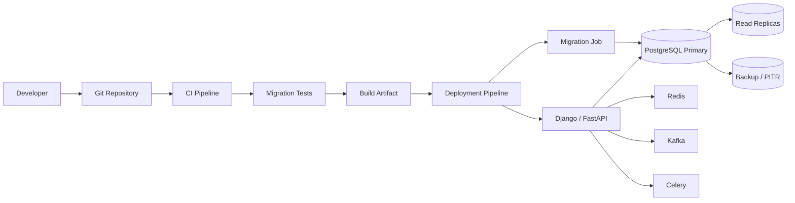
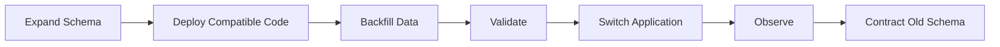
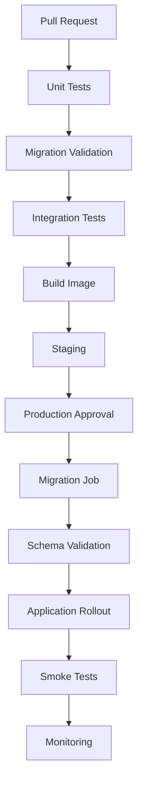
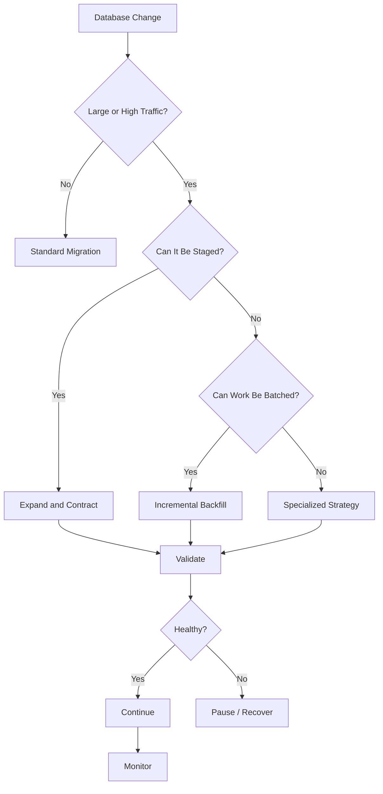

# README

## Overview

The `16- Deployment` section covers the operational side of changing a production SQL database safely.

Database deployment is where schema design, SQL behavior, application compatibility, CI/CD, infrastructure, reliability, and recovery meet. A migration can be syntactically correct and still cause:

- Production downtime
- Lock contention
- Query latency increases
- Connection exhaustion
- Replica lag
- Data corruption
- Failed application deployments
- Irreversible data loss

The core principle throughout this section is:

> **A database change is a production deployment, not just a schema modification.**

The goal is to make database changes:

- Version controlled
- Tested
- Backward compatible where practical
- Observable
- Incremental
- Recoverable
- Operationally predictable

## Navigation

| # | Section | Layer | Description |
|---|---|---|---|
| 01 | [Deployment](./README.md) | Production Engineering | Schema migrations, zero-downtime changes, CI/CD, and production deployment safety |
| 02 | [01- Database Deployment Fundamentals](./01-%20Database%20Deployment%20Fundamentals.md) | Production Engineering | Core concepts and deployment model for production database changes |
| 03 | [02- Schema Changes](./02-%20Schema%20Changes.md) | Production Engineering | Safe schema evolution strategies and patterns |
| 04 | [03- Database Migrations](./03-%20Database%20Migrations.md) | Production Engineering | Migration design, ordering, and lifecycle management |
| 05 | [04- Migration Ordering](./04-%20Migration%20Ordering.md) | Production Engineering | Dependency and execution ordering for migrations |
| 06 | [05- Backward Compatible Schema Changes](./05-%20Backward%20Compatible%20Schema%20Changes.md) | Production Engineering | Compatibility during rolling deployments |
| 07 | [06- Zero Downtime Migrations](./06-%20Zero%20Downtime%20Migrations.md) | Production Engineering | Safe schema changes without planned downtime |
| 08 | [07- Adding Columns Safely](./07-%20Adding%20Columns%20Safely.md) | Production Engineering | Safe column introduction in production |
| 09 | [08- Removing Columns Safely](./08-%20Removing%20Columns%20Safely.md) | Production Engineering | Safe destructive schema changes |
| 10 | [09- Index Deployment](./09-%20Index%20Deployment.md) | Production Engineering | Production index creation and removal |
| 11 | [10- Large Table Migration Strategies](./10-%20Large%20Table%20Migration%20Strategies.md) | Production Engineering | Large-scale data and schema changes |
| 12 | [11- Migration Rollback Strategies](./11-%20Migration%20Rollback%20Strategies.md) | Production Engineering | Rollback, roll-forward, and recovery planning |
| 13 | [12- Database Deployment in CI CD](./12-%20Database%20Deployment%20in%20CI%20CD.md) | Production Engineering | CI/CD pipeline integration for database changes |
| 14 | [13- SQLAlchemy and Alembic Migrations](./13-%20SQLAlchemy%20and%20Alembic%20Migrations.md) | Production Engineering | Alembic-based migration workflows |
| 15 | [14- Django Database Migrations](./14-%20Django%20Database%20Migrations.md) | Production Engineering | Django migration architecture and operations |
| 16 | [15- Production Database Change Checklist](./15-%20Production%20Database%20Change%20Checklist.md) | Production Engineering | End-to-end production database change checklist |

---

## Deployment Architecture

A typical production database deployment looks like:



The important separation is:

```text
Application deployment
        ≠
Database migration
```

They are related, but they have different failure modes and should be reasoned about independently.

---

## What This Section Covers

| Document | Focus |
|---|---|
| `01- Database Deployment Fundamentals.md` | Core concepts and deployment model |
| `02- Migration Ordering.md` | Dependency and execution ordering |
| `03- Schema Change Strategies.md` | Safe schema evolution patterns |
| `04- Migration Ordering.md` | Migration dependency and rollout ordering |
| `05- Backward Compatible Schema Changes.md` | Compatibility during rolling deployments |
| `06- Zero Downtime Migrations.md` | Safe schema changes without planned downtime |
| `07- Adding Columns Safely.md` | Safe column introduction |
| `08- Removing Columns Safely.md` | Safe destructive schema changes |
| `09- Index Deployment.md` | Production index creation and removal |
| `10- Large Table Migration Strategies.md` | Large-scale data and schema changes |
| `11- Migration Rollback Strategies.md` | Rollback, roll-forward, and recovery |
| `12- Database Deployment in CI CD.md` | CI/CD integration |
| `13- SQLAlchemy and Alembic Migrations.md` | Alembic-based migration workflows |
| `14- Django Database Migrations.md` | Django migration architecture and operations |
| `15- Production Database Change Checklist.md` | End-to-end production checklist |

The section is designed to progress from migration fundamentals to production-grade deployment strategy.

---

## Recommended Learning Flow

A practical learning sequence is:

```text
Database Deployment Fundamentals
            ↓
Migration Ordering
            ↓
Schema Change Strategies
            ↓
Backward Compatibility
            ↓
Zero-Downtime Migrations
            ↓
Adding / Removing Columns
            ↓
Index Deployment
            ↓
Large Table Migration Strategies
            ↓
Rollback Strategies
            ↓
CI/CD Database Deployment
            ↓
Alembic / Django Migration Systems
            ↓
Production Database Change Checklist
```

The most important conceptual progression is:

```text
How migrations work
        ↓
How migrations fail
        ↓
How to make migrations compatible
        ↓
How to deploy without downtime
        ↓
How to migrate large datasets
        ↓
How to recover
        ↓
How to automate safely
```

---

## Database Deployment Fundamentals

The fundamentals establish the mental model for production database changes.

Important concepts include:

- Schema versioning
- Migration files
- Migration state
- Database state
- Schema drift
- Deployment ordering
- Migration ownership
- Application/database compatibility
- Transaction behavior
- Production change management

A useful distinction is:

```text
Desired schema
      ↓
Migration plan
      ↓
Actual database state
```

The migration system is responsible for moving the database between known states.

---

## Migration Ordering

Database changes often have dependencies.

For example:

```text
Create table
    ↓
Add column
    ↓
Create index
    ↓
Add foreign key
    ↓
Deploy application
```

Incorrect ordering can cause:

```text
Application expects column
        ↓
Column does not exist
        ↓
Runtime failure
```

or:

```text
Constraint deployed
        ↓
Existing data violates constraint
        ↓
Migration failure
```

Migration ordering therefore includes:

- Migration dependencies
- Application deployment ordering
- Data migration ordering
- Worker ordering
- Event schema ordering
- Cache transitions
- Replica considerations

---

## Schema Change Strategies

Schema changes should be selected based on:

```text
Table size
+
Traffic
+
Lock behavior
+
Data volume
+
Application compatibility
+
Rollback requirements
```

Typical strategies include:

| Strategy | Best suited for |
|---|---|
| Direct DDL | Small, low-risk changes |
| Expand-and-contract | Rolling deployments |
| Batched backfill | Large datasets |
| Concurrent index creation | Large PostgreSQL tables |
| Shadow table | Major transformations |
| Dual write | Representation changes |
| Partitioning | Lifecycle/scale problems |
| Roll-forward | Data corrections |

There is no universally safe migration operation.

Safety depends on workload and context.

---

## Backward-Compatible Schema Changes

Rolling deployments commonly create this state:

```text
Application v1 ─┐
                ├── PostgreSQL
Application v2 ─┘
```

Both versions may run simultaneously.

Therefore the schema should usually support both versions during the transition.

A common pattern is:

```text
Add
 ↓
Deploy compatible code
 ↓
Backfill
 ↓
Switch
 ↓
Remove old dependency
```

This prevents application rollback from becoming impossible because the old version no longer understands the database schema.

---

## Zero-Downtime Migrations

Zero downtime does not mean:

> Every database operation takes zero time.

It means the system remains available while the database transitions.

The common strategy is:



Examples include:

- Adding nullable columns
- Introducing new representations
- Creating indexes concurrently
- Performing incremental backfills
- Delaying destructive cleanup

---

## Adding Columns Safely

For a large production table, prefer:

```text
Add nullable column
        ↓
Deploy compatible application
        ↓
Backfill existing rows
        ↓
Validate
        ↓
Enforce required constraint later
```

Avoid coupling:

```text
ALTER TABLE
+
Huge data update
+
Application deployment
```

into one uncontrolled operation.

---

## Removing Columns Safely

Column removal should generally happen last.

A safe lifecycle is:

```text
Stop new writes
      ↓
Stop reads
      ↓
Deploy compatible application
      ↓
Observe
      ↓
Remove column
```

Before dropping a column, inspect:

- Application code
- Raw SQL
- ORM queries
- Reports
- Views
- Functions
- Triggers
- Background workers
- External consumers

Destructive schema changes should have an explicit recovery strategy.

---

## Index Deployment

Indexes are production infrastructure.

Adding an index can affect:

- Disk usage
- CPU
- I/O
- WAL
- Replication
- Write latency
- Query plans

For large PostgreSQL tables:

```sql
CREATE INDEX CONCURRENTLY orders_customer_created_idx
ON orders (customer_id, created_at DESC);
```

`CREATE INDEX CONCURRENTLY` reduces blocking of normal writes but has operational restrictions and cannot run inside a transaction block.

Index deployment should therefore be planned separately from ordinary schema migrations when appropriate.

---

## Large Table Migration Strategies

Large tables require workload-aware strategies.

A large table is not defined only by row count.

Consider:

```text
Table size
+
Row width
+
Index count
+
Write rate
+
Read rate
+
Replica count
+
Business criticality
```

Large transformations should normally use:

```text
Bounded batch
      ↓
Commit
      ↓
Checkpoint
      ↓
Observe
      ↓
Next batch
```

Avoid one enormous transaction whenever possible.

---

## Keyset Backfills

For large datasets, prefer indexed progression:

```sql
SELECT id
FROM customers
WHERE id > $1
ORDER BY id
LIMIT 5000;
```

This avoids the increasing cost associated with deep `OFFSET` pagination.

Backfills should ideally be:

- Restartable
- Idempotent
- Observable
- Throttled
- Checkpointed

---

## Migration Rollback Strategies

Rollback strategy depends on the type of change.

| Change | Typical recovery |
|---|---|
| Add nullable column | Reverse or leave in place |
| Add index | Drop index |
| Rename | Reverse if compatible |
| Backfill | Corrective migration |
| Large transformation | Roll-forward or repair |
| Drop column | Backup/PITR may be required |
| Delete data | Recovery or selective restoration |
| External event | Compensating action |

A reverse migration does not guarantee data recovery.

For example:

```text
DROP COLUMN
    ↓
Recreate column
```

does not recreate the values that were deleted.

---

## Roll-Forward vs Rollback

For data changes, roll-forward is often safer.

```text
Bad migration
     ↓
Stop
     ↓
Identify incorrect state
     ↓
Create corrective migration
     ↓
Validate
```

Database rollback is fundamentally different from application rollback.

An application can often return to:

```text
Previous binary
```

but a database may already contain:

```text
New schema
New data
New events
```

Therefore:

> **Application rollback and database rollback must be planned independently.**

---

## Database Deployment in CI/CD

A mature pipeline can separate:



Useful CI checks include:

```bash
python manage.py makemigrations --check --dry-run
python manage.py migrate --plan
```

For Alembic:

```bash
alembic check
alembic history
alembic heads
alembic current
```

Migration tests should cover both:

```text
Fresh database
```

and:

```text
Existing production-like database
```

---

## Migration Ownership

Migration execution should be explicit.

Prefer:

```text
CI/CD
   ↓
Migration Job
   ↓
Database
```

over:

```text
Every application pod
   ↓
Migration
```

Running migrations from every Kubernetes pod creates unnecessary concurrency and makes deployment behavior harder to reason about.

---

## Django Database Migrations

Django represents migrations as Python files.

Typical commands:

```bash
python manage.py makemigrations
python manage.py showmigrations
python manage.py migrate
python manage.py sqlmigrate customers 0002
```

Important Django concepts include:

- Migration graph
- Dependencies
- Historical models
- `RunPython`
- `RunSQL`
- `SeparateDatabaseAndState`
- Atomic migrations
- Non-atomic migrations

For data migrations, use historical models:

```python
Customer = apps.get_model("customers", "Customer")
```

rather than importing the current model directly.

---

## SQLAlchemy and Alembic

Alembic provides migration management for SQLAlchemy-based applications.

Typical commands include:

```bash
alembic revision --autogenerate -m "add customer status"
alembic upgrade head
alembic current
alembic history
```

Autogenerated migrations should always be reviewed.

The ORM knows about model metadata, but it does not automatically understand:

- Business semantics
- Production data volume
- Lock risk
- Backfill requirements
- Deployment compatibility
- Recovery requirements

Autogeneration is a starting point, not an approval mechanism.

---

## Migration and Application Compatibility

Database deployment must account for:

```text
Django / FastAPI
        ↓
REST / gRPC
        ↓
Background workers
        ↓
Kafka consumers
        ↓
Redis caches
        ↓
PostgreSQL
```

A database change may affect all of them.

For example:

```text
Rename database field
       ↓
ORM model
       ↓
Serializer
       ↓
REST API
       ↓
Kafka event
       ↓
Consumer
```

Compatibility must be evaluated across the complete dependency graph.

---

## Migration and Celery

Celery workers can outlive an application deployment.

Therefore:

```text
Old worker
New worker
Database
```

may coexist.

For incompatible schema changes:

```text
Expand schema
    ↓
Deploy compatible workers
    ↓
Drain old workers
    ↓
Switch behavior
    ↓
Contract schema
```

Background workers must be included in migration planning.

---

## Migration and Kafka

Database changes can affect event schemas.

A safe architecture often uses:

```text
PostgreSQL
   ↓
Transactional Outbox
   ↓
Kafka
   ↓
Consumers
```

Database rollback does not automatically reverse events already published.

Use:

- Event versioning
- Backward-compatible schemas
- Idempotent consumers
- Replay-safe processing
- Compensating events
- Reconciliation

---

## Migration and Redis

Redis may contain cached representations of database data.

After a schema/data change:

```text
PostgreSQL state
      ≠
Redis state
```

Possible strategies include:

- Cache invalidation
- Cache key versioning
- TTL
- Cache rebuild
- Dual-read compatibility

Do not assume a database migration automatically makes caches correct.

---

## Migration and Connection Pools

Database deployment consumes connection capacity.

The total budget can include:

```text
Application pods
+
Celery workers
+
Migration workers
+
Administrative sessions
+
Monitoring
+
Failover headroom
```

For Django, persistent connections configured with `CONN_MAX_AGE` are not equivalent to a bounded application connection pool.

For SQLAlchemy, consider:

```text
pool_size
+
max_overflow
```

across every process and pod.

---

## Migration and Replication

The primary may generate substantial WAL during migrations:

```text
Migration
    ↓
Primary
    ↓
WAL
    ↓
Replicas
    ↓
Replay
```

Monitor:

- Replica lag
- WAL generation
- Replay rate
- Replica storage
- Query latency

A migration that succeeds on the primary but causes replicas to fall dangerously behind is not a successful production deployment.

---

## Migration and Locks

Before production DDL, understand:

```text
What lock is acquired?
How long can it last?
What blocks it?
What does it block?
```

Inspect active sessions when necessary:

```sql
SELECT
    pid,
    state,
    xact_start,
    wait_event_type,
    wait_event,
    query
FROM pg_stat_activity
WHERE xact_start IS NOT NULL
ORDER BY xact_start;
```

During incidents, identify blockers as well as waiting sessions.

---

## Migration and Timeouts

Important timeout layers include:

```text
Connection timeout
      ↓
Lock timeout
      ↓
Statement timeout
      ↓
CI/CD job timeout
```

They solve different problems.

For example:

- `lock_timeout` limits waiting to acquire locks.
- `statement_timeout` limits statement execution time.

Do not use one timeout as a substitute for understanding migration behavior.

---

## Migration and Kubernetes

A dedicated Kubernetes Job is usually preferable:

```yaml
apiVersion: batch/v1
kind: Job
metadata:
  name: django-migrations
spec:
  template:
    spec:
      restartPolicy: Never
      containers:
        - name: migrate
          image: backend:latest
          command:
            - python
            - manage.py
            - migrate
```

Production implementations should additionally consider:

- Resource requests/limits
- Secrets
- Network policies
- Retry behavior
- Observability
- Deployment ordering
- Failure handling

---

## Production Database Change Checklist

Before every production change, ask:

### Change

- [ ] What exactly changes?
- [ ] Why is the change required?
- [ ] Is the change additive, destructive, or data-transforming?
- [ ] What is the expected duration?

### Data

- [ ] How much data is affected?
- [ ] Is existing data valid?
- [ ] Is the transformation idempotent?
- [ ] Is progress checkpointed?
- [ ] Can the operation be resumed?

### Database

- [ ] What locks are acquired?
- [ ] How long can they last?
- [ ] What indexes are affected?
- [ ] What constraints are affected?
- [ ] What is the expected WAL impact?
- [ ] Is there enough disk capacity?

### Application

- [ ] Is the change backward compatible?
- [ ] Are old application versions safe?
- [ ] Are Celery workers safe?
- [ ] Are REST/gRPC contracts safe?
- [ ] Are Kafka consumers safe?
- [ ] Are Redis caches affected?

### Infrastructure

- [ ] Is database connection capacity sufficient?
- [ ] Are replicas healthy?
- [ ] Is Kubernetes capacity sufficient?
- [ ] Is AWS database capacity sufficient?
- [ ] Is monitoring active?

### Recovery

- [ ] What happens if the migration fails halfway?
- [ ] Can it be reversed?
- [ ] If not, can it be repaired?
- [ ] Is roll-forward safer?
- [ ] Is PITR available?
- [ ] Has backup readiness been verified?

### Execution

- [ ] Is there an explicit owner?
- [ ] Are stop conditions defined?
- [ ] Is the migration staged where appropriate?
- [ ] Is the production window appropriate?
- [ ] Is the change observable?

### Validation

- [ ] Is schema state correct?
- [ ] Is data state correct?
- [ ] Are application APIs healthy?
- [ ] Are query latencies healthy?
- [ ] Are replicas healthy?
- [ ] Are background jobs healthy?
- [ ] Are caches/events healthy?

---

## Production Failure Modes

Common database deployment failures include:

| Failure | Typical cause | Mitigation |
|---|---|---|
| DDL blocks traffic | Lock conflict | Staged migration, lock analysis |
| Migration times out | Large operation | Batch or redesign |
| Replica lag | Excessive WAL | Throttle workload |
| Connection exhaustion | Too many workers | Connection budget |
| Old app crashes | Incompatible schema | Expand-and-contract |
| Data corruption | Incorrect transformation | Validation + idempotency |
| Rollback fails | Data was destructive | PITR / roll-forward |
| Migration runs twice | Multiple deployers | Single migration owner |
| Index build overloads DB | Large concurrent build | Schedule/throttle/monitor |
| Cache becomes stale | Schema/data changed | Invalidate/version cache |
| Event inconsistency | DB/event rollback mismatch | Outbox + compensation |

---

## Security Considerations

Database deployment requires elevated privileges, so migration execution should be tightly controlled.

Prefer separate identities:

```text
app_runtime
    ↓
Normal application access

app_migration
    ↓
Schema changes
```

Protect migration credentials using:

- AWS Secrets Manager
- Kubernetes secret mechanisms
- CI/CD secret stores
- Workload identity
- Short-lived credentials where supported

Avoid:

```text
Application runtime
        ↓
SUPERUSER
```

Migration privileges should not automatically become application privileges.

---

## High Availability and Disaster Recovery

Database deployment should preserve:

```text
Availability
+
Replication
+
Backup
+
Recovery
```

Before high-risk changes:

```text
Verify backup
     ↓
Verify PITR
     ↓
Verify replicas
     ↓
Execute change
     ↓
Validate
```

For critical systems, recovery procedures should be tested independently of an actual incident.

---

## Monitoring

A production migration should monitor the whole system.

### Database

- CPU
- Memory
- I/O
- Storage
- Connections
- Locks
- Deadlocks
- Transaction duration

### Queries

- p95/p99 latency
- Query throughput
- Error rate
- Execution plans
- Slow queries

### Replication

- Replica lag
- WAL generation
- Replay delay

### Application

- Error rate
- Request latency
- Timeouts
- Throughput

### Migration

- Duration
- Progress
- Rows processed
- Batch duration
- Retries
- Failures

---

## Operational Stop Conditions

Define these before execution.

Example:

```text
Pause migration if:

CPU exceeds operational threshold
OR
Replica lag exceeds threshold
OR
Lock waits increase materially
OR
API p99 latency degrades
OR
Database connections approach exhaustion
OR
Disk headroom becomes unsafe
OR
Application error rate increases
```

Stop conditions should be objective enough that an operator can act without debating whether the migration "looks okay."

---

## Cost Considerations

Database migrations can temporarily increase:

- CPU consumption
- I/O
- Storage
- WAL
- Replica resources
- Backup storage
- Kubernetes compute
- Monitoring volume

For large migrations, temporary capacity increases can be cheaper than prolonged production degradation.

Do not optimize migration cost at the expense of database availability.

---

## Common Engineering Mistakes

### Treating Migrations as Application Code Only

A migration executes against a live database and must be reviewed as infrastructure.

### Trusting Autogenerated Migrations

Autogeneration cannot understand operational impact or business semantics.

### Using One Huge Transaction

Large transactions can cause excessive WAL, locks, bloat, and recovery complexity.

### Ignoring Rolling Deployments

Old and new application versions commonly coexist.

### Ignoring Workers

Celery and other background workers may continue using the old schema.

### Assuming Rollback Is Always Possible

Data deletion and external events may be irreversible.

### Ignoring Replicas

A healthy primary does not guarantee healthy replicas.

### Using Redis as the Only Migration Checkpoint

Redis is not a durable source of truth for migration correctness.

### Running Migrations From Every Pod

This complicates execution and can create unnecessary concurrency.

### Dropping Old Schema Immediately

Destructive cleanup should generally be delayed until compatibility and recovery windows have passed.

---

## Senior-Level Review Questions

Before approving a production database change, ask:

```text
What is the current state?

What is the desired state?

What exact SQL will execute?

What locks can it acquire?

How much data will it touch?

What happens under peak traffic?

What happens during a rolling deployment?

What happens if the operation stops halfway?

Can it be resumed?

Can it be reversed?

If not, can it be repaired?

What happens to replicas?

What happens to Redis?

What happens to Kafka?

What happens to Celery?

What happens if the primary fails?

Which metrics determine success?

Which metrics trigger a pause?

Who owns the change?
```

These questions distinguish migration execution from production database engineering.

---

## Practical Production Heuristic

Use this decision process:



The safest migration is usually the one that minimizes:

```text
Blast radius
+
Lock duration
+
Transaction size
+
Compatibility window risk
+
Recovery complexity
```

---

## Section-Wide Production Principles

The entire deployment section can be reduced to a small set of engineering principles:

```text
1. Version-control every database change.
2. Review generated migrations.
3. Understand the SQL and locks.
4. Preserve application compatibility.
5. Separate schema changes from large data work.
6. Prefer incremental and restartable operations.
7. Monitor primary and replicas.
8. Define objective stop conditions.
9. Treat rollback and recovery separately.
10. Validate the complete system after deployment.
```

These principles apply whether the application uses:

- Django
- FastAPI
- SQLAlchemy
- PostgreSQL
- Kubernetes
- AWS
- Celery
- Kafka
- Redis

The tooling changes, but the production reasoning remains the same.

---

## Key Takeaways

- **Database deployment is production system engineering:** schema, data, application versions, workers, replicas, caches, events, infrastructure, and recovery must be considered together.
- **Prefer staged, backward-compatible changes:** expand the schema, deploy compatible code, migrate data incrementally, validate, switch behavior, and contract later.
- **Treat large migrations as controlled workloads:** use batching, checkpoints, idempotency, throttling, lock analysis, and explicit stop conditions.
- **Application rollback does not guarantee database rollback:** destructive data changes and external events may require roll-forward, repair, backup restoration, or PITR.
- **A migration is successful only after system-level validation:** verify schema, data, application behavior, query performance, connections, replicas, workers, caches, and events.