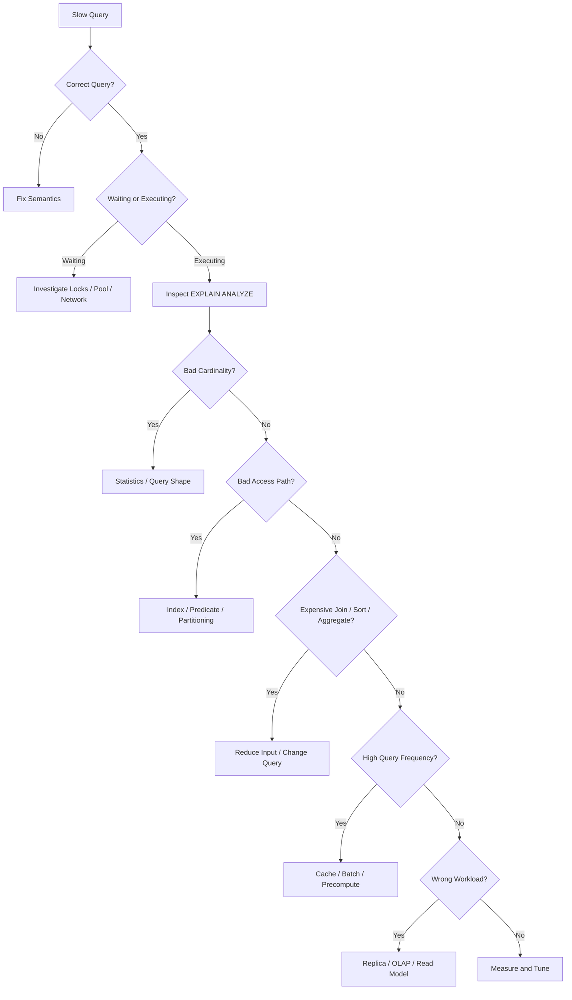

# 11- Query Optimization Questions

## Overview

Query optimization is one of the most important SQL topics for senior backend interviews because it tests whether you can reason about database execution rather than simply write syntactically correct SQL.

A slow query is rarely solved by blindly adding an index. The real problem may be:

- Poor query shape
- Incorrect joins
- Bad cardinality estimates
- Missing or incorrect indexes
- Large sorts or aggregations
- Inefficient pagination
- N+1 queries
- Lock contention
- Connection pool exhaustion
- Replica lag
- Excessive query frequency
- Data growth
- Poor workload architecture

A useful production mental model is:

```text
Application request
      ↓
ORM / SQL construction
      ↓
Network + connection acquisition
      ↓
PostgreSQL parser
      ↓
Planner / optimizer
      ↓
Execution plan
      ↓
CPU / memory / I/O
      ↓
locks / concurrency
      ↓
result transfer
      ↓
application serialization
      ↓
API response
```

Query optimization should therefore answer three separate questions:

1. **Is the query correct?**
2. **Is the query efficient for the current workload?**
3. **Is this workload appropriate for this database architecture?**

---

## What Query Optimization Means

Query optimization is the process of reducing the resources and latency required to execute a query while preserving its semantics.

Typical goals include:

- Lower latency
- Lower CPU consumption
- Lower I/O
- Lower memory usage
- Fewer rows processed
- Fewer rows transferred
- Better concurrency
- More predictable tail latency

The goal is not necessarily:

> "Make this query as fast as physically possible."

The production goal is:

> **Achieve the required latency and throughput with acceptable resource consumption and operational risk.**

---

## Query Optimization Hierarchy

A practical optimization hierarchy is:

```text
Correctness
    ↓
Query shape
    ↓
Result cardinality
    ↓
Access path
    ↓
Join strategy
    ↓
Aggregation / sorting
    ↓
Memory / I/O
    ↓
Concurrency
    ↓
Workload architecture
```

Do not start by tuning PostgreSQL configuration when the query itself is returning millions of unnecessary rows.

---

## Measure Before Optimizing

Never optimize based only on intuition.

Start with:

```sql
EXPLAIN (ANALYZE, BUFFERS)
SELECT
    id,
    customer_id,
    total_amount
FROM orders
WHERE customer_id = $1
ORDER BY created_at DESC
LIMIT 50;
```

For production workload analysis, also consider:

```sql
SELECT
    query,
    calls,
    total_exec_time,
    mean_exec_time,
    rows
FROM pg_stat_statements
ORDER BY total_exec_time DESC
LIMIT 20;
```

Useful measurements include:

- Mean latency
- p95 latency
- p99 latency
- Calls per second
- Total execution time
- Rows returned
- Rows examined
- Buffer reads
- Temporary I/O
- CPU
- Lock waits
- Connection acquisition time

---

## Query Latency Is More Than Execution Time

An API request may experience:

```text
Request
  ↓
connection acquisition
  ↓
query execution
  ↓
lock wait
  ↓
result transfer
  ↓
serialization
```

A database query that reports 100 ms execution time can still produce a 500 ms API response if:

- The connection pool is exhausted
- The transaction waits on locks
- The network is slow
- The application performs additional queries
- Serialization is expensive

Therefore:

> Database execution time is only one component of end-to-end latency.

---

## EXPLAIN

`EXPLAIN` shows the planner's chosen execution strategy without executing the query.

Example:

```sql
EXPLAIN
SELECT *
FROM orders
WHERE customer_id = 42;
```

It helps answer:

- Which scan is being used?
- Which indexes are considered?
- What are the estimated rows?
- Which joins are chosen?
- Is sorting required?
- Is aggregation required?
- Is parallelism being considered?

---

## EXPLAIN ANALYZE

`EXPLAIN ANALYZE` actually executes the query and reports actual execution statistics.

```sql
EXPLAIN (ANALYZE, BUFFERS)
SELECT *
FROM orders
WHERE customer_id = 42;
```

This provides:

- Actual rows
- Actual execution time
- Loop counts
- Buffer activity
- Actual behavior compared with estimates

Use caution with modifying statements because `EXPLAIN ANALYZE` executes them.

For production troubleshooting, run expensive analysis carefully and preferably against representative or controlled environments when possible.

---

## Reading an Execution Plan

A simplified plan:

```text
Limit
  ↓
Index Scan
  ↓
orders
```

Another:

```text
Sort
  ↓
Seq Scan
  ↓
orders
```

The important question is not:

> "Does it have an Index Scan?"

Instead ask:

> "Why did PostgreSQL choose this plan, and is that plan appropriate for the actual workload?"

---

## Estimated Rows vs Actual Rows

One of the most important optimization signals is:

```text
estimated rows
vs
actual rows
```

Example:

```text
estimated rows: 100
actual rows:    100000
```

A large mismatch indicates a cardinality-estimation problem.

Poor estimates can cause the optimizer to choose inappropriate:

- Join algorithms
- Join order
- Scan methods
- Parallel plans
- Memory allocations

---

## Cardinality Estimation

The optimizer estimates how many rows each operation will produce.

For:

```sql
WHERE status = 'completed'
```

PostgreSQL uses statistics about the column distribution.

If statistics are stale or insufficient, the estimate can be wrong.

This can lead to:

```text
wrong estimate
    ↓
wrong plan
    ↓
large resource consumption
    ↓
high latency
```

---

## ANALYZE and Statistics

PostgreSQL maintains statistics used by the planner.

You can explicitly refresh them:

```sql
ANALYZE orders;
```

Autovacuum/autoanalyze normally handles this automatically, but large or unusual data changes can make statistics temporarily less representative.

Inspect statistics with:

```sql
SELECT
    attname,
    n_distinct,
    most_common_vals,
    histogram_bounds
FROM pg_stats
WHERE tablename = 'orders';
```

---

## Extended Statistics

Simple per-column statistics can miss correlations between columns.

For example:

```text
country
+
state
```

may not be independent.

PostgreSQL supports extended statistics:

```sql
CREATE STATISTICS orders_status_customer_stats
ON status, customer_id
FROM orders;
```

Then:

```sql
ANALYZE orders;
```

Extended statistics can improve estimates for certain correlated predicates.

---

## Sequential Scan

A sequential scan reads the table sequentially.

```text
Seq Scan
   ↓
many/all table pages
   ↓
filter rows
```

A sequential scan is not automatically bad.

It can be the best plan when:

- The table is small
- A large fraction of rows is needed
- The query is not selective
- Sequential I/O is cheaper than random access

---

## Index Scan

An index scan typically:

```text
Index
  ↓
matching index entries
  ↓
heap/table rows
  ↓
result
```

It is attractive when the query is selective and the access pattern matches the index.

Example:

```sql
CREATE INDEX idx_orders_customer_id
ON orders (customer_id);
```

Query:

```sql
SELECT *
FROM orders
WHERE customer_id = $1;
```

The planner decides whether the index path is actually cheaper.

---

## Bitmap Scan

PostgreSQL may use:

```text
Bitmap Index Scan
        ↓
Bitmap Heap Scan
        ↓
Rows
```

This can be useful when a moderate number of rows match.

It allows PostgreSQL to identify relevant heap pages before fetching them.

Do not interpret a bitmap scan as an index failure.

---

## Index-Only Scan

An index-only scan can satisfy a query primarily from the index.

Example:

```sql
CREATE INDEX idx_orders_customer_created
ON orders (customer_id, created_at)
INCLUDE (total_amount);
```

Potential query:

```sql
SELECT
    created_at,
    total_amount
FROM orders
WHERE customer_id = $1;
```

Whether PostgreSQL can avoid heap access depends partly on visibility information.

---

## Query Selectivity

Selectivity describes how much a predicate reduces the input relation.

Highly selective:

```sql
WHERE id = $1
```

Potentially low-selectivity:

```sql
WHERE status = 'active'
```

A highly selective query often benefits from an index.

A low-selectivity query may legitimately use a sequential scan.

---

## Sargability

Queries should expose predicates in forms that allow efficient access paths.

Potentially problematic:

```sql
WHERE date(created_at) = $1
```

Often better:

```sql
WHERE created_at >= $1
  AND created_at < $2;
```

This allows a normal index on `created_at` to support a range condition.

Alternatively, if the expression is intentional and frequently used, an expression index may be appropriate.

---

## Avoid SELECT *

Prefer:

```sql
SELECT
    id,
    customer_id,
    created_at,
    total_amount
FROM orders
WHERE customer_id = $1;
```

instead of:

```sql
SELECT *
FROM orders
WHERE customer_id = $1;
```

Benefits include:

- Less data transferred
- Lower serialization cost
- Potentially smaller index requirements
- Better compatibility with covering indexes
- Reduced application memory usage

`SELECT *` is not always slow, but it can become expensive as tables grow wider.

---

## Large Result Sets

Even a well-indexed query can be slow if it returns hundreds of thousands of rows.

Example:

```sql
SELECT *
FROM orders
WHERE customer_id = $1;
```

If the customer has millions of orders, the problem may be result volume rather than index availability.

Possible solutions:

- Pagination
- Filtering
- Aggregation
- Asynchronous exports
- Streaming where appropriate
- Precomputed reports

---

## LIMIT Is Not a Universal Optimization

This:

```sql
SELECT *
FROM orders
LIMIT 100;
```

does not automatically make a bad query good.

If the query first performs an expensive sort:

```sql
ORDER BY expensive_expression
LIMIT 100;
```

the database may still need substantial work.

A matching index can sometimes make top-N retrieval much cheaper.

---

## OFFSET Pagination

This is problematic at scale:

```sql
SELECT *
FROM orders
ORDER BY created_at DESC
LIMIT 50 OFFSET 500000;
```

The database may need to walk through many preceding rows.

For high-volume APIs, prefer keyset pagination:

```sql
SELECT
    id,
    created_at,
    total_amount
FROM orders
WHERE (created_at, id) < ($1, $2)
ORDER BY created_at DESC, id DESC
LIMIT 50;
```

This works especially well with a matching index.

---

## N+1 Query Problem

An API can be slow even when every individual query is fast.

Bad pattern:

```text
1 query for customers
+
N queries for orders
```

For 1,000 customers:

```text
1 + 1000 = 1001 queries
```

Potential solutions:

- `select_related()`
- `prefetch_related()`
- Batch queries
- Explicit joins
- Aggregation
- DataLoader-style batching

An index may reduce the cost of each query but does not eliminate the architectural problem.

---

## Join Optimization

Consider:

```sql
SELECT
    c.id,
    c.name,
    o.id,
    o.total_amount
FROM customers AS c
JOIN orders AS o
    ON o.customer_id = c.id
WHERE c.id = $1;
```

Potential indexes include:

```text
customers(id)
orders(customer_id)
```

The primary key on `customers.id` is typically already indexed.

The foreign-key side may require an explicit index depending on schema and workload.

---

## Join Cardinality

A join can unexpectedly multiply rows.

For example:

```text
customer
  × orders
  × order_items
```

can create a much larger intermediate result than expected.

Before optimizing the join algorithm, verify:

- Join predicates
- Relationship cardinality
- Duplicate rows
- Data integrity
- Filtering

An incorrect join cannot be fixed with a better index.

---

## Nested Loop Join

Nested loop conceptually:

```text
outer rows
    ↓
for each outer row
    ↓
search inner relation
```

It can be excellent when:

- Outer input is small
- Inner side has an efficient index
- The number of iterations is low

It can be disastrous when the outer relation unexpectedly contains millions of rows.

---

## Hash Join

A hash join generally builds a hash structure for one side and probes it with the other.

Conceptually:

```text
Build input
    ↓
Hash table
    ↑
Probe input
```

It is often useful for large equality joins.

Memory availability matters.

If operations spill to temporary storage, performance can degrade significantly.

---

## Merge Join

A merge join works with sorted inputs.

Conceptually:

```text
sorted A ──┐
           ├── Merge Join
sorted B ──┘
```

It can be efficient when both inputs are already appropriately ordered or can be produced efficiently in sorted order.

---

## Join Algorithm Comparison

| Join | Strong Use Case | Common Risk |
|---|---|---|
| Nested Loop | Small outer relation + indexed inner relation | Explodes with large outer input |
| Hash Join | Large equality joins | Memory/temp I/O pressure |
| Merge Join | Large sorted inputs | Sorting cost |

Do not memorize:

> "Hash join is always faster."

The optimizer chooses based on estimates and costs.

---

## Join Order

For:

```sql
A
JOIN B
JOIN C
JOIN D
```

the order in which relations are physically joined can have a major effect on intermediate cardinality.

A good plan may reduce rows early:

```text
A
 ↓ filter
small result
 ↓ join
B
 ↓ filter
smaller result
 ↓ join
C
```

A poor plan may create a huge intermediate result before filtering.

---

## Filter Early, But Preserve Semantics

Filtering early can reduce work:

```sql
SELECT ...
FROM orders
WHERE status = 'paid'
  AND created_at >= $1;
```

But moving predicates between:

- `WHERE`
- `ON`
- `HAVING`
- Subqueries
- CTEs

can change semantics, especially with outer joins.

Optimization must preserve correctness.

---

## LEFT JOIN Predicate Trap

Compare:

```sql
SELECT
    c.id,
    o.id
FROM customers AS c
LEFT JOIN orders AS o
    ON o.customer_id = c.id
WHERE o.status = 'paid';
```

versus:

```sql
SELECT
    c.id,
    o.id
FROM customers AS c
LEFT JOIN orders AS o
    ON o.customer_id = c.id
   AND o.status = 'paid';
```

The first can effectively eliminate customers without matching paid orders.

The second preserves customers while restricting the joined rows.

Do not move predicates solely for perceived performance.

---

## EXISTS vs JOIN

If the requirement is:

> Return customers who have at least one paid order.

This can be expressed as:

```sql
SELECT c.*
FROM customers AS c
WHERE EXISTS (
    SELECT 1
    FROM orders AS o
    WHERE o.customer_id = c.id
      AND o.status = 'paid'
);
```

This directly expresses existence.

A join may create duplicate customer rows if multiple orders match.

Correct semantics can also improve optimization opportunities.

---

## IN vs EXISTS

These can sometimes produce similar plans:

```sql
WHERE customer_id IN (
    SELECT customer_id
    FROM orders
)
```

and:

```sql
WHERE EXISTS (
    SELECT 1
    FROM orders
    WHERE orders.customer_id = customers.id
)
```

Do not rely on outdated rules such as:

> "EXISTS is always faster."

Modern optimizers can transform logically equivalent expressions.

Choose the expression that clearly represents the intended semantics and validate the plan.

---

## NOT IN and NULL

This is a correctness trap:

```sql
WHERE customer_id NOT IN (
    SELECT customer_id
    FROM blocked_customers
)
```

If the subquery contains `NULL`, SQL's three-valued logic can produce surprising results.

Often:

```sql
WHERE NOT EXISTS (
    SELECT 1
    FROM blocked_customers AS b
    WHERE b.customer_id = c.id
)
```

is safer when expressing anti-existence semantics.

---

## Aggregation Optimization

Large aggregations can consume significant CPU and memory.

Example:

```sql
SELECT
    customer_id,
    SUM(total_amount)
FROM orders
GROUP BY customer_id;
```

Consider:

- Input row count
- Filtering
- Indexes
- Hash vs sort aggregation
- Memory
- Partitioning
- Pre-aggregation
- Materialized views

---

## Conditional Aggregation

Instead of multiple queries:

```sql
SELECT
    COUNT(*) FILTER (WHERE status = 'paid') AS paid_count,
    COUNT(*) FILTER (WHERE status = 'failed') AS failed_count
FROM orders;
```

This can consolidate related metrics into one query.

But if the query scans a massive table on every API request, precomputation may still be necessary.

---

## Sorting

Sorting can be expensive:

```sql
SELECT *
FROM orders
ORDER BY created_at DESC;
```

Potential optimizations include:

- Appropriate index
- Filtering before sorting
- `LIMIT`
- Keyset pagination
- Reduced result width

An index such as:

```sql
CREATE INDEX idx_orders_created_id
ON orders (created_at DESC, id DESC);
```

can support ordered access patterns.

---

## Temporary Disk I/O

Large sorts and hash operations can spill to disk.

Execution plans can expose temporary I/O when using:

```sql
EXPLAIN (ANALYZE, BUFFERS)
```

If a query spills:

1. Understand why the operation is large.
2. Reduce input rows if possible.
3. Reduce row width.
4. Improve query shape.
5. Evaluate appropriate memory settings.
6. Consider workload isolation.

Do not blindly increase `work_mem`.

---

## work_mem and Concurrency

`work_mem` applies to individual operations, not simply to an entire query or connection.

A query can perform multiple memory-intensive operations.

With high concurrency:

```text
work_mem
× concurrent operations
```

can produce substantial memory consumption.

This is why increasing `work_mem` globally can turn a query optimization into a database memory incident.

---

## CTEs and Optimization

CTEs can improve readability:

```sql
WITH customer_revenue AS (
    SELECT
        customer_id,
        SUM(total_amount) AS revenue
    FROM orders
    GROUP BY customer_id
)
SELECT *
FROM customer_revenue
WHERE revenue > 10000;
```

But CTE behavior depends on PostgreSQL version and materialization decisions.

Modern PostgreSQL can inline eligible non-recursive CTEs.

Explicit:

```sql
MATERIALIZED
```

and:

```sql
NOT MATERIALIZED
```

should be used intentionally.

---

## Subquery Optimization

Do not automatically rewrite every subquery into a join.

For example:

```sql
WHERE EXISTS (...)
```

may express the intended semantics more clearly than a join.

The optimizer can often transform different query formulations into similar plans.

Compare actual plans rather than applying syntax-based optimization folklore.

---

## OR Conditions

Queries containing:

```sql
WHERE customer_id = $1
   OR email = $2
```

may produce different plans depending on selectivity and available indexes.

Separate indexes:

```text
customer_id
email
```

may allow bitmap strategies.

But if the query remains expensive, alternative query structures or specialized indexes may be appropriate.

Always inspect the plan.

---

## Functions in Predicates

Potentially problematic:

```sql
WHERE lower(email) = $1;
```

if only a normal index exists on:

```text
email
```

A matching expression index may help:

```sql
CREATE INDEX idx_users_lower_email
ON users (lower(email));
```

The broader rule is:

> The access path must match the expression and operator semantics used by the query.

---

## Data Type Mismatch

Avoid unnecessary casts around indexed columns.

Potentially problematic:

```sql
WHERE customer_id::text = $1;
```

Prefer type-correct parameters:

```sql
WHERE customer_id = $1;
```

This is particularly important when SQL is generated by application code.

---

## Query Parameterization

Always parameterize values:

```sql
SELECT *
FROM users
WHERE email = $1;
```

Do not optimize SQL by constructing unsafe strings:

```python
query = f"SELECT * FROM users WHERE email = '{email}'"
```

Query optimization must never compromise SQL injection defenses.

---

## Prepared Statements and Plan Selection

Prepared statements can reuse planning work, but PostgreSQL may choose between custom and generic plans.

This matters when parameter values have dramatically different selectivity.

For example:

```text
customer A → 10 rows
customer B → 10 million rows
```

A single generic plan may not be ideal for both.

When investigating parameter-sensitive performance, inspect:

- Prepared statement behavior
- Generic vs custom plans
- Statistics
- Data distribution
- `plan_cache_mode`

---

## Parameter-Sensitive Queries

A query may be fast for:

```text
customer_id = 1
```

and slow for:

```text
customer_id = 999999
```

because the number of matching rows differs significantly.

This is not necessarily a missing-index problem.

It can be a plan-selection problem caused by data skew.

---

## Query Frequency Matters

Consider:

```text
Query A:
50 ms × 1 request/minute

Query B:
5 ms × 10,000 requests/second
```

Query B may consume dramatically more database resources.

A senior optimization process prioritizes:

```text
total workload impact
=
cost per execution
× execution frequency
× concurrency
```

not just the slowest single query.

---

## pg_stat_statements

`pg_stat_statements` is one of the most useful PostgreSQL extensions for production query analysis.

Example:

```sql
SELECT
    calls,
    total_exec_time,
    mean_exec_time,
    rows,
    query
FROM pg_stat_statements
ORDER BY total_exec_time DESC
LIMIT 20;
```

Useful dimensions include:

- Total execution time
- Mean execution time
- Calls
- Rows
- Shared block reads
- Shared block hits
- Temporary blocks

---

## Total Time vs Mean Time

A query with:

```text
mean = 1 ms
calls = 10 million
```

may be more important than:

```text
mean = 5 seconds
calls = 2
```

for overall system performance.

Use both:

```text
latency
+
frequency
```

to prioritize optimization.

---

## Query Optimization and Connection Pools

A slow query occupies a database connection longer.

That causes:

```text
slow query
   ↓
connection held longer
   ↓
pool exhaustion
   ↓
requests wait
   ↓
API latency increases
```

Therefore query optimization can improve application capacity even when database CPU is not saturated.

---

## Query Optimization and Locks

A query may appear slow because it is waiting for a lock.

Inspect:

```sql
SELECT
    pid,
    wait_event_type,
    wait_event,
    query
FROM pg_stat_activity
WHERE state <> 'idle';
```

If the query is blocked, making its SQL faster may not solve the immediate latency problem.

Diagnose:

```text
execution time
vs
lock wait time
```

separately.

---

## Query Optimization and Long Transactions

Long-running transactions can cause:

- MVCC cleanup delays
- Table/index bloat
- Vacuum pressure
- Lock retention
- Connection exhaustion

A fast query inside a badly scoped transaction can still contribute to production problems.

Keep transaction boundaries short and intentional.

---

## Query Optimization and Read Replicas

Read replicas can scale read workloads:

```text
Application
   ├── writes → primary
   └── reads  → replica
```

But replicas do not optimize a bad query.

A poorly designed analytical query can simply move the CPU problem to the replica.

Also consider:

- Replica lag
- Read-after-write requirements
- Long-running queries
- Replay conflicts

---

## Query Optimization and Redis

Caching can eliminate repeated database work:

```text
API
 ↓
Redis
 ↓ miss
PostgreSQL
 ↓
Redis
 ↓
API
```

But caching should not be the first response to an incorrect query or missing access path.

Consider:

- Cache hit rate
- TTL
- Invalidation
- Stampede protection
- Tenant isolation
- Freshness requirements

---

## Cache Stampede

If a popular cached query expires:

```text
cache expires
     ↓
1000 requests miss
     ↓
1000 DB queries
     ↓
database overload
```

Possible protections include:

- Request coalescing
- Distributed locking
- Probabilistic early refresh
- Staggered expiration
- Background refresh

The correct strategy depends on the application's consistency and failure requirements.

---

## Query Optimization and Celery

Heavy work should not necessarily execute synchronously inside an API request.

Instead:

```text
API
 ↓
enqueue job
 ↓
Celery
 ↓
PostgreSQL
 ↓
report/export
```

This is useful for:

- Large exports
- Batch processing
- Heavy analytics
- Backfills
- Reconciliation

The worker workload must still be bounded so that background jobs do not overwhelm the transactional database.

---

## Query Optimization and Kafka

For continuously computed metrics:

```text
PostgreSQL / services
        ↓
Kafka
        ↓
Consumers
        ↓
read model / analytics store
        ↓
API
```

This can avoid repeatedly scanning transactional tables with expensive aggregation queries.

The trade-off is additional:

- Operational complexity
- Eventual consistency
- Replay handling
- Schema evolution
- Idempotency requirements

---

## Partition Pruning

Partitioning can reduce the amount of data considered by a query.

Example:

```sql
SELECT *
FROM events
WHERE created_at >= $1
  AND created_at < $2;
```

If the table is partitioned by time and the predicate aligns with the partition key, PostgreSQL may prune irrelevant partitions.

Partitioning and indexing solve different problems:

```text
Partition pruning
→ fewer physical partitions considered

Index
→ faster access within selected data
```

---

## Materialized Views

If an expensive aggregation is repeatedly requested:

```sql
CREATE MATERIALIZED VIEW customer_revenue AS
SELECT
    customer_id,
    SUM(total_amount) AS revenue
FROM orders
GROUP BY customer_id;
```

The API can query precomputed results instead of recalculating the aggregation every time.

Trade-off:

```text
lower query-time cost
+
higher refresh complexity
+
potentially stale data
```

---

## Denormalization

Sometimes repeated joins or aggregations justify storing derived data.

Example:

```text
orders
  ↓
customer.total_revenue
```

This can make reads faster but introduces consistency and update complexity.

Denormalization should be justified by:

- Measured read workload
- Latency requirements
- Update frequency
- Consistency requirements

Do not denormalize preemptively.

---

## Query Optimization and OLTP vs OLAP

Transactional workloads typically prioritize:

```text
short queries
high concurrency
predictable latency
```

Analytical workloads often involve:

```text
large scans
large aggregations
complex joins
longer execution
```

If an OLTP database is repeatedly executing large analytical queries, optimization may require workload separation rather than SQL tuning.

---

## Query Optimization Decision Tree



---

## Production Optimization Workflow

A disciplined workflow:

### Capture the Exact Query

Get:

- SQL
- Parameters
- Frequency
- Endpoint/job
- Expected result size

### Confirm Correctness

Check:

- Joins
- Filters
- `NULL`
- Authorization
- Tenant boundaries
- Cardinality

### Measure

Use:

```sql
EXPLAIN (ANALYZE, BUFFERS)
```

and workload statistics.

### Identify the Bottleneck

Classify it as:

```text
CPU
I/O
memory
sorting
aggregation
join
lock wait
network
connection pool
query frequency
```

### Apply the Smallest Effective Change

Possible changes:

- Query rewrite
- Index
- Statistics
- Pagination
- Batch processing
- Caching
- Materialization
- Read replica
- Workload separation

### Validate

Compare:

```text
before
vs
after
```

using representative data and workload.

### Monitor

Watch:

- Latency
- CPU
- I/O
- Memory
- Connections
- Locks
- Replica lag
- Error rate

---

## Benchmarking Query Changes

Do not rely only on one execution.

Consider:

- Cold vs warm cache
- Representative data volume
- Different parameter values
- Concurrent execution
- Production-like indexes
- Realistic result sizes

A query that is fast for one customer may be slow for a customer with ten million rows.

---

## Query Plan Regression

A query can become slower without application code changing.

Possible causes:

- Data growth
- Data distribution changes
- Statistics changes
- Index changes
- PostgreSQL upgrades
- Configuration changes
- Parameter distribution
- Partition growth

Therefore query performance should be monitored continuously.

---

## High CPU Caused by Queries

If PostgreSQL CPU is high:

```text
CPU
 ↓
pg_stat_statements
 ↓
identify workload
 ↓
EXPLAIN expensive queries
```

Do not immediately scale the database vertically.

First determine whether CPU is caused by:

- Full scans
- Joins
- Sorts
- Aggregations
- Functions
- JSON processing
- Regex
- N+1 traffic
- Retry storms

---

## High I/O Caused by Queries

High I/O can result from:

- Large sequential scans
- Random heap fetches
- Poor cache locality
- Large indexes
- Temp spills
- Autovacuum
- Backfills

Use:

```sql
EXPLAIN (ANALYZE, BUFFERS)
```

to understand buffer behavior.

Then correlate with infrastructure metrics.

---

## Query Optimization and AWS

On AWS-managed PostgreSQL such as Amazon RDS or Aurora, database optimization still begins with query behavior.

Monitor:

- CPU utilization
- Database connections
- Read/write IOPS
- Storage
- Network
- Replica lag
- Query latency

Cloud scaling can provide more capacity, but scaling hardware does not eliminate inefficient SQL.

---

## Query Optimization and Kubernetes

Kubernetes can increase application concurrency rapidly:

```text
2 pods
 ↓
10 pods
 ↓
50 pods
```

If each pod has its own connection pool, query load can multiply.

Therefore:

```text
application replicas
× pool size
× background workers
```

must be considered when evaluating database capacity.

A query that was acceptable at low concurrency can become a database incident after a deployment scales the application fleet.

---

## Query Optimization and Deployment

A new release can introduce:

- New queries
- N+1 behavior
- Different filters
- New ORM joins
- Missing indexes
- Higher query frequency

Use:

- Query monitoring
- Slow-query alerts
- Plan comparison
- Canary deployments
- Load tests
- Regression tests

for high-risk changes.

---

## Security Considerations

Optimization must not weaken security.

Do not:

- Remove tenant filters
- Disable RLS
- Use unsafe dynamic SQL
- Log sensitive query parameters
- Bypass authorization
- Expose internal database data to improve performance

Use parameterized queries:

```sql
SELECT *
FROM orders
WHERE tenant_id = $1
  AND customer_id = $2;
```

Performance and security are both correctness requirements.

---

## High Availability Considerations

Optimization changes can affect HA indirectly.

For example:

```text
large index build
    ↓
high I/O
    ↓
WAL pressure
    ↓
replica lag
    ↓
weaker read availability
```

Similarly:

```text
long-running query
    ↓
replica replay conflict
    ↓
query cancellation
```

Optimization should therefore consider the complete replicated architecture.

---

## Disaster Recovery Considerations

Large indexes, materialized views, and denormalized data can affect:

- Backup size
- Restore duration
- Recovery workload

If derived data can be rebuilt, document that recovery process.

For critical systems, measure:

```text
backup duration
restore duration
PITR recovery time
post-recovery query performance
```

---

## Cost Considerations

Optimization can reduce:

- Database CPU
- I/O
- Storage
- Replica count requirements
- Scaling pressure
- Cloud spend

But optimization work also has engineering cost.

A complicated query rewrite that saves:

```text
$5/month
```

may not be worthwhile.

A query optimization that avoids scaling a production database cluster can be highly valuable.

Prioritize by business and operational impact.

---

## Common Optimization Mistakes

### Adding an Index Immediately

Why it happens:

> "The query is slow, so it must need an index."

Reality:

The problem may be joins, cardinality, sorting, locking, or query frequency.

### Optimizing Without EXPLAIN

Why it happens:

Developers reason from SQL text rather than execution behavior.

Fix:

```sql
EXPLAIN (ANALYZE, BUFFERS)
```

### Treating Sequential Scans as Bugs

Sequential scans can be optimal.

### Optimizing Only Mean Latency

A query can have acceptable average latency but unacceptable p99 latency.

### Ignoring Query Frequency

A tiny query executed millions of times can dominate database workload.

### Ignoring Connection Pools

A query that holds connections for too long can cause application-wide latency.

### Increasing work_mem Globally

This can create memory pressure under concurrency.

### Using Redis to Hide Bad SQL

Caching can reduce load but may hide correctness or query-design problems.

### Using LIMIT to Hide Incorrect Queries

A limit changes result semantics and does not necessarily eliminate expensive work.

### Using DISTINCT to Hide Join Errors

`DISTINCT` may remove symptoms while leaving incorrect relational logic.

### Rewriting Every Query Into a JOIN

Different SQL formulations can have equivalent or different plans.

Optimize semantics and execution, not syntax preferences.

### Ignoring Production Data Distribution

A query can behave differently when a customer has millions of records.

### Optimizing Only the Database

Application-level N+1 queries and excessive request concurrency can dominate the workload.

---

## Interview Traps

### What Is the First Thing You Do When a Query Is Slow?

Do not immediately add an index.

First:

```text
capture exact query
→ verify correctness
→ EXPLAIN ANALYZE
→ identify bottleneck
```

---

### Is a Sequential Scan Always Bad?

No.

It can be optimal for small tables or queries that need a large fraction of the table.

---

### Does an Index Always Improve Performance?

No.

Indexes have:

- Read benefits
- Write costs
- Storage costs
- Maintenance costs

The planner may also choose not to use them.

---

### What Does EXPLAIN ANALYZE Tell You?

It executes the query and reports actual runtime behavior, including actual rows and execution timing.

Combined with:

```sql
BUFFERS
```

it provides useful I/O information.

---

### Estimated Rows Are Very Different From Actual Rows. What Does That Mean?

It indicates a cardinality-estimation problem.

Investigate:

- Statistics
- Data distribution
- Correlated columns
- Query predicates
- Extended statistics

---

### What Is the Difference Between a Slow Query and a Lock Wait?

A slow query may be spending time executing CPU/I/O work.

A lock wait means the query is waiting for another transaction or database operation.

They require different remedies.

---

### Is EXISTS Always Faster Than JOIN?

No.

It depends on semantics, data, indexes, and the chosen execution plan.

Use `EXISTS` when existence is the intended semantic.

---

### Is a CTE Faster Than a Subquery?

Not inherently.

Modern PostgreSQL can inline eligible non-recursive CTEs, while explicit materialization can change performance.

Measure the actual plan.

---

### Why Can Adding More Application Pods Make the Database Slower?

Because application concurrency increases.

If each pod has a connection pool:

```text
pods × pool size
```

can dramatically increase concurrent queries.

More concurrency can amplify:

- CPU
- I/O
- locks
- memory usage
- connection pressure

---

### When Should You Use Redis Instead of Query Optimization?

When the workload is genuinely cacheable and repeated reads justify caching.

Do not use Redis as a substitute for fixing incorrect SQL.

---

### When Should You Move Work to an OLAP System?

When large analytical workloads repeatedly compete with transactional workloads and cannot be efficiently handled through indexes, precomputation, replicas, or other OLTP techniques.

---

### What Is the Most Important Query Optimization Skill?

Being able to connect:

```text
SQL
→ execution plan
→ database resources
→ application workload
→ system architecture
```

rather than memorizing isolated optimization rules.

---

## Practical Interview Problems

### A Query Uses Sequential Scan Despite an Index

Query:

```sql
SELECT *
FROM orders
WHERE status = 'completed';
```

Index:

```sql
CREATE INDEX idx_orders_status
ON orders (status);
```

Possible explanations:

- Most rows are completed
- Table is small
- Statistics estimate low selectivity
- Index cost exceeds sequential scan cost

Correct response:

```text
Inspect EXPLAIN ANALYZE.
Do not force the index without evidence.
```

---

### Query Has a Huge Rows Removed by Filter

Example plan:

```text
Index Scan
  Index Cond: ...
  Filter: ...
  Rows Removed by Filter: 5000000
```

This suggests the index may not sufficiently narrow the access path.

Investigate:

- Composite index
- Predicate ordering
- Partial index
- Query shape
- Data distribution

Do not automatically add another index without checking the complete workload.

---

### Query Has a Nested Loop With Millions of Loops

Example:

```text
Nested Loop
  loops=1000000
```

Investigate:

- Outer relation cardinality
- Inner index
- Cardinality estimates
- Join condition
- Data skew

The nested loop itself is not automatically wrong.

The problem may be that the optimizer expected far fewer outer rows.

---

### Query Has a Large Sort

Example:

```text
Sort
  Sort Method: external merge
```

Potential investigation:

```text
Why are so many rows being sorted?
Can filtering happen earlier?
Can an index provide the required order?
Is the result unnecessarily large?
Is keyset pagination possible?
```

Only then consider memory tuning.

---

### API Endpoint Is Slow but Query Is Fast

Suppose:

```text
DB query = 20 ms
API latency = 800 ms
```

Investigate:

- Connection acquisition
- N+1 queries
- Network
- Serialization
- External API calls
- Redis
- Application CPU
- Lock waits in other queries

Query optimization is not synonymous with database execution optimization.

---

## Senior-Level Optimization Framework

When answering a senior interview question, structure the response around:

```text
1. Correctness
2. Measurement
3. Execution plan
4. Cardinality
5. Access path
6. Joins
7. Aggregation/sorting
8. Concurrency
9. Workload frequency
10. Architecture
```

This demonstrates engineering reasoning rather than memorized SQL tricks.

---

## Production Query Review Checklist

- [ ] Query semantics are correct.
- [ ] Result grain is understood.
- [ ] Join cardinality is understood.
- [ ] Tenant and authorization boundaries are preserved.
- [ ] Exact SQL and representative parameters are known.
- [ ] `EXPLAIN (ANALYZE, BUFFERS)` has been reviewed.
- [ ] Estimated vs actual rows are reasonable.
- [ ] Access path is appropriate.
- [ ] Composite indexes match the access pattern.
- [ ] Filtering occurs early when semantics allow.
- [ ] Large sorts and aggregations are understood.
- [ ] Temporary I/O is monitored.
- [ ] Result size is appropriate.
- [ ] Pagination is scalable.
- [ ] N+1 behavior has been ruled out.
- [ ] Query frequency has been measured.
- [ ] Lock waits have been ruled out.
- [ ] Connection pool impact is understood.
- [ ] Replica behavior is understood.
- [ ] Caching has been evaluated where appropriate.
- [ ] Heavy analytical work is separated when necessary.
- [ ] Production data distribution has been considered.
- [ ] Changes are benchmarked before and after.
- [ ] Query performance is monitored after deployment.

---

## Key Takeaways

- **Optimize from evidence, not intuition:** start with correctness, exact workload measurements, `EXPLAIN (ANALYZE, BUFFERS)`, cardinality, and resource behavior before changing indexes or configuration.
- **Query performance is a system property:** joins, indexes, memory, I/O, locks, connection pools, application concurrency, replicas, and query frequency all influence end-to-end latency.
- **Cardinality is central to optimization:** incorrect row estimates can lead to poor join strategies, access paths, memory decisions, and overall execution plans.
- **Optimize workload impact, not just individual queries:** query frequency, concurrency, result volume, N+1 behavior, and background processing can matter more than the latency of one execution.
- **Senior optimization includes architecture:** when OLTP SQL tuning, indexing, caching, and replicas are no longer sufficient, move expensive work toward precomputed read models, asynchronous processing, or OLAP infrastructure.