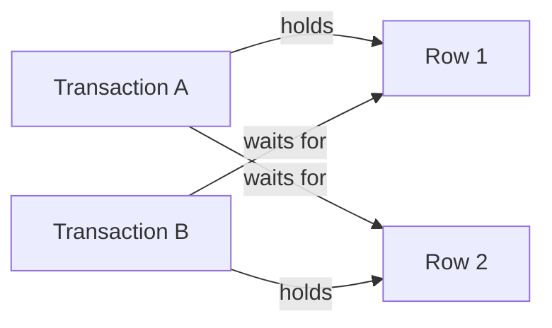
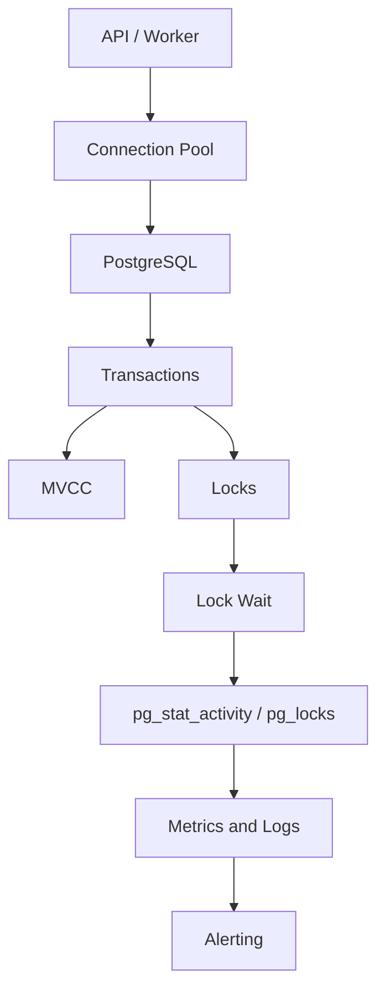

# 13- Concurrency and Locking Questions

## Overview

Concurrency and locking are among the most important SQL topics for senior backend interviews because they expose whether an engineer understands how multiple requests safely modify shared state.

In production, concurrency problems appear when:

- Multiple API requests update the same row.
- Several workers process the same job.
- Two users modify the same resource.
- Inventory is updated concurrently.
- Multiple services share database records.
- Background jobs overlap with interactive traffic.
- Retries repeat operations after transient failures.

A useful mental model is:

```text
Concurrent requests
       ↓
Transactions
       ↓
MVCC + locks + constraints
       ↓
database visibility / serialization
       ↓
commit or rollback
       ↓
application result
```

The key distinction is:

> **Concurrency control is about preserving correctness while allowing independent work to proceed concurrently.**

Locking is only one mechanism. Strong concurrency designs also use:

- Atomic SQL
- Constraints
- MVCC
- Optimistic concurrency
- Pessimistic locking
- Isolation levels
- Idempotency
- Consistent lock ordering
- Queue-based serialization

---

## What Is Concurrency?

Concurrency means multiple transactions or operations are executing during overlapping time periods.

For example:

```text
Transaction A ──────────────
        Transaction B ─────────────
```

They may access:

- Different rows
- The same row
- Different tables
- The same table
- Related resources

The database must determine which operations can safely proceed concurrently.

---

## Why Concurrency Control Exists

Without concurrency control, two requests can observe and modify shared state incorrectly.

Example:

```text
Initial inventory = 1

Request A:
    reads 1

Request B:
    reads 1

A:
    writes 0

B:
    writes 0
```

Both requests may believe they successfully reserved inventory.

The database needs mechanisms that prevent invalid outcomes.

---

## Common Concurrency Anomalies

| Anomaly | Description |
|---|---|
| Dirty Read | Reading another transaction's uncommitted data |
| Non-repeatable Read | Same row produces different committed values during a transaction |
| Phantom Read | Repeated query observes different matching row sets |
| Lost Update | One concurrent update overwrites another |
| Write Skew | Separate rows are changed in a way that violates a cross-row invariant |
| Serialization Anomaly | Concurrent execution produces a result that cannot be represented by a serial ordering |

The exact behavior depends on the database and isolation level.

---

## PostgreSQL MVCC

PostgreSQL primarily uses **Multi-Version Concurrency Control (MVCC)**.

Instead of requiring readers to block writers in the common case:

```text
Transaction A writes new version
        ↓
Transaction B can often read an appropriate visible version
```

This allows substantial read/write concurrency.

Conceptually:

```text
row
 ├── old version
 └── new version
```

Visibility rules determine which version a transaction can see.

---

## MVCC Does Not Eliminate Locks

MVCC reduces unnecessary blocking, but PostgreSQL still uses locks for operations that require coordination.

Examples include:

- Row-level locking
- Table-level locking
- Advisory locks
- Schema changes
- Updates
- Deletes
- Explicit `SELECT ... FOR UPDATE`

Therefore:

```text
MVCC
+
locking
+
transaction isolation
```

work together.

---

## What Is a Lock?

A lock is a concurrency-control mechanism that coordinates access to a resource.

Locks can protect:

- Rows
- Tables
- Schema objects
- Advisory application-defined resources

The purpose is not to prevent concurrency entirely.

The purpose is to prevent **unsafe conflicting concurrency**.

---

## Row-Level Locking

A common example:

```sql
SELECT
    id,
    balance
FROM accounts
WHERE id = $1
FOR UPDATE;
```

The selected rows are locked for update until the transaction ends.

This is useful when the application needs to:

```text
read current state
+
make a decision
+
modify the same row
```

without another conflicting transaction changing the row in between.

---

## SELECT FOR UPDATE

Example:

```sql
BEGIN;

SELECT balance
FROM accounts
WHERE id = $1
FOR UPDATE;

UPDATE accounts
SET balance = balance - $2
WHERE id = $1;

COMMIT;
```

The row lock remains until the transaction ends.

Keep the transaction short.

---

## SELECT FOR SHARE

PostgreSQL also provides weaker row-locking modes for cases where the transaction needs to protect certain relationships without taking the same lock strength as `FOR UPDATE`.

The important interview point is:

> Row-lock modes differ in which concurrent operations they conflict with.

Do not memorize only the syntax. Understand what concurrent operation the lock is intended to prevent.

---

## NOWAIT

`NOWAIT` tells PostgreSQL not to wait for a conflicting lock.

```sql
SELECT *
FROM orders
WHERE id = $1
FOR UPDATE NOWAIT;
```

If the row is already locked, the statement fails immediately.

Useful when the application prefers:

```text
fail fast
```

rather than:

```text
wait for an unknown amount of time
```

---

## SKIP LOCKED

`SKIP LOCKED` ignores rows that are currently locked.

Example:

```sql
SELECT id
FROM jobs
WHERE status = 'pending'
ORDER BY id
FOR UPDATE SKIP LOCKED
LIMIT 100;
```

This is particularly useful for database-backed work queues.

Multiple workers can claim different rows:

```text
Worker A → Job 1, 2, 3
Worker B → Job 4, 5, 6
```

without waiting on rows already locked by another worker.

---

## SKIP LOCKED Trade-offs

`SKIP LOCKED` is not a general concurrency solution.

Potential consequences:

- Rows can be temporarily skipped.
- Processing order may not be strictly fair.
- A locked row may wait longer than others.
- Application logic must tolerate concurrent workers.

It is appropriate for queue-like workloads where temporary skipping is acceptable.

---

## Lock Lifetime

Most transaction locks are held until the transaction ends.

Therefore:

```text
short transaction
→ short lock duration

long transaction
→ long lock duration
```

This is why transaction scope is one of the most important locking decisions.

---

## Lock Contention

Lock contention occurs when one transaction waits for another transaction holding a conflicting lock.

Example:

```text
Transaction A
    ↓
locks row
    ↓
does work

Transaction B
    ↓
requests same row
    ↓
WAIT
```

Contention becomes a production problem when it causes:

- High latency
- Connection pool exhaustion
- Reduced throughput
- Increased tail latency
- Cascading timeouts

---

## Contention vs Deadlock

These are different.

### Contention

```text
A holds resource
B waits for A
```

Eventually B can proceed.

### Deadlock

```text
A waits for B
B waits for A
```

Neither can proceed without intervention.

PostgreSQL detects deadlocks and aborts one transaction.

---

## Deadlock Example

```text
Transaction A:
    lock Row 1
    ↓
    wait for Row 2

Transaction B:
    lock Row 2
    ↓
    wait for Row 1
```

The dependency graph forms a cycle:



PostgreSQL detects the cycle and aborts one transaction.

The common PostgreSQL SQLSTATE is:

```text
40P01
```

---

## Preventing Deadlocks

The strongest prevention technique is consistent lock ordering.

Bad:

```text
Request A:
    Row 1 → Row 2

Request B:
    Row 2 → Row 1
```

Better:

```text
Request A:
    Row 1 → Row 2

Request B:
    Row 1 → Row 2
```

Other practices:

- Keep transactions short.
- Lock only what is necessary.
- Avoid external calls while holding locks.
- Process multiple rows in deterministic order.
- Avoid unnecessary lock escalation.
- Keep advisory-lock ordering consistent.

---

## Hidden Locks

A transaction can acquire locks without explicitly writing:

```sql
FOR UPDATE
```

Potential sources include:

- `UPDATE`
- `DELETE`
- Foreign-key enforcement
- Triggers
- Unique constraints
- DDL
- Explicit advisory locks

Therefore, when debugging a deadlock, inspect the complete transaction rather than only the statement that appears in the error.

---

## Foreign Keys and Concurrency

Foreign keys enforce referential integrity but can introduce locking interactions.

For example:

```text
parent
  ↓
child
```

Concurrent updates/deletes involving parent and child records can interact through referential-integrity checks.

Senior-level debugging should consider:

```text
application locks
+
implicit database locks
+
foreign keys
+
triggers
```

---

## Unique Constraints and Concurrency

A unique constraint can provide concurrency-safe enforcement.

Example:

```sql
CREATE UNIQUE INDEX idx_users_email
ON users (email);
```

Two concurrent requests attempting to create the same email cannot both successfully commit duplicate values.

The database becomes the final arbiter of uniqueness.

This is often safer than:

```text
SELECT whether email exists
INSERT email
```

because the application-level check can race.

---

## Constraints vs Application Checks

Unsafe pattern:

```text
SELECT COUNT(*)
FROM users
WHERE email = $1;

if zero:
    INSERT user
```

Two requests can both observe zero.

Better:

```sql
CREATE UNIQUE INDEX idx_users_email
ON users (email);
```

Then handle the unique-violation outcome appropriately.

The database constraint protects the invariant under concurrency.

---

## Atomic Updates

Prefer atomic database operations when possible.

Instead of:

```text
SELECT balance
application calculation
UPDATE balance
```

use:

```sql
UPDATE accounts
SET balance = balance - $1
WHERE id = $2
  AND balance >= $1;
```

Then verify:

```text
rows affected = 1
```

This can eliminate an unnecessary read-modify-write race.

---

## Optimistic Concurrency

Optimistic concurrency assumes conflicts are relatively uncommon.

A version column can detect concurrent modification:

```sql
UPDATE orders
SET
    status = $1,
    version = version + 1
WHERE id = $2
  AND version = $3;
```

If:

```text
rows affected = 1
```

the update succeeded.

If:

```text
rows affected = 0
```

the record was probably changed by another transaction.

---

## Optimistic vs Pessimistic Concurrency

| Strategy | Mechanism | Best Fit | Main Trade-off |
|---|---|---|---|
| Optimistic | Version / conditional update | Low conflict workloads | Requires conflict handling |
| Pessimistic | Explicit locks | High conflict or serialized workflows | Waiting and contention |
| Atomic SQL | Single conditional statement | Simple state transitions | Limited for complex workflows |
| Queue serialization | One worker/partition processes resource | Highly contended ordered work | Adds latency/architecture |

A senior engineer chooses based on workload characteristics rather than preference.

---

## When to Use Optimistic Concurrency

Good candidates:

- User editing a record
- Low-contention resources
- APIs where stale updates should return conflicts
- Long-running workflows where holding a lock is undesirable

Typical response:

```text
HTTP 409 Conflict
```

when another writer changed the resource.

---

## When to Use Pessimistic Locking

Good candidates:

- Inventory reservation
- Financial account updates
- Work queue claiming
- Resource allocation
- Short critical sections with expected conflicts

Avoid using locks across:

- External API calls
- User interaction
- Long computation
- Unbounded processing

---

## Lost Update

Consider:

```text
Initial value = 100

A reads 100
B reads 100

A writes 110
B writes 90
```

The update from A is effectively lost.

Possible solutions:

- Atomic SQL
- `SELECT FOR UPDATE`
- Optimistic versioning
- Higher isolation where required
- Business-specific conflict resolution

---

## Write Skew

Write skew is more subtle.

Suppose two doctors must remain on call:

```text
Doctor A on call
Doctor B on call
```

Invariant:

```text
at least one doctor must remain on call
```

Two concurrent transactions can each observe that the other doctor is on call and independently remove themselves.

The individual row updates may not conflict, but the combined result violates the cross-row invariant.

Potential solutions include:

- Serializable isolation
- Explicit locking of the relevant rows
- Modeling the invariant differently
- Database constraints where possible

This is a classic senior-level concurrency problem.

---

## Isolation vs Locking

Isolation level and explicit locks solve related but different problems.

Isolation defines the visibility and serialization semantics of transactions.

Explicit locks allow an application to deliberately coordinate access to specific resources.

Example:

```text
Isolation:
    How concurrent changes are observed

Lock:
    Which operation must wait for which resource
```

Do not treat:

```text
SERIALIZABLE
```

and:

```text
FOR UPDATE
```

as interchangeable.

---

## Serializable Transactions

At `SERIALIZABLE`, PostgreSQL prevents execution patterns that cannot be safely represented as a serial ordering.

The database may abort a transaction with:

```text
SQLSTATE 40001
```

The application should retry the entire transaction when the business operation is safely retryable.

---

## Serialization Failure vs Deadlock

| Error | Typical SQLSTATE | Meaning |
|---|---|---|
| Serialization failure | `40001` | Concurrent execution could not safely satisfy serializable semantics |
| Deadlock detected | `40P01` | Transactions formed a cyclic lock dependency |

Both may require a transaction-level retry, but their root causes differ.

---

## Retrying Concurrency Failures

Conceptually:

```python
for attempt in range(max_attempts):
    try:
        with transaction.atomic():
            perform_operation()
        break
    except RetryableConcurrencyError:
        backoff_with_jitter()
```

Important requirements:

- Retry the complete transaction.
- Keep retry counts bounded.
- Use exponential backoff.
- Add jitter.
- Ensure the operation is idempotent.
- Avoid retry storms.

The exact exception types depend on the database driver and framework.

---

## Retry Storms

Suppose:

```text
100 workers
    ↓
database contention
    ↓
transactions fail
    ↓
100 immediate retries
    ↓
more contention
    ↓
more failures
```

Retries can amplify the original incident.

Use:

```text
bounded retries
+
backoff
+
jitter
+
concurrency limits
```

---

## Lock Ordering

When multiple resources must be locked, establish a deterministic order.

Example:

```text
sort account IDs
↓
lock lower ID
↓
lock higher ID
```

Instead of:

```text
lock whichever account was encountered first
```

This reduces deadlock probability.

---

## Multi-Row Locking

Consider:

```sql
SELECT id
FROM accounts
WHERE id IN ($1, $2)
ORDER BY id
FOR UPDATE;
```

The deterministic ordering is useful when multiple transactions need to lock the same set of resources.

The exact physical lock acquisition behavior can involve database execution details, so deterministic query design should be combined with sound transaction architecture rather than treated as an absolute guarantee against every deadlock.

---

## Hot Rows

A hot row is a row accessed or modified by many concurrent transactions.

Examples:

```text
global counter
inventory row
account balance
popular resource
job queue metadata
```

A single row can become a scalability bottleneck even when the database has substantial overall capacity.

---

## Hot Row Mitigation

Possible strategies:

- Atomic updates
- Sharded counters
- Partitioned counters
- Queue serialization
- Optimistic concurrency
- Per-resource workers
- Redis for appropriate ephemeral coordination
- Architectural redesign

Example:

```text
one global counter
       ↓
many counter shards
       ↓
aggregate when required
```

The correct approach depends on consistency requirements.

---

## Redis Locks

Redis can be used for distributed coordination, but a Redis lock is not automatically equivalent to a database transaction.

Do not assume:

```text
Redis lock
+
PostgreSQL transaction
=
atomic distributed operation
```

If correctness depends on a database invariant, the database should generally remain authoritative.

Use distributed locks only when their failure semantics are well understood.

---

## Advisory Locks

PostgreSQL provides advisory locks for application-defined resources.

Conceptually:

```text
application resource ID
        ↓
PostgreSQL advisory lock
        ↓
serialize related operations
```

They can be useful when the resource does not map naturally to a row.

But advisory locks:

- Still participate in contention
- Can deadlock
- Must follow consistent ordering
- Have transaction/session lifetime semantics
- Should not replace normal relational constraints

---

## Transaction-Level Advisory Locks

For short-lived coordination, transaction-scoped advisory locks can be useful.

Example:

```sql
BEGIN;

SELECT pg_advisory_xact_lock($1);

-- protected work

COMMIT;
```

The lock is released automatically when the transaction ends.

Use carefully and document the lock key semantics.

---

## Queue-Based Serialization

Sometimes the best way to handle high contention is to avoid concurrent writes altogether.

Example:

```text
events
  ↓
Kafka partition by resource ID
  ↓
single ordered consumer stream
  ↓
PostgreSQL
```

For a given resource:

```text
resource-123
    ↓
same Kafka partition
    ↓
ordered processing
```

This can reduce database contention while preserving ordering.

The trade-off is eventual processing and more infrastructure.

---

## Database Queue Pattern

PostgreSQL can also implement work queues:

```sql
WITH claimed AS (
    SELECT id
    FROM jobs
    WHERE status = 'pending'
    ORDER BY id
    FOR UPDATE SKIP LOCKED
    LIMIT 100
)
UPDATE jobs AS j
SET status = 'processing'
FROM claimed
WHERE j.id = claimed.id
RETURNING j.id;
```

This can work well for moderate workloads.

At very large scale, dedicated messaging infrastructure may be more appropriate.

---

## Django Locking

Django exposes row locking through:

```python
from django.db import transaction

with transaction.atomic():
    order = (
        Order.objects
        .select_for_update()
        .get(pk=order_id)
    )

    order.status = "confirmed"
    order.save(update_fields=["status"])
```

The lock is meaningful only within the transaction.

A common mistake is calling `select_for_update()` without understanding the transaction boundary.

---

## Django `select_for_update()` Options

Depending on the backend and Django version, Django supports options such as:

```python
.select_for_update(
    nowait=True,
)
```

or:

```python
.select_for_update(
    skip_locked=True,
)
```

These should map to the intended database locking semantics.

Do not assume every option behaves identically across database backends.

---

## FastAPI and SQLAlchemy

A typical service-level transaction:

```python
with Session(engine) as session:
    with session.begin():
        order = (
            session.query(Order)
            .with_for_update()
            .filter(Order.id == order_id)
            .one()
        )

        order.status = "confirmed"
```

The important design principle is:

```text
service operation
    ↓
transaction
    ↓
lock
    ↓
database change
    ↓
commit
```

rather than allowing arbitrary layers to independently control transactions.

---

## Locking and Connection Pools

A blocked transaction still occupies a connection.

Example:

```text
20 connections
 ↓
10 waiting on locks
 ↓
10 executing
```

The application may experience pool exhaustion even when PostgreSQL CPU is moderate.

This creates:

```text
lock contention
    ↓
connection occupancy
    ↓
pool exhaustion
    ↓
request queueing
    ↓
high API latency
```

---

## More Connections Can Make Contention Worse

Increasing pool size is not always a scalability solution.

Suppose:

```text
pool = 20
```

becomes:

```text
pool = 100
```

If all 100 workers contend for the same hot row, the database may experience:

- More lock waiters
- More context switching
- More CPU
- Worse tail latency

Concurrency must be controlled, not simply maximized.

---

## Lock Timeout

PostgreSQL provides `lock_timeout` to limit how long a statement waits for a lock.

Example:

```sql
SET LOCAL lock_timeout = '2s';
```

This can be useful for operations where prolonged lock waits are worse than failing quickly.

Using `SET LOCAL` makes the setting transaction-scoped.

---

## Statement Timeout

`statement_timeout` limits statement execution time.

Example:

```sql
SET LOCAL statement_timeout = '5s';
```

It is different from `lock_timeout`.

A useful mental model:

```text
statement
 ├── waiting for lock
 └── executing
```

`lock_timeout` targets lock acquisition waiting.

`statement_timeout` covers statement execution time as a whole.

---

## Monitoring Lock Contention

Start with:

```sql
SELECT
    pid,
    usename,
    state,
    wait_event_type,
    wait_event,
    xact_start,
    query_start,
    query
FROM pg_stat_activity
WHERE wait_event_type = 'Lock';
```

Then inspect blockers:

```sql
SELECT
    pid,
    pg_blocking_pids(pid) AS blocking_pids,
    query
FROM pg_stat_activity
WHERE wait_event_type = 'Lock';
```

`pg_locks` can provide additional lock-level information.

---

## Finding Long Transactions

```sql
SELECT
    pid,
    usename,
    state,
    xact_start,
    now() - xact_start AS transaction_age,
    query
FROM pg_stat_activity
WHERE xact_start IS NOT NULL
ORDER BY xact_start;
```

Long transactions deserve investigation because they can affect:

- Locks
- MVCC cleanup
- Vacuum
- Bloat
- Replication

---

## Deadlock Diagnostics

When investigating deadlocks, collect:

```text
database logs
+
deadlock error
+
transaction SQL
+
application request IDs
+
pg_stat_activity
+
pg_locks
```

PostgreSQL settings such as:

```text
log_lock_waits
deadlock_timeout
```

can help with diagnosis.

`deadlock_timeout` is related to when PostgreSQL checks for deadlocks and reports lock waits; it is not a general-purpose lock-duration limit.

---

## Lock Monitoring Architecture



This is why concurrency incidents should be investigated across both application and database layers.

---

## Concurrency and Background Workers

Celery workers can multiply database concurrency:

```text
API requests
    +
Celery workers
    +
Kafka consumers
    +
scheduled jobs
```

All may modify the same rows.

Capacity planning should therefore consider:

```text
application replicas
+
worker count
+
consumer concurrency
+
connection pools
```

---

## Concurrency and Kafka

Kafka can provide ordering within a partition.

If events are partitioned by:

```text
account_id
```

then operations for the same account can be processed in order.

This can reduce database contention for workloads where per-resource ordering is sufficient.

However, it does not automatically provide distributed transactionality with PostgreSQL.

---

## Concurrency and Microservices

Shared database tables increase concurrency complexity.

For example:

```text
Order Service
      ↓
orders table
      ↑
Support Service
```

Both services may update the same records.

A cleaner architecture may establish:

```text
Order Service
    ↓
owns orders
    ↓
publishes events
    ↓
other services
```

Database ownership reduces accidental cross-service write contention.

---

## Concurrency and Read Replicas

Read replicas do not solve write contention.

If many transactions update:

```text
same inventory row
```

adding replicas does not help because the conflicting writes still go to the primary.

The solution may instead involve:

- Atomic updates
- Queue serialization
- Sharded counters
- Optimistic concurrency
- Resource redesign

---

## Concurrency and Partitioning

Partitioning can reduce contention when workloads naturally operate on separate partitions.

However, partitioning does not magically solve contention on one hot row.

For example:

```text
orders partitioned by month
```

does not help if all requests update:

```text
one global configuration row
```

Partitioning is primarily a data-management and access-path architecture, not a universal concurrency mechanism.

---

## Concurrency and Caching

Caching can reduce read pressure:

```text
API
 ↓
Redis
 ↓ hit
response
```

But cached values must not be treated as authoritative for transactional invariants unless the architecture explicitly supports that model.

For critical writes:

```text
PostgreSQL
    ↓
authoritative state
```

should generally remain the source of truth.

---

## Security Considerations

Concurrency controls must preserve authorization boundaries.

A row lock does not verify that the caller is allowed to modify the row.

For example:

```sql
SELECT *
FROM orders
WHERE id = $1
FOR UPDATE;
```

should not be used without appropriate authorization and tenant filtering.

A secure query may need:

```sql
SELECT *
FROM orders
WHERE id = $1
  AND tenant_id = $2
FOR UPDATE;
```

RLS can provide an additional database-level isolation layer where appropriate.

---

## Multi-Tenant Concurrency

Multi-tenant systems must consider:

```text
tenant isolation
+
hot tenants
+
hot rows
+
connection concurrency
```

One large tenant can create noisy-neighbor effects.

Mitigation can include:

- Tenant-aware throttling
- Tenant-specific workers
- Sharding
- Partitioning
- Separate databases
- Per-tenant queues
- Rate limiting

---

## High Availability and Locks

During failover:

```text
primary failure
    ↓
standby promotion
    ↓
application reconnects
```

Transactions that were in progress may be lost.

Applications must distinguish:

```text
confirmed commit
```

from:

```text
uncertain outcome
```

after a connection failure.

Idempotency becomes especially important during failover recovery.

---

## Disaster Recovery

After restoring a database, application workers may retry previously processed jobs.

Therefore recovery design should account for:

- Idempotency
- Event duplication
- Queue state
- Outbox state
- Consumer offsets
- Reconciliation

Database recovery alone does not guarantee that the surrounding distributed system returns to a consistent state.

---

## Performance Considerations

Concurrency has a throughput limit.

Increasing concurrency can initially improve utilization:

```text
more workers
→ more throughput
```

but eventually:

```text
more workers
→ more contention
→ more waiting
→ lower throughput
```

This is why performance tuning must consider:

- Lock duration
- Hot rows
- Query duration
- Connection pool size
- Worker concurrency
- Database CPU
- Memory
- I/O

---

## Production Concurrency Troubleshooting

When an API suddenly becomes slow:

```text
1. Check request latency.
2. Check database connections.
3. Check active transactions.
4. Check lock waits.
5. Identify blockers.
6. Check transaction age.
7. Identify hot rows/tables.
8. Check recent deployments.
9. Check worker concurrency.
10. Check retry volume.
```

Do not immediately increase connection pools.

---

## Common Concurrency Mistakes

### Assuming MVCC Means No Locks

MVCC reduces read/write blocking but does not eliminate locking.

### Using `SELECT FOR UPDATE` Everywhere

This can serialize workloads unnecessarily.

### Holding Locks During External Calls

This can create severe contention and pool exhaustion.

### Using Application Checks Instead of Constraints

A `SELECT` followed by an `INSERT` can race.

Use database constraints for invariants such as uniqueness.

### Ignoring Lock Ordering

Different lock acquisition orders are a common deadlock source.

### Increasing Connection Pools During Lock Incidents

More concurrent waiters can make contention worse.

### Retrying Immediately

Immediate retries can create retry storms.

### Retrying Only One Statement

Serialization failures and deadlocks generally require retrying the complete transaction.

### Using Redis Locks Without Failure Analysis

Distributed locks introduce their own failure and ownership semantics.

### Assuming Replicas Solve Write Contention

Read replicas scale reads, not conflicting writes.

### Using SKIP LOCKED for Strong Ordering

`SKIP LOCKED` intentionally permits skipping locked rows.

### Ignoring Background Workers

Celery, Kafka consumers, scheduled tasks, and API traffic can all compete for the same resources.

### Ignoring Hidden Database Locks

Foreign keys, triggers, constraints, and DDL can participate in lock conflicts.

---

## Interview Traps

### What Is the Difference Between Concurrency and Parallelism?

Concurrency means operations overlap in time.

Parallelism means operations execute simultaneously on separate execution resources.

A database can support concurrent transactions even when particular operations are not executing on separate CPU cores at exactly the same moment.

---

### Does MVCC Eliminate Locking?

No.

MVCC primarily improves visibility and reduces unnecessary read/write blocking.

PostgreSQL still uses locks for many operations.

---

### What Is a Lost Update?

A concurrent update overwrites another update because both transactions operate from stale state.

Solutions include:

- Atomic updates
- Row locks
- Optimistic versioning
- Appropriate isolation

---

### What Is the Difference Between Optimistic and Pessimistic Locking?

Optimistic concurrency detects conflicts after they occur.

Pessimistic locking prevents conflicting operations by acquiring locks before the critical operation.

---

### When Would You Use `SELECT FOR UPDATE`?

When a transaction needs to read a row and then make a related decision or update while preventing conflicting modifications.

---

### What Does `NOWAIT` Do?

It fails instead of waiting when a conflicting lock cannot be acquired immediately.

---

### What Does `SKIP LOCKED` Do?

It skips rows currently locked by other transactions.

This is useful for queue workers but does not provide strict ordering or fairness.

---

### What Causes a Deadlock?

A cyclic dependency between transactions waiting for resources held by one another.

---

### How Do You Prevent Deadlocks?

Use:

- Consistent lock ordering
- Short transactions
- Minimal lock scope
- Deterministic multi-row processing
- Avoidance of external calls inside transactions

---

### How Do You Handle a Deadlock?

The database aborts one transaction.

If the operation is safely retryable:

```text
retry complete transaction
+
backoff
+
jitter
+
bounded attempts
```

Then investigate the underlying lock-ordering problem rather than treating retries as the permanent fix.

---

### What Is SQLSTATE 40P01?

PostgreSQL's deadlock-detected error.

---

### What Is SQLSTATE 40001?

A serialization failure.

The complete transaction may need to be retried.

---

### Is SERIALIZABLE Always Better?

No.

It provides stronger consistency but may increase transaction aborts and retry requirements.

Use it when the business invariant requires those semantics.

---

### Can a Unique Constraint Solve Concurrency Problems?

It can enforce uniqueness safely under concurrent writes.

It does not solve arbitrary concurrency problems.

---

### Why Is This Unsafe?

```text
SELECT if row exists
INSERT row
```

Because two concurrent requests can both observe that the row does not exist.

A unique constraint makes the database enforce the invariant.

---

### Why Can More Database Connections Make Performance Worse?

Because more concurrency can increase:

- Lock contention
- CPU usage
- Memory usage
- Context switching
- Queueing

The optimal concurrency level depends on workload characteristics.

---

### Does Partitioning Solve Lock Contention?

Not necessarily.

It can reduce contention when operations naturally target different partitions, but a hot row or shared resource can remain a bottleneck.

---

### Do Read Replicas Solve Write Contention?

No.

Conflicting writes still need to be coordinated by the primary writer.

---

### Why Is `SKIP LOCKED` Useful for Job Queues?

Workers can claim available rows without waiting for rows another worker already owns.

This allows concurrent workers to make progress.

---

### Is Redis Locking Better Than PostgreSQL Locking?

There is no universal answer.

If the invariant belongs to PostgreSQL data, database-level concurrency mechanisms are usually the strongest authority.

Redis locks can be appropriate for distributed coordination when their failure semantics are explicitly designed.

---

## Practical Interview Scenario

### Inventory Reservation

Requirement:

```text
Inventory = 1
Two users attempt to purchase simultaneously.
Only one purchase should succeed.
```

Unsafe:

```text
SELECT quantity
FROM inventory
WHERE product_id = $1;

if quantity > 0:
    UPDATE inventory
    SET quantity = quantity - 1;
```

Two requests can read the same quantity.

Better:

```sql
UPDATE inventory
SET quantity = quantity - 1
WHERE product_id = $1
  AND quantity > 0;
```

Then:

```text
rows affected = 1
    → reservation succeeded

rows affected = 0
    → inventory unavailable
```

This is simple, atomic, and avoids an unnecessary race.

---

## Practical Interview Scenario

### Two Account Transfer

Requirement:

```text
Transfer money from account A to B.
```

A robust design must consider:

- Atomic transaction
- Balance constraint
- Concurrent transfers
- Lock ordering
- Deadlocks
- Idempotency
- Retry behavior

Possible pattern:

```text
BEGIN
    ↓
lock accounts in deterministic order
    ↓
validate balances
    ↓
debit A
    ↓
credit B
    ↓
COMMIT
```

If multiple transfers can involve the same accounts, deterministic ordering is especially important.

---

## Practical Interview Scenario

### Concurrent Job Workers

Requirement:

```text
100 workers
10,000 pending jobs
No job should be actively claimed by two workers.
```

A PostgreSQL queue can use:

```sql
SELECT id
FROM jobs
WHERE status = 'pending'
ORDER BY id
FOR UPDATE SKIP LOCKED
LIMIT 100;
```

The worker then marks those rows as processing within the appropriate transaction boundary.

Production concerns include:

- Worker crashes
- Job visibility timeouts
- Retries
- Idempotency
- Poison jobs
- Queue starvation
- Database load

---

## Practical Interview Scenario

### User Editing the Same Resource

Requirement:

```text
Two users edit the same order.
The second user should not silently overwrite the first user's changes.
```

Use optimistic concurrency:

```sql
UPDATE orders
SET
    status = $1,
    version = version + 1
WHERE id = $2
  AND version = $3;
```

If zero rows are affected:

```text
return conflict
```

This is often better than holding a row lock while a user spends several seconds editing a form.

---

## Senior-Level Concurrency Decision Framework

When choosing a concurrency strategy, ask:

```text
How frequently do conflicts occur?
        ↓
How expensive is waiting?
        ↓
Can the operation be atomic?
        ↓
Can a constraint enforce the invariant?
        ↓
Can optimistic concurrency detect conflicts?
        ↓
Does the critical section require a lock?
        ↓
Can work be serialized through a queue?
        ↓
Does the workload need stronger isolation?
```

The preferred order is often:

```text
database constraint
    ↓
atomic SQL
    ↓
optimistic concurrency
    ↓
short pessimistic lock
    ↓
queue serialization
    ↓
broader architectural change
```

This is not a universal rule, but it is a useful starting heuristic.

---

## Production Concurrency Checklist

- [ ] Business invariants are explicitly identified.
- [ ] Database constraints enforce appropriate invariants.
- [ ] Read-modify-write races have been considered.
- [ ] Atomic SQL is used where possible.
- [ ] Optimistic vs pessimistic concurrency is chosen intentionally.
- [ ] Transaction boundaries are explicit.
- [ ] Transactions are short.
- [ ] External calls are outside critical transactions.
- [ ] Lock ordering is deterministic.
- [ ] Deadlocks are monitored.
- [ ] Serialization failures are handled.
- [ ] Retry attempts are bounded.
- [ ] Retries use backoff and jitter.
- [ ] Retried operations are idempotent.
- [ ] Hot rows have been identified.
- [ ] Connection pools are sized for aggregate concurrency.
- [ ] Lock waits are observable.
- [ ] Long transactions are monitored.
- [ ] Idle-in-transaction sessions are monitored.
- [ ] Background worker concurrency is included in capacity planning.
- [ ] `SKIP LOCKED` is used only where skipped rows are acceptable.
- [ ] Redis locks are not treated as database transactions.
- [ ] Read replicas are not expected to solve write contention.
- [ ] Failover and uncertain commit outcomes are considered.
- [ ] Multi-tenant workloads are protected against noisy neighbors.
- [ ] Recovery and retry behavior are tested.

---

## Key Takeaways

- **Concurrency control is broader than locking:** use constraints, atomic SQL, MVCC, optimistic concurrency, pessimistic locking, and isolation according to the invariant and workload.
- **Keep critical sections short and deterministic:** transaction duration and lock ordering strongly influence contention, deadlocks, connection-pool pressure, and tail latency.
- **Prefer the simplest correctness mechanism:** database constraints and atomic updates are often safer and more scalable than application-level coordination.
- **Retries require idempotency and backoff:** deadlocks and serialization failures can be transient, but uncontrolled retries can amplify database contention into a production incident.
- **Senior concurrency design considers the whole system:** API traffic, connection pools, Celery, Kafka, Redis, replicas, microservices, failover, and workload architecture all affect database concurrency.