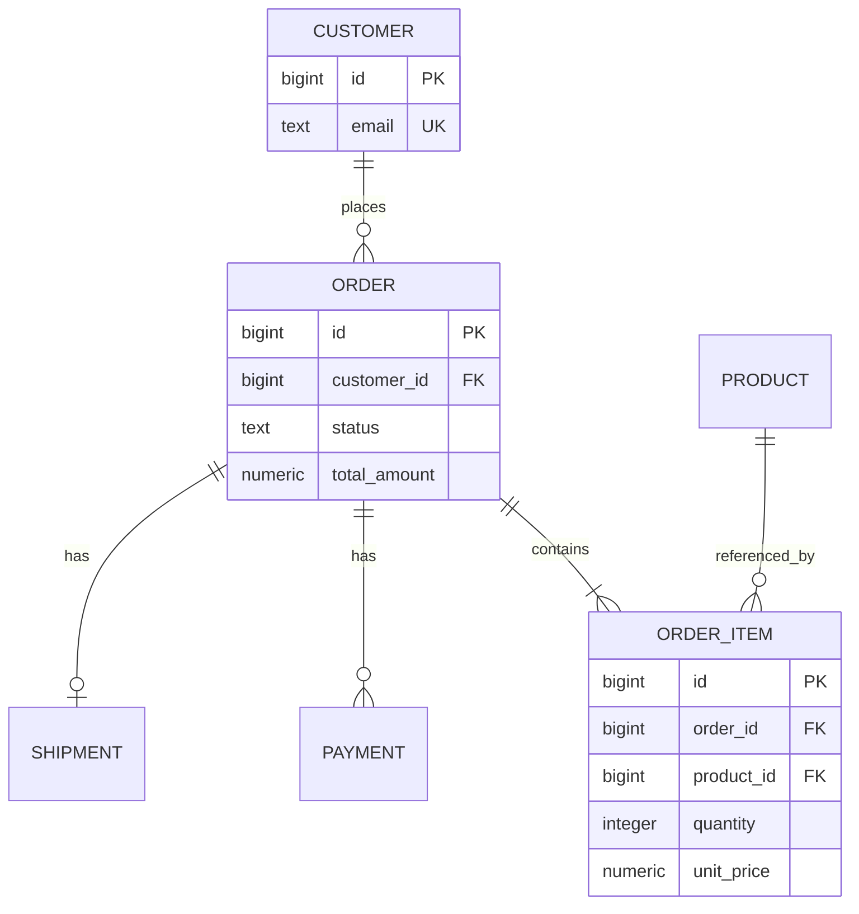
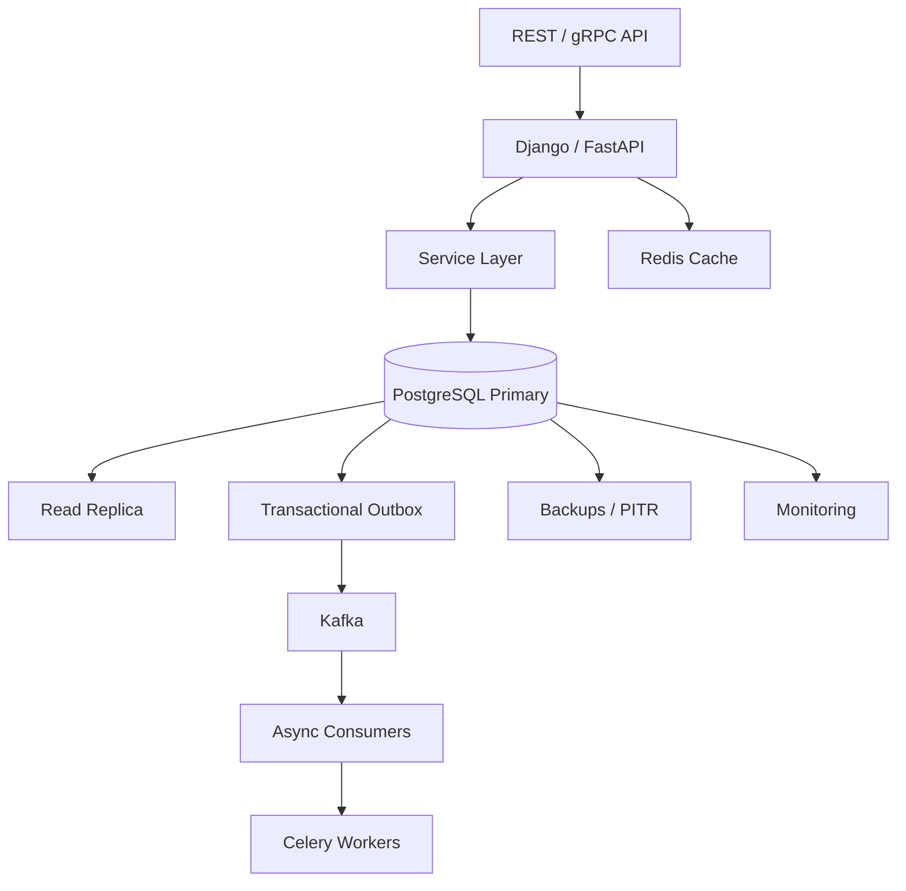

# 14- Database Design Questions

## Overview

Database design questions evaluate whether an engineer can translate business requirements into a schema that remains correct, maintainable, performant, and scalable under real production workloads.

At an intermediate level, interviews often focus on:

- Tables and relationships
- Primary and foreign keys
- Normalization
- Constraints
- Indexes
- One-to-one, one-to-many, and many-to-many relationships

At a senior level, the discussion usually expands to:

- Data ownership
- Access patterns
- Cardinality
- Transaction boundaries
- Concurrency
- Query performance
- Denormalization
- Partitioning
- Multi-tenancy
- Schema evolution
- High availability
- Replication
- Data lifecycle
- OLTP vs OLAP
- Security
- Operational complexity

A strong database design is not simply:

> "A normalized set of tables."

It is a design that balances:

```text
Business invariants
        +
Access patterns
        +
Data integrity
        +
Performance
        +
Concurrency
        +
Scalability
        +
Operational constraints
```

---

## Start With Requirements

Before designing tables, clarify the business requirements.

For an order system, determine:

- What entities exist?
- Who owns each entity?
- Which relationships exist?
- Which fields are required?
- Which values must be unique?
- What can change?
- What must be immutable?
- What queries are frequent?
- What is the expected data volume?
- What operations must be atomic?
- What needs historical tracking?
- What needs deletion?
- What must be retained?
- What consistency guarantees are required?

A useful interview sequence is:

```text
Requirements
    ↓
Entities
    ↓
Relationships
    ↓
Invariants
    ↓
Access patterns
    ↓
Schema
    ↓
Indexes
    ↓
Transactions
    ↓
Scaling
    ↓
Operational design
```

---

## Identify the Core Entities

Suppose the system manages orders.

Possible entities:

```text
Customer
Order
OrderItem
Product
Payment
Shipment
```

A conceptual model could be:



The ER model should represent business relationships before implementation details such as specific indexes.

---

## Primary Keys

A primary key uniquely identifies a row.

Example:

```sql
CREATE TABLE customers (
    id bigint GENERATED ALWAYS AS IDENTITY PRIMARY KEY,
    email text NOT NULL
);
```

A good primary key should be:

- Stable
- Unique
- Non-null
- Suitable for referencing
- Appropriate for the expected workload

---

## Surrogate vs Natural Keys

### Surrogate Key

A generated identifier:

```text
customer.id = 12345
```

Examples:

- Identity integer
- UUID

Advantages:

- Stable
- Independent of business changes
- Simple foreign keys
- Usually convenient for joins

### Natural Key

A business attribute acts as the identifier.

Example:

```text
country_code = IN
```

Natural keys can be appropriate when the value is genuinely stable and uniquely identifies the entity.

Avoid using mutable business attributes as primary keys merely because they look unique today.

---

## Integer vs UUID

| Property | Integer/Bigint | UUID |
|---|---|---|
| Size | Smaller | Larger |
| Index locality | Usually good | Depends on UUID strategy |
| Sequential generation | Easy | Not inherently sequential |
| Distributed generation | Requires coordination depending on design | Convenient |
| Exposure as public ID | More enumerable | Less predictable |
| Storage/index cost | Lower | Higher |

Do not choose UUID simply because it is harder to guess.

Security should come from authorization, not identifier obscurity.

For externally exposed identifiers, unpredictable identifiers can still be useful as defense in depth.

---

## Foreign Keys

Foreign keys represent relationships and enforce referential integrity.

Example:

```sql
CREATE TABLE orders (
    id bigint GENERATED ALWAYS AS IDENTITY PRIMARY KEY,
    customer_id bigint NOT NULL REFERENCES customers(id),
    status text NOT NULL
);
```

This prevents an order from referencing a nonexistent customer.

Foreign keys are valuable because the database becomes the final enforcement point for relationships.

---

## Relationship Types

### One-to-One

Example:

```text
User
  │
  └── Profile
```

Implementation:

```sql
CREATE TABLE user_profiles (
    user_id bigint PRIMARY KEY REFERENCES users(id),
    display_name text
);
```

The primary key also acts as the foreign key.

---

### One-to-Many

Example:

```text
Customer
   │
   ├── Order
   ├── Order
   └── Order
```

Implementation:

```sql
CREATE TABLE orders (
    id bigint GENERATED ALWAYS AS IDENTITY PRIMARY KEY,
    customer_id bigint NOT NULL REFERENCES customers(id)
);
```

The foreign key belongs on the many-side.

---

### Many-to-Many

Example:

```text
Students
   ↕
Courses
```

Use a junction table:

```sql
CREATE TABLE student_courses (
    student_id bigint NOT NULL REFERENCES students(id),
    course_id bigint NOT NULL REFERENCES courses(id),
    PRIMARY KEY (student_id, course_id)
);
```

The composite primary key prevents duplicate relationships.

---

## Composite Keys

Composite keys use multiple columns to identify a row.

Example:

```sql
PRIMARY KEY (tenant_id, external_id)
```

They are useful when uniqueness is inherently scoped.

For example:

```text
tenant A + invoice 100
tenant B + invoice 100
```

may both be valid.

---

## Unique Constraints

Use unique constraints for business invariants.

Example:

```sql
CREATE TABLE users (
    id bigint GENERATED ALWAYS AS IDENTITY PRIMARY KEY,
    email text NOT NULL UNIQUE
);
```

Do not rely only on:

```text
SELECT whether email exists
```

followed by:

```text
INSERT
```

because concurrent requests can race.

The database constraint should enforce uniqueness.

---

## Tenant-Scoped Uniqueness

For multi-tenant systems:

```sql
CREATE TABLE projects (
    id bigint GENERATED ALWAYS AS IDENTITY PRIMARY KEY,
    tenant_id bigint NOT NULL,
    slug text NOT NULL,
    UNIQUE (tenant_id, slug)
);
```

This means:

```text
tenant A / api
tenant B / api
```

can both exist.

But:

```text
tenant A / api
tenant A / api
```

cannot.

---

## NOT NULL

Use `NOT NULL` when a value is required for a valid row.

Prefer:

```sql
name text NOT NULL
```

over allowing:

```text
NULL
```

when the domain does not permit absence.

`NULL` should represent meaningful absence rather than being used as a default escape hatch.

---

## CHECK Constraints

Use `CHECK` constraints for local invariants.

Example:

```sql
CREATE TABLE products (
    id bigint GENERATED ALWAYS AS IDENTITY PRIMARY KEY,
    price numeric(19, 2) NOT NULL CHECK (price >= 0),
    quantity integer NOT NULL CHECK (quantity >= 0)
);
```

This protects the invariant regardless of which application writes the data.

---

## Default Values

Defaults can establish database-side behavior.

Example:

```sql
created_at timestamptz NOT NULL DEFAULT now()
```

Be careful with defaults for application semantics.

A database default is not necessarily equivalent to:

```text
application explicitly provided the value
```

For auditing and state transitions, understand where the value originates.

---

## Normalization

Normalization reduces unnecessary duplication and update anomalies.

Example of problematic design:

```text
orders
------------------------------------------------
order_id
customer_name
customer_email
customer_address
product_1
product_2
product_3
```

A normalized model separates entities:

```text
customers
orders
order_items
products
```

---

## First Three Normal Forms

Interview-level understanding should include:

### First Normal Form

Values should represent atomic attributes rather than repeating groups.

### Second Normal Form

Non-key attributes should depend on the whole key in designs involving composite keys.

### Third Normal Form

Non-key attributes should not depend transitively on other non-key attributes.

In modern backend work, the important skill is not memorizing definitions.

The important skill is recognizing:

```text
duplicated facts
+
update anomalies
+
unclear ownership
```

---

## Normalization Benefits

Normalization generally improves:

- Data integrity
- Update consistency
- Storage efficiency
- Clear ownership
- Constraint enforcement

Example:

```text
customer.email
```

should generally have one authoritative location instead of being copied into every order.

---

## Normalization Limitations

Highly normalized schemas can require more joins.

For read-heavy workloads, deliberate denormalization may improve performance or simplify access patterns.

The correct question is not:

> "Should the database always be normalized?"

It is:

> "Where should the authoritative fact live, and what duplication is justified by the workload?"

---

## Denormalization

Denormalization intentionally duplicates or precomputes data.

Example:

```text
orders
    total_amount
```

instead of calculating the total from every `order_item` on every read.

This can be appropriate when:

- Reads dominate
- The derived value is expensive to calculate
- Consistency requirements are understood
- Update logic is controlled

---

## Denormalization Trade-offs

| Benefit | Cost |
|---|---|
| Faster reads | More complex writes |
| Fewer joins | Duplicate data |
| Predictable API queries | Synchronization risk |
| Useful for read models | More storage |
| Can reduce database CPU | More application complexity |

Denormalization should be an intentional architectural decision.

---

## Derived Data

Suppose:

```text
order_items
```

contain:

```text
quantity
unit_price
```

and:

```text
orders.total_amount
```

is derived from them.

If both are stored, define the source of truth.

For financial systems, immutable transaction records and carefully defined derived values are generally safer than arbitrary duplicated state.

---

## Data Ownership

Every important field should have a clear owner.

For example:

```text
Product
 ├── name
 ├── price
 └── inventory_quantity

Order
 ├── status
 ├── total_amount
 └── shipping_address
```

Avoid having multiple services independently treating the same database field as authoritative.

---

## Database per Service

In microservices:

```text
Order Service
    ↓
Order Database

Payment Service
    ↓
Payment Database

Inventory Service
    ↓
Inventory Database
```

This provides clearer ownership.

Cross-service relationships are usually represented through:

- IDs
- APIs
- Events
- Read models

rather than cross-database foreign keys.

---

## Shared Database

A shared database can be appropriate when:

- The system is a modular monolith
- Strong relational transactions span modules
- Operational simplicity is important
- Service boundaries do not require independent persistence

But shared databases create coupling:

```text
Service A
   ↓
shared schema
   ↑
Service B
```

Schema changes and concurrency behavior become cross-team concerns.

---

## Access Patterns

Schema design should start considering how data will be queried.

Example requirements:

```text
Get order by ID
List customer's recent orders
Find pending orders
Find order items
Search products by SKU
```

These access patterns influence indexes.

For example:

```sql
CREATE INDEX idx_orders_customer_created
ON orders (customer_id, created_at DESC);
```

This supports:

```sql
SELECT *
FROM orders
WHERE customer_id = $1
ORDER BY created_at DESC
LIMIT 50;
```

---

## Index Design

Do not add indexes merely because a column exists.

Design indexes around:

```text
WHERE
JOIN
ORDER BY
GROUP BY
```

access patterns.

Example:

```sql
CREATE INDEX idx_orders_status_created
ON orders (status, created_at DESC);
```

Potentially useful for:

```sql
SELECT id, customer_id
FROM orders
WHERE status = 'pending'
ORDER BY created_at DESC
LIMIT 100;
```

Validate with execution plans and real workload data.

---

## Composite Index Ordering

For:

```sql
CREATE INDEX idx_orders_customer_status
ON orders (customer_id, status);
```

the order matters.

The index is especially useful for access patterns beginning with:

```text
customer_id
```

Do not blindly reverse columns.

Design based on actual predicates, selectivity, ordering, and workload.

---

## Foreign Key Indexes

A foreign key does not automatically mean the referencing column has the optimal index for every workload.

For example:

```sql
CREATE INDEX idx_orders_customer_id
ON orders (customer_id);
```

can be useful for:

```sql
SELECT *
FROM orders
WHERE customer_id = $1;
```

It can also help certain parent-side delete/update operations by making referencing-row checks more efficient.

Always evaluate the actual access pattern.

---

## Cardinality

Cardinality is the number of rows represented at a particular stage of a query or relationship.

Understanding cardinality is essential for database design.

Example:

```text
Customer
  1
  ↓
many Orders
  1
  ↓
many OrderItems
```

A query joining all three tables can multiply rows substantially.

Schema design should account for expected cardinalities.

---

## Data Types

Choose types based on domain semantics.

Examples:

```text
timestamp → timestamptz
money → numeric or integer minor units
count → integer/bigint
identifier → bigint/UUID
status → constrained text/domain/enum depending on evolution needs
```

Avoid storing structured data as text merely because it is convenient.

---

## Monetary Values

Avoid floating-point types for financial amounts.

Prefer:

```sql
numeric(19, 2)
```

or integer minor units:

```text
amount_cents bigint
```

The correct choice depends on currency and domain requirements.

For multi-currency systems, also model:

```text
currency
amount
```

explicitly.

---

## Timestamp Design

Prefer timezone-aware timestamps for distributed systems:

```sql
created_at timestamptz NOT NULL DEFAULT now()
```

Store timestamps consistently, typically in UTC semantics, and convert them for presentation.

Be explicit about:

- Business timezone
- Event time
- User-local time
- Scheduling time

---

## Soft Delete

Soft deletion may use:

```sql
deleted_at timestamptz
```

instead of physically deleting rows.

Advantages:

- Recovery
- Auditability
- Historical references

Costs:

- Every query may need filtering
- Indexes can become larger
- Data remains stored
- Uniqueness semantics become more complex

A partial unique index can sometimes help:

```sql
CREATE UNIQUE INDEX idx_users_active_email
ON users (email)
WHERE deleted_at IS NULL;
```

---

## Audit Fields

Common fields include:

```text
created_at
updated_at
created_by
updated_by
deleted_at
```

Do not add audit fields mechanically.

Determine whether the system requires:

- Current state
- Historical state
- Immutable audit trail
- Actor tracking
- Compliance retention

A simple `updated_at` does not constitute a complete audit history.

---

## History Tables

If historical state matters, model it explicitly.

Example:

```text
orders
order_status_history
```

Possible history record:

```sql
CREATE TABLE order_status_history (
    id bigint GENERATED ALWAYS AS IDENTITY PRIMARY KEY,
    order_id bigint NOT NULL REFERENCES orders(id),
    old_status text,
    new_status text NOT NULL,
    changed_at timestamptz NOT NULL DEFAULT now(),
    changed_by bigint
);
```

This separates:

```text
current state
```

from:

```text
historical events
```

---

## State Modeling

Avoid unrestricted status strings when the domain has explicit states.

Example:

```text
pending
confirmed
shipped
delivered
cancelled
```

Define valid transitions:

```text
pending → confirmed
confirmed → shipped
shipped → delivered
```

A state machine can make invalid transitions easier to prevent.

---

## Many-to-Many With Attributes

Suppose users belong to organizations and membership has:

```text
role
joined_at
```

The relationship itself becomes an entity:

```sql
CREATE TABLE organization_memberships (
    organization_id bigint NOT NULL REFERENCES organizations(id),
    user_id bigint NOT NULL REFERENCES users(id),
    role text NOT NULL,
    joined_at timestamptz NOT NULL DEFAULT now(),
    PRIMARY KEY (organization_id, user_id)
);
```

Do not force relationship attributes onto either parent entity.

---

## Polymorphic Relationships

A common application pattern is:

```text
comments
commentable_type
commentable_id
```

This is flexible but usually cannot provide a normal foreign key to multiple target tables.

Trade-offs include:

- Weaker database referential integrity
- More complex queries
- More application-level validation

If the domain has a small, stable set of targets, explicit relationship tables can provide stronger integrity.

---

## JSON Columns

PostgreSQL `jsonb` can be useful for flexible attributes.

Example:

```sql
CREATE TABLE products (
    id bigint GENERATED ALWAYS AS IDENTITY PRIMARY KEY,
    attributes jsonb NOT NULL DEFAULT '{}'::jsonb
);
```

Use JSON when the data is genuinely semi-structured or evolving.

Do not use JSON simply to avoid designing relational columns.

---

## JSON vs Relational Columns

| Requirement | Prefer |
|---|---|
| Frequently filtered field | Relational column |
| Strong type/constraint | Relational column |
| Foreign-key relationship | Relational column |
| Stable core business attribute | Relational column |
| Flexible optional metadata | JSONB |
| Frequently changing external payload | JSONB |
| Analytics-heavy structured data | Usually relational/analytical model |

JSON can be indexed, but indexing JSON does not eliminate the modeling trade-offs.

---

## Multi-Tenant Database Design

Common models include:

| Model | Isolation | Operational Complexity | Typical Use |
|---|---|---|---|
| Shared DB / shared schema | Lower | Low | Large SaaS |
| Shared DB / separate schema | Medium | Medium | Stronger logical separation |
| Database per tenant | High | High | Isolation/compliance |
| Hybrid | Variable | High | Large enterprise tenants |

For shared schemas, tenant identity often belongs directly in tables:

```sql
tenant_id bigint NOT NULL
```

and should participate in:

- Indexes
- Uniqueness
- Authorization
- RLS where appropriate

---

## Row Level Security

PostgreSQL RLS can enforce tenant-level visibility at the database layer.

Conceptually:

```text
Application
    ↓
tenant context
    ↓
PostgreSQL RLS policy
    ↓
only permitted rows
```

RLS is a defense-in-depth mechanism.

It does not replace application authorization.

---

## Transactions in Database Design

A schema should make transactional boundaries practical.

For example, creating an order may require:

```text
orders
+
order_items
+
inventory reservation
+
outbox event
```

If these changes must be atomic:

```text
BEGIN
 ├── create order
 ├── create items
 ├── reserve inventory
 └── create outbox event
COMMIT
```

Schema design should therefore consider transaction boundaries, not only entities.

---

## Concurrency-Aware Schema Design

Database design should account for concurrent writes.

For inventory:

```sql
UPDATE inventory
SET quantity = quantity - $1
WHERE product_id = $2
  AND quantity >= $1;
```

For optimistic locking:

```sql
UPDATE orders
SET
    status = $1,
    version = version + 1
WHERE id = $2
  AND version = $3;
```

A schema that cannot efficiently enforce its invariants under concurrency may become difficult to operate safely.

---

## Partitioning

Partitioning separates a logical table into physical partitions.

Common partition keys:

- Time
- Tenant
- Region
- Hash buckets

Example:

```text
events
 ├── events_2026_01
 ├── events_2026_02
 └── events_2026_03
```

Good candidates are tables with:

- Large data volume
- Natural lifecycle boundaries
- Strong partition-key locality
- Retention requirements

Partitioning is not automatically required for every large table.

---

## Partition Key Selection

A good partition key should align with:

```text
query filters
+
data lifecycle
+
distribution
```

For time-series events:

```text
event_time
```

may work well because old partitions can be detached or dropped.

A poor partition key can produce:

- Cross-partition queries
- Uneven distribution
- Operational complexity
- Ineffective pruning

---

## Archival and Retention

Database design should consider the full data lifecycle:

```text
hot
 ↓
warm
 ↓
cold
 ↓
archive
 ↓
delete
```

For large event tables, retention may be implemented using partition lifecycle operations rather than millions of individual deletes.

---

## OLTP vs OLAP Schema Design

Transactional databases optimize for:

```text
small writes
point lookups
short transactions
high concurrency
```

Analytical systems optimize for:

```text
large scans
aggregations
historical analysis
parallel execution
```

Do not force a high-volume analytical workload onto the primary OLTP schema without considering workload isolation.

A common architecture is:

```text
PostgreSQL OLTP
      ↓
CDC / events / ETL
      ↓
warehouse / OLAP
      ↓
analytics
```

---

## Read Models and CQRS

For complex read requirements, a dedicated read model may be appropriate.

```text
OLTP database
      ↓
events / CDC
      ↓
read model
      ↓
API
```

This allows the transactional schema to remain optimized for writes while the read model is optimized for query patterns.

The cost is additional infrastructure and eventual consistency.

---

## Schema Evolution

Production schemas evolve continuously.

Avoid treating schema changes as isolated SQL operations.

A safe change may be:

```text
add new structure
      ↓
deploy compatible application
      ↓
backfill
      ↓
switch reads
      ↓
remove old dependency
```

This is especially important during rolling deployments in Kubernetes or other distributed environments.

---

## Adding Columns Safely

A common safe pattern:

```sql
ALTER TABLE orders
ADD COLUMN external_reference text;
```

Initially allow existing application versions to continue working.

Then:

```text
deploy writers
→ backfill
→ validate
→ enforce constraints
```

Do not immediately make a large existing table depend on a new required field unless the migration and deployment strategy supports it safely.

---

## Removing Columns Safely

Use:

```text
stop reads
    ↓
stop writes
    ↓
deploy all consumers
    ↓
observe
    ↓
remove column
```

Check dependencies from:

- Application code
- ORM models
- Reports
- Views
- Functions
- Triggers
- ETL
- Background workers
- Other services

---

## Database Design and Django

Django models should reflect domain ownership and constraints.

Example:

```python
class Order(models.Model):
    customer = models.ForeignKey(
        "Customer",
        on_delete=models.PROTECT,
        related_name="orders",
    )
    status = models.CharField(max_length=32)
    created_at = models.DateTimeField(auto_now_add=True)

    class Meta:
        indexes = [
            models.Index(
                fields=["customer", "-created_at"],
                name="order_customer_created_idx",
            ),
        ]
```

Do not assume the ORM model alone is sufficient.

Review the generated SQL, constraints, indexes, and migration behavior.

---

## Database Design and FastAPI

FastAPI itself does not impose a database design.

A common architecture is:

```text
FastAPI
   ↓
service layer
   ↓
SQLAlchemy / SQL
   ↓
PostgreSQL
```

The schema should remain database-driven where integrity matters.

Application validation improves user experience, but database constraints remain the final enforcement layer.

---

## Database Design and Redis

Redis should generally complement rather than replace the relational source of truth.

Useful Redis workloads include:

- Cache
- Rate limiting
- Ephemeral state
- Distributed coordination where appropriate
- Short-lived derived data

Avoid designing the primary relational model around assumptions that Redis will always contain synchronized state.

---

## Database Design and Kafka

Kafka is useful for:

- Domain events
- CDC pipelines
- Asynchronous processing
- Analytics ingestion
- Service integration

A relational database schema should not assume Kafka delivery is automatically transactional with PostgreSQL.

Use explicit patterns such as:

```text
transactional outbox
```

when database state and event publication must be reliably connected.

---

## Database Design and Celery

Celery workers often operate on database records asynchronously.

Design tables to support:

- Retry state
- Idempotency
- Processing state
- Timestamps
- Error tracking
- Visibility/recovery

For queue-like tables, PostgreSQL patterns such as:

```sql
FOR UPDATE SKIP LOCKED
```

can support concurrent workers.

---

## Security-Aware Database Design

Security should be part of schema design.

Consider:

- Sensitive columns
- Tenant isolation
- Foreign-key ownership
- RLS
- Audit history
- Least-privilege roles
- Encryption
- Data retention
- Soft deletion
- Backup exposure

Do not expose sensitive data simply because the table contains it.

A database design should support application authorization rather than making unauthorized access easy.

---

## Sensitive Data

Identify sensitive fields explicitly:

```text
password hashes
tokens
financial data
personal information
secrets
private metadata
```

Avoid storing data that the application does not need.

For highly sensitive values, consider:

- Encryption
- Tokenization
- Separate access controls
- Key management
- Retention policies

---

## Auditability

If the business requires knowing:

```text
who changed what
when
and why
```

a simple current-state table may not be sufficient.

Possible designs:

```text
current table
+
audit/history table
```

or:

```text
current state
+
immutable domain events
```

Choose based on audit requirements rather than adding generic audit columns everywhere.

---

## High Availability

Database design should consider the deployment topology.

Typical architecture:

```text
Application
    ↓
Primary PostgreSQL
    ↓ WAL
Read replicas
```

Design implications include:

- Read/write routing
- Replica lag
- Read-after-write consistency
- Failover
- Connection handling
- Transaction retries

A schema that depends on immediate replica visibility may require stronger routing guarantees.

---

## Disaster Recovery

Database design should account for:

- Backup
- WAL retention
- Point-in-time recovery
- Restore testing
- Data retention
- Recovery ordering

For distributed systems, also consider:

```text
database state
+
Kafka state
+
Celery state
+
Redis state
+
external side effects
```

Restoring only PostgreSQL does not necessarily restore the entire system's logical state.

---

## Scalability

Database design should anticipate growth.

Consider:

```text
rows
+
row width
+
indexes
+
write rate
+
read rate
+
concurrent connections
+
transaction duration
```

Potential scaling mechanisms include:

- Query optimization
- Indexes
- Caching
- Read replicas
- Partitioning
- Workload isolation
- Sharding
- OLAP systems

Do not introduce sharding before simpler scaling mechanisms have been exhausted.

---

## Sharding

Sharding distributes data across multiple database nodes.

Example:

```text
tenant hash
    ↓
Shard 1
Shard 2
Shard 3
Shard 4
```

The shard key is critical.

A good shard key provides:

- Even distribution
- Query locality
- Stable routing
- Manageable rebalancing

A poor shard key creates:

- Hot shards
- Scatter-gather queries
- Difficult migrations
- Cross-shard transactions

---

## Global Identifiers

Distributed systems often need identifiers that are unique across databases.

Options include:

- UUID
- Snowflake-style IDs
- Application-generated IDs
- Centralized ID allocation

Choose based on:

- Ordering requirements
- Storage size
- Generation rate
- Index locality
- Operational simplicity

---

## Database Design Interview Workflow

When asked to design a database, use this sequence:

### Clarify Requirements

Ask:

```text
What entities exist?
What operations are common?
What must be unique?
What must be atomic?
What is the expected scale?
What data must be retained?
```

### Model Entities

Identify:

```text
Customer
Order
Product
Payment
```

### Define Relationships

Determine:

```text
1:1
1:N
N:M
```

### Define Invariants

Examples:

```text
email must be unique
quantity cannot be negative
order must belong to a customer
membership must be unique per user/organization
```

### Define Access Patterns

Examples:

```text
get order by ID
list recent customer orders
find pending orders
```

### Add Indexes

Design indexes from actual access patterns.

### Define Transaction Boundaries

Determine which operations must commit together.

### Consider Concurrency

Ask:

```text
Can two requests modify the same resource?
```

### Consider Growth

Estimate:

```text
rows
QPS
write rate
storage
retention
```

### Consider Operations

Discuss:

```text
backups
replicas
migrations
monitoring
failover
```

---

## Example Database Design

Consider an e-commerce order system.

```sql
CREATE TABLE customers (
    id bigint GENERATED ALWAYS AS IDENTITY PRIMARY KEY,
    email text NOT NULL UNIQUE,
    created_at timestamptz NOT NULL DEFAULT now()
);

CREATE TABLE products (
    id bigint GENERATED ALWAYS AS IDENTITY PRIMARY KEY,
    sku text NOT NULL UNIQUE,
    name text NOT NULL,
    price numeric(19, 2) NOT NULL CHECK (price >= 0),
    created_at timestamptz NOT NULL DEFAULT now()
);

CREATE TABLE orders (
    id bigint GENERATED ALWAYS AS IDENTITY PRIMARY KEY,
    customer_id bigint NOT NULL
        REFERENCES customers(id),
    status text NOT NULL,
    total_amount numeric(19, 2) NOT NULL
        CHECK (total_amount >= 0),
    created_at timestamptz NOT NULL DEFAULT now()
);

CREATE TABLE order_items (
    id bigint GENERATED ALWAYS AS IDENTITY PRIMARY KEY,
    order_id bigint NOT NULL
        REFERENCES orders(id),
    product_id bigint NOT NULL
        REFERENCES products(id),
    quantity integer NOT NULL
        CHECK (quantity > 0),
    unit_price numeric(19, 2) NOT NULL
        CHECK (unit_price >= 0)
);

CREATE INDEX idx_orders_customer_created
ON orders (customer_id, created_at DESC);

CREATE INDEX idx_order_items_order
ON order_items (order_id);
```

The schema establishes:

```text
Customer → Orders
Order → OrderItems
Product → OrderItems
```

and enforces several invariants at the database layer.

---

## Snapshot of Production Architecture



The schema is only one component.

Production database design also includes:

```text
application behavior
+
transactions
+
pooling
+
replication
+
caching
+
events
+
background workers
+
operations
```

---

## Common Database Design Mistakes

### Designing Tables Before Requirements

A technically elegant schema can still fail if it does not support actual business operations.

### Over-Normalizing

Excessive decomposition can make important queries unnecessarily complex.

### Denormalizing Without a Source of Truth

Duplicated data can drift.

### Missing Constraints

Application checks alone are vulnerable to concurrency.

### Missing Foreign Keys

Relationships become application conventions rather than database-enforced invariants.

### Using JSON for Everything

Flexible storage can become an unstructured database inside the database.

### Adding Indexes Everywhere

Indexes improve some reads but increase:

- Storage
- Write cost
- WAL
- Maintenance
- Vacuum work

### Ignoring Cardinality

Many-to-many relationships and joins can produce large result sets unexpectedly.

### Ignoring Access Patterns

A normalized schema without appropriate indexes can still be operationally slow.

### Using Mutable Natural Keys

Changing business attributes can make relationships difficult to maintain.

### Treating Soft Delete as Free

Soft-deleted rows continue consuming storage and complicate queries and uniqueness.

### Ignoring Data Lifecycle

Large historical tables eventually require retention and archival strategies.

### Ignoring Concurrency

A correct schema on paper can fail when multiple workers update the same resources.

### Designing Only for Today

Growth changes:

```text
query plans
index size
storage
vacuum behavior
replication
backup duration
```

### Ignoring Schema Evolution

A schema that cannot be changed safely becomes an operational bottleneck.

---

## Interview Traps

### Is Third Normal Form Always the Best Design?

No.

Normalization is an important default for transactional integrity, but deliberate denormalization may be appropriate for performance or read models.

---

### Should Every Table Have a Surrogate ID?

Not necessarily.

Composite keys can be appropriate for relationship tables and scoped uniqueness.

Choose based on domain semantics.

---

### Should Every Foreign Key Have an Index?

Not mechanically.

An index on the referencing side is often useful, especially for common lookups and some parent-side referential actions, but the decision should follow workload and query patterns.

---

### Should You Store Calculated Values?

Sometimes.

If the value is expensive to calculate and frequently read, storing it can be appropriate.

But define:

```text
source of truth
update mechanism
consistency requirement
rebuild strategy
```

---

### Should You Use UUIDs Everywhere?

No.

UUIDs provide useful distributed-ID properties, but they increase storage/index size compared with smaller integer identifiers and may have locality implications depending on how they are generated.

---

### Is JSON Better Than Relational Modeling?

No universal answer.

Use JSON for genuinely flexible or semi-structured attributes.

Use relational columns for stable, frequently queried, constrained business data.

---

### Is a Database Per Microservice Always Better?

No.

It provides ownership and isolation but increases:

- Operational complexity
- Data duplication
- Cross-service consistency problems
- Observability requirements
- Deployment complexity

---

### Does Database Design Start With Normalization?

Not entirely.

Start with:

```text
requirements
+
business invariants
+
access patterns
```

Then choose normalization and denormalization intentionally.

---

### Does an ORM Replace Database Design?

No.

Django and SQLAlchemy help implement a model, but they do not eliminate:

- Constraints
- Indexes
- Query plans
- Transactions
- Locks
- Data lifecycle
- Replication
- Schema evolution

---

### Should All Business Rules Be Enforced in the Database?

No.

Some rules belong in application services.

However, invariants that can be reliably enforced by the database should generally be protected there.

Examples:

```text
UNIQUE
FOREIGN KEY
CHECK
NOT NULL
```

---

## Senior-Level Database Design Questions

When reviewing a proposed schema, ask:

### What Is the Source of Truth?

If the same fact appears in multiple places:

```text
which one is authoritative?
```

### What Is the Expected Cardinality?

For example:

```text
customer → millions of orders
order → hundreds of items
```

can change indexing and partitioning decisions.

### What Are the Critical Queries?

A schema should support the actual production access patterns.

### What Are the Hot Paths?

Identify:

```text
high-QPS reads
high-frequency writes
hot rows
hot tenants
```

### What Is the Transaction Boundary?

Determine which changes must commit atomically.

### What Happens Under Concurrency?

Ask:

```text
two users update the same row
two workers claim the same job
two requests create the same resource
```

### How Does the Schema Evolve?

Consider:

```text
rolling deployments
backfills
large tables
zero-downtime migrations
```

### How Does the Data Grow?

Estimate:

```text
rows/day
bytes/row
indexes
retention
replication
backup volume
```

### What Happens During Failure?

Consider:

```text
primary failure
replica lag
network partition
uncertain commit
restore
reprocessing
```

### How Is Sensitive Data Protected?

Consider:

```text
authorization
RLS
encryption
auditability
retention
backup security
```

---

## Database Design Review Checklist

### Domain

- [ ] Entities are clearly identified.
- [ ] Relationships are explicit.
- [ ] Ownership is defined.
- [ ] Business invariants are documented.
- [ ] Mutable vs immutable data is understood.

### Schema

- [ ] Primary keys are appropriate.
- [ ] Foreign keys enforce relationships.
- [ ] Unique constraints protect uniqueness.
- [ ] `NOT NULL` is used appropriately.
- [ ] `CHECK` constraints protect local invariants.
- [ ] Data types match domain semantics.
- [ ] Many-to-many relationships use appropriate junction tables.

### Querying

- [ ] Critical access patterns are known.
- [ ] Indexes support common predicates.
- [ ] Composite index ordering is intentional.
- [ ] Query cardinality is understood.
- [ ] Large result sets are controlled.

### Transactions

- [ ] Atomic operations are identified.
- [ ] Concurrency conflicts are considered.
- [ ] Locking strategy is appropriate.
- [ ] Idempotency exists where retries are possible.

### Scalability

- [ ] Growth assumptions are explicit.
- [ ] Large tables have lifecycle strategies.
- [ ] Partitioning is considered where appropriate.
- [ ] Read/write workload separation is considered.
- [ ] Sharding is introduced only when justified.

### Operations

- [ ] Schema changes can be deployed safely.
- [ ] Backups and PITR are supported.
- [ ] Replication behavior is understood.
- [ ] Monitoring exists.
- [ ] Data retention is defined.
- [ ] Restore procedures are tested.

### Security

- [ ] Sensitive data is identified.
- [ ] Authorization is enforced.
- [ ] Tenant isolation is designed.
- [ ] Least-privilege access is possible.
- [ ] Audit requirements are understood.
- [ ] Backup access is protected.

---

## Key Takeaways

- **Database design starts with requirements, invariants, and access patterns:** tables and relationships should emerge from the business model and production workload rather than from normalization rules alone.
- **Constraints are part of correctness:** primary keys, foreign keys, unique constraints, `NOT NULL`, and `CHECK` constraints allow PostgreSQL to enforce important invariants even under concurrent writes.
- **Normalization is a default, not a religion:** normalize authoritative data for integrity, then introduce deliberate denormalization or read models when measurable workload requirements justify the additional consistency and operational complexity.
- **Senior database design includes the surrounding system:** transactions, concurrency, indexes, migrations, replicas, caching, Kafka, Celery, microservices, multi-tenancy, security, and disaster recovery all influence whether a schema works in production.
- **Design for change and growth:** estimate cardinality and data volume, understand critical queries, plan schema evolution and data lifecycle, and introduce partitioning or sharding only when simpler scaling mechanisms are insufficient.