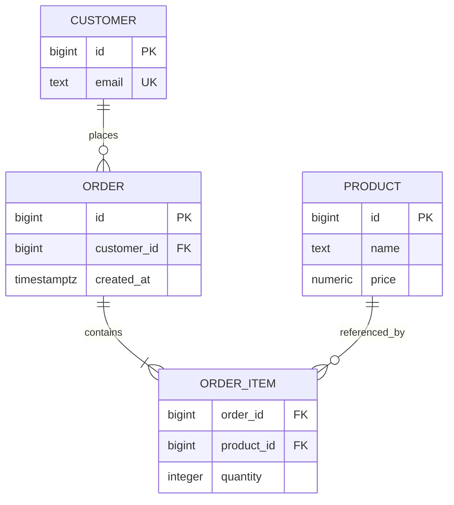

# 15- Normalization Questions

## Overview

Normalization is a database design technique for reducing unnecessary data duplication and preventing anomalies while preserving clear relationships between entities.

For interviews, normalization is not primarily about reciting normal-form definitions. A strong answer connects normalization to:

- Data integrity
- Functional dependencies
- Update anomalies
- Transaction boundaries
- Query complexity
- Indexing
- Read/write workload
- Denormalization
- OLTP vs OLAP
- Schema evolution

A useful mental model is:

```text
Business facts
    ↓
Dependencies between facts
    ↓
Identify authoritative attributes
    ↓
Separate independent entities
    ↓
Enforce relationships with constraints
    ↓
Optimize access patterns with indexes
    ↓
Denormalize only when justified
```

Normalization is generally most valuable for transactional systems where correctness and consistent updates are more important than minimizing joins.

---

## Why Normalization Exists

Consider this table:

```text
orders
-----------------------------------------------------------------
order_id | customer_name | customer_email | product_name | quantity
```

Suppose one customer has 1,000 orders.

The customer's email is duplicated 1,000 times.

If the email changes, the application must update many rows:

```text
Customer email
     ↓
1000 duplicated values
```

This creates the possibility of inconsistent data.

A normalized design separates the independent facts:

```text
customers
orders
order_items
products
```

Now:

```text
customers.email
```

has one authoritative location.

---

## Data Anomalies

Normalization primarily addresses several classes of anomalies.

### Update Anomaly

The same fact exists in multiple rows and must be updated consistently.

```text
customer_email duplicated
        ↓
one row updated
        ↓
other rows remain stale
```

### Insert Anomaly

A fact cannot be inserted without unrelated information.

For example, if customer data exists only inside an order table, creating a customer before their first order becomes awkward.

### Delete Anomaly

Deleting one record accidentally removes the only copy of another business fact.

For example:

```text
last order for customer
        ↓
delete order
        ↓
customer information disappears
```

Normalization separates independently meaningful entities.

---

## Functional Dependencies

Functional dependency is the foundation for understanding normalization.

If:

```text
customer_id → customer_email
```

then knowing `customer_id` determines the customer's email.

Similarly:

```text
product_id → product_name, product_price
```

means the product ID determines those attributes.

A useful interview technique is to ask:

> "What determines this attribute?"

For example:

```text
order_id → order_date
product_id → product_name
customer_id → customer_email
```

If unrelated facts are stored together, normalization may require separating them.

---

## Candidate Keys

A candidate key is a minimal set of attributes capable of uniquely identifying a row.

For:

```text
student_id
email
```

both might uniquely identify a student.

One can become the primary key while the other is protected with a unique constraint.

Example:

```sql
CREATE TABLE students (
    id bigint GENERATED ALWAYS AS IDENTITY PRIMARY KEY,
    email text NOT NULL UNIQUE,
    name text NOT NULL
);
```

Normalization reasoning depends heavily on understanding which attributes determine other attributes.

---

## First Normal Form

A relation is generally considered to satisfy First Normal Form (1NF) when attributes represent atomic values rather than repeating groups or nested sets in a single relational field.

Poor design:

```text
orders
------------------------------------------------
order_id | product_ids
1        | 101,102,103
```

Better:

```text
orders
order_items
products
```

with one row per order item.

---

## 1NF and Repeating Groups

Avoid designs such as:

```text
phone_1
phone_2
phone_3
```

when phone numbers are independently queryable entities.

Instead:

```text
customers
customer_phones
```

Example:

```sql
CREATE TABLE customer_phones (
    customer_id bigint NOT NULL REFERENCES customers(id),
    phone_number text NOT NULL,
    PRIMARY KEY (customer_id, phone_number)
);
```

The correct design depends on whether multiple values are genuinely part of the domain.

---

## Is JSON Violating 1NF?

Do not give an overly simplistic interview answer.

Modern PostgreSQL supports `jsonb`, and JSON can be appropriate for genuinely semi-structured attributes.

The design question is:

```text
Is this data a relational entity that needs
constraints, joins, filtering, and independent lifecycle?
```

If yes, relational modeling is usually preferable.

If the data is flexible metadata or an external payload whose internal structure is not central to relational operations, `jsonb` can be appropriate.

---

## Second Normal Form

Second Normal Form (2NF) is primarily relevant when a table has a **composite candidate key**.

The principle is that non-key attributes should depend on the **whole key**, not only part of it.

Consider:

```text
order_id
product_id
product_name
quantity
```

Suppose:

```text
(order_id, product_id) → quantity
product_id → product_name
```

`product_name` depends only on `product_id`, not the complete composite key.

That is a partial dependency.

The design should separate product information:

```text
products
order_items
```

---

## 2NF Example

Poor design:

```text
order_items
------------------------------------------------
order_id | product_id | product_name | quantity
```

Better:

```text
products
--------------------------------
product_id | product_name

order_items
--------------------------------
order_id | product_id | quantity
```

Now:

```text
product_id → product_name
(order_id, product_id) → quantity
```

Each attribute depends on the appropriate determinant.

---

## Third Normal Form

Third Normal Form (3NF) addresses transitive dependencies.

Consider:

```text
employees
------------------------------------------------
employee_id | department_id | department_name
```

Dependencies:

```text
employee_id → department_id
department_id → department_name
```

Therefore:

```text
employee_id → department_name
```

indirectly.

`department_name` belongs to the department entity rather than the employee relationship.

Better:

```text
employees
departments
```

---

## 3NF Example

```sql
CREATE TABLE departments (
    id bigint GENERATED ALWAYS AS IDENTITY PRIMARY KEY,
    name text NOT NULL UNIQUE
);

CREATE TABLE employees (
    id bigint GENERATED ALWAYS AS IDENTITY PRIMARY KEY,
    department_id bigint NOT NULL REFERENCES departments(id),
    name text NOT NULL
);
```

Now:

```text
department_id → department_name
```

is represented in the department table.

---

## BCNF

Boyce-Codd Normal Form (BCNF) is stricter than 3NF.

The practical principle is:

> Every determinant should be a candidate key.

BCNF becomes relevant when there are multiple overlapping candidate keys or complex functional dependencies.

For most backend interviews, understanding why BCNF exists is more valuable than memorizing complicated examples.

A good answer should demonstrate that normalization is about dependencies and determinants, not simply splitting tables.

---

## Normalization Levels

| Normal Form | Main Concern |
|---|---|
| 1NF | Atomic attributes / no repeating groups |
| 2NF | No partial dependency on part of a composite key |
| 3NF | No inappropriate transitive dependency |
| BCNF | Every determinant is a candidate key |
| 4NF | Multivalued dependencies |
| 5NF | Join dependencies |

Most production OLTP designs commonly reason around 3NF, with higher normal forms applied when the domain actually requires them.

---

## 4NF

Fourth Normal Form addresses certain independent multi-valued facts.

Suppose a person can have:

```text
multiple skills
multiple languages
```

and the two sets are independent.

A naive table can produce combinations:

```text
person | skill | language
```

creating unnecessary multiplication.

Instead:

```text
person_skills
person_languages
```

separate the independent relationships.

---

## 5NF

Fifth Normal Form addresses more complex join dependencies.

It is relatively uncommon in everyday backend schema design.

The interview-level point is:

> Higher normalization forms exist because increasingly complex dependency relationships can still produce redundancy even after simpler normal forms are satisfied.

Do not force 5NF decomposition into ordinary application schemas without a real dependency problem.

---

## Normalization and Relationships

Normalization naturally leads to clear relational relationships.

Example:



The model separates:

```text
customer facts
order facts
product facts
relationship facts
```

---

## Normalization and Foreign Keys

Foreign keys make normalized relationships enforceable.

Example:

```sql
CREATE TABLE orders (
    id bigint GENERATED ALWAYS AS IDENTITY PRIMARY KEY,
    customer_id bigint NOT NULL
        REFERENCES customers(id)
);
```

Without a foreign key, the relationship may exist only as an application convention.

With a foreign key:

```text
orders.customer_id
        ↓
customers.id
```

becomes a database-enforced relationship.

---

## Normalization and Constraints

Normalization should work together with constraints.

Useful constraints include:

```sql
PRIMARY KEY
FOREIGN KEY
UNIQUE
NOT NULL
CHECK
```

Example:

```sql
CREATE TABLE order_items (
    order_id bigint NOT NULL REFERENCES orders(id),
    product_id bigint NOT NULL REFERENCES products(id),
    quantity integer NOT NULL CHECK (quantity > 0),
    PRIMARY KEY (order_id, product_id)
);
```

The schema now protects several business invariants.

---

## Normalization Does Not Mean No Duplication

Some duplication is legitimate.

For example:

```text
orders.unit_price
```

may intentionally preserve the price charged at purchase time.

The current:

```text
products.price
```

can change later.

Therefore:

```text
products.price
```

and:

```text
orders.unit_price
```

represent different business facts.

This is an important senior-level distinction.

---

## Snapshot Data

Historical or transactional systems often intentionally copy values.

Example:

```text
product current price = $120

order created:
unit_price = $100
```

The order should usually retain:

```text
$100
```

because it represents the historical transaction.

This is not necessarily a normalization failure.

The key question is:

> Are these two columns representing the same fact, or two different facts at different points in time?

---

## Normalization vs Denormalization

Normalization:

```text
minimize unnecessary duplication
```

Denormalization:

```text
intentionally duplicate or precompute data
```

The choice depends on workload and correctness requirements.

| Factor | Normalized | Denormalized |
|---|---|---|
| Data integrity | Strong | Requires synchronization |
| Writes | Often simpler | Can be more complex |
| Reads | More joins | Often simpler/faster |
| Storage | Usually lower | Usually higher |
| Consistency | Easier | More complex |
| Query complexity | Potentially higher | Potentially lower |
| Operational complexity | Lower | Higher |

---

## When to Prefer Normalization

Normalization is a strong default when:

- Data is transactional.
- Multiple workflows modify the same facts.
- Strong consistency matters.
- Entities have independent lifecycles.
- Data duplication would create update anomalies.
- Relationships need database enforcement.

Typical examples:

```text
payments
orders
users
inventory
subscriptions
```

---

## When to Consider Denormalization

Consider denormalization when:

- A read path is extremely frequent.
- Joins are measurably expensive.
- A derived value is expensive to calculate.
- A dedicated read model is appropriate.
- Data is intentionally historical/snapshotted.
- OLAP access patterns require a different model.

Do not denormalize simply because:

> "Joins are slow."

Measure the actual workload first.

---

## Denormalization Requires a Source of Truth

Suppose:

```text
orders.total_amount
```

is derived from:

```text
order_items
```

Define:

```text
source of truth
+
update mechanism
+
consistency expectation
+
rebuild strategy
```

Possible architecture:

```text
order_items
    ↓
transaction
    ↓
orders.total_amount
```

or:

```text
OLTP data
    ↓
event / CDC
    ↓
read model
    ↓
denormalized projection
```

---

## Normalization and Query Performance

Normalization can increase joins.

For example:

```sql
SELECT
    o.id,
    c.email,
    o.created_at
FROM orders AS o
JOIN customers AS c
    ON c.id = o.customer_id
WHERE o.id = $1;
```

A join is not inherently expensive.

With:

```text
primary key lookup
+
indexed foreign key
+
small result set
```

the query may be extremely fast.

Performance should be evaluated with execution plans and workload measurements.

---

## Normalization and Indexing

Normalization and indexing solve different problems.

Normalization:

```text
data structure and integrity
```

Indexes:

```text
efficient access paths
```

A normalized schema can still require indexes such as:

```sql
CREATE INDEX idx_orders_customer_created
ON orders (customer_id, created_at DESC);
```

Avoid denormalizing a schema merely to compensate for missing indexes or poor query design.

---

## Normalization and Cardinality

Understanding cardinality is essential.

Consider:

```text
customer
  1
  ↓
orders
  many
  ↓
order_items
  many
```

A query joining all three can produce:

```text
customer × orders × order_items
```

rows.

This does not mean the schema is incorrectly normalized.

It means the query must account for relationship cardinality.

---

## Normalization and Aggregation

A normalized schema often requires aggregation across related tables.

Example:

```sql
SELECT
    o.id,
    SUM(oi.quantity * oi.unit_price) AS total
FROM orders AS o
JOIN order_items AS oi
    ON oi.order_id = o.id
WHERE o.id = $1
GROUP BY o.id;
```

For frequently accessed totals, storing a derived total may be justified.

But the consistency model must be explicit.

---

## Normalization and Transactions

Normalization can make transactional boundaries clearer.

Creating an order might involve:

```text
orders
+
order_items
+
inventory
+
outbox
```

The service can execute these changes in one transaction when atomicity is required.

A normalized design should not be evaluated independently from transaction architecture.

---

## Normalization and Concurrency

Database normalization does not automatically solve concurrent update problems.

Example:

```text
two requests
    ↓
same inventory row
    ↓
concurrent updates
```

You still need:

- Atomic SQL
- Row locking
- Optimistic concurrency
- Constraints
- Appropriate isolation

Normalization provides data structure; concurrency mechanisms protect state transitions.

---

## Normalization and Data Ownership

A useful senior-level question is:

> "Which entity owns this fact?"

For example:

```text
customer.email
```

belongs to the customer.

```text
order.status
```

belongs to the order.

```text
order_item.quantity
```

belongs to the order-item relationship.

Clear ownership reduces accidental duplication and makes service boundaries easier to define.

---

## Normalization in Microservices

Microservices introduce an additional design dimension.

A fully normalized model across multiple services may be impossible because services should generally own their data.

For example:

```text
Order Service
    ↓
orders database

Payment Service
    ↓
payments database
```

The payment service should not require a cross-service foreign key to an order table.

Instead:

```text
order_id
```

can be represented as an identifier in payment records, with consistency enforced through service-level protocols and events.

---

## Shared Database vs Database Per Service

| Design | Normalization Scope |
|---|---|
| Monolith / shared DB | Can normalize relationships across modules |
| Modular monolith | Normalize where ownership is shared |
| Database per service | Normalize within service boundaries |
| Distributed read model | Deliberately denormalized |

Normalization should respect architectural ownership.

---

## Normalization and Multi-Tenancy

A shared-schema SaaS application may have:

```sql
tenant_id bigint NOT NULL
```

on many entities.

For example:

```sql
CREATE TABLE projects (
    id bigint GENERATED ALWAYS AS IDENTITY PRIMARY KEY,
    tenant_id bigint NOT NULL,
    slug text NOT NULL,
    UNIQUE (tenant_id, slug)
);
```

This preserves normalized project data while enforcing tenant-scoped uniqueness.

Indexes often need to incorporate tenant access patterns.

---

## Normalization and Row Level Security

PostgreSQL RLS can add database-level tenant isolation.

For example:

```text
application tenant context
        ↓
RLS policy
        ↓
tenant-specific rows
```

Normalization does not replace authorization.

A normalized table can still expose data incorrectly if application authorization or RLS is poorly designed.

---

## Normalization and JSONB

A common interview question is:

> "Should I normalize JSON data?"

The answer depends on how it is used.

Keep structured data relational when it requires:

```text
foreign keys
constraints
frequent filtering
joins
aggregations
independent lifecycle
```

JSONB is reasonable for:

```text
flexible metadata
external payloads
optional attributes
rapidly evolving non-core structures
```

Avoid turning PostgreSQL into an unstructured document store merely to avoid schema design.

---

## Normalization and OLTP

Normalization is especially useful for OLTP systems because OLTP workloads typically involve:

- Frequent writes
- Short transactions
- Strong consistency
- Concurrent updates
- Small targeted queries

Examples:

```text
order processing
payments
subscriptions
inventory
account management
```

Reducing duplicate authoritative data helps transactional correctness.

---

## Normalization and OLAP

Analytical workloads often intentionally use denormalized models.

A common architecture is:

```text
Normalized OLTP
      ↓
CDC / ETL / events
      ↓
Analytical warehouse
      ↓
Fact + dimension model
```

The analytical model can prioritize:

```text
large scans
aggregation
query simplicity
columnar storage
```

over strict OLTP normalization.

---

## Star Schema

A common analytical model is:

```text
             dimension_customer
                    |
                    |
dimension_product — fact_sales — dimension_date
                    |
                    |
              dimension_store
```

The fact table contains measurable events:

```text
quantity
revenue
discount
```

Dimensions contain descriptive attributes.

This is intentionally different from many OLTP schemas.

---

## Normalization and Read Models

A read model can intentionally duplicate data.

Example:

```text
orders
customers
payments
    ↓
event stream
    ↓
order_summary
```

The read model might contain:

```text
order_id
customer_name
payment_status
order_total
shipping_status
```

This avoids repeated joins for an API endpoint.

The trade-off is eventual consistency and projection maintenance.

---

## Normalization and Caching

Redis can provide another form of deliberate duplication:

```text
PostgreSQL
    ↓
authoritative state

Redis
    ↓
derived/cache state
```

The cached representation is not a normalization problem.

It is an architectural caching decision.

The important question is:

```text
Can the cached value be safely rebuilt?
```

If yes, the source-of-truth model is easier to operate.

---

## Normalization and Kafka

Kafka consumers frequently build denormalized projections.

Example:

```text
PostgreSQL normalized data
        ↓
domain events
        ↓
Kafka
        ↓
consumer
        ↓
denormalized read model
```

This can be preferable to making every API request perform large relational joins.

Use idempotent consumers and explicit rebuild/replay strategies.

---

## Normalization and Schema Evolution

Highly coupled duplicated schemas can make migrations difficult.

A normalized design can reduce some forms of duplication, but it does not eliminate migration complexity.

Production changes should consider:

```text
old application
+
new application
+
background workers
+
read replicas
+
events
+
backfills
```

Expand-and-contract is commonly useful for evolving schemas safely.

---

## Migration Example

Suppose an application currently stores:

```text
customer_name
customer_email
```

inside `orders`.

A migration toward normalized customers might be:

```text
create customers
      ↓
backfill customers
      ↓
map orders.customer_id
      ↓
deploy application reads
      ↓
deploy application writes
      ↓
validate
      ↓
remove duplicated fields
```

For a large production table, the backfill should normally be incremental and restartable.

---

## Normalization and Large Tables

Normalization can reduce duplicated storage, but joins may become more important at scale.

For large tables:

- Index foreign keys used by common access paths.
- Use selective predicates.
- Avoid unnecessary wide joins.
- Use projections rather than `SELECT *`.
- Use keyset pagination for large ordered datasets.
- Analyze execution plans.
- Consider partitioning where appropriate.

Do not denormalize solely because a table is large.

---

## Normalization and Performance Trade-offs

A senior engineer evaluates:

```text
write frequency
read frequency
query complexity
data volume
consistency requirements
latency requirements
operational complexity
```

Example:

```text
10,000 writes/sec
+
few reads
```

may favor normalized transactional storage.

Whereas:

```text
100,000 reads/sec
+
complex repeated joins
```

may justify a read model or carefully controlled denormalization.

---

## Normalization and Storage Cost

Normalization can reduce duplicate storage.

But storage is rarely the only consideration.

Duplicating data can also increase:

- Index size
- WAL volume
- Backup size
- Replication traffic
- Cache pressure
- Maintenance cost

Therefore, denormalization should be evaluated across the complete system.

---

## Common Normalization Mistakes

### Memorizing Normal Forms Without Understanding Dependencies

Knowing "3NF removes transitive dependencies" is insufficient.

Be able to identify:

```text
determinants
candidate keys
functional dependencies
```

### Treating Every Duplicate Column as Wrong

Some duplicates represent different facts.

Historical snapshots are a common example.

### Assuming Normalization Guarantees Performance

A normalized schema can still have poor queries and missing indexes.

### Denormalizing Too Early

Premature denormalization introduces consistency and maintenance complexity.

### Using JSON to Avoid Modeling

Flexible storage is not a substitute for relational design when relationships and constraints matter.

### Ignoring Constraints

Normalization without:

```text
PK
FK
UNIQUE
CHECK
NOT NULL
```

does not fully protect the model.

### Ignoring Cardinality

Correct normalization does not prevent join multiplication.

### Confusing Normalization With Indexing

They solve different problems.

### Treating Read Models as the Source of Truth

A denormalized projection should usually have a clearly defined authoritative source.

### Normalizing Across Service Boundaries

Microservices generally should not depend on cross-service relational joins and foreign keys.

---

## Interview Traps

### What Is Normalization?

A systematic way of organizing relational data to reduce unnecessary redundancy and prevent update anomalies while preserving meaningful dependencies and relationships.

---

### Why Is Normalization Important?

It improves:

- Data integrity
- Consistency
- Maintainability
- Clear ownership
- Constraint enforcement

---

### What Is 1NF?

It generally requires atomic relational attributes and elimination of repeating groups.

---

### What Is 2NF?

For a relation with a composite candidate key, non-key attributes must depend on the whole key rather than only part of it.

---

### What Is 3NF?

Non-key attributes should not depend transitively on another non-key attribute.

---

### What Is BCNF?

Every determinant should be a candidate key.

It is stricter than 3NF.

---

### Why Does 2NF Matter Mostly With Composite Keys?

Partial dependency requires an attribute to depend on only part of a key.

With a single-column key, there is no "part of the key" to create that particular dependency.

---

### Is 3NF Always Better Than Denormalization?

No.

3NF is generally a strong OLTP design default, but performance requirements may justify controlled denormalization.

---

### Why Not Store Customer Information Directly in Orders?

Because customer attributes would be duplicated across orders and could become inconsistent.

However, historical snapshots such as the shipping address used for an order may intentionally belong to the order.

---

### Is Storing `order.unit_price` a Violation of Normalization?

Not necessarily.

If it represents the price actually charged at transaction time, it is a different business fact from the product's current price.

---

### Does Normalization Reduce Query Performance?

It can increase the number of joins, but joins are not inherently slow.

Indexes, cardinality, query shape, statistics, and execution plans determine actual performance.

---

### Should You Normalize Everything?

No.

Normalize authoritative transactional data by default, then introduce deliberate denormalization where workload requirements justify it.

---

### Does Denormalization Always Improve Performance?

No.

It may reduce joins but can increase:

- Write cost
- Storage
- Synchronization complexity
- Cache invalidation
- Maintenance

---

### When Should You Denormalize?

A strong answer is:

```text
Measure workload
    ↓
Identify bottleneck
    ↓
Validate normalized design
    ↓
Consider indexes/query changes
    ↓
Consider caching/read model
    ↓
Denormalize if justified
```

---

### Is JSONB a Denormalization Strategy?

It can be, but JSONB and denormalization are not synonymous.

JSONB is a storage representation for semi-structured data.

Denormalization is intentionally duplicating or restructuring data for a workload or architectural reason.

---

### Can Normalization Solve Concurrency?

No.

Concurrency requires mechanisms such as:

```text
transactions
locks
atomic updates
constraints
optimistic concurrency
isolation
```

---

### Can Normalization Eliminate Duplicate Data?

It reduces **unnecessary duplication of the same fact**.

It does not prohibit intentionally storing:

- Historical snapshots
- Derived values
- Cached values
- Read-model projections

---

### Why Is a Foreign Key Important in a Normalized Schema?

It makes relationships enforceable by the database instead of relying entirely on application logic.

---

## Practical Interview Exercise

### Design a User and Address Model

Requirement:

```text
A user can have multiple addresses.
One address may be the default.
```

A reasonable normalized design:

```sql
CREATE TABLE users (
    id bigint GENERATED ALWAYS AS IDENTITY PRIMARY KEY,
    email text NOT NULL UNIQUE
);

CREATE TABLE user_addresses (
    id bigint GENERATED ALWAYS AS IDENTITY PRIMARY KEY,
    user_id bigint NOT NULL REFERENCES users(id),
    address_line_1 text NOT NULL,
    city text NOT NULL,
    postal_code text NOT NULL
);
```

For one default address per user, a PostgreSQL partial unique index can enforce the invariant:

```sql
CREATE UNIQUE INDEX idx_one_default_address_per_user
ON user_addresses (user_id)
WHERE is_default;
```

with:

```sql
ALTER TABLE user_addresses
ADD COLUMN is_default boolean NOT NULL DEFAULT false;
```

The important design principle is that the database enforces:

```text
at most one default address per user
```

rather than relying only on application code.

---

## Practical Interview Exercise

### Normalize an Order Table

Initial design:

```text
orders
----------------------------------------------------------------
order_id
customer_name
customer_email
product_name
product_price
quantity
```

Problems:

```text
customer data duplicated
product data duplicated
order can contain only one product
historical price semantics unclear
```

Normalized model:

```text
customers
    ↓
orders
    ↓
order_items
    ↓
products
```

Historical transaction data can remain on the order item:

```text
order_items.unit_price
```

while the current catalog price remains:

```text
products.price
```

This is normalization combined with domain modeling.

---

## Practical Interview Exercise

### Normalize Student Enrollment

Requirements:

```text
Student can enroll in many courses.
Course can contain many students.
Enrollment has a grade.
```

Use:

```sql
CREATE TABLE students (
    id bigint GENERATED ALWAYS AS IDENTITY PRIMARY KEY,
    name text NOT NULL
);

CREATE TABLE courses (
    id bigint GENERATED ALWAYS AS IDENTITY PRIMARY KEY,
    name text NOT NULL
);

CREATE TABLE enrollments (
    student_id bigint NOT NULL REFERENCES students(id),
    course_id bigint NOT NULL REFERENCES courses(id),
    grade text,
    enrolled_at timestamptz NOT NULL DEFAULT now(),
    PRIMARY KEY (student_id, course_id)
);
```

The relationship itself owns:

```text
grade
enrolled_at
```

This is a classic normalization pattern.

---

## Senior-Level Normalization Decision Framework

When evaluating a schema, ask:

```text
What business facts exist?
        ↓
Which entity owns each fact?
        ↓
What are the candidate keys?
        ↓
What functional dependencies exist?
        ↓
Where is the same fact duplicated?
        ↓
Would duplication create update anomalies?
        ↓
What are the critical access patterns?
        ↓
What constraints are required?
        ↓
What transactions must be atomic?
        ↓
What workload justifies denormalization?
```

This produces a much stronger design than simply asking:

> "Is this table in 3NF?"

---

## Production Database Design Heuristic

For most backend systems:

```text
Start normalized
      ↓
Add constraints
      ↓
Add indexes for real access patterns
      ↓
Measure query performance
      ↓
Optimize queries
      ↓
Use caching where appropriate
      ↓
Introduce read models when useful
      ↓
Denormalize only with explicit consistency rules
```

This approach keeps the authoritative model simple while allowing specialized read paths.

---

## Normalization Review Checklist

### Data Modeling

- [ ] Entities are clearly identified.
- [ ] Each fact has an authoritative owner.
- [ ] Candidate keys are understood.
- [ ] Functional dependencies are understood.
- [ ] Repeating groups are avoided.
- [ ] Many-to-many relationships use junction tables.

### Integrity

- [ ] Primary keys are defined.
- [ ] Foreign keys enforce relationships.
- [ ] Unique constraints enforce uniqueness.
- [ ] `NOT NULL` is used where absence is invalid.
- [ ] `CHECK` constraints protect local invariants.
- [ ] Tenant-scoped uniqueness is explicit where required.

### Performance

- [ ] Critical access patterns are known.
- [ ] Foreign-key access paths are indexed where useful.
- [ ] Composite indexes match real predicates.
- [ ] Query cardinality is understood.
- [ ] Execution plans are measured before denormalization.

### Denormalization

- [ ] Source of truth is explicit.
- [ ] Synchronization strategy is defined.
- [ ] Rebuild strategy exists.
- [ ] Consistency requirements are documented.
- [ ] Additional storage and write cost are understood.

### Production

- [ ] Schema changes can be deployed safely.
- [ ] Large-table backfills are incremental.
- [ ] Replication impact is considered.
- [ ] Read replicas are considered for read scaling.
- [ ] OLTP and OLAP workloads are appropriately separated.
- [ ] Backups include the authoritative data.
- [ ] Sensitive data is protected.
- [ ] Tenant isolation is enforced.

---

## Key Takeaways

- **Normalization is about dependencies and data integrity:** identify business facts, determinants, keys, and ownership rather than memorizing normal-form definitions.
- **3NF is a strong OLTP default, not an absolute rule:** normalize authoritative transactional data and deliberately denormalize only when workload or architectural requirements justify the added complexity.
- **Not all duplication is bad:** historical snapshots, transaction-time values, caches, and read models can intentionally contain duplicated data because they represent different facts or derived projections.
- **Normalization does not solve performance or concurrency by itself:** indexes, query plans, transactions, constraints, locks, caching, and workload architecture remain separate design concerns.
- **Senior database design balances integrity with access patterns:** start normalized, measure real workloads, enforce invariants in the database, and introduce denormalization with explicit source-of-truth and rebuild strategies.