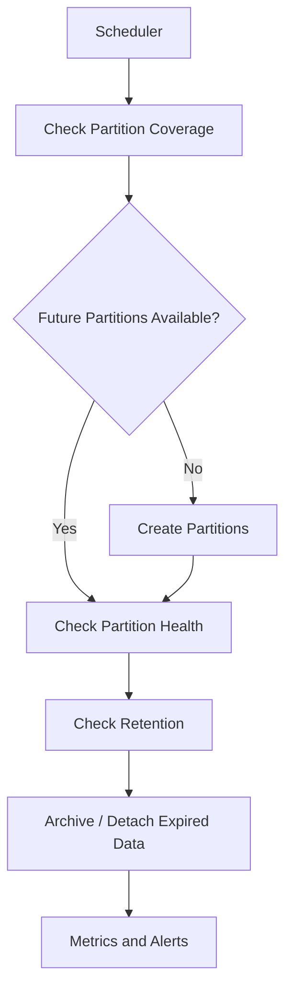

# 16- Partitioning Questions

## Overview

Database partitioning is a schema and storage strategy that divides one logical table into multiple physical partitions while allowing the application to query the data through the parent table.

Partitioning becomes relevant when a table has:

- Large data volume
- High read/write traffic
- Natural data lifecycle boundaries
- Time-based retention requirements
- Large maintenance operations
- Queries that frequently filter by a partition key

The important interview distinction is:

```text
Partitioning
    ↓
one logical table
    ↓
multiple physical partitions
```

versus:

```text
Sharding
    ↓
data distributed across independent database nodes
```

Partitioning is primarily a database-local organization technique. It does not automatically provide horizontal database scaling.

---

## What Is Table Partitioning?

Suppose an `events` table contains billions of rows.

Instead of storing everything in one physical table:

```text
events
 └── billions of rows
```

the table can be partitioned:

```text
events
 ├── events_2026_01
 ├── events_2026_02
 ├── events_2026_03
 └── events_2026_04
```

The application can still query:

```sql
SELECT *
FROM events
WHERE event_time >= $1
  AND event_time < $2;
```

PostgreSQL can route the query to relevant partitions.

---

## Why Partitioning Exists

Partitioning can improve operational and query behavior for workloads where data naturally separates.

Common benefits include:

- Partition pruning
- Smaller indexes per partition
- Easier retention management
- Faster removal of old data
- Isolated maintenance
- Better locality for time-based workloads
- Reduced working-set size for relevant queries

Partitioning is not a universal performance optimization.

A poorly chosen partition key can make the system more complex without providing meaningful benefit.

---

## Partitioning vs Sharding

| Property | Partitioning | Sharding |
|---|---|---|
| Logical table | Usually one logical table | Usually distributed across databases |
| Physical location | Same database cluster | Multiple database nodes |
| Query routing | Database planner | Often application/router |
| Scaling capacity | Primarily local | Horizontal |
| Cross-data queries | Relatively straightforward | Potentially scatter-gather |
| Operational complexity | Moderate | High |
| Common use | Lifecycle/locality | Database-scale distribution |

A common architecture progression is:

```text
single table
    ↓
partitioning
    ↓
read replicas / workload isolation
    ↓
sharding when necessary
```

The exact progression depends on workload.

---

## PostgreSQL Partitioning

PostgreSQL supports declarative partitioning.

Example:

```sql
CREATE TABLE events (
    id bigint GENERATED ALWAYS AS IDENTITY,
    event_time timestamptz NOT NULL,
    tenant_id bigint NOT NULL,
    event_type text NOT NULL,
    payload jsonb NOT NULL
) PARTITION BY RANGE (event_time);
```

Create partitions:

```sql
CREATE TABLE events_2026_01
PARTITION OF events
FOR VALUES FROM ('2026-01-01') TO ('2026-02-01');

CREATE TABLE events_2026_02
PARTITION OF events
FOR VALUES FROM ('2026-02-01') TO ('2026-03-01');
```

The parent table defines the logical interface.

---

## Partitioning Types

PostgreSQL commonly supports:

| Type | Partitioning Strategy | Typical Use |
|---|---|---|
| RANGE | Value ranges | Time-series data |
| LIST | Explicit values | Region, tenant class, category |
| HASH | Hash buckets | Even distribution |
| Multi-level | Partitioned partitions | Complex large-scale workloads |

---

## Range Partitioning

Range partitioning divides values into intervals.

Typical example:

```text
events
 ├── January
 ├── February
 ├── March
 └── April
```

Example:

```sql
CREATE TABLE events_2026_03
PARTITION OF events
FOR VALUES FROM ('2026-03-01') TO ('2026-04-01');
```

Time-based partitioning is one of the most common production uses.

---

## Why Time Partitioning Works Well

Time is often:

- Present in every event
- Used in queries
- Naturally ordered
- Suitable for retention
- Suitable for archival

For example:

```text
new data
  ↓
current partition
  ↓
older partitions
  ↓
archive
  ↓
drop
```

This makes lifecycle management much easier.

---

## List Partitioning

List partitioning assigns explicit values.

Example:

```sql
CREATE TABLE orders (
    id bigint GENERATED ALWAYS AS IDENTITY,
    region text NOT NULL,
    created_at timestamptz NOT NULL
) PARTITION BY LIST (region);
```

Partitions:

```sql
CREATE TABLE orders_india
PARTITION OF orders
FOR VALUES IN ('IN');

CREATE TABLE orders_us
PARTITION OF orders
FOR VALUES IN ('US');
```

Useful when categories are stable and operationally meaningful.

---

## Hash Partitioning

Hash partitioning distributes rows across a fixed number of partitions based on a hash.

Conceptually:

```text
tenant_id
   ↓
hash
   ↓
partition 0 / 1 / 2 / 3
```

This can distribute writes more evenly than poorly balanced range partitions.

However, hash partitioning is usually less convenient for lifecycle operations because values do not map naturally to time ranges.

---

## Multi-Level Partitioning

A table can be partitioned hierarchically.

For example:

```text
events
 ├── 2026
 │    ├── January
 │    ├── February
 │    └── March
 └── 2027
      ├── January
      └── February
```

Use this only when the additional complexity provides a real operational or query benefit.

Too many partitions can itself become a performance and management problem.

---

## Choosing a Partition Key

A good partition key usually aligns with:

```text
query predicates
+
data lifecycle
+
data distribution
```

Ask:

- Do important queries filter by this column?
- Can PostgreSQL prune irrelevant partitions?
- Does the key distribute writes reasonably?
- Does it support retention?
- Will partitions remain manageable in size?
- Does the key remain stable?

---

## Bad Partition Keys

Potentially poor choices include:

- Highly random values when queries do not filter by them
- Extremely high-cardinality values that create excessive partitions
- Mutable values
- Values unrelated to access patterns
- Keys that produce severe skew

For example, creating one partition per user is usually operationally unreasonable for a system with millions of users.

---

## Partition Pruning

Partition pruning allows PostgreSQL to avoid scanning irrelevant partitions.

Suppose:

```text
events
 ├── January
 ├── February
 ├── March
 └── April
```

Query:

```sql
SELECT count(*)
FROM events
WHERE event_time >= '2026-03-01'
  AND event_time < '2026-04-01';
```

PostgreSQL can potentially access only:

```text
March partition
```

instead of all partitions.

---

## Partition Pruning vs Indexing

These solve different problems.

```text
Partition pruning
    ↓
Which partitions need consideration?

Index
    ↓
Which rows inside the partition can be located efficiently?
```

A partitioned table may still require indexes.

For example:

```sql
CREATE INDEX idx_events_march_tenant
ON events_2026_03 (tenant_id, event_time DESC);
```

Partition pruning and indexes often work together.

---

## Querying the Parent Table

Applications should generally query the parent table:

```sql
SELECT *
FROM events
WHERE event_time >= $1
  AND event_time < $2;
```

PostgreSQL handles partition routing.

Directly querying individual partitions can be useful for operational tasks, but application code should not normally need to know the physical partition layout.

---

## Indexes on Partitioned Tables

Indexes are typically created on the partitioned parent:

```sql
CREATE INDEX idx_events_tenant_time
ON events (tenant_id, event_time DESC);
```

PostgreSQL manages the corresponding partition-level indexes.

The important operational point is that each partition has its own physical index structure.

Therefore:

```text
one logical index definition
        ↓
multiple physical indexes
```

---

## Partition Size

Partition size should be operationally manageable.

If partitions are too large:

- Maintenance becomes expensive.
- Indexes become large.
- Retention operations become coarse.
- Backups and vacuum work can become harder.

If partitions are too small:

- Planning overhead can increase.
- Catalog metadata grows.
- More objects must be maintained.
- Operational complexity increases.

There is no universal ideal partition size.

---

## Partition Count

Avoid creating excessive numbers of partitions.

For example:

```text
millions of partitions
```

is generally a design failure.

Even if individual partitions are small, the database must manage:

- Catalog metadata
- Partition hierarchy
- Index objects
- Statistics
- Planning
- Maintenance

Choose a partition granularity that matches the workload and lifecycle.

---

## Partitioned Table Example

A production-oriented event table might use:

```sql
CREATE TABLE events (
    id bigint GENERATED ALWAYS AS IDENTITY,
    tenant_id bigint NOT NULL,
    event_time timestamptz NOT NULL,
    event_type text NOT NULL,
    payload jsonb NOT NULL
) PARTITION BY RANGE (event_time);
```

Then:

```text
events_2026_01
events_2026_02
events_2026_03
...
```

Indexes can support common access patterns:

```sql
CREATE INDEX idx_events_tenant_time
ON events (tenant_id, event_time DESC);
```

---

## Retention With Partitions

One of the strongest uses of partitioning is data retention.

Without partitions:

```sql
DELETE FROM events
WHERE event_time < $1;
```

can generate:

- Large WAL volume
- Dead tuples
- Long-running transactions
- Vacuum pressure
- Lock and I/O pressure

With partitions:

```text
old partition
    ↓
detach
    ↓
archive or drop
```

This can be substantially more operationally efficient.

---

## Dropping Old Partitions

If an old partition is no longer required:

```sql
DROP TABLE events_2025_01;
```

Or detach it first:

```sql
ALTER TABLE events
DETACH PARTITION events_2025_01;
```

Detaching can be useful when the data must be archived or validated before removal.

Retention policy should be defined before the table becomes enormous.

---

## Partition Lifecycle

A mature system treats partitions as lifecycle-managed objects.


Automate partition creation before incoming data reaches the boundary.

---

## Missing Future Partitions

A time-partitioned table needs a partition available for incoming data.

If no partition matches an inserted row, the insert can fail.

For example:

```text
current date
    ↓
new month
    ↓
partition does not exist
    ↓
INSERT failure
```

Production systems should automate partition creation ahead of time and monitor for missing partitions.

---

## Default Partition

PostgreSQL can provide a default partition for rows that do not match another partition.

Conceptually:

```text
events
 ├── 2026_01
 ├── 2026_02
 └── default
```

This can protect ingestion from unexpected values.

However, it can also hide partition-management failures.

A default partition should be monitored and periodically reconciled rather than treated as a permanent dumping ground.

---

## Partition Constraints

Each partition has a partition bound.

For range partitioning:

```text
2026-03-01 <= event_time < 2026-04-01
```

The database uses these bounds for routing and pruning.

When designing partition keys, make sure the application's predicates align with the partition bounds.

---

## Unique Constraints

Partitioning introduces important uniqueness considerations.

A uniqueness constraint on a partitioned table generally needs to include the partition key so that PostgreSQL can enforce uniqueness across partitions.

For example:

```sql
UNIQUE (tenant_id, event_time, id)
```

may be possible when `event_time` is the partition key.

A globally unique value independent of the partition key requires careful design.

Do not assume partitioning gives you a free global uniqueness index across all partitions.

---

## Global Uniqueness

Suppose:

```text
id = 123
```

must be globally unique across every partition.

If the partitioning key is:

```text
created_at
```

the database cannot simply rely on independent per-partition indexes to enforce arbitrary global uniqueness.

Possible approaches include:

- Include the partition key in the unique key where semantically valid.
- Use an application-generated globally unique identifier.
- Use a separate authoritative uniqueness structure.
- Reconsider the partitioning strategy.

This is a common senior-level partitioning question.

---

## Foreign Keys and Partitioning

Foreign-key support and behavior should be evaluated against the PostgreSQL version and exact schema design.

A partitioned table can participate in relational relationships, but partitioning can introduce operational considerations around:

- Constraint enforcement
- Indexes
- Maintenance
- Large migrations
- Partition lifecycle

Do not assume partitioning removes normal relational integrity requirements.

---

## Partitioning and Vacuum

Each partition has its own physical storage and maintenance characteristics.

This can make maintenance more targeted.

For example:

```text
hot partition
    ↓
frequent updates
    ↓
more vacuum activity

old partition
    ↓
append-only / immutable
    ↓
less write maintenance
```

Partitioning can therefore align physical maintenance with data temperature.

---

## Hot and Cold Data

Partitioning naturally supports hot/cold data strategies.

```text
Hot
 ↓
current partition
 ↓
frequently queried
 ↓
high write activity

Cold
 ↓
historical partitions
 ↓
mostly read-only
 ↓
eventually archived
```

This can simplify operational decisions.

---

## Partitioning and Write Performance

Partitioning can help distribute writes across physical partitions when workloads are naturally separated.

However, partitioning is not automatically a write-performance optimization.

Potential costs include:

- Partition routing
- Planning overhead
- More indexes
- More metadata
- Maintenance complexity

Benchmark the actual workload.

---

## Partitioning and Indexes

Each partition generally needs appropriate indexes for its access patterns.

A partitioned table can therefore result in:

```text
100 partitions
×
3 indexes
=
300 physical indexes
```

This increases:

- Storage
- Index maintenance
- WAL
- DDL complexity
- Deployment work

Index design must therefore account for partition count.

---

## Partitioning and Query Plans

Always inspect execution plans.

Example:

```sql
EXPLAIN (ANALYZE, BUFFERS)
SELECT count(*)
FROM events
WHERE event_time >= '2026-03-01'
  AND event_time < '2026-04-01';
```

Look for evidence that irrelevant partitions are being eliminated.

A partitioned table that still scans every partition for critical queries may indicate:

- Missing predicates
- Poor partition-key alignment
- Planner limitations
- Parameterization behavior
- Query shape issues

---

## Partitioning and Prepared Statements

Prepared statements can interact with partition pruning depending on PostgreSQL planning behavior and whether the planner can determine parameter values during planning or execution.

Do not assume:

```text
partitioned table
+
prepared statement
=
always perfect pruning
```

Validate with actual execution plans and workload characteristics.

---

## Partitioning and Statistics

Each partition has data distribution characteristics.

Accurate statistics are important for:

- Cardinality estimation
- Join planning
- Access path selection
- Aggregation
- Partition-level decisions

Large or rapidly changing partitions may require appropriate statistics maintenance.

---

## Partitioning and ORMs

Django and SQLAlchemy can query partitioned parent tables like normal tables.

The database handles partition routing.

The main limitation is that high-level ORM abstractions do not automatically solve:

- Partition creation
- Partition lifecycle
- Retention
- Large backfills
- Partition maintenance

These often require migrations, management commands, scheduled jobs, or infrastructure automation.

---

## Django Example

The application can continue using a model representing the logical table.

Conceptually:

```python
class Event(models.Model):
    tenant_id = models.BigIntegerField()
    event_time = models.DateTimeField()
    event_type = models.CharField(max_length=100)
    payload = models.JSONField()
```

The partitioning strategy is generally implemented at the PostgreSQL schema level rather than relying on Django's model abstraction alone.

Migration tooling may need custom SQL for partition creation and lifecycle operations.

---

## FastAPI and SQLAlchemy

FastAPI does not need partition-specific routing logic.

A normal query:

```python
stmt = (
    select(Event)
    .where(
        Event.event_time >= start_time,
        Event.event_time < end_time,
    )
)
```

can target the parent table.

The database planner determines which partitions are relevant.

The application should generally remain unaware of the physical partition names.

---

## Partitioning and Kafka

Kafka can naturally produce time-oriented event streams.

For example:

```text
Kafka
  ↓
event consumer
  ↓
PostgreSQL events
  ↓
partition by event_time
```

Kafka partitioning and PostgreSQL table partitioning are separate concepts.

They can complement each other:

```text
Kafka partition key
    ↓
message ordering/distribution

PostgreSQL partition key
    ↓
storage/query/lifecycle organization
```

Do not assume the two partitioning strategies must use the same key.

---

## Partitioning and Celery

Celery can automate partition lifecycle operations.

Example:

```text
daily task
    ↓
create partitions for next 90 days
    ↓
verify existing partitions
    ↓
archive expired partitions
    ↓
report failures
```

Keep such jobs idempotent and observable.

A failed partition-maintenance task should alert before the application reaches an uncovered time boundary.

---

## Partitioning and Redis

Redis can cache frequently accessed data from active partitions.

Example:

```text
API
 ↓
Redis
 ↓ miss
PostgreSQL active partitions
```

Do not use Redis as the mechanism that determines authoritative partition membership.

The database schema should remain authoritative.

---

## Partitioning and Microservices

Partitioning is often useful within a service-owned database.

Example:

```text
Analytics Service
        ↓
events database
        ↓
monthly partitions
```

The service owns:

```text
partition key
+
retention
+
migration
+
maintenance
```

This is simpler than allowing multiple services to independently manipulate partition structures.

---

## Partitioning and Multi-Tenancy

Tenant-based partitioning can be useful when tenants are relatively few and operationally meaningful.

Example:

```text
tenant group A
tenant group B
tenant group C
```

But one partition per tenant may become unmanageable at large tenant counts.

Alternative strategies include:

- Hash partitioning
- Tenant groups
- Time + tenant multi-level partitioning
- Sharding large tenants
- Separate databases for very large tenants

---

## Large Tenant Problem

Suppose:

```text
tenant A = 50% of all data
tenant B = 0.01%
```

A simple tenant-based partitioning strategy creates uneven partition sizes.

Potential solutions:

```text
large tenants
    ↓
dedicated partitions/databases

small tenants
    ↓
shared partitions
```

This is a hybrid placement strategy.

---

## Partitioning and Sharding Together

Partitioning can exist inside each shard.

For example:

```text
Shard 1
 ├── 2026_01
 ├── 2026_02
 └── 2026_03

Shard 2
 ├── 2026_01
 ├── 2026_02
 └── 2026_03
```

This is useful when a system needs both:

```text
horizontal distribution
+
local lifecycle management
```

But operational complexity increases significantly.

---

## Partitioning and Read Replicas

Partitions are replicated as part of the database's WAL stream.

A large partition operation can therefore affect:

- WAL volume
- Replica replay
- Replica lag
- Backup duration

Partitioning should not be evaluated independently from replication.

---

## Partitioning and Backups

Partitioning does not eliminate the need for normal backup strategies.

Consider:

- Full backups
- WAL archiving
- PITR
- Retention
- Archived partitions
- Restore procedures

Detached partitions may need separate archival policies if they are removed from the primary database.

---

## Partitioning and High Availability

A partitioned PostgreSQL database can still use:

```text
Primary
   ↓ WAL
Standby
   ↓
Read replicas
```

Failover promotes the database as a whole.

Partitioning does not provide high availability by itself.

HA remains a separate architecture concern.

---

## Partitioning and Migrations

Partitioned tables can make schema changes more complex.

Potential considerations:

- Parent table changes
- Partition compatibility
- Index creation
- Constraint validation
- Existing partitions
- Future partition templates
- Deployment ordering

For large production systems, schema changes should be tested against representative partition counts.

---

## Adding a New Partition

A safe operational workflow is:

```text
Determine future boundary
        ↓
Create partition
        ↓
Create/validate indexes
        ↓
Verify constraints
        ↓
Monitor
        ↓
Allow writes
```

Automate this rather than depending on manual intervention.

---

## Attaching Existing Data

A large existing table can sometimes be converted into or attached as a partition.

Before attaching, the data must satisfy the partition boundary.

For large datasets, validation itself can be expensive.

Production migrations should account for:

- Locking
- Validation time
- Concurrent writes
- Replica impact
- Backups
- Rollback strategy

---

## Partition Maintenance Automation

A mature system should monitor:

```text
future partition coverage
partition size
partition count
partition growth
index size
query plans
retention status
replica lag
WAL volume
maintenance failures
```

Example workflow:



---

## Monitoring Partition Health

Useful PostgreSQL catalog views include:

```sql
SELECT
    relid::regclass AS partition,
    pg_size_pretty(pg_total_relation_size(relid)) AS total_size
FROM pg_catalog.pg_statio_user_tables
WHERE relid::regclass::text LIKE 'events_%'
ORDER BY pg_total_relation_size(relid) DESC;
```

For partition definitions, PostgreSQL catalog metadata can be inspected through partition-related catalog views and `pg_partition_tree()`.

Example:

```sql
SELECT *
FROM pg_partition_tree('events');
```

---

## Partitioning and Security

Partitioning does not replace authorization.

For multi-tenant systems:

```text
tenant isolation
    +
application authorization
    +
RLS where appropriate
```

should remain explicit.

Do not assume:

```text
tenant partition
=
security boundary
```

A partition is a storage organization mechanism, not automatically an authorization boundary.

---

## Partitioning and Cost

Partitioning can reduce operational cost when it enables:

- Efficient retention
- Smaller active working sets
- Faster archival
- More targeted maintenance
- Reduced unnecessary scans

But it also increases:

- Schema objects
- Index count
- Monitoring complexity
- Migration complexity
- Operational automation

Partitioning should have a measurable business or engineering benefit.

---

## When Not to Partition

Avoid partitioning when:

- The table is small.
- Queries do not benefit from pruning.
- Data lifecycle does not require it.
- Partition boundaries are arbitrary.
- The number of partitions would become excessive.
- Normal indexing solves the performance problem.
- Operational complexity outweighs the benefit.

A normal table with good indexes is often the better design.

---

## Partitioning Decision Framework

Ask:

```text
How large is the table?
        ↓
How quickly does it grow?
        ↓
What are the dominant queries?
        ↓
Do queries filter on a natural key?
        ↓
Does data have a lifecycle?
        ↓
Can pruning reduce work?
        ↓
Will partition sizes remain manageable?
        ↓
Can partition creation be automated?
        ↓
What happens to indexes and constraints?
        ↓
What happens to replicas and backups?
```

If these questions do not produce a strong reason to partition, do not introduce it.

---

## Common Partitioning Mistakes

### Partitioning Every Large Table

Large does not automatically mean partitioned.

### Choosing a Partition Key Without Query Analysis

A partition key that queries rarely filter on provides limited pruning value.

### Creating Too Many Partitions

Excessive partitions increase planning and operational overhead.

### Creating One Partition Per Tenant

This can become unmanageable as tenant count grows.

### Forgetting Future Partitions

Missing partitions can cause production inserts to fail.

### Treating the Default Partition as a Permanent Solution

It can hide partition-management failures.

### Assuming Partitioning Eliminates Indexes

Partitions still need appropriate indexes.

### Ignoring Global Uniqueness

Independent partition indexes do not automatically enforce arbitrary uniqueness across all partitions.

### Using Partitioning to Fix Bad Queries

Poor SQL can remain poor on a partitioned table.

### Ignoring Replica Lag

Large data movement or maintenance operations can generate significant WAL.

### Ignoring Backups

Partitioning does not replace backups or PITR.

### Treating Partitions as Security Boundaries

Partitioning does not replace authorization or RLS.

### Overusing Multi-Level Partitioning

More hierarchy means more operational complexity.

### Manual Partition Creation

Human-driven lifecycle operations eventually fail.

Automate them.

---

## Interview Traps

### What Is Partitioning?

Partitioning divides one logical table into multiple physical partitions based on a partition key.

---

### Why Use Partitioning?

Common reasons include:

- Partition pruning
- Data lifecycle management
- Retention
- Smaller indexes
- Targeted maintenance
- Better locality

---

### Is Partitioning the Same as Sharding?

No.

Partitioning usually divides data within a database cluster.

Sharding distributes data across independent database nodes or databases.

---

### What Is Partition Pruning?

The planner/executor eliminates partitions that cannot contain rows relevant to the query.

---

### Does Partitioning Automatically Make Queries Faster?

No.

It helps when the query can benefit from partition pruning or improved locality.

A query that must inspect many partitions may see little benefit.

---

### Does Every Partition Need an Index?

Not necessarily.

But indexes should be designed according to the access patterns that each partition serves.

A parent-level index definition can create corresponding partition indexes.

---

### What Is the Best Partition Key?

There is no universal best key.

A strong key aligns:

```text
query filters
+
data lifecycle
+
distribution
```

Time is often a good key for event and historical data.

---

### Why Is Time a Common Partition Key?

Because time:

- Is commonly queried
- Naturally orders data
- Supports retention
- Creates predictable boundaries

---

### Why Is One Partition Per Tenant Usually Dangerous?

Large SaaS systems can have thousands or millions of tenants.

The resulting number of database objects becomes difficult to operate.

Tenant groups, hashing, or sharding may be better.

---

### Can You Partition by Tenant?

Yes.

It can work when the tenant population is limited and operationally meaningful.

For high tenant counts, use a strategy that bounds the number of partitions.

---

### Can a Partitioned Table Have a Primary Key?

Yes, but uniqueness constraints on partitioned tables have restrictions related to the partition key.

If global uniqueness is required, design the key and partitioning strategy accordingly.

---

### Does Partitioning Improve Write Performance?

It can in some workloads by separating physical write paths and reducing per-object working sets.

But partition routing, indexes, and planning add overhead.

Benchmark the actual workload.

---

### Does Partitioning Replace Read Replicas?

No.

Partitioning and replication solve different problems.

```text
Partitioning
→ data organization

Replication
→ redundancy / read scaling / HA
```

They can be used together.

---

### Does Partitioning Replace Sharding?

No.

Partitioning can delay the need for sharding in some workloads, but it does not distribute a database across independent nodes by itself.

---

### What Happens if a Row Does Not Match a Partition?

Without a matching partition or suitable default partition, the insert fails.

Production systems should monitor partition coverage.

---

### What Is a Default Partition?

A partition that accepts rows not matching explicitly defined partitions.

It can protect ingestion but should be monitored so partitioning errors are not silently hidden.

---

### Why Is Partitioning Useful for Deletes?

Dropping or detaching an old partition can be much more efficient than deleting millions of individual rows.

---

### Can Partitioning Improve Vacuum Behavior?

It can make maintenance more targeted because partitions have separate physical storage and data characteristics.

However, each partition still requires appropriate maintenance.

---

## Senior-Level Partitioning Scenario

### Design an Event Storage System

Requirements:

```text
5 billion events
100 million new events/day
Queries mostly filter by event_time
Retention = 12 months
Some tenants are significantly larger
```

A reasonable starting architecture:

```text
PostgreSQL
    ↓
events
    ↓
monthly range partitions
    ↓
indexes per partition
    ↓
12-month retention
```

Potential enhancements:

```text
large tenants
    ↓
tenant-aware placement strategy

historical data
    ↓
archive / object storage

analytics
    ↓
CDC / Kafka
    ↓
OLAP system
```

The key is not merely choosing monthly partitions.

You must also design:

- Partition creation automation
- Retention
- Indexes
- Ingestion
- Replica impact
- Backup
- Query plans
- Large-tenant behavior
- Archival
- Monitoring

---

## Senior-Level Partitioning Scenario

### Monthly Orders

Requirement:

```text
orders grow by 100 million rows/year
most queries target recent orders
orders older than 7 years must be removed
```

A reasonable approach:

```text
orders
 ├── 2026_01
 ├── 2026_02
 ├── ...
 └── 2033_12
```

Retention:

```text
expired partition
    ↓
validate
    ↓
detach
    ↓
archive if required
    ↓
drop
```

This is usually preferable to repeatedly executing:

```sql
DELETE FROM orders
WHERE created_at < $1;
```

against a massive unpartitioned table.

---

## Production Partitioning Checklist

### Design

- [ ] Table size and growth are measured.
- [ ] Critical query patterns are known.
- [ ] Partition key aligns with important predicates.
- [ ] Data lifecycle is understood.
- [ ] Partition distribution is reasonable.
- [ ] Partition count is bounded.

### Querying

- [ ] Partition pruning is validated.
- [ ] Indexes support common access patterns.
- [ ] Execution plans are monitored.
- [ ] Cross-partition queries are understood.
- [ ] Prepared-statement behavior is validated where relevant.

### Operations

- [ ] Future partitions are created automatically.
- [ ] Missing partitions generate alerts.
- [ ] Partition sizes are monitored.
- [ ] Retention is automated.
- [ ] Archival procedures are defined.
- [ ] Partition failures are observable.

### Reliability

- [ ] Replication impact is measured.
- [ ] WAL growth is monitored.
- [ ] Backup strategy includes all required partitions.
- [ ] PITR is tested.
- [ ] Failover behavior is understood.

### Security

- [ ] Partitioning is not treated as authorization.
- [ ] Tenant isolation is enforced independently.
- [ ] RLS is considered where appropriate.
- [ ] Least-privilege access is maintained.

### Application

- [ ] Django/FastAPI code queries logical parent tables.
- [ ] Application code does not depend unnecessarily on physical partition names.
- [ ] Background workers understand partition lifecycle.
- [ ] Kafka/CDC consumers tolerate partition lifecycle changes.

---

## Key Takeaways

- **Partitioning divides one logical table into manageable physical partitions:** it is primarily a database-local organization and lifecycle strategy, not a replacement for sharding.
- **Choose partition keys from workload and lifecycle:** query predicates, partition pruning, data distribution, retention, and partition size should all influence the decision.
- **Partitioning does not eliminate normal database design concerns:** indexes, constraints, query plans, transactions, replication, backups, authorization, and monitoring still matter.
- **Time-based partitioning is especially powerful for large append-oriented datasets:** it enables predictable pruning and efficient archival or retention through partition detach/drop operations.
- **Production partitioning requires automation:** future partition creation, retention, monitoring, index management, replica impact, and failure handling must be designed before the table reaches critical scale.