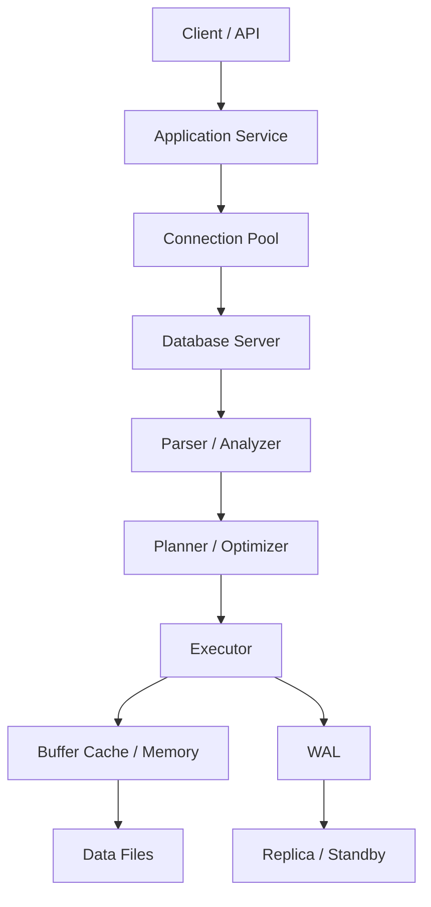
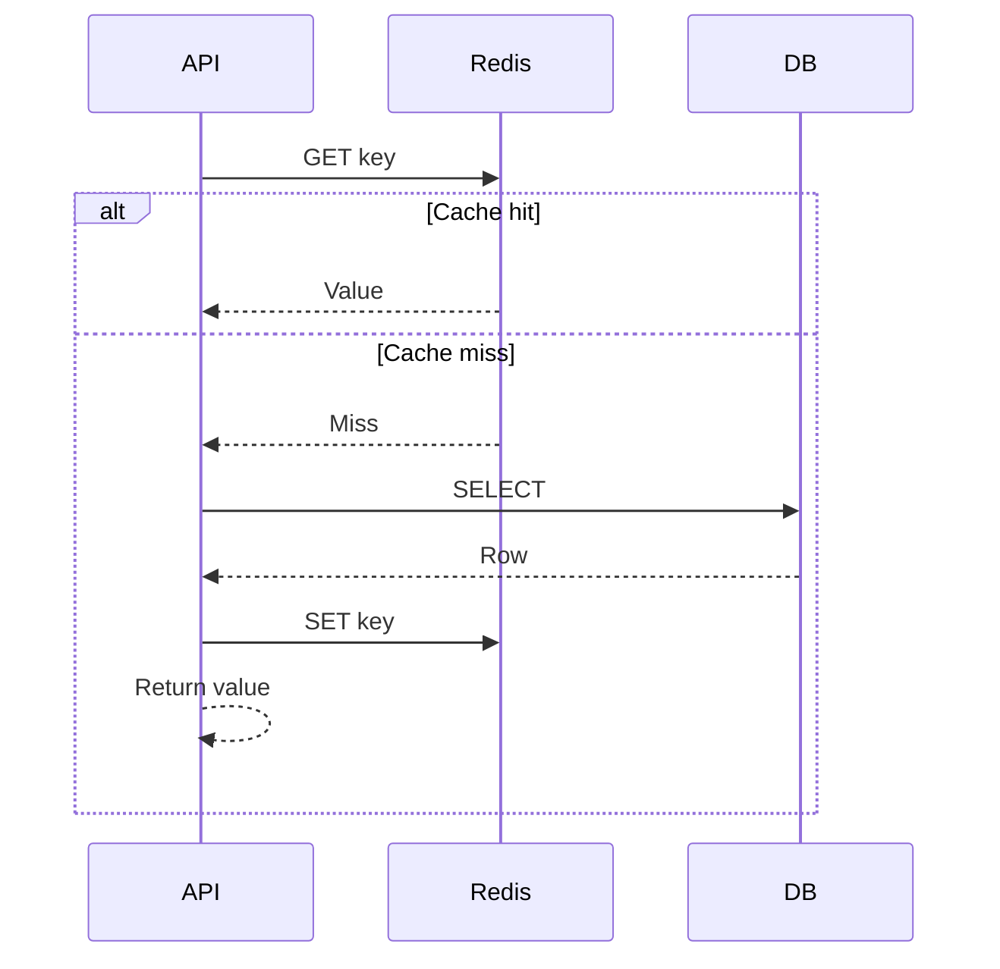
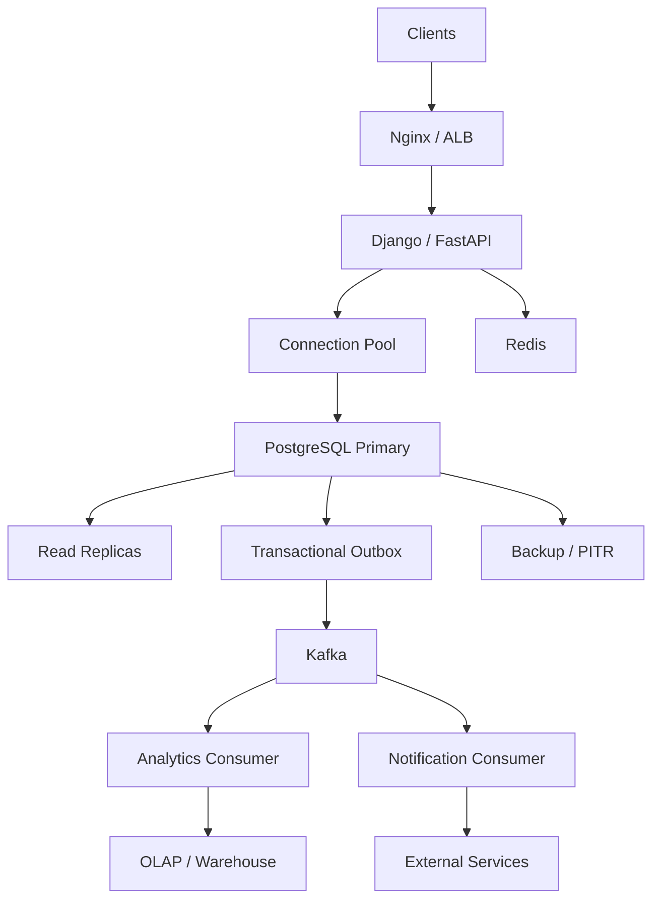

# 17- SQL Architecture Questions

## Overview

SQL architecture questions evaluate whether an engineer understands how a database behaves as part of a production backend system, not merely how to write queries.

At senior level, an SQL architecture answer should connect:

```text
Application
    ↓
Connection / Network
    ↓
Database Server
    ↓
Parser / Planner
    ↓
Executor
    ↓
Memory / Cache
    ↓
Storage
    ↓
WAL / Replication / Recovery
```

and then reason about:

- Transactions and concurrency
- Indexes and query plans
- Connection pooling
- Read replicas
- Partitioning and sharding
- Caching
- OLTP and OLAP workloads
- Security
- High availability
- Disaster recovery
- Observability
- Capacity and cost

The strongest interview answers begin with requirements and constraints rather than immediately proposing a database feature.

---

## What Interviewers Are Evaluating

A senior SQL architecture discussion usually evaluates several dimensions simultaneously.

| Area | What the interviewer wants to see |
|---|---|
| Data modeling | Clear entities, relationships, constraints |
| Query performance | Indexes, plans, cardinality, workload analysis |
| Transactions | Atomicity, isolation, consistency |
| Concurrency | Locks, MVCC, contention, deadlocks |
| Scaling | Vertical scaling, replicas, partitioning, sharding |
| Reliability | HA, failover, backups, PITR |
| Security | Authentication, authorization, least privilege |
| Operations | Monitoring, migrations, maintenance |
| Application integration | ORM, pooling, caching, workers |
| Trade-offs | Ability to explain why one design is preferable |

A weak answer lists technologies.

A strong answer explains:

```text
requirement
    ↓
constraint
    ↓
architecture
    ↓
trade-off
    ↓
failure mode
    ↓
operational strategy
```

---

## Database Architecture Fundamentals

A production SQL system typically contains several logical layers.



The database server is responsible for:

- Parsing SQL
- Resolving objects and types
- Planning execution
- Executing operators
- Managing transactions
- Maintaining indexes
- Managing memory
- Coordinating concurrent access
- Writing durable changes
- Recovering after failures

The application should not need to know these internal implementation details to issue a query, but a senior backend engineer should understand them when diagnosing production behavior.

---

## SQL Request Lifecycle

A simplified request path is:

```text
HTTP request
    ↓
Django / FastAPI
    ↓
ORM / SQL builder
    ↓
Database driver
    ↓
Connection pool
    ↓
TCP/TLS
    ↓
PostgreSQL
    ↓
Parse
    ↓
Plan
    ↓
Execute
    ↓
Return rows
    ↓
Application serialization
    ↓
HTTP response
```

Latency can therefore originate outside the SQL statement itself.

For example:

```text
API latency
=
network
+
pool acquisition
+
database execution
+
lock wait
+
result transfer
+
application processing
```

This is why database architecture cannot be evaluated independently from application architecture.

---

## OLTP vs OLAP Architecture

One of the most common architectural distinctions is between transactional and analytical workloads.

| Characteristic | OLTP | OLAP |
|---|---|---|
| Primary workload | Transactions | Analytics |
| Queries | Small and targeted | Large and aggregating |
| Writes | Frequent | Usually batch/stream ingestion |
| Data model | Often normalized | Often denormalized |
| Latency | Low | Seconds/minutes may be acceptable |
| Concurrency | High | Often lower |
| Storage | Row-oriented common | Columnar common |
| Typical example | Orders/payments | Business reporting |

A common production architecture separates them:

```text
                ┌───────────────┐
API ───────────>│ OLTP Primary  │
                └───────┬───────┘
                        │
                        │ CDC / ETL / Events
                        ↓
                ┌───────────────┐
                │ OLAP /        │
                │ Warehouse     │
                └───────────────┘
```

Do not run expensive analytical queries against a critical OLTP primary merely because the SQL is valid.

---

## Normalized Database Design

Normalization reduces unnecessary duplication and update anomalies.

Typical OLTP structure:

```text
customers
    ↓
orders
    ↓
order_items
    ↓
products
```

For example:

```sql
CREATE TABLE customers (
    id bigint GENERATED ALWAYS AS IDENTITY PRIMARY KEY,
    email text NOT NULL UNIQUE
);

CREATE TABLE orders (
    id bigint GENERATED ALWAYS AS IDENTITY PRIMARY KEY,
    customer_id bigint NOT NULL REFERENCES customers(id),
    created_at timestamptz NOT NULL DEFAULT now()
);

CREATE TABLE order_items (
    order_id bigint NOT NULL REFERENCES orders(id),
    product_id bigint NOT NULL REFERENCES products(id),
    quantity integer NOT NULL CHECK (quantity > 0),
    PRIMARY KEY (order_id, product_id)
);
```

Normalization should be the default for authoritative transactional data.

Denormalization should be an intentional response to workload or architectural requirements.

---

## Constraints as Architecture

A production database should enforce important invariants.

Useful constraints include:

```text
PRIMARY KEY
FOREIGN KEY
UNIQUE
NOT NULL
CHECK
```

For example:

```sql
CREATE TABLE payments (
    id bigint GENERATED ALWAYS AS IDENTITY PRIMARY KEY,
    order_id bigint NOT NULL REFERENCES orders(id),
    amount numeric(12, 2) NOT NULL CHECK (amount > 0),
    status text NOT NULL
);
```

This prevents invalid states even if:

- An application bug occurs.
- Multiple services write concurrently.
- A worker retries.
- An API bypasses a validation layer.

Database constraints are therefore part of architecture, not merely schema decoration.

---

## Query Processing Architecture

PostgreSQL transforms SQL through several stages:

```text
SQL
 ↓
Parser
 ↓
Semantic analysis / rewriting
 ↓
Planner / optimizer
 ↓
Execution plan
 ↓
Executor
 ↓
Rows
```

The planner evaluates available access paths such as:

```text
Sequential Scan
Index Scan
Index Only Scan
Bitmap Heap Scan
Nested Loop
Hash Join
Merge Join
Sort
Aggregate
Parallel operators
```

A senior engineer should understand that SQL describes **what** data is required while the planner determines **how** to retrieve it.

---

## Query Optimization

Never start optimization with:

> "Add an index."

Start with:

```text
What query is slow?
        ↓
How frequently does it execute?
        ↓
What is its execution plan?
        ↓
Are estimates accurate?
        ↓
Is it CPU, I/O, memory, or waiting?
        ↓
Is the query shape correct?
        ↓
Would an index help?
        ↓
Would caching or architecture change help?
```

Useful PostgreSQL tooling includes:

```sql
EXPLAIN (ANALYZE, BUFFERS)
SELECT ...
```

and:

```sql
SELECT
    query,
    calls,
    total_exec_time,
    mean_exec_time
FROM pg_stat_statements
ORDER BY total_exec_time DESC
LIMIT 20;
```

Optimize workload impact, not just one slow query.

---

## Index Architecture

Indexes provide alternative access paths to table data.

A typical B-tree index supports:

```text
equality
range predicates
ordering
prefix matching for suitable predicates
```

Example:

```sql
CREATE INDEX idx_orders_customer_created
ON orders (customer_id, created_at DESC);
```

The correct index depends on the complete query pattern.

For:

```sql
WHERE customer_id = $1
ORDER BY created_at DESC
LIMIT 50
```

the composite index can support both filtering and ordering.

---

## Index Trade-offs

Indexes improve reads but increase write and storage costs.

| Benefit | Cost |
|---|---|
| Faster lookups | More storage |
| Efficient ordering | Write amplification |
| Faster joins | Index maintenance |
| Better selective filtering | WAL / replication impact |
| Covering access | Larger cache footprint |

A senior answer should always mention both sides.

---

## Transactions

A transaction defines an atomic unit of database work.

Example:

```sql
BEGIN;

UPDATE accounts
SET balance = balance - 100
WHERE id = $1;

UPDATE accounts
SET balance = balance + 100
WHERE id = $2;

COMMIT;
```

The transaction boundary should correspond to a business invariant.

For a backend service:

```text
HTTP request
    ↓
service method
    ↓
transaction
    ├── validate/update domain state
    ├── write related records
    └── write outbox event
    ↓
commit
```

Avoid keeping transactions open while waiting for external systems.

---

## Transaction Isolation

Isolation determines what concurrent transactions can observe.

Common PostgreSQL isolation levels include:

| Isolation | Typical Use |
|---|---|
| Read Committed | PostgreSQL default and common OLTP choice |
| Repeatable Read | Consistent transaction snapshot |
| Serializable | Strongest transactional isolation |

Higher isolation can increase contention or retries.

Do not choose the strongest level automatically.

Choose based on the business invariant.

---

## MVCC and Concurrency

PostgreSQL uses MVCC to allow concurrent transactions to work with snapshots while managing row versions.

This means:

```text
Transaction A reads
        +
Transaction B updates
        ↓
visibility rules determine
what each transaction sees
```

MVCC reduces reader/writer blocking but does not eliminate locking.

Updates, deletes, foreign keys, DDL, and explicit locking can still create contention.

---

## Row-Level Locking

For workflows requiring pessimistic coordination:

```sql
SELECT id, balance
FROM accounts
WHERE id = $1
FOR UPDATE;
```

The selected row remains locked until the transaction ends.

Use this when concurrent transactions must serialize access to a particular resource.

In Django:

```python
from django.db import transaction

with transaction.atomic():
    account = (
        Account.objects
        .select_for_update()
        .get(pk=account_id)
    )

    account.balance -= amount
    account.save(update_fields=["balance"])
```

Keep the transaction short.

---

## Optimistic Concurrency

When conflicts are relatively rare, optimistic concurrency can avoid holding locks.

Example:

```sql
UPDATE inventory
SET quantity = quantity - $1,
    version = version + 1
WHERE id = $2
  AND version = $3;
```

If:

```text
affected_rows = 0
```

the application knows that another transaction modified the row.

This approach can scale well when contention is moderate.

---

## Deadlocks

A deadlock occurs when transactions wait for each other indefinitely until the database detects the cycle.

Example:

```text
Transaction A
locks row 1
    ↓
waits for row 2

Transaction B
locks row 2
    ↓
waits for row 1
```

Prevent deadlocks through:

- Consistent lock ordering
- Short transactions
- Minimal lock scope
- Avoiding external calls inside transactions
- Careful advisory-lock usage

PostgreSQL reports deadlocks with SQLSTATE:

```text
40P01
```

Retry the **whole transaction**, not an arbitrary statement.

---

## Lock Contention

Contention is not the same as a deadlock.

```text
Contention:
A waits for B

Deadlock:
A waits for B
B waits for A
```

A system can have severe contention without deadlocks.

Typical hot resources include:

- Inventory rows
- Account balances
- Counters
- Job queues
- Shared state records

Adding more application workers can make contention worse.

---

## Connection Pooling

A connection pool controls database connection reuse and application concurrency.

Without pooling:

```text
request
  ↓
new connection
  ↓
query
  ↓
close
```

With pooling:

```text
request
  ↓
acquire connection
  ↓
query
  ↓
release connection
```

Pool size must account for the entire application fleet.

For example:

```text
20 pods
×
10 connections
=
200 possible connections
```

before accounting for overflow or background workers.

A larger pool does not automatically increase throughput.

---

## PgBouncer

PgBouncer can sit between applications and PostgreSQL.

```text
Application Pods
      ↓
   PgBouncer
      ↓
 PostgreSQL
```

It can reduce pressure from large numbers of application processes.

Important modes include:

| Mode | Pooling Scope |
|---|---|
| Session | Connection held for client session |
| Transaction | Connection returned after transaction |
| Statement | Connection returned after each statement |

Transaction pooling is useful for high connection churn but requires care around session state and features that assume connection affinity.

---

## Read Replicas

Read replicas can scale read workloads.

```text
                ┌── Read Replica 1
                │
Primary ────────┼── Read Replica 2
                │
                └── Read Replica 3
```

But replication introduces consistency considerations.

With asynchronous replication:

```text
Primary commit
    ↓
Replica receives WAL later
```

A read immediately following a write may see stale data on a replica.

This is the read-after-write problem.

---

## Read Routing

A production API may route:

```text
writes
    ↓
primary

ordinary reads
    ↓
replicas

read-after-write reads
    ↓
primary or sufficiently caught-up replica
```

Do not route every read to replicas blindly.

Consider:

- Replica lag
- Business consistency
- Query workload
- Failover state
- Connection pool capacity

---

## Replication Architecture

PostgreSQL physical replication generally propagates WAL.

```text
Transaction
    ↓
WAL
    ↓
Primary
    ↓
WAL transport
    ↓
Standby
    ↓
Replay
```

Replication supports:

- High availability
- Read scaling
- Disaster recovery
- Geographic copies

It does not automatically scale writes.

---

## Partitioning

Partitioning divides one logical table into multiple physical partitions.

Example:

```text
events
 ├── 2026_01
 ├── 2026_02
 ├── 2026_03
 └── 2026_04
```

For a time-based query:

```sql
SELECT count(*)
FROM events
WHERE event_time >= '2026-03-01'
  AND event_time < '2026-04-01';
```

PostgreSQL can potentially prune irrelevant partitions.

Partitioning is especially useful for:

- Large append-heavy tables
- Time-series data
- Retention
- Archival
- Partition-local maintenance

---

## Partitioning vs Sharding

Partitioning:

```text
one database
    ↓
multiple physical partitions
```

Sharding:

```text
database cluster
    ↓
multiple independent database nodes
```

Sharding introduces significantly more application and operational complexity.

Potential sharding concerns include:

- Shard-key selection
- Routing
- Cross-shard queries
- Cross-shard transactions
- Rebalancing
- Global uniqueness
- Failure isolation

Do not introduce sharding before simpler scaling options are exhausted.

---

## Vertical Scaling

Vertical scaling increases resources on a database node.

Examples:

```text
more CPU
more RAM
faster storage
higher IOPS
```

Advantages:

- Simple application architecture
- No distributed query routing
- Minimal data-model changes

Limitations:

- Hardware limits
- Cost increases
- Maintenance/failure domain remains
- Does not solve every workload bottleneck

Vertical scaling is often the simplest first scaling step.

---

## Horizontal Scaling

Horizontal scaling distributes work across multiple nodes.

For SQL systems, common strategies include:

```text
read replicas
partitioning
sharding
workload-specific databases
```

Each solves a different problem.

| Problem | Common Strategy |
|---|---|
| More read traffic | Read replicas |
| Huge table | Partitioning |
| Database node capacity exceeded | Sharding |
| Analytics overload | OLAP system |
| Repeated expensive reads | Cache/read model |

---

## Caching

Redis can reduce repeated database reads.

Typical cache-aside flow:



Caching is appropriate when:

- Data is repeatedly requested.
- Slight staleness is acceptable.
- Database work is expensive.
- Cached values can be rebuilt.

The cache should not silently become the only source of truth for durable business state.

---

## Cache Stampede

Suppose a popular key expires:

```text
1000 requests
    ↓
cache miss
    ↓
1000 database queries
```

This can overload the database.

Mitigation techniques include:

- Request coalescing
- Locking
- Jittered TTLs
- Background refresh
- Stale-while-revalidate patterns

Caching therefore has concurrency implications.

---

## CQRS and Read Models

When read and write requirements diverge significantly:

```text
Command side
    ↓
normalized OLTP

Events / CDC
    ↓
read model

Query side
    ↓
denormalized representation
```

The read model can be optimized for specific API queries.

This is often preferable to aggressively denormalizing the transactional schema.

---

## Database Architecture in Microservices

A common production principle is:

> A service should own the data required to maintain its domain invariants.

Example:

```text
Order Service
    ↓
orders DB

Payment Service
    ↓
payments DB

Inventory Service
    ↓
inventory DB
```

Services communicate through:

- REST
- gRPC
- Kafka
- Domain events

Avoid building a distributed system that requires synchronous cross-service SQL joins.

---

## Transactional Outbox

When a database transaction must produce an event reliably:

```text
BEGIN
  update business tables
  insert outbox event
COMMIT
```

Then:

```text
Outbox
   ↓
Publisher
   ↓
Kafka
   ↓
Consumers
```

This avoids the dual-write problem:

```text
DB succeeds
Kafka fails
```

or:

```text
Kafka succeeds
DB fails
```

The outbox provides a durable handoff.

---

## Distributed Transactions

Avoid distributed transactions unless there is a strong requirement.

For example:

```text
Order DB
+
Payment DB
+
Inventory DB
```

should generally not be treated as one giant database transaction.

Alternatives include:

- Saga patterns
- Outbox
- Idempotent operations
- Compensating actions
- Explicit workflow state

The correct choice depends on business consistency requirements.

---

## Large-Scale Data Migration

Large production tables require incremental migration strategies.

A typical workflow:

```text
Expand schema
    ↓
Deploy compatible application
    ↓
Backfill incrementally
    ↓
Validate
    ↓
Switch reads/writes
    ↓
Observe
    ↓
Contract old schema
```

Avoid:

```sql
UPDATE huge_table
SET new_column = expensive_expression;
```

as one giant transaction.

Prefer bounded batches with checkpoints and throttling.

---

## Schema Migration Safety

Production deployments may temporarily contain multiple application versions.

Therefore schema changes must often support:

```text
old application
+
new application
```

simultaneously.

Common techniques:

- Expand-and-contract
- Add nullable columns first
- Backfill asynchronously
- Dual reads/writes
- Concurrent index creation
- Delayed destructive changes

Database migrations are part of deployment architecture.

---

## SQL Architecture on Kubernetes

A common deployment:

```text
                Kubernetes
┌──────────────────────────────────────┐
│                                      │
│  Nginx / Ingress                     │
│          ↓                           │
│  Django / FastAPI Pods               │
│          ↓                           │
│  Connection Pool / PgBouncer         │
│          ↓                           │
└──────────┼───────────────────────────┘
           ↓
     Managed PostgreSQL
           ↓
      Read Replicas
```

Do not place a stateful production database inside Kubernetes merely because the application runs there.

Managed PostgreSQL services such as AWS RDS or Aurora can reduce operational burden when their capabilities fit the workload.

---

## AWS Database Architecture

A common AWS-oriented architecture is:

```text
Internet
   ↓
ALB
   ↓
ECS / EKS / EC2
   ↓
Connection Pool
   ↓
RDS / Aurora PostgreSQL
   ├── Multi-AZ standby
   ├── Read replicas
   └── Backups / PITR
```

Potential complementary services include:

```text
ElastiCache / Redis
MSK / Kafka
S3
CloudWatch
Secrets Manager
KMS
```

Choose managed services based on requirements rather than technology popularity.

---

## High Availability

High availability aims to reduce service interruption during failures.

A common SQL HA design:

```text
Application
    ↓
Stable database endpoint
    ↓
Primary
    ↓ WAL
Standby
```

During failure:

```text
Primary failure
    ↓
Failure detection
    ↓
Standby promotion
    ↓
Endpoint update
    ↓
Application reconnect
```

Important considerations:

- Failover detection
- Fencing
- Split-brain prevention
- Replica health
- Connection recovery
- Transaction uncertainty
- Idempotent retries

---

## HA vs Disaster Recovery

These solve different problems.

| Concern | HA | DR |
|---|---|---|
| Goal | Continue service | Recover from major loss |
| Typical failure | Node/AZ failure | Region/data-center/corruption |
| Recovery | Seconds/minutes | Minutes/hours depending on design |
| Replication | Often synchronous/asynchronous | Often cross-region |
| Backup dependency | Not sufficient alone | Critical |

A replica is not a replacement for backups.

---

## Backup and PITR

Production SQL architecture should include:

```text
Base backup
+
WAL archiving
+
Point-in-time recovery
+
Restore testing
```

PITR is particularly valuable when data is accidentally deleted or corrupted.

The critical question is not:

> "Do we have backups?"

It is:

> "Can we restore the required state within the required RTO?"

---

## SQL Security Architecture

Security should be layered.

```text
Network security
    ↓
TLS
    ↓
Database authentication
    ↓
Database authorization
    ↓
Application authorization
    ↓
RLS where appropriate
    ↓
Audit / monitoring
```

Use:

- Least-privileged application roles
- Separate migration privileges
- Parameterized queries
- Secure secret storage
- TLS
- Auditing
- Appropriate tenant isolation

Never use a database superuser as the normal application credential.

---

## SQL Injection

Never construct SQL using untrusted string interpolation.

Unsafe:

```python
query = f"SELECT * FROM users WHERE email = '{email}'"
```

Use parameter binding:

```python
cursor.execute(
    "SELECT * FROM users WHERE email = %s",
    (email,),
)
```

Parameterization protects values.

Dynamic SQL involving identifiers such as table names or column names requires separate validation and allowlisting.

---

## Row Level Security

For multi-tenant systems, PostgreSQL RLS can enforce database-level row visibility.

Conceptually:

```text
tenant context
    ↓
RLS policy
    ↓
allowed rows
```

RLS should complement application authorization rather than replace correct service-level authorization design.

When connection pooling is used, tenant context must be transaction-scoped and carefully controlled.

---

## Observability

A production database architecture requires visibility into multiple layers.

### Database Metrics

Monitor:

- CPU
- Memory
- Disk utilization
- I/O
- Connections
- Transaction rate
- Query latency
- WAL generation
- Replica lag
- Cache behavior
- Lock waits
- Deadlocks
- Vacuum activity

### Query Metrics

Track:

```text
calls
total execution time
mean execution time
rows
planning time
execution time
```

`pg_stat_statements` is especially useful for identifying high-impact queries.

---

## Diagnosing Database Incidents

A useful incident workflow is:

```text
Symptom
  ↓
Database CPU / memory / I/O?
  ↓
Connections exhausted?
  ↓
Lock waits?
  ↓
Replica lag?
  ↓
Top queries?
  ↓
Execution plans?
  ↓
Recent deployment/migration?
  ↓
Retry storm?
```

Do not immediately increase database size.

The root cause may be:

```text
N+1 queries
+
connection leak
+
missing index
+
lock contention
+
bad query plan
+
application retry storm
```

---

## Database Backpressure

Database capacity is finite.

If the application sends more concurrent work than the database can process:

```text
request volume
    ↓
connection pool
    ↓
database queueing
    ↓
latency increases
    ↓
timeouts
    ↓
retries
    ↓
more load
```

This can create a positive feedback loop.

Use:

- Bounded connection pools
- Timeouts
- Rate limits
- Queue limits
- Worker concurrency limits
- Retry backoff
- Load shedding where appropriate

---

## Retry Storms

A database outage can become worse when every application instance retries immediately.

```text
DB failure
   ↓
requests fail
   ↓
clients retry
   ↓
DB recovers
   ↓
retry flood
   ↓
DB overloaded again
```

Use:

- Exponential backoff
- Jitter
- Maximum retry attempts
- Idempotency
- Circuit breaking where appropriate
- Bounded concurrency

Retry behavior is part of database architecture.

---

## Connection Capacity

Suppose:

```text
10 application pods
× 20 pool connections
= 200
```

and:

```text
5 Celery worker processes
× 10 connections
= 50
```

The database may see approximately:

```text
250 potential connections
```

before accounting for administrative connections and other workloads.

Always calculate connection capacity across the entire fleet.

---

## SQL Architecture and Background Workers

Celery workers can create significant database load.

For example:

```text
100 workers
    ↓
database connections
    ↓
large batch queries
    ↓
CPU / I/O pressure
```

Workers should have explicit concurrency limits.

For large jobs:

```text
API
 ↓
enqueue
 ↓
Celery
 ↓
bounded batches
 ↓
PostgreSQL
```

Do not allow background workloads to consume all database capacity needed by interactive APIs.

---

## SQL Architecture and Kafka

Kafka can isolate asynchronous workloads.

Example:

```text
API
 ↓
PostgreSQL
 ↓
Outbox
 ↓
Kafka
 ├── analytics consumer
 ├── search consumer
 └── notification consumer
```

This can prevent every downstream operation from becoming part of the request transaction.

Consumers must be:

- Idempotent
- Retry-safe
- Observable
- Capable of replay
- Designed for duplicate delivery

---

## SQL Architecture and REST/gRPC

A backend service should usually expose domain operations rather than database internals.

Good:

```http
POST /orders
GET /orders/{id}
```

or:

```text
CreateOrder(...)
GetOrder(...)
```

Avoid designing APIs that expose arbitrary SQL-like filtering without strict controls.

API-level query flexibility can create:

- Expensive queries
- Unbounded result sets
- Authorization mistakes
- Database abuse

Pagination, filtering limits, and query budgets are architectural controls.

---

## Security and SQL Architecture

A senior architecture answer should consider:

### Authentication

- Database credentials
- IAM/workload identity where supported
- Credential rotation
- TLS certificates

### Authorization

- Database roles
- Least privilege
- Application resource authorization
- RLS where required

### Data Protection

- Encryption at rest
- Encryption in transit
- Secret management
- Backup protection
- Sensitive-data minimization

### Auditing

Track privileged and security-relevant operations without logging sensitive values unnecessarily.

---

## Cost Considerations

Database architecture affects cost through:

```text
compute
+
memory
+
storage
+
IOPS
+
replicas
+
backup retention
+
network transfer
+
operational complexity
```

For example:

```text
10 read replicas
```

may be more expensive than:

```text
query optimization
+
Redis caching
+
read-model architecture
```

The correct decision depends on workload.

Optimize before scaling blindly.

---

## Common Architecture Mistakes

### "Just Add an Index"

Why it fails:

- Query may be lock-bound.
- Statistics may be wrong.
- Query shape may be inefficient.
- Result set may be huge.
- N+1 may dominate.
- CPU may be caused by query volume.

Better:

```text
measure
→ explain
→ identify bottleneck
→ optimize
→ validate
```

### "Just Add More Connections"

More connections can increase:

- CPU contention
- Memory usage
- Lock contention
- Context switching
- Queueing

Connection pools are concurrency controls, not capacity multipliers.

### "Use Read Replicas for Everything"

Replicas introduce:

- Lag
- Read-after-write issues
- Failover complexity
- Additional cost

### "Partition Because the Table Is Large"

Partitioning only helps when its partition key aligns with workload or lifecycle requirements.

### "Shard Immediately"

Sharding adds substantial distributed-systems complexity.

Exhaust simpler scaling strategies first.

### "Use Redis as the Database"

Redis is excellent for caching and specific fast-access data structures.

It should not replace durable relational state unless the system is explicitly designed around those semantics.

### "Run Analytics on the Primary"

Large scans and aggregations can consume resources needed by transactional workloads.

### "The ORM Handles Performance"

ORM abstractions do not eliminate:

- SQL
- Indexes
- Query plans
- Transactions
- Locks
- Database limits

---

## Architecture Decision Framework

When asked to design a SQL-backed system, use this sequence:

```text
Business requirements
        ↓
Consistency requirements
        ↓
Data model
        ↓
Transaction boundaries
        ↓
Access patterns
        ↓
Indexes
        ↓
Expected workload
        ↓
Caching
        ↓
Read scaling
        ↓
Partitioning
        ↓
Workload isolation
        ↓
Sharding if necessary
        ↓
HA / DR
        ↓
Security
        ↓
Observability
        ↓
Capacity / cost
```

This prevents premature technology selection.

---

## Example: E-Commerce Architecture

Requirements:

```text
High order volume
Strong transactional correctness
Frequent product reads
Payment integration
Analytics
High availability
```

A reasonable architecture:



The responsibilities are separated:

```text
PostgreSQL
→ authoritative transactional state

Redis
→ cache

Kafka
→ asynchronous event transport

OLAP
→ analytical workload

Read replicas
→ read scaling

Backup/PITR
→ recovery
```

---

## Example: High-Volume Events System

Requirements:

```text
100M events/day
12-month retention
Queries mostly filter by timestamp
Analytics required
```

A reasonable design:

```text
API / ingestion
      ↓
Kafka
      ↓
consumer
      ↓
partitioned PostgreSQL
      ↓
monthly retention
```

Analytics can flow separately:

```text
Kafka / CDC
    ↓
OLAP
```

PostgreSQL partitions can support:

```text
pruning
retention
archival
maintenance
```

Kafka partitioning can independently support:

```text
ingestion parallelism
ordering
consumer scalability
```

Do not confuse these two forms of partitioning.

---

## Example: Multi-Tenant SaaS

Requirements:

```text
10,000 tenants
strong tenant isolation
different tenant sizes
shared operational platform
```

Possible starting point:

```text
shared PostgreSQL database
        ↓
shared schema
        ↓
tenant_id
        ↓
composite indexes
        ↓
RLS where appropriate
```

For exceptionally large tenants:

```text
large tenant
    ↓
dedicated database/shard
```

This hybrid strategy avoids creating thousands of physical database partitions while still providing a scaling path.

---

## Senior Interview Questions

### How Would You Scale a PostgreSQL Database?

A strong answer should be progressive:

```text
query optimization
    ↓
indexes
    ↓
vertical scaling
    ↓
connection management
    ↓
read replicas
    ↓
caching
    ↓
partitioning
    ↓
workload isolation
    ↓
sharding if required
```

The correct strategy depends on whether the bottleneck is:

```text
CPU
memory
I/O
connections
locks
reads
writes
storage
query complexity
```

---

### How Would You Handle a Database That Is at 100% CPU?

First identify the workload.

Inspect:

```text
pg_stat_statements
pg_stat_activity
execution plans
wait events
query frequency
N+1 behavior
retry volume
autovacuum
```

Then determine whether CPU comes from:

```text
few expensive queries
+
many cheap queries
+
too much concurrency
+
maintenance
+
application retry storm
```

Only then decide whether to optimize queries, reduce concurrency, move reads, add caching, or scale hardware.

---

### How Would You Design for 100K Reads Per Second?

Do not immediately propose 100 read replicas.

First determine:

```text
read patterns
cacheability
freshness requirements
query cost
data locality
```

Potential architecture:

```text
API
 ↓
Redis
 ↓ miss
read replicas
 ↓
primary for strongly consistent reads
```

For complex reads:

```text
OLTP
 ↓
events / CDC
 ↓
read model / OLAP
```

---

### How Would You Handle 100K Writes Per Second?

First identify whether the workload is truly relational and transactional.

Potential strategies:

```text
batching
+
COPY
+
short transactions
+
partitioning
+
write contention reduction
+
queue-based ingestion
+
vertical scaling
+
sharding
```

The bottleneck could be:

```text
CPU
WAL
storage I/O
indexes
locks
hot rows
connections
```

The architecture must be driven by evidence.

---

### How Do You Prevent Database Overload?

Use multiple controls:

```text
connection limits
pool limits
timeouts
rate limits
backpressure
bounded workers
query optimization
caching
read replicas
load shedding
```

The objective is not merely to make the database faster.

It is to keep the system stable when demand exceeds capacity.

---

### How Would You Design a Multi-Region SQL System?

Start by defining:

```text
RPO
RTO
consistency requirements
write locality
failure model
```

Possible architecture:

```text
Region A
  ↓
Primary
  ↓ replication
Region B
  ↓
Standby / replica
```

Active-active writes are substantially more complex because of:

- Conflict resolution
- Global uniqueness
- Ordering
- Distributed transactions
- Network partitions

Do not recommend active-active simply because it sounds highly available.

---

### How Would You Handle Database Failover?

A strong answer includes:

```text
failure detection
    ↓
candidate validation
    ↓
fencing
    ↓
promotion
    ↓
stable endpoint update
    ↓
connection recycling
    ↓
application retry
    ↓
post-failover validation
```

Also discuss uncertain transactions.

A client may lose its network connection after the database committed a transaction.

Therefore retries should be idempotent.

---

### How Would You Design SQL for a Microservices System?

Start with service ownership:

```text
service
  ↓
owned data
  ↓
local transaction
```

Use events or APIs for cross-service communication.

For reliable event publication:

```text
local DB transaction
+
outbox
```

Avoid cross-service database joins and distributed transactions unless absolutely necessary.

---

## Interview Answer Structure

For architecture questions, use:

### Requirements

Clarify:

```text
traffic
data volume
read/write ratio
latency
consistency
availability
RPO/RTO
retention
tenant model
```

### Baseline Architecture

Start simple:

```text
Application
    ↓
PostgreSQL
```

### Bottlenecks

Identify likely limits:

```text
CPU
memory
I/O
connections
locks
storage
query latency
```

### Scaling Strategy

Introduce only the required mechanisms:

```text
indexes
replicas
cache
partitioning
sharding
```

### Failure Handling

Explain:

```text
timeouts
retries
idempotency
failover
backups
PITR
```

### Operational Model

Include:

```text
monitoring
alerts
migrations
capacity planning
security
cost
```

This demonstrates engineering maturity.

---

## Production SQL Architecture Checklist

### Data

- [ ] Data ownership is explicit.
- [ ] Schema is normalized where appropriate.
- [ ] Constraints enforce critical invariants.
- [ ] Access patterns are documented.
- [ ] Tenant isolation is explicit.

### Performance

- [ ] Critical queries have execution plans reviewed.
- [ ] Indexes match access patterns.
- [ ] Query frequency is measured.
- [ ] N+1 behavior is controlled.
- [ ] Large result sets are bounded.
- [ ] Slow queries are observable.

### Transactions

- [ ] Transaction boundaries match business operations.
- [ ] Transactions are short.
- [ ] External calls are outside critical transactions.
- [ ] Retry semantics are defined.
- [ ] Idempotency exists where required.

### Concurrency

- [ ] Hot rows are identified.
- [ ] Lock ordering is consistent.
- [ ] Deadlocks are monitored.
- [ ] Lock waits are observable.
- [ ] Optimistic/pessimistic strategies are chosen deliberately.

### Scaling

- [ ] Connection capacity is calculated.
- [ ] Read replicas are used where appropriate.
- [ ] Replica lag is monitored.
- [ ] Partitioning has a clear purpose.
- [ ] Sharding is introduced only when justified.
- [ ] OLTP and OLAP workloads are separated where needed.

### Reliability

- [ ] HA strategy is defined.
- [ ] Failover is tested.
- [ ] Backups are automated.
- [ ] PITR is available.
- [ ] Restore procedures are tested.
- [ ] RPO/RTO are documented.

### Security

- [ ] Application roles use least privilege.
- [ ] Credentials are stored securely.
- [ ] TLS is enabled where required.
- [ ] SQL uses parameter binding.
- [ ] Sensitive data is protected.
- [ ] Privileged operations are audited.

### Operations

- [ ] Database metrics are monitored.
- [ ] Query-level observability exists.
- [ ] Capacity has headroom.
- [ ] Migration procedures are tested.
- [ ] Background workers have bounded concurrency.
- [ ] Deployment rollback is considered.

---

## Interview Traps

### "Normalization Is Always Better"

Incorrect.

Normalization is generally a strong OLTP default, but controlled denormalization can be appropriate for read models, historical snapshots, and measured performance requirements.

### "Indexes Make Queries Fast"

Incomplete.

Indexes help only when the planner can use an appropriate access path and the query benefits from it.

### "Read Replicas Solve Scaling"

Only for certain read workloads.

They do not solve:

- Write bottlenecks
- Hot rows
- Primary CPU saturation caused by writes
- Replica lag
- Strong read-after-write requirements

### "More Connections Mean More Throughput"

Usually false beyond the database's useful concurrency level.

Excessive connections can amplify resource contention.

### "Partitioning Is Horizontal Scaling"

Incorrect.

Partitioning and sharding are different.

### "A Replica Is a Backup"

Incorrect.

A replica can replicate accidental deletion or corruption.

Backups and PITR provide a separate recovery mechanism.

### "Transactions Should Include Everything"

Incorrect.

External API calls, long computations, and waiting operations should generally not occur inside critical database transactions.

### "Serializable Is Always Safest"

Not automatically.

It provides stronger guarantees but can increase serialization failures and retry requirements.

### "The Database Should Validate Nothing"

Incorrect.

Important business invariants should be enforced as close to the data as practical, especially those involving uniqueness, relationships, and local consistency.

### "Microservices Should Share One Normalized Database"

Usually a poor boundary.

Cross-service data ownership creates coupling and makes independent deployment difficult.

---

## Senior-Level Heuristic

A strong SQL architecture answer usually follows five principles:

```text
1. Protect correctness
2. Measure the workload
3. Control concurrency
4. Scale the actual bottleneck
5. Design for failure
```

More concretely:

```text
Correct schema
    ↓
Database constraints
    ↓
Short transactions
    ↓
Efficient queries
    ↓
Controlled concurrency
    ↓
Caching / replicas / partitioning
    ↓
Workload isolation
    ↓
HA / DR
    ↓
Observability
```

The key senior-level skill is knowing **which layer should solve which problem**.

---

## Key Takeaways

- **SQL architecture is broader than query syntax:** reason across data modeling, query execution, transactions, concurrency, connections, replication, scaling, security, and recovery.
- **Scale the bottleneck, not the database blindly:** use execution plans, workload metrics, lock diagnostics, connection metrics, and infrastructure telemetry before choosing indexes, replicas, partitioning, or sharding.
- **Keep the transactional core simple and correct:** use normalized authoritative data, database constraints, short transactions, explicit concurrency control, and reliable event publication through patterns such as the transactional outbox.
- **Separate workloads when their requirements diverge:** Redis can absorb cacheable reads, replicas can scale appropriate reads, partitions can organize large tables, and OLAP/read models can isolate analytical workloads.
- **Production SQL architecture is failure-aware:** design connection limits, backpressure, retries, idempotency, HA, backups/PITR, migrations, observability, security, and cost into the system rather than treating them as operational afterthoughts.