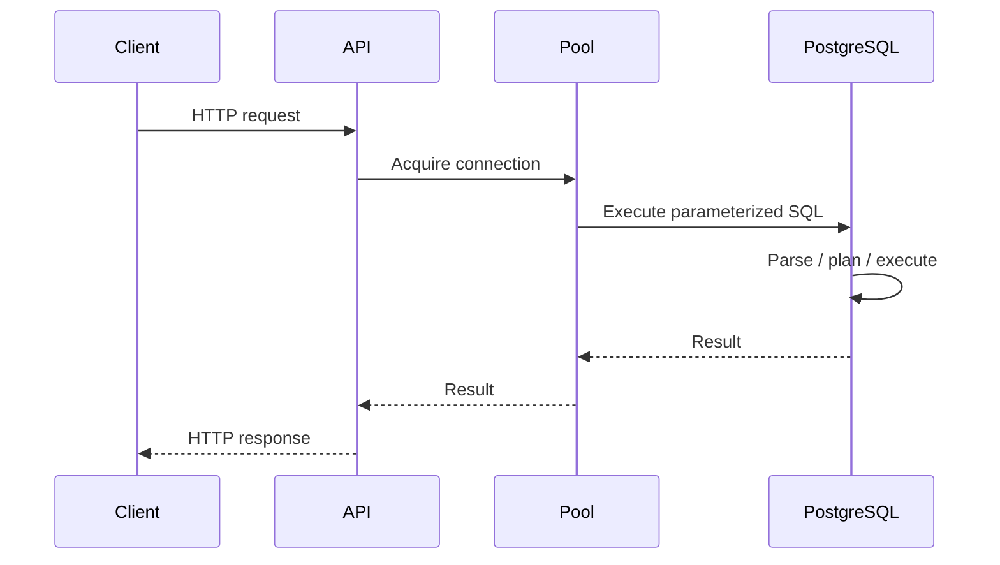
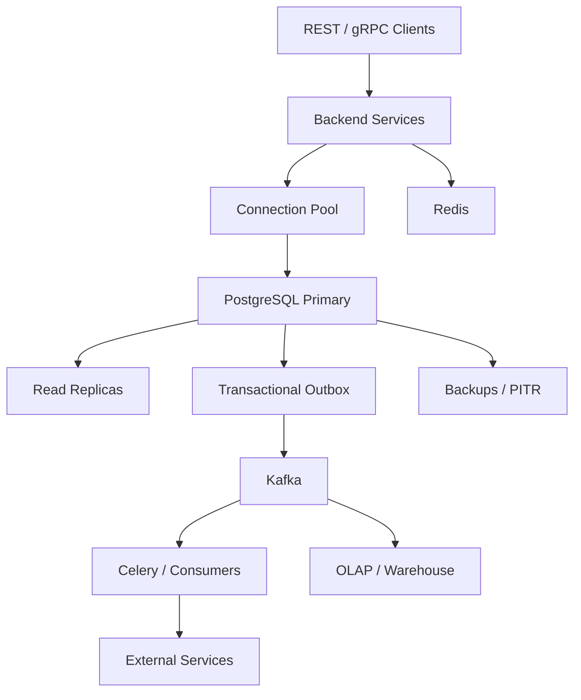

# 18- Backend SQL Questions

## Overview

Backend SQL interviews evaluate whether you can use SQL as part of a real backend system rather than treating it as an isolated query language.

For experienced backend engineers, questions usually connect SQL to:

- API request patterns
- ORM behavior
- Transactions
- Concurrency
- Connection pooling
- Caching
- Background processing
- Microservices
- Database scaling
- Security
- Observability
- Production failures

A strong answer should move through:

```text
Requirement
    ↓
Data model
    ↓
Query / transaction
    ↓
Database behavior
    ↓
Application integration
    ↓
Performance
    ↓
Concurrency
    ↓
Scalability
    ↓
Reliability / security
```

The goal is not to demonstrate that you know every SQL feature. It is to demonstrate that you understand how SQL behaves under production workloads.

---

## What Backend SQL Interviews Test

| Area | Typical Evaluation |
|---|---|
| Querying | Can you write correct SQL? |
| Data modeling | Can you model backend entities correctly? |
| ORM | Do you understand SQL generated by Django/SQLAlchemy? |
| Transactions | Can you preserve business invariants? |
| Concurrency | Can you reason about simultaneous requests? |
| Performance | Can you diagnose slow queries? |
| Indexes | Can you design and validate indexes? |
| Pagination | Can you design scalable APIs? |
| Security | Can you prevent SQL injection and authorization bugs? |
| Scaling | Can you scale reads, writes, and large datasets? |
| Reliability | Can you handle failures and retries? |
| Operations | Can you troubleshoot production database problems? |

---

## SQL and the Backend Request Lifecycle

A typical API request may follow:



The database is only one part of the latency path.

For example:

```text
API latency
=
application processing
+
connection acquisition
+
network
+
lock wait
+
query planning
+
query execution
+
result transfer
+
serialization
```

A senior backend engineer therefore investigates the complete request path.

---

## SQL vs ORM

An ORM provides an abstraction over SQL, but it does not remove SQL from the system.

Django:

```python
orders = (
    Order.objects
    .filter(customer_id=customer_id)
    .select_related("customer")
    .order_by("-created_at")[:50]
)
```

SQLAlchemy:

```python
stmt = (
    select(Order)
    .where(Order.customer_id == customer_id)
    .order_by(Order.created_at.desc())
    .limit(50)
)
```

Both eventually depend on database execution.

A backend engineer should be able to inspect:

- Generated SQL
- Bound parameters
- Query count
- Execution plan
- Index usage
- Returned row count
- Transaction behavior

The ORM is an abstraction, not a performance guarantee.

---

## How Do You Prevent SQL Injection?

Use parameterized queries.

Unsafe:

```python
query = f"""
SELECT id, email
FROM users
WHERE email = '{email}'
"""
```

Safe:

```python
cursor.execute(
    """
    SELECT id, email
    FROM users
    WHERE email = %s
    """,
    (email,),
)
```

Parameterization separates:

```text
SQL structure
```

from:

```text
data values
```

It should be the default for raw SQL.

However, parameterization does not automatically make dynamic identifiers safe.

For example, table names, column names, and sort directions may require explicit allowlisting.

---

## How Do You Handle Dynamic ORDER BY?

This is a common interview trap.

You cannot generally bind a column identifier as a normal value parameter.

Instead, map external values to trusted SQL fragments.

```python
sort_columns = {
    "created": "created_at",
    "name": "name",
}

column = sort_columns.get(requested_sort, "created_at")

query = f"""
SELECT id, name, created_at
FROM customers
ORDER BY {column}
LIMIT %s
"""
```

The important property is that `column` comes exclusively from a controlled allowlist.

Do not concatenate arbitrary request input into SQL.

---

## What Is the Difference Between WHERE and HAVING?

`WHERE` filters rows before grouping.

`HAVING` filters groups after aggregation.

```sql
SELECT customer_id, COUNT(*) AS order_count
FROM orders
WHERE created_at >= CURRENT_DATE - INTERVAL '30 days'
GROUP BY customer_id
HAVING COUNT(*) >= 5;
```

Conceptually:

```text
FROM
 ↓
WHERE
 ↓
GROUP BY
 ↓
HAVING
 ↓
SELECT
```

Use `WHERE` for row-level filtering whenever possible because reducing rows earlier can reduce the amount of work required for grouping.

---

## What Is the Difference Between EXISTS and IN?

Both can express membership conditions, but they have different semantics and can behave differently around `NULL`.

For existence checks:

```sql
SELECT c.id
FROM customers c
WHERE EXISTS (
    SELECT 1
    FROM orders o
    WHERE o.customer_id = c.id
);
```

`EXISTS` expresses:

> Does at least one matching row exist?

It is often a natural choice for relationship existence checks.

Do not claim that `EXISTS` is always faster than `IN`. PostgreSQL's optimizer may transform logically equivalent queries into similar execution strategies.

Correctness and query semantics come first.

---

## Why Is NOT IN Dangerous with NULL?

Consider:

```sql
WHERE customer_id NOT IN (
    SELECT customer_id
    FROM blocked_customers
)
```

If the subquery produces `NULL`, SQL's three-valued logic can make the predicate evaluate to `UNKNOWN` rather than `TRUE`.

A safer existence formulation is often:

```sql
WHERE NOT EXISTS (
    SELECT 1
    FROM blocked_customers b
    WHERE b.customer_id = customers.id
)
```

The interview point is not merely memorizing the syntax.

It is understanding SQL's `NULL` semantics.

---

## How Do You Find Duplicate Records?

First define what constitutes a duplicate.

For example:

```sql
SELECT email, COUNT(*)
FROM users
GROUP BY email
HAVING COUNT(*) > 1;
```

If email should be unique, the long-term solution should usually be a database constraint:

```sql
ALTER TABLE users
ADD CONSTRAINT users_email_unique UNIQUE (email);
```

Application-side checks alone are vulnerable to concurrent requests:

```text
Request A → check email
Request B → check email
Request A → insert
Request B → insert
```

A unique constraint provides database-level enforcement.

---

## How Do You Prevent Duplicate API Requests?

Use idempotency where the operation requires it.

For example:

```text
POST /payments
Idempotency-Key: abc123
```

Store the key with a uniqueness constraint:

```sql
CREATE UNIQUE INDEX payments_idempotency_key_uq
ON payments (idempotency_key);
```

Then concurrent or repeated requests can converge on one durable operation.

This is particularly important when:

- Clients retry.
- Networks fail.
- Workers retry.
- Payment operations are involved.
- The client cannot determine whether the first request committed.

---

## How Do You Safely Update a Counter?

Avoid:

```text
SELECT counter
UPDATE counter = counter + 1
```

when concurrent requests can modify the same row.

Prefer atomic SQL:

```sql
UPDATE accounts
SET login_count = login_count + 1
WHERE id = $1;
```

The database performs the update atomically.

However, atomic correctness does not guarantee unlimited scalability. A single extremely hot row can still become a contention bottleneck.

---

## What Is a Race Condition in SQL?

A race condition occurs when correctness depends on timing between concurrent operations.

Example:

```text
Inventory = 1

Request A reads 1
Request B reads 1

A decrements
B decrements

Result can violate the intended invariant
```

Possible solutions include:

- Atomic conditional updates
- Row locks
- Optimistic concurrency
- Serializable transactions
- Queue-based serialization

For example:

```sql
UPDATE inventory
SET quantity = quantity - $1
WHERE product_id = $2
  AND quantity >= $1;
```

Then verify the affected row count.

---

## Optimistic vs Pessimistic Concurrency

| Approach | Mechanism | Good Fit |
|---|---|---|
| Optimistic | Detect conflict during update | Conflicts relatively rare |
| Pessimistic | Lock resource before modification | Conflicts expensive / common |
| Serializable | Database detects serialization conflicts | Strong transactional guarantees |
| Queue serialization | Process resource sequentially | Highly contended workflows |

Optimistic example:

```sql
UPDATE documents
SET content = $1,
    version = version + 1
WHERE id = $2
  AND version = $3;
```

Pessimistic example:

```sql
SELECT *
FROM documents
WHERE id = $1
FOR UPDATE;
```

The choice depends on contention and business semantics.

---

## How Do Transactions Work in Backend Applications?

A transaction should usually correspond to a business operation that must remain atomic.

Django:

```python
from django.db import transaction

with transaction.atomic():
    order = create_order()
    create_order_items(order)
    create_outbox_event(order)
```

Conceptually:

```text
BEGIN
  ↓
business writes
  ↓
outbox write
  ↓
COMMIT
```

Avoid:

```python
with transaction.atomic():
    update_database()

    call_external_payment_api()

    send_email()
```

External calls can be slow or fail unpredictably.

Prefer committing the durable local state and handling external side effects asynchronously where appropriate.

---

## What Happens When a Transaction Fails?

Not every SQL failure should be retried identically.

Typical categories include:

| Failure | Typical Response |
|---|---|
| Unique violation | Correct input / idempotency handling |
| Foreign-key violation | Fix ordering or data |
| Deadlock | Retry whole transaction |
| Serialization failure | Retry whole transaction |
| Lock timeout | Investigate contention |
| Statement timeout | Optimize/cancel workload |
| Connection failure | Reconnect and handle uncertain commit |
| Constraint violation | Usually application/data correction |

For PostgreSQL:

```text
serialization failure → 40001
deadlock detected     → 40P01
```

Retrying must preserve transaction semantics and be bounded.

---

## How Do You Handle Deadlocks?

Deadlocks happen when transactions acquire conflicting locks in different orders.

Example:

```text
Transaction A:
lock row 1
wait for row 2

Transaction B:
lock row 2
wait for row 1
```

Prevention:

- Consistent lock ordering
- Short transactions
- Minimal lock scope
- Avoid external calls inside transactions
- Careful advisory-lock design

If PostgreSQL aborts a transaction due to a deadlock, retry the entire transaction with bounded backoff and jitter.

---

## What Is Lock Contention?

Lock contention occurs when transactions wait for conflicting locks.

Unlike a deadlock:

```text
Contention:
A → waits for B
```

A system can have severe contention without ever deadlocking.

Typical causes:

- Hot rows
- Large transactions
- Long-running transactions
- DDL
- Inventory updates
- Shared counters
- Queue tables

More application workers can make contention worse.

---

## How Do You Diagnose a Slow Query?

Start with evidence.

```sql
EXPLAIN (ANALYZE, BUFFERS)
SELECT ...
```

Investigate:

- Actual vs estimated rows
- Scan type
- Join strategy
- Sorts
- Aggregations
- Buffer hits/reads
- Temporary I/O
- Execution time
- Loops

Also inspect workload-level statistics:

```sql
SELECT
    query,
    calls,
    total_exec_time,
    mean_exec_time
FROM pg_stat_statements
ORDER BY total_exec_time DESC
LIMIT 20;
```

A query with moderate latency but millions of executions can matter more than one extremely slow query that runs once per day.

---

## What Does a Sequential Scan Mean?

A sequential scan means PostgreSQL reads table pages sequentially.

It is not automatically a problem.

A sequential scan can be optimal when:

- The table is small.
- A large percentage of rows is required.
- The predicate has low selectivity.
- Reading the whole table is cheaper than random index access.

The correct interview answer is:

> I would inspect the execution plan and workload before concluding that an index is missing.

---

## Why Might PostgreSQL Ignore an Index?

Possible reasons include:

- Low selectivity
- Small table
- Query returns many rows
- Incorrect composite index order
- Poor statistics
- Type mismatch/casting
- Non-sargable predicate
- Function applied to indexed column
- Cost model favors another plan
- Parameter-sensitive planning behavior

Example:

```sql
WHERE LOWER(email) = LOWER($1)
```

may require an expression index if this is a frequent access pattern:

```sql
CREATE INDEX idx_users_lower_email
ON users (LOWER(email));
```

Always validate using an execution plan.

---

## How Do Composite Indexes Work?

Consider:

```sql
CREATE INDEX idx_orders_customer_status_created
ON orders (customer_id, status, created_at DESC);
```

Column order matters.

A useful mental model is:

```text
(customer_id)
(customer_id, status)
(customer_id, status, created_at)
```

The index is generally most useful when query predicates align with its leading columns.

Do not create composite indexes by simply listing every column in a query.

Design indexes around actual access patterns.

---

## Should Every Foreign Key Have an Index?

A foreign key constraint and an index are separate concepts.

The referenced primary/unique key is indexed by its constraint.

The referencing column is not automatically indexed merely because it has a foreign key.

An index on the referencing column can be important for:

```text
JOIN
WHERE
DELETE parent
UPDATE parent key
```

especially for large tables and frequent relationship operations.

---

## How Do You Optimize Pagination?

Offset pagination:

```sql
SELECT id, created_at
FROM orders
ORDER BY created_at DESC
LIMIT 50 OFFSET 100000;
```

can become increasingly expensive because the database still has to process and discard preceding rows.

Keyset pagination:

```sql
SELECT id, created_at
FROM orders
WHERE created_at < $1
ORDER BY created_at DESC
LIMIT 50;
```

is often more scalable.

For stable ordering, use a unique tie-breaker:

```sql
ORDER BY created_at DESC, id DESC;
```

and paginate using both values.

---

## How Do You Design a Scalable API Query?

Avoid returning unbounded result sets.

Bad:

```http
GET /orders
```

with no limits.

Better:

```http
GET /orders?limit=50&cursor=...
```

The backend should enforce:

- Maximum page size
- Valid filters
- Stable ordering
- Appropriate indexes
- Authorization
- Query complexity limits

API design directly affects database workload.

---

## How Do You Solve the N+1 Query Problem?

N+1 occurs when:

```text
1 query → fetch parent rows
N queries → fetch related rows individually
```

Example Django:

```python
orders = Order.objects.select_related("customer")
```

for a foreign-key relationship can avoid repeated customer queries.

For collections:

```python
orders = Order.objects.prefetch_related("items")
```

The exact strategy depends on relationship cardinality.

Always measure query count and query latency rather than assuming eager loading is universally better.

---

## What Is the Difference Between select_related and prefetch_related?

In Django:

| Method | Typical Relationship | Mechanism |
|---|---|---|
| `select_related()` | Foreign key / one-to-one | SQL JOIN |
| `prefetch_related()` | Many-to-many / reverse relations | Separate queries + Python-side assembly |

`select_related()` can produce larger joined result sets.

`prefetch_related()` avoids some join multiplication but requires additional queries and memory.

The correct choice depends on cardinality and result size.

---

## How Do You Avoid Returning Too Many Rows?

Use:

- Precise predicates
- Correct joins
- Projection
- Pagination
- `EXISTS` when only existence is required
- Aggregation when detailed rows are unnecessary

Avoid:

```sql
SELECT *
```

when only a few columns are required.

Returning unnecessary columns increases:

```text
database work
+
network transfer
+
application memory
+
serialization cost
```

---

## How Do You Handle Large Exports?

Do not make a synchronous API request generate millions of rows.

Prefer:

```text
API request
    ↓
create export job
    ↓
Celery worker
    ↓
bounded database processing
    ↓
S3/object storage
    ↓
download link
```

For PostgreSQL, appropriate bulk extraction techniques can include `COPY`.

The architecture should protect interactive database traffic from large analytical or export workloads.

---

## How Do You Handle Large Deletes?

Avoid:

```sql
DELETE FROM events
WHERE created_at < $1;
```

as one huge transaction on a massive table.

Potential consequences:

- Large WAL generation
- Long locks
- Dead tuples
- Vacuum pressure
- Replica lag
- High I/O

Prefer bounded batches or, for retention-oriented workloads, partitioning and partition lifecycle operations.

---

## How Does Redis Fit into a SQL Backend?

Redis is often used for:

- Cache
- Rate limiting
- Distributed coordination
- Short-lived state
- Session data
- Counters

A typical cache-aside flow is:

```text
API
 ↓
Redis
 ├── hit → return
 └── miss
       ↓
    PostgreSQL
       ↓
     Redis
```

Redis should not automatically become the authoritative source for relational business invariants.

---

## How Do You Prevent Cache Stampedes?

Suppose a popular key expires:

```text
1000 concurrent requests
        ↓
1000 cache misses
        ↓
1000 database queries
```

Potential mitigation:

- Request coalescing
- Distributed locking where appropriate
- Jittered expiration
- Background refresh
- Stale-while-revalidate

Caching is a concurrency problem as well as a performance technique.

---

## How Do You Scale Read Traffic?

A progression might be:

```text
Query optimization
    ↓
Indexes
    ↓
Caching
    ↓
Read replicas
    ↓
Dedicated read models
    ↓
OLAP system
```

Read replicas are useful when the workload is primarily read-heavy.

But asynchronous replication introduces lag.

Therefore:

```text
write
 ↓
primary

strongly consistent read
 ↓
primary

eventually consistent read
 ↓
replica
```

is often a more accurate model than "all reads go to replicas."

---

## How Do You Handle Read-After-Write Consistency?

Suppose:

```text
POST /orders
    ↓
primary commits
```

Immediately followed by:

```text
GET /orders/123
    ↓
replica
```

The replica may not have replayed the relevant WAL yet.

Solutions include:

- Read from primary for the operation
- Session-level consistency routing
- LSN-aware routing
- Short-lived cache
- Waiting for replica catch-up when appropriate

Choose based on business requirements.

---

## How Do You Scale a Write-Heavy Database?

Possible techniques include:

```text
query optimization
+
batch writes
+
COPY
+
short transactions
+
fewer unnecessary indexes
+
partitioning
+
queue-based ingestion
+
write contention reduction
+
vertical scaling
+
sharding when necessary
```

Read replicas do not solve primary write saturation.

The first question should be:

> What is consuming write capacity?

Potential answers:

```text
WAL
CPU
storage I/O
indexes
locks
hot rows
connections
```

---

## What Is Partitioning?

Partitioning divides a logical table into physical partitions.

Example:

```text
events
 ├── 2026-01
 ├── 2026-02
 ├── 2026-03
 └── 2026-04
```

Time-based partitioning can help with:

- Partition pruning
- Retention
- Archival
- Maintenance
- Large append-only tables

It does not automatically solve every performance problem.

The partition key must align with important query and lifecycle patterns.

---

## Partitioning vs Sharding

| Partitioning | Sharding |
|---|---|
| Usually within one database | Across independent database nodes |
| One logical database | Multiple database systems |
| Lower application complexity | Higher routing complexity |
| Useful for large tables | Useful for distributed capacity |
| Easier transactions | Cross-shard transactions are difficult |

A common progression is:

```text
Optimize
 ↓
Scale vertically
 ↓
Replicas / cache
 ↓
Partition
 ↓
Shard only when justified
```

---

## How Do You Design a Multi-Tenant Database?

Common models include:

| Model | Isolation | Operational Complexity |
|---|---|---|
| Shared DB / shared schema | Lower | Low |
| Shared DB / separate schemas | Medium | Medium |
| Database per tenant | High | High |
| Hybrid | Configurable | High |

For a shared schema:

```text
customers
orders
payments
```

typically contain:

```text
tenant_id
```

Critical indexes should often include tenant context:

```sql
CREATE INDEX idx_orders_tenant_created
ON orders (tenant_id, created_at DESC);
```

Application authorization and, where appropriate, PostgreSQL RLS can provide additional isolation.

---

## How Do You Handle Multi-Tenant Security?

Never rely solely on:

```python
Order.objects.filter(id=order_id)
```

if the ID is globally accessible across tenants.

The authorization boundary should be explicit:

```python
Order.objects.get(
    id=order_id,
    tenant_id=request.tenant_id,
)
```

At the database layer, RLS can provide defense in depth.

The important principle is:

```text
Authentication
    ↓
Application authorization
    ↓
Tenant isolation
    ↓
Database constraints / RLS
```

Do not weaken authorization merely to simplify SQL.

---

## How Do You Design SQL for Microservices?

A service should generally own the data required for its business invariants.

Example:

```text
Order Service
    ↓
Orders DB

Payment Service
    ↓
Payments DB

Inventory Service
    ↓
Inventory DB
```

Use:

- REST
- gRPC
- Kafka
- Domain events

for cross-service communication.

Avoid making every business operation dependent on cross-service SQL joins.

---

## How Do You Keep Database and Kafka Consistent?

Avoid:

```text
UPDATE database
    ↓
PUBLISH Kafka event
```

as two unrelated operations.

The database could commit while Kafka publishing fails.

Use a transactional outbox:

```text
BEGIN
  update business tables
  insert outbox event
COMMIT
```

Then:

```text
Outbox
 ↓
Publisher
 ↓
Kafka
 ↓
Consumers
```

Consumers should be idempotent because duplicate delivery is possible.

---

## How Do You Handle Background Jobs Without Overloading SQL?

Celery workers can create significant database concurrency.

For example:

```text
20 API pods
+
50 Celery workers
+
10 connections each
```

can produce substantial database pressure.

Use:

- Bounded worker concurrency
- Dedicated connection budgets
- Batch processing
- Backpressure
- Timeouts
- Monitoring

Background processing should not consume all database capacity needed for interactive requests.

---

## How Do You Handle Connection Pooling?

A pool reuses database connections.

Conceptually:

```text
Request
 ↓
Acquire
 ↓
Execute
 ↓
Release
```

Pool size should be calculated across the entire fleet.

Example:

```text
20 pods × 10 connections = 200
```

Adding:

```text
10 Celery workers × 5 connections = 50
```

means approximately:

```text
250 potential connections
```

before administrative and other workloads.

More connections can increase contention and memory usage rather than throughput.

---

## What Is PgBouncer?

PgBouncer is a lightweight connection pooler for PostgreSQL.

```text
Applications
    ↓
PgBouncer
    ↓
PostgreSQL
```

Common modes:

| Mode | Connection Lifetime |
|---|---|
| Session | Client session |
| Transaction | Transaction |
| Statement | Statement |

Transaction pooling can improve connection efficiency but requires careful handling of session-specific state.

Examples of potentially problematic assumptions include:

- Temporary tables
- Session settings
- Session-level advisory locks
- Features requiring connection affinity

---

## How Do You Design Database Timeouts?

Do not use one timeout for every failure mode.

Important distinctions include:

```text
Pool acquisition timeout
Connection timeout
Lock timeout
Statement timeout
Request timeout
```

For example:

```text
Request timeout
    ↓
application gives up

Statement timeout
    ↓
database cancels statement

Lock timeout
    ↓
database stops waiting for a lock
```

Timeouts should be coordinated across layers.

---

## How Do You Diagnose Connection Pool Exhaustion?

Check:

```text
pool utilization
pool wait time
database active connections
idle connections
idle-in-transaction sessions
query latency
lock waits
connection leaks
```

A pool being exhausted does not necessarily mean the pool is too small.

It may indicate:

```text
slow query
+
long transaction
+
lock contention
+
external call inside transaction
+
connection leak
```

Fix the underlying bottleneck before increasing pool size.

---

## What Is Idle in Transaction?

An `idle in transaction` session has an open transaction but is not currently executing a query.

This is dangerous because it can:

- Hold locks
- Prevent vacuum progress
- Increase table bloat
- Consume connections
- Increase contention

Monitor long-running transactions and avoid leaving transactions open across unrelated application work.

---

## How Do You Monitor PostgreSQL?

Useful sources include:

```text
pg_stat_activity
pg_stat_statements
pg_locks
pg_stat_replication
database logs
system metrics
```

Monitor:

- CPU
- Memory
- I/O
- Connections
- Query latency
- Lock waits
- Deadlocks
- Transactions
- WAL
- Replica lag
- Vacuum activity
- Disk usage

Observability should correlate database metrics with API and worker metrics.

---

## How Do You Diagnose High Database CPU?

Start with workload evidence.

```text
High CPU
 ↓
Top queries
 ↓
Query frequency
 ↓
Execution plans
 ↓
Concurrency
 ↓
N+1 behavior
 ↓
Retries
 ↓
Maintenance
```

Possible causes include:

- Expensive joins
- Large sorts
- Aggregations
- Sequential scans
- Poor cardinality estimates
- N+1 queries
- Excessive query frequency
- Retry storms
- Background jobs

Scaling CPU may help temporarily, but it should not replace root-cause analysis.

---

## How Do You Diagnose High Database Memory?

Consider:

```text
shared buffers
+
OS page cache
+
work_mem
+
maintenance memory
+
connection/backend memory
```

`work_mem` is especially important because it applies to individual operations, not simply once per database.

A query with multiple sorts/hashes running concurrently can consume substantially more memory than expected.

Connection concurrency therefore affects memory requirements.

---

## What Is the Difference Between Total Query Time and Mean Query Time?

Consider:

```text
Query A
mean = 100 ms
calls = 1,000,000

Query B
mean = 10 seconds
calls = 2
```

Query A may have a far larger production impact.

A useful workload metric is:

```text
total database time
≈
calls × average execution time
```

Also consider:

- p95/p99 latency
- CPU consumption
- I/O
- lock time
- returned rows

Optimize based on business impact.

---

## How Do You Handle Large Tables?

A large table requires consideration of:

- Index size
- Vacuum
- Autovacuum
- Query plans
- Partitioning
- Storage
- WAL
- Replication
- Migration strategy
- Backup duration

Avoid one-shot operations such as:

```sql
UPDATE massive_table
SET new_column = expensive_function(value);
```

Prefer:

```text
expand
 ↓
backfill in batches
 ↓
validate
 ↓
switch
 ↓
contract
```

This protects production availability.

---

## How Do You Safely Add a Column?

For a high-traffic table, a staged deployment is often safer.

```text
Migration 1
  ↓
add nullable column

Deployment
  ↓
application understands both versions

Backfill
  ↓
populate existing rows

Deployment
  ↓
new application writes column

Validation
  ↓
enforce constraint if required

Cleanup
```

This supports rolling deployments and rollback.

---

## How Do You Safely Remove a Column?

Removal should usually happen after all consumers stop using it.

Typical sequence:

```text
Stop new writes
    ↓
Stop reads
    ↓
Deploy compatible application
    ↓
Observe
    ↓
Remove database dependency
```

Check:

- Application code
- Background workers
- Reports
- Views
- Functions
- Triggers
- ETL jobs
- Analytics
- Other services

Destructive changes are difficult to roll back after data is removed.

---

## How Do You Design for High Availability?

A common architecture is:

```text
Application
    ↓
Stable DB endpoint
    ↓
Primary
    ↓ WAL
Standby
```

During failure:

```text
Primary failure
 ↓
Detection
 ↓
Standby promotion
 ↓
Endpoint update
 ↓
Connection recycling
 ↓
Application recovery
```

HA requires more than replication.

Consider:

- Failure detection
- Fencing
- Split-brain prevention
- Connection recovery
- Retry behavior
- Transaction uncertainty
- Backup/PITR

---

## What Is Transaction Uncertainty?

Suppose:

```text
Application
    ↓
COMMIT
    ↓
Database commits
    ↓
Network failure
```

The client may receive no response.

The application cannot always know whether the transaction committed.

Blindly retrying can create duplicates.

Use:

- Idempotency keys
- Unique constraints
- Durable operation identifiers
- Reconciliation

This is particularly important for payments and externally visible operations.

---

## How Do You Design Retry Logic?

Retries should be:

```text
bounded
+
backoff
+
jitter
+
idempotent
```

Avoid:

```text
failure
 ↓
immediate retry
 ↓
failure
 ↓
immediate retry
```

because many clients doing this simultaneously can create a retry storm.

A database retry policy should distinguish transient failures from permanent failures.

---

## How Do You Protect SQL from Application Abuse?

Database security should use multiple layers:

```text
Network
 ↓
TLS
 ↓
Authentication
 ↓
Database authorization
 ↓
Application authorization
 ↓
Query controls
```

Use:

- Least-privileged DB roles
- Parameterized queries
- Resource-level authorization
- Query timeouts
- Connection limits
- Sensitive-data protection
- Audit logging

Never assume that a private network alone makes SQL access safe.

---

## What Database User Should a Backend Application Use?

The runtime application should not normally use:

```text
SUPERUSER
```

or an unrestricted owner role.

A better model separates:

```text
migration role
runtime role
read-only role
administrative role
```

For example:

```text
app_owner      NOLOGIN
app_runtime    LOGIN
app_readonly   LOGIN
app_migration  LOGIN
```

The runtime role should have only the privileges it needs.

---

## How Do You Handle Database Credentials?

Do not hard-code:

```python
DATABASE_PASSWORD = "production-password"
```

Use a managed secret mechanism such as:

```text
AWS Secrets Manager
AWS Systems Manager Parameter Store
Kubernetes Secrets
Vault
```

Also consider:

- Credential rotation
- Least privilege
- Auditability
- Environment separation
- Secret exposure in logs
- Connection recycling after credential changes

Workload identity is preferable to long-lived static credentials where the platform supports it.

---

## How Do You Design SQL for REST APIs?

The API contract should constrain database workload.

Example:

```http
GET /orders?status=paid&limit=50&cursor=...
```

The implementation should enforce:

```text
authorized tenant
+
validated status
+
bounded limit
+
stable ordering
+
indexed access path
```

Avoid exposing arbitrary database capabilities directly through an API.

---

## How Does gRPC Affect SQL Design?

gRPC does not change database fundamentals.

A request still becomes:

```text
gRPC
 ↓
service
 ↓
transaction / query
 ↓
PostgreSQL
```

However, gRPC services often have strongly defined methods, making domain-level database operations natural.

Avoid holding database transactions open while waiting for downstream RPCs.

---

## How Does Kafka Affect SQL Design?

Kafka is useful for asynchronous workflows.

Example:

```text
PostgreSQL
    ↓
Outbox
    ↓
Kafka
    ↓
Consumers
```

This allows:

- Analytics
- Notifications
- Search indexing
- Audit pipelines
- Asynchronous workflows

Consumers must tolerate:

```text
duplicate delivery
retries
reordering where applicable
consumer failure
replay
```

Database writes performed by consumers should be idempotent.

---

## How Does Celery Affect SQL Design?

Celery moves expensive work away from synchronous requests.

Good candidates include:

- Large exports
- Email
- Report generation
- Batch processing
- Reconciliation
- Asynchronous integrations

But Celery increases database concurrency.

Use bounded workers and explicit database connection budgets.

---

## SQL Architecture for Production

A mature backend commonly separates responsibilities:



Responsibilities:

| Component | Primary Responsibility |
|---|---|
| PostgreSQL | Durable transactional state |
| Redis | Cache / ephemeral fast-access state |
| Kafka | Event transport |
| Celery | Asynchronous work |
| Read replicas | Read scaling |
| OLAP | Analytical workload |
| Object storage | Large exports / files |
| Backup/PITR | Disaster recovery |

The architecture should remain as simple as the workload permits.

---

## Common Backend SQL Mistakes

### Treating ORM as a Database Abstraction Boundary

Why it fails:

The database still determines:

- Execution plans
- Locks
- Index usage
- Transactions
- Resource consumption

Fix:

Inspect generated SQL and database plans.

### Checking Before Inserting

Why it fails:

Two requests can both pass the check.

Fix:

Use database uniqueness constraints and handle conflicts.

### Using SELECT Then UPDATE for Counters

Why it fails:

Concurrent requests can race.

Fix:

Use atomic updates or deliberate locking.

### Using OFFSET for Deep Pagination

Why it fails:

Large offsets can require processing many preceding rows.

Fix:

Use keyset pagination when appropriate.

### Adding Indexes Without Evidence

Why it fails:

Indexes consume storage and increase write cost.

Fix:

Validate query patterns and execution plans.

### Increasing Pool Size to Fix Latency

Why it fails:

More concurrency can amplify database contention.

Fix:

Identify whether the problem is query latency, locks, connection leaks, or actual capacity.

### Running External Calls Inside Transactions

Why it fails:

Slow external systems prolong database locks and connection usage.

Fix:

Keep transactions focused on local durable state.

### Logging Sensitive SQL Values

Why it fails:

Logs can become a secondary data-exposure channel.

Fix:

Use structured logging and redact sensitive values.

### Assuming Read Replicas Are Strongly Consistent

Why it fails:

Asynchronous replication introduces lag.

Fix:

Define consistency requirements explicitly.

---

## Production Troubleshooting Workflow

When an API suddenly becomes slow:

```text
1. Check API latency
        ↓
2. Check connection pool wait
        ↓
3. Check database CPU / memory / I/O
        ↓
4. Check active queries
        ↓
5. Check lock waits
        ↓
6. Check top queries
        ↓
7. Compare execution plans
        ↓
8. Check recent deployment/migration
        ↓
9. Check retries / worker load
        ↓
10. Mitigate and then fix root cause
```

Do not jump directly to:

```text
increase database size
```

or:

```text
add an index
```

without evidence.

---

## Backend SQL Interview Decision Framework

For ambiguous questions, use:

### Clarify the Requirement

Ask:

```text
How many requests per second?
How much data?
Read/write ratio?
Latency target?
Consistency requirement?
Availability target?
Retention?
Multi-tenancy?
RPO/RTO?
```

### Start With the Simplest Correct Design

For example:

```text
Application
    ↓
PostgreSQL
```

Then identify bottlenecks.

### Optimize Before Distributing

Typical progression:

```text
Correct query
 ↓
Correct index
 ↓
Correct transaction
 ↓
Connection management
 ↓
Caching
 ↓
Read replicas
 ↓
Partitioning
 ↓
Workload isolation
 ↓
Sharding
```

### Discuss Failure Modes

Always consider:

```text
timeout
retry
duplicate request
deadlock
replica lag
connection exhaustion
database failure
network partition
migration failure
```

This is what differentiates senior backend reasoning from syntax knowledge.

---

## Rapid-Fire Interview Questions

| Question | Senior-Level Direction |
|---|---|
| Why use an index? | Alternative access path; validate with plans |
| Why can an index hurt? | Storage, writes, maintenance, cache pressure |
| Why use transactions? | Preserve atomic business invariants |
| Why use `FOR UPDATE`? | Serialize access to selected rows |
| Why do deadlocks happen? | Cyclic lock dependencies |
| Why use keyset pagination? | Avoid deep offset work |
| Why use Redis? | Reduce repeated database work |
| Why use replicas? | Scale suitable reads |
| Why partition? | Large-table organization, pruning, lifecycle |
| Why shard? | Distributed data/capacity requirements |
| Why use an outbox? | Reliable DB-to-event handoff |
| Why use connection pools? | Reuse and bound connection concurrency |
| Why use constraints? | Enforce invariants under concurrency |
| Why use RLS? | Database-level row isolation |
| Why use OLAP? | Isolate analytical workload |
| Why use Celery? | Move expensive asynchronous work off requests |

---

## Senior-Level Interview Heuristics

When answering backend SQL questions, emphasize these principles:

```text
Correctness before optimization
        ↓
Measure before changing
        ↓
Control concurrency
        ↓
Protect database capacity
        ↓
Scale the actual bottleneck
        ↓
Design explicitly for failure
```

A strong answer also distinguishes between:

```text
database problem
application problem
network problem
concurrency problem
workload problem
architecture problem
```

For example, a slow API may have no slow SQL at all if the request is waiting for a connection from an exhausted pool.

---

## Key Takeaways

- **Backend SQL is system engineering:** connect SQL queries to ORM behavior, transactions, connection pools, concurrency, caching, workers, APIs, and database architecture.
- **Correctness comes before optimization:** use constraints, transactions, atomic SQL, idempotency, and deliberate concurrency control to preserve business invariants under concurrent requests.
- **Optimize with evidence:** use execution plans, workload statistics, lock diagnostics, query frequency, and infrastructure metrics before changing indexes, pool sizes, replicas, or database capacity.
- **Design for bounded database work:** use pagination, selective projections, caching, background processing, bounded worker concurrency, and workload isolation to prevent individual requests or jobs from overwhelming PostgreSQL.
- **Senior SQL decisions are failure-aware:** account for retries, uncertain commits, replica lag, deadlocks, migrations, failover, backups/PITR, security, and operational observability rather than focusing only on successful query execution.