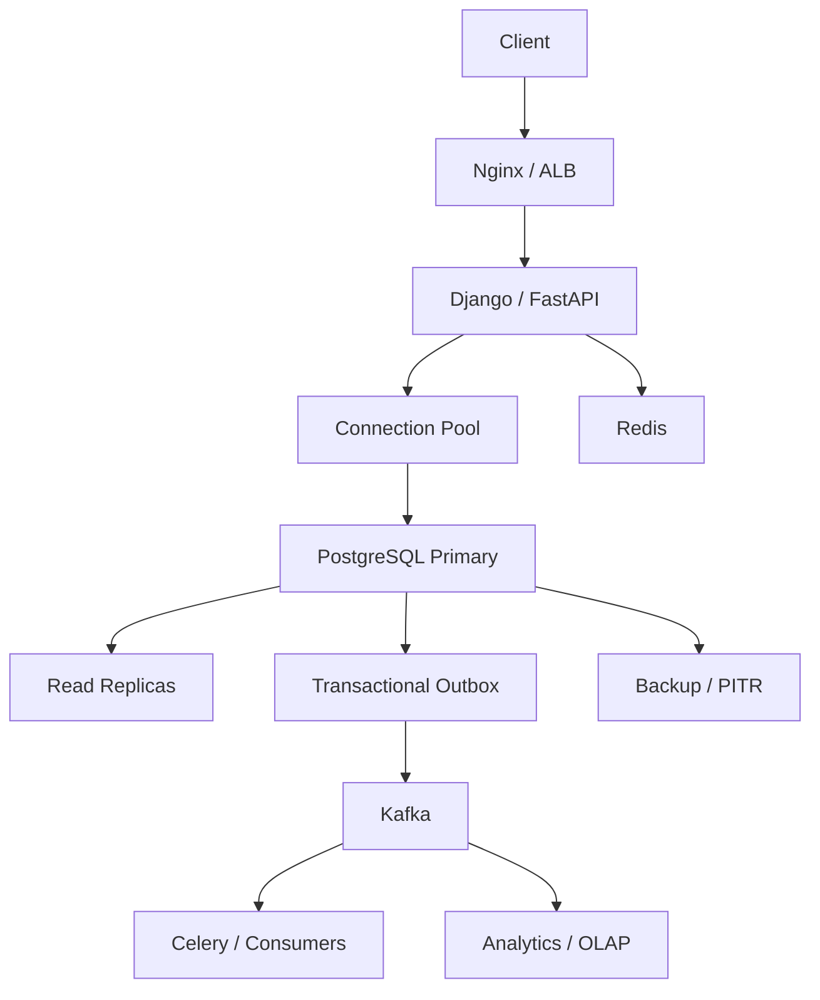

# 19- SQL Scenario Based Questions

## Overview

Scenario-based SQL interviews test whether you can apply SQL knowledge to realistic backend problems under production constraints.

Instead of asking:

> "What is a JOIN?"

the interviewer may ask:

> "An orders API became slow after the table reached 100 million rows. How would you investigate and fix it?"

The expected reasoning is broader:

```text
Business requirement
        ↓
Data model
        ↓
Query correctness
        ↓
Concurrency
        ↓
Execution plan
        ↓
Index / schema design
        ↓
Application behavior
        ↓
Scalability
        ↓
Reliability / security
```

For senior backend roles, avoid jumping directly to a solution. First identify:

- What must remain correct?
- What is the workload?
- What is the bottleneck?
- What consistency is required?
- What happens under concurrency?
- What happens when the database or network fails?
- How will the solution behave as data and traffic grow?

This document focuses on practical PostgreSQL-oriented scenarios with Python, Django, FastAPI, Redis, Kafka, Celery, and production architecture considerations where relevant.

---

## How to Approach a SQL Scenario

A useful interview framework is:

### Clarify

Ask about:

```text
Data volume
Traffic
Read/write ratio
Latency target
Consistency requirement
Concurrency
Retention
Availability
RPO / RTO
```

### Identify the Invariant

Ask:

> What must never become incorrect?

Examples:

```text
Account balance cannot become negative.
Order cannot be paid twice.
Inventory cannot become negative.
Two tenants cannot access each other's data.
An email must be unique.
```

### Establish the Current Behavior

Determine:

```text
query
+
parameters
+
execution plan
+
indexes
+
transaction boundary
+
connection behavior
```

### Find the Bottleneck

Classify it:

```text
CPU
I/O
memory
locks
connections
network
query volume
schema
application behavior
```

### Choose the Smallest Effective Change

Prefer:

```text
correct query
→
correct index
→
correct transaction
→
connection control
→
cache / replica
→
partitioning
→
workload isolation
→
sharding
```

Do not introduce distributed architecture before proving that simpler solutions are insufficient.

---

## Scenario: Orders API Suddenly Becomes Slow

### Situation

An endpoint:

```http
GET /orders?customer_id=123
```

was fast when there were 1 million orders but is now taking several seconds with 100 million rows.

### Question

How would you investigate?

### Strong Answer

Start with the actual SQL and execution plan.

```sql
EXPLAIN (ANALYZE, BUFFERS)
SELECT id, status, created_at, total_amount
FROM orders
WHERE customer_id = $1
ORDER BY created_at DESC
LIMIT 50;
```

Check:

- Sequential scan vs index scan
- Estimated vs actual rows
- Buffer hits/reads
- Sort operations
- Execution time
- Number of rows processed

If the access pattern is stable, an index such as:

```sql
CREATE INDEX idx_orders_customer_created
ON orders (customer_id, created_at DESC);
```

may be appropriate.

But do not stop at "add an index."

Also check:

- Query frequency
- Connection pool wait
- Lock waits
- Database CPU/I/O
- N+1 queries
- Replica routing
- Application serialization time

### Interview Trap

Do not claim:

> "The table is large, so PostgreSQL should always use an index."

A sequential scan can be optimal for some workloads.

---

## Scenario: API Returns Duplicate Orders

### Situation

The API should return one row per order, but a query returns multiple rows for some orders.

```sql
SELECT o.id, o.created_at, oi.product_id
FROM orders o
JOIN order_items oi
    ON oi.order_id = o.id;
```

### Question

What is wrong?

### Strong Answer

The query's result grain is:

```text
one row per order item
```

not:

```text
one row per order
```

If the API needs one order per row, possible solutions include:

- Aggregate child data.
- Use `EXISTS` if only existence is needed.
- Fetch related records separately.
- Use an appropriate read model.

Do not blindly add:

```sql
DISTINCT
```

because it can hide a cardinality problem and may not produce the intended result.

### Senior Consideration

Always define the expected result grain before debugging duplicate rows.

---

## Scenario: Customer Exists but Query Returns No Rows

### Situation

A customer definitely exists, but:

```sql
SELECT *
FROM customers
WHERE email = $1;
```

returns no rows.

### Investigation

Check:

- Exact parameter value
- Case sensitivity
- Whitespace
- Environment/database
- Schema
- Transaction visibility
- Soft-delete conditions
- Tenant filters
- Row Level Security
- Replica lag

For example, if the API reads from a replica:

```text
POST customer
    ↓
primary commit
    ↓
GET customer
    ↓
replica
    ↓
replica has not replayed WAL yet
```

The row may not be visible yet.

### Interview Insight

"Zero rows" is a result, not a diagnosis.

---

## Scenario: Prevent Duplicate User Registration

### Situation

Two users submit the same email simultaneously.

### Bad Design

```text
SELECT email
    ↓
if not exists
    ↓
INSERT
```

Two concurrent requests can both pass the check.

### Better Design

Use a database uniqueness constraint:

```sql
CREATE UNIQUE INDEX users_email_unique
ON users (email);
```

Then handle the conflict at the application boundary.

### Why?

The database serializes the uniqueness decision correctly under concurrency.

### Django

```python
try:
    user = User.objects.create(email=email)
except IntegrityError:
    # Convert to an appropriate application-level conflict response.
    ...
```

The application can validate early for user experience, but the database constraint is the final correctness boundary.

---

## Scenario: Inventory Must Never Become Negative

### Situation

A product has:

```text
quantity = 1
```

Two requests simultaneously attempt to purchase one unit.

### Bad Approach

```text
SELECT quantity
    ↓
if quantity >= 1
    ↓
UPDATE quantity
```

This creates a race.

### Better Approach

Use an atomic conditional update:

```sql
UPDATE inventory
SET quantity = quantity - $1
WHERE product_id = $2
  AND quantity >= $1;
```

Then inspect the affected row count.

```text
1 row affected
    → reservation succeeded

0 rows affected
    → insufficient inventory or missing product
```

This avoids a separate read-modify-write race.

### Alternative

For workflows requiring more complex decisions:

```sql
SELECT *
FROM inventory
WHERE product_id = $1
FOR UPDATE;
```

Then perform the decision and update inside the same transaction.

---

## Scenario: Payment Is Processed Twice

### Situation

A client submits a payment request.

The server processes the payment, but the response is lost.

The client retries.

### Problem

The first transaction may have committed even though the client did not receive the response.

### Solution

Use an idempotency key.

```text
POST /payments
Idempotency-Key: 7d8c...
```

Store it with a uniqueness constraint:

```sql
CREATE UNIQUE INDEX payments_idempotency_key_uq
ON payments (idempotency_key);
```

The durable payment record becomes the source of truth for repeated requests.

### Senior Insight

Network failure creates uncertainty:

```text
request
 ↓
database/payment system
 ↓
commit
 ↓
network failure
 ↓
client does not know result
```

Retries must therefore be designed around idempotency.

---

## Scenario: Money Transfer Between Accounts

### Situation

Transfer `$100` from account A to account B.

### Requirements

Either both balances change or neither does.

### Solution

Use one database transaction:

```sql
BEGIN;

UPDATE accounts
SET balance = balance - 100
WHERE id = $1
  AND balance >= 100;

UPDATE accounts
SET balance = balance + 100
WHERE id = $2;

COMMIT;
```

The actual production implementation should verify affected rows and enforce appropriate constraints.

### Concurrency

If multiple transfers affect the same accounts, establish a deterministic lock order.

For example:

```text
lock lower account ID
    ↓
lock higher account ID
    ↓
perform transfer
```

This reduces deadlock risk.

### Interview Trap

Do not say:

> "I'll update account A and then account B."

Without a transaction, a failure between those statements can leave inconsistent state.

---

## Scenario: Two Transactions Deadlock

### Situation

Transaction A:

```text
locks order 1
waits for order 2
```

Transaction B:

```text
locks order 2
waits for order 1
```

### Question

How do you fix it?

### Strong Answer

First establish a consistent lock ordering.

Instead of:

```text
A: 1 → 2
B: 2 → 1
```

make both use:

```text
1 → 2
```

Also:

- Keep transactions short.
- Avoid external calls inside transactions.
- Minimize lock scope.
- Monitor lock waits.
- Retry deadlock-aborted transactions with bounded backoff.

PostgreSQL reports deadlocks using SQLSTATE:

```text
40P01
```

Retry the whole transaction rather than only the failed statement.

---

## Scenario: Database CPU Is at 100%

### Situation

PostgreSQL CPU suddenly reaches 100%.

### Question

What do you do?

### Strong Answer

Do not immediately increase instance size.

First correlate:

```text
CPU
 ↓
active queries
 ↓
query frequency
 ↓
execution plans
 ↓
application deployment
 ↓
worker activity
 ↓
retry volume
```

Inspect top queries:

```sql
SELECT
    query,
    calls,
    total_exec_time,
    mean_exec_time
FROM pg_stat_statements
ORDER BY total_exec_time DESC
LIMIT 20;
```

Also inspect:

```text
pg_stat_activity
execution plans
wait events
autovacuum activity
connection count
```

Potential causes:

- Expensive query
- N+1 queries
- Missing/incorrect index
- Large sort
- Hash aggregation
- Query-plan regression
- Excessive query frequency
- Retry storm
- Background worker overload

### Senior Answer

Distinguish:

```text
few expensive queries
```

from:

```text
millions of moderately expensive queries
```

The latter can dominate total database CPU.

---

## Scenario: Database Has Many Connections but Low Throughput

### Situation

The application team proposes increasing the connection pool from 20 to 100.

### Question

Would you do it?

### Strong Answer

Not without evidence.

More connections can increase:

- Memory usage
- CPU contention
- Lock contention
- Context switching
- Queueing

First determine whether existing connections are:

```text
active
idle
idle in transaction
waiting for locks
waiting for I/O
waiting for application work
```

Also calculate the fleet-wide connection budget.

Example:

```text
20 pods × 10 connections
=
200 connections
```

plus:

```text
Celery workers
administrative connections
migration jobs
monitoring
```

A larger pool is useful only if the database has capacity to process the additional concurrency.

---

## Scenario: Connection Pool Is Exhausted

### Situation

API requests fail with connection acquisition timeouts.

### Investigation

Check:

```text
pool utilization
pool wait time
database connections
query latency
transaction duration
lock waits
connection leaks
```

Potential root causes:

```text
slow query
long transaction
lock contention
external API call inside transaction
connection leak
database failure
```

### Example

Bad:

```python
with transaction.atomic():
    update_database()
    call_external_service()
```

If the external service takes 5 seconds, the database connection and transaction may remain occupied during those 5 seconds.

Keep the transaction focused.

---

## Scenario: Django API Has N+1 Queries

### Situation

The endpoint returns 100 orders and performs 101 database queries.

### Question

How do you fix it?

### Investigation

Identify the relationship causing the additional queries.

For foreign-key or one-to-one access:

```python
orders = (
    Order.objects
    .select_related("customer")
)
```

For collection relationships:

```python
orders = (
    Order.objects
    .prefetch_related("items")
)
```

But do not blindly eager-load every relationship.

Large joins or prefetches can increase:

- Memory
- Network transfer
- Query complexity
- Row multiplication

Measure query count and total latency.

---

## Scenario: API Needs the Latest Order for Every Customer

### Situation

You need one latest order per customer.

### Possible Solution

Use a window function:

```sql
SELECT *
FROM (
    SELECT
        o.*,
        ROW_NUMBER() OVER (
            PARTITION BY customer_id
            ORDER BY created_at DESC, id DESC
        ) AS rn
    FROM orders o
) ranked
WHERE rn = 1;
```

This is often more expressive than repeatedly querying each customer.

### Senior Consideration

For very large workloads, evaluate:

- Indexing
- Query plan
- Data distribution
- Materialized/read-model alternatives
- Whether the latest value can be maintained incrementally

---

## Scenario: API Requires Top Three Orders per Customer

Use a window function:

```sql
SELECT *
FROM (
    SELECT
        o.*,
        ROW_NUMBER() OVER (
            PARTITION BY customer_id
            ORDER BY total_amount DESC, id DESC
        ) AS rank
    FROM orders o
) ranked
WHERE rank <= 3;
```

The key distinction is:

```text
GROUP BY
→ reduces rows

Window function
→ calculates across rows while preserving row-level results
```

---

## Scenario: Deep Pagination Is Slow

### Situation

```http
GET /orders?page=20000
```

generates:

```sql
LIMIT 50 OFFSET 999950;
```

### Problem

The database may need to process and discard a large number of preceding rows.

### Better Approach

Use keyset pagination.

```sql
SELECT id, created_at, total_amount
FROM orders
WHERE (created_at, id) < ($1, $2)
ORDER BY created_at DESC, id DESC
LIMIT 50;
```

Create an index aligned with the access pattern:

```sql
CREATE INDEX idx_orders_created_id
ON orders (created_at DESC, id DESC);
```

### Senior Consideration

Keyset pagination provides stable performance for deep navigation but is less convenient for arbitrary page-number navigation.

---

## Scenario: Search by Email Is Slow

### Situation

```sql
SELECT id
FROM users
WHERE email = $1;
```

is slow on a large table.

### Investigation

Check:

```sql
EXPLAIN (ANALYZE, BUFFERS)
SELECT id
FROM users
WHERE email = $1;
```

If email is logically unique:

```sql
CREATE UNIQUE INDEX users_email_unique
ON users (email);
```

### Case-Insensitive Search

If the application requires normalized case-insensitive lookup:

```sql
CREATE UNIQUE INDEX users_lower_email_unique
ON users (LOWER(email));
```

Then query:

```sql
SELECT id
FROM users
WHERE LOWER(email) = LOWER($1);
```

In production, consider normalizing values at the application/data-model boundary where appropriate instead of applying unnecessary functions to every query.

---

## Scenario: Search for Prefixes

### Requirement

Find users where email starts with:

```text
admin@
```

A B-tree index may support suitable prefix patterns depending on collation and operator semantics.

The important interview point is:

> Index behavior depends on the predicate and database configuration; do not assume every `LIKE` pattern can use a normal B-tree efficiently.

A leading wildcard:

```sql
WHERE email LIKE '%@example.com'
```

usually cannot use a standard B-tree in the same way as a left-anchored prefix search.

For advanced text search, PostgreSQL-specific indexes such as GIN with trigram support may be appropriate.

---

## Scenario: Query Is Slow Even Though an Index Exists

### Situation

The table has an index, but PostgreSQL chooses a sequential scan.

### Question

Why?

Possible explanations:

- Low selectivity
- Table is small
- Query returns many rows
- Wrong composite index order
- Poor statistics
- Type conversion
- Expression mismatch
- Planner cost estimates
- Query predicate does not align with index

Use:

```sql
EXPLAIN (ANALYZE, BUFFERS)
...
```

The existence of an index does not imply that it is the optimal access path.

---

## Scenario: Query Has Poor Cardinality Estimates

### Situation

The plan estimates:

```text
100 rows
```

but actually processes:

```text
10,000,000 rows
```

### Why It Matters

The optimizer may choose a poor plan because it believes the workload is much smaller.

Potential causes include:

- Stale statistics
- Correlated columns
- Data distribution changes
- Complex predicates

Investigate statistics and consider:

```sql
ANALYZE orders;
```

For correlated columns, PostgreSQL extended statistics can sometimes improve estimates.

### Interview Insight

Execution-plan quality depends heavily on cardinality estimation.

---

## Scenario: Aggregation Is Double-Counting Revenue

### Situation

A query joins orders to multiple child tables and calculates:

```sql
SUM(order_total)
```

The result is too large.

### Cause

The join multiplied order rows.

Example:

```text
Order
 ├── 3 items
 └── 2 payments
```

A join can produce:

```text
3 × 2 = 6 rows
```

The order total can therefore be counted multiple times.

### Fix

Aggregate each relationship at the correct grain before combining results.

Alternatively, use `EXISTS` if a child relationship is only being used as a filter.

### Senior Principle

Always reason about row multiplication before writing aggregate queries.

---

## Scenario: COUNT Returns Unexpected Results with LEFT JOIN

### Query

```sql
SELECT
    c.id,
    COUNT(*)
FROM customers c
LEFT JOIN orders o
    ON o.customer_id = c.id
GROUP BY c.id;
```

`COUNT(*)` counts the outer row even when there is no matching order.

If you need the number of matching orders:

```sql
SELECT
    c.id,
    COUNT(o.id)
FROM customers c
LEFT JOIN orders o
    ON o.customer_id = c.id
GROUP BY c.id;
```

### Interview Trap

Know the distinction between:

```text
COUNT(*)
COUNT(column)
COUNT(DISTINCT column)
```

especially with `NULL` and outer joins.

---

## Scenario: Need Customers Who Have Never Ordered

Use:

```sql
SELECT c.id
FROM customers c
WHERE NOT EXISTS (
    SELECT 1
    FROM orders o
    WHERE o.customer_id = c.id
);
```

This expresses the business requirement directly:

> No matching order exists.

Be careful with:

```sql
NOT IN
```

when the subquery can contain `NULL`.

---

## Scenario: Need Customers Who Have at Least One Order

Use:

```sql
SELECT c.id
FROM customers c
WHERE EXISTS (
    SELECT 1
    FROM orders o
    WHERE o.customer_id = c.id
);
```

This avoids producing duplicate customer rows merely because multiple orders exist.

The query expresses the required result grain:

```text
one row per customer
```

---

## Scenario: A Query Has a Huge Sort

### Situation

`EXPLAIN ANALYZE` shows a large sort consuming significant resources.

### Investigation

Check:

- Rows entering the sort
- Whether filtering happens early enough
- Whether ordering is required
- Whether an index can provide the desired order
- Whether `LIMIT` enables a more efficient strategy
- Whether the sort spills to temporary storage

For:

```sql
SELECT id, created_at
FROM orders
WHERE customer_id = $1
ORDER BY created_at DESC
LIMIT 50;
```

an index such as:

```sql
CREATE INDEX idx_orders_customer_created
ON orders (customer_id, created_at DESC);
```

may allow PostgreSQL to avoid sorting a large result set.

---

## Scenario: Database Query Uses Too Much Memory

### Situation

A query performs large sorts and hash joins.

### Investigation

Consider:

```text
work_mem
query concurrency
number of memory-intensive operators
result size
sort/hash spilling
```

`work_mem` is not simply "memory allocated per query."

Multiple operations and concurrent sessions can consume memory.

Increasing it globally without understanding concurrency can cause memory pressure.

---

## Scenario: Large Table Needs a New Column

### Situation

A production table has hundreds of millions of rows.

You need:

```text
new_status
```

### Safer Strategy

```text
Add nullable column
        ↓
Deploy compatible application
        ↓
Backfill in batches
        ↓
Validate
        ↓
Start relying on new column
        ↓
Enforce constraints if required
```

Avoid making a massive table migration perform an enormous update in one transaction.

### Senior Considerations

Monitor:

- WAL generation
- Replica lag
- CPU
- I/O
- Lock waits
- Autovacuum
- Query latency

---

## Scenario: Need to Delete Old Events

### Situation

Delete events older than one year from a table containing billions of rows.

### Bad Approach

```sql
DELETE FROM events
WHERE event_time < $1;
```

as one massive transaction.

Potential consequences:

- Large WAL volume
- Long transaction
- Dead tuples
- Vacuum pressure
- Replica lag
- I/O saturation

### Better Approaches

For moderate deletion:

```text
bounded batches
+
checkpointing
+
throttling
```

For retention-heavy workloads:

```text
time-based partitioning
```

Then old partitions can be detached or dropped instead of deleting individual rows.

---

## Scenario: Large Table Requires Partitioning

### Situation

An events table contains billions of time-ordered records.

Most queries filter by:

```sql
event_time
```

### Reasonable Design

Range partition by time.

```text
events
 ├── 2026-01
 ├── 2026-02
 ├── 2026-03
 └── 2026-04
```

Queries containing compatible time predicates can benefit from partition pruning.

### Do Not Say

> "Partitioning automatically makes queries faster."

It helps when:

- The partition key matches workload.
- Partition pruning can occur.
- Data lifecycle benefits from partitions.
- Partition count remains operationally manageable.

---

## Scenario: Read Replica Returns Stale Data

### Situation

User creates an order and immediately requests it.

The POST writes to the primary.

The GET reads from a replica and does not find the order.

### Cause

Asynchronous replication lag.

```text
Primary commit
    ↓
WAL transport
    ↓
Replica replay
```

There is a time window where the primary is ahead.

### Solutions

Depending on requirements:

- Route read-after-write traffic to primary.
- Use session consistency.
- Use LSN-aware routing.
- Wait for replica catch-up where appropriate.
- Use a cache containing the newly written state.

Do not treat asynchronous replicas as strongly consistent.

---

## Scenario: Read Replicas Are Healthy but Primary Is Overloaded

### Situation

There are five read replicas, but primary CPU remains high.

### Investigation

Check whether the primary is overloaded by:

- Writes
- Index maintenance
- WAL generation
- Autovacuum
- Replication work
- Read queries still routed to primary
- Background jobs

Read replicas only help workloads actually routed to them.

They do not automatically reduce primary write cost.

---

## Scenario: Analytics Query Hurts Production APIs

### Situation

An analyst runs:

```sql
SELECT ...
FROM orders
JOIN ...
GROUP BY ...
```

over billions of rows and API latency increases.

### Better Architecture

Separate analytical workloads:

```text
PostgreSQL OLTP
       ↓
CDC / ETL / Events
       ↓
OLAP / Warehouse
```

Possible intermediate approaches include:

- Read replica
- Materialized views
- Dedicated reporting database

For substantial analytics, a dedicated OLAP system is generally preferable to repeatedly scanning the transactional primary.

---

## Scenario: Cache Is Expiring and Database CPU Spikes

### Situation

Redis keys expire simultaneously.

```text
1000 requests
 ↓
cache miss
 ↓
1000 database queries
```

### Problem

Cache stampede.

### Mitigation

Use:

- TTL jitter
- Request coalescing
- Locking where appropriate
- Background refresh
- Stale-while-revalidate

The database remains the authoritative source.

---

## Scenario: Redis Contains Stale Product Data

### Situation

Product information is cached for five minutes.

An administrator updates the product.

Users continue seeing the old value.

### Possible Strategies

- Explicit cache invalidation after commit
- Short TTL
- Versioned keys
- Event-driven invalidation
- Cache-aside with careful consistency semantics

Do not invalidate the cache before the database transaction commits if doing so could expose a state that was later rolled back.

In Django, `transaction.on_commit()` can be useful for triggering post-commit cache operations.

---

## Scenario: Database and Kafka Must Stay Consistent

### Situation

An order is inserted into PostgreSQL and an event must be published to Kafka.

### Bad Design

```text
INSERT order
    ↓
publish Kafka event
```

The database can commit while Kafka publishing fails.

### Better Design

Use a transactional outbox:

```text
BEGIN
  INSERT order
  INSERT outbox_event
COMMIT
```

Then:

```text
outbox
 ↓
publisher
 ↓
Kafka
```

The consumer should be idempotent because events can be delivered more than once.

---

## Scenario: Celery Worker Overloads PostgreSQL

### Situation

A batch job launches hundreds of Celery workers and database CPU reaches 100%.

### Problem

Background concurrency exceeds useful database capacity.

### Better Design

Use:

```text
bounded worker concurrency
+
bounded DB connections
+
batch processing
+
backpressure
+
timeouts
```

Workers should not be allowed to consume the entire database connection and CPU budget required by interactive traffic.

---

## Scenario: SQL Query Is Correct but API Is Still Slow

### Situation

`EXPLAIN ANALYZE` shows the query takes 20 ms, but the endpoint takes 2 seconds.

### Investigation

Measure the entire path:

```text
API request
 ↓
authentication
 ↓
pool acquisition
 ↓
database query
 ↓
result transfer
 ↓
ORM object creation
 ↓
serialization
 ↓
network response
```

Potential causes:

- Pool wait
- Multiple hidden queries
- Large result set
- Serialization
- External service calls
- Application CPU
- Network latency

### Senior Insight

Do not optimize a 20 ms SQL query when the actual request spends 1.5 seconds waiting elsewhere.

---

## Scenario: Query Runs Fast Once but Slowly Under Load

### Possible Causes

A query can behave differently under concurrency because of:

- Lock contention
- I/O contention
- CPU saturation
- Connection queueing
- Cache behavior
- Memory pressure
- Plan changes
- Replica lag

Compare:

```text
single-query benchmark
```

with:

```text
realistic concurrent workload
```

Production performance is a workload property, not merely a single-query property.

---

## Scenario: API Uses a Transaction Around Multiple Operations

### Situation

```python
with transaction.atomic():
    update_order()
    call_payment_service()
    send_notification()
    update_search_index()
```

### Problem

The transaction remains open while external operations execute.

This can hold:

- Database connections
- Locks
- Snapshots

for unnecessarily long periods.

### Better Architecture

Keep the database transaction focused:

```text
transaction
 ├── update order
 └── write outbox
        ↓
commit
        ↓
Kafka / worker
 ├── payment workflow
 ├── notification
 └── search indexing
```

The exact workflow depends on business consistency requirements.

---

## Scenario: Need to Reserve a Job from a Queue Table

### Situation

Multiple workers should process jobs without claiming the same row.

A PostgreSQL queue table can use:

```sql
SELECT id
FROM jobs
WHERE status = 'pending'
ORDER BY id
FOR UPDATE SKIP LOCKED
LIMIT 10;
```

Workers can then claim different rows concurrently.

### Why `SKIP LOCKED`?

Workers skip rows currently locked by other workers instead of waiting.

### Limitation

It is suitable for queue-like workloads, but ordering is no longer a strict global guarantee under concurrency, and poorly designed workloads can cause starvation.

---

## Scenario: Multi-Tenant API Leaks Data

### Situation

The application has:

```text
tenant_id
```

on every business table.

A developer writes:

```python
Order.objects.get(id=order_id)
```

instead of filtering by tenant.

### Risk

An attacker who knows another tenant's object ID may access it.

### Better

```python
Order.objects.get(
    id=order_id,
    tenant_id=request.tenant_id,
)
```

Database-level RLS can provide additional defense in depth.

### Senior Consideration

Tenant isolation should be enforced consistently across:

```text
API authorization
ORM queries
database constraints
RLS where appropriate
cache keys
background jobs
events
```

---

## Scenario: RLS Works in Development but Fails in Production

### Investigation

Check:

- Database role
- Table ownership
- `BYPASSRLS`
- `FORCE ROW LEVEL SECURITY`
- Active policies
- Session/transaction tenant context
- Connection pooling behavior

With pooled connections, transaction-scoped context is safer than leaving tenant state attached to a reusable connection.

For example:

```sql
SET LOCAL app.tenant_id = 'tenant-123';
```

should occur inside the appropriate transaction.

### Interview Insight

RLS is a security boundary, so connection reuse and session state become part of the security model.

---

## Scenario: SQL Injection Appears in a Search Endpoint

### Situation

The endpoint accepts:

```http
GET /users?email=...
```

### Unsafe

```python
query = f"""
SELECT id, email
FROM users
WHERE email = '{email}'
"""
```

### Safe

```python
cursor.execute(
    """
    SELECT id, email
    FROM users
    WHERE email = %s
    """,
    (email,),
)
```

### Senior Consideration

Parameterization protects values.

It does not automatically make this safe:

```text
ORDER BY <user input>
```

Dynamic identifiers require validation and allowlisting.

---

## Scenario: User Can Request Arbitrary Sorting

### Situation

```http
GET /orders?sort=created_at
```

The developer constructs:

```python
f"ORDER BY {sort}"
```

### Risk

The user controls SQL structure.

### Better

```python
allowed_sort_columns = {
    "created": "created_at",
    "amount": "total_amount",
    "status": "status",
}

sort_column = allowed_sort_columns.get(
    requested_sort,
    "created_at",
)
```

Only trusted SQL fragments should reach the dynamic portion.

---

## Scenario: Need to Change a Column Type on a Huge Table

### Situation

Change:

```text
customer_id INTEGER
```

to:

```text
customer_id BIGINT
```

on a massive production table.

### Strong Answer

First inspect dependencies:

```text
foreign keys
indexes
views
functions
application code
ORM assumptions
external consumers
```

For high-risk changes, consider:

```text
new compatible column
 ↓
dual write
 ↓
backfill
 ↓
validate
 ↓
switch reads
 ↓
remove old column
```

The exact PostgreSQL migration behavior depends on the data type and version, so verify the locking and rewrite characteristics before production execution.

---

## Scenario: Production Migration Causes Locking

### Situation

A deployment runs DDL and API latency spikes.

### Investigation

Look for:

```text
DDL lock
long-running transactions
idle in transaction
blocked queries
migration duration
```

Useful diagnostics include:

```sql
SELECT
    pid,
    state,
    wait_event_type,
    wait_event,
    query
FROM pg_stat_activity
WHERE state <> 'idle';
```

Also investigate blocking relationships using PostgreSQL lock information.

### Prevention

- Keep transactions short.
- Schedule risky migrations carefully.
- Use online/concurrent operations where supported.
- Set appropriate lock timeouts.
- Test migrations against production-sized data.

---

## Scenario: Unique Index Must Be Added to a Huge Table

### Situation

Adding a unique index using a normal index build creates unacceptable blocking.

### Approach

Consider:

```sql
CREATE UNIQUE INDEX CONCURRENTLY users_email_unique
ON users (email);
```

`CREATE INDEX CONCURRENTLY` reduces blocking of normal reads/writes compared with a regular index build, but it has operational trade-offs and cannot run inside a transaction block.

Before deployment, verify:

- Existing duplicates
- Disk space
- Build duration
- WAL impact
- Replica impact
- Failure/retry procedure

---

## Scenario: Query Suddenly Gets Slower After Deployment

### Investigation

Check:

```text
application SQL changed?
parameters changed?
query frequency changed?
statistics changed?
data distribution changed?
index changed?
execution plan changed?
connection pool changed?
replica routing changed?
```

Compare:

```sql
EXPLAIN (ANALYZE, BUFFERS)
...
```

against the previous plan.

A query can regress even when its SQL text looks similar because data distribution and optimizer estimates have changed.

---

## Scenario: Same Prepared Query Has Different Performance for Different Parameters

### Situation

A prepared query performs well for some parameter values but poorly for others.

### Reason

Different parameter values can have substantially different selectivity.

The planner may choose between:

```text
index-oriented plan
```

and:

```text
sequential-scan-oriented plan
```

PostgreSQL can use custom or generic plans depending on context.

### Investigation

Compare plans for representative parameter values.

Do not assume prepared statements always improve performance.

They provide security and protocol benefits, but plan behavior still matters.

---

## Scenario: Database Is Running Out of Storage

### Investigation

Determine whether growth comes from:

```text
table data
indexes
WAL
temporary files
dead tuples
logs
backups
```

Inspect relation sizes:

```sql
SELECT
    relname,
    pg_size_pretty(pg_total_relation_size(relid)) AS total_size
FROM pg_catalog.pg_statio_user_tables
ORDER BY pg_total_relation_size(relid) DESC
LIMIT 20;
```

Then determine the cause.

Potential solutions:

- Retention policy
- Partition lifecycle
- Archival
- Large-object cleanup
- Index review
- Vacuum maintenance
- Storage expansion

Do not delete arbitrary data to solve an infrastructure alert without understanding retention and recovery requirements.

---

## Scenario: Table Has Severe Bloat

### Possible Causes

- Heavy updates/deletes
- Long-running transactions
- Autovacuum not keeping up
- Poor maintenance configuration
- Large dead-row volume

Investigate:

```text
transaction age
autovacuum activity
dead tuples
table/index size
long-running sessions
```

Do not assume that manually running maintenance is always the correct immediate solution.

First understand why bloat is occurring.

---

## Scenario: API Requires Strong Read-After-Write Consistency

### Situation

A user changes their profile and immediately reloads the page.

### Architecture

```text
write
 ↓
primary

immediate read
 ↓
primary
```

or use an appropriate consistency-aware routing strategy.

For less sensitive data:

```text
read replica
```

may be acceptable.

The key is to define the consistency requirement first.

---

## Scenario: Database Fails During a Request

### Situation

The API receives a database connection failure during a transaction.

### Question

Should it retry?

### Answer

It depends.

If the failure occurred before execution, reconnecting may be straightforward.

If the failure occurred around commit:

```text
database may have committed
but
client received no confirmation
```

the outcome is uncertain.

Use:

- Idempotency keys
- Unique constraints
- Durable operation identifiers
- Reconciliation

Retries must be bounded and use backoff/jitter.

---

## Scenario: Database Failover Happens During Traffic

### Expected Flow

```text
Primary failure
    ↓
Failover detection
    ↓
Standby promotion
    ↓
Stable endpoint updated
    ↓
Existing connections fail
    ↓
Application reconnects
    ↓
Retries transient operations
```

Applications should have:

- Connection retry behavior
- Bounded backoff
- Idempotency
- Sensible timeouts
- Health checks

Do not assume a TCP connection will survive database failover.

---

## Scenario: A Background Job Processes the Same Record Twice

### Situation

A Celery/Kafka worker crashes after updating PostgreSQL but before acknowledging the message.

The message is delivered again.

### Solution

Design the operation to be idempotent.

Possible techniques:

```text
unique operation ID
+
unique constraint
+
upsert
+
state transition validation
```

For example:

```sql
INSERT INTO processed_events (event_id)
VALUES ($1)
ON CONFLICT (event_id) DO NOTHING;
```

The database can provide durable deduplication.

---

## Scenario: Need to Upsert Customer Data

PostgreSQL supports:

```sql
INSERT INTO customers (external_id, email)
VALUES ($1, $2)
ON CONFLICT (external_id)
DO UPDATE
SET email = EXCLUDED.email;
```

This is often preferable to:

```text
SELECT
 ↓
if exists UPDATE
else INSERT
```

because the latter requires application-level race handling.

The conflict target should correspond to an appropriate unique constraint or index.

---

## Scenario: API Receives 10,000 Writes per Second

### Question

How do you scale it?

Do not immediately answer "sharding."

First identify:

```text
row size
write pattern
transaction size
indexes
WAL rate
storage I/O
CPU
hot rows
connection count
```

Potential optimizations:

```text
batch writes
+
COPY where appropriate
+
fewer unnecessary indexes
+
short transactions
+
partitioning
+
queue-based ingestion
+
vertical scaling
+
sharding if justified
```

If all writes target the same row, adding more database nodes may not solve the actual contention problem.

---

## Scenario: One Row Becomes a Hotspot

### Situation

A global counter receives thousands of updates per second.

```sql
UPDATE counters
SET value = value + 1
WHERE id = 1;
```

The statement is correct but highly contended.

### Possible Solutions

Depending on semantics:

- Sharded counters
- Per-worker/per-partition counters
- Periodic aggregation
- Redis counters with durable reconciliation
- Queue-based serialization
- Approximate counters where acceptable

### Senior Insight

Correctness and scalability are different questions.

Atomic SQL solves the race but not necessarily the throughput bottleneck.

---

## Scenario: Need to Process Millions of Rows

### Bad Design

```text
load all rows into Python
```

This can cause:

- Application memory pressure
- Long-running transaction
- Large network transfer
- Slow processing
- Difficult recovery

### Better

Process incrementally:

```text
indexed keyset
 ↓
batch
 ↓
process
 ↓
commit
 ↓
checkpoint
 ↓
next batch
```

For large data movement, database-native bulk operations can be substantially more efficient than row-by-row ORM operations.

---

## Scenario: Need to Export Millions of Rows

### Bad Architecture

```text
HTTP request
 ↓
query millions of rows
 ↓
serialize
 ↓
return response
```

### Better

```text
API
 ↓
create export job
 ↓
Celery
 ↓
database bulk extraction
 ↓
S3
 ↓
download link
```

This protects API latency and database connection capacity.

---

## Scenario: SQL Query Is Correct but Uses Too Many Rows

### Situation

An API returns 50 rows but the database processes millions.

### Investigation

Check:

```text
filter selectivity
join order
indexes
partition pruning
early filtering
```

The fact that the final result is small does not mean the work required to produce it is small.

`LIMIT` can reduce result delivery, but it does not magically eliminate all upstream work.

---

## Scenario: A Join Causes a Cartesian Product

### Query

```sql
SELECT *
FROM customers c
CROSS JOIN orders o;
```

This intentionally produces:

```text
customers × orders
```

rows.

An accidental Cartesian product can happen when a join condition is missing or incomplete.

### Interview Answer

Check:

```text
expected relationship
join keys
foreign keys
result grain
```

Never use `DISTINCT` as the first response to an unexpectedly huge result.

---

## Scenario: LEFT JOIN Behaves Like INNER JOIN

### Query

```sql
SELECT c.id, o.id
FROM customers c
LEFT JOIN orders o
    ON o.customer_id = c.id
WHERE o.status = 'paid';
```

The `WHERE` condition removes rows where `o` is `NULL`, effectively eliminating customers without matching orders.

If the intention is to preserve customers without paid orders, move the condition into the join:

```sql
SELECT c.id, o.id
FROM customers c
LEFT JOIN orders o
    ON o.customer_id = c.id
   AND o.status = 'paid';
```

This is a common SQL interview trap.

---

## Scenario: Need to Return the Highest-Paid Order

For the highest order globally:

```sql
SELECT *
FROM orders
ORDER BY total_amount DESC
LIMIT 1;
```

For the highest order per customer:

```sql
SELECT *
FROM (
    SELECT
        o.*,
        ROW_NUMBER() OVER (
            PARTITION BY customer_id
            ORDER BY total_amount DESC, id DESC
        ) AS rn
    FROM orders o
) ranked
WHERE rn = 1;
```

The difference is the result grain.

---

## Scenario: Need to Calculate Running Revenue

Use a window function:

```sql
SELECT
    order_date,
    daily_revenue,
    SUM(daily_revenue) OVER (
        ORDER BY order_date
        ROWS BETWEEN UNBOUNDED PRECEDING AND CURRENT ROW
    ) AS cumulative_revenue
FROM daily_sales
ORDER BY order_date;
```

Window functions preserve rows while calculating across a related window.

---

## Scenario: Need Monthly Revenue

```sql
SELECT
    date_trunc('month', created_at) AS month,
    SUM(total_amount) AS revenue
FROM orders
WHERE created_at >= $1
  AND created_at < $2
GROUP BY date_trunc('month', created_at)
ORDER BY month;
```

For large analytical workloads, consider whether this query belongs on:

```text
OLTP
read replica
materialized view
OLAP
```

rather than repeatedly running it against the primary.

---

## Scenario: Average Order Value Is Incorrect

Suppose customers have different numbers of orders.

A query calculates:

```sql
AVG(customer_total)
```

when the business requirement is:

```text
total revenue / total number of orders
```

The correct formula is:

```sql
SUM(total_amount) / NULLIF(COUNT(*), 0)
```

The interview point is to distinguish:

```text
average of groups
```

from:

```text
weighted average across individual records
```

Aggregation semantics matter as much as syntax.

---

## Scenario: NULL Causes Incorrect Business Logic

### Query

```sql
WHERE status <> 'cancelled'
```

Rows where `status` is `NULL` do not satisfy this predicate because:

```text
NULL <> 'cancelled'
```

evaluates to `UNKNOWN`.

If `NULL` has a specific business meaning, express that explicitly.

For PostgreSQL:

```sql
WHERE status IS DISTINCT FROM 'cancelled'
```

can be useful when `NULL` should be treated as distinct from the comparison value.

---

## Scenario: NOT IN Produces Unexpected Results

Given:

```sql
WHERE customer_id NOT IN (
    SELECT customer_id
    FROM blocked_customers
);
```

If the subquery contains `NULL`, SQL's three-valued logic can make the predicate produce unexpected results.

Prefer an existence formulation when appropriate:

```sql
WHERE NOT EXISTS (
    SELECT 1
    FROM blocked_customers b
    WHERE b.customer_id = customers.id
);
```

The important skill is understanding the semantics, not memorizing a replacement.

---

## Scenario: Need to Change Data Safely During Deployment

### Situation

Version 1 of the application uses:

```text
old_status
```

Version 2 uses:

```text
new_status
```

Rolling deployment means both versions may run simultaneously.

### Safe Pattern

```text
Add new column
 ↓
Deploy code that understands both
 ↓
Dual-write if necessary
 ↓
Backfill
 ↓
Switch reads
 ↓
Stop old writes
 ↓
Validate
 ↓
Remove old column later
```

This is the expand-and-contract pattern.

---

## Scenario: Database Is the Bottleneck During Deployment

### Potential Causes

A deployment can increase SQL workload through:

- New query patterns
- Missing indexes
- N+1 regressions
- Increased connection pools
- New background workers
- Changed transaction duration

Monitor:

```text
database CPU
query latency
query volume
connections
locks
replica lag
WAL
```

A deployment is therefore part of database capacity management.

---

## Scenario: Need to Design a New Backend Schema

### Situation

Build an e-commerce order system.

### Reasonable Core Model

```text
customers
    ↓
orders
    ↓
order_items
    ↓
products
```

Additional entities:

```text
payments
shipments
addresses
order_status_history
```

Use:

- Primary keys
- Foreign keys
- Unique constraints
- Check constraints
- Appropriate indexes

Start with a normalized transactional model.

Introduce denormalization only where a measured workload justifies it.

---

## Scenario: Microservice Needs Data Owned by Another Service

### Situation

Order Service needs payment status from Payment Service.

### Bad Design

Direct SQL access to the payment service's database.

### Better

```text
Order Service
    ↓
Payment API / event
    ↓
Payment Service
```

Possible architecture:

```text
Payment Service
    ↓
Kafka event
    ↓
Order Service read model
```

The correct choice depends on consistency requirements.

### Senior Principle

Database ownership is an architectural boundary.

---

## Scenario: Need Cross-Service Atomicity

### Situation

Creating an order requires:

```text
Order DB
+
Payment DB
+
Inventory DB
```

### Question

Should you use one distributed transaction?

### Strong Answer

Usually avoid it unless requirements strongly justify the complexity.

Consider:

```text
Saga
+
outbox
+
idempotency
+
compensating actions
+
explicit workflow state
```

For example:

```text
Order Created
    ↓
Inventory Reserved
    ↓
Payment Authorized
    ↓
Order Confirmed
```

Failures should produce explicit compensating transitions.

---

## Scenario: Database Is Healthy but API Traffic Is Increasing

### Question

How would you scale?

First classify:

```text
read-heavy
write-heavy
mixed
analytical
```

For read-heavy workloads:

```text
indexes
+
cache
+
read replicas
```

For write-heavy:

```text
query optimization
+
batching
+
contention reduction
+
partitioning
+
vertical scaling
+
sharding if required
```

For analytics:

```text
OLAP / warehouse
```

Scaling strategy should follow workload characteristics.

---

## Scenario: Database Is Healthy but Cache Is Down

### Question

Should the API fail?

It depends on whether Redis is:

```text
cache
```

or:

```text
authoritative state
```

For a normal cache:

```text
Redis unavailable
 ↓
fallback to PostgreSQL
```

may be appropriate, provided the database can handle the resulting load.

But if the fallback path is not capacity-safe, a cache outage can become a database outage.

Therefore design:

```text
cache failure
→
bounded fallback
→
rate limiting
→
load shedding if necessary
```

---

## Scenario: Replica Lag Increases Rapidly

### Investigation

Check:

```text
primary WAL generation
replica replay rate
network
replica CPU
replica I/O
long-running queries
replication conflicts
```

A migration or bulk update can generate substantial WAL and cause replicas to fall behind.

Potential responses:

- Reduce migration concurrency.
- Throttle writes.
- Move reporting elsewhere.
- Increase replica capacity.
- Temporarily route consistency-sensitive reads to primary.

Do not hide replica lag by simply ignoring the metric.

---

## Scenario: Query Works in Development but Fails in Production

### Possible Causes

- Different PostgreSQL versions
- Different schema
- Different indexes
- Different data distribution
- Different statistics
- Different collation
- Different configuration
- Different query parameters
- Different concurrency

Production-sized data matters.

A query plan that looks excellent against 10,000 rows may be inappropriate against 500 million rows.

---

## Scenario: Production Query Has Become Slow After Data Growth

### Reasoning

The query may have been:

```text
O(n)
```

and worked acceptably when:

```text
n = 100,000
```

but became unacceptable at:

```text
n = 100,000,000
```

Investigate:

```text
index design
query selectivity
pagination
partitioning
data lifecycle
query frequency
```

Do not optimize only against current data volume.

Consider the expected growth curve.

---

## Scenario: Need to Store Audit History

### Requirement

Track changes to important entities.

### Possible Design

```text
orders
order_audit_log
```

Audit rows may contain:

```text
entity_id
actor
operation
timestamp
old state / relevant fields
new state / relevant fields
request correlation ID
```

Do not automatically store complete sensitive payloads for every operation.

Consider:

- Retention
- Access control
- Immutability
- Encryption
- Queryability
- Storage growth

Audit data can itself become a significant production workload.

---

## Scenario: Need to Enforce Business Rules

### Example

An order cannot transition from:

```text
cancelled → paid
```

### Options

Application validation is useful, but database constraints should enforce invariants that can be represented locally.

For state-machine transitions involving concurrent requests, combine:

```text
transaction
+
conditional update / locking
+
state validation
```

For example:

```sql
UPDATE orders
SET status = 'paid'
WHERE id = $1
  AND status = 'pending';
```

Then verify that exactly one row was updated.

---

## Scenario: SQL Query Is Fast but Database Is Still Slow

A senior engineer should consider workload-level behavior.

For example:

```text
Query = 5 ms
Calls = 1,000,000/minute
```

can be more damaging than:

```text
Query = 5 seconds
Calls = 1/minute
```

Measure:

```text
total execution time
calls
mean latency
p95/p99
CPU
I/O
lock time
```

Optimize the workload, not merely the slowest individual query.

---

## Scenario: Need to Choose Between SQL and Redis

Use PostgreSQL when you need:

- Durable relational state
- Transactions
- Constraints
- Complex joins
- Strong consistency
- Durable querying

Use Redis when you need:

- Cache
- Short-lived state
- Fast counters
- Rate limiting
- Specific coordination patterns

The decision should follow data semantics, not benchmark numbers alone.

---

## Scenario: Need to Choose Between PostgreSQL and Kafka

These systems solve different problems.

| PostgreSQL | Kafka |
|---|---|
| Durable relational state | Durable event stream |
| Transactions | Event transport |
| SQL queries | Sequential/log-based consumption |
| Constraints | Consumer-driven processing |
| Point/relational reads | High-throughput event distribution |

A common architecture uses both:

```text
PostgreSQL
    ↓
Outbox
    ↓
Kafka
```

Kafka should not be treated as a replacement for relational transactions without explicitly designing the resulting consistency model.

---

## Scenario: Need to Design a Production SQL System

A reasonable baseline:



Responsibilities:

```text
PostgreSQL
→ source of truth

Redis
→ cache / ephemeral state

Kafka
→ asynchronous events

Celery
→ background processing

Read replicas
→ appropriate read scaling

OLAP
→ analytical workloads

Backup/PITR
→ recovery
```

The exact architecture should be driven by workload and consistency requirements.

---

## Scenario: Production Database Incident

### Situation

API p99 latency jumps from 200 ms to 5 seconds.

### Senior Troubleshooting Sequence

```text
Check API metrics
      ↓
Check connection pool wait
      ↓
Check DB CPU / memory / I/O
      ↓
Check active queries
      ↓
Check lock waits
      ↓
Check query statistics
      ↓
Check execution plans
      ↓
Check replica lag
      ↓
Check recent deployments/migrations
      ↓
Check retry volume
      ↓
Mitigate
      ↓
Identify root cause
```

Potential immediate mitigations may include:

- Reduce worker concurrency
- Stop a runaway batch
- Route appropriate reads to replicas
- Disable an expensive feature
- Cancel clearly runaway queries
- Roll back a problematic deployment

Mitigation should preserve correctness and security.

---

## Scenario: Design SQL for a High-Traffic Order API

### Requirements

```text
10,000 requests/second
70% reads
30% writes
100M orders
strong order consistency
high availability
```

### Reasonable Starting Architecture

```text
API
 ↓
Connection Pool
 ↓
PostgreSQL Primary
 ├── Read Replicas
 ├── Redis
 └── Outbox → Kafka
```

### Query Design

Use:

```text
composite indexes
keyset pagination
bounded result sets
precise projections
```

### Transaction Design

Keep:

```text
order creation
+
inventory decision
+
outbox
```

inside the required transactional boundary.

Move:

```text
notifications
analytics
search indexing
```

to asynchronous processing where business semantics permit.

### Scaling Path

```text
Optimize
 ↓
Cache
 ↓
Replicas
 ↓
Partition
 ↓
Workload isolation
 ↓
Shard if required
```

---

## Scenario: Design a Multi-Tenant SaaS Database

### Requirements

```text
10,000 tenants
shared infrastructure
different tenant sizes
strict tenant isolation
```

A reasonable starting model:

```text
shared PostgreSQL
    ↓
shared schema
    ↓
tenant_id
    ↓
composite indexes
    ↓
application authorization
    ↓
RLS where appropriate
```

For very large tenants:

```text
large tenant
    ↓
dedicated database / shard
```

This hybrid model can provide a migration path without forcing every tenant into an isolated database.

---

## Scenario: Design a Large Event Ingestion System

### Requirements

```text
100M events/day
append-heavy workload
time-based queries
one-year retention
analytics
```

Potential architecture:

```text
Clients
   ↓
API / ingestion
   ↓
Kafka
   ↓
Consumers
   ├── PostgreSQL partitioned storage
   └── OLAP / warehouse
```

PostgreSQL partitioning can support:

```text
time-based pruning
retention
archival
maintenance
```

Kafka partitioning supports:

```text
consumer parallelism
throughput
ordering within a partition
```

These are different concepts.

---

## Scenario: Senior Interviewer Says "This System Must Never Lose Data"

Do not simply answer:

> "Use synchronous replication."

Clarify what "never lose data" means.

Ask about:

```text
RPO
RTO
transaction durability
regional failures
corruption
operator mistakes
backup recovery
```

Synchronous replication can reduce some forms of data loss during failover, but it does not protect against every failure mode.

You still need:

```text
backups
+
PITR
+
restore testing
+
operational controls
```

---

## Scenario: Senior Interviewer Says "Make It Highly Available"

Clarify:

```text
What failure should the system survive?
Node?
Process?
AZ?
Region?
Network partition?
Operator mistake?
Data corruption?
```

Then design:

```text
HA
+
failover
+
stable endpoint
+
connection recovery
+
retry/idempotency
+
backup/PITR
```

High availability and disaster recovery are related but distinct requirements.

---

## Scenario: Senior Interviewer Says "The Database Must Scale"

Ask:

```text
Scale what?
Reads?
Writes?
Storage?
Connections?
Transactions?
Analytics?
Tenants?
```

Then map the requirement:

| Bottleneck | Likely Strategy |
|---|---|
| Query latency | Query/index optimization |
| Read volume | Cache/replicas |
| Large table | Partitioning |
| Connections | Pooling/PgBouncer |
| Analytics | OLAP |
| Write contention | Atomic redesign/partitioning/queueing |
| Storage growth | Retention/partitioning/scaling |
| Distributed capacity | Sharding |

This is much stronger than saying:

> "Use horizontal scaling."

---

## Scenario: You Are Asked to Optimize Any SQL Query

Use this checklist:

```text
1. Confirm correctness
2. Define result grain
3. Capture exact SQL and parameters
4. Measure frequency and latency
5. Run EXPLAIN
6. Check actual vs estimated rows
7. Check scans and joins
8. Check sort/aggregate behavior
9. Check indexes
10. Check locks and waits
11. Check result size
12. Check ORM/N+1 behavior
13. Optimize
14. Benchmark
15. Monitor after deployment
```

Optimization is an empirical process.

---

## Common Scenario-Based Interview Mistakes

### Jumping to Indexes

An index cannot fix:

- Lock contention
- N+1
- Connection exhaustion
- External-call latency
- Excessive query volume

### Ignoring Concurrency

A solution that works for one request may fail under concurrent requests.

Always ask:

```text
What happens if two requests execute simultaneously?
```

### Using Application Checks Instead of Constraints

For uniqueness and local invariants, application checks alone are vulnerable to races.

### Using `DISTINCT` to Hide Join Bugs

`DISTINCT` may hide symptoms while leaving incorrect cardinality.

### Increasing Connection Pools Without Analysis

More connections can worsen database contention.

### Treating Replicas as Strongly Consistent

Async replicas can lag.

### Treating Redis as the Source of Truth

A cache should not silently become authoritative durable state.

### Running Huge Transactions

Large transactions increase:

```text
locks
WAL
bloat
replica lag
recovery complexity
```

### Retrying Everything

Permanent errors should not be retried.

Transient errors require bounded retry with backoff and idempotency.

### Ignoring Failure During Commit

A network failure around commit can create an uncertain outcome.

### Designing for Current Data Size Only

A query that works at:

```text
1 million rows
```

may fail at:

```text
1 billion rows
```

### Assuming ORM Abstraction Eliminates SQL Problems

ORM-generated SQL still executes inside the database engine.

---

## Senior-Level Scenario Answer Pattern

When given a complex SQL scenario, structure your answer as:

```text
Requirement
    ↓
Invariant
    ↓
Data model
    ↓
Query / transaction
    ↓
Concurrency
    ↓
Performance
    ↓
Scaling
    ↓
Failure handling
    ↓
Security
    ↓
Observability
```

For example:

> "First I would clarify the consistency requirement and expected workload. Then I would identify the business invariant and make sure it is enforced transactionally. I would inspect the actual SQL and execution plan before adding indexes. If the workload is read-heavy, I would consider caching and replicas after validating consistency requirements. For write-heavy workloads, I would look at WAL, storage, indexes, hot rows, and transaction duration. Finally, I would define retry, idempotency, HA, backup, monitoring, and migration strategies."

That answer demonstrates reasoning rather than memorization.

---

## Production SQL Scenario Checklist

### Correctness

- [ ] Result grain is defined.
- [ ] Joins preserve intended cardinality.
- [ ] `NULL` semantics are understood.
- [ ] Constraints enforce important invariants.
- [ ] Transactions protect atomic operations.
- [ ] Concurrent requests are considered.
- [ ] Retries are idempotent where necessary.

### Performance

- [ ] Actual SQL is inspected.
- [ ] Execution plans are reviewed.
- [ ] Cardinality estimates are checked.
- [ ] Indexes match access patterns.
- [ ] Query frequency is measured.
- [ ] Result sizes are bounded.
- [ ] N+1 behavior is controlled.

### Scalability

- [ ] Connection capacity is calculated.
- [ ] Read/write workload is understood.
- [ ] Cache strategy is defined.
- [ ] Replica consistency is understood.
- [ ] Large tables have lifecycle strategies.
- [ ] Partitioning has a clear purpose.
- [ ] Sharding is justified by actual requirements.

### Reliability

- [ ] Timeouts are defined.
- [ ] Retry behavior is bounded.
- [ ] Deadlocks are handled.
- [ ] Failover is supported.
- [ ] Transaction uncertainty is considered.
- [ ] Backups and PITR exist.
- [ ] Restore procedures are tested.

### Security

- [ ] SQL uses parameter binding.
- [ ] Dynamic SQL is allowlisted.
- [ ] Tenant authorization is enforced.
- [ ] Database roles use least privilege.
- [ ] Sensitive values are not unnecessarily logged.
- [ ] TLS and secret management are appropriate.

### Operations

- [ ] Query metrics exist.
- [ ] Connection metrics exist.
- [ ] Lock waits are observable.
- [ ] Replica lag is monitored.
- [ ] Database CPU/memory/I/O are monitored.
- [ ] Migrations are tested at realistic scale.
- [ ] Background workloads have bounded concurrency.

---

## Key Takeaways

- **Scenario-based SQL interviews test reasoning under real constraints:** define the business invariant, result grain, workload, consistency requirements, and failure modes before proposing a solution.
- **Correctness under concurrency is a database responsibility as well as an application responsibility:** use constraints, transactions, atomic SQL, appropriate locking, and idempotency to prevent race conditions and duplicate effects.
- **Performance optimization must be evidence-driven:** inspect actual SQL, execution plans, cardinality, query frequency, locks, connections, and infrastructure metrics before adding indexes or increasing capacity.
- **Production SQL architecture is workload-specific:** use caching, replicas, partitioning, OLAP systems, queues, and sharding only when they address a demonstrated bottleneck or architectural requirement.
- **Senior backend SQL answers include failure and operations:** account for retries, uncertain commits, replica lag, migrations, connection exhaustion, HA/failover, backups/PITR, security, observability, and cost.