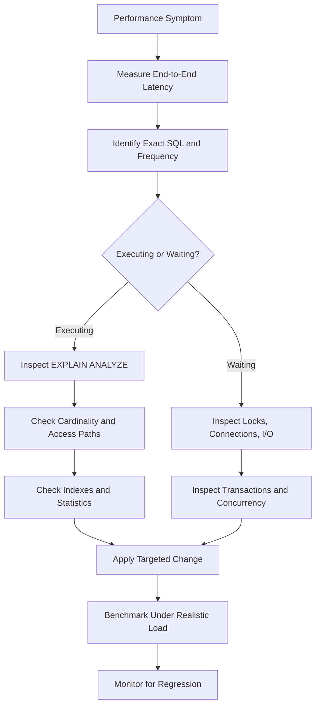
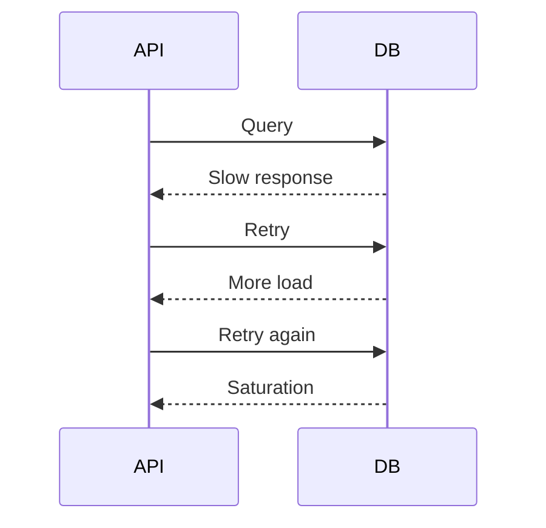

# 21- SQL Performance Scenarios

## Overview

SQL performance interviews are less about memorizing optimization rules and more about diagnosing why a database is slow under a particular workload.

A strong answer connects:

```text
Application behavior
        ↓
SQL shape and frequency
        ↓
Query planner
        ↓
Indexes / access paths
        ↓
CPU / memory / I/O
        ↓
Locks / transactions
        ↓
Connection pools
        ↓
Replication / infrastructure
```

The most important distinction is between:

- **Query execution problems** — the database is doing too much work.
- **Waiting problems** — the query is blocked on locks, connections, I/O, or another resource.
- **Workload problems** — an otherwise efficient query is executed too frequently.
- **Architecture problems** — the workload does not belong on the current database or access pattern.

Senior engineers should diagnose the complete workload rather than applying isolated rules such as "add an index" or "increase database size."

---

## Performance Investigation Framework

A production investigation should follow a measurable sequence:



### Questions to Establish First

| Question | Why it matters |
|---|---|
| What exactly is slow? | Separates SQL latency from API or infrastructure latency |
| When did it become slow? | Correlates with deployments, migrations, or data growth |
| Is it always slow? | Distinguishes deterministic plan problems from contention |
| How often does it execute? | Total workload can matter more than single-query latency |
| How many rows are processed? | Determines whether excessive work is occurring |
| Is it read or write heavy? | Determines appropriate optimization strategies |
| Is it primary or replica? | Replica lag and replay can affect latency |
| What changed recently? | Often provides the fastest route to root cause |
| Does it fail only under concurrency? | Suggests locking, pool, or resource contention |
| What is the business freshness requirement? | Determines whether caching or replicas are acceptable |

---

## Scenario: A Query Became 100× Slower

### Problem

A query normally runs in 50 ms but now takes 5 seconds.

### Investigation

Start with the exact SQL and parameters:

```sql
EXPLAIN (ANALYZE, BUFFERS)
SELECT id, status, created_at
FROM orders
WHERE customer_id = $1
ORDER BY created_at DESC
LIMIT 50;
```

Compare:

```text
estimated rows
actual rows
execution time
planning time
buffer hits
buffer reads
loops
scan type
join strategy
sort/hash operations
```

Then check whether the query is actually executing or waiting.

Potential causes:

```text
bad plan
stale statistics
data growth
index change
lock contention
CPU saturation
I/O pressure
connection-pool wait
replica lag
application retry storm
```

### Interview Trap

Do not immediately propose an index.

A query taking five seconds because it waited four seconds for a lock will not become faster because an index was added.

---

## Scenario: A Query Uses a Sequential Scan

### Problem

An interviewer shows:

```text
Seq Scan on orders
```

and asks whether the query is poorly optimized.

### Answer

Not necessarily.

A sequential scan can be optimal when:

- The table is small.
- A large percentage of rows is required.
- The predicate has low selectivity.
- An index would cause expensive random access.
- Planner statistics indicate a sequential scan is cheaper.

Validate with:

```sql
EXPLAIN (ANALYZE, BUFFERS)
SELECT *
FROM orders
WHERE status = 'completed';
```

The correct question is:

> Is the selected access path appropriate for the amount and distribution of data being processed?

---

## Scenario: PostgreSQL Ignores an Existing Index

### Problem

There is an index on:

```text
orders.customer_id
```

but PostgreSQL chooses a sequential scan.

### Investigation

Check:

```text
table size
predicate selectivity
estimated rows
actual rows
statistics
query shape
index definition
data distribution
```

Possible reasons:

| Reason | Explanation |
|---|---|
| Low selectivity | Most rows match the predicate |
| Small table | Sequential access is cheaper |
| Incorrect index | Index does not match the access pattern |
| Stale statistics | Planner has incorrect cardinality estimates |
| Expression mismatch | Query expression differs from indexed expression |
| Parameter sensitivity | Different parameter values have different optimal plans |
| Large result set | Fetching many rows through an index may be expensive |

An index is an available access path, not a command that the optimizer must use.

---

## Scenario: Estimated Rows and Actual Rows Differ Dramatically

### Example

```text
Estimated rows: 100
Actual rows:    5,000,000
```

### Why It Matters

The optimizer relies on cardinality estimates to choose:

- Join order
- Join algorithms
- Scan methods
- Sort strategies
- Aggregation strategies
- Parallelism

A large estimation error can therefore cause a fundamentally bad execution plan.

Investigate:

```sql
ANALYZE orders;
```

and inspect:

```text
statistics freshness
data skew
correlated predicates
column statistics
extended statistics
parameter values
```

### Senior-Level Answer

Do not automatically blame the optimizer.

Ask:

> Why did the optimizer believe only 100 rows would be returned?

---

## Scenario: Query Is Slow Because of a JOIN

### Investigation

Inspect:

```text
join predicates
join cardinality
join order
indexes on join keys
estimated vs actual rows
join algorithm
```

PostgreSQL commonly uses:

| Join | Typical use |
|---|---|
| Nested loop | Small outer input or efficient indexed lookup |
| Hash join | Large equality joins |
| Merge join | Inputs that can be efficiently ordered |

A nested loop is not inherently bad.

For example:

```text
outer rows = 10
inner lookup = indexed
```

can be excellent.

But:

```text
outer rows = 5,000,000
inner lookup repeated millions of times
```

can be extremely expensive.

---

## Scenario: A JOIN Produces Too Many Rows

### Problem

An endpoint expects:

```text
10,000 orders
```

but the query returns:

```text
2,000,000 rows
```

### Root Cause

The join may multiply rows.

For example:

```text
orders
  1
  ↓
many order_items
```

Joining orders to order items changes the result grain.

If multiple one-to-many relationships are joined simultaneously:

```text
orders
  ↓
order_items
  ↓
payments
```

the multiplication can become much larger.

### Better Approach

Define the result grain first:

```text
one row per order
```

Then aggregate child relationships independently where necessary.

Do not use `DISTINCT` merely to hide an incorrect join.

---

## Scenario: Query Is Slow Because of ORDER BY

### Query

```sql
SELECT id, created_at
FROM orders
WHERE customer_id = $1
ORDER BY created_at DESC
LIMIT 50;
```

Potentially useful index:

```sql
CREATE INDEX idx_orders_customer_created
ON orders (customer_id, created_at DESC);
```

This can allow PostgreSQL to efficiently locate the customer's rows in the required order.

### Production Considerations

Validate:

```text
query frequency
selectivity
index size
write amplification
existing overlapping indexes
```

An index that makes one query faster can increase write and storage costs.

---

## Scenario: Large OFFSET Pagination Becomes Slow

### Problem

```sql
SELECT id, created_at
FROM orders
ORDER BY created_at DESC
LIMIT 50
OFFSET 1000000;
```

The database may need to process a large number of preceding rows before returning the requested page.

### Keyset Pagination

Use a stable cursor:

```sql
SELECT id, created_at
FROM orders
WHERE (created_at, id) < ($1, $2)
ORDER BY created_at DESC, id DESC
LIMIT 50;
```

The supporting index should match the access pattern.

### Senior Consideration

Keyset pagination is not simply a performance trick. It also provides more predictable behavior for large datasets and continuously changing tables.

---

## Scenario: API Uses N+1 Queries

### Problem

```text
GET /orders

1 query → orders
100 queries → customer information
```

Total:

```text
101 queries
```

### Django Example

```python
orders = (
    Order.objects
    .select_related("customer")
    .prefetch_related("items")
)
```

Use:

- `select_related()` for suitable single-valued relationships.
- `prefetch_related()` for collections and many-valued relationships.

### Senior Consideration

Do not optimize solely for query count.

Also measure:

```text
total database time
rows returned
application memory
serialization time
query complexity
```

A single enormous query can be worse than several small, well-bounded queries.

---

## Scenario: Query Is Fast but the Endpoint Is Slow

### Example

```text
SQL execution = 20 ms
API latency    = 1.8 seconds
```

The SQL query is probably not the primary bottleneck.

Inspect:

```text
connection acquisition
multiple queries
Redis
external services
application CPU
serialization
network transfer
```

A useful latency model is:

```text
API latency
=
queueing
+
pool acquisition
+
database execution
+
result transfer
+
application processing
+
external dependencies
```

Optimize the largest component first.

---

## Scenario: Connection Pool Is Exhausted

### Symptoms

```text
API timeouts
connection acquisition timeouts
database CPU may be normal
```

Potential causes:

- Slow queries
- Lock contention
- Long transactions
- Connection leaks
- External calls inside transactions
- Database unavailability
- Pool configured too small

Inspect PostgreSQL:

```sql
SELECT
    state,
    wait_event_type,
    wait_event,
    count(*)
FROM pg_stat_activity
GROUP BY state, wait_event_type, wait_event;
```

Then correlate with application pool metrics.

### Senior Insight

Connection pools are concurrency controls.

Increasing pool size can make the database less healthy if the actual problem is query latency or lock contention.

---

## Scenario: Kubernetes Scaling Causes Database Overload

Suppose:

```text
40 pods
×
10 connections/pod
=
400 potential application connections
```

Then add:

```text
Celery workers
migration jobs
cron jobs
administrative connections
other services
```

The aggregate can exceed the database's useful concurrency.

### Production Rule

Application horizontal scaling must account for database connection capacity.

More pods do not automatically mean more useful database throughput.

---

## Scenario: Database CPU Reaches 100%

### Investigation

Start with workload-level statistics:

```sql
SELECT
    query,
    calls,
    total_exec_time,
    mean_exec_time
FROM pg_stat_statements
ORDER BY total_exec_time DESC
LIMIT 20;
```

Look for:

```text
high-frequency queries
expensive queries
N+1
large scans
sorts
hash operations
JSON processing
regex
aggregation
background workers
retry storms
```

### Important Example

```text
Query A:
5 seconds × 10 executions

Query B:
5 milliseconds × 10 million executions
```

Query B can be the larger CPU problem.

Optimize aggregate workload, not only the slowest individual query.

---

## Scenario: Database Memory Is High

High memory utilization does not automatically mean a failure.

Inspect:

```text
MemAvailable
swap
OOM events
shared_buffers
work_mem
maintenance_work_mem
connection count
query concurrency
container memory limits
```

A critical PostgreSQL concept is that `work_mem` is not one global memory budget per server or per query.

A query can contain multiple memory-intensive operations, and many sessions can execute concurrently.

Therefore:

```text
potential memory pressure
≈
per-operation memory
×
operations
×
concurrent execution
```

Do not blindly increase `work_mem`.

---

## Scenario: A Large Sort Spills to Disk

### Symptoms

The execution plan shows temporary I/O.

Potential causes:

```text
large input
large sort
insufficient work_mem
high concurrency
unnecessary ordering
```

Investigate whether an index can provide the required ordering.

For example:

```sql
ORDER BY customer_id, created_at DESC
```

may be supported by an appropriately designed composite index.

The correct solution depends on whether sorting is actually avoidable and whether the index cost is justified.

---

## Scenario: A Query Uses Excessive Memory During Aggregation

### Query

```sql
SELECT customer_id, SUM(total_amount)
FROM orders
GROUP BY customer_id;
```

Inspect:

```text
rows entering aggregation
aggregation strategy
hash memory
sort behavior
number of groups
filter selectivity
```

If this is a repeatedly executed analytics workload over billions of rows, the correct solution may not be a more sophisticated OLTP index.

Consider:

```text
materialized views
pre-aggregated tables
read models
OLAP systems
```

---

## Scenario: Lock Contention Makes a Fast Query Slow

### Problem

The query itself executes in 20 ms but the request takes 3 seconds.

Investigate:

```sql
SELECT
    pid,
    state,
    wait_event_type,
    wait_event,
    query,
    xact_start
FROM pg_stat_activity
WHERE wait_event_type = 'Lock';
```

Then inspect:

```text
pg_locks
pg_blocking_pids()
blocking transaction
transaction age
application request
```

### Key Principle

Find the blocker, not only the waiter.

If transaction A holds a lock for 3 seconds because it performs an external HTTP request before committing, optimizing transaction B's SQL will not solve the root cause.

---

## Scenario: Deadlocks Occur Under Load

### Example

```text
Transaction A:
lock account 1
lock account 2

Transaction B:
lock account 2
lock account 1
```

This creates a cycle.

### Prevention

Establish deterministic lock ordering:

```text
always lock lower account ID first
```

Also review hidden locking from:

- Foreign keys
- Triggers
- `UPDATE`
- `DELETE`
- `SELECT ... FOR UPDATE`
- Advisory locks
- DDL

PostgreSQL reports deadlocks using:

```text
SQLSTATE 40P01
```

Retry the entire transaction with bounded backoff and jitter when retry semantics are appropriate.

---

## Scenario: Lock Contention Without Deadlocks

Deadlock and contention are different.

```text
Contention:
A → waits for B
```

is enough to increase latency.

A deadlock requires a cycle:

```text
A → waits for B
B → waits for A
```

For contention, investigate:

```text
transaction duration
hot rows
lock scope
worker concurrency
connection pool size
batch size
```

More application concurrency can increase contention rather than throughput.

---

## Scenario: Long Transactions Cause Performance Problems

A long transaction can:

- Hold locks.
- Retain snapshots.
- Delay cleanup.
- Increase bloat.
- Consume a connection.
- Increase contention.

Inspect:

```sql
SELECT
    pid,
    state,
    xact_start,
    query
FROM pg_stat_activity
WHERE xact_start IS NOT NULL
ORDER BY xact_start;
```

Avoid:

```text
BEGIN
 ↓
database operation
 ↓
HTTP request
 ↓
external API
 ↓
more processing
 ↓
COMMIT
```

Keep transactions short and focused on the database invariants they protect.

---

## Scenario: `idle in transaction` Appears

An application has started a transaction but is currently not executing SQL.

Inspect:

```sql
SELECT
    pid,
    state,
    xact_start,
    state_change,
    query
FROM pg_stat_activity
WHERE state = 'idle in transaction';
```

Potential consequences include:

```text
old snapshots
locks held longer than necessary
connection consumption
vacuum interference
```

This frequently indicates application transaction-management problems.

---

## Scenario: Replica Lag Increases During a Batch Job

A large migration or batch update can generate substantial WAL.

Investigate:

```text
WAL generation rate
network transfer
replica I/O
replica CPU
replay rate
long-running replica queries
```

A migration that is harmless from a primary CPU perspective can still create significant replica lag.

### Production Mitigation

Throttle background work based on:

```text
CPU
I/O
replication lag
lock waits
query latency
connection utilization
WAL pressure
```

---

## Scenario: Read-After-Write Returns Stale Data

### Flow

```text
POST /orders
      ↓
Primary
      ↓
commit

GET /orders/123
      ↓
Read Replica
      ↓
not visible yet
```

This is expected with asynchronous replication.

Possible strategies:

- Route consistency-sensitive reads to the primary.
- Use session/request consistency tracking.
- Use LSN-aware routing.
- Accept eventual consistency where business semantics allow it.

Do not assume read replicas provide synchronous read-after-write behavior.

---

## Scenario: A Migration Makes the Database Slow

Potential causes include:

```text
DDL locks
table rewrites
index creation
large backfills
WAL generation
autovacuum pressure
replica lag
storage I/O
```

For large changes, use:

```text
expand
 ↓
compatible application
 ↓
incremental backfill
 ↓
validate
 ↓
cut over
 ↓
observe
 ↓
contract
```

Do not combine a large data migration with an application cutover unnecessarily.

---

## Scenario: Large UPDATE Saturates PostgreSQL

### Risky Pattern

```sql
UPDATE orders
SET status = 'archived'
WHERE created_at < $1;
```

against hundreds of millions of rows.

Potential effects:

```text
large WAL
dead tuples
long transaction
replica lag
vacuum pressure
lock contention
storage growth
```

Use bounded batches:

```text
identify batch
 ↓
update batch
 ↓
commit
 ↓
checkpoint progress
 ↓
throttle
 ↓
repeat
```

The migration should be restartable and idempotent.

---

## Scenario: Large DELETE Causes Storage and Replication Pressure

A large delete generates WAL and creates dead tuples.

Prefer:

```text
bounded deletes
+
throttling
+
monitoring
```

For time-based retention, partitioning can be more efficient:

```text
detach/drop old partition
```

rather than deleting millions of individual rows.

The appropriate choice depends on retention, query patterns, and operational requirements.

---

## Scenario: Background Workers Saturate PostgreSQL

Suppose Celery concurrency increases:

```text
20 workers → 200 workers
```

Database load may increase dramatically.

Control:

```text
worker concurrency
connection pools
batch sizes
transaction duration
retry rates
queue depth
```

Latency-sensitive API traffic and background processing should have deliberate resource budgets.

---

## Scenario: Retry Storm Causes Database Saturation

### Failure Cascade



Use:

- Bounded retries
- Exponential backoff
- Jitter
- Timeouts
- Idempotency
- Rate limiting
- Load shedding where appropriate

Retries must reduce pressure rather than amplify it.

---

## Scenario: Query Works in Development but Fails in Production

Compare:

```text
data volume
data distribution
indexes
statistics
PostgreSQL configuration
PostgreSQL version
query parameters
concurrency
extensions
schema
```

A query tested against:

```text
10,000 rows
```

may behave completely differently against:

```text
500 million rows
```

Production-like datasets and realistic concurrency are important for performance validation.

---

## Scenario: Query Is Fast for Most Customers but Slow for One

Potential causes:

```text
data skew
large tenant
hot rows
parameter-sensitive plan
tenant-specific index requirements
noisy neighbor
```

Investigate the actual data distribution.

For multi-tenant systems, appropriate solutions can include:

```text
tenant-aware indexes
partitioning
tenant isolation
workload limits
dedicated infrastructure
sharding
```

Do not optimize solely against average tenant size.

---

## Scenario: One Tenant Overwhelms the Database

A large customer can dominate a shared database.

Possible controls:

```text
per-tenant rate limits
query limits
workload isolation
partitioning
tenant-specific resources
sharding
dedicated database
```

This is both a performance and architecture problem.

---

## Scenario: Cache Failure Overloads PostgreSQL

### Failure Cascade

```text
Redis failure
    ↓
cache misses
    ↓
all requests hit PostgreSQL
    ↓
database load increases
    ↓
latency increases
```

Possible mitigations:

- Request coalescing
- TTL jitter
- Rate limiting
- Stale cache serving where acceptable
- Load shedding
- Controlled database fallback

Caching should reduce database load without making the database incapable of surviving a cache failure.

---

## Scenario: Query Uses a Function on an Indexed Column

### Query

```sql
SELECT id
FROM users
WHERE LOWER(email) = LOWER($1);
```

An ordinary index on `email` does not necessarily match this expression.

An expression index may be appropriate:

```sql
CREATE INDEX users_lower_email_idx
ON users (LOWER(email));
```

The general principle is:

> Index the expression required by the access pattern, not merely the underlying column.

---

## Scenario: `LIKE` Search Is Slow

Compare:

```sql
WHERE email LIKE 'admin%'
```

with:

```sql
WHERE email LIKE '%example.com'
```

A leading wildcard generally prevents an ordinary B-tree index from providing the same efficient prefix lookup.

For substring or fuzzy-search workloads, specialized indexing such as PostgreSQL trigram indexes may be appropriate.

Do not force a relational B-tree index onto a search workload it was not designed to serve.

---

## Scenario: JSONB Queries Are Slow

Inspect:

```text
operator
query path
selectivity
document size
index type
query frequency
```

Possible solutions:

- GIN indexes
- Expression indexes
- Generated columns
- Relational columns for frequently queried attributes

JSONB is useful for flexible data, but frequently queried business attributes often benefit from explicit relational modeling.

---

## Scenario: Database CPU Is High Because of N+1

A query may be individually cheap:

```text
2 ms
```

but execute:

```text
100,000 times
```

The aggregate workload can become expensive.

Track:

```text
queries/request
database time/request
calls/query
rows/request
```

A reduction in query frequency can produce a larger performance improvement than micro-optimizing the SQL itself.

---

## Scenario: Database Is Overloaded by Reporting

### Problem

A large analytical query runs directly against the transactional database.

### Better Architecture


Possible intermediate solutions:

```text
read replica
materialized view
reporting database
```

For sustained large-scale analytical workloads, isolate them from latency-sensitive OLTP traffic.

---

## Scenario: Materialized View vs Cache

### Materialized View

Useful when:

- Computation is expensive.
- Data can be refreshed periodically.
- Results are relational.
- Database-side consistency is valuable.

### Cache

Useful when:

- Fast repeated reads are required.
- TTL-based freshness is acceptable.
- Data is suitable for cache-aside patterns.

| Requirement | Better candidate |
|---|---|
| Expensive relational aggregation | Materialized view |
| Very low latency repeated lookup | Cache |
| Frequently changing source data | Query/read model |
| Periodic analytics | Materialized view / OLAP |
| Cross-service derived data | Read model |

Neither should be chosen without defining freshness requirements.

---

## Scenario: Query Is Slow Because of Data Growth

A query can be perfectly acceptable at:

```text
100,000 rows
```

and unacceptable at:

```text
1 billion rows
```

Ask:

> What happens when this dataset grows 10×?

Evaluate:

```text
index scalability
partitioning
retention
pagination
query selectivity
query frequency
storage
maintenance
```

Senior performance engineering considers the future workload, not just today's benchmark.

---

## Scenario: Too Many Indexes Slow the System

Indexes improve some reads but increase:

```text
INSERT cost
UPDATE cost
DELETE cost
WAL
storage
vacuum work
replication traffic
maintenance
```

Evaluate every index against:

```text
read benefit
write cost
storage cost
maintenance cost
usage frequency
```

Unused or redundant indexes should be reviewed carefully before removal.

---

## Scenario: Index Is Missing on a Foreign Key

PostgreSQL does not automatically create an index on every referencing foreign-key column.

An index may be valuable for:

```text
JOIN
WHERE
ORDER BY
parent-row deletion/update workloads
```

Example:

```sql
CREATE INDEX idx_orders_customer_id
ON orders (customer_id);
```

Whether this is necessary depends on actual workload and existing indexes.

---

## Scenario: Query Performance Changes After Adding an Index

Adding an index changes the optimizer's available access paths.

This can improve one query while changing another query's plan.

After major index changes, inspect:

```text
high-value queries
query latency
pg_stat_statements
execution plans
CPU
I/O
write latency
replica behavior
```

Index deployment is therefore a workload change, not just a schema change.

---

## Scenario: Statistics Become Inaccurate

Symptoms:

```text
unexpected execution plan
wrong cardinality
bad join strategy
```

Investigate:

```text
ANALYZE
autovacuum
data churn
data skew
column statistics
extended statistics
```

Targeted statistics changes should be based on evidence.

Repeatedly running `ANALYZE` without identifying why estimates become inaccurate is not a complete solution.

---

## Scenario: Autovacuum Falls Behind

For PostgreSQL, MVCC creates dead row versions that must eventually be cleaned up.

Potential symptoms:

```text
dead tuples
table growth
index growth
bloat
slow scans
transaction ID pressure
```

Investigate:

```text
table churn
autovacuum thresholds
long transactions
maintenance activity
table-specific configuration
```

Autovacuum is part of normal production database operation, not optional housekeeping.

---

## Scenario: Temporary Files Grow Rapidly

Potential causes include:

```text
large sorts
hash joins
hash aggregation
large analytical queries
insufficient memory
high concurrency
```

Investigate execution plans and temporary I/O.

Do not blindly increase memory because concurrent operations can multiply memory usage.

---

## Scenario: Query Returns Millions of Rows to Python

A database query can be efficient while the API becomes slow because the application:

```text
fetches millions of rows
 ↓
creates Python objects
 ↓
serializes them
 ↓
sends huge HTTP response
```

Better approaches include:

```text
pagination
streaming
batch processing
asynchronous exports
object storage
```

For large exports:

```text
API
 ↓
create export job
 ↓
Celery
 ↓
database extraction
 ↓
object storage
 ↓
download
```

Do not keep a user-facing request and database transaction open for a long-running export.

---

## Scenario: Query Is Slow Because of Result Transfer

Suppose:

```text
DB execution = 100 ms
network/result transfer = 2 seconds
```

Possible causes:

```text
too many rows
wide rows
SELECT *
large JSON payloads
slow network
application processing
```

Optimization can involve reducing:

```text
row count
column count
payload size
```

Query performance includes result transfer, not only server-side execution time.

---

## Scenario: Application Sends `SELECT *`

`SELECT *` can increase:

```text
database I/O
network traffic
driver decoding
ORM object construction
memory
serialization
```

Prefer explicit projections:

```sql
SELECT id, status, created_at
FROM orders
WHERE customer_id = $1;
```

This is especially important for wide tables and high-frequency APIs.

---

## Scenario: Query Uses `DISTINCT` to Fix Duplicates

### Problem

A query returns duplicate-looking rows, so the developer adds:

```sql
SELECT DISTINCT ...
```

This may hide the symptom while leaving the incorrect join intact.

Investigate:

```text
result grain
join relationships
missing predicates
many-to-many relationships
```

Use `DISTINCT` when the semantics genuinely require duplicate elimination, not as a generic cardinality repair mechanism.

---

## Scenario: Aggregation Produces Incorrect Totals

Suppose:

```text
orders
+
order_items
+
payments
```

are joined before aggregation.

Multiple child records can multiply each other.

For example:

```text
1 order
3 items
2 payments
```

can produce:

```text
3 × 2 = 6 joined rows
```

before aggregation.

Aggregate each relationship at the appropriate grain before combining results when necessary.

---

## Scenario: `LEFT JOIN` Changes Unexpectedly

This:

```sql
SELECT c.id, o.id
FROM customers c
LEFT JOIN orders o
    ON o.customer_id = c.id
WHERE o.status = 'paid';
```

removes rows where `o` is `NULL`.

If the intention is to preserve customers without paid orders:

```sql
SELECT c.id, o.id
FROM customers c
LEFT JOIN orders o
    ON o.customer_id = c.id
   AND o.status = 'paid';
```

Understanding predicate placement is essential for both correctness and performance.

---

## Scenario: Query Uses `NOT IN` with Nullable Data

This pattern:

```sql
WHERE customer_id NOT IN (
    SELECT customer_id
    FROM blocked_customers
);
```

can behave unexpectedly if the subquery contains `NULL`.

For existence semantics, an explicit alternative is:

```sql
WHERE NOT EXISTS (
    SELECT 1
    FROM blocked_customers b
    WHERE b.customer_id = customers.id
);
```

The important point is to understand SQL's three-valued logic rather than applying a mechanical rewrite.

---

## Scenario: Database Storage Is Growing Unexpectedly

Identify what is growing:

```text
table data
indexes
WAL
dead tuples
temporary files
logs
backups
```

Inspect large relations:

```sql
SELECT
    relname,
    pg_size_pretty(
        pg_total_relation_size(relid)
    ) AS total_size
FROM pg_catalog.pg_statio_user_tables
ORDER BY pg_total_relation_size(relid) DESC
LIMIT 20;
```

Possible remedies include:

```text
retention
partitioning
archival
index cleanup
vacuum maintenance
storage expansion
```

Storage incidents require recovery and retention awareness; deleting data blindly can create compliance and disaster-recovery problems.

---

## Scenario: Query Performance Regresses After Deployment

Correlate the regression with:

```text
SQL changes
ORM changes
query frequency
indexes
statistics
transaction boundaries
pool configuration
worker concurrency
feature flags
```

Use:

```text
application metrics
distributed traces
pg_stat_statements
execution plans
database metrics
```

The goal is to establish:

```text
what changed
→
what workload changed
→
what resource became constrained
→
why latency increased
```

---

## Scenario: Query Performance Regresses After Data Growth

Data growth can change:

```text
selectivity
cardinality
index usefulness
join strategy
sort size
aggregation cost
partition behavior
```

A previously optimal plan can become inappropriate.

Performance testing should therefore include representative future-scale data where practical.

---

## Scenario: Query Is Slow Only Under High Concurrency

Investigate:

```text
lock contention
connection-pool queueing
CPU saturation
I/O contention
memory pressure
hot rows
transaction duration
retry behavior
```

A query that takes:

```text
20 ms in isolation
```

can take:

```text
2 seconds under concurrency
```

without any change to the SQL.

Concurrency is part of performance.

---

## Scenario: Hot Row Limits Write Throughput

Consider:

```sql
UPDATE accounts
SET balance = balance + $1
WHERE id = $2;
```

The SQL is atomic and correct, but thousands of transactions targeting the same account can serialize around the same row.

Potential solutions depend on semantics:

```text
reduce contention
queue updates
shard counters
aggregate asynchronously
partition workload
redesign ownership
```

Partitioning a table does not automatically eliminate contention on the same logical row.

---

## Scenario: Redis Is Used Instead of a Database Transaction

Redis can be useful for:

```text
counters
caching
rate limiting
ephemeral coordination
```

But moving a durable business invariant to Redis requires deliberate consistency and recovery design.

For example:

```text
inventory cannot become negative
```

should not be protected by an eventually synchronized cache unless the architecture explicitly handles correctness.

Use the database for durable transactional invariants when appropriate.

---

## Scenario: SQL Performance Requires Architecture Changes

Sometimes the query is already reasonably optimized.

The workload may still be unsuitable for the architecture.

Examples:

| Workload | Potential architecture |
|---|---|
| Repeated hot reads | Cache/read model |
| Large analytics | OLAP/warehouse |
| Huge historical dataset | Partitioning/archival |
| Read-heavy OLTP | Read replicas |
| Extremely high write volume | Queue/batch/write redesign |
| Large multi-tenant workload | Tenant isolation/sharding |
| Large exports | Async jobs/object storage |
| Expensive repeated aggregation | Materialized view/precomputation |

Senior performance engineering recognizes when query tuning has reached diminishing returns.

---

## Production Performance Checklist

### Query

- [ ] Exact SQL is known.
- [ ] Parameters are known.
- [ ] Query frequency is measured.
- [ ] Result cardinality is understood.
- [ ] `EXPLAIN (ANALYZE, BUFFERS)` is available.
- [ ] Estimated and actual rows are compared.
- [ ] Joins are validated.
- [ ] Sorts and aggregations are understood.

### Indexes

- [ ] Existing indexes are inspected.
- [ ] Composite column order is appropriate.
- [ ] Index selectivity is acceptable.
- [ ] Partial/expression indexes are considered where justified.
- [ ] Redundant indexes are identified.
- [ ] Write amplification is considered.
- [ ] Index size is monitored.

### Database

- [ ] CPU is measured.
- [ ] Memory pressure is measured.
- [ ] I/O is measured.
- [ ] Lock waits are measured.
- [ ] Long transactions are identified.
- [ ] Connection count is measured.
- [ ] Autovacuum is healthy.
- [ ] Statistics are current.

### Application

- [ ] N+1 is ruled out.
- [ ] Connection-pool wait is measured.
- [ ] Transactions are short.
- [ ] External calls are outside critical transactions.
- [ ] Result sets are bounded.
- [ ] Background-worker concurrency is controlled.
- [ ] Retry behavior is bounded.

### Distributed System

- [ ] Replica lag is understood.
- [ ] Read-after-write requirements are explicit.
- [ ] Redis fallback is capacity-aware.
- [ ] Kafka/Celery workloads are considered.
- [ ] Microservice database ownership is clear.
- [ ] Large workloads are isolated appropriately.

### Operations

- [ ] Recent deployments are correlated.
- [ ] Recent migrations are correlated.
- [ ] Baseline metrics exist.
- [ ] p95/p99 latency is monitored.
- [ ] Capacity headroom is known.
- [ ] Mitigation procedures exist.
- [ ] Regression monitoring exists.

---

## Performance Anti-Patterns

| Anti-pattern | Why it fails | Better approach |
|---|---|---|
| Add an index immediately | Problem may be locking or application behavior | Measure first |
| Force index usage | Optimizer may have valid reasons | Validate the plan |
| `SELECT *` everywhere | Increases transfer and memory | Select required columns |
| `DISTINCT` to hide duplicates | Masks join problems | Fix cardinality |
| Huge `OFFSET` | Work grows with page depth | Keyset pagination |
| One huge UPDATE | WAL, bloat, locks | Batched updates |
| Huge DELETE | WAL and vacuum pressure | Bounded deletes/partitioning |
| Increase pool size blindly | Amplifies concurrency | Size using database capacity |
| Increase `work_mem` globally | Memory multiplies with concurrency | Tune workload specifically |
| Retry indefinitely | Creates retry storms | Bounded backoff and jitter |
| Optimize averages only | Hides tail latency | Track p95/p99 |
| Benchmark one query only | Ignores workload interactions | Test realistic concurrency |
| Use replicas for everything | Creates stale reads | Route based on consistency |
| Use Redis for durable invariants | Creates consistency risks | Use transactional storage appropriately |
| Run analytics on OLTP indefinitely | Competes with transactional traffic | Isolate analytical workload |

---

## Senior Interview Questions

### How do you approach a slow SQL query?

A strong answer:

> "I first capture the exact SQL, parameters, frequency, and end-to-end latency. Then I determine whether the database is executing or waiting. If it is executing, I inspect `EXPLAIN (ANALYZE, BUFFERS)` and compare estimated versus actual cardinality, access paths, joins, sorts, and aggregation. If it is waiting, I investigate locks, connection pools, I/O, and transaction duration. After identifying the root cause, I make the smallest targeted change, benchmark under realistic concurrency, and monitor for regression."

### Would you add an index to every slow query?

No.

First determine whether the query is:

```text
CPU-bound
I/O-bound
lock-bound
pool-bound
cardinality-bound
workload-bound
```

Only then evaluate indexing.

### How do you optimize a query that is already indexed?

Investigate:

```text
index definition
column order
selectivity
statistics
cardinality
join strategy
sorts
result size
query frequency
```

The problem may be the query shape or workload rather than the existence of an index.

### How do you handle a query that is fast in development but slow in production?

Compare:

```text
data volume
data distribution
statistics
indexes
configuration
parameters
concurrency
infrastructure
```

Production-scale behavior must be tested with realistic data.

### When should you stop optimizing SQL?

When the database is no longer the dominant bottleneck or the workload fundamentally requires architectural specialization.

Examples:

```text
cache
read model
materialized view
OLAP
partitioning
sharding
async processing
workload isolation
```

The objective is system performance, not an endlessly optimized SQL statement.

---

## Key Takeaways

- **Diagnose before optimizing:** determine whether the bottleneck is query execution, locking, connections, resources, workload frequency, or application behavior before changing SQL or indexes.
- **Execution plans and cardinality are fundamental:** compare estimated versus actual rows and inspect scans, joins, sorts, aggregation, buffers, and loops rather than focusing on one plan node.
- **Concurrency changes performance:** connection pools, locks, hot rows, worker concurrency, retries, and Kubernetes scaling can turn a fast query into a production bottleneck.
- **Optimize the workload, not just the query:** N+1 behavior, excessive result sets, repeated aggregation, reporting traffic, and high query frequency can dominate database capacity.
- **Know when optimization becomes architecture:** caching, read models, replicas, partitioning, OLAP, asynchronous processing, tenant isolation, and sharding are appropriate when query-level optimization is no longer sufficient.