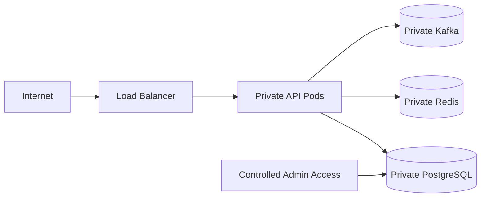
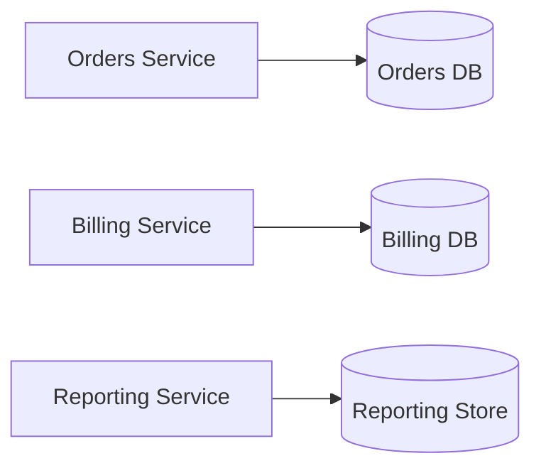
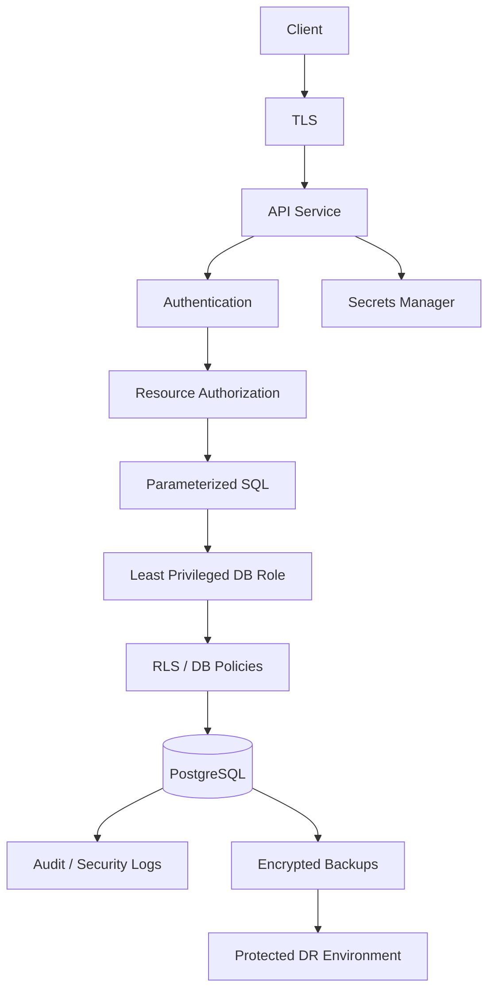

# 22- SQL Security Questions

## Overview

SQL security interviews evaluate whether you understand security as a layered system rather than as a single technique such as SQL injection prevention.

A strong backend engineer should be able to reason across:

```text
Application Authentication
        ↓
Application Authorization
        ↓
Database Authentication
        ↓
Database Roles / Privileges
        ↓
SQL Construction
        ↓
Row-Level Security
        ↓
Network / TLS
        ↓
Secrets
        ↓
Auditing / Logging
        ↓
Backup / Recovery Security
```

The most important interview distinction is:

> Application security and database security solve different problems and should reinforce each other.

Parameterized queries protect SQL structure from untrusted values. Database privileges limit what an authenticated database identity can do. Row-level security can enforce row visibility. Application authorization determines whether a user is allowed to perform a business operation.

No single layer should be treated as sufficient protection.

---

## Authentication vs Authorization

### What is authentication?

Authentication establishes **who or what is connecting**.

Examples:

```text
Application user → JWT/session
Application → PostgreSQL credentials
Service → AWS IAM identity
```

### What is authorization?

Authorization determines **what that identity is allowed to do**.

For a database:

```text
Authentication:
"Who is app_runtime?"

Authorization:
"Can app_runtime SELECT from orders?"
```

| Concept | Question |
|---|---|
| Authentication | Who are you? |
| Authorization | What can you do? |
| Auditing | What did you do? |

### Interview trap

Do not say:

> "The user authenticated successfully, so they can access the resource."

Authentication does not imply authorization.

---

## SQL Injection

### What is SQL injection?

SQL injection occurs when untrusted input changes the structure or semantics of SQL rather than being treated purely as data.

Unsafe:

```python
query = f"""
SELECT id, email
FROM users
WHERE email = '{email}'
"""
```

If `email` is attacker-controlled, the resulting SQL can be altered.

### Correct approach

Use parameter binding:

```python
cursor.execute(
    """
    SELECT id, email
    FROM users
    WHERE email = %s
    """,
    (email,),
)
```

The driver sends the value as data rather than concatenating it into SQL syntax.

### Important distinction

Parameterization protects **values**.

It does not automatically solve dynamic SQL identifiers such as:

```text
table names
column names
ORDER BY columns
SQL operators
```

Those require validation or safe identifier composition.

---

## Parameterized Queries

Parameterized queries should be the default way to pass user-controlled values into SQL.

```python
cursor.execute(
    """
    SELECT id
    FROM orders
    WHERE customer_id = %s
      AND status = %s
    """,
    (customer_id, status),
)
```

Advantages:

- Prevents value-based SQL injection.
- Separates SQL structure from values.
- Lets the database/driver handle appropriate escaping and typing.
- Improves consistency across application code.

### Interview question

**Does parameterization make an application completely secure against SQL injection?**

No.

Unsafe SQL can still exist through:

```text
dynamic identifiers
unsafe raw SQL
ORM expression mistakes
stored procedures with unsafe dynamic SQL
second-order injection
```

Security requires reviewing how SQL structure is constructed, not merely checking for placeholders.

---

## Dynamic SQL Security

Dynamic SQL is sometimes necessary for:

```text
dynamic reports
partition management
administrative tooling
generic database utilities
dynamic ordering
```

The critical distinction is:

```text
Dynamic value
    → parameterize

Dynamic identifier
    → validate/allowlist and safely quote
```

### Example

Suppose an API accepts:

```text
sort=created_at
```

Do not generate:

```python
query = f"SELECT * FROM orders ORDER BY {sort}"
```

Instead, map external values to known SQL identifiers:

```python
SORT_COLUMNS = {
    "created": "created_at",
    "amount": "total_amount",
    "status": "status",
}

column = SORT_COLUMNS.get(sort_key)
if column is None:
    raise ValueError("Invalid sort field")
```

The application controls the SQL structure.

---

## ORM Security

Django ORM and SQLAlchemy reduce many common SQL injection risks because values are normally parameterized.

For example:

```python
User.objects.filter(email=email)
```

is safer than constructing raw SQL manually.

However, ORM usage does not eliminate security responsibilities.

Review carefully:

- Raw SQL.
- Dynamic filters.
- Dynamic ordering.
- Raw expressions.
- Database functions.
- SQL fragments.
- Administrative tooling.
- Tenant filtering.
- Authorization checks.

### Senior-level principle

> An ORM is a SQL generation layer, not an authorization system.

---

## Database Users and Roles

PostgreSQL uses roles for authentication and authorization.

A production application should generally avoid using a highly privileged role.

Example role model:

```sql
CREATE ROLE app_owner NOLOGIN;

CREATE ROLE app_runtime
LOGIN
PASSWORD 'managed-outside-sql';

CREATE ROLE app_readonly
LOGIN
PASSWORD 'managed-outside-sql';

CREATE ROLE app_migration
LOGIN
PASSWORD 'managed-outside-sql';
```

A conceptual separation is:

| Role | Responsibility |
|---|---|
| Owner | Owns database objects |
| Runtime | Executes normal application operations |
| Read-only | Reporting/read-only access |
| Migration | Performs controlled schema changes |
| Break-glass | Emergency administrative access |

### Why separate roles?

If the application is compromised, the attacker inherits the privileges of the application database identity.

A runtime role with:

```text
SELECT
INSERT
UPDATE
DELETE
```

is significantly safer than:

```text
SUPERUSER
CREATEDB
CREATEROLE
```

---

## Least Privilege

Least privilege means granting only the permissions required for a role to perform its responsibility.

For example:

```text
API runtime
    ↓
read/write application tables

Reporting service
    ↓
read-only reporting schema

Migration process
    ↓
controlled DDL/data migration permissions
```

Avoid:

```text
application → superuser
application → database owner
all services → shared admin credential
```

### Interview question

**Why is database least privilege important if the application already performs authorization?**

Because database credentials are another security boundary.

If the application contains a vulnerability or credentials leak, database privileges limit the blast radius.

---

## `PUBLIC` Privileges

PostgreSQL has a predefined role named `PUBLIC` representing all roles.

Permissions granted to `PUBLIC` can therefore affect every applicable database role.

Review:

```sql
REVOKE CREATE ON SCHEMA public FROM PUBLIC;
```

The exact permission model should be deliberate rather than inherited accidentally.

### Interview trap

Do not assume:

> "Nobody has permission unless explicitly granted."

Default privileges, ownership, role membership, `PUBLIC`, and other PostgreSQL behaviors all affect effective permissions.

---

## Role Membership

Roles can be granted to other roles.

This allows group-based permission models:

```text
app_runtime
    ↓
runtime_permissions
```

Instead of individually granting the same privileges to many users, define reusable roles.

For security-sensitive environments, understand the distinction between:

```text
membership
inheritance
SET ROLE capability
administrative membership options
```

Do not assume role membership always means every privilege is automatically usable in exactly the same way.

---

## Database Ownership

Object ownership is powerful.

The owner of a database object generally has privileges that ordinary grants do not fully constrain.

Therefore:

```text
application runtime role
    ≠
object owner
```

is usually a safer production design.

A dedicated non-login owner role can own application objects while the runtime role receives only required privileges.

---

## `GRANT` and `REVOKE`

Example:

```sql
GRANT CONNECT ON DATABASE appdb TO app_runtime;

GRANT USAGE ON SCHEMA app TO app_runtime;

GRANT SELECT, INSERT, UPDATE, DELETE
ON ALL TABLES IN SCHEMA app
TO app_runtime;
```

Then restrict where necessary:

```sql
REVOKE DELETE
ON app.audit_events
FROM app_runtime;
```

The goal is not maximum permission coverage. It is a deliberate permission model.

---

## Default Privileges

`ALTER DEFAULT PRIVILEGES` controls privileges granted to objects created in the future by a particular object-creating role.

Example:

```sql
ALTER DEFAULT PRIVILEGES
FOR ROLE app_owner
IN SCHEMA app
GRANT SELECT, INSERT, UPDATE, DELETE
ON TABLES
TO app_runtime;
```

### Important interview trap

Default privileges:

- Affect future objects.
- Do not retroactively change existing objects.
- Are associated with the role that creates the objects.

Therefore migrations and ownership design must be considered together.

---

## Read-Only Database Users

A reporting service should not normally receive write access simply because it needs to query data.

Example:

```sql
CREATE ROLE reporting LOGIN;

GRANT CONNECT ON DATABASE appdb TO reporting;
GRANT USAGE ON SCHEMA app TO reporting;

GRANT SELECT
ON ALL TABLES IN SCHEMA app
TO reporting;
```

For future objects:

```sql
ALTER DEFAULT PRIVILEGES
FOR ROLE app_owner
IN SCHEMA app
GRANT SELECT ON TABLES TO reporting;
```

### Read-only does not mean replica

These are different concepts.

```text
Read-only role
    → authorization model

Read replica
    → physical replication architecture
```

A read-only user can still query the primary unless the application explicitly routes it elsewhere.

---

## Row Level Security

PostgreSQL Row Level Security (RLS) provides database-enforced row visibility and modification policies.

Example:

```sql
ALTER TABLE orders ENABLE ROW LEVEL SECURITY;

CREATE POLICY tenant_orders
ON orders
USING (
    tenant_id = current_setting('app.tenant_id')::uuid
)
WITH CHECK (
    tenant_id = current_setting('app.tenant_id')::uuid
);
```

Conceptually:

```text
Application
    ↓
sets tenant context
    ↓
SQL query
    ↓
PostgreSQL
    ↓
RLS policy
    ↓
only authorized rows
```

### `USING` vs `WITH CHECK`

| Clause | Controls |
|---|---|
| `USING` | Rows visible/targetable by operations |
| `WITH CHECK` | Rows that new/updated data is allowed to contain |

### Production considerations

RLS is particularly useful for:

```text
multi-tenant SaaS
shared database/shared schema
sensitive row isolation
defense-in-depth authorization
```

But RLS must be designed carefully around:

```text
table ownership
BYPASSRLS
superusers
role membership
connection pooling
tenant context
performance
```

---

## RLS and Connection Pooling

A common multi-tenant pattern is transaction-scoped context:

```sql
BEGIN;

SET LOCAL app.tenant_id = '...';

SELECT *
FROM orders;

COMMIT;
```

`SET LOCAL` limits the setting to the current transaction.

This is safer with pooled connections than leaving tenant context permanently attached to a reusable session.

### Security principle

Never trust an arbitrary client-provided tenant identifier without validating that the authenticated principal is authorized for that tenant.

RLS is not a replacement for correct application identity and authorization design.

---

## Application Authorization

Suppose a user requests:

```http
GET /orders/123
```

The application should establish:

```text
authenticated principal
        ↓
resource ownership/membership
        ↓
business authorization
        ↓
database access
```

For example:

```python
order = (
    Order.objects
    .filter(id=order_id, tenant_id=request.tenant.id)
    .first()
)
```

The tenant constraint should be deliberate rather than relying on the URL alone.

### Senior distinction

There are multiple security questions:

```text
Who is the caller?
Is the caller allowed to access this resource?
Can the database identity execute this SQL?
Can the database policy expose this row?
```

Each layer answers a different question.

---

## SQL Constraints as Security Boundaries

Constraints are primarily correctness mechanisms, but they can also reduce security risk by preventing invalid states.

Examples:

```sql
NOT NULL
CHECK
UNIQUE
FOREIGN KEY
```

For example:

```sql
CHECK (amount >= 0)
```

prevents invalid values regardless of whether the request came from:

```text
REST API
gRPC
Celery
SQL client
migration
administrative script
```

Database constraints are valuable defense in depth.

---

## Sensitive Data Protection

Security-sensitive data should be classified before designing storage and access.

Examples:

```text
passwords
authentication tokens
API secrets
financial information
personal information
encryption keys
```

Passwords should not be stored as plaintext.

Applications should use appropriate password hashing mechanisms rather than reversible encryption for password verification.

Sensitive columns should have deliberately restricted access.

Consider:

```text
separate schemas
restricted roles
column-level privileges
application-level authorization
RLS
encryption
audit logging
```

---

## Encryption at Rest

Encryption at rest protects stored data if underlying storage is accessed outside the intended authorization boundary.

Relevant layers may include:

```text
database storage
disk volumes
snapshots
backups
object storage
replicas
```

For AWS deployments, encryption should be designed consistently across:

```text
RDS/Aurora
EBS
S3
backups
snapshots
```

Encryption does not replace:

```text
IAM
database permissions
network controls
secrets management
application authorization
```

---

## Encryption in Transit

Database and service traffic should be protected while crossing networks.

Typical flow:

```text
Application
    ↓ TLS
Load balancer / proxy
    ↓ TLS where required
Database
```

For PostgreSQL clients, TLS configuration should verify the server identity appropriately for the environment.

For example, `sslmode=require` provides encrypted transport but does not provide the same certificate/hostname verification semantics as `verify-full`.

### Interview trap

TLS provides:

```text
confidentiality
integrity
server authentication
```

depending on configuration.

It does not automatically provide application authorization.

---

## Secrets and Credential Management

Never hard-code production database passwords:

```python
DATABASE_PASSWORD = "production-password"
```

Avoid storing credentials in:

```text
source control
Docker images
logs
error messages
tickets
chat messages
```

Use a dedicated secret-management mechanism.

Typical architecture:

```text
AWS IAM / workload identity
        ↓
Secrets Manager / Parameter Store
        ↓
Application
        ↓
Database
```

Credentials should have:

- Limited scope.
- Controlled access.
- Rotation procedures.
- Auditability.
- Environment separation.

Short-lived workload identities are preferable where practical to long-lived static credentials.

---

## Credential Rotation

A common production mistake is rotating a password without considering existing connections.

A safer process is:

```text
Create/prepare new credential
        ↓
Update secret
        ↓
Allow applications to reload
        ↓
Establish new connections
        ↓
Verify healthy traffic
        ↓
Revoke old credential
```

Connection pools must be considered because existing connections can remain authenticated using previous credentials.

---

## Connection Pool Security

Connection pools reuse database sessions.

This creates security considerations around session state:

```text
SET
SET ROLE
session variables
temporary tables
prepared statements
advisory locks
transaction state
```

For tenant-specific security context, prefer transaction-scoped state where appropriate:

```sql
SET LOCAL app.tenant_id = '...';
```

Always ensure pooled connections are returned cleanly.

---

## `SECURITY DEFINER` Functions

PostgreSQL functions can execute with the privileges of their owner when declared `SECURITY DEFINER`.

This can be useful when exposing a narrowly controlled privileged operation.

However, it creates a privilege boundary and must be designed carefully.

Security considerations include:

```text
minimal function owner privileges
secure search_path
schema qualification
controlled EXECUTE privilege
safe dynamic SQL
untrusted input handling
```

A privileged function should not become an indirect path to arbitrary database access.

---

## SQL Injection vs Authorization

These are different vulnerabilities.

### SQL injection

```text
Attacker changes SQL semantics.
```

### Broken authorization

```text
Valid SQL executes against a resource the user should not access.
```

Example:

```sql
SELECT *
FROM orders
WHERE id = $1;
```

This can be perfectly parameterized and still be insecure if `$1` belongs to another tenant.

A secure application may need:

```sql
SELECT *
FROM orders
WHERE id = $1
  AND tenant_id = $2;
```

or an appropriate RLS policy.

---

## Logging and Auditing

Security logging answers questions such as:

```text
Who connected?
Which role was used?
Which privileged operation occurred?
When did it happen?
What changed?
```

Application logs should provide request correlation without exposing secrets or sensitive values.

Database-level auditing can be useful for:

```text
DDL
privilege changes
sensitive operations
administrative access
security investigations
```

Use centralized and appropriately protected log storage.

---

## Do Not Log Secrets

Avoid logging:

```text
passwords
access tokens
API keys
session cookies
private keys
full sensitive payloads
```

Be careful with SQL logging as well.

Parameterized SQL logging can still expose sensitive parameter values depending on the logging configuration.

Use redaction and structured logging.

---

## Backup Security

A backup is another copy of the production data.

Therefore:

> Backup security must be at least as deliberate as database security.

Protect:

```text
logical dumps
snapshots
WAL archives
object storage
PITR archives
replica backups
```

Consider:

```text
encryption
IAM
cross-account isolation
immutability
retention
deletion protection
restore authorization
auditability
```

Do not give developers unrestricted access to production backups.

---

## Restoring Production Data to Development

Restoring a production backup into a development environment can create significant security risk.

Before exposing production-derived data:

```text
classify data
 ↓
mask/anonymize sensitive fields
 ↓
restrict access
 ↓
verify credentials/tokens are invalidated
 ↓
audit usage
```

Never assume a non-production environment is automatically trusted.

---

## Database Network Security

A secure permission model is weakened if the database is publicly reachable without strong controls.

Production databases should generally use:

```text
private networking
security groups/firewall rules
restricted ingress
TLS
controlled administrative access
```

Typical AWS architecture:



Network security and database authorization should be defense-in-depth rather than substitutes.

---

## Django Security Considerations

Typical Django database security practices include:

```python
DATABASES = {
    "default": {
        "ENGINE": "django.db.backends.postgresql",
        "NAME": "app",
        "USER": "app_runtime",
        "PASSWORD": os.environ["DATABASE_PASSWORD"],
        "HOST": "db.internal",
        "PORT": "5432",
    }
}
```

Production design should additionally consider:

```text
TLS
secret management
connection lifetime
least-privileged role
read/write routing
transaction boundaries
migration role separation
```

Avoid giving the Django runtime role unnecessary DDL or administrative privileges.

---

## FastAPI and SQLAlchemy Security

For SQLAlchemy, parameterized expressions should be preferred over manually concatenated SQL.

Example:

```python
from sqlalchemy import text

stmt = text(
    """
    SELECT id, email
    FROM users
    WHERE email = :email
    """
)

result = session.execute(stmt, {"email": email})
```

The same principles apply:

```text
parameterize values
validate dynamic identifiers
use least-privileged credentials
control transactions
protect secrets
```

---

## Microservices and Database Security

A microservice architecture should avoid a single shared superuser credential.

Prefer:



Each service should ideally have:

```text
separate identity
separate credentials
limited database privileges
explicit ownership
audited access
```

If services share one database, define access boundaries deliberately rather than allowing unrestricted cross-service writes.

---

## Kafka and Celery Security

Background workloads are often overlooked.

A Celery worker may have the same database credentials as the API.

That may be acceptable in some systems, but the decision should be deliberate.

Consider separate roles when workers have different responsibilities.

Similarly, Kafka consumers and producers require:

```text
authentication
authorization
TLS
topic-level permissions
credential rotation
auditability
```

A background job is still a production principal and should not automatically receive administrative privileges.

---

## Security and Redis

Redis should not be treated as an authorization boundary simply because the database is secure.

For example:

```text
Redis cache
    ↓
contains tenant-specific data
```

must use keys and access patterns that prevent cross-tenant data leakage.

Cache invalidation and authorization should be designed together.

A cache hit should not bypass resource authorization.

---

## Security and Read Replicas

Read replicas can contain the same sensitive data as the primary.

Therefore:

```text
replica credentials
replica network access
replica backups
replica monitoring
replica administrators
```

must receive equivalent security consideration.

A read-only database role does not make sensitive data non-sensitive.

---

## Security During Migrations

Migration roles often require more privileges than runtime roles.

This creates a high-value attack surface.

Recommended separation:

```text
Application runtime
    ↓
minimal DML permissions

Migration process
    ↓
controlled DDL/data permissions

Database owner
    ↓
NOLOGIN where practical
```

Migrations should run through controlled CI/CD or deployment infrastructure rather than granting developers unrestricted production credentials.

---

## Security in CI/CD

CI/CD systems can access:

```text
database credentials
cloud credentials
migration privileges
production secrets
```

Use:

```text
OIDC/workload identity where possible
short-lived credentials
environment separation
protected deployment stages
approval controls for production
audit logs
secret scanning
```

Never print secrets during deployment debugging.

---

## Security Monitoring

Monitor security-relevant events such as:

```text
authentication failures
unexpected database users
privilege changes
role membership changes
DDL
unusual query volume
unexpected administrative access
backup access
configuration changes
```

Useful PostgreSQL sources include:

```text
pg_stat_activity
pg_roles
pg_auth_members
pg_policies
information_schema
database logs
audit tooling
```

Monitoring should identify both successful and failed security-relevant activity.

---

## Performance vs Security

Security controls can have performance implications.

Examples:

```text
RLS policy evaluation
audit logging
encryption
additional authorization predicates
TLS
fine-grained access checks
```

The correct response is not to disable security for performance.

Instead:

```text
measure
→ identify actual overhead
→ optimize policy/query design
→ add appropriate indexes
→ reduce unnecessary audit volume
→ preserve the security boundary
```

For example, RLS predicates may require appropriate indexing on tenant keys.

---

## High Availability and Security

Failover does not remove security requirements.

A standby or replacement primary must preserve:

```text
roles
permissions
TLS configuration
network controls
secrets management
audit configuration
backup protection
```

Failover procedures should be tested with the same security assumptions as normal operation.

---

## Disaster Recovery Security

A DR environment can become a security weakness if it is less controlled than production.

Review:

```text
DR credentials
backup encryption keys
network access
restore permissions
replica access
audit logging
data retention
```

Recovery procedures should verify that restored systems do not accidentally expose production data to broader audiences.

---

## Common Security Interview Scenarios

### "The application is vulnerable to SQL injection. What do you do?"

A strong answer:

1. Identify unsafe SQL construction.
2. Replace value interpolation with parameter binding.
3. Review all raw SQL paths.
4. Validate dynamic identifiers using allowlists.
5. Add automated security tests.
6. Rotate potentially exposed credentials if exploitation is possible.
7. Review logs and database activity for compromise.
8. Verify the application role has only required privileges.

Do not stop at "use parameterized queries."

---

### "The application uses an ORM. Can SQL injection still happen?"

Yes.

ORMs reduce common injection risks but do not eliminate:

```text
raw SQL
dynamic SQL fragments
unsafe identifiers
raw expressions
administrative queries
```

Review every path where application input influences SQL structure.

---

### "The user can access another customer's order. Is this SQL injection?"

Not necessarily.

If the SQL is:

```sql
SELECT *
FROM orders
WHERE id = $1;
```

and `$1` is correctly parameterized, SQL injection may be impossible while authorization is still broken.

The fix may require:

```text
tenant/resource authorization
RLS
ownership predicates
```

---

### "Should the application database user be a superuser?"

Almost never.

The application should normally operate with a narrowly scoped runtime role.

Administrative privileges should be separated from normal request processing.

---

### "Why use a separate migration user?"

Schema changes often require privileges that normal runtime traffic does not.

Separating them limits the blast radius if application credentials are compromised.

---

### "Does encryption at rest protect against SQL injection?"

No.

Encryption at rest protects stored data against certain storage-level compromise scenarios.

SQL injection operates through the database/application interface.

Different threats require different controls.

---

### "Does TLS protect against a compromised application?"

No.

TLS protects data in transit and authenticates communication endpoints according to configuration.

A compromised application can still use its valid database credentials and issue authorized SQL.

---

### "Does RLS replace application authorization?"

No.

RLS can provide database-level row isolation, but application authorization still handles business operations, identities, roles, resource permissions, and workflow decisions.

Defense in depth is stronger than relying on one mechanism.

---

## Security Decision Matrix

| Requirement | Primary control |
|---|---|
| Prevent SQL injection | Parameterized queries |
| Restrict database capabilities | Roles and privileges |
| Restrict rows by tenant | RLS / explicit authorization |
| Protect passwords | Strong password hashing |
| Protect credentials | Secrets manager / workload identity |
| Protect network traffic | TLS |
| Protect stored data | Encryption at rest |
| Detect privileged activity | Auditing/logging |
| Limit application blast radius | Least privilege |
| Protect backups | Encryption + access controls + isolation |
| Prevent resource leakage | Application authorization |
| Protect dynamic SQL | Allowlisting + safe identifier handling |

---

## Production Security Review

### Application

- [ ] Authentication is correctly implemented.
- [ ] Authorization is explicit.
- [ ] Resource ownership is validated.
- [ ] SQL values are parameterized.
- [ ] Dynamic SQL uses allowlists.
- [ ] Sensitive data is minimized.
- [ ] Errors do not expose secrets.

### Database

- [ ] Runtime role is least privileged.
- [ ] Runtime role is not a superuser.
- [ ] Runtime role is not the object owner where practical.
- [ ] Migration privileges are separated.
- [ ] `PUBLIC` permissions are reviewed.
- [ ] Default privileges are deliberate.
- [ ] RLS is used where appropriate.
- [ ] `SECURITY DEFINER` functions are reviewed.

### Infrastructure

- [ ] Database is not unnecessarily public.
- [ ] TLS is enabled appropriately.
- [ ] Network access is restricted.
- [ ] Secrets are centrally managed.
- [ ] Credentials can be rotated.
- [ ] CI/CD uses controlled identities.

### Observability

- [ ] Security events are logged.
- [ ] Logs do not contain secrets.
- [ ] Privileged access is auditable.
- [ ] Database activity can be correlated with requests.
- [ ] Suspicious access can be investigated.

### Recovery

- [ ] Backups are encrypted.
- [ ] Backup access is restricted.
- [ ] Production backups are protected from developers.
- [ ] Restore procedures are tested.
- [ ] DR environments preserve security controls.

---

## Common SQL Security Mistakes

| Mistake | Risk | Better approach |
|---|---|---|
| Application uses superuser | Massive blast radius | Least-privileged runtime role |
| SQL string interpolation | SQL injection | Parameter binding |
| ORM assumed to provide authorization | Data exposure | Explicit resource authorization |
| Shared admin credential | Poor isolation | Service-specific roles |
| Hard-coded passwords | Credential leakage | Secret manager |
| Production secrets in logs | Credential compromise | Redaction |
| Public database exposure | Attack surface | Private networking |
| TLS disabled internally | Network interception | Appropriate TLS |
| RLS without tenant context validation | Cross-tenant access | Trusted context + authorization |
| RLS only on some access paths | Inconsistent isolation | Review all access paths |
| `PUBLIC` permissions ignored | Unintended access | Explicit permission review |
| Runtime owns tables | Excessive privilege | Dedicated owner role |
| Migration role reused by API | DDL compromise | Separate roles |
| Weak `SECURITY DEFINER` function | Privilege escalation | Secure search path + minimal owner |
| Production backup shared with developers | Data exposure | Restricted/masked copies |
| Unlimited logging of SQL | Sensitive-data leakage | Redaction and controlled logging |
| Credentials never rotated | Long-lived compromise | Rotation lifecycle |
| Read replica treated as trusted | Sensitive-data exposure | Secure replicas equally |

---

## Interview Traps

### "Indexes are a security feature."

Not primarily.

Indexes are performance structures. They can indirectly support secure query patterns, but authorization must not depend on index behavior.

### "Parameterized SQL prevents all injection."

False.

It protects parameterized values, not arbitrary SQL structure.

### "RLS means the application doesn't need authorization."

False.

RLS is a database enforcement layer, not a complete application authorization model.

### "Read-only users cannot leak data."

False.

A read-only role can still read every row it is authorized to access.

### "A private database doesn't need authentication."

False.

Network isolation reduces attack surface but does not replace database authentication and authorization.

### "Encryption solves database security."

False.

Encryption addresses specific threats. It does not prevent:

```text
SQL injection
broken authorization
credential misuse
privilege escalation
application compromise
```

### "The database user only has application permissions, so compromise is harmless."

False.

The attacker may still access or modify every resource available to that role.

Least privilege reduces the blast radius; it does not eliminate compromise.

---

## Senior-Level Security Reasoning

When evaluating a SQL security design, reason through the complete attack path:

```text
Attacker
   ↓
API
   ↓
Authentication
   ↓
Authorization
   ↓
SQL construction
   ↓
Database identity
   ↓
Database privileges
   ↓
RLS / constraints
   ↓
Data
   ↓
Logs / backups / replicas
```

At each boundary ask:

- What identity exists here?
- How is that identity authenticated?
- What privileges does it have?
- What input can influence behavior?
- Can an attacker cross the boundary?
- What data can be exposed?
- What happens if credentials leak?
- Can the action be detected?
- Can access be revoked?
- Can the system recover after compromise?

This is stronger than evaluating SQL security through a checklist of isolated vulnerabilities.

---

## Security Architecture Example

A production-oriented backend can use layered controls:



Each layer addresses a different failure mode.

---

## Security Incident Response

If database credentials may have been compromised:

1. Identify the affected credential and role.
2. Determine its privileges.
3. Rotate or revoke the credential.
4. Terminate inappropriate active sessions where necessary.
5. Review database logs and audit events.
6. Check for unexpected data access or modifications.
7. Review application and infrastructure logs.
8. Restore or reconcile affected data if necessary.
9. Determine how the credential was exposed.
10. Correct the underlying control failure.

Credential rotation without investigation is incomplete.

---

## Key Takeaways

- **SQL security is layered:** authentication, authorization, parameterization, database privileges, RLS, TLS, secrets, auditing, and backup protection address different threats.
- **Least privilege limits blast radius:** application runtime roles should not be superusers, object owners, or migration administrators unless there is an exceptional and deliberate reason.
- **Injection and authorization are different problems:** parameterized SQL protects SQL structure, while resource authorization and RLS determine which data the caller is allowed to access.
- **Security extends beyond the primary database:** replicas, backups, logs, CI/CD systems, connection pools, workers, and DR environments must receive equivalent security consideration.
- **Senior security reasoning follows the attack path:** identify identities, trust boundaries, privileges, data exposure, credential compromise impact, detection capability, and recovery mechanisms across the entire system.