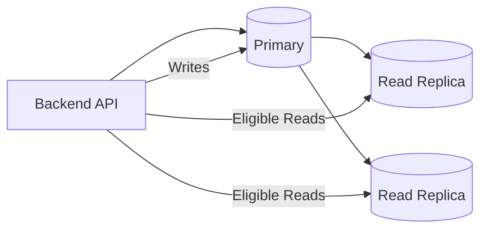
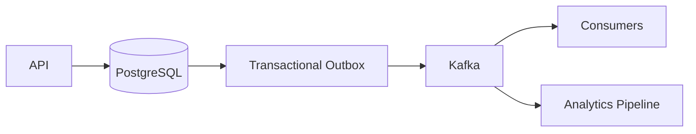

# 23- SQL Comparison Questions

## Overview

SQL comparison questions test whether you understand the trade-offs between different ways of expressing the same requirement.

At junior and intermediate levels, interviews often ask questions such as:

- `WHERE` vs `HAVING`
- `INNER JOIN` vs `LEFT JOIN`
- `UNION` vs `UNION ALL`
- `DELETE` vs `TRUNCATE`
- `EXISTS` vs `IN`
- `GROUP BY` vs window functions
- CTEs vs subqueries
- offset pagination vs keyset pagination

At senior level, the comparison usually becomes architectural:

```text
Correctness
    ↓
Cardinality
    ↓
Execution plan
    ↓
Concurrency
    ↓
Data volume
    ↓
Operational impact
    ↓
Scalability
    ↓
Security / reliability
```

The correct answer is rarely "A is always better than B." A strong interview answer explains **when each option is appropriate, what semantic difference exists, and what production trade-off matters**.

---

## A Framework for Comparison Questions

When asked to compare two SQL approaches, use this sequence:

1. Define what each construct does.
2. Explain the semantic difference.
3. Show a representative example.
4. Discuss correctness and edge cases.
5. Discuss execution and performance.
6. Explain production implications.
7. State when you would choose each.

A useful senior-level answer sounds like:

> "These are not interchangeable. I would choose based on result cardinality, required semantics, data distribution, and the execution plan."

---

## `WHERE` vs `HAVING`

| `WHERE` | `HAVING` |
|---|---|
| Filters rows | Filters groups |
| Applied before aggregation | Applied after aggregation |
| Usually reduces input to aggregation | Filters aggregated results |
| Cannot normally reference aggregate results | Can reference aggregate results |

Example:

```sql
SELECT customer_id, COUNT(*) AS order_count
FROM orders
WHERE status = 'completed'
GROUP BY customer_id
HAVING COUNT(*) >= 10;
```

The logical flow is:

```text
FROM
 ↓
WHERE
 ↓
GROUP BY
 ↓
HAVING
 ↓
SELECT
```

### Interview answer

Use `WHERE` for row-level predicates and `HAVING` for group-level predicates.

Do not use `HAVING` unnecessarily when the condition could be applied before aggregation.

---

## `INNER JOIN` vs `LEFT JOIN`

### `INNER JOIN`

Returns rows with matching records on both sides.

```sql
SELECT o.id, c.email
FROM orders AS o
JOIN customers AS c
  ON c.id = o.customer_id;
```

### `LEFT JOIN`

Returns every row from the left side and matching rows from the right side when available.

```sql
SELECT c.id, o.id
FROM customers AS c
LEFT JOIN orders AS o
  ON o.customer_id = c.id;
```

| Requirement | Preferred |
|---|---|
| Only entities with matches | `INNER JOIN` |
| Preserve all left-side entities | `LEFT JOIN` |
| Find entities without related rows | `LEFT JOIN ... IS NULL` or `NOT EXISTS` |

### Common mistake

This:

```sql
SELECT c.id, o.id
FROM customers AS c
LEFT JOIN orders AS o
  ON o.customer_id = c.id
WHERE o.status = 'completed';
```

can effectively eliminate unmatched customers because the `WHERE` condition rejects `NULL` rows.

Sometimes the intended condition belongs in the join:

```sql
SELECT c.id, o.id
FROM customers AS c
LEFT JOIN orders AS o
  ON o.customer_id = c.id
 AND o.status = 'completed';
```

The distinction is semantic, not merely stylistic.

---

## `JOIN` vs `EXISTS`

Use `JOIN` when you need columns from the related table or intentionally need its rows in the result.

Use `EXISTS` when the question is:

> Does at least one related row exist?

Example:

```sql
SELECT c.id
FROM customers AS c
WHERE EXISTS (
    SELECT 1
    FROM orders AS o
    WHERE o.customer_id = c.id
);
```

A join can multiply rows:

```text
Customer
   ↓
3 orders
   ↓
3 result rows
```

`EXISTS` expresses existence without requiring those related rows to become result rows.

### Senior-level consideration

The optimizer may transform semantically equivalent queries into similar execution strategies. Therefore, do not claim:

> "`EXISTS` is always faster than `JOIN`."

Choose based on semantics first and validate performance with `EXPLAIN`.

---

## `IN` vs `EXISTS`

### `IN`

Useful when comparing a value against a set:

```sql
SELECT *
FROM customers
WHERE id IN (
    SELECT customer_id
    FROM orders
    WHERE status = 'completed'
);
```

### `EXISTS`

Useful for correlated existence checks:

```sql
SELECT *
FROM customers AS c
WHERE EXISTS (
    SELECT 1
    FROM orders AS o
    WHERE o.customer_id = c.id
      AND o.status = 'completed'
);
```

### Important difference: `NULL`

`NOT IN` has particularly dangerous `NULL` semantics.

If the subquery contains `NULL`, this can produce unexpected results:

```sql
WHERE customer_id NOT IN (
    SELECT customer_id
    FROM orders
)
```

For anti-existence logic, prefer:

```sql
WHERE NOT EXISTS (
    SELECT 1
    FROM orders AS o
    WHERE o.customer_id = c.id
)
```

when the semantics match.

---

## `NOT EXISTS` vs `LEFT JOIN ... IS NULL`

Both can express an anti-join.

### `NOT EXISTS`

```sql
SELECT c.id
FROM customers AS c
WHERE NOT EXISTS (
    SELECT 1
    FROM orders AS o
    WHERE o.customer_id = c.id
);
```

### `LEFT JOIN`

```sql
SELECT c.id
FROM customers AS c
LEFT JOIN orders AS o
    ON o.customer_id = c.id
WHERE o.id IS NULL;
```

`NOT EXISTS` often communicates the intended semantics more directly.

However, execution depends on the database optimizer, indexes, statistics, and data distribution.

### Interview answer

> "I prefer `NOT EXISTS` when the requirement is explicitly existence/non-existence because it expresses intent clearly and avoids the `NULL` trap associated with `NOT IN`. I would still inspect the execution plan."

---

## `UNION` vs `UNION ALL`

### `UNION`

Combines results and removes duplicates.

```sql
SELECT email FROM customers
UNION
SELECT email FROM leads;
```

### `UNION ALL`

Combines results without duplicate elimination.

```sql
SELECT email FROM customers
UNION ALL
SELECT email FROM leads;
```

| Property | `UNION` | `UNION ALL` |
|---|---|---|
| Combines results | Yes | Yes |
| Removes duplicates | Yes | No |
| Extra duplicate-elimination work | Potentially | No |
| Usually faster | No | Usually |
| Preserves duplicate rows | No | Yes |

Use `UNION ALL` when duplicates are valid or already impossible.

### Common mistake

Using `UNION` "just to be safe" can introduce unnecessary sorting/hashing and hide a data-model or query-cardinality problem.

---

## `DISTINCT` vs `GROUP BY`

`DISTINCT` removes duplicate result rows:

```sql
SELECT DISTINCT customer_id
FROM orders;
```

`GROUP BY` forms groups and is normally used for aggregation:

```sql
SELECT customer_id, COUNT(*)
FROM orders
GROUP BY customer_id;
```

Sometimes they can produce equivalent results:

```sql
SELECT DISTINCT customer_id
FROM orders;
```

and:

```sql
SELECT customer_id
FROM orders
GROUP BY customer_id;
```

But the intent differs.

> `DISTINCT` expresses duplicate elimination; `GROUP BY` expresses grouping.

### Production consideration

Do not use `DISTINCT` to hide an incorrect join.

If a join unexpectedly creates ten rows per customer, investigate the join cardinality rather than automatically adding:

```sql
DISTINCT
```

---

## `GROUP BY` vs Window Functions

### `GROUP BY`

Collapses rows into groups.

```sql
SELECT customer_id, SUM(amount) AS total
FROM orders
GROUP BY customer_id;
```

Input:

```text
100
100
100
```

becomes:

```text
100 → one output row
```

### Window function

Calculates across related rows without collapsing them.

```sql
SELECT
    id,
    customer_id,
    amount,
    SUM(amount) OVER (
        PARTITION BY customer_id
    ) AS customer_total
FROM orders;
```

Output retains each order.

| Requirement | Use |
|---|---|
| One row per group | `GROUP BY` |
| Keep detail rows | Window function |
| Ranking | Window function |
| Running totals | Window function |
| Aggregated report | `GROUP BY` |

---

## Aggregate Functions vs Window Aggregates

These are often confused.

Aggregate:

```sql
SELECT customer_id, AVG(amount)
FROM orders
GROUP BY customer_id;
```

Window aggregate:

```sql
SELECT
    id,
    customer_id,
    amount,
    AVG(amount) OVER (
        PARTITION BY customer_id
    ) AS customer_average
FROM orders;
```

The first changes result cardinality.

The second preserves it.

---

## `CASE` vs `FILTER`

Conditional aggregation can be written with `CASE`:

```sql
SELECT
    COUNT(CASE WHEN status = 'completed' THEN 1 END)
FROM orders;
```

PostgreSQL also supports `FILTER`:

```sql
SELECT
    COUNT(*) FILTER (
        WHERE status = 'completed'
    ) AS completed_count
FROM orders;
```

`FILTER` often communicates conditional aggregation more directly in PostgreSQL.

For portable SQL, `CASE` may be more broadly applicable.

---

## `COALESCE` vs `CASE`

`COALESCE` is designed for selecting the first non-`NULL` expression:

```sql
SELECT COALESCE(display_name, email)
FROM users;
```

Equivalent logic can be expressed using `CASE`:

```sql
SELECT
    CASE
        WHEN display_name IS NOT NULL THEN display_name
        ELSE email
    END
FROM users;
```

Use `COALESCE` for straightforward null fallback.

Use `CASE` when the condition is more complex than null selection.

---

## `NULLIF` vs `CASE`

`NULLIF(a, b)` returns `NULL` when the two expressions are equal.

Example:

```sql
SELECT revenue / NULLIF(order_count, 0)
FROM metrics;
```

This avoids division by zero.

It is often cleaner than:

```sql
CASE
    WHEN order_count = 0 THEN NULL
    ELSE revenue / order_count
END
```

---

## Subquery vs CTE

A subquery can express a derived result inline:

```sql
SELECT *
FROM (
    SELECT customer_id, COUNT(*) AS order_count
    FROM orders
    GROUP BY customer_id
) AS x
WHERE order_count >= 10;
```

A CTE can improve structure:

```sql
WITH customer_orders AS (
    SELECT customer_id, COUNT(*) AS order_count
    FROM orders
    GROUP BY customer_id
)
SELECT *
FROM customer_orders
WHERE order_count >= 10;
```

### Important misconception

A CTE is not inherently:

- faster
- slower
- materialized
- an optimization barrier

PostgreSQL can inline eligible CTEs, while explicitly materialized CTEs have different behavior.

Choose CTEs primarily for readability, reuse, recursive queries, or deliberate execution semantics.

---

## CTE vs Temporary Table

| CTE | Temporary table |
|---|---|
| Statement-scoped | Session/transaction scoped depending definition |
| No persistent intermediate object | Creates database object |
| Good for query structure | Good for multi-step processing |
| Can be inlined | Stores intermediate data |
| Useful for recursive queries | Can be indexed |
| No explicit statistics on intermediate table | Can have indexes/statistics |

Use a temporary table when the intermediate dataset must be reused across multiple statements or benefits from indexing.

Do not create temporary tables merely because a query is complex.

---

## View vs Materialized View

### View

A view stores a query definition.

```sql
CREATE VIEW active_customers AS
SELECT *
FROM customers
WHERE status = 'active';
```

The underlying query executes when the view is queried.

### Materialized view

Stores the query result physically and must be refreshed.

```sql
CREATE MATERIALIZED VIEW customer_summary AS
SELECT customer_id, COUNT(*) AS order_count
FROM orders
GROUP BY customer_id;
```

| | View | Materialized View |
|---|---|---|
| Stores query definition | Yes | Yes |
| Stores result | No | Yes |
| Freshness | Current underlying data | Refresh-dependent |
| Query performance | Depends on underlying query | Often faster |
| Storage | Low | Additional storage |
| Refresh complexity | None | Required |

Use materialized views for expensive, repeatedly queried analytical results where some staleness is acceptable.

---

## Primary Database vs Read Replica

A primary database typically handles writes and may handle reads.

A read replica can serve read workloads.



### Benefits of replicas

- Scale read throughput.
- Isolate some reporting workloads.
- Improve geographic read latency in some architectures.
- Provide HA/DR capabilities depending on architecture.

### Limitations

- Replication lag.
- More routing complexity.
- Read-after-write consistency problems.
- Additional operational cost.
- Replicas do not inherently increase write capacity.

A strong backend design often routes consistency-sensitive reads to the primary.

---

## Read Replica vs Cache

A replica and cache solve different problems.

| Read Replica | Cache |
|---|---|
| Durable database copy | Derived/temporary representation |
| Supports SQL queries | Usually key-based lookup |
| Replication lag | Cache staleness |
| Adds database read capacity | Reduces database requests |
| More expensive infrastructure | Usually lower-latency access |

Typical architecture:

```text
API
 ├── Redis → frequent hot reads
 └── PostgreSQL
       ├── Primary → writes / consistency-sensitive reads
       └── Replica → scalable eligible reads
```

Do not introduce Redis merely because a query is slow. First determine whether the query, index, plan, or data model is the actual problem.

---

## Offset Pagination vs Keyset Pagination

### Offset pagination

```sql
SELECT id, created_at
FROM orders
ORDER BY created_at DESC, id DESC
LIMIT 50 OFFSET 10000;
```

Simple and useful for:

```text
small datasets
admin interfaces
page-number navigation
```

But large offsets can require increasing amounts of work.

### Keyset pagination

```sql
SELECT id, created_at
FROM orders
WHERE (created_at, id) < ($1, $2)
ORDER BY created_at DESC, id DESC
LIMIT 50;
```

Requires a stable ordering and appropriate index.

For example:

```sql
CREATE INDEX orders_created_id_idx
ON orders (created_at DESC, id DESC);
```

| Offset | Keyset |
|---|---|
| Easy page numbers | Cursor-based |
| Simple API | Better large-scale traversal |
| Large offsets can become expensive | Stable performance with proper index |
| Sensitive to concurrent inserts/deletes | Better traversal semantics |
| Good for small/admin datasets | Good for high-volume APIs |

For large production APIs, keyset pagination is often preferable.

---

## `DELETE` vs `TRUNCATE`

### `DELETE`

```sql
DELETE FROM sessions
WHERE expires_at < now();
```

Supports row-level filtering.

### `TRUNCATE`

```sql
TRUNCATE TABLE sessions;
```

Removes all rows using a different storage operation and has stronger locking implications.

| | `DELETE` | `TRUNCATE` |
|---|---|---|
| Conditional filtering | Yes | No |
| Removes all rows | Yes, if no `WHERE` | Yes |
| Row-level processing | Yes | No |
| Locking characteristics | Different | Stronger table-level locking |
| Useful for huge full-table removal | Usually less efficient | Often preferable |
| Triggers/FK behavior | Different | Different |

`TRUNCATE` should be used carefully in production because it is a structural operation with broad locking effects.

---

## `DELETE` vs Soft Delete

Hard delete:

```sql
DELETE FROM users
WHERE id = $1;
```

Soft delete:

```sql
UPDATE users
SET deleted_at = now()
WHERE id = $1;
```

### Hard delete

Advantages:

- Removes data.
- Reduces retained sensitive information.
- Simpler query semantics.

Limitations:

- Recovery requires backups.
- Historical references may disappear.
- Cascading relationships can be complex.

### Soft delete

Advantages:

- Supports application-level recovery.
- Preserves historical rows.
- Can support audit/history requirements.

Limitations:

- Every query must respect deletion state.
- Indexes may need partial predicates.
- Storage continues growing.
- Authorization bugs can accidentally expose deleted records.

Example:

```sql
CREATE INDEX active_users_email_idx
ON users (email)
WHERE deleted_at IS NULL;
```

Soft delete is a data lifecycle decision, not merely an ORM convenience.

---

## `BIGINT` vs `UUID`

Both can be valid primary-key choices.

| | `BIGINT` | `UUID` |
|---|---|---|
| Size | Smaller | Larger |
| Sequential locality | Usually strong with generated sequences | Depends on UUID version/generation |
| Distributed generation | Requires coordination for sequence semantics | Easy |
| External exposure | Predictable if sequential | Harder to enumerate |
| Index size | Smaller | Larger |
| Sharding/distributed systems | Requires design | Often convenient |

Do not choose UUID solely because it "is more secure." An identifier's unpredictability is not a substitute for authorization.

---

## Natural Key vs Surrogate Key

### Natural key

Uses a business attribute:

```sql
email
```

### Surrogate key

Uses a database/application-generated identifier:

```sql
id bigint
```

Natural keys can change because business data changes.

For example, email addresses may be updated.

Surrogate keys usually provide stable internal references while business attributes can have separate unique constraints.

---

## Primary Key vs Unique Constraint

A primary key:

- Identifies the row's primary identity.
- Is unique.
- Is not nullable.
- Provides the table's primary key constraint.

A table can have multiple unique constraints but normally has one primary key.

Example:

```sql
CREATE TABLE users (
    id bigint PRIMARY KEY,
    email text UNIQUE NOT NULL
);
```

Here:

```text
id
 → primary identity

email
 → alternate uniqueness constraint
```

---

## Foreign Key vs Application Validation

Application validation:

```python
if customer_id not in known_customers:
    ...
```

Database foreign key:

```sql
FOREIGN KEY (customer_id)
REFERENCES customers(id)
```

Application validation can improve user experience, but it is not a substitute for database integrity.

Multiple writers may exist:

```text
API
Celery
migration
admin SQL
ETL
```

A database constraint protects the invariant at the database boundary.

---

## Optimistic vs Pessimistic Concurrency

### Optimistic

Assume conflicts are uncommon.

```sql
UPDATE orders
SET status = 'paid',
    version = version + 1
WHERE id = $1
  AND version = $2;
```

Check affected rows.

### Pessimistic

Lock the row before changing it:

```sql
SELECT *
FROM orders
WHERE id = $1
FOR UPDATE;
```

| Optimistic | Pessimistic |
|---|---|
| No lock during initial read | Explicit lock |
| Good for low conflict | Good for high conflict |
| Requires conflict detection | Requires lock management |
| Avoids unnecessary waiting | Can create contention |
| Retry/rejection handling required | Deadlocks must be considered |

Neither is universally superior.

---

## `SELECT FOR UPDATE` vs Atomic `UPDATE`

Suppose you need to increment a counter.

Less efficient:

```sql
SELECT value
FROM counters
WHERE id = $1
FOR UPDATE;
```

Then application code calculates a new value and updates it.

Often better:

```sql
UPDATE counters
SET value = value + 1
WHERE id = $1;
```

The database performs the operation atomically.

### Senior principle

> If the invariant can be expressed as one atomic SQL statement, prefer that over a read-modify-write sequence.

This reduces transaction complexity and lock duration.

---

## `FOR UPDATE` vs `FOR UPDATE SKIP LOCKED`

`FOR UPDATE` waits for conflicting locks.

```sql
SELECT id
FROM jobs
WHERE status = 'pending'
ORDER BY id
FOR UPDATE;
```

`SKIP LOCKED` skips rows currently locked by another transaction:

```sql
SELECT id
FROM jobs
WHERE status = 'pending'
ORDER BY id
FOR UPDATE SKIP LOCKED
LIMIT 100;
```

This is useful for database-backed worker queues.

```text
Worker A → locks job 101
Worker B → skips 101 → processes 102
```

### Limitation

`SKIP LOCKED` intentionally weakens fairness/visibility semantics. A locked row can be skipped temporarily.

It is appropriate for queue-like workloads, not as a general replacement for locking.

---

## Transaction Isolation Levels

Common PostgreSQL isolation levels include:

| Level | General characteristic |
|---|---|
| Read Committed | Default; each statement sees a snapshot |
| Repeatable Read | Transaction-level consistent snapshot |
| Serializable | Strongest isolation; may require retries |

Higher isolation can improve correctness for certain workloads but can increase conflicts and retries.

At senior level, answer isolation questions in terms of **business invariants**, not just names.

---

## Transaction vs Autocommit

Autocommit means individual statements are committed independently unless explicitly grouped into a transaction.

Use explicit transactions when multiple changes must succeed or fail together:

```sql
BEGIN;

UPDATE accounts
SET balance = balance - 100
WHERE id = $1;

UPDATE accounts
SET balance = balance + 100
WHERE id = $2;

COMMIT;
```

### Production rule

Keep transactions short.

Do not hold a database transaction open while:

```text
calling external APIs
waiting for Kafka
waiting for user input
performing slow computation
sleeping
```

---

## Normalization vs Denormalization

Normalization reduces unnecessary duplication and update anomalies.

Denormalization intentionally duplicates or precomputes data to optimize specific workloads.

| Normalization | Denormalization |
|---|---|
| Less duplication | More duplication |
| Stronger consistency model | More synchronization complexity |
| Easier updates | Potentially faster reads |
| More joins may be required | Fewer joins |
| Good OLTP default | Useful for measured read patterns |

Senior answer:

> Normalize around correctness first. Denormalize when workload measurements demonstrate a meaningful performance or architectural benefit and define how duplicated data stays consistent.

---

## SQL vs NoSQL

SQL databases are strong when you need:

```text
transactions
relationships
constraints
complex queries
strong consistency requirements
ad hoc querying
```

NoSQL systems can be attractive when requirements emphasize:

```text
specific access patterns
massive horizontal scale
specialized latency characteristics
flexible document/key-value models
```

The comparison should be workload-driven.

Do not answer:

> "NoSQL is faster than SQL."

Performance depends on workload, data model, indexes, consistency requirements, hardware, and query patterns.

---

## PostgreSQL vs Redis

These systems are complementary.

| PostgreSQL | Redis |
|---|---|
| Durable relational database | In-memory data store |
| Complex relational queries | Key/value and specialized structures |
| Transactions and constraints | Lightweight atomic operations |
| Durable source of truth | Often cache/coordination layer |
| Rich SQL | Specialized commands |
| Higher latency than memory-only access | Very low latency |

Typical architecture:

```text
PostgreSQL → source of truth
Redis      → cache / ephemeral state
```

Do not move durable business invariants to Redis simply to reduce database load.

---

## PostgreSQL vs Kafka

These solve different problems.

### PostgreSQL

```text
state
transactions
queries
constraints
durability
```

### Kafka

```text
event streams
decoupling
durable event retention
consumer fan-out
asynchronous processing
```

A common architecture is:



The transactional outbox pattern helps avoid the dual-write problem between a database transaction and event publication.

---

## REST vs gRPC for Database-Backed Services

This is not primarily a database comparison.

Both can call the same persistence layer:

```text
REST ──┐
       ├── Service Layer → PostgreSQL
gRPC ──┘
```

Choose based on service communication requirements:

| REST | gRPC |
|---|---|
| Broad external compatibility | Strong service-to-service contracts |
| HTTP semantics | Protobuf contracts |
| Easy browser/client integration | Efficient binary protocol |
| Common public APIs | Common internal APIs |

Do not select a database architecture solely because an API uses REST or gRPC.

---

## ORM vs Raw SQL

### ORM

Example:

```python
orders = (
    Order.objects
    .filter(status="completed")
    .select_related("customer")
)
```

Advantages:

- Productivity.
- Application-level abstractions.
- Parameterization.
- Model integration.
- Easier common CRUD.

### Raw SQL

Useful when:

```text
complex reporting
database-specific features
specialized queries
advanced PostgreSQL functionality
performance-sensitive operations
```

Senior engineers should be comfortable with both.

> ORM abstraction does not remove the need to understand SQL execution.

---

## Application Validation vs Database Constraints

These are complementary.

```text
Application validation
    ↓
Good user experience

Database constraint
    ↓
Enforced invariant
```

For example:

```sql
UNIQUE (email)
```

is stronger than:

```python
if User.objects.filter(email=email).exists():
    ...
```

because two concurrent requests can both pass the application check.

The unique constraint provides the actual concurrency-safe invariant.

---

## Index Scan vs Sequential Scan

An index scan is not automatically better.

PostgreSQL may choose a sequential scan when:

```text
large percentage of table is needed
table is small
index is not selective
random access is expensive
statistics favor sequential access
```

The correct interview answer is:

> "The optimizer chooses an access path based on estimated cost. I would inspect `EXPLAIN (ANALYZE, BUFFERS)` rather than assuming the index should be used."

---

## B-Tree vs GIN vs GiST vs BRIN

| Index | Typical use |
|---|---|
| B-tree | Equality, ranges, ordering |
| GIN | Arrays, JSONB and full-text-style inverted indexes |
| GiST | Geometric/range and extensible search strategies |
| BRIN | Very large tables where physical ordering correlates with values |

Do not choose an index type based only on the column's data type.

Choose based on the operator and query pattern.

---

## Composite Index vs Multiple Single-Column Indexes

Suppose queries commonly use:

```sql
WHERE tenant_id = $1
  AND status = $2
ORDER BY created_at DESC
```

A composite index can match the complete access pattern:

```sql
CREATE INDEX orders_tenant_status_created_idx
ON orders (tenant_id, status, created_at DESC);
```

Three independent indexes are not necessarily equivalent.

Composite index ordering matters because PostgreSQL's ability to exploit the index depends on the query predicates and ordering.

---

## Covering Index vs Regular Index

A covering index can include columns needed for the query:

```sql
CREATE INDEX orders_customer_created_idx
ON orders (customer_id, created_at DESC)
INCLUDE (status, total_amount);
```

This can enable index-only scans when visibility and query conditions permit.

However:

- Indexes consume storage.
- Writes become more expensive.
- Vacuum/visibility-map state matters.
- Wider indexes increase I/O.

Do not add `INCLUDE` columns blindly.

---

## Partitioning vs Sharding

### Partitioning

Splits one logical table into partitions within a database.

```text
orders
 ├── 2026_01
 ├── 2026_02
 └── 2026_03
```

### Sharding

Distributes data across separate database instances or logical database nodes.

```text
tenant A → shard 1
tenant B → shard 2
tenant C → shard 3
```

| Partitioning | Sharding |
|---|---|
| Usually one database system | Multiple database nodes |
| Simpler queries | Routing complexity |
| Useful for lifecycle/pruning | Horizontal capacity |
| Lower operational complexity | Higher operational complexity |
| Good intermediate scaling strategy | Used for larger scale constraints |

Do not shard when partitioning, indexing, caching, or read replicas solve the actual bottleneck.

---

## Replication vs Sharding

Replication creates copies of data.

```text
Primary
 ├── Replica A
 └── Replica B
```

Sharding distributes different subsets of data.

```text
Shard A → tenants 1–1000
Shard B → tenants 1001–2000
```

Replication primarily helps:

```text
read scaling
availability
DR
```

Sharding primarily helps:

```text
write/data capacity
dataset distribution
tenant isolation
horizontal scaling
```

They can be combined.

---

## Partitioning vs Indexing

These solve different problems.

### Index

Improves access to rows within a table/partition.

### Partitioning

Divides the table into independently managed physical partitions and can allow partition pruning.

Example:

```text
orders
 ├── January partition
 │     └── index
 ├── February partition
 │     └── index
 └── March partition
       └── index
```

Partitioning does not automatically replace indexes.

---

## Read Scaling vs Write Scaling

Read scaling:

```text
Primary
 ├── Replica
 ├── Replica
 └── Replica
```

Write scaling is more difficult because a single logical dataset often has coordination requirements.

Typical progression:

```text
Optimize queries
 → Index
 → Cache
 → Connection control
 → Read replicas
 → Partitioning
 → Workload isolation
 → Sharding
```

Do not introduce distributed writes before proving simpler approaches are insufficient.

---

## Vertical vs Horizontal Scaling

### Vertical scaling

Increase resources on a database node:

```text
CPU
RAM
IOPS
storage
```

Advantages:

- Simple.
- Minimal application changes.
- Preserves relational semantics.

Limitations:

- Hardware limits.
- Cost increases.
- Does not solve every workload bottleneck.

### Horizontal scaling

Add database nodes or distribute workload.

Advantages:

- Greater capacity potential.
- Read scaling.
- Fault-domain distribution.

Limitations:

- Routing complexity.
- Replication consistency.
- Distributed transactions.
- Operational overhead.

---

## Synchronous vs Asynchronous Replication

### Asynchronous

Primary commits before replica necessarily confirms replay.

Advantages:

- Lower write latency.
- Better geographic flexibility.

Risk:

```text
primary failure
    ↓
recent transactions may not exist on replica
```

### Synchronous

Commit can depend on configured synchronous standby acknowledgment.

Advantages:

- Stronger durability/availability guarantees depending on configuration.

Trade-offs:

- Higher write latency.
- Replica/network failures can affect writes.

The correct choice depends on RPO, latency, and failure-domain requirements.

---

## Cache-Aside vs Write-Through

### Cache-aside

```text
Read:
Cache → miss → DB → Cache

Write:
DB → invalidate/update cache
```

Application controls caching.

### Write-through

Writes update cache as part of the write path, depending on the technology/design.

| Cache-aside | Write-through |
|---|---|
| Simple and common | More tightly coupled |
| Application controls population | Writes populate cache |
| Cache can become stale | Can improve cache freshness |
| Good general-purpose pattern | Useful for specific workloads |

Caching strategy must define invalidation and failure behavior.

---

## Batch Processing vs Row-by-Row Processing

Instead of:

```python
for order in orders:
    order.status = "archived"
    order.save()
```

prefer an appropriate set-based operation:

```sql
UPDATE orders
SET status = 'archived'
WHERE status = 'completed'
  AND completed_at < now() - interval '90 days';
```

For very large datasets, even a single massive statement may be operationally unsafe.

Use bounded batches when necessary to control:

```text
locks
WAL
transaction duration
replication lag
vacuum pressure
CPU/I/O
```

---

## Database Transaction vs Distributed Transaction

A database transaction is usually preferable when all required state belongs to one database.

A distributed transaction spans multiple systems.

Example:

```text
PostgreSQL
    +
Kafka
    +
Payment Service
```

Distributed transactions introduce:

```text
coordination
failure handling
timeouts
partial failure
retry semantics
idempotency
```

Prefer local transactions and asynchronous/event-driven patterns such as transactional outbox or Saga-style workflows when strict atomicity across systems is not feasible.

---

## SQL Comparison Interview Questions

### Core SQL

- `WHERE` vs `HAVING`?
- `INNER JOIN` vs `LEFT JOIN`?
- `UNION` vs `UNION ALL`?
- `DISTINCT` vs `GROUP BY`?
- `EXISTS` vs `IN`?
- `NOT EXISTS` vs `NOT IN`?
- `JOIN` vs `EXISTS`?
- `CASE` vs `COALESCE`?
- `COALESCE` vs `NULLIF`?
- Aggregate functions vs window functions?
- CTE vs subquery?
- View vs materialized view?

### Data Modeling

- Primary key vs unique constraint?
- Natural key vs surrogate key?
- Foreign key vs application validation?
- Normalization vs denormalization?
- Soft delete vs hard delete?
- `BIGINT` vs UUID?

### Performance

- Sequential scan vs index scan?
- Composite index vs multiple single-column indexes?
- Covering index vs regular index?
- B-tree vs GIN/GiST/BRIN?
- Offset vs keyset pagination?
- Query optimization vs caching?
- Read replica vs Redis?
- Partitioning vs indexing?

### Concurrency

- Optimistic vs pessimistic locking?
- Atomic update vs `SELECT FOR UPDATE`?
- `FOR UPDATE` vs `SKIP LOCKED`?
- Read Committed vs Repeatable Read vs Serializable?
- Short transaction vs large transaction?

### Architecture

- Primary vs read replica?
- Replication vs sharding?
- Partitioning vs sharding?
- Vertical vs horizontal scaling?
- Synchronous vs asynchronous replication?
- PostgreSQL vs Redis?
- PostgreSQL vs Kafka?
- SQL vs NoSQL?
- Local transaction vs distributed transaction?

---

## Production Decision Framework

When comparing alternatives in an interview or design review, evaluate them against the same dimensions.

| Dimension | Questions |
|---|---|
| Correctness | Does it preserve required semantics? |
| Cardinality | Does it produce the intended number of rows? |
| Performance | What does the execution plan look like? |
| Scale | How does it behave as data grows? |
| Concurrency | What locks or conflicts are introduced? |
| Consistency | Can stale or partial results occur? |
| Reliability | What happens when dependencies fail? |
| Security | Can it bypass authorization or expose data? |
| Operations | How difficult is it to monitor and maintain? |
| Cost | What infrastructure and storage does it require? |

This framework prevents simplistic answers such as:

```text
"EXISTS is always faster."
"Indexes are always better."
"Redis is faster, so use Redis."
"Sharding solves scale."
"Microservices require separate databases."
```

Each statement is incomplete without workload context.

---

## Common Comparison Mistakes

### Choosing based only on syntax

Two queries can look similar while producing different cardinality.

Always establish semantics first.

### Claiming one technique is always faster

Execution depends on:

```text
data distribution
statistics
indexes
cardinality
selectivity
cache state
concurrency
query frequency
hardware
```

Use execution plans and measurements.

### Ignoring `NULL`

Especially dangerous with:

```sql
NOT IN
```

Understand three-valued SQL logic.

### Ignoring concurrency

An application-level check can be invalid under concurrent requests.

Prefer database-enforced invariants where appropriate.

### Using `DISTINCT` to hide a bad join

Investigate the source of duplication.

### Comparing technologies that solve different problems

For example:

```text
PostgreSQL vs Kafka
```

is not simply a performance comparison.

One is primarily a transactional database; the other is primarily an event-streaming platform.

### Ignoring operational cost

A technically fast solution may introduce:

```text
more infrastructure
more failure modes
more monitoring
more deployment complexity
more data consistency problems
```

---

## Senior Interview Answer Pattern

For any SQL comparison question, structure the answer like this:

```text
1. Define both approaches.
2. Explain the semantic difference.
3. Give a concrete query/example.
4. Discuss correctness and edge cases.
5. Explain likely execution behavior.
6. Discuss indexing and data volume.
7. Discuss concurrency and consistency.
8. Explain production trade-offs.
9. State which one you would choose and why.
```

Example:

**Question:** `EXISTS` vs `JOIN`?

Strong answer:

> "`EXISTS` answers an existence question and does not inherently multiply the outer result by matching rows. A `JOIN` combines row sets and is appropriate when I need columns from the related table or intentionally want the joined cardinality. If I only need to determine whether a related row exists, I generally prefer `EXISTS` because the semantics are explicit. I would still validate the actual execution plan rather than claiming one is universally faster."

That demonstrates SQL knowledge, optimizer awareness, and production reasoning.

---

## Performance Investigation Checklist

When two SQL approaches appear equivalent:

1. Confirm they return the same results.
2. Test `NULL` behavior.
3. Test duplicate behavior.
4. Test empty-result behavior.
5. Compare execution plans.
6. Compare actual execution time.
7. Compare buffer usage.
8. Test realistic data volume.
9. Test realistic data distribution.
10. Test under concurrency.
11. Check index usage.
12. Check production query frequency.

Useful PostgreSQL tooling:

```sql
EXPLAIN (ANALYZE, BUFFERS)
SELECT ...;
```

For workload-level analysis, `pg_stat_statements` can reveal which query patterns consume the most total database time.

---

## Security Considerations

Comparison decisions should not weaken security.

Examples:

- Parameterized queries remain preferable to string construction.
- `EXISTS` does not replace authorization.
- Redis caching must preserve tenant/resource isolation.
- Read replicas can contain sensitive data.
- Denormalized data creates additional copies that require access control.
- Database constraints can provide defense in depth.
- Application authorization must not depend on whether a query happens to use an index.

A faster query that exposes unauthorized rows is not an optimization.

---

## Reliability and High Availability

Architectural comparisons should include failure behavior.

For example:

```text
Primary
  ↓
Replica
```

requires answers to:

```text
What if replication lags?
What if the primary fails?
What if a write succeeds but the response is lost?
What if a replica becomes unavailable?
What if failover changes the primary endpoint?
```

Similarly, choosing asynchronous processing requires:

```text
idempotency
retry handling
dead-letter strategy
reconciliation
observability
```

Senior SQL decisions include failure semantics, not just query syntax.

---

## Cost Considerations

Every architectural alternative has a cost profile.

Examples:

| Choice | Main additional cost |
|---|---|
| More indexes | Storage + write amplification |
| Read replicas | Compute + replication + operations |
| Redis | Infrastructure + cache management |
| Materialized views | Storage + refresh workload |
| Partitioning | Operational complexity |
| Sharding | Significant routing/operational complexity |
| Denormalization | Synchronization complexity |
| Distributed transactions | Coordination and failure-handling complexity |

Optimize for total system cost, not only query execution time.

---

## Key Takeaways

- **SQL comparisons are semantic first and performance second:** determine result cardinality, `NULL` behavior, duplicates, and correctness before choosing an implementation.
- **No SQL construct is universally faster:** execution depends on indexes, statistics, cardinality, data distribution, concurrency, and workload frequency; validate with execution plans and measurements.
- **Senior comparisons include architecture:** transactions, locking, replication, caching, partitioning, sharding, consistency, failure handling, security, and operational complexity matter beyond SQL syntax.
- **Prefer the construct that expresses the actual business requirement:** use `EXISTS` for existence, `GROUP BY` for collapsing groups, window functions for calculations that preserve rows, and keyset pagination for large ordered datasets.
- **Choose the simplest design that satisfies measured requirements:** optimize queries and indexes before adding caches, replicas, partitioning, sharding, or distributed coordination.