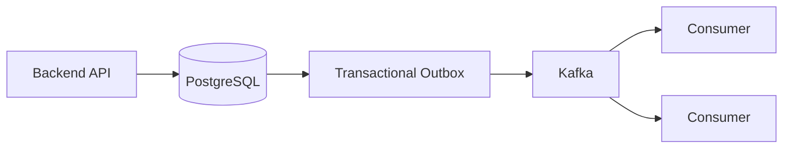
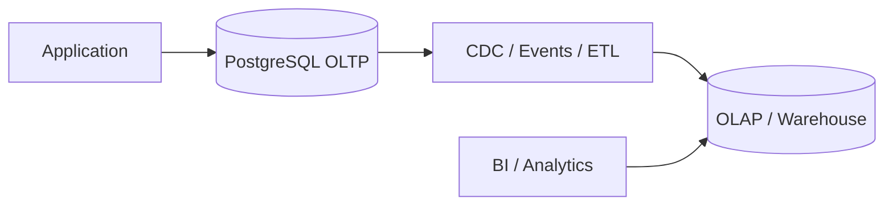

# 24- Why Choose X Instead of Y

## Overview

Senior SQL interviews frequently ask questions in the form:

> "Why would you choose X instead of Y?"

These questions test engineering judgment rather than syntax. The interviewer wants to know whether you can identify the actual requirement, understand database behavior, evaluate trade-offs, and choose an appropriate solution without relying on absolute rules.

A strong answer connects:

```text
Business requirement
        ↓
Correctness
        ↓
Data model
        ↓
Query semantics
        ↓
Execution behavior
        ↓
Concurrency
        ↓
Scale
        ↓
Reliability / Security
        ↓
Operational cost
```

The central principle is:

> **Choose the simplest mechanism that satisfies the required correctness, performance, consistency, and operational constraints.**

---

## How to Answer "Why X Instead of Y?"

A useful interview structure is:

1. State what X and Y are designed to solve.
2. Identify the requirement that determines the choice.
3. Explain the semantic or architectural difference.
4. Discuss performance characteristics.
5. Discuss concurrency and consistency.
6. Explain production trade-offs.
7. Mention the conditions under which you would choose Y instead.

For example:

> "I would choose `EXISTS` instead of `JOIN` when I only need to know whether a related row exists. `JOIN` is appropriate when I need columns from the related table or intentionally want joined rows. `EXISTS` also avoids expressing unnecessary result-row multiplication. I would still compare execution plans for the actual workload rather than claiming it is always faster."

That is stronger than:

> "`EXISTS` is faster."

---

## SQL Query Construction Choices

### Why Choose `WHERE` Instead of `HAVING`?

Choose `WHERE` when filtering individual rows before grouping.

```sql
SELECT customer_id, COUNT(*) AS order_count
FROM orders
WHERE status = 'completed'
GROUP BY customer_id;
```

Choose `HAVING` when filtering the result of aggregation.

```sql
SELECT customer_id, COUNT(*) AS order_count
FROM orders
GROUP BY customer_id
HAVING COUNT(*) >= 10;
```

The distinction is important because filtering early can reduce the number of rows entering aggregation.

```text
FROM
 ↓
WHERE
 ↓
GROUP BY
 ↓
HAVING
 ↓
SELECT
```

### Choose `WHERE` when

- The condition applies to individual rows.
- You can reduce the input before aggregation.
- The predicate does not depend on an aggregate result.

### Choose `HAVING` when

- The condition depends on `COUNT`, `SUM`, `AVG`, etc.
- You need to filter groups after aggregation.

### Interview trap

Do not say "`WHERE` is always faster."

The semantic requirement comes first. The performance benefit usually comes from reducing rows before expensive operations.

---

## Why Choose `EXISTS` Instead of `JOIN`?

Use `EXISTS` when the requirement is existence.

```sql
SELECT c.id
FROM customers AS c
WHERE EXISTS (
    SELECT 1
    FROM orders AS o
    WHERE o.customer_id = c.id
);
```

Use `JOIN` when you need data from the related table.

```sql
SELECT c.id, o.id, o.total_amount
FROM customers AS c
JOIN orders AS o
    ON o.customer_id = c.id;
```

The important difference is cardinality.

If one customer has five orders:

```text
JOIN
customer → 5 result rows

EXISTS
customer → 1 result row
```

### Choose `EXISTS` when

- You only need to know whether a related record exists.
- You want existence semantics.
- Joining would introduce unnecessary row multiplication.

### Choose `JOIN` when

- You need columns from the related table.
- You intentionally need one result row per matching relationship.

### Senior consideration

PostgreSQL can transform semantically related queries into similar execution strategies.

Therefore:

> Do not claim that `EXISTS` is inherently faster than `JOIN`.

Use `EXPLAIN (ANALYZE, BUFFERS)` to validate the actual workload.

---

## Why Choose `NOT EXISTS` Instead of `NOT IN`?

This is one of the most important SQL comparison questions.

Consider:

```sql
SELECT c.id
FROM customers AS c
WHERE NOT EXISTS (
    SELECT 1
    FROM orders AS o
    WHERE o.customer_id = c.id
);
```

This expresses:

> Return customers for whom no matching order exists.

`NOT IN` has different `NULL` semantics:

```sql
WHERE c.id NOT IN (
    SELECT customer_id
    FROM orders
);
```

If the subquery can contain `NULL`, SQL's three-valued logic can produce unexpected results.

### Preferred reasoning

Use `NOT EXISTS` when expressing anti-existence, especially when nullable values are involved.

### Interview answer

> "`NOT EXISTS` expresses anti-existence directly and avoids the common `NULL` trap associated with `NOT IN`. I use `NOT IN` only when I know its nullability and semantics are appropriate."

---

## Why Choose `UNION ALL` Instead of `UNION`?

`UNION` removes duplicates:

```sql
SELECT email FROM customers
UNION
SELECT email FROM leads;
```

`UNION ALL` preserves them:

```sql
SELECT email FROM customers
UNION ALL
SELECT email FROM leads;
```

Choose `UNION ALL` when duplicate rows are valid or impossible.

Choose `UNION` when duplicate elimination is part of the requirement.

```text
UNION
    ↓
combine
    ↓
remove duplicates
```

The duplicate-elimination step may require sorting or hashing and therefore additional CPU and memory.

### Interview answer

> "I prefer `UNION ALL` when I do not need duplicate elimination because it preserves semantics and avoids unnecessary duplicate-processing work."

Do not use `UNION` merely as a defensive habit.

---

## Why Choose `DISTINCT` Instead of `GROUP BY`?

Choose `DISTINCT` when the requirement is duplicate elimination:

```sql
SELECT DISTINCT customer_id
FROM orders;
```

Choose `GROUP BY` when the requirement is grouping, particularly aggregation:

```sql
SELECT customer_id, COUNT(*)
FROM orders
GROUP BY customer_id;
```

Although some queries can be written either way, their intent differs.

> `DISTINCT` communicates uniqueness of the result; `GROUP BY` communicates grouping.

### Common mistake

Do not add:

```sql
SELECT DISTINCT ...
```

to hide an incorrect join.

If a join unexpectedly produces duplicate rows, investigate the relationship cardinality.

---

## Why Choose a Window Function Instead of `GROUP BY`?

Choose `GROUP BY` when you want one row per group.

```sql
SELECT customer_id, SUM(amount) AS total_amount
FROM orders
GROUP BY customer_id;
```

Choose a window function when you need the aggregate while preserving individual rows.

```sql
SELECT
    id,
    customer_id,
    amount,
    SUM(amount) OVER (
        PARTITION BY customer_id
    ) AS customer_total
FROM orders;
```

### Choose window functions for

- Ranking.
- Running totals.
- Percentiles.
- Comparing a row to its group.
- Calculations while retaining detail rows.

### Choose `GROUP BY` for

- Reports with one row per group.
- Aggregated result sets.
- Reducing result cardinality.

---

## Why Choose a CTE Instead of a Subquery?

A CTE can improve readability and structure:

```sql
WITH customer_orders AS (
    SELECT customer_id, COUNT(*) AS order_count
    FROM orders
    GROUP BY customer_id
)
SELECT *
FROM customer_orders
WHERE order_count >= 10;
```

A subquery may be more concise for a local transformation:

```sql
SELECT *
FROM (
    SELECT customer_id, COUNT(*) AS order_count
    FROM orders
    GROUP BY customer_id
) AS customer_orders
WHERE order_count >= 10;
```

Choose a CTE when:

- The intermediate result has a meaningful conceptual name.
- The query has multiple logical stages.
- Recursive SQL is required.
- You deliberately need materialization semantics.

Choose a subquery when:

- The derived result is local to one expression.
- A CTE would add unnecessary structure.

### Important interview trap

Do not claim:

> "CTEs are faster."

PostgreSQL can inline eligible CTEs, while explicitly materialized CTEs behave differently.

The choice should primarily be based on semantics, readability, and required execution behavior.

---

## Why Choose a Temporary Table Instead of a CTE?

Choose a CTE when the intermediate data is needed only within the statement.

Choose a temporary table when the intermediate result needs to survive across multiple statements.

Temporary tables can also be useful when you need:

- Indexes on intermediate data.
- Multiple processing stages.
- Statistics for the intermediate relation.
- Reuse across several queries.

Example:

```sql
CREATE TEMP TABLE customer_totals AS
SELECT customer_id, SUM(amount) AS total_amount
FROM orders
GROUP BY customer_id;

CREATE INDEX customer_totals_customer_idx
ON customer_totals (customer_id);
```

### Trade-off

Temporary tables introduce database objects, storage, catalog activity, and lifecycle management.

Do not create one simply because a query is complex.

---

## Why Choose a View Instead of Repeating SQL?

Choose a view when a stable logical query should be exposed as a reusable database object.

```sql
CREATE VIEW active_customers AS
SELECT id, email
FROM customers
WHERE status = 'active';
```

Benefits:

- Centralizes query logic.
- Provides an abstraction boundary.
- Can simplify reporting/application queries.

Limitations:

- Underlying query still executes when queried.
- Complex views can hide expensive joins.
- Permissions and dependencies need management.

A view is not a cache.

---

## Why Choose a Materialized View Instead of a View?

Choose a materialized view when the underlying computation is expensive and some staleness is acceptable.

```sql
CREATE MATERIALIZED VIEW customer_order_summary AS
SELECT
    customer_id,
    COUNT(*) AS order_count,
    SUM(amount) AS total_amount
FROM orders
GROUP BY customer_id;
```

A regular view calculates against current underlying data.

A materialized view stores the computed result.

| Requirement | Choice |
|---|---|
| Always query current underlying data | View |
| Expensive repeated computation | Materialized view |
| Stale data acceptable | Materialized view |
| Simple reusable query abstraction | View |

The trade-off is freshness and refresh cost.

---

## Why Choose Keyset Pagination Instead of OFFSET?

Offset pagination:

```sql
SELECT id, created_at
FROM orders
ORDER BY created_at DESC, id DESC
LIMIT 50 OFFSET 10000;
```

Keyset pagination:

```sql
SELECT id, created_at
FROM orders
WHERE (created_at, id) < ($1, $2)
ORDER BY created_at DESC, id DESC
LIMIT 50;
```

For a large table, keyset pagination can avoid walking past a large number of earlier rows.

A suitable index might be:

```sql
CREATE INDEX orders_created_id_idx
ON orders (created_at DESC, id DESC);
```

### Choose OFFSET when

- Dataset is relatively small.
- Users need direct page numbers.
- It is an internal/admin interface.
- Large offsets are not a concern.

### Choose keyset when

- Dataset is large.
- Users traverse sequentially.
- API performance must remain stable at deep pages.
- You can expose cursor-based pagination.

### Interview answer

> "For high-volume APIs I prefer keyset pagination because it scales better for deep traversal and provides more stable behavior under concurrent inserts and deletes. Offset pagination is simpler and can be perfectly appropriate for smaller datasets."

---

## Why Choose an Atomic UPDATE Instead of Read-Modify-Write?

Suppose you need to increment a counter.

A read-modify-write approach is:

```text
SELECT value
      ↓
application calculates value + 1
      ↓
UPDATE
```

A database-side atomic operation is:

```sql
UPDATE counters
SET value = value + 1
WHERE id = $1;
```

The database evaluates the update atomically.

### Choose atomic SQL when

- The business operation can be expressed in one statement.
- You want to minimize transaction complexity.
- You want to reduce application/database round trips.
- The operation involves concurrent updates.

### Common mistake

Using:

```text
SELECT
calculate
UPDATE
```

when:

```sql
UPDATE ... SET value = value + 1
```

would preserve the invariant more directly.

---

## Why Choose `SELECT FOR UPDATE` Instead of Optimistic Concurrency?

Pessimistic locking:

```sql
SELECT *
FROM orders
WHERE id = $1
FOR UPDATE;
```

locks the selected row until the transaction ends.

Optimistic concurrency can use a version column:

```sql
UPDATE orders
SET status = 'paid',
    version = version + 1
WHERE id = $1
  AND version = $2;
```

Then the application checks the affected row count.

### Choose pessimistic locking when

- Conflicts are frequent.
- The operation must serialize access.
- Waiting is preferable to conflict retries.
- The critical section is short.

### Choose optimistic concurrency when

- Conflicts are relatively uncommon.
- You want to avoid lock waits.
- Operations can safely detect and reject/retry conflicts.

Neither is universally better.

---

## Why Choose `SKIP LOCKED` Instead of Normal Row Locking?

Normal locking may wait:

```sql
SELECT id
FROM jobs
WHERE status = 'pending'
ORDER BY id
FOR UPDATE
LIMIT 100;
```

Queue workers can instead use:

```sql
SELECT id
FROM jobs
WHERE status = 'pending'
ORDER BY id
FOR UPDATE SKIP LOCKED
LIMIT 100;
```

This allows multiple workers to process independent jobs without waiting for currently locked rows.

```text
Worker A → locks job 101
Worker B → skips 101 → processes 102
Worker C → skips locked rows → processes available work
```

### Choose `SKIP LOCKED` for

- Database-backed queues.
- Work distribution.
- Concurrent job claiming.

### Do not use it when

- Every row must be observed immediately.
- Strict ordering/fairness is required.
- Skipping locked work would violate business semantics.

---

## Why Choose a Database Constraint Instead of Application Validation?

Application validation:

```python
if not User.objects.filter(email=email).exists():
    create_user()
```

is vulnerable to concurrent requests.

Two requests can both observe:

```text
email does not exist
```

and then both attempt insertion.

A database constraint solves the invariant:

```sql
CREATE UNIQUE INDEX users_email_idx
ON users (email);
```

### Principle

> Application validation improves user experience; database constraints enforce integrity.

This applies to:

- Unique values.
- Foreign keys.
- Check constraints.
- Not-null requirements.
- Exclusion constraints where appropriate.

---

## Why Choose a Foreign Key Instead of Only Application Checks?

Application checks can be bypassed by:

```text
Celery
ETL
admin scripts
migration jobs
another service
direct SQL
```

A foreign key:

```sql
FOREIGN KEY (customer_id)
REFERENCES customers(id)
```

enforces the relationship at the database boundary.

### Choose database constraints when

- The invariant is fundamental to data integrity.
- Multiple writers exist.
- The database is the source of truth.

Application validation should still exist when useful for better error messages and earlier feedback.

---

## Why Choose Normalization Instead of Denormalization?

Normalization reduces duplicated business data and update anomalies.

Example:

```text
customers
orders
order_items
products
```

instead of copying customer information into every order item.

Choose normalization when:

- Data consistency is critical.
- Updates are frequent.
- Relationships matter.
- OLTP workloads dominate.
- Duplicate synchronization would create significant risk.

Choose denormalization when:

- A measured read bottleneck exists.
- A specific access pattern benefits from precomputed data.
- The synchronization model is understood.
- Additional storage and write complexity are acceptable.

### Senior answer

> "I start normalized for correctness and clear ownership. I denormalize based on measured workload characteristics, not as a default performance strategy."

---

## Why Choose a Surrogate Key Instead of a Natural Key?

Natural key:

```text
email
```

Surrogate key:

```text
id bigint
```

Business attributes can change.

For example:

```text
customer changes email
```

If email is used throughout the relationship graph as the primary identifier, the change becomes more complicated.

A surrogate key provides stable internal identity:

```sql
CREATE TABLE customers (
    id bigint GENERATED ALWAYS AS IDENTITY PRIMARY KEY,
    email text NOT NULL UNIQUE
);
```

The email can remain unique without becoming the primary identity.

### Choose natural keys when

- The business identifier is genuinely stable.
- Its semantics are clear and immutable.
- Using it simplifies the model without operational disadvantages.

### Choose surrogate keys when

- Business identifiers can change.
- Relationships need stable internal identifiers.
- The natural key is wide or operationally inconvenient.

---

## Why Choose `BIGINT` Instead of UUID?

`BIGINT` generally provides:

- Smaller indexes.
- Compact foreign keys.
- Efficient ordering.
- Good locality when generated sequentially.

UUIDs provide:

- Globally generated identifiers.
- Convenient distributed ID generation.
- Less predictable identifiers for external URLs.

UUIDs are larger and their physical locality depends on how they are generated.

### Interview trap

Do not say:

> "UUID is secure."

Unpredictability can make enumeration harder, but authorization must still be enforced.

Choose identifiers based on:

```text
distribution requirements
storage
index behavior
external exposure
generation model
sharding
operational constraints
```

---

## Why Choose a Partial Index Instead of a Full Index?

Suppose most queries target active rows:

```sql
SELECT *
FROM orders
WHERE tenant_id = $1
  AND status = 'pending';
```

A partial index can target the hot subset:

```sql
CREATE INDEX orders_pending_idx
ON orders (tenant_id, created_at DESC)
WHERE status = 'pending';
```

Benefits:

- Smaller index.
- Lower maintenance cost.
- Potentially better cache locality.
- Focuses resources on the workload that matters.

Limitations:

- Only useful for queries whose predicates can use the index.
- Predicate design matters.
- It is not a general replacement for a full index.

---

## Why Choose a Composite Index Instead of Multiple Single-Column Indexes?

Suppose the common query is:

```sql
SELECT id
FROM orders
WHERE tenant_id = $1
  AND status = $2
ORDER BY created_at DESC;
```

A composite index can represent the access pattern:

```sql
CREATE INDEX orders_tenant_status_created_idx
ON orders (tenant_id, status, created_at DESC);
```

Three separate indexes are not necessarily equivalent.

Index column order matters.

### Choose a composite index when

- Multiple columns are commonly queried together.
- Ordering/filtering patterns are stable.
- The complete access path justifies the index.

### Production consideration

Every additional index increases:

- Storage.
- Write amplification.
- Vacuum/maintenance work.
- Replication/WAL overhead.

Design indexes around real workload patterns.

---

## Why Choose an Index Scan Instead of a Sequential Scan?

Do not automatically choose an index scan.

A sequential scan may be cheaper when:

- A large fraction of the table is required.
- The table is small.
- The predicate has low selectivity.
- Sequential I/O is cheaper than random access.
- Statistics indicate that a sequential scan is more efficient.

Use:

```sql
EXPLAIN (ANALYZE, BUFFERS)
SELECT ...
FROM orders
WHERE status = 'completed';
```

to evaluate the actual plan.

### Interview answer

> "The optimizer chooses an access path based on estimated cost. I would not force an index merely because one exists."

---

## Why Choose Redis Instead of PostgreSQL?

Redis and PostgreSQL solve different problems.

Choose Redis for:

- Frequently accessed cache data.
- Ephemeral state.
- Rate limiting.
- Distributed coordination where appropriate.
- Specialized in-memory structures.

Choose PostgreSQL for:

- Durable source-of-truth state.
- Relational integrity.
- Complex SQL.
- Transactions.
- Constraints.

Typical architecture:

```text
              ┌──────────────┐
Request ─────→│    Redis     │
              │    Cache     │
              └──────┬───────┘
                     │ miss
                     ↓
              ┌──────────────┐
              │  PostgreSQL  │
              │ Source Truth │
              └──────────────┘
```

Do not move durable business invariants to Redis just because Redis is faster.

---

## Why Choose PostgreSQL Instead of Redis?

Choose PostgreSQL when you need:

```text
durability
relationships
constraints
transactions
complex queries
ad hoc SQL
strong data integrity
```

Redis is not a relational database replacement for these requirements.

---

## Why Choose Kafka Instead of a Database Queue?

Kafka is designed for durable event streams and consumer fan-out.

A database queue can be appropriate for smaller workloads:

```sql
SELECT id
FROM jobs
WHERE status = 'pending'
ORDER BY id
FOR UPDATE SKIP LOCKED
LIMIT 100;
```

Kafka becomes attractive when requirements include:

- High event throughput.
- Multiple independent consumers.
- Event retention.
- Replay.
- Stream processing.
- Loose coupling between services.

A database queue can be simpler when:

- Work volume is moderate.
- Job state is already in PostgreSQL.
- Transactional coupling with business data matters.
- Operational simplicity is more important than streaming scale.

---

## Why Choose PostgreSQL Instead of Kafka?

PostgreSQL stores transactional state.

Kafka stores event streams.

A common architecture is:



Choose PostgreSQL when the requirement is:

```text
"What is the current state?"
```

Choose Kafka when the requirement is:

```text
"What events happened and which consumers need them?"
```

They are often complementary rather than competing technologies.

---

## Why Choose a Read Replica Instead of Redis?

A read replica provides another database copy.

Redis provides a cache.

Choose a replica when:

- Queries are varied.
- Data must remain queryable through SQL.
- Durable replicated data is useful.
- Read throughput needs to scale.

Choose Redis when:

- Access patterns are predictable.
- Extremely low latency is required.
- Cached data can be recomputed or invalidated.
- Reducing database requests is the main goal.

Replicas introduce replication lag; Redis introduces cache staleness and invalidation complexity.

---

## Why Choose Partitioning Instead of Sharding?

Partitioning keeps a logical table within a database while dividing it into partitions.

```text
orders
 ├── 2026-01
 ├── 2026-02
 └── 2026-03
```

Sharding distributes data across separate database nodes.

```text
tenant A → shard 1
tenant B → shard 2
tenant C → shard 3
```

Choose partitioning when the primary problems are:

- Table size.
- Data lifecycle.
- Retention.
- Partition pruning.
- Operational management of large tables.

Choose sharding when:

- One database cannot provide sufficient capacity.
- Write capacity must scale horizontally.
- Dataset size exceeds practical single-node limits.
- Tenant/data placement provides useful locality.

Partitioning is usually operationally simpler.

---

## Why Choose Read Replication Instead of Sharding?

Read replicas scale reads:

```text
Primary
 ├── Replica A
 ├── Replica B
 └── Replica C
```

Sharding distributes data:

```text
Shard A → data subset
Shard B → data subset
Shard C → data subset
```

Choose replicas when the bottleneck is primarily reads.

Choose sharding when the single primary's:

```text
write throughput
storage capacity
CPU
I/O
```

has become the limiting factor and simpler optimizations are insufficient.

---

## Why Choose Vertical Scaling Instead of Horizontal Scaling?

Vertical scaling increases resources on a database node:

```text
CPU
RAM
IOPS
storage
```

Choose it when:

- The database fits comfortably on one node.
- Application changes should be minimal.
- Simplicity matters.
- The workload is limited by node resources.

Horizontal scaling introduces:

```text
replicas
partitioning
sharding
distributed routing
```

Choose it when a single node is no longer sufficient.

A senior engineer should usually exhaust simpler options before introducing distributed database complexity.

---

## Why Choose Asynchronous Replication Instead of Synchronous Replication?

Asynchronous replication can provide lower write latency.

```text
Primary
   │
   ├── commit
   │
   └── asynchronously → Replica
```

Synchronous replication can provide stronger durability guarantees depending on configuration.

```text
Primary
   │
   ├── Replica acknowledgment
   │
   └── commit
```

Choose asynchronous replication when:

- Low write latency matters.
- Some replica lag/data-loss exposure is acceptable.
- Cross-region replication is required.

Choose synchronous replication when:

- Stronger replication durability is required.
- Additional write latency is acceptable.
- Failure-domain requirements justify the trade-off.

---

## Why Choose Cache-Aside Instead of Write-Through?

Cache-aside:

```text
Read:
Cache → miss → DB → populate cache

Write:
DB → invalidate/update cache
```

It is widely used because the application explicitly controls cache behavior.

Choose cache-aside when:

- Cache is optional.
- Data can be recomputed.
- Read-heavy workloads benefit from caching.
- Different data has different caching requirements.

Write-through can be useful when cache freshness should be tightly coupled to writes, but it introduces stronger coupling between the write path and cache.

The most important production question is not the pattern name.

It is:

> What happens when the cache is stale, unavailable, or inconsistent?

---

## Why Choose Batch Processing Instead of Row-by-Row Updates?

Prefer set-based SQL where appropriate:

```sql
UPDATE orders
SET status = 'archived'
WHERE status = 'completed'
  AND completed_at < now() - interval '90 days';
```

Instead of issuing one SQL statement per row from Python.

However, a single massive update can itself become unsafe on very large tables.

For large datasets, use bounded batches:

```text
batch
 ↓
commit
 ↓
measure
 ↓
next batch
```

This controls:

- Transaction duration.
- Lock duration.
- WAL generation.
- Replica lag.
- Dead tuples.
- Autovacuum pressure.

---

## Why Choose Short Transactions Instead of Long Transactions?

Short transactions reduce the time during which resources remain locked or snapshots remain active.

Long transactions can cause:

```text
lock contention
connection exhaustion
MVCC cleanup delays
table/index bloat
replication conflicts
increased recovery complexity
```

Do not keep a transaction open while:

```text
calling external APIs
waiting on Kafka
performing slow network operations
running expensive application logic
waiting for user input
```

A strong production pattern is:

```text
begin transaction
    ↓
perform database work
    ↓
commit
    ↓
external work
```

When atomicity across systems is required, consider patterns such as the transactional outbox.

---

## Why Choose Optimistic Concurrency Instead of More Workers?

Adding workers does not necessarily increase throughput.

If all workers update the same hot row:

```text
Worker A ─┐
Worker B ─┼──→ same database row
Worker C ─┘
```

the workload becomes serialized around that resource.

Increasing:

```text
Kubernetes pods
Celery workers
connection pool size
```

can actually increase contention.

Before increasing concurrency, identify the shared resource and determine whether the workload can be:

- Partitioned.
- Sharded.
- Serialized.
- Batched.
- Replaced with atomic operations.
- Moved to a queue.

---

## Why Choose Database Transactions Instead of Distributed Transactions?

If all required state is in one PostgreSQL database, prefer one local transaction.

```text
PostgreSQL transaction
    ↓
atomic commit
```

Distributed transactions become more complex:

```text
Service A
   ↓
Service B
   ↓
Service C
```

with partial failure possibilities.

When multiple systems must participate, consider:

- Transactional outbox.
- Idempotent consumers.
- Saga-style workflows.
- Compensation.
- Reconciliation.

The goal is to minimize distributed coordination when local transactions can provide the required guarantees.

---

## Why Choose a Database Constraint Instead of a Redis Lock?

Suppose only one request should claim a resource.

A Redis lock may coordinate application workers, but it does not automatically establish the durable database invariant.

Prefer a database constraint or atomic transaction when the invariant belongs to database state.

Use distributed locks only when the coordination problem genuinely spans resources that cannot be protected by the database itself.

### Senior principle

> Use the system that owns the invariant to enforce it whenever possible.

---

## Why Choose PostgreSQL RLS Instead of Only Application-Level Tenant Filtering?

Application filtering:

```sql
SELECT *
FROM orders
WHERE tenant_id = $1;
```

depends on every query correctly applying tenant scope.

PostgreSQL Row Level Security can enforce policies at the database layer.

```sql
ALTER TABLE orders ENABLE ROW LEVEL SECURITY;
```

A tenant-aware policy can then restrict rows according to trusted transaction/session context.

RLS provides defense in depth, but it does not eliminate application authorization.

It also introduces considerations around:

- Connection pooling.
- Tenant context.
- Role privileges.
- Table ownership.
- `BYPASSRLS`.
- Policy complexity.
- Query performance.

---

## Why Choose Application Authorization Instead of RLS?

Application authorization is usually better suited for complex business decisions:

```text
Can this user modify this order?
Can this manager approve this refund?
Can this support agent view this customer?
```

RLS is particularly useful for enforcing row-level data boundaries.

They can coexist:

```text
Application authorization
        +
Database RLS
        +
Database constraints
```

Do not assume RLS alone represents the complete authorization model.

---

## Why Choose a Read-Only Database User Instead of a Read Replica?

These solve different problems.

A read-only role controls **permissions**.

A read replica provides a separate **database copy**.

You can have:

```text
Read-only role → Primary
Read-only role → Replica
```

Use a read-only role when the main requirement is preventing writes.

Use a replica when the requirement is workload isolation or read scaling.

---

## Why Choose `CREATE INDEX CONCURRENTLY` Instead of `CREATE INDEX`?

On a production PostgreSQL table, regular index creation can take locks that interfere with writes.

`CREATE INDEX CONCURRENTLY` is designed to reduce blocking of normal table operations.

```sql
CREATE INDEX CONCURRENTLY orders_customer_created_idx
ON orders (customer_id, created_at DESC);
```

Choose it for production index deployment when minimizing blocking is important.

Trade-offs include:

- Longer build time.
- Additional I/O.
- Additional system load.
- More complex failure handling.
- It cannot run inside a transaction block.

Always consider disk space, WAL, replica impact, and concurrent workload.

---

## Why Choose `NOT VALID` Constraint Deployment?

For large existing tables, validating a new constraint immediately can be expensive.

PostgreSQL supports adding certain constraints as `NOT VALID` and validating them later.

Conceptually:

```text
Add constraint
      ↓
Existing rows not immediately scanned
      ↓
New writes are constrained
      ↓
Validate existing rows later
```

This can be useful during zero-downtime migrations.

The exact supported syntax and behavior depend on the constraint type.

---

## Why Choose Expand-and-Contract Instead of Direct Schema Replacement?

Direct replacement:

```text
deploy application
      ↓
change schema
      ↓
remove old structure
```

is risky during rolling deployments because old and new application versions can coexist.

Expand-and-contract:

```text
Expand
  ↓
Deploy compatible application
  ↓
Backfill
  ↓
Switch reads/writes
  ↓
Observe
  ↓
Contract
```

This supports:

- Rolling deployments.
- Kubernetes replicas running different versions.
- Safe rollback.
- Large-table migrations.
- Gradual application transitions.

It is especially important for destructive changes such as removing columns.

---

## Why Choose a Transactional Outbox Instead of Direct DB + Kafka Dual Writes?

Unsafe pattern:

```text
BEGIN
DB write
COMMIT

Kafka publish
```

If Kafka publishing fails, database state and event state diverge.

Another ordering has the opposite failure mode.

Transactional outbox stores the event within the same database transaction:

```text
BEGIN
  business change
  outbox event
COMMIT
      ↓
background publisher
      ↓
Kafka
```

The publisher can retry safely when event publication is idempotent.

Choose this pattern when database state and event publication must be reliably coordinated without a distributed transaction.

---

## Why Choose Idempotency Instead of Assuming Retries Are Safe?

Retries are common in:

```text
HTTP
Kafka consumers
Celery
database failover
network calls
```

But retrying a non-idempotent operation can duplicate effects.

Example:

```text
POST payment
   ↓
DB commits
   ↓
network failure
   ↓
client retries
   ↓
second payment
```

Use an idempotency key or durable uniqueness mechanism where appropriate.

Example:

```sql
CREATE UNIQUE INDEX payments_idempotency_key_idx
ON payments (idempotency_key);
```

The important production principle is:

> A retry must not accidentally create a second business effect.

---

## Why Choose a Read Model Instead of Repeatedly Joining OLTP Tables?

For expensive read patterns, a dedicated read model can precompute the required representation.

```text
OLTP PostgreSQL
      ↓
Kafka / CDC / jobs
      ↓
Read Model
      ↓
API
```

Choose this when:

- Read workload is significantly different from transactional workload.
- Queries repeatedly perform expensive joins/aggregation.
- Some propagation delay is acceptable.
- The read model has a stable access pattern.

Trade-offs include:

- Eventual consistency.
- Synchronization complexity.
- Backfills.
- Reconciliation.
- Additional storage.

---

## Why Choose OLAP Instead of Running Reports on OLTP?

OLTP databases optimize for transactional workloads:

```text
small reads
small writes
concurrency
transactions
point lookups
```

OLAP systems optimize for:

```text
large scans
aggregations
historical analysis
analytical joins
```

Running heavy analytics directly against the primary can cause:

```text
CPU pressure
I/O contention
memory pressure
lock/resource contention
higher API latency
```

A common architecture is:



---

## Production Comparison Matrix

| Decision | Prefer X When | Prefer Y When |
|---|---|---|
| `EXISTS` vs `JOIN` | Existence only | Need related columns/rows |
| `NOT EXISTS` vs `NOT IN` | Anti-existence, nullable values | Null behavior is explicitly controlled |
| `UNION ALL` vs `UNION` | Duplicates are valid/unneeded to remove | Duplicate elimination is required |
| `WHERE` vs `HAVING` | Row filtering | Group filtering |
| `GROUP BY` vs window | Collapse rows | Preserve detail rows |
| CTE vs subquery | Structure/reuse/recursive logic | Local derived expression |
| Temp table vs CTE | Reuse/index intermediate data | One-statement intermediate result |
| View vs materialized view | Fresh results | Expensive reusable computation |
| Offset vs keyset | Small/simple pagination | Large sequential traversal |
| Atomic update vs read-modify-write | Simple concurrent mutation | Complex multi-step business logic |
| Optimistic vs pessimistic | Low conflict | High conflict/serialization |
| `SKIP LOCKED` vs waiting | Queue workloads | Fairness/strict ordering |
| Constraint vs app validation | Durable invariant | User-facing validation |
| Normalization vs denormalization | Correctness/OLTP | Measured read optimization |
| BIGINT vs UUID | Compact/stable local IDs | Distributed ID generation |
| Composite vs separate indexes | Repeated multi-column access pattern | Independent access patterns |
| Partial vs full index | Small hot subset | Broad query coverage |
| Redis vs PostgreSQL | Cache/ephemeral state | Durable relational state |
| Kafka vs DB queue | High event throughput/fan-out/replay | Simple transactional job processing |
| Replica vs Redis | SQL read scaling | Hot cached reads |
| Partitioning vs sharding | Large-table lifecycle/pruning | Distributed capacity |
| Sync vs async replication | Stronger durability requirement | Lower write latency |
| RLS vs application filtering | Database-level row isolation | Complex business authorization |
| Concurrent index vs regular index | Production low-blocking deployment | Controlled maintenance window |
| Outbox vs direct dual-write | Reliable DB + event coordination | No cross-system consistency requirement |

---

## A Senior-Level Decision Framework

When deciding between X and Y, ask:

### Correctness

- Do they return the same logical result?
- How do they behave with `NULL`?
- What happens with duplicates?
- What is the expected result grain?

### Performance

- What does `EXPLAIN (ANALYZE, BUFFERS)` show?
- What happens as data grows?
- Is the query CPU-, memory-, or I/O-heavy?
- Is the operation executed once or millions of times?

### Concurrency

- What happens when multiple requests execute simultaneously?
- Are locks required?
- Can hot rows become a bottleneck?
- Can retries duplicate effects?

### Consistency

- Can data be stale?
- Is replica lag acceptable?
- Is eventual consistency acceptable?
- What happens after a partial failure?

### Scalability

- Does the approach scale with rows?
- Does it scale with tenants?
- Does it scale with application instances?
- Does adding workers increase throughput or contention?

### Reliability

- What happens during database failover?
- What happens if the network fails after commit?
- Can the operation be retried safely?
- Is reconciliation required?

### Security

- Can the query expose unauthorized rows?
- Does caching preserve tenant boundaries?
- Are database permissions appropriate?
- Does the solution create additional sensitive-data copies?

### Operations

- How difficult is it to deploy?
- How difficult is it to monitor?
- How does it affect backups and replication?
- What happens during rollback?

### Cost

- Additional database nodes?
- Additional indexes?
- Redis?
- Kafka?
- Warehouse?
- Operational staffing and complexity?

---

## Common Interview Mistakes

### Saying "X is always faster"

Almost never correct.

Prefer:

> "X can be more efficient for this workload because..."

### Ignoring semantics

A query that executes faster but returns incorrect results is not an optimization.

### Ignoring cardinality

Especially common with:

```text
JOIN
DISTINCT
GROUP BY
EXISTS
```

Define the intended result grain first.

### Ignoring `NULL`

Particularly dangerous with:

```text
NOT IN
LEFT JOIN
aggregates
CASE
boolean expressions
```

### Adding infrastructure too early

Do not jump directly from:

```text
slow query
```

to:

```text
Redis
```

First inspect:

```text
SQL
index
plan
statistics
data distribution
query frequency
concurrency
```

### Scaling workers without investigating contention

More workers can make a hot-row workload worse.

### Treating replicas as write scaling

Read replicas increase read capacity; they do not automatically increase primary write throughput.

### Treating partitioning as sharding

Partitioning and sharding solve different scaling and operational problems.

### Treating UUIDs as authorization

Unpredictable IDs do not replace access control.

### Treating RLS as complete authorization

RLS can enforce row-level boundaries, but business authorization can still require application logic.

### Using `DISTINCT` to hide data-model problems

Unexpected duplicates should trigger cardinality investigation.

### Ignoring operational complexity

A theoretically optimal architecture can be a poor production choice if it adds unnecessary distributed failure modes.

---

## Production SQL Reasoning Example

Suppose an API endpoint is slow:

```text
GET /customers/{id}/orders
```

The first instinct might be:

```text
Add Redis
```

A stronger investigation is:

```text
1. Inspect generated SQL.
2. Check query frequency.
3. Check result cardinality.
4. Run EXPLAIN ANALYZE.
5. Inspect indexes.
6. Check lock waits.
7. Check connection pool behavior.
8. Check data growth.
9. Determine whether caching is actually appropriate.
10. Measure after the change.
```

If the query is:

```sql
SELECT *
FROM orders
WHERE customer_id = $1
ORDER BY created_at DESC
LIMIT 50;
```

the correct solution might simply be an index:

```sql
CREATE INDEX orders_customer_created_idx
ON orders (customer_id, created_at DESC);
```

If the query is already efficient but repeated thousands of times for identical data, caching may become appropriate.

If the result requires expensive aggregation over millions of rows, a materialized view or read model may be better.

The correct solution emerges from the bottleneck.

---

## Django and FastAPI Considerations

SQL comparison decisions still apply when using an ORM.

Django:

```python
customers = Customer.objects.filter(
    orders__status="completed"
).distinct()
```

may generate SQL involving joins and duplicate elimination.

For existence semantics, Django provides `Exists`:

```python
from django.db.models import Exists, OuterRef

completed_orders = Order.objects.filter(
    customer_id=OuterRef("pk"),
    status="completed",
)

customers = Customer.objects.annotate(
    has_completed_order=Exists(completed_orders)
).filter(
    has_completed_order=True
)
```

The important interview principle is:

> Understand the SQL generated by the ORM rather than treating ORM operations as independent from database behavior.

The same applies to SQLAlchemy in FastAPI services.

---

## Monitoring and Validation

Comparison decisions should be validated using production-relevant evidence.

Useful PostgreSQL tools include:

```sql
EXPLAIN (ANALYZE, BUFFERS)
SELECT ...;
```

Activity and locking:

```sql
SELECT
    pid,
    state,
    wait_event_type,
    wait_event,
    query
FROM pg_stat_activity
WHERE datname = current_database();
```

Workload-level query statistics can be obtained with `pg_stat_statements`.

Monitor:

```text
query latency
database CPU
I/O
buffer/cache behavior
lock waits
deadlocks
connection utilization
replication lag
WAL generation
index growth
temporary-file usage
```

A comparison that looks good in a unit test may behave differently under:

```text
production data volume
real cardinality
high concurrency
cold cache
replication
connection pool pressure
```

---

## Security Considerations

Performance and architecture decisions must preserve security.

Important rules:

- Parameterize values.
- Allowlist dynamic SQL identifiers.
- Do not use Redis as an authorization boundary by itself.
- Preserve tenant filtering in every data access path.
- Use RLS where it provides useful defense in depth.
- Enforce critical uniqueness and integrity constraints in the database.
- Do not expose sensitive data merely because a query is efficient.
- Use least-privilege database roles.
- Treat replicas, caches, exports, and analytical stores as additional copies of sensitive data.

A faster query that bypasses authorization is a security failure, not a performance improvement.

---

## Reliability and Disaster Recovery

Architectural choices should be evaluated under failure.

For replication:

```text
Primary failure
    ↓
Replica selection
    ↓
Failover
    ↓
Connection recovery
    ↓
Application retry
```

For asynchronous processing:

```text
Event published
    ↓
Consumer fails
    ↓
Retry
    ↓
Duplicate delivery possible
    ↓
Idempotent processing
```

For migrations:

```text
Migration partially completes
    ↓
Worker crashes
    ↓
Restart
    ↓
Resume safely
```

A senior design must specify how the system behaves when operations fail halfway through.

---

## Practical Interview Heuristic

When the interviewer asks:

> "Why choose X instead of Y?"

Think:

```text
What problem am I solving?
        ↓
What invariant must hold?
        ↓
What result/cardinality do I need?
        ↓
What does the optimizer likely do?
        ↓
What happens under concurrency?
        ↓
What happens as data grows?
        ↓
What happens when dependencies fail?
        ↓
What are the security implications?
        ↓
What is the simplest production solution?
```

The strongest answers avoid absolutes.

Prefer:

> "I would choose X under these conditions..."

over:

> "X is better."

---

## Key Takeaways

- **Choose based on requirements, not absolute rules:** SQL and architecture alternatives must be evaluated through semantics, cardinality, workload, concurrency, consistency, and operational constraints.
- **Correctness comes before performance:** understand `NULL`, duplicates, joins, constraints, transaction behavior, and authorization before optimizing execution.
- **Validate performance empirically:** execution plans, workload statistics, data distribution, concurrency, and production-scale testing are more reliable than generic claims such as "X is faster."
- **Senior decisions include failure and operational behavior:** retries, locking, replication lag, migrations, caching, security, observability, cost, and disaster recovery can determine the right choice.
- **Prefer the simplest solution that meets the requirements:** optimize SQL and indexes before introducing Redis, replicas, partitioning, sharding, Kafka, or other distributed-system complexity.