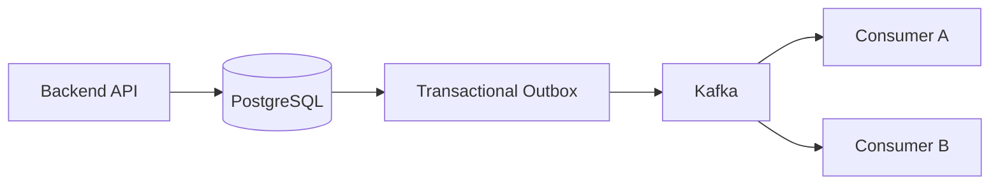

# 25- Common SQL Interview Traps

## Overview

SQL interviews often test whether a candidate understands **behavior and semantics**, not just syntax. Many questions are intentionally designed around cases where an apparently correct query produces incorrect results, unexpected `NULL` behavior, poor performance, or unsafe production behavior.

Common traps involve:

- `NULL` and three-valued logic.
- Join cardinality.
- `GROUP BY` and aggregation.
- `NOT IN`.
- `LEFT JOIN` filtering.
- `COUNT(*)` versus `COUNT(column)`.
- `DISTINCT` hiding incorrect joins.
- Window functions versus aggregation.
- `WHERE` versus `HAVING`.
- `UNION` versus `UNION ALL`.
- Pagination.
- Index selection.
- Transactions and concurrency.
- SQL injection.
- ORM-generated SQL.
- Replicas, caching, and consistency.

The senior-level expectation is not to memorize every trap. It is to reason about:

```text
SQL semantics
    ↓
Result cardinality
    ↓
NULL behavior
    ↓
Execution plan
    ↓
Concurrency
    ↓
Production workload
    ↓
Security and reliability
```

---

## Trap: `NULL` Is Not Equal to Anything

This is one of the most fundamental SQL traps.

This does not find rows where `deleted_at` is `NULL`:

```sql
SELECT *
FROM users
WHERE deleted_at = NULL;
```

Use:

```sql
SELECT *
FROM users
WHERE deleted_at IS NULL;
```

`NULL` represents an unknown or missing value. Comparisons involving `NULL` generally evaluate to `UNKNOWN`, not `TRUE`.

```sql
NULL = NULL
```

does not evaluate to `TRUE`.

### Interview question

**What does this return?**

```sql
SELECT *
FROM users
WHERE email <> 'admin@example.com';
```

It does not necessarily return rows where `email` is `NULL`.

Use explicit semantics:

```sql
WHERE email IS NULL
   OR email <> 'admin@example.com'
```

when that is the intended requirement.

---

## Trap: SQL Uses Three-Valued Logic

SQL boolean expressions can evaluate to:

| Result | Meaning |
|---|---|
| `TRUE` | Condition is satisfied |
| `FALSE` | Condition is not satisfied |
| `UNKNOWN` | Result cannot be determined |

For example:

```sql
NULL > 10
```

produces `UNKNOWN`.

A `WHERE` clause keeps rows only when its predicate evaluates to `TRUE`.

This explains many surprising results involving:

```text
NULL
NOT
AND
OR
NOT IN
LEFT JOIN
```

### Practical rule

Whenever nullable columns participate in filtering or comparison, explicitly reason about the `NULL` case.

---

## Trap: `NOT IN` and `NULL`

Consider:

```sql
SELECT id
FROM customers
WHERE id NOT IN (
    SELECT customer_id
    FROM orders
);
```

If the subquery contains a `NULL`, the result can be unexpectedly empty because of SQL's three-valued logic.

For anti-existence semantics, prefer:

```sql
SELECT c.id
FROM customers AS c
WHERE NOT EXISTS (
    SELECT 1
    FROM orders AS o
    WHERE o.customer_id = c.id
);
```

### Interview answer

> "`NOT EXISTS` is usually safer for anti-existence because it does not have the same `NULL` behavior that makes `NOT IN` surprising."

Do not claim that `NOT EXISTS` is universally faster. The optimizer and data distribution still matter.

---

## Trap: `COUNT(*)` vs `COUNT(column)`

Consider:

```text
id | email
---+-------------------
1  | a@example.com
2  | NULL
3  | b@example.com
```

Then:

```sql
COUNT(*)
```

returns:

```text
3
```

while:

```sql
COUNT(email)
```

returns:

```text
2
```

`COUNT(*)` counts rows.

`COUNT(column)` counts non-`NULL` values.

### Common mistake

Assuming:

```sql
COUNT(customer_id)
```

means "number of rows."

It means "number of rows where `customer_id` is not `NULL`."

This distinction becomes especially important with `LEFT JOIN`.

---

## Trap: `LEFT JOIN` + `COUNT`

Consider:

```sql
SELECT
    c.id,
    COUNT(o.id) AS order_count
FROM customers AS c
LEFT JOIN orders AS o
    ON o.customer_id = c.id
GROUP BY c.id;
```

This correctly returns customers with zero orders.

Using:

```sql
COUNT(*)
```

would count the preserved customer row from the `LEFT JOIN`, producing at least `1` for every customer.

### Interview rule

For counting matching child rows after a `LEFT JOIN`, a nullable child column such as `o.id` is often the correct expression:

```sql
COUNT(o.id)
```

---

## Trap: `LEFT JOIN` Can Accidentally Become an `INNER JOIN`

Consider:

```sql
SELECT c.id, o.id
FROM customers AS c
LEFT JOIN orders AS o
    ON o.customer_id = c.id
WHERE o.status = 'completed';
```

The `WHERE` clause rejects rows where `o.status` is `NULL`, effectively eliminating customers without matching orders.

If the requirement is:

> Return all customers, but only attach completed orders.

the condition may belong in the join:

```sql
SELECT c.id, o.id
FROM customers AS c
LEFT JOIN orders AS o
    ON o.customer_id = c.id
   AND o.status = 'completed';
```

### Interview trap

Always ask:

> Should the predicate filter the preserved table or the joined relationship?

---

## Trap: `INNER JOIN` Can Multiply Rows

Suppose:

```text
customer 1 → 5 orders
```

Then:

```sql
SELECT c.id, o.id
FROM customers AS c
JOIN orders AS o
    ON o.customer_id = c.id;
```

returns five rows for that customer.

This is correct if the desired grain is:

```text
one row per order
```

but incorrect if the desired grain is:

```text
one row per customer
```

### Senior reasoning

Before writing joins, define the result grain:

```text
one row per customer
one row per order
one row per customer/order
one row per product
```

Then verify every join preserves the intended cardinality.

---

## Trap: `DISTINCT` Does Not Fix a Bad Join

A common response to unexpected duplicates is:

```sql
SELECT DISTINCT c.id
FROM customers AS c
JOIN orders AS o
    ON o.customer_id = c.id;
```

This may produce the desired customer IDs, but it can hide a cardinality problem.

If you only need existence:

```sql
SELECT c.id
FROM customers AS c
WHERE EXISTS (
    SELECT 1
    FROM orders AS o
    WHERE o.customer_id = c.id
);
```

is often clearer.

### Interview answer

> "`DISTINCT` should express an intentional uniqueness requirement, not be used to hide an incorrect join."

---

## Trap: `SUM(DISTINCT amount)` Is Not a Duplicate Fix

Consider:

```text
order_id | amount
---------+-------
1        | 100
2        | 100
```

This:

```sql
SUM(DISTINCT amount)
```

returns:

```text
100
```

not:

```text
200
```

`DISTINCT` applies to the value being aggregated, not the identity of the row.

If duplicate rows are caused by a join, fix the join or aggregate at the correct grain before joining.

---

## Trap: `WHERE` vs `HAVING`

`WHERE` filters rows before grouping:

```sql
SELECT customer_id, COUNT(*)
FROM orders
WHERE status = 'completed'
GROUP BY customer_id;
```

`HAVING` filters groups after aggregation:

```sql
SELECT customer_id, COUNT(*)
FROM orders
GROUP BY customer_id
HAVING COUNT(*) >= 10;
```

Do not write:

```sql
WHERE COUNT(*) >= 10
```

because aggregate results are not available at the `WHERE` stage.

### Performance consideration

When possible, filtering rows before aggregation can reduce the amount of data processed.

But correctness determines which clause is appropriate.

---

## Trap: `GROUP BY` Changes Result Grain

This query:

```sql
SELECT customer_id, COUNT(*)
FROM orders
GROUP BY customer_id;
```

returns:

```text
one row per customer
```

You cannot arbitrarily select:

```sql
SELECT customer_id, status, COUNT(*)
FROM orders
GROUP BY customer_id;
```

because there can be multiple statuses per customer.

If the requirement is:

> Count orders by customer and status.

then the grain is:

```sql
GROUP BY customer_id, status
```

### Interview rule

Whenever `GROUP BY` appears, explicitly state the resulting grain.

---

## Trap: Aggregation Can Double-Count After Joins

Suppose:

```text
customer
   ├── orders
   └── payments
```

A query joining both one-to-many relationships can produce:

```text
orders × payments
```

for each customer.

For example:

```text
3 orders × 4 payments = 12 joined rows
```

An aggregate over those rows can multiply totals.

### Safer strategy

Aggregate each relationship independently:

```sql
WITH order_totals AS (
    SELECT customer_id, SUM(amount) AS order_total
    FROM orders
    GROUP BY customer_id
),
payment_totals AS (
    SELECT customer_id, SUM(amount) AS payment_total
    FROM payments
    GROUP BY customer_id
)
SELECT
    c.id,
    ot.order_total,
    pt.payment_total
FROM customers AS c
LEFT JOIN order_totals AS ot
    ON ot.customer_id = c.id
LEFT JOIN payment_totals AS pt
    ON pt.customer_id = c.id;
```

The key is controlling cardinality before combining independent one-to-many relationships.

---

## Trap: `UNION` vs `UNION ALL`

`UNION` removes duplicates:

```sql
SELECT email FROM customers
UNION
SELECT email FROM leads;
```

`UNION ALL` preserves them:

```sql
SELECT email FROM customers
UNION ALL
SELECT email FROM leads;
```

Choose `UNION ALL` when duplicate elimination is unnecessary.

Duplicate elimination can require additional sorting or hashing and therefore consume CPU and memory.

### Interview answer

> "`UNION ALL` is the correct choice when duplicates are valid or already impossible. `UNION` should be used when duplicate elimination is part of the requirement."

---

## Trap: `ORDER BY` Is Required for Deterministic Ordering

This query does not guarantee a particular order:

```sql
SELECT *
FROM orders
LIMIT 20;
```

Even if results appear consistently ordered during development, the database is free to return rows in another order.

Use:

```sql
SELECT *
FROM orders
ORDER BY created_at DESC, id DESC
LIMIT 20;
```

The secondary key makes the ordering deterministic when timestamps are equal.

### Production rule

If an API contract depends on ordering, specify the ordering explicitly.

---

## Trap: `LIMIT 1` Does Not Mean "Any Correct Row"

Consider:

```sql
SELECT *
FROM orders
WHERE customer_id = $1
LIMIT 1;
```

If multiple orders match, the database is not required to return the newest or oldest order.

For the newest:

```sql
SELECT *
FROM orders
WHERE customer_id = $1
ORDER BY created_at DESC, id DESC
LIMIT 1;
```

The ordering expresses the business requirement.

---

## Trap: `OFFSET` Pagination Degrades at Large Offsets

This is simple:

```sql
LIMIT 50 OFFSET 100000;
```

but the database may need to process or walk past many rows before returning the requested page.

For large sequential APIs, keyset pagination is often preferable:

```sql
SELECT id, created_at
FROM orders
WHERE (created_at, id) < ($1, $2)
ORDER BY created_at DESC, id DESC
LIMIT 50;
```

with:

```sql
CREATE INDEX orders_created_id_idx
ON orders (created_at DESC, id DESC);
```

### Choose offset when

- Datasets are small.
- Direct page navigation is important.
- Deep offsets are not a concern.

### Choose keyset when

- Tables are large.
- Clients traverse pages sequentially.
- Stable latency at deep positions matters.

---

## Trap: An Index Existing Does Not Mean It Will Be Used

Suppose:

```sql
CREATE INDEX orders_status_idx
ON orders (status);
```

The optimizer may still choose:

```text
Seq Scan
```

because:

- The table is small.
- The predicate matches a large fraction of rows.
- Statistics indicate a sequential scan is cheaper.
- The required output makes the index path expensive.
- The table/data distribution makes the index less useful.

Use:

```sql
EXPLAIN (ANALYZE, BUFFERS)
SELECT *
FROM orders
WHERE status = 'completed';
```

### Interview answer

> "Indexes are access paths available to the optimizer, not instructions that must be followed."

---

## Trap: A Sequential Scan Is Not Automatically Bad

A sequential scan can be optimal.

If a query needs most of a table:

```text
Read most pages sequentially
```

may be cheaper than:

```text
Use index
→ fetch many table rows
→ perform many random accesses
```

Do not say:

> "The query is slow because it uses a sequential scan."

Instead ask:

```text
Is the sequential scan actually expensive?
Is the estimate accurate?
How many rows are returned?
How frequently is the query executed?
Is the table large?
Is the workload CPU/I/O bound?
```

---

## Trap: Composite Index Column Order Matters

Consider:

```sql
CREATE INDEX orders_customer_status_created_idx
ON orders (customer_id, status, created_at DESC);
```

This index represents a specific access pattern.

A different ordering:

```sql
(status, customer_id, created_at DESC)
```

may be more appropriate for a workload primarily filtering by status.

Do not memorize:

> "Put the most selective column first."

Instead consider the complete workload:

```text
equality predicates
range predicates
ordering
join conditions
query frequency
data distribution
```

---

## Trap: Functions Can Prevent Efficient Index Usage

Suppose:

```sql
SELECT *
FROM users
WHERE LOWER(email) = LOWER($1);
```

A normal index on:

```sql
email
```

may not directly support the expression.

An expression index can:

```sql
CREATE INDEX users_lower_email_idx
ON users (LOWER(email));
```

The broader lesson is:

> The indexed expression must match the access pattern.

Do not blindly blame the optimizer when the query and index expressions do not align.

---

## Trap: Type Mismatches Can Change Query Behavior

Comparing incompatible or implicitly converted types can cause unexpected behavior or poor plans.

Prefer explicit, correctly typed parameters from the application.

For example, a Python backend should bind the correct database type rather than constructing SQL strings manually.

This is relevant to:

```text
PostgreSQL
psycopg
Django
SQLAlchemy
FastAPI
```

Parameterized queries protect values from SQL injection and also preserve correct database parameter handling.

---

## Trap: Parameterization Does Not Make Dynamic SQL Safe

This is safe for a value:

```python
cursor.execute(
    "SELECT id FROM users WHERE email = %s",
    (email,),
)
```

But SQL identifiers cannot generally be supplied as ordinary value parameters.

Unsafe:

```python
query = f"SELECT * FROM {table_name}"
```

For dynamic identifiers, use strict allowlisting or the database driver's identifier composition facilities.

The security distinction is:

```text
Values
  → parameter binding

SQL structure
  → validation / allowlisting / safe identifier composition
```

---

## Trap: SQL Injection Is Not Only About `WHERE`

Developers sometimes protect:

```sql
WHERE email = ?
```

but forget dynamic:

```text
ORDER BY
table name
column name
schema name
sort direction
operators
```

For example:

```text
GET /users?sort=email
```

should not directly become:

```python
f"ORDER BY {sort}"
```

Instead map external values to known SQL expressions:

```python
SORT_FIELDS = {
    "email": "email",
    "created": "created_at",
}

order_by = SORT_FIELDS.get(sort, "created_at")
```

---

## Trap: Application Validation Does Not Replace Database Constraints

This pattern is unsafe under concurrency:

```python
if not User.objects.filter(email=email).exists():
    User.objects.create(email=email)
```

Two requests can both observe that the email does not exist.

Enforce the invariant in the database:

```sql
CREATE UNIQUE INDEX users_email_idx
ON users (email);
```

Application validation can provide better error messages, but the database should enforce critical integrity constraints.

---

## Trap: Transactions Are Not Just `COMMIT` and `ROLLBACK`

A transaction defines a consistency boundary.

Consider:

```text
create payment
update order
publish event
```

The database can atomically handle the database operations:

```text
BEGIN
    insert payment
    update order
COMMIT
```

But Kafka, Redis, email, or an external HTTP API do not automatically participate in the same PostgreSQL transaction.

For database + event coordination, a transactional outbox can help:

```text
BEGIN
    business change
    outbox event
COMMIT
        ↓
publisher
        ↓
Kafka
```

---

## Trap: Long Transactions Are Not Automatically Better

A transaction such as:

```text
BEGIN
database query
HTTP API call
wait
another query
Kafka call
wait
COMMIT
```

can hold resources for unnecessarily long periods.

Long transactions can increase:

- Lock contention.
- Connection usage.
- MVCC cleanup pressure.
- Bloat.
- Replication conflicts.
- Failure scope.

Keep transaction boundaries narrow and focused.

---

## Trap: Read-Modify-Write Can Lose Updates

Unsafe pattern:

```text
SELECT balance
calculate new balance
UPDATE balance
```

Two concurrent transactions can read the same value.

For simple mutations, prefer atomic SQL:

```sql
UPDATE accounts
SET balance = balance - $1
WHERE id = $2
  AND balance >= $1;
```

Then inspect the affected row count.

For more complex workflows, use an appropriate combination of:

```text
transaction
row locking
optimistic concurrency
constraints
```

---

## Trap: `SELECT FOR UPDATE` Only Helps Inside the Right Transaction

Example:

```sql
SELECT *
FROM orders
WHERE id = $1
FOR UPDATE;
```

The lock is meaningful only while the transaction remains open.

The important question is:

```text
When is the transaction committed?
```

If the application performs slow external work while holding the transaction open, the lock can become a production bottleneck.

Use:

```text
short transaction
+
small critical section
```

---

## Trap: More Workers Do Not Always Mean More Throughput

Suppose many Celery workers update the same row:

```text
Worker A ─┐
Worker B ─┼──→ hot row
Worker C ─┘
```

The database must serialize conflicting updates.

Adding more:

```text
pods
workers
connections
```

can increase contention rather than throughput.

Senior-level troubleshooting asks:

> What shared resource limits concurrency?

---

## Trap: Deadlock and Lock Contention Are Different

Lock contention:

```text
Transaction A waits for B
```

Deadlock:

```text
Transaction A waits for B
Transaction B waits for A
```

PostgreSQL detects deadlocks and aborts one transaction.

Applications should:

- Keep transactions short.
- Acquire locks in consistent order.
- Avoid unnecessary locks.
- Retry the entire transaction when a retryable deadlock occurs.

The PostgreSQL deadlock SQLSTATE is:

```text
40P01
```

---

## Trap: `SKIP LOCKED` Is Not a General Concurrency Solution

For a database-backed queue:

```sql
SELECT id
FROM jobs
WHERE status = 'pending'
ORDER BY id
FOR UPDATE SKIP LOCKED
LIMIT 100;
```

can allow multiple workers to claim available jobs without waiting on locked rows.

But it changes semantics.

Rows can be skipped temporarily.

Therefore, `SKIP LOCKED` is appropriate for queue-like workloads, not workloads requiring strict ordering or immediate visibility of every eligible row.

---

## Trap: Isolation Level Does Not Replace Business Constraints

Isolation controls visibility and concurrency behavior.

It does not automatically express every business invariant.

For example:

```text
"Only one active subscription per customer"
```

may require a unique or partial unique constraint:

```sql
CREATE UNIQUE INDEX subscriptions_one_active_idx
ON subscriptions (customer_id)
WHERE status = 'active';
```

Use:

```text
isolation
+
constraints
+
locking
+
atomic statements
```

according to the invariant being protected.

---

## Trap: Replica Reads Can Be Stale

A common architecture is:

```text
Write → Primary
Read  → Replica
```

With asynchronous replication:

```text
Primary commit
      ↓
replication
      ↓
Replica
```

the replica can lag.

Therefore:

```text
POST /orders
GET /orders/{id}
```

may observe different states if the GET is routed immediately to a lagging replica.

For read-after-write requirements, use mechanisms such as:

- Primary routing for the critical read.
- Session/request consistency routing.
- LSN-aware routing where appropriate.
- Short-lived caching with carefully defined semantics.

---

## Trap: Redis Is Not a Replacement for Database Integrity

Redis may be useful for:

```text
caching
rate limiting
ephemeral state
coordination
```

but PostgreSQL should generally remain the source of truth for durable relational invariants.

Do not replace:

```text
UNIQUE
FOREIGN KEY
CHECK
transaction
```

with an application-level Redis mechanism unless the architecture explicitly accepts the resulting consistency model.

---

## Trap: Cache Hits Do Not Guarantee Correctness

A cache can contain:

```text
stale data
missing data
incorrectly scoped data
data from another tenant
```

A production cache design must answer:

```text
What is the source of truth?
When is the cache populated?
When is it invalidated?
What happens on cache failure?
How are tenant boundaries enforced?
```

For multi-tenant applications, cache keys should include the relevant tenant/resource scope.

---

## Trap: ORM Queries Are Still SQL

This Django query:

```python
Customer.objects.filter(
    orders__status="completed"
).distinct()
```

may generate joins and duplicate elimination.

For existence semantics, Django can express `EXISTS`:

```python
from django.db.models import Exists, OuterRef

completed_orders = Order.objects.filter(
    customer_id=OuterRef("pk"),
    status="completed",
)

customers = Customer.objects.filter(
    Exists(completed_orders)
)
```

The important interview skill is being able to move between:

```text
ORM
↓
Generated SQL
↓
Execution plan
↓
Database behavior
```

The same principle applies to SQLAlchemy.

---

## Trap: N+1 Is Not the Same as a Slow SQL Statement

An individual query can be fast:

```text
2 ms
```

while the application executes:

```text
5,000 queries
```

The endpoint can still be extremely slow.

For example:

```text
1 query → fetch customers
5,000 queries → fetch orders individually
```

The problem is workload shape, not necessarily the latency of one query.

Use ORM features such as:

```text
select_related
prefetch_related
joinedload
selectinload
```

where appropriate, then verify the generated SQL and query count.

---

## Trap: `SELECT *` Is Not Always Harmless

Selecting unnecessary columns can increase:

- Database I/O.
- Network transfer.
- Memory usage.
- Application deserialization.
- Serialization cost.
- Cache size.

Prefer projections when only a subset is needed:

```sql
SELECT id, email, created_at
FROM users
WHERE id = $1;
```

This matters particularly for high-volume APIs and large rows containing JSON or other wide fields.

---

## Trap: `LIMIT` Does Not Automatically Make a Query Cheap

This query:

```sql
SELECT *
FROM orders
WHERE expensive_condition
LIMIT 10;
```

may still require substantial work to find the first ten matching rows.

Performance depends on:

```text
predicate selectivity
indexes
ordering
data distribution
plan
```

An appropriate index can make a large difference.

---

## Trap: A Fast Query Can Still Be a Bad Query

Suppose:

```sql
SELECT *
FROM orders
WHERE customer_id = $1;
```

currently runs in `2 ms`.

If the API executes it:

```text
100,000 times per minute
```

the aggregate workload may be significant.

Senior performance analysis considers:

```text
latency
frequency
concurrency
CPU
I/O
memory
lock pressure
```

not only single-query latency.

---

## Trap: Query Performance and Lock Waiting Are Different Problems

A query can appear slow because it is:

```text
executing
```

or because it is:

```text
waiting
```

PostgreSQL activity can reveal wait information:

```sql
SELECT
    pid,
    state,
    wait_event_type,
    wait_event,
    query
FROM pg_stat_activity
WHERE datname = current_database();
```

If the query is waiting for a lock, adding an index may not solve the immediate problem.

First identify the actual bottleneck.

---

## Trap: `EXPLAIN` Cost Is Not Execution Time

This:

```sql
EXPLAIN
SELECT ...
```

shows estimated costs.

It does not execute the query.

Use:

```sql
EXPLAIN (ANALYZE, BUFFERS)
SELECT ...
```

to execute the statement and inspect actual runtime behavior.

Important fields include:

```text
actual time
rows
loops
Buffers
Rows Removed by Filter
Planning Time
Execution Time
```

Use `EXPLAIN ANALYZE` carefully with writes because the statement actually executes.

---

## Trap: Estimated Rows vs Actual Rows

Suppose a plan estimates:

```text
rows=10
```

but execution produces:

```text
rows=1,000,000
```

The optimizer is making decisions using a badly inaccurate cardinality estimate.

Possible causes include:

- Stale statistics.
- Correlated columns.
- Data distribution changes.
- Complex predicates.
- Insufficient statistics.

A senior engineer investigates cardinality estimates before blaming the chosen join or index.

---

## Trap: CTEs Are Not Automatically Faster

A CTE:

```sql
WITH recent_orders AS (
    SELECT *
    FROM orders
    WHERE created_at >= now() - interval '7 days'
)
SELECT *
FROM recent_orders
WHERE status = 'completed';
```

can improve readability.

But do not claim:

> "CTEs improve performance."

Modern PostgreSQL can inline eligible CTEs, while explicit materialization changes execution behavior.

Use CTEs primarily for:

- Query structure.
- Readability.
- Recursive queries.
- Deliberate materialization semantics.

Validate performance with the execution plan.

---

## Trap: Window Functions Do Not Collapse Rows

This:

```sql
SELECT
    customer_id,
    order_id,
    SUM(amount) OVER (
        PARTITION BY customer_id
    ) AS customer_total
FROM orders;
```

keeps individual order rows.

`GROUP BY`:

```sql
SELECT
    customer_id,
    SUM(amount)
FROM orders
GROUP BY customer_id;
```

produces one row per customer.

### Interview rule

Use:

```text
GROUP BY → collapse rows
Window function → preserve rows while calculating across a set
```

---

## Trap: Window Function Ordering Affects Meaning

Consider:

```sql
SUM(amount) OVER (
    PARTITION BY customer_id
    ORDER BY created_at, id
)
```

This represents an ordered window and can be used for running calculations.

Without ordering:

```sql
SUM(amount) OVER (
    PARTITION BY customer_id
)
```

the calculation is across the partition without requiring row sequence.

Do not add `ORDER BY` inside a window definition without understanding how it changes the frame and result semantics.

---

## Trap: `ROW_NUMBER()` and `RANK()` Are Different

Consider tied scores:

```text
100
100
90
```

`ROW_NUMBER()` produces unique sequence numbers:

```text
1
2
3
```

`RANK()` preserves ties:

```text
1
1
3
```

`DENSE_RANK()` preserves ties without gaps:

```text
1
1
2
```

Choose based on the business definition of ranking.

---

## Trap: "Latest Row" Requires Deterministic Ordering

This pattern:

```sql
SELECT *
FROM orders
WHERE customer_id = $1
ORDER BY created_at DESC
LIMIT 1;
```

can be ambiguous when multiple rows have the same timestamp.

Prefer:

```sql
ORDER BY created_at DESC, id DESC
LIMIT 1;
```

when `id` is a suitable deterministic tie-breaker.

This matters in:

- APIs.
- Audit systems.
- State lookup.
- Event processing.
- Pagination.

---

## Trap: `COALESCE` Can Hide Data Quality Problems

This:

```sql
COALESCE(balance, 0)
```

may be correct if `NULL` semantically means zero.

But sometimes `NULL` means:

```text
unknown
not calculated
not applicable
missing
```

Converting every `NULL` into zero can destroy that distinction.

Use `COALESCE` only when the replacement value represents the intended business semantics.

---

## Trap: `NULL` and Zero Are Not the Same

These can have different meanings:

```text
NULL → unknown
0    → known zero
```

For financial or analytics systems, this distinction can be critical.

Do not automatically normalize:

```sql
NULL → 0
```

without understanding the domain.

---

## Trap: Boolean Logic Needs Parentheses

Consider:

```sql
WHERE status = 'active'
   OR status = 'pending'
  AND deleted_at IS NULL
```

`AND` has higher precedence than `OR`, so this is interpreted as:

```sql
WHERE status = 'active'
   OR (
       status = 'pending'
       AND deleted_at IS NULL
   )
```

If the requirement is:

```text
(active OR pending) AND not deleted
```

write:

```sql
WHERE (
    status = 'active'
    OR status = 'pending'
)
AND deleted_at IS NULL;
```

Explicit parentheses improve correctness and readability.

---

## Trap: `NOT` With `NULL` Can Be Surprising

Consider:

```sql
WHERE NOT (status = 'active')
```

Rows with:

```text
status = NULL
```

do not necessarily satisfy the condition.

The expression evaluates to `UNKNOWN`.

If the requirement includes missing statuses, express that explicitly.

---

## Trap: `CASE` Order Matters

Consider:

```sql
CASE
    WHEN amount >= 1000 THEN 'large'
    WHEN amount >= 100 THEN 'medium'
    ELSE 'small'
END
```

The first matching condition wins.

If conditions overlap, changing their order changes the result.

A common mistake is writing broad conditions before specific ones.

---

## Trap: `CASE` Types Must Be Compatible

All result branches of a `CASE` expression must resolve to a compatible type.

Avoid mixing unrelated result types such as:

```sql
CASE
    WHEN status = 'paid' THEN 1
    ELSE 'pending'
END
```

unless the database can resolve the types appropriately.

Keep branch semantics and types intentional.

---

## Trap: Soft Deletes Affect Every Query

If the application uses:

```sql
deleted_at timestamptz
```

then queries often need:

```sql
WHERE deleted_at IS NULL
```

Missing this predicate can expose logically deleted records.

A partial index can sometimes support the common active-record workload:

```sql
CREATE INDEX users_active_email_idx
ON users (email)
WHERE deleted_at IS NULL;
```

Soft deletion is therefore both a correctness and indexing concern.

---

## Trap: Multi-Tenant Filtering Is an Authorization Boundary

A query such as:

```sql
SELECT *
FROM orders
WHERE id = $1;
```

may be logically valid but insufficiently scoped for a multi-tenant system.

A tenant-aware query may require:

```sql
SELECT *
FROM orders
WHERE tenant_id = $1
  AND id = $2;
```

or a database-level RLS policy.

Never treat tenant filtering as merely a performance optimization.

It is often part of authorization.

---

## Trap: RLS Does Not Replace Application Authorization

Row Level Security can protect database rows, but business authorization can still require application logic.

For example:

```text
Can user see tenant data?
```

may be handled by RLS.

But:

```text
Can this manager approve a refund above $10,000?
```

may require application-level authorization.

Use layered controls:

```text
Authentication
    ↓
Application authorization
    ↓
Database permissions
    ↓
RLS where appropriate
    ↓
Constraints
```

---

## Trap: Database Ownership Is Not the Same as Application Permission

A runtime application role should not generally own every database object or have unrestricted administrative privileges.

Separate responsibilities where appropriate:

```text
owner/migration role
runtime role
read-only role
administrative role
```

This limits blast radius if application credentials are compromised.

---

## Trap: Read-Only Roles and Read Replicas Solve Different Problems

A read-only database role provides:

```text
permission control
```

A replica provides:

```text
workload isolation / read scaling
```

You can use both simultaneously.

Do not answer:

> "Use a read replica when you want read-only access."

That confuses authorization with architecture.

---

## Trap: Replication Does Not Automatically Mean High Availability

A replica may be:

```text
read-only
asynchronous
lagging
not configured for automatic promotion
```

High availability additionally requires:

```text
failure detection
promotion
fencing
stable endpoints
connection recovery
application retry behavior
backup/recovery
```

Read scaling and HA are related but distinct goals.

---

## Trap: More Database Connections Do Not Always Improve Performance

A larger connection pool can increase concurrency, but PostgreSQL work still consumes finite:

```text
CPU
memory
I/O
locks
```

Too many active connections can increase:

- Context switching.
- Memory usage.
- Queueing.
- Lock contention.
- Tail latency.

Connection pools should be treated as concurrency controls.

---

## Trap: Connection Pool Size Is Per Process or Instance

Suppose:

```text
10 Kubernetes pods
pool size = 20
```

The application can potentially maintain:

```text
10 × 20 = 200
```

database connections, before considering overflow or other workers.

Add:

```text
Celery
management jobs
migration jobs
other services
```

and the aggregate connection budget can become much larger.

Always calculate fleet-wide capacity.

---

## Trap: Retry Without Idempotency Can Duplicate Effects

Suppose:

```text
POST /payments
    ↓
DB commits
    ↓
network timeout
    ↓
client retries
```

The application may not know whether the first request committed.

Retries must therefore be designed around idempotency.

For example:

```sql
CREATE UNIQUE INDEX payments_idempotency_key_idx
ON payments (idempotency_key);
```

The general rule is:

> A retry should not accidentally produce a second business effect.

---

## Trap: Deadlock Retry Must Retry the Whole Transaction

Incorrect approach:

```text
BEGIN
operation A
deadlock
retry only operation A
COMMIT
```

After a transaction-aborting error, the transaction state is no longer usable as if nothing happened.

The application should retry the transaction as a complete unit:

```text
BEGIN
    all transactional work
COMMIT

on retryable failure:
    rollback
    backoff
    BEGIN again
```

Use bounded retries with jitter.

---

## Trap: Timeouts Have Different Responsibilities

These are not interchangeable:

```text
statement timeout
lock timeout
connection acquisition timeout
HTTP timeout
```

For example:

- `lock_timeout` limits waiting to acquire a lock.
- `statement_timeout` limits statement execution duration.
- Pool acquisition timeout limits how long the application waits for a connection.
- HTTP timeout limits network/request waiting.

Correct diagnosis requires knowing which layer timed out.

---

## Trap: Large Deletes Can Become Production Incidents

This:

```sql
DELETE FROM events
WHERE created_at < now() - interval '1 year';
```

may be dangerous on a very large table.

Potential effects include:

```text
large transaction
WAL generation
dead tuples
vacuum pressure
replication lag
lock/resource pressure
```

For large data lifecycles, consider:

- Batched deletes.
- Partitioning.
- Partition detach/drop.
- Archival.
- Retention policies.

---

## Trap: Large Backfills Should Not Be One Giant Transaction

Avoid:

```sql
UPDATE customers
SET normalized_email = LOWER(email);
```

across a massive production table without considering workload impact.

Prefer incremental processing:

```text
select batch
    ↓
update batch
    ↓
commit
    ↓
measure
    ↓
next batch
```

Use an indexed key for progress rather than repeatedly scanning from the beginning.

---

## Trap: `OFFSET` Is Also a Migration Trap

This pattern:

```sql
SELECT id
FROM customers
ORDER BY id
LIMIT 5000 OFFSET 500000;
```

becomes increasingly expensive for large datasets.

For restartable backfills, prefer keyset progress:

```sql
SELECT id
FROM customers
WHERE id > $1
ORDER BY id
LIMIT 5000;
```

Persist progress durably so a worker can resume after failure.

---

## Trap: `CREATE INDEX` Can Affect Production Traffic

Creating an index is not just a schema declaration.

On a busy PostgreSQL table, index creation can involve:

```text
I/O
CPU
disk space
WAL
replication
locking
```

For suitable production cases:

```sql
CREATE INDEX CONCURRENTLY orders_customer_created_idx
ON orders (customer_id, created_at DESC);
```

can reduce blocking of normal table operations, but it has operational trade-offs and cannot run inside a transaction block.

---

## Trap: Partitioning Does Not Automatically Improve Every Query

Partitioning can help with:

```text
partition pruning
data lifecycle
large-table management
```

but a poorly chosen partition key can provide little benefit.

Partitioning also introduces:

```text
more objects
maintenance complexity
partition-count concerns
constraint/index considerations
```

Choose a partition key based on actual access and lifecycle patterns.

---

## Trap: Partitioning Is Not Sharding

Partitioning:

```text
one logical table
        ↓
multiple partitions
        ↓
within a database
```

Sharding:

```text
logical dataset
   ├── database A
   ├── database B
   └── database C
```

Partitioning is usually simpler.

Sharding introduces distributed routing, cross-shard query complexity, rebalancing, and additional failure modes.

---

## Trap: Normalization Is Not Automatically Better for Every Workload

Normalization reduces duplication and update anomalies.

Denormalization can be useful for measured read-performance requirements.

The correct senior answer is not:

> "Always normalize."

or:

> "Denormalize for performance."

Instead:

> "Start with a model that preserves correctness and clear ownership, then introduce deliberate denormalization when workload evidence justifies the additional consistency and write complexity."

---

## Trap: UUID Is Not Automatically More Secure

UUIDs can make identifiers harder to guess depending on how they are generated.

But:

```text
UUID
≠
authorization
```

An API must still verify that the authenticated principal can access the referenced resource.

---

## Trap: Prepared Statements and Parameterization Are Related but Different

Parameterized queries prevent SQL values from being interpreted as SQL syntax.

Prepared statements can additionally separate parse/planning and execution behavior and may allow statement reuse.

Do not answer:

> "Prepared statements are just another name for parameterized queries."

They overlap in security usage but are not identical concepts.

---

## Trap: Caching Can Hide Database Problems

Adding Redis can make an endpoint faster without fixing:

```text
bad query
missing index
N+1
lock contention
poor transaction design
```

If the cache later misses or fails, the underlying database problem returns.

A production approach is:

```text
measure
→ optimize database workload
→ evaluate caching
→ define cache failure behavior
→ monitor both paths
```

---

## Trap: Cache Stampede Is Different From a Cache Miss

A normal cache miss:

```text
one request → database
```

A cache stampede:

```text
thousands of requests
       ↓
same cache key expires
       ↓
thousands hit database
```

Mitigation techniques include:

- TTL jitter.
- Request coalescing.
- Single-flight mechanisms.
- Stale-while-revalidate patterns.
- Controlled cache warming.

The correct solution depends on consistency and workload requirements.

---

## Trap: Database Queue vs Kafka Is an Architectural Decision

A PostgreSQL queue using:

```sql
FOR UPDATE SKIP LOCKED
```

can be simple and transactional.

Kafka is better suited to:

```text
high event throughput
multiple consumers
retention
replay
stream processing
```

Do not introduce Kafka merely because a database queue exists.

Choose based on throughput, fan-out, replay, durability, operational complexity, and business requirements.

---

## Trap: Database State and Events Are Different Concepts

PostgreSQL answers:

```text
What is the current state?
```

Kafka often answers:

```text
What events occurred?
```

A service can need both.

A common architecture is:



Do not force either system to perform the other's primary responsibility.

---

## Trap: `EXISTS` Is Not Always Faster Than `JOIN`

A common interview claim is:

> "`EXISTS` is faster."

That is too broad.

PostgreSQL may transform semantically similar queries into similar plans.

The correct reasoning is:

```text
EXISTS → existence semantics
JOIN   → relationship/result-row semantics
```

Then inspect the actual execution plan.

---

## Trap: Indexes Are Not Free

Every index adds:

```text
storage
write amplification
WAL
maintenance
vacuum work
backup size
replication workload
```

An unused index is operational debt.

Before adding an index, consider:

```text
query frequency
latency
selectivity
table size
write volume
existing indexes
storage cost
```

---

## Trap: More Indexes Can Make Writes Worse

A write must maintain relevant indexes.

Therefore:

```text
more indexes
    ↓
more write work
    ↓
more WAL
    ↓
more storage/maintenance
```

The correct question is not:

> "Can this query use an index?"

It is:

> "Does the workload benefit enough to justify the index's ongoing cost?"

---

## Trap: `EXPLAIN ANALYZE` Can Execute Production Writes

This is safe to remember:

```sql
EXPLAIN
SELECT ...
```

does not execute the query.

But:

```sql
EXPLAIN ANALYZE
UPDATE ...
```

does execute the update.

Never blindly run `EXPLAIN ANALYZE` against a production write statement.

For write investigation, use safer techniques appropriate to the environment, such as:

- Transaction rollback in a controlled session.
- Testing against representative data.
- Non-destructive plan analysis where sufficient.
- Staging validation.

---

## Trap: Performance Tests Without Realistic Data Are Misleading

A query can perform well against:

```text
10,000 rows
```

and fail against:

```text
500 million rows
```

Likewise, a query that works with uniform data can behave differently with skewed distributions.

Test with representative:

```text
row counts
data distribution
indexes
concurrency
query frequency
hardware
```

---

## Trap: Local Development Does Not Represent Production

A local PostgreSQL instance often has:

```text
small dataset
cold/warm cache differences
low concurrency
no replicas
no connection pool pressure
no background workers
```

Production has:

```text
real concurrency
large datasets
replication
locks
connection pools
background jobs
network latency
```

SQL performance must be evaluated in the context of the actual system.

---

## Trap: Security and Performance Must Be Evaluated Together

A query optimization is not successful if it:

```text
bypasses tenant filtering
exposes sensitive columns
weakens authorization
introduces SQL injection
```

Similarly, security mechanisms should be evaluated for performance impact rather than removed casually.

Senior engineering balances:

```text
correctness
security
performance
reliability
operability
```

---

## Common Interview Comparison Traps

| Question | Weak Answer | Stronger Reasoning |
|---|---|---|
| `JOIN` vs `EXISTS` | "`EXISTS` is faster" | Choose based on existence vs row-return semantics |
| `NOT IN` vs `NOT EXISTS` | "They are equivalent" | `NULL` semantics can make them behave differently |
| `UNION` vs `UNION ALL` | "`UNION` is safer" | Use duplicate elimination only when required |
| `WHERE` vs `HAVING` | "`HAVING` filters results" | `WHERE` filters rows; `HAVING` filters groups |
| `DISTINCT` | "Fixes duplicates" | It can hide an incorrect join/cardinality problem |
| `GROUP BY` vs window | "Both aggregate" | `GROUP BY` collapses rows; windows preserve detail |
| Index scan vs seq scan | "Index is always better" | Optimizer chooses based on estimated cost |
| Offset vs keyset | "Keyset is always faster" | Keyset is preferable for large sequential traversal |
| Redis vs PostgreSQL | "Redis is faster" | They solve different durability and consistency problems |
| Replica vs read-only role | "Both provide read-only access" | One is scaling/isolation; the other is authorization |
| Partitioning vs sharding | "Both split data" | Partitioning is database-local; sharding distributes across nodes |
| Sync vs async replication | "Sync is always better" | Stronger durability can increase write latency |
| Normalization vs denormalization | "Normalize first" | Preserve correctness, then optimize based on workload |
| UUID vs BIGINT | "UUID is more secure" | UUID changes ID generation/storage properties, not authorization |
| CTE vs subquery | "CTE is faster" | Primarily a structural/semantic choice; validate plans |
| Constraint vs validation | "Application validation is enough" | Database constraints enforce invariants under concurrency |
| Lock vs optimistic concurrency | "Locks are safer" | Choose based on conflict rate and transaction semantics |

---

## A Reliable SQL Interview Debugging Method

When a query produces an unexpected result, use this sequence:

### Define the Expected Grain

Ask:

```text
What should one result row represent?
```

Examples:

```text
one customer
one order
one customer per month
one product per category
```

### Validate the Base Relation

Run the simplest query possible:

```sql
SELECT *
FROM orders
WHERE customer_id = $1;
```

Then add complexity incrementally.

### Validate Join Cardinality

Check:

```text
one-to-one
one-to-many
many-to-many
```

and determine whether the join multiplies rows.

### Check `NULL`

Inspect nullable columns:

```sql
SELECT COUNT(*),
       COUNT(customer_id)
FROM orders;
```

### Check Aggregation

Verify that:

```text
GROUP BY grain
```

matches the desired output.

### Check the Execution Plan

Use:

```sql
EXPLAIN (ANALYZE, BUFFERS)
SELECT ...;
```

when execution behavior is relevant.

### Check Concurrency

Investigate:

```text
locks
transactions
deadlocks
replica lag
connection pools
```

### Check the Application Layer

For Django/FastAPI/SQLAlchemy:

```text
generated SQL
bound parameters
query count
transaction boundary
connection behavior
```

---

## Senior-Level SQL Interview Questions

When answering senior SQL questions, be prepared to explain:

### Correctness

- What happens with `NULL`?
- What is the result grain?
- Can the join multiply rows?
- Are duplicates intentional?
- Are constraints enforcing the invariant?

### Performance

- What is the execution plan?
- Are cardinality estimates accurate?
- What indexes support the access pattern?
- What happens as the table grows?
- How frequently does the query execute?

### Concurrency

- Can two requests modify the same row?
- Is optimistic or pessimistic concurrency appropriate?
- Could this deadlock?
- What happens during retries?

### Architecture

- Should this read come from the primary or replica?
- Is caching appropriate?
- Should the workload be moved to an OLAP system?
- Is partitioning sufficient, or is sharding required?

### Reliability

- What happens after a timeout?
- Could a retry duplicate the operation?
- What happens during failover?
- Can the operation resume after partial completion?

### Security

- Is the query parameterized?
- Are dynamic identifiers allowlisted?
- Is tenant isolation enforced?
- Are sensitive columns exposed unnecessarily?

---

## Production Review Checklist

Before approving a significant SQL change, ask:

### Correctness

- [ ] Is the result grain explicit?
- [ ] Are `NULL` semantics correct?
- [ ] Are joins cardinality-safe?
- [ ] Are aggregates correct?
- [ ] Are constraints enforcing important invariants?

### Performance

- [ ] Has the actual SQL been inspected?
- [ ] Has the execution plan been reviewed?
- [ ] Are indexes aligned with the workload?
- [ ] Is query frequency understood?
- [ ] Has production-scale data been considered?

### Concurrency

- [ ] Are transactions short?
- [ ] Are lock requirements understood?
- [ ] Could hot rows become a bottleneck?
- [ ] Are retries idempotent?
- [ ] Is deadlock handling appropriate?

### Scalability

- [ ] What happens as data grows?
- [ ] What happens as traffic grows?
- [ ] Does pagination scale?
- [ ] Does the connection pool remain bounded?
- [ ] Are replicas or partitioning actually required?

### Security

- [ ] Are values parameterized?
- [ ] Are dynamic SQL components allowlisted?
- [ ] Is tenant isolation preserved?
- [ ] Are database permissions least-privilege?
- [ ] Are sensitive fields minimized?

### Reliability

- [ ] What happens during database failover?
- [ ] Is replica lag acceptable?
- [ ] Can operations resume after failure?
- [ ] Are backups and recovery procedures understood?
- [ ] Is observability sufficient?

---

## Key Takeaways

- **Most SQL interview traps are semantic traps:** reason about `NULL`, result grain, join cardinality, aggregation, ordering, and three-valued logic before thinking about performance.
- **Do not use performance rules as absolutes:** indexes, `EXISTS`, CTEs, keyset pagination, replicas, and caching are workload-dependent decisions that should be validated with evidence.
- **Database correctness belongs at the database boundary:** constraints, transactions, atomic operations, and appropriate locking protect invariants under concurrency that application checks alone cannot guarantee.
- **Senior SQL reasoning includes the whole backend system:** ORM behavior, connection pools, replicas, Redis, Kafka, Celery, migrations, retries, security, and failure modes all affect database correctness and performance.
- **The strongest interview answers explain trade-offs:** state when you would choose each alternative, what assumptions the choice depends on, and how you would validate it in production.