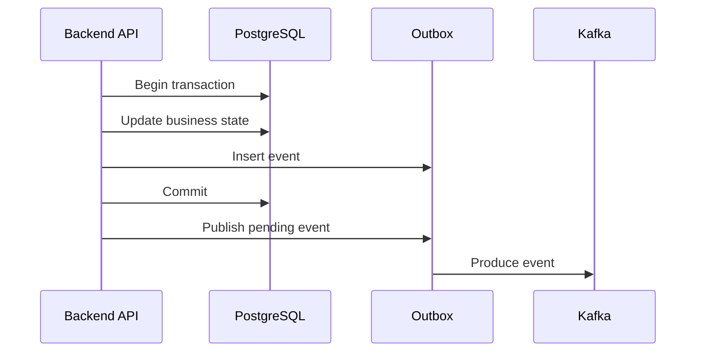

# 26- Common SQL Misconceptions

## Overview

SQL is often learned through rules that are useful initially but become misleading when applied without context. Production SQL requires reasoning about **semantics, cardinality, execution plans, concurrency, storage, security, and workload characteristics**.

Common misconceptions include:

- An index always makes a query faster.
- A sequential scan is always bad.
- `NULL` means zero or an empty string.
- `NOT IN` and `NOT EXISTS` are always equivalent.
- `DISTINCT` fixes duplicate rows.
- `JOIN` and `EXISTS` are interchangeable.
- `GROUP BY` and window functions do the same thing.
- `COUNT(*)` and `COUNT(column)` are equivalent.
- Normalization is always better.
- More database connections increase throughput.
- A read replica provides strong consistency.
- Replication automatically means high availability.
- Redis should replace database reads whenever possible.
- ORM usage means SQL knowledge is unnecessary.
- Transactions automatically make distributed operations atomic.
- Application validation can replace database constraints.
- SQL injection is solved by escaping strings.
- `EXPLAIN` and `EXPLAIN ANALYZE` are equivalent.
- A fast individual query means the endpoint is fast.
- More workers always improve database throughput.

A senior backend engineer should replace these absolute rules with:

```text
What is the requirement?
        ↓
What is the data/result grain?
        ↓
What are the correctness constraints?
        ↓
How does PostgreSQL execute it?
        ↓
How does concurrency affect it?
        ↓
How does it behave at production scale?
```

---

## SQL Is Not Just a Programming Language

SQL describes the desired result or data operation. The database engine determines an execution strategy.

For example:

```sql
SELECT id, email
FROM users
WHERE email = $1;
```

does not mean:

```text
Always use an index.
```

The database optimizer may choose among multiple access paths.

```text
SQL
 ↓
Parse
 ↓
Analyze / Rewrite
 ↓
Plan
 ↓
Execute
```

The same SQL can therefore behave differently as:

- Data volume changes.
- Statistics change.
- Indexes change.
- PostgreSQL configuration changes.
- Hardware changes.
- Parameter values change.
- Concurrent workload changes.

---

## Misconception: SQL Is Executed Exactly in Written Order

A query is written approximately as:

```sql
SELECT ...
FROM ...
WHERE ...
GROUP BY ...
HAVING ...
ORDER BY ...
LIMIT ...
```

but SQL has a **logical processing order** that differs from its textual order.

A useful conceptual model is:

```text
FROM / JOIN
    ↓
WHERE
    ↓
GROUP BY
    ↓
HAVING
    ↓
SELECT
    ↓
DISTINCT
    ↓
ORDER BY
    ↓
LIMIT / OFFSET
```

This explains why aggregate expressions cannot normally be used directly in `WHERE`.

The physical execution plan is a separate concern. PostgreSQL may reorder or transform operations when semantics allow it.

### Senior perspective

Do not confuse:

```text
logical SQL semantics
```

with:

```text
physical execution strategy
```

---

## Misconception: `NULL` Means Zero

`NULL` generally represents an absent, unknown, or inapplicable value.

These are different:

```text
NULL
0
''
FALSE
```

For example:

```text
discount = NULL
```

does not necessarily mean:

```text
discount = 0
```

If `NULL` means "discount not calculated," replacing it with zero changes business semantics.

Use:

```sql
COALESCE(discount, 0)
```

only when zero is actually the intended interpretation.

---

## Misconception: `NULL = NULL` Is True

It is not.

```sql
NULL = NULL
```

produces `UNKNOWN`.

Use:

```sql
WHERE deleted_at IS NULL
```

instead of:

```sql
WHERE deleted_at = NULL
```

PostgreSQL also provides:

```sql
IS DISTINCT FROM
IS NOT DISTINCT FROM
```

when null-safe comparison semantics are required.

For example:

```sql
WHERE previous_value IS DISTINCT FROM current_value;
```

treats two `NULL` values as not distinct.

---

## Misconception: `NULL` Is an Ordinary Boolean Value

SQL uses three-valued logic:

| Result | Meaning |
|---|---|
| `TRUE` | Predicate matches |
| `FALSE` | Predicate does not match |
| `UNKNOWN` | Predicate cannot be determined |

`WHERE` retains rows only when the predicate evaluates to `TRUE`.

This explains behavior such as:

```sql
WHERE email <> 'admin@example.com'
```

not automatically including rows where `email` is `NULL`.

---

## Misconception: `NOT IN` and `NOT EXISTS` Are Always Equivalent

They can differ when `NULL` is involved.

Potentially problematic:

```sql
SELECT id
FROM customers
WHERE id NOT IN (
    SELECT customer_id
    FROM orders
);
```

If the subquery contains `NULL`, SQL's three-valued logic can produce unexpected results.

For existence semantics, use:

```sql
SELECT c.id
FROM customers AS c
WHERE NOT EXISTS (
    SELECT 1
    FROM orders AS o
    WHERE o.customer_id = c.id
);
```

The important distinction is semantic:

```text
NOT IN
    → membership comparison

NOT EXISTS
    → existence test
```

Do not claim that `NOT EXISTS` is always faster. The optimizer and data distribution determine actual performance.

---

## Misconception: `COUNT(*)` and `COUNT(column)` Are the Same

They are not.

```sql
COUNT(*)
```

counts rows.

```sql
COUNT(email)
```

counts non-`NULL` values of `email`.

Given:

```text
id | email
---+-----------------
1  | a@example.com
2  | NULL
3  | b@example.com
```

the results are:

```text
COUNT(*)      = 3
COUNT(email)  = 2
```

This distinction becomes particularly important with `LEFT JOIN`.

---

## Misconception: `COUNT(*)` Is Wrong With `LEFT JOIN`

Consider:

```sql
SELECT
    c.id,
    COUNT(o.id) AS order_count
FROM customers AS c
LEFT JOIN orders AS o
    ON o.customer_id = c.id
GROUP BY c.id;
```

`COUNT(o.id)` returns zero when no order exists.

Using:

```sql
COUNT(*)
```

counts the preserved customer row produced by the `LEFT JOIN`, so customers with no orders can receive a count of `1`.

The correct aggregate depends on what is being counted.

---

## Misconception: `DISTINCT` Fixes Duplicate Data

`DISTINCT` removes duplicate result rows.

It does not repair an incorrect join.

Suppose:

```text
customer
   ↓
orders
```

and a customer has five orders.

A join naturally produces five rows.

If the requirement is:

```text
one row per customer
```

then blindly adding:

```sql
DISTINCT
```

may hide the underlying cardinality problem.

If the actual requirement is existence:

```sql
SELECT c.id
FROM customers AS c
WHERE EXISTS (
    SELECT 1
    FROM orders AS o
    WHERE o.customer_id = c.id
);
```

expresses that requirement more directly.

---

## Misconception: `DISTINCT` Is a Free Operation

Duplicate elimination can require:

```text
sorting
or
hashing
```

which can consume:

- CPU.
- Memory.
- Temporary disk.
- Execution time.

Do not use:

```sql
SELECT DISTINCT ...
```

as a generic performance or correctness fix.

First determine why duplicates exist.

---

## Misconception: A `JOIN` Always Produces One Row Per Left-Side Row

A join preserves the relationship defined by its predicates.

If:

```text
customer 42 → 10 orders
```

then:

```sql
SELECT c.id, o.id
FROM customers AS c
JOIN orders AS o
    ON o.customer_id = c.id;
```

produces ten rows for that customer.

The result grain is:

```text
one row per customer-order relationship
```

not:

```text
one row per customer
```

### Senior rule

Always define the expected result grain before writing complex joins.

---

## Misconception: `LEFT JOIN` and `INNER JOIN` Differ Only in Performance

They differ primarily in semantics.

`INNER JOIN`:

```text
Only matching rows survive.
```

`LEFT JOIN`:

```text
Every left-side row survives.
Matching right-side values are attached when available.
```

This becomes important when filtering the right-hand table.

For example:

```sql
SELECT c.id, o.id
FROM customers AS c
LEFT JOIN orders AS o
    ON o.customer_id = c.id
WHERE o.status = 'completed';
```

The `WHERE` condition removes rows where `o.status` is `NULL`.

This can make the query behave like an inner join for that condition.

---

## Misconception: `WHERE` and `HAVING` Are Interchangeable

`WHERE` filters input rows.

```sql
WHERE status = 'completed'
```

`HAVING` filters groups after aggregation.

```sql
HAVING COUNT(*) >= 10
```

Correct:

```sql
SELECT customer_id, COUNT(*)
FROM orders
WHERE status = 'completed'
GROUP BY customer_id
HAVING COUNT(*) >= 10;
```

Think:

```text
WHERE  → which rows participate?
HAVING → which groups survive?
```

---

## Misconception: `GROUP BY` and Window Functions Are Equivalent

`GROUP BY` changes result cardinality.

```sql
SELECT
    customer_id,
    SUM(amount)
FROM orders
GROUP BY customer_id;
```

produces:

```text
one row per customer
```

A window function preserves rows:

```sql
SELECT
    customer_id,
    order_id,
    amount,
    SUM(amount) OVER (
        PARTITION BY customer_id
    ) AS customer_total
FROM orders;
```

produces:

```text
one row per order
+
customer-level total
```

### Rule

```text
GROUP BY
    → collapse rows

Window function
    → calculate across rows while preserving row detail
```

---

## Misconception: `ROW_NUMBER()`, `RANK()`, and `DENSE_RANK()` Are the Same

They differ when values tie.

Given:

```text
100
100
90
```

results are:

| Function | Result |
|---|---|
| `ROW_NUMBER()` | `1, 2, 3` |
| `RANK()` | `1, 1, 3` |
| `DENSE_RANK()` | `1, 1, 2` |

Choose based on business semantics rather than memorizing syntax.

---

## Misconception: `ORDER BY` Is Optional When the Database Usually Returns Rows in Order

Without `ORDER BY`, SQL does not guarantee result ordering.

This:

```sql
SELECT *
FROM orders
LIMIT 20;
```

does not guarantee which 20 rows are returned.

For deterministic API pagination:

```sql
SELECT id, created_at
FROM orders
ORDER BY created_at DESC, id DESC
LIMIT 20;
```

The secondary key is important when timestamps can be equal.

---

## Misconception: `LIMIT 1` Means "Give Me the Correct One"

`LIMIT 1` means:

```text
Return at most one row.
```

It does not define which matching row should win.

Incorrect:

```sql
SELECT *
FROM orders
WHERE customer_id = $1
LIMIT 1;
```

If the requirement is the newest order:

```sql
SELECT *
FROM orders
WHERE customer_id = $1
ORDER BY created_at DESC, id DESC
LIMIT 1;
```

The ordering expresses the business rule.

---

## Misconception: `OFFSET` Pagination Always Scales

This:

```sql
SELECT *
FROM orders
ORDER BY id
LIMIT 50 OFFSET 500000;
```

can become increasingly expensive because the database may need to walk past a large number of rows.

Keyset pagination can provide more stable behavior:

```sql
SELECT id, created_at
FROM orders
WHERE (created_at, id) < ($1, $2)
ORDER BY created_at DESC, id DESC
LIMIT 50;
```

supported by an appropriate index.

### Use offset when

- Dataset size is modest.
- Direct page navigation is required.
- Deep pagination is uncommon.

### Use keyset when

- Tables are large.
- Clients traverse pages sequentially.
- Stable deep-page latency matters.

---

## Misconception: An Index Always Makes a Query Faster

Indexes have a cost.

They consume:

- Storage.
- Write I/O.
- WAL.
- Maintenance resources.
- Vacuum work.
- Backup space.
- Replication bandwidth.

An index can also be slower than a sequential scan when a query needs a large percentage of a table.

The optimizer decides whether an index path is worthwhile.

---

## Misconception: A Sequential Scan Means the Index Is Missing

A sequential scan can be the correct plan.

For example, if a query needs most rows:

```text
Sequentially read table
```

can be cheaper than:

```text
Index lookup
→ many table fetches
→ random I/O
```

The correct diagnostic question is:

> Is the chosen access path expensive for this workload?

Use:

```sql
EXPLAIN (ANALYZE, BUFFERS)
SELECT *
FROM orders
WHERE status = 'completed';
```

---

## Misconception: The Optimizer Should Always Use an Available Index

PostgreSQL chooses an execution plan based on estimated cost.

Factors include:

```text
selectivity
statistics
table size
data distribution
correlation
available indexes
ordering requirements
join strategy
CPU cost
I/O cost
parallelism
```

Therefore:

```text
Index exists
≠
Index must be used
```

---

## Misconception: More Indexes Always Improve Performance

Indexes improve some reads while making writes more expensive.

For each write, relevant indexes may need maintenance.

A high-write table with many indexes can experience:

```text
more write work
→ more WAL
→ more I/O
→ more storage
→ more maintenance
```

Index design is a workload trade-off.

---

## Misconception: Index Selectivity Alone Determines Composite Index Order

A common simplified rule is:

> Put the most selective column first.

That is incomplete.

For:

```sql
WHERE tenant_id = $1
  AND status = $2
ORDER BY created_at DESC
```

the optimal index depends on:

- Equality predicates.
- Range predicates.
- Ordering.
- Query frequency.
- Data distribution.
- Tenant size.
- Existing indexes.
- Write workload.

Design indexes around the **complete access pattern**, not one isolated rule.

---

## Misconception: Every Foreign Key Automatically Has an Index

A foreign key enforces referential integrity.

It does not necessarily create the index needed for every access pattern on the referencing column.

For example:

```sql
CREATE INDEX orders_customer_id_idx
ON orders (customer_id);
```

may be useful for:

```text
customer → orders
```

queries and can also reduce the cost of certain parent-row updates/deletes.

Always inspect actual indexes rather than assuming they exist.

---

## Misconception: `LIKE` Is Always Slow

Pattern matching performance depends on the pattern and index/operator support.

For example:

```sql
WHERE email LIKE 'admin%'
```

has different optimization opportunities from:

```sql
WHERE email LIKE '%admin%'
```

The leading wildcard makes ordinary B-tree prefix matching less applicable.

For search-heavy workloads, PostgreSQL features such as trigram indexes may be more appropriate.

The correct solution depends on search semantics and workload.

---

## Misconception: `SELECT *` Is Harmless

Selecting unnecessary columns can increase:

- Database I/O.
- Network transfer.
- Application memory.
- Serialization cost.
- Cache size.

Prefer:

```sql
SELECT id, email, created_at
FROM users
WHERE id = $1;
```

when the API only needs those fields.

This becomes particularly important for wide tables.

---

## Misconception: `LIMIT` Automatically Makes a Query Cheap

Consider:

```sql
SELECT *
FROM events
WHERE expensive_predicate
LIMIT 10;
```

The database may still need to inspect many rows before finding ten matches.

Performance depends on:

```text
predicate selectivity
access path
ordering
data distribution
statistics
```

`LIMIT` reduces output size; it does not guarantee low execution cost.

---

## Misconception: `EXPLAIN` and `EXPLAIN ANALYZE` Are the Same

`EXPLAIN` shows an estimated plan.

```sql
EXPLAIN
SELECT ...
```

`EXPLAIN ANALYZE` executes the query and reports actual behavior.

```sql
EXPLAIN (ANALYZE, BUFFERS)
SELECT ...
```

Important fields include:

```text
Planning Time
Execution Time
actual rows
actual time
loops
Buffers
Rows Removed by Filter
```

Be careful with:

```sql
EXPLAIN ANALYZE
UPDATE ...
```

because the update actually executes.

---

## Misconception: `EXPLAIN` Cost Is Measured in Milliseconds

Plan costs are optimizer estimates, not direct wall-clock milliseconds.

For example:

```text
cost=100.00..500.00
```

does not mean:

```text
100 ms → 500 ms
```

Use actual execution metrics from:

```sql
EXPLAIN (ANALYZE, BUFFERS)
```

when you need runtime evidence.

---

## Misconception: The Lowest-Cost Plan Is Always the Fastest in Production

The optimizer works with estimates and cost parameters.

If cardinality estimates are wrong, the selected plan may also be poor.

For example:

```text
estimated rows = 10
actual rows    = 1,000,000
```

can lead to a fundamentally inappropriate join strategy.

Senior query troubleshooting examines:

```text
estimated rows
actual rows
loops
buffers
I/O
CPU
waits
```

rather than looking only at the headline scan type.

---

## Misconception: CTEs Are Always Faster

CTEs are primarily a query-structuring mechanism.

Modern PostgreSQL can inline eligible CTEs, while explicit materialization can change execution behavior.

Use CTEs when they improve:

- Readability.
- Query structure.
- Recursive processing.
- Deliberate materialization semantics.

Then validate performance with the execution plan.

---

## Misconception: Subqueries Are Always Slow

Subquery performance depends on:

```text
correlation
cardinality
indexes
optimizer transformations
data distribution
```

For example:

```sql
WHERE EXISTS (...)
```

can be an efficient expression of existence semantics.

Do not replace every subquery with a join merely because it "looks faster."

Choose the structure that correctly expresses the requirement and then inspect the plan.

---

## Misconception: `EXISTS` Is Always Faster Than `JOIN`

This is another common interview myth.

`EXISTS` expresses:

```text
Does at least one related row exist?
```

A `JOIN` expresses:

```text
Combine rows from two relations.
```

PostgreSQL can transform semantically related queries into similar execution strategies.

The strongest answer is:

> Choose the construct based on semantics first, then validate the resulting plan and workload behavior.

---

## Misconception: `UNION` and `UNION ALL` Are Interchangeable

`UNION` removes duplicates.

```sql
SELECT email FROM customers
UNION
SELECT email FROM leads;
```

`UNION ALL` preserves all rows.

```sql
SELECT email FROM customers
UNION ALL
SELECT email FROM leads;
```

If duplicates are valid, `UNION ALL` avoids unnecessary duplicate elimination.

---

## Misconception: Normalization Is Always Better

Normalization reduces:

- Data duplication.
- Update anomalies.
- Inconsistent copies of facts.

But some read-heavy workloads may benefit from deliberate denormalization.

A production approach is:

```text
Start with a correct model
        ↓
Measure workload
        ↓
Identify bottleneck
        ↓
Denormalize deliberately if justified
        ↓
Define consistency strategy
```

Denormalization introduces additional write and consistency complexity.

---

## Misconception: Denormalization Is Just a Performance Optimization

Denormalization changes the data model.

If the same business fact exists in multiple places:

```text
source value
    ↓
derived copy
```

the system now needs a synchronization strategy.

That can involve:

```text
transactional updates
events
CDC
background jobs
materialized views
reconciliation
```

Therefore, denormalization is an architectural decision, not merely an index replacement.

---

## Misconception: Application Validation Is Enough

This is unsafe under concurrency:

```python
if not User.objects.filter(email=email).exists():
    User.objects.create(email=email)
```

Two requests can pass the check concurrently.

A database constraint provides the actual invariant:

```sql
CREATE UNIQUE INDEX users_email_idx
ON users (email);
```

The application should handle the resulting uniqueness violation appropriately.

---

## Misconception: Transactions Automatically Make Everything Atomic

A PostgreSQL transaction can atomically group database operations:

```text
BEGIN
    update order
    insert payment
COMMIT
```

But external systems are separate:

```text
Kafka
Redis
HTTP APIs
email providers
object storage
```

They do not automatically participate in the PostgreSQL transaction.

For database state plus event publication, a transactional outbox is a common architecture:



---

## Misconception: A Transaction Should Enclose the Entire Request

A request may involve:

```text
database
HTTP API
Kafka
Redis
slow computation
```

Keeping a database transaction open across all of them can increase:

- Lock duration.
- Connection usage.
- MVCC cleanup pressure.
- Failure scope.
- Tail latency.

Prefer:

```text
short transaction
+
small critical section
```

and use an outbox or workflow pattern for external side effects.

---

## Misconception: `SELECT` Followed by `UPDATE` Is Automatically Safe

Consider:

```text
SELECT balance
calculate
UPDATE balance
```

Concurrent requests can read the same value and overwrite one another.

Prefer atomic database operations where possible:

```sql
UPDATE accounts
SET balance = balance - $1
WHERE id = $2
  AND balance >= $1;
```

Then inspect the affected row count.

For more complex invariants, use appropriate:

```text
constraints
transactions
row locks
optimistic concurrency
```

---

## Misconception: `SELECT FOR UPDATE` Solves All Concurrency Problems

`SELECT FOR UPDATE` is useful when a transaction needs to lock selected rows before modifying related state.

But it can also create:

```text
lock contention
deadlocks
long waits
connection pool pressure
```

The lock is held according to transaction semantics.

A production transaction should therefore keep the critical section short.

---

## Misconception: More Connections Mean More Throughput

PostgreSQL has finite:

```text
CPU
memory
I/O
lock capacity
```

More application connections can increase concurrency but also increase:

```text
context switching
memory consumption
queueing
lock contention
```

Connection pools should control concurrency rather than blindly maximizing connections.

---

## Misconception: More Workers Always Improve Database Throughput

Suppose many Celery workers update the same row:

```text
Worker A ─┐
Worker B ─┼──→ same database row
Worker C ─┘
```

The database must serialize conflicting operations.

Adding more workers can therefore increase waiting rather than throughput.

Senior capacity planning considers:

```text
database CPU
connection budget
lock contention
query latency
worker concurrency
```

together.

---

## Misconception: Deadlocks and Lock Contention Are the Same

They are related but different.

Contention:

```text
A waits for B
```

Deadlock:

```text
A waits for B
B waits for A
```

PostgreSQL detects deadlocks and aborts one transaction.

Production mitigation includes:

- Consistent lock ordering.
- Short transactions.
- Reduced lock scope.
- Bounded retries.
- Exponential backoff.
- Jitter.
- Idempotent transaction logic.

---

## Misconception: `SKIP LOCKED` Is a General Locking Solution

`SKIP LOCKED` is useful for queue-like workloads:

```sql
SELECT id
FROM jobs
WHERE status = 'pending'
ORDER BY id
FOR UPDATE SKIP LOCKED
LIMIT 100;
```

It allows workers to skip rows currently locked by another worker.

But it changes semantics.

A row can be skipped temporarily, so it is not appropriate when strict ordering or immediate processing visibility is required.

---

## Misconception: Isolation Levels Replace Constraints

Isolation controls transaction visibility and concurrency behavior.

It does not automatically express every business invariant.

For:

```text
only one active subscription per customer
```

a partial unique index can directly enforce the invariant:

```sql
CREATE UNIQUE INDEX subscriptions_one_active_idx
ON subscriptions (customer_id)
WHERE status = 'active';
```

Use the appropriate combination of:

```text
constraints
atomic statements
transactions
locking
isolation
```

---

## Misconception: Read Replicas Provide Strongly Consistent Reads

With asynchronous replication:

```text
Primary
   ↓ WAL
Replica
```

the replica can lag.

A request can therefore perform:

```text
POST → primary
GET  → replica
```

and the GET may not immediately see the write.

For read-after-write requirements, consider:

- Reading from the primary.
- Session/request-level routing.
- LSN-aware routing where appropriate.
- Carefully defined consistency semantics.

---

## Misconception: Replication Automatically Means High Availability

Replication can provide a failover candidate, but HA also requires:

```text
failure detection
promotion
fencing
stable endpoints
connection recovery
retry handling
backup/recovery
```

A replica that merely receives WAL is not automatically a complete HA system.

---

## Misconception: Read Replicas Scale Writes

Read replicas primarily scale read workload.

The primary still processes the corresponding writes:

```text
writes → primary
reads  → replicas
```

Replication itself also consumes resources.

If write capacity is the bottleneck, adding more read replicas may not solve the problem.

---

## Misconception: Redis Should Replace PostgreSQL for Fast Reads

Redis and PostgreSQL solve different problems.

Redis is useful for:

```text
cache
rate limiting
ephemeral state
coordination
```

PostgreSQL provides:

```text
durable relational state
transactions
constraints
queries
```

A cache should normally have a defined source of truth and failure strategy.

---

## Misconception: Cache Hits Guarantee Correct Data

A cache can contain:

```text
stale data
incorrectly scoped data
expired data
cross-tenant data if keys are badly designed
```

A production cache design should define:

```text
source of truth
cache key
TTL
invalidation
failure behavior
tenant/resource scope
```

Caching is a consistency decision as much as a performance decision.

---

## Misconception: ORM Usage Eliminates the Need to Know SQL

Django:

```python
Order.objects.filter(
    customer_id=customer_id,
    status="completed",
)
```

and SQLAlchemy eventually result in database operations.

Backend engineers should understand:

```text
ORM expression
    ↓
generated SQL
    ↓
parameters
    ↓
execution plan
    ↓
database behavior
```

ORMs improve developer productivity, but they do not remove:

- N+1 problems.
- Bad joins.
- Missing indexes.
- Large result sets.
- Lock contention.
- Poor transaction boundaries.

---

## Misconception: `select_related()` or `prefetch_related()` Automatically Fix Every ORM Performance Problem

They address specific relationship-loading patterns.

For example:

```python
orders = Order.objects.select_related("customer")
```

can avoid some N+1 queries for a foreign-key relationship.

But excessive eager loading can produce:

```text
large joins
large result sets
high memory usage
unnecessary database work
```

Use ORM loading strategies according to the access pattern and validate the resulting query workload.

---

## Misconception: N+1 Means One Query Is Slow

An N+1 problem can consist of thousands of individually fast queries:

```text
1 query → customers
N queries → orders
```

For example:

```text
1 × 5 ms
+
5,000 × 2 ms
```

can still create severe endpoint latency and database load.

Measure:

```text
query count
query frequency
aggregate database time
connection usage
```

not only individual query latency.

---

## Misconception: SQL Injection Is Solved by Escaping Strings

The preferred defense is parameterized queries.

Unsafe:

```python
query = f"""
SELECT id
FROM users
WHERE email = '{email}'
"""
```

Safer:

```python
cursor.execute(
    """
    SELECT id
    FROM users
    WHERE email = %s
    """,
    (email,),
)
```

Escaping is easy to misuse and should not replace proper parameter binding.

---

## Misconception: Parameterization Makes All Dynamic SQL Safe

Parameter binding protects values.

It does not mean arbitrary identifiers can be passed as ordinary values.

Potentially dynamic SQL elements include:

```text
table names
column names
sort fields
operators
schema names
```

For dynamic structure, use:

```text
strict allowlists
safe identifier composition
controlled query templates
```

rather than string interpolation.

---

## Misconception: Application Authorization Is Enough

A backend can correctly authenticate a user while still issuing an unsafe query.

For multi-tenant data:

```sql
SELECT *
FROM orders
WHERE id = $1;
```

may not be sufficient.

The query or database authorization model may need:

```sql
WHERE tenant_id = $1
  AND id = $2
```

or appropriate Row Level Security.

Security is a system property spanning:

```text
authentication
authorization
database permissions
RLS
application logic
```

---

## Misconception: RLS Replaces All Authorization

Row Level Security can enforce row visibility at the database layer.

It does not automatically implement every business permission.

For example:

```text
RLS:
    user may access tenant rows

Application authorization:
    user may approve refunds
```

These are different concerns.

Use layered authorization rather than assuming one mechanism handles everything.

---

## Misconception: Database Constraints Are Optional Because the Application Validates Data

Application validation can improve user experience.

Database constraints protect integrity under:

```text
concurrency
multiple application instances
background workers
scripts
admin operations
other services
```

Important invariants should be enforced where appropriate with:

```text
PRIMARY KEY
UNIQUE
FOREIGN KEY
CHECK
NOT NULL
partial unique indexes
```

---

## Misconception: A Unique Application Check Guarantees Uniqueness

This is unsafe:

```text
check
  ↓
if missing
  ↓
insert
```

because two requests can execute the check concurrently.

Instead:

```text
database unique constraint
        +
application error handling
```

provides both correctness and good API behavior.

---

## Misconception: A Fast Query Means a Fast API

API latency can be:

```text
Nginx
 ↓
application
 ↓
connection acquisition
 ↓
database
 ↓
Redis
 ↓
external service
 ↓
serialization
```

A 2 ms SQL query does not imply a 2 ms endpoint.

Measure the complete request path.

---

## Misconception: A Slow Query Is Always a Query Optimization Problem

A query can be slow because it is:

```text
executing
```

or because it is:

```text
waiting
```

Potential causes include:

- Lock contention.
- Connection pool exhaustion.
- CPU saturation.
- I/O saturation.
- Replica lag.
- Network latency.
- Long transactions.
- Resource throttling.

Use PostgreSQL activity and infrastructure metrics to distinguish execution from waiting.

---

## Misconception: High Database CPU Means One Bad Query

Database CPU can be caused by:

```text
one expensive query
many moderately expensive queries
N+1
retry storms
large aggregations
sorting
JSON processing
maintenance
high concurrency
```

Useful evidence includes:

```sql
SELECT
    pid,
    state,
    wait_event_type,
    wait_event,
    query
FROM pg_stat_activity
WHERE datname = current_database();
```

and query-level statistics such as `pg_stat_statements`.

Think in terms of **aggregate workload**, not only individual statements.

---

## Misconception: High Database Memory Means the Database Is Unhealthy

Memory usage must be interpreted in context.

Relevant questions include:

```text
Is memory available?
Is swap being used?
Is the container approaching its limit?
Are queries spilling to disk?
Are connections excessive?
Is latency increasing?
Is the system OOM-killing processes?
```

PostgreSQL memory can come from:

```text
shared_buffers
work_mem
maintenance_work_mem
backend/session memory
OS page cache
```

Increasing memory settings without considering concurrency can make an incident worse.

---

## Misconception: `work_mem` Is Allocated Once Per Database

`work_mem` applies to operations and can be consumed multiple times within a query and across concurrent sessions.

For example:

```text
100 concurrent queries
×
multiple sort/hash operations
×
work_mem
```

can produce substantially more memory consumption than the nominal setting suggests.

Tune memory with concurrency in mind.

---

## Misconception: More Connection Pooling Always Improves Performance

Pooling reduces connection establishment overhead and can stabilize database access.

But an oversized pool can create:

```text
too much concurrency
memory pressure
CPU contention
lock contention
queueing
```

The goal is not:

```text
maximum connections
```

but:

```text
useful database concurrency
```

---

## Misconception: A Larger `max_connections` Solves Connection Problems

Increasing:

```text
max_connections
```

may allow more clients to connect, but it does not increase:

```text
CPU
memory
I/O
```

It can also increase backend memory pressure.

Connection pooling and workload control are generally better solutions than simply increasing the limit.

---

## Misconception: Large Deletes Are Just Normal DML

Deleting millions of rows can produce:

```text
large transactions
WAL
dead tuples
vacuum work
replication lag
I/O pressure
lock/resource contention
```

For retention-heavy workloads, consider:

```text
batch deletion
partitioning
partition detach/drop
archival
```

based on the lifecycle requirements.

---

## Misconception: Large Backfills Should Be One Transaction

A massive update such as:

```sql
UPDATE customers
SET normalized_email = LOWER(email);
```

can create substantial production impact.

Prefer:

```text
indexed batches
+
short transactions
+
durable progress
+
throttling
+
monitoring
```

A restartable backfill is generally more operationally robust than a single enormous transaction.

---

## Misconception: Database Migrations Are Only Schema Changes

A production migration can affect:

```text
schema
application versions
workers
Kafka consumers
Celery jobs
Redis caches
replicas
backups
monitoring
rollback procedures
```

Safe migrations therefore often use:

```text
expand
→ deploy compatible application
→ backfill
→ validate
→ switch
→ contract
```

This is especially important for zero-downtime deployments.

---

## Misconception: Adding a Column Is Always Safe

Adding a column can be straightforward, but risk depends on:

```text
default behavior
constraints
table size
database version
application compatibility
lock requirements
backfill strategy
```

A safer large-table pattern is often:

```text
add nullable column
    ↓
deploy compatible code
    ↓
backfill incrementally
    ↓
validate
    ↓
enforce constraint
```

---

## Misconception: Dropping a Column Is Easy to Roll Back

A destructive schema change can remove information that a rollback requires.

A safer deployment sequence is:

```text
stop reading
    ↓
stop writing
    ↓
deploy compatible versions
    ↓
observe
    ↓
remove schema later
```

Backups and PITR provide recovery options, but they are not the same as an instant application rollback.

---

## Misconception: Partitioning Automatically Makes Queries Faster

Partitioning can improve:

- Partition pruning.
- Data lifecycle operations.
- Maintenance isolation.
- Large-table management.

But a poor partition key can provide little benefit.

Partitioning also introduces:

```text
more objects
more maintenance
partition-count concerns
planning complexity
constraint/index considerations
```

Partition based on actual access and lifecycle patterns.

---

## Misconception: Partitioning and Sharding Are the Same

Partitioning generally keeps data within one database:

```text
logical table
 ├── partition A
 ├── partition B
 └── partition C
```

Sharding distributes data across separate database nodes or clusters:

```text
logical dataset
 ├── shard A
 ├── shard B
 └── shard C
```

Sharding introduces additional complexity around:

```text
routing
cross-shard queries
transactions
rebalancing
schema changes
failure handling
```

---

## Misconception: Replication Is a Backup

A replica can contain the same logical mistake as the primary.

For example:

```text
accidental DELETE
    ↓
primary
    ↓
replication
    ↓
replica
```

A replica therefore does not replace:

```text
backups
PITR
retention
restore testing
```

Replication and backup solve different problems.

---

## Misconception: Backups Are Useful Only If They Exist

A backup strategy must include recovery validation.

You need confidence that:

```text
backup exists
    ↓
backup is readable
    ↓
restore works
    ↓
required recovery point is available
    ↓
application can operate after restore
```

Regular restore testing is part of production database reliability.

---

## Misconception: Asynchronous Processing Removes Database Load

Moving work to Celery or Kafka changes when and where work executes.

It does not automatically make the work cheaper.

For example:

```text
API
 ↓
Kafka
 ↓
consumer
 ↓
PostgreSQL
```

still produces database workload.

Asynchronous processing is useful for:

- Decoupling.
- Smoothing traffic.
- Background processing.
- Retryable workflows.

But consumers still need:

```text
bounded concurrency
idempotency
backpressure
database-aware batching
```

---

## Misconception: Kafka Guarantees Database Exactly-Once Business Effects

Kafka can provide strong delivery and processing semantics, but external database effects still require careful design.

A consumer may process a message and then fail before recording its completion state.

Production consumers commonly need:

```text
idempotent writes
unique event IDs
deduplication
transactional database updates
offset management
retries
dead-letter handling
```

"Exactly once" should therefore be discussed as an end-to-end business property, not merely a broker feature.

---

## Misconception: Retries Are Always Good for Reliability

Retries can improve resilience for transient failures.

Uncontrolled retries can create retry storms:

```text
database slows
    ↓
requests timeout
    ↓
clients retry
    ↓
more database load
    ↓
database slows further
```

Use:

```text
bounded retries
exponential backoff
jitter
timeouts
idempotency
circuit breaking where appropriate
```

---

## Misconception: A Timeout Means the Operation Did Not Commit

A network failure can occur after the database commits but before the application receives the response.

Therefore:

```text
client timeout
≠
transaction definitely rolled back
```

This is especially important for:

```text
payments
orders
provisioning
external side effects
```

Use idempotency keys or another durable deduplication strategy when retries are possible.

---

## Misconception: SQL Performance Can Be Determined From Syntax Alone

Two syntactically similar queries can perform differently.

Two syntactically different queries can produce nearly identical execution plans.

Performance depends on:

```text
query
+
schema
+
indexes
+
statistics
+
data distribution
+
parameters
+
concurrency
+
hardware
```

Use execution plans and workload evidence instead of syntax-based assumptions.

---

## Misconception: Development Data Is Good Enough for Performance Testing

A query that performs well against:

```text
100,000 rows
```

may behave very differently against:

```text
500 million rows
```

Production-scale testing should consider:

- Data volume.
- Data distribution.
- Indexes.
- Concurrency.
- Query frequency.
- Hardware.
- Cache state.

Synthetic tests should be representative rather than merely large.

---

## Misconception: Query Optimization Is Complete Once the Query Is Fast

Optimization should be treated as an ongoing production concern.

Data changes:

```text
row counts
distribution
tenant sizes
query frequency
workload mix
```

Therefore, a previously good plan can become poor.

Monitor:

```text
query latency
execution count
total database time
plan changes
CPU
I/O
locks
replica lag
```

---

## Misconception: SQL Security and SQL Performance Are Separate Concerns

A query can be fast and insecure.

For example:

```sql
SELECT *
FROM orders
WHERE id = $1;
```

may be efficient while still exposing another tenant's order if authorization is missing.

Likewise, adding security logic can affect query planning and indexing.

Production SQL must balance:

```text
correctness
security
performance
reliability
operability
```

---

## Misconception: Least Privilege Means Giving the Application Read-Only Access

A normal backend often needs to perform controlled writes.

The principle is:

> Give each workload only the permissions it actually requires.

A production system may separate:

```text
runtime role
read-only role
migration role
owner role
administrative role
```

The application should generally not run as a superuser or unrestricted owner role.

---

## Misconception: Database Ownership and Runtime Access Should Be the Same

Ownership is powerful.

A better separation can be:

```text
migration/owner role
        ↓
owns database objects

runtime role
        ↓
uses explicitly granted privileges
```

This limits the blast radius of application credential compromise.

---

## Misconception: `PUBLIC` Privileges Are Harmless

PostgreSQL has a `PUBLIC` pseudo-role representing all roles.

Unnecessary privileges granted to `PUBLIC` can broaden access unexpectedly.

Review:

```text
database privileges
schema privileges
table privileges
function privileges
default privileges
```

Use explicit grants wherever practical.

---

## Misconception: `ALTER DEFAULT PRIVILEGES` Changes Existing Objects

Default privileges affect objects created in the future by the relevant object-creating role.

They are not a retroactive permission migration for existing objects.

For existing objects, use explicit:

```sql
GRANT ...
```

and treat default privileges as part of future object lifecycle management.

---

## Misconception: Database Roles Are the Same as Application Users

A PostgreSQL role answers:

```text
What can this database session do?
```

An application user answers:

```text
Who is making this business request?
```

They are different identity layers.

A single application database role may serve many authenticated application users while application authorization determines which resources each user can access.

---

## Misconception: Read-Only Database Access and Read Replicas Are the Same

A read-only role is an authorization mechanism.

A read replica is an architectural mechanism for:

```text
read scaling
workload isolation
HA/DR
```

They can be used together:

```text
read-only role
      +
read replica
```

---

## Misconception: UUIDs Automatically Make APIs Secure

UUIDs can make identifiers harder to guess than sequential IDs in some scenarios.

But:

```text
hard-to-guess ID
≠
authorization
```

An API must still verify resource ownership or access permissions.

Security must not depend solely on identifier unpredictability.

---

## Misconception: SQL Injection Is Only a Problem With User Input in `WHERE`

Dynamic SQL can be dangerous in:

```text
WHERE
ORDER BY
table names
column names
schema names
operators
```

For example:

```python
f"ORDER BY {sort}"
```

can be unsafe if `sort` is externally controlled.

Use an allowlist:

```python
SORT_FIELDS = {
    "created": "created_at",
    "email": "email",
}

order_by = SORT_FIELDS.get(sort, "created_at")
```

---

## Misconception: Logging SQL Is Always Safe

SQL logs can contain:

```text
sensitive values
personal information
tokens
identifiers
tenant data
```

Production observability should distinguish:

```text
query structure
parameters
sensitive data
request metadata
```

Prefer parameterized logging, redaction, access-controlled logs, and appropriate retention.

---

## Misconception: More Logging Always Improves Debugging

Excessive database logging can create:

```text
I/O overhead
storage cost
log ingestion cost
signal-to-noise problems
sensitive-data exposure
```

The objective is useful observability, not maximum log volume.

Combine:

```text
structured application logs
database metrics
query statistics
execution plans
traces
audit logs
```

according to the diagnostic requirement.

---

## Misconception: SQL Architecture Is Just Database Schema Design

Production SQL architecture includes:

```text
application
    ↓
connection pool
    ↓
database
    ↓
replicas
    ↓
cache
    ↓
background workers
    ↓
events
    ↓
observability
    ↓
backup / recovery
```

Schema design is one part of the system.

Senior SQL architecture decisions include:

- Workload isolation.
- Connection management.
- Read/write routing.
- Replication.
- Partitioning.
- Sharding.
- Multi-tenancy.
- HA/DR.
- Security.
- Migration strategy.
- Operational cost.

---

## Misconception: The Best SQL Answer Is the Most Complex One

A senior engineer should prefer the simplest design that satisfies:

```text
correctness
performance
security
reliability
scalability
operability
```

Complexity has an ongoing cost.

For example:

```text
PostgreSQL + good indexes
```

may be preferable to:

```text
PostgreSQL
+ Redis
+ Kafka
+ read replicas
+ sharding
```

if the workload does not require those additional components.

---

## Interview Misconception Checklist

| Misconception | Better Answer |
|---|---|
| Indexes always improve queries | Indexes are workload-dependent access paths |
| Seq scan means missing index | Seq scans can be optimal |
| `NULL = NULL` | `NULL` requires null-aware operators |
| `NOT IN` = `NOT EXISTS` | `NULL` can make semantics differ |
| `DISTINCT` fixes duplicates | Fix join/cardinality problems |
| `COUNT(*)` = `COUNT(column)` | `COUNT(column)` ignores `NULL` |
| `WHERE` = `HAVING` | Row filtering vs group filtering |
| `JOIN` = `EXISTS` | Combination vs existence semantics |
| CTEs are faster | Use for structure/semantics; validate plans |
| Window functions aggregate away rows | Windows preserve row detail |
| `LIMIT 1` gives the correct row | `ORDER BY` defines which row |
| Offset pagination always scales | Keyset often scales better for deep traversal |
| More indexes are better | Indexes improve reads but increase write cost |
| More connections mean more throughput | Excess concurrency can reduce throughput |
| More workers always help | Shared resources can become bottlenecks |
| Replica means strong consistency | Async replicas can lag |
| Replica means HA | HA requires failover and recovery mechanisms |
| Redis replaces the database | Redis and PostgreSQL solve different problems |
| ORM removes SQL concerns | ORM still generates and executes SQL |
| Application validation guarantees integrity | Database constraints protect concurrent writes |
| Transactions include Kafka/Redis automatically | External systems need explicit coordination |
| Retry means operation failed | Commit may have occurred before timeout |
| UUID means secure API | Authorization is still required |
| Escaping solves SQL injection | Parameterization is the primary defense |
| Logging everything is safest | Logging must balance diagnostics, privacy, and cost |

---

## Senior SQL Reasoning Framework

When presented with an SQL problem in an interview, use this sequence.

### Start With Semantics

Ask:

```text
What should one row represent?
What does NULL mean?
Are duplicates expected?
What relationships are involved?
```

### Establish Correctness

Check:

```text
joins
constraints
filters
aggregation
authorization
transaction boundaries
```

### Evaluate the Access Pattern

Ask:

```text
Which columns filter?
Which columns join?
Which columns determine ordering?
How selective are predicates?
How large is the dataset?
```

### Inspect Execution

Use:

```sql
EXPLAIN (ANALYZE, BUFFERS)
SELECT ...;
```

and compare:

```text
estimated rows
actual rows
loops
buffers
execution time
```

### Evaluate Production Workload

Ask:

```text
How often does this execute?
How many concurrent requests run it?
Is it read-heavy or write-heavy?
What happens as data grows?
```

### Consider Concurrency

Ask:

```text
Can requests update the same rows?
Could locks contend?
Could deadlocks occur?
Are retries idempotent?
```

### Consider Architecture

Depending on scale:

```text
index
→ cache
→ replica
→ partition
→ OLAP/read model
→ sharding
```

should be considered in that order only when evidence justifies the added complexity.

---

## Production SQL Decision Matrix

| Problem | First Investigation | Potential Solution |
|---|---|---|
| Slow selective lookup | Execution plan, index | Appropriate index |
| Large result traversal | Pagination strategy | Keyset pagination |
| N+1 | Query count and generated SQL | Eager loading / query redesign |
| Hot row | Lock waits and write pattern | Atomic update, sharding, queueing |
| Lock contention | `pg_locks`, blocking PID | Shorter transactions, lock redesign |
| Deadlocks | Lock ordering | Consistent ordering + retry |
| High read load | Query frequency | Index, cache, replicas |
| High write load | CPU/WAL/index overhead | Query/index reduction, batching |
| Large historical table | Access/lifecycle pattern | Partitioning/archival |
| Analytics load | Query shape | OLAP/read model |
| Connection exhaustion | Pool and DB metrics | Bounded pools/PgBouncer/concurrency control |
| Replica lag | WAL/replay metrics | Reduce workload, routing policy, capacity |
| Data integrity race | Concurrent writes | Database constraint |
| Database + event consistency | Transaction boundary | Transactional outbox |
| Repeated failed retries | Retry behavior | Backoff, jitter, idempotency |
| Tenant isolation | Authorization path | Tenant predicates and/or RLS |

---

## Common Production Pitfalls

### Treating Rules as Absolutes

Statements such as:

```text
"Always use indexes."
"Never use joins."
"CTEs are slow."
"EXISTS is faster."
"Redis is faster."
"Always normalize."
```

are weak engineering answers.

Replace them with:

```text
It depends on the workload, semantics, data distribution,
execution plan, and operational constraints.
```

### Optimizing Before Establishing Correctness

Do not optimize a query before confirming:

```text
correct result
correct cardinality
correct authorization
correct transaction semantics
```

A fast incorrect query is still a defect.

### Ignoring Scale

A query should be evaluated against expected:

```text
rows
traffic
concurrency
growth
tenants
retention period
```

### Ignoring the Database Boundary

The database is not merely a storage layer.

It actively provides:

```text
constraints
transactions
locking
query planning
indexes
replication
recovery
authorization
```

Use those capabilities deliberately.

---

## Key Takeaways

- **Avoid absolute SQL rules:** indexes, joins, CTEs, replicas, caching, normalization, and concurrency strategies are workload- and semantics-dependent.
- **Correctness starts with data semantics:** define result grain, understand `NULL`, control join cardinality, and enforce important invariants with database constraints.
- **Performance requires evidence:** use execution plans, statistics, query frequency, concurrency, resource metrics, and production-scale data rather than relying on syntax-based assumptions.
- **SQL behavior is part of backend architecture:** transactions, connection pools, replicas, Redis, Kafka, Celery, migrations, retries, security, and failure handling all influence database behavior.
- **Senior SQL engineering is trade-off driven:** choose the simplest architecture that satisfies correctness, security, performance, reliability, scalability, and operational requirements.