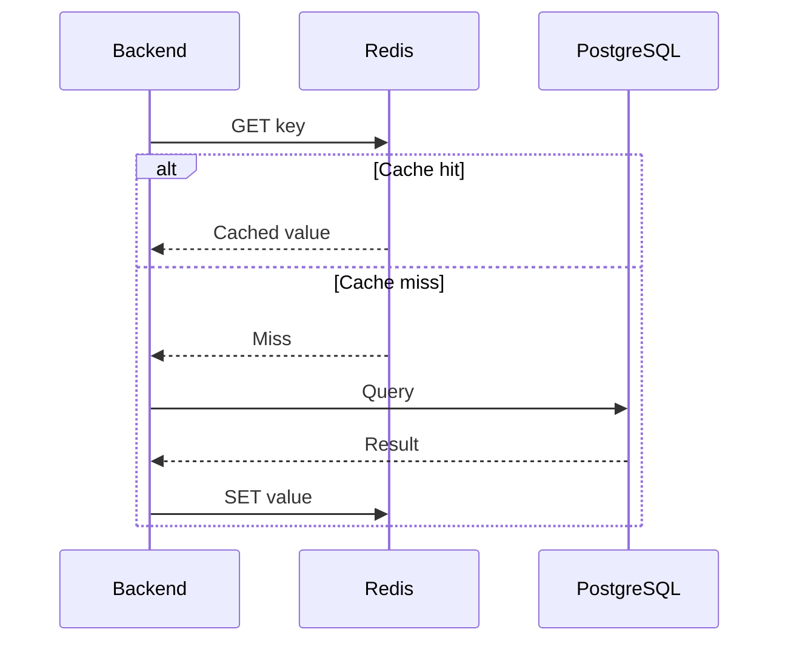
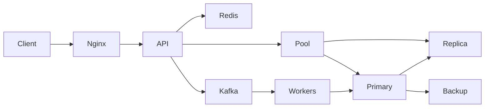

# 27- Senior Backend SQL Questions

## Overview

Senior backend SQL interviews evaluate more than SQL syntax. They test whether you can reason about **correctness, concurrency, performance, database internals, production failures, scalability, security, and architectural trade-offs**.

A senior engineer should be able to move between levels:

```text
SQL syntax
   ↓
Query semantics
   ↓
Execution plan
   ↓
Database internals
   ↓
Concurrency
   ↓
Application behavior
   ↓
Distributed architecture
   ↓
Production operations
```

The strongest answers usually follow this pattern:

1. Define the requirement precisely.
2. Explain the SQL semantics.
3. Discuss the execution strategy.
4. Identify correctness and concurrency risks.
5. Explain production-scale implications.
6. State trade-offs and alternatives.

---

## Senior SQL Interview Mindset

A senior answer should avoid absolute statements such as:

```text
"Indexes always improve performance."
"Read replicas solve scaling."
"Redis is faster, so use Redis."
"Just increase max_connections."
"Use SERIALIZABLE for correctness."
"Use DISTINCT to remove duplicates."
```

Prefer:

```text
"It depends on the access pattern, data distribution,
concurrency, consistency requirements, and operational constraints."
```

A useful reasoning framework is:

| Area | Questions to Ask |
|---|---|
| Correctness | Does the query return exactly the required data? |
| Cardinality | What does one result row represent? |
| Performance | What is the execution cost? |
| Scale | What happens with 100× more data or traffic? |
| Concurrency | What happens when requests execute simultaneously? |
| Consistency | What visibility guarantees are required? |
| Security | Can unauthorized data be returned or modified? |
| Reliability | What happens during failures and retries? |
| Operations | How will this be monitored and diagnosed? |
| Cost | What infrastructure and maintenance cost does it introduce? |

---

## SQL Semantics and Query Design

### How would you determine whether a SQL query is correct?

Start with the **business result grain**.

For example:

```text
Requirement:
Return one row per customer with the number of completed orders.
```

The expected grain is:

```text
customer
```

A possible implementation is:

```sql
SELECT
    c.id,
    COUNT(o.id) AS completed_order_count
FROM customers AS c
LEFT JOIN orders AS o
    ON o.customer_id = c.id
   AND o.status = 'completed'
GROUP BY c.id;
```

The important reasoning is not merely knowing `GROUP BY`. You must verify:

- Customers without orders remain present.
- Only completed orders are counted.
- Multiple orders do not duplicate customer-level output.
- `COUNT(o.id)` returns zero for customers without matching orders.

A senior engineer validates **semantics before optimization**.

---

### What is the most important thing to determine before writing a complex SQL query?

Determine the **result grain**.

Ask:

```text
One row per what?
```

Examples:

```text
one row per user
one row per order
one row per user-order
one row per day
one row per tenant
```

Many SQL bugs are actually cardinality bugs caused by not defining this explicitly.

---

### How would you diagnose a query returning duplicate rows?

Start by identifying the expected grain.

Then inspect every join.

For example:

```text
customers
   ↓ 1:N
orders
   ↓ 1:N
order_items
```

Joining all three produces:

```text
one row per order item
```

not:

```text
one row per customer
```

Do not immediately add:

```sql
DISTINCT
```

Instead determine whether:

- The join is correct.
- A join predicate is missing.
- A many-to-many relationship is involved.
- Aggregation should happen before the join.
- `EXISTS` better represents the requirement.

---

### When would you use `EXISTS` instead of a `JOIN`?

Use `EXISTS` when the requirement is existence:

```text
Return customers who have at least one completed order.
```

```sql
SELECT c.id
FROM customers AS c
WHERE EXISTS (
    SELECT 1
    FROM orders AS o
    WHERE o.customer_id = c.id
      AND o.status = 'completed'
);
```

A join is more appropriate when columns from the related rows are required.

The key distinction is:

```text
EXISTS → does a matching row exist?
JOIN   → combine rows from relations
```

Do not claim that one is universally faster. PostgreSQL may transform semantically equivalent forms into similar plans.

---

### When is `NOT EXISTS` preferable to `NOT IN`?

`NOT EXISTS` is often safer when the subquery can contain `NULL`.

For example:

```sql
SELECT c.id
FROM customers AS c
WHERE NOT EXISTS (
    SELECT 1
    FROM orders AS o
    WHERE o.customer_id = c.id
);
```

`NOT IN` has three-valued logic implications when the subquery contains `NULL`.

The important interview point is:

> `NOT IN` and `NOT EXISTS` are not universally interchangeable.

---

### How do `WHERE` and `HAVING` differ?

`WHERE` filters rows before aggregation.

`HAVING` filters groups after aggregation.

```sql
SELECT
    customer_id,
    COUNT(*) AS order_count
FROM orders
WHERE status = 'completed'
GROUP BY customer_id
HAVING COUNT(*) >= 10;
```

Conceptually:

```text
FROM/JOIN
   ↓
WHERE
   ↓
GROUP BY
   ↓
HAVING
   ↓
SELECT
```

---

### What is the difference between `GROUP BY` and window functions?

`GROUP BY` changes result cardinality.

```sql
SELECT
    customer_id,
    SUM(amount)
FROM orders
GROUP BY customer_id;
```

returns one row per customer.

A window function preserves detail:

```sql
SELECT
    id,
    customer_id,
    amount,
    SUM(amount) OVER (
        PARTITION BY customer_id
    ) AS customer_total
FROM orders;
```

This returns one row per order while adding customer-level information.

---

## NULL and Three-Valued Logic

### Why does `NULL = NULL` not return true?

`NULL` represents an unknown or absent value rather than an ordinary value.

Therefore:

```sql
NULL = NULL
```

evaluates to `UNKNOWN`.

Use:

```sql
IS NULL
```

or:

```sql
IS NOT NULL
```

For null-safe comparison in PostgreSQL:

```sql
a IS DISTINCT FROM b
```

and:

```sql
a IS NOT DISTINCT FROM b
```

---

### What is a common `NULL` mistake with `NOT IN`?

Consider:

```sql
WHERE id NOT IN (
    SELECT customer_id
    FROM orders
)
```

If the subquery contains `NULL`, the predicate can produce `UNKNOWN` for values that otherwise appear to be absent.

When the business requirement is "there is no matching row", prefer:

```sql
WHERE NOT EXISTS (...)
```

with an explicit correlation predicate.

---

## Joins and Cardinality

### Explain the difference between `INNER JOIN` and `LEFT JOIN`.

`INNER JOIN` retains only matching combinations.

`LEFT JOIN` preserves every row from the left relation and supplies `NULL` for missing right-side matches.

```text
INNER JOIN:
A ∩ B

LEFT JOIN:
all A + matching B
```

The distinction is semantic, not merely performance-related.

---

### Why can a `LEFT JOIN` accidentally behave like an `INNER JOIN`?

Consider:

```sql
SELECT c.id, o.id
FROM customers AS c
LEFT JOIN orders AS o
    ON o.customer_id = c.id
WHERE o.status = 'completed';
```

Customers without orders have:

```text
o.status = NULL
```

and therefore fail the `WHERE` predicate.

If the intention is to preserve customers and count/filter matching orders, the condition may belong in the join:

```sql
SELECT c.id, o.id
FROM customers AS c
LEFT JOIN orders AS o
    ON o.customer_id = c.id
   AND o.status = 'completed';
```

Predicate placement can therefore change both correctness and performance.

---

### How would you avoid double counting after joining multiple one-to-many relationships?

Suppose:

```text
customer
 ├── orders
 └── support_tickets
```

Joining both relationships directly can produce:

```text
orders × support_tickets
```

per customer.

Instead, aggregate each relationship independently:

```sql
WITH order_counts AS (
    SELECT customer_id, COUNT(*) AS order_count
    FROM orders
    GROUP BY customer_id
),
ticket_counts AS (
    SELECT customer_id, COUNT(*) AS ticket_count
    FROM support_tickets
    GROUP BY customer_id
)
SELECT
    c.id,
    COALESCE(o.order_count, 0) AS order_count,
    COALESCE(t.ticket_count, 0) AS ticket_count
FROM customers AS c
LEFT JOIN order_counts AS o
    ON o.customer_id = c.id
LEFT JOIN ticket_counts AS t
    ON t.customer_id = c.id;
```

The general principle is:

> Control cardinality before combining independent one-to-many relationships.

---

## Aggregation

### Why can `SUM(DISTINCT amount)` be incorrect?

`DISTINCT` operates on values, not business entities.

If two legitimate orders both have:

```text
amount = 100
```

then:

```sql
SUM(DISTINCT amount)
```

counts `100` only once.

If the requirement is to avoid duplicate orders caused by a join, fix the join or aggregate at the correct grain instead.

---

### How would you calculate a weighted average?

A normal average can be incorrect when records have different weights.

For example:

```sql
SELECT
    SUM(score * weight) / NULLIF(SUM(weight), 0) AS weighted_score
FROM evaluations;
```

The important consideration is defining:

```text
numerator
denominator
NULL behavior
zero-weight behavior
```

---

### How would you calculate conditional aggregates?

PostgreSQL supports `FILTER`:

```sql
SELECT
    customer_id,
    COUNT(*) AS total_orders,
    COUNT(*) FILTER (
        WHERE status = 'completed'
    ) AS completed_orders,
    COUNT(*) FILTER (
        WHERE status = 'cancelled'
    ) AS cancelled_orders
FROM orders
GROUP BY customer_id;
```

This can be clearer than multiple `CASE` expressions.

---

## Window Functions

### When would you use `ROW_NUMBER()` instead of `RANK()`?

Use `ROW_NUMBER()` when every row needs a unique sequence.

Use `RANK()` when tied values should share a rank and subsequent ranks should contain gaps.

For:

```text
100
100
90
```

the results are:

```text
ROW_NUMBER → 1, 2, 3
RANK       → 1, 1, 3
DENSE_RANK → 1, 1, 2
```

---

### How would you retrieve the latest record per customer?

One PostgreSQL approach is:

```sql
SELECT DISTINCT ON (customer_id)
    customer_id,
    id,
    created_at,
    status
FROM orders
ORDER BY customer_id, created_at DESC, id DESC;
```

Another portable approach uses a window function:

```sql
SELECT customer_id, id, created_at, status
FROM (
    SELECT
        o.*,
        ROW_NUMBER() OVER (
            PARTITION BY customer_id
            ORDER BY created_at DESC, id DESC
        ) AS rn
    FROM orders AS o
) AS ranked
WHERE rn = 1;
```

The ordering must define deterministic tie-breaking.

---

## CTEs and Subqueries

### Are CTEs always slower than subqueries?

No.

A CTE is a query-structuring mechanism. PostgreSQL can inline eligible CTEs, while explicit materialization can intentionally change execution behavior.

Use CTEs when they improve:

- Readability.
- Reuse within a statement.
- Recursive queries.
- Explicit materialization semantics.

Then validate the actual plan.

---

### When would you use a correlated subquery?

A correlated subquery references a value from the outer query.

For example:

```sql
SELECT
    c.id,
    (
        SELECT MAX(o.created_at)
        FROM orders AS o
        WHERE o.customer_id = c.id
    ) AS latest_order_at
FROM customers AS c;
```

It is not automatically inefficient.

The optimizer, indexes, outer cardinality, and data distribution determine actual performance.

---

### When is `LATERAL` useful?

`LATERAL` allows a subquery in the `FROM` clause to reference preceding relations.

A common pattern is retrieving the latest related row:

```sql
SELECT
    c.id,
    latest_order.id,
    latest_order.created_at
FROM customers AS c
LEFT JOIN LATERAL (
    SELECT id, created_at
    FROM orders
    WHERE orders.customer_id = c.id
    ORDER BY created_at DESC, id DESC
    LIMIT 1
) AS latest_order ON TRUE;
```

With a suitable index, this can be effective for selective per-parent lookups.

---

## Indexing

### How do you decide whether an index is needed?

Start with the actual query workload.

Inspect:

```text
WHERE predicates
JOIN predicates
ORDER BY
GROUP BY
LIMIT
query frequency
result cardinality
write frequency
```

Then validate with:

```sql
EXPLAIN (ANALYZE, BUFFERS)
SELECT ...;
```

An index is justified when its performance benefit outweighs:

```text
storage
write amplification
WAL
maintenance
backup cost
replication cost
```

---

### Why might PostgreSQL ignore an index?

Possible reasons include:

- Low selectivity.
- Query returns a large portion of the table.
- Incorrect or stale statistics.
- Index does not match the predicate.
- Type conversion prevents useful index usage.
- Function applied to the indexed column.
- Ordering requirements favor another path.
- Table is small.
- Cost estimates favor a sequential scan.
- Parameter-sensitive planning.

The correct answer is not:

> "The index is broken."

Inspect the execution plan.

---

### What is a composite index?

For:

```sql
WHERE tenant_id = $1
  AND status = $2
ORDER BY created_at DESC
```

an index such as:

```sql
CREATE INDEX orders_tenant_status_created_idx
ON orders (tenant_id, status, created_at DESC);
```

may support the complete access pattern.

Column order matters.

Do not apply the simplistic rule:

```text
most selective column first
```

without considering:

```text
equality
range
ordering
query frequency
data distribution
```

---

### What is the leftmost-prefix principle?

For:

```sql
CREATE INDEX example_idx
ON example (a, b, c);
```

the index is naturally useful for access patterns beginning with `a`, such as:

```text
a
a,b
a,b,c
```

But an index on `(a,b,c)` is not equivalent to separate indexes on:

```text
a
b
c
```

The optimizer can use indexes in more nuanced ways, including bitmap operations, but composite index design should still follow real query patterns.

---

### When would you use a partial index?

When queries consistently target a subset of rows.

For example:

```sql
CREATE INDEX jobs_pending_idx
ON jobs (created_at)
WHERE status = 'pending';
```

This can reduce index size and improve performance for the targeted workload.

It is particularly useful for:

```text
soft-deleted rows
active records
pending jobs
hot subsets
tenant-specific states
```

The query predicate must align with the index predicate for the planner to exploit it.

---

### When would you use `INCLUDE`?

`INCLUDE` adds non-key columns to an index payload.

For example:

```sql
CREATE INDEX users_email_idx
ON users (email)
INCLUDE (id, created_at);
```

This can support index-only scans for suitable queries without making included columns part of the index ordering/search key.

Do not add many columns indiscriminately because wider indexes increase storage and write cost.

---

## Query Performance

### How would you troubleshoot a slow SQL query?

Use an evidence-driven sequence:

```text
1. Capture exact SQL and parameters.
2. Check query frequency and aggregate database time.
3. Run EXPLAIN.
4. Run EXPLAIN ANALYZE carefully in a safe environment.
5. Inspect BUFFERS.
6. Compare estimated and actual rows.
7. Check joins and cardinality.
8. Check indexes.
9. Check sorting/aggregation.
10. Check locks and waits.
11. Check database CPU/I/O.
12. Check application query count.
```

Example:

```sql
EXPLAIN (ANALYZE, BUFFERS)
SELECT id, customer_id, created_at
FROM orders
WHERE customer_id = 123
ORDER BY created_at DESC
LIMIT 50;
```

---

### What does a large difference between estimated and actual rows indicate?

For example:

```text
estimated rows = 100
actual rows    = 1,000,000
```

This indicates a cardinality estimation problem.

Potential causes include:

- Stale statistics.
- Data skew.
- Correlated columns.
- Complex predicates.
- Expressions.
- Insufficient statistics.
- Distribution changes.

The optimizer may consequently choose an inappropriate join or access path.

---

### What does `Rows Removed by Filter` tell you?

It can reveal that PostgreSQL examined many rows that did not satisfy a filter.

For example:

```text
actual rows = 10
Rows Removed by Filter = 5,000,000
```

This may indicate:

- Poor selectivity.
- Missing or unsuitable index.
- An intentionally broad scan.
- Incorrect query design.

It is evidence, not automatically proof that an index is required.

---

### What is the difference between a sequential scan, index scan, and bitmap heap scan?

| Access Path | Typical Use |
|---|---|
| Sequential Scan | Large portion of table, small table, or low-selectivity query |
| Index Scan | Selective lookup where ordered/index access is efficient |
| Bitmap Heap Scan | Multiple matching tuples where batching heap access is beneficial |
| Index Only Scan | Required data can be satisfied from index and visibility permits it |

The optimizer chooses among them based on estimated cost.

---

### Why can an index scan be slower than a sequential scan?

If a query retrieves a large fraction of a table, an index scan may cause many heap accesses.

Conceptually:

```text
Index scan
→ locate tuple
→ fetch heap page
→ repeat
```

can cost more than:

```text
Sequentially scan table pages
```

especially when access is not sufficiently selective.

---

## Query Planning and Optimizer

### What does the PostgreSQL optimizer actually optimize?

It searches for a low-cost physical execution strategy.

It considers:

```text
access paths
join order
join algorithms
sort strategies
aggregation strategies
parallelism
partition pruning
statistics
cost parameters
```

Possible join algorithms include:

```text
Nested Loop
Hash Join
Merge Join
```

The optimizer does not simply translate SQL syntax directly into one fixed execution algorithm.

---

### When is a nested loop join appropriate?

Nested loops can be excellent when the outer relation is small and the inner relation has an efficient index.

Conceptually:

```text
for each outer row:
    perform indexed lookup on inner relation
```

For a large outer relation and expensive inner access, it can become very expensive.

---

### When is a hash join appropriate?

Hash joins are useful for equality joins where building a hash table for one side is practical.

Conceptually:

```text
build hash table
      ↓
scan/probe other relation
```

Memory availability matters because large hash operations may spill to temporary storage.

---

### When is a merge join appropriate?

Merge joins work efficiently when both inputs can be provided in compatible sorted order.

They can be useful for:

```text
large relations
ordered inputs
equality joins
```

Sorting requirements can add cost when suitable ordering is not already available.

---

## Transactions and Concurrency

### What makes a transaction boundary well designed?

A good transaction boundary contains the **smallest set of database operations that must commit atomically**.

For example:

```text
BEGIN
    create order
    reserve inventory
    create outbox event
COMMIT
```

Avoid:

```text
BEGIN
    database work
    external HTTP request
    long computation
    sleep
    another database operation
COMMIT
```

Long transactions increase:

- Lock duration.
- Connection occupancy.
- MVCC cleanup pressure.
- Failure scope.
- Tail latency.

---

### What is the difference between atomicity and isolation?

Atomicity means:

```text
all transactional changes commit together
or none do
```

Isolation describes how concurrent transactions observe and interact with each other's work.

They solve different problems.

---

### When would you use pessimistic locking?

Use pessimistic locking when conflicts are expected and correctness requires serializing access to a resource.

Example:

```sql
SELECT id, balance
FROM accounts
WHERE id = $1
FOR UPDATE;
```

The transaction can then safely modify the selected row.

Trade-offs include:

```text
lock contention
deadlocks
waiting
reduced concurrency
```

---

### When would you use optimistic concurrency?

When conflicts are relatively uncommon and you want to avoid holding locks.

For example:

```sql
UPDATE documents
SET
    content = $1,
    version = version + 1
WHERE id = $2
  AND version = $3;
```

If the affected row count is zero, another transaction changed the document.

This is useful for:

```text
APIs
editing resources
state transitions
high-read workloads
```

---

### How do you prevent lost updates?

Options include:

- Atomic SQL.
- Row locking.
- Optimistic version checks.
- Appropriate isolation.
- Database constraints.

Prefer atomic updates when the operation can be expressed directly.

For example:

```sql
UPDATE inventory
SET available = available - $1
WHERE product_id = $2
  AND available >= $1;
```

Then verify:

```text
affected rows = 1
```

---

### What causes deadlocks?

A deadlock occurs when transactions wait for one another cyclically.

Example:

```text
Transaction A locks row 1
Transaction B locks row 2

A waits for row 2
B waits for row 1
```

Prevent them through:

- Consistent lock ordering.
- Short transactions.
- Reduced lock scope.
- Avoiding unnecessary locks.
- Careful advisory-lock usage.

PostgreSQL detects deadlocks and aborts one transaction.

The application may retry the **entire transaction** with bounded backoff and jitter.

---

### What is the difference between `lock_timeout` and `statement_timeout`?

`lock_timeout` limits how long a statement waits to acquire a lock.

`statement_timeout` limits statement execution duration.

They solve different problems.

For example:

```text
lock_timeout:
"I cannot obtain the required lock quickly enough."

statement_timeout:
"This statement is taking too long overall."
```

A production system should configure them according to workload and operational requirements rather than blindly setting both to the same value.

---

## Isolation Levels

### Explain PostgreSQL isolation levels.

The commonly relevant levels are:

| Level | General Behavior |
|---|---|
| Read Committed | Each statement sees a snapshot based on its execution |
| Repeatable Read | Transaction-level consistent snapshot with stronger guarantees |
| Serializable | Strongest isolation; concurrent execution may require retries |

PostgreSQL's implementation uses MVCC.

The key production concern is not memorizing definitions but understanding:

```text
What anomalies are possible?
What contention is introduced?
What retry behavior is required?
```

---

### Why can `SERIALIZABLE` transactions fail even when the SQL is correct?

Serializable execution can detect that concurrent transactions cannot safely be considered equivalent to some serial ordering.

PostgreSQL may abort a transaction with:

```text
SQLSTATE 40001
```

The application should retry the **whole transaction**, not only the failed statement.

Retries should be:

```text
bounded
backed off
jittered
idempotent
```

---

## Constraints and Data Integrity

### Why should important business invariants be enforced by the database?

Application checks can race.

For example:

```python
if not User.objects.filter(email=email).exists():
    User.objects.create(email=email)
```

Two concurrent requests can both pass the check.

A database constraint provides a durable invariant:

```sql
CREATE UNIQUE INDEX users_email_unique_idx
ON users (email);
```

The application then handles the constraint violation appropriately.

---

### When would you use a `CHECK` constraint?

Use it for row-level invariants that can be expressed without querying other rows.

For example:

```sql
CHECK (amount >= 0)
```

or:

```sql
CHECK (start_at < end_at)
```

Constraints are valuable because they protect data regardless of whether the write comes from:

```text
API
Celery
management command
migration
admin script
another service
```

---

### Can a foreign key guarantee all business relationships?

No.

Foreign keys guarantee referential integrity between referenced and referencing rows.

They do not automatically enforce higher-level business rules such as:

```text
only one active subscription per customer
```

A partial unique index may be appropriate:

```sql
CREATE UNIQUE INDEX subscriptions_active_unique_idx
ON subscriptions (customer_id)
WHERE status = 'active';
```

---

## Pagination

### When should you use keyset pagination?

Use keyset pagination when:

- Tables are large.
- Clients navigate sequentially.
- Deep pagination is expected.
- Stable latency matters.

Example:

```sql
SELECT id, created_at
FROM orders
WHERE (created_at, id) < ($1, $2)
ORDER BY created_at DESC, id DESC
LIMIT 50;
```

A matching index can make this efficient.

---

### What is wrong with deep `OFFSET` pagination?

Consider:

```sql
LIMIT 50 OFFSET 500000;
```

The database may need to process or traverse a large number of preceding rows before returning the requested page.

Keyset pagination instead starts from a known position.

The trade-off is that keyset pagination is less convenient for arbitrary page-number navigation.

---

## ORM and Backend Engineering

### Does using Django ORM eliminate the need for SQL knowledge?

No.

The application path is approximately:

```text
Django ORM
    ↓
SQL generation
    ↓
DB driver
    ↓
PostgreSQL
    ↓
planner
    ↓
executor
```

A backend engineer should understand:

- Generated SQL.
- Query count.
- Query cardinality.
- Indexes.
- Transactions.
- Locks.
- Execution plans.

---

### How would you diagnose an N+1 query problem?

Measure query count and identify repeated SQL patterns.

Conceptually:

```text
1 query → fetch 1,000 orders
1,000 queries → fetch customer for each order
```

Even if each individual query is fast, aggregate database load can be severe.

In Django, relationship loading can often be improved with:

```python
orders = (
    Order.objects
    .select_related("customer")
)
```

or:

```python
orders = (
    Order.objects
    .prefetch_related("items")
)
```

The correct strategy depends on relationship type and required data.

---

### Can eager loading make performance worse?

Yes.

Fetching too much related data can create:

```text
large joins
large result sets
high memory usage
unnecessary serialization
```

Optimization should match the endpoint's actual data requirements.

---

### How would you investigate an ORM query that is slow only in production?

Compare:

```text
generated SQL
parameters
database statistics
data volume
indexes
execution plan
query frequency
concurrency
database resource utilization
```

The production environment may differ substantially from development in:

```text
row count
data distribution
tenant sizes
cache state
concurrency
hardware
```

---

## Connection Pools

### Why can a connection pool become a bottleneck even when the database is healthy?

A pool limits how many application operations can concurrently acquire database connections.

If:

```text
pool size = 10
```

and:

```text
100 requests
```

need the database simultaneously, most requests must wait for a connection.

But increasing the pool is not automatically the answer.

The database may already be saturated.

---

### How should you size connection pools?

Consider the entire deployment:

```text
pods
× processes per pod
× pool size
+ overflow
+ Celery workers
+ administrative connections
```

For example:

```text
20 pods
× 2 processes
× 10 connections
= 400 possible connections
```

before other workloads.

Connection capacity must be planned at the fleet level.

---

### What happens if every application instance independently creates a large pool?

You can create a connection storm:

```text
more pods
   ↓
more pools
   ↓
more database connections
   ↓
more memory/concurrency
   ↓
database saturation
```

Horizontal application scaling therefore requires database connection budgeting.

---

## Read Replicas

### When should you introduce read replicas?

Use replicas when:

```text
read workload is significant
+
primary resources are constrained
+
workload can tolerate replica consistency characteristics
```

Typical uses:

- Read scaling.
- Reporting.
- Operational workload isolation.
- Disaster recovery.
- HA failover candidates.

---

### How do you handle read-after-write consistency with asynchronous replicas?

For a request:

```text
POST /orders
   ↓
primary
   ↓
GET /orders/123
   ↓
replica
```

the replica may not yet contain the write.

Possible strategies include:

```text
route critical reads to primary
track session/request consistency
use LSN-aware routing
temporarily prefer primary after writes
```

The correct choice depends on product consistency requirements.

---

### Does adding replicas increase write throughput?

Not directly.

The primary still processes application writes.

Replication also introduces additional work:

```text
WAL generation
network transfer
replica replay
```

Replicas primarily scale reads.

---

## Caching

### When should SQL results be cached?

Caching is appropriate when:

```text
data is expensive to compute
+
reads are frequent
+
staleness is acceptable or manageable
```

A cache-aside architecture is common:



The difficult part is usually not reading from Redis. It is defining:

```text
invalidation
TTL
staleness
key design
failure behavior
stampede protection
```

---

### Can Redis replace database constraints?

No.

A Redis lock or cached check should not be the sole protection for a durable business invariant unless the architecture deliberately makes Redis the authoritative coordination mechanism.

For durable relational invariants, prefer:

```text
database constraints
transactions
atomic SQL
locking
```

---

## Large Data Operations

### How would you safely backfill a new column on a billion-row table?

Avoid one enormous transaction.

Prefer:

```text
1. Add nullable column.
2. Deploy compatible application code.
3. Backfill in indexed batches.
4. Track durable progress.
5. Throttle based on production load.
6. Validate results.
7. Enforce constraints.
8. Switch application behavior.
9. Remove legacy state later.
```

A keyset-based batch might look like:

```sql
SELECT id
FROM customers
WHERE id > $1
ORDER BY id
LIMIT 5000;
```

The backfill should be:

```text
restartable
idempotent
observable
throttled
```

---

### Why are large `DELETE` operations dangerous?

A large delete can generate:

```text
WAL
dead tuples
vacuum work
replica lag
I/O
long transaction duration
```

For retention-heavy datasets, partitioning can sometimes make lifecycle operations substantially simpler.

For non-partitioned tables, delete in controlled batches.

---

## Partitioning and Sharding

### When should you partition a table?

Partitioning is useful when data naturally divides according to:

```text
time
tenant
region
business lifecycle
```

and the partition key supports meaningful:

```text
partition pruning
maintenance
retention
archival
```

It is not automatically a query-performance solution.

---

### When should you shard?

Sharding becomes relevant when one database cluster cannot adequately satisfy:

```text
write throughput
storage capacity
resource isolation
tenant scale
```

and simpler approaches are insufficient.

Sharding introduces:

```text
routing
cross-shard queries
cross-shard transactions
rebalancing
schema management
failure handling
```

It should therefore usually come after less complex scaling techniques have been evaluated.

---

## Multi-Tenant SQL

### How would you design a shared-schema multi-tenant database?

A common model is:

```text
tenants
    ↓
tenant_id on tenant-owned tables
```

For example:

```sql
CREATE TABLE orders (
    id bigint PRIMARY KEY,
    tenant_id bigint NOT NULL,
    customer_id bigint NOT NULL,
    created_at timestamptz NOT NULL
);
```

Indexes often need to reflect tenant-aware access patterns:

```sql
CREATE INDEX orders_tenant_created_idx
ON orders (tenant_id, created_at DESC);
```

Security should not rely solely on developers remembering:

```sql
WHERE tenant_id = ...
```

PostgreSQL Row Level Security can provide an additional database-level enforcement layer.

---

### What is the risk of using RLS with connection pooling?

Tenant context can accidentally leak between requests if session-level state is reused incorrectly.

A safer pattern for transaction-scoped tenant context is:

```sql
BEGIN;

SET LOCAL app.tenant_id = 'tenant-123';

SELECT *
FROM orders;

COMMIT;
```

`SET LOCAL` limits the setting to the current transaction.

The application must also ensure that the tenant context itself is authenticated and authorized rather than accepting arbitrary tenant IDs from clients.

---

## Microservices and Database Ownership

### Should every microservice have its own database?

The principle is usually:

> A service should own the data it is responsible for.

This does not necessarily mean every service needs a completely separate physical database immediately.

Possible models include:

```text
separate database
separate schema
shared cluster with controlled ownership
```

The important boundary is ownership.

Directly modifying another service's tables creates tight coupling and makes independent deployments difficult.

---

### How should services communicate when they need another service's data?

Options include:

```text
synchronous API
gRPC
events
CDC
local read model
```

The correct approach depends on:

```text
latency
consistency
availability
query patterns
ownership
data freshness
```

Avoid cross-service SQL access merely because it is convenient.

---

## SQL and Kafka

### How do you keep a database update and Kafka event consistent?

Do not assume:

```text
DB transaction
+
Kafka publish
```

is atomic.

A common pattern is the transactional outbox:

```text
BEGIN
    update business data
    insert outbox event
COMMIT

worker
    ↓
read outbox
    ↓
publish Kafka event
    ↓
mark event published
```

The consumer should be idempotent because publication or acknowledgement can fail at different points.

---

### Why is "exactly once" difficult across PostgreSQL and Kafka?

There are multiple state transitions:

```text
database transaction
Kafka publication
consumer processing
consumer database transaction
offset acknowledgement
```

A failure can occur between any two operations.

A production design therefore typically relies on:

```text
idempotency
deduplication
unique event IDs
transactional database updates
careful offset management
retries
```

---

## Reliability and Failure Handling

### What happens if the application times out after committing a transaction?

The client may not know whether the transaction committed.

For example:

```text
Application
   ↓
COMMIT
   ↓
PostgreSQL commits
   X
network response lost
```

The application sees:

```text
timeout
```

but the database may already contain the change.

Therefore retries must be designed around **uncertain outcomes**.

Use:

```text
idempotency keys
unique business identifiers
deduplication
safe retry semantics
```

for operations where duplicate effects are dangerous.

---

### How should database retries be implemented?

Retry only errors that are genuinely transient and safe to retry.

Common examples include:

```text
serialization failure
deadlock
temporary connection failure
```

Use:

```text
bounded attempts
exponential backoff
jitter
transaction-level retry
idempotency
```

Avoid:

```text
retry forever
retry immediately
retry every SQL statement independently
```

---

### Why can retries make a database outage worse?

Suppose:

```text
database latency increases
        ↓
requests timeout
        ↓
clients retry
        ↓
database receives more work
        ↓
latency increases further
```

This is a retry storm.

Reliability mechanisms must therefore include **load control**, not just retry logic.

---

## High Availability and Disaster Recovery

### What is the difference between HA and DR?

High Availability focuses on minimizing service interruption during expected failures.

Examples:

```text
primary failure
node failure
availability-zone failure
```

Disaster Recovery addresses larger failures such as:

```text
region loss
data corruption
accidental deletion
major infrastructure failure
```

HA and DR therefore require different mechanisms.

---

### Does a read replica replace backups?

No.

Replication can reproduce accidental changes:

```text
bad DELETE
   ↓
primary
   ↓
replica
```

Backups and Point-in-Time Recovery provide recovery capabilities that replication alone does not.

---

### What are RPO and RTO?

**RPO — Recovery Point Objective**

How much data loss is acceptable.

```text
RPO = 5 minutes
```

means losing up to five minutes of data may be acceptable under the defined recovery strategy.

**RTO — Recovery Time Objective**

How quickly service must be restored.

```text
RTO = 30 minutes
```

means the recovery strategy targets restoration within approximately that window.

---

## Security

### How would you prevent SQL injection?

Use parameterized queries.

Unsafe:

```python
query = f"""
SELECT id
FROM users
WHERE email = '{email}'
"""
```

Safe:

```python
cursor.execute(
    """
    SELECT id
    FROM users
    WHERE email = %s
    """,
    (email,),
)
```

Parameterization protects values.

Dynamic identifiers such as:

```text
column names
table names
sort fields
```

require controlled allowlists or safe identifier composition.

---

### Is parameterization sufficient for SQL security?

No.

SQL security also requires:

```text
least privilege
authentication
authorization
RLS where appropriate
secure dynamic SQL
secret management
TLS
audit logging
network controls
```

An application can use perfectly parameterized SQL and still expose another tenant's data.

---

### Should the application connect as a database superuser?

No.

Use a dedicated runtime role with only the privileges required by the application.

A stronger production model separates:

```text
owner role
migration role
runtime role
read-only role
administrative/break-glass role
```

---

## Migrations and Schema Evolution

### How would you perform a zero-downtime column rename?

Avoid:

```text
rename immediately
```

because old application instances may still reference the old column.

Prefer an expand-and-contract strategy:

```text
Add new column
    ↓
Deploy code supporting both
    ↓
Backfill
    ↓
Switch reads/writes
    ↓
Observe
    ↓
Remove old column later
```

This supports rolling deployments where multiple application versions temporarily coexist.

---

### How would you safely add a `NOT NULL` column to a large production table?

A common approach is:

```text
1. Add column as nullable.
2. Deploy code compatible with NULL.
3. Backfill existing rows.
4. Validate that no required values are missing.
5. Enforce NOT NULL using an operationally safe migration strategy.
```

The exact implementation depends on PostgreSQL version, table size, workload, and required locking behavior.

---

### Why should large migrations be treated as production workloads?

Because they consume the same resources as application traffic:

```text
CPU
I/O
WAL
locks
connections
memory
replication bandwidth
vacuum capacity
```

A migration can therefore cause an outage even when the application code itself is unchanged.

---

## Observability

### What database metrics should a senior backend engineer monitor?

At minimum:

| Area | Examples |
|---|---|
| Query performance | latency, calls, total time |
| CPU | utilization, saturation |
| Memory | available memory, swap, OOM |
| Connections | active, idle, pool utilization |
| Locks | waits, blocked sessions |
| Storage | IOPS, throughput, free space |
| WAL | generation, retention |
| Replication | lag, replay position |
| Vacuum | dead tuples, autovacuum activity |
| Errors | constraint failures, connection errors |
| Transactions | duration, idle-in-transaction |
| Cache | database/cache hit behavior |

`pg_stat_statements`, `pg_stat_activity`, and `pg_locks` are particularly valuable PostgreSQL tools.

---

### How do you distinguish a slow query from a slow database?

Investigate multiple layers:

```text
Application
    ↓
Connection pool
    ↓
Database wait
    ↓
Query execution
    ↓
Storage
```

A request can be slow because:

```text
query is expensive
```

or because:

```text
query is waiting for a lock
query is waiting for a connection
database CPU is saturated
storage is saturated
replica is lagging
```

Do not optimize SQL before identifying where time is actually spent.

---

## Production Architecture

### How would you architect a high-volume PostgreSQL backend?

A typical evolution could look like:



Responsibilities:

```text
PostgreSQL
    durable transactional state

Redis
    cache / ephemeral coordination

Kafka
    asynchronous event distribution

Celery / workers
    background processing

Read replicas
    read scaling / workload isolation

Backups
    recovery
```

Do not introduce each component simply because the architecture looks more scalable. Add complexity when the workload justifies it.

---

## Performance Trade-Offs

### What would you optimize first: SQL, index, cache, or infrastructure?

Usually:

```text
1. Correctness
2. Query/workload measurement
3. Query structure
4. Execution plan
5. Index design
6. Concurrency
7. Caching/workload isolation
8. Infrastructure scaling
```

The exact order depends on the bottleneck.

For example, if the database is spending most of its time processing an N+1 workload, adding Redis or CPU may hide rather than solve the underlying problem.

---

### When should you scale vertically?

Vertical scaling is attractive when:

```text
single-node architecture is still appropriate
+
database resource saturation is the primary bottleneck
```

Advantages:

- Simple operational model.
- No application-level sharding.
- Fewer distributed-query concerns.

Limitations:

- Hardware limits.
- Cost growth.
- Potential maintenance events.
- Does not eliminate architectural bottlenecks.

---

### When should you scale horizontally?

Horizontal approaches include:

```text
read replicas
partitioning
sharding
workload isolation
distributed read models
```

They can increase capacity but introduce additional operational and consistency complexity.

---

## Senior Scenario Questions

### Scenario: An API suddenly becomes 10× slower. PostgreSQL CPU is only 30%. What do you investigate?

Do not assume the database CPU is healthy enough to rule it out.

Check:

```text
connection pool utilization
database wait events
lock contention
query latency
query frequency
replica lag
network latency
application CPU
external dependencies
N+1 behavior
```

A connection pool can be exhausted while database CPU remains low because requests are waiting on:

```text
locks
connections
network
slow transactions
```

---

### Scenario: A query went from 50 ms to 8 seconds after a large data increase. What could have happened?

Potential causes include:

- Plan change.
- Cardinality estimation error.
- Index no longer selective enough.
- Join strategy change.
- Increased sorting/aggregation cost.
- Data distribution changed.
- Partition pruning stopped working.
- Increased concurrency.
- Cache behavior changed.

Compare execution plans from before and after the regression.

---

### Scenario: An index exists but PostgreSQL performs a sequential scan. What do you say in an interview?

A strong answer:

> An existing index does not guarantee an index scan. I would inspect selectivity, table size, statistics, estimated versus actual rows, ordering requirements, query predicates, and the execution plan. If the query retrieves a large fraction of the table, a sequential scan may be cheaper.

Then validate with:

```sql
EXPLAIN (ANALYZE, BUFFERS)
SELECT ...;
```

---

### Scenario: An API returns the same customer multiple times after adding a join. How do you debug it?

First define:

```text
Expected grain = one row per customer
```

Then inspect:

```text
join cardinality
relationship type
join predicates
many-to-many relationships
```

Do not immediately use:

```sql
DISTINCT
```

If only existence is required, consider `EXISTS`. If aggregation is required, aggregate at the correct grain before joining.

---

### Scenario: Two users simultaneously purchase the last available item. How would you design the SQL?

The critical invariant is:

```text
inventory >= purchased_quantity
```

Use an atomic conditional update:

```sql
UPDATE inventory
SET available = available - $1
WHERE product_id = $2
  AND available >= $1;
```

Then verify the affected row count.

If multiple related changes must commit atomically, execute them in one transaction.

---

### Scenario: A payment API times out. Should the client retry?

Not blindly.

The timeout does not prove that the payment was not processed.

Use:

```text
idempotency key
+
durable payment state
+
safe retry semantics
```

The retry should resolve the existing operation rather than blindly create another one.

---

### Scenario: A database is overloaded after adding more Kubernetes pods. Why?

A common chain is:

```text
more pods
   ↓
more application processes
   ↓
more connection pools
   ↓
more database concurrency
   ↓
more CPU/memory/lock contention
```

Application scaling can therefore overload a database.

The solution may be:

```text
pool reduction
concurrency limits
query optimization
caching
read replicas
workload isolation
```

rather than adding more pods.

---

### Scenario: Read traffic is overwhelming the primary. What options do you consider?

Start with:

```text
query optimization
index review
N+1 elimination
result-size reduction
```

Then consider:

```text
Redis
read replicas
materialized views
OLAP/read models
```

depending on workload characteristics.

---

### Scenario: A table has 500 million rows and users mostly query the last 30 days. What would you consider?

Potential options:

```text
appropriate time-based index
partitioning by time
retention policies
archival
partition pruning
```

Partitioning becomes particularly attractive when old data has a different lifecycle from hot data.

---

### Scenario: A multi-tenant system has one extremely large customer. What problem can this cause?

A single tenant can create:

```text
hot partitions
large index ranges
high query latency
noisy-neighbor effects
storage imbalance
```

Potential solutions include:

```text
tenant-aware indexing
tenant-specific partitioning
tenant placement
tenant-level throttling
sharding large tenants
workload isolation
```

The right choice depends on tenant distribution and workload.

---

## Interview Comparison Questions

| Question | Strong Senior Answer |
|---|---|
| Index vs sequential scan | Depends on selectivity and cost |
| JOIN vs EXISTS | Choose based on result semantics |
| CTE vs subquery | Prefer clarity; validate plan |
| GROUP BY vs window | Collapse rows vs preserve rows |
| OFFSET vs keyset | Simplicity vs scalable traversal |
| Locking vs optimistic concurrency | Conflict frequency and correctness requirements |
| Replica vs cache | Durable read scaling vs derived/ephemeral data |
| Partitioning vs sharding | Single database organization vs distributed data |
| Vertical vs horizontal scaling | Simplicity/capacity vs distributed complexity |
| Transaction vs outbox | DB atomicity vs DB + event consistency |
| Constraint vs application validation | Durable invariant vs user-facing validation |
| Sync vs async replication | Consistency/availability trade-off |
| Redis vs PostgreSQL | Cache/ephemeral state vs durable transactional state |
| Runtime vs migration role | Minimal application permissions vs schema-management privileges |

---

## Common Senior Interview Traps

### "Just Add an Index"

Weak answer.

Better:

```text
Inspect query
→ inspect plan
→ evaluate selectivity
→ design index
→ measure
→ evaluate write cost
```

### "Use Redis Because PostgreSQL Is Slow"

Weak answer.

First determine whether the problem is:

```text
query
index
lock
connection pool
CPU
I/O
N+1
replica routing
```

### "Use SERIALIZABLE Everywhere"

Weak answer.

Serializable isolation provides stronger guarantees but can increase aborts and retry requirements.

Use the weakest isolation level that satisfies the actual correctness requirement.

### "Use DISTINCT to Remove Duplicates"

Weak answer.

Duplicates often indicate a cardinality or join-design problem.

### "Increase max_connections"

Weak answer.

More connections can increase resource contention and memory usage.

### "Read Replicas Solve Scaling"

Incomplete.

They primarily address read scaling and introduce consistency and lag considerations.

### "Transactions Make the Whole Operation Atomic"

Incomplete.

A PostgreSQL transaction does not automatically include:

```text
Kafka
Redis
HTTP APIs
email
object storage
```

### "The ORM Handles SQL"

Incomplete.

The database still executes SQL, chooses plans, acquires locks, maintains indexes, and enforces constraints.

---

## Senior SQL Problem-Solving Checklist

When given an unfamiliar SQL production problem, ask:

### Correctness

```text
What is the required result?
What is the result grain?
Are NULL semantics correct?
Are duplicates expected?
Are authorization constraints enforced?
```

### Performance

```text
How often does this execute?
How many rows are processed?
What is the execution plan?
Are estimates accurate?
What indexes exist?
```

### Concurrency

```text
Can requests modify the same rows?
Could locks contend?
Could deadlocks occur?
Are retries safe?
```

### Scale

```text
What happens at 10× data?
What happens at 10× traffic?
What happens with more tenants?
What happens with more workers?
```

### Reliability

```text
What happens during connection failure?
What happens during timeout?
Can commit outcome be uncertain?
Can the operation be retried safely?
```

### Architecture

```text
Should reads use replicas?
Should data be cached?
Should work be asynchronous?
Is partitioning useful?
Is sharding actually necessary?
```

### Operations

```text
How will we monitor it?
How will we detect regression?
How will we roll back?
How will we recover?
```

---

## Production SQL Review Questions

Before approving a significant SQL change, review:

```text
[ ] Result correctness verified
[ ] Result grain documented
[ ] NULL behavior understood
[ ] Join cardinality verified
[ ] Authorization/tenant filtering verified
[ ] Execution plan inspected
[ ] Appropriate indexes evaluated
[ ] Query frequency considered
[ ] Large-data behavior tested
[ ] Concurrency behavior considered
[ ] Transaction boundary reviewed
[ ] Lock behavior understood
[ ] Retry semantics defined
[ ] Connection pool impact considered
[ ] Replica behavior considered
[ ] Migration compatibility reviewed
[ ] Logging/redaction reviewed
[ ] Monitoring added where necessary
[ ] Rollback/recovery path understood
```

---

## How to Structure a Senior Interview Answer

A strong answer can follow:

```text
1. Clarify the requirement.
2. Define the data/result grain.
3. Give the straightforward SQL solution.
4. Explain correctness.
5. Explain likely execution strategy.
6. Discuss indexes and cardinality.
7. Discuss concurrency if writes are involved.
8. Discuss scale and workload characteristics.
9. Discuss failure and retry behavior.
10. State trade-offs.
```

For example:

> "I would first clarify whether we need one row per customer or one row per order. If we need existence, I would use `EXISTS` rather than joining and deduplicating. Then I would inspect the execution plan and verify an appropriate index. If this query runs at high volume, I would consider query frequency, connection concurrency, caching or replicas. If the operation modifies shared state, I would also analyze transaction boundaries and locking."

This demonstrates engineering reasoning rather than syntax memorization.

---

## Key Takeaways

- **Senior SQL interviews test system reasoning:** connect SQL semantics to cardinality, execution plans, concurrency, application behavior, and production architecture.
- **Correctness comes before optimization:** define result grain, understand `NULL`, control join cardinality, and enforce important invariants with database constraints.
- **Performance is evidence-driven:** use execution plans, statistics, query frequency, resource metrics, and realistic data rather than relying on rules such as "always add an index."
- **Production SQL is distributed-system aware:** replicas, connection pools, Redis, Kafka, Celery, retries, migrations, and failures all affect database behavior.
- **Prefer the simplest design that satisfies the requirements:** introduce caching, replicas, partitioning, sharding, or other complexity only when workload and reliability requirements justify it.