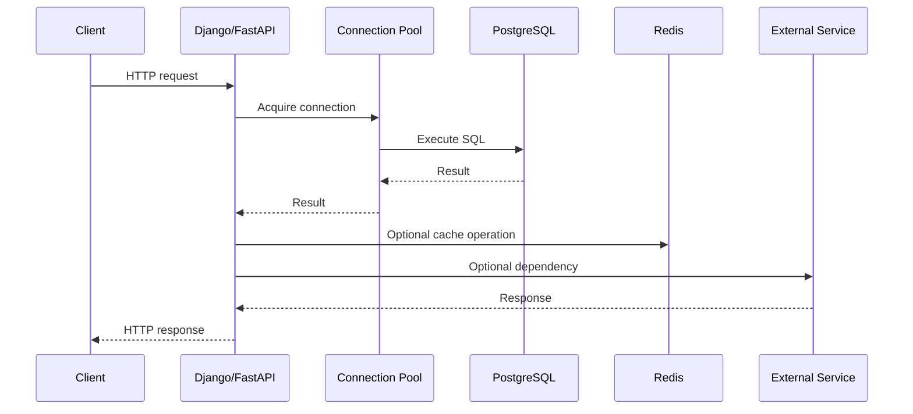
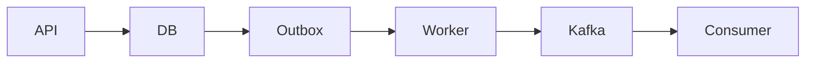
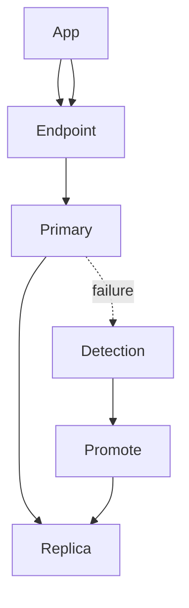

# 28- Production Database Scenarios

## Overview

Production database scenarios test whether a backend engineer can reason beyond SQL syntax and solve problems under real operational constraints.

A production-grade answer must consider:

- Correctness and data integrity.
- Query performance and execution plans.
- Transactions and concurrency.
- Connection pools and application behavior.
- Replication and consistency.
- Caching and asynchronous processing.
- Migrations and deployments.
- Security and tenant isolation.
- Observability and incident response.
- High availability, disaster recovery, and cost.

A useful mental model is:

```text
Business requirement
        ↓
SQL correctness
        ↓
Transaction / concurrency behavior
        ↓
Execution plan
        ↓
Database resources
        ↓
Application behavior
        ↓
Distributed architecture
        ↓
Production operations
```

The strongest interview answers identify the immediate problem first and then explain how the solution behaves under higher traffic, larger datasets, failures, retries, and concurrent requests.

---

## Production Scenario Reasoning Framework

When given an unfamiliar production database problem, work through these questions:

| Dimension | Questions |
|---|---|
| Correctness | Does the query produce the required result? |
| Cardinality | What does one row represent? |
| Consistency | What data must be immediately visible? |
| Concurrency | What happens when multiple requests execute simultaneously? |
| Performance | What does the execution plan do? |
| Capacity | Which resource is saturated? |
| Reliability | What happens when a dependency fails? |
| Security | Can unauthorized data be accessed or modified? |
| Scalability | What happens at 10× traffic or data? |
| Operations | How will the system be monitored and recovered? |
| Cost | Is the solution economically sustainable? |

Avoid jumping directly to:

```text
add an index
increase CPU
add Redis
add replicas
increase max_connections
```

First establish the bottleneck.

---

## Scenario: API Latency Suddenly Increased

### Problem

An endpoint normally responds in 100 ms but suddenly takes 5 seconds.

### Investigation

Do not assume PostgreSQL is the root cause.

Trace the complete request:



Investigate:

```text
application latency
connection acquisition time
SQL execution time
lock wait time
database CPU
database I/O
query frequency
replica lag
Redis latency
external dependency latency
```

A database can have low CPU while requests are slow because they are waiting on:

```text
connections
locks
I/O
network
```

### Senior-Level Answer

> I would decompose end-to-end latency before changing infrastructure. I would compare application timing, pool wait time, database execution time, lock waits, and external dependency latency. If SQL is responsible, I would inspect `pg_stat_statements` and the execution plan before changing indexes or configuration.

---

## Scenario: Database CPU Is 100%

### Possible Causes

High CPU can result from:

- Expensive queries.
- High query frequency.
- N+1 queries.
- Poor join strategies.
- Large sorts.
- Hash aggregation.
- Regex or JSON processing.
- Retry storms.
- Excessive concurrent workers.
- Autovacuum or maintenance workload.
- A deployment introducing a new query pattern.

### Investigation

Start with aggregate workload:

```sql
SELECT
    query,
    calls,
    total_exec_time,
    mean_exec_time,
    rows
FROM pg_stat_statements
ORDER BY total_exec_time DESC
LIMIT 20;
```

Then inspect active sessions:

```sql
SELECT
    pid,
    usename,
    state,
    wait_event_type,
    wait_event,
    query_start,
    query
FROM pg_stat_activity
WHERE state <> 'idle'
ORDER BY query_start;
```

Then inspect representative execution plans.

### Emergency Mitigation

Depending on the cause:

```text
reduce application concurrency
disable problematic feature
stop runaway workers
rate-limit expensive endpoints
route safe reads to replicas
cancel clearly runaway queries
```

Do not blindly terminate sessions or restart the database without understanding the workload.

---

## Scenario: Database CPU Is Low but Requests Are Slow

This is a common production diagnostic trap.

Possible causes:

```text
lock contention
connection pool exhaustion
storage latency
network latency
replica lag
external dependency
application CPU
```

Check PostgreSQL wait events:

```sql
SELECT
    pid,
    wait_event_type,
    wait_event,
    state,
    query
FROM pg_stat_activity
WHERE state <> 'idle';
```

The key distinction is:

```text
CPU-bound
vs
wait-bound
```

Increasing CPU does not solve lock waits.

---

## Scenario: Connection Pool Is Exhausted

Suppose:

```text
20 Kubernetes pods
2 application processes per pod
10 DB connections per process
```

Potential connections:

```text
20 × 2 × 10 = 400
```

Add Celery workers, migrations, monitoring tools, and administrative sessions and the database may receive substantially more connections.

### Investigation

Check:

```sql
SELECT
    state,
    count(*)
FROM pg_stat_activity
GROUP BY state;
```

Also inspect:

```text
pool utilization
connection acquisition latency
transaction duration
idle-in-transaction sessions
database max_connections
worker concurrency
pod count
```

### Common Causes

- Slow queries holding connections.
- Long transactions.
- Connection leaks.
- Pool size too large.
- Too many application instances.
- Database failover causing reconnect storms.
- External calls performed while holding transactions.

### Senior-Level Fix

Treat connection pools as **concurrency controls**, not capacity multipliers.

---

## Scenario: Database Has Too Many Connections

Increasing:

```sql
max_connections
```

is not automatically the solution.

Each PostgreSQL backend consumes resources, and excessive concurrency can increase:

```text
memory usage
CPU contention
context switching
lock contention
query latency
```

A better architecture may use:

```text
smaller application pools
+
PgBouncer
+
bounded application concurrency
+
query optimization
```

The database should have an explicit connection budget.

---

## Scenario: Query Became Slow After Data Growth

A query worked well with:

```text
1 million rows
```

but is now slow at:

```text
500 million rows
```

Investigate:

```text
execution plan
statistics
cardinality estimates
index selectivity
join order
data distribution
sort/aggregation cost
partition pruning
```

Compare:

```sql
EXPLAIN (ANALYZE, BUFFERS)
SELECT ...;
```

Do not assume the same execution plan remains optimal as the dataset changes.

---

## Scenario: Index Exists but Query Is Slow

Possible explanations:

```text
index has poor selectivity
wrong column order
query predicate does not match
function/cast prevents useful access
large portion of table is returned
statistics are inaccurate
ordering requires additional work
index is too wide
```

For example:

```sql
CREATE INDEX orders_customer_created_idx
ON orders (customer_id, created_at DESC);
```

can be useful for:

```sql
SELECT id, created_at
FROM orders
WHERE customer_id = $1
ORDER BY created_at DESC
LIMIT 50;
```

But an index should be justified by the actual access pattern.

---

## Scenario: PostgreSQL Uses a Sequential Scan

A sequential scan is not automatically a problem.

It can be optimal when:

```text
table is small
query returns many rows
index selectivity is poor
sequential I/O is cheaper
```

The correct interview response is:

> I would inspect the complete execution plan and compare estimated versus actual rows before deciding whether an index is missing.

---

## Scenario: Query Has Bad Cardinality Estimates

Suppose the plan says:

```text
estimated rows: 100
actual rows:    2,000,000
```

This can cause poor plan selection.

Potential causes:

- Stale statistics.
- Data skew.
- Correlated columns.
- Complex predicates.
- Distribution changes.

Investigate statistics and consider extended statistics when column correlation is important.

The key principle is:

```text
bad cardinality estimate
        ↓
bad cost estimate
        ↓
bad execution plan
```

---

## Scenario: API Has an N+1 Query Problem

Example:

```text
1 query → fetch 5,000 orders
5,000 queries → fetch customer information
```

The individual queries may be fast while aggregate database workload becomes severe.

In Django:

```python
orders = (
    Order.objects
    .select_related("customer")
)
```

For collection relationships:

```python
orders = (
    Order.objects
    .prefetch_related("items")
)
```

The correct optimization depends on relationship cardinality and response requirements.

Do not automatically eager-load every relationship because excessive fetching can increase memory and result-set size.

---

## Scenario: Lock Contention Causes Latency

Suppose many requests update the same inventory row:

```text
product_id = 42
```

Even fast SQL can become slow because transactions wait for the same row.

Diagnose blocking relationships:

```sql
SELECT
    blocked.pid AS blocked_pid,
    blocked.query AS blocked_query,
    blocking.pid AS blocking_pid,
    blocking.query AS blocking_query
FROM pg_stat_activity AS blocked
JOIN pg_stat_activity AS blocking
    ON blocking.pid = ANY(pg_blocking_pids(blocked.pid));
```

Also inspect:

```sql
SELECT *
FROM pg_locks;
```

### Mitigation

Consider:

```text
shorter transactions
atomic updates
consistent lock ordering
optimistic concurrency
work serialization
sharded counters
queue-based processing
```

Adding more application workers can make contention worse.

---

## Scenario: Deadlocks Occur in Production

Typical pattern:

```text
Transaction A:
locks row 1
waits for row 2

Transaction B:
locks row 2
waits for row 1
```

Prevent deadlocks through deterministic lock ordering.

For example:

```text
Always lock accounts by ascending account_id.
```

PostgreSQL detects deadlocks and aborts one transaction.

Applications should handle transient deadlock failures such as SQLSTATE:

```text
40P01
```

with bounded whole-transaction retries.

Use:

```text
backoff
jitter
idempotency
limited attempts
```

Avoid retrying indefinitely.

---

## Scenario: Serialization Failures Occur

Under stronger isolation, PostgreSQL may abort transactions because concurrent execution cannot safely produce the required serialization.

A serialization failure commonly uses:

```text
40001
```

The correct response is to retry the **entire transaction**.

Incorrect:

```text
retry only the failed UPDATE
```

Correct:

```text
BEGIN
    all transaction operations
COMMIT
```

retry the whole unit when the operation is safe to retry.

---

## Scenario: Two Users Update the Same Resource

Suppose two users edit the same document.

### Pessimistic Approach

```sql
SELECT id, version, content
FROM documents
WHERE id = $1
FOR UPDATE;
```

This serializes concurrent modifications.

### Optimistic Approach

```sql
UPDATE documents
SET
    content = $1,
    version = version + 1
WHERE id = $2
  AND version = $3;
```

If:

```text
affected rows = 0
```

another transaction changed the document.

### Decision

| Situation | Suitable Approach |
|---|---|
| Conflicts frequent | Pessimistic locking |
| Conflicts rare | Optimistic concurrency |
| Very short atomic operation | Atomic SQL |
| Strong invariant | Database constraint |
| Long user interaction | Optimistic concurrency often preferable |

---

## Scenario: Inventory Goes Negative

Bad pattern:

```text
SELECT available
if available >= requested:
    UPDATE inventory
```

Two concurrent requests can both observe the same value.

Prefer atomic SQL:

```sql
UPDATE inventory
SET available = available - $1
WHERE product_id = $2
  AND available >= $1;
```

Then verify:

```text
affected rows = 1
```

This moves the invariant into the database operation.

If multiple tables must change atomically, wrap the required operations in a short transaction.

---

## Scenario: Duplicate Orders Are Created After Client Retries

A client sends:

```text
POST /orders
```

The database commits, but the response is lost.

The client retries.

Without idempotency:

```text
order A created
order B created
```

### Solution

Use an idempotency key:

```text
client-generated operation ID
```

Store it with the durable operation result and enforce uniqueness where appropriate.

For example:

```sql
CREATE UNIQUE INDEX orders_idempotency_key_idx
ON orders (idempotency_key);
```

The exact design depends on whether the key is globally unique, tenant-scoped, and how long it must remain valid.

---

## Scenario: Transaction Commits but Application Receives a Timeout

The sequence can be:

```text
Application
    ↓
COMMIT
    ↓
PostgreSQL commits
    X
network response lost
```

The application cannot safely assume rollback.

This is an **uncertain outcome**.

Production systems should use:

```text
idempotency
unique business identifiers
operation status lookup
safe retry semantics
```

Do not blindly execute the business operation again.

---

## Scenario: Database and Kafka Must Stay Consistent

Do not assume this is atomic:

```text
UPDATE PostgreSQL
PUBLISH Kafka event
```

A failure can occur between the two operations.

Use a transactional outbox:



Inside one database transaction:

```text
business state
+
outbox event
```

commit together.

A worker later publishes the event.

Consumers should still be idempotent because delivery and processing can fail independently.

---

## Scenario: Read-After-Write Returns Stale Data

Flow:

```text
POST /orders
   ↓
Primary
   ↓
GET /orders/123
   ↓
Replica
```

With asynchronous replication, the replica may not have replayed the write yet.

Solutions include:

```text
route critical reads to primary
session/request-level primary preference
LSN-aware routing
bounded replica-lag policies
```

The correct strategy depends on business consistency requirements.

---

## Scenario: Read Replicas Are Lagging

Replica lag can be caused by:

- High WAL generation.
- Slow storage.
- Long-running queries.
- Replica resource saturation.
- Network limitations.
- Large migrations.
- Heavy write workload.

Monitor replication state and lag.

For example:

```sql
SELECT
    application_name,
    client_addr,
    state,
    sync_state,
    write_lag,
    flush_lag,
    replay_lag
FROM pg_stat_replication;
```

Do not continue routing latency-sensitive reads to an unhealthy replica merely because it is available.

---

## Scenario: Primary Database Fails

A production HA design needs:

```text
failure detection
candidate selection
promotion
stable endpoint
connection recovery
application retry
```

Typical flow:



The application should connect through a stable database endpoint rather than embedding a specific database node wherever possible.

After failover, existing connections may be invalid and must be recreated.

---

## Scenario: Failover Causes Duplicate Requests

During failover:

```text
application sends transaction
database commits
connection breaks
application sees failure
application retries
```

This is another uncertain-outcome problem.

Use:

```text
idempotency
unique constraints
transaction-aware retry
```

Failover does not remove the need for application-level correctness.

---

## Scenario: A Large Migration Must Run on a Live Table

Avoid:

```sql
UPDATE customers
SET new_value = expensive_function(old_value);
```

against hundreds of millions of rows in one transaction.

Prefer:

```text
schema expansion
    ↓
compatible application deployment
    ↓
incremental backfill
    ↓
validation
    ↓
application cutover
    ↓
contract
```

Use indexed keyset batching:

```sql
SELECT id
FROM customers
WHERE id > $1
ORDER BY id
LIMIT 5000;
```

Backfills should be:

```text
restartable
idempotent
throttled
observable
```

---

## Scenario: A Migration Is Causing Replica Lag

Large migrations can generate substantial:

```text
WAL
I/O
CPU
vacuum work
```

Replica replay may fall behind.

Monitor:

```text
replication lag
WAL generation
primary CPU
primary I/O
replica CPU
replica replay rate
```

A migration should have explicit pause criteria such as:

```text
replica lag > threshold
database CPU > threshold
lock waits increase
API latency exceeds SLO
WAL/storage pressure becomes unsafe
```

---

## Scenario: Large Deletes Are Causing Database Problems

A large delete can produce substantial dead tuples and WAL.

Instead of:

```sql
DELETE FROM events
WHERE created_at < $1;
```

for a huge dataset, consider:

```text
batched deletes
partitioning
partition detach/drop
archival
retention automation
```

Partitioning can be particularly effective when the lifecycle is naturally time-based.

---

## Scenario: Application Deployment and Database Migration Must Coexist

During a rolling Kubernetes deployment:

```text
old application version
        +
new application version
        +
database
```

may coexist temporarily.

Therefore schema changes should usually be backward compatible.

Example:

```text
add new column
    ↓
deploy code that understands both schemas
    ↓
backfill
    ↓
switch writes
    ↓
switch reads
    ↓
remove legacy column later
```

This is the core expand-and-contract strategy.

---

## Scenario: Production Query Suddenly Returns Zero Rows

Possible causes include:

```text
wrong environment
wrong schema
tenant filter
RLS
replica lag
uncommitted transaction
incorrect JOIN
NULL semantics
soft-delete condition
incorrect timestamp/timezone
```

Do not immediately modify production data.

First verify:

```text
database endpoint
database/schema
current user
actual SQL
bound parameters
transaction state
```

For PostgreSQL:

```sql
SELECT current_database(), current_user, current_schema();
```

Security filtering is part of query correctness.

---

## Scenario: Query Returns Too Many Rows

Start with expected grain:

```text
Expected:
one row per customer
```

Then inspect:

```text
one-to-many joins
many-to-many joins
missing predicates
Cartesian products
duplicate source data
```

Do not automatically add:

```sql
DISTINCT
```

because that can hide a data-model or join bug.

If only existence is required, consider:

```sql
EXISTS
```

---

## Scenario: One Tenant Is Overloading the Database

A large tenant may create:

```text
hot rows
hot partitions
large queries
large exports
high connection usage
cache pressure
```

Possible mitigations:

```text
tenant-level rate limiting
tenant-aware indexes
tenant-specific partitions
workload isolation
tenant placement
dedicated resources
sharding large tenants
```

The architecture should protect smaller tenants from noisy-neighbor effects.

---

## Scenario: Background Workers Overload PostgreSQL

Suppose:

```text
API traffic
+
500 Celery workers
+
Kafka consumers
```

all write to PostgreSQL.

Even if every query is individually efficient, aggregate concurrency may overwhelm the database.

Control:

```text
worker concurrency
batch size
connection pools
queue depth
retry behavior
transaction duration
```

Use backpressure rather than allowing workers to consume unlimited database capacity.

---

## Scenario: Retry Storm During Database Degradation

The failure loop is:

```text
database latency
      ↓
application timeout
      ↓
retry
      ↓
more database load
      ↓
higher latency
      ↓
more retries
```

Mitigation:

```text
bounded retries
exponential backoff
jitter
circuit breaking where appropriate
rate limiting
queue-based buffering
connection limits
```

Retries should reduce pressure, not amplify it.

---

## Scenario: Redis Cache Is Hiding a Database Problem

Suppose an endpoint becomes fast because most results come from Redis.

This may be good architecture, but you still need to understand:

```text
cache hit ratio
cache miss load
invalidation behavior
stale data
cache failure behavior
database capacity during cache outage
```

A cache failure can suddenly convert:

```text
1,000 DB requests/sec
```

into:

```text
100,000 DB requests/sec
```

if cache stampede protection is absent.

---

## Scenario: Cache Stampede

If a popular key expires:

```text
10,000 requests
       ↓
cache miss
       ↓
10,000 DB queries
```

Possible controls include:

```text
request coalescing
locking
jittered TTLs
stale-while-revalidate
prewarming
rate limiting
```

The database must remain safe even when the cache is unavailable.

---

## Scenario: Reporting Queries Affect OLTP Traffic

A large analytical query can compete with transactional requests for:

```text
CPU
I/O
memory
connections
```

Options include:

```text
read replica
reporting database
materialized views
data warehouse
OLAP system
CDC/event pipeline
```

Do not assume a read replica automatically solves every reporting workload.

Very large aggregations may still require a dedicated analytical architecture.

---

## Scenario: Search Query Is Slow

Do not assume PostgreSQL is always the wrong tool.

First determine:

```text
exact lookup
prefix search
substring search
full-text search
ranking
fuzzy matching
faceting
analytics
```

PostgreSQL indexes such as:

```text
B-tree
GIN
GiST
trigram
```

can support different workloads.

For highly specialized search requirements, a dedicated search engine may be appropriate.

The decision should be based on workload and requirements, not technology preference.

---

## Scenario: Database Storage Is Nearly Full

Immediate concerns include:

```text
write failures
WAL growth
index creation failure
vacuum problems
backup issues
operational instability
```

Investigate:

```text
table size
index size
WAL retention
replication slots
temporary files
logs
unused objects
```

Useful PostgreSQL functions include:

```sql
SELECT
    pg_size_pretty(pg_database_size(current_database()));
```

and:

```sql
SELECT
    relname,
    pg_size_pretty(pg_total_relation_size(relid)) AS total_size
FROM pg_catalog.pg_statio_user_tables
ORDER BY pg_total_relation_size(relid) DESC
LIMIT 20;
```

Do not delete arbitrary database files from the filesystem.

---

## Scenario: Replication Slot Causes WAL Growth

Replication slots can retain WAL while a consumer is behind.

This can become a storage incident.

Monitor:

```text
slot activity
restart LSN
WAL retention
replica/consumer health
```

A stale logical replication slot should be investigated carefully before removal because dropping it can prevent the consumer from continuing from its previous position.

---

## Scenario: Long-Running Transaction Causes Bloat

A long-running transaction can prevent old row versions from becoming removable.

Potential consequences:

```text
dead tuple accumulation
table/index bloat
vacuum limitations
storage growth
performance degradation
```

Investigate transaction age and idle-in-transaction sessions.

Avoid holding transactions open across:

```text
HTTP calls
user interaction
long computations
sleep
queue waits
```

---

## Scenario: Autovacuum Cannot Keep Up

Possible causes:

```text
high update/delete rate
large tables
long transactions
insufficient maintenance resources
poor autovacuum thresholds
```

Investigate:

```text
dead tuples
autovacuum activity
table statistics
transaction age
I/O saturation
```

Do not disable autovacuum as a first response.

Autovacuum is essential to PostgreSQL maintenance and transaction ID health.

---

## Scenario: Index Creation on a Large Production Table

Normal index creation can acquire locks that interfere with application traffic.

For suitable PostgreSQL workloads, consider:

```sql
CREATE INDEX CONCURRENTLY orders_created_at_idx
ON orders (created_at);
```

Important operational characteristics:

- It can take significant time.
- It consumes resources.
- It cannot run inside a transaction block.
- Failed concurrent builds can leave invalid indexes that require cleanup.
- It still needs monitoring and sufficient disk space.

For partitioned tables, index deployment must also account for individual partitions and operational sequencing.

---

## Scenario: Database Security Incident

If unauthorized database access is suspected:

```text
1. Establish scope.
2. Preserve relevant logs.
3. Identify affected roles and sessions.
4. Rotate compromised credentials.
5. Revoke unnecessary access.
6. Review audit/security logs.
7. Check data access and modification.
8. Verify backups and recovery options.
9. Patch the underlying issue.
10. Validate permissions before restoring normal access.
```

Avoid destroying evidence during emergency remediation.

Use dedicated roles rather than application superusers.

---

## Scenario: SQL Injection Vulnerability

Unsafe:

```python
query = f"""
SELECT id
FROM users
WHERE email = '{email}'
"""
```

Safe:

```python
cursor.execute(
    """
    SELECT id
    FROM users
    WHERE email = %s
    """,
    (email,),
)
```

Parameterization protects SQL values.

Dynamic identifiers require separate handling through:

```text
allowlists
safe identifier composition
strict validation
```

Also use least-privileged database roles so an injection vulnerability has a smaller blast radius.

---

## Scenario: Multi-Tenant Data Leak

Suppose the API executes:

```sql
SELECT *
FROM orders
WHERE id = $1;
```

If order IDs are globally accessible but authorization is not enforced, a user may access another tenant's order.

Security must be explicit:

```text
authentication
+
resource authorization
+
tenant filtering
+
database-level controls where appropriate
```

For PostgreSQL RLS, application context must be established safely and transaction-scoped when using pooled connections.

---

## Scenario: Database Password Is Exposed

Do not store production credentials in:

```text
Git
Docker images
source code
logs
shell history
```

Prefer:

```text
AWS Secrets Manager
AWS Systems Manager Parameter Store
Kubernetes secret management
workload identity
short-lived credentials where supported
```

Credential rotation must account for connection pools and overlapping application versions.

---

## Scenario: Database Must Be Restored After Data Corruption

A replica may reproduce the corruption.

Therefore recovery may require:

```text
backup
+
WAL archive
+
Point-in-Time Recovery
```

A recovery plan should define:

```text
RPO
RTO
restore procedure
validation
application cutover
credential handling
post-recovery consistency
```

Restore testing is essential.

A backup that has never been restored should not be treated as fully verified.

---

## Scenario: Restoring Production Data Into Development

This can create security and compliance risks.

Before using production data outside production:

```text
classify data
remove unnecessary fields
mask sensitive values
anonymize where appropriate
restrict access
audit access
```

Do not assume a private development network makes production data safe.

---

## Scenario: Kubernetes Deployment Creates a Database Connection Storm

A deployment scales from:

```text
10 pods
```

to:

```text
100 pods
```

Each pod initializes a pool.

The database can suddenly receive hundreds or thousands of connection attempts.

Mitigate with:

```text
bounded pool sizes
PgBouncer where appropriate
controlled rollout
connection warm-up
startup throttling
database connection budgets
```

Application horizontal scaling must be coordinated with database capacity.

---

## Scenario: Application Needs a New Column Without Downtime

Use:

```text
1. Add nullable column.
2. Deploy compatible code.
3. Backfill incrementally.
4. Validate data.
5. Start relying on the column.
6. Enforce required constraints safely.
7. Remove legacy behavior later.
```

This allows old and new application versions to coexist during rolling deployment.

---

## Scenario: Application Needs to Remove a Column

Removing a column is a destructive operation.

First eliminate all consumers:

```text
application reads
application writes
ORM definitions
background workers
reports
analytics
views
functions
triggers
scripts
```

Then:

```text
stop writes
→ stop reads
→ deploy
→ observe
→ remove schema
```

Do not assume the main application repository contains every dependency.

---

## Scenario: Database Query Is Fast but Endpoint Is Slow

Measure each layer:

```text
Nginx
 ↓
application
 ↓
connection pool
 ↓
database
 ↓
Redis
 ↓
external services
 ↓
serialization
```

Possible causes include:

```text
large result serialization
JSON encoding
network transfer
multiple SQL queries
Redis latency
external API latency
application CPU
connection acquisition
```

Database execution time is only one component of request latency.

---

## Scenario: Query Returns a Huge Result Set

Even a fast SQL query can overload the application.

Problems include:

```text
database memory/I/O
network transfer
Python memory
JSON serialization
client latency
connection occupancy
```

Prefer:

```text
pagination
projection
streaming where appropriate
async export jobs
object storage for large exports
```

For large reports, Celery or another background worker can generate an export asynchronously rather than keeping an HTTP request open.

---

## Scenario: A Large Export Blocks Production

A query such as:

```sql
SELECT *
FROM transactions
WHERE created_at >= $1;
```

may be technically valid but operationally dangerous when millions of rows are returned.

Better architecture:

```text
API
 ↓
create export job
 ↓
Celery worker
 ↓
read from appropriate workload
 ↓
generate file
 ↓
S3/object storage
 ↓
client downloads
```

For very large analytical exports, isolate the workload from the primary OLTP database.

---

## Scenario: Production Database Has Increasing Query Latency

Do not look only at mean latency.

Monitor:

```text
p50
p95
p99
```

Tail latency often reveals:

```text
lock contention
pool exhaustion
I/O spikes
slow plans
noisy neighbors
GC/application pauses
replica lag
```

A system with:

```text
p50 = 20 ms
p99 = 5 seconds
```

has a serious production problem even though the average may look acceptable.

---

## Scenario: Query Performance Regression After Deployment

Correlate:

```text
deployment timestamp
query fingerprint
execution plan
query frequency
database CPU
database I/O
lock waits
connection usage
```

Useful tools include:

```text
pg_stat_statements
EXPLAIN
application tracing
database logs
infrastructure metrics
```

If a new query causes high load, rollback or disable the feature when appropriate, then perform deeper analysis.

---

## Scenario: Database Has High Memory Usage

Do not assume high memory utilization is unhealthy.

Investigate:

```text
MemAvailable
swap
OOM events
shared_buffers
work_mem
maintenance_work_mem
active connections
large sorts/hashes
application memory
container limits
```

`work_mem` applies to individual operations, so high concurrency can multiply memory consumption.

For example:

```text
100 concurrent operations
×
50 MB per operation
```

can become a significant memory risk.

---

## Scenario: Database Has High I/O

Determine whether I/O is caused by:

```text
sequential scans
random heap access
large sorts
temporary files
vacuum
index creation
WAL
backup
replication
```

Then correlate with:

```text
query plans
database metrics
storage metrics
query frequency
```

Do not automatically increase storage IOPS without identifying the workload causing the demand.

---

## Scenario: A Table Has a Hot Row

Suppose every request updates:

```sql
UPDATE counters
SET value = value + 1
WHERE id = 1;
```

The SQL is atomic, but all requests contend on the same row.

Possible solutions:

```text
sharded counters
batched aggregation
queue serialization
Redis counters with durable reconciliation
partitioned workload
event-based aggregation
```

The correct choice depends on consistency requirements.

---

## Scenario: Queue Workers Need to Claim Database Jobs

PostgreSQL can support queue-like workloads using row locking.

For example:

```sql
SELECT id
FROM jobs
WHERE status = 'pending'
ORDER BY id
FOR UPDATE SKIP LOCKED
LIMIT 100;
```

`SKIP LOCKED` allows workers to avoid waiting on rows already claimed by another worker.

However:

```text
rows can be skipped temporarily
starvation is possible
ordering semantics change
```

It should be used deliberately rather than treated as a universal queue implementation.

---

## Scenario: Database Is Shared by Multiple Services

A shared database can create:

```text
schema coupling
migration coordination
permission complexity
cross-service queries
deployment coupling
```

Prefer explicit ownership:

```text
Service A → owns tables A
Service B → owns tables B
```

Cross-service data requirements can use:

```text
REST
gRPC
Kafka
CDC
local read models
```

Directly modifying another service's tables should be treated as architectural coupling.

---

## Scenario: Need to Scale Beyond a Single PostgreSQL Primary

Evaluate approaches in increasing complexity:

```text
query optimization
    ↓
indexes
    ↓
connection management
    ↓
vertical scaling
    ↓
read replicas
    ↓
caching
    ↓
partitioning
    ↓
workload isolation / OLAP
    ↓
sharding
```

Do not jump directly to sharding.

Every additional layer introduces operational and consistency trade-offs.

---

## Production Incident Decision Matrix

| Symptom | First Investigate | Possible Solution |
|---|---|---|
| High CPU | Query workload | Optimize SQL/query frequency |
| Low CPU + high latency | Wait events | Locks, pool, I/O, network |
| Pool exhausted | Transaction/query duration | Reduce concurrency, fix leaks |
| Replica lag | WAL/replay | Reduce workload, tune capacity |
| Deadlocks | Lock order | Consistent ordering, retry |
| High memory | `work_mem`, connections | Reduce concurrency, tune workload |
| Storage growth | Tables, indexes, WAL | Retention, vacuum, architecture |
| N+1 | ORM query count | Eager loading/query redesign |
| Slow deep pagination | `OFFSET` | Keyset pagination |
| Duplicate rows | Join cardinality | Fix join/result grain |
| Zero rows | Filters/visibility | Validate SQL, transaction, RLS |
| Duplicate writes | Retry semantics | Idempotency |
| DB/Kafka inconsistency | Transaction boundary | Transactional outbox |
| Large migration impact | WAL/locks/I/O | Batched migration |
| Reporting overload | Workload isolation | Replica/OLAP/read model |

---

## Production Observability

A senior engineer should correlate application and database telemetry.

### PostgreSQL

Useful sources include:

```text
pg_stat_activity
pg_stat_statements
pg_locks
pg_stat_replication
pg_stat_database
pg_stat_user_tables
pg_stat_user_indexes
```

### Application

Monitor:

```text
request latency
query count
pool wait time
pool utilization
transaction duration
retry rate
error rate
```

### Infrastructure

Monitor:

```text
CPU
memory
disk usage
IOPS
throughput
network
container limits
Kubernetes pod count
```

### Distributed Systems

Monitor:

```text
Kafka lag
Celery queue depth
Redis hit ratio
cache latency
external dependency latency
```

The goal is correlation:

```text
API latency
   ↓
query fingerprint
   ↓
database plan
   ↓
database resource
   ↓
infrastructure constraint
```

---

## Production Security Checklist

```text
[ ] Runtime database role follows least privilege
[ ] Application does not use SUPERUSER
[ ] Credentials are stored in a secret manager
[ ] TLS is enabled where required
[ ] SQL values are parameterized
[ ] Dynamic identifiers are allowlisted
[ ] Tenant authorization is enforced
[ ] RLS is used where appropriate
[ ] Sensitive data access is audited
[ ] Logs do not expose secrets
[ ] Production data is protected
[ ] Backups are encrypted
[ ] Backup access is restricted
[ ] Database network access is private
[ ] Administrative access is audited
```

---

## Production Reliability Checklist

```text
[ ] Transactions are short and intentional
[ ] Important invariants use database constraints
[ ] Retryable failures are explicitly identified
[ ] Retries use bounded backoff and jitter
[ ] Operations are idempotent where necessary
[ ] Connection pools are sized fleet-wide
[ ] Read replica lag is monitored
[ ] Failover behavior is tested
[ ] Backups are verified
[ ] Point-in-Time Recovery is tested
[ ] Migrations are backward compatible
[ ] Large backfills are throttled
[ ] Lock contention is monitored
[ ] Query regressions are detected
[ ] Capacity headroom is defined
```

---

## Senior Interview Traps

### "The Database Is Slow"

This is not a diagnosis.

Ask:

```text
Which queries?
How frequently?
CPU or waiting?
Locks?
I/O?
Connections?
Replication?
Application behavior?
```

### "Add More Connections"

More connections can make an overloaded database worse.

### "Add More Replicas"

Replicas do not solve:

```text
write contention
primary CPU bottlenecks
bad write queries
hot rows
```

### "Use Redis"

Caching is useful only when:

```text
staleness is acceptable
invalidation is understood
cache failures are safe
database can survive cache misses
```

### "Use a Bigger Instance"

Vertical scaling can provide useful headroom, but it does not correct:

```text
N+1
bad joins
lock contention
connection storms
incorrect query plans
```

### "Use a Transaction"

A transaction does not automatically make:

```text
PostgreSQL
+
Kafka
+
Redis
+
HTTP
```

atomic.

### "Use SERIALIZABLE"

Serializable isolation can require transaction retries and may increase contention.

Use it when the business invariant requires it, not as a generic correctness shortcut.

### "Use DISTINCT"

`DISTINCT` can hide a join/cardinality problem.

### "The Query Is Fast"

A 20 ms query executed 100,000 times per second can be more important than a 2-second query executed once per hour.

Think in terms of:

```text
total workload
```

not isolated query latency.

---

## Senior Production Scenario Answer Template

For almost any production SQL scenario, structure the response as:

```text
1. Clarify the business requirement.
2. Define the expected result grain or invariant.
3. Reproduce or capture the exact workload.
4. Measure before changing anything.
5. Inspect SQL and execution plans.
6. Check locks, transactions, and connections.
7. Check CPU, memory, I/O, and replication.
8. Identify the immediate mitigation.
9. Design the permanent fix.
10. Evaluate behavior at larger scale.
11. Consider failure and retry behavior.
12. Add monitoring and regression protection.
```

This structure demonstrates that you can operate a database-backed system rather than merely write SQL.

---

## Key Takeaways

- **Production database problems are system problems:** analyze SQL together with transactions, locks, pools, application behavior, replicas, caches, workers, and infrastructure.
- **Measure before changing architecture:** execution plans, query frequency, wait events, resource metrics, and replication state should drive optimization decisions.
- **Correctness must survive concurrency and failure:** use constraints, atomic SQL, appropriate locking, idempotency, transaction boundaries, and carefully designed retries.
- **Scale operationally, not just technically:** connection budgets, migration throttling, workload isolation, backpressure, observability, HA, and recovery testing are essential at production scale.
- **Senior engineers optimize for sustainable behavior:** choose the simplest architecture that satisfies performance, consistency, security, reliability, and cost requirements.