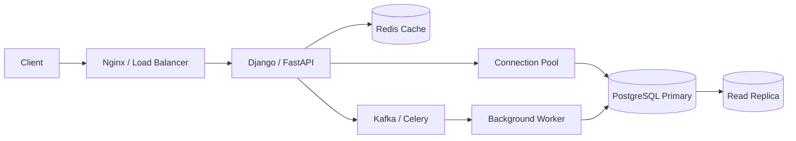

# 29- SQL Query Writing Exercises

## Overview

SQL query-writing exercises are one of the most effective ways to build practical SQL fluency for backend engineering interviews. The goal is not to memorize query patterns, but to translate a business requirement into a correct relational operation and then reason about its behavior under realistic data volume, concurrency, and production constraints.

A strong solution should answer more than "what SQL works?" It should establish:

- What each row in the result represents.
- Which tables and relationships are required.
- Whether duplicates are possible.
- How `NULL` values affect the result.
- Whether aggregation or window functions are required.
- What indexes support the access pattern.
- Whether the query remains efficient at scale.
- Whether concurrent writes can affect correctness.
- Whether tenant or authorization boundaries must be enforced.

The exercises below progress from core query construction to senior-level production scenarios.

---

## Exercise Environment

The examples use a PostgreSQL-oriented schema commonly found in backend systems.

### Schema

```sql
CREATE TABLE customers (
    id bigint PRIMARY KEY,
    email text NOT NULL UNIQUE,
    name text NOT NULL,
    status text NOT NULL,
    created_at timestamptz NOT NULL
);

CREATE TABLE orders (
    id bigint PRIMARY KEY,
    customer_id bigint NOT NULL REFERENCES customers(id),
    status text NOT NULL,
    total_amount numeric(12, 2) NOT NULL,
    created_at timestamptz NOT NULL
);

CREATE TABLE products (
    id bigint PRIMARY KEY,
    name text NOT NULL,
    price numeric(12, 2) NOT NULL,
    active boolean NOT NULL DEFAULT true
);

CREATE TABLE order_items (
    order_id bigint NOT NULL REFERENCES orders(id),
    product_id bigint NOT NULL REFERENCES products(id),
    quantity integer NOT NULL CHECK (quantity > 0),
    unit_price numeric(12, 2) NOT NULL,
    PRIMARY KEY (order_id, product_id)
);

CREATE TABLE payments (
    id bigint PRIMARY KEY,
    order_id bigint NOT NULL REFERENCES orders(id),
    status text NOT NULL,
    amount numeric(12, 2) NOT NULL,
    paid_at timestamptz
);

CREATE TABLE subscriptions (
    id bigint PRIMARY KEY,
    customer_id bigint NOT NULL REFERENCES customers(id),
    status text NOT NULL,
    started_at timestamptz NOT NULL,
    ended_at timestamptz
);
```

A production schema would usually contain additional constraints, indexes, audit columns, tenant identifiers, and state-specific invariants. The exercises intentionally focus on query reasoning.

---

## How to Approach Query Exercises

Before writing SQL, establish the result grain.

For example:

| Requirement | Result grain |
|---|---|
| List customers | One row per customer |
| List orders | One row per order |
| Customer order count | One row per customer |
| Products never ordered | One row per product |
| Latest order per customer | One row per customer |
| Revenue by month | One row per month |
| Top three orders per customer | Up to three rows per customer |

A useful interview workflow is:

1. Identify the required output columns.
2. Define the result grain.
3. Identify the source table representing that grain.
4. Add relationships through joins or existence checks.
5. Apply filters.
6. Add aggregation or window functions only when required.
7. Check `NULL` and duplicate behavior.
8. Check deterministic ordering.
9. Consider indexes and query plans.
10. Consider concurrency and production workload.

---

## Basic SELECT and Filtering Exercises

### Exercise: Active Customers

**Question**

Return all active customers ordered by creation time, newest first.

**Solution**

```sql
SELECT
    id,
    email,
    name,
    created_at
FROM customers
WHERE status = 'active'
ORDER BY created_at DESC, id DESC;
```

**Reasoning**

The result grain is one row per customer. The `WHERE` clause filters rows before ordering. Including `id` as a secondary ordering key makes pagination and result ordering deterministic when multiple customers share the same `created_at`.

**Production considerations**

For a large table, an index matching the filtering and ordering pattern may help:

```sql
CREATE INDEX CONCURRENTLY idx_customers_active_created
ON customers (created_at DESC, id DESC)
WHERE status = 'active';
```

A partial index is appropriate when the query repeatedly targets a stable subset such as active customers.

---

### Exercise: Orders Above a Threshold

**Question**

Return orders above `1000`, excluding cancelled orders.

**Solution**

```sql
SELECT
    id,
    customer_id,
    total_amount,
    status,
    created_at
FROM orders
WHERE total_amount > 1000
  AND status <> 'cancelled'
ORDER BY total_amount DESC;
```

**Interview point**

Be careful with `NULL`. `status <> 'cancelled'` does not match rows where `status` is `NULL`. In this schema `status` is `NOT NULL`, so that behavior is irrelevant by design.

---

### Exercise: Orders Within a Time Range

**Question**

Return orders created during January 2026.

**Preferred solution**

```sql
SELECT
    id,
    customer_id,
    total_amount,
    created_at
FROM orders
WHERE created_at >= TIMESTAMPTZ '2026-01-01 00:00:00+00'
  AND created_at < TIMESTAMPTZ '2026-02-01 00:00:00+00';
```

**Why use a half-open interval?**

The pattern:

```text
[start, end)
```

avoids precision problems around timestamps and works naturally for adjacent intervals.

Avoid patterns such as:

```sql
WHERE created_at <= TIMESTAMPTZ '2026-01-31 23:59:59'
```

because timestamp precision can make this boundary incorrect.

---

## JOIN Exercises

### Exercise: Orders with Customer Information

**Question**

Return every order with the customer's email.

**Solution**

```sql
SELECT
    o.id AS order_id,
    o.total_amount,
    o.status,
    o.created_at,
    c.email
FROM orders AS o
JOIN customers AS c
    ON c.id = o.customer_id;
```

The relationship is many orders to one customer. Because `orders.customer_id` references `customers.id`, each order should normally match exactly one customer.

---

### Exercise: Customers with No Orders

**Question**

Return customers who have never placed an order.

**Solution**

```sql
SELECT
    c.id,
    c.email,
    c.name
FROM customers AS c
WHERE NOT EXISTS (
    SELECT 1
    FROM orders AS o
    WHERE o.customer_id = c.id
);
```

`NOT EXISTS` expresses the business requirement directly: there must not exist an order belonging to the customer.

An equivalent `LEFT JOIN` solution is:

```sql
SELECT
    c.id,
    c.email,
    c.name
FROM customers AS c
LEFT JOIN orders AS o
    ON o.customer_id = c.id
WHERE o.id IS NULL;
```

The `NOT EXISTS` version is often easier to reason about when the requirement is explicitly existence-based.

---

### Exercise: Customers with At Least One Completed Order

**Question**

Return customers who have at least one completed order.

**Solution**

```sql
SELECT
    c.id,
    c.email,
    c.name
FROM customers AS c
WHERE EXISTS (
    SELECT 1
    FROM orders AS o
    WHERE o.customer_id = c.id
      AND o.status = 'completed'
);
```

Do not use a regular join unless you actually need order-level rows. A join can produce multiple rows per customer and may require `DISTINCT` merely to restore the intended grain.

---

### Exercise: Customers and Their Most Recent Order

**Question**

Return every customer and the timestamp of their most recent order, including customers with no orders.

**Solution**

```sql
SELECT
    c.id,
    c.email,
    MAX(o.created_at) AS latest_order_at
FROM customers AS c
LEFT JOIN orders AS o
    ON o.customer_id = c.id
GROUP BY
    c.id,
    c.email;
```

The `LEFT JOIN` preserves customers without orders. For those customers, `MAX(o.created_at)` is `NULL`.

---

## Aggregation Exercises

### Exercise: Order Count Per Customer

**Question**

Return every customer and their number of orders.

**Solution**

```sql
SELECT
    c.id,
    c.email,
    COUNT(o.id) AS order_count
FROM customers AS c
LEFT JOIN orders AS o
    ON o.customer_id = c.id
GROUP BY
    c.id,
    c.email;
```

Use `COUNT(o.id)` rather than `COUNT(*)`.

With a `LEFT JOIN`, `COUNT(*)` counts the preserved customer row even when no order exists. `COUNT(o.id)` counts only matching orders.

---

### Exercise: Customers with More Than Five Orders

**Question**

Return customers who have placed more than five orders.

**Solution**

```sql
SELECT
    c.id,
    c.email,
    COUNT(o.id) AS order_count
FROM customers AS c
JOIN orders AS o
    ON o.customer_id = c.id
GROUP BY
    c.id,
    c.email
HAVING COUNT(o.id) > 5;
```

`WHERE` filters individual rows before grouping. `HAVING` filters groups after aggregation.

---

### Exercise: Revenue by Customer

**Question**

Calculate completed-order revenue per customer.

**Solution**

```sql
SELECT
    c.id,
    c.email,
    COALESCE(SUM(o.total_amount), 0) AS revenue
FROM customers AS c
LEFT JOIN orders AS o
    ON o.customer_id = c.id
   AND o.status = 'completed'
GROUP BY
    c.id,
    c.email;
```

Placing the status condition in the `JOIN` preserves customers who have no completed orders.

This is different from:

```sql
LEFT JOIN orders AS o
    ON o.customer_id = c.id
WHERE o.status = 'completed'
```

The second version effectively removes customers without completed orders and therefore behaves more like an inner join.

---

### Exercise: Monthly Revenue

**Question**

Calculate completed revenue grouped by month.

**Solution**

```sql
SELECT
    date_trunc('month', created_at) AS month,
    SUM(total_amount) AS revenue
FROM orders
WHERE status = 'completed'
GROUP BY date_trunc('month', created_at)
ORDER BY month;
```

For high-volume analytical workloads, repeatedly computing this over a large OLTP table may be expensive. Consider an analytical store, summary table, or materialized view when reporting volume justifies it.

---

## DISTINCT and Duplicate Exercises

### Exercise: Customers Who Ordered a Product

**Question**

Return unique customer IDs who have purchased product `42`.

**Solution**

```sql
SELECT DISTINCT
    o.customer_id
FROM orders AS o
JOIN order_items AS oi
    ON oi.order_id = o.id
WHERE oi.product_id = 42;
```

A more explicitly existence-oriented solution is:

```sql
SELECT
    c.id
FROM customers AS c
WHERE EXISTS (
    SELECT 1
    FROM orders AS o
    JOIN order_items AS oi
        ON oi.order_id = o.id
    WHERE o.customer_id = c.id
      AND oi.product_id = 42
);
```

The second version naturally preserves the customer-level grain.

---

### Exercise: Find Duplicate Emails

**Question**

Identify email values appearing more than once.

**Solution**

```sql
SELECT
    email,
    COUNT(*) AS occurrences
FROM customers
GROUP BY email
HAVING COUNT(*) > 1;
```

In the provided schema, the unique constraint prevents duplicates. The exercise demonstrates how to detect violations in a legacy or staging dataset.

For production data, database constraints should enforce invariants rather than relying solely on periodic detection queries.

---

## CASE and Conditional Aggregation Exercises

### Exercise: Classify Orders by Value

**Question**

Classify orders as `high`, `medium`, or `low` value.

**Solution**

```sql
SELECT
    id,
    total_amount,
    CASE
        WHEN total_amount >= 1000 THEN 'high'
        WHEN total_amount >= 100 THEN 'medium'
        ELSE 'low'
    END AS value_category
FROM orders;
```

`CASE` conditions are evaluated in order. Therefore, place the most restrictive threshold first.

---

### Exercise: Completed vs Cancelled Order Counts

**Question**

Return the number of completed, cancelled, and other orders in one row.

**Solution**

```sql
SELECT
    COUNT(*) FILTER (WHERE status = 'completed') AS completed_orders,
    COUNT(*) FILTER (WHERE status = 'cancelled') AS cancelled_orders,
    COUNT(*) FILTER (
        WHERE status NOT IN ('completed', 'cancelled')
    ) AS other_orders
FROM orders;
```

PostgreSQL's `FILTER` syntax is concise for conditional aggregation.

An equivalent `CASE` approach is:

```sql
SELECT
    SUM(CASE WHEN status = 'completed' THEN 1 ELSE 0 END) AS completed_orders,
    SUM(CASE WHEN status = 'cancelled' THEN 1 ELSE 0 END) AS cancelled_orders
FROM orders;
```

---

## NULL Exercises

### Exercise: Customers Without an Ended Subscription

**Question**

Find active subscriptions that have not ended.

**Solution**

```sql
SELECT
    id,
    customer_id,
    started_at,
    ended_at
FROM subscriptions
WHERE status = 'active'
  AND ended_at IS NULL;
```

Never use:

```sql
WHERE ended_at = NULL
```

`NULL` represents an unknown or missing value and requires `IS NULL` or `IS NOT NULL`.

---

### Exercise: Orders with No Successful Payment

**Question**

Return orders that have no successful payment.

**Solution**

```sql
SELECT
    o.id,
    o.customer_id,
    o.total_amount
FROM orders AS o
WHERE NOT EXISTS (
    SELECT 1
    FROM payments AS p
    WHERE p.order_id = o.id
      AND p.status = 'successful'
);
```

This is safer than many `NOT IN` formulations because `NOT IN` can produce surprising results when the subquery contains `NULL`.

---

## Subquery Exercises

### Exercise: Orders Above the Average Order Value

**Question**

Return orders whose value is above the overall average.

**Solution**

```sql
SELECT
    id,
    customer_id,
    total_amount
FROM orders
WHERE total_amount > (
    SELECT AVG(total_amount)
    FROM orders
);
```

The scalar subquery produces one value.

The business meaning is important: this compares every order against the global average, not the customer's average.

---

### Exercise: Customers Above Their Own Average

**Question**

Return orders whose value is above that customer's average order value.

**Solution**

```sql
SELECT
    o.id,
    o.customer_id,
    o.total_amount
FROM orders AS o
WHERE o.total_amount > (
    SELECT AVG(o2.total_amount)
    FROM orders AS o2
    WHERE o2.customer_id = o.customer_id
);
```

This is a correlated subquery.

For large datasets, a window function may express the same calculation more efficiently:

```sql
SELECT
    id,
    customer_id,
    total_amount
FROM (
    SELECT
        id,
        customer_id,
        total_amount,
        AVG(total_amount) OVER (
            PARTITION BY customer_id
        ) AS customer_average
    FROM orders
) AS x
WHERE total_amount > customer_average;
```

Do not assume correlated subqueries are always slow. Modern optimizers can transform many query forms. Validate with `EXPLAIN`.

---

## CTE Exercises

### Exercise: High-Value Customers

**Question**

Find customers whose completed-order revenue exceeds `10000`.

**Solution**

```sql
WITH customer_revenue AS (
    SELECT
        customer_id,
        SUM(total_amount) AS revenue
    FROM orders
    WHERE status = 'completed'
    GROUP BY customer_id
)
SELECT
    c.id,
    c.email,
    cr.revenue
FROM customers AS c
JOIN customer_revenue AS cr
    ON cr.customer_id = c.id
WHERE cr.revenue > 10000
ORDER BY cr.revenue DESC;
```

The CTE gives the aggregation a clear logical boundary.

A CTE is not automatically a performance optimization. PostgreSQL can inline many CTEs, while explicitly materialized CTEs can create an optimization boundary.

---

## Window Function Exercises

### Exercise: Rank Customers by Revenue

**Question**

Rank customers by completed revenue, with the highest revenue receiving rank `1`.

**Solution**

```sql
SELECT
    customer_id,
    SUM(total_amount) AS revenue,
    RANK() OVER (
        ORDER BY SUM(total_amount) DESC
    ) AS revenue_rank
FROM orders
WHERE status = 'completed'
GROUP BY customer_id;
```

`RANK()` gives tied rows the same rank and leaves gaps after ties.

---

### Exercise: Top Three Orders Per Customer

**Question**

Return the three highest-value orders for every customer.

**Solution**

```sql
WITH ranked_orders AS (
    SELECT
        id,
        customer_id,
        total_amount,
        created_at,
        ROW_NUMBER() OVER (
            PARTITION BY customer_id
            ORDER BY total_amount DESC, id DESC
        ) AS row_number
    FROM orders
)
SELECT
    id,
    customer_id,
    total_amount,
    created_at
FROM ranked_orders
WHERE row_number <= 3
ORDER BY customer_id, total_amount DESC, id DESC;
```

This is a classic interview problem because `LIMIT 3` would limit the entire result set rather than three rows per customer.

---

### Exercise: Latest Order Per Customer

**Question**

Return exactly one latest order per customer.

**Solution**

```sql
SELECT
    id,
    customer_id,
    total_amount,
    created_at
FROM (
    SELECT
        o.*,
        ROW_NUMBER() OVER (
            PARTITION BY customer_id
            ORDER BY created_at DESC, id DESC
        ) AS row_number
    FROM orders AS o
) AS ranked
WHERE row_number = 1;
```

PostgreSQL also provides `DISTINCT ON`:

```sql
SELECT DISTINCT ON (customer_id)
    id,
    customer_id,
    total_amount,
    created_at
FROM orders
ORDER BY customer_id, created_at DESC, id DESC;
```

`DISTINCT ON` is PostgreSQL-specific and requires an appropriate `ORDER BY` to define which row survives.

---

## Pagination Exercises

### Exercise: Offset Pagination

**Question**

Return page 5 of customers with 50 customers per page.

**Solution**

```sql
SELECT
    id,
    email,
    name,
    created_at
FROM customers
ORDER BY created_at DESC, id DESC
LIMIT 50
OFFSET 200;
```

This is simple and often acceptable for shallow pagination.

At large offsets, the database may still need to process and discard many rows.

---

### Exercise: Keyset Pagination

**Question**

Implement the next page after the last row `(created_at, id)`.

**Solution**

```sql
SELECT
    id,
    email,
    name,
    created_at
FROM customers
WHERE (created_at, id) < ($1, $2)
ORDER BY created_at DESC, id DESC
LIMIT 50;
```

This pattern scales better for deep pagination when an index supports the ordering:

```sql
CREATE INDEX CONCURRENTLY idx_customers_created_id
ON customers (created_at DESC, id DESC);
```

The cursor must contain enough ordering information to make the result deterministic.

---

## INSERT Exercises

### Exercise: Insert a Customer

**Question**

Insert a customer using parameterized SQL.

**Solution**

```sql
INSERT INTO customers (
    id,
    email,
    name,
    status,
    created_at
)
VALUES (
    $1,
    $2,
    $3,
    'active',
    now()
);
```

Application code should bind values through the database driver rather than constructing SQL strings.

For example, Python code using a PostgreSQL driver should bind parameters instead of interpolating user input into SQL.

---

### Exercise: Insert Only If Not Already Present

**Question**

Insert a customer while ignoring an existing email.

**Solution**

```sql
INSERT INTO customers (
    id,
    email,
    name,
    status,
    created_at
)
VALUES (
    $1,
    $2,
    $3,
    'active',
    now()
)
ON CONFLICT (email) DO NOTHING;
```

The unique constraint is essential. Application-side "check then insert" logic is race-prone:

```text
Request A: SELECT email
Request B: SELECT email
Request A: INSERT
Request B: INSERT
```

The database constraint provides the concurrency-safe invariant.

---

## UPDATE Exercises

### Exercise: Update an Order Atomically

**Question**

Increase an order's amount by 10%.

**Solution**

```sql
UPDATE orders
SET total_amount = total_amount * 1.10
WHERE id = $1;
```

Do not read the value into application code and then write it back unless there is a deliberate concurrency strategy.

This:

```text
SELECT total_amount
UPDATE total_amount
```

can create lost-update problems under concurrent requests.

---

### Exercise: Update Only Pending Orders

**Question**

Mark an order as completed only if it is currently pending.

**Solution**

```sql
UPDATE orders
SET status = 'completed'
WHERE id = $1
  AND status = 'pending';
```

The application can inspect the affected-row count:

- `1` row updated → state transition succeeded.
- `0` rows updated → order did not exist or was no longer pending.

This pattern is useful for optimistic concurrency and state transitions.

---

## DELETE Exercises

### Exercise: Delete Cancelled Orders Older Than One Year

**Question**

Delete cancelled orders older than one year.

**Solution**

```sql
DELETE FROM orders
WHERE status = 'cancelled'
  AND created_at < now() - INTERVAL '1 year';
```

For a large production table, do not blindly execute a massive delete during peak traffic. Large deletes can generate substantial WAL, create dead tuples, increase vacuum pressure, and hold locks for the duration of the statement.

Prefer bounded batches or partition lifecycle operations when the workload supports them.

---

## Advanced Query Exercises

### Exercise: Customers Who Ordered Every Product in a Category

**Question**

Assume products have a `category_id`. Find customers who have purchased every product in category `10`.

**Solution**

A relational division pattern using nested `NOT EXISTS` is:

```sql
SELECT c.id
FROM customers AS c
WHERE NOT EXISTS (
    SELECT 1
    FROM products AS p
    WHERE p.category_id = 10
      AND NOT EXISTS (
          SELECT 1
          FROM orders AS o
          JOIN order_items AS oi
              ON oi.order_id = o.id
          WHERE o.customer_id = c.id
            AND oi.product_id = p.id
    )
);
```

The logic is:

> There must not exist a product in the category that the customer has not purchased.

This pattern is worth understanding because it demonstrates how nested existence conditions express universal requirements.

---

### Exercise: Find the Second-Highest Order

**Question**

Return the second-highest distinct order value.

**Solution**

```sql
SELECT total_amount
FROM (
    SELECT DISTINCT total_amount
    FROM orders
) AS amounts
ORDER BY total_amount DESC
OFFSET 1
LIMIT 1;
```

A window-function solution is:

```sql
SELECT total_amount
FROM (
    SELECT
        total_amount,
        DENSE_RANK() OVER (
            ORDER BY total_amount DESC
        ) AS value_rank
    FROM orders
) AS ranked
WHERE value_rank = 2
LIMIT 1;
```

Clarify whether "second highest" means second row or second distinct value. Interviewers often use this ambiguity intentionally.

---

### Exercise: Detect Customers with Multiple Active Subscriptions

**Question**

Find customers with more than one active subscription.

**Solution**

```sql
SELECT
    customer_id,
    COUNT(*) AS active_subscription_count
FROM subscriptions
WHERE status = 'active'
GROUP BY customer_id
HAVING COUNT(*) > 1;
```

If the business invariant says only one active subscription is allowed, the query is useful for detecting existing violations, but the long-term solution should enforce the invariant.

For PostgreSQL, a partial unique index may be appropriate:

```sql
CREATE UNIQUE INDEX CONCURRENTLY idx_one_active_subscription
ON subscriptions (customer_id)
WHERE status = 'active';
```

---

## Query Writing with Multiple Relationships

### Exercise: Customer Order and Payment Status

**Question**

Return orders together with whether the order has a successful payment.

**Solution**

```sql
SELECT
    o.id,
    o.customer_id,
    o.total_amount,
    EXISTS (
        SELECT 1
        FROM payments AS p
        WHERE p.order_id = o.id
          AND p.status = 'successful'
    ) AS has_successful_payment
FROM orders AS o;
```

This avoids joining all payment rows when only existence is required.

If the payment table can contain multiple successful records, a normal join could multiply order rows.

---

### Exercise: Unpaid Completed Orders

**Question**

Find completed orders for which no successful payment exists.

**Solution**

```sql
SELECT
    o.id,
    o.customer_id,
    o.total_amount,
    o.created_at
FROM orders AS o
WHERE o.status = 'completed'
  AND NOT EXISTS (
      SELECT 1
      FROM payments AS p
      WHERE p.order_id = o.id
        AND p.status = 'successful'
  );
```

A useful production index is:

```sql
CREATE INDEX CONCURRENTLY idx_payments_successful_order
ON payments (order_id)
WHERE status = 'successful';
```

The index matches the existence lookup rather than indexing every payment row unnecessarily.

---

## Backend API Query Exercises

### Exercise: Search Customers

**Question**

Implement a customer search API supporting email prefix matching and deterministic pagination.

**Solution**

```sql
SELECT
    id,
    email,
    name,
    created_at
FROM customers
WHERE email ILIKE $1 || '%'
ORDER BY email ASC, id ASC
LIMIT $2;
```

For prefix search, a suitable index may be necessary depending on collation and search requirements. PostgreSQL's `pg_trgm` extension is often useful for broader substring search, while prefix searches can use specialized indexing strategies.

Do not implement search using:

```sql
WHERE email LIKE '%' || $1 || '%'
```

and assume a normal B-tree index will solve it. Leading wildcards generally prevent ordinary B-tree prefix matching.

---

### Exercise: API Order Listing by Customer

**Question**

Return a customer's recent orders for an API endpoint.

**Solution**

```sql
SELECT
    id,
    total_amount,
    status,
    created_at
FROM orders
WHERE customer_id = $1
ORDER BY created_at DESC, id DESC
LIMIT $2;
```

A supporting index:

```sql
CREATE INDEX CONCURRENTLY idx_orders_customer_created
ON orders (customer_id, created_at DESC, id DESC);
```

This is a common backend access pattern and should be designed around the actual API query rather than around generic indexing rules.

---

## ORM Query Exercises

SQL knowledge remains important when using Django or SQLAlchemy because the ORM ultimately produces database queries.

### Django Example

Find customers with at least one completed order:

```python
customers = Customer.objects.filter(
    orders__status="completed"
).distinct()
```

If the application only needs existence semantics, Django's `Exists` can express that more directly:

```python
from django.db.models import Exists, OuterRef

completed_orders = Order.objects.filter(
    customer_id=OuterRef("pk"),
    status="completed",
)

customers = Customer.objects.annotate(
    has_completed_order=Exists(completed_orders)
).filter(
    has_completed_order=True
)
```

The generated SQL should still be inspected for high-volume endpoints.

### SQLAlchemy Example

```python
from sqlalchemy import select

completed_order = (
    select(Order.id)
    .where(
        Order.customer_id == Customer.id,
        Order.status == "completed",
    )
    .exists()
)

stmt = select(Customer).where(completed_order)
```

The important interview point is that ORM abstractions do not eliminate SQL concerns such as cardinality, indexes, plans, transactions, or N+1 queries.

---

## N+1 Query Exercise

### Exercise: Customer List with Order Count

**Question**

An API returns 100 customers and their order count. Avoid issuing one query per customer.

**Incorrect approach**

```text
SELECT customers...
SELECT COUNT(*) FROM orders WHERE customer_id = 1
SELECT COUNT(*) FROM orders WHERE customer_id = 2
...
```

This creates an N+1 query pattern.

**Better SQL**

```sql
SELECT
    c.id,
    c.email,
    COUNT(o.id) AS order_count
FROM customers AS c
LEFT JOIN orders AS o
    ON o.customer_id = c.id
GROUP BY
    c.id,
    c.email;
```

The correct solution depends on result size and workload. For extremely high-volume dashboards, precomputed counters or analytical read models may be preferable.

---

## Transaction and Concurrency Exercises

### Exercise: Reserve Inventory Safely

Assume:

```text
products(id, stock_quantity)
```

**Question**

Decrement stock only when stock is available.

**Solution**

```sql
UPDATE products
SET stock_quantity = stock_quantity - 1
WHERE id = $1
  AND stock_quantity > 0;
```

The application checks the affected-row count.

This is safer than:

```text
SELECT stock_quantity
if stock_quantity > 0:
    UPDATE ...
```

because concurrent requests can both observe the same stock value.

For more complex reservation workflows, combine the atomic update with a transaction and durable reservation record.

---

### Exercise: Claim a Queue Item

Assume:

```text
jobs(id, status, available_at, locked_at)
```

Multiple workers need to claim jobs without processing the same row simultaneously.

A PostgreSQL pattern is:

```sql
WITH next_job AS (
    SELECT id
    FROM jobs
    WHERE status = 'pending'
      AND available_at <= now()
    ORDER BY available_at, id
    FOR UPDATE SKIP LOCKED
    LIMIT 1
)
UPDATE jobs AS j
SET
    status = 'processing',
    locked_at = now()
FROM next_job
WHERE j.id = next_job.id
RETURNING j.*;
```

`SKIP LOCKED` is useful for queue-like workloads where workers should avoid waiting for rows claimed by other workers.

It does not provide fairness guarantees, and rows can be temporarily skipped. A production queue should also handle worker crashes, lease expiry, retries, and idempotency.

---

## Production Performance Exercises

### Exercise: Diagnose a Slow Query

Given:

```sql
SELECT
    o.id,
    o.total_amount
FROM orders AS o
WHERE o.customer_id = $1
  AND o.status = 'completed'
ORDER BY o.created_at DESC
LIMIT 50;
```

A senior engineer should not immediately say "add an index."

First inspect:

```sql
EXPLAIN (ANALYZE, BUFFERS)
SELECT
    o.id,
    o.total_amount
FROM orders AS o
WHERE o.customer_id = $1
  AND o.status = 'completed'
ORDER BY o.created_at DESC
LIMIT 50;
```

Then evaluate:

- Actual versus estimated rows.
- Scan type.
- Filter selectivity.
- Sort cost.
- Buffer hits and reads.
- Planning time.
- Execution time.
- Data distribution.
- Query frequency.
- Whether the endpoint is latency-sensitive.

A possible index is:

```sql
CREATE INDEX CONCURRENTLY idx_orders_customer_completed_created
ON orders (customer_id, created_at DESC)
WHERE status = 'completed';
```

The index should be validated against the real workload rather than added solely because the query contains a `WHERE` clause.

---

### Exercise: Query with a Missing Index

**Question**

This query becomes slow as the orders table grows:

```sql
SELECT
    id,
    total_amount,
    created_at
FROM orders
WHERE customer_id = $1
ORDER BY created_at DESC
LIMIT 50;
```

A likely access-pattern index is:

```sql
CREATE INDEX CONCURRENTLY idx_orders_customer_created
ON orders (customer_id, created_at DESC);
```

The reasoning is:

```text
customer_id equality
        ↓
created_at ordering
        ↓
LIMIT 50
```

This allows PostgreSQL to locate the customer's range and retrieve recent rows without sorting the entire matching set.

---

## Multi-Tenant Query Exercise

### Exercise: Tenant-Isolated Orders

Assume every table contains:

```text
tenant_id bigint NOT NULL
```

**Question**

Return orders for a tenant.

**Solution**

```sql
SELECT
    id,
    customer_id,
    total_amount,
    status,
    created_at
FROM orders
WHERE tenant_id = $1
ORDER BY created_at DESC, id DESC
LIMIT $2;
```

Tenant filtering is part of correctness and security, not merely application filtering.

For frequently accessed tenant-scoped queries, indexes often need to include the tenant key:

```sql
CREATE INDEX CONCURRENTLY idx_orders_tenant_created
ON orders (tenant_id, created_at DESC, id DESC);
```

For stronger defense in depth, PostgreSQL Row Level Security can enforce tenant isolation at the database layer.

The application should not assume that a developer will remember to add `tenant_id` to every query forever.

---

## Analytical Query Exercise

### Exercise: Top Customers by Monthly Revenue

**Question**

Return the top 10 customers by completed revenue in the current month.

**Solution**

```sql
SELECT
    customer_id,
    SUM(total_amount) AS revenue
FROM orders
WHERE status = 'completed'
  AND created_at >= date_trunc('month', now())
  AND created_at < date_trunc('month', now()) + INTERVAL '1 month'
GROUP BY customer_id
ORDER BY revenue DESC, customer_id
LIMIT 10;
```

For a small dataset, this may be perfectly acceptable.

For a large production system, ask:

- How frequently is the query executed?
- Is it serving an API or an internal report?
- Can the query run on a read replica?
- Should it run against an OLAP system?
- Can the result be cached?
- Should a materialized or pre-aggregated view be used?
- How fresh must the result be?

Query syntax alone does not determine architecture.

---

## Query Design with EXPLAIN

For performance exercises, use PostgreSQL execution plans instead of relying on intuition.

```sql
EXPLAIN (ANALYZE, BUFFERS, VERBOSE)
SELECT
    o.id,
    o.total_amount
FROM orders AS o
WHERE o.customer_id = $1
ORDER BY o.created_at DESC
LIMIT 50;
```

Focus on:

| Plan signal | What to investigate |
|---|---|
| Sequential Scan | Selectivity, table size, statistics, index usefulness |
| Index Scan | Index quality and heap access |
| Index Only Scan | Visibility map and included columns |
| Bitmap Heap Scan | Multiple matches and random heap access |
| Sort | Whether ordering can be supported by an index |
| Hash Join | Join cardinality and memory |
| Nested Loop | Outer-row count and inner lookup cost |
| Rows Removed by Filter | Possible access-path mismatch |
| Large estimated/actual row difference | Statistics or correlation problems |
| Temp read/write | Memory pressure or expensive sort/hash |

`EXPLAIN` shows the planner's estimates. `EXPLAIN ANALYZE` executes the query and reports actual behavior, so use it carefully against production data.

---

## Production Scenario Exercises

### Scenario: API Suddenly Becomes Slow

**Question**

An endpoint normally responds in 100 ms but now takes 4 seconds. What do you investigate?

**Strong answer**

Do not immediately add an index.

Check the complete latency path:

```text
Client
  ↓
Nginx / Load Balancer
  ↓
Application
  ↓
Connection Pool
  ↓
Database
  ↓
Query Execution
  ↓
Result Transfer
```

Investigate:

- Database query latency.
- Connection acquisition time.
- Lock waits.
- Active sessions.
- Query frequency.
- Execution-plan changes.
- Data growth.
- Statistics freshness.
- Replica lag if using replicas.
- CPU and I/O.
- Recent deployments.
- Retry storms.
- N+1 behavior.
- Network latency.

Useful PostgreSQL diagnostics include:

```sql
SELECT
    pid,
    state,
    wait_event_type,
    wait_event,
    query_start,
    query
FROM pg_stat_activity
WHERE state <> 'idle';
```

The senior-level answer distinguishes query execution time from time spent waiting for a connection, lock, I/O, or another dependency.

---

### Scenario: Database CPU Is 95%

**Question**

How do you identify the cause?

Start with workload evidence:

```sql
SELECT
    calls,
    total_exec_time,
    mean_exec_time,
    rows,
    query
FROM pg_stat_statements
ORDER BY total_exec_time DESC
LIMIT 20;
```

Then investigate:

- Highest total CPU-consuming queries.
- Highest-frequency queries.
- Recent plan changes.
- Sequential scans.
- Expensive joins.
- Sorts and aggregations.
- N+1 queries.
- Retry amplification.
- Background workers.
- Autovacuum or maintenance activity.
- Connection concurrency.

Optimizing one slow query may not help if another query executes millions of times.

---

### Scenario: Connection Pool Is Exhausted

**Question**

The application reports database connection timeouts, but the database CPU is only 40%. What might be happening?

Possible causes include:

- Long-running transactions.
- Lock contention.
- Slow queries.
- Idle-in-transaction sessions.
- Connection leaks.
- External calls inside transactions.
- Pool size too small for legitimate concurrency.
- Too many application workers.
- Database connection limits.
- Replica or primary failure causing reconnect storms.

Inspect:

```sql
SELECT
    state,
    wait_event_type,
    wait_event,
    COUNT(*)
FROM pg_stat_activity
GROUP BY
    state,
    wait_event_type,
    wait_event
ORDER BY COUNT(*) DESC;
```

The important distinction is:

> Low database CPU does not mean database capacity is available.

Sessions may be waiting on locks, I/O, connections, or other resources.

---

### Scenario: Query Works in Development but Is Slow in Production

**Question**

What could explain the difference?

Common causes include:

- Production has much more data.
- Data distribution differs.
- Statistics differ.
- Indexes differ.
- Production query parameters produce different selectivity.
- Cache state differs.
- Production has concurrent workload.
- Production experiences lock contention.
- Replica lag changes routing behavior.
- Connection pool behavior differs.
- Production executes the query much more frequently.

Compare:

```sql
EXPLAIN (ANALYZE, BUFFERS)
SELECT ...;
```

and inspect actual production characteristics rather than assuming the SQL text itself changed.

---

## SQL Security Exercises

### Exercise: Prevent SQL Injection

**Question**

An API accepts an email address. Which approach is safe?

**Unsafe**

```python
query = f"SELECT id FROM customers WHERE email = '{email}'"
```

**Safe**

Use parameter binding through the database driver or ORM.

Conceptually:

```sql
SELECT id
FROM customers
WHERE email = $1;
```

The parameter is treated as data rather than executable SQL syntax.

Parameterized queries do not automatically make dynamic SQL safe when identifiers such as table names, column names, or sort expressions are dynamically constructed. Those require strict allowlisting or identifier-safe composition.

---

### Exercise: Secure Dynamic Ordering

**Question**

An API allows sorting by `name`, `email`, or `created_at`.

Do not directly concatenate arbitrary input:

```text
ORDER BY <user_input>
```

Instead, map allowed API values to known SQL expressions:

```python
sort_columns = {
    "name": "name",
    "email": "email",
    "created_at": "created_at",
}

sort_expression = sort_columns[user_value]
```

Only the allowlisted expression should become part of the SQL structure.

Values should still be parameterized.

---

## Senior-Level Query Review Exercise

Consider:

```sql
SELECT DISTINCT
    c.id,
    c.email
FROM customers AS c
JOIN orders AS o
    ON o.customer_id = c.id
JOIN payments AS p
    ON p.order_id = o.id
WHERE p.status = 'successful';
```

**Question**

Would you approve this query?

It may be correct, but review it against the actual requirement.

If the requirement is:

> Return customers who have at least one successful payment.

Then existence semantics are clearer:

```sql
SELECT
    c.id,
    c.email
FROM customers AS c
WHERE EXISTS (
    SELECT 1
    FROM orders AS o
    JOIN payments AS p
        ON p.order_id = o.id
    WHERE o.customer_id = c.id
      AND p.status = 'successful'
);
```

The original query generates potentially many customer rows and then removes duplicates with `DISTINCT`.

That can indicate that the query was written around table relationships rather than around the required result grain.

The senior review should ask:

- Is `DISTINCT` logically necessary?
- What is the result grain?
- Can `EXISTS` express the requirement better?
- How many rows are generated before deduplication?
- What indexes support the access path?
- Is the query executed frequently?
- Does tenant authorization apply?
- Can duplicate payment records exist?
- Is the result served synchronously by an API?

---

## Query Correctness Checklist

Before considering a query complete, verify:

| Area | Question |
|---|---|
| Result grain | What does one result row represent? |
| Joins | Can any join multiply rows unexpectedly? |
| Filtering | Are predicates applied at the correct stage? |
| `NULL` | What happens when a value is missing? |
| Aggregation | Is grouping performed at the intended grain? |
| Ordering | Is ordering deterministic? |
| Pagination | Does pagination remain correct as data changes? |
| Time | Are boundaries and time zones explicit? |
| Security | Is tenant/resource authorization enforced? |
| Concurrency | Can concurrent writes invalidate assumptions? |
| Constraints | Can the database enforce the invariant? |
| Performance | Does the query have an appropriate access path? |
| Scale | What happens when the table grows by 100x? |
| Observability | Can query behavior be measured in production? |

---

## Query Performance Checklist

For a production query, investigate:

1. Actual SQL generated by the application.
2. Parameter values and selectivity.
3. `EXPLAIN (ANALYZE, BUFFERS)`.
4. Estimated versus actual cardinality.
5. Index design.
6. Join strategy.
7. Sort and aggregation behavior.
8. Result-set size.
9. Query frequency.
10. Lock and wait behavior.
11. Connection-pool impact.
12. Replica behavior.
13. Cache interaction.
14. Background workload.
15. Data growth trajectory.

Do not optimize only for one execution of a query. A 50 ms query executed once per minute may matter less than a 5 ms query executed 100,000 times per minute.

---

## Common Query-Writing Mistakes

### Using `DISTINCT` to Hide a Join Bug

`DISTINCT` can remove duplicate output, but it does not fix an incorrect join relationship.

First determine why the join multiplies rows.

### Using `LIMIT 1` Without Deterministic Ordering

This:

```sql
SELECT *
FROM orders
WHERE customer_id = $1
LIMIT 1;
```

does not define which order should be returned.

Use:

```sql
SELECT *
FROM orders
WHERE customer_id = $1
ORDER BY created_at DESC, id DESC
LIMIT 1;
```

### Using `NOT IN` Without Considering `NULL`

This can behave unexpectedly:

```sql
WHERE id NOT IN (SELECT customer_id FROM ...)
```

when the subquery can contain `NULL`.

Prefer `NOT EXISTS` when expressing absence.

### Filtering a `LEFT JOIN` in `WHERE`

This:

```sql
FROM customers c
LEFT JOIN orders o
    ON o.customer_id = c.id
WHERE o.status = 'completed'
```

removes customers without matching orders.

If unmatched customers must remain, move the condition into the join:

```sql
FROM customers c
LEFT JOIN orders o
    ON o.customer_id = c.id
   AND o.status = 'completed'
```

### Using `OFFSET` for Deep Pagination

Large offsets can become increasingly expensive.

Use keyset pagination where the API semantics permit it.

### Assuming Every Slow Query Needs an Index

Slow queries may instead be caused by:

- Incorrect joins.
- Bad cardinality estimates.
- Lock waits.
- Large result sets.
- Sorts.
- Memory pressure.
- Connection contention.
- Replica lag.
- N+1 queries.

### Performing Read-Modify-Write in Application Code

For counters, stock, balances, and state transitions, consider atomic SQL or explicit concurrency control.

### Ignoring Query Frequency

Performance must be evaluated as workload:

```text
total impact ≈ query cost × execution frequency × concurrency
```

The exact relationship is more complex, but the principle is important for prioritization.

---

## SQL Exercise Interview Traps

Interviewers commonly test whether you notice hidden assumptions.

### "Find the Latest Record"

Ask:

- Latest by which timestamp?
- What happens when timestamps tie?
- Should cancelled records count?
- Should soft-deleted records count?
- Is exactly one row required?

### "Find Users Without Orders"

Ask:

- Should users with `NULL` relationships count?
- Can duplicate orders exist?
- Is `NOT EXISTS` preferable?
- Does tenant scope apply?

### "Top Three Per Customer"

Ask:

- Top three by what?
- What happens on ties?
- Should ties expand the result?
- Is `ROW_NUMBER`, `RANK`, or `DENSE_RANK` correct?

### "Second-Highest Salary"

Ask:

- Second row or second distinct salary?
- What if fewer than two distinct salaries exist?
- Should `NULL` salaries count?

### "Calculate Revenue"

Ask:

- Which order statuses count?
- Which currency?
- Gross or net revenue?
- Are refunds represented?
- Can duplicate payments exist?
- Is this an OLTP query or analytical workload?

### "Make It Fast"

Ask:

- What latency target?
- What data volume?
- How often is it executed?
- What is the current execution plan?
- Is the bottleneck CPU, I/O, locks, network, or connection acquisition?
- Can the workload be cached or moved to an analytical system?

---

## Production Architecture Around SQL Queries

A backend query does not operate in isolation.



A production query may therefore be affected by:

- API concurrency.
- Connection-pool limits.
- Transaction boundaries.
- Redis cache behavior.
- Background workers.
- Kafka consumers.
- Read-replica routing.
- Database CPU and I/O.
- Locks and long-running transactions.
- Deployment behavior.

Senior SQL reasoning connects query semantics to this complete system.

---

## SQL Query Writing Exercise Progression

Use the following progression for interview preparation:

| Level | Exercises |
|---|---|
| Intermediate | `SELECT`, `WHERE`, `ORDER BY`, joins, `GROUP BY`, `HAVING` |
| Strong Intermediate | `NULL`, `CASE`, `EXISTS`, `NOT EXISTS`, subqueries, CTEs |
| Advanced | Window functions, ranking, keyset pagination, conditional aggregation |
| Backend Advanced | Atomic updates, upserts, transaction-aware queries, queue claiming |
| Senior | Execution plans, indexing, cardinality, concurrency, tenant isolation |
| Production Senior | Lock contention, replicas, connection pools, workload isolation, OLAP, observability |

---

## Practice Method

For each exercise, do not stop after producing SQL.

Review the solution using this sequence:

1. **Expected result grain**
2. **Tables involved**
3. **Relationship cardinality**
4. **Query structure**
5. **Why the query is correct**
6. **Index requirements**
7. **Complexity / workload implications**
8. **Concurrency implications**
9. **Edge cases**
10. **Production risks**

For senior-level preparation, practice explaining the query verbally before writing it. The interviewer is often evaluating whether you can convert ambiguous business requirements into precise database behavior.

Do not move forward merely because you can reproduce an answer. For each exercise, be able to explain **why the query is correct, what assumptions it makes, and how it behaves when the dataset becomes large or concurrent**.

---

## Key Takeaways

- **Define result grain before writing SQL:** knowing whether the result represents customers, orders, products, or relationships prevents many join and aggregation bugs.
- **Use SQL constructs to express business intent:** `EXISTS`, `NOT EXISTS`, aggregation, CTEs, and window functions each solve different classes of problems.
- **Correctness includes edge cases:** `NULL`, duplicate relationships, deterministic ordering, time boundaries, tenant isolation, and concurrent updates must be considered explicitly.
- **Production SQL requires workload awareness:** indexes, pagination, query frequency, execution plans, result-set size, connection usage, and background workers all influence real-world performance.
- **Senior query writing connects SQL to system design:** constraints, transactions, concurrency, caching, replicas, observability, security, and scalability should influence how important queries are designed.