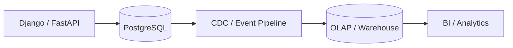
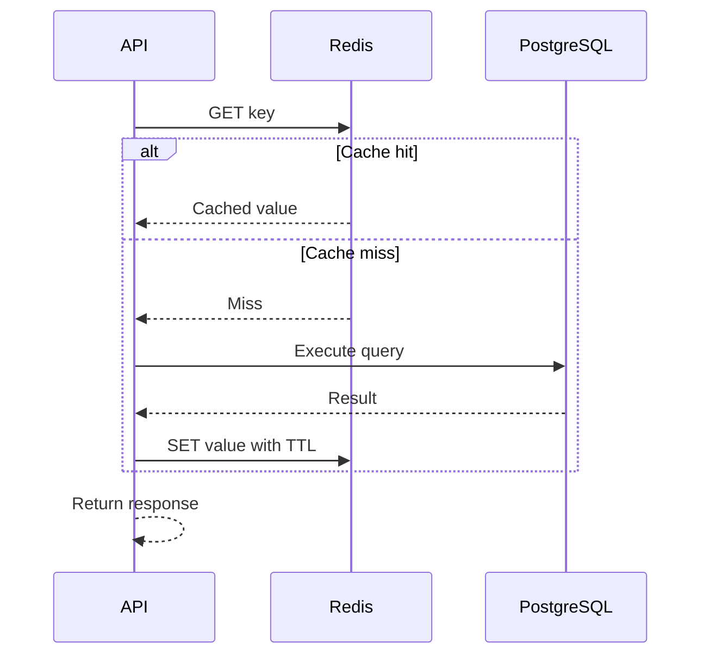
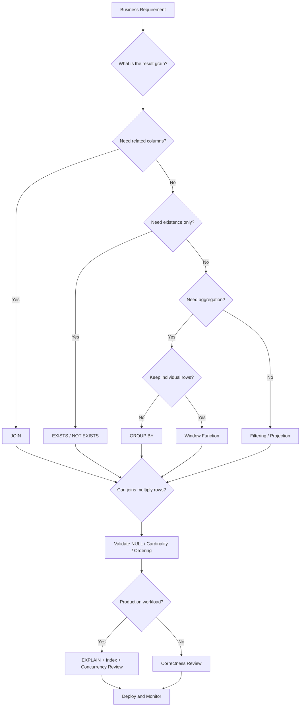

# 30- SQL Interview Decision Making

## Overview

Senior SQL interviews rarely evaluate syntax alone. The stronger signal is whether you can make the right database decision when multiple technically valid solutions exist.

For the same requirement, you may be able to use:

- `JOIN` or `EXISTS`
- `IN` or `EXISTS`
- Subquery or CTE
- `GROUP BY` or window functions
- `DISTINCT` or a better join condition
- Offset or keyset pagination
- Application logic or atomic SQL
- An index or a query rewrite
- Primary database or read replica
- PostgreSQL aggregation or an analytical system
- Synchronous execution or asynchronous processing

The senior engineer distinguishes these choices using **correctness, cardinality, workload, concurrency, operational risk, and business requirements**.

A useful mental model is:

```text
Business requirement
        ↓
Result grain
        ↓
Correct relational operation
        ↓
Edge cases and invariants
        ↓
Concurrency requirements
        ↓
Execution plan
        ↓
Indexes and workload
        ↓
Production architecture
```

The objective is not to find the shortest SQL query. It is to select the implementation that best matches the requirement and remains correct and operationally safe at scale.

---

## The Core Decision Framework

When presented with a SQL problem, ask these questions in order:

| Question | Why it matters |
|---|---|
| What does one result row represent? | Establishes result grain |
| Which table naturally represents that grain? | Determines the starting relation |
| Do I need related rows or only their existence? | Distinguishes `JOIN` from `EXISTS` |
| Can relationships multiply rows? | Prevents cardinality bugs |
| Are `NULL` values meaningful? | Prevents three-valued logic bugs |
| Is aggregation required? | Determines grouping strategy |
| Is ranking within a group required? | Suggests window functions |
| Does ordering need to be deterministic? | Critical for pagination and latest-record queries |
| What happens under concurrent writes? | Determines transaction/concurrency strategy |
| How large can the dataset become? | Determines indexing and architecture |
| How frequently does the query execute? | Determines workload impact |
| Is the query OLTP or analytical? | May determine database architecture |

This sequence prevents premature optimization.

---

## Result Grain Comes First

Result grain describes what one row in the final result represents.

Examples:

```text
Customer list
→ one row per customer

Order list
→ one row per order

Customer revenue
→ one row per customer

Top three orders per customer
→ up to three rows per customer

Customer with at least one order
→ one row per customer
```

Many SQL bugs are actually grain errors.

For example:

```sql
SELECT
    c.id,
    o.id
FROM customers AS c
JOIN orders AS o
    ON o.customer_id = c.id;
```

This produces one row per order, not one row per customer.

If the requirement is:

> Return customers who have at least one order.

then:

```sql
SELECT c.id
FROM customers AS c
WHERE EXISTS (
    SELECT 1
    FROM orders AS o
    WHERE o.customer_id = c.id
);
```

is usually a better expression of the required grain.

---

## JOIN vs EXISTS

This is one of the most important SQL design decisions.

### Use JOIN When

Use a join when you need columns from the related relation or when the relationship itself forms part of the result.

```sql
SELECT
    o.id,
    c.email
FROM orders AS o
JOIN customers AS c
    ON c.id = o.customer_id;
```

### Use EXISTS When

Use `EXISTS` when the business requirement is primarily:

> Does at least one related row exist?

```sql
SELECT
    c.id,
    c.email
FROM customers AS c
WHERE EXISTS (
    SELECT 1
    FROM orders AS o
    WHERE o.customer_id = c.id
      AND o.status = 'completed'
);
```

### Decision Table

| Requirement | Preferred construct |
|---|---|
| Need columns from both tables | `JOIN` |
| Need only existence | `EXISTS` |
| Need absence | `NOT EXISTS` |
| Need every related row | `JOIN` |
| Need aggregate across relationship | `JOIN` + aggregation |
| Relationship can multiply result unnecessarily | Consider `EXISTS` |

`EXISTS` can also allow the executor to stop looking once a qualifying row is found. Do not treat this as a guaranteed optimization independent of the plan; validate with `EXPLAIN`.

---

## INNER JOIN vs LEFT JOIN

### INNER JOIN

Use when unmatched rows should be removed.

```sql
SELECT
    o.id,
    c.email
FROM orders AS o
JOIN customers AS c
    ON c.id = o.customer_id;
```

### LEFT JOIN

Use when rows from the left relation must remain even without a match.

```sql
SELECT
    c.id,
    COUNT(o.id) AS order_count
FROM customers AS c
LEFT JOIN orders AS o
    ON o.customer_id = c.id
GROUP BY c.id;
```

The distinction becomes especially important with filtering.

### Common Mistake

This:

```sql
SELECT
    c.id,
    o.id
FROM customers AS c
LEFT JOIN orders AS o
    ON o.customer_id = c.id
WHERE o.status = 'completed';
```

removes customers without completed orders.

If those customers must remain:

```sql
SELECT
    c.id,
    o.id
FROM customers AS c
LEFT JOIN orders AS o
    ON o.customer_id = c.id
   AND o.status = 'completed';
```

The location of the predicate changes the semantics.

---

## WHERE vs HAVING

Use `WHERE` for row-level filtering before aggregation.

```sql
SELECT
    customer_id,
    COUNT(*) AS completed_orders
FROM orders
WHERE status = 'completed'
GROUP BY customer_id;
```

Use `HAVING` for filtering groups after aggregation.

```sql
SELECT
    customer_id,
    COUNT(*) AS completed_orders
FROM orders
GROUP BY customer_id
HAVING COUNT(*) > 10;
```

A common senior-level explanation is:

> `WHERE` reduces input rows; `HAVING` filters aggregate groups.

When possible, filter early because reducing input can lower join and aggregation work.

---

## GROUP BY vs Window Functions

The decision depends on whether the result should collapse rows.

### GROUP BY

Use `GROUP BY` when you want one row per group.

```sql
SELECT
    customer_id,
    SUM(total_amount) AS revenue
FROM orders
GROUP BY customer_id;
```

The original order-level rows are collapsed.

### Window Function

Use a window function when you need aggregate or ranking information while retaining individual rows.

```sql
SELECT
    id,
    customer_id,
    total_amount,
    AVG(total_amount) OVER (
        PARTITION BY customer_id
    ) AS customer_average
FROM orders;
```

The original order rows remain.

### Decision Table

| Requirement | Construct |
|---|---|
| One row per group | `GROUP BY` |
| Keep individual rows + aggregate | Window function |
| Rank rows within group | `ROW_NUMBER`, `RANK`, `DENSE_RANK` |
| Running total | Window function |
| Compare row to group average | Window function |
| Collapse data for reporting | `GROUP BY` |

---

## ROW_NUMBER vs RANK vs DENSE_RANK

These functions differ in how ties are handled.

Suppose values are:

```text
100
100
90
80
```

| Function | Result |
|---|---|
| `ROW_NUMBER()` | 1, 2, 3, 4 |
| `RANK()` | 1, 1, 3, 4 |
| `DENSE_RANK()` | 1, 1, 2, 3 |

### Use ROW_NUMBER

When exactly one row should occupy each position.

Typical use:

```sql
ROW_NUMBER() OVER (
    PARTITION BY customer_id
    ORDER BY created_at DESC, id DESC
)
```

### Use RANK

When tied values should share a rank and gaps are meaningful.

### Use DENSE_RANK

When tied values should share a rank without gaps.

Interviewers often ask "top three" specifically to determine whether you understand this distinction.

---

## DISTINCT vs Correct Query Design

`DISTINCT` removes duplicate result rows.

It does not necessarily mean the underlying query is logically correct.

Consider:

```sql
SELECT DISTINCT c.id
FROM customers AS c
JOIN orders AS o
    ON o.customer_id = c.id;
```

This may be correct, but if the requirement is simply:

> Customers with at least one order.

then:

```sql
SELECT c.id
FROM customers AS c
WHERE EXISTS (
    SELECT 1
    FROM orders AS o
    WHERE o.customer_id = c.id
);
```

may communicate the intent more directly.

### Senior Review Question

Ask:

> Why are duplicate rows being produced in the first place?

If `DISTINCT` is required because the query accidentally multiplies rows, fixing the relationship can be better than deduplicating afterward.

---

## IN vs EXISTS

Both can express membership or existence.

```sql
SELECT id
FROM customers
WHERE id IN (
    SELECT customer_id
    FROM orders
);
```

versus:

```sql
SELECT c.id
FROM customers AS c
WHERE EXISTS (
    SELECT 1
    FROM orders AS o
    WHERE o.customer_id = c.id
);
```

Modern PostgreSQL can optimize many equivalent forms similarly.

The more important distinction is semantics.

`EXISTS` is naturally suited to correlated existence:

```sql
WHERE EXISTS (
    SELECT 1
    FROM orders o
    WHERE o.customer_id = c.id
);
```

Be particularly careful with `NOT IN` because `NULL` values can produce three-valued-logic behavior that surprises developers.

When expressing absence, `NOT EXISTS` is often easier to reason about.

---

## Subquery vs CTE

A subquery is often appropriate when the intermediate result is local to one expression.

```sql
SELECT *
FROM orders
WHERE total_amount > (
    SELECT AVG(total_amount)
    FROM orders
);
```

A CTE is useful when a logical intermediate relation deserves a name or is referenced in a larger query.

```sql
WITH customer_revenue AS (
    SELECT
        customer_id,
        SUM(total_amount) AS revenue
    FROM orders
    WHERE status = 'completed'
    GROUP BY customer_id
)
SELECT *
FROM customer_revenue
WHERE revenue > 10000;
```

Do not claim that CTEs are always faster or slower.

In PostgreSQL, CTE behavior depends on the query and version; many non-recursive CTEs can be inlined, while materialization can create an optimization boundary.

Choose the construct primarily for correctness and maintainability, then validate performance.

---

## CTE vs Temporary Table

Use a CTE when the intermediate result belongs to one SQL statement.

Use a temporary table when:

- The intermediate result is reused across multiple statements.
- You need indexes on the intermediate data.
- You need explicit lifecycle control.
- The intermediate result is large enough that repeated computation is undesirable.

A temporary table has additional storage, planning, and transaction considerations.

Do not introduce temporary tables merely because a query looks complicated.

---

## Correlated Subquery vs JOIN

Consider:

```sql
SELECT
    c.id,
    (
        SELECT COUNT(*)
        FROM orders AS o
        WHERE o.customer_id = c.id
    ) AS order_count
FROM customers AS c;
```

An equivalent aggregation is:

```sql
SELECT
    c.id,
    COUNT(o.id) AS order_count
FROM customers AS c
LEFT JOIN orders AS o
    ON o.customer_id = c.id
GROUP BY c.id;
```

Neither pattern is universally superior.

The right choice depends on:

- Cardinality.
- Indexes.
- Required output.
- Query planner behavior.
- Data distribution.
- Query frequency.

Use `EXPLAIN (ANALYZE, BUFFERS)` to validate the actual workload.

---

## Query vs Application Logic

A senior backend engineer decides carefully where computation belongs.

### Prefer SQL When

- Filtering large datasets.
- Joining relational data.
- Aggregating data.
- Enforcing atomic updates.
- Selecting top-N records.
- Checking existence.
- Applying transactional invariants.

### Prefer Application Code When

- Business logic is difficult to express clearly in SQL.
- External services are involved.
- Complex domain computation is required.
- The data set is already small and intentionally loaded into memory.
- Database-side logic would become difficult to test and maintain.

Do not move relational operations into Python merely because Python syntax is more familiar.

This:

```python
customers = Customer.objects.all()

for customer in customers:
    orders = Order.objects.filter(customer_id=customer.id)
```

can create an N+1 query problem.

---

## Atomic SQL vs Read-Modify-Write

Consider inventory.

### Risky Pattern

```text
SELECT stock
    ↓
application checks stock
    ↓
UPDATE stock
```

Concurrent requests can observe the same stock.

### Better Pattern

```sql
UPDATE products
SET stock_quantity = stock_quantity - 1
WHERE id = $1
  AND stock_quantity > 0;
```

The affected-row count becomes part of the business decision.

This principle applies to:

- Inventory.
- Counters.
- Quotas.
- State transitions.
- Balance adjustments.
- Sequence-like resources.

Atomic SQL does not eliminate every concurrency concern, but it often eliminates an unnecessary race window.

---

## Optimistic vs Pessimistic Concurrency

### Optimistic

Assume conflicts are relatively rare and detect them during the write.

```sql
UPDATE orders
SET
    status = 'completed',
    version = version + 1
WHERE id = $1
  AND version = $2;
```

If zero rows are updated, another transaction changed the record.

### Pessimistic

Lock the relevant row before performing dependent work.

```sql
SELECT
    id,
    status
FROM orders
WHERE id = $1
FOR UPDATE;
```

Use pessimistic locking when holding the row lock is necessary for correctness.

### Decision

| Situation | Common approach |
|---|---|
| Rare conflicts | Optimistic |
| Very hot rows | Often redesign or serialize workload |
| Short critical section | Pessimistic can work well |
| Long external workflow | Avoid holding DB lock |
| Inventory reservation | Atomic update / transaction |
| Complex state transition | Optimistic or explicit row lock |

Never hold database locks while waiting on external HTTP calls unless there is an exceptional and deliberate reason.

---

## OFFSET vs Keyset Pagination

### OFFSET

```sql
SELECT
    id,
    created_at
FROM orders
ORDER BY created_at DESC, id DESC
LIMIT 50
OFFSET 10000;
```

Advantages:

- Simple.
- Easy page-number semantics.
- Convenient for shallow administrative interfaces.

Limitations:

- Deep offsets can become expensive.
- Rows can move between pages as concurrent inserts occur.
- Large offsets still require the database to process skipped rows.

### Keyset

```sql
SELECT
    id,
    created_at
FROM orders
WHERE (created_at, id) < ($1, $2)
ORDER BY created_at DESC, id DESC
LIMIT 50;
```

Advantages:

- Efficient for deep navigation.
- Stable cursor semantics.
- Works well for high-volume APIs.

Limitations:

- Requires deterministic ordering.
- Does not naturally provide arbitrary page numbers.
- Cursor design becomes part of the API contract.

For high-volume feeds and APIs, keyset pagination is usually the stronger production choice.

---

## COUNT(*) vs EXISTS

If the requirement is:

> Does this customer have an order?

do not calculate a complete count:

```sql
SELECT COUNT(*)
FROM orders
WHERE customer_id = $1;
```

Use:

```sql
SELECT EXISTS (
    SELECT 1
    FROM orders
    WHERE customer_id = $1
);
```

If the requirement is:

> How many orders does this customer have?

then `COUNT(*)` is appropriate.

The principle is:

> Compute exactly the information the business requirement needs.

---

## DELETE vs Soft Delete

### Physical Delete

```sql
DELETE FROM customers
WHERE id = $1;
```

Use when the data should genuinely be removed and retention requirements permit it.

### Soft Delete

```sql
UPDATE customers
SET deleted_at = now()
WHERE id = $1;
```

Use when records must remain available for audit, recovery, or business history.

Soft deletion introduces additional complexity:

- Every query may need filtering.
- Unique constraints become more complicated.
- Indexes may need partial predicates.
- Storage continues growing.
- Authorization must not expose deleted records.

For example:

```sql
CREATE UNIQUE INDEX CONCURRENTLY idx_active_customer_email
ON customers (email)
WHERE deleted_at IS NULL;
```

Choose based on data lifecycle and regulatory requirements, not convenience alone.

---

## Database Constraint vs Application Validation

Suppose an email must be unique.

Application validation:

```text
SELECT email
IF not found:
    INSERT
```

is not sufficient under concurrency.

The database should enforce:

```sql
CREATE UNIQUE INDEX ...
```

or a unique constraint.

Use application validation for user-friendly error messages and database constraints for durable invariants.

The same principle applies to:

- Foreign keys.
- `NOT NULL`.
- `CHECK`.
- Unique values.
- State-related invariants where expressible.
- Referential integrity.

---

## JOIN vs Multiple Queries

A single join is not automatically better than multiple queries.

For example, an endpoint might need:

```text
customer
recent orders
subscription
```

A single complex query may create large join multiplication.

Multiple targeted queries can sometimes be clearer and cheaper, especially when each relation has different cardinality.

However, multiple queries introduce:

- More network round trips.
- More transaction considerations.
- More application complexity.
- Potential consistency differences.

The decision should consider:

```text
query complexity
+ cardinality
+ round trips
+ result size
+ consistency requirement
+ execution plans
```

---

## One Query vs Multiple Queries in an API

Suppose an API needs:

```text
Customer details
Order count
Latest order
```

Possible approaches include:

- One query with joins and aggregates.
- Customer query + aggregate query.
- Customer query + latest-order query.
- Precomputed fields.
- Cached response.
- Read model.

A senior engineer asks:

- Is this endpoint latency-sensitive?
- How large is the customer result?
- How many database round trips are acceptable?
- Can one join multiply rows?
- Is the data strongly consistent?
- Is the query executed thousands of times per second?
- Would a read model be more appropriate?

SQL design is part of API architecture.

---

## Index Decision Making

Do not ask:

> Does this table need an index?

Ask:

> What are the important access patterns?

For:

```sql
SELECT
    id,
    total_amount
FROM orders
WHERE customer_id = $1
  AND status = 'completed'
ORDER BY created_at DESC
LIMIT 50;
```

a possible index is:

```sql
CREATE INDEX CONCURRENTLY idx_orders_customer_completed_created
ON orders (customer_id, created_at DESC)
WHERE status = 'completed';
```

The index design reflects:

```text
customer_id equality
        ↓
status fixed by partial predicate
        ↓
created_at ordering
        ↓
LIMIT
```

Validate the actual plan and workload before deploying.

---

## Composite Index Column Order

For:

```sql
WHERE tenant_id = $1
  AND customer_id = $2
ORDER BY created_at DESC
```

a candidate index might be:

```sql
CREATE INDEX CONCURRENTLY idx_orders_tenant_customer_created
ON orders (
    tenant_id,
    customer_id,
    created_at DESC
);
```

Column order matters because a B-tree index is ordered lexicographically.

Do not blindly place the most selective column first. Design around the complete workload:

- Equality predicates.
- Range predicates.
- Ordering.
- Join keys.
- Common query variants.
- Tenant isolation.
- Write cost.

---

## Partial Index vs Full Index

Use a partial index when a query repeatedly targets a well-defined subset.

Example:

```sql
CREATE INDEX CONCURRENTLY idx_orders_pending
ON orders (created_at, id)
WHERE status = 'pending';
```

Advantages:

- Smaller index.
- Less maintenance than indexing every row.
- Can improve hot-subset queries.

Limitations:

- Only useful for predicates compatible with the index predicate.
- More specialized.
- Query patterns must remain aligned.

Do not create partial indexes for arbitrary predicates that change frequently or are poorly aligned with workload.

---

## Covering Index vs Normal Index

Suppose:

```sql
SELECT id, created_at
FROM orders
WHERE customer_id = $1
ORDER BY created_at DESC
LIMIT 50;
```

An index can provide the search and ordering path.

If additional columns are frequently required, PostgreSQL `INCLUDE` columns may help support index-only scans:

```sql
CREATE INDEX CONCURRENTLY idx_orders_customer_created
ON orders (customer_id, created_at DESC)
INCLUDE (total_amount, status);
```

`INCLUDE` columns are not additional search keys. They increase index size and write/maintenance cost, so use them selectively.

---

## Read Replica vs Primary

Use the primary when the request requires current committed data or writes.

Use a read replica when:

- Slightly stale data is acceptable.
- Read workload needs scaling.
- Reporting workload should be isolated.
- The application can tolerate replica lag.

A common mistake is assuming:

> Replica = always better for reads.

Replica routing introduces consistency decisions.

For example:

```text
POST /orders
    ↓
Primary write
    ↓
GET /orders immediately
    ↓
Replica may not yet contain the new order
```

For read-after-write behavior, route the relevant read to the primary or use an LSN-aware/causal strategy where appropriate.

---

## PostgreSQL vs Redis

Redis and PostgreSQL solve different problems.

| Requirement | PostgreSQL | Redis |
|---|---|---|
| Durable relational data | Strong fit | Poor fit |
| Transactions/invariants | Strong fit | Different model |
| Complex joins | Strong fit | Not relational |
| Ephemeral cache | Possible but not primary purpose | Strong fit |
| Distributed counters | Possible | Strong fit for some patterns |
| Session/cache data | Possible | Strong fit |
| Durable source of truth | Strong fit | Usually not first choice |

Do not move durable business state to Redis merely because a PostgreSQL query is slow.

First determine whether the actual issue is:

- Query design.
- Indexing.
- Lock contention.
- Missing caching.
- Wrong workload architecture.
- Need for an analytical system.

---

## PostgreSQL OLTP vs OLAP System

Use the OLTP database for transactional workloads:

```text
create order
update payment
reserve inventory
change subscription
```

Use an analytical system when workloads become dominated by:

```text
large scans
historical aggregation
dashboards
complex reporting
ad hoc analysis
```

A common architecture is:



Do not force a transactional primary to serve every analytical workload simply because the data already exists there.

---

## Synchronous vs Asynchronous Query Work

A request should not perform expensive work synchronously merely because SQL can perform it.

For large exports:

```text
API request
    ↓
Create export job
    ↓
Celery / Kafka
    ↓
Query / transform data
    ↓
Object storage
    ↓
Client downloads result
```

This is appropriate when:

- Query duration is long.
- Result sets are large.
- Users do not need immediate results.
- Work can be retried.
- The operation would otherwise consume API connections.

Use bounded worker concurrency so background processing does not overwhelm the primary database.

---

## Query Timeout Decision

Different timeout layers protect different resources.

| Timeout | Purpose |
|---|---|
| Application request timeout | Protects API latency |
| Connection acquisition timeout | Limits pool waiting |
| `statement_timeout` | Limits statement execution |
| `lock_timeout` | Limits lock acquisition waiting |
| Worker/job timeout | Limits background task duration |

Do not treat timeouts as performance fixes.

A timeout can protect the system while you investigate the underlying query, lock, or workload problem.

---

## Retry Decision

Not every database error should be retried.

Potentially retryable cases can include:

- Serialization failures.
- Deadlocks.
- Certain transient connection failures.

For PostgreSQL:

```text
serialization failure → SQLSTATE 40001
deadlock detected     → SQLSTATE 40P01
```

A retry should generally repeat the **whole transaction**, not just the failed statement.

Use:

- Bounded attempts.
- Exponential backoff.
- Jitter.
- Idempotency.
- Retry classification.

Avoid:

```text
failure
  ↓
immediate retry
  ↓
failure
  ↓
immediate retry
  ↓
retry storm
```

---

## Transaction Boundary Decision

A transaction should contain the database operations that must succeed or fail together.

Good:

```text
Create order
+
Create order items
+
Create payment intent record
```

Potentially problematic:

```text
BEGIN
Create order
Call payment provider
Call shipping provider
Call notification service
COMMIT
```

Holding a database transaction while waiting for external systems increases:

- Lock duration.
- Connection occupancy.
- Failure surface.
- Latency.
- Contention.

Use patterns such as transactional outbox when durable database state must reliably produce asynchronous events.

---

## Caching Decision

Caching can be appropriate when:

- Data is read frequently.
- Data changes less frequently.
- Slight staleness is acceptable.
- Recomputing the result is expensive.

Typical cache-aside flow:



Senior-level concerns include:

- Cache invalidation.
- Stampede protection.
- TTL.
- Stale data.
- Negative caching.
- Key design.
- Memory limits.
- Failure behavior.

Do not cache a query before understanding whether the underlying query is simply missing an appropriate index.

---

## Query Correctness Under NULL

`NULL` represents missing/unknown information and participates in SQL's three-valued logic.

This is incorrect:

```sql
WHERE ended_at = NULL
```

Use:

```sql
WHERE ended_at IS NULL
```

Be especially careful with:

```sql
NOT IN
```

because `NULL` in the compared set can make the predicate evaluate to `UNKNOWN`.

For complex equality semantics in PostgreSQL, `IS DISTINCT FROM` and `IS NOT DISTINCT FROM` can be useful because they define explicit `NULL` behavior.

---

## Date and Time Decision Making

For timestamp ranges, prefer half-open intervals:

```sql
WHERE created_at >= $1
  AND created_at < $2;
```

This avoids precision ambiguity and works naturally for adjacent periods.

Also clarify:

- UTC vs local time.
- Business timezone.
- Calendar boundaries.
- Daylight-saving transitions.
- Timestamp vs date semantics.

Do not convert timestamps to dates unnecessarily in a highly selective indexed query if doing so prevents efficient index use.

---

## Querying JSON vs Relational Columns

JSON is useful when:

- Structure genuinely varies.
- Data is semi-structured.
- Schema evolution is frequent.
- The data is not central to relational joins and constraints.

Use relational columns when:

- The field is frequently filtered.
- It participates in joins.
- It has strong integrity requirements.
- It is a common API query dimension.

If a JSON attribute becomes a critical query path, reconsider whether it belongs as a first-class relational column or whether a suitable PostgreSQL JSON index is appropriate.

Do not use JSON merely to avoid designing a schema.

---

## Security Decision Making

A senior SQL answer should consider security when the query touches user-controlled input or tenant boundaries.

### Values

Parameterize values:

```sql
SELECT id
FROM customers
WHERE email = $1;
```

### Identifiers

Parameters cannot generally replace SQL identifiers.

For dynamic sorting:

```text
"user-visible sort value"
        ↓
allowlist
        ↓
known SQL expression
```

Never concatenate arbitrary user input into SQL structure.

### Tenant Isolation

A query such as:

```sql
SELECT *
FROM orders
WHERE id = $1;
```

may be insufficient in a multi-tenant application if `id` is not globally authorization-safe.

Prefer tenant-scoped access:

```sql
SELECT *
FROM orders
WHERE tenant_id = $1
  AND id = $2;
```

Application authorization and database-level controls such as PostgreSQL RLS can provide defense in depth.

---

## Production Query Decision Tree



---

## Senior-Level Decision Matrix

| Problem | First consideration | Common choice |
|---|---|---|
| Related rows required | Relationship cardinality | `JOIN` |
| Related row existence | Avoid multiplication | `EXISTS` |
| Absence | `NULL` behavior | `NOT EXISTS` |
| Group-level result | Collapse rows | `GROUP BY` |
| Rank within groups | Preserve rows | Window function |
| Latest row | Deterministic ordering | Window function / `DISTINCT ON` |
| Deep pagination | Avoid large offsets | Keyset |
| Atomic counter | Race prevention | Atomic `UPDATE` |
| Rare write conflicts | Detect version changes | Optimistic concurrency |
| Short critical section | Prevent concurrent modification | Row lock |
| Frequent read-heavy result | Reduce repeated work | Cache/read model |
| Large analytical query | Isolate workload | OLAP |
| Large export | Avoid request blocking | Async job |
| Durable invariant | Enforce centrally | DB constraint |
| Dynamic SQL | Separate values from structure | Parameterization + allowlist |
| Tenant isolation | Defense in depth | Tenant predicates / RLS |
| Slow query | Evidence first | `EXPLAIN (ANALYZE, BUFFERS)` |
| Many waiting sessions | Identify bottleneck | Pool/lock/query investigation |

---

## How to Answer "Which Approach Would You Choose?"

A strong senior answer follows this structure:

### State the default

> "I would start with `EXISTS` because the requirement only needs to know whether a related row exists."

### Explain the reasoning

> "A join could multiply customer rows when multiple orders exist."

### Discuss alternatives

> "A join is appropriate if I also need order columns or aggregation."

### Discuss scale

> "For a large orders table, I would verify the access path and index on `customer_id`."

### Discuss correctness

> "I would verify `NULL`, duplicate relationships, tenant scope, and authorization."

### Discuss production

> "I would inspect `EXPLAIN (ANALYZE, BUFFERS)` and query frequency before deciding whether further optimization is necessary."

This is much stronger than:

> "`EXISTS` is faster."

The latter is an unsupported generalization.

---

## Performance Reasoning Framework

When evaluating two SQL solutions, compare:

```text
Correctness
    ↓
Cardinality
    ↓
Selectivity
    ↓
Access path
    ↓
Join strategy
    ↓
Sort / aggregation cost
    ↓
Memory / I/O
    ↓
Concurrency
    ↓
Execution frequency
    ↓
Operational impact
```

A query that is theoretically efficient but executed millions of times may have more system impact than a slower query executed occasionally.

Likewise, a fast query that returns 100 MB to an API is still a production problem.

---

## Monitoring Query Decisions

For PostgreSQL production systems, useful signals include:

```sql
SELECT
    calls,
    total_exec_time,
    mean_exec_time,
    rows,
    query
FROM pg_stat_statements
ORDER BY total_exec_time DESC
LIMIT 20;
```

Also investigate:

- `pg_stat_activity`.
- Lock waits.
- Query duration.
- Connection-pool utilization.
- Database CPU.
- Database I/O.
- Temporary file usage.
- Buffer behavior.
- Replica lag.
- Autovacuum activity.
- Application latency.

For a production incident, correlate database evidence with application logs and deployment events.

---

## Common Decision-Making Mistakes

### "Always Use EXISTS"

False.

Use `EXISTS` when existence is the required semantic. Use joins when related data is actually required.

### "JOIN Is Always Faster"

False.

Performance depends on data, indexes, cardinality, statistics, and the selected execution plan.

### "CTEs Are Faster"

Not inherently.

A CTE is primarily a query-structuring mechanism. Validate the resulting plan.

### "Indexes Always Improve Performance"

False.

Indexes consume storage and write/maintenance resources and may not be useful for low-selectivity access patterns.

### "DISTINCT Fixes Duplicates"

It can hide symptoms without fixing an incorrect relationship.

### "OFFSET Is Fine at Any Scale"

Deep offset pagination can become increasingly expensive.

### "Read Replicas Solve Database Scaling"

They primarily scale reads. They do not directly solve primary write contention.

### "Redis Is Faster, So Move the Query"

Redis and PostgreSQL provide different guarantees and data models.

### "Retry Every Database Error"

Retries can amplify outages and can duplicate side effects if operations are not idempotent.

### "Move SQL Logic to Python"

Doing so can increase network round trips and create N+1 behavior.

---

## Interview Trap Questions

### "Would you use JOIN or EXISTS?"

Correct response:

> "It depends on whether I need related rows or only need to test existence. I would use `EXISTS` for existence semantics and `JOIN` when I need related data."

### "Which is faster: JOIN or subquery?"

Correct response:

> "The SQL construct alone does not determine performance. PostgreSQL may transform equivalent forms into similar plans. I would compare semantics first and inspect the execution plan."

### "Should we add an index?"

Correct response:

> "I would first inspect the query, workload, execution plan, selectivity, and existing indexes. Then I would design an index around the access pattern."

### "Should this query run on a replica?"

Correct response:

> "Only if the operation tolerates replica lag and does not require read-after-write consistency."

### "Should we cache this?"

Correct response:

> "I would first determine whether the query is expensive and frequently repeated, then evaluate freshness requirements, invalidation, cache failure behavior, and whether query/index optimization is sufficient."

### "How would you make this query production-ready?"

Discuss:

- Correctness.
- Cardinality.
- `NULL`.
- Indexes.
- Execution plan.
- Timeouts.
- Transactions.
- Concurrency.
- Tenant isolation.
- Security.
- Connection pools.
- Replica behavior.
- Observability.
- Failure handling.

---

## Production SQL Review Checklist

Before approving an important query, verify:

- [ ] Result grain is explicitly understood.
- [ ] Join cardinality is correct.
- [ ] `NULL` semantics are intentional.
- [ ] `EXISTS`/`NOT EXISTS` is considered where appropriate.
- [ ] Aggregation occurs at the correct grain.
- [ ] Window functions are used when row-level detail must be preserved.
- [ ] Ordering is deterministic.
- [ ] Pagination is appropriate for the expected scale.
- [ ] User values are parameterized.
- [ ] Dynamic SQL identifiers are allowlisted.
- [ ] Tenant/resource authorization is enforced.
- [ ] Database constraints protect important invariants.
- [ ] Query plans have been inspected when performance matters.
- [ ] Indexes match the actual access pattern.
- [ ] Query frequency is understood.
- [ ] Result-set size is bounded.
- [ ] Transaction scope is appropriate.
- [ ] Lock behavior is understood.
- [ ] Retries are bounded and safe.
- [ ] Connection-pool impact is understood.
- [ ] Replica consistency requirements are understood.
- [ ] Monitoring exists for important production paths.

---

## Senior Interview Heuristic

When two SQL solutions are both correct, do not immediately choose the one with fewer lines.

Prefer the solution that:

1. Expresses the business requirement clearly.
2. Preserves the intended result grain.
3. Avoids unnecessary row multiplication.
4. Handles `NULL` and edge cases explicitly.
5. Supports appropriate concurrency semantics.
6. Has a predictable access path.
7. Can be indexed appropriately.
8. Produces bounded results.
9. Fits the application's consistency requirements.
10. Remains understandable to the next engineer.

The strongest senior answers also acknowledge uncertainty:

> "This is my preferred query shape based on the requirement. I would validate the execution plan against production-like data before making a performance claim."

That demonstrates engineering judgment rather than memorized SQL rules.

---

## Key Takeaways

- **Choose SQL constructs from semantics first:** result grain, required relationships, existence, aggregation, ranking, and ordering should determine query shape before performance considerations.
- **Performance claims require evidence:** joins, subqueries, CTEs, indexes, and pagination strategies should be evaluated with workload characteristics and execution plans rather than universal rules.
- **Senior SQL decisions include concurrency and architecture:** atomic updates, transactions, locks, retries, replicas, caching, OLAP, and asynchronous processing are part of query design.
- **Correctness includes production boundaries:** `NULL`, cardinality, deterministic pagination, tenant isolation, authorization, constraints, and result size must be considered explicitly.
- **The best SQL answer is explainable and measurable:** state the requirement, justify the query shape, identify trade-offs, and validate important assumptions with production-like evidence.