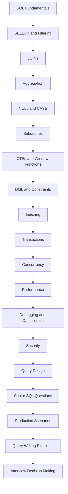
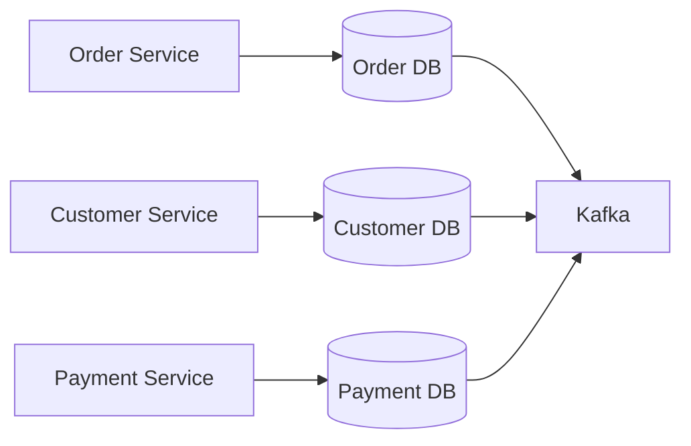

# README

## Overview

This folder contains the **SQL Interview Questions** section of the engineering playbook.

The purpose of this section is not to memorize SQL syntax. It is to develop the ability to:

- Read and reason about relational data.
- Write correct SQL for realistic backend requirements.
- Explain why a query is correct.
- Identify cardinality and `NULL` problems.
- Select appropriate SQL constructs.
- Diagnose performance problems.
- Reason about indexes and execution plans.
- Handle transactions and concurrency.
- Connect SQL decisions to API and system architecture.
- Explain production trade-offs during senior-level interviews.

The material progresses from SQL fundamentals to query construction, aggregation, subqueries, security, decision making, senior-level reasoning, production scenarios, and hands-on query exercises.

## Navigation

- [01- Core SQL Interview Questions](./01-%20Core%20SQL%20Interview%20Questions.md) — Foundational SQL interview question set covering the full topic range
- [02- SQL Fundamentals Questions](./02-%20SQL%20Fundamentals%20Questions.md) — Questions on relational model, SQL categories, and database basics
- [03- SELECT and Filtering Questions](./03-%20SELECT%20and%20Filtering%20Questions.md) — Questions on SELECT, WHERE, LIKE, IN, NULL, and result filtering
- [04- JOIN Questions](./04-%20JOIN%20Questions.md) — Questions on INNER, LEFT, RIGHT, FULL, CROSS, and self JOINs
- [05- Aggregation Questions](./05-%20Aggregation%20Questions.md) — Questions on GROUP BY, HAVING, COUNT, SUM, AVG, and aggregation behavior
- [06- NULL and CASE Questions](./06-%20NULL%20and%20CASE%20Questions.md) — Questions on NULL semantics, three-valued logic, and CASE expressions
- [07- Subquery Questions](./07-%20Subquery%20Questions.md) — Questions on correlated and uncorrelated subqueries
- [08- CTE Questions](./08-%20CTE%20Questions.md) — Questions on Common Table Expressions, recursion, and query structure
- [09- Window Function Questions](./09-%20Window%20Function%20Questions.md) — Questions on ROW_NUMBER, RANK, LAG, LEAD, and window frames
- [10- Index Questions](./10-%20Index%20Questions.md) — Questions on index types, design, selectivity, and trade-offs
- [11- Query Optimization Questions](./11-%20Query%20Optimization%20Questions.md) — Questions on execution plans, SARGability, and optimization techniques
- [12- Transaction Questions](./12-%20Transaction%20Questions.md) — Questions on ACID, isolation levels, and transaction design
- [13- Concurrency and Locking Questions](./13-%20Concurrency%20and%20Locking%20Questions.md) — Questions on deadlocks, lock types, and concurrent access
- [14- Database Design Questions](./14-%20Database%20Design%20Questions.md) — Questions on schema design, relationships, and modeling decisions
- [15- Normalization Questions](./15-%20Normalization%20Questions.md) — Questions on normal forms, dependencies, and normalization trade-offs
- [16- Partitioning Questions](./16-%20Partitioning%20Questions.md) — Questions on table partitioning strategies and when to partition
- [17- SQL Architecture Questions](./17-%20SQL%20Architecture%20Questions.md) — Questions on database internals and production system architecture
- [18- Backend SQL Questions](./18-%20Backend%20SQL%20Questions.md) — Questions connecting SQL decisions to API and backend design
- [19- SQL Scenario Based Questions](./19-%20SQL%20Scenario%20Based%20Questions.md) — Practical scenario questions requiring end-to-end SQL reasoning
- [20- SQL Troubleshooting Questions](./20-%20SQL%20Troubleshooting%20Questions.md) — Questions on diagnosing and resolving SQL problems in production
- [21- SQL Performance Scenarios](./21-%20SQL%20Performance%20Scenarios.md) — Performance-focused scenarios covering latency, indexes, and query cost
- [22- SQL Security Questions](./22-%20SQL%20Security%20Questions.md) — Questions on injection, permissions, encryption, and database security
- [23- SQL Comparison Questions](./23-%20SQL%20Comparison%20Questions.md) — Questions comparing SQL constructs, approaches, and design choices
- [24- Why Choose X Instead of Y](./24-%20Why%20Choose%20X%20Instead%20of%20Y.md) — Decision-based questions on choosing between competing SQL options
- [25- Common SQL Interview Traps](./25-%20Common%20SQL%20Interview%20Traps.md) — Frequently misunderstood questions and common incorrect answers
- [26- Common SQL Misconceptions](./26-%20Common%20SQL%20Misconceptions.md) — Widespread SQL misconceptions and the correct mental models
- [27- Senior Backend SQL Questions](./27-%20Senior%20Backend%20SQL%20Questions.md) — Senior-level questions on architecture, trade-offs, and production reasoning
- [28- Production Database Scenarios](./28-%20Production%20Database%20Scenarios.md) — Realistic production database scenarios requiring architectural answers
- [29- SQL Query Writing Exercises](./29-%20SQL%20Query%20Writing%20Exercises.md) — Hands-on query writing exercises for interview practice
- [30- SQL Interview Decision Making](./30-%20SQL%20Interview%20Decision%20Making.md) — Framework for making and explaining SQL decisions in an interview setting

---

## Interview Preparation Philosophy

A strong SQL interview answer should demonstrate more than syntax.

```text
Requirement
    ↓
Result grain
    ↓
Relational operation
    ↓
Correct SQL
    ↓
Edge cases
    ↓
Execution plan
    ↓
Indexes
    ↓
Concurrency
    ↓
Production architecture
```

For example, if asked:

> Find customers who have placed at least one completed order.

A weak answer focuses only on syntax.

A stronger answer explains:

```sql
SELECT c.id
FROM customers AS c
WHERE EXISTS (
    SELECT 1
    FROM orders AS o
    WHERE o.customer_id = c.id
      AND o.status = 'completed'
);
```

and then discusses:

- Why `EXISTS` expresses existence semantics.
- Why a join could multiply customer rows.
- The importance of an index on the relationship.
- Tenant isolation if the system is multi-tenant.
- Query behavior as the orders table grows.
- How PostgreSQL's planner should be validated with `EXPLAIN`.

That is the level of reasoning expected from a senior backend engineer.

---

## Documentation Map

| File | Focus |
|---|---|
| `01- Core SQL Interview Questions.md` | Broad SQL interview fundamentals and production-oriented reasoning |
| `02- SQL Fundamentals Questions.md` | Core SQL concepts and foundational interview questions |
| `03- SELECT and Filtering Questions.md` | `SELECT`, `WHERE`, predicates, ordering, limiting, and filtering |
| `04- JOIN Questions.md` | Join types, cardinality, relationship reasoning, and join pitfalls |
| `05- Aggregation Questions.md` | `GROUP BY`, aggregate functions, `HAVING`, conditional aggregation, and reporting |
| `06- NULL and CASE Questions.md` | `NULL`, three-valued logic, `CASE`, `COALESCE`, and conditional expressions |
| `07- Subquery Questions.md` | Scalar, correlated, `EXISTS`, `IN`, `NOT EXISTS`, and related subquery patterns |
| `08- CTE Questions.md` | Common table expressions, recursive queries, materialization, and query organization |
| `09- Window Function Questions.md` | Ranking, running totals, partitions, frames, and analytical calculations |
| `10- Set Operation Questions.md` | `UNION`, `UNION ALL`, `INTERSECT`, `EXCEPT`, and set-based reasoning |
| `11- DML Questions.md` | `INSERT`, `UPDATE`, `DELETE`, upserts, and data modification |
| `12- Constraint Questions.md` | Primary keys, foreign keys, uniqueness, `CHECK`, `NOT NULL`, and integrity |
| `13- Index Questions.md` | Index selection, composite indexes, partial indexes, covering indexes, and trade-offs |
| `14- Transaction Questions.md` | Transactions, isolation, atomicity, failures, and concurrency |
| `15- Concurrency Questions.md` | Locks, race conditions, optimistic/pessimistic concurrency, and deadlocks |
| `16- SQL Performance Questions.md` | Query performance, execution plans, indexes, memory, and workload analysis |
| `17- Core SQL Problems.md` | Practical SQL problem-solving patterns |
| `18- Query Optimization Questions.md` | Query optimization and production performance reasoning |
| `19- SQL Debugging Questions.md` | Diagnosing incorrect or inefficient SQL |
| `20- SQL Design Questions.md` | SQL and relational design decisions |
| `21- SQL Security Questions.md` | SQL security, permissions, injection prevention, RLS, and secure database access |
| `22- SQL Security Questions.md` | Security-focused interview scenarios and decision making |
| `23- SQL Comparison Questions.md` | Choosing between alternative SQL constructs |
| `24- Why Choose X Instead of Y.md` | Reasoning about competing SQL and database approaches |
| `25- Common SQL Interview Traps.md` | Frequently misunderstood interview concepts and misleading assumptions |
| `26- Common SQL Misconceptions.md` | Common incorrect beliefs about SQL behavior and performance |
| `27- Senior Backend SQL Questions.md` | Senior-level SQL, architecture, concurrency, and production reasoning |
| `28- Production Database Scenarios.md` | Real-world database incidents and architecture scenarios |
| `29- SQL Query Writing Exercises.md` | Hands-on query-writing exercises from intermediate to senior level |
| `30- SQL Interview Decision Making.md` | Structured decision making for SQL interview questions |

---

## Recommended Learning Flow

The documents should be studied progressively rather than treated as an unordered question bank.



A practical progression is:

1. Understand relational query semantics.
2. Become comfortable writing joins and aggregations.
3. Learn subqueries, CTEs, and window functions.
4. Understand DML and database constraints.
5. Learn how indexes affect access paths.
6. Understand transactions and concurrency.
7. Learn execution plans and performance troubleshooting.
8. Study SQL security.
9. Practice senior-level trade-off questions.
10. Solve production scenarios and query-writing exercises.
11. Practice explaining decisions rather than only producing SQL.

---

## SQL Fundamentals

Start with the relational model and SQL execution semantics.

Important areas include:

- Tables and relationships.
- Primary and foreign keys.
- Rows and columns.
- `SELECT`.
- `WHERE`.
- `ORDER BY`.
- `LIMIT`.
- `DISTINCT`.
- `NULL`.
- Boolean expressions.
- `CASE`.
- Aggregate functions.
- `GROUP BY`.
- `HAVING`.

The goal is to understand **what the query means**, not just how to write it.

---

## SELECT and Filtering

Filtering questions should be used to develop precision around predicates.

Important topics include:

- Equality and inequality.
- Boolean combinations.
- `AND` / `OR` precedence.
- `IN`.
- `BETWEEN`.
- `LIKE`.
- `IS NULL`.
- `IS NOT NULL`.
- Ordering.
- Pagination.
- Deterministic ordering.

A useful habit is to ask:

> What rows should exist before and after each predicate?

This makes complex filtering easier to reason about.

---

## JOINs

JOIN questions are among the most important parts of SQL interviews.

Study:

- `INNER JOIN`.
- `LEFT JOIN`.
- `RIGHT JOIN`.
- `FULL OUTER JOIN`.
- Self joins.
- Cross joins.
- Multiple joins.
- Many-to-many relationships.
- Join cardinality.
- Join predicate placement.
- Join multiplication.
- `EXISTS` versus joins.

Always determine the expected result grain before writing a multi-table query.

For example:

```text
customers
    1
    |
    N
orders
    |
    N
order_items
```

Joining all three tables produces order-item grain unless aggregation changes it.

---

## Aggregation

Aggregation questions should focus on result grain.

Important concepts:

- `COUNT(*)`.
- `COUNT(column)`.
- `COUNT(DISTINCT ...)`.
- `SUM`.
- `AVG`.
- `MIN`.
- `MAX`.
- `GROUP BY`.
- `HAVING`.
- Conditional aggregation.
- `FILTER`.
- `CASE`.
- Multiple grouping levels.
- Weighted averages.
- Double-counting through joins.

A common interview mistake is calculating an aggregate at the wrong grain.

For example, joining multiple one-to-many relations before aggregation can multiply values and produce incorrect totals.

---

## NULL and CASE

`NULL` is one of the most common sources of SQL interview mistakes.

Understand:

- `NULL` is not zero.
- `NULL` is not an empty string.
- `NULL = NULL` does not evaluate to `TRUE`.
- SQL uses three-valued logic.
- `IS NULL` is required for null testing.
- `NOT IN` can behave unexpectedly when `NULL` is involved.
- Aggregates generally ignore `NULL` values except `COUNT(*)`.
- `COALESCE` provides fallback values.
- `CASE` expresses conditional logic.

PostgreSQL also provides:

```sql
value IS DISTINCT FROM other_value
```

when explicit `NULL`-aware comparison semantics are required.

---

## Subqueries

Subqueries should be understood by their semantics rather than memorized as syntax patterns.

Important forms:

| Pattern | Typical use |
|---|---|
| Scalar subquery | One computed value |
| `IN` | Membership |
| `EXISTS` | Existence |
| `NOT EXISTS` | Absence |
| Correlated subquery | Relationship to outer row |
| Derived table | Intermediate relation |
| `LATERAL` | Per-row dependent subquery |

Example:

```sql
SELECT
    c.id,
    c.email
FROM customers AS c
WHERE EXISTS (
    SELECT 1
    FROM orders AS o
    WHERE o.customer_id = c.id
);
```

The senior-level question is not merely:

> Can you write a subquery?

It is:

> Why is this subquery the correct relational expression for the requirement?

---

## CTEs and Window Functions

CTEs improve query organization and can make complex transformations easier to reason about.

Window functions are essential when analytical information must be added without collapsing rows.

Examples include:

- Ranking.
- Running totals.
- Previous/next row comparisons.
- Top-N per group.
- Group averages.
- Cumulative metrics.

Example:

```sql
SELECT
    customer_id,
    id,
    total_amount,
    ROW_NUMBER() OVER (
        PARTITION BY customer_id
        ORDER BY created_at DESC, id DESC
    ) AS order_rank
FROM orders;
```

The deterministic secondary ordering by `id` is important when timestamps can tie.

---

## Set Operations

Understand the difference between:

```sql
UNION
```

and:

```sql
UNION ALL
```

`UNION` removes duplicate rows, which can require additional work.

`UNION ALL` preserves duplicates and is generally preferable when duplicate elimination is not part of the requirement.

Also understand:

- `INTERSECT`.
- `EXCEPT`.
- Column compatibility.
- Ordering of final results.
- Duplicate semantics.

Do not use `UNION` automatically when `UNION ALL` accurately represents the business requirement.

---

## DML

DML questions cover data modification:

```sql
INSERT
UPDATE
DELETE
```

and commonly include:

- Bulk inserts.
- Upserts.
- Conditional updates.
- Safe deletes.
- Returning modified rows.
- Transaction boundaries.
- Idempotency.

PostgreSQL example:

```sql
INSERT INTO customers (email, name)
VALUES ($1, $2)
ON CONFLICT (email)
DO UPDATE
SET name = EXCLUDED.name
RETURNING id;
```

Senior-level reasoning includes:

- What constraint defines the conflict?
- Is the operation idempotent?
- What happens under concurrent requests?
- Can retries duplicate side effects?
- Is the transaction appropriately scoped?

---

## Constraints

Database constraints are part of correctness, not merely schema decoration.

Important constraints include:

- Primary keys.
- Foreign keys.
- Unique constraints.
- `NOT NULL`.
- `CHECK`.
- Exclusion constraints where appropriate.

A backend application should not rely exclusively on application-level validation for invariants that the database can enforce.

For example, concurrent requests can both pass:

```text
Does email exist?
    ↓
No
    ↓
Insert
```

A database unique constraint closes that race.

---

## Indexing

Index interview questions should move beyond:

> "Indexes make queries faster."

A better model is:

```text
Query predicate
    ↓
Selectivity
    ↓
Access path
    ↓
Index structure
    ↓
Planner cost
    ↓
Execution behavior
    ↓
Write / storage trade-off
```

Understand:

- B-tree indexes.
- Composite indexes.
- Column ordering.
- Partial indexes.
- Expression indexes.
- Covering indexes.
- Index-only scans.
- Bitmap scans.
- Index selectivity.
- Index bloat.
- Write amplification.
- Redundant indexes.
- `CREATE INDEX CONCURRENTLY`.

An index is useful only when it supports an actual workload.

---

## Transactions

Transactions provide atomicity around related database operations.

Interview topics include:

- `BEGIN`.
- `COMMIT`.
- `ROLLBACK`.
- Isolation levels.
- Atomicity.
- Consistency.
- Transaction boundaries.
- Savepoints.
- Serialization failures.
- Deadlocks.
- Retry strategy.

A useful question is:

> Which operations must succeed or fail together?

That answer should usually determine the transaction boundary.

---

## Concurrency

Senior SQL interviews frequently test concurrency because application code can appear correct while failing under concurrent execution.

Study:

- Race conditions.
- Lost updates.
- Row locks.
- `SELECT ... FOR UPDATE`.
- Optimistic concurrency.
- Pessimistic concurrency.
- Deadlocks.
- Lock ordering.
- Hot rows.
- `NOWAIT`.
- `SKIP LOCKED`.
- Serialization failures.

Example:

```sql
UPDATE inventory
SET quantity = quantity - 1
WHERE product_id = $1
  AND quantity > 0;
```

Checking the affected-row count can provide an atomic reservation decision.

---

## Performance

Performance questions should be evidence-driven.

Important tools and concepts include:

```sql
EXPLAIN
EXPLAIN ANALYZE
EXPLAIN (ANALYZE, BUFFERS)
```

Also understand:

- Sequential scans.
- Index scans.
- Bitmap scans.
- Nested loop joins.
- Hash joins.
- Merge joins.
- Sorts.
- Aggregation.
- Cardinality estimates.
- Statistics.
- Memory.
- I/O.
- Temporary files.
- Parallel execution.
- Query frequency.

Do not claim:

> "This query is faster."

Instead explain:

> "This query shape should better match the access pattern, and I would validate that assumption with the execution plan and representative data."

---

## SQL Debugging

When a query is incorrect, use a structured process.

```text
Unexpected result
        ↓
Verify input data
        ↓
Define expected grain
        ↓
Run base relation
        ↓
Add joins incrementally
        ↓
Inspect predicates
        ↓
Check NULL behavior
        ↓
Check aggregation
        ↓
Check authorization / tenant scope
        ↓
Validate generated SQL
```

When a query is slow:

```text
Slow query
    ↓
Measure latency
    ↓
Inspect actual SQL
    ↓
EXPLAIN ANALYZE
    ↓
Check cardinality
    ↓
Check access paths
    ↓
Check joins / sorts / aggregation
    ↓
Check locks / waits
    ↓
Check workload frequency
    ↓
Optimize and re-measure
```

This prevents random index creation and premature rewrites.

---

## Security

SQL security questions should be treated as backend architecture questions.

Important areas:

- SQL injection.
- Parameterized queries.
- Prepared statements.
- Dynamic SQL.
- Database roles.
- Least privilege.
- Read-only users.
- `GRANT` / `REVOKE`.
- Row-level security.
- Sensitive data.
- Encryption.
- TLS.
- Auditing.
- Secrets management.
- Backup security.

For Python applications:

```python
cursor.execute(
    "SELECT id FROM customers WHERE email = %s",
    (email,),
)
```

Values should be bound as parameters rather than interpolated into SQL.

Dynamic SQL requires separate treatment because SQL identifiers and structural fragments cannot simply be handled as ordinary values.

---

## Query Design

Query design questions evaluate whether you can convert requirements into relational operations.

Before writing the query, identify:

```text
1. Expected result grain
2. Base table
3. Relationships
4. Required filters
5. NULL semantics
6. Aggregation requirements
7. Ordering
8. Pagination
9. Concurrency requirements
10. Index requirements
```

Then consider production constraints:

```text
query frequency
dataset size
result size
transaction duration
lock behavior
connection usage
replica consistency
tenant isolation
security
observability
```

---

## Senior Backend SQL Questions

Senior questions should connect SQL to system design.

Typical areas include:

### Database Internals

- How does PostgreSQL execute a query?
- What does the planner do?
- Why might PostgreSQL ignore an index?
- How do statistics affect planning?
- What happens during a sequential scan?

### Transactions

- How would you design a transaction boundary?
- How do you handle serialization failures?
- How do you prevent duplicate writes?
- How do you handle uncertain commits?

### Concurrency

- How do you prevent lost updates?
- How do you diagnose lock contention?
- How do you prevent deadlocks?
- When would you use optimistic concurrency?

### Performance

- How do you diagnose a slow query?
- How do you identify a missing index?
- How do you distinguish CPU, I/O, and lock problems?
- How do you handle a query whose workload has grown dramatically?

### Architecture

- When should reads use replicas?
- When should data be cached?
- When should OLTP and OLAP workloads be separated?
- When should partitioning be introduced?
- When is sharding justified?

---

## Production Database Scenarios

Production scenarios should be answered systematically.

### Slow API Endpoint

Investigate:

```text
API latency
    ↓
Database query duration
    ↓
Query frequency
    ↓
Execution plan
    ↓
Lock waits
    ↓
Connection pool
    ↓
Database CPU / I/O
```

Do not immediately add an index.

### High Database CPU

Investigate:

- Top queries by total execution time.
- Query frequency.
- N+1 behavior.
- Sequential scans.
- Expensive joins.
- Sorts and aggregation.
- Retry storms.
- Background jobs.
- Autovacuum.
- Deployment changes.

### Connection Pool Exhaustion

Investigate:

- Long queries.
- Long transactions.
- Connection leaks.
- Pool size.
- Application concurrency.
- Database `max_connections`.
- Lock waits.
- External calls inside transactions.

Increasing the pool without understanding the bottleneck can make the incident worse.

### Replica Lag

Investigate:

- WAL generation.
- Primary write workload.
- Replica replay.
- Long-running queries.
- Replica resource saturation.
- Network behavior.

Also determine whether the application can tolerate stale reads.

---

## Query Writing Exercises

The exercise document should be used actively rather than read passively.

For every exercise:

1. Read the schema.
2. Identify the required result grain.
3. Write the simplest correct query.
4. Test edge cases.
5. Consider duplicate relationships.
6. Consider `NULL`.
7. Consider concurrency where relevant.
8. Inspect indexing requirements.
9. Consider the execution plan.
10. Explain the production implications.

Example exercise:

> Return the latest order for every customer.

One PostgreSQL solution is:

```sql
SELECT DISTINCT ON (customer_id)
    customer_id,
    id,
    created_at,
    total_amount
FROM orders
ORDER BY customer_id, created_at DESC, id DESC;
```

Another approach uses a window function:

```sql
SELECT
    customer_id,
    id,
    created_at,
    total_amount
FROM (
    SELECT
        customer_id,
        id,
        created_at,
        total_amount,
        ROW_NUMBER() OVER (
            PARTITION BY customer_id
            ORDER BY created_at DESC, id DESC
        ) AS rn
    FROM orders
) AS ranked
WHERE rn = 1;
```

The important interview skill is explaining the trade-off and validating the choice against the workload.

---

## Interview Decision Making

When several SQL approaches are valid, use this framework:

| Decision | Primary question |
|---|---|
| `JOIN` vs `EXISTS` | Do I need related rows or only existence? |
| `IN` vs `EXISTS` | Which expression best represents membership/existence? |
| `GROUP BY` vs window function | Should rows collapse? |
| `DISTINCT` vs query correction | Why are duplicates being produced? |
| CTE vs subquery | Which structure communicates the transformation best? |
| OFFSET vs keyset | Does pagination need to scale deeply? |
| Atomic update vs read-modify-write | Can concurrency create a race? |
| Optimistic vs pessimistic locking | How likely and costly are conflicts? |
| Primary vs replica | What consistency does the read require? |
| SQL vs application logic | Where should the computation occur? |
| PostgreSQL vs Redis | Is the requirement relational and durable? |
| OLTP vs OLAP | Is the workload transactional or analytical? |
| Synchronous vs asynchronous | Does the client need the result immediately? |
| Index vs query rewrite | Is the problem actually access-path related? |

The key principle is:

> Choose based on semantics first, then validate performance and operational behavior.

---

## Django and FastAPI Interview Context

SQL interviews for backend engineers should connect directly to ORM behavior.

### Django

Understand how ORM operations map to SQL:

```python
Order.objects.filter(
    customer_id=customer_id,
    status="completed",
)
```

Know when to use:

- `select_related()`.
- `prefetch_related()`.
- `Exists()`.
- `Subquery()`.
- `annotate()`.
- `select_for_update()`.
- `transaction.atomic()`.

For example, `select_related()` can prevent repeated queries for foreign-key relationships, while `prefetch_related()` is useful for separate queries over collection relationships.

### FastAPI and SQLAlchemy

Understand:

- Session lifecycle.
- Transaction boundaries.
- Connection pooling.
- Explicit commits.
- Query construction.
- Lazy loading.
- Eager loading.
- Async database access.
- Exception handling.

ORM knowledge should complement SQL knowledge, not replace it.

---

## Microservices and SQL

In microservice architectures, database ownership becomes an important interview topic.

A typical architecture is:



Senior questions include:

- Should services share tables?
- How are cross-service queries handled?
- How are transactions coordinated?
- Should data be replicated into a read model?
- How are events made reliable?
- How are retries made idempotent?

The answer should distinguish relational consistency from distributed-system consistency.

---

## Redis, Kafka, and Celery

SQL decisions often interact with other backend infrastructure.

### Redis

Common uses:

- Caching.
- Short-lived state.
- Rate limiting.
- Coordination.
- Some distributed locking patterns.

Do not use Redis as a replacement for durable relational invariants without deliberately accepting different guarantees.

### Kafka

Common uses:

- Event propagation.
- CDC.
- Asynchronous workflows.
- Read-model construction.
- Analytics pipelines.

### Celery

Common uses:

- Large exports.
- Batch processing.
- Asynchronous jobs.
- Scheduled database work.

Database workload must still be bounded when workers scale horizontally.

---

## Security and Authorization in Interviews

A query can be syntactically correct but still be insecure.

For a multi-tenant application:

```sql
SELECT *
FROM orders
WHERE tenant_id = $1
  AND id = $2;
```

is materially different from:

```sql
SELECT *
FROM orders
WHERE id = $1;
```

The interview discussion should cover:

- Authentication.
- Authorization.
- Tenant scope.
- Parameterization.
- Database roles.
- RLS where appropriate.
- Least privilege.
- Auditability.

Never suggest removing authorization filters merely to simplify or optimize a query.

---

## Performance and Scalability

SQL interview preparation should include system-level scaling.

Understand the progression:

```text
Correct SQL
    ↓
Indexes
    ↓
Query optimization
    ↓
Connection pooling
    ↓
Caching
    ↓
Read replicas
    ↓
Partitioning
    ↓
Workload isolation
    ↓
OLAP / read models
    ↓
Sharding
```

Do not jump directly to sharding.

A senior engineer first determines whether the problem is actually:

- Query inefficiency.
- Missing indexes.
- Poor transaction boundaries.
- Excessive concurrency.
- Connection exhaustion.
- Read-heavy workload.
- Analytical workload.
- Large-table lifecycle.
- Tenant concentration.

---

## High Availability and Disaster Recovery

SQL interviews increasingly include operational reliability.

Understand:

- Primary/replica architecture.
- Streaming replication.
- Synchronous vs asynchronous replication.
- Replica lag.
- Automatic failover.
- RPO.
- RTO.
- Backups.
- Point-in-time recovery.
- Failover testing.
- Connection recovery.
- Idempotent retries.

A replica is not a substitute for backups.

A backup is not a substitute for high availability.

They solve different failure scenarios.

---

## SQL Interview Anti-Patterns

Avoid these patterns during interviews:

### Memorized Rules

Bad:

> "Always use indexes."

Better:

> "I would inspect the access pattern, selectivity, existing indexes, query frequency, and execution plan."

### Absolute Performance Claims

Bad:

> "`EXISTS` is always faster than `JOIN`."

Better:

> "For existence semantics, `EXISTS` communicates intent and may allow efficient early termination, but I would validate the actual plan."

### Ignoring Cardinality

Bad:

> "Just add `DISTINCT`."

Better:

> "First determine why the join multiplies rows."

### Ignoring Concurrency

Bad:

> "Select the value and update it."

Better:

> "If concurrent updates are possible, use an atomic update or appropriate locking/versioning."

### Ignoring Production Scale

Bad:

> "This works on the sample data."

Better:

> "I would consider expected row count, query frequency, indexing, result size, and execution plan."

---

## Practical Interview Workflow

For coding-style SQL questions:

```text
Read requirement
      ↓
Identify result grain
      ↓
Identify base table
      ↓
Map relationships
      ↓
Write basic query
      ↓
Validate cardinality
      ↓
Handle NULL
      ↓
Handle edge cases
      ↓
Add ordering / pagination
      ↓
Consider indexes
      ↓
Explain complexity
      ↓
Discuss production concerns
```

For system-design SQL questions:

```text
Workload
   ↓
Consistency
   ↓
Data model
   ↓
Access patterns
   ↓
Transactions
   ↓
Indexes
   ↓
Concurrency
   ↓
Scaling
   ↓
HA / DR
   ↓
Observability
   ↓
Security
   ↓
Cost
```

---

## Production SQL Checklist

Before considering a SQL solution complete, ask:

- [ ] Is the result grain correct?
- [ ] Are joins producing the intended cardinality?
- [ ] Are `NULL` semantics correct?
- [ ] Are predicates logically correct?
- [ ] Is aggregation performed at the right level?
- [ ] Is ordering deterministic?
- [ ] Is pagination appropriate?
- [ ] Are values parameterized?
- [ ] Is tenant/resource authorization enforced?
- [ ] Are important invariants protected by constraints?
- [ ] Is the transaction boundary correct?
- [ ] Is concurrency behavior understood?
- [ ] Could locks become problematic?
- [ ] Is the query result bounded?
- [ ] Are appropriate indexes available?
- [ ] Has the execution plan been inspected where necessary?
- [ ] Is query frequency known?
- [ ] Could ORM behavior create N+1 queries?
- [ ] Is connection-pool impact understood?
- [ ] Is replica consistency acceptable?
- [ ] Is caching appropriate?
- [ ] Should expensive work be asynchronous?
- [ ] Is monitoring available?
- [ ] Are failure and retry behaviors safe?

---

## Interview Answer Quality

A useful evaluation model is:

| Level | Typical behavior |
|---|---|
| Junior | Produces syntactically valid SQL |
| Intermediate | Produces correct SQL and handles common edge cases |
| Strong Intermediate | Understands cardinality, indexes, and query behavior |
| Senior | Connects SQL to concurrency, workload, security, and architecture |
| Strong Senior | Explains trade-offs, validates assumptions, and anticipates production failure modes |

The goal is not to answer every question with the most sophisticated technique.

A strong engineer knows when **not** to introduce complexity.

---

## Recommended Practice Method

For each question or exercise, write the answer independently before reviewing the solution.

Then explain:

```text
What does one row represent?
Why is this query correct?
Why did I choose this SQL construct?
What assumptions am I making?
What happens with NULL?
What happens with duplicates?
What happens under concurrent writes?
What index would support this?
What does the execution plan likely look like?
What happens when the table becomes large?
Could this become an API bottleneck?
Would this belong on a replica?
Should this result be cached?
Does this need asynchronous processing?
What security constraints apply?
```

If you can answer these questions consistently, you are practicing SQL at a backend-engineering level rather than only practicing syntax.

---

## Key Takeaways

- **Use this folder as a progression from SQL syntax to engineering judgment:** fundamentals should lead into query construction, performance, concurrency, security, architecture, and production scenarios.
- **Result grain is the central SQL reasoning skill:** correctly defining what each output row represents prevents many join, aggregation, and duplicate-result bugs.
- **Senior SQL interviews test trade-offs:** explain why you chose `JOIN`, `EXISTS`, CTEs, window functions, indexes, transactions, replicas, caching, or asynchronous processing instead of relying on absolute rules.
- **Production SQL requires system awareness:** query plans, workload frequency, connection pools, locks, replicas, tenant isolation, retries, observability, and scaling all affect whether a query is actually production-ready.
- **Practice explanation, not just query writing:** the strongest interview answers state assumptions, prove correctness, identify edge cases, discuss performance, and explain how the design behaves under scale and concurrency.