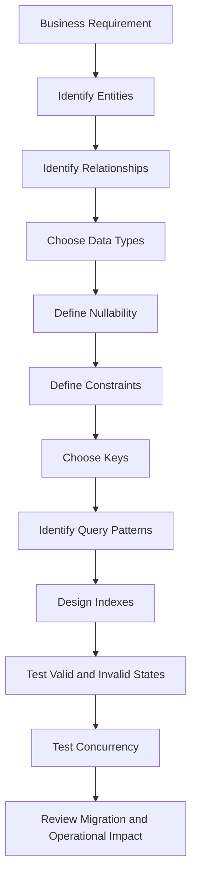
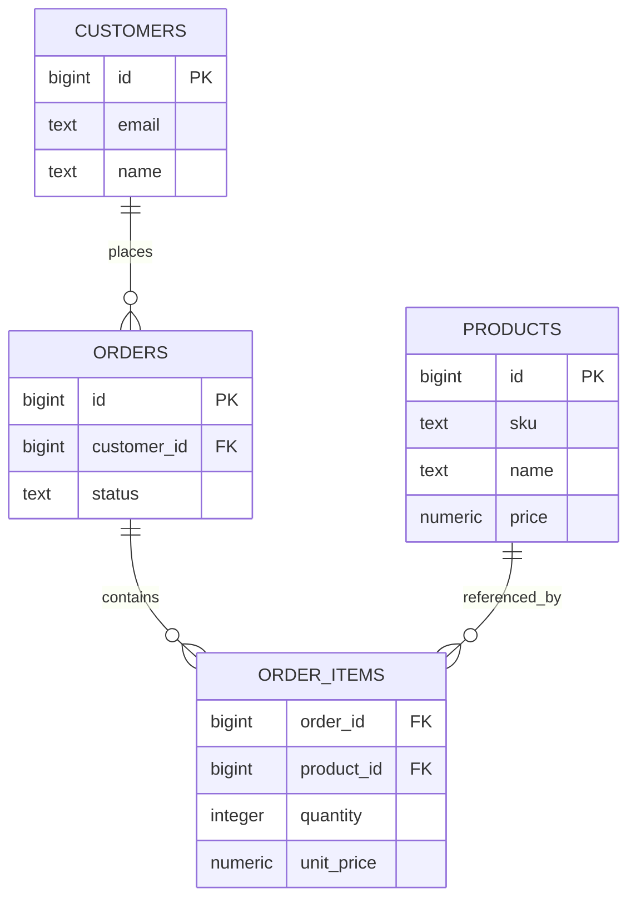
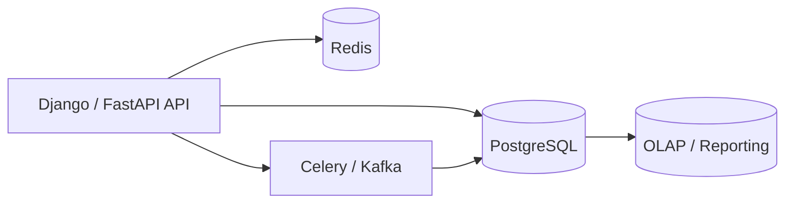

# 03- Schema Creation Exercises

## Overview

Schema creation is where SQL moves from query writing into **data modeling and database design**. A production schema does more than store columns: it defines relationships, valid states, uniqueness, ownership, lifecycle rules, and assumptions that application code can safely rely on.

These exercises use PostgreSQL and progress from basic table creation to production-level schema decisions. The goal is not to memorize `CREATE TABLE` syntax, but to develop the ability to explain **why a schema is designed a particular way**.

For every exercise, consider:

- What entity or relationship the table represents.
- Why each column exists.
- Which values are valid.
- Which invariants belong in the database.
- Why the relationship is one-to-one, one-to-many, or many-to-many.
- Whether the model is appropriately normalized.
- Which indexes follow actual access patterns.
- How concurrent writes behave.
- How the schema can evolve safely.

---

## Practice Environment

Assume PostgreSQL is running locally through Docker.

Example connection:

```bash
docker compose exec postgres \
    psql -U playground -d sql_playground
```

Verify the environment:

```sql
SELECT
    current_database(),
    current_user,
    version();
```

For repeatable exercises, either reset the database between exercises or maintain the exercises as ordered migrations.

A useful directory structure is:

```text
sql-playground/
├── docker-compose.yml
├── migrations/
│   ├── 001_customers.sql
│   ├── 002_products.sql
│   ├── 003_orders.sql
│   └── ...
└── exercises/
    ├── 01_basic_tables.sql
    ├── 02_relationships.sql
    └── ...
```

The important production habit is to make schema changes **repeatable, reviewable, and version-controlled**.

---

## Schema Design Workflow

A practical schema-design workflow is:



Do not start with:

```sql
CREATE TABLE ...
```

Start with the business rules.

For example:

> A customer can place many orders. Every order belongs to exactly one customer. An order contains one or more products.

This immediately suggests:

```text
Customer 1 ───────< Order 1 ───────< OrderItem >─────── 1 Product
```

The database should make invalid states difficult or impossible to represent.

---

## Exercise: Customer Table

### Requirement

Create a `customers` table with:

- Generated numeric identifier.
- Unique email address.
- Customer name.
- Status.
- Creation timestamp.
- Update timestamp.
- Database-enforced valid status values.

### Design Questions

Before writing SQL:

1. Should `email` be nullable?
2. Should email uniqueness be enforced by the database?
3. Should status be free-form text?
4. Should timestamps use `timestamp` or `timestamptz`?
5. Should the ID be application-generated?
6. Should timestamps have database defaults?

### Implementation

```sql
CREATE TABLE customers (
    id bigint GENERATED ALWAYS AS IDENTITY PRIMARY KEY,
    email text NOT NULL UNIQUE,
    name text NOT NULL,
    status text NOT NULL DEFAULT 'active'
        CHECK (status IN ('active', 'inactive', 'suspended')),
    created_at timestamptz NOT NULL DEFAULT now(),
    updated_at timestamptz NOT NULL DEFAULT now()
);
```

Test a valid insert:

```sql
INSERT INTO customers (email, name)
VALUES ('alice@example.com', 'Alice');
```

Test the constraints:

```sql
INSERT INTO customers (email, name, status)
VALUES ('bob@example.com', 'Bob', 'unknown');
```

```sql
INSERT INTO customers (email, name)
VALUES ('alice@example.com', 'Another Alice');
```

The database should reject both invalid operations.

### Production Consideration

This:

```sql
updated_at timestamptz NOT NULL DEFAULT now()
```

sets the timestamp during insertion. It does not automatically update the value when the row changes.

If every database writer must maintain `updated_at`, consider:

- Explicit application updates.
- A database trigger.
- A carefully defined update procedure.

Do not assume an ORM's timestamp behavior applies to every database writer.

---

## Exercise: Product Table

### Requirement

Create a `products` table with:

- Generated identifier.
- SKU.
- Product name.
- Price.
- Currency.
- Active flag.
- Creation timestamp.

Business rules:

- SKU must be unique.
- Price cannot be negative.
- Currency is required.
- Product name is required.

### Implementation

```sql
CREATE TABLE products (
    id bigint GENERATED ALWAYS AS IDENTITY PRIMARY KEY,
    sku text NOT NULL UNIQUE,
    name text NOT NULL,
    price numeric(12, 2) NOT NULL
        CHECK (price >= 0),
    currency char(3) NOT NULL,
    active boolean NOT NULL DEFAULT true,
    created_at timestamptz NOT NULL DEFAULT now()
);
```

Valid:

```sql
INSERT INTO products (sku, name, price, currency)
VALUES ('KB-001', 'Mechanical Keyboard', 129.99, 'USD');
```

Invalid:

```sql
INSERT INTO products (sku, name, price, currency)
VALUES ('KB-002', 'Invalid Product', -10, 'USD');
```

### Interview Question

Why use:

```sql
numeric(12, 2)
```

instead of floating-point storage?

For monetary values, exact numeric representation is generally preferable because binary floating-point representation can introduce precision and rounding behavior that is unsuitable for financial calculations.

Production pricing models may additionally require:

- Currency-specific rules.
- Tax.
- Discounts.
- Rounding policies.
- Historical prices.
- Price validity periods.

---

## Exercise: One-to-Many Relationship

### Requirement

A customer can have many orders.

Each order belongs to exactly one customer.

### Implementation

```sql
CREATE TABLE orders (
    id bigint GENERATED ALWAYS AS IDENTITY PRIMARY KEY,
    customer_id bigint NOT NULL
        REFERENCES customers(id),
    status text NOT NULL
        CHECK (status IN ('pending', 'processing', 'completed', 'cancelled')),
    total_amount numeric(12, 2) NOT NULL
        CHECK (total_amount >= 0),
    created_at timestamptz NOT NULL DEFAULT now()
);
```

Relationship:

```text
customers.id
      │
      │ 1
      │
      └──────────< orders.customer_id
                       many
```

### Why the Foreign Key Matters

Without a foreign key, an application could accidentally insert:

```text
customer_id = 999999
```

even when that customer does not exist.

The foreign key moves the referential-integrity invariant into the database.

Test:

```sql
INSERT INTO orders (customer_id, status, total_amount)
VALUES (1, 'pending', 100.00);
```

Invalid:

```sql
INSERT INTO orders (customer_id, status, total_amount)
VALUES (999999, 'pending', 100.00);
```

---

## Exercise: Many-to-Many Relationship

### Requirement

An order can contain multiple products.

A product can appear in many orders.

The relationship itself has attributes:

- Quantity.
- Unit price at purchase time.

Therefore, create a junction table.

### Implementation

```sql
CREATE TABLE order_items (
    id bigint GENERATED ALWAYS AS IDENTITY PRIMARY KEY,
    order_id bigint NOT NULL
        REFERENCES orders(id),
    product_id bigint NOT NULL
        REFERENCES products(id),
    quantity integer NOT NULL
        CHECK (quantity > 0),
    unit_price numeric(12, 2) NOT NULL
        CHECK (unit_price >= 0),
    UNIQUE (order_id, product_id)
);
```

Relationship:

```text
orders ───────< order_items >─────── products
```

The unique constraint prevents the same product from appearing twice in one order.

### Historical Pricing

Do not derive the historical order price from the current product price.

For example:

```text
Product price today       = $100
Price when ordered        = $80
```

The order item should preserve:

```text
unit_price = 80
```

This is an important modeling distinction:

> Current state and historical fact are different concepts.

---

## Exercise: Composite Primary Key

An alternative design for `order_items` is:

```sql
CREATE TABLE order_items (
    order_id bigint NOT NULL
        REFERENCES orders(id),
    product_id bigint NOT NULL
        REFERENCES products(id),
    quantity integer NOT NULL
        CHECK (quantity > 0),
    unit_price numeric(12, 2) NOT NULL
        CHECK (unit_price >= 0),
    PRIMARY KEY (order_id, product_id)
);
```

### When It Works Well

A composite key works well when:

- The relationship itself is the identity.
- The combination is naturally unique.
- Other tables do not frequently reference the relationship row.

### When a Surrogate ID May Be Better

A generated ID may be preferable when:

- The relationship needs an external identifier.
- Other entities reference the relationship.
- APIs expose the relationship as a resource.
- The composite key would become cumbersome in downstream relationships.

There is no universal rule that every table needs a generated numeric ID.

---

## Exercise: One-to-One Relationship

### Requirement

A customer can have one extended profile.

Model:

```text
customers 1 ─────── 1 customer_profiles
```

### Implementation

```sql
CREATE TABLE customer_profiles (
    customer_id bigint PRIMARY KEY
        REFERENCES customers(id),
    phone_number text,
    date_of_birth date,
    address text,
    created_at timestamptz NOT NULL DEFAULT now()
);
```

The primary key is also the foreign key.

Therefore, one customer can have at most one profile.

An alternative is:

```sql
CREATE TABLE customer_profiles (
    id bigint GENERATED ALWAYS AS IDENTITY PRIMARY KEY,
    customer_id bigint NOT NULL UNIQUE
        REFERENCES customers(id),
    phone_number text,
    date_of_birth date,
    address text
);
```

Use the second form when the profile itself needs an independent identity.

---

## Exercise: Required Versus Optional Attributes

Consider:

```text
Customer phone number
```

Should it be:

```sql
phone_number text NOT NULL
```

or:

```sql
phone_number text
```

The answer depends on business semantics.

If:

```text
NULL = customer has not provided a phone number
```

then nullable storage is meaningful.

Do not automatically replace missing values with:

```text
''
```

An empty string and unknown/missing data are not necessarily equivalent.

This distinction affects:

- Filtering.
- Aggregation.
- API serialization.
- PATCH semantics.
- Reporting.
- Data validation.

---

## Exercise: NULL Semantics

Create:

```sql
CREATE TABLE customer_contacts (
    customer_id bigint PRIMARY KEY
        REFERENCES customers(id),
    phone_number text,
    secondary_email text
);
```

Insert:

```sql
INSERT INTO customer_contacts (customer_id)
VALUES (1);
```

This leaves both optional values as `NULL`.

Incorrect:

```sql
SELECT *
FROM customer_contacts
WHERE phone_number = NULL;
```

Correct:

```sql
SELECT *
FROM customer_contacts
WHERE phone_number IS NULL;
```

This exercise is important because SQL's three-valued logic affects both query correctness and schema design.

---

## Exercise: Database Constraints

Create a subscription table.

Requirements:

- One subscription belongs to one customer.
- Plan is required.
- Status must be valid.
- Start date is required.
- End date is optional.
- End date cannot be before start date.

### Implementation

```sql
CREATE TABLE subscriptions (
    id bigint GENERATED ALWAYS AS IDENTITY PRIMARY KEY,
    customer_id bigint NOT NULL
        REFERENCES customers(id),
    plan text NOT NULL,
    status text NOT NULL
        CHECK (status IN ('trial', 'active', 'cancelled')),
    started_at timestamptz NOT NULL,
    ended_at timestamptz,
    CHECK (ended_at IS NULL OR ended_at >= started_at)
);
```

The final constraint is a cross-column invariant.

Application validation can provide a better error message, but the database should protect invariants that must remain true regardless of the writer.

---

## Exercise: Unique Constraints

Create a user table where username and email must be unique:

```sql
CREATE TABLE users (
    id bigint GENERATED ALWAYS AS IDENTITY PRIMARY KEY,
    username text NOT NULL,
    email text NOT NULL,
    created_at timestamptz NOT NULL DEFAULT now(),
    CONSTRAINT users_username_unique UNIQUE (username),
    CONSTRAINT users_email_unique UNIQUE (email)
);
```

Now test concurrent duplicate creation from multiple sessions.

The important principle is:

> Application validation can improve user experience; database uniqueness constraints provide concurrency-safe integrity.

A pattern such as:

```python
if not User.objects.filter(email=email).exists():
    User.objects.create(email=email)
```

is not sufficient by itself because two concurrent requests can both pass the existence check.

---

## Exercise: Case-Insensitive Uniqueness

Suppose emails should be treated case-insensitively.

A normal unique constraint on `text` does not enforce that:

```text
Alice@example.com
alice@example.com
```

are equivalent.

A PostgreSQL expression index can enforce it:

```sql
CREATE UNIQUE INDEX users_email_lower_unique
ON users (lower(email));
```

Now the two values conflict.

### Design Questions

Decide whether normalization belongs in:

- Application code.
- Database constraints.
- Both.

For identity-related fields, both layers are often useful:

```text
Application → normalize input and produce friendly validation
Database    → enforce final integrity
```

---

## Exercise: Partial Uniqueness

Requirement:

> A customer can have many historical subscriptions but only one active subscription.

Use a partial unique index:

```sql
CREATE UNIQUE INDEX subscriptions_one_active_per_customer
ON subscriptions (customer_id)
WHERE status = 'active';
```

This enforces a conditional uniqueness rule.

It is stronger than checking for an active subscription only in application code.

Partial uniqueness is useful for patterns such as:

- One active subscription.
- One primary address.
- One active configuration.
- One current record.
- One non-deleted resource with a unique name.

---

## Exercise: Foreign-Key Delete Behavior

Create:

```sql
CREATE TABLE teams (
    id bigint GENERATED ALWAYS AS IDENTITY PRIMARY KEY,
    name text NOT NULL UNIQUE
);

CREATE TABLE team_members (
    id bigint GENERATED ALWAYS AS IDENTITY PRIMARY KEY,
    team_id bigint NOT NULL
        REFERENCES teams(id),
    username text NOT NULL
);
```

By default, deleting a referenced team is prevented when dependent rows exist.

### Cascade

```sql
team_id bigint NOT NULL
    REFERENCES teams(id)
    ON DELETE CASCADE
```

Deleting the team deletes its members.

### Set Null

```sql
team_id bigint
    REFERENCES teams(id)
    ON DELETE SET NULL
```

The child remains while its relationship becomes `NULL`.

### Comparison

| Behavior | Typical use |
|---|---|
| Default / restrict behavior | Child existence should prevent parent deletion |
| `CASCADE` | Child has no independent lifecycle |
| `SET NULL` | Child can survive without the parent |
| `SET DEFAULT` | A meaningful replacement parent exists |

Do not choose `CASCADE` simply because it makes deletes convenient.

Large cascading deletes can produce:

- Large transactions.
- Lock contention.
- Significant WAL.
- Replica lag.
- Unexpected application-visible effects.

---

## Exercise: Soft Delete

Add:

```sql
ALTER TABLE customers
ADD COLUMN deleted_at timestamptz;
```

Active rows:

```sql
SELECT *
FROM customers
WHERE deleted_at IS NULL;
```

A soft delete changes the semantics of the entire data model.

Consider:

- Should deleted customers retain unique email ownership?
- Should deleted customers appear in APIs?
- Should background workers process them?
- Should orders still reference them?
- Should reporting include them?
- When can the underlying data be physically removed?

Soft delete is not just a column. It is a lifecycle policy.

---

## Exercise: Audit Columns

Create:

```sql
CREATE TABLE accounts (
    id bigint GENERATED ALWAYS AS IDENTITY PRIMARY KEY,
    name text NOT NULL,
    created_at timestamptz NOT NULL DEFAULT now(),
    updated_at timestamptz NOT NULL DEFAULT now()
);
```

Decide how `updated_at` should be maintained.

| Approach | Advantage | Limitation |
|---|---|---|
| Application code | Explicit | Every writer must follow the rule |
| ORM behavior | Convenient | Does not necessarily cover direct SQL |
| Trigger | Database-enforced | Adds hidden write behavior |
| Explicit SQL | Fully controlled | Easy to forget |

The correct choice depends on the number and type of database writers.

---

## Exercise: Normalization

Consider this design:

```text
orders
----------------------------------------
order_id
customer_name
customer_email
product_name
product_price
quantity
```

This mixes:

- Customer data.
- Order data.
- Product data.
- Relationship data.

A normalized model separates them:



Normalization reduces duplicated mutable state and makes integrity easier to enforce.

---

## Exercise: Intentional Denormalization

Suppose an order must preserve:

```text
customer_name_at_purchase
shipping_address_at_purchase
```

Even though current customer information exists elsewhere.

Storing these values can be correct because they represent historical facts.

Example:

```sql
CREATE TABLE orders (
    id bigint GENERATED ALWAYS AS IDENTITY PRIMARY KEY,
    customer_id bigint NOT NULL
        REFERENCES customers(id),
    customer_name_at_purchase text NOT NULL,
    shipping_address_at_purchase text NOT NULL,
    status text NOT NULL
);
```

The important distinction is:

```text
Duplicating mutable current state → potentially dangerous
Preserving historical state       → often intentional and correct
```

---

## Exercise: State Modeling

Create an order state history table:

```sql
CREATE TABLE order_status_history (
    id bigint GENERATED ALWAYS AS IDENTITY PRIMARY KEY,
    order_id bigint NOT NULL
        REFERENCES orders(id),
    old_status text,
    new_status text NOT NULL,
    changed_at timestamptz NOT NULL DEFAULT now(),
    CHECK (
        new_status IN (
            'pending',
            'processing',
            'completed',
            'cancelled'
        )
    )
);
```

The schema enforces valid states.

It does not automatically enforce every transition.

For example:

```text
pending → processing
processing → completed
```

may be valid while:

```text
completed → processing
```

may be invalid.

Transition rules can live in:

- Application service logic.
- Stored procedures.
- Triggers.
- A state-transition table.

Choose based on how strongly the rule must be enforced across all writers.

---

## Exercise: Tenant-Aware Schema

Create a multi-tenant model:

```sql
CREATE TABLE organizations (
    id bigint GENERATED ALWAYS AS IDENTITY PRIMARY KEY,
    name text NOT NULL
);

CREATE TABLE projects (
    id bigint GENERATED ALWAYS AS IDENTITY PRIMARY KEY,
    organization_id bigint NOT NULL
        REFERENCES organizations(id),
    name text NOT NULL,
    created_at timestamptz NOT NULL DEFAULT now(),
    UNIQUE (organization_id, name)
);
```

The uniqueness rule is tenant-scoped:

```text
Organization A → billing
Organization B → billing
```

Both are valid.

This is different from:

```sql
UNIQUE (name)
```

which creates global uniqueness.

Tenant scope should be reflected consistently in:

- Constraints.
- Indexes.
- Queries.
- Authorization.
- Row-level security.
- Cache keys.

---

## Exercise: Tenant-Aware Foreign Keys

For stronger tenant integrity, the tenant can become part of the key.

Example:

```sql
CREATE TABLE projects (
    organization_id bigint NOT NULL,
    id bigint GENERATED ALWAYS AS IDENTITY,
    name text NOT NULL,
    PRIMARY KEY (organization_id, id),
    UNIQUE (organization_id, name),
    FOREIGN KEY (organization_id)
        REFERENCES organizations(id)
);
```

A child table can reference:

```sql
FOREIGN KEY (organization_id, project_id)
REFERENCES projects (organization_id, id)
```

This prevents a child row from accidentally referencing a project belonging to another organization.

This is especially useful when tenant isolation must be represented directly in relational integrity.

---

## Exercise: Index Requirements From Query Patterns

Create an orders table containing:

```text
customer_id
status
created_at
```

Suppose the application executes:

```sql
SELECT *
FROM orders
WHERE customer_id = $1
ORDER BY created_at DESC
LIMIT 50;
```

A likely index is:

```sql
CREATE INDEX orders_customer_created_idx
ON orders (customer_id, created_at DESC);
```

The index follows the complete access pattern:

```text
equality filter → customer_id
ordering        → created_at
```

Do not create indexes merely because columns exist.

Index design should follow actual query patterns and measured workload.

---

## Exercise: Foreign-Key Indexing

A foreign key does not automatically mean the referencing column receives a useful index.

For:

```sql
SELECT *
FROM orders
WHERE customer_id = $1;
```

an index may be appropriate:

```sql
CREATE INDEX orders_customer_id_idx
ON orders (customer_id);
```

This can also matter when deleting or updating referenced parent rows because PostgreSQL may need to inspect referencing rows.

At scale, missing indexes on heavily used foreign-key columns can become a significant performance problem.

---

## Exercise: Generated Columns

PostgreSQL supports stored generated columns.

Example:

```sql
CREATE TABLE order_items (
    id bigint GENERATED ALWAYS AS IDENTITY PRIMARY KEY,
    quantity integer NOT NULL CHECK (quantity > 0),
    unit_price numeric(12, 2) NOT NULL CHECK (unit_price >= 0),
    line_total numeric(12, 2)
        GENERATED ALWAYS AS (quantity * unit_price) STORED
);
```

The database derives `line_total` from the other values.

Generated columns are useful when:

- The calculation is deterministic.
- The value is frequently queried.
- Consistency of derivation matters.
- The derived value may need indexing.

Do not use them for values dependent on external state or logic that cannot be represented by the supported generated-expression rules.

---

## Exercise: JSONB Versus Relational Columns

Suppose a product has flexible metadata:

```json
{
  "color": "black",
  "weight": 1.2,
  "manufacturer": "Example"
}
```

A JSONB model may be appropriate:

```sql
CREATE TABLE product_metadata (
    product_id bigint PRIMARY KEY
        REFERENCES products(id),
    metadata jsonb NOT NULL DEFAULT '{}'::jsonb
);
```

JSONB is useful for:

- Flexible attributes.
- Semi-structured metadata.
- Data whose structure legitimately varies.

Do not move core relational attributes into JSONB simply to avoid schema design.

Fields such as:

```text
customer_id
status
created_at
price
order_id
```

generally benefit from relational types when they participate heavily in:

- Constraints.
- Joins.
- Filtering.
- Indexing.
- Authorization.

---

## Exercise: PostgreSQL ENUM Versus CHECK

Compare:

```sql
status text NOT NULL
    CHECK (status IN ('pending', 'completed', 'cancelled'))
```

with:

```sql
CREATE TYPE order_status AS ENUM (
    'pending',
    'completed',
    'cancelled'
);
```

Then:

```sql
status order_status NOT NULL
```

### Trade-Off

| Approach | Strength | Limitation |
|---|---|---|
| `CHECK` on text | Simple and flexible | State remains text-based |
| PostgreSQL `ENUM` | Strong database type | Evolution requires deliberate migrations |
| Lookup table | Extensible and metadata-friendly | Adds relationship/query complexity |

Frequently changing business states may be easier to manage with constrained text or a lookup table.

---

## Exercise: Schema Ownership

Create separate namespaces:

```sql
CREATE SCHEMA app;
CREATE SCHEMA reporting;
```

Application data:

```sql
CREATE TABLE app.customers (
    id bigint GENERATED ALWAYS AS IDENTITY PRIMARY KEY,
    email text NOT NULL UNIQUE
);
```

Reporting data:

```sql
CREATE TABLE reporting.customer_metrics (
    customer_id bigint PRIMARY KEY,
    order_count bigint NOT NULL,
    lifetime_value numeric(14, 2) NOT NULL
);
```

This is useful for practicing:

- Schema-level permissions.
- Application versus reporting ownership.
- Migration roles.
- Workload separation.

A PostgreSQL schema is a namespace, not equivalent to a microservice boundary.

---

## Exercise: Migration-Friendly Schema Design

Suppose:

```text
customers.name
```

must become:

```text
first_name
last_name
```

Do not immediately execute:

```sql
ALTER TABLE customers
DROP COLUMN name;
```

A production rollout can be:

```text
Add first_name / last_name
        ↓
Deploy compatible application
        ↓
Backfill existing data
        ↓
Validate
        ↓
Switch reads
        ↓
Stop writes to name
        ↓
Remove name later
```

This is the essence of an expand-and-contract migration.

The schema must remain compatible with application versions during a rolling deployment.

---

## Exercise: Large-Table Backfill

Suppose:

```sql
ALTER TABLE customers
ADD COLUMN normalized_email text;
```

Avoid immediately running an enormous update on a large production table:

```sql
UPDATE customers
SET normalized_email = lower(email);
```

Instead, practice bounded batches:

```sql
UPDATE customers
SET normalized_email = lower(email)
WHERE id > $1
  AND id <= $2
  AND normalized_email IS NULL;
```

Consider:

- Batch size.
- Transaction duration.
- WAL generation.
- Autovacuum.
- Replica lag.
- CPU.
- I/O.
- Lock contention.
- Connection pool pressure.

For very large tables, migration workers may be implemented with Celery or a Kubernetes job, but the database remains the source of truth for progress and correctness.

---

## Exercise: Partitioned Schema

Create an events table partitioned by time:

```sql
CREATE TABLE events (
    id bigint GENERATED ALWAYS AS IDENTITY,
    occurred_at timestamptz NOT NULL,
    event_type text NOT NULL,
    payload jsonb NOT NULL
) PARTITION BY RANGE (occurred_at);
```

Create partitions:

```sql
CREATE TABLE events_2026_09
PARTITION OF events
FOR VALUES FROM ('2026-09-01') TO ('2026-10-01');

CREATE TABLE events_2026_10
PARTITION OF events
FOR VALUES FROM ('2026-10-01') TO ('2026-11-01');
```

This allows practice with:

- Partition pruning.
- Retention.
- Archival.
- Partition-specific indexes.
- Large event datasets.

Partitioning should solve a concrete workload or lifecycle problem. It should not be added simply because a table is large.

---

## Exercise: Audit Trail Schema

Create an append-oriented audit table:

```sql
CREATE TABLE audit_events (
    id bigint GENERATED ALWAYS AS IDENTITY PRIMARY KEY,
    actor_id bigint,
    action text NOT NULL,
    entity_type text NOT NULL,
    entity_id bigint NOT NULL,
    occurred_at timestamptz NOT NULL DEFAULT now(),
    metadata jsonb NOT NULL DEFAULT '{}'::jsonb
);
```

Consider:

- Who performed the action?
- What changed?
- Which entity changed?
- When did it happen?
- Which request caused it?
- How long should records be retained?
- Who can access audit data?

High-volume audit storage may require:

- Time partitioning.
- Retention policies.
- Separate storage.
- Restricted roles.
- Centralized logging.
- Immutable archival.

---

## Exercise: Idempotency Keys

Create an API idempotency table:

```sql
CREATE TABLE idempotency_keys (
    key text PRIMARY KEY,
    request_hash text NOT NULL,
    response_status integer,
    response_body jsonb,
    created_at timestamptz NOT NULL DEFAULT now(),
    completed_at timestamptz
);
```

The primary key prevents two concurrent requests from independently creating the same idempotency record.

This pattern is useful for operations that clients or infrastructure may retry, such as:

- Payments.
- Order creation.
- Resource provisioning.
- External API callbacks.

The schema provides durable coordination, but the application still needs to define:

- Request ownership.
- Hash validation.
- Processing state.
- Retry behavior.
- Response replay.
- Expiration.

---

## Exercise: Queue Table

Create:

```sql
CREATE TABLE jobs (
    id bigint GENERATED ALWAYS AS IDENTITY PRIMARY KEY,
    payload jsonb NOT NULL,
    status text NOT NULL DEFAULT 'pending'
        CHECK (status IN ('pending', 'processing', 'completed', 'failed')),
    created_at timestamptz NOT NULL DEFAULT now(),
    locked_at timestamptz,
    attempts integer NOT NULL DEFAULT 0
        CHECK (attempts >= 0)
);
```

A worker can claim work using row locking:

```sql
SELECT id
FROM jobs
WHERE status = 'pending'
ORDER BY id
FOR UPDATE SKIP LOCKED
LIMIT 10;
```

This provides practice with:

- Concurrent workers.
- Row locks.
- `SKIP LOCKED`.
- Transaction boundaries.
- Retry state.
- Queue indexes.

`SKIP LOCKED` is useful for queue-like workloads because workers can avoid waiting on rows already locked by another worker.

For very high-throughput event processing, Kafka or another dedicated messaging system may be more appropriate.

---

## Exercise: Database Constraints Versus Application Validation

For each rule, decide where enforcement belongs.

| Rule | Database | Application | Both |
|---|---:|---:|---:|
| Email required | Yes | Yes | Yes |
| Email formatting | Usually no | Yes | Optional |
| Unique username | Yes | Yes | Yes |
| Order belongs to customer | Yes | Yes | Yes |
| Price cannot be negative | Yes | Yes | Yes |
| User can perform action | Sometimes via RLS | Yes | Often |
| Allowed order states | Yes | Yes | Yes |
| Password complexity | No | Yes | No |
| Tenant isolation | RLS/constraints | Yes | Yes |

A useful rule is:

> The application validates intent; the database protects durable invariants.

---

## Exercise: ORM Mapping

Map the schema to Django.

Example:

```python
from django.db import models


class Customer(models.Model):
    email = models.EmailField(unique=True)
    name = models.CharField(max_length=255)
    status = models.CharField(max_length=20)
    created_at = models.DateTimeField(auto_now_add=True)
    updated_at = models.DateTimeField(auto_now=True)
```

Then inspect the generated migration:

```bash
python manage.py makemigrations
python manage.py sqlmigrate app_name 0001
```

The goal is to understand the actual SQL generated by the ORM.

Do not assume:

```text
Django model → database behavior
```

is a one-to-one abstraction.

Review:

- Generated types.
- Constraints.
- Indexes.
- Foreign keys.
- Defaults.
- Migration operations.

For senior backend work, ORM fluency should coexist with database-level understanding.

---

## Exercise: SQLAlchemy Schema Mapping

A FastAPI service using SQLAlchemy might define:

```python
from sqlalchemy import BigInteger, Numeric, String
from sqlalchemy.orm import DeclarativeBase, Mapped, mapped_column


class Base(DeclarativeBase):
    pass


class Product(Base):
    __tablename__ = "products"

    id: Mapped[int] = mapped_column(BigInteger, primary_key=True)
    sku: Mapped[str] = mapped_column(String, unique=True, nullable=False)
    name: Mapped[str] = mapped_column(String, nullable=False)
    price: Mapped[float] = mapped_column(Numeric(12, 2), nullable=False)
```

For production financial code, consider using a Python decimal-compatible representation rather than relying on floating-point semantics in application code.

Schema migrations should normally be managed through a migration system such as Alembic rather than relying on application startup to mutate production schemas.

---

## Exercise: Schema Validation

After creating a schema, inspect it from PostgreSQL.

Using `psql`:

```text
\d customers
\d orders
\d+ order_items
```

Inspect constraints:

```sql
SELECT
    conname,
    contype,
    conrelid::regclass AS table_name,
    pg_get_constraintdef(oid) AS definition
FROM pg_constraint
WHERE conrelid IN (
    'customers'::regclass,
    'orders'::regclass,
    'order_items'::regclass
)
ORDER BY conrelid::regclass::text, conname;
```

Inspect indexes:

```sql
SELECT
    tablename,
    indexname,
    indexdef
FROM pg_indexes
WHERE schemaname = 'public'
ORDER BY tablename, indexname;
```

Schema inspection should be part of migration verification.

---

## Exercise: Schema Migration Ordering

Practice a migration that introduces a new required attribute.

Suppose:

```text
orders.currency
```

must become required.

Unsafe:

```sql
ALTER TABLE orders
ADD COLUMN currency char(3) NOT NULL;
```

For a populated production table, a staged migration is safer:

```text
Add nullable column
        ↓
Deploy application capable of writing it
        ↓
Backfill existing rows
        ↓
Validate values
        ↓
Start relying on the column
        ↓
Enforce NOT NULL
```

The important issue is not just DDL correctness.

It is **compatibility between schema and application versions during deployment**.

---

## Exercise: Check Constraints for Business Rules

Create an invoice table:

```sql
CREATE TABLE invoices (
    id bigint GENERATED ALWAYS AS IDENTITY PRIMARY KEY,
    subtotal numeric(12, 2) NOT NULL CHECK (subtotal >= 0),
    tax numeric(12, 2) NOT NULL CHECK (tax >= 0),
    discount numeric(12, 2) NOT NULL DEFAULT 0 CHECK (discount >= 0),
    total numeric(12, 2) NOT NULL CHECK (total >= 0),
    CHECK (discount <= subtotal)
);
```

Now determine whether the schema should also enforce:

```text
total = subtotal + tax - discount
```

If `total` is stored, consider whether it should be:

- Derived at query time.
- Generated.
- Enforced by a constraint.
- Stored as a historical snapshot.

Do not store redundant derived values without deciding which value is authoritative.

---

## Exercise: Unique Active Resource

Create an addresses table:

```sql
CREATE TABLE customer_addresses (
    id bigint GENERATED ALWAYS AS IDENTITY PRIMARY KEY,
    customer_id bigint NOT NULL
        REFERENCES customers(id),
    address text NOT NULL,
    is_primary boolean NOT NULL DEFAULT false
);
```

Requirement:

> Each customer can have at most one primary address.

Enforce it:

```sql
CREATE UNIQUE INDEX customer_one_primary_address
ON customer_addresses (customer_id)
WHERE is_primary;
```

This is a useful pattern for practicing conditional uniqueness.

---

## Exercise: Schema for Optimistic Concurrency

Create:

```sql
CREATE TABLE inventory (
    id bigint GENERATED ALWAYS AS IDENTITY PRIMARY KEY,
    product_id bigint NOT NULL UNIQUE
        REFERENCES products(id),
    quantity integer NOT NULL CHECK (quantity >= 0),
    version bigint NOT NULL DEFAULT 1
);
```

An application can use the version during updates:

```sql
UPDATE inventory
SET quantity = quantity - $1,
    version = version + 1
WHERE product_id = $2
  AND version = $3
  AND quantity >= $1;
```

Then inspect:

```text
Rows affected = 1 → update succeeded
Rows affected = 0 → stale version or insufficient inventory
```

This exercise connects schema design with optimistic concurrency control.

---

## Exercise: Schema for Pessimistic Concurrency

Using the same inventory table, practice:

```sql
BEGIN;

SELECT quantity
FROM inventory
WHERE product_id = $1
FOR UPDATE;

UPDATE inventory
SET quantity = quantity - $2
WHERE product_id = $1
  AND quantity >= $2;

COMMIT;
```

The row lock prevents conflicting transactions from modifying the selected inventory row concurrently.

Compare this with the optimistic version.

| Approach | Strength | Cost |
|---|---|---|
| Optimistic version | Good when conflicts are uncommon | Caller must handle conflicts |
| `FOR UPDATE` | Strong serialization of a hot row | Lock waits can reduce throughput |

---

## Exercise: Production Schema Review

For every table you create, answer:

### Identity

- What identifies a row?
- Is a surrogate key appropriate?
- Is a natural key stable enough?

### Nullability

- Which fields can legitimately be unknown?
- Does `NULL` represent a meaningful state?

### Integrity

- Which values are invalid?
- Which combinations are invalid?
- Which relationships must always exist?

### Relationships

- One-to-one?
- One-to-many?
- Many-to-many?
- Optional or mandatory?

### Lifecycle

- Can rows be deleted?
- Should deletion be soft?
- Is historical state required?

### Querying

- Which columns are filtered?
- Which columns are joined?
- Which columns are sorted?
- Which indexes follow actual access patterns?

### Concurrency

- What happens when two clients modify the same resource?
- Can uniqueness races occur?
- Is optimistic or pessimistic concurrency appropriate?

### Security

- Who can read the table?
- Who can write it?
- Does tenant isolation apply?
- Does RLS make sense?
- Does sensitive data require additional protection?

### Operations

- How large can the table become?
- Will partitioning be required?
- How will it be migrated?
- What happens during failover?
- How does backup and recovery affect it?

---

## Exercise: Intentionally Broken Schema

Create this deliberately poor schema:

```sql
CREATE TABLE bad_orders (
    id integer,
    customer_email text,
    customer_name text,
    product_name text,
    product_price float,
    quantity integer,
    status text,
    created_at timestamp
);
```

Identify at least ten problems.

Potential findings:

- No primary key.
- No foreign keys.
- Duplicated customer data.
- Duplicated product data.
- Floating-point monetary value.
- No constraints.
- No nullability decisions.
- No uniqueness rules.
- No timezone-aware timestamp strategy.
- No clear relationship model.
- No historical pricing semantics.
- No indexing strategy.
- Free-form status.
- Difficult update semantics.

Redesign it using the earlier exercises.

This is an excellent interview exercise because it tests data-modeling reasoning rather than SQL syntax.

---

## Exercise: Production Schema Architecture

Combine the earlier concepts into a realistic backend model:



The database should remain responsible for durable relational state and integrity.

The surrounding architecture may provide:

- Redis for ephemeral caching.
- Celery for asynchronous jobs.
- Kafka for durable event streaming.
- Reporting systems for analytical workloads.

Do not move database invariants into these systems merely because they are available.

For example:

```text
Redis lock       ≠ database uniqueness constraint
Kafka event      ≠ database transaction
Application check ≠ database foreign key
```

Each system has a different responsibility.

---

## Production Schema Design Checklist

Before approving a schema:

- [ ] Every table has a clear responsibility.
- [ ] Primary keys are intentional.
- [ ] Foreign keys represent required relationships.
- [ ] Nullability matches business semantics.
- [ ] Unique constraints protect required invariants.
- [ ] `CHECK` constraints protect appropriate domain rules.
- [ ] Monetary values use exact numeric representations where required.
- [ ] Timestamps use an intentional timezone strategy.
- [ ] Delete behavior is explicit.
- [ ] Historical values are preserved where required.
- [ ] Tenant scope is represented consistently.
- [ ] Indexes follow real query patterns.
- [ ] Large-table growth has been considered.
- [ ] Migration strategy has been considered.
- [ ] Concurrency behavior has been considered.
- [ ] Security and ownership are defined.
- [ ] Sensitive data is identified.
- [ ] Backup and recovery implications are understood.
- [ ] ORM mappings do not obscure important constraints.
- [ ] Schema creation and migration are reproducible in CI.

---

## Common Schema Design Mistakes

### Relying Only on Application Validation

Bad:

```python
if not User.objects.filter(email=email).exists():
    User.objects.create(email=email)
```

Two concurrent requests can both pass the check.

Better:

```sql
ALTER TABLE users
ADD CONSTRAINT users_email_unique UNIQUE (email);
```

Keep application validation for user-facing feedback, but use database constraints for durable invariants.

### Making Everything Nullable

Nullable columns should represent meaningful absence.

Making every field nullable tends to produce:

- Ambiguous states.
- More complicated queries.
- Poor reporting semantics.
- Unexpected API behavior.

### Using Strings for Everything

Avoid:

```text
price text
quantity text
created_at text
active text
```

Prefer appropriate types:

```text
numeric
integer
timestamptz
boolean
```

Strong typing allows PostgreSQL to enforce more of the data model.

### Using Floating Point for Money

Avoid floating-point storage when exact monetary representation is required.

Prefer:

```sql
numeric(12, 2)
```

or another precision appropriate to the domain.

### Missing Foreign Keys

Application-level relationships are not equivalent to database-level referential integrity.

Without foreign keys, orphaned records can accumulate silently.

### Overusing Cascades

`ON DELETE CASCADE` can be correct, but large cascades can generate:

- Large transactions.
- Significant WAL.
- Lock contention.
- Replica lag.

Understand the complete dependency graph before using it.

### Premature JSONB

JSONB can provide flexibility, but putting every attribute into JSONB can make:

- Constraints harder.
- Queries harder.
- Indexing less predictable.
- Relationships impossible to enforce.
- Schema evolution less explicit.

### Indexing Every Column

Every index has costs:

- Disk space.
- Write amplification.
- Maintenance.
- Vacuum overhead.
- Cache pressure.

Index based on workload evidence.

### Ignoring Migration Compatibility

A schema that is correct after deployment can still be unsafe during a rolling deployment.

Always consider:

```text
Old application
      ↓
New schema
      ↓
New application
```

The new schema often needs to remain compatible with old and new application versions during rollout.

---

## Interview Traps

### "Should Every Relationship Have a Foreign Key?"

Relationships requiring database-level referential integrity generally should.

But cross-service or cross-database relationships may intentionally avoid foreign keys.

The senior answer explains **where the invariant should be enforced**.

### "Is Normalization Always Better?"

No.

Normalize mutable shared state to reduce inconsistency.

Intentionally duplicate:

- Historical snapshots.
- Read models.
- Derived data.

when the system requirements justify it.

### "Should Every ID Be a UUID?"

No.

UUIDs can be useful for distributed ID generation and externally exposed identifiers.

Numeric generated IDs can provide:

- Smaller indexes.
- Better locality.
- Simpler storage.

Choose based on system requirements rather than preference.

### "Does a Foreign Key Create an Index?"

No.

The referencing column generally needs its own index when workload and maintenance patterns justify it.

### "Does `NOT NULL` Mean the Value Is Valid?"

No.

`NOT NULL` only prevents absence.

For example:

```sql
price numeric NOT NULL
```

still allows:

```text
-100
```

unless another constraint prevents it.

### "Can the Application Handle All Validation?"

Not safely for concurrency-sensitive invariants such as uniqueness and referential integrity.

The database should remain the final integrity boundary.

### "Should We Store Every Derived Value?"

No.

Ask:

- Is it authoritative?
- Is it historical?
- Is it expensive to calculate?
- Can it become inconsistent?
- Can it be generated instead?
- Does it need to be indexed?

Avoid redundant state unless the benefit is clear.

---

## Senior-Level Schema Reasoning

A senior engineer evaluates schema changes as **system changes**, not isolated DDL statements.

For a new column:

```text
Does it need to be nullable?
        ↓
Can old application versions tolerate it?
        ↓
Does it require a default?
        ↓
Will the default/backfill affect a large table?
        ↓
Does it need an index?
        ↓
Will the index increase write cost?
        ↓
Will replication amplify the workload?
        ↓
Can the change be rolled back?
        ↓
What happens if deployment fails halfway?
```

For a new relationship:

```text
What is the cardinality?
        ↓
Where is referential integrity enforced?
        ↓
What happens on delete?
        ↓
Can concurrent writes violate uniqueness?
        ↓
What queries will use the relationship?
        ↓
Which indexes are required?
        ↓
Does tenant scope apply?
        ↓
How will the relationship evolve?
```

For a large migration:

```text
Measure table and workload
        ↓
Separate schema change from data movement
        ↓
Make application versions compatible
        ↓
Backfill incrementally
        ↓
Throttle based on production health
        ↓
Validate
        ↓
Switch application behavior
        ↓
Contract old schema later
```

This is the level of reasoning expected in senior backend SQL and system-design interviews.

---

## Practice Sequence

Complete the exercises in this order:

1. Create basic entities.
2. Add primary keys.
3. Add required and optional columns.
4. Add `CHECK` constraints.
5. Add unique constraints.
6. Model one-to-many relationships.
7. Model many-to-many relationships.
8. Practice one-to-one relationships.
9. Test foreign-key delete behavior.
10. Practice `NULL` semantics.
11. Model historical state.
12. Add tenant-aware constraints.
13. Add indexes from query requirements.
14. Practice generated columns and JSONB.
15. Add audit and idempotency tables.
16. Design a queue table.
17. Map schemas through Django or SQLAlchemy.
18. Practice migration-safe schema changes.
19. Test large-table backfills.
20. Practice optimistic and pessimistic concurrency.
21. Review the deliberately broken schema.
22. Defend every design decision as if reviewing a production migration.

---

## Final Schema Review Questions

Before considering an exercise complete, answer these questions without looking at the DDL:

1. What is the row grain of every table?
2. What uniquely identifies each row?
3. Which relationships are mandatory?
4. Which values may be `NULL`, and why?
5. Which invariants are enforced by constraints?
6. Which rules are intentionally application-level?
7. What happens when a parent row is deleted?
8. Which queries are expected to be frequent?
9. Which indexes support those queries?
10. What happens under concurrent writes?
11. Can duplicate data appear?
12. Is historical state required?
13. Could the table grow to hundreds of millions of rows?
14. Would partitioning become useful?
15. How would the schema be migrated without downtime?
16. How would Django or FastAPI interact with it?
17. What data is sensitive?
18. How are permissions and tenant isolation handled?
19. How would the database be backed up and restored?
20. What would happen if a deployment failed halfway through?

A strong schema answer should explain not only **what the DDL is**, but **why it remains correct as the system scales and changes**.

---

## Key Takeaways

- **A schema is an integrity boundary:** primary keys, foreign keys, uniqueness, nullability, and `CHECK` constraints should encode invariants that must remain true under concurrent writes.
- **Model relationships explicitly:** cardinality, delete behavior, tenant scope, and historical state should be reflected in relational design rather than left implicit in application code.
- **Design for workload and lifecycle:** indexes, partitioning, JSONB, denormalization, and generated columns should exist because of concrete access or operational requirements.
- **Schema changes are deployment changes:** large backfills, destructive changes, compatibility windows, replication impact, and rollback behavior must be considered before production migration.
- **Senior schema design balances correctness and operability:** data integrity must coexist with performance, security, concurrency, scalability, observability, and long-term evolution.