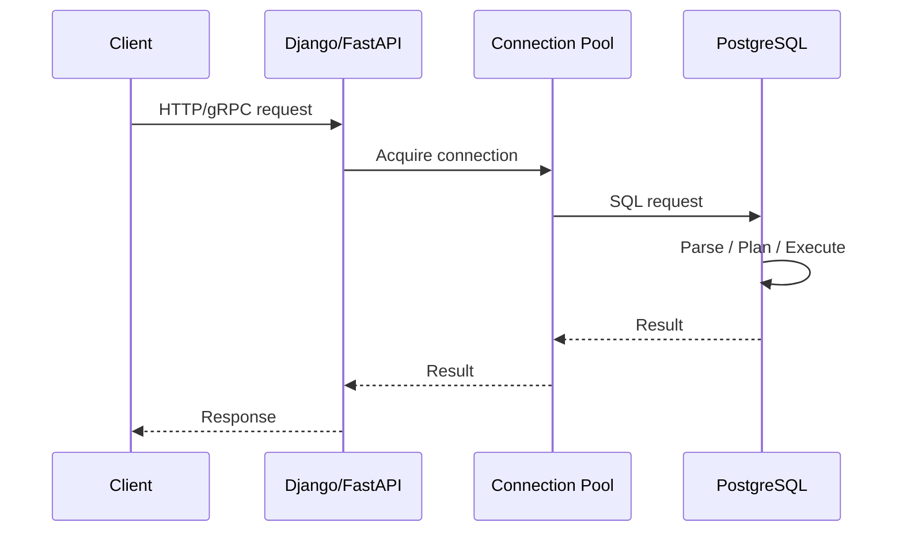
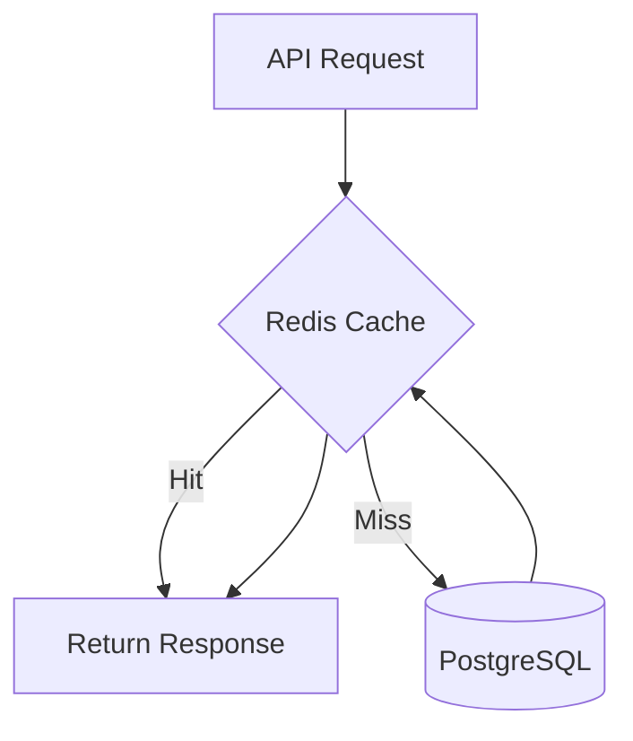

# 04- CRUD Exercises

## Overview

CRUD—**Create, Read, Update, Delete**—is the foundation of most backend database interaction. In production systems, however, CRUD is rarely just four SQL statements.

A senior backend engineer must understand:

- How rows are inserted safely.
- How reads interact with indexes, joins, transactions, and replicas.
- How updates behave under concurrency.
- Why deletes can be operationally expensive.
- How constraints protect data integrity.
- How Django and SQLAlchemy map application operations to SQL.
- How CRUD behavior changes with large datasets and distributed systems.

These exercises use PostgreSQL and a consistent domain model:

```text
customers
    │
    └──< orders
            │
            └──< order_items >── products
```

The emphasis is on **correctness first, then performance and operational behavior**.

---

## Practice Schema

Use the following baseline schema.

```sql
CREATE TABLE customers (
    id bigint GENERATED ALWAYS AS IDENTITY PRIMARY KEY,
    email text NOT NULL UNIQUE,
    name text NOT NULL,
    status text NOT NULL DEFAULT 'active'
        CHECK (status IN ('active', 'inactive', 'suspended')),
    created_at timestamptz NOT NULL DEFAULT now(),
    updated_at timestamptz NOT NULL DEFAULT now()
);

CREATE TABLE products (
    id bigint GENERATED ALWAYS AS IDENTITY PRIMARY KEY,
    sku text NOT NULL UNIQUE,
    name text NOT NULL,
    price numeric(12, 2) NOT NULL
        CHECK (price >= 0),
    active boolean NOT NULL DEFAULT true,
    created_at timestamptz NOT NULL DEFAULT now()
);

CREATE TABLE orders (
    id bigint GENERATED ALWAYS AS IDENTITY PRIMARY KEY,
    customer_id bigint NOT NULL
        REFERENCES customers(id),
    status text NOT NULL
        CHECK (status IN ('pending', 'processing', 'completed', 'cancelled')),
    total_amount numeric(12, 2) NOT NULL
        CHECK (total_amount >= 0),
    created_at timestamptz NOT NULL DEFAULT now()
);

CREATE TABLE order_items (
    order_id bigint NOT NULL
        REFERENCES orders(id),
    product_id bigint NOT NULL
        REFERENCES products(id),
    quantity integer NOT NULL
        CHECK (quantity > 0),
    unit_price numeric(12, 2) NOT NULL
        CHECK (unit_price >= 0),
    PRIMARY KEY (order_id, product_id)
);
```

Useful supporting indexes:

```sql
CREATE INDEX orders_customer_created_idx
ON orders (customer_id, created_at DESC);

CREATE INDEX order_items_product_id_idx
ON order_items (product_id);
```

The primary key on `order_items` already creates an index beginning with `order_id`, so a separate index on `order_id` would usually be redundant.

---

## CRUD Lifecycle

A typical API request follows:



For writes, the lifecycle additionally includes:

```text
Validate request
      ↓
Begin transaction
      ↓
Execute INSERT / UPDATE / DELETE
      ↓
Constraints and triggers
      ↓
Commit
      ↓
Optional cache/event work
      ↓
Response
```

The exact boundaries depend on the application architecture.

---

## Create Exercises

### Insert One Customer

Create a customer:

```sql
INSERT INTO customers (email, name)
VALUES ('alice@example.com', 'Alice')
RETURNING id, email, name, created_at;
```

`RETURNING` avoids a second query to retrieve the generated identifier.

This is preferable to:

```text
INSERT
↓
SELECT using email
```

when the inserted row itself is already available from the write operation.

---

### Insert Multiple Customers

Insert multiple rows in one statement:

```sql
INSERT INTO customers (email, name)
VALUES
    ('bob@example.com', 'Bob'),
    ('carol@example.com', 'Carol'),
    ('david@example.com', 'David')
RETURNING id, email;
```

Batching reduces:

- Network round trips.
- Parse/execute overhead.
- Transaction overhead.

For very large ingestion workloads, PostgreSQL's `COPY` is generally more appropriate than generating enormous `INSERT` statements.

---

### Handle Duplicate Creation

Suppose email uniqueness is enforced by:

```sql
UNIQUE (email)
```

A duplicate insert fails.

For an idempotent creation workflow, PostgreSQL supports:

```sql
INSERT INTO customers (email, name)
VALUES ('alice@example.com', 'Alice')
ON CONFLICT (email) DO NOTHING
RETURNING id;
```

If the row already exists, no row is returned.

This is useful for:

- Idempotent provisioning.
- Import jobs.
- Retry-safe operations.
- Concurrent creation attempts.

Do not use `SELECT` followed by `INSERT` as your only uniqueness protection.

---

### Upsert

Suppose an external integration periodically synchronizes customer data.

```sql
INSERT INTO customers (email, name, status)
VALUES ('alice@example.com', 'Alice Updated', 'active')
ON CONFLICT (email)
DO UPDATE SET
    name = EXCLUDED.name,
    status = EXCLUDED.status
RETURNING id, email, name, status;
```

`EXCLUDED` represents the proposed row.

Upsert is useful when the database operation should atomically express:

```text
create if absent
otherwise update
```

Be careful with upserts that overwrite fields owned by another system.

---

### Conditional Upsert

Suppose external data should update a customer only when the incoming record is newer.

A production model might contain:

```sql
ALTER TABLE customers
ADD COLUMN source_updated_at timestamptz;
```

Then:

```sql
INSERT INTO customers (
    email,
    name,
    source_updated_at
)
VALUES (
    'alice@example.com',
    'Alice Updated',
    '2026-09-05T10:00:00Z'
)
ON CONFLICT (email)
DO UPDATE SET
    name = EXCLUDED.name,
    source_updated_at = EXCLUDED.source_updated_at
WHERE customers.source_updated_at IS NULL
   OR customers.source_updated_at < EXCLUDED.source_updated_at;
```

This avoids blindly allowing an older event to overwrite newer state.

The exact conflict policy depends on the ownership and ordering guarantees of the source system.

---

## Create an Order Safely

Creating an order and its items is usually a transaction.

```sql
BEGIN;

INSERT INTO orders (
    customer_id,
    status,
    total_amount
)
VALUES (
    $1,
    'pending',
    $2
)
RETURNING id;
```

Then insert its items:

```sql
INSERT INTO order_items (
    order_id,
    product_id,
    quantity,
    unit_price
)
VALUES
    ($3, $4, $5, $6),
    ($3, $7, $8, $9);

COMMIT;
```

If any statement fails, the transaction should not leave a partially created order.

In an application, the transaction should normally encompass the database state that must remain atomic.

---

## Insert From a Query

Suppose inactive customers need to be copied into an archive table:

```sql
CREATE TABLE archived_customers (
    id bigint PRIMARY KEY,
    email text NOT NULL,
    name text NOT NULL,
    archived_at timestamptz NOT NULL DEFAULT now()
);
```

Then:

```sql
INSERT INTO archived_customers (id, email, name)
SELECT id, email, name
FROM customers
WHERE status = 'inactive';
```

This is generally preferable to:

```text
SELECT rows into application
↓
loop in Python
↓
INSERT rows individually
```

for database-local data movement.

---

## Read Exercises

### Read One Row

```sql
SELECT
    id,
    email,
    name,
    status,
    created_at
FROM customers
WHERE id = $1;
```

Use an indexed or primary-key predicate when looking up a known identifier.

---

### Read a Collection

```sql
SELECT
    id,
    email,
    name,
    status
FROM customers
WHERE status = 'active'
ORDER BY id
LIMIT 50;
```

Always define deterministic ordering when pagination or stable result ordering matters.

Without:

```sql
ORDER BY
```

SQL does not guarantee row order.

---

### Read With Pagination

Offset pagination:

```sql
SELECT
    id,
    email,
    name
FROM customers
ORDER BY id
LIMIT 50
OFFSET 5000;
```

This can become increasingly expensive as the offset grows.

Keyset pagination is often better for large ordered datasets:

```sql
SELECT
    id,
    email,
    name
FROM customers
WHERE id > $1
ORDER BY id
LIMIT 50;
```

The application supplies the last-seen ID.

### Comparison

| Approach | Strength | Limitation |
|---|---|---|
| `OFFSET/LIMIT` | Simple, supports page numbers | Large offsets can become expensive |
| Keyset pagination | Efficient for deep pages | Requires stable cursor semantics |
| Cursor pagination | Good API abstraction | More complex cursor handling |

---

## Read a Customer's Orders

```sql
SELECT
    o.id,
    o.status,
    o.total_amount,
    o.created_at
FROM orders AS o
WHERE o.customer_id = $1
ORDER BY o.created_at DESC
LIMIT 50;
```

The supporting index:

```sql
CREATE INDEX orders_customer_created_idx
ON orders (customer_id, created_at DESC);
```

matches the access pattern:

```text
customer_id equality
        ↓
created_at ordering
        ↓
LIMIT
```

The important skill is not memorizing this index. It is recognizing the relationship between **query shape and access path**.

---

## Read With a Join

Retrieve orders with customer information:

```sql
SELECT
    o.id AS order_id,
    c.email,
    c.name,
    o.status,
    o.total_amount,
    o.created_at
FROM orders AS o
JOIN customers AS c
    ON c.id = o.customer_id
WHERE o.id = $1;
```

The join is safe because `customers.id` is unique.

Always reason about join cardinality before selecting columns.

---

## Read an Order With Items

```sql
SELECT
    oi.order_id,
    oi.product_id,
    p.sku,
    p.name,
    oi.quantity,
    oi.unit_price
FROM order_items AS oi
JOIN products AS p
    ON p.id = oi.product_id
WHERE oi.order_id = $1
ORDER BY oi.product_id;
```

This returns one row per order item.

If the API requires:

```json
{
  "order_id": 100,
  "items": [...]
}
```

the application can group rows, or PostgreSQL can construct JSON.

For example:

```sql
SELECT
    o.id,
    o.status,
    jsonb_agg(
        jsonb_build_object(
            'product_id', oi.product_id,
            'quantity', oi.quantity,
            'unit_price', oi.unit_price
        )
        ORDER BY oi.product_id
    ) AS items
FROM orders AS o
JOIN order_items AS oi
    ON oi.order_id = o.id
WHERE o.id = $1
GROUP BY o.id, o.status;
```

Use database-side JSON construction when it meaningfully reduces application work or network transfers. Do not make complex SQL JSON generation the default for every endpoint.

---

## Read With Optional Relationships

Retrieve all customers, including those without orders:

```sql
SELECT
    c.id,
    c.email,
    o.id AS order_id
FROM customers AS c
LEFT JOIN orders AS o
    ON o.customer_id = c.id;
```

The `LEFT JOIN` preserves customers without matching orders.

A common mistake is moving the child filter into `WHERE`:

```sql
SELECT
    c.id,
    c.email,
    o.id
FROM customers AS c
LEFT JOIN orders AS o
    ON o.customer_id = c.id
WHERE o.status = 'completed';
```

This removes customers without matching completed orders and effectively changes the result semantics.

If the requirement is:

> Return all customers and only join completed orders

use:

```sql
SELECT
    c.id,
    c.email,
    o.id
FROM customers AS c
LEFT JOIN orders AS o
    ON o.customer_id = c.id
   AND o.status = 'completed';
```

---

## Read Using EXISTS

Requirement:

> Find customers who have at least one completed order.

Use:

```sql
SELECT
    c.id,
    c.email,
    c.name
FROM customers AS c
WHERE EXISTS (
    SELECT 1
    FROM orders AS o
    WHERE o.customer_id = c.id
      AND o.status = 'completed'
);
```

`EXISTS` expresses existence directly.

It avoids creating duplicate customer rows that might require `DISTINCT`.

A supporting index may be useful depending on workload:

```sql
CREATE INDEX orders_customer_status_idx
ON orders (customer_id, status);
```

Index design should be validated using the actual execution plan.

---

## Read Using NOT EXISTS

Requirement:

> Find customers who have never placed an order.

```sql
SELECT
    c.id,
    c.email
FROM customers AS c
WHERE NOT EXISTS (
    SELECT 1
    FROM orders AS o
    WHERE o.customer_id = c.id
);
```

This is usually safer than:

```sql
WHERE c.id NOT IN (...)
```

because `NOT IN` has important `NULL` semantics.

---

## Aggregate Read

Find total completed order value per customer:

```sql
SELECT
    c.id,
    c.email,
    COALESCE(SUM(o.total_amount), 0) AS lifetime_value
FROM customers AS c
LEFT JOIN orders AS o
    ON o.customer_id = c.id
   AND o.status = 'completed'
GROUP BY
    c.id,
    c.email;
```

The `LEFT JOIN` preserves customers with no completed orders.

`COALESCE` converts the aggregate's `NULL` result into zero.

---

## Update Exercises

### Update One Row

```sql
UPDATE customers
SET
    name = $2,
    updated_at = now()
WHERE id = $1
RETURNING id, email, name, updated_at;
```

The primary key makes the target precise.

---

### Conditional Update

Deactivate a customer only if currently active:

```sql
UPDATE customers
SET
    status = 'inactive',
    updated_at = now()
WHERE id = $1
  AND status = 'active'
RETURNING id, status;
```

This is safer than:

```text
SELECT status
↓
check in Python
↓
UPDATE
```

when the state transition itself must be atomic.

The number of affected rows tells the application whether the transition occurred.

---

## Optimistic Concurrency

Add a version column:

```sql
ALTER TABLE customers
ADD COLUMN version bigint NOT NULL DEFAULT 1;
```

Then:

```sql
UPDATE customers
SET
    name = $2,
    version = version + 1,
    updated_at = now()
WHERE id = $1
  AND version = $3
RETURNING id, name, version;
```

If zero rows are returned, another transaction may have modified the row.

This pattern is useful when conflicts are relatively uncommon.

---

## Pessimistic Update

When a workflow requires reading state and then making a dependent decision, lock the row:

```sql
BEGIN;

SELECT quantity
FROM inventory
WHERE product_id = $1
FOR UPDATE;

UPDATE inventory
SET quantity = quantity - $2
WHERE product_id = $1
  AND quantity >= $2;

COMMIT;
```

The lock lasts until transaction completion.

Keep the transaction short.

Do not perform:

```text
FOR UPDATE
↓
external HTTP request
↓
slow computation
↓
UPDATE
↓
COMMIT
```

while holding the database lock unless the architecture explicitly requires it.

---

## Atomic Inventory Update

Often the lock can be avoided by expressing the condition directly:

```sql
UPDATE inventory
SET quantity = quantity - $1
WHERE product_id = $2
  AND quantity >= $1
RETURNING product_id, quantity;
```

This is an important senior-level technique:

> Prefer a single atomic SQL statement when the business invariant can be expressed directly.

It can reduce:

- Round trips.
- Lock duration.
- Application race windows.
- Transaction complexity.

---

## Bulk Update

Deactivate customers who have not logged in recently:

```sql
UPDATE customers
SET
    status = 'inactive',
    updated_at = now()
WHERE status = 'active'
  AND last_login_at < $1;
```

For a small dataset this may be sufficient.

For a very large table, a single massive update can generate:

- Large WAL volume.
- Dead tuples.
- Vacuum pressure.
- Lock contention.
- Replica lag.
- Increased I/O.

Large updates should often be performed incrementally.

---

## Batch Update

A common pattern is to identify a bounded set of IDs and update them.

```sql
WITH batch AS (
    SELECT id
    FROM customers
    WHERE status = 'active'
      AND last_login_at < $1
    ORDER BY id
    LIMIT 5000
)
UPDATE customers AS c
SET
    status = 'inactive',
    updated_at = now()
FROM batch
WHERE c.id = batch.id
RETURNING c.id;
```

The batch size should be tuned against:

- Transaction duration.
- WAL.
- CPU.
- I/O.
- Lock waits.
- Replica lag.

Do not assume a larger batch is always faster overall.

---

## Delete Exercises

### Delete One Row

```sql
DELETE FROM customers
WHERE id = $1
RETURNING id;
```

This can fail if dependent rows reference the customer and the foreign key does not allow deletion.

That failure is valuable: the database is protecting referential integrity.

---

## Soft Delete

Instead of physically deleting:

```sql
UPDATE customers
SET
    deleted_at = now(),
    updated_at = now()
WHERE id = $1
  AND deleted_at IS NULL;
```

Then application reads use:

```sql
WHERE deleted_at IS NULL
```

Soft delete requires consistent handling across:

- APIs.
- Background jobs.
- Reports.
- Admin tools.
- Unique constraints.
- Foreign keys.
- Caches.

It is not merely a replacement for `DELETE`.

---

## Batch Delete

Avoid:

```sql
DELETE FROM events;
```

on a massive production table unless the operational impact is understood.

Instead:

```sql
DELETE FROM events
WHERE id IN (
    SELECT id
    FROM events
    WHERE created_at < $1
    ORDER BY id
    LIMIT 5000
);
```

Repeat in controlled transactions.

For retention-heavy workloads, partitioning may be substantially better:

```text
Partition by time
        ↓
Retain required partitions
        ↓
Detach/archive old partition
        ↓
Drop partition
```

Dropping a partition can be much cheaper operationally than deleting millions of individual rows.

---

## Delete With Dependencies

Suppose an order has items.

With default foreign-key behavior:

```sql
DELETE FROM orders
WHERE id = $1;
```

may fail while order items exist.

If the relationship is defined with:

```sql
FOREIGN KEY (order_id)
REFERENCES orders(id)
ON DELETE CASCADE
```

the items are deleted automatically.

Use cascades deliberately.

A large cascade can create:

- Long transactions.
- Significant WAL.
- Lock contention.
- Replica lag.
- Unexpected downstream effects.

---

## CRUD Transactions

A transaction should usually represent one coherent unit of durable state change.

Example:

```sql
BEGIN;

UPDATE inventory
SET quantity = quantity - $1
WHERE product_id = $2
  AND quantity >= $1;

-- Application verifies affected row count.

INSERT INTO order_items (
    order_id,
    product_id,
    quantity,
    unit_price
)
VALUES ($3, $2, $1, $4);

COMMIT;
```

The actual application should check the result of the inventory update before inserting dependent state.

If the first operation affects zero rows, the transaction should not proceed as if inventory was successfully reserved.

---

## CRUD and Isolation

CRUD operations participate in PostgreSQL's transaction isolation model.

At the default `READ COMMITTED` isolation level:

```text
Statement 1
    ↓
sees a committed snapshot
    ↓
Statement 2
    ↓
may see newer committed data
```

Therefore, two statements in one transaction do not necessarily operate against exactly the same database snapshot.

If a workflow requires stronger guarantees, consider:

- Atomic SQL.
- Row locks.
- `REPEATABLE READ`.
- `SERIALIZABLE`.
- Optimistic concurrency.

Do not increase isolation automatically. Stronger isolation can increase conflicts and retries.

---

## CRUD and Constraints

CRUD operations should work with database constraints rather than against them.

| Constraint | CRUD protection |
|---|---|
| Primary key | Prevents duplicate row identity |
| Unique | Prevents duplicate business keys |
| Foreign key | Prevents orphaned references |
| `NOT NULL` | Prevents missing required values |
| `CHECK` | Prevents invalid domain values |
| Partial unique index | Prevents conditional duplicates |

A senior engineer asks:

> What invalid state can this CRUD operation create, and what prevents it?

---

## CRUD and Parameterization

Never construct SQL from untrusted input.

Unsafe:

```python
query = f"""
    SELECT *
    FROM customers
    WHERE email = '{email}'
"""
```

Use parameter binding:

```python
cursor.execute(
    """
    SELECT id, email, name
    FROM customers
    WHERE email = %s
    """,
    (email,),
)
```

Parameterization protects SQL values from being interpreted as SQL syntax.

It does not automatically make dynamic identifiers safe.

For example, a dynamic table or column name requires a separate allowlisting/identifier-handling strategy.

---

## CRUD With Django

Django ORM:

```python
customer = Customer.objects.create(
    email="alice@example.com",
    name="Alice",
)
```

Read:

```python
customer = Customer.objects.get(pk=customer_id)
```

Update:

```python
updated = (
    Customer.objects
    .filter(pk=customer_id, status="active")
    .update(
        status="inactive",
        updated_at=timezone.now(),
    )
)
```

Delete:

```python
Customer.objects.filter(pk=customer_id).delete()
```

The senior concern is the SQL and transaction behavior behind these operations.

Inspect generated SQL where necessary.

Use:

```python
from django.db import transaction

with transaction.atomic():
    ...
```

for operations that must commit or roll back together.

---

## Django: Avoiding N+1 CRUD Reads

This pattern can create N+1 queries:

```python
orders = Order.objects.all()

for order in orders:
    print(order.customer.email)
```

Use:

```python
orders = (
    Order.objects
    .select_related("customer")
    .all()
)
```

For collections:

```python
orders = (
    Order.objects
    .prefetch_related("items")
    .all()
)
```

The distinction is important:

| Relationship | Django optimization |
|---|---|
| Foreign key / one-to-one | `select_related()` |
| Many-to-many / reverse one-to-many | `prefetch_related()` |

CRUD code should be evaluated at query-count and workload level, not only application-code readability.

---

## CRUD With FastAPI and SQLAlchemy

A typical service-layer operation:

```python
from sqlalchemy import select


def get_customer(session, customer_id: int):
    statement = select(Customer).where(Customer.id == customer_id)
    return session.scalar(statement)
```

An update can be expressed directly:

```python
from sqlalchemy import update


def deactivate_customer(session, customer_id: int) -> bool:
    statement = (
        update(Customer)
        .where(
            Customer.id == customer_id,
            Customer.status == "active",
        )
        .values(status="inactive")
    )

    result = session.execute(statement)
    return result.rowcount == 1
```

Keep transaction ownership explicit.

Do not allow arbitrary layers of the application to independently commit the same business operation unless that boundary is intentional.

---

## CRUD and Read Replicas

Reads may be routed to replicas:

```text
Write
  ↓
Primary

Read
  ↓
Replica
```

But immediately after:

```text
POST /orders
GET /orders/123
```

the replica may not yet contain the newly committed order.

This creates a read-after-write consistency problem.

Possible strategies:

- Read critical post-write data from the primary.
- Use session/request stickiness.
- Track replication position.
- Delay replica reads when necessary.
- Use application-level consistency rules.

Do not blindly route every `SELECT` to replicas.

---

## CRUD and Redis

A common read-through pattern is cache-aside:



For writes:

```text
Update PostgreSQL
      ↓
Invalidate or update Redis
```

The database should normally remain authoritative for durable state.

Avoid treating Redis as the source of truth for transactional CRUD unless the architecture explicitly makes that choice.

---

## CRUD and Kafka

A write may need to publish an event:

```text
POST /orders
      ↓
PostgreSQL transaction
      ↓
Order committed
      ↓
Event published
```

Do not assume:

```text
DB commit
↓
Kafka publish
```

is atomic.

A common reliable architecture is the transactional outbox:

```text
PostgreSQL transaction
 ├── orders
 └── outbox_events
          ↓
     Outbox worker
          ↓
        Kafka
```

This ensures the database state and the intent to publish are committed together.

---

## CRUD and Celery

A database write can trigger background processing:

```text
API
 ↓
PostgreSQL transaction
 ↓
Commit
 ↓
Celery task
```

Do not enqueue a task that immediately depends on uncommitted database state.

In Django, `transaction.on_commit()` can help:

```python
from django.db import transaction

with transaction.atomic():
    order = create_order()

    transaction.on_commit(
        lambda: process_order.delay(order.id)
    )
```

The worker starts only after the transaction successfully commits.

---

## CRUD Failure Handling

A production CRUD operation can fail because of:

- Unique constraint violations.
- Foreign-key violations.
- Check constraints.
- Serialization failures.
- Deadlocks.
- Lock timeouts.
- Statement timeouts.
- Connection failures.
- Transaction cancellation.
- Database failover.

Applications should distinguish retryable from non-retryable failures.

For example:

```text
Unique violation
    → usually return validation/conflict response

Serialization failure
    → retry whole transaction

Deadlock
    → retry whole transaction with backoff

Invalid foreign key
    → usually application/domain error

Statement timeout
    → investigate query/workload; retry cautiously
```

Never blindly retry every database exception.

---

## CRUD and Idempotency

Distributed systems can repeat requests because of:

- Client retries.
- Load balancer retries.
- Network failures.
- Worker retries.
- Message redelivery.

For important creates, an idempotency key can provide durable deduplication:

```sql
INSERT INTO idempotency_keys (
    key,
    request_hash
)
VALUES ($1, $2)
ON CONFLICT (key) DO NOTHING
RETURNING key;
```

The application then coordinates the processing state and stored response.

Idempotency is particularly important for operations with external side effects.

---

## CRUD and Authorization

Never assume:

```sql
SELECT *
FROM orders
WHERE id = $1;
```

is sufficient for an API.

The application may need:

```sql
SELECT
    o.id,
    o.status,
    o.total_amount
FROM orders AS o
WHERE o.id = $1
  AND o.customer_id = $2;
```

The second query combines resource lookup with ownership scope.

For multi-tenant systems:

```sql
SELECT *
FROM orders
WHERE id = $1
  AND organization_id = $2;
```

Authorization is part of CRUD correctness.

---

## CRUD and Row-Level Security

PostgreSQL RLS can provide database-enforced tenant filtering.

For example:

```sql
ALTER TABLE orders ENABLE ROW LEVEL SECURITY;
```

A policy can enforce tenant access based on trusted transaction/session context.

However, RLS must be designed carefully around:

- Database roles.
- Table ownership.
- `BYPASSRLS`.
- Connection pooling.
- Tenant context.
- Background workers.
- Administrative access.

RLS should complement application authorization rather than become an excuse to remove authorization checks from the service layer.

---

## CRUD Performance Exercises

For each important query:

```sql
EXPLAIN (ANALYZE, BUFFERS)
SELECT
    id,
    email,
    name
FROM customers
WHERE email = $1;
```

Review:

- Scan type.
- Estimated rows.
- Actual rows.
- Execution time.
- Buffers.
- Index usage.
- Rows removed by filter.

Then deliberately remove an index and compare the plan.

The objective is to understand **why** PostgreSQL chooses a particular access path.

---

## CRUD Workload Considerations

CRUD operations have different operational characteristics.

| Operation | Main risks |
|---|---|
| `INSERT` | Constraints, contention, WAL, index maintenance |
| `SELECT` | Poor plans, large results, locks, replica lag |
| `UPDATE` | Row versions, locks, WAL, bloat |
| `DELETE` | Locks, cascades, WAL, bloat, replica lag |
| Upsert | Contention on unique keys, update amplification |
| Bulk write | Transaction size, resource saturation |

The same SQL statement can be harmless at 100 rows and dangerous at 100 million rows.

---

## CRUD and Connection Pools

Every database operation consumes a connection while executing.

A slow CRUD query can therefore cause:

```text
Slow query
   ↓
Connection held longer
   ↓
Pool occupancy increases
   ↓
Requests wait for connections
   ↓
Application latency increases
   ↓
Retries increase
   ↓
Database load increases
```

This feedback loop is why database performance and connection-pool sizing must be analyzed together.

Do not solve pool exhaustion by blindly increasing pool size.

---

## CRUD Security Checklist

For production CRUD operations:

- Use parameterized queries.
- Validate resource ownership.
- Enforce tenant boundaries.
- Use least-privileged database roles.
- Avoid logging sensitive values.
- Avoid exposing internal database errors directly to clients.
- Enforce critical invariants with database constraints.
- Protect administrative CRUD endpoints separately.
- Audit sensitive mutations where required.
- Rotate credentials.
- Use TLS for database connections.
- Keep backups protected and encrypted.

---

## CRUD Reliability Checklist

For important write operations:

- [ ] Transaction boundary is explicit.
- [ ] Required constraints exist.
- [ ] Concurrent behavior is understood.
- [ ] Retries are bounded.
- [ ] Retries are idempotent.
- [ ] Deadlock and serialization failures are handled appropriately.
- [ ] Timeouts exist.
- [ ] External calls are not unnecessarily held inside transactions.
- [ ] Cache behavior is defined.
- [ ] Event publication is reliable.
- [ ] Read-after-write behavior is understood.
- [ ] Failover behavior is understood.
- [ ] Monitoring exists.

---

## Common CRUD Mistakes

### Checking Before Inserting

Bad:

```text
SELECT whether email exists
↓
INSERT
```

Two requests can race.

Prefer:

```sql
INSERT ...
ON CONFLICT ...
```

or let the unique constraint reject duplicates.

### Updating Without a Precise Predicate

Dangerous:

```sql
UPDATE customers
SET status = 'inactive';
```

This modifies every row.

For production operations, verify the predicate before execution and understand the expected affected-row count.

### Deleting Without Understanding Dependencies

A delete may:

- Fail because of foreign keys.
- Cascade into many tables.
- Generate substantial WAL.
- Cause lock contention.

Inspect the dependency graph first.

### Using `SELECT *`

Avoid unnecessary columns:

```sql
SELECT *
```

Prefer:

```sql
SELECT id, email, name
```

when the API needs only those fields.

This reduces result size and makes query intent explicit.

### Ignoring Result Cardinality

A join can unexpectedly multiply rows.

Before writing the query, define:

```text
One row per customer?
One row per order?
One row per item?
```

### Returning Huge Result Sets

Do not allow unrestricted CRUD endpoints to return millions of rows.

Use:

- Pagination.
- Filters.
- Keyset pagination.
- Streaming where appropriate.
- Asynchronous exports.

### One Giant Transaction

Large transactions can create:

- Long lock durations.
- Large WAL.
- Vacuum pressure.
- Replica lag.
- Difficult rollback.

Batch work when atomicity does not require one enormous transaction.

### Holding Locks During External Calls

Avoid:

```text
BEGIN
FOR UPDATE
HTTP request
HTTP request
database work
COMMIT
```

External latency becomes lock duration.

Move external work outside the transaction or redesign the workflow.

---

## Production CRUD Patterns

### Request-Scoped Transaction

```text
HTTP request
    ↓
Validate
    ↓
Begin transaction
    ↓
Database mutations
    ↓
Commit
    ↓
Publish/queue post-commit work
    ↓
Response
```

Useful for small request-driven workflows.

### Service-Level Transaction

```text
API
 ↓
Service method
 ↓
Transaction boundary
 ├── Validate state
 ├── Update rows
 ├── Insert related rows
 └── Commit
```

Useful when multiple repositories/models participate in one business operation.

### Asynchronous Bulk CRUD

```text
API
 ↓
Create job
 ↓
Celery / worker
 ↓
Batch database operations
 ↓
Progress tracking
 ↓
Completion state
```

Useful for:

- Large imports.
- Data cleanup.
- Backfills.
- Exports.
- Bulk state transitions.

---

## Senior CRUD Exercise

Design a reliable `POST /orders` operation.

Requirements:

- Customer must exist.
- Customer must be active.
- Products must exist and be active.
- Quantities must be positive.
- Inventory must be sufficient.
- Order and items must be created atomically.
- Duplicate client requests must not create duplicate orders.
- Order-created events must eventually reach Kafka.
- Redis may cache product data.
- The service runs across multiple Kubernetes replicas.

A strong design should reason through:

```text
Request validation
      ↓
Idempotency key
      ↓
Transaction
      ↓
Customer validation
      ↓
Inventory reservation
      ↓
Order creation
      ↓
Order item creation
      ↓
Outbox event
      ↓
Commit
      ↓
Post-commit processing
```

Then ask:

- What happens if two requests reserve the same inventory?
- What happens if the client times out after commit?
- What happens if Kafka is unavailable?
- What happens if the pod crashes after commit?
- What happens if the same message is delivered twice?
- What happens if PostgreSQL fails over?
- What happens if Redis contains stale product information?
- What happens if a retry encounters an already-created order?

This is where CRUD becomes backend architecture.

---

## Practice Exercises

Complete these exercises against PostgreSQL:

1. Insert one customer and return its generated ID.
2. Insert multiple customers in one statement.
3. Implement duplicate-safe customer creation.
4. Implement an upsert.
5. Implement a conditional upsert based on source timestamps.
6. Create an order and multiple order items atomically.
7. Read a customer by primary key.
8. Implement ordered collection pagination.
9. Implement keyset pagination.
10. Retrieve a customer's recent orders.
11. Retrieve an order with its items.
12. Retrieve customers with optional orders.
13. Find customers who have completed orders using `EXISTS`.
14. Find customers without orders using `NOT EXISTS`.
15. Calculate customer lifetime order value.
16. Implement a conditional status update.
17. Implement optimistic concurrency using a version column.
18. Implement pessimistic concurrency using `FOR UPDATE`.
19. Implement an atomic inventory decrement.
20. Perform a bounded batch update.
21. Implement soft deletion.
22. Perform a bounded batch delete.
23. Test foreign-key delete behavior.
24. Compare offset and keyset pagination.
25. Inspect CRUD queries with `EXPLAIN (ANALYZE, BUFFERS)`.
26. Identify and fix an N+1 query in Django.
27. Implement a transaction boundary in Django.
28. Implement a transaction boundary in SQLAlchemy.
29. Design read-after-write behavior with PostgreSQL replicas.
30. Design cache invalidation for a CRUD resource.
31. Design an outbox-backed CRUD event flow.
32. Add idempotency to an API create operation.
33. Test concurrent duplicate creation.
34. Test concurrent inventory updates.
35. Simulate a deadlock and implement bounded retry.
36. Design a large-table cleanup using batch deletes or partitioning.
37. Review the authorization boundary of every CRUD query.
38. Explain the database, application, cache, queue, and transaction behavior of a production CRUD endpoint.

---

## Final CRUD Review Questions

Before considering a CRUD implementation production-ready, answer:

1. What is the exact row being created, read, updated, or deleted?
2. Which constraints protect the operation?
3. What happens if two requests execute concurrently?
4. Is the operation idempotent?
5. What happens if the request times out after the database commits?
6. What happens if the database connection fails during the operation?
7. Which transaction owns the operation?
8. Can an external call occur while a database lock is held?
9. Which indexes support the query?
10. What is the expected result cardinality?
11. Can the result set become very large?
12. Should pagination be offset or keyset based?
13. Is a replica involved?
14. Can replica lag affect correctness?
15. Is Redis involved?
16. How is cache invalidation handled?
17. Does Kafka or Celery participate?
18. How are duplicate events or retries handled?
19. Does authorization include tenant/resource ownership?
20. Which database role executes the operation?
21. What happens during PostgreSQL failover?
22. What happens when the table becomes 100× larger?
23. How is the operation observed in production?
24. How would the operation be migrated or changed without downtime?

A senior CRUD implementation is not merely:

```text
INSERT
SELECT
UPDATE
DELETE
```

It is a complete design for **state transition, integrity, concurrency, performance, security, and failure recovery**.

---

## Key Takeaways

- **CRUD correctness depends on database guarantees:** primary keys, unique constraints, foreign keys, `CHECK` constraints, transactions, and atomic statements protect state under concurrency.
- **Write operations should express business conditions atomically:** upserts, conditional updates, optimistic concurrency, and atomic inventory changes reduce race conditions and unnecessary round trips.
- **Read performance is workload-dependent:** result cardinality, indexes, pagination, joins, N+1 queries, replicas, connection pools, and execution plans all matter.
- **Production CRUD includes distributed-system behavior:** idempotency, retries, Redis consistency, Kafka/outbox delivery, Celery processing, authorization, and failover must be designed explicitly.
- **Scale changes the correct CRUD strategy:** large updates and deletes may require batching, throttling, partitioning, asynchronous workers, and continuous operational monitoring.