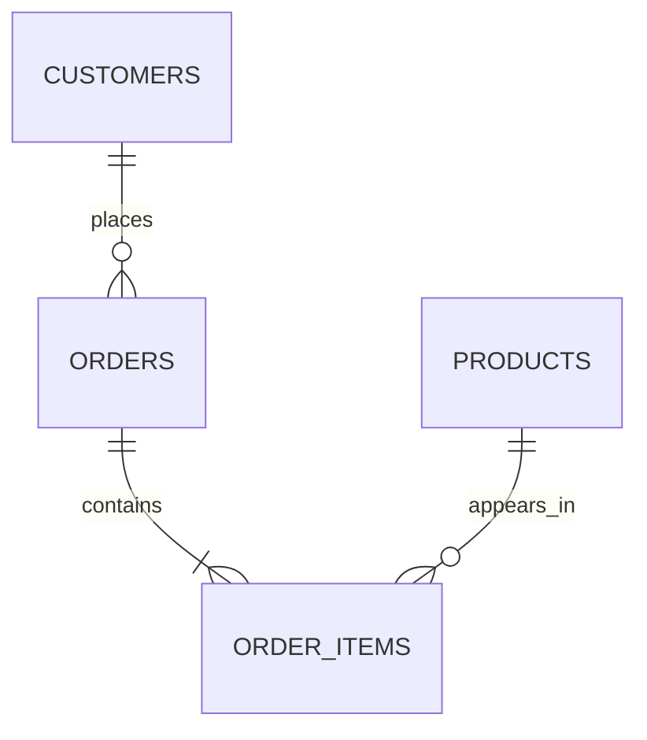

# 06- JOIN Exercises

## Overview

JOIN exercises are among the highest-value SQL practice problems because they test whether you understand **relationships, cardinality, filtering, aggregation, and result grain** rather than just SQL syntax.

In production backend systems, joins appear everywhere:

- Loading resources and their relationships.
- Building REST API responses.
- Generating reports.
- Enforcing tenant scope.
- Checking authorization.
- Finding missing relationships.
- Aggregating orders, payments, and events.
- Implementing search and filtering.
- Supporting administrative and operational queries.

The central skill is not memorizing `INNER JOIN`, `LEFT JOIN`, or `RIGHT JOIN`. It is being able to answer:

> **What should one output row represent, and which relationships are allowed to multiply that row?**

The exercises use PostgreSQL and the following schema.

---

## Practice Schema

```sql
CREATE TABLE customers (
    id bigint GENERATED ALWAYS AS IDENTITY PRIMARY KEY,
    email text NOT NULL UNIQUE,
    name text NOT NULL,
    status text NOT NULL DEFAULT 'active'
        CHECK (status IN ('active', 'inactive', 'suspended')),
    created_at timestamptz NOT NULL DEFAULT now()
);

CREATE TABLE products (
    id bigint GENERATED ALWAYS AS IDENTITY PRIMARY KEY,
    sku text NOT NULL UNIQUE,
    name text NOT NULL,
    price numeric(12, 2) NOT NULL
        CHECK (price >= 0),
    active boolean NOT NULL DEFAULT true,
    created_at timestamptz NOT NULL DEFAULT now()
);

CREATE TABLE orders (
    id bigint GENERATED ALWAYS AS IDENTITY PRIMARY KEY,
    customer_id bigint NOT NULL
        REFERENCES customers(id),
    status text NOT NULL
        CHECK (status IN ('pending', 'processing', 'completed', 'cancelled')),
    total_amount numeric(12, 2) NOT NULL
        CHECK (total_amount >= 0),
    created_at timestamptz NOT NULL DEFAULT now()
);

CREATE TABLE order_items (
    order_id bigint NOT NULL
        REFERENCES orders(id),
    product_id bigint NOT NULL
        REFERENCES products(id),
    quantity integer NOT NULL
        CHECK (quantity > 0),
    unit_price numeric(12, 2) NOT NULL
        CHECK (unit_price >= 0),
    PRIMARY KEY (order_id, product_id)
);
```

The relationships are:



This means:

```text
customer 1 → many orders
order    1 → many order_items
product  1 → many order_items
```

Those cardinalities are critical when predicting the number of rows produced by a join.

---

## JOIN Mental Model

A join combines rows according to a relationship condition.

For example:

```sql
SELECT
    c.id AS customer_id,
    c.email,
    o.id AS order_id
FROM customers AS c
JOIN orders AS o
    ON o.customer_id = c.id;
```

For every matching customer/order relationship, PostgreSQL produces a result row.

If one customer has five orders, that customer can appear five times.

This is not a duplicate produced by SQL accidentally. It is the expected result of a one-to-many relationship.

---

## Result Grain

Before writing a join, define the grain.

Examples:

| Desired grain | Possible result |
|---|---|
| Customer | One row per customer |
| Order | One row per order |
| Order item | One row per order item |
| Customer-order | One row per customer/order relationship |
| Product | One row per product |
| Customer summary | One row per customer with aggregates |

Suppose the requirement says:

> Return customers who have completed orders.

The desired grain is **customer**, not customer-order.

Therefore this:

```sql
SELECT
    c.id,
    c.email
FROM customers AS c
JOIN orders AS o
    ON o.customer_id = c.id
WHERE o.status = 'completed';
```

can return the same customer multiple times.

An existence predicate is often more appropriate:

```sql
SELECT
    c.id,
    c.email
FROM customers AS c
WHERE EXISTS (
    SELECT 1
    FROM orders AS o
    WHERE o.customer_id = c.id
      AND o.status = 'completed'
);
```

---

## INNER JOIN Exercises

An `INNER JOIN` returns only rows with a matching relationship.

### Basic Customer-Order Join

Write a query that returns:

- Customer ID.
- Customer email.
- Order ID.
- Order status.
- Order creation timestamp.

```sql
SELECT
    c.id AS customer_id,
    c.email,
    o.id AS order_id,
    o.status,
    o.created_at
FROM customers AS c
INNER JOIN orders AS o
    ON o.customer_id = c.id;
```

### Exercise

Modify the query to return only:

1. Completed orders.
2. Orders created after a given timestamp.
3. Orders belonging to active customers.
4. Completed orders belonging to active customers.
5. Orders above a specified amount.

---

## JOIN Conditions

The relationship belongs in the `ON` clause:

```sql
ON o.customer_id = c.id
```

Additional relationship-specific restrictions can also be placed there:

```sql
ON o.customer_id = c.id
AND o.status = 'completed'
```

Whether a condition belongs in `ON` or `WHERE` depends on the desired semantics, especially with outer joins.

For an inner join, many predicates can produce equivalent results, but explicit structure still improves readability.

---

## LEFT JOIN

A `LEFT JOIN` preserves every row from the left table.

```sql
SELECT
    c.id,
    c.email,
    o.id AS order_id
FROM customers AS c
LEFT JOIN orders AS o
    ON o.customer_id = c.id;
```

Customers without orders remain in the result with `NULL` order columns.

This is useful when the requirement is:

> Return every customer, regardless of whether they have orders.

---

## Customers With No Orders

A classic anti-join exercise:

```sql
SELECT
    c.id,
    c.email
FROM customers AS c
LEFT JOIN orders AS o
    ON o.customer_id = c.id
WHERE o.id IS NULL;
```

An equivalent existence-oriented formulation is:

```sql
SELECT
    c.id,
    c.email
FROM customers AS c
WHERE NOT EXISTS (
    SELECT 1
    FROM orders AS o
    WHERE o.customer_id = c.id
);
```

Both are useful patterns.

For interview questions, be able to explain both and discuss why `NOT EXISTS` often expresses the business intent more directly.

---

## LEFT JOIN With Filtering

Suppose the requirement is:

> Return every customer and their completed orders if they have any.

Correct:

```sql
SELECT
    c.id,
    c.email,
    o.id AS order_id
FROM customers AS c
LEFT JOIN orders AS o
    ON o.customer_id = c.id
   AND o.status = 'completed';
```

Incorrect for that requirement:

```sql
SELECT
    c.id,
    c.email,
    o.id AS order_id
FROM customers AS c
LEFT JOIN orders AS o
    ON o.customer_id = c.id
WHERE o.status = 'completed';
```

The second query removes customers with no matching completed order because `o.status` is `NULL`.

This effectively changes the semantics toward an inner join.

---

## Multiple JOINs

To retrieve customer, order, and product information:

```sql
SELECT
    c.id AS customer_id,
    c.email,
    o.id AS order_id,
    p.id AS product_id,
    p.sku,
    oi.quantity,
    oi.unit_price
FROM customers AS c
JOIN orders AS o
    ON o.customer_id = c.id
JOIN order_items AS oi
    ON oi.order_id = o.id
JOIN products AS p
    ON p.id = oi.product_id;
```

The join path is:

```text
customers
    ↓
orders
    ↓
order_items
    ↓
products
```

Each one-to-many relationship can increase result cardinality.

---

## JOIN Cardinality Exercises

Assume:

```text
Customer A → 3 orders
Customer B → 1 order
Customer C → 0 orders
```

An inner customer/order join produces:

```text
Customer A → 3 rows
Customer B → 1 row
Customer C → 0 rows
```

A left join produces:

```text
Customer A → 3 rows
Customer B → 1 row
Customer C → 1 row with NULL order columns
```

### Exercises

Predict the result count before executing:

1. Customer → orders.
2. Orders → order items.
3. Customers → orders → order items.
4. Customers → orders → order items → products.
5. The same queries using `LEFT JOIN`.

The ability to predict cardinality is more important than memorizing join syntax.

---

## Many-to-Many JOIN

`orders` and `products` are related through `order_items`.

To find products purchased in an order:

```sql
SELECT
    o.id AS order_id,
    p.id AS product_id,
    p.name,
    oi.quantity
FROM orders AS o
JOIN order_items AS oi
    ON oi.order_id = o.id
JOIN products AS p
    ON p.id = oi.product_id;
```

The junction table contains the relationship.

This pattern generalizes to:

```text
users ↔ roles
students ↔ courses
posts ↔ tags
orders ↔ products
```

---

## Find Products Never Ordered

Use an anti-join:

```sql
SELECT
    p.id,
    p.sku,
    p.name
FROM products AS p
LEFT JOIN order_items AS oi
    ON oi.product_id = p.id
WHERE oi.product_id IS NULL;
```

Or:

```sql
SELECT
    p.id,
    p.sku,
    p.name
FROM products AS p
WHERE NOT EXISTS (
    SELECT 1
    FROM order_items AS oi
    WHERE oi.product_id = p.id
);
```

### Exercise

Implement both versions and compare their execution plans.

---

## Find Products Ordered At Least Once

```sql
SELECT
    p.id,
    p.sku,
    p.name
FROM products AS p
WHERE EXISTS (
    SELECT 1
    FROM order_items AS oi
    WHERE oi.product_id = p.id
);
```

A join can also be used:

```sql
SELECT DISTINCT
    p.id,
    p.sku,
    p.name
FROM products AS p
JOIN order_items AS oi
    ON oi.product_id = p.id;
```

The `EXISTS` version communicates the existence requirement without generating multiple product rows.

---

## Self JOIN

A self join joins a table to itself.

Suppose employees were modeled as:

```text
employees
---------
id
name
manager_id
```

A query could be:

```sql
SELECT
    e.id,
    e.name,
    m.name AS manager_name
FROM employees AS e
LEFT JOIN employees AS m
    ON m.id = e.manager_id;
```

Self joins are useful for:

- Hierarchies.
- Parent-child relationships.
- Comparing rows.
- Finding related records in the same table.

### Exercise

Using an employee hierarchy, write queries to find:

1. Employees with managers.
2. Employees without managers.
3. Employees whose manager has a particular role.
4. Pairs of employees belonging to the same department.

---

## JOIN and Aggregation

Find the number of orders per customer:

```sql
SELECT
    c.id,
    c.email,
    COUNT(o.id) AS order_count
FROM customers AS c
LEFT JOIN orders AS o
    ON o.customer_id = c.id
GROUP BY
    c.id,
    c.email;
```

Use:

```sql
COUNT(o.id)
```

rather than:

```sql
COUNT(*)
```

when you want customers with no matching orders to have a count of zero.

With `LEFT JOIN`, `COUNT(*)` counts the preserved customer row even when no order exists.

---

## JOIN and SUM

Calculate completed order value per customer:

```sql
SELECT
    c.id,
    c.email,
    COALESCE(SUM(o.total_amount), 0) AS completed_value
FROM customers AS c
LEFT JOIN orders AS o
    ON o.customer_id = c.id
   AND o.status = 'completed'
GROUP BY
    c.id,
    c.email;
```

Placing the order-status predicate in the `ON` clause preserves customers with no completed orders.

---

## Avoiding Double Counting

Suppose a query joins:

```text
customer
  ↓
orders
  ↓
order_items
```

and then aggregates order-level amounts.

A careless join can multiply an order's row across multiple order items.

For example:

```sql
SELECT
    c.id,
    SUM(o.total_amount) AS revenue
FROM customers AS c
JOIN orders AS o
    ON o.customer_id = c.id
JOIN order_items AS oi
    ON oi.order_id = o.id
GROUP BY c.id;
```

If an order has five items, its `total_amount` can contribute five times.

The correct solution depends on the desired grain.

If `orders.total_amount` already represents the order total, aggregate at the order grain before joining to item-level data, or avoid the unnecessary item join entirely.

---

## Pre-Aggregation

When combining multiple one-to-many relationships, pre-aggregation can prevent row multiplication.

For example:

```sql
WITH order_totals AS (
    SELECT
        customer_id,
        SUM(total_amount) AS revenue
    FROM orders
    WHERE status = 'completed'
    GROUP BY customer_id
)
SELECT
    c.id,
    c.email,
    COALESCE(ot.revenue, 0) AS revenue
FROM customers AS c
LEFT JOIN order_totals AS ot
    ON ot.customer_id = c.id;
```

This creates one row per customer in the aggregated relation before joining it back to `customers`.

---

## JOIN With Multiple Child Collections

A dangerous pattern is:

```text
customer
 ├── orders
 └── addresses
```

Joining both one-to-many relationships simultaneously can create:

```text
orders × addresses
```

rows per customer.

For example:

```text
Customer A
3 orders
2 addresses

3 × 2 = 6 rows
```

This is a Cartesian multiplication across independent child relationships.

Better strategies include:

- Separate queries.
- `EXISTS`.
- Pre-aggregation.
- Lateral queries.
- JSON aggregation when one response document is actually desired.
- Application-level composition where appropriate.

---

## LATERAL JOIN

`LATERAL` allows a subquery in the `FROM` clause to reference preceding rows.

For example, retrieve the two most recent orders for each customer:

```sql
SELECT
    c.id AS customer_id,
    c.email,
    recent.id AS order_id,
    recent.created_at
FROM customers AS c
LEFT JOIN LATERAL (
    SELECT
        o.id,
        o.created_at
    FROM orders AS o
    WHERE o.customer_id = c.id
    ORDER BY o.created_at DESC, o.id DESC
    LIMIT 2
) AS recent
    ON true;
```

This can be useful for per-parent top-N problems.

The supporting index matters:

```sql
CREATE INDEX orders_customer_created_idx
ON orders (customer_id, created_at DESC, id DESC);
```

Validate the actual plan before assuming the query is efficient.

---

## JOIN and EXISTS

A common interview question is:

> When should you use a JOIN versus EXISTS?

Use a join when you need columns from the related table or need to form a combined relation.

Use `EXISTS` when the requirement is fundamentally:

> Does a related row exist?

Example:

```sql
SELECT
    c.id,
    c.email
FROM customers AS c
WHERE EXISTS (
    SELECT 1
    FROM orders AS o
    WHERE o.customer_id = c.id
      AND o.status = 'completed'
);
```

This avoids introducing child-row multiplicity into the outer result.

---

## JOIN and NOT EXISTS

For:

> Find customers without completed orders.

Prefer:

```sql
SELECT
    c.id,
    c.email
FROM customers AS c
WHERE NOT EXISTS (
    SELECT 1
    FROM orders AS o
    WHERE o.customer_id = c.id
      AND o.status = 'completed'
);
```

This expresses the negative relationship directly.

---

## FULL OUTER JOIN

A `FULL OUTER JOIN` preserves unmatched rows from both sides.

Example:

```sql
SELECT
    a.id AS left_id,
    b.id AS right_id
FROM source_a AS a
FULL OUTER JOIN source_b AS b
    ON b.id = a.id;
```

It is useful for reconciliation:

```text
System A records
        ↕
   reconciliation
        ↕
System B records
```

For example:

- Comparing imported data.
- Reconciling payment records.
- Detecting records missing from either system.

It is less common in normal transactional API queries.

---

## CROSS JOIN

A `CROSS JOIN` creates the Cartesian product.

```sql
SELECT
    c.id,
    p.id
FROM customers AS c
CROSS JOIN products AS p;
```

If there are:

```text
10,000 customers
20,000 products
```

the logical result can contain:

```text
200,000,000 rows
```

This can be intentional for generating combinations, but accidental Cartesian products are a major production performance problem.

---

## JOIN Predicate Mistakes

### Missing Join Condition

Dangerous:

```sql
SELECT *
FROM customers AS c
JOIN orders AS o;
```

This creates a Cartesian product.

### Incorrect Relationship Column

Incorrect:

```sql
ON o.id = c.id
```

when the actual relationship is:

```sql
ON o.customer_id = c.id
```

The query may execute successfully while returning incorrect data.

### Joining at the Wrong Grain

If the output must contain one row per customer, joining multiple one-to-many tables without controlling cardinality can violate the intended grain.

### Using DISTINCT to Hide a Join Bug

This:

```sql
SELECT DISTINCT
    c.id,
    c.email
FROM customers AS c
JOIN orders AS o
    ON o.customer_id = c.id;
```

may hide duplicates without fixing the underlying relationship logic.

`DISTINCT` is appropriate when duplicate elimination is part of the actual result semantics, not as a generic repair mechanism.

---

## JOIN and NULL

Consider:

```sql
LEFT JOIN orders AS o
    ON o.customer_id = c.id
```

For customers without orders:

```text
o.id           → NULL
o.status       → NULL
o.total_amount → NULL
```

Therefore:

```sql
WHERE o.status = 'completed'
```

will not preserve those customers.

Understanding NULL propagation is essential when working with outer joins.

---

## JOIN and Filter Placement

Compare:

```sql
LEFT JOIN orders AS o
    ON o.customer_id = c.id
   AND o.status = 'completed'
```

with:

```sql
LEFT JOIN orders AS o
    ON o.customer_id = c.id
WHERE o.status = 'completed'
```

The first says:

> Preserve all customers and attach completed orders.

The second says:

> Join all orders, then keep only rows where an order is completed.

That difference determines whether customers without completed orders remain.

---

## JOIN With Date Filters

Find customers with orders during a time window:

```sql
SELECT DISTINCT
    c.id,
    c.email
FROM customers AS c
JOIN orders AS o
    ON o.customer_id = c.id
WHERE o.created_at >= $1
  AND o.created_at < $2;
```

If the requirement is existence rather than customer-order output:

```sql
SELECT
    c.id,
    c.email
FROM customers AS c
WHERE EXISTS (
    SELECT 1
    FROM orders AS o
    WHERE o.customer_id = c.id
      AND o.created_at >= $1
      AND o.created_at < $2
);
```

The second version avoids duplicate customer rows.

---

## JOIN and Pagination

Pagination becomes dangerous when the join multiplies rows.

For example:

```sql
SELECT
    c.id,
    c.email,
    o.id AS order_id
FROM customers AS c
LEFT JOIN orders AS o
    ON o.customer_id = c.id
ORDER BY c.id
LIMIT 50;
```

This limits **result rows**, not customers.

You may receive fewer than 50 unique customers.

If the API needs 50 customers, paginate the customer relation first or use a query structure that preserves customer grain.

---

## Pagination at the Correct Grain

One strategy is:

```sql
WITH page AS (
    SELECT
        id,
        email
    FROM customers
    WHERE id > $1
    ORDER BY id
    LIMIT 50
)
SELECT
    page.id AS customer_id,
    page.email,
    o.id AS order_id
FROM page
LEFT JOIN orders AS o
    ON o.customer_id = page.id
ORDER BY
    page.id,
    o.created_at DESC;
```

The pagination occurs at the customer grain.

This is often easier to reason about for APIs that return a page of parent resources with related data.

---

## JOIN and Indexes

A join commonly benefits from indexes on relationship columns.

For example:

```sql
CREATE INDEX orders_customer_id_idx
ON orders (customer_id);
```

For:

```sql
SELECT
    o.id,
    o.created_at
FROM orders AS o
WHERE o.customer_id = $1
ORDER BY o.created_at DESC
LIMIT 50;
```

a better index can be:

```sql
CREATE INDEX orders_customer_created_idx
ON orders (
    customer_id,
    created_at DESC
);
```

The best index depends on the complete query pattern.

---

## Foreign Keys and Indexing

A foreign key does not automatically mean the referencing column has an index in PostgreSQL.

For high-frequency joins such as:

```sql
orders.customer_id = customers.id
```

an index on:

```sql
orders(customer_id)
```

is often important.

The primary key on `customers.id` already provides an index for the referenced side.

For large systems, inspect:

- Join frequency.
- Query plans.
- Foreign-key update/delete behavior.
- Write overhead.
- Data distribution.

---

## JOIN Performance

When investigating a slow join, inspect:

```sql
EXPLAIN (ANALYZE, BUFFERS)
SELECT
    c.id,
    c.email,
    o.id
FROM customers AS c
JOIN orders AS o
    ON o.customer_id = c.id
WHERE o.status = 'completed';
```

Look for:

- Join algorithm.
- Estimated versus actual rows.
- Nested-loop iterations.
- Hash table size.
- Sort operations.
- Rows removed by filters.
- Buffer reads/hits.
- Temporary I/O.
- Unexpected cardinality multiplication.

Do not decide that a join is slow merely because the query contains several joins.

The data distribution and selected plan matter.

---

## JOIN Algorithms

PostgreSQL can use different physical join strategies.

| Join | Typical use |
|---|---|
| Nested Loop | Small outer relation or efficient indexed inner lookup |
| Hash Join | Equality joins over substantial relations |
| Merge Join | Sorted inputs or useful ordering |
| Cartesian/Cross | Explicit or accidental combinations |

The SQL query expresses logical intent.

The optimizer chooses the physical implementation.

---

## Nested Loop Example

Conceptually:

```text
for each customer:
    find matching orders
```

An index on:

```sql
orders(customer_id)
```

can make this efficient when the outer relation is relatively small or selective.

But a nested loop can become expensive when the outer relation is large and the inner lookup is repeated many times.

---

## Hash Join Example

Conceptually:

```text
Build hash table from one relation
        ↓
Scan other relation
        ↓
Probe hash table for matches
```

Hash joins are useful for large equality joins when building the hash table is practical.

Memory pressure can cause hash operations to spill to temporary storage.

---

## Merge Join Example

Conceptually:

```text
sorted relation A
       +
sorted relation B
       ↓
merge matching keys
```

Merge joins are particularly useful when inputs are already sorted or can be obtained efficiently in sorted form.

---

## JOIN and Query Optimization

A production optimization workflow:

```text
Define expected grain
        ↓
Validate relationships
        ↓
Check cardinality
        ↓
Inspect generated SQL
        ↓
Run EXPLAIN
        ↓
Check indexes
        ↓
Check statistics
        ↓
Reduce unnecessary rows early
        ↓
Re-test with production-like data
```

Do not optimize joins based solely on the number of tables.

A five-table join can be fast.

A two-table join can be expensive.

---

## JOIN and Early Filtering

Filtering can reduce the amount of data participating in later operations.

For example:

```sql
SELECT
    c.id,
    c.email,
    o.id
FROM customers AS c
JOIN orders AS o
    ON o.customer_id = c.id
WHERE o.status = 'completed'
  AND o.created_at >= $1;
```

The optimizer may push predicates through the plan when semantically safe.

The key engineering goal is to reduce unnecessary data processing without changing semantics.

---

## JOIN and CTEs

A CTE can make a complex join easier to reason about:

```sql
WITH recent_orders AS (
    SELECT
        id,
        customer_id,
        total_amount
    FROM orders
    WHERE created_at >= $1
)
SELECT
    c.id,
    c.email,
    ro.id AS order_id,
    ro.total_amount
FROM customers AS c
JOIN recent_orders AS ro
    ON ro.customer_id = c.id;
```

Do not assume that using a CTE automatically improves performance.

Modern PostgreSQL can inline many CTEs, while explicit materialization can change execution behavior.

Use CTEs primarily when they improve query structure or are semantically useful, then validate the plan.

---

## JOIN and ORM

Django can generate joins automatically.

For example:

```python
orders = (
    Order.objects
    .select_related("customer")
    .filter(
        customer__status="active",
        status="completed",
    )
)
```

`select_related()` is appropriate for single-valued relationships such as foreign keys.

For collections:

```python
customers = (
    Customer.objects
    .prefetch_related("orders")
)
```

uses separate queries rather than one large join.

The distinction is important:

| Django operation | Typical SQL behavior |
|---|---|
| `select_related()` | SQL JOIN |
| `prefetch_related()` | Separate query + application-side relation assembly |
| `filter(related__field=...)` | SQL JOIN/filter |
| `Exists()` | SQL `EXISTS` |
| `Subquery()` | SQL subquery |

ORM abstractions do not remove join cardinality concerns.

---

## N+1 Versus JOIN Multiplication

These are different problems.

### N+1

```text
1 customer query
+
N order queries
```

This creates excessive database round trips.

### Join multiplication

```text
1 query
but
customer × orders × addresses
```

This can create an unnecessarily large result set.

The solution for N+1 is not always "add a join."

Sometimes `prefetch_related()`, `EXISTS`, aggregation, or separate queries are more appropriate.

---

## FastAPI and SQLAlchemy

SQLAlchemy can explicitly express joins:

```python
from sqlalchemy import select

statement = (
    select(Order.id, Customer.email)
    .join(Customer, Customer.id == Order.customer_id)
    .where(
        Customer.status == "active",
        Order.status == "completed",
    )
)
```

For production systems, keep join construction tied to validated business filters rather than allowing arbitrary request parameters to determine SQL structure.

---

## JOIN Security

A correct join can still expose unauthorized data.

For a multi-tenant system, tenant scope should be represented explicitly:

```sql
SELECT
    o.id,
    o.total_amount,
    c.email
FROM orders AS o
JOIN customers AS c
    ON c.id = o.customer_id
WHERE o.organization_id = $1
  AND c.organization_id = $1;
```

The exact schema may enforce tenant relationships differently, but the important principle is:

> Joining related tables does not automatically establish authorization.

Application authorization, foreign keys, RLS, and tenant-scoped query patterns should work together.

---

## JOIN and Row-Level Security

If PostgreSQL Row-Level Security is used, joins can interact with policies on multiple tables.

A query may be syntactically correct but return fewer rows because a policy prevents access to related rows.

When debugging:

- Check active role.
- Check applicable RLS policies.
- Verify tenant context.
- Check whether the role bypasses RLS.
- Inspect the generated SQL.
- Validate the query under the same application role.

Do not disable security policies simply to make a join return more rows.

---

## JOIN and Read Replicas

Complex joins executed against a read replica are subject to replica consistency.

A newly created order may not yet be visible on the replica.

For user-facing workflows requiring read-after-write behavior:

```text
write → primary
read  → primary or consistency-aware route
```

For eventually consistent reporting:

```text
read → replica
```

can be appropriate.

Join correctness includes consistency requirements, not just relational correctness.

---

## JOIN and Transactions

Multiple related reads inside a transaction may need a consistent view.

For example:

```text
transaction begins
      ↓
read customer
      ↓
join/read orders
      ↓
perform validation
      ↓
commit
```

The appropriate isolation level depends on the business invariant.

Do not introduce stronger isolation merely because joins are involved. Stronger isolation can increase contention and reduce concurrency.

---

## JOIN and Concurrent Writes

Suppose a service checks:

```sql
SELECT
    c.id
FROM customers AS c
JOIN orders AS o
    ON o.customer_id = c.id
WHERE c.id = $1
  AND o.status = 'completed';
```

and then makes a decision based on that result.

A concurrent transaction may change the underlying data afterward.

If the decision must remain valid through a write, use appropriate transactional constraints, locking, atomic updates, or other concurrency controls.

A join itself does not provide application-level synchronization.

---

## JOIN Exercises

Complete these without looking at the solutions first:

1. Return every customer and their orders.
2. Return only customers who have orders.
3. Return customers who have no orders.
4. Return every customer, including customers without orders.
5. Return completed orders with customer information.
6. Return completed orders for active customers.
7. Return customers with at least one completed order.
8. Return customers with no completed orders.
9. Return products that have never been ordered.
10. Return products that have been ordered at least once.
11. Return every order with its order items.
12. Return every order item with product details.
13. Return customer, order, and product information in one query.
14. Count orders per customer, including customers with zero orders.
15. Calculate completed revenue per customer.
16. Find customers whose completed revenue exceeds `10,000`.
17. Find customers with more than five orders.
18. Find products ordered more than 100 times.
19. Find each customer's latest order.
20. Find the three latest orders per customer.
21. Find customers whose latest order is completed.
22. Find products that were ordered during a specified time window.
23. Find customers who purchased a particular product.
24. Find customers who purchased at least two different products.
25. Find customers who purchased every product in a specified product set.
26. Find orders containing more than three distinct products.
27. Find orders where the sum of item quantities exceeds 10.
28. Find products with total ordered quantity above a threshold.
29. Find customers with no completed orders but at least one cancelled order.
30. Find customers with both completed and cancelled orders.
31. Find customers whose first order was completed.
32. Find customers whose most recent order was cancelled.
33. Find the most expensive order per customer.
34. Find customers whose average order value exceeds a threshold.
35. Find the top five customers by completed revenue.
36. Find the top three products by quantity sold.
37. Find customers who have purchased a specific product but never another product.
38. Find products that have never appeared in a completed order.
39. Find orders containing at least one inactive product.
40. Find orders containing only active products.
41. Detect customers whose order and customer tenant IDs do not match.
42. Compare an `INNER JOIN` solution with an `EXISTS` solution.
43. Compare `LEFT JOIN ... IS NULL` with `NOT EXISTS`.
44. Demonstrate accidental Cartesian multiplication.
45. Demonstrate double counting caused by joining multiple child tables.
46. Fix double counting using pre-aggregation.
47. Solve a per-customer top-N problem using `LATERAL`.
48. Solve a per-customer top-N problem using a window function.
49. Paginate customers while joining their orders without changing customer-level pagination.
50. Analyze a deliberately slow multi-table join using `EXPLAIN (ANALYZE, BUFFERS)`.

---

## Advanced JOIN Exercises

### Customers With Both Completed and Cancelled Orders

```sql
SELECT
    c.id,
    c.email
FROM customers AS c
WHERE EXISTS (
    SELECT 1
    FROM orders AS completed
    WHERE completed.customer_id = c.id
      AND completed.status = 'completed'
)
AND EXISTS (
    SELECT 1
    FROM orders AS cancelled
    WHERE cancelled.customer_id = c.id
      AND cancelled.status = 'cancelled'
);
```

This is an existence problem rather than a requirement to return order rows.

---

### Customers With No Completed Orders but a Cancelled Order

```sql
SELECT
    c.id,
    c.email
FROM customers AS c
WHERE EXISTS (
    SELECT 1
    FROM orders AS o
    WHERE o.customer_id = c.id
      AND o.status = 'cancelled'
)
AND NOT EXISTS (
    SELECT 1
    FROM orders AS o
    WHERE o.customer_id = c.id
      AND o.status = 'completed'
);
```

This is a useful exercise in combining positive and negative existence conditions.

---

## Customers Who Purchased a Product

Find customers who purchased product `$product_id`:

```sql
SELECT
    c.id,
    c.email
FROM customers AS c
WHERE EXISTS (
    SELECT 1
    FROM orders AS o
    JOIN order_items AS oi
        ON oi.order_id = o.id
    WHERE o.customer_id = c.id
      AND oi.product_id = $1
);
```

The outer result remains at customer grain.

---

## Customers Who Purchased Every Product in a Set

This is a relational division problem.

One approach is:

```sql
SELECT
    c.id,
    c.email
FROM customers AS c
JOIN orders AS o
    ON o.customer_id = c.id
JOIN order_items AS oi
    ON oi.order_id = o.id
WHERE oi.product_id = ANY($1)
GROUP BY
    c.id,
    c.email
HAVING COUNT(DISTINCT oi.product_id) = cardinality($1);
```

This assumes `$1` contains the desired product IDs without duplicates.

A senior candidate should discuss:

- Duplicate input IDs.
- Empty product sets.
- Whether cancelled orders count.
- Whether the same product purchased multiple times should count once.
- Tenant scope.
- Performance for large product sets.

---

## Orders Containing Only Active Products

This is a negative-condition problem.

```sql
SELECT
    o.id
FROM orders AS o
WHERE NOT EXISTS (
    SELECT 1
    FROM order_items AS oi
    JOIN products AS p
        ON p.id = oi.product_id
    WHERE oi.order_id = o.id
      AND NOT p.active
);
```

If an order has zero items, this query also satisfies the "no inactive product exists" condition.

If the business requirement is:

> Orders must contain at least one item and every item must reference an active product

add:

```sql
AND EXISTS (
    SELECT 1
    FROM order_items AS oi
    WHERE oi.order_id = o.id
)
```

This illustrates why natural-language requirements must be translated carefully into SQL semantics.

---

## Latest Order Per Customer

Using a window function:

```sql
SELECT *
FROM (
    SELECT
        o.*,
        ROW_NUMBER() OVER (
            PARTITION BY customer_id
            ORDER BY created_at DESC, id DESC
        ) AS rn
    FROM orders AS o
) AS ranked
WHERE rn = 1;
```

The deterministic tie-breaker:

```sql
id DESC
```

matters when multiple orders share the same timestamp.

---

## Latest Order Using LATERAL

```sql
SELECT
    c.id AS customer_id,
    c.email,
    o.id AS order_id,
    o.status,
    o.created_at
FROM customers AS c
LEFT JOIN LATERAL (
    SELECT
        o.id,
        o.status,
        o.created_at
    FROM orders AS o
    WHERE o.customer_id = c.id
    ORDER BY o.created_at DESC, o.id DESC
    LIMIT 1
) AS o
    ON true;
```

Compare this with the window-function approach using:

```sql
EXPLAIN (ANALYZE, BUFFERS)
```

and production-like data.

---

## JOIN Debugging Exercise

Take this query:

```sql
SELECT
    c.id,
    c.email,
    SUM(o.total_amount) AS revenue
FROM customers AS c
JOIN orders AS o
    ON o.customer_id = c.id
JOIN order_items AS oi
    ON oi.order_id = o.id
JOIN products AS p
    ON p.id = oi.product_id
WHERE o.status = 'completed'
GROUP BY
    c.id,
    c.email;
```

Determine whether the revenue calculation is correct.

If `orders.total_amount` is already the complete order value, it is likely being multiplied by the number of order items.

A better solution is:

```sql
SELECT
    c.id,
    c.email,
    SUM(o.total_amount) AS revenue
FROM customers AS c
JOIN orders AS o
    ON o.customer_id = c.id
WHERE o.status = 'completed'
GROUP BY
    c.id,
    c.email;
```

Only join `order_items` and `products` if their presence is actually required by the business condition.

---

## Production JOIN Review

Before deploying a complex join, review:

### Correctness

- What does one output row represent?
- What is the relationship cardinality?
- Can any join multiply rows?
- Are outer joins required?
- Are `NULL` values expected?
- Are filters in the correct location?
- Are duplicate relationships possible?

### Performance

- Are relationship columns indexed where appropriate?
- Is the join selective?
- Are statistics accurate?
- Is the chosen join algorithm reasonable?
- Are large intermediate result sets being generated?
- Are sorts or hashes spilling?
- Is the query executed frequently?

### Security

- Is tenant scope included?
- Are resource authorization rules enforced?
- Does RLS apply?
- Could a join expose another tenant's data?
- Are all values parameterized?

### Operational Behavior

- Will this query run on the primary or replica?
- Is read-after-write consistency required?
- Could the result become very large?
- Does pagination operate at the correct grain?
- Can connection-pool concurrency amplify the workload?
- Does the query run synchronously inside an API request?

---

## Common JOIN Mistakes

| Mistake | Why it happens | Better approach |
|---|---|---|
| Missing `ON` condition | Relationship forgotten | Explicitly define join key |
| Wrong join key | Similar IDs are confused | Validate FK relationship |
| Unexpected duplicates | One-to-many multiplication | Define result grain |
| `DISTINCT` as a repair | Join logic is incorrect | Fix cardinality |
| `LEFT JOIN` filtered in `WHERE` | Outer-join semantics misunderstood | Put child condition in `ON` when appropriate |
| `COUNT(*)` after `LEFT JOIN` | Preserved parent row is counted | Use `COUNT(child.id)` |
| Double-counted aggregates | Multiple child rows multiply parent rows | Pre-aggregate or remove unnecessary joins |
| Pagination after one-to-many join | Result rows differ from resource rows | Paginate parent relation first |
| Unindexed FK lookup | Join becomes expensive at scale | Index high-value referencing columns |
| Joining unnecessary tables | Query complexity grows | Remove unused relationships |
| `CROSS JOIN` accidentally created | Join predicate missing | Validate join conditions |
| Ignoring tenant scope | Authorization boundary omitted | Include tenant constraints/policies |
| Assuming ORM handles everything | SQL complexity hidden | Inspect generated SQL and plans |

---

## JOIN Performance Checklist

For an important production join:

```text
1. Define result grain.
2. Identify relationship cardinalities.
3. Verify join predicates.
4. Remove unnecessary tables.
5. Filter according to business semantics.
6. Check for row multiplication.
7. Check aggregation grain.
8. Check relevant indexes.
9. Run EXPLAIN (ANALYZE, BUFFERS).
10. Compare estimated and actual cardinality.
11. Check memory, sort, hash, and temporary I/O.
12. Measure query frequency and concurrency.
13. Validate tenant and authorization scope.
14. Test with production-like data volume.
15. Consider replica, caching, and API pagination behavior.
```

---

## JOIN Interview Traps

### INNER JOIN vs LEFT JOIN

Do not answer:

> `LEFT JOIN` is slower.

The correct answer is semantic first:

> `INNER JOIN` removes unmatched rows. `LEFT JOIN` preserves rows from the left relation.

Performance depends on the query, data distribution, indexes, and chosen execution plan.

### JOIN vs EXISTS

Do not claim `EXISTS` is always faster.

Instead:

> Use `EXISTS` when the requirement is existence. Use a join when the related rows or combined relation are actually needed. PostgreSQL may transform logically similar queries into comparable plans.

### DISTINCT Fixes Duplicates

`DISTINCT` removes duplicate output rows.

It does not necessarily prove that the underlying join is correct.

### Foreign Keys Automatically Create All Useful Indexes

They do not.

You must consider indexes on frequently queried referencing columns.

### More JOINs Automatically Mean a Slow Query

Not necessarily.

The optimizer may produce an efficient plan for multiple joins.

The important factors include:

- Cardinality.
- Selectivity.
- Join order.
- Access paths.
- Statistics.
- Memory.
- Data distribution.
- Query frequency.

### Pagination With JOIN

`LIMIT 50` limits result rows, not necessarily 50 unique parent resources.

Always identify the pagination grain.

---

## JOIN and Observability

For production joins, monitor:

- Query latency.
- Query frequency.
- Rows returned.
- Rows examined where available through plan analysis.
- Buffer reads/hits.
- Temporary I/O.
- CPU consumption.
- Lock waits.
- Replica lag.
- Connection-pool utilization.

`pg_stat_statements` is useful for identifying high-impact query patterns.

For slow queries:

```sql
EXPLAIN (ANALYZE, BUFFERS)
...
```

For active sessions:

```sql
SELECT
    pid,
    state,
    wait_event_type,
    wait_event,
    query_start,
    query
FROM pg_stat_activity
WHERE state <> 'idle';
```

The objective is to understand the entire workload, not merely the SQL text.

---

## JOIN and Scalability

As tables grow:

- Join cardinality becomes more important.
- Poor join predicates become expensive.
- Missing indexes become more visible.
- Statistics become more important.
- Large intermediate results consume more memory.
- Hash and sort operations can spill.
- Query latency affects connection pools.
- High-frequency joins can dominate database CPU.

For very large workloads, consider:

- Pre-aggregation.
- Materialized views.
- Read models.
- Partitioning.
- OLAP/warehouse systems.
- Caching.
- Asynchronous report generation.
- Query-specific indexes.

Do not prematurely replace relational joins with application-side loops. Application-side joins often create network round trips and inconsistent snapshots.

---

## JOIN and Distributed Systems

In a microservice architecture, a database join is usually possible only within a service's database boundary.

For example:

```text
Order Service DB
        |
        X
        |
Customer Service DB
```

A SQL join cannot directly replace a service-to-service relationship when the data lives in separate databases.

Possible designs include:

- API composition.
- Read models.
- Event-driven denormalization.
- CDC pipelines.
- Dedicated analytical storage.

Kafka can propagate domain events, while Redis can support low-latency lookup or caching, but neither automatically provides relational transaction semantics across services.

---

## JOIN and API Design

A REST endpoint such as:

```text
GET /customers/{id}/orders
```

may naturally execute a filtered customer/order query.

A broader endpoint such as:

```text
GET /customers
```

should not automatically join every one-to-many relationship.

Returning:

```text
customers × orders × products × payments × addresses
```

can create massive result sets.

API response shape should influence SQL query shape.

---

## JOIN and Background Processing

Large analytical joins should generally not execute synchronously in an HTTP request.

For example:

```text
REST API
   ↓
Create report job
   ↓
Celery
   ↓
PostgreSQL / replica / warehouse
   ↓
Object storage
   ↓
Download link
```

This prevents long-running joins from consuming API connection-pool capacity.

For very large analytical workloads, isolate them from transactional traffic.

---

## Senior JOIN Decision Framework

When solving a join problem, use this sequence:

```text
Define output grain
        ↓
Identify required relationships
        ↓
Determine cardinality
        ↓
Choose INNER / LEFT / EXISTS / NOT EXISTS
        ↓
Place filters correctly
        ↓
Check row multiplication
        ↓
Choose aggregation strategy
        ↓
Design pagination if required
        ↓
Check indexes
        ↓
Inspect execution plan
        ↓
Validate authorization / tenant scope
        ↓
Evaluate concurrency and workload
        ↓
Evaluate replica / cache / API behavior
```

The key decision is not:

> Which JOIN syntax do I remember?

It is:

> **What relational result does the business requirement actually describe?**

---

## Final Practice Challenge

Design a production query for:

> Return the first 50 active customers created before a specified timestamp who have at least one completed order in the previous 90 days. For each customer, return their three most recent completed orders. The endpoint is tenant-scoped and must not return customers from another tenant.

Before writing SQL, identify:

1. Customer result grain.
2. Order result grain.
3. Tenant boundary.
4. Existence condition.
5. Pagination strategy.
6. Per-customer top-N strategy.
7. Required indexes.
8. Replica consistency requirements.
9. Expected result cardinality.
10. API response shape.

One possible implementation is:

```sql
WITH customer_page AS (
    SELECT
        c.id,
        c.email
    FROM customers AS c
    WHERE c.organization_id = $1
      AND c.status = 'active'
      AND c.created_at < $2
      AND EXISTS (
          SELECT 1
          FROM orders AS o
          WHERE o.customer_id = c.id
            AND o.status = 'completed'
            AND o.created_at >= $3
      )
      AND c.id > $4
    ORDER BY c.id
    LIMIT 50
)
SELECT
    cp.id AS customer_id,
    cp.email,
    recent.order_id,
    recent.status,
    recent.total_amount,
    recent.created_at
FROM customer_page AS cp
LEFT JOIN LATERAL (
    SELECT
        o.id AS order_id,
        o.status,
        o.total_amount,
        o.created_at
    FROM orders AS o
    WHERE o.customer_id = cp.id
      AND o.status = 'completed'
    ORDER BY o.created_at DESC, o.id DESC
    LIMIT 3
) AS recent
    ON true
ORDER BY
    cp.id,
    recent.created_at DESC,
    recent.order_id DESC;
```

The exact schema and index design may differ, but the architecture demonstrates an important principle:

> **Paginate at the API resource grain first, then expand child relationships.**

A senior candidate should also explain why this query may require different indexes for:

- Customer pagination and filtering.
- Completed-order existence checks.
- Per-customer recent-order retrieval.

---

## Key Takeaways

- **Define result grain before choosing a JOIN:** most difficult JOIN bugs are really cardinality and result-shape mistakes.
- **Use `EXISTS` and `NOT EXISTS` for relationship existence:** they avoid unnecessary row multiplication when related rows are not part of the output.
- **Treat outer-join filtering carefully:** conditions in `ON` and `WHERE` can produce materially different results, especially with `NULL`.
- **Control row multiplication explicitly:** pre-aggregation, correct join paths, parent-level pagination, and appropriate query structure prevent double counting and oversized result sets.
- **Production JOIN design is system design:** indexes, execution plans, tenant isolation, replicas, connection pools, ORM behavior, API shape, and workload scale all affect the final solution.