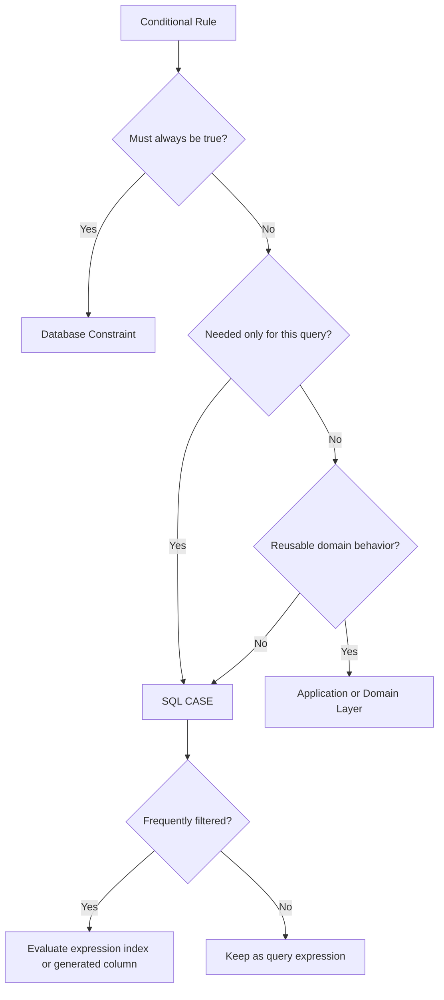

# 09- CASE Exercises

## Overview

`CASE` expressions are one of the most important SQL tools for expressing conditional business logic inside queries.

They are useful for:

- Translating database values into business categories.
- Creating conditional fields.
- Implementing conditional aggregation.
- Normalizing presentation logic.
- Building reporting dimensions.
- Handling nullable values.
- Creating derived classifications.
- Expressing ordering rules.
- Supporting data migrations and reconciliation.

The important interview and production skill is not knowing the syntax. It is being able to decide **where conditional logic belongs**:

```text
Database constraint
        ↓
SQL expression
        ↓
Application/service logic
        ↓
API presentation
```

Business rules that must remain true for every writer should generally be enforced by the database. Query-specific classification and projection logic are often appropriate for `CASE`.

---

## Practice Schema

Use the following PostgreSQL schema for the exercises:

```sql
CREATE TABLE customers (
    id bigint GENERATED ALWAYS AS IDENTITY PRIMARY KEY,
    email text NOT NULL UNIQUE,
    name text NOT NULL,
    organization_id bigint NOT NULL,
    status text NOT NULL
        CHECK (status IN ('active', 'inactive', 'suspended')),
    phone text,
    created_at timestamptz NOT NULL DEFAULT now()
);

CREATE TABLE products (
    id bigint GENERATED ALWAYS AS IDENTITY PRIMARY KEY,
    sku text NOT NULL UNIQUE,
    name text NOT NULL,
    price numeric(12, 2),
    active boolean NOT NULL DEFAULT true,
    created_at timestamptz NOT NULL DEFAULT now()
);

CREATE TABLE orders (
    id bigint GENERATED ALWAYS AS IDENTITY PRIMARY KEY,
    customer_id bigint NOT NULL
        REFERENCES customers(id),
    status text NOT NULL
        CHECK (status IN ('pending', 'processing', 'completed', 'cancelled')),
    total_amount numeric(12, 2) NOT NULL,
    discount_amount numeric(12, 2),
    shipped_at timestamptz,
    completed_at timestamptz,
    created_at timestamptz NOT NULL DEFAULT now()
);

CREATE TABLE payments (
    id bigint GENERATED ALWAYS AS IDENTITY PRIMARY KEY,
    order_id bigint NOT NULL
        REFERENCES orders(id),
    amount numeric(12, 2),
    refunded_amount numeric(12, 2),
    status text NOT NULL
        CHECK (status IN ('pending', 'paid', 'failed', 'refunded')),
    paid_at timestamptz
);
```

---

## CASE Syntax

There are two primary forms.

### Searched CASE

```sql
CASE
    WHEN condition_1 THEN result_1
    WHEN condition_2 THEN result_2
    ELSE default_result
END
```

Example:

```sql
SELECT
    id,
    total_amount,
    CASE
        WHEN total_amount >= 10000 THEN 'high'
        WHEN total_amount >= 1000 THEN 'medium'
        ELSE 'low'
    END AS order_value_band
FROM orders;
```

This form is the most flexible because each branch can contain an independent predicate.

### Simple CASE

```sql
CASE expression
    WHEN value_1 THEN result_1
    WHEN value_2 THEN result_2
    ELSE default_result
END
```

Example:

```sql
SELECT
    id,
    status,
    CASE status
        WHEN 'pending' THEN 'open'
        WHEN 'processing' THEN 'open'
        WHEN 'completed' THEN 'closed'
        WHEN 'cancelled' THEN 'closed'
        ELSE 'unknown'
    END AS lifecycle_group
FROM orders;
```

Use simple `CASE` when comparing one expression against discrete values. Use searched `CASE` when the conditions are more complex.

---

## CASE Evaluation Order

Branches are evaluated in order.

```sql
CASE
    WHEN total_amount >= 100 THEN 'large'
    WHEN total_amount >= 1000 THEN 'very_large'
    ELSE 'small'
END
```

The second branch can never be reached because every value greater than or equal to `1000` is already greater than or equal to `100`.

Correct ordering:

```sql
CASE
    WHEN total_amount >= 1000 THEN 'very_large'
    WHEN total_amount >= 100 THEN 'large'
    ELSE 'small'
END
```

This is one of the most common `CASE` mistakes in interviews.

---

## ELSE Matters

If no condition matches and there is no `ELSE`, the result is NULL.

```sql
SELECT
    CASE
        WHEN status = 'completed' THEN 'done'
    END AS label
FROM orders;
```

For non-completed orders, `label` is NULL.

An explicit `ELSE` is often safer:

```sql
CASE
    WHEN status = 'completed' THEN 'done'
    ELSE 'not_done'
END
```

For critical business classifications, consider using an explicit fallback such as `'unknown'` rather than silently generating NULL.

---

## CASE and NULL

This is incorrect:

```sql
CASE
    WHEN shipped_at = NULL THEN 'not shipped'
    ELSE 'shipped'
END
```

Use:

```sql
CASE
    WHEN shipped_at IS NULL THEN 'not shipped'
    ELSE 'shipped'
END
```

`NULL` requires NULL-aware operators.

---

## CASE Result Types

All branches of a `CASE` expression must resolve to compatible types.

Good:

```sql
CASE
    WHEN total_amount >= 1000 THEN 'large'
    ELSE 'small'
END
```

Potentially problematic:

```sql
CASE
    WHEN total_amount >= 1000 THEN 'large'
    ELSE 0
END
```

The database must determine a common result type.

Keep branch types intentional and consistent.

---

## CASE in SELECT

The most common use is creating a derived column.

```sql
SELECT
    id,
    status,
    CASE
        WHEN status IN ('pending', 'processing') THEN 'open'
        WHEN status IN ('completed', 'cancelled') THEN 'closed'
        ELSE 'unknown'
    END AS lifecycle_state
FROM orders;
```

This does not modify the stored data.

It only changes the result projection.

---

## Exercise: Basic CASE

Write queries to:

1. Classify orders as `open` or `closed`.
2. Classify customers as `active`, `inactive`, or `suspended`.
3. Classify products as `priced` or `unpriced`.
4. Classify payments as `successful`, `failed`, or `pending`.
5. Classify orders as `shipped` or `not_shipped`.
6. Classify orders as `completed` or `not_completed`.
7. Return a human-readable label for every order status.
8. Return a human-readable label for every payment status.

---

## CASE for Numeric Bands

A common reporting requirement is grouping continuous values into categories.

```sql
SELECT
    id,
    total_amount,
    CASE
        WHEN total_amount < 100 THEN 'small'
        WHEN total_amount < 1000 THEN 'medium'
        WHEN total_amount < 10000 THEN 'large'
        ELSE 'enterprise'
    END AS order_band
FROM orders;
```

Notice that conditions are ordered from the smallest threshold upward.

This creates mutually exclusive ranges.

---

## Boundary Testing

For:

```sql
CASE
    WHEN total_amount < 100 THEN 'small'
    WHEN total_amount < 1000 THEN 'medium'
    WHEN total_amount < 10000 THEN 'large'
    ELSE 'enterprise'
END
```

test boundary values:

| Amount | Expected |
|---:|---|
| `99.99` | small |
| `100` | medium |
| `999.99` | medium |
| `1000` | large |
| `9999.99` | large |
| `10000` | enterprise |

Production classification logic should always test boundary values explicitly.

---

## Exercise: Numeric Classification

Create classifications for:

1. Orders below `₹500`.
2. Orders from `₹500` to below `₹2,000`.
3. Orders from `₹2,000` to below `₹10,000`.
4. Orders of `₹10,000` or more.
5. Products below `₹100`.
6. Products between `₹100` and `₹1,000`.
7. Products above `₹1,000`.
8. Payments based on amount ranges.

Use numeric comparisons rather than converting numbers to text.

---

## CASE for Status Mapping

Status values often need to be grouped for API or reporting purposes.

```sql
SELECT
    id,
    status,
    CASE status
        WHEN 'pending' THEN 'active'
        WHEN 'processing' THEN 'active'
        WHEN 'completed' THEN 'terminal'
        WHEN 'cancelled' THEN 'terminal'
        ELSE 'unknown'
    END AS status_group
FROM orders;
```

This can reduce repeated application-side mapping when the classification is specifically part of the query.

However, if the status mapping is a fundamental domain rule used by many services, consider centralizing it rather than duplicating the mapping across SQL queries.

---

## CASE for Boolean Output

`CASE` can produce boolean values.

```sql
SELECT
    id,
    CASE
        WHEN status = 'completed' THEN true
        ELSE false
    END AS is_completed
FROM orders;
```

In PostgreSQL, if the condition itself already produces a boolean, this is often unnecessary:

```sql
SELECT
    id,
    status = 'completed' AS is_completed
FROM orders;
```

Prefer the simpler expression when no additional mapping is required.

---

## CASE for NULL Classification

```sql
SELECT
    id,
    CASE
        WHEN discount_amount IS NULL THEN 'not_recorded'
        WHEN discount_amount = 0 THEN 'zero_discount'
        ELSE 'discounted'
    END AS discount_state
FROM orders;
```

This preserves an important distinction:

```text
NULL → no value recorded
0    → known zero
> 0  → actual discount
```

Do not collapse these states unless the domain explicitly permits it.

---

## Exercise: NULL and CASE

Write queries to:

1. Distinguish NULL discounts from zero discounts.
2. Distinguish NULL prices from zero prices.
3. Classify customers with and without phone numbers.
4. Classify orders with and without shipping timestamps.
5. Classify payments with and without payment timestamps.
6. Distinguish completed orders with a timestamp from inconsistent completed orders without one.
7. Return a fallback description for products with NULL descriptions.

---

## CASE in ORDER BY

`CASE` can implement custom business ordering.

Suppose the desired order is:

```text
processing
pending
completed
cancelled
```

Use:

```sql
SELECT
    id,
    status
FROM orders
ORDER BY CASE status
    WHEN 'processing' THEN 1
    WHEN 'pending' THEN 2
    WHEN 'completed' THEN 3
    WHEN 'cancelled' THEN 4
    ELSE 5
END;
```

This is useful when alphabetical ordering does not represent business priority.

---

## CASE and Deterministic Ordering

Custom priority alone may not be deterministic.

Add a tie-breaker:

```sql
ORDER BY
    CASE status
        WHEN 'processing' THEN 1
        WHEN 'pending' THEN 2
        WHEN 'completed' THEN 3
        WHEN 'cancelled' THEN 4
        ELSE 5
    END,
    created_at DESC,
    id DESC;
```

This is particularly important for APIs and pagination.

---

## Exercise: Custom Ordering

Create custom orderings for:

1. `failed` payments first, then `pending`, then `paid`.
2. `processing` orders first, then `pending`, then completed.
3. Suspended customers before inactive customers.
4. Products with missing prices first.
5. Products with active status before inactive products.
6. Orders with NULL `shipped_at` before shipped orders.
7. Orders with overdue completion first.

For every query, add deterministic tie-breakers.

---

## CASE in WHERE

`CASE` can technically be used in filtering:

```sql
SELECT *
FROM orders
WHERE CASE
    WHEN status = 'completed' THEN total_amount
    ELSE 0
END > 1000;
```

But this is usually less clear than expressing the actual predicate directly:

```sql
SELECT *
FROM orders
WHERE status = 'completed'
  AND total_amount > 1000;
```

Prefer direct predicates when they express the business condition clearly.

---

## CASE and Sargability

Wrapping an indexed column in a complex expression can make optimization harder.

For example:

```sql
WHERE CASE
    WHEN status = 'completed' THEN customer_id
    ELSE NULL
END = $1
```

is much less direct than:

```sql
WHERE status = 'completed'
  AND customer_id = $1
```

The second form clearly exposes the searchable predicates.

When performance matters, inspect:

```sql
EXPLAIN (ANALYZE, BUFFERS)
```

rather than relying on assumptions.

---

## CASE in GROUP BY

You can group using a classification:

```sql
SELECT
    CASE
        WHEN total_amount < 100 THEN 'small'
        WHEN total_amount < 1000 THEN 'medium'
        ELSE 'large'
    END AS order_band,
    COUNT(*) AS order_count
FROM orders
GROUP BY
    CASE
        WHEN total_amount < 100 THEN 'small'
        WHEN total_amount < 1000 THEN 'medium'
        ELSE 'large'
    END;
```

The expression defines the reporting grain.

A better approach for complex or frequently reused logic may be a CTE, view, generated column, or dimensional model depending on the workload.

---

## CASE and Aggregation

Conditional aggregation is one of the most valuable SQL patterns.

```sql
SELECT
    COUNT(*) AS total_orders,
    COUNT(*) FILTER (
        WHERE status = 'completed'
    ) AS completed_orders,
    COUNT(*) FILTER (
        WHERE status = 'cancelled'
    ) AS cancelled_orders
FROM orders;
```

This PostgreSQL syntax is often clearer than equivalent `CASE` expressions.

The traditional portable pattern is:

```sql
SELECT
    COUNT(*) AS total_orders,
    SUM(
        CASE
            WHEN status = 'completed' THEN 1
            ELSE 0
        END
    ) AS completed_orders
FROM orders;
```

For PostgreSQL-specific code, `FILTER` can improve readability.

---

## CASE and SUM

Conditional sums:

```sql
SELECT
    SUM(
        CASE
            WHEN status = 'completed' THEN total_amount
            ELSE 0
        END
    ) AS completed_revenue
FROM orders;
```

A PostgreSQL alternative:

```sql
SELECT
    SUM(total_amount) FILTER (
        WHERE status = 'completed'
    ) AS completed_revenue
FROM orders;
```

If no rows match, aggregate results may be NULL. If the API requires zero:

```sql
SELECT
    COALESCE(
        SUM(total_amount) FILTER (
            WHERE status = 'completed'
        ),
        0
    ) AS completed_revenue
FROM orders;
```

---

## CASE and Boolean Aggregation

PostgreSQL can use boolean expressions directly in some aggregation designs.

For example:

```sql
SELECT
    COUNT(*) FILTER (WHERE status = 'completed') AS completed,
    COUNT(*) FILTER (WHERE status = 'cancelled') AS cancelled
FROM orders;
```

This is generally easier to read than deeply nested `CASE` expressions.

---

## Exercise: Conditional Aggregation

Write queries to calculate:

1. Total orders.
2. Completed orders.
3. Cancelled orders.
4. Pending orders.
5. Completed revenue.
6. Cancelled revenue.
7. Orders with discounts.
8. Orders without discounts.
9. Shipped orders.
10. Unshipped orders.
11. Paid payments.
12. Failed payments.

Return all metrics in a single query where appropriate.

---

## CASE With Multiple Conditions

Complex business classification may use multiple predicates:

```sql
SELECT
    id,
    CASE
        WHEN status = 'completed'
             AND total_amount >= 10000
        THEN 'completed_high_value'

        WHEN status = 'completed'
        THEN 'completed_standard'

        WHEN status IN ('pending', 'processing')
             AND created_at < now() - interval '24 hours'
        THEN 'stale_open'

        ELSE 'other'
    END AS operational_category
FROM orders;
```

The order matters because conditions may overlap.

---

## Exercise: Operational Classification

Create categories for orders:

- Completed high-value.
- Completed standard.
- Open and recent.
- Open and stale.
- Cancelled.
- Unknown/inconsistent.

Define the exact condition precedence before writing the query.

---

## CASE for Data Quality Detection

`CASE` is useful for detecting inconsistent data.

For example:

```sql
SELECT
    id,
    status,
    completed_at,
    CASE
        WHEN status = 'completed'
             AND completed_at IS NULL
        THEN 'invalid_missing_completion_time'

        WHEN status <> 'completed'
             AND completed_at IS NOT NULL
        THEN 'invalid_unexpected_completion_time'

        ELSE 'valid'
    END AS data_quality_status
FROM orders;
```

This is useful during:

- Migration validation.
- Production audits.
- Reconciliation.
- Incident investigation.
- Data-quality monitoring.

If the invariant is mandatory, do not stop at reporting the problem. Enforce it with a database constraint when practical.

---

## CASE for Migration Validation

Suppose a new status representation is being introduced.

You can validate mappings:

```sql
SELECT
    id,
    status,
    CASE
        WHEN status IN ('pending', 'processing') THEN 'open'
        WHEN status IN ('completed', 'cancelled') THEN 'terminal'
        ELSE NULL
    END AS new_status_group
FROM orders;
```

Then inspect unexpected values:

```sql
SELECT *
FROM orders
WHERE status NOT IN (
    'pending',
    'processing',
    'completed',
    'cancelled'
);
```

The second query is usually preferable for enforcing the actual validation requirement.

---

## CASE in UPDATE

`CASE` can conditionally update values.

Example:

```sql
UPDATE orders
SET discount_amount = CASE
    WHEN total_amount >= 10000 THEN 500
    WHEN total_amount >= 5000 THEN 250
    ELSE 0
END
WHERE status = 'completed';
```

This is powerful because the transformation happens in one SQL statement.

However, production updates should consider:

- Transaction size.
- Lock duration.
- Number of affected rows.
- WAL generation.
- Replication lag.
- Rollback cost.
- Concurrent application writes.
- Whether the operation should be batched.

For large tables, do not automatically execute one massive update.

---

## CASE and Atomic Updates

Conditional state transitions can often be expressed atomically.

For example:

```sql
UPDATE orders
SET status = CASE
    WHEN status = 'pending' THEN 'processing'
    ELSE status
END
WHERE id = $1;
```

However, if the intention is specifically:

> Transition only from pending to processing.

a more direct predicate is clearer:

```sql
UPDATE orders
SET status = 'processing'
WHERE id = $1
  AND status = 'pending';
```

Then inspect the affected-row count.

This makes the concurrency invariant explicit.

---

## CASE and Concurrency

Consider:

```sql
UPDATE accounts
SET status = CASE
    WHEN balance <= 0 THEN 'blocked'
    ELSE 'active'
END
WHERE id = $1;
```

The database evaluates the expression as part of the update statement, which can be safer than:

```text
SELECT balance
→ application decides status
→ UPDATE status
```

because the latter introduces a read-modify-write race unless properly synchronized.

Prefer atomic SQL when the state transition can be expressed directly.

---

## CASE Versus Application Logic

Not every business rule belongs in SQL.

Use SQL `CASE` when:

- Logic is query-specific.
- Classification is required for reporting.
- Data should be transformed close to the database.
- Conditional aggregation is needed.
- The expression naturally belongs in the projection.

Prefer application/service logic when:

- The rule spans multiple external systems.
- The logic is complex and reusable domain behavior.
- It requires external API calls.
- It controls workflow orchestration.
- It requires side effects.

Use database constraints for invariants that must remain true regardless of which service writes the data.

---

## CASE Versus Database Constraints

Consider:

```text
completed order must have completed_at
```

A query can detect violations:

```sql
CASE
    WHEN status = 'completed'
         AND completed_at IS NULL
    THEN 'invalid'
END
```

But this does not prevent invalid data.

If the invariant is fundamental, enforce it:

```sql
CHECK (
    (status = 'completed' AND completed_at IS NOT NULL)
    OR
    (status <> 'completed' AND completed_at IS NULL)
)
```

The distinction is:

```text
CASE       → describes/classifies
CHECK      → enforces
```

---

## CASE and Views

Frequently reused classifications may be placed in a view.

```sql
CREATE VIEW order_reporting AS
SELECT
    id,
    customer_id,
    total_amount,
    status,
    CASE
        WHEN total_amount >= 10000 THEN 'high'
        WHEN total_amount >= 1000 THEN 'medium'
        ELSE 'low'
    END AS value_band
FROM orders;
```

Views can centralize read logic, but they do not automatically solve:

- Performance.
- Business-rule versioning.
- Query complexity.
- Index requirements.
- Reporting workload isolation.

For expensive analytical logic, consider materialized views or an OLAP system where appropriate.

---

## CASE and Generated Columns

If a classification is deterministic and frequently queried, a generated column may be appropriate in some designs.

For example:

```sql
CREATE TABLE products (
    id bigint GENERATED ALWAYS AS IDENTITY PRIMARY KEY,
    price numeric(12, 2),
    price_band text GENERATED ALWAYS AS (
        CASE
            WHEN price IS NULL THEN 'unpriced'
            WHEN price < 100 THEN 'low'
            WHEN price < 1000 THEN 'medium'
            ELSE 'high'
        END
    ) STORED
);
```

A generated column can make derived data persistently queryable and indexable.

Use it when the derived value is tightly coupled to stored columns and materialization has a clear benefit.

Do not use generated columns simply to avoid writing a `CASE` expression once.

---

## CASE and Indexes

If a derived classification is frequently filtered:

```sql
WHERE
    CASE
        WHEN price < 100 THEN 'low'
        ELSE 'high'
    END = 'low'
```

consider whether an expression index is appropriate.

For example:

```sql
CREATE INDEX products_price_band_idx
ON products (
    (
        CASE
            WHEN price IS NULL THEN 'unpriced'
            WHEN price < 100 THEN 'low'
            WHEN price < 1000 THEN 'medium'
            ELSE 'high'
        END
    )
);
```

This adds maintenance cost.

Before creating such an index, verify:

- Query frequency.
- Selectivity.
- Write rate.
- Index size.
- Plan behavior.
- Whether a simpler predicate is possible.

---

## CASE and Partial Indexes

Sometimes a partial index is better than indexing a CASE-derived classification.

For example, if the application frequently queries expensive products:

```sql
CREATE INDEX products_expensive_idx
ON products (id)
WHERE price >= 10000;
```

Then query directly:

```sql
SELECT *
FROM products
WHERE price >= 10000;
```

This is often more straightforward than converting the value into a category and filtering on the category.

---

## CASE and Pagination

Avoid using an arbitrary CASE priority without deterministic ordering.

Bad:

```sql
ORDER BY CASE status
    WHEN 'processing' THEN 1
    WHEN 'pending' THEN 2
    ELSE 3
END
LIMIT 50;
```

Rows with the same priority can have unstable ordering.

Better:

```sql
ORDER BY
    CASE status
        WHEN 'processing' THEN 1
        WHEN 'pending' THEN 2
        ELSE 3
    END,
    created_at DESC,
    id DESC;
```

For large datasets, keyset pagination may require an index strategy aligned with the complete ordering expression.

---

## CASE and Django ORM

Django provides conditional expressions through `Case` and `When`.

Example:

```python
from django.db.models import Case, IntegerField, Value, When

orders = Order.objects.annotate(
    priority=Case(
        When(status="processing", then=Value(1)),
        When(status="pending", then=Value(2)),
        When(status="completed", then=Value(3)),
        default=Value(4),
        output_field=IntegerField(),
    )
).order_by("priority", "-created_at", "-id")
```

The ORM still generates SQL executed by PostgreSQL.

For senior backend work, inspect the generated SQL and execution plan when the query becomes performance-sensitive.

---

## CASE and SQLAlchemy

SQLAlchemy supports SQL `CASE` expressions.

```python
from sqlalchemy import case, select

priority = case(
    (Order.status == "processing", 1),
    (Order.status == "pending", 2),
    (Order.status == "completed", 3),
    else_=4,
)

statement = (
    select(Order)
    .order_by(priority, Order.created_at.desc(), Order.id.desc())
)
```

The same database considerations apply:

- Predicate correctness.
- Result types.
- Indexes.
- Query plans.
- Pagination.
- Workload frequency.

---

## CASE in API Queries

A REST endpoint might expose:

```text
GET /orders?sort=priority
```

Do not concatenate arbitrary user input into a SQL `CASE`.

Instead, map allowed API values to known SQL expressions.

For example:

```python
SORT_OPTIONS = {
    "priority": priority_expression,
    "created": Order.created_at.desc(),
}
```

The application should allowlist supported sort modes.

Parameterized values protect data values, but SQL identifiers and structural expressions require separate validation.

---

## CASE and Security

`CASE` itself is not a security mechanism.

Never use conditional expressions as a replacement for authorization.

For tenant-aware queries:

```sql
SELECT *
FROM orders
WHERE organization_id = $1;
```

is fundamentally different from:

```sql
SELECT *,
       CASE
           WHEN organization_id = $1 THEN total_amount
           ELSE NULL
       END AS total_amount
FROM orders;
```

The second query still returns rows belonging to other organizations.

Masking a value is not equivalent to restricting access to the row.

Authorization must be enforced through appropriate query predicates, application authorization, database permissions, or RLS.

---

## CASE and Multi-Tenancy

When classifying tenant data, apply tenant filtering independently:

```sql
SELECT
    id,
    CASE
        WHEN total_amount >= 10000 THEN 'high'
        ELSE 'standard'
    END AS value_band
FROM orders
WHERE organization_id = $1;
```

Do not rely on the `CASE` expression to enforce tenant isolation.

For systems using PostgreSQL Row Level Security, RLS should provide the database-level isolation boundary where appropriate.

---

## CASE and Redis

A database classification may be cached:

```text
order → value_band
```

but the cache can become stale when the underlying order changes.

If the classification is derived from mutable database fields:

- Define cache invalidation behavior.
- Consider TTL.
- Avoid treating cached classification as authoritative.
- Invalidate or update cache entries transactionally where required.
- Consider whether recomputation is cheaper than synchronization.

For simple expressions, recomputation may be preferable to maintaining another consistency mechanism.

---

## CASE and Kafka

If a classification is emitted in an event:

```json
{
  "order_id": 1001,
  "value_band": "high"
}
```

decide whether the value is:

- Authoritative domain data.
- A derived snapshot.
- A convenience field.

Derived fields can become stale if consumers assume they represent the current database state.

When classifications are included in Kafka events, document their semantics and schema evolution behavior.

---

## CASE and Celery

Large classification jobs should generally avoid loading an entire table into Python merely to apply conditional logic.

Instead of:

```text
SELECT millions of rows
→ Python classification
→ update database
```

consider whether the transformation can be performed efficiently in SQL:

```sql
UPDATE orders
SET ...
WHERE ...;
```

For large updates, process in bounded batches and monitor:

- Lock duration.
- WAL generation.
- Replica lag.
- CPU and I/O.
- Autovacuum.
- Connection usage.

---

## CASE and Reporting

`CASE` is particularly useful for operational dashboards.

Example:

```sql
SELECT
    CASE
        WHEN created_at < now() - interval '24 hours'
             AND status IN ('pending', 'processing')
        THEN 'stale'
        WHEN status = 'completed'
        THEN 'completed'
        WHEN status = 'cancelled'
        THEN 'cancelled'
        ELSE 'active'
    END AS operational_state,
    COUNT(*) AS order_count
FROM orders
GROUP BY 1;
```

For PostgreSQL, `GROUP BY 1` references the first select expression.

For highly complex reporting queries, explicit expressions or a CTE may be clearer for long-term maintenance.

---

## Common CASE Mistakes

| Mistake | Why it is a problem | Better approach |
|---|---|---|
| Incorrect branch ordering | Earlier condition captures later cases | Order from specific to general |
| Missing `ELSE` | Unexpected values become NULL | Define an explicit fallback |
| `= NULL` | Produces UNKNOWN | Use `IS NULL` |
| Mixing unrelated result types | Causes type-resolution problems | Keep result types compatible |
| Using CASE for authorization | Classification does not restrict rows | Enforce row access separately |
| Wrapping indexed columns unnecessarily | Can make predicates harder to optimize | Prefer direct predicates |
| Replacing constraints with CASE | Detection does not enforce integrity | Use `CHECK`, `NOT NULL`, FK, etc. |
| Using CASE for complex domain workflows | SQL becomes difficult to maintain | Move orchestration to service logic |
| Missing tie-breaker in ORDER BY | Pagination/order can be unstable | Add deterministic ordering |
| Treating NULL as zero automatically | Changes business semantics | Define NULL meaning first |
| Massive CASE-based UPDATE | Can create locks, WAL, bloat | Batch large updates |
| Duplicating business mappings everywhere | Mappings drift over time | Centralize when domain-wide |
| Using CASE to mask unauthorized data | Other rows are still returned | Filter unauthorized rows |
| Ignoring unknown enum/status values | New values can silently fall into ELSE | Monitor and validate unexpected states |

---

## Production Troubleshooting

When a `CASE` query produces unexpected results, inspect the following.

### Check Branch Ordering

Ask:

```text
Can an earlier WHEN condition also match this row?
```

### Check Boundary Values

Test:

```text
threshold - epsilon
threshold
threshold + epsilon
```

### Check NULL

Explicitly test:

```sql
WHERE column IS NULL
```

and:

```sql
WHERE column IS NOT NULL
```

### Check ELSE

Determine what happens when none of the expected states match.

### Check Data Types

Verify that all result branches resolve to the intended type.

### Check Generated SQL

For Django or SQLAlchemy, inspect the actual SQL sent to PostgreSQL.

### Check the Execution Plan

For performance-sensitive queries:

```sql
EXPLAIN (ANALYZE, BUFFERS)
SELECT ...;
```

### Check Result Grain

A correct `CASE` expression can still appear incorrect if a join has multiplied rows.

---

## Interview Exercises

Write SQL for each problem.

### Customer Classification

Classify customers as:

```text
active
inactive
suspended
unknown
```

Use the `status` column.

### Customer Contact State

Classify customers as:

```text
phone_provided
phone_missing
```

Treat NULL and empty strings according to an explicitly stated assumption.

### Order Value Band

Classify orders:

```text
small
medium
large
enterprise
```

using thresholds you define.

### Order Lifecycle

Map:

```text
pending      → open
processing   → open
completed    → terminal
cancelled    → terminal
```

### Shipping State

Classify orders as:

```text
not_shipped
shipped
```

based on `shipped_at`.

### Completion Consistency

Return:

```text
valid
missing_completion_timestamp
unexpected_completion_timestamp
```

based on `status` and `completed_at`.

### Payment State

Map:

```text
pending → awaiting_payment
paid → successful
failed → unsuccessful
refunded → reversed
```

### Priority Ordering

Order records by business priority using `CASE`, followed by deterministic tie-breakers.

### Conditional Revenue

Calculate completed revenue using both:

- `CASE`.
- PostgreSQL `FILTER`.

Compare readability.

---

## Senior-Level CASE Exercises

### Exercise: Customer Segmentation

Create customer segments based on order behavior:

```text
no_orders
low_value
medium_value
high_value
```

Requirements:

- Include customers with zero orders.
- Avoid join multiplication.
- Treat no orders differently from zero revenue.
- Define the result grain.
- Use `LEFT JOIN` correctly.
- Consider whether aggregation should happen before classification.

A strong solution usually aggregates orders per customer first and then applies the classification.

---

### Exercise: Order Health

Create an operational classification:

```text
healthy
stale
invalid
terminal
```

Requirements:

- Completed orders are terminal.
- Cancelled orders are terminal.
- Open orders older than a defined threshold are stale.
- Completed orders without `completed_at` are invalid.
- Non-completed orders with `completed_at` are invalid.
- Define condition precedence explicitly.

The important part is not the final `CASE`. It is determining the precedence of overlapping conditions.

---

### Exercise: Payment Reconciliation

Classify payments:

```text
unpaid
paid
partially_refunded
fully_refunded
invalid
```

Consider:

- Payment status.
- Payment amount.
- Refunded amount.
- NULL values.
- Negative values.
- Refunded amount greater than payment amount.

A senior solution should distinguish classification logic from enforcement logic. If negative or excessive refund values are invalid, use database constraints rather than relying only on a reporting query.

---

### Exercise: Multi-Tenant Reporting

Return one row per organization with:

- Total customers.
- Active customers.
- Total orders.
- Completed orders.
- Completed revenue.
- High-value orders.

Requirements:

- No double counting.
- Correct tenant grain.
- NULL-safe aggregation.
- Conditional aggregation.
- Explicit zero versus NULL semantics.
- Efficient joins.
- Appropriate indexes.

---

## CASE Design Checklist

Before writing a complex `CASE`, answer:

1. What is the result grain?
2. What business states are being represented?
3. Are conditions mutually exclusive?
4. If not, what is the required precedence?
5. What happens when no condition matches?
6. What happens when the input is NULL?
7. Are boundary values tested?
8. Are result types compatible?
9. Should this logic be SQL, application logic, or a constraint?
10. Is the expression used for filtering or only projection?
11. Could a direct predicate be clearer?
12. Could the expression interfere with index usage?
13. Does the query need deterministic ordering?
14. Is the result used for pagination?
15. Is the classification cached or published as an event?
16. Does the query run against a replica?
17. Could a large update create lock or WAL pressure?
18. Does the classification enforce or merely describe an invariant?
19. Are unexpected status values observable?
20. Would the rule be duplicated across multiple services?

---

## Production Best Practices

Prefer these principles:

- Keep `CASE` expressions focused.
- Order overlapping conditions deliberately.
- Always think about the `ELSE` behavior.
- Handle NULL explicitly.
- Test boundary conditions.
- Keep result types consistent.
- Prefer direct predicates when they are clearer.
- Use conditional aggregation deliberately.
- Use PostgreSQL `FILTER` when it improves readability.
- Do not use `CASE` as an authorization mechanism.
- Enforce permanent invariants with database constraints.
- Avoid unnecessarily wrapping indexed columns in expressions.
- Add deterministic tie-breakers to custom ordering.
- Batch large CASE-based updates.
- Monitor unexpected fallback classifications.
- Centralize domain-wide mappings when appropriate.
- Inspect generated SQL from Django and SQLAlchemy.
- Validate performance with execution plans.
- Treat derived classifications as potentially stale when cached or published.

---

## Practical Decision Framework

Use this decision tree when deciding where conditional logic belongs:



The important distinction is:

```text
CASE describes
Constraint enforces
Application orchestrates
```

---

## Performance Review

For a frequently executed `CASE` query, evaluate:

| Question | Why it matters |
|---|---|
| How many rows are processed? | CPU cost scales with rows |
| Is CASE in SELECT or WHERE? | Filtering expressions can affect access paths |
| Is the expression repeated? | Repetition increases complexity and maintenance |
| Is classification frequently filtered? | May justify an expression index |
| Is data heavily skewed? | Planner estimates may change |
| Is ordering based on CASE? | Sorting can become expensive |
| Is pagination involved? | Deterministic ordering is required |
| Is the query OLTP or OLAP? | Acceptable complexity differs |
| Is the result cached? | Derived values can become stale |
| Is the query executed on replicas? | Replication lag can affect freshness |

Use:

```sql
EXPLAIN (ANALYZE, BUFFERS)
```

to validate important production queries.

Do not optimize a `CASE` expression in isolation if the real bottleneck is:

- Join cardinality.
- Missing indexes.
- Sorting.
- Aggregation.
- Lock contention.
- Connection pool exhaustion.
- Network transfer.
- Excessive query frequency.

---

## Security and Reliability Review

For production SQL involving `CASE`:

- Parameterize user-provided values.
- Do not concatenate arbitrary expressions into dynamic SQL.
- Allowlist API-driven sort or classification modes.
- Never treat conditional masking as authorization.
- Enforce tenant filtering separately.
- Use database constraints for critical invariants.
- Log query metadata without exposing sensitive values.
- Test fallback branches.
- Monitor unexpected classifications.
- Consider replica lag for time-sensitive state.
- Make large update operations restartable where practical.
- Use transactions deliberately for state-changing operations.

---

## Final Practice Set

Complete these without consulting reference material:

1. Classify orders into value bands.
2. Map order statuses into lifecycle groups.
3. Distinguish NULL, zero, and positive discounts.
4. Create custom business ordering.
5. Add deterministic tie-breakers.
6. Count conditional states.
7. Calculate conditional revenue.
8. Detect inconsistent lifecycle timestamps.
9. Build a customer segmentation query.
10. Build a payment reconciliation classifier.
11. Rewrite a complex CASE predicate as direct predicates where possible.
12. Compare `CASE` aggregation with PostgreSQL `FILTER`.
13. Identify a CASE expression that could interfere with index usage.
14. Decide whether a classification belongs in SQL, a generated column, a view, or application code.
15. Design a safe CASE-based migration update.
16. Explain how NULL affects every branch.
17. Explain what happens when a new status value appears.
18. Design tenant-safe conditional reporting.
19. Review a CASE query for authorization flaws.
20. Explain every condition and its precedence as if defending the query in a production architecture review.

---

## Key Takeaways

- **`CASE` expresses conditional SQL logic:** use searched CASE for predicates and simple CASE for discrete value mappings.
- **Condition order and NULL semantics determine correctness:** overlapping branches, missing `ELSE`, NULL values, and boundary conditions must be handled deliberately.
- **Use CASE for classification, not enforcement:** database constraints should enforce invariants, while application logic should handle complex workflows and orchestration.
- **Production CASE queries require workload awareness:** filtering, sorting, aggregation, indexes, pagination, large updates, replicas, and query frequency all affect operational behavior.
- **Senior SQL design preserves both semantics and architecture:** conditional logic should remain clear, deterministic, tenant-safe, observable, and placed at the layer best suited to own the rule.