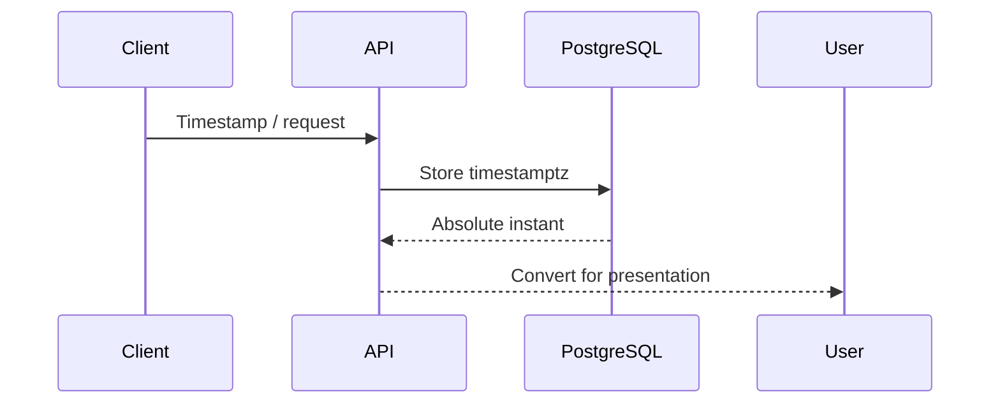

# 10- Date and Time Exercises

## Overview

Date and time handling is a frequent source of production bugs in backend systems. The difficult part is rarely the SQL syntax; it is defining what a timestamp means, which timezone it represents, and whether the application needs an absolute point in time or a calendar value.

PostgreSQL provides several important temporal types and operations:

| Type / Concept | Represents | Typical backend use |
|---|---|---|
| `date` | Calendar date without time | Birth date, business date |
| `time` | Time of day without date | Store opening time |
| `timestamp` | Date and time without timezone semantics | Local/calendar timestamp |
| `timestamptz` | Absolute instant represented with timezone-aware input/output | Events, orders, payments |
| `interval` | Duration | Retention periods, elapsed time |
| `AT TIME ZONE` | Timezone conversion/interpretation | Localized reporting |

For most event-oriented backend data, `timestamptz` is the safest default in PostgreSQL.

---

## Practice Schema

Use this schema for the exercises:

```sql
CREATE TABLE customers (
    id bigint GENERATED ALWAYS AS IDENTITY PRIMARY KEY,
    email text NOT NULL UNIQUE,
    name text NOT NULL,
    created_at timestamptz NOT NULL DEFAULT now()
);

CREATE TABLE orders (
    id bigint GENERATED ALWAYS AS IDENTITY PRIMARY KEY,
    customer_id bigint NOT NULL REFERENCES customers(id),
    status text NOT NULL
        CHECK (status IN ('pending', 'processing', 'completed', 'cancelled')),
    total_amount numeric(12, 2) NOT NULL,
    created_at timestamptz NOT NULL DEFAULT now(),
    shipped_at timestamptz,
    completed_at timestamptz
);

CREATE TABLE payments (
    id bigint GENERATED ALWAYS AS IDENTITY PRIMARY KEY,
    order_id bigint NOT NULL REFERENCES orders(id),
    amount numeric(12, 2) NOT NULL,
    status text NOT NULL
        CHECK (status IN ('pending', 'paid', 'failed', 'refunded')),
    paid_at timestamptz
);

CREATE TABLE subscriptions (
    id bigint GENERATED ALWAYS AS IDENTITY PRIMARY KEY,
    customer_id bigint NOT NULL REFERENCES customers(id),
    started_at timestamptz NOT NULL,
    expires_at timestamptz,
    cancelled_at timestamptz
);
```

---

## Temporal Type Fundamentals

### `date`

Use `date` when the time of day has no business meaning.

```sql
SELECT
    CURRENT_DATE;
```

Examples:

- Birthday.
- Holiday.
- Accounting date.
- Business reporting date.

Do not use `date` for events where the exact instant matters.

---

### `timestamp`

`timestamp without time zone` represents a date and time without timezone conversion semantics.

```sql
SELECT TIMESTAMP '2026-09-05 10:30:00';
```

This can be appropriate for values that intentionally represent local wall-clock time, but it is dangerous when developers assume it represents a globally unique instant.

---

### `timestamptz`

PostgreSQL's `timestamptz` represents an instant in time.

```sql
SELECT TIMESTAMPTZ '2026-09-05 10:30:00+05:30';
```

PostgreSQL stores the instant rather than preserving the original timezone label. Display depends on the session timezone.

For backend event timestamps, prefer:

```sql
created_at timestamptz NOT NULL DEFAULT now()
```

---

## Current Date and Time

Practice the PostgreSQL functions:

```sql
SELECT
    CURRENT_DATE,
    CURRENT_TIME,
    CURRENT_TIMESTAMP,
    NOW();
```

`CURRENT_TIMESTAMP` and `NOW()` return the current transaction timestamp.

This matters because PostgreSQL's transaction timestamp remains stable throughout a transaction.

For a wall-clock timestamp that advances during a long-running transaction, PostgreSQL also provides:

```sql
SELECT clock_timestamp();
```

Do not confuse transaction time with wall-clock time.

---

## Exercise: Current Time

Write queries that return:

1. Current date.
2. Current timestamp.
3. Current UTC timestamp representation.
4. Current date in a specified timezone.
5. Current time in a specified timezone.
6. Current transaction timestamp.
7. Current wall-clock timestamp.

---

## Timezone Handling

Timezone bugs often occur because different layers assume different timezone semantics.

A typical backend flow should be:



A good production convention is:

```text
Database → absolute instants
Application → UTC-aware datetime objects
API → explicit ISO-8601 timestamps
UI → user-local presentation
```

---

## Timezone Conversion

PostgreSQL supports `AT TIME ZONE`.

Example:

```sql
SELECT
    created_at,
    created_at AT TIME ZONE 'Asia/Kolkata' AS local_time
FROM orders;
```

For a `timestamptz`, this converts the instant into a timestamp displayed in the specified timezone.

You can also use timezone-aware literals:

```sql
SELECT TIMESTAMPTZ '2026-09-05 10:00:00 Asia/Kolkata';
```

Be explicit about whether a value is an instant or a local wall-clock time.

---

## Exercise: Timezone Conversion

Write queries to:

1. Display order timestamps in UTC.
2. Display order timestamps in `Asia/Kolkata`.
3. Display order timestamps in `America/New_York`.
4. Display payment timestamps in a specified timezone.
5. Compare the same instant across two timezones.
6. Convert customer-facing timestamps without changing the underlying instant.

---

## Extracting Date Components

PostgreSQL supports `EXTRACT`.

```sql
SELECT
    id,
    EXTRACT(YEAR FROM created_at) AS year,
    EXTRACT(MONTH FROM created_at) AS month,
    EXTRACT(DAY FROM created_at) AS day
FROM orders;
```

Other useful fields include:

```sql
EXTRACT(HOUR FROM created_at)
EXTRACT(MINUTE FROM created_at)
EXTRACT(DOW FROM created_at)
EXTRACT(ISODOW FROM created_at)
EXTRACT(WEEK FROM created_at)
EXTRACT(QUARTER FROM created_at)
```

---

## Exercise: Date Components

Extract:

1. Order year.
2. Order month.
3. Order day.
4. Order hour.
5. Day of week.
6. ISO week.
7. Quarter.
8. Payment year and month.
9. Subscription expiration year.
10. Customer registration month.

---

## `date_trunc`

`date_trunc` is useful for grouping timestamps into calendar periods.

```sql
SELECT
    date_trunc('day', created_at) AS day,
    COUNT(*) AS order_count
FROM orders
GROUP BY 1
ORDER BY 1;
```

Other common granularities:

```text
minute
hour
day
week
month
quarter
year
```

Example:

```sql
SELECT
    date_trunc('month', created_at) AS month,
    SUM(total_amount) AS revenue
FROM orders
WHERE status = 'completed'
GROUP BY 1
ORDER BY 1;
```

---

## Exercise: Time-Based Aggregation

Write queries to calculate:

1. Orders per day.
2. Orders per week.
3. Orders per month.
4. Completed revenue per month.
5. Payments per day.
6. Customers created per month.
7. Orders per hour.
8. Cancelled orders per month.

---

## Time-Based Filtering

A common production query is:

> Find orders created today.

Avoid wrapping the column in a function when an indexed range can express the condition.

Prefer:

```sql
SELECT *
FROM orders
WHERE created_at >= CURRENT_DATE
  AND created_at < CURRENT_DATE + INTERVAL '1 day';
```

Rather than:

```sql
SELECT *
FROM orders
WHERE created_at::date = CURRENT_DATE;
```

The range predicate is generally easier for a normal index on `created_at` to support.

---

## Exercise: Time Windows

Write queries for:

1. Orders created today.
2. Orders created yesterday.
3. Orders created during the last 24 hours.
4. Orders created during the last 7 days.
5. Orders created during the current month.
6. Orders created during the previous month.
7. Orders created during the current year.
8. Orders created during the previous calendar year.

Distinguish **rolling durations** from **calendar periods**.

---

## Rolling Window vs Calendar Window

These are not equivalent.

### Last 24 hours

```sql
WHERE created_at >= now() - INTERVAL '24 hours'
```

### Today

```sql
WHERE created_at >= CURRENT_DATE
  AND created_at < CURRENT_DATE + INTERVAL '1 day'
```

The first means a rolling duration.

The second means the current calendar day according to the relevant session timezone.

---

## Exercise: Rolling vs Calendar

Write both versions for:

1. Last 24 hours.
2. Current calendar day.
3. Last 7 × 24 hours.
4. Current calendar week.
5. Last 30 × 24 hours.
6. Current calendar month.

Explain why the results can differ.

---

## Half-Open Time Intervals

Prefer:

```sql
WHERE created_at >= $1
  AND created_at < $2
```

over:

```sql
WHERE created_at BETWEEN $1 AND $2
```

for adjacent time windows.

For example:

```text
[2026-09-01 00:00, 2026-10-01 00:00)
```

This prevents overlapping boundaries.

For daily reporting:

```sql
WHERE created_at >= TIMESTAMPTZ '2026-09-01 00:00:00+00'
  AND created_at <  TIMESTAMPTZ '2026-09-02 00:00:00+00'
```

Half-open intervals are especially useful for:

- Pagination.
- Batch processing.
- Reporting.
- Event processing.
- Incremental ETL.
- Kafka consumers.
- Time-partitioned tables.

---

## Exercise: Half-Open Ranges

Create queries for:

1. A single day.
2. A complete month.
3. A complete quarter.
4. A specific hour.
5. A seven-day reporting window.
6. Two adjacent windows that must not overlap.

---

## Date Arithmetic

PostgreSQL supports interval arithmetic.

```sql
SELECT
    now() + INTERVAL '7 days',
    now() - INTERVAL '30 days';
```

You can also add intervals to stored timestamps:

```sql
SELECT
    id,
    created_at,
    created_at + INTERVAL '30 days' AS retention_deadline
FROM orders;
```

---

## Exercise: Date Arithmetic

Calculate:

1. Order age.
2. Payment age.
3. Subscription expiration 30 days after creation.
4. Orders older than 7 days.
5. Orders created within the last hour.
6. Subscriptions expiring within 3 days.
7. Payments that have remained pending for more than 24 hours.

---

## Difference Between Dates

Subtracting dates returns a number of days.

```sql
SELECT
    CURRENT_DATE - DATE '2026-01-01' AS days_elapsed;
```

Subtracting timestamps produces an interval:

```sql
SELECT
    now() - created_at AS order_age
FROM orders;
```

These are semantically different.

---

## Exercise: Elapsed Time

Return:

1. Days since customer registration.
2. Time since order creation.
3. Time from order creation to shipping.
4. Time from shipping to completion.
5. Time from payment creation to payment.
6. Subscription duration.

Handle NULL timestamps correctly.

---

## `AGE`

PostgreSQL's `age()` function calculates a symbolic interval.

```sql
SELECT
    age(CURRENT_DATE, DATE '1990-01-01');
```

It can be useful for calendar-oriented differences where months and years have meaning.

Do not automatically use `age()` when you need an exact elapsed duration in seconds.

---

## Epoch Time

PostgreSQL can convert timestamps to Unix epoch seconds:

```sql
SELECT
    EXTRACT(EPOCH FROM created_at)
FROM orders;
```

This can be useful for:

- Integration with systems using Unix timestamps.
- Duration calculations.
- Low-level event processing.

Avoid converting timestamps to epoch values merely to perform ordinary SQL date filtering.

---

## Exercise: Epoch

Write queries to:

1. Return order creation as epoch seconds.
2. Calculate elapsed seconds between creation and completion.
3. Calculate elapsed minutes between payment creation and payment.
4. Convert a known epoch value into a timestamp.

---

## Date Formatting

PostgreSQL provides `to_char`.

```sql
SELECT
    to_char(created_at, 'YYYY-MM-DD HH24:MI:SS') AS formatted_created_at
FROM orders;
```

Formatting is generally a presentation concern.

Do not convert timestamps to strings before performing temporal comparisons.

Bad:

```sql
WHERE to_char(created_at, 'YYYY-MM-DD') = '2026-09-05'
```

Prefer temporal predicates:

```sql
WHERE created_at >= DATE '2026-09-05'
  AND created_at < DATE '2026-09-06'
```

---

## Exercise: Formatting

Format:

1. Order date as `YYYY-MM-DD`.
2. Order timestamp as date and time.
3. Payment month as `YYYY-MM`.
4. Customer registration date.
5. Subscription expiration date.

Then rewrite each filtering query without string formatting.

---

## Day and Week Logic

PostgreSQL provides:

```sql
EXTRACT(DOW FROM created_at)
```

and:

```sql
EXTRACT(ISODOW FROM created_at)
```

The values differ:

| Expression | Sunday | Monday |
|---|---:|---:|
| `DOW` | 0 | 1 |
| `ISODOW` | 7 | 1 |

Be explicit about which convention the application expects.

---

## Exercise: Weekdays

Write queries to:

1. Find orders created on weekends.
2. Find orders created Monday through Friday.
3. Count orders by weekday.
4. Find the busiest weekday.
5. Compare weekday and weekend order volume.

Consider timezone before deciding what "day" means.

---

## Month Boundaries

Avoid assuming every month contains a fixed number of days.

For the beginning of the current month:

```sql
SELECT date_trunc('month', now());
```

For the beginning of the next month:

```sql
SELECT date_trunc('month', now()) + INTERVAL '1 month';
```

A monthly filter can therefore be expressed as:

```sql
WHERE created_at >= date_trunc('month', now())
  AND created_at < date_trunc('month', now()) + INTERVAL '1 month'
```

This handles varying month lengths.

---

## Exercise: Calendar Boundaries

Write queries for:

1. Start of current month.
2. Start of next month.
3. Start of previous month.
4. Start of current quarter.
5. Start of current year.
6. End boundary of the current month.
7. Orders during the previous calendar month.

Prefer exclusive upper boundaries.

---

## Timezones and Calendar Boundaries

A subtle production issue occurs when a business asks:

> Show today's orders.

"Today" depends on timezone.

For a business operating in India, the intended boundary might be:

```text
Asia/Kolkata midnight → next Asia/Kolkata midnight
```

It is not necessarily:

```text
UTC midnight → next UTC midnight
```

Generate the correct instant boundaries in the business timezone and compare the stored `timestamptz` against those boundaries.

---

## Exercise: Business-Day Reporting

Assume the reporting timezone is `Asia/Kolkata`.

Write a query that returns:

- Orders created during the current local business day.
- Completed revenue for the current local day.
- Orders created during the previous local day.

Do not simply cast `created_at` to `date` without considering the session timezone.

---

## DST and Timezones

Daylight saving time makes local-time arithmetic more complicated.

A local calendar day can contain:

- 23 hours.
- 24 hours.
- 25 hours.

Therefore:

```text
"one calendar day later"
```

is not always equivalent to:

```text
"24 hours later"
```

Use calendar arithmetic when the requirement is calendar-based and duration arithmetic when the requirement is duration-based.

This distinction matters for:

- Subscription renewal.
- Scheduled jobs.
- Billing.
- Notifications.
- Reporting.
- SLA calculations.

---

## Exercise: Duration vs Calendar Arithmetic

Explain the difference between:

```sql
timestamp_value + INTERVAL '24 hours'
```

and:

```sql
timestamp_value + INTERVAL '1 day'
```

Test the behavior around a DST transition using a DST-observing timezone.

---

## NULL Timestamps

Nullable timestamps require explicit handling.

```sql
SELECT
    id,
    CASE
        WHEN shipped_at IS NULL THEN 'not_shipped'
        ELSE 'shipped'
    END AS shipping_state
FROM orders;
```

Never write:

```sql
WHERE shipped_at = NULL
```

Use:

```sql
WHERE shipped_at IS NULL
```

---

## Exercise: NULL Time Fields

Write queries to:

1. Find unshipped orders.
2. Find shipped orders.
3. Find incomplete orders.
4. Find subscriptions without expiration dates.
5. Find payments without payment timestamps.
6. Detect completed orders missing `completed_at`.
7. Detect non-completed orders having `completed_at`.

---

## Comparing Timestamps

Direct timestamp comparison is straightforward:

```sql
SELECT *
FROM orders
WHERE created_at < shipped_at;
```

But nullable values require thought.

For example:

```sql
WHERE shipped_at IS NOT NULL
  AND completed_at IS NOT NULL
  AND completed_at >= shipped_at
```

Do not silently treat missing timestamps as zero or some arbitrary date.

---

## Exercise: Lifecycle Validation

Identify:

- Orders shipped before creation.
- Orders completed before creation.
- Orders completed before shipping.
- Orders with impossible timestamp combinations.
- Payments occurring before order creation.

Use joins where required.

---

## Latest Record Per Group

A common backend problem is:

> Find the latest order for each customer.

A PostgreSQL-specific solution uses `DISTINCT ON`:

```sql
SELECT DISTINCT ON (customer_id)
    customer_id,
    id,
    created_at,
    status
FROM orders
ORDER BY customer_id, created_at DESC, id DESC;
```

A portable alternative uses `ROW_NUMBER()`:

```sql
SELECT *
FROM (
    SELECT
        o.*,
        ROW_NUMBER() OVER (
            PARTITION BY customer_id
            ORDER BY created_at DESC, id DESC
        ) AS row_number
    FROM orders AS o
) AS ranked
WHERE row_number = 1;
```

The `id` tie-breaker makes the result deterministic when timestamps are equal.

---

## Exercise: Latest Records

Find:

1. Latest order per customer.
2. Latest payment per order.
3. Latest subscription per customer.
4. Latest completed order per customer.
5. Latest order created during each month.
6. First order per customer.
7. Most recent failed payment per order.

---

## Time-Based Window Functions

Window functions are useful for temporal comparisons.

Example:

```sql
SELECT
    customer_id,
    id,
    created_at,
    LAG(created_at) OVER (
        PARTITION BY customer_id
        ORDER BY created_at, id
    ) AS previous_order_at
FROM orders;
```

Calculate elapsed time:

```sql
SELECT
    customer_id,
    id,
    created_at,
    created_at
        - LAG(created_at) OVER (
            PARTITION BY customer_id
            ORDER BY created_at, id
        ) AS time_since_previous_order
FROM orders;
```

---

## Exercise: Temporal Window Functions

Calculate:

1. Time since the customer's previous order.
2. Time until the customer's next order.
3. First order timestamp per customer.
4. Latest order timestamp per customer.
5. Number of orders per customer per month.
6. Time between payment attempts.
7. Time between subscription periods.

---

## Date Filtering and Indexes

Suppose:

```sql
CREATE INDEX orders_created_at_idx
ON orders (created_at);
```

Prefer:

```sql
WHERE created_at >= $1
  AND created_at < $2
```

over:

```sql
WHERE created_at::date = $1
```

The first exposes a range over the indexed column.

Always validate with:

```sql
EXPLAIN (ANALYZE, BUFFERS)
SELECT ...
```

An index does not guarantee an index scan; selectivity, table size, statistics, and workload affect planner decisions.

---

## Exercise: Sargability

Given:

```sql
WHERE created_at::date = CURRENT_DATE
```

rewrite it as a timestamp range.

Then explain:

1. Why the range is preferable.
2. How the index can support it.
3. Why the planner may still choose a sequential scan.
4. When an expression index might be appropriate.

---

## Date and Time Aggregation Performance

This query:

```sql
SELECT
    date_trunc('month', created_at),
    COUNT(*)
FROM orders
GROUP BY 1;
```

may need to process many rows.

For high-volume analytical workloads, consider:

- Pre-aggregation.
- Materialized views.
- Reporting tables.
- Partitioning.
- OLAP systems.
- Incremental aggregation.

Do not move every reporting workload to the primary OLTP database simply because SQL can calculate it.

---

## Partitioning by Time

Large event tables are often partitioned by time.

For example:

```sql
CREATE TABLE events (
    id bigint GENERATED ALWAYS AS IDENTITY,
    event_type text NOT NULL,
    created_at timestamptz NOT NULL,
    payload jsonb NOT NULL
) PARTITION BY RANGE (created_at);
```

A monthly partition might be:

```sql
CREATE TABLE events_2026_09
PARTITION OF events
FOR VALUES FROM ('2026-09-01 00:00:00+00')
           TO   ('2026-10-01 00:00:00+00');
```

Time partitioning can improve:

- Partition pruning.
- Retention operations.
- Bulk archival.
- Maintenance isolation.

It does not automatically make every time query faster.

---

## Exercise: Time Partitioning

Design monthly partitions for:

1. September 2026.
2. October 2026.
3. November 2026.
4. December 2026.

Then explain how a query for October data can benefit from partition pruning.

---

## Scheduled Jobs and SQL

Backend systems often query time-based work:

```sql
SELECT *
FROM orders
WHERE status = 'pending'
  AND created_at < now() - INTERVAL '24 hours';
```

For production workers:

- Index the filtering columns appropriately.
- Process bounded batches.
- Avoid repeatedly scanning the entire table.
- Use row locking when multiple workers compete for work.
- Consider `FOR UPDATE SKIP LOCKED` for queue-like workloads.
- Make processing idempotent.

Example:

```sql
SELECT id
FROM orders
WHERE status = 'pending'
ORDER BY id
FOR UPDATE SKIP LOCKED
LIMIT 100;
```

The exact locking and update strategy should be designed around the worker's transaction boundary.

---

## Exercise: Scheduled Processing

Design queries for:

1. Orders pending for more than 24 hours.
2. Payments pending for more than 30 minutes.
3. Subscriptions expiring within 7 days.
4. Orders eligible for archival after 2 years.
5. Records requiring retry after a timestamp.

Explain the required indexes and worker concurrency model.

---

## Django Date and Time Queries

Django commonly uses timezone-aware datetimes when timezone support is enabled.

Example:

```python
from datetime import timedelta

from django.utils import timezone

cutoff = timezone.now() - timedelta(days=7)

orders = Order.objects.filter(
    created_at__gte=cutoff,
)
```

For a calendar-day query, calculate explicit boundaries rather than assuming UTC boundaries represent the user's local day.

Inspect generated SQL when performance matters.

---

## FastAPI and Python

Python applications should generally avoid mixing naive and timezone-aware datetime values.

Prefer timezone-aware UTC values at system boundaries.

For example, with modern Python:

```python
from datetime import datetime, timezone

created_at = datetime.now(timezone.utc)
```

Do not use:

```python
datetime.utcnow()
```

for new code when an aware UTC datetime is required.

The database remains responsible for storing and querying temporal data according to the schema's semantics.

---

## API Timestamp Design

For REST APIs, use unambiguous ISO-8601 timestamps.

Example:

```json
{
  "id": 1001,
  "created_at": "2026-09-05T10:30:00Z"
}
```

An offset-aware representation is also valid:

```json
{
  "created_at": "2026-09-05T16:00:00+05:30"
}
```

Both represent an instant.

Avoid ambiguous strings such as:

```text
09/05/2026 10:30
```

because the timezone and date interpretation are unclear.

---

## Kafka and Event Timestamps

Event-driven systems should treat event time deliberately.

A Kafka event may contain:

```json
{
  "event_id": "evt-1001",
  "event_type": "order.completed",
  "occurred_at": "2026-09-05T10:30:00Z",
  "order_id": 1001
}
```

Distinguish:

```text
occurred_at → when the business event happened
produced_at → when the producer emitted it
consumed_at → when a consumer processed it
```

These timestamps answer different operational questions.

---

## Exercise: Event Time

Design a query or schema that distinguishes:

1. Business event time.
2. Database insertion time.
3. Message publication time.
4. Consumer processing time.

Explain which timestamp should be used for reporting business events.

---

## Timeouts and Durations

Do not confuse:

```text
timestamp
```

with:

```text
duration
```

For example:

```text
request_started_at → timestamp
request_finished_at → timestamp
request_duration → duration
```

A database can calculate the duration:

```sql
SELECT
    completed_at - created_at AS duration
FROM orders
WHERE completed_at IS NOT NULL;
```

Store a derived duration only when there is a concrete reason to materialize it.

---

## SLA Queries

Suppose orders should be processed within four hours.

```sql
SELECT
    id,
    created_at,
    now() - created_at AS age
FROM orders
WHERE status IN ('pending', 'processing')
  AND created_at < now() - INTERVAL '4 hours';
```

This can support operational monitoring.

For an SLA based on business hours rather than elapsed time, the query becomes substantially more complex and may require a calendar model rather than simple interval arithmetic.

---

## Exercise: SLA Monitoring

Create queries for:

1. Orders older than 4 hours.
2. Payments pending longer than 30 minutes.
3. Orders completed within SLA.
4. Orders completed outside SLA.
5. Average completion time.
6. 95th percentile completion time.

For percentile analysis, investigate PostgreSQL ordered-set aggregates such as:

```sql
percentile_cont(0.95)
```

---

## Temporal Data Integrity

Date/time columns often encode lifecycle invariants.

Examples:

```text
created_at <= shipped_at
shipped_at <= completed_at
cancelled_at should exist when status = cancelled
completed_at should exist when status = completed
```

Do not rely exclusively on reporting queries to detect these violations.

Where the invariant is fundamental, enforce it with constraints where PostgreSQL's constraint semantics permit it.

---

## Exercise: Data Integrity

Identify which of these should be:

- A database constraint.
- An application validation.
- A query-time classification.
- A monitoring rule.

Consider:

1. Completion timestamp required for completed orders.
2. Customer registration timestamp.
3. Reporting timezone.
4. Order age classification.
5. Payment processing SLA.
6. Shipping timestamp before completion.
7. User's preferred display timezone.

---

## Common Date and Time Mistakes

| Mistake | Why it fails | Better approach |
|---|---|---|
| Mixing naive and aware datetimes | Ambiguous instant | Use timezone-aware values |
| Treating local time as UTC | Shifts events | Preserve the intended timezone |
| Using `timestamp` for global events | Loses timezone semantics | Prefer `timestamptz` |
| `created_at::date = ...` everywhere | Can hinder normal index usage | Use range predicates |
| Using `BETWEEN` for adjacent windows | Boundary overlap | Use `>=` and `<` |
| Assuming every day is 24 hours | DST can change local day length | Distinguish duration from calendar arithmetic |
| Comparing strings instead of timestamps | Incorrect ordering/semantics | Compare temporal types |
| Using `= NULL` | SQL three-valued logic | Use `IS NULL` |
| Ignoring timezone in "today" | Wrong business-day boundaries | Define reporting timezone |
| Using `now()` for elapsed wall-clock timing | Transaction timestamp is stable | Use appropriate clock semantics |
| Converting timestamps to strings for filtering | Loses efficient temporal predicates | Filter using temporal values |
| No deterministic tie-breaker | Equal timestamps produce unstable order | Add a unique secondary key |
| Storing only formatted dates | Hard to query reliably | Store temporal types |
| Assuming replica time equals application time | Clock/replication differences | Define consistency semantics |
| Treating event time as insertion time | Incorrect analytics | Store explicit event timestamps |

---

## Production Troubleshooting

When a date/time query returns unexpected results, check:

### Timezone

```sql
SHOW timezone;
```

Then inspect the actual stored value and session timezone.

### Data Type

Inspect the schema:

```sql
\d orders
```

Determine whether the column is:

```text
date
timestamp
timestamp with time zone
```

### Boundary Semantics

Verify whether the requirement means:

```text
last 24 hours
```

or:

```text
current calendar day
```

### Application Serialization

Inspect the exact timestamp received by Django, FastAPI, or another API service.

### Database Session

Check whether different connection pools use different timezone settings.

### Index Usage

Use:

```sql
EXPLAIN (ANALYZE, BUFFERS)
SELECT ...
```

### Replica Freshness

If querying a read replica, determine whether the expected record has already replayed.

### Clock Assumptions

Distributed systems may have small clock differences. Business correctness should not depend on exact equality between independent machine clocks.

---

## Security Considerations

Date/time queries can affect authorization.

For example:

```sql
WHERE organization_id = $1
  AND created_at >= $2
  AND created_at < $3
```

The time filter must not replace tenant authorization.

Avoid accepting arbitrary SQL date expressions from clients.

Instead, parse and validate API parameters such as:

```text
from=2026-09-01T00:00:00Z
to=2026-09-02T00:00:00Z
```

and bind them as parameters.

For retention and deletion jobs, enforce strict authorization and operational safeguards because temporal filters can define the deletion scope.

---

## Performance and Scalability

For high-volume temporal workloads:

- Index timestamp columns used in selective range queries.
- Prefer half-open ranges.
- Avoid unnecessary functions around indexed columns.
- Use composite indexes matching real predicates.
- Consider partial indexes for hot subsets.
- Partition large time-series tables where lifecycle operations justify it.
- Use keyset pagination for large time-ordered datasets.
- Pre-aggregate expensive reports.
- Move analytical workloads away from the OLTP primary when necessary.
- Monitor query plans as data volume changes.

Example index:

```sql
CREATE INDEX orders_created_at_id_idx
ON orders (created_at, id);
```

This can support ordered time-based access patterns such as:

```sql
SELECT id, created_at
FROM orders
WHERE created_at >= $1
  AND created_at < $2
ORDER BY created_at, id
LIMIT 100;
```

Validate with `EXPLAIN`.

---

## Reliability and High Availability

Time-based systems need explicit behavior during:

- Database failover.
- Replica lag.
- Worker restarts.
- Retry processing.
- Duplicate event delivery.
- Clock differences.
- Network partitions.

For scheduled processing, make work idempotent.

Do not assume:

```text
timestamp > last_timestamp
```

is sufficient for incremental processing because multiple rows can share timestamps.

Prefer a deterministic cursor such as:

```text
(created_at, id)
```

and query:

```sql
WHERE (created_at, id) > ($1, $2)
ORDER BY created_at, id
LIMIT 1000;
```

This is a robust keyset pattern.

---

## Date-Based Incremental Processing

A worker can maintain:

```text
last_created_at
last_id
```

and process:

```sql
SELECT *
FROM orders
WHERE (created_at, id) > ($1, $2)
ORDER BY created_at, id
LIMIT 1000;
```

This handles equal timestamps correctly.

The checkpoint should advance only after the corresponding work is durably completed.

For event pipelines, consider idempotency and replay semantics before advancing checkpoints.

---

## AWS Considerations

In AWS environments, date/time issues can appear across:

- RDS PostgreSQL.
- Aurora PostgreSQL.
- ECS.
- EKS.
- Lambda.
- CloudWatch.
- EventBridge.
- SQS.
- Kafka-compatible event infrastructure.

Do not assume every service represents time in the same way at every boundary.

For distributed systems:

```text
API timestamp
→ database timestamp
→ event timestamp
→ worker timestamp
→ log timestamp
→ monitoring timestamp
```

should have clearly documented semantics.

---

## Practice Interview Questions

Answer these without running SQL first:

1. What is the difference between `timestamp` and `timestamptz` in PostgreSQL?
2. Why is `timestamptz` often preferable for backend event timestamps?
3. What is the difference between `CURRENT_TIMESTAMP` and `clock_timestamp()`?
4. How would you query today's records efficiently?
5. Why can `created_at::date = CURRENT_DATE` be problematic for an index?
6. Why are half-open intervals useful?
7. What is the difference between "last 24 hours" and "today"?
8. How does `AT TIME ZONE` work?
9. How do DST transitions affect date arithmetic?
10. How would you find the latest record per customer?
11. Why should timestamp ordering include a unique tie-breaker?
12. How would you calculate time between two events?
13. When would you use `age()` instead of timestamp subtraction?
14. How would you design a daily report for `Asia/Kolkata`?
15. How would you process records incrementally without missing equal timestamps?
16. How would you index a time-based API query?
17. When does time partitioning make sense?
18. How should timestamps be represented in REST APIs?
19. What is the difference between event time and ingestion time?
20. How would you design a retry-safe scheduled worker?

---

## Final Practice Set

Complete these exercises without consulting the reference material:

1. Return the current date and timestamp.
2. Display order timestamps in UTC.
3. Convert timestamps to `Asia/Kolkata`.
4. Extract year, month, day, and weekday.
5. Group orders by day.
6. Group revenue by month.
7. Find today's orders.
8. Find yesterday's orders.
9. Find orders from the last 24 hours.
10. Find orders from the previous calendar month.
11. Build half-open time ranges.
12. Calculate order age.
13. Calculate completion duration.
14. Format timestamps for reporting.
15. Detect NULL timestamps.
16. Detect invalid lifecycle timestamps.
17. Find the latest order per customer.
18. Find the first order per customer.
19. Calculate time since the previous order with `LAG`.
20. Design a time-based index.
21. Rewrite a non-sargable date predicate.
22. Build a business-day query for `Asia/Kolkata`.
23. Design a scheduled worker query using row locking.
24. Design a restartable incremental query using `(created_at, id)`.
25. Explain the difference between calendar arithmetic and duration arithmetic.
26. Design a monthly partitioning strategy.
27. Design an API timestamp contract.
28. Distinguish event time, ingestion time, and processing time.
29. Design a temporal data-quality query.
30. Explain every timezone and boundary assumption as if defending the design in a production architecture review.

---

## Key Takeaways

- **Define temporal semantics before writing SQL:** distinguish absolute instants, local calendar values, and durations; for most backend events, `timestamptz` is the appropriate PostgreSQL type.
- **Timezone and boundary handling determine correctness:** explicitly define the business timezone and prefer half-open ranges such as `>= start AND < end`.
- **Write time predicates for the workload:** range predicates generally preserve normal index usability better than wrapping timestamp columns in functions, but execution plans should validate the design.
- **Treat time as distributed-system data:** event time, ingestion time, processing time, replica freshness, retries, and clock differences must have explicit semantics.
- **Senior date/time design balances correctness and operability:** consider DST, incremental processing, deterministic ordering, indexing, partitioning, API contracts, security, and failure recovery together.