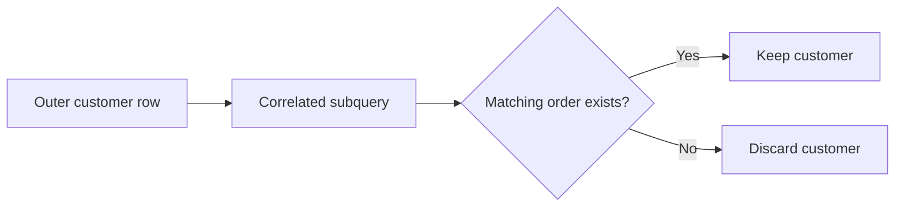

# 11- Subquery Exercises

## Overview

Subqueries are one of the most useful tools for expressing SQL logic when one query depends on the result of another query. They are especially important in backend interviews because they test more than syntax: they test whether you understand result cardinality, correlation, `NULL` semantics, aggregation, and how the database can execute dependent operations.

These exercises progress from straightforward subqueries to production-oriented patterns involving:

- Scalar and multi-row subqueries.
- `IN`, `EXISTS`, `NOT EXISTS`, `ANY`, and `ALL`.
- Correlated subqueries.
- Subqueries in `SELECT`, `FROM`, `WHERE`, `HAVING`, and DML.
- Aggregation and latest-record patterns.
- `LATERAL`.
- `NULL` behavior.
- Query planning and indexing.
- Django and SQLAlchemy equivalents.
- Production troubleshooting and architecture.

The goal is not to maximize the number of subqueries used. A senior engineer chooses between joins, subqueries, CTEs, and window functions based on semantics, cardinality, maintainability, and execution cost.

---

## Practice Schema

Use the following schema throughout the exercises:

```sql
CREATE TABLE customers (
    id bigint GENERATED ALWAYS AS IDENTITY PRIMARY KEY,
    email text NOT NULL UNIQUE,
    name text NOT NULL,
    created_at timestamptz NOT NULL DEFAULT now()
);

CREATE TABLE orders (
    id bigint GENERATED ALWAYS AS IDENTITY PRIMARY KEY,
    customer_id bigint NOT NULL REFERENCES customers(id),
    status text NOT NULL
        CHECK (status IN ('pending', 'processing', 'completed', 'cancelled')),
    total_amount numeric(12, 2) NOT NULL,
    created_at timestamptz NOT NULL DEFAULT now(),
    completed_at timestamptz
);

CREATE TABLE payments (
    id bigint GENERATED ALWAYS AS IDENTITY PRIMARY KEY,
    order_id bigint NOT NULL REFERENCES orders(id),
    amount numeric(12, 2) NOT NULL,
    status text NOT NULL
        CHECK (status IN ('pending', 'paid', 'failed', 'refunded')),
    paid_at timestamptz
);

CREATE TABLE products (
    id bigint GENERATED ALWAYS AS IDENTITY PRIMARY KEY,
    name text NOT NULL,
    price numeric(12, 2) NOT NULL,
    active boolean NOT NULL DEFAULT true
);

CREATE TABLE order_items (
    id bigint GENERATED ALWAYS AS IDENTITY PRIMARY KEY,
    order_id bigint NOT NULL REFERENCES orders(id),
    product_id bigint NOT NULL REFERENCES products(id),
    quantity integer NOT NULL CHECK (quantity > 0),
    unit_price numeric(12, 2) NOT NULL
);
```

Useful relationships:

```text
customers
    │
    └──< orders
            │
            ├──< payments
            │
            └──< order_items >── products
```

---

## Scalar Subqueries

A scalar subquery must return at most one row and one column.

Example:

```sql
SELECT
    id,
    total_amount,
    (
        SELECT AVG(total_amount)
        FROM orders
    ) AS average_order_amount
FROM orders;
```

The inner query produces one value, which is then available to the outer query.

### Exercise

Write queries to:

1. Return every order with the overall average order amount.
2. Return every order with the maximum order amount.
3. Return every customer with the total number of customers.
4. Return every product with the average product price.
5. Return every order with the total completed revenue.

---

## Scalar Subquery Cardinality

A scalar subquery that returns multiple rows causes an error.

For example, this is unsafe:

```sql
SELECT
    id,
    (
        SELECT total_amount
        FROM orders
    ) AS amount
FROM customers;
```

The inner query returns many rows.

A scalar subquery must have a clear cardinality guarantee, often created through:

- An aggregate.
- A unique predicate.
- A primary-key lookup.
- A carefully constrained query.

### Exercise

For each query below, determine whether the subquery is guaranteed to return one row:

```sql
SELECT
    id,
    (SELECT COUNT(*) FROM orders)
FROM customers;
```

```sql
SELECT
    id,
    (SELECT total_amount
     FROM orders
     WHERE id = 100)
FROM customers;
```

```sql
SELECT
    id,
    (SELECT total_amount
     FROM orders
     WHERE customer_id = customers.id)
FROM customers;
```

Explain which queries can fail and why.

---

## Subqueries in `WHERE`

A subquery can restrict rows based on another result set.

Example:

```sql
SELECT *
FROM orders
WHERE customer_id IN (
    SELECT id
    FROM customers
    WHERE created_at >= CURRENT_DATE - INTERVAL '30 days'
);
```

This asks:

> Return orders belonging to customers created during the last 30 days.

### Exercise

Find:

1. Orders belonging to customers whose email ends with `@example.com`.
2. Orders belonging to customers created this year.
3. Products that appear in at least one order.
4. Customers who have placed at least one completed order.
5. Customers who have never placed an order.
6. Orders belonging to customers with another completed order.

---

## `IN` Subqueries

`IN` compares a value against a set.

```sql
SELECT *
FROM customers
WHERE id IN (
    SELECT customer_id
    FROM orders
    WHERE status = 'completed'
);
```

`IN` is useful when the query naturally expresses set membership.

Do not assume `IN` is always physically implemented as repeated lookups. PostgreSQL's optimizer may transform it into a semi-join or another execution strategy.

### Exercise

Use `IN` to find:

1. Customers with completed orders.
2. Customers with payments.
3. Products that have been ordered.
4. Orders with successful payments.
5. Customers who ordered active products.

Then identify which queries could be expressed more naturally using `EXISTS`.

---

## `EXISTS`

`EXISTS` answers:

> Does at least one matching row exist?

Example:

```sql
SELECT c.*
FROM customers AS c
WHERE EXISTS (
    SELECT 1
    FROM orders AS o
    WHERE o.customer_id = c.id
);
```

The inner query does not need to return the matching rows. It only establishes existence.

This makes `EXISTS` especially useful when the outer query needs entities rather than child-row data.

### Exercise

Use `EXISTS` to find:

1. Customers with at least one order.
2. Customers with at least one completed order.
3. Customers with at least one failed payment.
4. Products that have been ordered.
5. Orders with at least one payment.
6. Customers who have ordered an active product.

---

## `NOT EXISTS`

`NOT EXISTS` is usually the safest way to express absence.

Example:

```sql
SELECT c.*
FROM customers AS c
WHERE NOT EXISTS (
    SELECT 1
    FROM orders AS o
    WHERE o.customer_id = c.id
);
```

This returns customers with no orders.

### Exercise

Find:

1. Customers without orders.
2. Customers without completed orders.
3. Orders without payments.
4. Orders without successful payments.
5. Products that have never been ordered.
6. Customers who have never ordered an active product.

---

## `NOT IN` and `NULL`

A classic SQL trap is:

```sql
WHERE customer_id NOT IN (
    SELECT customer_id
    FROM orders
)
```

If the subquery can contain `NULL`, SQL's three-valued logic can produce unexpected results.

Prefer:

```sql
WHERE NOT EXISTS (
    SELECT 1
    FROM orders AS o
    WHERE o.customer_id = c.id
)
```

when expressing absence.

### Exercise

Construct a query where `NOT IN` behaves differently from `NOT EXISTS`.

Explain:

1. Why `NULL` causes the difference.
2. How SQL's three-valued logic is involved.
3. Why `NOT EXISTS` is generally safer for anti-join semantics.

---

## Correlated Subqueries

A correlated subquery references a column from the outer query.

Example:

```sql
SELECT
    c.id,
    c.name
FROM customers AS c
WHERE EXISTS (
    SELECT 1
    FROM orders AS o
    WHERE o.customer_id = c.id
      AND o.status = 'completed'
);
```

The inner query depends on the current outer customer.

Conceptually:



Do not assume correlated means slow. PostgreSQL may transform or optimize the query depending on its structure.

### Exercise

Write correlated subqueries to:

1. Find customers whose order count exceeds 5.
2. Find customers with an order above the global average.
3. Find customers whose latest order is completed.
4. Find products ordered by at least one customer.
5. Find orders whose amount is greater than that customer's average order amount.

---

## Correlated Subquery with Aggregation

Find orders whose amount is above the customer's average:

```sql
SELECT o.*
FROM orders AS o
WHERE o.total_amount > (
    SELECT AVG(o2.total_amount)
    FROM orders AS o2
    WHERE o2.customer_id = o.customer_id
);
```

The inner aggregation is scoped to the current customer.

### Exercise

Write queries for:

1. Orders above the customer's average.
2. Orders below the customer's average.
3. Orders equal to the customer's maximum.
4. Orders above the customer's minimum.
5. Customers whose latest order exceeds their own average order amount.

---

## Subquery in `SELECT`

A scalar subquery can produce derived information.

```sql
SELECT
    c.id,
    c.name,
    (
        SELECT COUNT(*)
        FROM orders AS o
        WHERE o.customer_id = c.id
    ) AS order_count
FROM customers AS c;
```

This is readable for certain entity-centric queries, but always inspect the execution plan for large datasets.

### Exercise

Return:

1. Customer order count.
2. Customer completed-order count.
3. Customer total revenue.
4. Customer latest order timestamp.
5. Customer largest order amount.
6. Customer failed-payment count.

---

## Subquery in `FROM`

A subquery in `FROM` creates a derived table.

Example:

```sql
SELECT
    customer_id,
    average_order_amount
FROM (
    SELECT
        customer_id,
        AVG(total_amount) AS average_order_amount
    FROM orders
    GROUP BY customer_id
) AS customer_stats;
```

The derived table can then be queried by the outer query.

### Exercise

Create derived tables for:

1. Average order amount per customer.
2. Total revenue per customer.
3. Number of completed orders per customer.
4. Number of products ordered.
5. Monthly order totals.

Then filter the derived results in the outer query.

---

## Subquery in `HAVING`

A subquery can be used to compare grouped results.

Example:

```sql
SELECT
    customer_id,
    AVG(total_amount) AS average_order_amount
FROM orders
GROUP BY customer_id
HAVING AVG(total_amount) > (
    SELECT AVG(total_amount)
    FROM orders
);
```

This returns customers whose average order value exceeds the global average.

### Exercise

Find:

1. Customers whose average order value exceeds the global average.
2. Customers whose total revenue exceeds the average customer's revenue.
3. Customers with more orders than the average customer.
4. Products whose average selling price exceeds the overall average.
5. Customers whose completed-order count exceeds a specified threshold.

---

## Multiple-Row Comparison

Use `ANY` or `ALL` when comparing against a set.

Example:

```sql
SELECT *
FROM orders
WHERE total_amount > ANY (
    SELECT total_amount
    FROM orders
    WHERE customer_id = 10
);
```

This means the order amount is greater than at least one order belonging to customer `10`.

`ALL` requires the comparison to be true against every value.

```sql
SELECT *
FROM orders
WHERE total_amount > ALL (
    SELECT total_amount
    FROM orders
    WHERE customer_id = 10
);
```

### Exercise

Use `ANY` and `ALL` to find:

1. Orders larger than any order from a specified customer.
2. Orders larger than every order from a specified customer.
3. Products cheaper than any active product.
4. Products more expensive than every active product.
5. Customers whose order value satisfies a comparison against another customer's order set.

---

## Subqueries with Aggregation

Aggregation inside subqueries is often useful when the outer query needs a scalar or set derived from grouped data.

Example:

```sql
SELECT *
FROM customers AS c
WHERE c.id IN (
    SELECT o.customer_id
    FROM orders AS o
    GROUP BY o.customer_id
    HAVING SUM(o.total_amount) > 10000
);
```

### Exercise

Find customers whose:

1. Total order value exceeds `10000`.
2. Completed revenue exceeds `5000`.
3. Order count exceeds `10`.
4. Average order value exceeds `500`.
5. Maximum order value exceeds `5000`.

---

## Latest Record Per Group

Find the latest order for each customer.

Using a correlated subquery:

```sql
SELECT o.*
FROM orders AS o
WHERE o.created_at = (
    SELECT MAX(o2.created_at)
    FROM orders AS o2
    WHERE o2.customer_id = o.customer_id
);
```

This has a subtle problem: multiple orders can share the same timestamp.

A deterministic PostgreSQL solution can use `DISTINCT ON`:

```sql
SELECT DISTINCT ON (customer_id)
    id,
    customer_id,
    status,
    total_amount,
    created_at
FROM orders
ORDER BY customer_id, created_at DESC, id DESC;
```

A window-function solution is also appropriate:

```sql
SELECT *
FROM (
    SELECT
        o.*,
        ROW_NUMBER() OVER (
            PARTITION BY customer_id
            ORDER BY created_at DESC, id DESC
        ) AS row_number
    FROM orders AS o
) AS ranked
WHERE row_number = 1;
```

### Exercise

Find the latest:

1. Order per customer.
2. Completed order per customer.
3. Payment per order.
4. Failed payment per order.
5. Order item per product.
6. Subscription record per customer if a subscription table is added.

---

## First Record Per Group

Reverse the ordering:

```sql
SELECT DISTINCT ON (customer_id)
    id,
    customer_id,
    created_at
FROM orders
ORDER BY customer_id, created_at ASC, id ASC;
```

### Exercise

Find:

1. First order per customer.
2. First completed order per customer.
3. First payment per order.
4. First order above a specified amount per customer.

---

## `LATERAL` Subqueries

`LATERAL` allows a subquery in `FROM` to reference columns from preceding `FROM` items.

This is useful for per-row top-N queries.

Example:

```sql
SELECT
    c.id,
    c.name,
    latest.id AS latest_order_id,
    latest.created_at AS latest_order_at
FROM customers AS c
LEFT JOIN LATERAL (
    SELECT
        o.id,
        o.created_at
    FROM orders AS o
    WHERE o.customer_id = c.id
    ORDER BY o.created_at DESC, o.id DESC
    LIMIT 1
) AS latest ON true;
```

This expresses:

> For every customer, find their latest order.

An appropriate index can make this pattern efficient:

```sql
CREATE INDEX orders_customer_created_id_idx
ON orders (customer_id, created_at DESC, id DESC);
```

### Exercise

Use `LATERAL` to find:

1. Latest order per customer.
2. Latest three orders per customer.
3. Latest payment per order.
4. Highest-value order per customer.
5. Most recent failed payment per customer.
6. Most recently ordered product per customer.

---

## Subqueries and Joins

Many subqueries can also be expressed using joins.

For example:

```sql
SELECT c.*
FROM customers AS c
WHERE EXISTS (
    SELECT 1
    FROM orders AS o
    WHERE o.customer_id = c.id
);
```

can often be expressed as:

```sql
SELECT DISTINCT c.*
FROM customers AS c
JOIN orders AS o
    ON o.customer_id = c.id;
```

However, `EXISTS` expresses semi-join semantics more directly and avoids row multiplication.

### Exercise

For each query:

1. Write an `EXISTS` version.
2. Write a `JOIN` version.
3. Determine whether `DISTINCT` is necessary.
4. Compare result cardinality.
5. Compare execution plans.

---

## Avoiding Join Multiplication

Suppose a customer has many orders.

This query:

```sql
SELECT c.id, c.name, o.id
FROM customers AS c
JOIN orders AS o
    ON o.customer_id = c.id;
```

returns one row per order.

If the requirement is:

> Does the customer have any order?

then `EXISTS` is usually a clearer semantic expression:

```sql
SELECT c.id, c.name
FROM customers AS c
WHERE EXISTS (
    SELECT 1
    FROM orders AS o
    WHERE o.customer_id = c.id
);
```

### Exercise

Rewrite these requirements using `EXISTS` where appropriate:

1. Customers with any order.
2. Customers with any failed payment.
3. Products appearing in any order.
4. Orders with any payment.
5. Customers with at least one completed order.

---

## Subquery with `UPDATE`

Subqueries can drive updates.

Example:

```sql
UPDATE orders AS o
SET status = 'processing'
WHERE o.id IN (
    SELECT p.order_id
    FROM payments AS p
    WHERE p.status = 'paid'
);
```

Before using such a query in production, verify:

- Target cardinality.
- Transaction boundaries.
- Concurrent updates.
- Idempotency.
- Lock behavior.
- Business-state validity.

### Exercise

Write updates to:

1. Mark orders as processing when they have a paid payment.
2. Mark orders as cancelled when a business condition is satisfied.
3. Update product state based on whether it has appeared in an order.
4. Update customer state based on order activity if a suitable column is added.

---

## Subquery with `DELETE`

Example:

```sql
DELETE FROM customers AS c
WHERE NOT EXISTS (
    SELECT 1
    FROM orders AS o
    WHERE o.customer_id = c.id
);
```

This can be dangerous in production because deletion is destructive.

Before executing:

```sql
SELECT c.*
FROM customers AS c
WHERE NOT EXISTS (
    SELECT 1
    FROM orders AS o
    WHERE o.customer_id = c.id
);
```

Validate the target set first.

### Exercise

Design safe deletion queries for:

1. Products never ordered.
2. Customers with no orders.
3. Unused records in a hypothetical lookup table.
4. Records older than a retention period.

For each, describe how you would preview and validate the target set before deletion.

---

## Subqueries with `INSERT`

A subquery can populate another table.

Example:

```sql
INSERT INTO customer_order_stats (
    customer_id,
    order_count,
    total_revenue
)
SELECT
    customer_id,
    COUNT(*),
    SUM(total_amount)
FROM orders
GROUP BY customer_id;
```

This pattern is useful for:

- Reporting tables.
- Materialized data.
- Batch processing.
- Data migrations.

For production workloads, consider idempotency and whether repeated execution creates duplicates or stale data.

---

## Nested Subqueries

Subqueries can be nested, but excessive nesting can reduce readability.

Example:

```sql
SELECT *
FROM customers
WHERE id IN (
    SELECT customer_id
    FROM orders
    WHERE id IN (
        SELECT order_id
        FROM payments
        WHERE status = 'paid'
    )
);
```

A senior engineer should ask whether this is clearer as joins or `EXISTS`.

### Exercise

Rewrite the nested query above using:

1. `JOIN`.
2. `EXISTS`.
3. A CTE.

Compare readability and execution plans.

---

## Subqueries and `NULL`

Consider:

```sql
SELECT *
FROM orders
WHERE customer_id NOT IN (
    SELECT customer_id
    FROM orders
    WHERE status = 'cancelled'
);
```

If `customer_id` can contain `NULL`, the semantics require careful reasoning.

Even when schema constraints currently prevent `NULL`, a senior engineer should understand the underlying behavior rather than relying on accidental safety.

### Exercise

Construct examples involving:

1. `IN` with `NULL`.
2. `NOT IN` with `NULL`.
3. `EXISTS` with `NULL`.
4. `NOT EXISTS` with `NULL`.
5. `ANY` with `NULL`.
6. `ALL` with `NULL`.

Explain the resulting truth values.

---

## Subqueries and `DISTINCT`

Do not use `DISTINCT` automatically to hide duplicates created by a query.

For example:

```sql
SELECT DISTINCT c.id
FROM customers AS c
JOIN orders AS o
    ON o.customer_id = c.id;
```

may work, but if the requirement is existence, this is often clearer:

```sql
SELECT c.id
FROM customers AS c
WHERE EXISTS (
    SELECT 1
    FROM orders AS o
    WHERE o.customer_id = c.id
);
```

### Exercise

Find five examples where:

- A join creates duplicate outer entities.
- `EXISTS` expresses the intended semantics better.
- `DISTINCT` would technically fix the result but obscure the actual problem.

---

## Subquery Performance

A subquery is not inherently slower or faster than a join.

PostgreSQL may transform SQL into different internal execution strategies.

Always inspect:

```sql
EXPLAIN (ANALYZE, BUFFERS)
SELECT ...;
```

Look for:

- Actual row counts.
- Estimated row counts.
- Loops.
- Join type.
- Index usage.
- Buffer reads.
- Buffer hits.
- Sorts.
- Hash operations.
- Temporary I/O.
- Parallel execution.

The SQL syntax alone does not tell you the final execution strategy.

---

## Correlated Subquery Performance

Consider:

```sql
SELECT
    c.id,
    (
        SELECT COUNT(*)
        FROM orders AS o
        WHERE o.customer_id = c.id
    ) AS order_count
FROM customers AS c;
```

For large datasets, compare it against:

```sql
SELECT
    c.id,
    COUNT(o.id) AS order_count
FROM customers AS c
LEFT JOIN orders AS o
    ON o.customer_id = c.id
GROUP BY c.id;
```

Neither should be declared universally superior without measuring.

An index such as:

```sql
CREATE INDEX orders_customer_id_idx
ON orders (customer_id);
```

can be important for customer-scoped lookups.

---

## Exercise: Plan Comparison

Choose at least five pairs of equivalent queries and compare:

```sql
EXPLAIN (ANALYZE, BUFFERS)
...
```

Compare:

1. `IN` vs `EXISTS`.
2. `NOT IN` vs `NOT EXISTS`.
3. Correlated aggregate vs grouped join.
4. Latest-record subquery vs `DISTINCT ON`.
5. Latest-record subquery vs `ROW_NUMBER()`.

Record:

- Execution time.
- Actual rows.
- Loops.
- Buffer usage.
- Index usage.
- Join strategy.

---

## Subquery Indexing

Indexes should support the predicates used inside the subquery.

For:

```sql
WHERE EXISTS (
    SELECT 1
    FROM orders AS o
    WHERE o.customer_id = c.id
)
```

an index on:

```sql
(customer_id)
```

is usually relevant.

For:

```sql
WHERE o.customer_id = c.id
ORDER BY o.created_at DESC
LIMIT 1
```

a composite index is more appropriate:

```sql
CREATE INDEX orders_customer_created_id_idx
ON orders (customer_id, created_at DESC, id DESC);
```

Index design must match the complete access pattern.

---

## Subqueries and Pagination

A common API requirement is:

> Find customers with at least one order and paginate them.

Avoid offset-heavy queries on large datasets when keyset pagination is more appropriate.

For example:

```sql
SELECT c.id, c.name
FROM customers AS c
WHERE c.id > $1
  AND EXISTS (
      SELECT 1
      FROM orders AS o
      WHERE o.customer_id = c.id
  )
ORDER BY c.id
LIMIT 100;
```

This can be combined with an index on:

```text
customers(id)
orders(customer_id)
```

### Exercise

Design keyset-pagination queries for:

1. Customers with completed orders.
2. Products that have been ordered.
3. Orders having successful payments.
4. Customers whose total order value exceeds a threshold.

---

## Django ORM

Django supports `Subquery` and `Exists`.

Example:

```python
from django.db.models import Exists, OuterRef

completed_orders = Order.objects.filter(
    customer_id=OuterRef("pk"),
    status="completed",
)

customers = Customer.objects.annotate(
    has_completed_order=Exists(completed_orders),
)
```

For scalar subqueries, Django provides `Subquery`:

```python
from django.db.models import OuterRef, Subquery

latest_order = Order.objects.filter(
    customer_id=OuterRef("pk"),
).order_by("-created_at", "-id")

customers = Customer.objects.annotate(
    latest_order_id=Subquery(
        latest_order.values("id")[:1]
    ),
)
```

Inspect generated SQL when query behavior matters.

---

## FastAPI and SQLAlchemy

SQLAlchemy supports subqueries through its expression API.

Example:

```python
from sqlalchemy import exists, select

completed_order_exists = exists(
    select(1).where(
        (Order.customer_id == Customer.id)
        & (Order.status == "completed")
    )
)

stmt = select(Customer).where(completed_order_exists)
```

The important skill is not memorizing the ORM syntax. It is understanding the SQL semantics generated by the ORM.

---

## Subqueries in API Design

An API endpoint may require:

```text
GET /customers?has_orders=true
```

The database query can use:

```sql
WHERE EXISTS (
    SELECT 1
    FROM orders
    WHERE orders.customer_id = customers.id
)
```

This is preferable to:

1. Fetching customers.
2. Fetching orders separately.
3. Filtering in Python.

The latter can cause:

- Excessive network traffic.
- N+1 queries.
- Increased application memory.
- Race conditions between queries.
- Poor pagination behavior.

---

## Subqueries and Microservices

Subqueries only operate within the database connection's visible relational scope.

If orders and customers belong to separate databases owned by different services, you cannot normally write:

```sql
SELECT ...
FROM database_a.customers
WHERE EXISTS (
    SELECT ...
    FROM database_b.orders
);
```

as if they were one ordinary PostgreSQL schema.

Cross-service relationships usually require:

- API composition.
- Events.
- Read models.
- CDC.
- Analytics pipelines.
- Deliberate data duplication.

Do not introduce cross-service database coupling merely to simplify one query.

---

## Subqueries and Redis

Redis can be useful for cached existence or derived state, but it should not silently replace database correctness.

For example:

```text
PostgreSQL → source of truth
Redis → derived/cache state
```

If an authorization decision depends on durable relational state, ensure the cache consistency model is understood.

A SQL subquery can provide authoritative database state, while Redis can reduce repeated reads when stale data is acceptable.

---

## Subqueries and Kafka

In event-driven architectures, a query such as:

```sql
WHERE EXISTS (...)
```

may be part of a consumer's transactional processing.

For example:

```text
Kafka event
    ↓
Consumer
    ↓
Database transaction
    ↓
Subquery / existence check
    ↓
State update
    ↓
Commit
```

Consumers should consider:

- Duplicate events.
- Idempotency.
- Transaction boundaries.
- Ordering.
- Retry behavior.
- Concurrent consumers.

A correct SQL predicate does not by itself make event processing idempotent.

---

## Production Security

Subqueries must still use parameterized values.

Safe:

```sql
SELECT *
FROM orders
WHERE customer_id IN (
    SELECT id
    FROM customers
    WHERE email = $1
);
```

Avoid interpolating user input into SQL.

Subqueries also do not replace authorization.

For multi-tenant systems:

```sql
SELECT o.*
FROM orders AS o
WHERE o.tenant_id = $1
  AND EXISTS (
      SELECT 1
      FROM customers AS c
      WHERE c.id = o.customer_id
        AND c.tenant_id = o.tenant_id
  );
```

The exact authorization model should be enforced consistently through application authorization, database constraints, and, where appropriate, PostgreSQL Row Level Security.

---

## Reliability Considerations

Subqueries used in state transitions should be evaluated together with concurrency behavior.

For example:

```sql
UPDATE orders
SET status = 'processing'
WHERE id = $1
  AND EXISTS (
      SELECT 1
      FROM payments
      WHERE payments.order_id = orders.id
        AND payments.status = 'paid'
  );
```

This can be safer than:

```text
SELECT payment state
→ application checks state
→ UPDATE order
```

because the condition can be evaluated as part of one database statement.

However, more complex business invariants may still require explicit transaction boundaries and locking.

---

## Common Mistakes

| Mistake | Problem | Better approach |
|---|---|---|
| Using scalar subquery returning many rows | Runtime error | Guarantee single-row cardinality |
| Assuming correlated means slow | Oversimplifies optimizer behavior | Inspect the execution plan |
| Using `NOT IN` carelessly | `NULL` can change semantics | Prefer `NOT EXISTS` for absence |
| Using `DISTINCT` to hide join multiplication | Masks cardinality problem | Express existence with `EXISTS` |
| Replacing every join with a subquery | Can reduce clarity | Choose based on semantics |
| Replacing every subquery with a join | Can create unnecessary row multiplication | Preserve intended cardinality |
| Ignoring indexes inside correlated predicates | Repeated lookups can become expensive | Index correlation columns |
| Fetching data in Python instead of SQL | More network and application work | Push relational filtering into SQL |
| Using subqueries without checking plans | Syntax does not determine performance | Use `EXPLAIN (ANALYZE, BUFFERS)` |
| Updating directly without previewing | Large accidental modification | Run equivalent `SELECT` first |
| Assuming ORM hides SQL complexity | Generated SQL still executes in DB | Inspect SQL and plans |
| Ignoring transaction semantics | Race conditions remain possible | Design transaction boundaries explicitly |
| Crossing service database boundaries | Creates hidden coupling | Use APIs, events, or read models |

---

## Production Troubleshooting Workflow

When a subquery behaves incorrectly or becomes slow:

1. **Define the expected result grain.**
   - One customer?
   - One order?
   - One row per customer?
   - One row per matching child?

2. **Run the inner query independently.**

3. **Check its cardinality.**

4. **Check for `NULL` values.**

5. **Verify correlation predicates.**

6. **Compare against an equivalent join or window-function formulation.**

7. **Inspect the execution plan.**

```sql
EXPLAIN (ANALYZE, BUFFERS)
SELECT ...;
```

8. **Check indexes on correlation and filtering columns.**

9. **Check transaction and concurrency behavior.**

10. **Measure under production-like data volume.**

A query that works against 1,000 rows may behave very differently against 100 million rows.

---

## Senior-Level Decision Framework

When deciding between a subquery, join, CTE, or window function, ask:

| Requirement | Often suitable |
|---|---|
| Existence | `EXISTS` |
| Absence | `NOT EXISTS` |
| Scalar derived value | Scalar subquery |
| Set membership | `IN` |
| Group-level calculation | Aggregation / derived table |
| Latest row per group | `DISTINCT ON`, window function, or `LATERAL` |
| Ranking | Window function |
| Reusable intermediate relation | CTE |
| Combining columns from related rows | `JOIN` |
| Per-row top-N lookup | `LATERAL` |
| Cross-service data | API/read model/event pipeline |

This is a decision aid, not a rigid rule. The execution plan and business semantics determine the final choice.

---

## Interview Practice Questions

Answer these without executing SQL first:

1. What is a scalar subquery?
2. What happens if a scalar subquery returns multiple rows?
3. What is a correlated subquery?
4. Is a correlated subquery always slow?
5. What is the difference between `IN` and `EXISTS`?
6. When would you prefer `EXISTS`?
7. Why can `NOT IN` behave unexpectedly with `NULL`?
8. Why is `NOT EXISTS` often safer?
9. What is a semi-join?
10. What is an anti-join?
11. Can a subquery appear in `SELECT`?
12. Can a subquery appear in `FROM`?
13. What is a derived table?
14. What is `LATERAL`?
15. How would you find the latest order per customer?
16. How would you compare an order to the customer's average?
17. When would you use a join instead of a subquery?
18. When can a join accidentally multiply rows?
19. Why is `DISTINCT` not always the right solution?
20. How do you investigate a slow correlated subquery?
21. Which indexes support correlated lookups?
22. How would you use a subquery in an `UPDATE`?
23. What precautions are required before a subquery-driven `DELETE`?
24. How do Django `Exists` and `Subquery` map to SQL?
25. How does SQLAlchemy express an `EXISTS` query?
26. Can a subquery cross microservice database boundaries?
27. How does replica lag affect existence checks?
28. How do transaction boundaries affect subquery-based state transitions?
29. How would you make a subquery-driven worker operation idempotent?
30. How would you defend your choice of subquery versus join in a production architecture review?

---

## Final Practice Set

Complete these without consulting the reference material:

1. Find customers with at least one order.
2. Find customers without orders.
3. Find customers with completed orders.
4. Find customers without completed orders.
5. Find orders belonging to recently created customers.
6. Find products that have been ordered.
7. Find products that have never been ordered.
8. Calculate the global average order value beside every order.
9. Find orders above the global average.
10. Find orders above the customer's average.
11. Find customers whose total revenue exceeds `10000`.
12. Find customers with more orders than the average customer.
13. Find customers with at least one failed payment.
14. Find orders without successful payments.
15. Find the latest order per customer.
16. Find the first order per customer.
17. Find the latest payment per order.
18. Find the highest-value order per customer.
19. Rewrite an `IN` query using `EXISTS`.
20. Rewrite a `JOIN` existence query using `EXISTS`.
21. Construct a `NOT IN` / `NULL` example.
22. Rewrite it safely using `NOT EXISTS`.
23. Compare a correlated aggregate with a grouped join.
24. Compare latest-record strategies using a subquery, `DISTINCT ON`, and `ROW_NUMBER`.
25. Build a `LATERAL` query for the latest order per customer.
26. Add the indexes required for the latest-order query.
27. Use a subquery in an `UPDATE`.
28. Design a safe subquery-driven `DELETE`.
29. Implement an existence filter using Django `Exists`.
30. Implement a scalar subquery using Django `Subquery`.
31. Implement an `EXISTS` query using SQLAlchemy.
32. Inspect equivalent queries using `EXPLAIN (ANALYZE, BUFFERS)`.
33. Compare execution plans for `IN` and `EXISTS`.
34. Compare execution plans for `NOT IN` and `NOT EXISTS`.
35. Design a tenant-safe existence query.
36. Design a keyset-paginated query using `EXISTS`.
37. Explain how the query behaves under concurrent writes.
38. Explain how replica lag could affect the result.
39. Explain how the same requirement would be implemented if the related data lived in another microservice.
40. Explain every query-design decision as if defending it in a production architecture review.

## Key Takeaways

- **Choose subqueries based on semantics:** use `EXISTS` for existence, `NOT EXISTS` for absence, scalar subqueries for single values, and set-based operators when the requirement naturally compares against a set.
- **Cardinality and `NULL` semantics determine correctness:** understand scalar cardinality, correlated results, `IN`/`NOT IN`, and SQL's three-valued logic before optimizing.
- **Subqueries are not inherently slower than joins:** PostgreSQL can transform query structures, so validate competing formulations with `EXPLAIN (ANALYZE, BUFFERS)` and production-scale data.
- **Prevent row multiplication by expressing the real requirement:** `EXISTS` often provides clearer semi-join semantics than a join followed by `DISTINCT`.
- **Senior SQL design connects query structure to the system:** indexing, transactions, concurrency, ORM-generated SQL, replicas, authorization, microservices, and idempotency all matter when subqueries participate in production workflows.