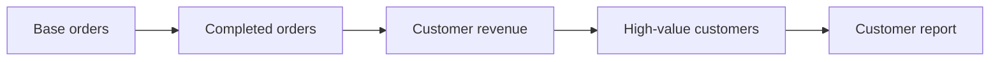
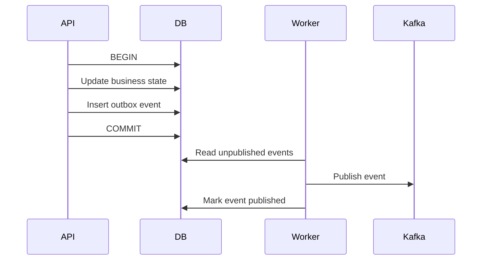

# 12- CTE Exercises

## Overview

Common Table Expressions (CTEs) provide a named query scope that can make complex SQL easier to structure, reason about, and maintain. They are particularly useful when a query naturally consists of multiple logical stages.

These exercises focus on using CTEs for:

- Breaking complex queries into logical stages.
- Aggregation and filtering.
- Multi-step transformations.
- Recursive hierarchies.
- Data modification with `INSERT`, `UPDATE`, and `DELETE`.
- Data validation and reconciliation.
- Latest-record and ranking problems.
- Production-scale query design.
- PostgreSQL execution behavior and materialization.
- Backend integration with Django and SQLAlchemy.

A CTE is not automatically a performance optimization. Its primary value is expressing query structure clearly. PostgreSQL's optimizer may inline a CTE or materialize it depending on the query and explicit directives.

---

## Practice Schema

Use the following schema throughout the exercises:

```sql
CREATE TABLE customers (
    id bigint GENERATED ALWAYS AS IDENTITY PRIMARY KEY,
    email text NOT NULL UNIQUE,
    name text NOT NULL,
    created_at timestamptz NOT NULL DEFAULT now()
);

CREATE TABLE orders (
    id bigint GENERATED ALWAYS AS IDENTITY PRIMARY KEY,
    customer_id bigint NOT NULL REFERENCES customers(id),
    status text NOT NULL
        CHECK (status IN ('pending', 'processing', 'completed', 'cancelled')),
    total_amount numeric(12, 2) NOT NULL,
    created_at timestamptz NOT NULL DEFAULT now(),
    completed_at timestamptz
);

CREATE TABLE payments (
    id bigint GENERATED ALWAYS AS IDENTITY PRIMARY KEY,
    order_id bigint NOT NULL REFERENCES orders(id),
    amount numeric(12, 2) NOT NULL,
    status text NOT NULL
        CHECK (status IN ('pending', 'paid', 'failed', 'refunded')),
    paid_at timestamptz
);

CREATE TABLE products (
    id bigint GENERATED ALWAYS AS IDENTITY PRIMARY KEY,
    name text NOT NULL,
    price numeric(12, 2) NOT NULL,
    active boolean NOT NULL DEFAULT true
);

CREATE TABLE order_items (
    id bigint GENERATED ALWAYS AS IDENTITY PRIMARY KEY,
    order_id bigint NOT NULL REFERENCES orders(id),
    product_id bigint NOT NULL REFERENCES products(id),
    quantity integer NOT NULL CHECK (quantity > 0),
    unit_price numeric(12, 2) NOT NULL
);
```

Relationship model:

```text
customers
    │
    └──< orders
            │
            ├──< payments
            │
            └──< order_items >── products
```

---

## Basic CTE Structure

A CTE is defined with `WITH` and referenced by the main query.

```sql
WITH recent_orders AS (
    SELECT
        id,
        customer_id,
        total_amount,
        created_at
    FROM orders
    WHERE created_at >= CURRENT_DATE - INTERVAL '30 days'
)
SELECT *
FROM recent_orders;
```

The CTE gives a complex expression a meaningful name.

### Exercise

Create CTEs that return:

1. Orders created during the last 30 days.
2. Completed orders.
3. Active products.
4. Customers created during the current year.
5. Successful payments.

---

## Multiple CTEs

Multiple CTEs can represent separate logical stages.

```sql
WITH completed_orders AS (
    SELECT
        customer_id,
        total_amount
    FROM orders
    WHERE status = 'completed'
),
customer_revenue AS (
    SELECT
        customer_id,
        SUM(total_amount) AS total_revenue
    FROM completed_orders
    GROUP BY customer_id
)
SELECT *
FROM customer_revenue
WHERE total_revenue > 10000;
```

The second CTE depends on the first.

### Exercise

Build a multi-stage query that:

1. Selects completed orders.
2. Aggregates revenue per customer.
3. Filters customers above `10000`.
4. Joins the result back to customer details.

---

## CTE Dependency Graph

Think of multiple CTEs as a logical dependency graph:



### Exercise

Design a five-stage CTE pipeline that produces:

```text
customer
→ completed orders
→ revenue
→ customer ranking
→ top customers
```

Document what each CTE represents and what its output grain is.

---

## CTE and Result Grain

Every CTE should have an intentional result grain.

For example:

```sql
WITH customer_revenue AS (
    SELECT
        customer_id,
        SUM(total_amount) AS total_revenue
    FROM orders
    GROUP BY customer_id
)
SELECT *
FROM customer_revenue;
```

The grain is:

> One row per customer.

If another CTE joins order-level rows to customer-level rows without understanding the grain, aggregation errors can occur.

### Exercise

For each CTE in your solution, document:

| CTE | Grain | Important columns |
|---|---|---|
| `completed_orders` | One row per order | `id`, `customer_id`, `total_amount` |
| `customer_revenue` | One row per customer | `customer_id`, `total_revenue` |
| `top_customers` | One row per selected customer | `customer_id`, `rank` |

Create your own dependency table for a multi-CTE query.

---

## CTE with Aggregation

Example:

```sql
WITH customer_stats AS (
    SELECT
        customer_id,
        COUNT(*) AS order_count,
        SUM(total_amount) AS total_revenue,
        AVG(total_amount) AS average_order_value
    FROM orders
    GROUP BY customer_id
)
SELECT *
FROM customer_stats
WHERE total_revenue > 10000;
```

### Exercise

Create CTEs for:

1. Order count per customer.
2. Completed revenue per customer.
3. Average order amount per customer.
4. Maximum order amount per customer.
5. Failed payment count per customer.
6. Number of distinct products ordered by each customer.

---

## CTE with `HAVING`

Use `HAVING` when filtering grouped results.

```sql
WITH customer_stats AS (
    SELECT
        customer_id,
        COUNT(*) AS order_count,
        SUM(total_amount) AS total_revenue
    FROM orders
    GROUP BY customer_id
    HAVING COUNT(*) >= 5
)
SELECT *
FROM customer_stats;
```

### Exercise

Return customers with:

1. At least five orders.
2. Revenue above `10000`.
3. Average order value above `500`.
4. At least three completed orders.
5. More than five distinct products ordered.

---

## CTE with `JOIN`

A CTE can make an aggregation stage explicit before joining.

```sql
WITH customer_revenue AS (
    SELECT
        customer_id,
        SUM(total_amount) AS total_revenue
    FROM orders
    WHERE status = 'completed'
    GROUP BY customer_id
)
SELECT
    c.id,
    c.name,
    cr.total_revenue
FROM customers AS c
JOIN customer_revenue AS cr
    ON cr.customer_id = c.id;
```

### Exercise

Use CTEs to return:

1. Customers with their completed revenue.
2. Customers with their order count.
3. Products with total quantity sold.
4. Orders with successful payment totals.
5. Customers with their most recent order timestamp.

---

## CTE for Latest Record Per Group

A window function inside a CTE can make latest-record logic readable.

```sql
WITH ranked_orders AS (
    SELECT
        o.*,
        ROW_NUMBER() OVER (
            PARTITION BY customer_id
            ORDER BY created_at DESC, id DESC
        ) AS row_number
    FROM orders AS o
)
SELECT *
FROM ranked_orders
WHERE row_number = 1;
```

This returns one latest order per customer.

### Exercise

Use CTEs to find:

1. Latest order per customer.
2. Latest completed order per customer.
3. Latest payment per order.
4. Highest-value order per customer.
5. Latest failed payment per customer.

---

## CTE with `DISTINCT ON`

For PostgreSQL, `DISTINCT ON` can be a concise alternative.

```sql
WITH latest_orders AS (
    SELECT DISTINCT ON (customer_id)
        id,
        customer_id,
        status,
        total_amount,
        created_at
    FROM orders
    ORDER BY customer_id, created_at DESC, id DESC
)
SELECT *
FROM latest_orders;
```

### Exercise

Compare:

1. CTE + `ROW_NUMBER()`.
2. CTE + `DISTINCT ON`.
3. CTE + correlated subquery.
4. CTE + `LATERAL`.

For each, explain result semantics and inspect the execution plan.

---

## CTE for Ranking

CTEs work well with window functions.

```sql
WITH customer_revenue AS (
    SELECT
        customer_id,
        SUM(total_amount) AS total_revenue
    FROM orders
    WHERE status = 'completed'
    GROUP BY customer_id
),
ranked_customers AS (
    SELECT
        customer_id,
        total_revenue,
        RANK() OVER (
            ORDER BY total_revenue DESC
        ) AS revenue_rank
    FROM customer_revenue
)
SELECT *
FROM ranked_customers
WHERE revenue_rank <= 10;
```

### Exercise

Produce:

1. Top 10 customers by revenue.
2. Top 3 customers per month.
3. Top 5 products by quantity sold.
4. Top 3 products per category if a category column is added.
5. Customers ranked by completed order count.

---

## CTE for Monthly Reporting

Example:

```sql
WITH monthly_orders AS (
    SELECT
        date_trunc('month', created_at) AS month,
        COUNT(*) AS order_count,
        SUM(total_amount) AS revenue
    FROM orders
    GROUP BY date_trunc('month', created_at)
)
SELECT *
FROM monthly_orders
ORDER BY month;
```

### Exercise

Create monthly reports for:

1. Order count.
2. Revenue.
3. Completed revenue.
4. Average order value.
5. Failed payment count.
6. Distinct active customers.

Then extend the query to calculate month-over-month revenue change.

---

## CTE for Conditional Aggregation

```sql
WITH customer_stats AS (
    SELECT
        customer_id,
        COUNT(*) AS total_orders,
        COUNT(*) FILTER (
            WHERE status = 'completed'
        ) AS completed_orders,
        COUNT(*) FILTER (
            WHERE status = 'cancelled'
        ) AS cancelled_orders,
        COALESCE(
            SUM(total_amount) FILTER (
                WHERE status = 'completed'
            ),
            0
        ) AS completed_revenue
    FROM orders
    GROUP BY customer_id
)
SELECT *
FROM customer_stats;
```

### Exercise

Create customer statistics containing:

- Total orders.
- Pending orders.
- Processing orders.
- Completed orders.
- Cancelled orders.
- Completed revenue.
- Cancelled value.

---

## CTE and `EXISTS`

CTEs can prepare a relevant dataset before applying existence logic.

```sql
WITH active_customers AS (
    SELECT id
    FROM customers
    WHERE created_at >= CURRENT_DATE - INTERVAL '1 year'
)
SELECT c.*
FROM customers AS c
WHERE c.id IN (
    SELECT ac.id
    FROM active_customers AS ac
);
```

This particular query can be simplified, but the pattern becomes useful when the CTE represents a substantial logical stage.

### Exercise

Create CTE-based queries for:

1. Active customers with completed orders.
2. Customers with failed payments.
3. Products that have been ordered.
4. Customers with no completed orders.
5. Orders with no successful payment.

Compare `IN`, `EXISTS`, and direct joins.

---

## CTE with `UPDATE`

PostgreSQL supports data-modifying statements with CTEs.

Example:

```sql
WITH eligible_orders AS (
    SELECT id
    FROM orders
    WHERE status = 'pending'
      AND created_at < now() - INTERVAL '24 hours'
)
UPDATE orders AS o
SET status = 'cancelled'
FROM eligible_orders AS e
WHERE o.id = e.id;
```

This can make complex update targeting easier to reason about.

### Exercise

Design CTE-driven updates to:

1. Cancel stale pending orders.
2. Mark eligible orders as processing.
3. Update a customer summary table from aggregated order data.
4. Update product availability based on inventory logic if inventory columns are added.

For each, consider concurrency and whether the operation should lock rows explicitly.

---

## CTE with `DELETE`

Example:

```sql
WITH obsolete_customers AS (
    SELECT c.id
    FROM customers AS c
    WHERE NOT EXISTS (
        SELECT 1
        FROM orders AS o
        WHERE o.customer_id = c.id
    )
      AND c.created_at < now() - INTERVAL '1 year'
)
DELETE FROM customers AS c
USING obsolete_customers AS oc
WHERE c.id = oc.id;
```

Always preview the target set before destructive operations:

```sql
WITH obsolete_customers AS (
    SELECT c.id
    FROM customers AS c
    WHERE NOT EXISTS (
        SELECT 1
        FROM orders AS o
        WHERE o.customer_id = c.id
    )
      AND c.created_at < now() - INTERVAL '1 year'
)
SELECT *
FROM customers
WHERE id IN (
    SELECT id
    FROM obsolete_customers
);
```

### Exercise

Design safe CTE-based deletes for:

1. Unused products.
2. Customers without orders.
3. Expired records.
4. Duplicate staging records.

Explain how you would validate the target set and recover from an accidental deletion.

---

## Data-Modifying CTEs

A data-modifying CTE can perform `INSERT`, `UPDATE`, or `DELETE` while the overall statement returns another result.

Example pattern:

```sql
WITH inserted_rows AS (
    INSERT INTO ...
    RETURNING ...
)
SELECT ...
FROM inserted_rows;
```

This can be useful for tightly coupled database operations.

### Exercise

Design:

1. An `INSERT ... RETURNING` CTE.
2. An `UPDATE ... RETURNING` CTE.
3. A `DELETE ... RETURNING` CTE.
4. A multi-step statement where the result of one modification feeds another operation.

Document the transaction semantics and failure behavior.

---

## `RETURNING` with CTEs

`RETURNING` is useful when an application needs generated values without a second query.

Example:

```sql
WITH created_order AS (
    INSERT INTO orders (
        customer_id,
        status,
        total_amount
    )
    VALUES ($1, 'pending', $2)
    RETURNING id, customer_id, created_at
)
SELECT *
FROM created_order;
```

This avoids:

```text
INSERT
→ SELECT inserted row
```

and therefore avoids an unnecessary round trip.

### Exercise

Design a single SQL statement that:

1. Creates an order.
2. Returns the generated order ID.
3. Returns the creation timestamp.
4. Returns the customer ID.

Then extend the exercise to create related records safely.

---

## CTE and Transactions

A CTE does not replace a transaction.

A statement containing several CTEs executes as one SQL statement, but application workflows may still require multiple statements inside an explicit transaction.

For example:

```text
API request
    ↓
BEGIN
    ↓
SQL statement with CTEs
    ↓
Other database statements
    ↓
COMMIT
```

### Exercise

Design a workflow where:

1. An order is created.
2. A payment record is created.
3. An outbox event is inserted.
4. Everything must commit atomically.

Decide whether the entire workflow should be one SQL statement or several statements inside one transaction.

---

## CTE and Transactional Outbox

A transactional outbox commonly writes business state and an event record in the same transaction.

Conceptually:



A CTE can sometimes simplify tightly related database modifications, but the important invariant is atomicity.

### Exercise

Design an order-completion transaction that:

1. Updates the order.
2. Creates an outbox event.
3. Returns the updated order.
4. Keeps both modifications atomic.

Explain how a Celery worker or Kafka publisher would process the outbox afterward.

---

## CTE and Recursive Queries

Recursive CTEs are used for hierarchical or graph-like relationships.

General structure:

```sql
WITH RECURSIVE hierarchy AS (
    -- Anchor query
    SELECT
        id,
        parent_id,
        name,
        0 AS depth
    FROM categories
    WHERE parent_id IS NULL

    UNION ALL

    -- Recursive query
    SELECT
        c.id,
        c.parent_id,
        c.name,
        h.depth + 1
    FROM categories AS c
    JOIN hierarchy AS h
        ON c.parent_id = h.id
)
SELECT *
FROM hierarchy;
```

The recursive CTE repeatedly evaluates the recursive term until no new rows are produced.

### Exercise

Create a `categories` table:

```sql
CREATE TABLE categories (
    id bigint GENERATED ALWAYS AS IDENTITY PRIMARY KEY,
    parent_id bigint REFERENCES categories(id),
    name text NOT NULL
);
```

Then write queries to:

1. Return the entire hierarchy.
2. Calculate depth.
3. Return all descendants of a category.
4. Return all ancestors of a category.
5. Build a path from root to node.
6. Prevent cycles at the application or schema level.

---

## Recursive CTE for Organizational Hierarchies

Assume:

```sql
CREATE TABLE employees (
    id bigint GENERATED ALWAYS AS IDENTITY PRIMARY KEY,
    manager_id bigint REFERENCES employees(id),
    name text NOT NULL
);
```

### Exercise

Write recursive CTEs to:

1. Find all employees under a manager.
2. Find the management chain for an employee.
3. Calculate hierarchy depth.
4. Return the path from the CEO to an employee.
5. Calculate the number of descendants for each manager.

Discuss how very deep or cyclic hierarchies should be handled.

---

## Recursive CTE for Graph Traversal

Recursive CTEs can also traverse graph relationships.

Example:

```sql
WITH RECURSIVE reachable AS (
    SELECT
        source_id,
        target_id,
        1 AS depth
    FROM graph_edges
    WHERE source_id = $1

    UNION ALL

    SELECT
        r.source_id,
        e.target_id,
        r.depth + 1
    FROM reachable AS r
    JOIN graph_edges AS e
        ON e.source_id = r.target_id
)
SELECT *
FROM reachable;
```

### Exercise

Design a graph traversal that:

1. Finds reachable nodes.
2. Tracks traversal depth.
3. Prevents revisiting nodes.
4. Limits maximum depth.
5. Returns the shortest path where appropriate.

---

## Recursive CTE Cycle Protection

Naive recursion can revisit the same nodes indefinitely.

A common PostgreSQL technique is to track visited IDs.

Conceptually:

```sql
WITH RECURSIVE traversal AS (
    SELECT
        id,
        ARRAY[id] AS path
    FROM nodes
    WHERE id = $1

    UNION ALL

    SELECT
        e.target_id,
        t.path || e.target_id
    FROM traversal AS t
    JOIN edges AS e
        ON e.source_id = t.id
    WHERE NOT e.target_id = ANY(t.path)
)
SELECT *
FROM traversal;
```

### Exercise

Extend this pattern to:

1. Detect cycles.
2. Stop recursion at a maximum depth.
3. Return the traversal path.
4. Return only the first occurrence of each node.

---

## CTE Materialization

PostgreSQL can treat CTEs differently depending on the query.

You can explicitly request materialization:

```sql
WITH expensive_result AS MATERIALIZED (
    SELECT ...
)
SELECT ...
FROM expensive_result;
```

Or request inlining:

```sql
WITH expensive_result AS NOT MATERIALIZED (
    SELECT ...
)
SELECT ...
FROM expensive_result;
```

Materialization can be useful when a result is expensive to compute and reused, but it can also prevent beneficial predicate pushdown.

`NOT MATERIALIZED` can allow the optimizer to integrate the CTE into the surrounding query.

### Exercise

Create a query where:

1. Materialization is beneficial.
2. Materialization is harmful.
3. Predicate pushdown matters.
4. The CTE is referenced multiple times.

Compare execution plans.

---

## CTE vs Subquery

These two forms may express similar logic.

CTE:

```sql
WITH customer_stats AS (
    SELECT
        customer_id,
        COUNT(*) AS order_count
    FROM orders
    GROUP BY customer_id
)
SELECT *
FROM customer_stats
WHERE order_count > 10;
```

Derived subquery:

```sql
SELECT *
FROM (
    SELECT
        customer_id,
        COUNT(*) AS order_count
    FROM orders
    GROUP BY customer_id
) AS customer_stats
WHERE order_count > 10;
```

The choice is often about readability and structure rather than automatically better performance.

### Exercise

Rewrite five CTE queries as derived subqueries.

For each pair:

- Compare readability.
- Compare result grain.
- Compare execution plans.
- Determine whether PostgreSQL produces the same strategy.

---

## CTE vs Join

A CTE can isolate an intermediate result, while a join can express relationships directly.

Example CTE:

```sql
WITH high_value_customers AS (
    SELECT
        customer_id
    FROM orders
    GROUP BY customer_id
    HAVING SUM(total_amount) > 10000
)
SELECT c.*
FROM customers AS c
JOIN high_value_customers AS h
    ON h.customer_id = c.id;
```

Equivalent logic can often be expressed with aggregation and joins.

### Exercise

For five problems:

1. Write a CTE solution.
2. Write a join-based solution.
3. Compare cardinality.
4. Compare execution plans.
5. Decide which communicates the business intent better.

---

## CTE vs Window Function

Some CTEs are used only to give a window-function result a filtering stage.

Example:

```sql
WITH ranked_orders AS (
    SELECT
        o.*,
        ROW_NUMBER() OVER (
            PARTITION BY customer_id
            ORDER BY created_at DESC, id DESC
        ) AS row_number
    FROM orders AS o
)
SELECT *
FROM ranked_orders
WHERE row_number = 1;
```

The CTE is useful because window functions cannot normally be filtered directly in the same `WHERE` clause where they are defined.

### Exercise

Use CTEs and window functions to solve:

1. Latest order per customer.
2. Top three orders per customer.
3. Revenue rank per customer.
4. Running monthly revenue.
5. Month-over-month revenue change.

---

## CTE for Deduplication

CTEs are useful for identifying duplicates before cleanup.

Example:

```sql
WITH duplicate_emails AS (
    SELECT
        email,
        COUNT(*) AS duplicate_count
    FROM customers
    GROUP BY email
    HAVING COUNT(*) > 1
)
SELECT c.*
FROM customers AS c
JOIN duplicate_emails AS d
    ON d.email = c.email;
```

In the provided schema, `email` is unique, so this is primarily a data-quality exercise.

### Exercise

Design a deduplication workflow for a staging table:

1. Identify duplicate business keys.
2. Rank duplicate rows.
3. Select the canonical record.
4. Identify records to remove.
5. Reconcile dependent records.
6. Apply cleanup safely.

---

## CTE for Data Reconciliation

A CTE can make mismatches between datasets explicit.

Example:

```sql
WITH expected AS (
    SELECT
        order_id,
        SUM(amount) AS expected_amount
    FROM payments
    WHERE status = 'paid'
    GROUP BY order_id
),
actual AS (
    SELECT
        id AS order_id,
        total_amount
    FROM orders
)
SELECT
    a.order_id,
    a.total_amount,
    e.expected_amount
FROM actual AS a
JOIN expected AS e
    ON e.order_id = a.order_id
WHERE a.total_amount <> e.expected_amount;
```

### Exercise

Build reconciliation queries for:

1. Order total vs payment total.
2. Expected customer revenue vs stored customer summary.
3. Product quantity sold vs inventory movement.
4. Source dataset vs migrated dataset.

For each, define acceptable differences and investigate unmatched rows separately.

---

## CTE for Data Migration

CTEs can structure migration queries, but large migrations should not automatically be executed as one enormous statement.

Example:

```sql
WITH source_data AS (
    SELECT
        id,
        lower(email) AS normalized_email
    FROM customers
)
UPDATE customers AS c
SET email = s.normalized_email
FROM source_data AS s
WHERE c.id = s.id
  AND c.email <> s.normalized_email;
```

For a large table, consider:

- Batching.
- Keyset pagination.
- Progress tracking.
- Lock duration.
- WAL volume.
- Replica lag.
- Autovacuum pressure.
- Restartability.

### Exercise

Design a migration using a CTE for:

1. Normalizing customer data.
2. Backfilling a new column.
3. Recalculating a derived value.
4. Migrating records into a new table.

Then explain why you would or would not execute the operation as one transaction.

---

## CTE and Large Datasets

A query that is elegant on a small dataset can become expensive at production scale.

Evaluate:

- Number of rows produced by each CTE.
- Whether intermediate results are materialized.
- Whether predicates are pushed down.
- Whether indexes are used.
- Whether sorting or hashing spills to disk.
- Whether the query is repeatedly executed by an API.
- Whether a reporting workload belongs on OLAP infrastructure.

### Exercise

Take a multi-CTE query and evaluate it at:

```text
10,000 rows
1,000,000 rows
100,000,000 rows
```

Record:

- Execution time.
- Planning time.
- Buffer usage.
- Temporary I/O.
- Memory behavior.
- CPU consumption.
- Result size.

---

## CTE and API Workloads

CTEs are useful for complex API queries, especially when an endpoint requires multiple logical stages.

Example:

```text
GET /customers/top

Database
    ↓
CTE: completed orders
    ↓
CTE: customer revenue
    ↓
CTE: ranking
    ↓
CTE: top customers
    ↓
API response
```

However, frequently executed expensive reports may be better served through:

- Materialized views.
- Precomputed read models.
- Redis caches.
- Dedicated reporting databases.
- OLAP systems.

### Exercise

Design the SQL for:

```text
GET /customers/top?limit=20
```

Requirements:

- Completed revenue only.
- Deterministic ordering.
- Keyset pagination if appropriate.
- Tenant filtering.
- No N+1 queries.
- Explain the required indexes.

---

## CTE and Django

Django's ORM provides expression constructs for many query patterns, but CTE support depends on the Django version and the tools used around it.

Do not assume an ORM automatically produces the SQL structure you want.

For complex PostgreSQL-specific queries, a carefully reviewed raw SQL query can sometimes be appropriate:

```python
from django.db import connection

with connection.cursor() as cursor:
    cursor.execute(
        """
        WITH customer_revenue AS (
            SELECT
                customer_id,
                SUM(total_amount) AS total_revenue
            FROM orders
            WHERE status = %s
            GROUP BY customer_id
        )
        SELECT customer_id, total_revenue
        FROM customer_revenue
        WHERE total_revenue > %s
        """,
        ["completed", 10000],
    )

    rows = cursor.fetchall()
```

Values must remain parameterized.

### Exercise

For a Django endpoint:

```text
GET /customers/high-value
```

design:

1. ORM-based implementation where practical.
2. CTE-based SQL implementation.
3. Query-count behavior.
4. Index requirements.
5. Pagination strategy.
6. Testing strategy.

---

## CTE and SQLAlchemy

SQLAlchemy Core supports CTEs directly.

Example:

```python
from sqlalchemy import select, func

customer_revenue = (
    select(
        Order.customer_id,
        func.sum(Order.total_amount).label("total_revenue"),
    )
    .where(Order.status == "completed")
    .group_by(Order.customer_id)
    .cte("customer_revenue")
)

stmt = (
    select(
        customer_revenue.c.customer_id,
        customer_revenue.c.total_revenue,
    )
    .where(customer_revenue.c.total_revenue > 10000)
)
```

### Exercise

Implement the following with SQLAlchemy:

1. Customer revenue CTE.
2. Latest-order CTE.
3. Ranked customer CTE.
4. Recursive category CTE.
5. Data-reconciliation CTE.

Inspect the generated SQL.

---

## CTE and Security

A CTE does not provide an authorization boundary.

For a multi-tenant system, tenant restrictions must be applied consistently.

Example:

```sql
WITH customer_revenue AS (
    SELECT
        customer_id,
        SUM(total_amount) AS total_revenue
    FROM orders
    WHERE tenant_id = $1
      AND status = 'completed'
    GROUP BY customer_id
)
SELECT
    c.id,
    c.name,
    cr.total_revenue
FROM customers AS c
JOIN customer_revenue AS cr
    ON cr.customer_id = c.id
WHERE c.tenant_id = $1;
```

Where PostgreSQL Row Level Security is used, understand how policies interact with the roles executing the query.

### Exercise

Design a multi-tenant CTE query that:

1. Restricts source rows by tenant.
2. Produces tenant-scoped aggregates.
3. Joins only tenant-owned entities.
4. Cannot accidentally combine data across tenants.
5. Works correctly with the application's authorization model.

---

## CTE and Concurrency

A complex query can still race with other transactions.

For example, calculating an eligibility set in a CTE and then modifying rows requires careful reasoning about concurrent changes.

Consider:

```sql
WITH eligible_orders AS (
    SELECT id
    FROM orders
    WHERE status = 'pending'
)
UPDATE orders AS o
SET status = 'processing'
FROM eligible_orders AS e
WHERE o.id = e.id;
```

If this is used by multiple workers, ask:

- Can workers select the same rows?
- What locks are acquired?
- Should `FOR UPDATE` be used?
- Would `SKIP LOCKED` be appropriate?
- Is the operation idempotent?
- What happens when a worker retries?

For queue-like processing, a pattern such as:

```sql
WITH next_orders AS (
    SELECT id
    FROM orders
    WHERE status = 'pending'
    ORDER BY id
    FOR UPDATE SKIP LOCKED
    LIMIT 100
)
UPDATE orders AS o
SET status = 'processing'
FROM next_orders AS n
WHERE o.id = n.id
RETURNING o.*;
```

can provide database-coordinated work claiming.

### Exercise

Design a safe worker query that:

1. Claims a batch of pending jobs.
2. Prevents workers from claiming the same rows.
3. Handles concurrent workers.
4. Returns the claimed rows.
5. Supports retry after worker failure.

Explain the transaction boundary.

---

## CTE and Read Replicas

A complex read-only CTE query may be suitable for a read replica, but only if the application's consistency requirements permit replica lag.

For example:

```text
API
 ↓
Read-only CTE query
 ↓
Read replica
```

is inappropriate when the request immediately depends on a just-committed primary write and requires read-after-write consistency.

### Exercise

For a reporting endpoint using multiple CTEs:

1. Decide whether it can use a replica.
2. Define acceptable freshness.
3. Define fallback behavior.
4. Consider long-running query impact.
5. Determine whether OLAP infrastructure would be more appropriate.

---

## CTE and Observability

When a CTE-based query becomes slow, inspect the complete execution plan.

```sql
EXPLAIN (ANALYZE, BUFFERS)
WITH customer_revenue AS (
    SELECT
        customer_id,
        SUM(total_amount) AS total_revenue
    FROM orders
    WHERE status = 'completed'
    GROUP BY customer_id
)
SELECT *
FROM customer_revenue
WHERE total_revenue > 10000;
```

Look for:

- Large intermediate row counts.
- Incorrect cardinality estimates.
- Sequential scans.
- Expensive aggregation.
- Sorts.
- Hash operations.
- Temporary I/O.
- Repeated CTE evaluation.
- Lock waits.
- Planning versus execution time.

Use `pg_stat_statements` to determine whether a query is expensive because it is slow once or because it runs thousands of times.

---

## Common Mistakes

| Mistake | Problem | Better approach |
|---|---|---|
| Using CTEs everywhere | Adds unnecessary abstraction | Use them when they improve query structure |
| Assuming CTE means faster | Syntax does not guarantee performance | Inspect execution plans |
| Ignoring CTE grain | Causes incorrect joins and aggregation | Define grain explicitly |
| Materializing everything | Can prevent useful optimization | Understand `MATERIALIZED` vs `NOT MATERIALIZED` |
| Creating huge recursive queries | Can consume excessive resources | Bound depth and prevent cycles |
| Using one huge CTE migration | Long transactions and WAL pressure | Batch large data changes |
| Ignoring tenant filters | Can expose cross-tenant data | Apply tenant scope consistently |
| Using CTEs to hide bad SQL | Complexity remains | Simplify the relational model first |
| Fetching CTE results into Python unnecessarily | Adds network and memory cost | Keep relational work in SQL |
| Ignoring concurrency | Workers may process the same rows | Use appropriate locking and idempotency |
| Using CTEs for API reports without limits | Large responses and expensive scans | Paginate and constrain result sets |
| Assuming ORM hides query cost | Generated SQL still reaches PostgreSQL | Inspect generated SQL and plans |

---

## Production Troubleshooting Workflow

When a CTE query is incorrect or slow:

1. Define the expected result grain.
2. Execute each logical stage independently.
3. Validate row counts at every stage.
4. Check join cardinality.
5. Check `NULL` behavior.
6. Check tenant and authorization predicates.
7. Compare against a join, subquery, or window-function formulation.
8. Run:

```sql
EXPLAIN (ANALYZE, BUFFERS)
...
```

9. Check indexes and statistics.
10. Check whether materialization is affecting the plan.
11. Check lock waits and transaction duration.
12. Test using production-like data volume.
13. Validate behavior under concurrent execution.

A CTE makes query structure easier to read, but it does not eliminate the need for database-level reasoning.

---

## Production Design Checklist

Before shipping a complex CTE query:

### Correctness

- [ ] Result grain is explicitly understood.
- [ ] Each CTE has a clear responsibility.
- [ ] Join cardinality is correct.
- [ ] `NULL` semantics are intentional.
- [ ] Edge cases are tested.
- [ ] Tenant isolation is preserved.
- [ ] Authorization is enforced.

### Performance

- [ ] Execution plan has been reviewed.
- [ ] Important predicates are index-supported.
- [ ] Intermediate result sizes are acceptable.
- [ ] Sort/hash memory requirements are understood.
- [ ] Temporary I/O is acceptable.
- [ ] Query frequency is known.
- [ ] Pagination or limits are applied where appropriate.

### Reliability

- [ ] Transaction boundaries are intentional.
- [ ] Concurrent execution is safe.
- [ ] Lock behavior is understood.
- [ ] Retry behavior is idempotent.
- [ ] Long-running operations have timeouts.
- [ ] Replica consistency requirements are documented.

### Operations

- [ ] Query latency is observable.
- [ ] Query frequency is observable.
- [ ] Database CPU and I/O impact are understood.
- [ ] Large migrations are restartable.
- [ ] Backups and recovery procedures cover destructive operations.
- [ ] Production rollback behavior is understood.

---

## Final Practice Set

Complete these exercises without consulting reference solutions:

1. Create a CTE containing all completed orders.
2. Create a CTE containing revenue per customer.
3. Find customers whose revenue exceeds `10000`.
4. Add customer details to the revenue result.
5. Calculate order counts and revenue in separate CTEs.
6. Combine those CTEs into one customer report.
7. Find the latest order per customer using `ROW_NUMBER()`.
8. Find the latest order per customer using `DISTINCT ON`.
9. Compare the two execution plans.
10. Find the top 10 customers by completed revenue.
11. Rank customers by revenue.
12. Calculate monthly revenue.
13. Calculate month-over-month revenue change.
14. Calculate conditional order counts.
15. Build a CTE-based existence query.
16. Build a CTE-based anti-join query.
17. Use a CTE inside an `UPDATE`.
18. Use a CTE inside a `DELETE`.
19. Use `RETURNING` with a data-modifying CTE.
20. Build an order-creation statement that returns generated values.
21. Create a recursive category hierarchy query.
22. Calculate hierarchy depth.
23. Find descendants of a category.
24. Find ancestors of a category.
25. Add cycle protection to recursive traversal.
26. Build an employee hierarchy query.
27. Compare CTEs with equivalent subqueries.
28. Compare CTEs with equivalent joins.
29. Compare CTEs with window-function solutions.
30. Test `MATERIALIZED` versus `NOT MATERIALIZED`.
31. Inspect the execution plan for a multi-CTE query.
32. Identify the largest intermediate result.
33. Design indexes supporting the CTE predicates.
34. Build a tenant-safe aggregate CTE.
35. Build a keyset-paginated CTE-based API query.
36. Design a CTE-based reconciliation query.
37. Design a large-table backfill using incremental batches.
38. Design a worker query using `FOR UPDATE SKIP LOCKED`.
39. Explain how replica lag affects a CTE-based reporting query.
40. Defend every CTE design decision as if reviewing it in a production architecture meeting.

## Key Takeaways

- **Use CTEs to structure complex SQL:** they are primarily a readability and composability tool, allowing multi-stage relational logic to be expressed explicitly.
- **Define the grain of every CTE:** incorrect cardinality between intermediate stages is a common source of duplicate rows, incorrect aggregation, and subtle production bugs.
- **CTEs are not automatically performance optimizations:** PostgreSQL may inline or materialize them, so use execution plans to validate `MATERIALIZED`, `NOT MATERIALIZED`, indexing, and intermediate-result behavior.
- **Recursive and data-modifying CTEs require stronger operational reasoning:** control recursion depth, prevent cycles, understand transaction behavior, and make large updates or deletes restartable and safe.
- **Senior CTE design connects SQL to the system:** concurrency, tenant isolation, pagination, replicas, ORM behavior, observability, migrations, and workload scale must influence the final query design.