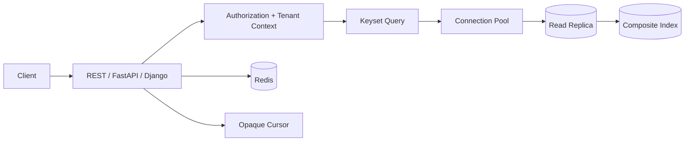

# 19- Pagination Exercises

## Overview

Pagination is the mechanism used to return large ordered datasets in bounded pages instead of loading the entire result set at once.

For backend systems, pagination is not merely an API convenience. The pagination strategy directly affects:

- Database CPU and I/O.
- Index design.
- Query latency.
- Memory consumption.
- API response size.
- Consistency under concurrent writes.
- User experience.
- Read-replica behavior.
- Cacheability.
- Scalability.

The two fundamental SQL approaches are:

| Strategy | Typical SQL | Best suited for |
|---|---|---|
| Offset pagination | `LIMIT ... OFFSET ...` | Small/moderate datasets, arbitrary page navigation |
| Keyset pagination | `WHERE ... < cursor ORDER BY ... LIMIT ...` | Large datasets, high-performance APIs |

The exercises progress from basic pagination to production-grade cursor design, concurrent writes, composite ordering, ORM implementation, distributed systems, and large-scale database workloads.

---

## Practice Schema

Use the following PostgreSQL schema for most exercises.

```sql
CREATE TABLE customers (
    id bigint GENERATED ALWAYS AS IDENTITY PRIMARY KEY,
    email text NOT NULL UNIQUE,
    created_at timestamptz NOT NULL DEFAULT now()
);

CREATE TABLE orders (
    id bigint GENERATED ALWAYS AS IDENTITY PRIMARY KEY,
    customer_id bigint NOT NULL REFERENCES customers(id),
    status text NOT NULL,
    total_amount numeric(12, 2) NOT NULL,
    created_at timestamptz NOT NULL DEFAULT now()
);

CREATE INDEX orders_customer_created_idx
    ON orders (customer_id, created_at DESC, id DESC);

CREATE INDEX orders_created_idx
    ON orders (created_at DESC, id DESC);
```

Assume `orders` contains millions or billions of rows for the production-oriented exercises.

---

## Pagination Fundamentals

### Exercise: Basic LIMIT and OFFSET

Retrieve the first 20 orders.

Then retrieve:

```text
page 2
page size 20
```

### Tasks

Write the SQL query using:

```sql
LIMIT
OFFSET
```

Then calculate the offset for:

```text
page = 100
page_size = 50
```

Explain the relationship:

```text
OFFSET = (page - 1) * page_size
```

---

## Exercise: Add Deterministic Ordering

Consider:

```sql
SELECT id, customer_id, total_amount
FROM orders
LIMIT 20;
```

### Tasks

Explain why this is not a reliable pagination query.

Add an `ORDER BY`.

Then explain why pagination should generally use a deterministic ordering such as:

```sql
ORDER BY created_at DESC, id DESC
```

rather than:

```sql
ORDER BY created_at DESC
```

alone.

---

## Exercise: Page-Based API

Design:

```http
GET /orders?page=3&page_size=50
```

### Tasks

Define:

- Default page size.
- Maximum page size.
- Invalid page behavior.
- Empty-page behavior.
- Response metadata.

Design a response such as:

```json
{
  "items": [],
  "page": 3,
  "page_size": 50,
  "has_next": true
}
```

Explain whether the API should return an exact `total_count`.

---

## Exercise: Count the Total

An API wants:

```json
{
  "items": [...],
  "page": 5,
  "page_size": 50,
  "total": 12458392
}
```

### Tasks

Write the query required to calculate the total number of matching rows.

Then evaluate the production implications of running:

```sql
SELECT COUNT(*)
FROM orders
WHERE customer_id = $1;
```

on every API request.

Consider:

- Table size.
- Indexes.
- Query frequency.
- Latency.
- Concurrent requests.
- Approximate counts.
- Whether the UI actually requires an exact count.

---

## Exercise: OFFSET Performance

Compare:

```sql
SELECT id, customer_id, created_at
FROM orders
ORDER BY created_at DESC, id DESC
LIMIT 50 OFFSET 0;
```

with:

```sql
SELECT id, customer_id, created_at
FROM orders
ORDER BY created_at DESC, id DESC
LIMIT 50 OFFSET 5000000;
```

### Tasks

Explain why the second query can become increasingly expensive.

Use:

```sql
EXPLAIN (ANALYZE, BUFFERS)
```

to investigate the difference.

Identify:

- Rows processed.
- Rows discarded or skipped.
- Index usage.
- Buffer activity.
- Execution time.

---

## Exercise: Keyset Pagination

Replace:

```sql
LIMIT 50 OFFSET 5000000
```

with keyset pagination.

Assume the previous page ended at:

```text
created_at = '2026-09-01T10:30:00Z'
id = 500000
```

### Tasks

Write a query that returns the next 50 rows using:

```text
created_at
id
```

as the cursor.

Use a lexicographic comparison:

```sql
WHERE (created_at, id) < ($1, $2)
ORDER BY created_at DESC, id DESC
LIMIT 50;
```

Explain why the composite cursor is necessary.

---

## Exercise: Keyset Pagination in Ascending Order

Given:

```sql
ORDER BY created_at ASC, id ASC
```

### Tasks

Write the query for the next page.

Determine whether the comparison should be:

```sql
>
```

or:

```sql
<
```

Explain the relationship between:

```text
ORDER BY direction
```

and:

```text
cursor comparison
```

---

## Exercise: Composite Ordering

Consider:

```sql
ORDER BY status ASC, created_at DESC, id DESC
```

### Tasks

Design a cursor containing:

```text
status
created_at
id
```

Write the condition for retrieving the next page.

Explain why using only:

```text
created_at
```

as the cursor is incorrect.

---

## Exercise: Tie Handling

Suppose 10,000 orders have exactly the same:

```text
created_at
```

### Tasks

Determine why:

```sql
ORDER BY created_at DESC
```

is insufficient for stable pagination.

Add:

```text
id
```

as a tie-breaker.

Explain why the tie-breaker should be:

- Unique.
- Immutable.
- Included in both `ORDER BY` and the cursor.

---

## Exercise: Cursor Correctness

A cursor contains:

```json
{
  "created_at": "2026-09-05T12:00:00Z"
}
```

### Tasks

Identify failure scenarios when timestamps are not unique.

Consider:

- Duplicate timestamps.
- Rows inserted between requests.
- Rows deleted between requests.
- Clock precision.
- Database timestamp generation.

Redesign the cursor using:

```text
(created_at, id)
```

---

## Exercise: Cursor Encoding

An API should not expose raw cursor fields.

Instead of:

```text
?after=2026-09-05T12:00:00Z,12345
```

the API should return an opaque cursor.

### Tasks

Design a cursor containing:

```json
{
  "created_at": "2026-09-05T12:00:00Z",
  "id": 12345
}
```

Encode it using:

```text
JSON
→ UTF-8
→ Base64URL
```

Design the API response:

```json
{
  "items": [],
  "next_cursor": "..."
}
```

Explain why cursors should be treated as opaque API tokens rather than client-modifiable query parameters.

---

## Exercise: Cursor Validation

A client sends:

```text
?after=<invalid-value>
```

### Tasks

Determine how the API should handle:

- Invalid Base64.
- Invalid JSON.
- Missing cursor fields.
- Wrong field types.
- Invalid timestamp.
- Cursor from another endpoint.
- Cursor with an unsupported version.
- Tampered cursor.

Define an appropriate HTTP response.

---

## Exercise: Signed Cursors

A cursor contains sensitive or security-relevant pagination state.

### Tasks

Compare:

```text
Base64 encoding
```

with:

```text
signed cursor
```

Explain why Base64 does not provide integrity or confidentiality.

Design a signed cursor conceptually using:

```text
payload
+
HMAC
```

Explain why cursor signing can prevent clients from arbitrarily modifying pagination state.

---

## Exercise: Cursor Versioning

Your API currently returns:

```json
{
  "created_at": "...",
  "id": 123
}
```

A future version needs:

```text
tenant_id
created_at
id
```

### Tasks

Design a versioned cursor.

Example:

```json
{
  "v": 2,
  "tenant_id": 42,
  "created_at": "...",
  "id": 123
}
```

Explain how versioning allows the server to evolve cursor structure without breaking clients.

---

## Exercise: Pagination with Customer Filtering

Retrieve the latest orders for one customer.

### Tasks

Write:

```sql
SELECT id, status, total_amount, created_at
FROM orders
WHERE customer_id = $1
ORDER BY created_at DESC, id DESC
LIMIT 50;
```

Then design the next-page query.

Determine the appropriate index.

Evaluate:

```text
(customer_id, created_at DESC, id DESC)
```

against:

```text
(created_at DESC, id DESC, customer_id)
```

Explain why index order should follow the actual access pattern.

---

## Exercise: Pagination with Status Filtering

Retrieve pending orders:

```sql
WHERE status = 'pending'
ORDER BY created_at DESC, id DESC
LIMIT 100;
```

### Tasks

Design an index.

Compare:

```text
(status, created_at DESC, id DESC)
```

with a partial index:

```sql
CREATE INDEX orders_pending_created_idx
ON orders (created_at DESC, id DESC)
WHERE status = 'pending';
```

Determine which is preferable when pending orders represent only a small fraction of the table.

---

## Exercise: Pagination with Soft Deletes

Assume:

```text
deleted_at IS NULL
```

must always be applied.

### Tasks

Design a keyset query:

```sql
SELECT id, created_at
FROM orders
WHERE deleted_at IS NULL
ORDER BY created_at DESC, id DESC
LIMIT 50;
```

Design an appropriate index.

Explain why a partial index can be beneficial for active records.

---

## Exercise: Pagination with Joins

Consider:

```sql
SELECT
    o.id,
    o.created_at,
    c.email
FROM orders o
JOIN customers c ON c.id = o.customer_id
ORDER BY o.created_at DESC, o.id DESC
LIMIT 50;
```

### Tasks

Determine where pagination should occur.

Compare:

```text
paginate orders first
→ join customers
```

with:

```text
join everything
→ paginate final result
```

Explain how join cardinality can affect pagination correctness.

---

## Exercise: Pagination with One-to-Many Joins

Consider:

```text
orders
order_items
```

An order may contain many items.

### Tasks

Explain why:

```sql
SELECT o.id, oi.product_id
FROM orders o
JOIN order_items oi
    ON oi.order_id = o.id
ORDER BY o.created_at DESC
LIMIT 50;
```

does not necessarily return 50 orders.

Redesign the query so that pagination operates at the:

```text
order
```

grain.

---

## Exercise: Avoid Duplicate Parent Rows

Retrieve the latest 50 orders and then their items.

### Tasks

Compare:

```text
JOIN
```

with:

```text
two-step loading
```

and:

```text
JSON aggregation
```

Consider a query using:

```sql
jsonb_agg(...)
```

Explain why pagination should usually be applied before expanding a one-to-many relationship when the API's page unit is the parent entity.

---

## Exercise: Pagination and DISTINCT

Consider:

```sql
SELECT DISTINCT o.id
FROM orders o
JOIN order_items oi ON oi.order_id = o.id
ORDER BY o.created_at DESC
LIMIT 50;
```

### Tasks

Determine whether this is an efficient pagination strategy.

Explain why `DISTINCT` may hide a modeling or query-shape problem rather than solve it.

Design an alternative using:

```text
EXISTS
```

when the requirement is simply:

```text
orders containing a particular product
```

---

## Exercise: Pagination with EXISTS

Find the latest orders containing product `100`.

### Tasks

Write a query using:

```sql
EXISTS
```

and keyset pagination.

Explain why `EXISTS` can be preferable to joining `order_items` when only order existence matters.

---

## Exercise: Pagination with Search

An API supports:

```http
GET /orders?search=acme
```

### Tasks

Determine how pagination interacts with:

```text
ILIKE
```

and:

```text
full-text search
```

Consider whether:

```sql
WHERE customer_name ILIKE '%acme%'
```

can efficiently use a standard B-tree index.

Discuss appropriate PostgreSQL search indexes where relevant.

---

## Exercise: Pagination with Full-Text Search Ranking

A search endpoint returns:

```text
relevance
created_at
id
```

### Tasks

Design deterministic ordering:

```text
relevance DESC
created_at DESC
id DESC
```

Determine what fields the cursor must contain.

Explain why relevance scores can complicate cursor pagination if ranking behavior changes between requests.

---

## Exercise: Pagination with NULL Values

Consider:

```sql
ORDER BY last_login_at DESC, id DESC
```

where:

```text
last_login_at
```

can be `NULL`.

### Tasks

Determine PostgreSQL's default NULL ordering for descending order.

Then explicitly define:

```sql
NULLS LAST
```

or:

```sql
NULLS FIRST
```

as required.

Explain why cursor pagination requires the cursor comparison to match the exact ordering semantics.

---

## Exercise: Pagination with Mutable Sort Columns

An API sorts users by:

```text
updated_at DESC
```

### Tasks

Explain what can happen if a user is updated between page requests.

Consider:

```text
page 1 retrieved
→ row updated
→ page 2 retrieved
```

Identify possible:

- Duplicates.
- Missing rows.

Determine when an immutable ordering key is preferable.

---

## Exercise: Pagination Consistency

A client retrieves:

```text
page 1
```

then:

```text
page 2
```

while new rows are continuously inserted.

### Tasks

Compare the behavior of:

```text
OFFSET pagination
```

and:

```text
keyset pagination
```

under concurrent inserts.

Explain why keyset pagination usually avoids many offset-shifting problems but does not automatically provide a snapshot-consistent view of the entire dataset.

---

## Exercise: Snapshot Pagination

A reporting endpoint requires:

```text
all pages must represent one consistent snapshot
```

### Tasks

Determine whether ordinary keyset pagination guarantees this.

Evaluate alternatives:

- Long-running database transaction.
- Export job.
- Materialized snapshot.
- Temporary table.
- Pre-generated report.
- Cursor containing a stable dataset version.

Explain why keeping a PostgreSQL transaction open across multiple HTTP requests is generally undesirable.

---

## Exercise: Pagination and Deletes

Suppose a user retrieves page 1 and some rows are deleted before page 2.

### Tasks

Analyze:

```text
OFFSET pagination
```

and:

```text
keyset pagination
```

behavior.

Determine whether rows can be skipped or duplicated.

Explain why pagination semantics should define whether the API guarantees:

```text
best-effort traversal
```

or:

```text
consistent snapshot
```

---

## Exercise: Reverse Pagination

An API supports:

```text
next
previous
```

### Tasks

Design cursor semantics for:

```text
next page
```

and:

```text
previous page
```

for:

```sql
ORDER BY created_at DESC, id DESC
```

Explain why previous-page queries often require reversing the comparison and ordering internally, then reversing the result set before returning it.

---

## Exercise: Bidirectional Cursor Pagination

Design an API:

```http
GET /orders?after=<cursor>
GET /orders?before=<cursor>
```

### Tasks

Define:

- `after`.
- `before`.
- `limit`.
- `has_next`.
- `has_previous`.
- `next_cursor`.
- `previous_cursor`.

Specify behavior when both `after` and `before` are supplied.

---

## Exercise: Limit Validation

A client sends:

```http
GET /orders?limit=1000000
```

### Tasks

Design safe API behavior.

Determine:

- Maximum page size.
- Default page size.
- Negative values.
- Zero.
- Non-numeric values.
- Extremely large values.

Explain how an unrestricted `LIMIT` can become a resource-exhaustion problem.

---

## Exercise: API Pagination Contract

Design a production cursor-pagination contract.

### Requirements

Support:

```text
next_cursor
previous_cursor
limit
has_next
has_previous
```

### Tasks

Define the JSON response.

Then document:

- Cursor opacity.
- Ordering guarantees.
- Maximum page size.
- Invalid cursor behavior.
- Consistency semantics.
- Duplicate/missing row expectations.
- Expiration behavior if cursors are time-limited.

---

## Exercise: Django Pagination

Implement pagination using Django ORM.

Start with:

```python
Order.objects.order_by("-created_at", "-id")
```

### Tasks

Implement offset pagination using Django.

Then implement keyset pagination.

The keyset query should use a condition equivalent to:

```sql
WHERE (created_at, id) < (%s, %s)
```

Discuss whether Django's standard `Paginator` is appropriate for very large tables.

---

## Exercise: Django Query Count

A Django API returns:

```text
items
+
total_count
```

### Tasks

Determine how Django evaluates:

```python
queryset.count()
```

and:

```python
queryset[:50]
```

Explain why these can result in separate database queries.

Determine whether exact counts should be removed from high-traffic endpoints when they provide little product value.

---

## Exercise: Django N+1 Pagination

An API returns 50 orders and each order displays:

```text
customer.email
```

### Tasks

Determine how many queries can occur without:

```python
select_related()
```

Design the optimized query.

Then consider:

```text
order_items
```

and determine whether:

```python
prefetch_related()
```

is appropriate.

Explain why pagination reduces the number of parent rows but does not automatically solve N+1 queries.

---

## Exercise: FastAPI and SQLAlchemy Pagination

Design a FastAPI endpoint:

```http
GET /orders?limit=50&after=<cursor>
```

### Tasks

Implement the SQLAlchemy query shape for:

```text
ORDER BY created_at DESC, id DESC
```

with keyset pagination.

Ensure:

- Parameter binding.
- Maximum page size.
- Stable ordering.
- Cursor validation.
- Minimal selected columns.

---

## Exercise: Pagination with Async Database Access

A FastAPI application uses asynchronous SQLAlchemy.

### Tasks

Determine whether:

```text
async
```

changes the database pagination algorithm.

Explain why asynchronous application code does not make an inefficient SQL query efficient.

Consider:

- Database execution time.
- Connection pool usage.
- Network latency.
- Concurrent requests.
- Backpressure.

---

## Exercise: Pagination and Connection Pools

Suppose:

```text
20 application pods
10 DB connections/pod
```

Each request performs:

```text
COUNT(*)
+
page query
```

### Tasks

Analyze the impact under high concurrency.

Determine whether removing exact counts can reduce:

- Query volume.
- Connection occupancy.
- CPU.
- Tail latency.

Explain why pagination design can affect connection-pool capacity.

---

## Exercise: Pagination on Read Replicas

A read-heavy API uses PostgreSQL read replicas.

### Tasks

Determine what happens when:

```text
page 1 → replica A
page 2 → replica B
```

and replication lag differs.

Consider:

- Missing rows.
- Reappearing rows.
- Ordering differences.
- Stale results.

Design a strategy for pagination across replicas.

---

## Exercise: Read-After-Write Pagination

A client creates an order:

```http
POST /orders
```

and immediately requests:

```http
GET /orders
```

### Tasks

Determine why the new order might not appear when the GET request uses a lagging replica.

Design an approach using:

- Primary routing.
- Session/request consistency.
- LSN-aware routing.
- Short-lived primary preference.

Explain why cache and replica consistency are separate concerns.

---

## Exercise: Pagination with Redis

An API caches the first page:

```text
orders:first-page
```

### Tasks

Determine whether caching page 1 is safe when orders are continuously inserted.

Analyze:

```text
cache-aside
```

with:

```text
keyset pagination
```

and:

```text
offset pagination
```

Discuss cache invalidation and stale-page behavior.

---

## Exercise: Deep-Linking to Arbitrary Pages

A product manager requires:

```http
GET /orders?page=100000
```

### Tasks

Determine whether keyset pagination directly supports arbitrary page numbers.

Compare:

```text
OFFSET
```

with:

```text
cursor pagination
```

Explain what product requirements may justify offset pagination despite its scalability limitations.

---

## Exercise: Hybrid Pagination

Design an API that supports:

```text
page numbers for early pages
```

and:

```text
cursor pagination for deep traversal
```

### Tasks

Determine whether this complexity is justified.

Identify potential problems with maintaining two pagination semantics.

Choose a strategy for:

```text
admin UI
```

versus:

```text
mobile infinite scroll
```

---

## Exercise: Pagination with Aggregates

Retrieve customers with:

```text
order_count
lifetime_value
last_order_at
```

and paginate customers.

### Tasks

Determine whether pagination should occur:

```text
before aggregation
```

or:

```text
after aggregation
```

depending on the required result grain.

Write a query using aggregation.

Explain why pagination at the wrong stage can produce incorrect results.

---

## Exercise: Pagination with Window Functions

Consider:

```sql
ROW_NUMBER() OVER (
    ORDER BY created_at DESC, id DESC
)
```

### Tasks

Compare window-function pagination with:

```text
LIMIT/OFFSET
```

Determine whether calculating row numbers for millions of rows solves the deep-pagination problem.

Explain the difference between:

```text
assigning row numbers
```

and:

```text
efficiently seeking to a cursor
```

---

## Exercise: Pagination with CTEs

Design a query that first selects the 50 orders for the page and then loads related information.

### Tasks

Evaluate a CTE-based design.

Determine whether the database can optimize the query effectively.

Use:

```sql
EXPLAIN (ANALYZE, BUFFERS)
```

to validate the actual execution behavior.

Avoid assuming that a CTE automatically improves performance.

---

## Exercise: Pagination and Query Plans

For a large `orders` table, inspect:

```sql
EXPLAIN (ANALYZE, BUFFERS)
SELECT id, created_at
FROM orders
WHERE (created_at, id) < ($1, $2)
ORDER BY created_at DESC, id DESC
LIMIT 50;
```

### Tasks

Identify:

- Index scan or sequential scan.
- Estimated rows.
- Actual rows.
- Planning time.
- Execution time.
- Buffer usage.

Determine whether the index:

```text
(created_at DESC, id DESC)
```

supports the query efficiently.

---

## Exercise: Covering Index for Pagination

The API returns:

```text
id
created_at
status
total_amount
```

and filters by:

```text
customer_id
```

### Tasks

Evaluate:

```sql
CREATE INDEX orders_customer_page_idx
ON orders (customer_id, created_at DESC, id DESC)
INCLUDE (status, total_amount);
```

Determine when this could enable an index-only scan.

Discuss:

- Visibility map.
- Index size.
- Write amplification.
- Query frequency.

---

## Exercise: Pagination with Partitioned Tables

Assume `orders` is partitioned by:

```text
created_at
```

### Tasks

Design a keyset query that can benefit from partition pruning.

Explain why the cursor and filtering condition should align with the partition key where possible.

Discuss how pagination across partition boundaries works.

---

## Exercise: Pagination Across Shards

A large system shards orders by:

```text
customer_id
```

### Tasks

An API requests:

```text
latest orders across all customers
```

Determine why this is difficult.

Consider:

```text
scatter-gather
```

across shards.

Explain how a globally ordered cursor becomes more complicated when each shard produces its own ordered page.

---

## Exercise: Shard-Local Pagination

An API requests:

```text
orders for customer 42
```

### Tasks

Explain why sharding by:

```text
customer_id
```

makes pagination easier for this access pattern.

Design a keyset cursor:

```text
created_at
id
```

within the customer shard.

Explain the concept of query locality.

---

## Exercise: Distributed Pagination

Suppose five shards each return:

```text
20 orders
```

ordered by:

```text
created_at DESC, id DESC
```

### Tasks

Design a merge algorithm that returns the global top 20 rows.

Determine how many rows may need to be fetched from each shard.

Explain why distributed pagination can require over-fetching and additional coordination.

---

## Exercise: Pagination and Deletions

A page contains:

```text
rows 1–50
```

Then rows 10, 20, and 30 are deleted.

### Tasks

Determine what an offset-based request for:

```text
OFFSET 50
```

may return.

Then analyze the same scenario using a cursor positioned after row 50.

Explain which strategy better preserves traversal semantics.

---

## Exercise: Pagination and Updates

Suppose:

```text
order A created_at = 10:00
order B created_at = 09:59
```

The client retrieves order A.

Before the next request, order B is updated:

```text
updated_at = 10:01
```

### Tasks

If the endpoint sorts by:

```text
updated_at DESC
```

determine whether order B can move ahead of the client's cursor.

Discuss why mutable ordering columns complicate pagination.

---

## Exercise: Immutable Cursor Ordering

Identify good and bad cursor ordering fields.

| Field | Pagination suitability |
|---|---|
| `id` | Usually good if immutable |
| `created_at` | Good with unique tie-breaker |
| `updated_at` | Can move rows between pages |
| `status` | Usually poor |
| `random()` | Not suitable |
| Mutable score | Risky |
| UUID generated once | Usually suitable |
| Relevance score | Requires careful handling |

### Tasks

Explain the reasoning behind each classification.

---

## Exercise: Pagination and NULL Semantics

Design a cursor for:

```sql
ORDER BY last_login_at DESC NULLS LAST, id DESC
```

### Tasks

Determine how to represent:

```text
last_login_at IS NULL
```

inside cursor traversal.

Explain why row-value comparisons involving `NULL` require special care.

Design an alternative ordering if a simpler cursor is preferable.

---

## Exercise: Time-Based Cursor

An API uses:

```text
created_at
```

as its only cursor.

### Tasks

Identify all correctness risks.

Then redesign using:

```text
(created_at, id)
```

Explain why timestamps should not generally be assumed to be globally unique.

---

## Exercise: UUID Cursor

Suppose orders use UUID primary keys.

### Tasks

Determine whether:

```text
ORDER BY id
```

is a useful pagination strategy.

Compare random UUIDs with time-ordered identifiers such as UUIDv7.

Discuss:

- Index locality.
- Insert behavior.
- Ordering semantics.
- API identifiers.

---

## Exercise: Pagination Security

An API exposes:

```http
GET /customers?offset=500000
```

### Tasks

Identify potential security and reliability problems.

Consider:

- Enumeration.
- Expensive deep-page requests.
- Data exposure.
- Tenant boundaries.
- Authorization.
- Rate limiting.
- Excessive page sizes.

Explain why pagination does not replace authorization checks.

---

## Exercise: Tenant-Scoped Pagination

A multi-tenant system stores:

```text
tenant_id
created_at
id
```

### Tasks

Design:

```text
tenant-scoped keyset pagination
```

for:

```text
GET /orders
```

Ensure the query cannot cross tenant boundaries.

Design an index around:

```text
(tenant_id, created_at DESC, id DESC)
```

Explain how tenant isolation and pagination correctness interact.

---

## Exercise: RLS and Pagination

PostgreSQL RLS restricts:

```text
orders
```

to the current tenant.

### Tasks

Determine how RLS interacts with:

```text
LIMIT
OFFSET
```

and:

```text
keyset pagination
```

Explain why the application must still understand the pagination access pattern even when RLS provides row filtering.

---

## Exercise: Pagination and Authorization

Suppose:

```text
page 1
```

contains rows the user can access, but rows between pages are unauthorized.

### Tasks

Explain why pagination should operate over the authorized result set rather than:

```text
retrieve all rows
→ filter in Python
→ paginate
```

Identify the security and correctness problems with application-side filtering.

---

## Exercise: Pagination and Soft-Deleted Rows

A user has:

```text
1,000,000 orders
```

but only:

```text
100,000 active orders
```

### Tasks

Design an active-order pagination query.

Determine whether:

```text
deleted_at IS NULL
```

should be part of the index strategy.

Explain why fetching deleted rows and filtering them in application code is incorrect.

---

## Exercise: Pagination with Large Payloads

An order contains a large JSON document:

```text
payload JSONB
```

### Tasks

Determine whether the page query should select:

```sql
SELECT *
```

or only the required API columns.

Design a two-stage strategy if the API needs expensive related data.

Explain how result width affects:

- Database memory.
- Network bandwidth.
- Serialization.
- Application memory.
- Tail latency.

---

## Exercise: Pagination and N+1

An API returns:

```text
50 orders
```

and then loads:

```text
customer
payment
shipment
items
```

for every order.

### Tasks

Estimate the potential query count.

Design a query-loading strategy using:

- `JOIN`.
- `select_related`.
- `prefetch_related`.
- Batch queries.
- Aggregation.

Explain why pagination should be combined with query-count analysis.

---

## Exercise: Pagination for Exports

A customer requests:

```text
5 million orders
```

### Tasks

Determine whether the API should return:

```text
5 million paginated HTTP responses
```

or create an asynchronous export.

Design:

```text
API
→ Celery job
→ PostgreSQL
→ object storage
→ download URL
```

Explain why pagination is not always the correct solution for bulk data extraction.

---

## Exercise: Pagination and Celery

Design a background task that processes orders in batches.

### Tasks

Compare:

```text
OFFSET batches
```

with:

```text
keyset batches
```

for processing:

```text
millions of rows
```

Explain why a worker should avoid repeatedly scanning from the beginning of a large table.

Consider:

- Restartability.
- Progress checkpoints.
- Idempotency.
- Failure recovery.

---

## Exercise: Batch Processing with Keyset Pagination

Implement a batch loop conceptually:

```text
last_id = 0

while true:
    fetch next batch
    process
    advance cursor
```

### Tasks

Design the SQL query:

```sql
WHERE id > $1
ORDER BY id
LIMIT 1000;
```

Explain why the cursor should advance only after the batch has been processed successfully.

Discuss how this differs from UI pagination.

---

## Exercise: Pagination Under Concurrent Inserts

Suppose an event table continuously receives:

```text
10,000 inserts/sec
```

### Tasks

Design pagination for a consumer that processes historical events.

Determine whether:

```text
ORDER BY id
```

with keyset pagination is preferable to:

```text
OFFSET
```

Explain how new inserts affect traversal.

---

## Exercise: Pagination Under Concurrent Processing

Multiple workers process:

```text
pending_jobs
```

### Tasks

Design a queue-consumption query using:

```sql
FOR UPDATE SKIP LOCKED
```

Explain why ordinary pagination is not equivalent to concurrent work claiming.

Determine the difference between:

```text
pagination
```

and:

```text
work distribution
```

---

## Exercise: Cursor Expiration

A cursor remains valid for:

```text
30 days
```

### Tasks

Determine whether long-lived cursors can become problematic.

Consider:

- Deleted records.
- Changed indexes.
- Changed query filters.
- Changed authorization.
- Schema evolution.
- Cursor format changes.

Design a cursor expiration strategy.

---

## Exercise: Filter Changes with Cursors

A client retrieves:

```http
GET /orders?status=pending&after=<cursor>
```

Then reuses the cursor with:

```http
GET /orders?status=completed&after=<cursor>
```

### Tasks

Determine whether this should be allowed.

Design a cursor containing enough information to bind it to:

```text
endpoint
filters
sort order
tenant
```

Explain why a cursor should not silently be interpreted under a different query definition.

---

## Exercise: Cursor Binding

Design a cursor payload:

```json
{
  "v": 1,
  "endpoint": "orders",
  "tenant_id": 42,
  "status": "pending",
  "created_at": "2026-09-05T12:00:00Z",
  "id": 12345
}
```

### Tasks

Determine which fields should be:

- Signed.
- Encrypted.
- Validated.
- Ignored by the client.

Explain why the server should remain authoritative for authorization and filter validation.

---

## Exercise: Pagination Contract Testing

Design tests for a cursor-based endpoint.

### Test Cases

Verify:

- Empty dataset.
- One row.
- Exactly one page.
- Exactly two pages.
- Duplicate timestamps.
- Concurrent inserts.
- Concurrent deletes.
- Invalid cursor.
- Expired cursor.
- Maximum page size.
- Unauthorized tenant.
- Deleted rows.
- Duplicate requests.
- Stable ordering.

### Tasks

Identify which properties should always hold.

Examples:

```text
No duplicate IDs across sequential pages
```

and:

```text
Every returned row satisfies the requested filter
```

---

## Exercise: Property-Based Pagination Testing

Design a property-based test strategy.

Generate:

```text
random rows
random timestamps
random IDs
```

### Tasks

Verify that traversing all pages using a cursor produces the expected ordered set.

Test under mutations:

```text
insert
delete
update
```

Explain which guarantees can realistically be asserted without snapshot isolation.

---

## Exercise: Explain Pagination with EXPLAIN

Compare these queries:

```sql
SELECT id, created_at
FROM orders
ORDER BY created_at DESC, id DESC
LIMIT 50 OFFSET 1000000;
```

and:

```sql
SELECT id, created_at
FROM orders
WHERE (created_at, id) < ($1, $2)
ORDER BY created_at DESC, id DESC
LIMIT 50;
```

### Tasks

Run:

```sql
EXPLAIN (ANALYZE, BUFFERS)
```

for both.

Compare:

- Planning.
- Execution.
- Rows examined.
- Index behavior.
- Buffer reads.
- Latency.

Explain why benchmark results should use realistic data volumes.

---

## Exercise: Pagination Benchmark

Create test data representing:

```text
10 million orders
```

### Tasks

Benchmark:

```text
offset 0
offset 100,000
offset 1,000,000
offset 5,000,000
```

against equivalent keyset queries.

Record:

```text
execution time
buffer reads
rows processed
```

Determine where offset pagination becomes operationally unacceptable for the workload.

---

## Exercise: Pagination Index Review

Given:

```sql
SELECT id, status, created_at
FROM orders
WHERE customer_id = $1
ORDER BY created_at DESC, id DESC
LIMIT 50;
```

### Tasks

Review these candidate indexes:

```text
(customer_id)
(customer_id, created_at)
(customer_id, created_at, id)
(created_at, id, customer_id)
```

Rank them.

Explain:

- Selectivity.
- Ordering.
- Index scan.
- Covering behavior.
- Write cost.

---

## Exercise: Pagination with Partial Indexes

Only active orders are displayed:

```text
status IN ('pending', 'processing')
```

### Tasks

Evaluate a partial index.

Consider whether:

```sql
WHERE status IN ('pending', 'processing')
```

is appropriate.

Determine how status transitions affect index maintenance.

---

## Exercise: Pagination with Materialized Views

A dashboard displays a large, precomputed dataset.

### Tasks

Determine whether pagination should run against:

```text
base tables
```

or:

```text
materialized view
```

Consider:

- Refresh frequency.
- Data freshness.
- Indexes on the materialized view.
- Read latency.
- Refresh cost.

---

## Exercise: Pagination and Caching Strategy

Design caching for:

```text
first page
```

of a popular endpoint.

### Tasks

Compare cache keys for:

```text
offset pagination
```

and:

```text
cursor pagination
```

Consider:

```text
tenant
filters
sort
cursor
limit
```

Explain why caching arbitrary cursor pages may have low cache reuse.

---

## Exercise: Pagination and CDN/API Caching

An endpoint is:

```http
GET /products
```

and product data changes infrequently.

### Tasks

Determine whether page-number pagination is useful for CDN caching.

Compare with cursor pagination.

Consider:

- URL stability.
- Cache-key cardinality.
- Cache invalidation.
- Personalization.
- Authorization.

---

## Exercise: Pagination for Admin APIs

An internal admin API requires:

```text
jump to page
```

and:

```text
sort by arbitrary columns
```

### Tasks

Determine whether offset pagination is acceptable.

Define safeguards:

- Maximum page depth.
- Maximum page size.
- Allowed sort columns.
- Required indexes.
- Query timeout.
- Rate limiting.

Explain why an admin API may legitimately choose offset pagination even when a public high-scale API uses cursors.

---

## Exercise: Dynamic Sorting

An endpoint supports:

```text
sort=created_at
sort=total_amount
sort=status
```

### Tasks

Determine why SQL identifiers cannot be safely supplied as ordinary query parameters.

Design an allowlist:

```text
created_at → created_at
total_amount → total_amount
status → status
```

Explain how dynamic sorting interacts with:

- Index selection.
- Cursor structure.
- SQL injection.
- Query plan stability.

---

## Exercise: Cursor Pagination with Multiple Sort Modes

An API supports:

```text
sort=created_at
sort=amount
```

### Tasks

Determine whether the cursor must encode the selected sort mode.

Design separate cursor payloads or a shared versioned structure.

Explain why a cursor generated for:

```text
created_at DESC
```

cannot safely be reused for:

```text
total_amount DESC
```

---

## Exercise: Pagination with Aggregated Metrics

An endpoint sorts customers by:

```text
lifetime_value DESC
```

where lifetime value is calculated from orders.

### Tasks

Determine whether keyset pagination can efficiently operate directly on a dynamically calculated aggregate.

Consider:

- Materialized values.
- Materialized views.
- Denormalized counters.
- Read models.
- Window functions.

Choose an architecture for a high-traffic API.

---

## Exercise: Pagination Architecture Review

Review this architecture:

```text
GET /orders?page=1&page_size=1000000
        ↓
Django ORM
        ↓
SELECT *
FROM orders
ORDER BY created_at DESC
LIMIT 1000000 OFFSET 5000000
        ↓
Python filtering
        ↓
JSON serialization
```

### Tasks

Identify at least 15 problems.

Consider:

- Page size.
- OFFSET.
- Indexing.
- Authorization.
- Tenant isolation.
- Query shape.
- Result width.
- Application memory.
- Network bandwidth.
- Serialization.
- Database CPU.
- Connection occupancy.
- Timeouts.
- Rate limiting.
- Observability.
- User experience.

Redesign the architecture.

---

## Exercise: Production Pagination Design

Design pagination for:

```text
100 million orders
```

API traffic:

```text
5,000 requests/sec
```

Requirements:

- Infinite scrolling.
- Stable ordering.
- High read throughput.
- Multi-tenant access.
- Read replicas.
- Concurrent inserts.
- Concurrent deletes.
- Maximum 100 rows/request.

### Tasks

Design:

1. Pagination strategy.
2. Cursor structure.
3. Ordering.
4. Indexes.
5. Tenant filtering.
6. Replica routing.
7. Cache strategy.
8. API response.
9. Cursor validation.
10. Monitoring.

Justify every decision.

---

## Exercise: Senior Pagination Design

Design a production API for:

```http
GET /customers/{customer_id}/orders
```

Scale:

```text
500 million orders
```

Requirements:

- Up to 100 rows per request.
- Infinite scroll.
- Orders are continuously inserted.
- Historical orders can be deleted.
- Multiple application pods serve requests.
- PostgreSQL primary plus read replicas.
- Redis is available.
- Some customers have tens of millions of orders.
- API must maintain low p99 latency.

### Tasks

Produce a complete design covering:

- Offset vs keyset pagination.
- Stable ordering.
- Composite cursor.
- Cursor encoding.
- Cursor signing.
- Cursor versioning.
- Tenant/customer authorization.
- Composite indexes.
- Read-replica routing.
- Read-after-write behavior.
- Cache strategy.
- Exact-count decision.
- Maximum page size.
- Query timeouts.
- Monitoring.
- Failure handling.
- Concurrent inserts.
- Concurrent deletes.
- ORM implementation.
- Load testing.
- API contract.

The objective is to explain why the chosen design remains efficient and correct as the dataset and traffic grow.

---

## Common Pagination Mistakes

### Using LIMIT Without ORDER BY

```sql
SELECT *
FROM orders
LIMIT 50;
```

Result order is not a stable pagination contract.

Use an explicit deterministic ordering.

### Using OFFSET for Deep Pages

```sql
LIMIT 50 OFFSET 5000000;
```

The database may need to process and discard a large number of preceding rows.

Use keyset pagination when the product does not require arbitrary page jumps.

### Ordering by a Non-Unique Column

```sql
ORDER BY created_at DESC;
```

Duplicate timestamps can produce unstable boundaries.

Prefer:

```sql
ORDER BY created_at DESC, id DESC;
```

### Using a Mutable Cursor Field

Using:

```text
updated_at
```

can cause rows to move between pages when updates occur.

Choose ordering fields according to the required consistency semantics.

### Fetching Too Many Columns

Avoid:

```sql
SELECT *
```

for large API pages.

Select only the columns required by the endpoint.

### Filtering in Python

Avoid:

```text
database → fetch many rows → Python authorization/filtering → paginate
```

Authorization and filtering should normally be expressed in the database query.

### Returning Unlimited Page Sizes

Never allow:

```http
?limit=10000000
```

without strict safeguards.

### Assuming Cursors Provide Snapshot Consistency

Keyset pagination provides efficient traversal based on an ordering boundary. It does not automatically create one consistent database snapshot across multiple HTTP requests.

### Ignoring Index Design

Keyset pagination is effective only when the database can efficiently seek using the filter and ordering pattern.

### Treating Pagination as Bulk Export

For millions of rows, use an asynchronous export pipeline rather than forcing clients through thousands of HTTP requests.

---

## Production Pagination Checklist

### Query Design

- [ ] Result ordering is explicit.
- [ ] Ordering is deterministic.
- [ ] Cursor columns match ordering.
- [ ] Filters are applied in SQL.
- [ ] Only required columns are selected.
- [ ] One-to-many joins do not change page grain.
- [ ] `EXPLAIN (ANALYZE, BUFFERS)` has been reviewed.

### Indexing

- [ ] Indexes match filter and ordering patterns.
- [ ] Composite index column order is deliberate.
- [ ] Tenant-aware indexes exist where required.
- [ ] Partial indexes are considered for highly selective subsets.
- [ ] Covering indexes are justified by workload evidence.
- [ ] Redundant indexes are avoided.

### API

- [ ] Page size has a safe default.
- [ ] Page size has a hard maximum.
- [ ] Cursor format is opaque.
- [ ] Cursor validation is strict.
- [ ] Cursor versioning is supported when required.
- [ ] Invalid cursors return predictable errors.
- [ ] Authorization is enforced independently of cursor state.
- [ ] Pagination consistency semantics are documented.

### Reliability

- [ ] Database query timeouts exist.
- [ ] Replica lag is monitored.
- [ ] Read-after-write behavior is understood.
- [ ] Retry behavior is bounded.
- [ ] Connection-pool impact is understood.
- [ ] Large exports use asynchronous processing.

### Security

- [ ] Tenant boundaries are enforced.
- [ ] Cursors cannot bypass authorization.
- [ ] Dynamic sort fields use allowlists.
- [ ] Page size cannot be abused for resource exhaustion.
- [ ] Sensitive cursor data is not exposed unnecessarily.
- [ ] Rate limits protect expensive endpoints.

### Observability

Track:

- Request latency.
- Database execution time.
- p50/p95/p99 latency.
- Page size distribution.
- Cursor vs offset usage.
- Deep-offset requests.
- Query frequency.
- Query execution time.
- Buffer reads.
- Replica lag.
- Connection-pool wait time.
- Timeout rate.
- Error rate.

A useful production metric is the relationship between page depth and query latency. Increasing latency at deeper offsets is a strong signal that the endpoint may need keyset pagination.

---

## Interview Traps

### "Keyset Pagination Is Always Better"

Not necessarily.

Offset pagination can be appropriate when:

- Datasets are small.
- Users need arbitrary page jumps.
- Exact page numbers are a product requirement.
- Administrative tooling prioritizes simplicity.

### "A Cursor Is Just an ID"

Sometimes, but not always.

If ordering is:

```text
created_at DESC, id DESC
```

the cursor must represent the complete ordering boundary.

### "Keyset Pagination Guarantees No Duplicates"

Not automatically.

Mutable ordering fields, inconsistent replica reads, changing filters, and application-level cursor bugs can still create duplicates or omissions.

### "COUNT(*) Is Always Cheap"

The cost depends on the query, table, indexes, workload, and database state. Exact counts on large filtered datasets can become significant at high request rates.

### "OFFSET Is Always Bad"

Offset pagination is primarily a scalability concern at increasing depths. It can be perfectly reasonable for small datasets and bounded administrative interfaces.

### "LIMIT 50 Means Only 50 Rows Are Processed"

Not necessarily.

The database may process substantially more rows before producing the requested page, particularly with deep offsets, joins, sorting, aggregation, or poor selectivity.

### "Async Python Makes Pagination Fast"

Async application code improves concurrency characteristics of the application layer. It does not change an inefficient PostgreSQL execution plan.

### "Redis Solves Pagination Performance"

Caching can reduce repeated reads, but it does not solve:

- Poor index design.
- Incorrect cursor semantics.
- Replica consistency.
- Authorization.
- Large uncached result sets.

---

## Pagination Strategy Decision

| Requirement | Recommended approach |
|---|---|
| Small dataset | Offset |
| Arbitrary page jumps | Offset |
| Infinite scrolling | Keyset |
| Very large table | Keyset |
| High-throughput API | Keyset |
| Stable traversal | Keyset |
| Admin interface | Offset can be appropriate |
| Bulk export | Async batch processing |
| Multi-tenant high-scale API | Tenant-aware keyset |
| Global ordering across shards | Specialized distributed strategy |
| Snapshot-consistent report | Snapshot/export architecture |

The correct decision should be driven by the access pattern rather than a blanket rule.

---

## Practical Architecture

A production high-scale API commonly follows:



Typical request flow:

```text
Client
  ↓
API authentication
  ↓
Tenant authorization
  ↓
Validate limit/cursor/filter
  ↓
Decode and validate cursor
  ↓
Construct parameterized SQL
  ↓
PostgreSQL uses composite index
  ↓
Return bounded result set
  ↓
Generate next cursor
  ↓
Serialize response
```

The database remains responsible for filtering and ordering. The application owns the API contract, cursor encoding, authorization, and response representation.

---

## Key Takeaways

- **Keyset pagination scales better for large datasets:** it seeks from an indexed ordering boundary instead of repeatedly scanning past large numbers of preceding rows.
- **Pagination correctness depends on deterministic ordering:** use a complete ordering such as `(created_at, id)` and encode the complete boundary in the cursor.
- **Pagination is a database-design problem:** filters, composite indexes, joins, result width, replica routing, and query plans determine real-world performance.
- **Cursors do not automatically provide snapshot consistency:** concurrent inserts, deletes, mutable sort fields, replicas, and changing filters must be considered explicitly.
- **Production pagination requires bounded resources:** enforce page-size limits, validate cursors, protect authorization boundaries, monitor query latency, and use asynchronous exports for bulk workloads.