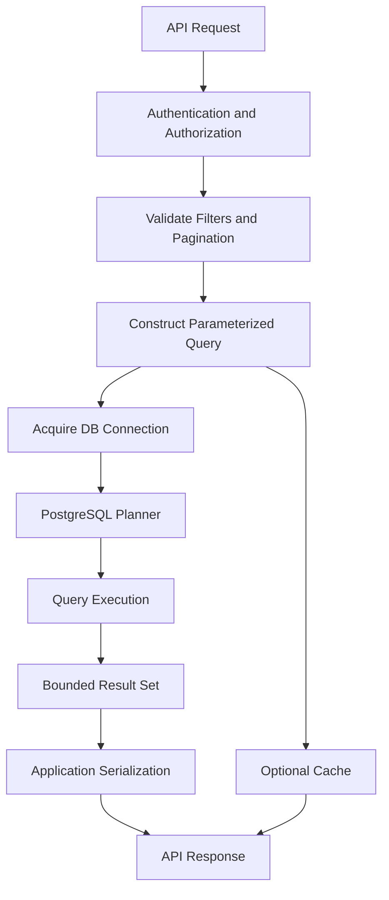

# 20- Backend API Query Exercises

## Overview

Backend APIs are often thin orchestration layers around database queries. A request enters through an HTTP or gRPC interface, authorization and validation are applied, the application constructs a query, PostgreSQL executes it, and the result is transformed into an API response.

The quality of the API therefore depends heavily on query design.

These exercises focus on the SQL decisions behind realistic backend endpoints:

- Filtering and authorization.
- Joins and relationship loading.
- Aggregation and reporting.
- Pagination.
- Sorting and search.
- Transactions and concurrency.
- Index-aware query design.
- ORM-generated SQL.
- Caching and read replicas.
- Large datasets and asynchronous processing.
- Security and multi-tenancy.
- Query performance and observability.

The objective is not simply to write SQL that returns the expected rows. The objective is to design queries that remain **correct, secure, observable, and efficient under production workloads**.

---

## Practice Schema

Use the following PostgreSQL schema throughout the exercises.

```sql
CREATE TABLE tenants (
    id bigint GENERATED ALWAYS AS IDENTITY PRIMARY KEY,
    name text NOT NULL,
    created_at timestamptz NOT NULL DEFAULT now()
);

CREATE TABLE customers (
    id bigint GENERATED ALWAYS AS IDENTITY PRIMARY KEY,
    tenant_id bigint NOT NULL REFERENCES tenants(id),
    email text NOT NULL,
    name text NOT NULL,
    status text NOT NULL,
    created_at timestamptz NOT NULL DEFAULT now(),
    updated_at timestamptz NOT NULL DEFAULT now(),
    deleted_at timestamptz,
    UNIQUE (tenant_id, email)
);

CREATE TABLE products (
    id bigint GENERATED ALWAYS AS IDENTITY PRIMARY KEY,
    tenant_id bigint NOT NULL REFERENCES tenants(id),
    name text NOT NULL,
    price numeric(12, 2) NOT NULL,
    active boolean NOT NULL DEFAULT true,
    created_at timestamptz NOT NULL DEFAULT now()
);

CREATE TABLE orders (
    id bigint GENERATED ALWAYS AS IDENTITY PRIMARY KEY,
    tenant_id bigint NOT NULL REFERENCES tenants(id),
    customer_id bigint NOT NULL REFERENCES customers(id),
    status text NOT NULL,
    total_amount numeric(12, 2) NOT NULL,
    created_at timestamptz NOT NULL DEFAULT now(),
    updated_at timestamptz NOT NULL DEFAULT now()
);

CREATE TABLE order_items (
    id bigint GENERATED ALWAYS AS IDENTITY PRIMARY KEY,
    order_id bigint NOT NULL REFERENCES orders(id),
    product_id bigint NOT NULL REFERENCES products(id),
    quantity integer NOT NULL CHECK (quantity > 0),
    unit_price numeric(12, 2) NOT NULL
);

CREATE TABLE payments (
    id bigint GENERATED ALWAYS AS IDENTITY PRIMARY KEY,
    order_id bigint NOT NULL REFERENCES orders(id),
    status text NOT NULL,
    amount numeric(12, 2) NOT NULL,
    created_at timestamptz NOT NULL DEFAULT now()
);

CREATE TABLE shipments (
    id bigint GENERATED ALWAYS AS IDENTITY PRIMARY KEY,
    order_id bigint NOT NULL REFERENCES orders(id),
    status text NOT NULL,
    tracking_number text,
    shipped_at timestamptz,
    delivered_at timestamptz
);

CREATE INDEX customers_tenant_created_idx
    ON customers (tenant_id, created_at DESC, id DESC);

CREATE INDEX customers_tenant_status_idx
    ON customers (tenant_id, status);

CREATE INDEX orders_tenant_created_idx
    ON orders (tenant_id, created_at DESC, id DESC);

CREATE INDEX orders_customer_created_idx
    ON orders (customer_id, created_at DESC, id DESC);

CREATE INDEX orders_tenant_status_created_idx
    ON orders (tenant_id, status, created_at DESC, id DESC);

CREATE INDEX order_items_order_idx
    ON order_items (order_id);

CREATE INDEX order_items_product_idx
    ON order_items (product_id);

CREATE INDEX payments_order_created_idx
    ON payments (order_id, created_at DESC);

CREATE INDEX shipments_order_idx
    ON shipments (order_id);
```

For production exercises, assume:

```text
tenants:        10,000
customers:      100,000,000
orders:         500,000,000
order_items:    2,000,000,000
payments:       600,000,000
```

---

## API Query Design Principles

Before solving the exercises, apply these rules:

| Principle | Practical implication |
|---|---|
| Authorization is part of the query boundary | Never fetch unauthorized rows and filter them in Python |
| Result grain must be explicit | A page of orders should not accidentally become a page of order items |
| Parameterize values | Never interpolate user-controlled values into SQL |
| Select only required columns | Avoid `SELECT *` for API responses |
| Make ordering deterministic | Add a unique tie-breaker when pagination requires stability |
| Design indexes around access patterns | Index filters, joins, and ordering together |
| Measure query behavior | Use `EXPLAIN (ANALYZE, BUFFERS)` for representative workloads |
| Bound resource usage | Limit page sizes, result sizes, execution time, and concurrency |
| Keep transactions focused | Do not hold database transactions across slow external operations |
| Treat ORM SQL as real SQL | Inspect generated SQL and understand its execution plan |

---

## Exercise: Simple Resource Endpoint

Design:

```http
GET /orders/{order_id}
```

### Tasks

Write the SQL query that retrieves:

```text
id
customer_id
status
total_amount
created_at
```

for a specific order.

Then modify the query for a multi-tenant API where the request contains:

```text
tenant_id
order_id
```

Explain why the query should include both:

```sql
WHERE tenant_id = $1
  AND id = $2
```

even if `id` is globally unique.

---

## Exercise: List Endpoint

Design:

```http
GET /orders
```

Return:

```text
id
status
total_amount
created_at
```

### Tasks

Write the query for:

```text
latest orders first
maximum 50 rows
```

Define a deterministic ordering.

Then explain what should happen if the client does not specify a page size.

---

## Exercise: API Filtering

The endpoint supports:

```text
status
minimum_amount
maximum_amount
```

### Tasks

Design a parameterized query.

Support combinations such as:

```text
status only
status + minimum amount
minimum + maximum amount
all filters
```

Avoid constructing separate unsafe SQL strings for every combination.

Explain how optional filters should be represented at the application layer.

---

## Exercise: Dynamic Filter Construction

A Python API receives:

```python
filters = {
    "status": "pending",
    "minimum_amount": 100,
}
```

### Tasks

Design a safe query-building strategy.

Distinguish between:

```text
SQL values
```

and:

```text
SQL identifiers/operators
```

Explain why parameterized queries protect values but do not automatically make arbitrary SQL structure safe.

---

## Exercise: Customer Lookup

Design:

```http
GET /customers?email=user@example.com
```

### Tasks

Write the query.

Determine whether the application should use:

```sql
=
```

or:

```sql
ILIKE
```

for an exact email lookup.

Explain how the database constraint:

```sql
UNIQUE (tenant_id, email)
```

affects query correctness.

---

## Exercise: Case-Insensitive Search

The API supports:

```http
GET /customers?search=aranya
```

### Tasks

Design a search query.

Compare:

```sql
WHERE name ILIKE '%aranya%'
```

with PostgreSQL full-text search and trigram-based search.

Determine what index strategy would be appropriate for a high-volume search endpoint.

---

## Exercise: Soft-Deleted Records

The API should return only active customers.

### Tasks

Write:

```sql
WHERE deleted_at IS NULL
```

into the query.

Then evaluate:

```sql
CREATE INDEX customers_active_idx
ON customers (tenant_id, created_at DESC, id DESC)
WHERE deleted_at IS NULL;
```

Explain when a partial index is useful.

---

## Exercise: Authorization Boundary

A user belongs to:

```text
tenant_id = 42
```

The API receives:

```text
customer_id = 100
```

### Tasks

Write the query that safely retrieves the customer.

Explain why this is unsafe:

```text
SELECT customer
WHERE customer_id = request.customer_id

then verify tenant in Python
```

Discuss the security implications of authorization being separated from the database filter.

---

## Exercise: Customer Orders

Design:

```http
GET /customers/{customer_id}/orders
```

### Requirements

Return:

```text
order id
status
amount
created_at
```

### Tasks

Write the query.

Ensure:

```text
tenant isolation
customer ownership
deterministic ordering
bounded results
```

Explain why both tenant and customer constraints should be applied in SQL.

---

## Exercise: Order Details Endpoint

Design:

```http
GET /orders/{order_id}
```

The response must include:

```text
order
customer
payment status
shipment status
```

### Tasks

Determine whether the query should use:

```text
multiple queries
```

or:

```text
one large JOIN
```

Compare the approaches based on:

- Cardinality.
- Number of related records.
- Query complexity.
- API latency.
- Result duplication.

---

## Exercise: One-to-One Relationship Loading

An order has at most one current shipment.

### Tasks

Design a query that returns:

```text
order
shipment.status
shipment.tracking_number
```

Explain why a join is generally appropriate when the relationship is one-to-one or many-to-one.

---

## Exercise: One-to-Many Relationship Loading

An order can contain many items.

### Tasks

Design an API response:

```json
{
  "id": 100,
  "status": "shipped",
  "items": []
}
```

Compare:

```text
JOIN
```

with:

```text
separate batched query
```

and:

```text
JSON aggregation
```

Explain how a one-to-many join changes result cardinality.

---

## Exercise: Avoiding N+1 Queries

A Django endpoint returns 50 orders.

For every order it accesses:

```python
order.customer.email
```

### Tasks

Determine the number of queries without optimization.

Then design the ORM query using:

```python
select_related()
```

Explain why pagination does not automatically eliminate N+1 behavior.

---

## Exercise: Nested API Response

The API returns:

```json
{
  "id": 100,
  "customer": {
    "id": 42,
    "email": "user@example.com"
  },
  "items": [
    {
      "product_id": 10,
      "quantity": 2
    }
  ]
}
```

### Tasks

Design a query strategy.

Determine which relationships should use:

```text
JOIN
```

and which should use:

```text
batch loading
```

Explain why trying to construct an arbitrarily deep nested API response using one SQL query can become counterproductive.

---

## Exercise: Filtering by Related Records

Find orders containing product `100`.

### Tasks

Write the query using:

```sql
EXISTS
```

Then write an equivalent query using:

```text
JOIN
```

Compare the semantics.

Determine which query is preferable when the API only needs to know whether the relationship exists.

---

## Exercise: Filtering by Multiple Related Records

Find customers who have:

```text
at least one completed order
```

and:

```text
at least one failed payment
```

### Tasks

Design the query.

Avoid accidentally requiring the same joined row to satisfy both unrelated conditions.

Consider:

```text
EXISTS
```

subqueries.

---

## Exercise: Aggregated Customer Endpoint

Design:

```http
GET /customers/{customer_id}/statistics
```

Return:

```text
order_count
total_spent
last_order_at
```

### Tasks

Write the aggregation query.

Handle customers with no orders correctly.

Consider:

```text
COUNT
SUM
MAX
COALESCE
```

Explain the behavior of `SUM` when no matching rows exist.

---

## Exercise: Customer List with Aggregates

Design:

```http
GET /customers
```

Return:

```text
customer id
name
order count
lifetime value
```

### Tasks

Write an aggregation query.

Determine the correct result grain:

```text
one row per customer
```

Explain how a `LEFT JOIN` differs from an `INNER JOIN` for customers with no orders.

---

## Exercise: Avoiding Double Counting

Suppose an order has:

```text
5 items
2 payments
```

A query joins both tables.

### Tasks

Explain why:

```text
5 × 2 = 10
```

joined rows can cause incorrect aggregation.

Design a safer query strategy.

Consider:

```text
pre-aggregation
```

or:

```text
separate correlated aggregates
```

or:

```text
EXISTS
```

depending on the requirement.

---

## Exercise: Latest Related Record

An order can have multiple payment attempts.

### Tasks

Return the latest payment status for each order.

Compare approaches using:

- `DISTINCT ON`.
- Window functions.
- `LATERAL`.
- Aggregation.

Determine which approach is clearest for PostgreSQL.

---

## Exercise: API Sort Parameter

The endpoint accepts:

```http
GET /orders?sort=created_at
```

Supported values:

```text
created_at
total_amount
status
```

### Tasks

Design a safe allowlist.

Explain why this is unsafe:

```python
sql = f"ORDER BY {request.query_params['sort']}"
```

Determine how dynamic sorting affects index design.

---

## Exercise: Sort Direction

The endpoint supports:

```text
sort=created_at
direction=asc
```

and:

```text
direction=desc
```

### Tasks

Design safe SQL generation.

Explain why the direction cannot simply be treated like an ordinary value parameter in every SQL dialect.

Use an application-level allowlist for:

```text
ASC
DESC
```

---

## Exercise: Pagination Contract

Design:

```http
GET /orders?limit=50&after=<cursor>
```

### Tasks

Define:

```text
limit
after
next_cursor
has_next
```

Specify the maximum page size.

Explain why the cursor should be opaque to clients.

---

## Exercise: Offset Pagination

Implement:

```http
GET /orders?page=5&page_size=50
```

### Tasks

Write the SQL.

Then calculate:

```text
OFFSET = (page - 1) * page_size
```

Analyze the query at:

```text
page 1
page 100
page 10,000
page 100,000
```

Determine when offset pagination becomes operationally problematic.

---

## Exercise: Keyset Pagination

Implement cursor pagination using:

```text
created_at
id
```

### Tasks

Write the first-page query.

Then write the next-page query using:

```sql
WHERE (created_at, id) < ($1, $2)
ORDER BY created_at DESC, id DESC
LIMIT 50;
```

Explain why `id` is needed as a tie-breaker.

---

## Exercise: Tenant-Aware Cursor Pagination

Design keyset pagination for:

```text
tenant_id
created_at
id
```

### Tasks

Write the query:

```text
tenant filter
+
cursor boundary
+
deterministic ordering
```

Design the index:

```text
(tenant_id, created_at DESC, id DESC)
```

Explain why tenant isolation and cursor traversal must be designed together.

---

## Exercise: Pagination with Mutable Data

New orders are continuously inserted.

### Tasks

Compare:

```text
OFFSET
```

and:

```text
keyset pagination
```

when new rows appear between requests.

Explain:

- Duplicate rows.
- Missing rows.
- Cursor movement.
- Snapshot consistency.

State explicitly what guarantees your API provides.

---

## Exercise: Read Replica Pagination

The application reads orders from multiple PostgreSQL replicas.

### Tasks

Analyze this sequence:

```text
page 1 → replica A
page 2 → replica B
```

Consider different replication positions.

Identify possible correctness problems.

Design a replica-routing strategy.

---

## Exercise: Read-After-Write

A client creates an order and immediately calls:

```http
GET /orders
```

The GET request is routed to a replica.

### Tasks

Explain why the newly created order may not appear.

Design a strategy using:

```text
primary routing
```

or:

```text
session/request consistency
```

Explain why Redis caching does not automatically solve replica lag.

---

## Exercise: Exact Count

The API wants:

```json
{
  "items": [],
  "total": 500000000
}
```

### Tasks

Determine whether:

```sql
COUNT(*)
```

should run on every request.

Consider:

- Table size.
- Filters.
- Indexes.
- Request rate.
- p99 latency.
- Connection occupancy.
- Product requirements.

Design alternatives if an exact count is unnecessary.

---

## Exercise: Search and Pagination

Design:

```http
GET /orders?search=customer-name&limit=50
```

### Tasks

Determine how search interacts with:

```text
ORDER BY
LIMIT
cursor
```

Explain why search ranking can make cursor pagination more complicated.

Consider:

```text
full-text search
```

and:

```text
trigram search
```

where appropriate.

---

## Exercise: Date Range Filtering

Design:

```http
GET /orders?from=2026-01-01&to=2026-02-01
```

### Tasks

Write a parameterized query.

Prefer a half-open interval:

```text
[from, to)
```

Explain why this can be safer than:

```text
23:59:59
```

when working with timestamps and precision.

---

## Exercise: Timezone-Aware API

The API accepts:

```text
2026-09-05T10:00:00+05:30
```

### Tasks

Determine how the backend should normalize timestamps before querying PostgreSQL.

Explain why storing timestamps as:

```text
timestamptz
```

is generally preferable for event times.

Consider:

- UTC.
- User timezone.
- DST.
- Serialization.

---

## Exercise: Conditional API Filters

The endpoint supports:

```text
status
customer_id
min_amount
max_amount
created_after
created_before
```

### Tasks

Build a query supporting any combination.

Avoid patterns that unnecessarily prevent index usage.

Compare:

```sql
WHERE ($1 IS NULL OR status = $1)
```

with dynamically constructing only the required predicates.

Discuss how query shape and plan selection can differ.

---

## Exercise: Query Plan Investigation

Run:

```sql
EXPLAIN (ANALYZE, BUFFERS)
SELECT id, status, total_amount, created_at
FROM orders
WHERE tenant_id = $1
  AND status = $2
ORDER BY created_at DESC, id DESC
LIMIT 50;
```

### Tasks

Identify:

- Access path.
- Estimated rows.
- Actual rows.
- Planning time.
- Execution time.
- Buffer reads.
- Sort operations.

Determine whether:

```text
(tenant_id, status, created_at DESC, id DESC)
```

is appropriate.

---

## Exercise: Missing Index Diagnosis

An API endpoint is slow:

```text
GET /customers/{customer_id}/orders
```

The query is:

```sql
SELECT id, status, total_amount, created_at
FROM orders
WHERE customer_id = $1
ORDER BY created_at DESC, id DESC
LIMIT 50;
```

### Tasks

Inspect the existing indexes.

Determine whether:

```text
(customer_id)
```

is sufficient.

Compare it with:

```text
(customer_id, created_at DESC, id DESC)
```

Explain why an index should match both filtering and ordering when possible.

---

## Exercise: Covering Index

The API returns:

```text
id
status
total_amount
created_at
```

and filters by:

```text
customer_id
```

### Tasks

Evaluate:

```sql
CREATE INDEX orders_customer_api_idx
ON orders (customer_id, created_at DESC, id DESC)
INCLUDE (status, total_amount);
```

Determine when this may enable an index-only scan.

Discuss:

- Index size.
- Visibility map.
- Write amplification.
- Query frequency.

---

## Exercise: ORM Query Inspection

A Django developer writes:

```python
Order.objects.filter(
    tenant_id=tenant_id,
    status="pending",
).order_by("-created_at", "-id")[:50]
```

### Tasks

Determine the approximate SQL generated.

Inspect:

```python
print(queryset.query)
```

Then use database-level execution-plan tools to evaluate the query.

Explain why ORM code should not be optimized independently of the generated SQL.

---

## Exercise: Django `select_related`

The endpoint returns:

```text
order
customer email
```

### Tasks

Compare:

```python
Order.objects.all()
```

with:

```python
Order.objects.select_related("customer")
```

Determine how query count changes.

Explain why `select_related` is appropriate for many-to-one and one-to-one relationships.

---

## Exercise: Django `prefetch_related`

The endpoint returns:

```text
orders
+
order_items
```

### Tasks

Determine whether:

```python
select_related("order_items")
```

is appropriate.

Design the correct ORM strategy using:

```python
prefetch_related()
```

Explain why collection relationships can multiply SQL result rows when represented as joins.

---

## Exercise: SQLAlchemy Query Construction

A FastAPI endpoint uses SQLAlchemy.

### Tasks

Design a query equivalent to:

```sql
SELECT id, status, total_amount, created_at
FROM orders
WHERE tenant_id = :tenant_id
ORDER BY created_at DESC, id DESC
LIMIT :limit;
```

Ensure:

- Parameter binding.
- Maximum page size.
- Stable ordering.
- Minimal selected columns.

---

## Exercise: Async API Does Not Mean Async Database Work Is Cheap

A FastAPI endpoint uses asynchronous SQLAlchemy.

### Tasks

Analyze:

```text
async HTTP handler
→ async DB driver
→ PostgreSQL
```

Explain why asynchronous application code does not make:

```text
bad indexes
large joins
deep OFFSET
expensive aggregation
```

automatically efficient.

Discuss connection-pool occupancy and database concurrency.

---

## Exercise: Query Timeout

A backend endpoint occasionally runs for:

```text
30 seconds
```

### Tasks

Design timeout layers for:

```text
HTTP request
application
connection acquisition
database statement
```

Explain why a database query timeout should not necessarily equal the HTTP request timeout.

Discuss what happens when a statement is cancelled.

---

## Exercise: Connection Pool Pressure

Suppose:

```text
30 Kubernetes pods
10 database connections/pod
```

An endpoint performs:

```text
count query
+
page query
+
three relationship queries
```

### Tasks

Estimate the number of database round trips per request.

Explain how this affects:

- Connection occupancy.
- Database CPU.
- Pool exhaustion.
- p99 latency.

Redesign the endpoint to reduce unnecessary database work.

---

## Exercise: Transactional API

Design:

```http
POST /orders
```

The request must:

```text
create order
create order items
create payment record
```

### Tasks

Determine the transaction boundary.

Explain why all database mutations representing one business invariant should normally be committed atomically.

Discuss what should happen if:

```text
payment gateway
```

must also be called.

---

## Exercise: External API Inside Transaction

A request performs:

```text
BEGIN
→ insert order
→ call payment provider
→ update order
→ COMMIT
```

### Tasks

Identify the risks.

Consider:

- Long transactions.
- Locks.
- Connection occupancy.
- External latency.
- Network failures.
- Commit uncertainty.

Redesign using an appropriate asynchronous or outbox-based architecture.

---

## Exercise: Idempotent POST Endpoint

Clients may retry:

```http
POST /orders
```

because of network failures.

### Tasks

Design an idempotency mechanism.

Consider:

```text
idempotency_key
```

and a database uniqueness constraint.

Explain why application-only duplicate checking is vulnerable to concurrent requests.

---

## Exercise: Atomic Update

An API increments a customer's credit balance.

Unsafe approach:

```text
SELECT balance
→ Python adds amount
→ UPDATE balance
```

### Tasks

Replace it with an atomic SQL update.

Explain the concurrency problem in the original approach.

Determine when an explicit row lock is necessary and when an atomic update is sufficient.

---

## Exercise: Optimistic Concurrency

An API updates an order.

The client provides:

```text
version = 7
```

### Tasks

Design:

```sql
UPDATE orders
SET status = $1,
    updated_at = now()
WHERE id = $2
  AND version = $3;
```

Add a version increment.

Explain how the application detects:

```text
zero rows updated
```

and distinguishes a concurrency conflict from a missing record.

---

## Exercise: Pessimistic Concurrency

Two workers process the same pending order.

### Tasks

Design a transaction using:

```sql
SELECT ...
FOR UPDATE;
```

Explain:

- What is locked.
- When the lock is released.
- What happens to concurrent workers.
- Why the transaction must remain short.

---

## Exercise: Queue Consumption

A `pending_jobs` table contains:

```text
id
status
created_at
```

### Tasks

Design a worker query using:

```sql
FOR UPDATE SKIP LOCKED
```

Explain why this is different from ordinary pagination.

Determine how multiple workers can claim different jobs concurrently.

---

## Exercise: Deadlock Prevention

Two API requests update:

```text
customer
order
```

in different orders.

### Tasks

Construct a deadlock scenario.

Then establish a consistent lock ordering.

Explain why retrying deadlocks without fixing the underlying lock-ordering problem is insufficient.

---

## Exercise: Transaction Failure

A transaction executes:

```sql
INSERT INTO orders (...);

INSERT INTO order_items (...);

INSERT INTO payments (...);
```

The second statement violates a constraint.

### Tasks

Determine the transaction state.

Explain why subsequent statements may fail until the transaction is rolled back or the error is isolated with a savepoint.

Discuss how Django's:

```python
transaction.atomic()
```

handles transaction boundaries and savepoints.

---

## Exercise: Backend Query with RLS

PostgreSQL Row Level Security restricts access by:

```text
tenant_id
```

### Tasks

Design an API query that still explicitly filters by tenant.

Explain why RLS is a defense-in-depth mechanism rather than a reason to ignore tenant-aware query design.

Discuss:

- Connection pooling.
- Transaction-scoped tenant context.
- `SET LOCAL`.
- Role privileges.

---

## Exercise: RLS and Connection Pooling

An application sets:

```sql
SET app.tenant_id = '42';
```

on a pooled connection.

### Tasks

Explain how tenant context can leak between requests if session state is not reset.

Redesign using:

```sql
SET LOCAL
```

inside an explicit transaction.

Explain why transaction-scoped context is safer for pooled applications.

---

## Exercise: Dynamic SQL Security

An admin API supports:

```text
table
column
operator
value
```

### Tasks

Classify each input as:

```text
value
identifier
SQL structure
```

Determine which inputs can use parameters.

Design allowlists for:

```text
table
column
operator
```

Explain why parameterization alone does not secure arbitrary identifiers.

---

## Exercise: SQL Injection Review

Review:

```python
query = f"""
SELECT id, email
FROM customers
WHERE email = '{email}'
"""
```

### Tasks

Identify the vulnerability.

Rewrite the query using parameter binding.

Then identify a second vulnerability in:

```python
query = f"""
SELECT id, email
FROM customers
ORDER BY {sort_column}
"""
```

Explain why the second case requires identifier allowlisting rather than ordinary value parameterization.

---

## Exercise: Large Result Sets

An endpoint returns:

```text
50,000 records
```

each containing:

```text
large JSONB payload
```

### Tasks

Identify the performance problems.

Consider:

- PostgreSQL memory.
- Network bandwidth.
- Application memory.
- JSON serialization.
- HTTP response size.
- Client processing time.

Redesign the endpoint.

---

## Exercise: Bulk Export

A customer wants:

```text
10 million orders
```

### Tasks

Determine whether the API should synchronously return all records.

Design:

```text
POST /exports
        ↓
Celery
        ↓
PostgreSQL
        ↓
object storage
        ↓
signed download URL
```

Define how the export job should paginate through database rows.

---

## Exercise: Keyset Batch Processing

A Celery worker processes orders in batches.

### Tasks

Use:

```sql
WHERE id > $1
ORDER BY id
LIMIT 1000;
```

Explain why this is preferable to repeatedly using:

```sql
OFFSET
```

for very large tables.

Discuss:

- Progress checkpoints.
- Idempotency.
- Retries.
- Worker crashes.
- Duplicate processing.

---

## Exercise: API Caching

The first page of:

```http
GET /products
```

is highly popular.

### Tasks

Design a Redis cache key.

Include:

```text
tenant
filters
sort
page size
```

Determine whether the cursor should be part of the key.

Discuss:

- TTL.
- Stale data.
- Invalidation.
- Cache stampede.
- Authorization.

---

## Exercise: Cache and Authorization

A public cache stores:

```text
customers:page:1
```

### Tasks

Determine whether this is safe for tenant-specific customer data.

Identify the information that must be part of the cache key.

Explain why authorization context cannot be ignored when caching database query results.

---

## Exercise: Cache Stampede

A popular endpoint's Redis entry expires.

At the same moment:

```text
5,000 requests
```

arrive.

### Tasks

Design a strategy using:

```text
request coalescing
```

or:

```text
distributed locking
```

Explain why simply allowing all requests to hit PostgreSQL can create a database overload.

---

## Exercise: Read Model

An API frequently returns:

```text
customer
order_count
lifetime_value
last_order_at
latest_order_status
```

### Tasks

Determine whether these values should be calculated from normalized tables on every request.

Consider:

```text
materialized view
denormalized columns
read model
event-driven projection
```

Choose an architecture for:

```text
high read volume
moderate freshness requirements
```

---

## Exercise: Kafka-Backed Read Model

Orders are created through a transactional service.

The API needs a read-optimized customer dashboard.

### Tasks

Design:

```text
orders service
→ transactional outbox
→ Kafka
→ projection consumer
→ read model
→ API
```

Explain:

- Event ordering.
- Idempotent consumers.
- Replay.
- Projection lag.
- Eventual consistency.

Determine whether the API should read the transactional database or read model.

---

## Exercise: Microservice Database Ownership

Suppose:

```text
Order Service
Customer Service
Payment Service
```

each owns its database.

### Tasks

Design an API that needs:

```text
order
customer email
payment status
```

Explain why a direct SQL join across service databases is generally undesirable.

Compare:

```text
API composition
```

with:

```text
read model
```

and:

```text
synchronous service calls
```

---

## Exercise: API Composition

An API gateway receives:

```http
GET /order-summary/100
```

It needs data from:

```text
Order Service
Customer Service
Payment Service
```

### Tasks

Design the request flow.

Identify risks involving:

- Network latency.
- Partial failures.
- Timeouts.
- Retry storms.
- N+1 service calls.
- Inconsistent snapshots.

Determine when a dedicated read model would be preferable.

---

## Exercise: gRPC Backend Query

An internal gRPC service exposes:

```text
GetCustomerOrders
```

### Tasks

Design the database query behind the RPC.

Ensure the service handles:

```text
tenant authorization
customer authorization
pagination
timeouts
bounded result size
```

Explain why gRPC does not remove the need for careful database query design.

---

## Exercise: API Filtering and Index Selection

An endpoint supports:

```text
tenant_id
status
customer_id
created_after
```

### Tasks

List likely query patterns.

Determine whether one index can efficiently support every combination.

Explain why attempting to create one enormous composite index for every possible API filter is usually a poor strategy.

Design a small set of indexes based on observed workload patterns.

---

## Exercise: Partial Index for API Workload

The API mostly returns:

```text
pending orders
```

and pending orders represent:

```text
2%
```

of all orders.

### Tasks

Evaluate:

```sql
CREATE INDEX orders_pending_api_idx
ON orders (tenant_id, created_at DESC, id DESC)
WHERE status = 'pending';
```

Explain:

- Why the index may be small.
- Why it can improve reads.
- How status transitions affect writes.
- When it may stop being worthwhile.

---

## Exercise: Partitioned Orders

Orders are partitioned by:

```text
created_at
```

### Tasks

Design a date-filtered API query.

Explain how partition pruning can reduce the amount of data considered.

Discuss why partitioning does not eliminate the need for appropriate indexes inside partitions.

---

## Exercise: Query Against a Large Partitioned Table

The API requests:

```text
orders from the last 24 hours
```

### Tasks

Design the query.

Use:

```text
created_at >= $1
```

rather than retrieving all partitions and filtering in Python.

Explain how partition boundaries and indexes affect execution.

---

## Exercise: Database CPU Incident

A production endpoint's database CPU reaches:

```text
95%
```

### Tasks

Investigate systematically.

Inspect:

```text
pg_stat_activity
pg_stat_statements
EXPLAIN (ANALYZE, BUFFERS)
```

Consider:

- Query frequency.
- N+1 behavior.
- Missing indexes.
- Large scans.
- Expensive joins.
- Retry storms.
- Background workers.

Explain why adding database CPU without identifying the workload may only postpone the incident.

---

## Exercise: High Database Memory

A PostgreSQL instance shows high memory utilization.

### Tasks

Determine whether the issue is:

```text
shared_buffers
work_mem
maintenance_work_mem
connection count
large query results
sort/hash operations
long transactions
```

Explain why:

```text
work_mem × connections
```

is not necessarily a safe way to estimate total memory consumption, but why per-operation memory can still multiply dramatically under concurrency.

---

## Exercise: Connection Pool Problem

An API starts returning:

```text
connection pool timeout
```

### Tasks

Determine whether the root cause is:

```text
too-small pool
```

or:

```text
slow queries
```

or:

```text
long transactions
```

or:

```text
connection leaks
```

or:

```text
database saturation
```

Design an investigation using:

```text
application pool metrics
pg_stat_activity
query latency
lock waits
database CPU
```

---

## Exercise: Slow Endpoint Investigation

An endpoint has:

```text
p50 = 80 ms
p95 = 1.5 s
p99 = 8 s
```

### Tasks

Design a diagnostic process.

Separate:

```text
database execution time
```

from:

```text
connection acquisition
lock wait
network time
application processing
serialization
```

Explain why optimizing only the average query duration may not solve the p99 problem.

---

## Exercise: Lock Contention

An API updates the same customer record frequently.

### Tasks

Investigate:

```sql
pg_stat_activity
pg_locks
pg_blocking_pids(...)
```

Identify:

```text
blocking transaction
blocked transaction
lock duration
transaction age
```

Design alternatives to reduce contention.

Consider:

- Atomic updates.
- Queue serialization.
- Optimistic concurrency.
- Sharded counters.
- Shorter transactions.

---

## Exercise: Query Cancellation

A client disconnects while PostgreSQL is still executing a large query.

### Tasks

Explain the importance of propagating cancellation.

Determine what can happen if:

```text
HTTP request ends
```

but:

```text
database query continues
```

Consider:

- Connection occupancy.
- Database CPU.
- Long-running queries.
- Pool exhaustion.

---

## Exercise: Observability Correlation

An API request has:

```text
request_id = abc123
```

### Tasks

Design a strategy for correlating:

```text
Nginx logs
→ application logs
→ SQL logs
→ PostgreSQL activity
→ background jobs
```

Consider setting PostgreSQL:

```sql
application_name
```

appropriately.

Explain why database observability should allow engineers to connect a slow SQL operation back to the originating API workload.

---

## Exercise: Production Query Logging

An application logs:

```text
SQL query
parameters
execution time
```

### Tasks

Determine what should and should not be logged.

Consider:

- Passwords.
- Tokens.
- Personal data.
- Payment information.
- Large JSON payloads.
- Query fingerprints.

Design a secure structured logging strategy.

---

## Exercise: Query Plan Regression

A query historically runs in:

```text
30 ms
```

After a large data growth event it runs in:

```text
2 seconds
```

### Tasks

Investigate:

- Cardinality estimates.
- Statistics.
- Data distribution.
- Index usage.
- Query plan changes.
- Table growth.
- Partition pruning.

Explain why an index that was effective at one data volume may not produce the same plan later.

---

## Exercise: Generic vs Custom Plans

A parameterized query performs well for most tenants but poorly for one extremely large tenant.

### Tasks

Explain how parameter-sensitive data distributions can affect plan selection.

Investigate:

```text
custom plans
generic plans
```

and PostgreSQL planning behavior.

Determine whether query structure, statistics, partitioning, or tenant-specific architecture should be changed before relying on planner configuration.

---

## Exercise: Multi-Tenant Query Design

Tenants vary dramatically:

```text
small tenant:       100 orders
medium tenant:      1 million orders
large tenant:       100 million orders
```

### Tasks

Design a query strategy that remains efficient across tenant sizes.

Consider:

- Tenant-aware indexes.
- Partitioning.
- Sharding.
- Query limits.
- Rate limiting.
- Large-tenant isolation.
- Replica routing.

Explain why average tenant size can hide severe production outliers.

---

## Exercise: Large Tenant Query

A large tenant requests:

```text
all orders
```

### Tasks

Determine why:

```http
GET /orders
```

should not attempt to return the entire dataset.

Design:

```text
pagination
```

and:

```text
asynchronous export
```

options.

Explain how product requirements influence database architecture.

---

## Exercise: Security Review

Review:

```text
GET /orders?customer_id=123
```

### Tasks

Identify all security checks required before executing the query.

Consider:

- Authentication.
- Tenant membership.
- Resource ownership.
- Role permissions.
- RLS.
- Parameterization.
- Rate limiting.
- Audit logging.

Explain why SQL correctness alone does not guarantee API security.

---

## Exercise: Backend Query Threat Model

For a public API, identify threats involving:

```text
query parameters
pagination
sorting
search
filters
large result sets
repeated requests
```

### Tasks

Map each threat to a mitigation.

| Threat | Possible mitigation |
|---|---|
| SQL injection | Parameter binding |
| Dynamic SQL injection | Allowlisting |
| Deep pagination abuse | Cursor pagination / depth limits |
| Huge result sets | Page-size limits |
| Expensive search | Search indexes / rate limits |
| Tenant data exposure | Authorization + tenant predicates + RLS where appropriate |
| Database overload | Rate limiting + caching + backpressure |
| Credential exposure | Secret management |

Expand the table with additional threats.

---

## Exercise: API Query Load Test

Design a load test for:

```http
GET /orders?limit=50&after=<cursor>
```

### Requirements

Test:

```text
100 RPS
500 RPS
1,000 RPS
5,000 RPS
```

### Tasks

Measure:

- API p50.
- API p95.
- API p99.
- Database CPU.
- Database I/O.
- Query execution time.
- Connection-pool wait.
- Replica lag.
- Cache hit rate.
- Error rate.

Determine the sustainable operating point rather than only the maximum throughput.

---

## Exercise: Query Benchmarking

Compare:

```sql
SELECT *
FROM orders
ORDER BY created_at DESC
LIMIT 50 OFFSET 1000000;
```

with:

```sql
SELECT id, status, total_amount, created_at
FROM orders
WHERE (created_at, id) < ($1, $2)
ORDER BY created_at DESC, id DESC
LIMIT 50;
```

### Tasks

Use:

```sql
EXPLAIN (ANALYZE, BUFFERS)
```

Compare:

```text
rows processed
execution time
buffer reads
index usage
```

Explain why benchmarking should use production-like:

```text
row counts
data distributions
concurrency
cache state
```

---

## Exercise: Query Review

Review:

```sql
SELECT *
FROM orders o
JOIN customers c
    ON c.id = o.customer_id
JOIN order_items oi
    ON oi.order_id = o.id
WHERE c.email ILIKE '%example%'
ORDER BY o.created_at DESC
LIMIT 100;
```

### Tasks

Identify at least 10 potential problems.

Consider:

- Result grain.
- One-to-many multiplication.
- Search performance.
- Tenant filtering.
- Result width.
- Ordering.
- Indexing.
- Pagination.
- Authorization.
- Query frequency.

Redesign the query for a production API.

---

## Exercise: API Query Refactoring

An endpoint currently performs:

```text
1. SELECT customer
2. SELECT orders
3. SELECT customer for every order
4. SELECT items for every order
5. SELECT payment for every order
6. SELECT shipment for every order
```

### Tasks

Identify the N+1 patterns.

Redesign using:

```text
select_related
prefetch_related
batch queries
aggregation
```

where appropriate.

Explain why reducing query count does not automatically mean the final query shape is optimal.

---

## Exercise: Backend Query Architecture

Design the complete request path:

```text
Client
→ Nginx / Load Balancer
→ Django / FastAPI
→ authorization
→ validation
→ service layer
→ ORM / SQL
→ connection pool
→ PostgreSQL
→ Redis
→ response
```

### Tasks

Identify where each concern belongs:

| Concern | Layer |
|---|---|
| Authentication | API/security layer |
| Authorization | API/service + database where appropriate |
| SQL parameterization | DB access layer |
| Business invariants | Service + database constraints |
| Query optimization | Database + application |
| Caching | Application/infrastructure |
| Pagination contract | API layer |
| Transactions | Service/database boundary |
| Observability | Cross-cutting |

Explain why no single layer should be expected to solve every concern.

---

## Exercise: Read/Write Separation

A production system has:

```text
90% reads
10% writes
```

### Tasks

Design:

```text
primary
+
read replicas
+
connection pools
```

Determine which API operations can safely use replicas.

Consider:

- Read-after-write.
- Replica lag.
- Transactional reads.
- Administrative operations.
- Reporting queries.

---

## Exercise: OLTP Query vs Reporting Query

An API endpoint calculates:

```text
monthly revenue
```

across:

```text
500 million orders
```

### Tasks

Determine whether this calculation belongs on the primary OLTP database.

Consider:

```text
read replica
materialized view
OLAP warehouse
read model
precomputed aggregates
```

Explain how workload isolation protects transactional APIs.

---

## Exercise: Asynchronous API Query

A report takes:

```text
45 seconds
```

to generate.

### Tasks

Redesign:

```text
GET /report
```

as an asynchronous workflow.

Consider:

```text
POST /reports
GET /reports/{id}
download
```

Explain how Celery, Kafka, Redis, and object storage could participate without making Redis the durable source of truth.

---

## Exercise: API Query Failure Handling

A database query fails because of:

```text
deadlock
serialization failure
statement timeout
connection timeout
replica unavailable
```

### Tasks

Determine which failures are safe to retry.

Design:

```text
bounded retry
exponential backoff
jitter
idempotency
```

Explain why retrying every database error can amplify an outage.

---

## Exercise: Query Retry Storm

An endpoint receives:

```text
2,000 RPS
```

A database begins returning timeouts.

The application retries each request three times immediately.

### Tasks

Calculate the potential amplification.

Explain how:

```text
2,000 RPS
```

can become substantially more database work.

Design a safer strategy using:

- Timeouts.
- Backoff.
- Jitter.
- Retry budgets.
- Circuit breaking.
- Load shedding.

---

## Exercise: Production API Query Design

Design:

```http
GET /orders
```

for:

```text
500 million orders
5,000 RPS
10,000 tenants
read replicas
Redis
Django/FastAPI clients
```

Requirements:

- Tenant isolation.
- Infinite scrolling.
- Maximum 100 rows.
- Stable ordering.
- High read throughput.
- Continuous inserts.
- Concurrent deletes.
- Low p99 latency.

### Tasks

Specify:

1. Query strategy.
2. Pagination strategy.
3. Cursor structure.
4. Indexes.
5. Tenant filtering.
6. Authorization.
7. Replica routing.
8. Read-after-write behavior.
9. Cache strategy.
10. Exact-count policy.
11. Query timeout.
12. Connection-pool strategy.
13. Monitoring.
14. Failure handling.
15. Load-testing strategy.

Justify each decision.

---

## Exercise: Senior Backend API Query Review

Review the following architecture:

```text
GET /orders?page=50000&page_size=10000
        ↓
Django ORM
        ↓
SELECT *
FROM orders
ORDER BY created_at DESC
LIMIT 10000 OFFSET 499990000
        ↓
Python filters tenant
        ↓
Python filters authorization
        ↓
For each order:
    load customer
    load items
    load payment
    load shipment
        ↓
JSON serialization
        ↓
HTTP response
```

### Tasks

Identify at least 20 problems.

Consider:

- SQL correctness.
- Tenant isolation.
- Authorization.
- SQL injection risk.
- Offset scalability.
- Page size.
- Index usage.
- Result cardinality.
- N+1 queries.
- Connection-pool pressure.
- Database CPU.
- Database memory.
- Network bandwidth.
- Serialization cost.
- API timeout.
- Replica behavior.
- Retry behavior.
- Caching.
- Observability.
- User experience.

Then redesign the endpoint as a production-grade architecture.

---

## Exercise: Production Query Review Checklist

For each backend endpoint that executes SQL, answer:

### Correctness

- [ ] Is the result grain explicit?
- [ ] Are joins semantically correct?
- [ ] Are `NULL` values handled correctly?
- [ ] Are aggregate results correct?
- [ ] Is ordering deterministic where required?
- [ ] Are transaction boundaries correct?

### Security

- [ ] Are values parameterized?
- [ ] Are dynamic identifiers allowlisted?
- [ ] Is tenant isolation enforced?
- [ ] Is resource authorization enforced?
- [ ] Can pagination expose unauthorized records?
- [ ] Can page size or search parameters exhaust resources?

### Performance

- [ ] Are only required columns selected?
- [ ] Are N+1 queries avoided?
- [ ] Are joins appropriate for the relationship cardinality?
- [ ] Are indexes aligned with actual access patterns?
- [ ] Has `EXPLAIN (ANALYZE, BUFFERS)` been reviewed?
- [ ] Are deep offsets avoided where appropriate?
- [ ] Are expensive counts justified?
- [ ] Are large exports asynchronous?

### Reliability

- [ ] Are query timeouts configured?
- [ ] Are retries bounded?
- [ ] Are retryable failures identified correctly?
- [ ] Is idempotency available where needed?
- [ ] Are connection pools sized across the entire deployment?
- [ ] Is replica lag considered?
- [ ] Is read-after-write behavior understood?

### Observability

- [ ] Is request-to-query correlation possible?
- [ ] Are query latencies measured?
- [ ] Are p95/p99 metrics tracked?
- [ ] Are database wait events monitored?
- [ ] Are query fingerprints available?
- [ ] Are slow-query regressions detectable?

---

## Common Backend API Query Mistakes

### Filtering After Fetching

```text
Database
→ retrieve rows
→ Python filtering
```

This is both inefficient and potentially insecure.

Authorization and data filtering should normally be enforced before rows leave the database.

### Treating ORM Code as the Query

This:

```python
Order.objects.filter(status="pending")
```

is not the complete performance story.

The important questions are:

```text
What SQL was generated?
What parameters were bound?
What plan was selected?
How many rows were scanned?
How many buffers were touched?
```

### Returning `SELECT *`

API contracts usually require a subset of columns.

Selecting unnecessary data increases:

- I/O.
- Network transfer.
- Database memory pressure.
- Application memory.
- Serialization cost.

### One Huge JOIN for Everything

A single query is not automatically better than several well-designed queries.

Large one-to-many joins can multiply rows and produce incorrect aggregates or unnecessarily large intermediate results.

### Fixing N+1 by Creating an Enormous Query

Reducing query count is useful, but a single query with many joins can become difficult to optimize and maintain.

Choose query shape according to:

```text
relationship cardinality
result grain
payload requirements
latency budget
```

### Using OFFSET for Massive Datasets

Deep offset pagination becomes increasingly expensive.

Use keyset pagination when arbitrary page numbers are not a requirement.

### Trusting Client-Supplied Tenant IDs

A client-provided:

```text
tenant_id
```

is not proof of authorization.

Derive authorization context from authenticated identity and enforce it server-side.

### Building Dynamic SQL with f-Strings

Avoid:

```python
f"WHERE status = '{status}'"
```

Use parameterized queries for values.

For dynamic identifiers, use explicit allowlists and safe identifier APIs.

### Running Expensive Counts Automatically

Exact counts can become significant database workloads.

Only calculate them when the product requirement justifies the cost.

### Performing External Calls Inside Transactions

This increases transaction duration and lock/connection pressure.

Separate database state transitions from slow external operations using patterns such as transactional outbox and asynchronous workers.

### Retrying Every Database Error

Retries are appropriate only for selected transient failures.

Unbounded retries can turn a database incident into a retry storm.

### Ignoring Replica Lag

Reading page 1 and page 2 from different replicas can produce inconsistent traversal.

Pagination and replica routing must be designed together.

---

## Interview Traps

### "The ORM Handles Query Optimization"

ORMs generate SQL; PostgreSQL still executes that SQL using its planner and executor.

A senior engineer should be able to inspect the generated SQL and reason about its plan.

### "Fewer Queries Are Always Better"

Not necessarily.

One query that creates billions of intermediate join rows can be worse than a few targeted queries.

Optimize the complete workload and result shape.

### "Filtering in Python Is Fine"

For authorization-sensitive APIs, application-side filtering after broad database retrieval can expose data and waste resources.

### "A Database Index Guarantees Fast Queries"

The optimizer chooses an access path based on statistics, selectivity, ordering, cost, and workload characteristics.

An index existing does not guarantee an index scan.

### "Async Makes Database Queries Faster"

Async execution can improve application concurrency, but PostgreSQL still has to perform the same work.

### "Read Replicas Solve Read Scaling Completely"

Replicas improve read capacity but introduce:

- Replication lag.
- Routing complexity.
- Read-after-write concerns.
- Additional operational cost.

### "Redis Should Be the Source of Truth"

Redis is useful for caching and coordination, but durable business state should have an intentional source of truth.

### "One Transaction Should Cover the Whole Request"

The transaction should cover the required database consistency boundary, not necessarily the entire HTTP request.

External calls and slow processing should generally remain outside the critical transaction.

### "Adding More Connections Fixes Timeouts"

More connections can amplify:

- CPU contention.
- Memory consumption.
- Lock contention.
- Queueing.

Connection pools are concurrency controls, not unlimited capacity multipliers.

---

## Senior-Level Query Reasoning

For a production API, reason through the following sequence:



At each stage ask:

| Question | Senior-level concern |
|---|---|
| What data can this caller access? | Authorization and tenant isolation |
| How many rows can be returned? | Resource bounding |
| What is the result grain? | Join and aggregation correctness |
| What SQL reaches PostgreSQL? | ORM/query construction |
| Can the query use an index? | Access path |
| How many rows are processed? | Cardinality |
| Can concurrent requests interfere? | Transactions and locks |
| Can a replica be stale? | Consistency |
| Can the query overload PostgreSQL? | Capacity and backpressure |
| Can the request be retried safely? | Idempotency |
| How will failures be diagnosed? | Observability |
| Will this still work at 10× scale? | Scalability |

---

## Production Architecture Exercise

Design the following endpoint:

```http
GET /customers/{customer_id}/orders
```

System characteristics:

```text
500 million orders
100 million customers
10,000 tenants
5,000 API RPS
Django/FastAPI services
PostgreSQL primary
multiple read replicas
Redis
Celery
Kubernetes
AWS
```

### Requirements

The endpoint must:

- Enforce tenant isolation.
- Enforce customer authorization.
- Return at most 100 orders.
- Support infinite scrolling.
- Remain efficient for customers with tens of millions of orders.
- Handle continuous inserts.
- Handle deletes.
- Support read-after-write requirements.
- Avoid exact counts unless required.
- Provide predictable p99 latency.

### Tasks

Produce an architecture review covering:

```text
API contract
→ authorization
→ SQL query
→ pagination
→ cursor design
→ index design
→ connection pooling
→ replica routing
→ caching
→ transaction semantics
→ observability
→ failure handling
→ load testing
```

Defend every decision in terms of:

```text
correctness
performance
security
reliability
scalability
operability
```

---

## Final Practice Challenge

Design and implement a complete backend query layer for:

```text
Orders API
```

Required endpoints:

```http
GET    /orders
GET    /orders/{id}
POST   /orders
PATCH  /orders/{id}
GET    /orders/{id}/items
GET    /customers/{id}/orders
GET    /orders/search
POST   /orders/export
GET    /orders/export/{id}
```

### Requirements

Your implementation should demonstrate:

- Parameterized SQL.
- Safe dynamic filtering.
- Safe dynamic sorting.
- Tenant-aware authorization.
- Deterministic pagination.
- Keyset pagination.
- Correct joins.
- `EXISTS` where appropriate.
- Aggregation without double counting.
- `select_related`.
- `prefetch_related`.
- Transaction boundaries.
- Atomic updates.
- Optimistic or pessimistic concurrency where appropriate.
- Idempotent order creation.
- Query timeouts.
- Connection pooling.
- Redis caching where justified.
- Read-replica routing.
- Asynchronous exports with Celery.
- Query observability.
- `EXPLAIN (ANALYZE, BUFFERS)` validation.
- Load testing.
- Failure handling.

### Deliverables

Produce:

```text
SQL schema
API query layer
Django/FastAPI implementation
pagination contract
index strategy
transaction strategy
cache strategy
replica strategy
observability strategy
test strategy
load-test plan
production failure scenarios
```

The final implementation should be evaluated not only by whether the endpoints return the correct data, but by whether the architecture remains safe and efficient under concurrent traffic and large production datasets.

---

## Key Takeaways

- **Backend API quality depends on SQL quality:** authorization, result grain, joins, filtering, pagination, indexing, and transaction boundaries must be designed together.
- **Optimize the complete request path:** generated SQL, execution plans, connection pools, replicas, caching, serialization, and concurrency all contribute to production latency.
- **Security belongs at the query boundary:** parameterize values, allowlist dynamic SQL, enforce tenant/resource authorization in the database access path, and never rely on pagination to provide isolation.
- **Production APIs must be resource-bounded:** use deterministic keyset pagination, bounded page sizes, targeted projections, appropriate indexes, timeouts, backpressure, and asynchronous processing for large workloads.
- **Senior query design is evidence-driven:** validate assumptions with execution plans, workload metrics, realistic load tests, and production observability rather than relying on ORM abstractions or generic SQL rules.