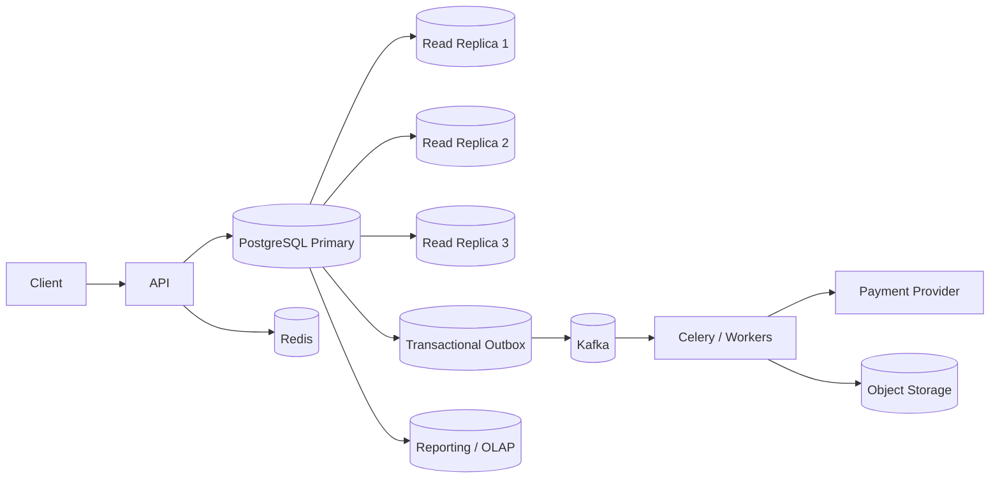

# 21- Production Scenario Exercises

## Overview

Production SQL problems rarely appear as isolated syntax questions. They usually involve a combination of query correctness, concurrency, transactions, indexes, connection pools, replicas, caching, migrations, workload growth, and operational constraints.

This exercise set is designed to move from practical SQL problems toward senior backend engineering scenarios. Each exercise provides a production situation, requirements, constraints, and a solution direction. The goal is to reason about the database as part of a larger backend system rather than solving only the SQL statement.

The examples assume PostgreSQL and a backend stack such as Django/FastAPI with Redis, Celery, Kafka, Kubernetes, and AWS where appropriate.

---

## Practice Environment

The exercises use a simplified e-commerce domain.

```sql
CREATE TABLE customers (
    id bigint GENERATED ALWAYS AS IDENTITY PRIMARY KEY,
    email text NOT NULL UNIQUE,
    status text NOT NULL,
    created_at timestamptz NOT NULL DEFAULT now()
);

CREATE TABLE products (
    id bigint GENERATED ALWAYS AS IDENTITY PRIMARY KEY,
    name text NOT NULL,
    price numeric(12, 2) NOT NULL,
    stock_quantity integer NOT NULL,
    active boolean NOT NULL DEFAULT true,
    created_at timestamptz NOT NULL DEFAULT now()
);

CREATE TABLE orders (
    id bigint GENERATED ALWAYS AS IDENTITY PRIMARY KEY,
    customer_id bigint NOT NULL REFERENCES customers(id),
    status text NOT NULL,
    total_amount numeric(12, 2) NOT NULL,
    created_at timestamptz NOT NULL DEFAULT now()
);

CREATE TABLE order_items (
    id bigint GENERATED ALWAYS AS IDENTITY PRIMARY KEY,
    order_id bigint NOT NULL REFERENCES orders(id),
    product_id bigint NOT NULL REFERENCES products(id),
    quantity integer NOT NULL,
    unit_price numeric(12, 2) NOT NULL
);

CREATE TABLE payments (
    id bigint GENERATED ALWAYS AS IDENTITY PRIMARY KEY,
    order_id bigint NOT NULL REFERENCES orders(id),
    status text NOT NULL,
    amount numeric(12, 2) NOT NULL,
    created_at timestamptz NOT NULL DEFAULT now()
);
```

Useful indexes:

```sql
CREATE INDEX idx_orders_customer_created
    ON orders (customer_id, created_at DESC);

CREATE INDEX idx_orders_status_created
    ON orders (status, created_at DESC);

CREATE INDEX idx_order_items_order
    ON order_items (order_id);

CREATE INDEX idx_order_items_product
    ON order_items (product_id);

CREATE INDEX idx_payments_order_created
    ON payments (order_id, created_at DESC);
```

---

## How to Approach Production Exercises

For every scenario, reason through these dimensions:

| Dimension | Question |
|---|---|
| Correctness | Does the query return exactly the intended result? |
| Cardinality | What is the expected grain of the result? |
| Concurrency | What happens when requests execute simultaneously? |
| Performance | What happens as data volume grows? |
| Transactions | Which operations must succeed or fail together? |
| Indexes | Which access patterns need supporting indexes? |
| Consistency | Can replicas or caches return stale data? |
| Reliability | What happens when a query, transaction, or dependency fails? |
| Security | Can one user access another user's data? |
| Operability | Can the problem be diagnosed in production? |

A strong answer should not stop at the SQL statement when the scenario has system-level implications.

---

## Exercise: Find Customers With No Orders

### Scenario

A customer support API needs to find active customers who have never placed an order.

Requirements:

- Return `customer_id` and email.
- Include only active customers.
- Do not return customers who have any order.
- The query must remain efficient with tens of millions of orders.

### Your Task

Write the SQL query.

Then answer:

1. Would you use `NOT EXISTS`, `LEFT JOIN`, or `NOT IN`?
2. Why can `NOT IN` become dangerous when `NULL` values are involved?
3. Which index supports the query?
4. Would this query become slower as the orders table grows?

### Solution

```sql
SELECT
    c.id,
    c.email
FROM customers AS c
WHERE c.status = 'active'
  AND NOT EXISTS (
      SELECT 1
      FROM orders AS o
      WHERE o.customer_id = c.id
  );
```

`NOT EXISTS` expresses the required existence test directly and avoids the `NULL` semantics that make `NOT IN` error-prone.

The foreign-key column should be indexed:

```sql
CREATE INDEX idx_orders_customer
    ON orders (customer_id);
```

For a large customer population, also consider the selectivity of the customer status predicate and inspect the actual plan.

---

## Exercise: Top Customers by Revenue

### Scenario

The business wants the top 10 customers by completed-order revenue during the previous calendar month.

Requirements:

- Only completed orders count.
- Return customer email and total revenue.
- Customers with no completed orders should not appear.
- Sort by revenue descending.
- Break ties deterministically by customer ID.

### Your Task

Write the query.

Then explain:

- Where filtering should occur.
- Why aggregation happens after filtering.
- Which indexes might help.
- Whether an index alone guarantees fast execution.

### Solution

```sql
SELECT
    c.id,
    c.email,
    SUM(o.total_amount) AS revenue
FROM customers AS c
JOIN orders AS o
    ON o.customer_id = c.id
WHERE o.status = 'completed'
  AND o.created_at >= date_trunc('month', current_date) - interval '1 month'
  AND o.created_at < date_trunc('month', current_date)
GROUP BY c.id, c.email
ORDER BY revenue DESC, c.id
LIMIT 10;
```

A possible supporting index is:

```sql
CREATE INDEX idx_orders_completed_created_customer
    ON orders (created_at, customer_id)
    WHERE status = 'completed';
```

The exact index should be validated with `EXPLAIN (ANALYZE, BUFFERS)` against production-like data.

---

## Exercise: Latest Payment Per Order

### Scenario

An order API needs to display the latest payment status for every order.

An order can have multiple payment records because payment attempts are retried.

### Your Task

Return:

- order ID
- order status
- latest payment status
- latest payment timestamp

Do not return multiple rows for an order.

### Solution

PostgreSQL provides `DISTINCT ON` for this pattern:

```sql
SELECT DISTINCT ON (o.id)
    o.id,
    o.status,
    p.status AS payment_status,
    p.created_at AS payment_created_at
FROM orders AS o
LEFT JOIN payments AS p
    ON p.order_id = o.id
ORDER BY
    o.id,
    p.created_at DESC,
    p.id DESC;
```

A window-function alternative is:

```sql
SELECT
    order_id,
    order_status,
    payment_status,
    payment_created_at
FROM (
    SELECT
        o.id AS order_id,
        o.status AS order_status,
        p.status AS payment_status,
        p.created_at AS payment_created_at,
        ROW_NUMBER() OVER (
            PARTITION BY o.id
            ORDER BY p.created_at DESC, p.id DESC
        ) AS rn
    FROM orders AS o
    LEFT JOIN payments AS p
        ON p.order_id = o.id
) AS ranked
WHERE rn = 1;
```

The deterministic tie-breaker matters because timestamps may not be unique.

---

## Exercise: Detect Duplicate Payments

### Scenario

A payment provider occasionally retries callbacks. A bug may create multiple successful payment records for the same order.

Find orders having more than one successful payment.

### Solution

```sql
SELECT
    order_id,
    COUNT(*) AS successful_payment_count,
    SUM(amount) AS successful_amount
FROM payments
WHERE status = 'succeeded'
GROUP BY order_id
HAVING COUNT(*) > 1;
```

### Senior-Level Question

Should the application merely detect this problem?

No. If the business invariant is:

> An order may have at most one successful payment.

The database should help enforce the invariant where the data model permits it.

For example:

```sql
CREATE UNIQUE INDEX uq_one_successful_payment_per_order
    ON payments (order_id)
    WHERE status = 'succeeded';
```

This is stronger than relying exclusively on application checks because concurrent requests can otherwise both observe "no successful payment" and insert simultaneously.

---

## Exercise: Prevent Overselling Inventory

### Scenario

A product has one unit remaining.

Two API requests arrive simultaneously:

```text
Request A: buy 1
Request B: buy 1
```

A naive implementation performs:

```sql
SELECT stock_quantity
FROM products
WHERE id = $1;
```

Then both application processes calculate the new quantity and issue an update.

### Your Task

Design a safe SQL operation.

### Solution

Use an atomic conditional update:

```sql
UPDATE products
SET stock_quantity = stock_quantity - $2
WHERE id = $1
  AND stock_quantity >= $2
RETURNING id, stock_quantity;
```

If no row is returned, there was insufficient inventory.

This avoids the classic read-modify-write race.

### Senior-Level Considerations

For more complex checkout workflows, combine the update with a transaction:

```sql
BEGIN;

UPDATE products
SET stock_quantity = stock_quantity - $2
WHERE id = $1
  AND stock_quantity >= $2
RETURNING id;

-- Create order only if the update succeeded.

COMMIT;
```

Keep the transaction short. Do not call an external payment provider while holding the database transaction open.

---

## Exercise: Safe Order Creation

### Scenario

An API receives:

```http
POST /orders
```

The request must:

1. Create an order.
2. Create its order items.
3. Reduce inventory.
4. Create an initial payment record.

If any database operation fails, none of the database changes should remain.

### Your Task

Define the transaction boundary.

### Solution Approach

All database operations belonging to the local business invariant should be in one transaction.

```sql
BEGIN;

INSERT INTO orders (
    customer_id,
    status,
    total_amount
)
VALUES ($1, 'pending', $2)
RETURNING id;

-- Insert order_items.

-- Atomically reserve inventory.

-- Insert payment record.

COMMIT;
```

The application should roll back on any failure.

The external payment provider should not be called inside this transaction.

A production design can use:

```text
API
 |
 | local transaction
 v
PostgreSQL
 |
 | transactional outbox
 v
Kafka / Celery
 |
 v
Payment Provider
```

This separates local transactional correctness from distributed side effects.

---

## Exercise: Find the N+1 Query

### Scenario

A Django endpoint returns 100 orders and each serializer accesses:

```python
order.customer.email
```

Monitoring shows:

```text
1 query to fetch orders
100 queries to fetch customers
```

### Your Task

Identify the problem and propose the SQL-level solution.

### Solution

The required data can be retrieved with a join:

```sql
SELECT
    o.id,
    o.status,
    c.email
FROM orders AS o
JOIN customers AS c
    ON c.id = o.customer_id
WHERE o.status = 'pending'
ORDER BY o.created_at DESC
LIMIT 100;
```

In Django, the equivalent optimization is typically:

```python
orders = (
    Order.objects
    .select_related("customer")
    .filter(status="pending")
    .order_by("-created_at")[:100]
)
```

The important engineering lesson is that ORM abstractions do not eliminate SQL query-count problems.

---

## Exercise: Query Returning Too Many Rows

### Scenario

An API should return one row per order.

The developer writes:

```sql
SELECT
    o.id,
    o.status,
    p.status AS payment_status
FROM orders AS o
JOIN payments AS p
    ON p.order_id = o.id;
```

Some orders appear multiple times.

### Your Task

Explain why.

### Solution

The relationship is:

```text
orders 1 ---- N payments
```

Therefore the join produces one row for every matching payment.

If the requirement is "latest payment", use a latest-row strategy such as:

```sql
SELECT DISTINCT ON (o.id)
    o.id,
    o.status,
    p.status AS payment_status
FROM orders AS o
LEFT JOIN payments AS p
    ON p.order_id = o.id
ORDER BY o.id, p.created_at DESC, p.id DESC;
```

Do not use `DISTINCT` blindly to hide join multiplication. Fix the intended result grain.

---

## Exercise: Pagination on a Large Orders Table

### Scenario

An orders endpoint supports:

```http
GET /orders?page=5000&page_size=50
```

The query currently uses:

```sql
SELECT *
FROM orders
ORDER BY created_at DESC
OFFSET 249950
LIMIT 50;
```

Performance degrades as the page number increases.

### Your Task

Replace offset pagination with keyset pagination.

### Solution

Use a stable ordering key:

```sql
SELECT
    id,
    customer_id,
    status,
    total_amount,
    created_at
FROM orders
WHERE (created_at, id) < ($1, $2)
ORDER BY created_at DESC, id DESC
LIMIT 50;
```

The supporting index is:

```sql
CREATE INDEX idx_orders_created_id
    ON orders (created_at DESC, id DESC);
```

The API can return the last `(created_at, id)` pair as the cursor for the next request.

### Production Considerations

Keyset pagination:

- avoids scanning and discarding large offsets
- provides stable ordering when paired with a unique tie-breaker
- works well for high-volume APIs
- requires a cursor contract
- is less convenient for arbitrary page-number navigation

---

## Exercise: Query Suddenly Becomes Slow

### Scenario

A query was consistently fast for months:

```sql
SELECT
    id,
    customer_id,
    total_amount
FROM orders
WHERE customer_id = $1
ORDER BY created_at DESC
LIMIT 20;
```

It suddenly becomes slow for a subset of customers.

### Your Task

List the diagnostic sequence before adding another index.

### Solution Approach

Inspect:

```sql
EXPLAIN (ANALYZE, BUFFERS)
SELECT
    id,
    customer_id,
    total_amount
FROM orders
WHERE customer_id = 123
ORDER BY created_at DESC
LIMIT 20;
```

Then investigate:

1. Actual versus estimated rows.
2. Index scan versus sequential scan.
3. Buffer hits and reads.
4. Whether some customers have dramatically more orders.
5. Statistics freshness.
6. Table/index growth.
7. Lock waits.
8. Database CPU or I/O saturation.
9. Connection pool pressure.
10. Whether the query is running on a lagging replica.

The existing composite index:

```sql
(customer_id, created_at DESC)
```

is already appropriate for this access pattern.

The problem may therefore be cardinality, statistics, contention, resource saturation, or workload skew rather than a missing index.

---

## Exercise: Replica Read-After-Write Failure

### Scenario

An API creates an order on the primary database:

```text
POST /orders
```

Immediately afterward, the frontend calls:

```text
GET /orders/{id}
```

The GET request is routed to a read replica and sometimes returns `404`.

### Your Task

Explain the cause and design a solution.

### Solution

The replica may not have replayed the primary's WAL yet.

Possible solutions include:

| Strategy | Use Case |
|---|---|
| Route recent writes to primary | Strong read-after-write behavior |
| Sticky primary routing | Short consistency window |
| LSN-aware routing | Stronger replica selection |
| Delay reads | Usually undesirable |
| Return created resource | Avoid immediate re-read |
| Use cache | Can improve read path but requires invalidation strategy |

For a critical post-write read, primary routing is often the simplest solution.

Do not assume that a read replica provides synchronous visibility unless the architecture explicitly guarantees it.

---

## Exercise: Lock Contention During Checkout

### Scenario

Database monitoring shows:

```text
20 requests waiting
1 request holding a row lock
```

The transaction contains:

```text
BEGIN
UPDATE inventory
UPDATE order
CALL payment API
COMMIT
```

### Your Task

Identify the architectural problem.

### Solution

The transaction holds database locks while waiting for an external network dependency.

The safer structure is:

```text
BEGIN
  update local state
  reserve inventory
  create outbox event
COMMIT

publish/process event

call payment provider

BEGIN
  update payment state
COMMIT
```

The exact workflow depends on the business invariant, but external calls should generally not occur while holding transactional database locks.

Use:

```sql
SELECT
    pid,
    usename,
    state,
    wait_event_type,
    wait_event,
    query
FROM pg_stat_activity
WHERE wait_event_type = 'Lock';
```

Then identify blockers with PostgreSQL lock diagnostics such as `pg_blocking_pids()` and `pg_locks`.

---

## Exercise: Deadlock Between Two Workers

### Scenario

Worker A performs:

```text
UPDATE order 10
UPDATE order 20
```

Worker B performs:

```text
UPDATE order 20
UPDATE order 10
```

Both transactions occasionally fail with a PostgreSQL deadlock error.

### Your Task

Design a prevention strategy.

### Solution

Use a consistent lock/update ordering.

For example, always process orders by ascending ID:

```text
order 10
order 20
```

regardless of which worker started first.

For a multi-row locking operation:

```sql
SELECT id
FROM orders
WHERE id IN ($1, $2)
ORDER BY id
FOR UPDATE;
```

Deadlocks can still occur through other resources, so lock ordering should be considered across:

- rows
- tables
- advisory locks
- application-level resources

If a deadlock occurs, PostgreSQL reports SQLSTATE:

```text
40P01
```

The application may retry the entire transaction with bounded backoff and jitter.

---

## Exercise: Queue Workers Without Duplicate Processing

### Scenario

A database-backed job queue contains:

```sql
CREATE TABLE jobs (
    id bigint GENERATED ALWAYS AS IDENTITY PRIMARY KEY,
    payload jsonb NOT NULL,
    status text NOT NULL,
    created_at timestamptz NOT NULL DEFAULT now()
);
```

Ten workers consume pending jobs.

Two workers must not process the same job concurrently.

### Your Task

Design a PostgreSQL query for claiming jobs.

### Solution

A queue-like pattern can use:

```sql
WITH claimed AS (
    SELECT id
    FROM jobs
    WHERE status = 'pending'
    ORDER BY created_at, id
    FOR UPDATE SKIP LOCKED
    LIMIT 10
)
UPDATE jobs AS j
SET status = 'processing'
FROM claimed
WHERE j.id = claimed.id
RETURNING j.id, j.payload;
```

`SKIP LOCKED` allows workers to skip rows already locked by another worker.

### Production Considerations

This pattern is useful for database-backed queues but requires:

- retry handling
- lease/visibility timeout
- recovery of abandoned jobs
- idempotent processing
- appropriate indexes
- monitoring of queue age
- bounded worker concurrency

For very high-throughput event processing, Kafka or a dedicated queue may be a better architecture.

---

## Exercise: Safe Retry After a Database Timeout

### Scenario

A request inserts an order and then receives a network timeout while waiting for the database response.

The application does not know whether the transaction committed.

### Your Task

Should the application blindly retry?

### Solution

No.

A network failure after sending `COMMIT` does not prove that the database rolled back.

The operation should use an idempotency key or another durable business identifier.

Example:

```sql
CREATE TABLE order_requests (
    idempotency_key text PRIMARY KEY,
    order_id bigint NOT NULL REFERENCES orders(id),
    created_at timestamptz NOT NULL DEFAULT now()
);
```

The retry can safely determine whether the request was already processed.

### Senior-Level Principle

Retries are safe only when the operation's semantics are safe to repeat.

This applies to:

- HTTP requests
- database transactions
- Celery tasks
- Kafka consumers
- payment operations
- external API calls

---

## Exercise: Soft Delete and Unique Email

### Scenario

Customers are soft-deleted:

```sql
UPDATE customers
SET status = 'deleted'
WHERE id = $1;
```

The business wants to allow a new customer to register using the same email after deletion.

The current constraint is:

```sql
UNIQUE (email)
```

### Your Task

Design the database constraint.

### Solution

Replace the unconditional uniqueness requirement with a partial unique index if the data model permits it:

```sql
CREATE UNIQUE INDEX uq_active_customer_email
    ON customers (email)
    WHERE status <> 'deleted';
```

Before deploying, the existing unique constraint must be handled safely through a migration strategy.

### Production Consideration

Do not confuse:

```text
soft deletion
```

with:

```text
data deletion
```

Retention, privacy, backups, audit requirements, and recovery policies may still require the deleted record to remain in the database.

---

## Exercise: Multi-Tenant Query Isolation

### Scenario

An application serves multiple organizations.

Every order belongs to a tenant:

```sql
ALTER TABLE orders
ADD COLUMN tenant_id bigint NOT NULL;
```

A developer accidentally writes:

```sql
SELECT *
FROM orders
WHERE id = $1;
```

The application supplies an order ID but no tenant condition.

### Your Task

Explain the security problem and propose defenses.

### Solution

The application should enforce tenant authorization at the resource boundary.

A tenant-aware query might be:

```sql
SELECT
    id,
    status,
    total_amount
FROM orders
WHERE tenant_id = $1
  AND id = $2;
```

For stronger defense in depth, PostgreSQL Row Level Security can enforce tenant isolation at the database layer.

The important principle is:

> A valid object ID is not proof that the current user is authorized to access the object.

Tenant context should be established safely and consistently, especially when connection pooling is involved.

---

## Exercise: Aggregation Double Counting

### Scenario

You need to calculate:

- total order value
- total payment value

for each customer.

A developer writes:

```sql
SELECT
    c.id,
    SUM(o.total_amount),
    SUM(p.amount)
FROM customers AS c
JOIN orders AS o
    ON o.customer_id = c.id
JOIN payments AS p
    ON p.order_id = o.id
GROUP BY c.id;
```

The results are too large.

### Your Task

Explain why.

### Solution

Both relationships can be one-to-many.

If an order has:

```text
3 payment records
4 order items
```

joining multiple child relations before aggregation can multiply rows.

A safer approach is to aggregate each independent grain first:

```sql
WITH order_totals AS (
    SELECT
        customer_id,
        SUM(total_amount) AS order_value
    FROM orders
    GROUP BY customer_id
),
payment_totals AS (
    SELECT
        o.customer_id,
        SUM(p.amount) AS payment_value
    FROM payments AS p
    JOIN orders AS o
        ON o.id = p.order_id
    GROUP BY o.customer_id
)
SELECT
    c.id,
    COALESCE(ot.order_value, 0) AS order_value,
    COALESCE(pt.payment_value, 0) AS payment_value
FROM customers AS c
LEFT JOIN order_totals AS ot
    ON ot.customer_id = c.id
LEFT JOIN payment_totals AS pt
    ON pt.customer_id = c.id;
```

The key is to preserve the intended grain at every stage.

---

## Exercise: High-CPU Reporting Query

### Scenario

A reporting endpoint executes a complex aggregation directly against the production OLTP database.

During business hours:

```text
Database CPU: 95%
API latency: increasing
Connection pool: saturated
```

### Your Task

Should you immediately increase database CPU?

### Solution

Not necessarily.

First identify:

```text
Query frequency
Query execution time
Rows scanned
Join strategy
Aggregation cost
Concurrent executions
Connection usage
Cache hit behavior
```

Inspect:

```sql
EXPLAIN (ANALYZE, BUFFERS)
SELECT ...;
```

Also inspect workload-level statistics using `pg_stat_statements` where available.

Possible architectural solutions include:

- optimize the query
- add a suitable index
- reduce result size
- cache stable results
- precompute aggregates
- use materialized views
- move reporting to a read replica
- move analytics to an OLAP/warehouse system
- rate-limit expensive reports
- execute exports asynchronously through Celery

Vertical scaling may help, but it should not substitute for workload diagnosis.

---

## Exercise: Large Export API

### Scenario

A user requests:

```http
GET /reports/orders.csv
```

The report contains 20 million rows.

The developer attempts to load all rows into Python before generating the CSV.

### Your Task

Design a production-safe approach.

### Solution

Do not load the entire dataset into application memory.

Prefer an asynchronous workflow:

```text
API request
   |
   v
Create export job
   |
   v
Celery worker
   |
   v
Stream/query batches
   |
   v
Object storage
   |
   v
Signed download URL
```

The SQL access pattern should be bounded and indexed.

For example:

```sql
SELECT
    id,
    customer_id,
    status,
    total_amount,
    created_at
FROM orders
WHERE id > $1
ORDER BY id
LIMIT 10000;
```

The worker should checkpoint progress and make the operation restartable.

---

## Exercise: Large Delete Operation

### Scenario

A retention job needs to remove 500 million expired audit records.

The developer proposes:

```sql
DELETE FROM audit_logs
WHERE created_at < now() - interval '2 years';
```

### Your Task

Identify the risks and propose a safer architecture.

### Solution

A single huge delete can generate:

- large WAL volume
- long transactions
- lock pressure
- dead tuples
- vacuum pressure
- replica lag
- increased I/O
- long recovery time

For moderate workloads, batch deletion:

```sql
DELETE FROM audit_logs
WHERE id IN (
    SELECT id
    FROM audit_logs
    WHERE created_at < $1
    ORDER BY id
    LIMIT 5000
);
```

can reduce transaction size.

For predictable time-based retention at very large scale, partitioning by time is often a better architecture:

```text
audit_logs_2025_01
audit_logs_2025_02
audit_logs_2025_03
...
```

Old partitions can then be detached or dropped instead of deleting millions of individual rows.

---

## Exercise: Large Backfill

### Scenario

A new column is introduced:

```sql
ALTER TABLE customers
ADD COLUMN normalized_email text;
```

There are 80 million existing customers.

The developer proposes:

```sql
UPDATE customers
SET normalized_email = lower(trim(email));
```

### Your Task

Design a production-safe migration.

### Solution

Use an expand-and-contract workflow:

```text
Add nullable column
       |
       v
Deploy compatible application
       |
       v
Backfill in batches
       |
       v
Validate data
       |
       v
Enable new read path
       |
       v
Enforce constraints if required
       |
       v
Remove old path later
```

A batch can use keyset progression:

```sql
UPDATE customers
SET normalized_email = lower(trim(email))
WHERE id > $1
  AND id <= $2
  AND normalized_email IS NULL;
```

The worker should monitor:

- database CPU
- I/O
- query latency
- lock waits
- replica lag
- WAL generation
- connection utilization

Do not maximize migration throughput blindly.

---

## Exercise: Missing Index or Bad Query?

### Scenario

A query uses a sequential scan:

```sql
SELECT *
FROM orders
WHERE status = 'completed';
```

A developer immediately proposes:

```sql
CREATE INDEX idx_orders_status
ON orders(status);
```

### Your Task

Should you accept the index?

### Solution

Not automatically.

If most rows are completed, `status` has low selectivity and a sequential scan may be cheaper.

If the real workload is:

```sql
SELECT id, customer_id, total_amount
FROM orders
WHERE status = 'completed'
  AND created_at >= $1
ORDER BY created_at DESC
LIMIT 100;
```

a more targeted index may be appropriate:

```sql
CREATE INDEX idx_orders_completed_created
    ON orders (created_at DESC)
    WHERE status = 'completed';
```

Always inspect:

```sql
EXPLAIN (ANALYZE, BUFFERS)
...
```

Index decisions should be based on actual access patterns, selectivity, workload frequency, and write cost.

---

## Exercise: Connection Pool Exhaustion

### Scenario

A Kubernetes deployment has:

```text
20 application pods
pool_size = 20
max_overflow = 10
```

The PostgreSQL server has:

```text
max_connections = 500
```

The application reports:

```text
connection acquisition timeout
```

### Your Task

Estimate the theoretical application-side connection demand.

### Solution

Each pod can theoretically reach:

```text
20 + 10 = 30
```

connections.

Across 20 pods:

```text
20 × 30 = 600
```

This already exceeds the database's 500 connection limit, before considering:

- Celery workers
- administrative connections
- migration jobs
- monitoring
- other services
- failover capacity

The correct connection budget must be calculated across the entire fleet.

A larger connection pool is not automatically a performance improvement.

---

## Exercise: Cache Stale Order Status

### Scenario

An order status is cached in Redis for five minutes.

The payment worker updates PostgreSQL:

```sql
UPDATE orders
SET status = 'paid'
WHERE id = $1;
```

But clients continue seeing:

```text
pending
```

for several minutes.

### Your Task

Design a consistency strategy.

### Solution

A common cache-aside approach is:

```text
Read:
Redis -> hit -> return
Redis -> miss -> PostgreSQL -> Redis -> return

Write:
PostgreSQL transaction
       |
       v
invalidate/update cache
```

The database remains the source of truth.

For critical status transitions, the application should explicitly decide whether stale reads are acceptable.

Do not assume Redis automatically provides transactional consistency with PostgreSQL.

---

## Exercise: Transaction and External API Failure

### Scenario

An API performs:

```text
BEGIN
create order
reserve inventory
call payment provider
payment succeeds
payment response times out
ROLLBACK
```

The application now believes the order was not paid.

### Your Task

Identify the failure mode.

### Solution

The external payment operation and database transaction are independent systems.

The payment provider may have successfully charged the customer even though the local transaction rolled back.

A production architecture should use:

- idempotency keys
- durable payment state
- provider reconciliation
- transactional outbox/events
- retry handling
- explicit payment state transitions

For example:

```text
Order
  |
  v
payment_pending
  |
  +--> provider request
  |
  +--> webhook/reconciliation
  |
  v
paid / failed / requires_review
```

Never model an external side effect as though it participates automatically in a PostgreSQL transaction.

---

## Exercise: Query on the Wrong Database

### Scenario

An order is created successfully.

The next request reports:

```text
Order not found
```

The primary database contains the row.

The application uses:

```text
GET -> read replica
POST -> primary
```

### Your Task

Identify the production diagnosis path.

### Solution

Check:

1. Which database endpoint handled each request.
2. Replica replay lag.
3. Transaction commit timing.
4. Application routing.
5. Read-after-write requirements.
6. Connection pool routing.
7. Cache state.

Useful PostgreSQL checks include replication state and replay position.

The correct fix is architectural rather than adding another query condition.

---

## Exercise: Slow Query or Lock Wait?

### Scenario

Application metrics show:

```text
SQL latency: 8 seconds
```

The query itself usually executes in:

```text
50 ms
```

### Your Task

Explain the discrepancy.

### Solution

The request may be waiting on a lock before the query can complete.

A production diagnosis should distinguish:

```text
execution time
+
lock wait
+
connection acquisition
+
network time
+
application processing
```

Inspect active sessions and wait events:

```sql
SELECT
    pid,
    state,
    wait_event_type,
    wait_event,
    query,
    query_start
FROM pg_stat_activity
WHERE state <> 'idle';
```

Do not add indexes to solve a lock-wait problem.

---

## Exercise: Incorrect `LEFT JOIN`

### Scenario

The API should return every customer, including customers with no orders.

The developer writes:

```sql
SELECT
    c.id,
    c.email,
    o.id AS order_id
FROM customers AS c
LEFT JOIN orders AS o
    ON o.customer_id = c.id
WHERE o.status = 'completed';
```

Customers without orders disappear.

### Your Task

Explain why and fix the query.

### Solution

The `WHERE` predicate rejects rows where `o.status` is `NULL`, effectively turning the outer join into an inner-style filter.

If the requirement is:

> Return every customer and only their completed orders.

Move the predicate into the join:

```sql
SELECT
    c.id,
    c.email,
    o.id AS order_id
FROM customers AS c
LEFT JOIN orders AS o
    ON o.customer_id = c.id
   AND o.status = 'completed';
```

This distinction is frequently tested in interviews and causes real production bugs.

---

## Exercise: Detect Inconsistent Order Totals

### Scenario

An order stores:

```text
orders.total_amount
```

and each item stores:

```text
quantity
unit_price
```

Find orders where the stored total differs from the calculated item total by more than one cent.

### Solution

```sql
SELECT
    o.id,
    o.total_amount,
    SUM(oi.quantity * oi.unit_price) AS calculated_total
FROM orders AS o
JOIN order_items AS oi
    ON oi.order_id = o.id
GROUP BY o.id, o.total_amount
HAVING ABS(
    o.total_amount - SUM(oi.quantity * oi.unit_price)
) > 0.01;
```

### Senior-Level Question

Should this inconsistency be detected only through periodic queries?

No.

If the total is a business invariant, design the transaction so that the value is calculated and written atomically. Database constraints can enforce some structural invariants, while application/service logic may enforce more complex financial rules.

---

## Exercise: Prevent Duplicate Idempotent Requests

### Scenario

A client retries:

```http
POST /orders
Idempotency-Key: abc123
```

The first request may have succeeded, but the client did not receive the response.

### Your Task

Design the database-level mechanism.

### Solution

Create a unique idempotency key:

```sql
CREATE TABLE idempotency_keys (
    key text PRIMARY KEY,
    request_hash text NOT NULL,
    order_id bigint REFERENCES orders(id),
    created_at timestamptz NOT NULL DEFAULT now()
);
```

The request processing flow becomes:

```text
Receive request
      |
      v
Check idempotency key
      |
      +---- existing ----> return stored result
      |
      v
Create durable key/result
      |
      v
Perform transaction
      |
      v
Store result
```

The exact implementation must ensure that concurrent requests using the same key cannot both create the resource.

---

## Exercise: Production Query Investigation

### Scenario

At 10:30 AM, API latency increases from:

```text
150 ms -> 2.5 s
```

Database CPU increases from:

```text
40% -> 92%
```

Connection utilization reaches:

```text
95%
```

No deployment occurred.

### Your Task

Describe your investigation order.

### Strong Answer

Start with workload evidence rather than changing configuration.

```text
API latency
   |
   v
Database metrics
   |
   +--> CPU
   +--> I/O
   +--> connections
   +--> locks
   +--> replication lag
   |
   v
Query workload
   |
   +--> pg_stat_statements
   +--> active sessions
   +--> wait events
   |
   v
Execution plans
   |
   v
Application behavior
   |
   +--> retries
   +--> traffic increase
   +--> N+1
   +--> new endpoint behavior
   |
   v
Mitigation
   |
   v
Permanent fix
```

Potential causes include:

- traffic spike
- retry storm
- query plan regression
- missing/ineffective index
- data distribution change
- N+1 query
- long transactions
- lock contention
- background workload
- reporting workload
- connection pool amplification

The correct incident response is evidence-driven.

---

## Exercise: Replica Lag During Backfill

### Scenario

A large data migration begins on the primary.

Soon afterward:

```text
Primary CPU: 65%
Replica lag: 45 seconds
Read API latency: increasing
```

The migration worker is processing as fast as possible.

### Your Task

Should the worker continue at maximum speed?

### Solution

No.

The migration is generating WAL faster than the replica can replay it.

The worker should be throttled based on production signals such as:

- replica lag
- database CPU
- I/O
- lock waits
- API latency
- connection utilization
- WAL growth

A migration is a production workload and must compete responsibly with user-facing traffic.

---

## Exercise: Design a Production Query Review

### Scenario

A developer submits this query for code review:

```sql
SELECT *
FROM orders
JOIN customers
    ON customers.id = orders.customer_id
WHERE orders.status = 'completed'
ORDER BY orders.created_at DESC;
```

The endpoint currently returns an unbounded number of rows.

### Your Task

Review the query as a senior backend engineer.

### Expected Review

Identify at least these issues:

- `SELECT *` increases result width and coupling.
- No pagination creates an unbounded response.
- No explicit API result limit exists.
- Index suitability depends on the actual access pattern.
- The query may return a large number of rows.
- Application memory and network transfer can become bottlenecks.
- Authorization and tenant filtering must be verified.
- The endpoint may need keyset pagination.
- The query should be inspected with `EXPLAIN`.
- Response serialization can become a significant part of latency.

A production version might be:

```sql
SELECT
    o.id,
    o.customer_id,
    o.status,
    o.total_amount,
    o.created_at
FROM orders AS o
JOIN customers AS c
    ON c.id = o.customer_id
WHERE o.status = 'completed'
ORDER BY o.created_at DESC, o.id DESC
LIMIT $1;
```

The exact index should be selected based on the complete workload and validated empirically.

---

## Exercise: Production SQL Incident Checklist

### Scenario

A production SQL incident occurs and the symptoms are unclear.

### Your Task

Build a diagnostic checklist that an on-call engineer can follow.

### Solution

#### Application

- Which endpoint is affected?
- Has request volume changed?
- Are retries increasing?
- Did a deployment occur?
- Is there an N+1 pattern?
- Is connection acquisition slow?

#### Database

- CPU
- memory
- I/O
- active sessions
- connection utilization
- wait events
- lock contention
- long transactions
- temporary file usage
- autovacuum activity

#### Query Workload

- Which queries consume the most total time?
- Which queries have the highest execution frequency?
- Which queries became slower?
- Did query plans change?
- Are estimated and actual rows significantly different?

#### Replication

- Is replica lag increasing?
- Are reads routed to the expected replica?
- Are replay conflicts occurring?
- Is WAL retention increasing?

#### Infrastructure

- Kubernetes pod count
- pool size per process
- PgBouncer capacity
- network errors
- node resource pressure
- AWS database metrics
- storage throughput

#### Mitigation

- Can expensive traffic be reduced?
- Can background workers be throttled?
- Can reporting be disabled temporarily?
- Can reads be routed differently?
- Can a problematic query be cancelled safely?

#### Recovery

- What caused the incident?
- Was data correctness affected?
- Are retries required?
- Is cache state consistent?
- Are replicas healthy?
- Is a follow-up migration or index change required?

---

## Production Scenario: Complete Architecture Challenge

### Scenario

You are designing an order platform with:

- 10 million customers
- 500 million orders
- 2,000 orders/second peak
- 10,000 reads/second peak
- PostgreSQL primary
- three read replicas
- Redis
- Kafka
- Celery
- Kubernetes
- AWS

Requirements:

- Orders must not be duplicated.
- Inventory must not be oversold.
- Users should see their own recent orders immediately.
- Reporting must not significantly affect checkout.
- Payment processing is external.
- Large exports are supported.
- Data retention is required.
- The system must tolerate replica failure.

### Your Task

Design the SQL/data architecture.

### Expected Architecture



### Expected Design Decisions

#### Transactional Correctness

Use PostgreSQL transactions for:

- order creation
- inventory reservation
- local payment state
- idempotency records
- outbox events

Use atomic inventory updates or appropriate row locking.

#### Idempotency

Use durable idempotency keys for order creation and payment operations.

Do not rely exclusively on Redis for financial correctness.

#### Read Scaling

Route safe read workloads to replicas.

Route recent post-write reads to the primary or use an explicit consistency mechanism.

#### Caching

Use Redis for suitable read-heavy data.

PostgreSQL remains the source of truth.

#### Reporting

Do not execute expensive analytical queries directly against the primary during peak checkout traffic.

Use:

- reporting replicas for limited workloads
- materialized views
- CDC/event streams
- OLAP infrastructure

depending on scale and freshness requirements.

#### Background Processing

Use Kafka/Celery for asynchronous operations such as:

- notifications
- exports
- reconciliation
- analytics pipelines
- non-critical post-order processing

Workers must be bounded and idempotent.

#### Large Exports

Generate exports asynchronously and store results in object storage rather than keeping database connections open while clients download data.

#### Retention

Use partitioning for very large time-based tables where lifecycle management benefits from partition-level operations.

#### Availability

Use multi-AZ database architecture, automated failover where appropriate, healthy replicas, backups, and tested recovery procedures.

#### Observability

Track:

- query latency
- query frequency
- database CPU
- database I/O
- lock waits
- transaction duration
- connection pool utilization
- replica lag
- cache hit rate
- Kafka lag
- Celery queue depth
- API latency
- error rates

---

## Senior Review Questions

Use these questions after completing the exercises.

### Query Correctness

- What is the result grain?
- Can a join multiply rows?
- Can `NULL` change the result?
- Does the query preserve rows required by the business rule?
- Is authorization represented in the data access path?

### Performance

- How many rows are scanned?
- How many rows are returned?
- Is the query executed frequently?
- Is the index aligned with the complete predicate and ordering?
- Is the bottleneck CPU, I/O, memory, locking, or networking?

### Concurrency

- Can two requests modify the same resource?
- Is read-modify-write safe?
- Does the transaction hold locks longer than necessary?
- Can the workflow deadlock?
- Are retries idempotent?

### Distributed Systems

- Can a replica be stale?
- Can Redis be stale?
- Can Kafka deliver a message more than once?
- What happens when an external API succeeds but the local transaction fails?
- What happens when a commit response is lost?

### Operations

- Can the query be observed through `pg_stat_statements`?
- Can blocked sessions be identified?
- Can expensive background work be throttled?
- Can the migration be paused safely?
- Can the system recover after a primary or replica failure?

---

## Common Mistakes in Production SQL Exercises

| Mistake | Why It Fails | Better Approach |
|---|---|---|
| Adding an index immediately | May optimize the wrong problem | Inspect workload and plan |
| Using `DISTINCT` to fix duplicates | Hides incorrect cardinality | Fix join semantics |
| Using `OFFSET` for deep pagination | Work grows with page depth | Use keyset pagination |
| `SELECT *` in APIs | Transfers unnecessary data | Select required columns |
| One huge update | Creates WAL, locks, bloat | Batch and throttle |
| External API inside transaction | Holds locks during network waits | Separate workflows |
| Application-only uniqueness check | Races under concurrency | Add database constraint |
| Blind transaction retries | May duplicate side effects | Use idempotency |
| Reading immediately from replica | Can violate read-after-write | Route or track consistency |
| Large reports on primary | Competes with OLTP traffic | Isolate analytical workloads |
| Unlimited worker concurrency | Amplifies DB contention | Bound concurrency |
| Redis-only correctness | Cache is not durable source of truth | Keep critical invariants in DB |
| Ignoring tenant scope | Can cause data leakage | Enforce tenant authorization |
| Blindly increasing connections | Can worsen memory/CPU pressure | Calculate connection budget |

---

## Production SQL Decision Framework

When facing a production SQL problem, use this sequence:

```text
Define expected behavior
        |
        v
Define result grain / invariant
        |
        v
Inspect actual SQL
        |
        v
Measure workload
        |
        v
Check execution plan
        |
        v
Check locks / transactions / connections
        |
        v
Check replicas / caches / workers
        |
        v
Choose smallest safe intervention
        |
        v
Validate under realistic load
        |
        v
Deploy with observability
        |
        v
Monitor for regression
```

The important distinction is between **query optimization** and **system optimization**. A query can be individually fast and still create a production incident if it runs thousands of times concurrently. Conversely, a query can be relatively expensive but acceptable when executed asynchronously against an isolated workload.

---

## Production Checklist

Before approving an important SQL path, verify:

- [ ] Result grain is explicitly understood.
- [ ] Join cardinality is correct.
- [ ] `NULL` semantics are intentional.
- [ ] Authorization and tenant scope are enforced.
- [ ] Query parameters are bound safely.
- [ ] Result size is bounded.
- [ ] Pagination strategy is appropriate.
- [ ] Relevant indexes are validated with execution plans.
- [ ] Transaction boundaries are explicit.
- [ ] Lock duration is minimized.
- [ ] Concurrent updates are safe.
- [ ] Retries are bounded and idempotent.
- [ ] Replica consistency requirements are defined.
- [ ] Cache consistency is understood.
- [ ] Background workload is bounded.
- [ ] Long-running operations are asynchronous where appropriate.
- [ ] Large migrations are restartable and throttled.
- [ ] Query and database metrics are observable.
- [ ] Failure and recovery behavior are documented.

---

## Key Takeaways

- **Production SQL exercises are system-design exercises:** query correctness, transactions, locks, indexes, pools, replicas, caches, workers, and infrastructure must be reasoned about together.
- **Correctness comes before optimization:** define result grain, authorization boundaries, invariants, and concurrency behavior before tuning execution plans.
- **Database constraints and transactions provide durable correctness:** use atomic SQL, unique constraints, appropriate locking, and idempotency rather than relying solely on application checks.
- **Scale changes the solution:** large tables, deep pagination, high concurrency, reporting, exports, and migrations require workload-aware architecture rather than simply faster queries.
- **Senior SQL engineering is evidence-driven:** use execution plans, workload statistics, wait events, lock diagnostics, replication metrics, and application telemetry to diagnose problems before changing the system.