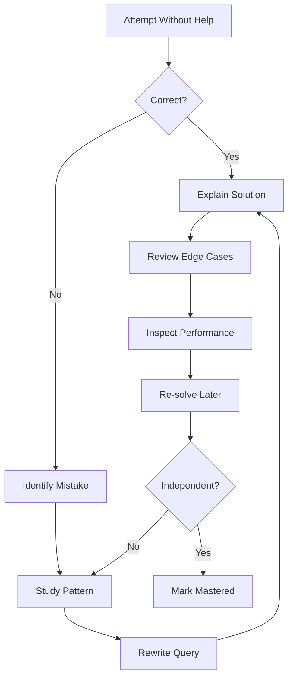

# 22- SQL Challenge Progress

## Overview

SQL skill develops through repeated problem solving rather than passive reading. A useful practice system should track not only whether a query was solved, but **how** it was solved, how efficiently the problem was recognized, and whether the solution would remain correct and performant under production conditions.

This document is the progress tracker for the SQL practice section. It maps exercises to the capabilities they develop and provides a repeatable method for recording attempts, mistakes, optimization work, and senior-level reasoning.

The goal is to progress from writing correct SQL to being able to:

- Identify the correct SQL pattern quickly.
- Reason about result cardinality and data relationships.
- Handle `NULL`, aggregation, subqueries, CTEs, and window functions correctly.
- Design and validate indexes.
- Understand query plans and performance trade-offs.
- Design safe transaction and concurrency behavior.
- Translate SQL requirements into production-ready backend APIs.
- Diagnose database behavior under realistic workloads.

---

## Practice Curriculum

The SQL practice section should progress from query construction toward production reasoning.


The progression deliberately moves from **query-level correctness** toward **system-level database engineering**.

---

## Exercise Inventory

| Exercise | Primary Skill | Difficulty | Status |
|---|---|---:|---|
| `01- Core SQL Exercises.md` | Basic SQL operations | Beginner | ⬜ |
| `02- SELECT and Filtering Exercises.md` | Filtering and projection | Beginner | ⬜ |
| `03- JOIN Exercises.md` | Join reasoning and cardinality | Intermediate | ⬜ |
| `04- Aggregation Exercises.md` | `GROUP BY`, aggregates, `HAVING` | Intermediate | ⬜ |
| `05- NULL Handling Exercises.md` | `NULL`, three-valued logic | Intermediate | ⬜ |
| `06- CASE Exercises.md` | Conditional SQL logic | Intermediate | ⬜ |
| `07- Subquery Exercises.md` | `EXISTS`, scalar and correlated subqueries | Intermediate | ⬜ |
| `08- CTE Exercises.md` | CTE composition and recursive reasoning | Intermediate | ⬜ |
| `09- Window Function Exercises.md` | Ranking, partitions, running calculations | Intermediate | ⬜ |
| `10- Date and Time Exercises.md` | Temporal filtering and reporting | Intermediate | ⬜ |
| `11- Subquery Exercises.md` | Advanced subquery patterns | Intermediate | ⬜ |
| `12- CTE Exercises.md` | Advanced CTE patterns | Intermediate | ⬜ |
| `13- Window Function Exercises.md` | Advanced window functions | Advanced | ⬜ |
| `14- Indexing Exercises.md` | Index design and access paths | Advanced | ⬜ |
| `15- Query Optimization Exercises.md` | Execution plans and optimization | Advanced | ⬜ |
| `16- Transaction Exercises.md` | Transaction boundaries and correctness | Advanced | ⬜ |
| `17- Concurrency Exercises.md` | Locks and concurrent updates | Advanced | ⬜ |
| `18- Database Design Exercises.md` | Schema and relational design | Advanced | ⬜ |
| `19- Pagination Exercises.md` | Offset and keyset pagination | Advanced | ⬜ |
| `20- Backend API Query Exercises.md` | SQL in backend APIs | Advanced | ⬜ |
| `21- Production Scenario Exercises.md` | Production database reasoning | Senior | ⬜ |

> Update the inventory if the actual exercise filenames differ. The tracker should reflect the repository rather than become a second source of truth.

---

## Progress Status

Use the following states consistently.

| Status | Meaning |
|---|---|
| ⬜ Not Started | Exercise has not been attempted |
| 🟡 In Progress | Currently being practiced |
| 🟢 Solved | Correct solution reached independently |
| 🔵 Reviewed | Solution solved and reviewed for correctness |
| 🟣 Optimized | Performance and execution plan reviewed |
| ⭐ Production Ready | Can explain production implications confidently |

A solution should not be considered complete merely because the SQL executes successfully.

---

## Completion Criteria

An exercise is **Solved** when:

- The query produces the expected result.
- The result grain is understood.
- `NULL` behavior is intentional.
- Join cardinality is correct.
- The query handles relevant edge cases.

An exercise is **Reviewed** when, in addition:

- The query has been manually inspected.
- An alternative solution has been considered where useful.
- Common mistakes are understood.
- The SQL can be explained without relying on memorized syntax.

An exercise is **Optimized** when, where applicable:

- `EXPLAIN` has been inspected.
- Index usage is understood.
- Estimated and actual row counts have been considered.
- Expensive joins, sorts, scans, or aggregations have been evaluated.
- Query frequency and workload impact have been considered.

An exercise is **Production Ready** when the solution can also address:

- Concurrency.
- Transactions.
- Security and authorization.
- Pagination or result-size limits.
- Failure behavior.
- Observability.
- Data growth.
- Replicas and consistency where relevant.
- Application/ORM behavior where relevant.

---

## Challenge Tracking Template

Use this template when recording an individual exercise.

```markdown
### Exercise

**Status:** ⬜ Not Started  
**Attempts:** 0  
**Solved Independently:** No  
**Reviewed:** No  
**Optimized:** No  
**Production Ready:** No

#### Problem

Describe the problem briefly.

#### First Attempt

```sql
-- Query
```

#### Result

- Correct: No
- Expected rows: ...
- Actual rows: ...

#### Mistake

Describe the actual reasoning error.

#### Correct Solution

```sql
-- Correct query
```

#### Alternative

```sql
-- Alternative approach when useful
```

#### Performance

```sql
EXPLAIN (ANALYZE, BUFFERS)
...
```

#### Production Considerations

- ...
- ...
- ...

#### Lesson

One or two sentences describing the reusable SQL pattern learned.
```

The purpose of the template is to capture **reasoning**, not merely the final answer.

---

## Track Attempts, Not Just Completion

A useful progress tracker records how difficult each problem was.

| Metric | Meaning |
|---|---|
| Attempts | Number of meaningful attempts |
| Independent Solve | Solved without looking at the solution |
| Hint Required | Needed a conceptual or syntax hint |
| Solution Viewed | Required reference solution |
| Re-solve | Successfully solved again later |
| Time | Approximate time to reach a correct solution |
| Production Review | Considered real-world implications |

A query solved after reading the answer should not be treated the same as one solved independently.

---

## Recommended Difficulty Scale

### Level A — Query Construction

Focus on:

- `SELECT`
- `WHERE`
- `ORDER BY`
- `LIMIT`
- `DISTINCT`
- basic expressions
- basic `INSERT`, `UPDATE`, and `DELETE`

Success criterion:

> Can construct correct SQL without repeatedly checking syntax.

### Level B — Relational Reasoning

Focus on:

- `INNER JOIN`
- `LEFT JOIN`
- one-to-many relationships
- many-to-many relationships
- `GROUP BY`
- aggregates
- `HAVING`
- `NULL`
- `CASE`

Success criterion:

> Can predict result cardinality before executing the query.

### Level C — Advanced Query Composition

Focus on:

- `EXISTS`
- `NOT EXISTS`
- scalar subqueries
- correlated subqueries
- CTEs
- recursive CTEs
- window functions
- `LATERAL`
- advanced date/time operations

Success criterion:

> Can select the SQL construct based on semantics rather than familiarity.

### Level D — Performance

Focus on:

- indexes
- composite indexes
- partial indexes
- expression indexes
- covering indexes
- sequential scans
- index scans
- bitmap scans
- joins
- sorting
- aggregation
- cardinality estimates
- `EXPLAIN`
- `EXPLAIN ANALYZE`
- `BUFFERS`

Success criterion:

> Can explain why PostgreSQL selected a particular execution strategy.

### Level E — Backend Engineering

Focus on:

- transactions
- locking
- concurrency
- pagination
- idempotency
- read replicas
- connection pools
- caching
- ORM-generated SQL
- API query patterns

Success criterion:

> Can safely use SQL inside a real backend service.

### Level F — Production Architecture

Focus on:

- high availability
- replication
- sharding
- partitioning
- large migrations
- OLTP/OLAP separation
- workload isolation
- observability
- failure recovery
- capacity planning

Success criterion:

> Can reason about SQL as part of a distributed production system.

---

## Skill Matrix

Track capability separately from individual exercises.

| Skill | Beginner | Intermediate | Advanced | Senior |
|---|---:|---:|---:|---:|
| SELECT/filtering | ⬜ | ⬜ | ⬜ | ⬜ |
| JOINs | ⬜ | ⬜ | ⬜ | ⬜ |
| Cardinality | ⬜ | ⬜ | ⬜ | ⬜ |
| Aggregation | ⬜ | ⬜ | ⬜ | ⬜ |
| NULL handling | ⬜ | ⬜ | ⬜ | ⬜ |
| CASE expressions | ⬜ | ⬜ | ⬜ | ⬜ |
| Subqueries | ⬜ | ⬜ | ⬜ | ⬜ |
| CTEs | ⬜ | ⬜ | ⬜ | ⬜ |
| Window functions | ⬜ | ⬜ | ⬜ | ⬜ |
| Date/time | ⬜ | ⬜ | ⬜ | ⬜ |
| Index design | ⬜ | ⬜ | ⬜ | ⬜ |
| Query optimization | ⬜ | ⬜ | ⬜ | ⬜ |
| Transactions | ⬜ | ⬜ | ⬜ | ⬜ |
| Concurrency | ⬜ | ⬜ | ⬜ | ⬜ |
| Database design | ⬜ | ⬜ | ⬜ | ⬜ |
| Pagination | ⬜ | ⬜ | ⬜ | ⬜ |
| Backend API queries | ⬜ | ⬜ | ⬜ | ⬜ |
| Production diagnosis | ⬜ | ⬜ | ⬜ | ⬜ |

This matrix is more useful than a single percentage because SQL proficiency is multidimensional.

---

## Mistake Categories

When an exercise is incorrect, classify the failure.

| Category | Example |
|---|---|
| Syntax | Invalid SQL syntax |
| Semantics | Misunderstood SQL behavior |
| Cardinality | Unexpected duplicate rows |
| `NULL` | Incorrect three-valued logic |
| Join | Incorrect relationship or join condition |
| Aggregation | Wrong grouping or double counting |
| Ordering | Missing deterministic ordering |
| Type | Incorrect or implicit conversion |
| Performance | Inefficient execution strategy |
| Indexing | Wrong or missing index |
| Concurrency | Race condition |
| Transaction | Incorrect transaction boundary |
| Security | Missing tenant or authorization filter |
| API | Unbounded result or poor pagination |
| Architecture | Database used for the wrong workload |

The objective is to identify **repeating error patterns**.

If multiple exercises fail because of cardinality, spend more time on relational reasoning instead of simply completing more exercises.

---

## Re-Solve Strategy

A strong SQL practice loop is:



Do not immediately move on after seeing the correct query.

The ability to reproduce the solution later is a better signal of mastery.

---

## Spaced Repetition

Recommended review intervals:

| Result | Review |
|---|---|
| Solved immediately | 3–7 days |
| Solved with hint | 1–3 days |
| Required solution | Next day |
| Repeated mistake | Same day + next day |
| Performance problem | Revisit after query-plan study |
| Production scenario | Revisit before interviews |

For difficult patterns, change the data or requirements when re-solving.

For example, after mastering:

```sql
ROW_NUMBER() OVER (
    PARTITION BY customer_id
    ORDER BY created_at DESC
)
```

practice the same pattern with:

- latest payment
- latest login
- latest status
- latest shipment
- latest event

The objective is to recognize the **pattern**, not memorize the example.

---

## Interview Readiness

An exercise should be interview-ready when you can answer four questions:

### What does the query do?

Explain the result in business terms.

### Why does it work?

Explain joins, filtering, grouping, ordering, or window semantics.

### What can go wrong?

Discuss:

- `NULL`
- duplicates
- missing relationships
- empty results
- incorrect cardinality
- concurrent writes

### How would you productionize it?

Discuss:

- indexes
- query plans
- pagination
- transactions
- authorization
- timeouts
- observability
- data growth

A senior-level SQL interview answer should move beyond:

> "This query works."

Toward:

> "This query produces one row per customer, uses an existence predicate rather than multiplying child rows, is supported by the relevant access path, and would be evaluated under realistic cardinality and concurrency."

---

## Production Readiness Checklist

Before marking a challenge as production-ready:

### Correctness

- [ ] Result grain is known.
- [ ] Join cardinality is correct.
- [ ] `NULL` behavior is intentional.
- [ ] Edge cases have been considered.
- [ ] Ordering is deterministic where required.

### Performance

- [ ] Result size is bounded.
- [ ] Query frequency is understood.
- [ ] Relevant indexes are considered.
- [ ] Execution plan has been inspected when appropriate.
- [ ] Large-data behavior has been considered.

### Concurrency

- [ ] Read-modify-write races are considered.
- [ ] Transaction boundaries are appropriate.
- [ ] Lock duration is acceptable.
- [ ] Deadlock behavior is understood.
- [ ] Retries are safe.

### Security

- [ ] Parameters are bound safely.
- [ ] Tenant isolation is enforced where applicable.
- [ ] Authorization is not inferred from object existence.
- [ ] Sensitive data is not unnecessarily selected or logged.

### Backend Integration

- [ ] ORM-generated SQL is understood where applicable.
- [ ] N+1 behavior has been considered.
- [ ] Pagination is appropriate.
- [ ] Connection usage is bounded.
- [ ] Replica consistency requirements are understood.

### Operations

- [ ] Query behavior is observable.
- [ ] Timeouts are appropriate.
- [ ] Failure behavior is known.
- [ ] Data growth has been considered.
- [ ] Recovery implications are understood.

---

## SQL Mastery Levels

### Level 1 — Syntax Competence

You can write common SQL statements without significant assistance.

### Level 2 — Query Competence

You can solve joins, aggregation, subqueries, and window-function problems correctly.

### Level 3 — Performance Competence

You can interpret execution plans and design indexes around access patterns.

### Level 4 — Backend Competence

You understand transactions, concurrency, pagination, ORM behavior, replicas, pools, and caching.

### Level 5 — Production Competence

You can diagnose database incidents and design reliable SQL workloads under scale, failure, and concurrency.

### Level 6 — Senior Architecture Competence

You can decide when SQL should remain in PostgreSQL and when the workload should be separated through:

- Redis
- Kafka
- Celery
- read replicas
- materialized views
- OLAP systems
- partitioning
- sharding
- dedicated services

The highest level is not knowing the most SQL syntax. It is knowing **which database behavior and architecture are appropriate for the workload**.

---

## Practical Progress Dashboard

Use a compact dashboard near the top of the file and update it periodically.

| Area | Exercises | Completed | Mastered | Notes |
|---|---:|---:|---:|---|
| Core SQL | 2 | 0 | 0 | |
| JOINs | 1 | 0 | 0 | |
| Aggregation | 1 | 0 | 0 | |
| NULL / CASE | 2 | 0 | 0 | |
| Subqueries | 2 | 0 | 0 | |
| CTEs | 2 | 0 | 0 | |
| Window Functions | 2 | 0 | 0 | |
| Date / Time | 1 | 0 | 0 | |
| Indexing | 1 | 0 | 0 | |
| Optimization | 1 | 0 | 0 | |
| Transactions | 1 | 0 | 0 | |
| Concurrency | 1 | 0 | 0 | |
| Database Design | 1 | 0 | 0 | |
| Pagination | 1 | 0 | 0 | |
| Backend APIs | 1 | 0 | 0 | |
| Production Scenarios | 1 | 0 | 0 | |

Update the numbers only when an exercise satisfies the corresponding completion criteria.

---

## What Mastery Should Look Like

The final objective is not:

```text
"I completed all SQL exercises."
```

It is:

```text
Requirement
    |
    v
Define result grain
    |
    v
Choose SQL construct
    |
    v
Validate correctness
    |
    v
Consider cardinality and NULL
    |
    v
Inspect execution strategy
    |
    v
Consider indexes and data growth
    |
    v
Consider transactions and concurrency
    |
    v
Consider security and authorization
    |
    v
Integrate with backend architecture
    |
    v
Observe and operate in production
```

When solving a new SQL problem, the desired progression is:

> **Understand the data → define the result → write the query → validate correctness → evaluate performance → consider concurrency/security → integrate safely into the backend.**

That workflow is the real measure of SQL maturity.

---

## Key Takeaways

- **Track reasoning, not just completion:** an independently solved query is more valuable than a solution copied from a reference.
- **Build mastery by capability:** joins, cardinality, aggregation, `NULL`, windows, indexing, transactions, concurrency, and production diagnosis require separate practice.
- **Re-solve difficult problems:** repeated independent solutions demonstrate pattern recognition better than one successful attempt.
- **Production readiness goes beyond SQL syntax:** evaluate performance, security, concurrency, pagination, observability, and failure behavior.
- **Senior SQL skill is systems reasoning:** choose query structures and database architectures based on workload, scale, correctness, and operational constraints.