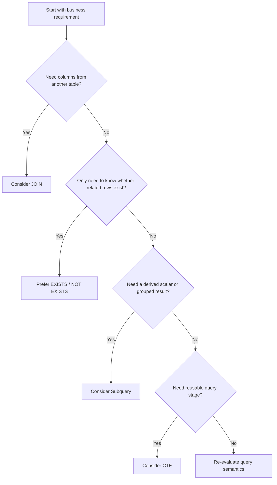

# 01- JOIN vs Subquery vs EXISTS

## Overview

`JOIN`, subqueries, and `EXISTS` can often express the same business requirement, but they communicate different **result semantics** and can produce very different intermediate row sets.

The important question is not:

> "Which one is faster?"

The better question is:

> "What relationship does the query need to express, what should one output row represent, and what cardinality should the database produce?"

For backend engineers, this distinction matters because an apparently correct query can introduce:

- Duplicate rows.
- Incorrect aggregation.
- Excessive intermediate results.
- Expensive joins.
- Poor pagination behavior.
- Unnecessary database work.
- Authorization bugs.
- Difficult-to-understand ORM queries.

A practical decision framework is:



The database optimizer may transform different SQL formulations into similar execution plans. However, **query semantics should drive the initial choice**, followed by execution-plan validation.

---

## Representative Schema

Use a simple order-management model:

```sql
CREATE TABLE customers (
    id bigint PRIMARY KEY,
    email text NOT NULL,
    name text NOT NULL
);

CREATE TABLE orders (
    id bigint PRIMARY KEY,
    customer_id bigint NOT NULL REFERENCES customers(id),
    status text NOT NULL,
    total_amount numeric(12, 2) NOT NULL,
    created_at timestamptz NOT NULL
);

CREATE INDEX idx_orders_customer_id
    ON orders (customer_id);

CREATE INDEX idx_orders_customer_created_at
    ON orders (customer_id, created_at DESC);
```

Assume the business requirement is:

> Find customers who have placed at least one completed order.

This requirement is fundamentally an **existence question**.

---

## JOIN

A `JOIN` combines rows from related relations.

```sql
SELECT DISTINCT c.id, c.email
FROM customers AS c
JOIN orders AS o
    ON o.customer_id = c.id
WHERE o.status = 'completed';
```

The join produces matching customer-order combinations.

If a customer has five completed orders, the relational operation can produce five matching rows for that customer before `DISTINCT` removes duplicates.

### When JOIN Is Appropriate

Use a `JOIN` when the query needs data from both sides of the relationship.

For example:

```sql
SELECT
    c.id,
    c.email,
    o.id AS order_id,
    o.total_amount
FROM customers AS c
JOIN orders AS o
    ON o.customer_id = c.id
WHERE o.status = 'completed';
```

Here the result intentionally contains order information.

### Advantages

- Natural representation of relational data.
- Required when columns from the related table are part of the result.
- Works naturally with aggregation.
- Can expose relationships clearly.
- PostgreSQL has several efficient join strategies.

### Limitations

A join can multiply rows.

That becomes dangerous when the requirement is only to determine whether a related row exists.

---

## JOIN and Cardinality

Consider:

```text
customers
-----------
1 Alice
2 Bob

orders
-----------
101 customer=1
102 customer=1
103 customer=2
```

A join produces:

```text
Alice -> 101
Alice -> 102
Bob   -> 103
```

If the requirement is:

```text
One row per customer
```

the join has introduced a different grain:

```text
One row per customer-order relationship
```

This distinction is one of the most important SQL concepts to understand.

---

## Why DISTINCT Is Often a Warning Sign

This query works:

```sql
SELECT DISTINCT c.id, c.email
FROM customers AS c
JOIN orders AS o
    ON o.customer_id = c.id
WHERE o.status = 'completed';
```

But `DISTINCT` may be hiding the fact that the query naturally produces multiple rows.

Compare it with:

```sql
SELECT c.id, c.email
FROM customers AS c
WHERE EXISTS (
    SELECT 1
    FROM orders AS o
    WHERE o.customer_id = c.id
      AND o.status = 'completed'
);
```

The second query directly expresses:

> Return the customer if at least one qualifying order exists.

That is usually the clearer formulation.

`DISTINCT` is not inherently wrong. It becomes suspicious when it is being used to repair an unintended cardinality problem.

---

## EXISTS

`EXISTS` answers a boolean-style relational question:

> Does at least one row satisfying this condition exist?

Example:

```sql
SELECT c.id, c.email
FROM customers AS c
WHERE EXISTS (
    SELECT 1
    FROM orders AS o
    WHERE o.customer_id = c.id
      AND o.status = 'completed'
);
```

The selected expression inside `EXISTS` does not matter for existence semantics.

This is therefore also valid:

```sql
WHERE EXISTS (
    SELECT 1
    FROM orders AS o
    WHERE o.customer_id = c.id
      AND o.status = 'completed'
)
```

The important part is the predicate.

### How EXISTS Works Conceptually

For each candidate customer:

```text
Customer
   |
   v
Check related orders
   |
   +---- qualifying row found ----> TRUE
   |
   +---- no qualifying row -------> FALSE
```

The database can use an execution strategy that stops looking once existence has been established.

This can avoid materializing or processing every matching child row.

### When to Use EXISTS

Prefer `EXISTS` when:

- You only care whether a related row exists.
- You do not need columns from the related table.
- A join would introduce unnecessary row multiplication.
- The query expresses a business existence rule.
- You need a reliable anti-join with `NOT EXISTS`.

### Advantages

- Clearly expresses intent.
- Avoids unnecessary result multiplication.
- Often works well with selective indexes.
- Naturally preserves the outer query's grain.
- Excellent for authorization and tenant-existence checks.

### Limitations

- It cannot directly return columns from the related relation.
- Complex nested existence predicates can become difficult to read.
- Performance still depends on indexes, cardinality, statistics, and the optimizer.

---

## NOT EXISTS

`NOT EXISTS` is the preferred pattern for many anti-join requirements.

Example:

> Find customers who have never placed an order.

```sql
SELECT c.id, c.email
FROM customers AS c
WHERE NOT EXISTS (
    SELECT 1
    FROM orders AS o
    WHERE o.customer_id = c.id
);
```

This is generally safer than:

```sql
SELECT c.id, c.email
FROM customers AS c
WHERE c.id NOT IN (
    SELECT o.customer_id
    FROM orders AS o
);
```

because `NOT IN` has special `NULL` semantics.

If the subquery can produce `NULL`, `NOT IN` can produce an unexpected `UNKNOWN` result.

---

## JOIN vs EXISTS

These two queries may appear equivalent:

```sql
SELECT DISTINCT c.id
FROM customers AS c
JOIN orders AS o
    ON o.customer_id = c.id
WHERE o.status = 'completed';
```

and:

```sql
SELECT c.id
FROM customers AS c
WHERE EXISTS (
    SELECT 1
    FROM orders AS o
    WHERE o.customer_id = c.id
      AND o.status = 'completed'
);
```

But they communicate different relational intent.

| Requirement | Preferred Pattern |
|---|---|
| Need order columns | `JOIN` |
| Need customer columns only | `EXISTS` |
| Need to aggregate orders | `JOIN` |
| Need to test at least one order | `EXISTS` |
| Need customers without orders | `NOT EXISTS` |
| Need one row per order | `JOIN` |
| Need one row per customer | Often `EXISTS` |
| Need existence plus a derived value | Subquery or aggregation |
| Need multiple independent existence checks | Multiple `EXISTS` predicates |

---

## Subqueries

A subquery is a query nested inside another SQL statement.

Subqueries can appear in several locations:

```sql
SELECT ...
FROM ...
WHERE ...
```

or:

```sql
SELECT ...
FROM (
    SELECT ...
) AS derived;
```

or:

```sql
SELECT
    ...,
    (
        SELECT ...
    ) AS value
FROM ...
```

They are not a single performance category. Their behavior depends heavily on where and how they are used.

---

## Scalar Subqueries

A scalar subquery returns one value.

Example:

> Return each customer and their most recent order timestamp.

```sql
SELECT
    c.id,
    c.email,
    (
        SELECT MAX(o.created_at)
        FROM orders AS o
        WHERE o.customer_id = c.id
    ) AS last_order_at
FROM customers AS c;
```

This keeps the outer result at:

```text
one row per customer
```

### When to Use

Scalar subqueries are useful when:

- A derived value belongs naturally to each outer row.
- The subquery should return exactly one value.
- Joining and grouping would make the query less clear.

### Production Consideration

Do not assume that a correlated scalar subquery always executes as a completely independent query for every outer row. PostgreSQL can optimize subqueries.

Still, always inspect the execution plan for large workloads.

---

## Correlated Subqueries

A correlated subquery references a column from the outer query.

Example:

```sql
SELECT
    c.id,
    c.email
FROM customers AS c
WHERE (
    SELECT COUNT(*)
    FROM orders AS o
    WHERE o.customer_id = c.id
) >= 5;
```

The inner query depends on the current customer.

Conceptually:

```text
Customer 1 -> evaluate order count
Customer 2 -> evaluate order count
Customer 3 -> evaluate order count
...
```

The optimizer may transform or optimize the execution, but the logical dependency remains.

### When to Use

Correlated subqueries are useful for:

- Per-row derived values.
- Per-row comparisons.
- Existence tests.
- Latest-record patterns.
- Relationships that are clearer as nested logic.

### Common Mistake

Do not automatically label every correlated subquery as slow.

Instead:

1. Understand the semantics.
2. Inspect the execution plan.
3. Check cardinality.
4. Check indexes.
5. Compare alternatives when necessary.

---

## Derived Tables

A subquery in `FROM` creates a derived relation.

Example:

```sql
SELECT
    customer_id,
    total_spent
FROM (
    SELECT
        customer_id,
        SUM(total_amount) AS total_spent
    FROM orders
    WHERE status = 'completed'
    GROUP BY customer_id
) AS customer_totals
WHERE total_spent > 10000;
```

This can be useful when a query naturally has multiple relational stages.

Conceptually:

```text
orders
  |
  v
filter completed orders
  |
  v
aggregate by customer
  |
  v
filter aggregated result
```

A CTE can express the same logical structure:

```sql
WITH customer_totals AS (
    SELECT
        customer_id,
        SUM(total_amount) AS total_spent
    FROM orders
    WHERE status = 'completed'
    GROUP BY customer_id
)
SELECT customer_id, total_spent
FROM customer_totals
WHERE total_spent > 10000;
```

The choice between a derived table and a CTE is primarily about query structure and semantics. PostgreSQL's optimizer may inline or materialize CTEs depending on the query and PostgreSQL version/options.

---

## JOIN for Aggregation

When the related rows themselves are required for aggregation, a join is often the natural choice.

Example:

> Calculate total completed-order revenue per customer.

```sql
SELECT
    c.id,
    c.email,
    COALESCE(SUM(o.total_amount), 0) AS total_revenue
FROM customers AS c
LEFT JOIN orders AS o
    ON o.customer_id = c.id
   AND o.status = 'completed'
GROUP BY c.id, c.email;
```

The `LEFT JOIN` preserves customers with no completed orders.

This is different from an existence check because the query needs data from the child relation.

---

## EXISTS for Authorization

`EXISTS` is particularly useful in backend authorization queries.

Suppose a user can access a project only if they are a member:

```sql
SELECT p.id, p.name
FROM projects AS p
WHERE EXISTS (
    SELECT 1
    FROM project_members AS pm
    WHERE pm.project_id = p.id
      AND pm.user_id = $1
);
```

The query does not need membership columns.

It only needs to answer:

```text
Does this user have membership for this project?
```

This is a strong semantic match for `EXISTS`.

The same principle applies to:

- Tenant membership.
- Organization access.
- Account ownership.
- Resource permissions.
- Feature eligibility.
- Subscription checks.

Authorization should still be enforced by the complete application/database security model; an `EXISTS` predicate alone is not a replacement for robust authorization architecture.

---

## JOIN for Returning Related Data

Suppose the API needs:

```text
customer_id
order_id
order_total
order_created_at
```

A join is natural:

```sql
SELECT
    c.id AS customer_id,
    o.id AS order_id,
    o.total_amount,
    o.created_at
FROM customers AS c
JOIN orders AS o
    ON o.customer_id = c.id
WHERE c.id = $1
ORDER BY o.created_at DESC, o.id DESC;
```

There is no reason to force this into an `EXISTS` query because the related rows are part of the required result.

---

## Subquery for Latest Related Row

A common backend requirement is:

> Return the latest order for each customer.

One PostgreSQL-specific solution is:

```sql
SELECT DISTINCT ON (o.customer_id)
    o.customer_id,
    o.id,
    o.status,
    o.created_at
FROM orders AS o
ORDER BY
    o.customer_id,
    o.created_at DESC,
    o.id DESC;
```

A window-function alternative is:

```sql
SELECT customer_id, id, status, created_at
FROM (
    SELECT
        o.*,
        ROW_NUMBER() OVER (
            PARTITION BY customer_id
            ORDER BY created_at DESC, id DESC
        ) AS row_number
    FROM orders AS o
) AS ranked
WHERE row_number = 1;
```

A correlated subquery can also express the requirement, although it may not always be the clearest option.

The important skill is recognizing that:

> "Latest related row" is a different problem from "does a related row exist?"

---

## JOIN vs Subquery vs EXISTS

| Characteristic | JOIN | Subquery | EXISTS |
|---|---|---|---|
| Primary purpose | Combine relations | Nest relational logic | Test existence |
| Returns related columns | Yes | Depends on form | No |
| Can multiply rows | Yes | Depends | Normally preserves outer grain |
| Aggregation | Excellent | Useful | Not primary purpose |
| Existence checks | Possible | Possible | Best semantic fit |
| Anti-join | Possible | Possible | `NOT EXISTS` is strong choice |
| Per-row derived value | Possible | Excellent | No |
| Readability | Strong for relationships | Strong for nested logic | Strong for existence |
| Performance | Workload-dependent | Workload-dependent | Workload-dependent |
| Optimizer transformations | Yes | Yes | Yes |
| Main risk | Cardinality multiplication | Complex execution | Poor indexing/correlation |

There is no universal rule that one construct is always faster.

---

## The Optimizer Matters

SQL describes the required result. PostgreSQL chooses an execution strategy.

For example, these formulations:

```sql
SELECT DISTINCT c.id
FROM customers AS c
JOIN orders AS o
    ON o.customer_id = c.id
WHERE o.status = 'completed';
```

and:

```sql
SELECT c.id
FROM customers AS c
WHERE EXISTS (
    SELECT 1
    FROM orders AS o
    WHERE o.customer_id = c.id
      AND o.status = 'completed'
);
```

may result in different plans, but PostgreSQL is free to transform relational expressions when semantics permit.

Therefore:

> SQL syntax alone is not an execution-plan guarantee.

Validate important queries with:

```sql
EXPLAIN (ANALYZE, BUFFERS)
SELECT c.id
FROM customers AS c
WHERE EXISTS (
    SELECT 1
    FROM orders AS o
    WHERE o.customer_id = c.id
      AND o.status = 'completed'
);
```

Inspect:

- Actual rows.
- Estimated rows.
- Join strategy.
- Scan type.
- Loops.
- Buffer activity.
- Sorts.
- Hash operations.
- Execution time.

---

## Indexing Considerations

For an existence query:

```sql
SELECT c.id
FROM customers AS c
WHERE EXISTS (
    SELECT 1
    FROM orders AS o
    WHERE o.customer_id = c.id
      AND o.status = 'completed'
);
```

an index aligned with the lookup pattern can be useful:

```sql
CREATE INDEX idx_orders_customer_status
    ON orders (customer_id, status);
```

If completed orders are a small subset and the workload repeatedly asks about them, a partial index may be appropriate:

```sql
CREATE INDEX idx_orders_completed_customer
    ON orders (customer_id)
    WHERE status = 'completed';
```

The choice should be validated against actual workload characteristics.

Consider:

- Cardinality.
- Selectivity.
- Write volume.
- Index size.
- Query frequency.
- Data distribution.
- Other existing indexes.

Do not create both indexes automatically.

---

## JOIN and Indexing

For:

```sql
SELECT
    c.id,
    o.id,
    o.total_amount
FROM customers AS c
JOIN orders AS o
    ON o.customer_id = c.id
WHERE c.id = $1;
```

the following index can support efficient lookup of the customer's orders:

```sql
CREATE INDEX idx_orders_customer_id
    ON orders (customer_id);
```

If the API additionally requires recent ordering:

```sql
CREATE INDEX idx_orders_customer_created_at
    ON orders (customer_id, created_at DESC, id DESC);
```

Index design should follow the actual query shape.

---

## NULL and Anti-Join Semantics

Consider:

```sql
WHERE customer_id NOT IN (
    SELECT customer_id
    FROM orders
);
```

If the subquery contains `NULL`, SQL's three-valued logic can make the result surprising.

Prefer:

```sql
WHERE NOT EXISTS (
    SELECT 1
    FROM orders AS o
    WHERE o.customer_id = c.id
);
```

The equality inside the correlated `NOT EXISTS` naturally expresses:

> No related order exists for this customer.

This is one reason `NOT EXISTS` is a valuable default pattern for anti-joins.

---

## Avoiding Double Counting

Suppose a customer has:

- multiple orders
- multiple payments

Joining both child tables can create a multiplication:

```text
Customer
  |
  +-- Orders
  |
  +-- Payments
```

A naive query can produce:

```text
orders × payments
```

for each customer.

For example:

```sql
SELECT
    c.id,
    SUM(o.total_amount),
    SUM(p.amount)
FROM customers AS c
JOIN orders AS o
    ON o.customer_id = c.id
JOIN payments AS p
    ON p.customer_id = c.id
GROUP BY c.id;
```

This can overcount both sums.

The solution is not blindly adding `DISTINCT`.

Instead, aggregate each independent relationship separately before joining:

```sql
WITH order_totals AS (
    SELECT
        customer_id,
        SUM(total_amount) AS order_total
    FROM orders
    GROUP BY customer_id
),
payment_totals AS (
    SELECT
        customer_id,
        SUM(amount) AS payment_total
    FROM payments
    GROUP BY customer_id
)
SELECT
    c.id,
    COALESCE(ot.order_total, 0) AS order_total,
    COALESCE(pt.payment_total, 0) AS payment_total
FROM customers AS c
LEFT JOIN order_totals AS ot
    ON ot.customer_id = c.id
LEFT JOIN payment_totals AS pt
    ON pt.customer_id = c.id;
```

This is a senior-level query-design concern because the query can be syntactically valid while producing financially incorrect results.

---

## JOIN vs EXISTS for API Queries

Consider:

```text
GET /customers/{id}/orders
```

The API needs actual order records.

Use a join or direct child-table query:

```sql
SELECT
    id,
    status,
    total_amount,
    created_at
FROM orders
WHERE customer_id = $1
ORDER BY created_at DESC, id DESC
LIMIT $2;
```

Now consider:

```text
GET /customers/{id}/has-completed-order
```

The API needs only a boolean.

Use:

```sql
SELECT EXISTS (
    SELECT 1
    FROM orders
    WHERE customer_id = $1
      AND status = 'completed'
) AS has_completed_order;
```

The second query communicates the requirement directly and avoids retrieving unnecessary rows.

---

## Django ORM

The distinction appears clearly in Django.

### JOIN-style Relationship Access

```python
orders = (
    Order.objects
    .filter(customer_id=customer_id, status="completed")
    .order_by("-created_at", "-id")
)
```

When loading related objects:

```python
orders = (
    Order.objects
    .select_related("customer")
    .filter(status="completed")
)
```

### EXISTS-style Filtering

Django supports explicit existence expressions:

```python
from django.db.models import Exists, OuterRef

completed_orders = Order.objects.filter(
    customer_id=OuterRef("pk"),
    status="completed",
)

customers = Customer.objects.annotate(
    has_completed_order=Exists(completed_orders)
).filter(
    has_completed_order=True,
)
```

The ORM should not hide the underlying relational semantics.

Inspect generated SQL when query behavior matters.

---

## SQLAlchemy

SQLAlchemy can express the same concepts explicitly.

Existence:

```python
from sqlalchemy import exists, select

stmt = select(Customer.id).where(
    exists(
        select(Order.id).where(
            Order.customer_id == Customer.id,
            Order.status == "completed",
        )
    )
)
```

Join:

```python
stmt = (
    select(Customer.id, Order.id, Order.total_amount)
    .join(Order, Order.customer_id == Customer.id)
    .where(Order.status == "completed")
)
```

The important distinction remains the same:

- `JOIN` combines rows.
- `EXISTS` tests whether matching rows exist.

---

## Common Mistakes

### Using JOIN for Pure Existence

Problem:

```sql
SELECT DISTINCT c.id
FROM customers AS c
JOIN orders AS o
    ON o.customer_id = c.id;
```

The query creates multiple rows and then removes duplicates.

Better:

```sql
SELECT c.id
FROM customers AS c
WHERE EXISTS (
    SELECT 1
    FROM orders AS o
    WHERE o.customer_id = c.id
);
```

### Assuming EXISTS Is Always Faster

`EXISTS` is not a magic performance operator.

Poor indexes, bad cardinality estimates, high concurrency, or large outer relations can still make the query expensive.

### Assuming Subqueries Are Always Slow

Modern PostgreSQL can optimize many subquery forms.

Evaluate the actual execution plan instead of applying a blanket rule.

### Replacing Every Subquery With a JOIN

This can change result semantics and introduce duplicates.

The goal is not to eliminate subqueries. The goal is to choose the correct relational expression.

### Using DISTINCT to Repair a Broken Join

First identify why the join produces multiple rows.

### Using NOT IN for Nullable Relationships

Prefer `NOT EXISTS` when the anti-join semantics need to be robust against `NULL`.

### Ignoring Result Grain

Always ask:

> What does one output row represent?

This question prevents many JOIN/subquery mistakes.

---

## Performance Troubleshooting

When two formulations appear equivalent but behave differently:

### Compare the Plans

```sql
EXPLAIN (ANALYZE, BUFFERS)
SELECT ...;
```

### Compare Cardinality

Look for:

```text
estimated rows
actual rows
loops
```

Large differences can indicate poor statistics or an incorrect cardinality estimate.

### Check Indexes

Ask:

- Is the correlation column indexed?
- Is the filtering column selective?
- Is a composite index appropriate?
- Is a partial index useful?

### Check Query Frequency

A query taking 20 ms and running 100,000 times per minute can be more important than a query taking 500 ms and running once.

### Check Application Behavior

Look for:

- N+1 queries.
- Excessive pagination.
- Repeated existence checks.
- ORM-generated redundant queries.
- Retry storms.

---

## Production Decision Matrix

| Requirement | Recommended Starting Point |
|---|---|
| Need columns from both tables | `JOIN` |
| Need to know whether a row exists | `EXISTS` |
| Need to know whether no row exists | `NOT EXISTS` |
| Need a per-row calculated value | Scalar subquery |
| Need per-row comparison | Correlated subquery |
| Need grouped intermediate result | Derived table / CTE |
| Need aggregate data from children | `JOIN` + aggregation |
| Need independent child existence checks | Multiple `EXISTS` |
| Need latest row | `DISTINCT ON`, window function, or appropriate subquery |
| Need anti-join | Usually `NOT EXISTS` |
| Need child rows for an API | Direct child query or `JOIN` |
| Need only an authorization decision | `EXISTS` |

This is a starting point, not an absolute rule.

---

## Senior-Level Decision Framework

When choosing between the constructs, reason through these questions:

### What Is the Result Grain?

If the output should remain one row per customer, an existence predicate may be safer than a join to many orders.

### Do I Need Related Columns?

If yes, a join is usually natural.

If no, consider `EXISTS`.

### Am I Asking an Existence Question?

If the business language contains:

- "has"
- "has at least one"
- "has no"
- "is a member of"
- "is eligible for"
- "owns"
- "has access to"

`EXISTS` or `NOT EXISTS` should be considered immediately.

### Am I Computing a Derived Value?

Consider:

- scalar subqueries
- aggregation
- window functions
- derived tables
- CTEs

### Could the Join Multiply Rows?

If yes, explicitly validate cardinality.

### What Does PostgreSQL Actually Execute?

Use the execution plan rather than reasoning from syntax alone.

---

## Security Considerations

Query structure can affect authorization correctness.

For example, this pattern:

```sql
SELECT p.id, p.name
FROM projects AS p
WHERE EXISTS (
    SELECT 1
    FROM project_members AS pm
    WHERE pm.project_id = p.id
      AND pm.user_id = $1
);
```

can provide a database-level membership filter.

However:

- Always use parameter binding.
- Do not trust user-supplied IDs without authorization checks.
- Include tenant boundaries where required.
- Consider PostgreSQL Row Level Security for stronger database-enforced isolation.
- Avoid selecting sensitive columns unnecessarily.
- Do not rely on `DISTINCT` or query shape as an authorization mechanism.

For multi-tenant systems, the tenant predicate must be applied consistently across the complete query path.

---

## Scalability Considerations

At small scale, several formulations may perform similarly.

At production scale, differences in cardinality become significant.

Consider:

```text
10 million customers
100 million orders
```

A query that joins all matching orders before removing duplicates can create substantially more intermediate work than a correctly optimized existence check.

Other scaling concerns include:

- High-frequency existence checks.
- Large one-to-many relationships.
- Hot tenants.
- Read replicas.
- Connection pool pressure.
- Query concurrency.
- Cache behavior.
- Large aggregations.

The solution is not always a different SQL keyword. It may require:

- better indexes
- query restructuring
- caching
- read replicas
- materialized views
- partitioning
- workload separation

---

## Monitoring

For production PostgreSQL systems, correlate query behavior with:

- `pg_stat_statements`
- `pg_stat_activity`
- execution plans
- database CPU
- I/O
- lock waits
- connection utilization
- replica lag

A query change should be evaluated using both:

```text
individual query latency
```

and:

```text
aggregate workload impact
```

A query that becomes slightly faster but causes substantially more database work can be a regression.

---

## Interview Traps

### "EXISTS is always faster than JOIN."

Incorrect.

The optimizer can produce efficient plans for both. Semantics and actual workload determine the appropriate choice.

### "Subqueries are bad for performance."

Incorrect.

Subqueries can be efficient and can make certain queries clearer.

### "Use JOIN whenever tables are related."

Incomplete.

A relationship does not imply that the query needs joined rows.

### "DISTINCT fixes duplicate rows."

It can hide an incorrect cardinality model.

### "NOT IN and NOT EXISTS are equivalent."

Not necessarily, especially when `NULL` is involved.

### "EXISTS returns the matching rows."

No.

`EXISTS` returns a boolean condition about whether qualifying rows exist.

---

## Practical Checklist

Before choosing a query structure:

- [ ] Define the business requirement.
- [ ] Define the result grain.
- [ ] Identify the relationships.
- [ ] Determine whether related columns are required.
- [ ] Determine whether the requirement is existence-based.
- [ ] Check for row multiplication.
- [ ] Check `NULL` semantics.
- [ ] Consider aggregation requirements.
- [ ] Consider indexes.
- [ ] Inspect the execution plan for important queries.
- [ ] Consider application/ORM-generated SQL.
- [ ] Consider authorization and tenant isolation.
- [ ] Consider data growth and query frequency.
- [ ] Consider concurrency and connection-pool impact.

---

## Key Takeaways

- **Choose by semantics first:** use `JOIN` when related rows are part of the result, `EXISTS` for existence decisions, and subqueries for derived or nested relational logic.
- **Protect result cardinality:** joins can multiply rows, so define the output grain before choosing the query structure.
- **Do not use performance folklore:** `EXISTS` is not always faster and subqueries are not automatically slow; validate important queries with execution plans and workload data.
- **Treat `NOT EXISTS` as a core anti-join pattern:** it clearly expresses "no related row exists" and avoids many `NOT IN`/`NULL` pitfalls.
- **Senior SQL reasoning connects query semantics to production behavior:** indexes, ORM-generated SQL, authorization, concurrency, data growth, and workload frequency all matter.