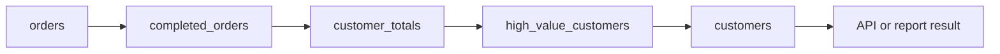

# 02- CTE vs Subquery vs Temporary Table

## Overview

Common Table Expressions (CTEs), subqueries, and temporary tables all allow SQL workloads to be decomposed into intermediate processing stages. They are not interchangeable, however. They differ in scope, lifecycle, optimizer visibility, materialization, indexing, statistics, transaction behavior, and operational complexity.

The key decision is not:

> "Which one is faster?"

It is:

> **"What lifecycle does the intermediate data require, and which representation expresses the workload most clearly while giving the database the right optimization opportunities?"**

A useful mental model is:

```text
Need intermediate relational logic?
        |
        +-- Used inside one statement
        |       |
        |       +-- Simple nested expression → Subquery
        |       |
        |       +-- Multiple named stages → CTE
        |       |
        |       +-- Recursive traversal → Recursive CTE
        |
        +-- Need to reuse data across statements
        |       |
        |       +-- Needs indexes/statistics → Temporary table
        |       |
        |       +-- Needs durability/restartability → Durable staging table
        |
        +-- Need cross-request persistence
                → Do not use CTE/temp-table state
```

For PostgreSQL, CTEs are part of a single statement and may be inlined or materialized. Temporary tables are actual temporary relations associated with a database session and can be indexed and analyzed independently.

---

## Representative Schema

Use an order-management workload:

```sql
CREATE TABLE customers (
    id bigint PRIMARY KEY,
    email text NOT NULL,
    name text NOT NULL
);

CREATE TABLE orders (
    id bigint PRIMARY KEY,
    customer_id bigint NOT NULL REFERENCES customers(id),
    status text NOT NULL,
    total_amount numeric(12, 2) NOT NULL,
    created_at timestamptz NOT NULL
);

CREATE INDEX idx_orders_customer_created_at
    ON orders (customer_id, created_at DESC, id DESC);

CREATE INDEX idx_orders_status_customer
    ON orders (status, customer_id);
```

Suppose the backend needs to calculate completed revenue per customer and then identify high-value customers.

The same logical workload can be expressed with a subquery, CTE, or temporary table.

---

## Subquery

A subquery is a query nested inside another SQL statement.

For example:

```sql
SELECT
    customer_id,
    total_revenue
FROM (
    SELECT
        customer_id,
        SUM(total_amount) AS total_revenue
    FROM orders
    WHERE status = 'completed'
    GROUP BY customer_id
) AS customer_totals
WHERE total_revenue >= 10000;
```

The derived table exists only for the duration of the statement.

### When to Use

A subquery is a good fit when:

- The intermediate logic is simple.
- The result is consumed once.
- The nesting naturally expresses the relationship.
- Introducing a named CTE would not materially improve readability.

### Advantages

- Minimal syntax.
- No temporary object lifecycle.
- Naturally scoped to the statement.
- Suitable for scalar, correlated, filtering, and derived-table operations.
- Usually gives the optimizer substantial freedom.

### Limitations

Deeply nested subqueries can become difficult to review.

For example:

```text
SELECT
    FROM (
        SELECT
            FROM (
                SELECT
                    ...
            )
    )
```

can obscure:

- Data flow.
- Result grain.
- Predicate placement.
- Cardinality.
- Which transformation happens first.

When the query has several meaningful stages, a CTE often provides better structure.

---

## CTE

A Common Table Expression uses `WITH` to name an intermediate query expression.

```sql
WITH customer_totals AS (
    SELECT
        customer_id,
        SUM(total_amount) AS total_revenue
    FROM orders
    WHERE status = 'completed'
    GROUP BY customer_id
)
SELECT
    customer_id,
    total_revenue
FROM customer_totals
WHERE total_revenue >= 10000;
```

The CTE gives the intermediate result a meaningful name:

```text
customer_totals
```

The primary value is often **clarity and composability**, not automatic performance improvement.

---

## Multi-Stage CTEs

CTEs are particularly useful when a query represents several logical transformations.

```sql
WITH completed_orders AS (
    SELECT
        id,
        customer_id,
        total_amount,
        created_at
    FROM orders
    WHERE status = 'completed'
),
customer_totals AS (
    SELECT
        customer_id,
        SUM(total_amount) AS total_revenue
    FROM completed_orders
    GROUP BY customer_id
),
high_value_customers AS (
    SELECT
        customer_id,
        total_revenue
    FROM customer_totals
    WHERE total_revenue >= 10000
)
SELECT
    c.id,
    c.email,
    h.total_revenue
FROM high_value_customers AS h
JOIN customers AS c
    ON c.id = h.customer_id;
```

The data flow becomes explicit:



Each stage should have a well-defined result grain.

```text
completed_orders
    → one row per order

customer_totals
    → one row per customer

high_value_customers
    → one row per qualifying customer
```

This makes cardinality review much easier.

---

## CTE Materialization

A common misconception is:

> "A CTE is always materialized."

That is not generally true in modern PostgreSQL.

For eligible CTEs, PostgreSQL can inline the CTE into the surrounding query.

You can explicitly request materialization:

```sql
WITH customer_totals AS MATERIALIZED (
    SELECT
        customer_id,
        SUM(total_amount) AS total_revenue
    FROM orders
    GROUP BY customer_id
)
SELECT
    customer_id
FROM customer_totals
WHERE total_revenue >= 10000;
```

Or permit inlining:

```sql
WITH customer_totals AS NOT MATERIALIZED (
    SELECT
        customer_id,
        SUM(total_amount) AS total_revenue
    FROM orders
    GROUP BY customer_id
)
SELECT
    customer_id
FROM customer_totals
WHERE total_revenue >= 10000;
```

When neither keyword is specified, PostgreSQL determines the appropriate behavior according to the query and CTE usage.

---

## MATERIALIZED vs NOT MATERIALIZED

| Option | Meaning | Useful When | Risk |
|---|---|---|---|
| Default | PostgreSQL chooses behavior | Most queries | Requires understanding actual plan |
| `MATERIALIZED` | Force intermediate materialization | Expensive result reused within statement | Can prevent predicate pushdown |
| `NOT MATERIALIZED` | Permit inlining | Predicate pushdown or better plan integration may help | Expensive computation may be repeated |

Materialization creates a planning/execution boundary.

That can be useful when:

```text
Expensive computation
        ↓
Materialize once
        ↓
Multiple consumers
```

But it can be harmful when:

```text
Outer predicate
        ↓
Could have reduced source rows early
        ↓
Materialization prevents that optimization
```

Therefore, use `MATERIALIZED` and `NOT MATERIALIZED` based on execution-plan evidence rather than intuition.

---

## Recursive CTE

Recursive CTEs are particularly useful for hierarchical data.

Example:

```sql
WITH RECURSIVE employee_tree AS (
    SELECT
        id,
        manager_id,
        name,
        0 AS depth
    FROM employees
    WHERE manager_id IS NULL

    UNION ALL

    SELECT
        e.id,
        e.manager_id,
        e.name,
        et.depth + 1
    FROM employees AS e
    JOIN employee_tree AS et
        ON e.manager_id = et.id
)
SELECT
    id,
    manager_id,
    name,
    depth
FROM employee_tree
ORDER BY depth, id;
```

Typical uses include:

- Organization hierarchies.
- Category trees.
- Dependency graphs.
- Parent-child relationships.
- Recursive traversal.

This is a case where a CTE provides capabilities that are awkward to express using an ordinary non-recursive subquery.

---

## Data-Modifying CTEs

PostgreSQL also allows data-modifying statements inside `WITH`.

For example:

```sql
WITH deleted_orders AS (
    DELETE FROM orders
    WHERE status = 'cancelled'
      AND created_at < now() - interval '1 year'
    RETURNING id
)
SELECT COUNT(*)
FROM deleted_orders;
```

This can be useful when multiple relational operations belong to one SQL statement.

However, the CTE does not make a large data modification cheap.

A large `DELETE` or `UPDATE` can still produce:

- WAL.
- Dead tuples.
- Lock pressure.
- Autovacuum workload.
- Replica lag.
- Long transactions.

For large production datasets, batching may be more appropriate.

---

## Temporary Tables

A temporary table is a temporary PostgreSQL relation.

```sql
CREATE TEMP TABLE customer_totals AS
SELECT
    customer_id,
    SUM(total_amount) AS total_revenue
FROM orders
WHERE status = 'completed'
GROUP BY customer_id;
```

The relation can then be used by subsequent statements:

```sql
SELECT
    customer_id,
    total_revenue
FROM customer_totals
WHERE total_revenue >= 10000;
```

and:

```sql
SELECT COUNT(*)
FROM customer_totals;
```

and:

```sql
SELECT AVG(total_revenue)
FROM customer_totals;
```

This is the fundamental distinction:

> **A temporary table can persist beyond the statement and be reused by multiple statements in the same session.**

---

## Temporary Table Lifecycle

Temporary tables are session-scoped by default.

PostgreSQL also provides explicit transaction cleanup:

```sql
CREATE TEMP TABLE customer_totals
ON COMMIT DROP AS
SELECT
    customer_id,
    SUM(total_amount) AS total_revenue
FROM orders
GROUP BY customer_id;
```

With `ON COMMIT DROP`, PostgreSQL removes the temporary table when the transaction commits.

Other options include:

```sql
ON COMMIT DELETE ROWS
```

and:

```sql
ON COMMIT PRESERVE ROWS
```

The lifecycle should be intentional, particularly in applications that reuse database connections.

---

## Temporary Tables and Connection Pools

This distinction is critical in backend applications.

Consider:

```text
HTTP Request A
    ↓
Connection 17
    ↓
CREATE TEMP TABLE staging

Connection returned to pool

HTTP Request B
    ↓
Connection 17
    ↓
Temporary table may still exist
```

A pooled database connection can outlive an HTTP request.

Therefore, temporary-table state should never be assumed to have request lifetime simply because the code creating it runs inside a request handler.

This matters for:

- Django persistent connections.
- SQLAlchemy pools.
- FastAPI applications.
- Celery workers.
- PgBouncer.
- Long-running administrative processes.

When appropriate, use transaction-scoped cleanup and keep the workflow explicit.

---

## Temporary Tables and PgBouncer

Temporary tables depend on PostgreSQL session state.

A workflow such as:

```text
CREATE TEMP TABLE
       ↓
INSERT
       ↓
SELECT
       ↓
DROP
```

assumes that the statements execute on the same PostgreSQL session.

PgBouncer transaction pooling can assign different transactions to different server connections.

Therefore, session-dependent features require careful compatibility analysis before using them with transaction pooling.

Do not select a PgBouncer mode solely from connection-count requirements without reviewing application behavior.

---

## Temporary Tables Can Have Indexes

A major advantage of temporary tables is independent indexing.

```sql
CREATE TEMP TABLE customer_totals AS
SELECT
    customer_id,
    SUM(total_amount) AS total_revenue
FROM orders
GROUP BY customer_id;

CREATE INDEX idx_customer_totals_customer
    ON customer_totals (customer_id);
```

This is useful when the intermediate relation is:

- Large.
- Queried repeatedly.
- Filtered selectively.
- Joined repeatedly.
- Used by several transformation steps.

A CTE or subquery does not provide the same independently managed index lifecycle.

---

## Temporary Table Statistics

Temporary tables can also have planner statistics.

After loading substantial data:

```sql
ANALYZE customer_totals;
```

can provide the optimizer with information about the temporary relation.

A production batch workflow may therefore look like:

```text
Create temporary table
        ↓
Load intermediate data
        ↓
Create useful indexes
        ↓
ANALYZE
        ↓
Execute dependent statements
        ↓
Cleanup
```

This can be particularly valuable when the intermediate dataset is large enough that poor cardinality estimates would otherwise lead to inefficient plans.

---

## Temporary Tables vs Durable Staging Tables

A temporary table should not automatically be used for every staging workflow.

Consider a Celery job that processes several million records.

If the worker crashes:

```text
Worker
  ↓
Temporary table
  ↓
Process 2 million rows
  ↓
Worker crashes
  ↓
Temporary state disappears
```

If the job needs restartability, use durable state:

```text
Worker
  ↓
Durable staging table
  ↓
Checkpoint progress
  ↓
Worker crashes
  ↓
Restart from durable checkpoint
```

The decision is:

| Requirement | Appropriate Storage |
|---|---|
| Disposable intermediate state | Temporary table |
| Intermediate state within one statement | CTE / subquery |
| Reusable session-local state | Temporary table |
| Restartable batch state | Durable staging table |
| Cross-worker shared state | Durable table or external durable system |
| Cross-request persistent state | Durable storage |

---

## CTE vs Subquery

For a single derived stage, both forms may be appropriate.

### Subquery

```sql
SELECT
    customer_id,
    total_revenue
FROM (
    SELECT
        customer_id,
        SUM(total_amount) AS total_revenue
    FROM orders
    GROUP BY customer_id
) AS totals
WHERE total_revenue > 10000;
```

### CTE

```sql
WITH totals AS (
    SELECT
        customer_id,
        SUM(total_amount) AS total_revenue
    FROM orders
    GROUP BY customer_id
)
SELECT
    customer_id,
    total_revenue
FROM totals
WHERE total_revenue > 10000;
```

The CTE is often preferable when the intermediate result has a meaningful business or technical name.

The subquery is often preferable when the transformation is short and local.

---

## CTE vs Temporary Table

The key distinction is scope:

```text
CTE
└── One SQL statement

Temporary table
└── PostgreSQL session
    ├── Statement A
    ├── Statement B
    └── Statement C
```

A temporary table provides more control but also introduces more operational state.

---

## Comparison Matrix

| Property | Subquery | CTE | Temporary Table |
|---|---|---|---|
| Scope | Statement | Statement | Session/transaction lifecycle |
| Multiple statements | No | No | Yes |
| Named intermediate stage | Limited | Excellent | Excellent |
| Recursive query | No | Yes | Possible but less natural |
| Independent indexes | No | No | Yes |
| Independent statistics | No | No | Yes |
| Reuse within statement | Possible through query structure | Yes | Yes |
| Reuse across statements | No | No | Yes |
| Materialization control | Optimizer-dependent | Explicitly available | Explicit by relation |
| Session state | No | No | Yes |
| Operational overhead | Low | Low | Higher |
| Best fit | Simple nested logic | Complex single statement | Multi-step processing |

---

## Performance Model

Avoid simplistic rules such as:

```text
Subquery = slow
CTE = slow
Temporary table = fast
```

or:

```text
CTE = optimization
Temporary table = optimization
```

The actual performance depends on:

```text
SQL semantics
      ↓
Result cardinality
      ↓
Intermediate result size
      ↓
Optimizer transformations
      ↓
Materialization
      ↓
Indexes / statistics
      ↓
CPU / memory / I/O
      ↓
Concurrency
```

Two logically similar queries can produce different physical plans.

Two syntactically different queries can also produce similar plans.

---

## Execution Plan Analysis

For important PostgreSQL workloads:

```sql
EXPLAIN (ANALYZE, BUFFERS)
WITH customer_totals AS (
    SELECT
        customer_id,
        SUM(total_amount) AS total_revenue
    FROM orders
    WHERE status = 'completed'
    GROUP BY customer_id
)
SELECT
    customer_id,
    total_revenue
FROM customer_totals
WHERE total_revenue >= 10000;
```

Review:

- Estimated rows.
- Actual rows.
- Loops.
- Scan type.
- Join strategy.
- Aggregate strategy.
- Sort operations.
- Buffer hits.
- Buffer reads.
- Execution time.

For temporary tables, dependent queries can be analyzed independently:

```sql
EXPLAIN (ANALYZE, BUFFERS)
SELECT
    customer_id,
    total_revenue
FROM customer_totals
WHERE total_revenue >= 10000;
```

This separation can be useful because PostgreSQL has independent statistics and planning boundaries for the temporary relation.

---

## Predicate Pushdown

One important optimizer consideration is whether filters can be pushed toward the underlying data.

Suppose:

```sql
WITH totals AS MATERIALIZED (
    SELECT
        customer_id,
        SUM(total_amount) AS total_revenue
    FROM orders
    GROUP BY customer_id
)
SELECT
    customer_id,
    total_revenue
FROM totals
WHERE customer_id = $1;
```

The materialization boundary may require PostgreSQL to calculate a broader intermediate result before applying the outer customer filter.

An inlineable CTE may give the optimizer more freedom.

The practical lesson is:

> **Materialization is a control mechanism, not a universal performance optimization.**

---

## Temporary Tables and Query Boundaries

Temporary tables introduce explicit statement boundaries.

For example:

```text
Statement 1
    ↓
temporary relation
    ↓
Statement 2
    ↓
temporary relation
    ↓
Statement 3
```

This can be useful when you intentionally want to:

- Inspect intermediate data.
- Index it.
- Analyze it.
- Reuse it.
- Split a complex workflow into independently planned stages.

The trade-off is additional database work and more application-side lifecycle management.

---

## Backend API Considerations

For ordinary API requests:

```text
Client
  ↓
Nginx / Load Balancer
  ↓
Django / FastAPI
  ↓
Connection Pool
  ↓
PostgreSQL
```

prefer a single SQL statement where practical.

For example:

```sql
WITH recent_orders AS (
    SELECT
        id,
        customer_id,
        total_amount,
        created_at
    FROM orders
    WHERE created_at >= now() - interval '30 days'
)
SELECT
    customer_id,
    COUNT(*) AS order_count,
    SUM(total_amount) AS total_revenue
FROM recent_orders
GROUP BY customer_id;
```

Introducing a temporary table for a simple request can add:

- More round trips.
- More statements.
- More session state.
- More cleanup requirements.
- More opportunities for transaction mistakes.

Temporary tables are generally better suited to deliberate multi-step database workflows than ordinary request/response queries.

---

## Django Considerations

Django supports many CTE-like and subquery patterns through ORM expressions, depending on the exact query requirement and Django version.

For example, existence-style logic can use `Exists`:

```python
from django.db.models import Exists, OuterRef

completed_orders = Order.objects.filter(
    customer_id=OuterRef("pk"),
    status="completed",
)

customers = (
    Customer.objects
    .annotate(has_completed_order=Exists(completed_orders))
    .filter(has_completed_order=True)
)
```

For temporary-table workflows, explicit database interaction is generally required.

```python
from django.db import connection

with connection.cursor() as cursor:
    cursor.execute(
        """
        CREATE TEMP TABLE customer_totals
        ON COMMIT DROP AS
        SELECT
            customer_id,
            SUM(total_amount) AS total_revenue
        FROM orders
        WHERE status = %s
        GROUP BY customer_id
        """,
        ["completed"],
    )

    cursor.execute(
        """
        SELECT customer_id, total_revenue
        FROM customer_totals
        WHERE total_revenue >= %s
        """,
        [10000],
    )

    rows = cursor.fetchall()
```

The same database session must remain in use for the temporary table.

---

## SQLAlchemy and FastAPI

A temporary-table workflow should deliberately keep the same connection/session:

```python
from sqlalchemy import text

with engine.begin() as connection:
    connection.execute(
        text(
            """
            CREATE TEMP TABLE customer_totals
            ON COMMIT DROP AS
            SELECT
                customer_id,
                SUM(total_amount) AS total_revenue
            FROM orders
            WHERE status = :status
            GROUP BY customer_id
            """
        ),
        {"status": "completed"},
    )

    result = connection.execute(
        text(
            """
            SELECT
                customer_id,
                total_revenue
            FROM customer_totals
            WHERE total_revenue >= :minimum
            """
        ),
        {"minimum": 10000},
    )

    rows = result.fetchall()
```

Using a single connection is intentional because temporary-table visibility is tied to the PostgreSQL session.

---

## Batch Processing and Celery

Temporary tables can be useful for a bounded batch operation:

```text
Celery worker
      ↓
Acquire DB connection
      ↓
Create temporary staging relation
      ↓
Load intermediate dataset
      ↓
Index / ANALYZE
      ↓
Transform
      ↓
Write durable result
      ↓
Commit
      ↓
Cleanup
```

However, do not use temporary tables as the sole mechanism for long-running job progress.

For jobs that need:

- Retry.
- Resume.
- Worker failover.
- Operational inspection.
- Partial progress tracking.

prefer durable staging/progress state.

Redis may coordinate ephemeral worker state, but durable correctness should not depend solely on Redis.

---

## Large Data Workloads

The choice becomes more important as data grows.

A CTE may be sufficient for:

```text
one analytical statement
```

A temporary table may be more appropriate for:

```text
large intermediate dataset
        ↓
index
        ↓
analyze
        ↓
multiple transformations
        ↓
multiple queries
```

A durable staging table may be better for:

```text
multi-minute/hour batch
        ↓
restartability required
        ↓
progress tracking
        ↓
operational recovery
```

For very large analytical workloads, consider whether PostgreSQL OLTP is the correct system for the workload.

Potential architectural alternatives include:

- Read replicas.
- Materialized views.
- Dedicated reporting databases.
- Data warehouses.
- Lakehouse/analytical systems.
- Precomputed read models.

---

## Transaction and Reliability Considerations

A CTE is part of one SQL statement.

A temporary-table workflow can span multiple statements and therefore requires deliberate transaction design.

For example:

```text
BEGIN
  ↓
CREATE TEMP TABLE
  ↓
Load / transform
  ↓
Validate
  ↓
Write durable tables
  ↓
COMMIT
```

If the transaction becomes very large, it can create:

- Long lock durations.
- Large WAL volume.
- MVCC bloat.
- Replica lag.
- Connection occupancy.
- Recovery complexity.

For large workflows, split work into bounded transactions where correctness permits.

---

## Security Considerations

Neither CTEs nor temporary tables provide authorization by themselves.

Use parameter binding:

```sql
WHERE customer_id = $1
```

rather than constructing SQL through string interpolation.

For tenant-aware queries:

```sql
WITH tenant_orders AS (
    SELECT
        id,
        customer_id,
        total_amount
    FROM orders
    WHERE tenant_id = $1
)
SELECT
    customer_id,
    SUM(total_amount) AS total_revenue
FROM tenant_orders
GROUP BY customer_id;
```

Also consider:

- Application authorization.
- Database roles.
- Row Level Security.
- Tenant isolation.
- Sensitive-column access.
- Audit requirements.

Temporary data may still contain sensitive information. "Temporary" does not mean "outside the security model."

---

## High Availability and Disaster Recovery

Temporary tables are not durable replicated application state.

If the database session disappears:

```text
Primary session
      ↓
Temporary relation
      ↓
Failover / connection loss
      ↓
Temporary state unavailable
```

Therefore:

- Do not depend on temporary tables for recovery checkpoints.
- Recreate disposable intermediate state after reconnect.
- Use durable staging for recoverable workflows.
- Test failover behavior for long-running jobs.
- Understand transaction behavior around database failover.

Backups and PITR recover durable database state, not the expectations of a particular live session's temporary objects.

---

## Monitoring

For production workloads, monitor the actual database behavior rather than the SQL construct name.

Useful PostgreSQL signals include:

```sql
SELECT
    pid,
    state,
    wait_event_type,
    wait_event,
    query_start,
    query
FROM pg_stat_activity
WHERE datname = current_database();
```

For query-level analysis, `pg_stat_statements` can help identify:

- High total execution time.
- High average execution time.
- Frequently executed queries.
- CPU-heavy workloads.

For temporary-table workflows, also monitor:

- Temporary file usage.
- Database CPU.
- I/O.
- Memory pressure.
- Transaction duration.
- Connection utilization.
- Replica lag.
- WAL generation.

---

## Cost and Operational Considerations

A temporary table can increase database resource consumption through:

- Table creation.
- Data copying.
- Temporary storage.
- Index creation.
- Statistics collection.
- Additional statements.

The cost may still be worthwhile if it avoids repeatedly executing an expensive transformation.

The correct comparison is therefore:

```text
Repeated expensive computation
        vs
One-time intermediate materialization
        + indexes
        + statistics
        + additional database operations
```

Measure total workload cost rather than individual statement latency.

---

## Common Mistakes

### Treating CTEs as Temporary Tables

A CTE is statement-scoped.

A temporary table has session/transaction lifecycle.

### Assuming Every CTE Is Materialized

PostgreSQL can inline eligible CTEs.

### Assuming MATERIALIZED Is Faster

Materialization can prevent useful optimizer transformations.

### Using Temporary Tables for Simple API Requests

This adds unnecessary statements and session state.

### Ignoring Connection Pooling

A temporary table belongs to a database session, not necessarily to the application request.

### Using Temporary Tables With Incompatible Pooling Assumptions

Transaction pooling can break workflows that depend on session-local state.

### Forgetting to ANALYZE Large Temporary Tables

Poor statistics can produce poor plans.

### Creating Large Temporary Tables Without Indexes

Repeated selective lookups can become expensive.

### Using Temporary State as a Job Checkpoint

A worker crash or connection loss can destroy the state.

### Using CTEs to Hide Bad Cardinality

Naming a query stage does not prevent incorrect joins or duplicate rows.

### Optimizing Syntax Instead of the Workload

The right choice depends on:

- Query semantics.
- Data volume.
- Intermediate cardinality.
- Execution plans.
- Reuse.
- Index requirements.
- Transaction boundaries.
- Concurrency.

---

## Production Decision Framework

Use the following sequence:

```text
What is the intermediate data?

        ↓

Is everything naturally one SQL statement?

        ├── Yes
        │     ↓
        │   Is the logic simple?
        │     ├── Yes → Subquery
        │     └── No  → CTE
        │
        └── No
              ↓
        Is the intermediate result reused?
              ├── No → Reconsider query/workflow
              └── Yes
                    ↓
             Needs indexes/statistics?
                    ├── Yes → Temporary table
                    └── No  → Compare CTE vs temp table

        ↓

Does the state need restartability?

        ├── Yes → Durable staging/work table
        └── No  → Temporary state may be appropriate

        ↓

Validate with EXPLAIN and workload measurements
```

---

## Practical Selection Matrix

| Situation | Preferred Starting Point | Reason |
|---|---|---|
| Simple nested filter | Subquery | Minimal and local |
| Scalar derived value | Scalar subquery | Natural expression |
| Complex single statement | CTE | Clear transformation stages |
| Recursive hierarchy | Recursive CTE | Native recursive semantics |
| Intermediate result reused in one statement | CTE | Named and composable |
| Intermediate result reused across statements | Temporary table | Session-local reuse |
| Intermediate result needs indexes | Temporary table | Independent indexes |
| Intermediate result needs statistics | Temporary table | `ANALYZE` support |
| Multi-step ETL | Temporary table | Explicit staging |
| Long-running restartable job | Durable staging table | Survives session failure |
| Normal REST request | Subquery / CTE / JOIN | Lower operational overhead |
| Large analytical workload | CTE / temp / specialized system | Depends on workload and scale |

---

## Production Checklist

### Query Design

- [ ] Result grain is explicit.
- [ ] Intermediate relations have clear semantics.
- [ ] Cardinality changes are understood.
- [ ] Subquery nesting is manageable.
- [ ] CTE names describe actual transformations.

### Performance

- [ ] Execution plans have been reviewed for important queries.
- [ ] CTE materialization behavior is understood.
- [ ] Intermediate result size is known.
- [ ] Temporary-table indexes are justified.
- [ ] Temporary-table statistics are analyzed where necessary.
- [ ] Query frequency and concurrency are considered.

### Application

- [ ] Connection-pool behavior is understood.
- [ ] Temporary-table session requirements are explicit.
- [ ] PgBouncer mode is compatible with session-dependent workflows.
- [ ] Django/FastAPI transaction boundaries are correct.
- [ ] Celery workers have bounded database concurrency.

### Reliability

- [ ] Temporary state is not required for durable recovery.
- [ ] Long transactions are avoided where possible.
- [ ] Retry behavior is idempotent.
- [ ] Failover behavior is understood.
- [ ] Large workflows have an operational recovery strategy.

### Security

- [ ] SQL values are parameterized.
- [ ] Tenant isolation is enforced.
- [ ] Authorization is not delegated to query structure alone.
- [ ] Temporary data is treated according to its sensitivity.
- [ ] Database permissions follow least privilege.

---

## Interview Traps

### "CTEs are always materialized."

False.

PostgreSQL can inline eligible CTEs.

### "A CTE is basically a temporary table."

False.

A CTE is a query expression scoped to a statement. A temporary table is a temporary relation with session/transaction lifecycle.

### "Temporary tables are always faster."

False.

They add creation, storage, indexing, and lifecycle overhead but can be valuable when intermediate results are reused or independently optimized.

### "Subqueries are slower than joins."

Not as a general rule.

The optimizer can transform many query forms, and the actual execution plan matters.

### "MATERIALIZED means optimized."

Not necessarily.

It deliberately constrains optimization in exchange for controlled intermediate materialization.

### "Temporary tables are request-scoped."

False.

They are associated with database sessions and have explicit transaction/session lifecycle semantics.

### "A temporary table is appropriate for a long-running background job."

Only if the intermediate state is disposable.

If recovery and restartability are requirements, durable staging is usually more appropriate.

---

## Key Takeaways

- **Use subqueries for focused nested logic and CTEs for readable, multi-stage logic within one statement:** choose based on semantics and maintainability first.
- **Do not assume CTEs are materialized or that materialization is faster:** PostgreSQL can inline eligible CTEs, and `MATERIALIZED`/`NOT MATERIALIZED` should be deliberate, plan-driven decisions.
- **Use temporary tables when intermediate data must survive multiple statements or needs independent indexes and statistics:** the added control comes with session and operational complexity.
- **Treat temporary tables as disposable session state, not durable workflow state:** connection pooling, PgBouncer, worker crashes, and failover can invalidate assumptions about their lifetime.
- **Use durable staging for restartable multi-step workloads:** the senior-level decision considers correctness, execution plans, concurrency, lifecycle, recovery, and total operational cost.