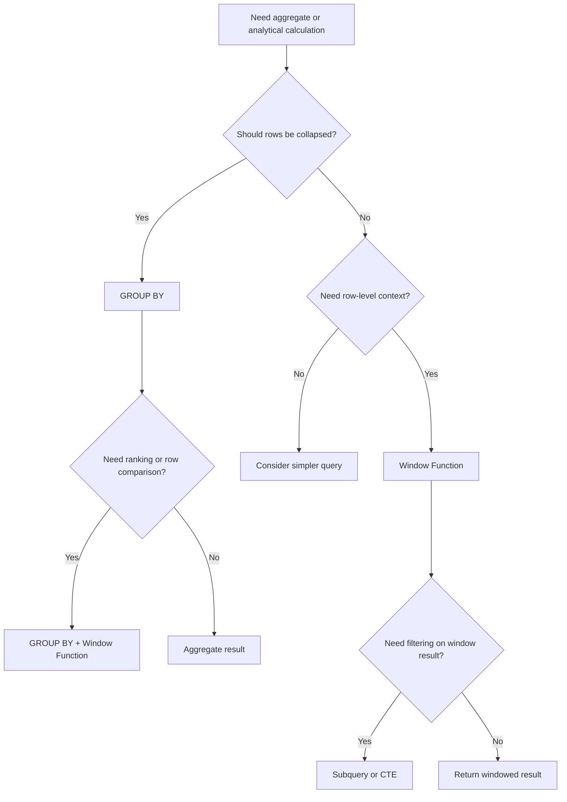

# 03- GROUP BY vs Window Function

## Overview

`GROUP BY` and window functions both perform calculations across sets of rows, but they produce fundamentally different result shapes.

The core distinction is:

> **`GROUP BY` collapses rows into groups; window functions calculate across related rows while preserving the original row grain.**

Consider an `orders` table:

```text
orders
------------------------------------------------
id    customer_id    total_amount    created_at
101   1              120.00          ...
102   1              250.00          ...
103   2              90.00           ...
104   2              300.00          ...
```

A `GROUP BY` query can produce:

```text
customer_id | total_revenue
------------+--------------
1           | 370.00
2           | 390.00
```

The individual orders disappear from the result.

A window function can instead produce:

```text
id  | customer_id | total_amount | customer_revenue
----+-------------+--------------+----------------
101 | 1           | 120.00       | 370.00
102 | 1           | 250.00       | 370.00
103 | 2           | 90.00        | 390.00
104 | 2           | 300.00       | 390.00
```

The original order rows remain.

This difference determines which technique should be used.

---

## Representative Schema

Use a typical backend order model:

```sql
CREATE TABLE customers (
    id bigint PRIMARY KEY,
    email text NOT NULL,
    name text NOT NULL
);

CREATE TABLE orders (
    id bigint PRIMARY KEY,
    customer_id bigint NOT NULL REFERENCES customers(id),
    status text NOT NULL,
    total_amount numeric(12, 2) NOT NULL,
    created_at timestamptz NOT NULL
);

CREATE INDEX idx_orders_customer_created_at
    ON orders (customer_id, created_at DESC, id DESC);
```

The examples below use completed orders unless stated otherwise.

---

## GROUP BY

`GROUP BY` partitions rows into groups and produces one result row per group.

```sql
SELECT
    customer_id,
    SUM(total_amount) AS total_revenue
FROM orders
WHERE status = 'completed'
GROUP BY customer_id;
```

The transformation is:

```text
Many order rows
      ↓
Group by customer_id
      ↓
One row per customer
```

### When to Use GROUP BY

Use `GROUP BY` when the required result grain is the grouping grain.

Typical requirements include:

- Total revenue per customer.
- Number of orders per customer.
- Average order value per month.
- Number of requests per API endpoint.
- Total sales per product.
- Daily event counts.

### Advantages

- Directly expresses aggregation.
- Produces compact result sets.
- Often appropriate for reporting and analytical queries.
- Allows filtering aggregated groups with `HAVING`.
- Works naturally with aggregate functions.

### Limitations

Once rows are grouped, individual source rows are no longer present in the grouped result.

If the requirement is:

> Return every order plus the customer's total revenue.

`GROUP BY` alone is usually not the right shape.

---

## Window Functions

A window function calculates a value over a set of related rows without collapsing the result.

Example:

```sql
SELECT
    id,
    customer_id,
    total_amount,
    SUM(total_amount) OVER (
        PARTITION BY customer_id
    ) AS customer_revenue
FROM orders
WHERE status = 'completed';
```

The result remains one row per order.

The window:

```sql
PARTITION BY customer_id
```

defines the rows participating in each calculation.

---

## Window Function Anatomy

A typical window expression looks like:

```sql
function(...) OVER (
    PARTITION BY ...
    ORDER BY ...
    ROWS BETWEEN ...
)
```

Each component has a different purpose.

| Component | Purpose |
|---|---|
| Function | Calculation such as `SUM`, `COUNT`, `AVG`, `ROW_NUMBER` |
| `PARTITION BY` | Defines independent groups for the calculation |
| `ORDER BY` | Defines row ordering within each partition |
| Frame | Defines which rows around the current row participate |

For example:

```sql
SUM(total_amount) OVER (
    PARTITION BY customer_id
    ORDER BY created_at, id
    ROWS BETWEEN UNBOUNDED PRECEDING AND CURRENT ROW
)
```

calculates a running total per customer.

---

## GROUP BY vs Window Function

| Requirement | `GROUP BY` | Window Function |
|---|---:|---:|
| One row per customer | Excellent | Possible but unnecessary |
| Preserve individual orders | No | Yes |
| Total per customer | Excellent | Excellent |
| Running total | Awkward | Excellent |
| Rank customers/orders | Awkward | Excellent |
| Top row per group | Usually requires additional query | Excellent |
| Compare row to group average | Requires join/subquery | Excellent |
| Percentage of group total | Requires additional query | Excellent |
| Aggregate result only | Excellent | Usually unnecessary |
| Row-to-row comparison | Limited | Excellent |
| Pagination metadata | Limited | Useful |

---

## The Most Important Question: What Is the Result Grain?

Before choosing either technique, define:

```text
One output row represents ______.
```

For example:

```text
GROUP BY customer_id
→ one row per customer
```

while:

```sql
SUM(total_amount) OVER (
    PARTITION BY customer_id
)
```

produces:

```text
one row per order
```

with customer-level information attached.

This distinction prevents many SQL design mistakes.

---

## Basic Aggregation with GROUP BY

Calculate completed revenue per customer:

```sql
SELECT
    customer_id,
    COUNT(*) AS order_count,
    SUM(total_amount) AS total_revenue,
    AVG(total_amount) AS average_order_value
FROM orders
WHERE status = 'completed'
GROUP BY customer_id;
```

Result:

```text
customer_id | order_count | total_revenue | average_order_value
------------+-------------+---------------+-------------------
1           | 8           | 2400.00       | 300.00
2           | 3           | 900.00        | 300.00
```

This is the canonical `GROUP BY` use case.

---

## GROUP BY with HAVING

Use `WHERE` before grouping and `HAVING` after aggregation.

```sql
SELECT
    customer_id,
    SUM(total_amount) AS total_revenue
FROM orders
WHERE status = 'completed'
GROUP BY customer_id
HAVING SUM(total_amount) >= 10000;
```

Logical processing is approximately:

```text
FROM
  ↓
WHERE
  ↓
GROUP BY
  ↓
Aggregate
  ↓
HAVING
  ↓
SELECT
```

This produces only qualifying customer groups.

---

## Window Function for Group Totals

Suppose the API needs every order plus the customer's total completed revenue:

```sql
SELECT
    id,
    customer_id,
    total_amount,
    SUM(total_amount) OVER (
        PARTITION BY customer_id
    ) AS customer_revenue
FROM orders
WHERE status = 'completed';
```

The output retains:

```text
one row per order
```

while providing:

```text
customer-level aggregate
```

This is one of the clearest cases where a window function is preferable to `GROUP BY`.

---

## Combining GROUP BY and Window Functions

They are not mutually exclusive.

Suppose the requirement is:

> Calculate monthly revenue per customer and rank each customer against other customers in that month.

First aggregate:

```sql
WITH monthly_revenue AS (
    SELECT
        customer_id,
        date_trunc('month', created_at) AS month,
        SUM(total_amount) AS revenue
    FROM orders
    WHERE status = 'completed'
    GROUP BY
        customer_id,
        date_trunc('month', created_at)
)
SELECT
    customer_id,
    month,
    revenue,
    RANK() OVER (
        PARTITION BY month
        ORDER BY revenue DESC
    ) AS revenue_rank
FROM monthly_revenue;
```

The architecture is:

```text
orders
   ↓
GROUP BY
   ↓
customer-month rows
   ↓
Window function
   ↓
rank within month
```

This pattern is extremely common in analytical SQL.

---

## Window PARTITION BY vs GROUP BY

These clauses sound similar but have different semantics.

### GROUP BY

```sql
SELECT
    customer_id,
    SUM(total_amount)
FROM orders
GROUP BY customer_id;
```

Produces:

```text
one row per customer
```

### Window PARTITION BY

```sql
SELECT
    id,
    customer_id,
    SUM(total_amount) OVER (
        PARTITION BY customer_id
    )
FROM orders;
```

Produces:

```text
one row per order
```

The window partition defines the calculation's scope.

It does not change the result grain.

---

## Running Totals

Running totals are a classic window-function problem.

```sql
SELECT
    id,
    customer_id,
    created_at,
    total_amount,
    SUM(total_amount) OVER (
        PARTITION BY customer_id
        ORDER BY created_at, id
        ROWS BETWEEN UNBOUNDED PRECEDING AND CURRENT ROW
    ) AS running_revenue
FROM orders
WHERE status = 'completed';
```

For a customer:

```text
Order 101 → 100
Order 102 → 250
Order 103 → 450
Order 104 → 700
```

`GROUP BY` does not naturally preserve the ordered rows required for this calculation.

---

## Ranking

Window functions are designed for ranking problems.

### ROW_NUMBER

```sql
SELECT
    id,
    customer_id,
    total_amount,
    ROW_NUMBER() OVER (
        PARTITION BY customer_id
        ORDER BY total_amount DESC, id
    ) AS row_number
FROM orders;
```

Every row gets a unique sequence within its customer.

### RANK

```sql
RANK() OVER (
    PARTITION BY customer_id
    ORDER BY total_amount DESC
)
```

Ties receive the same rank and leave gaps.

### DENSE_RANK

```sql
DENSE_RANK() OVER (
    PARTITION BY customer_id
    ORDER BY total_amount DESC
)
```

Ties receive the same rank without gaps.

---

## ROW_NUMBER vs RANK vs DENSE_RANK

| Function | Ties | Example values |
|---|---|---|
| `ROW_NUMBER()` | Always unique | `1, 2, 3, 4` |
| `RANK()` | Same rank, gaps | `1, 2, 2, 4` |
| `DENSE_RANK()` | Same rank, no gaps | `1, 2, 2, 3` |

Choose based on business semantics rather than memorizing the functions.

---

## Top Row Per Group

A common backend requirement is:

> Return the latest order for every customer.

A window function provides a clean solution:

```sql
SELECT
    id,
    customer_id,
    status,
    total_amount,
    created_at
FROM (
    SELECT
        o.*,
        ROW_NUMBER() OVER (
            PARTITION BY customer_id
            ORDER BY created_at DESC, id DESC
        ) AS row_number
    FROM orders AS o
) AS ranked_orders
WHERE row_number = 1;
```

This preserves a clear rule:

```text
Partition by customer
Sort newest first
Take row 1
```

PostgreSQL also provides `DISTINCT ON` for this specific class of problem:

```sql
SELECT DISTINCT ON (customer_id)
    id,
    customer_id,
    status,
    total_amount,
    created_at
FROM orders
ORDER BY
    customer_id,
    created_at DESC,
    id DESC;
```

Both are useful. Choose based on portability, readability, and the broader query requirements.

---

## Comparing Each Row With the Group Average

Suppose an API needs orders that are above their customer's average order value.

A window function makes the relationship explicit:

```sql
SELECT
    id,
    customer_id,
    total_amount,
    AVG(total_amount) OVER (
        PARTITION BY customer_id
    ) AS customer_average
FROM orders;
```

To filter using the calculated value, wrap it:

```sql
SELECT
    id,
    customer_id,
    total_amount,
    customer_average
FROM (
    SELECT
        o.*,
        AVG(total_amount) OVER (
            PARTITION BY customer_id
        ) AS customer_average
    FROM orders AS o
) AS ranked_orders
WHERE total_amount > customer_average;
```

This pattern is useful when row-level data and group-level context are both required.

---

## Percentage of Group Total

A common reporting requirement is:

> What percentage of the customer's revenue does each order represent?

```sql
SELECT
    id,
    customer_id,
    total_amount,
    ROUND(
        100.0 * total_amount
        / NULLIF(
            SUM(total_amount) OVER (
                PARTITION BY customer_id
            ),
            0
        ),
        2
    ) AS percentage_of_customer_revenue
FROM orders
WHERE status = 'completed';
```

The window function provides the denominator without collapsing the order rows.

---

## LAG and LEAD

Window functions also support row-to-row comparisons.

For example, compare an order with the customer's previous order:

```sql
SELECT
    id,
    customer_id,
    created_at,
    total_amount,
    LAG(total_amount) OVER (
        PARTITION BY customer_id
        ORDER BY created_at, id
    ) AS previous_order_amount
FROM orders;
```

This enables:

- Previous event comparisons.
- Change detection.
- Time-series analysis.
- Customer behavior analysis.
- State transitions.

`GROUP BY` does not naturally represent this row-relative operation.

---

## FIRST_VALUE and LAST_VALUE

Window functions can also expose values from another row within the window.

For example:

```sql
SELECT
    id,
    customer_id,
    created_at,
    total_amount,
    FIRST_VALUE(total_amount) OVER (
        PARTITION BY customer_id
        ORDER BY created_at, id
    ) AS first_order_amount
FROM orders;
```

Be careful with window frames, particularly for functions such as `LAST_VALUE`.

The ordering and frame determine which rows participate.

Explicit frames are often preferable when correctness depends on exact frame semantics.

---

## Window Frames

`PARTITION BY` defines the group of rows.

`ORDER BY` defines their order.

The frame defines the subset of that ordered partition used by the current calculation.

Example:

```sql
ROWS BETWEEN UNBOUNDED PRECEDING AND CURRENT ROW
```

means:

```text
First row in partition
        ↓
...
Current row
```

For running totals:

```sql
SUM(total_amount) OVER (
    PARTITION BY customer_id
    ORDER BY created_at, id
    ROWS BETWEEN UNBOUNDED PRECEDING AND CURRENT ROW
)
```

Explicit frames are valuable when precise behavior matters, particularly when duplicate ordering values exist.

---

## GROUP BY and Window Functions Together

A common misconception is:

> "Choose either GROUP BY or window functions."

In production SQL, they frequently work together.

Example:

```sql
WITH customer_revenue AS (
    SELECT
        customer_id,
        date_trunc('month', created_at) AS month,
        SUM(total_amount) AS revenue
    FROM orders
    WHERE status = 'completed'
    GROUP BY
        customer_id,
        date_trunc('month', created_at)
)
SELECT
    customer_id,
    month,
    revenue,
    SUM(revenue) OVER (
        PARTITION BY month
    ) AS monthly_market_revenue,
    RANK() OVER (
        PARTITION BY month
        ORDER BY revenue DESC
    ) AS customer_rank
FROM customer_revenue;
```

The first stage establishes the correct grain:

```text
one row per customer per month
```

The window stage adds analytical context without collapsing that result.

---

## Filtering Window Results

Window functions are evaluated after several earlier logical query phases.

Therefore, this is not valid:

```sql
SELECT
    id,
    customer_id,
    ROW_NUMBER() OVER (
        PARTITION BY customer_id
        ORDER BY created_at DESC
    ) AS row_number
FROM orders
WHERE row_number = 1;
```

The alias is not available to the `WHERE` clause at that stage.

Use a subquery:

```sql
SELECT
    id,
    customer_id,
    created_at
FROM (
    SELECT
        o.*,
        ROW_NUMBER() OVER (
            PARTITION BY customer_id
            ORDER BY created_at DESC, id DESC
        ) AS row_number
    FROM orders AS o
) AS ranked
WHERE row_number = 1;
```

A CTE is another readable option:

```sql
WITH ranked_orders AS (
    SELECT
        o.*,
        ROW_NUMBER() OVER (
            PARTITION BY customer_id
            ORDER BY created_at DESC, id DESC
        ) AS row_number
    FROM orders AS o
)
SELECT
    id,
    customer_id,
    created_at
FROM ranked_orders
WHERE row_number = 1;
```

---

## Performance Considerations

Window functions can require significant sorting or partition processing.

For example:

```sql
ROW_NUMBER() OVER (
    PARTITION BY customer_id
    ORDER BY created_at DESC, id DESC
)
```

requires PostgreSQL to produce rows in the required partition/order arrangement.

Large workloads can consume:

- CPU.
- Memory.
- Temporary disk.
- I/O.

The same applies to large `GROUP BY` operations.

Potential execution strategies include:

```text
GROUP BY
    → HashAggregate
    → GroupAggregate

Window
    → Sort / incremental sort
    → WindowAgg
```

The exact plan depends on PostgreSQL version, statistics, indexes, data distribution, and query structure.

---

## Indexing for GROUP BY

Suppose:

```sql
SELECT
    customer_id,
    SUM(total_amount)
FROM orders
GROUP BY customer_id;
```

An index on:

```sql
(customer_id)
```

may sometimes help, particularly when PostgreSQL can exploit ordered input or when combined with filtering.

However, an index does not automatically make aggregation faster.

PostgreSQL may prefer:

```text
Sequential scan
      ↓
HashAggregate
```

when scanning the table is cheaper than traversing an index.

Always validate with:

```sql
EXPLAIN (ANALYZE, BUFFERS)
SELECT
    customer_id,
    SUM(total_amount)
FROM orders
GROUP BY customer_id;
```

---

## Indexing for Window Functions

For:

```sql
ROW_NUMBER() OVER (
    PARTITION BY customer_id
    ORDER BY created_at DESC, id DESC
)
```

an index such as:

```sql
CREATE INDEX idx_orders_customer_created_at
    ON orders (customer_id, created_at DESC, id DESC);
```

aligns with the partition and ordering keys.

This does not guarantee that PostgreSQL will avoid sorting.

The optimizer still considers:

- Table size.
- Selectivity.
- Cost of index traversal.
- Required columns.
- Visibility.
- Statistics.
- Parallel execution.
- Query filters.

The correct approach is to inspect the execution plan.

---

## GROUP BY Performance

Large aggregations may use:

```text
HashAggregate
```

or:

```text
GroupAggregate
```

Hash aggregation keeps grouping state in memory and can spill when resource requirements exceed available working memory.

Sort-based aggregation requires ordered input.

Large aggregations therefore require consideration of:

- `work_mem`.
- Number of groups.
- Data volume.
- Query concurrency.
- Temporary file usage.
- CPU.
- I/O.

Increasing `work_mem` globally can be dangerous because it is applied per operation, potentially multiplying memory consumption across concurrent queries.

---

## Window Function Performance

Window operations can become expensive when:

- Partitions are very large.
- Ordering is expensive.
- Many window expressions use different orderings.
- Large intermediate datasets are generated.
- Results spill to temporary storage.

For example:

```sql
SELECT
    *,
    ROW_NUMBER() OVER (
        PARTITION BY customer_id
        ORDER BY created_at DESC
    ),
    SUM(total_amount) OVER (
        PARTITION BY customer_id
        ORDER BY total_amount DESC
    )
FROM orders;
```

These windows use different orderings.

PostgreSQL may require additional processing compared with multiple expressions sharing the same window ordering.

---

## Multiple Window Functions

When several calculations share the same partition and ordering, define the window consistently.

```sql
SELECT
    id,
    customer_id,
    created_at,
    total_amount,
    ROW_NUMBER() OVER customer_window AS row_number,
    SUM(total_amount) OVER customer_window AS running_total
FROM orders
WINDOW customer_window AS (
    PARTITION BY customer_id
    ORDER BY created_at, id
    ROWS BETWEEN UNBOUNDED PRECEDING AND CURRENT ROW
);
```

This improves readability and can make the intended execution structure clearer.

Do not assume it guarantees a single sort; inspect the plan.

---

## GROUP BY in OLTP APIs

`GROUP BY` is appropriate for bounded API aggregations.

Example:

```text
GET /customers/{id}/statistics
```

```sql
SELECT
    COUNT(*) AS order_count,
    COALESCE(SUM(total_amount), 0) AS total_revenue,
    COALESCE(AVG(total_amount), 0) AS average_order_value
FROM orders
WHERE customer_id = $1
  AND status = 'completed';
```

This returns one compact result.

For an endpoint returning individual orders plus customer-level statistics, a window function may be more appropriate.

---

## Window Functions in APIs

Suppose an API needs:

```text
Order
Order rank within customer
Customer total revenue
Running customer revenue
```

A single query can provide all of this:

```sql
SELECT
    id,
    customer_id,
    total_amount,
    ROW_NUMBER() OVER (
        PARTITION BY customer_id
        ORDER BY created_at DESC, id DESC
    ) AS order_rank,
    SUM(total_amount) OVER (
        PARTITION BY customer_id
    ) AS customer_total,
    SUM(total_amount) OVER (
        PARTITION BY customer_id
        ORDER BY created_at, id
        ROWS BETWEEN UNBOUNDED PRECEDING AND CURRENT ROW
    ) AS running_total
FROM orders
WHERE customer_id = $1;
```

This can avoid multiple database round trips.

However, keep the result bounded with appropriate filters and pagination.

---

## Django Considerations

Django supports aggregation and window expressions.

A grouped aggregation might look like:

```python
from django.db.models import Sum

customer_totals = (
    Order.objects
    .filter(status="completed")
    .values("customer_id")
    .annotate(total_revenue=Sum("total_amount"))
)
```

A window expression can retain row-level results:

```python
from django.db.models import F, Sum, Window

orders = Order.objects.annotate(
    customer_revenue=Window(
        expression=Sum("total_amount"),
        partition_by=[F("customer_id")],
    )
)
```

The exact generated SQL should still be inspected for important workloads.

ORM abstractions do not eliminate:

- Cardinality concerns.
- Window ordering.
- Index requirements.
- Sort cost.
- Memory usage.
- Query-plan analysis.

---

## Security and Authorization

Neither `GROUP BY` nor window functions provides authorization.

A tenant-aware aggregation must preserve tenant boundaries:

```sql
SELECT
    customer_id,
    SUM(total_amount) AS total_revenue
FROM orders
WHERE tenant_id = $1
  AND status = 'completed'
GROUP BY customer_id;
```

A window query requires the same care:

```sql
SELECT
    id,
    customer_id,
    total_amount,
    SUM(total_amount) OVER (
        PARTITION BY customer_id
    ) AS customer_revenue
FROM orders
WHERE tenant_id = $1
  AND status = 'completed';
```

Do not calculate a global window and then attempt to hide unauthorized rows afterward.

The input relation must already have the correct authorization scope.

For stronger isolation, PostgreSQL Row Level Security can provide an additional database-level boundary.

---

## Multi-Tenant Systems

Tenant boundaries are particularly important with window functions.

Consider:

```sql
SUM(total_amount) OVER (
    PARTITION BY customer_id
)
```

If `customer_id` is globally unique, the partition may be safe.

If identifiers are only unique within tenants, use:

```sql
SUM(total_amount) OVER (
    PARTITION BY tenant_id, customer_id
)
```

Likewise, grouped aggregation should include the correct tenant dimension:

```sql
GROUP BY tenant_id, customer_id
```

The partitioning/grouping keys must reflect the actual data model.

---

## Large Data and OLAP

Window functions are powerful analytical tools but can be expensive over very large datasets.

For high-volume reporting:

```text
OLTP PostgreSQL
      ↓
Read replica / CDC
      ↓
Analytical storage
      ↓
Aggregations / windows
      ↓
Reports
```

may be preferable.

Consider:

- Materialized views.
- Pre-aggregated tables.
- Data warehouses.
- Read replicas.
- Dedicated analytical systems.

Do not move every analytical query into the application layer simply because SQL becomes complex.

---

## GROUP BY vs Window Function Decision Tree



---

## Practical Decision Matrix

| Requirement | Recommended |
|---|---|
| Total revenue per customer | `GROUP BY` |
| Count orders per customer | `GROUP BY` |
| Average order value per month | `GROUP BY` |
| Return each order with customer total | Window function |
| Running total | Window function |
| Rank orders within customer | Window function |
| Compare row with previous row | `LAG()` |
| Compare row with next row | `LEAD()` |
| Top row per group | Window function or PostgreSQL `DISTINCT ON` |
| Percentage of group total | Window function |
| Filter groups by aggregate | `GROUP BY` + `HAVING` |
| Aggregate, then rank groups | `GROUP BY` + Window function |
| Complex analytical pipeline | Often CTE + `GROUP BY` + Window |
| Simple API aggregate | `GROUP BY` |
| Row-level API with analytical metadata | Window function |

---

## Common Mistakes

### Using GROUP BY When Rows Must Be Preserved

If the API needs every order plus customer-level statistics, `GROUP BY` alone changes the result grain.

Use a window function or aggregate separately and join the result.

### Thinking PARTITION BY Is the Same as GROUP BY

`PARTITION BY` defines the calculation scope.

It does not collapse rows.

### Using a Window Function When Only an Aggregate Result Is Required

This:

```sql
SELECT
    customer_id,
    SUM(total_amount) OVER (
        PARTITION BY customer_id
    )
FROM orders;
```

repeats the customer total for every order.

If the API needs only customer totals, prefer:

```sql
SELECT
    customer_id,
    SUM(total_amount)
FROM orders
GROUP BY customer_id;
```

### Filtering a Window Alias in WHERE

Use a subquery or CTE.

### Ignoring Window Ordering

Ranking and running calculations require deterministic ordering.

Prefer:

```sql
ORDER BY created_at DESC, id DESC
```

rather than relying on an ambiguous timestamp alone.

### Assuming Indexes Eliminate Window Sorting

The optimizer may still choose a sort.

Validate with `EXPLAIN`.

### Overusing Window Functions

A window query can be elegant but expensive over huge partitions.

### Incorrect Tenant Partitioning

A window partition that omits tenant identity can combine data across tenant boundaries.

### Fetching Unbounded Analytical Results

A correct window query can still overload an API if it returns millions of rows.

Use pagination, pre-aggregation, asynchronous exports, or analytical storage where appropriate.

---

## Production Troubleshooting

When a `GROUP BY` or window query is slow:

1. Confirm the required result grain.
2. Measure input and output cardinality.
3. Inspect the generated SQL.
4. Run `EXPLAIN (ANALYZE, BUFFERS)`.
5. Check scan and join strategies.
6. Check aggregate or window operators.
7. Look for large sorts.
8. Check temporary-file usage.
9. Check `work_mem` implications.
10. Check indexes and statistics.
11. Check query frequency and concurrency.
12. Check whether the workload belongs on the OLTP database.

For application workloads, also inspect:

- N+1 queries.
- Connection-pool saturation.
- Replica lag.
- API serialization cost.
- Large response payloads.
- Retry storms.

---

## Production Best Practices

### Define Grain First

Write down:

```text
One output row represents ______.
```

before choosing the SQL construct.

### Use GROUP BY for Aggregated Result Sets

If individual source rows are no longer required, grouping is usually the clearest representation.

### Use Window Functions for Contextual Analytics

Use them when row-level data must remain available while adding:

- Totals.
- Ranks.
- Running values.
- Previous/next values.
- Group comparisons.

### Combine Them When Appropriate

A common analytical pattern is:

```text
GROUP BY
    ↓
establish reporting grain
    ↓
Window Function
    ↓
rank / compare / calculate percentages
```

### Make Ordering Deterministic

Include a stable tie-breaker such as a primary key when row order matters.

### Validate With Execution Plans

Do not infer performance from syntax alone.

### Keep API Results Bounded

Window functions do not justify returning unbounded datasets.

### Separate OLTP and OLAP Workloads When Necessary

If analytical queries consistently consume substantial production database resources, architectural workload isolation may be more appropriate than query-level tuning alone.

---

## Interview Traps

### "GROUP BY and window functions do the same thing."

False.

`GROUP BY` collapses rows. Window functions preserve row-level results.

### "PARTITION BY creates groups like GROUP BY."

It defines partitions for calculations but does not collapse the output.

### "Window functions are always slower."

Not necessarily.

They solve problems that otherwise require joins, subqueries, or repeated aggregation.

### "GROUP BY cannot be used with window functions."

False.

They are frequently combined.

### "ROW_NUMBER, RANK, and DENSE_RANK are interchangeable."

False.

Their tie semantics differ.

### "The database automatically knows which row is first."

Not without a defined ordering.

### "An index guarantees a window query will avoid sorting."

False.

The optimizer decides whether an index-based access path is cheaper.

### "Window functions should replace all subqueries."

False.

Choose the simplest construct that correctly represents the required relational operation.

---

## Senior-Level Reasoning

A strong production SQL decision follows this sequence:

```text
Business requirement
        ↓
Expected result grain
        ↓
Input cardinality
        ↓
Need to collapse rows?
        |
        +── Yes → GROUP BY
        |
        +── No
              ↓
        Need group-level context?
              |
              +── Yes → Window Function
              |
              +── No → Simpler relational operation
        ↓
Need ranking / comparison / running state?
        ↓
Window function
        ↓
Need aggregate first?
        ↓
GROUP BY + Window Function
        ↓
Validate execution plan
        ↓
Evaluate workload at production scale
```

The key architectural question is not which feature is more advanced.

It is:

> **What should the result grain be, and what information must survive the aggregation step?**

That determines whether rows should be collapsed or preserved.

---

## Key Takeaways

- **`GROUP BY` collapses rows to the grouping grain, while window functions preserve the existing row grain:** result shape should drive the choice.
- **Use window functions for ranking, running totals, row-to-row comparisons, and group-level context attached to individual rows:** these are difficult to express cleanly with `GROUP BY` alone.
- **`GROUP BY` and window functions often work together:** aggregate first to establish the correct grain, then use windows for ranking or analytical calculations.
- **Window performance depends on partition size, ordering, memory, indexes, and concurrency:** validate large workloads with `EXPLAIN (ANALYZE, BUFFERS)` rather than assuming an index or syntax will determine performance.
- **Senior SQL design starts with result grain and authorization scope:** tenant boundaries, deterministic ordering, bounded API results, and OLTP/OLAP workload separation matter as much as the SQL expression itself.