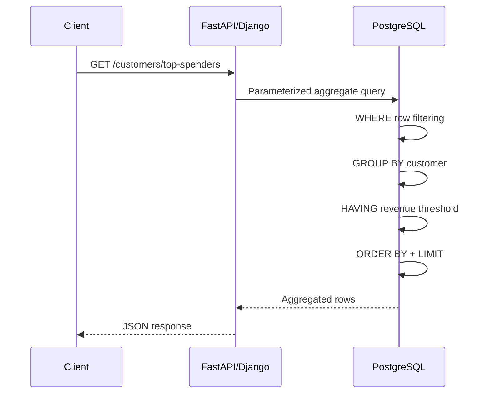

# 05- WHERE vs HAVING

## Overview

`WHERE` and `HAVING` both filter SQL results, but they operate at different stages of query processing.

The core distinction is:

> **`WHERE` filters rows before grouping and aggregation; `HAVING` filters groups after grouping and aggregation.**

For example:

```sql
SELECT
    customer_id,
    SUM(total_amount) AS total_revenue
FROM orders
WHERE status = 'completed'
GROUP BY customer_id
HAVING SUM(total_amount) >= 10000;
```

This query performs two different filtering operations:

```text
orders
  ↓
WHERE status = 'completed'
  ↓
remaining rows
  ↓
GROUP BY customer_id
  ↓
SUM(total_amount)
  ↓
customer groups
  ↓
HAVING SUM(total_amount) >= 10000
  ↓
final groups
```

Understanding this distinction is fundamental for writing correct aggregation queries and for optimizing production SQL.

---

## Representative Schema

Use a typical backend order model:

```sql
CREATE TABLE orders (
    id bigint PRIMARY KEY,
    customer_id bigint NOT NULL,
    status text NOT NULL,
    total_amount numeric(12, 2) NOT NULL,
    created_at timestamptz NOT NULL
);

CREATE INDEX idx_orders_customer_created_at
    ON orders (customer_id, created_at DESC, id DESC);

CREATE INDEX idx_orders_status_created_at
    ON orders (status, created_at);
```

Example data:

```text
id   customer_id   status       total_amount
---  ------------  -----------  ------------
101  1             completed    500.00
102  1             completed    700.00
103  1             cancelled    900.00
104  2             completed    300.00
105  2             completed    400.00
```

---

## WHERE

`WHERE` filters individual rows from the input relation.

```sql
SELECT
    id,
    customer_id,
    total_amount
FROM orders
WHERE status = 'completed';
```

Only rows satisfying the predicate participate in later query processing.

Conceptually:

```text
All rows
   ↓
WHERE predicate
   ↓
Filtered rows
```

### When to Use WHERE

Use `WHERE` for predicates that can be evaluated against individual input rows.

Typical examples:

```sql
WHERE status = 'completed'
```

```sql
WHERE customer_id = 42
```

```sql
WHERE created_at >= CURRENT_DATE - INTERVAL '30 days'
```

```sql
WHERE total_amount >= 1000
```

```sql
WHERE tenant_id = $1
```

These conditions do not require the result of an aggregate calculation.

---

## HAVING

`HAVING` filters groups after grouping and aggregation.

```sql
SELECT
    customer_id,
    SUM(total_amount) AS total_revenue
FROM orders
GROUP BY customer_id
HAVING SUM(total_amount) >= 10000;
```

Conceptually:

```text
All rows
   ↓
GROUP BY customer_id
   ↓
Customer groups
   ↓
SUM(total_amount)
   ↓
HAVING SUM(total_amount) >= 10000
   ↓
Qualified groups
```

### When to Use HAVING

Use `HAVING` when the condition depends on a grouped or aggregated result.

Examples:

```sql
HAVING COUNT(*) >= 10
```

```sql
HAVING SUM(total_amount) > 10000
```

```sql
HAVING AVG(total_amount) >= 500
```

```sql
HAVING MAX(created_at) >= CURRENT_DATE - INTERVAL '7 days'
```

---

## The Core Difference

| Characteristic | `WHERE` | `HAVING` |
|---|---|---|
| Filters rows | Yes | Indirectly, after grouping |
| Filters groups | No | Yes |
| Runs conceptually before `GROUP BY` | Yes | No |
| Runs conceptually after aggregation | No | Yes |
| Can reference ordinary row columns | Yes | Yes, when valid in grouped query |
| Commonly uses aggregate functions | No | Yes |
| Can reduce rows before aggregation | Yes | No |
| Can filter aggregate results | No | Yes |

---

## Basic Example

Suppose the requirement is:

> Calculate completed revenue for customers whose completed orders total at least $10,000.

Use both clauses:

```sql
SELECT
    customer_id,
    SUM(total_amount) AS total_revenue
FROM orders
WHERE status = 'completed'
GROUP BY customer_id
HAVING SUM(total_amount) >= 10000;
```

The responsibilities are separate:

```text
WHERE
→ Which orders participate?

GROUP BY
→ How are participating orders grouped?

HAVING
→ Which resulting groups qualify?
```

This is the most useful mental model.

---

## Why WHERE Comes Before Aggregation

Consider:

```sql
SELECT
    customer_id,
    SUM(total_amount) AS revenue
FROM orders
WHERE status = 'completed'
GROUP BY customer_id;
```

A cancelled order never enters the aggregation.

If customer `1` has:

```text
completed → 500
completed → 700
cancelled → 900
```

the result is:

```text
customer_id | revenue
------------+--------
1           | 1200
```

The `900` cancelled order was removed before `SUM()` ran.

---

## Why HAVING Comes After Aggregation

Consider:

```sql
SELECT
    customer_id,
    SUM(total_amount) AS revenue
FROM orders
GROUP BY customer_id
HAVING SUM(total_amount) >= 1000;
```

The database first calculates each customer's aggregate:

```text
Customer 1 → 2100
Customer 2 → 700
```

Then:

```text
HAVING revenue >= 1000
```

effectively keeps:

```text
Customer 1
```

The condition depends on the group-level calculation.

---

## Logical Query Processing Order

The exact physical execution plan is optimizer-dependent, but the logical SQL processing model is useful for understanding `WHERE` and `HAVING`.

A simplified sequence is:

```text
FROM
  ↓
JOIN / ON
  ↓
WHERE
  ↓
GROUP BY
  ↓
HAVING
  ↓
SELECT
  ↓
DISTINCT
  ↓
ORDER BY
  ↓
LIMIT
```

This explains why:

```sql
WHERE SUM(total_amount) > 10000
```

is not valid.

At the conceptual `WHERE` stage, the aggregate result does not yet exist.

Instead:

```sql
HAVING SUM(total_amount) > 10000
```

is the appropriate construct.

---

## Filtering Before Aggregation

Consider a large orders table:

```sql
SELECT
    customer_id,
    SUM(total_amount) AS revenue
FROM orders
WHERE status = 'completed'
GROUP BY customer_id;
```

If only 10% of orders are completed, filtering them before aggregation can significantly reduce the amount of data that the aggregate operation processes.

Conceptually:

```text
10 million orders
      ↓
WHERE status = completed
      ↓
1 million rows
      ↓
GROUP BY
      ↓
Aggregation
```

This is one reason `WHERE` is often important for performance, not just correctness.

---

## Filtering After Aggregation

Suppose there are one million completed orders across 100,000 customers.

```sql
SELECT
    customer_id,
    SUM(total_amount) AS revenue
FROM orders
WHERE status = 'completed'
GROUP BY customer_id
HAVING SUM(total_amount) >= 10000;
```

The `WHERE` reduces the input rows.

The `HAVING` then filters the resulting 100,000 customer groups.

The two filters operate on different data sets:

```text
WHERE
→ source rows

HAVING
→ aggregated groups
```

---

## A Common Incorrect Query

Suppose the requirement is:

> Find customers with at least 10 completed orders.

A developer may write:

```sql
SELECT
    customer_id,
    COUNT(*)
FROM orders
WHERE status = 'completed'
GROUP BY customer_id
WHERE COUNT(*) >= 10;
```

This is invalid.

The correct query is:

```sql
SELECT
    customer_id,
    COUNT(*) AS order_count
FROM orders
WHERE status = 'completed'
GROUP BY customer_id
HAVING COUNT(*) >= 10;
```

---

## WHERE vs HAVING Without GROUP BY

`HAVING` can also appear without an explicit `GROUP BY` when the query produces a single aggregate group.

For example:

```sql
SELECT
    COUNT(*) AS order_count
FROM orders
HAVING COUNT(*) > 1000000;
```

The entire result is treated as one group.

This can be useful for conditional aggregate results, but `WHERE` is still the correct choice for row-level filtering.

---

## WHERE on Aggregate Input vs HAVING on Aggregate Result

These two queries are not equivalent:

```sql
SELECT
    customer_id,
    SUM(total_amount) AS revenue
FROM orders
WHERE total_amount >= 100
GROUP BY customer_id;
```

and:

```sql
SELECT
    customer_id,
    SUM(total_amount) AS revenue
FROM orders
GROUP BY customer_id
HAVING SUM(total_amount) >= 100;
```

The first means:

> Sum only orders worth at least 100.

The second means:

> Sum all orders, but return customers whose total is at least 100.

For a customer with:

```text
40
40
40
```

the results differ:

```text
WHERE total_amount >= 100
→ no rows enter aggregation

HAVING SUM(total_amount) >= 100
→ customer qualifies with revenue = 120
```

This distinction is critical.

---

## Predicate Pushdown

A senior SQL engineer should understand that some predicates written in `HAVING` may be safely moved to `WHERE`, while others cannot.

For example:

```sql
SELECT
    customer_id,
    COUNT(*)
FROM orders
GROUP BY customer_id
HAVING customer_id = 42;
```

The condition does not depend on an aggregate.

It can be expressed as:

```sql
SELECT
    customer_id,
    COUNT(*)
FROM orders
WHERE customer_id = 42
GROUP BY customer_id;
```

The second form is usually clearer and can reduce the rows entering the grouping operation.

However, do not mechanically move every `HAVING` predicate.

This:

```sql
HAVING COUNT(*) >= 10
```

cannot be moved to `WHERE`, because the count does not exist until after grouping.

---

## Predicate Classification

A useful rule is:

| Predicate | Preferred location |
|---|---|
| `status = 'completed'` | `WHERE` |
| `customer_id = 42` | `WHERE` |
| `created_at >= ...` | `WHERE` |
| `total_amount > 100` | `WHERE` |
| `COUNT(*) >= 10` | `HAVING` |
| `SUM(total_amount) > 10000` | `HAVING` |
| `AVG(total_amount) >= 500` | `HAVING` |
| `MAX(created_at) >= ...` | `HAVING` |
| Non-aggregate group key condition | Usually `WHERE` |

---

## WHERE with JOINs

`WHERE` also interacts with join semantics.

For example:

```sql
SELECT
    c.id,
    c.name,
    o.id AS order_id
FROM customers AS c
LEFT JOIN orders AS o
    ON o.customer_id = c.id
WHERE o.status = 'completed';
```

This effectively removes customers without matching completed orders and can therefore behave like an inner join for this condition.

If the intended requirement is:

> Keep all customers but only attach completed orders.

put the predicate in the join condition:

```sql
SELECT
    c.id,
    c.name,
    o.id AS order_id
FROM customers AS c
LEFT JOIN orders AS o
    ON o.customer_id = c.id
   AND o.status = 'completed';
```

This is a separate but important `WHERE` filtering consideration.

---

## WHERE + GROUP BY + HAVING with JOINs

A realistic reporting query might be:

```sql
SELECT
    c.id,
    c.name,
    COUNT(o.id) AS completed_orders,
    SUM(o.total_amount) AS revenue
FROM customers AS c
JOIN orders AS o
    ON o.customer_id = c.id
WHERE o.status = 'completed'
  AND o.created_at >= CURRENT_DATE - INTERVAL '90 days'
GROUP BY
    c.id,
    c.name
HAVING SUM(o.total_amount) >= 10000;
```

The stages represent distinct business rules:

```text
WHERE
→ only completed orders from the last 90 days

GROUP BY
→ one result row per customer

HAVING
→ only customers with at least $10,000 revenue
```

---

## HAVING with Multiple Conditions

Multiple group-level conditions can be combined:

```sql
SELECT
    customer_id,
    COUNT(*) AS order_count,
    SUM(total_amount) AS revenue,
    AVG(total_amount) AS average_order_value
FROM orders
WHERE status = 'completed'
GROUP BY customer_id
HAVING COUNT(*) >= 10
   AND SUM(total_amount) >= 10000
   AND AVG(total_amount) >= 500;
```

Each `HAVING` predicate operates on the grouped result.

---

## HAVING with Conditional Aggregation

Conditional aggregation is useful when multiple business metrics need to be evaluated.

```sql
SELECT
    customer_id,
    COUNT(*) AS total_orders,
    COUNT(*) FILTER (
        WHERE status = 'completed'
    ) AS completed_orders,
    SUM(total_amount) FILTER (
        WHERE status = 'completed'
    ) AS completed_revenue
FROM orders
GROUP BY customer_id
HAVING COUNT(*) FILTER (
    WHERE status = 'completed'
) >= 10;
```

PostgreSQL's `FILTER` syntax can make conditional aggregates clearer than repeated `CASE` expressions.

---

## WHERE vs HAVING with NULL

Both clauses follow SQL three-valued logic.

A predicate that evaluates to `UNKNOWN` does not qualify a row/group.

For example:

```sql
WHERE total_amount > 100
```

does not match:

```text
total_amount = NULL
```

Similarly:

```sql
HAVING SUM(total_amount) > 1000
```

does not pass when the aggregate evaluates to `NULL`.

Use explicit handling where required:

```sql
HAVING COALESCE(SUM(total_amount), 0) > 1000
```

The exact behavior should be considered carefully when outer joins and nullable values are involved.

---

## WHERE and Soft Deletes

Backend systems frequently use soft deletion:

```sql
deleted_at timestamptz
```

A tenant-safe aggregate might be:

```sql
SELECT
    customer_id,
    COUNT(*) AS order_count
FROM orders
WHERE tenant_id = $1
  AND deleted_at IS NULL
GROUP BY customer_id
HAVING COUNT(*) >= 5;
```

The soft-delete condition belongs in `WHERE` because it determines which source rows participate in the aggregate.

---

## Multi-Tenant Applications

Tenant filtering should normally happen before aggregation:

```sql
SELECT
    customer_id,
    SUM(total_amount) AS revenue
FROM orders
WHERE tenant_id = $1
  AND status = 'completed'
GROUP BY customer_id
HAVING SUM(total_amount) >= 10000;
```

This is preferable to aggregating across all tenants and attempting to filter afterward.

Reasons include:

- Correctness.
- Security.
- Reduced data processing.
- Better selectivity.
- Smaller intermediate results.

For PostgreSQL Row Level Security, database policies provide an additional authorization boundary, but application query design should still reflect tenant-aware access patterns.

---

## Security Considerations

`WHERE` is often part of the authorization boundary.

For example:

```sql
SELECT
    id,
    customer_id,
    total_amount
FROM orders
WHERE tenant_id = $1
  AND customer_id = $2;
```

The tenant condition should not be treated as an optional business filter.

Use parameterized queries:

```python
cursor.execute(
    """
    SELECT
        customer_id,
        SUM(total_amount) AS revenue
    FROM orders
    WHERE tenant_id = %s
      AND status = %s
    GROUP BY customer_id
    HAVING SUM(total_amount) >= %s
    """,
    [tenant_id, "completed", minimum_revenue],
)
```

Do not interpolate user-controlled values into SQL strings.

---

## Performance and Indexing

`WHERE` predicates can often benefit directly from indexes.

For:

```sql
SELECT
    customer_id,
    SUM(total_amount)
FROM orders
WHERE tenant_id = $1
  AND status = 'completed'
GROUP BY customer_id;
```

a potentially useful index might begin with:

```sql
CREATE INDEX idx_orders_tenant_status_customer
    ON orders (tenant_id, status, customer_id);
```

Whether this is actually beneficial depends on:

- Data distribution.
- Selectivity.
- Query frequency.
- Table size.
- Column correlation.
- Write overhead.
- Existing indexes.

Do not create indexes simply because a column appears in `WHERE`.

---

## HAVING and Indexes

Indexes generally cannot directly eliminate groups based on:

```sql
HAVING SUM(total_amount) > 10000
```

because the aggregate must be computed before the condition can be evaluated.

An index can still improve the underlying scan or filtering:

```text
Index / scan
    ↓
WHERE filtering
    ↓
Aggregation
    ↓
HAVING
```

Therefore, optimizing a `HAVING` query often begins by reducing the amount of data entering the aggregation.

---

## Execution Plans

Use:

```sql
EXPLAIN (ANALYZE, BUFFERS)
SELECT
    customer_id,
    SUM(total_amount) AS revenue
FROM orders
WHERE status = 'completed'
GROUP BY customer_id
HAVING SUM(total_amount) >= 10000;
```

Inspect:

- Scan type.
- Rows removed by filter.
- Aggregate strategy.
- Number of groups.
- Sort operations.
- Buffer reads.
- Temporary I/O.
- Actual vs estimated row counts.

The query optimizer may reorder or push predicates when semantics allow.

Therefore, SQL's logical order should not be confused with the exact physical execution order.

---

## Aggregation and Large Tables

For large tables, the difference between filtering before and after aggregation can be substantial.

Consider:

```text
100 million orders
       ↓
WHERE status = completed
       ↓
15 million rows
       ↓
GROUP BY customer_id
       ↓
500,000 groups
       ↓
HAVING revenue > threshold
```

This is generally preferable to forcing the aggregation to consider irrelevant rows.

For recurring analytical workloads, consider:

- Pre-aggregated tables.
- Materialized views.
- Read replicas.
- CDC pipelines.
- Dedicated analytical storage.

---

## Backend API Example

Suppose an API provides:

```text
GET /customers/top-spenders
```

with a minimum revenue threshold.

SQL:

```sql
SELECT
    customer_id,
    COUNT(*) AS completed_orders,
    SUM(total_amount) AS total_revenue
FROM orders
WHERE tenant_id = $1
  AND status = 'completed'
  AND created_at >= $2
GROUP BY customer_id
HAVING SUM(total_amount) >= $3
ORDER BY total_revenue DESC
LIMIT $4;
```

The request flow is:



The database performs the filtering and aggregation close to the data, avoiding unnecessary transfer of raw orders to the application.

---

## Django ORM Example

A grouped query can be expressed using Django's aggregation API:

```python
from django.db.models import Count, Sum

customers = (
    Order.objects
    .filter(
        tenant_id=tenant_id,
        status="completed",
        created_at__gte=start_date,
    )
    .values("customer_id")
    .annotate(
        order_count=Count("id"),
        total_revenue=Sum("total_amount"),
    )
    .filter(total_revenue__gte=minimum_revenue)
)
```

The ORM expresses the distinction through:

```text
filter(...)
→ WHERE

values(...)
→ GROUP BY

annotate(...)
→ aggregate expressions

filter(total_revenue__gte=...)
→ HAVING
```

The generated SQL should still be inspected for performance-critical queries.

---

## FastAPI / SQLAlchemy Example

With SQLAlchemy:

```python
from sqlalchemy import func, select

stmt = (
    select(
        Order.customer_id,
        func.count(Order.id).label("order_count"),
        func.sum(Order.total_amount).label("total_revenue"),
    )
    .where(
        Order.tenant_id == tenant_id,
        Order.status == "completed",
        Order.created_at >= start_date,
    )
    .group_by(Order.customer_id)
    .having(func.sum(Order.total_amount) >= minimum_revenue)
    .order_by(func.sum(Order.total_amount).desc())
    .limit(limit)
)
```

The important point is that ORM syntax should preserve the same relational reasoning as handwritten SQL.

---

## WHERE vs HAVING in Reporting Systems

Reporting queries often use both:

```sql
SELECT
    date_trunc('month', created_at) AS month,
    customer_id,
    SUM(total_amount) AS revenue
FROM orders
WHERE status = 'completed'
  AND created_at >= CURRENT_DATE - INTERVAL '12 months'
GROUP BY
    date_trunc('month', created_at),
    customer_id
HAVING SUM(total_amount) >= 5000;
```

This means:

```text
WHERE
→ restrict the reporting period and source rows

GROUP BY
→ establish month/customer grain

HAVING
→ keep groups meeting the revenue threshold
```

This pattern is common in dashboards, analytics APIs, and scheduled reporting jobs.

---

## Common Mistakes

### Using HAVING for Row Filtering

Instead of:

```sql
SELECT
    customer_id,
    COUNT(*)
FROM orders
GROUP BY customer_id
HAVING status = 'completed';
```

use:

```sql
SELECT
    customer_id,
    COUNT(*)
FROM orders
WHERE status = 'completed'
GROUP BY customer_id;
```

The status predicate is a row-level condition.

### Using WHERE for Aggregate Filtering

This is invalid:

```sql
WHERE COUNT(*) >= 10
```

Use:

```sql
HAVING COUNT(*) >= 10
```

### Confusing Input Filtering With Group Filtering

These are different:

```sql
WHERE total_amount >= 100
```

and:

```sql
HAVING SUM(total_amount) >= 100
```

The first changes which rows are aggregated.

The second changes which groups survive.

### Moving HAVING Conditions Without Checking Semantics

Only predicates that are logically independent of aggregation can safely move to `WHERE`.

### Filtering Tenant Data After Aggregation

Always enforce tenant scope before aggregation where appropriate.

### Assuming Logical Order Equals Execution Order

PostgreSQL may optimize and reorder operations.

Use logical order to understand semantics and execution plans to understand performance.

---

## Production Pitfalls

### Expensive Aggregation

A query can have an efficient `WHERE` clause and still be expensive if it produces millions of groups.

### Low-Selectivity Filters

A predicate such as:

```sql
WHERE status IN ('completed', 'pending')
```

may match most rows and provide limited reduction.

### Large Sorts

Queries combining:

```sql
GROUP BY
HAVING
ORDER BY aggregate
LIMIT
```

may still need to process many groups before determining the top results.

### Incorrect Aggregation After JOINs

Joining one-to-many tables before aggregation can multiply rows:

```text
customer
   ↓
orders
   ↓
order_items
```

If the query does not account for join cardinality, `SUM()` can be inflated.

`WHERE` and `HAVING` cannot fix an incorrect relational shape.

### Application-Side Filtering

Avoid retrieving millions of rows into Python and then applying what could have been a database-side `WHERE` or `HAVING` condition.

---

## Senior-Level Decision Framework

For every predicate, ask:

```text
Does this condition apply to an individual source row?
        |
        +── Yes → WHERE
        |
        +── No
             ↓
Does it depend on an aggregate/group result?
        |
        +── Yes → HAVING
        |
        +── No → Reconsider query structure
```

Then evaluate:

```text
Correctness
    ↓
Result grain
    ↓
Predicate placement
    ↓
Input cardinality
    ↓
Indexes
    ↓
Aggregation cost
    ↓
Execution plan
    ↓
Concurrency / workload impact
```

The goal is not simply to make SQL syntactically valid.

The goal is to ensure each predicate operates on the correct relational stage.

---

## Interview Traps

### "WHERE and HAVING both filter rows."

Not exactly.

`WHERE` filters input rows; `HAVING` filters groups after aggregation.

### "HAVING is only valid with GROUP BY."

Not necessarily.

A query can use `HAVING` with a single aggregate group even without an explicit `GROUP BY`.

### "HAVING is always slower than WHERE."

The predicates serve different purposes. When a non-aggregate predicate can safely be applied earlier, moving it to `WHERE` can reduce aggregation work.

### "You can use COUNT(*) in WHERE."

No.

Aggregate results are evaluated after row filtering.

Use:

```sql
HAVING COUNT(*) > 10
```

### "WHERE and HAVING are interchangeable."

No.

For:

```sql
SUM(total_amount)
```

filtering input rows and filtering aggregate results produce different answers.

### "SQL executes exactly in the order written."

No.

Logical query processing provides the semantic model; the optimizer can choose a different physical execution strategy.

---

## Production Checklist

Before deploying a query containing `WHERE` and `HAVING`, verify:

- [ ] Row-level predicates are in `WHERE`.
- [ ] Aggregate-dependent predicates are in `HAVING`.
- [ ] The result grain is explicitly understood.
- [ ] Tenant and authorization filters are applied correctly.
- [ ] Soft-deleted records are handled intentionally.
- [ ] Filtering before aggregation is maximized where semantically valid.
- [ ] Join cardinality cannot inflate aggregates.
- [ ] Appropriate indexes exist for high-value selective predicates.
- [ ] `EXPLAIN (ANALYZE, BUFFERS)` has been reviewed for important queries.
- [ ] API result size is bounded.
- [ ] Large analytical workloads are isolated when necessary.
- [ ] ORM-generated SQL has been inspected for production-critical paths.

---

## Key Takeaways

- **`WHERE` filters source rows before grouping, while `HAVING` filters groups after aggregation:** this is the fundamental distinction.
- **Use `WHERE` for row-level predicates and `HAVING` for aggregate-dependent predicates:** mixing these responsibilities can produce incorrect results or unnecessary work.
- **Filtering before aggregation can substantially reduce database work:** push valid selective predicates into `WHERE` while preserving semantics.
- **`WHERE` and `HAVING` do not compensate for incorrect joins or aggregation grain:** always verify cardinality before trusting aggregate results.
- **Senior SQL optimization combines predicate placement with indexing, execution-plan analysis, tenant isolation, and workload architecture:** logical correctness comes before micro-optimization.