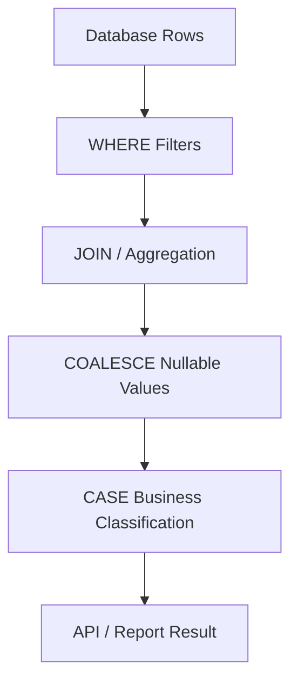

# 06- CASE vs COALESCE

## Overview

`CASE` and `COALESCE` are both used to produce conditional values in SQL, but they solve different classes of problems.

The core distinction is:

> **`CASE` expresses conditional business logic; `COALESCE` selects the first non-NULL value from a list of expressions.**

For example:

```sql
CASE
    WHEN status = 'completed' THEN 'success'
    WHEN status = 'cancelled' THEN 'failed'
    ELSE 'pending'
END
```

expresses multiple conditional branches.

By contrast:

```sql
COALESCE(display_name, name, email)
```

means:

> Use `display_name` if it is not `NULL`; otherwise use `name`; otherwise use `email`.

Both are important in production SQL because backend systems frequently contain nullable data, fallback values, status mapping, optional relationships, and derived business fields.

---

## Representative Schema

Use a typical backend customer/order model:

```sql
CREATE TABLE customers (
    id bigint PRIMARY KEY,
    email text NOT NULL,
    name text NOT NULL,
    display_name text,
    phone text,
    created_at timestamptz NOT NULL
);

CREATE TABLE orders (
    id bigint PRIMARY KEY,
    customer_id bigint NOT NULL REFERENCES customers(id),
    status text NOT NULL,
    total_amount numeric(12, 2),
    discount_amount numeric(12, 2),
    shipped_at timestamptz,
    cancelled_at timestamptz,
    created_at timestamptz NOT NULL
);
```

This schema contains realistic nullable fields such as:

- `display_name`
- `phone`
- `total_amount`
- `discount_amount`
- `shipped_at`
- `cancelled_at`

These are common places where `COALESCE` and `CASE` become useful.

---

## CASE

`CASE` evaluates conditions and returns a value from the first matching branch.

The searched form is:

```sql
CASE
    WHEN condition_1 THEN result_1
    WHEN condition_2 THEN result_2
    ELSE default_result
END
```

Example:

```sql
SELECT
    id,
    status,
    CASE
        WHEN status = 'completed' THEN 'success'
        WHEN status = 'cancelled' THEN 'failed'
        WHEN status = 'pending' THEN 'processing'
        ELSE 'unknown'
    END AS status_category
FROM orders;
```

The expression maps database state into an application-facing classification.

---

## Why CASE Exists

`CASE` is useful when the output depends on conditions rather than merely NULL availability.

Typical uses include:

- Status classification.
- Business rules.
- Conditional pricing.
- Conditional aggregation.
- Risk classification.
- API response fields.
- Data migration transformations.
- Bucketing numeric values.
- Conditional sorting.

Example:

```sql
CASE
    WHEN total_amount >= 10000 THEN 'enterprise'
    WHEN total_amount >= 1000 THEN 'high_value'
    WHEN total_amount >= 100 THEN 'standard'
    ELSE 'low_value'
END
```

The conditions are evaluated in order.

The first matching `WHEN` determines the result.

---

## Simple CASE vs Searched CASE

SQL supports two common forms.

### Searched CASE

This is the most flexible form:

```sql
CASE
    WHEN status = 'completed' THEN 'success'
    WHEN status = 'cancelled' THEN 'failed'
    ELSE 'other'
END
```

Each `WHEN` contains a boolean condition.

### Simple CASE

A simple `CASE` compares one expression against values:

```sql
CASE status
    WHEN 'completed' THEN 'success'
    WHEN 'cancelled' THEN 'failed'
    WHEN 'pending' THEN 'processing'
    ELSE 'other'
END
```

Simple `CASE` is concise when all branches compare the same expression.

---

## CASE Evaluation Order

Conditions are evaluated from top to bottom.

```sql
CASE
    WHEN total_amount >= 10000 THEN 'enterprise'
    WHEN total_amount >= 1000 THEN 'high_value'
    WHEN total_amount >= 100 THEN 'standard'
    ELSE 'low_value'
END
```

An amount of:

```text
15000
```

matches the first condition.

The database does not continue to the later branches for the result.

Ordering conditions incorrectly can therefore change business behavior.

---

## CASE Requires an ELSE Decision

If no `WHEN` condition matches and there is no `ELSE`, the result is `NULL`.

```sql
CASE
    WHEN status = 'completed' THEN 'success'
END
```

For an unknown status, the expression returns `NULL`.

In production code, explicitly choosing an `ELSE` is often safer:

```sql
CASE
    WHEN status = 'completed' THEN 'success'
    WHEN status = 'cancelled' THEN 'failed'
    ELSE 'unknown'
END
```

This makes unexpected states visible instead of silently converting them into `NULL`.

---

## COALESCE

`COALESCE` returns the first expression that is not `NULL`.

```sql
COALESCE(display_name, name, email)
```

The evaluation conceptually looks like:

```text
display_name
    ↓
NULL?
    ↓ yes
name
    ↓
NULL?
    ↓ yes
email
```

For example:

```text
display_name = NULL
name = "Alex"
email = "alex@example.com"
```

produces:

```text
Alex
```

---

## Why COALESCE Exists

Nullable database columns are common because some values are genuinely optional.

`COALESCE` provides a concise way to define fallback behavior.

Typical uses include:

- Default display values.
- Optional configuration.
- Nullable aggregates.
- Fallback timestamps.
- Optional foreign-key-related values.
- API response fields.
- Reporting.
- Data migration.
- Calculations involving nullable columns.

Example:

```sql
SELECT
    id,
    COALESCE(display_name, name, email) AS display_name
FROM customers;
```

---

## CASE vs COALESCE

| Requirement | `CASE` | `COALESCE` |
|---|---:|---:|
| Conditional business logic | Excellent | No |
| Multiple boolean conditions | Excellent | No |
| NULL fallback | Possible | Excellent |
| First non-NULL value | Possible but verbose | Excellent |
| Status mapping | Excellent | Poor fit |
| Default nullable value | Possible | Excellent |
| Conditional aggregation | Excellent | Sometimes |
| Range classification | Excellent | No |
| Fallback columns | Possible | Excellent |
| Complex decision tree | Excellent | No |

A useful rule is:

> If the decision is based on **conditions**, think `CASE`. If the decision is based on **NULL fallback**, think `COALESCE`.

---

## CASE Can Replicate COALESCE

Conceptually:

```sql
COALESCE(display_name, name, email)
```

can be represented using `CASE`:

```sql
CASE
    WHEN display_name IS NOT NULL THEN display_name
    WHEN name IS NOT NULL THEN name
    ELSE email
END
```

But `COALESCE` is clearer because the requirement is specifically:

> Return the first non-NULL value.

Use the construct that communicates intent directly.

---

## COALESCE Can Sometimes Replace Simple CASE

Suppose:

```sql
CASE
    WHEN discount_amount IS NULL THEN 0
    ELSE discount_amount
END
```

is being used only to replace `NULL` with zero.

Prefer:

```sql
COALESCE(discount_amount, 0)
```

The second form is shorter and expresses the actual intent.

---

## Numeric Calculations

Nullable values can cause unexpected results.

Consider:

```sql
SELECT
    total_amount - discount_amount AS net_amount
FROM orders;
```

If:

```text
total_amount = 500
discount_amount = NULL
```

the result is:

```text
NULL
```

If a missing discount means zero, use:

```sql
SELECT
    total_amount - COALESCE(discount_amount, 0) AS net_amount
FROM orders;
```

Now the result is:

```text
500
```

This is one of the most common production uses of `COALESCE`.

---

## COALESCE and Aggregate Functions

Aggregates can return `NULL`.

For example:

```sql
SELECT
    SUM(total_amount)
FROM orders
WHERE customer_id = $1
  AND status = 'completed';
```

If there are no qualifying rows, `SUM()` returns `NULL`.

If the API contract requires zero:

```sql
SELECT
    COALESCE(SUM(total_amount), 0) AS total_revenue
FROM orders
WHERE customer_id = $1
  AND status = 'completed';
```

This prevents the database's nullable result from leaking into an API where zero has the intended business meaning.

---

## COUNT vs SUM

`COUNT(*)` behaves differently from most aggregates:

```sql
SELECT COUNT(*)
FROM orders
WHERE customer_id = $1;
```

returns:

```text
0
```

when no rows match.

By contrast:

```sql
SELECT SUM(total_amount)
FROM orders
WHERE customer_id = $1;
```

can return:

```text
NULL
```

Therefore:

```sql
COALESCE(SUM(total_amount), 0)
```

is often appropriate, while wrapping `COUNT(*)` with `COALESCE` is usually unnecessary.

---

## COALESCE and LEFT JOIN

`COALESCE` is particularly useful with optional relationships.

Suppose every customer should be returned even when they have no orders:

```sql
SELECT
    c.id,
    c.name,
    COALESCE(SUM(o.total_amount), 0) AS total_revenue
FROM customers AS c
LEFT JOIN orders AS o
    ON o.customer_id = c.id
GROUP BY
    c.id,
    c.name;
```

For a customer with no matching orders, the aggregate can be `NULL`, and `COALESCE` converts that to the desired business value:

```text
0
```

This is preferable to filtering the customer out with an inner join when the requirement is to retain customers with no orders.

---

## COALESCE and Display Values

A backend API may need a display label:

```sql
SELECT
    id,
    COALESCE(display_name, name, email, 'Unknown customer') AS display_label
FROM customers;
```

This provides a deterministic fallback chain.

However, do not use a fallback merely to hide invalid data.

If `name` is supposed to be mandatory, a `NULL` name may indicate a data-integrity problem that should be fixed at the schema level.

---

## NULL Is Not the Same as Empty String

`COALESCE` handles `NULL`, not empty strings.

Given:

```text
display_name = ''
name = 'Alex'
```

this:

```sql
COALESCE(display_name, name)
```

returns:

```text
''
```

because an empty string is not `NULL`.

If empty strings should also count as missing in PostgreSQL:

```sql
COALESCE(NULLIF(display_name, ''), name)
```

This first converts an empty string to `NULL`, then applies the fallback.

Be careful with whitespace-only strings:

```text
'   '
```

which are still not empty strings.

If whitespace should also be treated as missing, normalize it explicitly.

---

## CASE for Business Rules

`CASE` is better when the output depends on multiple business conditions.

Example:

```sql
SELECT
    id,
    total_amount,
    CASE
        WHEN status = 'cancelled' THEN 'not_billable'
        WHEN total_amount >= 10000 THEN 'enterprise'
        WHEN total_amount >= 1000 THEN 'high_value'
        ELSE 'standard'
    END AS billing_category
FROM orders;
```

The order matters because multiple conditions may be true.

A cancelled order worth `20000` is classified as:

```text
not_billable
```

because that condition appears first.

---

## Conditional Aggregation

`CASE` is commonly used inside aggregate functions.

For example:

```sql
SELECT
    customer_id,
    COUNT(*) AS total_orders,
    COUNT(
        CASE
            WHEN status = 'completed' THEN 1
        END
    ) AS completed_orders
FROM orders
GROUP BY customer_id;
```

In PostgreSQL, `FILTER` can often express this more directly:

```sql
SELECT
    customer_id,
    COUNT(*) AS total_orders,
    COUNT(*) FILTER (
        WHERE status = 'completed'
    ) AS completed_orders
FROM orders
GROUP BY customer_id;
```

When using PostgreSQL, prefer `FILTER` where it makes conditional aggregation clearer.

---

## CASE for Conditional Pricing

Suppose pricing depends on order value:

```sql
SELECT
    id,
    total_amount,
    CASE
        WHEN total_amount >= 10000 THEN total_amount * 0.90
        WHEN total_amount >= 5000 THEN total_amount * 0.95
        ELSE total_amount
    END AS discounted_amount
FROM orders;
```

This belongs naturally in `CASE` because the decision depends on ranges.

---

## CASE and NULL

`CASE` can explicitly distinguish NULL:

```sql
CASE
    WHEN shipped_at IS NULL THEN 'not_shipped'
    ELSE 'shipped'
END
```

Do not write:

```sql
CASE shipped_at
    WHEN NULL THEN 'not_shipped'
    ELSE 'shipped'
END
```

`NULL` cannot be tested with ordinary equality semantics.

Use:

```sql
IS NULL
```

or:

```sql
IS NOT NULL
```

---

## CASE vs COALESCE for Status Defaults

Suppose a status can be NULL.

This:

```sql
COALESCE(status, 'pending')
```

means:

> If status is NULL, use pending.

This:

```sql
CASE
    WHEN status = 'completed' THEN 'success'
    WHEN status = 'cancelled' THEN 'failed'
    WHEN status IS NULL THEN 'pending'
    ELSE 'unknown'
END
```

means:

> Map multiple states into a business classification.

The second is appropriate when multiple conditions exist.

---

## Combining CASE and COALESCE

They often work together.

Example:

```sql
SELECT
    id,
    COALESCE(display_name, name, email) AS customer_label,
    CASE
        WHEN status = 'completed' THEN 'success'
        WHEN status = 'cancelled' THEN 'failed'
        ELSE 'active'
    END AS status_category,
    COALESCE(discount_amount, 0) AS discount_amount
FROM orders
JOIN customers
    ON customers.id = orders.customer_id;
```

Each expression has a different responsibility:

```text
COALESCE
→ NULL fallback

CASE
→ business classification
```

---

## Data Flow

A production query may look like:



The important point is that these expressions transform values after the underlying rows have been selected and joined.

They do not replace proper schema constraints, authorization, or filtering.

---

## Type Resolution

`CASE` and `COALESCE` must produce a compatible result type.

For example:

```sql
CASE
    WHEN status = 'completed' THEN 'success'
    ELSE 'other'
END
```

produces a text-like result.

But mixing incompatible types can cause errors or unexpected coercion.

Use explicit casts when the intended type is important:

```sql
COALESCE(discount_amount, 0::numeric)
```

This can be particularly useful when working with:

- `numeric`.
- `bigint`.
- `timestamp`.
- JSON values.
- User-defined types.
- ORM-generated expressions.

---

## Short-Circuit Semantics and Planning

`CASE` and `COALESCE` are conditional expressions, but senior engineers should avoid treating them as a blanket guarantee that every unused expression can never be evaluated in every circumstance.

PostgreSQL documents conditional-expression evaluation with short-circuit behavior, but constant expressions and planning-time evaluation can produce exceptions earlier than expected.

For example, do not use conditional expressions as a substitute for validating dangerous constants or structurally invalid expressions.

Prefer explicit safe expressions and correct data validation.

---

## Performance Considerations

`CASE` and `COALESCE` are generally inexpensive scalar expressions.

The larger performance question is usually where they are used.

For example:

```sql
SELECT
    CASE
        WHEN status = 'completed' THEN 'success'
        ELSE 'other'
    END
FROM orders;
```

is typically not problematic.

But wrapping an indexed column inside a predicate can affect index usability:

```sql
WHERE COALESCE(status, 'pending') = 'completed'
```

This may be less optimizer-friendly than a predicate that directly expresses the underlying condition:

```sql
WHERE status = 'completed'
```

If the fallback semantics are genuinely required, evaluate the execution plan and consider whether an expression index is appropriate.

---

## Avoid Functions Around Indexed Predicates Without Reason

Suppose:

```sql
CREATE INDEX idx_orders_status
    ON orders (status);
```

Prefer:

```sql
WHERE status = 'completed'
```

over:

```sql
WHERE COALESCE(status, 'pending') = 'completed'
```

when they are semantically equivalent for the application's data model.

If the expression is necessary and frequently queried, PostgreSQL supports expression indexes:

```sql
CREATE INDEX idx_orders_effective_status
    ON orders ((COALESCE(status, 'pending')));
```

Do not add such an index automatically. Expression indexes increase storage and write/update costs and should be justified by real workload patterns.

---

## CASE in ORDER BY

`CASE` is useful for custom business ordering.

For example:

```sql
SELECT
    id,
    status,
    created_at
FROM orders
ORDER BY
    CASE status
        WHEN 'pending' THEN 1
        WHEN 'processing' THEN 2
        WHEN 'completed' THEN 3
        WHEN 'cancelled' THEN 4
        ELSE 5
    END,
    created_at DESC,
    id DESC;
```

This can prioritize workflow states.

For large datasets, however, a computed ordering expression can make index-supported ordering more difficult.

If this ordering is critical and frequent, consider whether the business priority should be represented as durable data or otherwise modeled for efficient querying.

---

## CASE in UPDATE

`CASE` is useful for controlled data transformations.

```sql
UPDATE orders
SET
    discount_amount = CASE
        WHEN total_amount >= 10000 THEN total_amount * 0.10
        WHEN total_amount >= 5000 THEN total_amount * 0.05
        ELSE 0
    END
WHERE status = 'completed';
```

For production migrations:

- Test on representative data.
- Use appropriate transaction boundaries.
- Consider lock duration.
- Consider WAL volume.
- Batch large updates.
- Monitor replica lag.
- Ensure the transformation is idempotent when retries are possible.

Do not use a single massive update blindly against a high-volume production table.

---

## CASE in Data Migration

Suppose a legacy status column needs normalization:

```sql
UPDATE orders
SET status = CASE status
    WHEN 'done' THEN 'completed'
    WHEN 'complete' THEN 'completed'
    WHEN 'void' THEN 'cancelled'
    ELSE status
END
WHERE status IN ('done', 'complete', 'void');
```

This is useful for deterministic migrations.

Before deployment, validate:

```sql
SELECT
    status,
    COUNT(*)
FROM orders
GROUP BY status
ORDER BY status;
```

A migration should not silently convert unexpected values into an incorrect state.

---

## COALESCE in Data Migration

`COALESCE` can provide defaults during schema transitions.

For example:

```sql
UPDATE orders
SET discount_amount = COALESCE(discount_amount, 0)
WHERE discount_amount IS NULL;
```

However, if the application and database semantics now guarantee that missing discounts mean zero, consider enforcing that invariant:

```sql
ALTER TABLE orders
ALTER COLUMN discount_amount SET DEFAULT 0;
```

and, where appropriate:

```sql
ALTER TABLE orders
ALTER COLUMN discount_amount SET NOT NULL;
```

`COALESCE` can compensate for nullable data, but schema constraints are preferable when the domain says a value must exist.

---

## COALESCE and Defaults

A common mistake is confusing:

```sql
COALESCE(column, default_value)
```

with:

```sql
DEFAULT default_value
```

They solve different problems.

| Mechanism | Purpose |
|---|---|
| `DEFAULT` | Supplies a value when an `INSERT` omits the column |
| `COALESCE` | Supplies a value when an expression evaluates to `NULL` |
| `CASE` | Selects a value based on conditions |
| `NOT NULL` | Prevents NULL storage |

For example:

```sql
CREATE TABLE users (
    id bigint PRIMARY KEY,
    active boolean NOT NULL DEFAULT true
);
```

is a schema-level invariant.

By contrast:

```sql
COALESCE(active, true)
```

is a query-time fallback.

Do not use query-time fallbacks to hide a schema invariant that should be enforced.

---

## API Response Design

Suppose a FastAPI endpoint returns:

```json
{
  "customer_name": "Alex",
  "total_revenue": 0,
  "status": "pending"
}
```

The database query can establish these values:

```sql
SELECT
    COALESCE(c.display_name, c.name, c.email) AS customer_name,
    COALESCE(SUM(o.total_amount), 0) AS total_revenue,
    CASE
        WHEN COUNT(o.id) = 0 THEN 'pending'
        WHEN COUNT(o.id) FILTER (
            WHERE o.status = 'completed'
        ) > 0 THEN 'active'
        ELSE 'inactive'
    END AS customer_status
FROM customers AS c
LEFT JOIN orders AS o
    ON o.customer_id = c.id
WHERE c.id = $1
GROUP BY
    c.id,
    c.display_name,
    c.name,
    c.email;
```

The database is producing a domain-oriented result instead of forcing Python to repeatedly reconstruct the same logic.

The application should still own business rules that are too complex or volatile to maintain safely in SQL.

---

## Security Considerations

`CASE` and `COALESCE` do not provide authorization.

For a multi-tenant query:

```sql
SELECT
    customer_id,
    COALESCE(SUM(total_amount), 0) AS revenue
FROM orders
WHERE tenant_id = $1
GROUP BY customer_id;
```

the tenant boundary must be established independently of the fallback expression.

Use parameterized values:

```python
cursor.execute(
    """
    SELECT
        customer_id,
        COALESCE(SUM(total_amount), 0) AS revenue
    FROM orders
    WHERE tenant_id = %s
    GROUP BY customer_id
    """,
    [tenant_id],
)
```

Do not use `CASE` or `COALESCE` to obscure unauthorized rows or sensitive values.

Authorization should be enforced through:

- Correct `WHERE` predicates.
- Database permissions.
- Row Level Security where appropriate.
- Application authorization.
- Secure connection and credential management.

---

## Monitoring and Troubleshooting

When a query using `CASE` or `COALESCE` becomes slow, inspect the entire query rather than blaming the scalar expression.

Use:

```sql
EXPLAIN (ANALYZE, BUFFERS)
SELECT
    ...
FROM ...
WHERE ...;
```

Look for:

- Sequential scans.
- Unexpected index avoidance.
- Large joins.
- Excessive rows.
- Sort operations.
- Aggregation cost.
- Poor cardinality estimates.

For production APIs, correlate database metrics with:

- Request latency.
- Query latency.
- Connection-pool utilization.
- CPU.
- I/O.
- Replica lag.
- Error rates.

A `CASE` expression containing ten branches is rarely the primary reason a query is slow; poor relational shape or excessive data processing is usually more important.

---

## Common Mistakes

### Using CASE for Simple NULL Fallback

Instead of:

```sql
CASE
    WHEN phone IS NULL THEN email
    ELSE phone
END
```

prefer:

```sql
COALESCE(phone, email)
```

### Using COALESCE for Business Logic

This:

```sql
COALESCE(status, 'pending')
```

does not mean:

> Map all non-completed statuses to pending.

It only handles `NULL`.

For business classification, use `CASE`.

### Forgetting That Empty Strings Are Not NULL

```sql
COALESCE('', 'fallback')
```

returns:

```text
''
```

not:

```text
fallback
```

### Omitting ELSE from Important CASE Logic

Unexpected values become `NULL`.

### Using CASE to Hide Invalid Data

If a required database field is unexpectedly `NULL`, silently converting it to a default may hide a data-quality problem.

### Assuming COALESCE Fixes Every NULL Problem

You still need to understand where the `NULL` originated:

- Missing row.
- Nullable column.
- Outer join.
- Aggregate with no input.
- Explicit `NULL`.
- Data-quality issue.

### Using COALESCE in Indexed Predicates Without Checking the Plan

Expressions around indexed columns can change access-path choices.

### Replacing Schema Constraints With Query Expressions

If a value must never be NULL, enforce:

```sql
NOT NULL
```

instead of relying on:

```sql
COALESCE(column, default)
```

everywhere.

---

## Production Decision Matrix

| Requirement | Preferred construct |
|---|---|
| First non-NULL value | `COALESCE` |
| Default NULL numeric value | `COALESCE` |
| Nullable aggregate to zero | `COALESCE` |
| Fallback display name | `COALESCE` |
| Status mapping | `CASE` |
| Numeric range classification | `CASE` |
| Conditional pricing | `CASE` |
| Conditional ordering | `CASE` |
| Multiple business conditions | `CASE` |
| Conditional aggregate | `CASE` or PostgreSQL `FILTER` |
| Complex fallback with conditions | `CASE` |
| Enforce required data | `NOT NULL`, not `COALESCE` |
| Insert-time default | `DEFAULT`, not `COALESCE` |

---

## Senior-Level Decision Framework

Use this mental model:

```text
What determines the output?
        |
        +── NULL / non-NULL state
        |       ↓
        |    COALESCE
        |
        +── Boolean/business conditions
                ↓
              CASE
```

Then ask:

```text
Is this query-time behavior?
        |
        +── Yes → CASE / COALESCE
        |
        +── No
             ↓
Should the invariant exist in the schema?
             |
             +── Yes → NOT NULL / DEFAULT / constraint
```

This distinction is important.

A senior engineer does not simply make a query return the desired value. They also determine whether the database schema should guarantee that value in the first place.

---

## Best Practices

### Prefer the Simplest Expression That Matches the Intent

Use:

```sql
COALESCE(phone, email)
```

instead of an equivalent verbose `CASE`.

Use:

```sql
CASE
    WHEN total_amount >= 10000 THEN 'enterprise'
    ELSE 'standard'
END
```

when the requirement is conditional classification.

### Keep Business Logic Explicit

Complex `CASE` expressions should remain readable.

If a query contains dozens of branches representing volatile application logic, consider moving the rule into:

- Application code.
- A reference/configuration table.
- A dedicated database function where appropriate.

### Preserve Data Integrity

Use:

```sql
NOT NULL
DEFAULT
CHECK
FOREIGN KEY
UNIQUE
```

when the domain requires database-level guarantees.

### Test NULL and Boundary Cases

For `CASE`, test:

- Every branch.
- Boundary values.
- Unknown values.
- `NULL`.
- Overlapping conditions.

For `COALESCE`, test:

- First value present.
- First value NULL.
- Multiple values NULL.
- All values NULL.
- Empty strings where relevant.

### Inspect Generated SQL

Django and SQLAlchemy can generate `CASE` and `COALESCE` expressions.

For performance-sensitive paths, verify the actual SQL and execution plan rather than assuming ORM behavior.

---

## Interview Traps

### "CASE and COALESCE are interchangeable."

Not conceptually.

`CASE` expresses conditional logic; `COALESCE` handles NULL fallback.

### "COALESCE treats empty strings as NULL."

False.

Empty strings are values.

### "CASE automatically returns the ELSE value when a condition is false."

Only if an `ELSE` is supplied. Otherwise the result is `NULL`.

### "CASE WHEN column = NULL works."

False.

Use:

```sql
column IS NULL
```

### "COALESCE makes a column NOT NULL."

False.

It changes the query result, not the stored schema.

### "COALESCE is equivalent to DEFAULT."

False.

`DEFAULT` applies during insertion when the column is omitted; `COALESCE` operates during expression evaluation.

### "CASE always makes queries slow."

No.

Scalar conditional expressions are usually not the dominant cost. The overall query plan matters.

### "COALESCE always uses the first expression."

It returns the first expression that is not `NULL`.

---

## Key Takeaways

- **Use `CASE` for conditional business logic and `COALESCE` for NULL fallback:** choosing the construct that matches the semantic requirement improves clarity and correctness.
- **`COALESCE` does not treat empty strings as NULL and does not enforce schema integrity:** use `NULLIF` when appropriate and database constraints when invariants must be guaranteed.
- **`CASE` is powerful for classification, conditional aggregation, pricing, and custom ordering:** condition order and an explicit `ELSE` are important for predictable behavior.
- **Query-time fallbacks should not replace schema-level guarantees:** use `NOT NULL`, `DEFAULT`, and constraints when the data model requires them.
- **For production performance, optimize the complete query rather than blaming scalar expressions:** inspect predicates, indexes, joins, aggregation, cardinality, and `EXPLAIN (ANALYZE, BUFFERS)`.