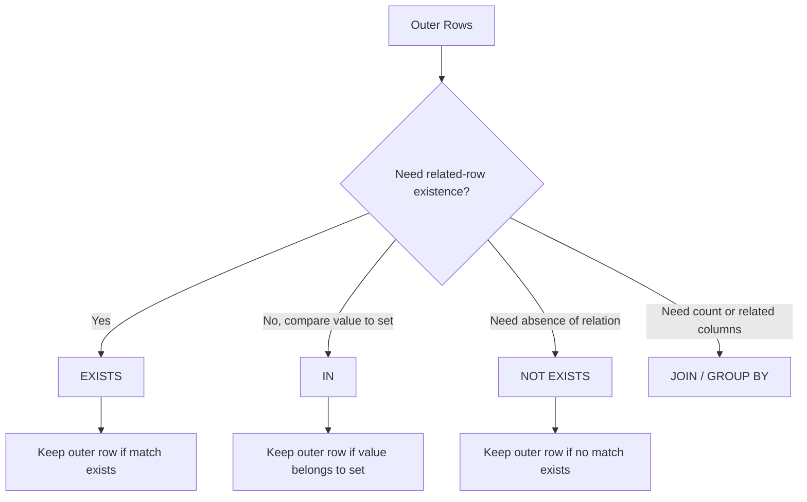

# 07- EXISTS vs IN

## Overview

`EXISTS` and `IN` are commonly used when a query needs to determine whether related data exists in another result set.

They often express similar business requirements, but their semantics differ:

- `EXISTS` asks whether at least one matching row exists.
- `IN` compares a value against a set of values.
- `NOT EXISTS` tests for the absence of matching rows.
- `NOT IN` has important `NULL` semantics that can produce surprising results.

For example:

```sql
SELECT
    c.id,
    c.email
FROM customers AS c
WHERE EXISTS (
    SELECT 1
    FROM orders AS o
    WHERE o.customer_id = c.id
      AND o.status = 'completed'
);
```

means:

> Return customers for whom at least one completed order exists.

An equivalent-looking `IN` query is:

```sql
SELECT
    c.id,
    c.email
FROM customers AS c
WHERE c.id IN (
    SELECT o.customer_id
    FROM orders AS o
    WHERE o.status = 'completed'
);
```

Both can be correct. The better choice depends on the relationship being expressed, `NULL` behavior, data shape, and execution plan.

---

## Representative Schema

Use a typical backend schema:

```sql
CREATE TABLE customers (
    id bigint PRIMARY KEY,
    tenant_id bigint NOT NULL,
    email text NOT NULL,
    created_at timestamptz NOT NULL
);

CREATE TABLE orders (
    id bigint PRIMARY KEY,
    tenant_id bigint NOT NULL,
    customer_id bigint NOT NULL REFERENCES customers(id),
    status text NOT NULL,
    total_amount numeric(12, 2) NOT NULL,
    created_at timestamptz NOT NULL
);

CREATE INDEX idx_orders_customer_status
    ON orders (customer_id, status);

CREATE INDEX idx_orders_tenant_customer_status
    ON orders (tenant_id, customer_id, status);
```

This structure represents a common backend relationship:

```text
Customer
   │
   └──< Orders
```

The examples use customer existence and related-order conditions.

---

## EXISTS

`EXISTS` evaluates whether its subquery returns at least one row.

```sql
SELECT
    c.id,
    c.email
FROM customers AS c
WHERE EXISTS (
    SELECT 1
    FROM orders AS o
    WHERE o.customer_id = c.id
      AND o.status = 'completed'
);
```

The actual values selected inside the subquery are generally irrelevant to the existence test.

Therefore:

```sql
SELECT 1
```

is conventional.

The important part is:

```sql
WHERE o.customer_id = c.id
```

which correlates the subquery with the outer row.

---

## Why EXISTS Exists

`EXISTS` expresses a **semi-join** style requirement:

> Keep the outer row if a matching row exists.

This is different from asking for columns from the related table.

Typical use cases include:

- Customers with orders.
- Users with permissions.
- Products with inventory.
- Accounts with active subscriptions.
- Resources with authorization records.
- Records with related audit entries.
- Excluding records with related failures.

The output remains at the outer table's grain.

---

## Correlated EXISTS

A correlated `EXISTS` references the outer query:

```sql
SELECT
    c.id,
    c.email
FROM customers AS c
WHERE EXISTS (
    SELECT 1
    FROM orders AS o
    WHERE o.customer_id = c.id
);
```

Conceptually:

```text
Customer 1
   ↓
Does an order exist for customer 1?
   ↓
Yes → return customer

Customer 2
   ↓
Does an order exist for customer 2?
   ↓
No → exclude customer
```

The optimizer does not necessarily execute this as a literal nested query once per customer. PostgreSQL can transform the logic into an efficient semi-join when appropriate.

This distinction matters:

> SQL syntax describes relational intent; the optimizer determines the physical execution strategy.

---

## IN

`IN` checks whether an expression matches any value in a set.

```sql
SELECT
    id,
    email
FROM customers
WHERE id IN (
    SELECT customer_id
    FROM orders
    WHERE status = 'completed'
);
```

The outer customer ID is compared against the values returned by the subquery.

Conceptually:

```text
completed order customer IDs
        ↓
{10, 20, 30, 40}
        ↓
customer.id IN that set
```

---

## IN With Explicit Values

`IN` is also useful for a small known set of values:

```sql
SELECT
    id,
    email
FROM customers
WHERE id IN (10, 20, 30, 40);
```

This is a natural use of `IN`.

It becomes less clear when the requirement is fundamentally about the existence of a related row.

---

## EXISTS vs IN

| Characteristic | `EXISTS` | `IN` |
|---|---|---|
| Primary semantic | Matching row exists | Value belongs to a set |
| Common use | Related-row existence | Set membership |
| Correlation | Natural | Possible but less typical |
| Output grain | Outer query | Outer query |
| Related columns required | No | No |
| Sensitive to subquery `NULL` | Generally no for positive existence | Yes |
| Natural for anti-join | `NOT EXISTS` | `NOT IN` with caveats |
| Performance | Often excellent | Often excellent |
| Always faster | No | No |

Do not choose based on a blanket rule such as:

> "EXISTS is always faster."

Modern optimizers can transform equivalent queries into similar execution strategies.

---

## Positive EXISTS and Positive IN

For a simple non-NULL relationship, these can represent the same set:

```sql
WHERE c.id IN (
    SELECT o.customer_id
    FROM orders AS o
)
```

and:

```sql
WHERE EXISTS (
    SELECT 1
    FROM orders AS o
    WHERE o.customer_id = c.id
)
```

However, the semantics are easier to reason about differently:

```text
IN
→ Is this value in that set?

EXISTS
→ Does a matching related row exist?
```

Use the expression that most directly communicates the business requirement.

---

## The NULL Problem With IN

`NULL` makes `IN` significantly more subtle.

Consider:

```sql
SELECT
    1
WHERE 1 NOT IN (1, NULL);
```

This does not return a row.

The reason is SQL's three-valued logic.

`1 NOT IN (1, NULL)` is effectively equivalent to:

```text
1 <> 1
AND
1 <> NULL
```

The first comparison is `FALSE`.

The second is `UNKNOWN`.

The combined result is not `TRUE`.

This becomes particularly dangerous with `NOT IN` subqueries.

---

## NOT IN and NULL

Consider:

```sql
SELECT
    c.id
FROM customers AS c
WHERE c.id NOT IN (
    SELECT customer_id
    FROM orders
);
```

If `orders.customer_id` can contain `NULL`, the query can produce unexpected results.

Even if the current schema declares the column `NOT NULL`, relying on `NOT IN` requires maintaining that invariant.

For exclusion logic involving related rows, prefer:

```sql
SELECT
    c.id
FROM customers AS c
WHERE NOT EXISTS (
    SELECT 1
    FROM orders AS o
    WHERE o.customer_id = c.id
);
```

`NOT EXISTS` directly expresses:

> There is no matching order.

This is one of the most important practical differences between the two constructs.

---

## NOT EXISTS

`NOT EXISTS` is the standard pattern for anti-joins.

Example:

```sql
SELECT
    c.id,
    c.email
FROM customers AS c
WHERE NOT EXISTS (
    SELECT 1
    FROM orders AS o
    WHERE o.customer_id = c.id
);
```

This returns customers with no orders.

It is useful for:

- Customers without orders.
- Users without permissions.
- Products without inventory.
- Accounts without subscriptions.
- Records without corresponding events.
- Detecting missing relationships.

---

## NOT EXISTS vs NOT IN

Prefer:

```sql
WHERE NOT EXISTS (
    SELECT 1
    FROM orders AS o
    WHERE o.customer_id = c.id
)
```

over:

```sql
WHERE c.id NOT IN (
    SELECT o.customer_id
    FROM orders AS o
)
```

when expressing relational non-existence.

The reason is not simply performance.

`NOT EXISTS` has clearer semantics and avoids the classic `NULL` trap associated with `NOT IN`.

If `NOT IN` is used intentionally, ensure its subquery cannot contain `NULL`, or explicitly exclude them:

```sql
WHERE c.id NOT IN (
    SELECT o.customer_id
    FROM orders AS o
    WHERE o.customer_id IS NOT NULL
);
```

Even then, `NOT EXISTS` is often clearer for relationship-based exclusion.

---

## EXISTS vs JOIN

A common mistake is replacing `EXISTS` with a `JOIN` without considering cardinality.

Suppose the requirement is:

> Return customers who have at least one completed order.

Using `EXISTS`:

```sql
SELECT
    c.id,
    c.email
FROM customers AS c
WHERE EXISTS (
    SELECT 1
    FROM orders AS o
    WHERE o.customer_id = c.id
      AND o.status = 'completed'
);
```

A join version is:

```sql
SELECT
    c.id,
    c.email
FROM customers AS c
JOIN orders AS o
    ON o.customer_id = c.id
WHERE o.status = 'completed';
```

But if a customer has five completed orders, the join produces five customer rows.

You might then be tempted to add:

```sql
DISTINCT
```

```sql
SELECT DISTINCT
    c.id,
    c.email
FROM customers AS c
JOIN orders AS o
    ON o.customer_id = c.id
WHERE o.status = 'completed';
```

This can be correct, but it introduces unnecessary result multiplication if the requirement is only existence.

`EXISTS` directly represents the desired relational operation.

---

## Semi-Join Mental Model

`EXISTS` can be understood as a semi-join:

```text
Customers ──────────────┐
                        │
                        ↓
                 Matching orders
                        │
                        ↓
                Keep customer once
```

A normal inner join produces combinations:

```text
Customer
   ×
Matching Orders
   ↓
Potentially multiple output rows
```

A semi-join answers only:

```text
Does a match exist?
```

and retains the outer row once.

This is why `EXISTS` is often the cleanest choice for existence predicates.

---

## Authorization Example

Authorization is a particularly important use of `EXISTS`.

Suppose:

```sql
CREATE TABLE user_permissions (
    user_id bigint NOT NULL,
    resource_id bigint NOT NULL,
    permission text NOT NULL,
    PRIMARY KEY (user_id, resource_id, permission)
);
```

Check whether a user can access a resource:

```sql
SELECT
    r.id,
    r.name
FROM resources AS r
WHERE r.id = $1
  AND EXISTS (
      SELECT 1
      FROM user_permissions AS p
      WHERE p.user_id = $2
        AND p.resource_id = r.id
        AND p.permission = 'read'
  );
```

The query naturally expresses:

> Return the resource only if the requested user has a matching read permission.

This avoids retrieving all permission rows into the application.

---

## Multi-Tenant Authorization

In a multi-tenant system, include tenant boundaries explicitly.

```sql
SELECT
    r.id,
    r.name
FROM resources AS r
WHERE r.tenant_id = $1
  AND r.id = $2
  AND EXISTS (
      SELECT 1
      FROM user_permissions AS p
      WHERE p.tenant_id = r.tenant_id
        AND p.user_id = $3
        AND p.resource_id = r.id
        AND p.permission = 'read'
  );
```

The permission relationship must not accidentally cross tenant boundaries.

This is especially important when IDs are only unique within a tenant.

---

## EXISTS and Early Termination

Conceptually, `EXISTS` only needs to establish whether a match exists.

Once a qualifying row is sufficient to prove existence, additional matching rows do not change the boolean result.

For example:

```sql
WHERE EXISTS (
    SELECT 1
    FROM orders AS o
    WHERE o.customer_id = c.id
      AND o.status = 'completed'
)
```

does not require the query to count every completed order for the customer.

However, do not interpret this as a guaranteed literal "stop immediately after one index lookup" implementation.

The optimizer chooses the actual execution plan.

---

## IN and Large Subqueries

Consider:

```sql
WHERE customer_id IN (
    SELECT customer_id
    FROM orders
    WHERE status = 'completed'
)
```

If the subquery produces a large set, PostgreSQL may choose strategies involving:

- Hashing.
- Sorting.
- Semi-joins.
- Other optimizer transformations.

The query can still be efficient.

Do not assume a large `IN` subquery is automatically bad.

Measure the actual workload.

---

## Large Literal IN Lists

An application might generate:

```sql
WHERE id IN (
    101,
    102,
    103,
    ...
)
```

For a small list, this is reasonable.

For very large lists, consider alternatives such as:

- Temporary tables.
- `VALUES`.
- Staging tables.
- Array parameters.
- Bulk loading.
- Joining against a durable or temporary relation.

For example:

```sql
SELECT c.id
FROM customers AS c
JOIN (
    VALUES
        (101),
        (102),
        (103)
) AS requested(id)
    ON requested.id = c.id;
```

The appropriate technique depends on list size, frequency, transaction lifecycle, and workload.

---

## PostgreSQL Arrays and ANY

PostgreSQL supports array membership:

```sql
SELECT
    id,
    email
FROM customers
WHERE id = ANY($1::bigint[]);
```

This can be useful when an application already has an array parameter.

It should not be treated as a universal replacement for `IN`.

Choose based on:

- Parameter shape.
- Query readability.
- Application API.
- Index usage.
- Number of values.
- Actual execution plan.

---

## Python Backend Example

Suppose a FastAPI service needs to return customers with completed orders.

Using parameterized SQL:

```python
cursor.execute(
    """
    SELECT
        c.id,
        c.email
    FROM customers AS c
    WHERE c.tenant_id = %s
      AND EXISTS (
          SELECT 1
          FROM orders AS o
          WHERE o.tenant_id = c.tenant_id
            AND o.customer_id = c.id
            AND o.status = %s
      )
    """,
    [tenant_id, "completed"],
)
```

This is preferable to:

1. Querying all completed customer IDs.
2. Fetching them into Python.
3. Building a large dynamic `IN` clause.
4. Querying customers again.

Keeping the relationship operation in PostgreSQL can reduce:

- Network round trips.
- Application memory.
- Serialization overhead.
- SQL construction complexity.

---

## Django ORM

Django provides `Exists` and `OuterRef` for correlated existence checks.

Example:

```python
from django.db.models import Exists, OuterRef

completed_orders = Order.objects.filter(
    customer_id=OuterRef("pk"),
    status="completed",
)

customers = (
    Customer.objects
    .annotate(has_completed_order=Exists(completed_orders))
    .filter(has_completed_order=True)
)
```

This maps naturally to the SQL concept:

```text
Customer
   ↓
EXISTS related completed order
```

Django can also express membership through `__in`, but the appropriate choice should follow the same semantic reasoning as handwritten SQL.

---

## SQLAlchemy

SQLAlchemy supports `exists()`:

```python
from sqlalchemy import exists, select

completed_order_exists = exists(
    select(1).where(
        Order.customer_id == Customer.id,
        Order.status == "completed",
    )
)

stmt = select(Customer).where(completed_order_exists)
```

This is useful when the requirement is explicitly relational existence.

As with Django, ORM syntax does not eliminate the need to understand the generated SQL and execution plan.

---

## Filtering by Existence vs Counting

A common anti-pattern is:

```sql
SELECT
    c.id
FROM customers AS c
WHERE (
    SELECT COUNT(*)
    FROM orders AS o
    WHERE o.customer_id = c.id
      AND o.status = 'completed'
) > 0;
```

If the requirement is simply existence, prefer:

```sql
SELECT
    c.id
FROM customers AS c
WHERE EXISTS (
    SELECT 1
    FROM orders AS o
    WHERE o.customer_id = c.id
      AND o.status = 'completed'
);
```

`COUNT(*)` communicates a different requirement:

> How many matches exist?

`EXISTS` communicates:

> Does at least one match exist?

Use the weaker operation when that is all the business logic requires.

---

## When COUNT Is Actually Required

If the API needs:

```text
completed_order_count = 17
```

then `EXISTS` is insufficient.

Use aggregation:

```sql
SELECT
    c.id,
    COUNT(o.id) AS completed_order_count
FROM customers AS c
LEFT JOIN orders AS o
    ON o.customer_id = c.id
   AND o.status = 'completed'
GROUP BY c.id;
```

The decision should follow the required information:

```text
Need boolean existence?
→ EXISTS

Need number of matches?
→ COUNT / aggregation
```

---

## Execution Plans

Do not make performance decisions from syntax alone.

Compare:

```sql
EXPLAIN (ANALYZE, BUFFERS)
SELECT
    c.id
FROM customers AS c
WHERE EXISTS (
    SELECT 1
    FROM orders AS o
    WHERE o.customer_id = c.id
      AND o.status = 'completed'
);
```

with:

```sql
EXPLAIN (ANALYZE, BUFFERS)
SELECT
    c.id
FROM customers AS c
WHERE c.id IN (
    SELECT o.customer_id
    FROM orders AS o
    WHERE o.status = 'completed'
);
```

PostgreSQL may produce similar plans.

Possible operators include:

```text
Nested Loop Semi Join
Hash Semi Join
Merge Semi Join
```

The actual choice depends on:

- Table sizes.
- Cardinality.
- Statistics.
- Indexes.
- Selectivity.
- Join conditions.
- Memory.
- PostgreSQL version.

---

## Indexing EXISTS Queries

For:

```sql
WHERE EXISTS (
    SELECT 1
    FROM orders AS o
    WHERE o.customer_id = c.id
      AND o.status = 'completed'
)
```

an index such as:

```sql
CREATE INDEX idx_orders_customer_status
    ON orders (customer_id, status);
```

may be useful.

If completed orders are relatively rare and the query is common, a partial index may be appropriate:

```sql
CREATE INDEX idx_orders_completed_customer
    ON orders (customer_id)
    WHERE status = 'completed';
```

Partial indexes can reduce index size and write overhead compared with indexing every row, but they should be justified by workload and data distribution.

---

## Indexing IN Queries

For:

```sql
WHERE id IN (
    SELECT customer_id
    FROM orders
)
```

the relevant indexes depend on both sides of the operation.

Potentially useful indexes include:

```sql
CREATE INDEX idx_orders_customer_id
    ON orders (customer_id);
```

and the primary key:

```sql
customers(id)
```

Again, the optimizer may choose a sequential scan or another strategy if that is cheaper.

---

## NULL Semantics

The major difference is most visible with negation.

### Positive EXISTS

```sql
EXISTS (...)
```

returns `TRUE` if a matching row exists and `FALSE` otherwise.

### Positive IN

```sql
x IN (...)
```

can evaluate to `TRUE`, `FALSE`, or `UNKNOWN` when NULL values are involved.

### NOT EXISTS

```sql
NOT EXISTS (...)
```

returns `TRUE` when no matching row exists.

### NOT IN

```sql
x NOT IN (...)
```

can produce `UNKNOWN` when the candidate set contains `NULL`.

For production exclusion logic, this is a strong reason to prefer `NOT EXISTS`.

---

## Data Flow

The conceptual difference can be visualized as:



This decision is more useful than memorizing performance claims.

---

## Security Considerations

`EXISTS` and `IN` are frequently used in authorization queries.

The security boundary should be part of the relational condition.

For example:

```sql
SELECT
    r.id
FROM resources AS r
WHERE r.tenant_id = $1
  AND EXISTS (
      SELECT 1
      FROM permissions AS p
      WHERE p.tenant_id = r.tenant_id
        AND p.user_id = $2
        AND p.resource_id = r.id
        AND p.permission = 'read'
  );
```

Do not:

- Fetch permissions into Python and filter later.
- Trust client-provided tenant IDs without authorization.
- Omit tenant correlation from related tables.
- Use dynamic SQL to build untrusted `IN` lists.

Use parameterized queries and appropriate database permissions.

---

## Reliability and Concurrency

Existence checks are observations of database state.

For example:

```sql
WHERE EXISTS (
    SELECT 1
    FROM orders
    WHERE customer_id = $1
)
```

does not reserve or lock the matching order.

If the application needs a concurrency guarantee such as:

> If no active record exists, create exactly one.

do not rely on:

```text
SELECT ... WHERE NOT EXISTS
        ↓
INSERT
```

alone.

Concurrent transactions can both observe absence.

Use an appropriate database constraint or locking strategy.

For example, a uniqueness constraint may provide the real invariant:

```sql
CREATE UNIQUE INDEX idx_active_subscription_customer
    ON subscriptions (customer_id)
    WHERE status = 'active';
```

The database constraint, not the existence query, becomes the concurrency boundary.

---

## EXISTS and Redis

Redis can be useful for caching existence information, but it should not replace the database invariant.

For example:

```text
API
 ↓
Redis cache
 ↓ cache miss
PostgreSQL EXISTS
 ↓
Cache result
```

This can reduce database load for frequently repeated checks.

However:

- Cache entries can become stale.
- Invalidation is difficult.
- Authorization decisions should not depend blindly on stale cache state.
- The database remains the source of truth unless the architecture explicitly defines otherwise.

---

## Kafka and Event-Driven Systems

In event-driven architectures, existence checks may be used to determine whether an entity has a recorded event.

For example:

```sql
SELECT
    1
FROM processed_events
WHERE event_id = $1;
```

or:

```sql
SELECT
    e.id
FROM events AS e
WHERE EXISTS (
    SELECT 1
    FROM processed_events AS p
    WHERE p.event_id = e.id
);
```

For idempotency, however, a uniqueness constraint on `event_id` is usually more important than an existence query alone.

```sql
CREATE UNIQUE INDEX idx_processed_events_event_id
    ON processed_events (event_id);
```

The query can detect state, but the constraint enforces the invariant under concurrency.

---

## Common Mistakes

### Assuming EXISTS Is Always Faster

Not necessarily.

`IN` and `EXISTS` can produce similar execution plans.

Benchmark the actual query.

### Using JOIN for Existence

A join can multiply rows when multiple related records exist.

Use `EXISTS` when related columns are not needed and only existence matters.

### Using COUNT for Existence

If only a boolean answer is needed, `COUNT(*) > 0` expresses more work than necessary.

Prefer `EXISTS`.

### Using NOT IN With Nullable Data

This is the classic `NULL` trap.

Prefer `NOT EXISTS` for relational exclusion.

### Selecting Related Columns Inside EXISTS

The selected expression is generally irrelevant:

```sql
EXISTS (
    SELECT 1
    FROM orders
    ...
)
```

is conventional and communicates intent.

### Building Huge Dynamic IN Lists

Very large application-generated lists can create large SQL statements and parameter-management problems.

Consider a relation-based approach instead.

### Filtering After Fetching Data Into Python

Do not retrieve all candidate IDs into application memory when PostgreSQL can perform the set operation efficiently.

### Assuming Existence Checks Provide Concurrency Safety

They do not by themselves.

Use constraints, locks, or atomic statements when enforcing invariants.

---

## Production Decision Matrix

| Requirement | Preferred |
|---|---|
| Does a related row exist? | `EXISTS` |
| Does no related row exist? | `NOT EXISTS` |
| Is a scalar value in a small known set? | `IN` |
| Is a value in a query-derived set? | `IN` or `EXISTS` |
| Need related columns | `JOIN` |
| Need number of related rows | `COUNT` / aggregation |
| Need exclusion with nullable subquery values | `NOT EXISTS` |
| Need authorization relationship check | Usually `EXISTS` |
| Need unique membership across multiple sources | `IN`, `UNION`, or appropriate relational design |
| Very large application-generated ID list | Consider temporary/staging relation or other bulk technique |

---

## Senior-Level Decision Framework

Start with the business question.

```text
What are you asking?
        |
        +── "Does a matching row exist?"
        |        ↓
        |      EXISTS
        |
        +── "Does no matching row exist?"
        |        ↓
        |    NOT EXISTS
        |
        +── "Does this value belong to a set?"
        |        ↓
        |       IN
        |
        +── "Do I need related columns?"
        |        ↓
        |       JOIN
        |
        +── "How many related rows?"
                 ↓
             COUNT / GROUP BY
```

Then evaluate:

```text
NULL semantics
      ↓
Result grain
      ↓
Cardinality
      ↓
Indexes
      ↓
Tenant/security boundaries
      ↓
Execution plan
      ↓
Concurrency requirements
      ↓
Application workload
```

This produces a more reliable decision than using folklore such as:

> "Always use EXISTS."

---

## Production Checklist

Before deploying an `EXISTS` or `IN` query, verify:

- [ ] The query expresses existence vs set membership correctly.
- [ ] `NOT IN` is not vulnerable to NULL semantics.
- [ ] `JOIN` is not being used unnecessarily for existence.
- [ ] Result grain remains correct.
- [ ] Tenant boundaries are enforced in every relevant relation.
- [ ] Authorization conditions are applied inside the correct relational scope.
- [ ] Large `IN` lists are handled appropriately.
- [ ] Appropriate indexes support the relationship.
- [ ] `EXPLAIN (ANALYZE, BUFFERS)` has been reviewed for critical queries.
- [ ] Existence checks are not being mistaken for concurrency guarantees.
- [ ] Database constraints enforce invariants that must survive concurrent transactions.
- [ ] ORM-generated SQL has been reviewed for high-value production paths.

---

## Interview Traps

### "EXISTS is always faster than IN."

False.

The optimizer may transform both into similar semi-join strategies.

### "IN is unsafe."

False.

`IN` is perfectly appropriate for set membership. The major issue is understanding its `NULL` behavior, especially with `NOT IN`.

### "NOT IN and NOT EXISTS are equivalent."

Not when NULLs are possible.

### "EXISTS needs SELECT *."

No.

The subquery's selected value is generally irrelevant. `SELECT 1` is conventional.

### "EXISTS returns matching rows."

It returns a boolean condition for the outer row; it does not add related rows to the result.

### "JOIN is better because it uses indexes."

Indexes can support both joins and existence predicates. The optimizer determines the access strategy.

### "EXISTS stops after the first row in every implementation."

Its semantics only require existence. The physical execution strategy is optimizer-dependent.

### "EXISTS guarantees that another transaction cannot change the result."

False.

An existence query observes a database state; it does not by itself establish a concurrency invariant.

---

## Key Takeaways

- **Use `EXISTS` when the business question is whether a related row exists, and `IN` when the question is set membership:** choose based on semantics before considering performance.
- **Prefer `NOT EXISTS` for relational exclusion:** `NOT IN` has dangerous `NULL` behavior that can turn expected `FALSE` results into `UNKNOWN`.
- **Do not replace existence checks with joins or counts without considering cardinality:** `EXISTS` naturally preserves the outer row's grain.
- **Do not assume `EXISTS` is always faster than `IN`:** PostgreSQL can transform both into efficient semi-join strategies, so production decisions should be validated with execution plans.
- **Existence queries do not enforce concurrency invariants:** use unique constraints, locks, or atomic database operations when correctness must hold under concurrent transactions.