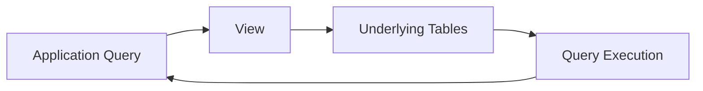
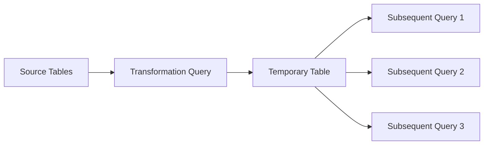

# 11- View vs Temporary Table

## Overview

A SQL `VIEW` and a temporary table can both simplify access to complex data, but they solve fundamentally different problems.

A **view** is a persistent database object that stores a query definition. A **temporary table** stores an actual intermediate result set in a temporary relation with a defined lifecycle.

The core distinction is:

```text
VIEW
----
Reusable query definition
        ↓
Underlying tables
        ↓
Result generated when queried


TEMPORARY TABLE
---------------
Source data
    ↓
Query / transformation
    ↓
Stored temporary rows
    ↓
Subsequent statements
```

This difference affects:

- Data persistence.
- Query execution.
- Indexing.
- Statistics.
- Transaction behavior.
- Session lifecycle.
- Connection pooling.
- Performance.
- Security.
- Deployment.
- Failure recovery.
- Operational complexity.

A senior backend engineer should choose between them based on **data lifecycle, reuse, workload characteristics, and whether the intermediate result itself needs to exist as a database relation**.

---

## View

A normal view is a persistent database object containing a SQL query.

Example:

```sql
CREATE VIEW active_customer_orders AS
SELECT
    c.id AS customer_id,
    c.email,
    o.id AS order_id,
    o.total_amount,
    o.created_at
FROM customers AS c
JOIN orders AS o
    ON o.customer_id = c.id
WHERE c.status = 'active';
```

Consumers can query it like a relation:

```sql
SELECT
    customer_id,
    order_id,
    total_amount
FROM active_customer_orders
WHERE customer_id = $1;
```

The view definition persists until it is changed or dropped.

A normal view does **not** normally store the result rows.

---

## Temporary Table

A temporary table is an actual table-like relation created for temporary use.

Example:

```sql
CREATE TEMPORARY TABLE recent_orders AS
SELECT
    id,
    customer_id,
    total_amount,
    created_at
FROM orders
WHERE created_at >= now() - interval '30 days';
```

The resulting rows exist in the temporary table:

```sql
SELECT *
FROM recent_orders;
```

You can then create indexes:

```sql
CREATE INDEX idx_recent_orders_customer
    ON recent_orders (customer_id);
```

You can also run multiple subsequent statements against it:

```sql
SELECT
    customer_id,
    COUNT(*) AS order_count
FROM recent_orders
GROUP BY customer_id;
```

This is a major difference from a query-local CTE or normal view.

---

## Core Difference

| Property | View | Temporary Table |
|---|---|---|
| Persistent object | Yes | No |
| Stores result rows | No | Yes |
| Query definition stored | Yes | Not as a reusable view definition |
| Lifecycle | Until dropped | Session/transaction dependent |
| Reusable across statements | Yes | Yes within its lifecycle |
| Can create indexes | No separate indexes on the view itself | Yes |
| Can have statistics | Based on underlying relations | Yes, via `ANALYZE` |
| Visible to other sessions | Generally yes, subject to privileges | No |
| Requires cleanup | Schema object remains until dropped | Automatically cleaned according to lifecycle |
| Good for reusable database interface | Yes | No |
| Good for intermediate batch state | Limited | Yes |
| Suitable for large intermediate datasets | Sometimes | Often |
| Schema migration required | Usually | Usually created dynamically |

---

## Lifecycle

A normal view is part of the database schema:

```text
Deployment
    ↓
CREATE VIEW
    ↓
View exists
    ↓
Application queries it
    ↓
DROP/ALTER during later deployment
```

A temporary table is scoped to a database session, unless configured to be dropped at transaction commit.

```text
Database connection
       ↓
CREATE TEMP TABLE
       ↓
Use table
       ↓
Connection/session ends
       ↓
Temporary table disappears
```

PostgreSQL also supports:

```sql
CREATE TEMPORARY TABLE staging_orders (
    order_id bigint,
    customer_id bigint,
    total_amount numeric(12, 2)
) ON COMMIT DROP;
```

Here the temporary table is dropped when the transaction commits.

---

## Why Views Exist

Views primarily provide a reusable logical abstraction.

They are useful when multiple consumers need the same relational definition.

For example:

```text
customers
orders
payments
    ↓
customer_financial_summary VIEW
    ↓
Django
FastAPI
Reporting
Admin tools
```

A view can hide:

- Complex joins.
- Filtering rules.
- Derived columns.
- Aggregation.
- Database relationships.

This can create a stable database-level interface.

---

## Why Temporary Tables Exist

Temporary tables are primarily useful when an intermediate dataset needs to exist independently for subsequent database operations.

Typical scenarios include:

- ETL workflows.
- Large batch transformations.
- Complex multi-step processing.
- Import validation.
- Intermediate aggregation.
- Data migration jobs.
- Large ID sets.
- Temporary staging.
- Reusing an expensive intermediate result across several statements.

The important distinction is:

> A temporary table stores intermediate data; a view describes how to obtain data.

---

## Data Flow

### View



The underlying query is evaluated as part of executing the consumer query.

### Temporary Table



The intermediate rows are physically represented in the temporary relation and can be reused by subsequent statements.

---

## Reuse Across Statements

This is one of the strongest reasons to choose a temporary table.

Suppose a batch job needs the same filtered order set for several operations.

With a temporary table:

```sql
CREATE TEMPORARY TABLE batch_orders AS
SELECT
    id,
    customer_id,
    total_amount
FROM orders
WHERE created_at >= $1
  AND created_at < $2;
```

Then:

```sql
SELECT COUNT(*)
FROM batch_orders;
```

followed by:

```sql
SELECT
    customer_id,
    SUM(total_amount) AS revenue
FROM batch_orders
GROUP BY customer_id;
```

and:

```sql
SELECT
    customer_id,
    COUNT(*)
FROM batch_orders
GROUP BY customer_id;
```

The intermediate dataset can be reused across statements.

With a normal view, each statement references the view definition and the underlying query is planned/executed as part of that statement.

---

## View Reuse

Views are better when the **definition** should be reused.

Example:

```sql
CREATE VIEW customer_summary AS
SELECT
    c.id AS customer_id,
    c.status,
    COUNT(o.id) AS order_count,
    COALESCE(SUM(o.total_amount), 0) AS total_revenue
FROM customers AS c
LEFT JOIN orders AS o
    ON o.customer_id = c.id
GROUP BY
    c.id,
    c.status;
```

Now multiple queries can reuse the same logical definition:

```sql
SELECT *
FROM customer_summary
WHERE status = 'active';
```

or:

```sql
SELECT
    AVG(total_revenue)
FROM customer_summary;
```

The view provides reusable semantics rather than reusable stored intermediate rows.

---

## Temporary Table Indexes

A major advantage of temporary tables is that they can have their own indexes.

```sql
CREATE TEMPORARY TABLE batch_customers AS
SELECT
    id,
    tenant_id,
    email
FROM customers
WHERE created_at >= $1;

CREATE INDEX idx_batch_customers_tenant
    ON batch_customers (tenant_id);
```

This can be valuable when:

- The temporary dataset is large.
- Multiple subsequent queries use the same lookup key.
- The intermediate result has a different access pattern from the base table.
- Repeated scans would otherwise be expensive.

A view cannot have an independent conventional index over its result.

If an indexed, persisted derived representation is required, consider a materialized view or a table instead.

---

## Temporary Table Statistics

PostgreSQL can collect statistics for temporary tables.

After loading a substantial amount of data:

```sql
ANALYZE batch_customers;
```

This can improve query planning for subsequent statements.

For example:

```text
Create temporary table
        ↓
Load rows
        ↓
Create useful indexes
        ↓
ANALYZE
        ↓
Run subsequent queries
```

This is especially relevant when the optimizer needs accurate estimates for a large temporary dataset.

Do not assume that creating a temporary table automatically gives the optimizer perfect statistics.

---

## Temporary Tables and Large Intermediate Data

Consider a migration that processes millions of selected IDs.

A temporary table can act as a relational staging area:

```sql
CREATE TEMPORARY TABLE migration_ids (
    id bigint PRIMARY KEY
);
```

IDs can then be inserted into it and reused:

```sql
SELECT COUNT(*)
FROM migration_ids;
```

```sql
UPDATE customers AS c
SET ...
FROM migration_ids AS m
WHERE c.id = m.id;
```

```sql
DELETE FROM customer_cache AS cc
USING migration_ids AS m
WHERE cc.customer_id = m.id;
```

This can be cleaner and more efficient than repeatedly passing a huge list of application-generated IDs.

For very large or restartable workflows, however, a durable staging table may be more appropriate.

---

## Temporary Tables vs IN Lists

An application might generate:

```sql
WHERE id IN (...)
```

with thousands or millions of values.

That can create:

- Large SQL statements.
- Parameter-management complexity.
- Planning overhead.
- Network overhead.
- Memory pressure.

A temporary table can provide a relational alternative:

```sql
CREATE TEMPORARY TABLE requested_ids (
    id bigint PRIMARY KEY
);
```

Load the IDs and join:

```sql
SELECT c.*
FROM customers AS c
JOIN requested_ids AS r
    ON r.id = c.id;
```

For sufficiently large datasets, this can be easier to manage operationally.

The correct approach depends on the size and frequency of the workload.

---

## Temporary Tables and Connection Pooling

Temporary tables are session-scoped.

That becomes important with connection pools.

Consider:

```text
Application
    ↓
Connection Pool
    ↓
Connection A
    ↓
CREATE TEMP TABLE
```

A later request may receive:

```text
Connection B
```

and the temporary table will not exist there.

Therefore:

```text
Request 1 → Connection A → CREATE TEMP TABLE
Request 2 → Connection B → SELECT FROM TEMP TABLE
                         → ERROR
```

This is a major production pitfall.

Temporary tables should generally be used within workflows that maintain control over the database session.

---

## Transaction Pooling Considerations

Transaction-level pooling systems such as PgBouncer transaction pooling can make session-dependent objects particularly problematic.

If a workflow assumes:

```text
BEGIN
CREATE TEMP TABLE
query
query
COMMIT
```

the application must understand the pooler's session/transaction behavior.

Do not assume that a logical application request corresponds to one physical PostgreSQL session.

For session-dependent temporary state, validate the connection-pooling architecture carefully.

---

## Temporary Tables and Transactions

PostgreSQL supports different temporary-table lifecycle behaviors.

Default behavior:

```sql
CREATE TEMPORARY TABLE batch_data (
    id bigint
);
```

The table persists for the session unless explicitly dropped.

You can request transaction-scoped cleanup:

```sql
CREATE TEMPORARY TABLE batch_data (
    id bigint
) ON COMMIT DROP;
```

Other `ON COMMIT` behaviors are available, including preserving the table while deleting rows.

Choose the lifecycle deliberately.

---

## Temporary Table Cleanup

Although PostgreSQL automatically removes temporary tables at the end of the relevant lifecycle, explicit cleanup can still improve clarity:

```sql
DROP TABLE IF EXISTS batch_data;
```

This can be useful when:

- A long-lived database session is reused.
- A large temporary dataset is no longer needed.
- The same session executes several workflows.
- You want to release temporary resources earlier.

Do not rely on application process termination as the cleanup strategy for database sessions.

---

## View Performance

A view does not automatically improve performance.

For example:

```sql
CREATE VIEW expensive_report AS
SELECT
    ...
FROM orders
JOIN customers ...
JOIN payments ...
GROUP BY ...;
```

Then:

```sql
SELECT *
FROM expensive_report
WHERE customer_id = $1;
```

The underlying relational work still matters.

A normal view is primarily:

```text
abstraction + reuse
```

not:

```text
cache + precomputation
```

If the result must be persisted for faster reads, consider:

- Materialized views.
- Denormalized tables.
- Precomputed read models.
- Redis.
- OLAP infrastructure.

---

## Temporary Table Performance

Temporary tables can improve performance when the same expensive intermediate result is reused multiple times.

For example:

```text
Base tables
    ↓
Expensive filtering/join
    ↓
Temporary table
    ↓
Index
    ↓
ANALYZE
    ↓
Multiple downstream queries
```

Instead of repeatedly calculating:

```text
Expensive operation
Expensive operation
Expensive operation
```

you can calculate it once and reuse the resulting rows.

However, creating and populating a temporary table also costs:

- CPU.
- Memory.
- I/O.
- WAL-related resources depending on the operation and database behavior.
- Temporary storage.
- Index maintenance.

Do not assume temporary tables are always faster.

---

## Temporary Table Storage

Temporary relations use PostgreSQL temporary storage mechanisms and are associated with the creating session.

Large temporary datasets can consume significant resources.

Monitor:

- Temporary file usage.
- Disk space.
- Query duration.
- Temporary relation size.
- Memory consumption.
- Concurrent batch jobs.

A workload that creates many large temporary tables concurrently can create substantial database resource pressure.

---

## Temporary Table and `work_mem`

Temporary tables and `work_mem` solve different problems.

`work_mem` is primarily used for operations such as:

- Sorts.
- Hash operations.
- Certain query execution structures.

A temporary table is a relation storing rows.

For example:

```text
Query
 ├── Sort → work_mem
 └── Temp table → temporary relation/storage
```

Do not assume increasing `work_mem` is equivalent to increasing available temporary-table capacity.

Both need to be considered separately when diagnosing resource usage.

---

## View Security

Views can be useful for restricting exposed columns.

Suppose:

```text
customers
├── id
├── email
├── password_hash
├── internal_notes
└── status
```

Create:

```sql
CREATE VIEW public_customer_profile AS
SELECT
    id,
    email,
    status
FROM customers;
```

Then grant appropriate permissions on the view rather than directly exposing sensitive base-table columns.

This can support least privilege.

Temporary tables do not inherently provide the same reusable security abstraction.

---

## Temporary Tables and Sensitive Data

Temporary tables can still contain sensitive information.

For example:

```sql
CREATE TEMPORARY TABLE customer_export AS
SELECT
    id,
    email,
    phone
FROM customers
WHERE tenant_id = $1;
```

The fact that the table is temporary does not make the data automatically safe.

Consider:

- Database role privileges.
- Tenant isolation.
- Session ownership.
- Logging.
- Monitoring.
- Export controls.
- Data retention.
- Incident response.

Do not use temporary tables as a shortcut around security requirements.

---

## Multi-Tenant Systems

For tenant-specific workflows, a temporary table can hold tenant-scoped intermediate data:

```sql
CREATE TEMPORARY TABLE tenant_orders AS
SELECT
    id,
    customer_id,
    total_amount
FROM orders
WHERE tenant_id = $1;
```

All subsequent queries should maintain the intended authorization boundary.

However, a temporary table should not replace proper tenant isolation.

Production systems may use:

- Application authorization.
- Tenant predicates.
- PostgreSQL Row Level Security.
- Separate schemas or databases where appropriate.
- Least-privileged roles.

---

## Views and Multi-Tenancy

Views can expose tenant-filtered data, but tenant isolation requires careful design.

A static view such as:

```sql
CREATE VIEW active_orders AS
SELECT
    id,
    tenant_id,
    customer_id,
    total_amount
FROM orders
WHERE status = 'active';
```

does not know which application tenant is requesting data.

Additional authorization or RLS mechanisms are required.

For dynamic tenant context, PostgreSQL RLS may provide a stronger database-level isolation mechanism when designed correctly.

---

## Temporary Tables in ETL

Temporary tables are useful for multi-step ETL operations.

Example:

```text
Source
  ↓
Extract
  ↓
Temporary staging
  ↓
Validate
  ↓
Transform
  ↓
Load
```

Example:

```sql
CREATE TEMPORARY TABLE staged_orders (
    external_id text,
    customer_id bigint,
    total_amount numeric(12, 2)
);

-- Load/import data into staged_orders.

SELECT
    COUNT(*)
FROM staged_orders
WHERE total_amount < 0;
```

Then valid records can be inserted:

```sql
INSERT INTO orders (
    external_id,
    customer_id,
    total_amount
)
SELECT
    external_id,
    customer_id,
    total_amount
FROM staged_orders
WHERE total_amount >= 0;
```

Temporary staging is useful when the entire workflow fits within an appropriate session and failure/restart semantics are acceptable.

---

## Temporary Tables for Long-Running Jobs

Temporary tables are often a poor choice for durable progress tracking.

Suppose a Celery job processes millions of records:

```text
Celery Worker
    ↓
Temporary table
    ↓
Process millions of rows
```

If the database session disappears, the temporary state disappears with it.

For restartable workflows, prefer a durable staging/progress table:

```sql
CREATE TABLE migration_progress (
    migration_name text PRIMARY KEY,
    last_processed_id bigint,
    rows_processed bigint NOT NULL DEFAULT 0,
    status text NOT NULL,
    updated_at timestamptz NOT NULL DEFAULT now()
);
```

Temporary state is appropriate for one-session intermediate computation.

Durable state is appropriate for recoverable workflows.

---

## Views and Long-Running Jobs

Views can be useful for batch jobs when the query definition is stable.

For example:

```sql
SELECT
    customer_id,
    total_revenue
FROM customer_revenue_summary
WHERE total_revenue > 10000;
```

However, if a batch job repeatedly queries a computationally expensive view, the underlying query cost remains.

A materialized view or durable staging table may be more appropriate when:

- Results are expensive to compute.
- Results can be refreshed periodically.
- Many consumers need the same derived data.
- Slight staleness is acceptable.

---

## Schema Evolution

Views are part of the database schema.

Therefore:

```text
Migration
    ↓
Base table change
    ↓
View dependency
    ↓
Application compatibility
```

must be considered together.

Temporary tables are usually created dynamically and therefore do not create the same persistent schema dependency.

However, application code that creates temporary tables is still coupled to:

- Column definitions.
- Data types.
- Database behavior.
- Index strategy.
- Query semantics.

---

## Deployment Strategy

### Views

Manage through:

- Database migrations.
- Version-controlled SQL.
- CI/CD.
- Dependency-aware deployment.

Example:

```sql
CREATE OR REPLACE VIEW customer_summary AS
SELECT
    id,
    status
FROM customers;
```

Test the view in staging before production deployment.

### Temporary Tables

Temporary table definitions usually live inside:

- Batch scripts.
- Application code.
- Celery tasks.
- Migration utilities.
- ETL jobs.

They should still be version-controlled and tested.

---

## High Availability

A normal view contains a schema definition and therefore participates in database schema replication/recovery mechanisms.

Temporary tables are session-local and are not a durable HA mechanism.

Do not use temporary tables to store state that must survive:

- Database failover.
- Connection loss.
- Worker restart.
- Session termination.
- Disaster recovery.

For durable state, use persistent tables or another durable storage system.

---

## Disaster Recovery

A normal view definition is part of the database schema and should be represented in:

- Schema migrations.
- Backup/restore procedures.
- Infrastructure-as-code or deployment repositories where appropriate.

Temporary tables should not be part of the disaster-recovery model.

If a workflow depends on temporary state for correctness after a failure, redesign it around durable state.

---

## Cost Considerations

Views generally have low storage overhead because a normal view stores a definition rather than a copy of the result.

The compute cost is paid when queries execute.

Temporary tables consume database resources for:

- Row storage.
- Indexes.
- Statistics.
- Data loading.
- Queries against the temporary relation.

For large workloads, evaluate:

```text
View:
lower storage
possibly repeated computation

Temporary table:
extra storage/work to create
potentially cheaper repeated downstream queries
```

Measure the total workload rather than optimizing one statement in isolation.

---

## Monitoring

For views, monitor the underlying query workload.

Useful PostgreSQL tools include:

```sql
EXPLAIN (ANALYZE, BUFFERS)
SELECT *
FROM customer_summary
WHERE customer_id = $1;
```

For production query statistics, `pg_stat_statements` can help identify expensive query patterns.

For temporary-table workloads, monitor:

- Query duration.
- Temporary file usage.
- Disk utilization.
- Database CPU.
- Memory pressure.
- Connection counts.
- Long-running sessions.
- Batch concurrency.

A sudden increase in concurrent temporary-table jobs can create resource pressure even when individual jobs appear reasonable.

---

## View vs Temporary Table for APIs

For a REST API or gRPC service:

### View

Useful when the endpoint repeatedly needs a stable relational representation:

```text
FastAPI
   ↓
customer_summary VIEW
   ↓
PostgreSQL
```

### Temporary Table

Usually not appropriate for ordinary request/response processing:

```text
HTTP request
    ↓
Create temp table
    ↓
Populate
    ↓
Query
    ↓
Drop
    ↓
Response
```

This adds:

- Database writes.
- Session requirements.
- Temporary storage.
- Connection-pool complexity.

Temporary tables are generally better suited to batch or analytical workflows than ordinary API requests.

---

## Django Considerations

Django applications can execute temporary-table SQL using `connection.cursor()`:

```python
from django.db import connection


def build_customer_batch(customer_ids):
    with connection.cursor() as cursor:
        cursor.execute("""
            CREATE TEMPORARY TABLE batch_customer_ids (
                id bigint PRIMARY KEY
            ) ON COMMIT DROP
        """)

        cursor.executemany(
            """
            INSERT INTO batch_customer_ids (id)
            VALUES (%s)
            """,
            [(customer_id,) for customer_id in customer_ids],
        )

        cursor.execute("""
            SELECT c.id, c.email
            FROM customers AS c
            JOIN batch_customer_ids AS b
                ON b.id = c.id
        """)

        return cursor.fetchall()
```

The important production concern is that the workflow must remain associated with the same database session for the lifetime of the temporary table.

Use Django's normal transaction and connection-management facilities carefully.

For reusable query logic, a view may be a better architectural abstraction.

---

## Celery Considerations

Temporary tables can fit naturally into a single Celery task:

```text
Celery task
    ↓
Acquire DB connection
    ↓
Create temporary table
    ↓
Load intermediate data
    ↓
Create indexes / ANALYZE
    ↓
Process data
    ↓
Commit / rollback
    ↓
Release connection
```

Avoid designs where:

```text
Task A creates temporary table
Task B expects temporary table
```

because the tasks may execute on different workers and different database sessions.

If state must cross task boundaries, use durable storage.

---

## Temporary Tables and Parallel Workers

Multiple workers can create temporary tables with the same name because each session has its own temporary namespace.

For example:

```text
Worker A → temp table batch_data
Worker B → temp table batch_data
Worker C → temp table batch_data
```

These are separate temporary relations.

However, this does not mean unlimited concurrency is safe.

Each worker can consume:

- Connection capacity.
- CPU.
- Temporary storage.
- Memory.
- I/O.

Control batch concurrency deliberately.

---

## Common Mistakes

### Treating a View as a Materialized Result

A normal view does not cache its result.

### Using a Temporary Table for Permanent Data

Temporary tables disappear according to their lifecycle.

Do not store state that must survive sessions or failures.

### Assuming a Temporary Table Is Available to Another Connection

It is session-scoped.

Connection pooling makes this especially important.

### Creating Temporary Tables Inside Every API Request

This can introduce unnecessary database overhead and connection-management complexity.

### Forgetting to Analyze Large Temporary Tables

For large datasets:

```sql
ANALYZE batch_data;
```

can improve planner estimates.

### Creating Too Many Temporary Indexes

Indexes speed reads but increase:

- Creation cost.
- Storage.
- Insert/update cost.

Create only indexes that materially improve downstream work.

### Using a Temporary Table as a Migration Checkpoint

A worker restart can destroy the state.

Use durable progress tracking instead.

### Assuming Temporary Means Free

Temporary relations still consume database resources.

### Assuming Views Always Improve Performance

Views provide abstraction, not automatic optimization.

### Ignoring View Dependencies

Base-table schema changes can affect dependent views.

### Using Views as Authorization Without Understanding RLS

A view alone does not automatically establish complete tenant isolation.

### Assuming Pooling Preserves Sessions

A logical application request and a physical PostgreSQL session are not necessarily the same thing.

---

## Production Decision Matrix

| Requirement | View | Temporary Table |
|---|---:|---:|
| Reusable query definition | Excellent | Poor |
| Persistent database abstraction | Excellent | No |
| Store intermediate rows | No | Excellent |
| Reuse across multiple statements | Indirect | Excellent |
| Independent indexes | No | Yes |
| Independent statistics | No | Yes |
| Session-specific data | No | Excellent |
| Shared by many sessions | Yes | No |
| Batch/ETL processing | Sometimes | Excellent |
| Ordinary API queries | Excellent | Usually unnecessary |
| Durable state | No | No |
| Security projection | Useful | Limited |
| Restartable workflow state | No | No |
| Expensive reusable result | Consider materialized view | Possible |
| Large intermediate dataset | Limited | Often appropriate |

---

## View vs Temporary Table vs Materialized View

These three are frequently confused.

| Feature | View | Temporary Table | Materialized View |
|---|---|---|---|
| Stores query definition | Yes | No | Yes |
| Stores result data | No | Yes | Yes |
| Persistent | Yes | No | Yes |
| Session-specific | No | Yes | No |
| Can create indexes | No | Yes | Yes |
| Needs refresh | No | Recreated/reloaded | Yes |
| Good for reusable abstraction | Yes | No | Yes |
| Good for intermediate processing | Limited | Yes | No |
| Good for expensive read workloads | Limited | Sometimes | Excellent |
| Data freshness | Current at query time | Depends on load | Depends on refresh |

The mental model is:

```text
VIEW
= reusable query definition

TEMP TABLE
= temporary stored intermediate data

MATERIALIZED VIEW
= persistent stored query result
```

---

## Senior Engineering Decision Framework

Ask these questions in order:

```text
Does the logic need to be reusable across queries?
        |
       Yes
        ↓
      VIEW


Does intermediate data need to exist across multiple statements
within one controlled workflow?
        |
       Yes
        ↓
TEMPORARY TABLE


Does the derived result need to persist for fast reads?
        |
       Yes
        ↓
MATERIALIZED VIEW / READ MODEL


Does the state need to survive worker/session failure?
        |
       Yes
        ↓
DURABLE TABLE / EXTERNAL DURABLE STORAGE
```

Then evaluate:

- Data volume.
- Query frequency.
- Refresh requirements.
- Index requirements.
- Connection pooling.
- Transaction boundaries.
- Security.
- Failure recovery.
- Concurrency.
- Operational cost.

The most important question is not:

> Which one is faster?

It is:

> What lifecycle should this data have?

---

## Production Checklist

Before using a view:

- Confirm the logic is reusable.
- Treat the view as a schema-level contract.
- Review permissions.
- Validate tenant isolation.
- Identify dependent objects.
- Version the definition through migrations.
- Test schema changes.
- Inspect execution plans.
- Monitor expensive consumers.
- Do not assume the view caches results.

Before using a temporary table:

- Confirm the data is genuinely temporary.
- Ensure the workflow stays on the required database session.
- Validate connection-pooling behavior.
- Define `ON COMMIT` behavior deliberately.
- Add indexes only when justified.
- Run `ANALYZE` for large intermediate datasets when useful.
- Monitor temporary storage and resource usage.
- Avoid using it as durable workflow state.
- Control concurrent batch workers.
- Explicitly drop large temporary relations when they are no longer needed if the session continues.

---

## Interview Traps

### "A temporary table is just a view with storage."

Not exactly.

A temporary table is a temporary relation containing rows that can be indexed and analyzed independently.

### "Views are faster because the query is saved."

The query definition is saved, but a normal view does not cache its result.

### "Temporary tables survive application restarts."

No.

Their lifecycle is associated with the database session and relevant transaction behavior.

### "Any connection can query a temporary table."

No.

Temporary tables are session-local.

### "Temporary tables are always faster than CTEs."

No.

They introduce creation, population, indexing, and storage costs.

### "Views are always better for reuse."

Views are better for reusable definitions. They are not necessarily better when an expensive intermediate dataset must be materialized and reused across several statements.

### "Temporary tables are safe for long-running distributed jobs."

Not by themselves.

A session failure can destroy the temporary state.

### "A view can have an index."

A normal view does not have its own independent physical indexes. Materialized views can be indexed.

### "Temporary tables are automatically shared between Celery workers."

No.

Different workers normally use different database sessions.

### "Temporary tables solve concurrency."

They isolate temporary relation names across sessions, but they do not solve application-level concurrency or database write conflicts.

### "A view removes database coupling."

It changes the coupling boundary.

Consumers become dependent on the view contract rather than directly on its underlying tables.

---

## Key Takeaways

- **A view stores a reusable query definition, while a temporary table stores temporary intermediate rows:** choose based primarily on the required data lifecycle.
- **Temporary tables are valuable for multi-step batch and ETL workflows:** they can be indexed, analyzed, and reused across multiple statements within a controlled database session.
- **Connection pooling is a critical temporary-table concern:** session-scoped tables are not automatically available when a later operation receives a different database connection.
- **Neither construct is inherently a performance optimization:** views can repeatedly execute expensive logic, while temporary tables add materialization and storage costs; validate the complete workload with execution plans and production metrics.
- **Temporary tables are not durable state:** restartable migrations, Celery workflows, and failure-sensitive processes should use persistent tables or other durable storage for progress and recovery state.