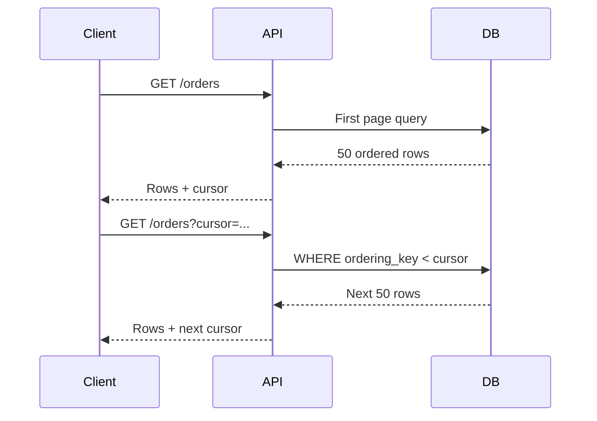
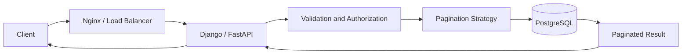

# 13- Offset vs Keyset Pagination

## Overview

Pagination limits how much data an API or client retrieves from a potentially large result set.

Two common SQL pagination strategies are:

- **Offset pagination** — skip a number of rows and return the next page.
- **Keyset pagination** — use values from the previous page as a cursor to locate the next page.

The basic difference is:

```text
Offset pagination

ORDER BY created_at DESC
OFFSET 100000
LIMIT 50

Database
   ↓
Locate ordered result
   ↓
Skip 100,000 rows
   ↓
Return 50 rows
```

versus:

```text
Keyset pagination

WHERE (created_at, id) < ($cursor_created_at, $cursor_id)
ORDER BY created_at DESC, id DESC
LIMIT 50

Database
   ↓
Seek to cursor
   ↓
Read next 50 rows
```

Offset pagination is simple and useful when users need page-number navigation or the dataset is relatively small.

Keyset pagination is generally the stronger choice for large, frequently changing production datasets because it avoids progressively expensive deep offsets and provides more stable traversal semantics.

---

## Offset Pagination

Offset pagination uses:

```sql
LIMIT <page_size>
OFFSET <number_of_rows_to_skip>
```

Example:

```sql
SELECT
    id,
    customer_id,
    total_amount,
    created_at
FROM orders
ORDER BY created_at DESC, id DESC
LIMIT 50
OFFSET 1000;
```

For page number `21` with a page size of `50`:

```text
OFFSET = (21 - 1) × 50
       = 1000
```

The API might expose:

```http
GET /api/orders?page=21&page_size=50
```

---

## Why Offset Pagination Exists

Offset pagination is attractive because it is easy to understand and implement.

A client can request:

```text
page=1
page=2
page=3
...
page=100
```

It also fits naturally with interfaces that display:

```text
First | Previous | 1 | 2 | 3 | ... | 100 | Next | Last
```

Offset pagination is therefore useful for:

- Administrative dashboards.
- Small datasets.
- Reporting interfaces.
- Back-office tools.
- Traditional page-number navigation.
- Data where deep pagination is rare.

---

## How Offset Pagination Works

A typical query is:

```sql
SELECT
    id,
    email,
    created_at
FROM customers
ORDER BY created_at DESC, id DESC
LIMIT 50
OFFSET 5000;
```

Conceptually:

```text
Ordered result:

1
2
3
...
5000
5001 ← first returned row
5002
...
5050
```

The database must execute the query in a way that determines which rows belong to the requested ordered position.

An index can make locating and ordering rows much more efficient, but a deep offset can still require the database to walk past many rows before returning the requested page.

---

## Offset Pagination Performance

A common misconception is:

> `LIMIT 50` means the database only processes 50 rows.

Not necessarily.

With:

```sql
LIMIT 50 OFFSET 100000;
```

the database may need to process/scan approximately the first `100050` qualifying rows in the relevant execution path before it can return the requested 50 rows.

An appropriate index can reduce the cost substantially, but it does not change the fundamental deep-offset behavior.

As the offset grows:

```text
OFFSET 0
    ↓
small amount of traversal

OFFSET 10,000
    ↓
more traversal

OFFSET 1,000,000
    ↓
potentially substantial traversal
```

This is one of the primary reasons keyset pagination is preferred for large datasets.

---

## Offset Pagination with an Index

Consider:

```sql
CREATE INDEX idx_orders_created_id
ON orders (created_at DESC, id DESC);
```

Then:

```sql
SELECT
    id,
    customer_id,
    total_amount,
    created_at
FROM orders
ORDER BY created_at DESC, id DESC
LIMIT 50
OFFSET 10000;
```

The index can provide the desired ordering efficiently.

However, the database may still need to traverse many index entries before reaching the offset.

An index helps offset pagination, but it does not eliminate the cost of skipping rows.

---

## Keyset Pagination

Keyset pagination uses the last row from the current page as the starting point for the next query.

Example:

```sql
SELECT
    id,
    customer_id,
    total_amount,
    created_at
FROM orders
ORDER BY created_at DESC, id DESC
LIMIT 50;
```

Suppose the last row returned is:

```text
created_at = 2026-08-31 10:15:00
id         = 9842
```

The next request can use:

```sql
SELECT
    id,
    customer_id,
    total_amount,
    created_at
FROM orders
WHERE (created_at, id) < ($1, $2)
ORDER BY created_at DESC, id DESC
LIMIT 50;
```

The cursor is therefore based on the ordering keys.

---

## Why Keyset Pagination Exists

Keyset pagination exists to solve two important problems:

1. Deep offset performance.
2. Instability caused by changes to the underlying dataset.

Instead of saying:

> Give me rows 100001–100050.

the client says:

> Give me the next 50 rows after this known position.

This allows the database to seek into an ordered index rather than repeatedly skipping an increasingly large number of rows.

---

## Keyset Pagination with a Unique Tie-Breaker

A production keyset query needs a deterministic ordering.

This is unsafe:

```sql
ORDER BY created_at DESC
```

if multiple rows can have the same `created_at`.

Use a unique tie-breaker:

```sql
ORDER BY created_at DESC, id DESC
```

Then:

```sql
WHERE (created_at, id) < ($1, $2)
```

The `id` ensures that rows with identical timestamps still have a deterministic order.

A common production pattern is:

```text
Primary sort key
      +
Unique tie-breaker
```

For example:

```text
created_at + id
updated_at + id
score + id
timestamp + UUID
```

provided the combination creates the required deterministic ordering.

---

## Keyset Pagination Data Flow



The cursor represents a position in the ordered dataset rather than a page number.

---

## Offset vs Keyset

| Property | Offset | Keyset |
|---|---|---|
| Implementation simplicity | Excellent | Moderate |
| Page-number navigation | Excellent | Poor |
| Deep pagination | Poorer | Excellent |
| Large datasets | Can become expensive | Strong fit |
| Stable traversal under inserts | Weak | Stronger |
| Arbitrary page jumping | Excellent | Poor |
| Cursor required | No | Yes |
| Deterministic ordering required | Yes | Yes |
| Complex ordering support | Broad | Requires careful cursor design |
| API implementation | Simple | More involved |
| Infinite scrolling | Good | Excellent |
| Sequential feeds | Good | Excellent |
| Large exports | Usually poor | Strong |
| User-friendly numbered pages | Excellent | Poor |

---

## The Importance of Deterministic Ordering

Pagination without deterministic ordering is unreliable.

Avoid:

```sql
SELECT *
FROM orders
LIMIT 50
OFFSET 50;
```

There is no guaranteed meaningful page boundary without an explicit ordering.

Prefer:

```sql
SELECT *
FROM orders
ORDER BY created_at DESC, id DESC
LIMIT 50
OFFSET 50;
```

The same principle applies to keyset pagination.

A cursor only has meaning relative to a deterministic ordering.

---

## Why `id` Alone Can Be Enough

If the desired order is exactly insertion order represented by a monotonically increasing primary key:

```sql
SELECT
    id,
    customer_id,
    total_amount
FROM orders
WHERE id > $1
ORDER BY id ASC
LIMIT 50;
```

This is a simple keyset query.

For descending order:

```sql
SELECT
    id,
    customer_id,
    total_amount
FROM orders
WHERE id < $1
ORDER BY id DESC
LIMIT 50;
```

This is highly efficient when `id` is appropriately indexed.

However, do not assume that a primary key represents business chronology unless that is actually true for the application.

---

## Composite Keyset Pagination

For feeds ordered by timestamp:

```sql
SELECT
    id,
    customer_id,
    created_at,
    total_amount
FROM orders
WHERE (created_at, id) < ($1, $2)
ORDER BY created_at DESC, id DESC
LIMIT 50;
```

This corresponds to:

```text
(created_at < cursor_created_at)
OR
(created_at = cursor_created_at
 AND id < cursor_id)
```

The row-value expression is concise and expresses the lexicographic comparison required by the ordering.

The index should match the ordering:

```sql
CREATE INDEX idx_orders_created_id_desc
ON orders (created_at DESC, id DESC);
```

---

## Ascending Keyset Pagination

For ascending traversal:

```sql
SELECT
    id,
    created_at,
    total_amount
FROM orders
WHERE (created_at, id) > ($1, $2)
ORDER BY created_at ASC, id ASC
LIMIT 50;
```

The rule is:

```text
ASC:
WHERE ordering_tuple > cursor
ORDER BY ... ASC

DESC:
WHERE ordering_tuple < cursor
ORDER BY ... DESC
```

The comparison must match the intended traversal direction.

---

## Mixed Sort Directions

Consider:

```sql
ORDER BY priority DESC, created_at ASC, id ASC
```

The cursor condition is more complex because the sort directions differ.

Do not blindly write:

```sql
WHERE (priority, created_at, id) < (...)
```

for arbitrary mixed-direction ordering.

For complex cursor schemes, explicitly derive the lexicographic predicate or normalize the ordering representation.

For example:

```sql
WHERE
    priority < $1
    OR (
        priority = $1
        AND created_at > $2
    )
    OR (
        priority = $1
        AND created_at = $2
        AND id > $3
    )
ORDER BY
    priority DESC,
    created_at ASC,
    id ASC
LIMIT 50;
```

The cursor design must match the exact ordering semantics.

---

## API Design

### Offset API

```http
GET /api/orders?page=3&page_size=50
```

Example response:

```json
{
  "results": [
    {
      "id": 101,
      "total_amount": "199.99"
    }
  ],
  "page": 3,
  "page_size": 50,
  "total_pages": 42
}
```

This works well when total counts and page navigation are important.

---

## Keyset API

A keyset API commonly exposes a cursor:

```http
GET /api/orders?limit=50&cursor=eyJjcmVhdGVkX2F0Ijoi...”
```

Example response:

```json
{
  "results": [
    {
      "id": 101,
      "total_amount": "199.99"
    }
  ],
  "next_cursor": "eyJjcmVhdGVkX2F0Ijoi...”
}
```

The cursor should normally be treated as an opaque API token.

Clients should not need to understand:

```text
created_at
id
sort direction
```

inside the cursor.

---

## Cursor Encoding

A cursor can contain:

```json
{
  "created_at": "2026-08-31T10:15:00Z",
  "id": 9842
}
```

The API can serialize and encode this structure.

For example:

```text
JSON
 ↓
Base64url
 ↓
opaque cursor
```

For security and integrity, signed cursors can prevent clients from modifying cursor values undetected.

The cursor should not contain unnecessary sensitive information.

---

## Cursor Validation

A production API should validate:

- Cursor format.
- Required fields.
- Data types.
- Sort direction.
- Filter compatibility.
- Version.
- Expiration if applicable.

A cursor generated for:

```text
status=active
sort=created_at_desc
```

should not necessarily be accepted for:

```text
status=cancelled
sort=amount_desc
```

A useful cursor payload can include a version:

```json
{
  "v": 1,
  "created_at": "2026-08-31T10:15:00Z",
  "id": 9842
}
```

The API can reject incompatible or obsolete cursor formats.

---

## Cursor Signing

If clients can modify cursor contents, they may attempt:

```text
cursor → change timestamp → access arbitrary records
```

The cursor itself should not be treated as an authorization mechanism.

However, signing can protect cursor integrity.

Conceptually:

```text
cursor payload
     ↓
HMAC/signature
     ↓
opaque token
```

The API verifies the signature before using the decoded values.

Authorization must still be enforced by the query.

For example:

```sql
WHERE tenant_id = $tenant_id
  AND (created_at, id) < ($cursor_created_at, $cursor_id)
```

Do not rely on cursor secrecy to enforce tenant isolation.

---

## Filtering and Keyset Pagination

Filters must be part of the query surrounding the cursor.

Example:

```sql
SELECT
    id,
    customer_id,
    created_at,
    total_amount
FROM orders
WHERE tenant_id = $1
  AND status = 'paid'
  AND (created_at, id) < ($2, $3)
ORDER BY created_at DESC, id DESC
LIMIT 50;
```

The cursor represents a position within the ordered result set for that filter context.

Changing filters while reusing the same cursor can produce incorrect or surprising results.

---

## Multi-Tenant APIs

A production multi-tenant query should preserve tenant isolation:

```sql
SELECT
    id,
    created_at,
    total_amount
FROM orders
WHERE tenant_id = $1
  AND (created_at, id) < ($2, $3)
ORDER BY created_at DESC, id DESC
LIMIT 50;
```

A cursor must never allow the client to bypass:

```sql
tenant_id = $1
```

The tenant boundary belongs in the authorization/query layer, not merely in the cursor.

---

## Index Design

For:

```sql
SELECT
    id,
    customer_id,
    created_at,
    total_amount
FROM orders
WHERE tenant_id = $1
  AND (created_at, id) < ($2, $3)
ORDER BY created_at DESC, id DESC
LIMIT 50;
```

a candidate index is:

```sql
CREATE INDEX idx_orders_tenant_created_id
ON orders (
    tenant_id,
    created_at DESC,
    id DESC
);
```

This aligns the leading filter and ordering columns.

The optimal index depends on:

- Query selectivity.
- Tenant size distribution.
- Other filters.
- Column widths.
- Write volume.
- Query frequency.
- PostgreSQL statistics.

Do not automatically create an index for every pagination query without examining the workload.

---

## Covering Indexes

PostgreSQL can sometimes benefit from `INCLUDE` columns:

```sql
CREATE INDEX idx_orders_tenant_created_id
ON orders (
    tenant_id,
    created_at DESC,
    id DESC
)
INCLUDE (
    customer_id,
    total_amount
);
```

This may enable more efficient index-only access in suitable circumstances.

However:

- `INCLUDE` increases index size.
- Visibility-map conditions affect index-only scans.
- Larger indexes increase write and storage costs.

Use `EXPLAIN (ANALYZE, BUFFERS)` and production measurements before adding covering indexes.

---

## Offset Pagination and Count Queries

Offset APIs often want:

```json
{
  "page": 20,
  "page_size": 50,
  "total": 10342
}
```

That usually requires a count:

```sql
SELECT COUNT(*)
FROM orders
WHERE tenant_id = $1
  AND status = 'paid';
```

For large datasets, exact counts can become expensive.

This creates another difference:

```text
Offset API
 ├── page query
 └── count query

Keyset API
 └── page query
```

Keyset APIs often avoid requiring an exact total.

---

## Keyset Pagination and Total Counts

Keyset pagination does not naturally provide:

```text
You are on page 347 of 821.
```

because the cursor represents a position rather than an absolute row number.

If the UI requires an exact total, you may still need a separate count query.

Do not sacrifice efficient page retrieval merely because the UI wants a total count.

Consider whether the product actually needs exact totals.

---

## Pagination Under Concurrent Inserts

Suppose page 1 returns:

```text
A
B
C
D
E
```

Then new rows are inserted:

```text
X
Y
```

before the existing rows.

With offset pagination:

```text
Page 1 → A B C D E
Page 2 → E F G H I
```

A row can appear again or be skipped because the offset is applied to a dataset whose ordering has changed.

Keyset pagination uses:

```text
last cursor = E
```

and asks:

```text
Give me rows after E
```

so newly inserted rows before E do not shift the traversal boundary.

This provides more stable traversal behavior.

---

## Concurrent Deletes

Deletes can also affect offset pagination.

If rows before the current offset disappear:

```text
Page 1
A B C D E

D deleted

Page 2 with OFFSET 5
```

the rows following the deleted row shift positions.

A client can therefore miss records.

Keyset pagination is generally more resilient because the boundary is based on a known ordering value rather than a count of preceding rows.

It is not a snapshot mechanism, however.

---

## Snapshot Semantics

Neither normal offset nor keyset pagination automatically provides a consistent database snapshot across multiple HTTP requests.

For example:

```text
Request 1 → transaction ends
Request 2 → later transaction
Request 3 → later transaction
```

Each request may observe a different database state.

If the business requirement is:

> Every page must represent exactly the same dataset snapshot.

ordinary cursor pagination is insufficient by itself.

Possible approaches include:

- Long-lived transaction/snapshot, with significant operational trade-offs.
- Export snapshot mechanisms.
- Materialized datasets.
- Durable reporting tables.
- Versioned datasets.

Do not use pagination as a substitute for snapshot isolation.

---

## Deleted or Updated Cursor Rows

A keyset cursor references values from a previously returned row.

Suppose the cursor contains:

```text
created_at = T
id = 100
```

The row itself may later be:

- Deleted.
- Updated.
- No longer match the filter.

That does not necessarily break keyset pagination.

The cursor represents ordering values, not a requirement that the exact row still exists.

However, if the ordering fields themselves are mutable, traversal semantics can become more complicated.

---

## Mutable Ordering Columns

Suppose records are ordered by:

```sql
ORDER BY updated_at DESC, id DESC
```

and an existing row is updated between page requests.

Its position can move.

This can result in:

- A row appearing on a later page after previously being returned.
- A row moving ahead of the current cursor.
- A row being missed during a forward traversal.

For feeds requiring stable traversal, prefer an immutable ordering key where possible.

For example:

```sql
ORDER BY created_at DESC, id DESC
```

is often easier to reason about than ordering by a frequently changing `updated_at`.

---

## Pagination and REST APIs

For ordinary REST endpoints:

### Offset

```http
GET /orders?page=4&page_size=100
```

is simple and human-friendly.

### Keyset

```http
GET /orders?limit=100&cursor=...
```

is better suited to:

- Infinite scrolling.
- Mobile feeds.
- Activity streams.
- Large datasets.
- High-volume APIs.

A common API contract is:

```json
{
  "results": [],
  "next_cursor": "...",
  "has_more": true
}
```

This avoids exposing database-specific pagination details.

---

## Django ORM

Offset pagination is straightforward:

```python
queryset = (
    Order.objects
    .filter(tenant_id=tenant_id)
    .order_by("-created_at", "-id")
)

page = queryset[1000:1050]
```

This corresponds conceptually to:

```sql
LIMIT 50 OFFSET 1000
```

For keyset pagination:

```python
from django.db.models import Q


queryset = (
    Order.objects
    .filter(tenant_id=tenant_id)
    .order_by("-created_at", "-id")
)

if cursor:
    queryset = queryset.filter(
        Q(created_at__lt=cursor.created_at)
        | Q(
            created_at=cursor.created_at,
            id__lt=cursor.id,
        )
    )

orders = list(queryset[:50])
```

The cursor should be decoded and validated before constructing the queryset.

For large production datasets, inspect the generated SQL and execution plan rather than assuming ORM behavior is optimal.

---

## FastAPI

A keyset endpoint might conceptually look like:

```python
from fastapi import FastAPI, Query

app = FastAPI()


@app.get("/orders")
def list_orders(
    limit: int = Query(default=50, ge=1, le=100),
    cursor: str | None = None,
):
    # Decode and validate the cursor.
    # Query PostgreSQL using the decoded ordering values.
    # Return the next cursor generated from the final row.
    ...
```

Important API concerns include:

- Maximum page size.
- Cursor validation.
- Stable ordering.
- Tenant filtering.
- Authorization.
- Consistent serialization.
- Cursor versioning.
- Error handling.

Never allow an unbounded `limit` from the client.

---

## Pagination and N+1 Queries

Pagination does not automatically prevent N+1 queries.

Suppose:

```text
SELECT 50 orders
        ↓
50 customer queries
```

The endpoint can still perform 51 database queries.

Use appropriate loading strategies:

- `select_related`.
- `prefetch_related`.
- Explicit joins.
- Batched queries.

For example:

```python
orders = (
    Order.objects
    .select_related("customer")
    .filter(tenant_id=tenant_id)
    .order_by("-created_at", "-id")[:50]
)
```

Pagination and relationship loading should be considered together.

---

## Pagination and Large Exports

For exporting millions of rows:

```text
OFFSET 0
OFFSET 10000
OFFSET 20000
...
OFFSET 10000000
```

is usually a poor strategy.

Keyset traversal is often more appropriate:

```text
cursor 0
   ↓
50k rows
   ↓
cursor 1
   ↓
50k rows
   ↓
cursor 2
```

For very large exports, consider:

- Keyset batches.
- Server-side database export mechanisms.
- Background jobs.
- Object storage.
- S3 multipart uploads.
- Parquet/CSV generation.
- Durable checkpoints.

A synchronous HTTP endpoint should generally not attempt to stream a huge export through thousands of database pages.

---

## Keyset Pagination in Background Jobs

Keyset pagination is useful for batch processing.

Example:

```sql
SELECT id
FROM customers
WHERE id > $1
ORDER BY id
LIMIT 5000;
```

The worker stores the last processed ID:

```text
last_id = 100000
```

and continues:

```text
id > 100000
```

This is generally more stable than:

```text
OFFSET 100000
```

for large tables.

For restartable jobs, store progress durably rather than relying on worker memory.

---

## Pagination with Kafka and Event Processing

Database pagination and Kafka partition offsets solve different problems.

Do not assume:

```text
database cursor = Kafka offset
```

A database cursor identifies a position in an ordered relational result.

A Kafka offset identifies a position within a partition log.

They have different:

- Ordering semantics.
- Failure models.
- Retention behavior.
- Concurrency models.

Use each according to the system boundary it represents.

---

## Redis Considerations

Redis can cache paginated API results, but caching cursors and pages introduces invalidation complexity.

For example:

```text
API
 ↓
Redis
 ↓ cache miss
PostgreSQL
```

Keyset pagination itself does not require Redis.

Use Redis when caching provides measurable value and the invalidation/staleness model is acceptable.

Do not introduce Redis merely because an endpoint is paginated.

---

## Pagination and Read Replicas

Read-heavy APIs may use PostgreSQL read replicas:

```text
API
 ├── Writes → Primary
 └── Reads  → Replica
```

Pagination can expose replica-lag behavior.

For example:

```text
Request 1 → Replica A
Request 2 → Replica A
```

may observe different states depending on replication lag.

A cursor does not provide cross-request consistency across replicas.

If the application requires read-your-write behavior, route the relevant reads to the primary or use an appropriate consistency strategy.

---

## Security Considerations

Pagination parameters are user-controlled input.

Validate:

- `page`.
- `page_size`.
- `limit`.
- `cursor`.
- Sort direction.
- Filter values.

For offset APIs:

```text
page_size = 100000000
```

must not be allowed to trigger an enormous query.

For keyset APIs:

```text
cursor = attacker-controlled data
```

must be parsed and validated safely.

Always use parameterized SQL.

Never construct SQL by concatenating client-supplied pagination values.

---

## Authorization Must Apply to Every Page

A common security mistake is applying authorization only when generating the first page.

Every paginated query must enforce the complete authorization boundary.

For example:

```sql
SELECT
    id,
    created_at,
    total_amount
FROM orders
WHERE tenant_id = $1
  AND customer_id = $2
  AND (created_at, id) < ($3, $4)
ORDER BY created_at DESC, id DESC
LIMIT 50;
```

The cursor does not replace:

```sql
tenant_id = $1
customer_id = $2
```

Authorization is part of every page query.

---

## Performance Testing

Test pagination with realistic dataset sizes.

Do not benchmark only:

```text
10,000 rows
```

when production contains:

```text
500 million rows
```

Test:

- First page.
- Middle pages.
- Deep offset.
- Large tenants.
- Small tenants.
- Concurrent requests.
- Different filters.
- Different sort orders.
- Replica reads if applicable.

Use:

```sql
EXPLAIN (ANALYZE, BUFFERS)
SELECT ...
```

Compare:

```text
OFFSET 0
OFFSET 10000
OFFSET 1000000
```

against equivalent keyset queries.

---

## Monitoring

Monitor:

- Query latency by endpoint.
- Database CPU.
- Buffer reads.
- Rows examined/returned where available.
- Query frequency.
- Page size distribution.
- Cursor errors.
- Timeout rates.
- Replica lag.
- Connection utilization.

Useful application metrics include:

```text
pagination.request.count
pagination.cursor.invalid
pagination.page_size
pagination.query.duration
pagination.has_more
```

A sudden increase in deep offset requests can indicate:

- Client misuse.
- Scraping.
- A poorly designed UI.
- An export workload using the wrong API.
- Missing product constraints.

---

## Cost Considerations

Pagination affects database cost directly.

Offset-heavy workloads can increase:

- CPU.
- Buffer reads.
- Query latency.
- Database I/O.
- Read replica workload.

Keyset pagination can reduce the amount of unnecessary traversal for large sequential datasets.

This can delay the need for:

- Larger database instances.
- Additional read replicas.
- Aggressive caching.
- Specialized search infrastructure.

However, keyset pagination does not eliminate the cost of filtering, joining, sorting, or returning the requested rows.

---

## Choosing Between Offset and Keyset

### Choose Offset When

- Dataset size is moderate.
- Deep pagination is uncommon.
- Users need arbitrary page numbers.
- Exact totals are important.
- Implementation simplicity is valuable.
- Administrative/reporting interfaces dominate the workload.

### Choose Keyset When

- Dataset is large.
- Users mostly move forward/backward sequentially.
- Infinite scrolling is used.
- Deep pagination is common.
- API latency must remain predictable.
- Data changes frequently.
- Large exports or batch traversal are required.

---

## Hybrid Strategy

Some systems use both.

For example:

```text
Admin UI
    ↓
Offset pagination

Public activity feed
    ↓
Keyset pagination

Large export job
    ↓
Keyset / batch traversal
```

There is no requirement that an entire application use one pagination strategy.

Choose based on endpoint behavior and data characteristics.

---

## Common Mistakes

### Using `OFFSET` on Huge Tables Without Testing

It may work in development and degrade badly in production.

### Forgetting `ORDER BY`

Without deterministic ordering, page boundaries are not reliable.

### Ordering by a Non-Unique Column

For example:

```sql
ORDER BY created_at DESC
```

can produce ambiguous boundaries.

Add a unique tie-breaker:

```sql
ORDER BY created_at DESC, id DESC
```

### Assuming an Index Makes Deep OFFSET Free

Indexes improve access paths but do not eliminate the fundamental cost of traversing skipped rows.

### Using `id` as a Cursor When Ordering by Another Column

If the query uses:

```sql
ORDER BY created_at DESC
```

the cursor must represent the ordering position, not an unrelated ID.

### Reusing a Cursor with Different Filters

A cursor belongs to a particular result ordering/filter context.

### Allowing Unlimited Page Size

A malicious or accidental:

```text
limit=10000000
```

can become a database denial-of-service vector.

### Exposing Cursor Internals

Clients should normally treat cursors as opaque.

### Treating Cursor Encoding as Authorization

A cursor does not replace tenant or permission checks.

### Ordering by Mutable Columns Without Considering Traversal Semantics

Updates can move rows across the cursor boundary.

### Expecting Keyset Pagination to Support Arbitrary Page Numbers

Keyset pagination is optimized for sequential traversal, not random page access.

### Running Exact `COUNT(*)` on Every Request

Large count queries can become a significant workload.

### Using Pagination for Snapshot Semantics

Multiple HTTP requests do not automatically operate on one consistent database snapshot.

---

## Production Architecture

A typical large-scale API can use:



For a large feed:

```text
Client
  ↓
API
  ↓
Validate cursor
  ↓
Apply tenant/authorization filters
  ↓
Keyset query
  ↓
Composite index
  ↓
PostgreSQL
  ↓
LIMIT N
  ↓
Generate next cursor
  ↓
Response
```

The pagination strategy is only one part of the endpoint architecture.

---

## Senior Engineering Decision Framework

When designing pagination, answer these questions:

1. How large can the dataset become?
2. How deep can clients paginate?
3. Do users need arbitrary page numbers?
4. Does the dataset change frequently?
5. Is an exact total required?
6. What is the stable ordering key?
7. Is the ordering key unique or paired with a unique tie-breaker?
8. Which filters must always be enforced?
9. Does the index support filtering and ordering?
10. Can the cursor be safely encoded and validated?
11. Does the endpoint read from a replica?
12. Does the workload include exports or background processing?
13. What maximum page size is acceptable?
14. What happens when records are inserted, deleted, or updated between requests?

A senior design treats pagination as a combination of:

```text
API contract
+
SQL semantics
+
index design
+
data mutation behavior
+
authorization
+
consistency requirements
+
operational limits
```

---

## Production Checklist

Before shipping offset pagination:

- Add deterministic `ORDER BY`.
- Cap `page_size`.
- Validate page parameters.
- Create appropriate indexes.
- Benchmark deep offsets.
- Avoid unnecessary exact counts.
- Monitor slow pages.
- Test concurrent inserts/deletes.
- Apply authorization on every page.
- Consider whether the endpoint will eventually outgrow offset pagination.

Before shipping keyset pagination:

- Define deterministic ordering.
- Include a unique tie-breaker.
- Align the cursor with the ordering.
- Create an appropriate composite index.
- Encode the cursor as an opaque value.
- Validate cursor structure and version.
- Consider signing cursor values.
- Keep authorization and tenant filters in the query.
- Handle invalid or stale cursors gracefully.
- Define behavior for mutable ordering fields.
- Test inserts, deletes, and updates between requests.
- Cap `limit`.
- Monitor cursor errors and query latency.

---

## Key Takeaways

- **Offset pagination is simple and supports page-number navigation, but deep offsets can become increasingly expensive on large datasets.**
- **Keyset pagination seeks from a known ordering position and is generally the better choice for large, frequently changing datasets and sequential feeds.**
- **Keyset pagination requires deterministic ordering:** use the actual sort keys plus a unique tie-breaker such as `id`, and align the database index with that ordering.
- **Pagination does not provide snapshot consistency or authorization by itself:** every request must enforce filters, tenant boundaries, and permissions independently.
- **Treat pagination as an API, SQL, and indexing design problem:** cap page sizes, validate cursors, benchmark realistic workloads, and choose the strategy based on access patterns rather than habit.