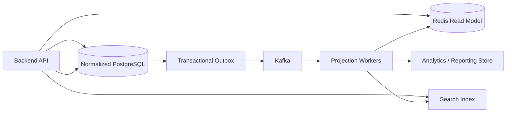

# 15- Normalization vs Denormalization

## Overview

Normalization and denormalization are database design strategies for deciding where data should live and how much duplication is acceptable.

**Normalization** structures data so each fact is stored in an appropriate place with minimal unnecessary duplication.

**Denormalization** intentionally duplicates or precomputes data to improve read performance, simplify expensive queries, or support a particular access pattern.

The practical engineering decision is not:

> "Is normalization better than denormalization?"

It is:

> "What data model provides the required correctness, write behavior, read performance, operational simplicity, and scalability for this workload?"

A typical transactional system starts with a normalized relational model:

```text
Customer
   │
   ├── Order
   │      │
   │      └── Order Item
   │              │
   │              └── Product
   │
   └── Address
```

A read-heavy system may intentionally maintain derived data:

```text
Normalized source of truth
          │
          ├── PostgreSQL tables
          │
          ├── Materialized views
          │
          ├── Redis read models
          │
          └── Search indexes
```

Denormalization is therefore often an architectural decision layered on top of a normalized source of truth rather than a reason to abandon relational modeling.

---

## Why Normalization Exists

Normalization primarily addresses:

- Duplicate data.
- Update anomalies.
- Insert anomalies.
- Delete anomalies.
- Inconsistent representations.
- Unclear ownership of facts.

Suppose an order table stores:

```text
order_id
customer_id
customer_name
customer_email
product_id
product_name
product_price
quantity
```

A customer's email may appear in thousands of order rows.

If the customer changes their email:

```text
Customer row
   ↓
Potentially thousands of order rows
```

The database now has to keep duplicated facts consistent.

A normalized model separates the entities:

```text
customers
orders
products
order_items
```

with relationships represented using foreign keys.

---

## Normalized Model

A normalized ecommerce model might look like:

```sql
CREATE TABLE customers (
    id bigint PRIMARY KEY,
    email text NOT NULL UNIQUE,
    name text NOT NULL
);

CREATE TABLE products (
    id bigint PRIMARY KEY,
    name text NOT NULL,
    current_price numeric(12, 2) NOT NULL
);

CREATE TABLE orders (
    id bigint PRIMARY KEY,
    customer_id bigint NOT NULL
        REFERENCES customers(id),
    created_at timestamptz NOT NULL DEFAULT now()
);

CREATE TABLE order_items (
    order_id bigint NOT NULL
        REFERENCES orders(id),
    product_id bigint NOT NULL
        REFERENCES products(id),
    quantity integer NOT NULL CHECK (quantity > 0),
    unit_price numeric(12, 2) NOT NULL CHECK (unit_price >= 0),
    PRIMARY KEY (order_id, product_id)
);
```

The relationships are explicit:

```text
customers
    │
    │ 1:N
    ▼
orders
    │
    │ 1:N
    ▼
order_items
    │
    │ N:1
    ▼
products
```

---

## Benefits of Normalization

Normalization provides several important properties.

### Reduced Duplication

A customer's current email exists in one logical location.

### Better Consistency

Updating the customer record does not require updating every order.

### Stronger Integrity

Foreign keys and constraints can enforce relationships.

### Easier Writes

A customer update typically modifies one row rather than many duplicated records.

### Clear Ownership

The schema makes it easier to identify which table owns a particular fact.

### Smaller Logical Data Model

Repeated attributes do not have to be stored across every related record.

---

## Normalization and Data Integrity

Normalization works especially well with relational constraints.

For example:

```sql
ALTER TABLE orders
ADD CONSTRAINT orders_customer_fk
FOREIGN KEY (customer_id)
REFERENCES customers(id);
```

This prevents an order from referencing a nonexistent customer.

A normalized design allows the database to enforce important invariants using:

- `PRIMARY KEY`
- `FOREIGN KEY`
- `UNIQUE`
- `NOT NULL`
- `CHECK`
- Exclusion constraints where appropriate

The database becomes an active integrity boundary rather than merely a storage layer.

---

## Normalization Levels

Normalization is commonly discussed using normal forms.

| Normal Form | Main concern |
|---|---|
| 1NF | Atomic/repeating-group structure |
| 2NF | Partial dependency on part of a composite key |
| 3NF | Transitive dependency |
| BCNF | Stronger functional-dependency constraints |
| 4NF | Multi-valued dependencies |
| 5NF | Join dependencies |

For most backend application design, the practical focus is usually:

```text
1NF → 2NF → 3NF
```

followed by deliberate decisions about indexes, constraints, query patterns, and selective denormalization.

The goal is not to maximize the normal form at any cost.

---

## First Normal Form

A simplified interpretation of 1NF is that a relational column represents a single logical value rather than an uncontrolled collection of repeating values.

Avoid:

```text
customer_id | phone_numbers
------------+----------------
1           | "123,456,789"
```

Prefer:

```text
customers
customer_phones
```

For example:

```sql
CREATE TABLE customer_phones (
    customer_id bigint NOT NULL
        REFERENCES customers(id),
    phone text NOT NULL,
    PRIMARY KEY (customer_id, phone)
);
```

However, modern PostgreSQL supports arrays and JSON types, so the engineering decision depends on whether the nested structure needs independent querying, constraints, indexing, joins, and lifecycle management.

Normalization is not synonymous with "never use JSON."

---

## Second Normal Form

2NF primarily matters when a table has a composite key.

Consider:

```text
(order_id, product_id) → quantity
```

The quantity depends on the complete order-item identity.

But if a column depends only on:

```text
product_id
```

such as:

```text
product_name
```

it does not belong in a relation whose composite key is:

```text
(order_id, product_id)
```

That fact belongs with the product entity.

This is one reason an `order_items` table should generally reference a `products` table rather than repeatedly storing product master data.

---

## Third Normal Form

3NF addresses transitive dependencies.

Consider:

```text
employee_id
department_id
department_name
```

If:

```text
employee_id → department_id
department_id → department_name
```

then:

```text
employee_id → department_name
```

through the department.

A normalized model separates:

```text
employees
departments
```

rather than storing department attributes repeatedly in every employee row.

The practical question is:

> Does this attribute describe the row's entity, or another entity referenced by the row?

---

## Normalization Is About Dependencies

The deeper idea behind normalization is not simply:

> "Split big tables."

It is:

> Store each fact according to its functional dependencies and ownership.

For example:

```text
product_id → product_name
product_id → category_id
customer_id → customer_email
```

If these attributes are copied into unrelated tables, the database now has multiple physical representations of the same fact.

The more copies exist, the more synchronization responsibility the system acquires.

---

## Update Anomaly

Suppose:

```text
orders
------------------------------------------------
order_id | customer_id | customer_email
------------------------------------------------
1        | 10           | old@example.com
2        | 10           | old@example.com
3        | 10           | old@example.com
```

Changing the email requires:

```sql
UPDATE orders
SET customer_email = 'new@example.com'
WHERE customer_id = 10;
```

If one row is missed, the database contains conflicting representations.

In a normalized model:

```sql
UPDATE customers
SET email = 'new@example.com'
WHERE id = 10;
```

There is one authoritative customer email.

---

## Insert Anomaly

A denormalized design may make it difficult to store a fact before another related fact exists.

For example, if product information exists only inside order rows:

```text
product_name
product_price
```

you cannot easily create a product catalog entry until there is an order.

Normalization separates:

```text
product existence
```

from:

```text
product purchase
```

This allows each entity to have an independent lifecycle.

---

## Delete Anomaly

Suppose the only copy of product information exists in order rows.

Deleting the final order for a product might accidentally remove the only stored representation of the product.

A normalized model stores the product independently:

```text
products
   │
   └── order_items
```

Deleting an order does not inherently delete the product catalog entry.

---

## What Denormalization Is

Denormalization intentionally stores redundant or derived data to optimize a workload.

For example:

```sql
CREATE TABLE product_stats (
    product_id bigint PRIMARY KEY,
    order_count bigint NOT NULL,
    total_units bigint NOT NULL,
    revenue numeric(18, 2) NOT NULL,
    updated_at timestamptz NOT NULL
);
```

Instead of calculating:

```sql
SELECT
    product_id,
    COUNT(*),
    SUM(quantity),
    SUM(quantity * unit_price)
FROM order_items
GROUP BY product_id;
```

on every request, the application can read a precomputed aggregate.

The trade-off is:

```text
Faster reads
+
More storage
+
More synchronization complexity
```

---

## Why Denormalization Exists

Denormalization can be useful when:

- Reads dominate writes.
- A query repeatedly joins many large tables.
- Aggregations are expensive.
- A read model has a predictable access pattern.
- Low read latency is more important than immediate derived-data freshness.
- A reporting workload should be isolated from OLTP queries.
- A service needs a specialized projection of relational data.

Denormalization should normally be driven by measured workload requirements rather than speculation.

---

## Normalized vs Denormalized

| Concern | Normalized | Denormalized |
|---|---|---|
| Data duplication | Low | Intentional |
| Write complexity | Usually lower | Can be higher |
| Read complexity | Can require joins | Often simpler |
| Read latency | Depends on workload | Can be lower |
| Consistency | Easier to enforce | More synchronization required |
| Storage | Lower | Higher |
| Schema clarity | Strong | Can become complicated |
| Aggregations | May be expensive | Can be precomputed |
| Cache/read models | Less necessary | Often useful |
| Failure modes | Simpler | More distributed state |
| Operational complexity | Usually lower | Usually higher |

Neither side is universally superior.

---

## Join Cost Is Not Automatically a Reason to Denormalize

A common mistake is:

> "Joins are expensive, so we should denormalize."

Modern relational databases are optimized heavily for joins.

A well-indexed query such as:

```sql
SELECT
    o.id,
    c.email,
    o.created_at
FROM orders AS o
JOIN customers AS c
    ON c.id = o.customer_id
WHERE o.customer_id = $1
ORDER BY o.created_at DESC
LIMIT 50;
```

may be extremely efficient.

Before denormalizing, inspect:

```sql
EXPLAIN (ANALYZE, BUFFERS)
SELECT ...;
```

Investigate:

- Join algorithm.
- Row estimates.
- Actual rows.
- Index usage.
- Buffer reads.
- Sorts.
- Temporary files.
- Cardinality.
- Query frequency.

Optimize the actual bottleneck.

---

## Indexing Before Denormalization

Sometimes a missing or incorrect index creates the apparent need for denormalization.

For example:

```sql
CREATE INDEX idx_orders_customer_created
ON orders (customer_id, created_at DESC);
```

may dramatically improve:

```sql
SELECT *
FROM orders
WHERE customer_id = $1
ORDER BY created_at DESC
LIMIT 50;
```

Similarly, indexes on foreign-key columns often improve join and filtering workloads.

The engineering sequence should usually be:

```text
Correct schema
    ↓
Correct query
    ↓
Appropriate indexes
    ↓
Execution-plan analysis
    ↓
Measure workload
    ↓
Denormalize if justified
```

---

## Denormalizing Historical Data

One of the most important production cases is historical snapshots.

Suppose:

```text
products.current_price
```

changes over time.

An order should not normally calculate historical order value using today's product price.

Instead:

```sql
CREATE TABLE order_items (
    order_id bigint NOT NULL,
    product_id bigint NOT NULL,
    quantity integer NOT NULL,
    unit_price numeric(12, 2) NOT NULL,
    PRIMARY KEY (order_id, product_id)
);
```

`unit_price` is technically duplicated from product pricing, but it represents a different business fact:

> The price charged for this order item.

This is not merely bad duplication.

It is intentional historical modeling.

---

## Snapshot Data vs Redundant Data

Consider:

```text
products.current_price = 120
order_items.unit_price = 100
```

This is correct if the order was placed when the product cost 100.

The two values represent different facts:

```text
Product price
    ↓
current state

Order item unit price
    ↓
historical transaction state
```

Senior database design distinguishes between:

```text
unnecessary duplication
```

and:

```text
intentional historical snapshot
```

---

## Read Models

A common modern architecture is:

```text
                    ┌───────────────┐
                    │ PostgreSQL    │
                    │ Source Model  │
                    └───────┬───────┘
                            │
                ┌───────────┼───────────┐
                │           │           │
                ▼           ▼           ▼
           Read Model     Redis      Search Index
                │
                ▼
             API Read
```

The normalized database remains authoritative while specialized read models are denormalized for access patterns.

This is common in:

- CQRS.
- Event-driven systems.
- Search architectures.
- Analytics pipelines.
- High-read APIs.

---

## Materialized Views

PostgreSQL materialized views are another denormalization mechanism.

Example:

```sql
CREATE MATERIALIZED VIEW product_sales_summary AS
SELECT
    product_id,
    COUNT(*) AS order_count,
    SUM(quantity) AS total_units,
    SUM(quantity * unit_price) AS revenue
FROM order_items
GROUP BY product_id;
```

Queries can then read:

```sql
SELECT *
FROM product_sales_summary
WHERE product_id = $1;
```

The trade-off is freshness.

Refreshing the materialized view is an operational concern:

```sql
REFRESH MATERIALIZED VIEW product_sales_summary;
```

`REFRESH MATERIALIZED VIEW CONCURRENTLY` has additional requirements and trade-offs and should be evaluated according to workload and availability requirements.

---

## Application-Level Denormalization

Denormalization can also happen in the application layer.

For example:

```text
PostgreSQL normalized model
          ↓
Django/Celery worker
          ↓
Redis read model
```

The Redis representation might be:

```json
{
  "product_id": 42,
  "name": "Mechanical Keyboard",
  "price": "129.99",
  "review_count": 1823,
  "average_rating": 4.7
}
```

This is optimized for:

```text
GET /products/42
```

rather than for relational integrity.

The PostgreSQL model remains the authoritative source.

---

## Cache vs Denormalized Data

A cache and a denormalized model are related but not identical.

### Cache

The data can usually be reconstructed from the source of truth.

```text
PostgreSQL
    ↓
Redis cache
```

### Denormalized Read Model

The derived representation is intentionally maintained for a particular access pattern.

```text
Source data
    ↓
Projection
    ↓
Read model
```

A cache miss typically means:

```text
rebuild from source
```

A read-model failure may require:

```text
replay
rebuild
backfill
reconciliation
```

Treat durable projections as separate operational components.

---

## Denormalization and Consistency

Every duplicated value introduces a consistency problem.

Suppose:

```text
customers.email
orders.customer_email
```

Now an update must maintain:

```text
customers.email
        ↕
orders.customer_email
```

Possible strategies include:

- Same transaction.
- Database trigger.
- Application write path.
- Transactional outbox.
- CDC.
- Kafka event.
- Background reconciliation.

Each has different consistency and operational characteristics.

---

## Transactional Denormalization

If duplicated data must be immediately consistent and belongs to the same database transaction, it may be possible to update both representations atomically.

For example:

```sql
BEGIN;

UPDATE customers
SET email = $1
WHERE id = $2;

UPDATE customer_search_snapshot
SET email = $1
WHERE customer_id = $2;

COMMIT;
```

This gives strong transactional consistency but increases write work and coupling.

Do not use this pattern when the duplicated representation is not required to be transactionally current.

---

## Transactional Outbox

For asynchronous denormalization:

```text
API
 ↓
PostgreSQL transaction
 ├── update source tables
 └── insert outbox event
        ↓
      COMMIT
        ↓
Outbox publisher
        ↓
Kafka
        ↓
Projection worker
        ↓
Denormalized read model
```

This avoids the classic failure:

```text
DB commit succeeds
Kafka publish fails
```

because the event is first made durable in the same database transaction.

The projection can then update:

```text
Redis
search index
analytics table
materialized projection
```

---

## Eventual Consistency

Asynchronous denormalization often creates:

```text
Source of truth
      ↓
event
      ↓
consumer
      ↓
read model
```

There is a period during which:

```text
source = new value
read model = old value
```

This is eventual consistency.

The system should explicitly define:

- Acceptable staleness.
- Retry behavior.
- Ordering requirements.
- Duplicate-event handling.
- Rebuild strategy.
- Monitoring.
- Reconciliation.

"Eventually consistent" should not mean "we do not know how stale it can become."

---

## Idempotent Projections

A denormalized consumer should usually be idempotent.

For example:

```text
Kafka event
    ↓
projection worker
    ↓
UPSERT read model
```

PostgreSQL:

```sql
INSERT INTO product_stats (
    product_id,
    order_count,
    total_units,
    revenue,
    updated_at
)
VALUES ($1, $2, $3, $4, now())
ON CONFLICT (product_id)
DO UPDATE SET
    order_count = EXCLUDED.order_count,
    total_units = EXCLUDED.total_units,
    revenue = EXCLUDED.revenue,
    updated_at = EXCLUDED.updated_at;
```

A retry should not corrupt the derived state.

For event-driven projections, also consider event versions or sequence numbers when stale events could arrive after newer events.

---

## Denormalization and Write Amplification

Denormalization can reduce read work while increasing write work.

Suppose one customer appears in:

```text
customers
orders
customer_search
customer_cache
analytics_projection
```

A customer update may require updating several systems.

The cost becomes:

```text
One logical write
      ↓
Multiple physical writes
```

This is write amplification.

It can increase:

- Database CPU.
- WAL volume.
- Kafka traffic.
- Redis operations.
- Search indexing.
- Background processing.
- Failure surface.

Always consider the complete write path.

---

## Read Amplification

Normalization can create read amplification.

For example:

```text
API request
    ↓
orders
    ↓
customers
    ↓
products
    ↓
reviews
    ↓
aggregation
```

A highly normalized model may require several joins and aggregations.

Denormalization can reduce that cost:

```text
API request
    ↓
product_read_model
```

The trade-off is:

```text
read amplification
        ↔
write amplification
```

A senior engineer evaluates which side dominates the workload.

---

## OLTP vs OLAP

Normalization is generally strong for OLTP workloads:

```text
high write volume
small transactions
strong integrity
frequent updates
```

Analytical workloads often benefit from denormalized structures:

```text
large scans
aggregations
reporting
historical analysis
```

A common architecture is:

```text
OLTP PostgreSQL
      ↓
CDC / ETL
      ↓
Data warehouse
      ↓
Denormalized analytical model
```

Do not force an OLTP schema to serve every analytical workload.

---

## Star Schema

A common analytical denormalization pattern is a star schema:

```text
              dim_customer
                   │
                   │
dim_product ── fact_sales ── dim_date
                   │
                   │
              dim_store
```

The fact table contains measurable events:

```text
sale_id
customer_id
product_id
date_id
quantity
revenue
```

Dimension tables provide descriptive context.

This is a different optimization target from an OLTP schema.

---

## Microservices and Denormalization

Microservices often create intentional duplication because each service owns its own data.

For example:

```text
Customer Service
    customers

Order Service
    orders
    customer_snapshot

Search Service
    customer_search_document
```

The order service may store:

```text
customer_id
customer_name_at_order
```

because the order domain needs historical or local read access.

This does not necessarily violate good architecture.

The key question is:

> Which service owns the authoritative fact, and what semantics does the duplicated value represent?

---

## Service Ownership

A dangerous design is:

```text
Customer Service
    customers.email

Order Service
    customers.email

Billing Service
    customers.email

Notification Service
    customers.email
```

with no defined source of truth.

This creates conflicting ownership.

A better model is:

```text
Customer Service
    ↓
authoritative customer identity

Other services
    ↓
explicit snapshots/projections
```

Each duplicate should have a documented purpose and freshness model.

---

## Denormalization and Schema Evolution

Duplicated fields make schema changes more difficult.

Suppose:

```text
customer_name
```

exists in:

```text
orders
customer_search
redis
analytics
```

Renaming or changing its semantics requires coordinating multiple representations.

A production migration should identify:

```text
source schema
      ↓
event schema
      ↓
projection schema
      ↓
cache/read model
      ↓
API contract
```

Use backward-compatible evolution where independent services are involved.

---

## Deployment Strategy

For a new denormalized field:

```text
1. Add source field
2. Deploy compatible application
3. Backfill historical data
4. Start producing new events
5. Build/update projection
6. Validate source vs projection
7. Switch reads
8. Monitor
9. Remove obsolete representation later
```

This is especially important when Kubernetes deployments roll out multiple application versions simultaneously.

During rolling deployment:

```text
old application
        +
new application
```

may coexist.

Both versions must remain compatible with the schema and event contracts.

---

## Backfilling Denormalized Data

For a large table, avoid:

```sql
UPDATE orders
SET customer_name = (
    SELECT name
    FROM customers
    WHERE customers.id = orders.customer_id
);
```

as a single massive production transaction without evaluating its impact.

Large backfills can cause:

- WAL growth.
- Long-running transactions.
- Dead tuples.
- Replication lag.
- Lock pressure.
- Autovacuum pressure.
- Increased I/O.

Prefer controlled batching where appropriate.

For example:

```sql
SELECT id
FROM orders
WHERE id > $1
ORDER BY id
LIMIT 5000;
```

Process batches and checkpoint progress durably.

---

## Validation of Denormalized Data

A production projection should have reconciliation mechanisms.

For example:

```sql
SELECT
    o.id
FROM orders AS o
JOIN customers AS c
    ON c.id = o.customer_id
WHERE o.customer_name IS DISTINCT FROM c.name
LIMIT 100;
```

`IS DISTINCT FROM` is useful because it provides null-safe comparison semantics.

Monitor:

```text
source rows
projection rows
mismatched rows
stale rows
processing lag
failed events
```

A denormalized system without reconciliation can silently drift.

---

## Monitoring Denormalized Systems

Useful metrics include:

```text
projection_lag_seconds
projection_events_failed
projection_events_retried
projection_rows_rebuilt
projection_mismatch_count
cache_stale_ratio
read_model_rebuild_duration
```

For Kafka-based projections:

```text
consumer lag
partition failures
retry counts
dead-letter volume
```

For PostgreSQL materialized views:

```text
last refresh time
refresh duration
refresh failures
query latency
```

Observability should measure not only whether the system is running, but whether the derived data is correct and fresh enough.

---

## High Availability

A normalized PostgreSQL source of truth should normally remain protected by the same HA strategy as other critical transactional data:

```text
Primary
  ↓
Streaming replicas
  ↓
Failover
```

Denormalized systems add additional recovery requirements.

For example:

```text
PostgreSQL
    ↓
Kafka
    ↓
Redis projection
```

If Redis is lost, the system should know whether it can:

```text
rebuild Redis from PostgreSQL
```

or:

```text
replay Kafka events
```

A derived store should have an explicit rebuild path.

---

## Disaster Recovery

For every denormalized component, ask:

> Can this data be reconstructed?

If yes, it may not require the same backup strategy as the source of truth.

For example:

```text
PostgreSQL → authoritative
Redis      → rebuildable
Search     → rebuildable
Projection → replayable
```

If a denormalized table contains unique business facts that cannot be reconstructed, it is no longer merely a disposable projection.

Treat it as authoritative data and design backup/DR accordingly.

---

## Cost Considerations

Denormalization can increase infrastructure cost through:

- Larger database storage.
- Larger indexes.
- Additional replicas.
- Redis memory.
- Kafka traffic.
- Search infrastructure.
- Background worker compute.
- More WAL.
- More backups.

It can also reduce cost by:

- Lowering database CPU.
- Reducing expensive queries.
- Reducing API latency.
- Reducing the need for oversized read replicas.
- Moving analytical workloads to appropriate infrastructure.

Evaluate total system cost rather than only query latency.

---

## Security Considerations

Duplicated data creates additional copies of sensitive information.

Suppose:

```text
customers.email
```

is copied to:

```text
orders.customer_email
Redis
Kafka
search index
analytics
```

Now the security boundary includes every copy.

Consider:

- Encryption at rest.
- TLS in transit.
- Access controls.
- Retention.
- Data deletion.
- Audit logging.
- Backup retention.
- Event retention.
- Cache expiration.

For personal or regulated data, denormalization can materially increase data-governance complexity.

---

## Data Deletion and Privacy

A common production problem is:

```text
Delete customer
    ↓
customers row deleted
```

but copies remain in:

```text
Redis
Kafka
search
analytics
denormalized tables
backups
```

A deletion design must distinguish between:

- Active operational copies.
- Derived projections.
- Immutable audit requirements.
- Event retention.
- Backups subject to retention policies.

Denormalization should therefore be considered during data lifecycle and deletion design, not only query optimization.

---

## Common Mistakes

### Denormalizing Before Measuring

Do not duplicate data because a join "looks expensive."

Measure:

```sql
EXPLAIN (ANALYZE, BUFFERS)
```

and production metrics first.

### Treating All Duplication as Bad

Historical snapshots can be intentionally correct.

For example:

```text
order_items.unit_price
```

may represent a different fact from:

```text
products.current_price
```

### Denormalizing Without an Owner

Every duplicated fact needs a clear source of truth.

### Updating Multiple Copies Without a Consistency Strategy

If two copies must remain synchronized, define whether synchronization is:

```text
transactional
eventual
rebuildable
```

### Using Triggers Everywhere

Triggers can provide transactional synchronization but increase database coupling and operational complexity.

Use them when the invariant genuinely belongs inside the database and the behavior is well understood.

### Using Redis as the Only Copy of Important Data

A cache should not accidentally become the only durable representation of business-critical information.

### Ignoring Backfill Cost

A denormalized column on a billion-row table is not merely:

```text
ALTER TABLE
```

The backfill can be the expensive part.

### Forgetting Reconciliation

Asynchronous projections can drift.

Build mechanisms to detect and repair inconsistencies.

### Ignoring Event Ordering

A projection can receive:

```text
CustomerUpdated v2
CustomerUpdated v1
```

If event ordering is not guaranteed, the older event can overwrite newer state.

Use versions, sequence numbers, timestamps with carefully defined semantics, or another ordering strategy appropriate to the domain.

### Creating Too Many Read Models

Every projection adds:

```text
storage
code
monitoring
failure modes
deployment complexity
```

Create them for real access patterns.

### Assuming Denormalization Automatically Improves Performance

A larger denormalized table can create:

- Larger indexes.
- More cache pressure.
- More writes.
- More vacuum work.
- More storage.

The workload determines whether it is beneficial.

---

## Production Architecture Pattern

A robust architecture often looks like:



The design establishes:

```text
PostgreSQL
    ↓
source of truth

Kafka
    ↓
durable change propagation

Redis / Search / Reporting
    ↓
specialized denormalized read models
```

This is often more maintainable than trying to make one schema optimally serve every workload.

---

## Practical Decision Framework

Before denormalizing, ask:

1. What query is slow?
2. How often does it run?
3. What is its execution plan?
4. Are appropriate indexes present?
5. Is the problem caused by poor query shape or incorrect cardinality?
6. Can caching solve the actual problem?
7. Can a materialized view solve it?
8. Is the data read-heavy enough to justify duplication?
9. What is the authoritative source?
10. How will duplicated data be updated?
11. What is the maximum acceptable staleness?
12. How will the projection be rebuilt?
13. How will drift be detected?
14. What happens during deployment?
15. What happens during disaster recovery?
16. Does duplication increase sensitive-data exposure?
17. What additional infrastructure cost does it create?

A useful decision process is:

```text
Normalize first
    ↓
Measure
    ↓
Optimize query/index
    ↓
Measure again
    ↓
Identify repeated expensive access pattern
    ↓
Choose cache/materialized view/read model/denormalized table
    ↓
Define consistency + rebuild strategy
    ↓
Monitor and reconcile
```

---

## When to Prefer Normalization

Prefer a normalized model when:

- Strong transactional integrity matters.
- Data changes frequently.
- Multiple workflows update the same entities.
- Relationships are complex.
- Duplicate consistency would be difficult.
- Storage efficiency matters.
- The workload is primarily OLTP.
- The query workload is not yet proven to require duplication.

Typical examples:

```text
accounts
customers
orders
payments
inventory
permissions
```

These domains often benefit from explicit relationships and strong constraints.

---

## When to Prefer Denormalization

Prefer deliberate denormalization when:

- A read pattern is extremely frequent.
- The query repeatedly performs expensive joins or aggregations.
- Read latency has a strict requirement.
- The data is naturally projection-oriented.
- Eventual consistency is acceptable.
- The derived state can be rebuilt.
- The workload is analytical or search-oriented.

Typical examples:

```text
product summary
activity feed
search document
dashboard aggregates
leaderboards
analytics facts
```

---

## Normalization vs Denormalization in Interviews

A strong interview answer should avoid:

> "Normalization is good because it removes redundancy."

A senior answer is closer to:

> "I would start with a normalized transactional model to preserve integrity and clear ownership. Then I would measure the actual workload. If a proven read bottleneck remains, I would consider indexes, caching, materialized views, or a denormalized read model. The choice depends on latency requirements, read/write ratio, consistency tolerance, rebuildability, and operational cost."

Important interview concepts include:

- Update anomalies.
- Functional dependencies.
- OLTP vs OLAP.
- Read amplification.
- Write amplification.
- Eventual consistency.
- Materialized views.
- CQRS.
- Transactional outbox.
- CDC.
- Projection rebuilding.
- Data ownership.
- Reconciliation.

---

## Key Takeaways

- **Normalization minimizes unnecessary duplication and strengthens data integrity by keeping facts close to their logical owners; it is generally the default for transactional systems.**
- **Denormalization is an intentional performance and access-pattern optimization, not simply "bad database design"; it trades additional storage and write complexity for faster or simpler reads.**
- **Measure before denormalizing:** inspect queries, indexes, execution plans, workload characteristics, and latency requirements before introducing duplicated state.
- **Every denormalized representation needs a source of truth, consistency model, rebuild strategy, and monitoring/reconciliation mechanism.**
- **At senior scale, the choice is often architectural:** normalized PostgreSQL can remain authoritative while Redis, Kafka-driven projections, materialized views, search indexes, and analytical stores provide specialized denormalized read models.