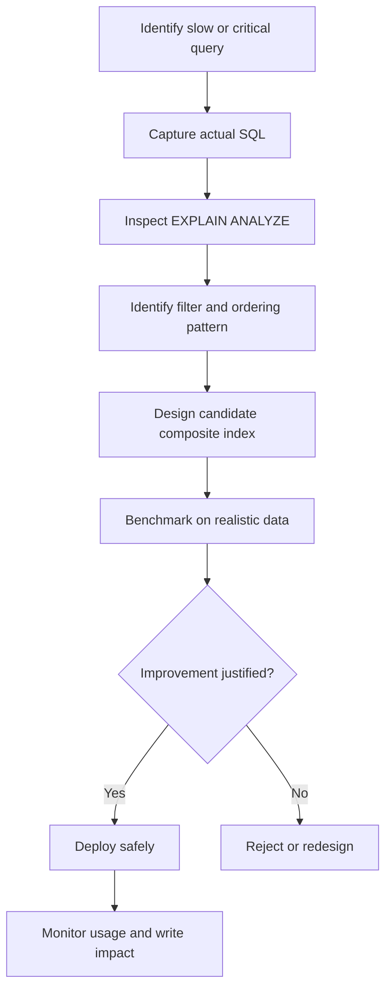

# 17- Composite Index Column Order

## Overview

A composite index contains multiple columns in a defined order:

```sql
CREATE INDEX idx_orders_customer_status_created
ON orders (customer_id, status, created_at DESC);
```

The column order is part of the index design. These two indexes are different access paths:

```text
(customer_id, status, created_at)
(status, customer_id, created_at)
```

Choosing the order correctly can determine whether PostgreSQL can efficiently:

- Locate rows.
- Apply equality and range predicates.
- Produce rows in the required order.
- Support keyset pagination.
- Reduce sorting.
- Reduce the amount of data scanned.

A common starting principle is:

```text
Equality predicates
        ↓
Range predicates
        ↓
Ordering requirements
        ↓
Other columns needed for the access path
```

However, this is a design heuristic rather than an absolute rule. PostgreSQL's planner can use indexes in several ways, and the best column order depends on the complete query workload.

The correct process is:

```text
Query workload
    ↓
Access patterns
    ↓
Candidate column order
    ↓
EXPLAIN
    ↓
Benchmark
    ↓
Production validation
```

---

## What Is a Composite Index?

A composite index, also called a multicolumn index, contains two or more indexed columns.

Example:

```sql
CREATE INDEX idx_orders_customer_created
ON orders (
    customer_id,
    created_at DESC
);
```

Conceptually:

```text
(customer_id, created_at)

customer 10 → 2026-08-31
customer 10 → 2026-08-30
customer 10 → 2026-08-29
customer 20 → 2026-08-31
customer 20 → 2026-08-28
...
```

The database maintains the index according to the defined key order.

The ordering of the columns determines which query patterns the index can support efficiently.

---

## Why Column Order Matters

Consider:

```sql
CREATE INDEX idx_orders_customer_status_created
ON orders (
    customer_id,
    status,
    created_at DESC
);
```

This index aligns naturally with:

```sql
SELECT *
FROM orders
WHERE customer_id = $1
  AND status = $2
ORDER BY created_at DESC
LIMIT 50;
```

The index can narrow the search using:

```text
customer_id
    ↓
status
    ↓
created_at ordering
```

Changing it to:

```sql
CREATE INDEX idx_orders_status_created_customer
ON orders (
    status,
    created_at DESC,
    customer_id
);
```

creates a different access structure.

It may be better for some queries and worse for others.

Therefore:

> Composite index design must start from query access patterns, not from the table definition alone.

---

## The Leftmost Prefix Principle

For a B-tree index:

```sql
CREATE INDEX idx_orders_customer_status_created
ON orders (
    customer_id,
    status,
    created_at DESC
);
```

the leading portion of the index is especially important.

The index naturally supports access patterns involving:

```text
customer_id
```

and:

```text
customer_id + status
```

and potentially:

```text
customer_id + status + created_at
```

It is not equivalent to having separate indexes on:

```text
customer_id
status
created_at
```

The physical ordering is different.

A useful mental model is:

```text
(customer_id, status, created_at)

         ↓

customer_id
    └── status
          └── created_at
```

The earlier columns establish the search region for later columns.

---

## Equality Before Range

A common index-design heuristic is to put columns used by equality predicates before columns used by range predicates.

Consider:

```sql
SELECT *
FROM orders
WHERE customer_id = $1
  AND created_at >= $2
ORDER BY created_at DESC
LIMIT 50;
```

A strong candidate is:

```sql
CREATE INDEX idx_orders_customer_created
ON orders (
    customer_id,
    created_at DESC
);
```

The access pattern is:

```text
customer_id = ?
        ↓
narrow to one customer's rows
        ↓
created_at range
        ↓
already ordered
```

Compare this with:

```sql
CREATE INDEX idx_orders_created_customer
ON orders (
    created_at DESC,
    customer_id
);
```

The first version generally aligns better with the equality-plus-time-range query.

---

## Equality Columns

Suppose the query is:

```sql
SELECT *
FROM orders
WHERE tenant_id = $1
  AND status = 'pending'
  AND created_at >= $2;
```

A candidate index is:

```sql
CREATE INDEX idx_orders_tenant_status_created
ON orders (
    tenant_id,
    status,
    created_at DESC
);
```

Here:

```text
tenant_id = ?
status = ?
created_at >= ?
```

maps naturally to:

```text
equality
equality
range/order
```

This is often an effective pattern for multi-tenant backend systems.

---

## Multiple Equality Columns

Suppose:

```sql
SELECT *
FROM orders
WHERE tenant_id = $1
  AND customer_id = $2
  AND status = $3;
```

Potentially:

```sql
CREATE INDEX idx_orders_tenant_customer_status
ON orders (
    tenant_id,
    customer_id,
    status
);
```

When several columns are constrained by equality, their relative order is often less important to the basic lookup because all are fixed to values.

However, column order can still matter when:

- Different queries use different subsets.
- Ordering is required.
- Range predicates are added.
- Prefix access patterns differ.
- Data distribution is highly skewed.

Do not reduce index design to:

> "Put all equality columns first in any order."

The broader workload still determines the best arrangement.

---

## Equality + Range + Ordering

Consider:

```sql
SELECT
    id,
    customer_id,
    created_at,
    total_amount
FROM orders
WHERE tenant_id = $1
  AND status = 'paid'
  AND created_at >= $2
ORDER BY created_at DESC
LIMIT 50;
```

A natural candidate is:

```sql
CREATE INDEX idx_orders_tenant_status_created
ON orders (
    tenant_id,
    status,
    created_at DESC
);
```

The structure supports:

```text
tenant_id equality
        ↓
status equality
        ↓
created_at range
        ↓
created_at ordering
        ↓
LIMIT 50
```

This pattern is common in production APIs.

---

## Equality + Range + Pagination

For keyset pagination:

```sql
SELECT
    id,
    customer_id,
    created_at,
    total_amount
FROM orders
WHERE tenant_id = $1
  AND status = 'paid'
  AND (created_at, id) < ($2, $3)
ORDER BY created_at DESC, id DESC
LIMIT 50;
```

a candidate index is:

```sql
CREATE INDEX idx_orders_tenant_status_created_id
ON orders (
    tenant_id,
    status,
    created_at DESC,
    id DESC
);
```

The design reflects:

```text
tenant_id
    ↓
status
    ↓
created_at + id cursor
    ↓
ordered LIMIT
```

This is one of the most useful composite-index patterns for high-volume APIs.

---

## Unique Tie-Breakers

If pagination uses:

```sql
ORDER BY created_at DESC
```

and `created_at` is not unique, add a deterministic tie-breaker:

```sql
ORDER BY created_at DESC, id DESC;
```

Then the index can be:

```sql
CREATE INDEX idx_orders_created_id
ON orders (
    created_at DESC,
    id DESC
);
```

For tenant-scoped pagination:

```sql
CREATE INDEX idx_orders_tenant_created_id
ON orders (
    tenant_id,
    created_at DESC,
    id DESC
);
```

The index ordering should correspond to the pagination ordering.

---

## Composite Indexes and `ORDER BY`

Suppose:

```sql
CREATE INDEX idx_orders_customer_created
ON orders (
    customer_id,
    created_at DESC
);
```

and:

```sql
SELECT *
FROM orders
WHERE customer_id = $1
ORDER BY created_at DESC
LIMIT 50;
```

The index can potentially provide the rows in the requested order.

This can avoid an explicit sort.

The benefit becomes:

```text
Filter
  ↓
Index traversal
  ↓
Already ordered
  ↓
LIMIT 50
```

rather than:

```text
Filter
  ↓
Collect rows
  ↓
Sort
  ↓
LIMIT 50
```

For latency-sensitive APIs, avoiding large sorts can be valuable.

---

## Index Column Direction

PostgreSQL allows per-column sort direction:

```sql
CREATE INDEX idx_orders_created_id
ON orders (
    created_at DESC,
    id DESC
);
```

This matches:

```sql
ORDER BY created_at DESC, id DESC;
```

PostgreSQL B-tree indexes can also be scanned in reverse, so a simple single-direction index can often support the corresponding fully reversed order.

The distinction becomes more important when sort directions are mixed.

For example:

```sql
ORDER BY priority DESC, created_at ASC;
```

may require an index whose column directions match that exact pattern for efficient ordered traversal.

---

## Mixed Sort Directions

Consider:

```sql
CREATE INDEX idx_tasks_priority_created
ON tasks (
    priority DESC,
    created_at ASC
);
```

This aligns with:

```sql
ORDER BY priority DESC, created_at ASC;
```

A reverse scan produces:

```text
priority ASC
created_at DESC
```

It does not produce every possible combination of directions.

This matters for queries such as:

```sql
ORDER BY priority DESC, created_at ASC
```

where the requested order is not simply the complete reverse of the index ordering.

When mixed directions matter, encode them intentionally in the index and verify the execution plan.

---

## Composite Index vs Multiple Single-Column Indexes

Suppose the query is:

```sql
SELECT *
FROM orders
WHERE customer_id = $1
  AND status = $2;
```

You might consider:

```sql
CREATE INDEX idx_orders_customer
ON orders (customer_id);

CREATE INDEX idx_orders_status
ON orders (status);
```

or:

```sql
CREATE INDEX idx_orders_customer_status
ON orders (customer_id, status);
```

These are not equivalent.

A composite index can represent the combined access pattern directly.

PostgreSQL can sometimes combine multiple indexes using bitmap operations:

```text
Index(customer_id)
        +
Index(status)
        ↓
Bitmap combination
        ↓
Table access
```

But this does not make separate indexes equivalent to a well-designed composite index.

---

## When Separate Indexes Are Better

Separate indexes may be appropriate when the workload contains independent queries:

```sql
WHERE customer_id = $1
```

and:

```sql
WHERE status = $1
```

A composite index:

```text
(customer_id, status)
```

is naturally optimized around the leading `customer_id` column and does not replace every possible access pattern involving `status`.

The correct design depends on the complete query workload.

---

## Selectivity and Column Order

Suppose:

```text
tenant_id → 10,000 distinct values
status    → 4 distinct values
```

A naive rule might say:

> Always put the most selective column first.

This is incomplete.

If the query is:

```sql
WHERE tenant_id = $1
  AND status = 'pending'
ORDER BY created_at DESC;
```

then:

```text
(tenant_id, status, created_at)
```

may be appropriate because it directly models the access pattern.

Selectivity matters, but so do:

- Equality predicates.
- Range predicates.
- Ordering.
- Pagination.
- Query frequency.
- Data distribution.
- Other queries using the same index.

Do not choose column order from cardinality alone.

---

## Tenant-First Indexes

For a multi-tenant table:

```sql
CREATE INDEX idx_orders_tenant_created
ON orders (
    tenant_id,
    created_at DESC
);
```

is often useful for:

```sql
SELECT *
FROM orders
WHERE tenant_id = $1
ORDER BY created_at DESC
LIMIT 50;
```

The index first narrows the search to the tenant's rows and then traverses them in time order.

This pattern is particularly useful when:

```text
one large shared table
+
many tenant-scoped API requests
```

---

## Tenant Skew

Tenant distributions can significantly affect index behavior.

Suppose:

```text
Tenant A → 60% of rows
Tenant B → 10%
Tenant C → 0.01%
```

A tenant-first index still provides the same logical access path, but the amount of data associated with each tenant differs dramatically.

For large tenants, additional strategies may become relevant:

- Partitioning.
- Dedicated indexes.
- Archival.
- Workload isolation.
- Tenant-specific infrastructure.

Do not assume every tenant behaves like the average tenant.

---

## Time-Series Tables

For event data:

```sql
SELECT *
FROM events
WHERE customer_id = $1
  AND created_at >= $2
ORDER BY created_at DESC
LIMIT 100;
```

a candidate index is:

```sql
CREATE INDEX idx_events_customer_created
ON events (
    customer_id,
    created_at DESC
);
```

This is common for:

- Audit events.
- Customer activity.
- Application events.
- Notification history.
- Payment history.

For very large append-heavy datasets, partitioning and retention strategy should be considered alongside indexing.

---

## Status + Time Queries

Consider:

```sql
SELECT *
FROM jobs
WHERE status = 'pending'
ORDER BY created_at
LIMIT 100;
```

A candidate index is:

```sql
CREATE INDEX idx_jobs_status_created
ON jobs (
    status,
    created_at
);
```

If only pending jobs are relevant and pending rows represent a small subset, a partial index may be better:

```sql
CREATE INDEX idx_jobs_pending_created
ON jobs (created_at)
WHERE status = 'pending';
```

This can reduce index size and write maintenance.

The best choice depends on how frequently each status is queried and how quickly rows move between statuses.

---

## Partial Indexes and Column Order

A partial index can eliminate a low-selectivity predicate from the indexed key.

Instead of:

```sql
CREATE INDEX idx_jobs_status_created
ON jobs (status, created_at)
WHERE status = 'pending';
```

you may use:

```sql
CREATE INDEX idx_jobs_pending_created
ON jobs (created_at)
WHERE status = 'pending';
```

The latter expresses:

```text
Only pending rows belong in the index.
```

Then:

```text
index key = created_at
index predicate = status = pending
```

This can be significantly smaller when the indexed subset is small.

---

## Covering Indexes

Suppose:

```sql
SELECT
    customer_id,
    created_at,
    total_amount
FROM orders
WHERE customer_id = $1
ORDER BY created_at DESC
LIMIT 50;
```

A possible index is:

```sql
CREATE INDEX idx_orders_customer_created
ON orders (
    customer_id,
    created_at DESC
)
INCLUDE (total_amount);
```

The key columns define:

```text
search + ordering
```

while `INCLUDE` adds non-key payload columns.

This can enable efficient index-only access in suitable circumstances.

Do not turn every query column into an index key.

Extra key columns change the index ordering and can increase index size more than necessary.

---

## Key Columns vs INCLUDE Columns

Consider:

```sql
CREATE INDEX idx_orders_customer_created
ON orders (
    customer_id,
    created_at DESC
)
INCLUDE (
    total_amount,
    currency
);
```

The distinction is:

```text
Key columns
    ↓
define index ordering and search structure

INCLUDE columns
    ↓
store additional payload
```

Use key columns for:

- Filtering.
- Ordering.
- Access-path requirements.

Use included columns when they are needed primarily to cover the query.

---

## Too Many Columns

A common mistake is:

```sql
CREATE INDEX idx_orders_everything
ON orders (
    tenant_id,
    customer_id,
    status,
    created_at,
    updated_at,
    total_amount,
    currency,
    region,
    country,
    ...
);
```

This is usually a sign that index design has become query-agnostic.

Problems include:

- Large index size.
- Higher write cost.
- Higher WAL volume.
- Poor cache efficiency.
- More complicated maintenance.
- Harder schema evolution.

Design indexes around concrete workload patterns.

---

## Prefix Matching

Suppose:

```sql
CREATE INDEX idx_users_country_city
ON users (
    country,
    city
);
```

This is naturally useful for:

```sql
WHERE country = $1
```

and:

```sql
WHERE country = $1
  AND city = $2;
```

But it is not the same as an index:

```sql
(city, country)
```

for the same workload.

The first column establishes the primary search organization.

---

## Skip Scan

Modern PostgreSQL versions can sometimes use a multicolumn B-tree index even when there is no equality condition on the leading column through skip-scan behavior in suitable circumstances.

For example:

```sql
CREATE INDEX idx_orders_status_created
ON orders (status, created_at);
```

may sometimes help a query focused on:

```sql
WHERE created_at = $1;
```

depending on the number of distinct values, statistics, and cost estimates.

This does **not** invalidate the importance of column order.

Skip scans have their own cost model and may be less efficient than an index designed directly for the query.

Use `EXPLAIN` rather than assuming skip scan behavior.

---

## Query Planner and Composite Indexes

The PostgreSQL planner estimates the cost of possible access paths.

For a composite index, it considers:

- Predicate selectivity.
- Column statistics.
- Correlation.
- Number of expected rows.
- Ordering requirements.
- Cost of heap access.
- Alternative indexes.
- Sequential scan cost.
- Join strategy.

Therefore:

```text
Composite index exists
        ≠
Planner must use it
```

The planner may correctly choose:

```text
Seq Scan
```

if most rows are required.

---

## Execution Plan Example

Use:

```sql
EXPLAIN (ANALYZE, BUFFERS)
SELECT
    id,
    customer_id,
    created_at
FROM orders
WHERE customer_id = 42
  AND status = 'paid'
ORDER BY created_at DESC
LIMIT 50;
```

Look for:

```text
Index Scan
Index Only Scan
Bitmap Index Scan
Bitmap Heap Scan
Seq Scan
Sort
```

Also compare:

```text
estimated rows
actual rows
```

Large discrepancies may indicate statistics or data-distribution problems.

---

## Statistics Matter

Suppose PostgreSQL estimates:

```text
10 rows
```

but the query actually returns:

```text
500,000 rows
```

The planner may choose an index plan expecting cheap access and then discover that it must fetch a huge number of rows.

This can make a theoretically good index appear ineffective.

After significant data changes:

```sql
ANALYZE orders;
```

can refresh planner statistics.

For highly correlated or skewed columns, PostgreSQL statistics configuration may need further tuning.

---

## Correlation and Physical Order

PostgreSQL's planner also considers correlation between index order and physical table order.

If rows are physically clustered around the index ordering, index-driven heap access can be cheaper.

If matching rows are scattered across many pages, an index scan can require many random heap accesses.

This is one reason:

```text
same index
+
same query
```

can behave differently on different datasets.

Index performance is influenced by physical data distribution, not only logical schema design.

---

## Composite Index and JOINs

Consider:

```sql
SELECT
    o.id,
    c.email
FROM orders AS o
JOIN customers AS c
    ON c.id = o.customer_id
WHERE o.tenant_id = $1
  AND o.status = 'paid';
```

A candidate index on the orders side might be:

```sql
CREATE INDEX idx_orders_tenant_status_customer
ON orders (
    tenant_id,
    status,
    customer_id
);
```

Whether `customer_id` should be part of the index depends on the join and query workload.

Do not automatically append every join column.

Evaluate:

```text
filter
+
join
+
ordering
+
result columns
```

as one access pattern.

---

## Composite Index and EXISTS

For:

```sql
SELECT c.id
FROM customers AS c
WHERE EXISTS (
    SELECT 1
    FROM orders AS o
    WHERE o.customer_id = c.id
      AND o.status = 'paid'
);
```

a candidate index is:

```sql
CREATE INDEX idx_orders_customer_status
ON orders (
    customer_id,
    status
);
```

The index aligns with:

```text
customer_id = outer customer
status = paid
```

This can provide an efficient existence lookup.

Again, the planner may choose a different strategy depending on table sizes and selectivity.

---

## Composite Index and GROUP BY

Consider:

```sql
SELECT
    customer_id,
    COUNT(*)
FROM orders
GROUP BY customer_id;
```

An index on:

```sql
(customer_id)
```

may sometimes be useful, but do not assume it will automatically make the aggregation fast.

If the query must process most rows, the dominant cost may still be scanning and aggregating a large dataset.

For analytical workloads, a different data model or precomputed aggregate may be more appropriate.

---

## Composite Index and Window Functions

Consider:

```sql
SELECT
    customer_id,
    created_at,
    ROW_NUMBER() OVER (
        PARTITION BY customer_id
        ORDER BY created_at DESC
    ) AS row_number
FROM orders;
```

An index such as:

```sql
CREATE INDEX idx_orders_customer_created
ON orders (
    customer_id,
    created_at DESC
);
```

matches the logical partition and ordering.

This can be useful, but an index does not guarantee that PostgreSQL will avoid sorting or use the index.

Window execution, filtering, joins, and query shape still matter.

---

## Composite Index and `OR`

Queries such as:

```sql
WHERE customer_id = $1
   OR status = 'pending'
```

are harder to optimize with one composite index.

An index:

```text
(customer_id, status)
```

does not necessarily provide an ideal access path for both independent branches.

PostgreSQL may use:

```text
BitmapOr
```

with separate indexes when appropriate.

For complex `OR` workloads, evaluate the actual execution plan rather than forcing everything into one composite index.

---

## Composite Index and NULL

Consider:

```sql
CREATE INDEX idx_customers_tenant_phone
ON customers (
    tenant_id,
    phone
);
```

PostgreSQL B-tree indexes can contain `NULL` values.

A query:

```sql
WHERE tenant_id = $1
  AND phone IS NULL
```

can potentially use this index.

The planner still decides whether the index is worthwhile.

If only a small subset of rows has `phone IS NULL`, a partial index may be more efficient.

---

## Index Column Order and Write Cost

Changing:

```sql
(a, b)
```

to:

```sql
(a, b, c)
```

increases index size and maintenance cost.

Adding a column is not free.

For a high-write table:

```text
Kafka ingestion
      ↓
PostgreSQL
      ↓
multiple indexes
```

each additional index increases the amount of work required per inserted row.

For event-heavy systems, carefully minimize indexes that are not supporting important production queries.

---

## Index Column Order and Storage

Consider:

```sql
CREATE INDEX idx_events_tenant_type_created
ON events (
    tenant_id,
    event_type,
    created_at
);
```

versus:

```sql
CREATE INDEX idx_events_tenant_type_created_payload
ON events (
    tenant_id,
    event_type,
    created_at,
    large_text_column
);
```

The second index may become significantly larger.

If the additional column is needed only to support index-only access, `INCLUDE` may be more appropriate.

Do not make wide columns part of the ordering key unless the access pattern requires it.

---

## Index Design for API Queries

A common FastAPI/Django endpoint:

```http
GET /orders?status=paid&limit=50
```

might execute:

```sql
SELECT
    id,
    customer_id,
    created_at,
    total_amount
FROM orders
WHERE tenant_id = $1
  AND status = $2
ORDER BY created_at DESC, id DESC
LIMIT 50;
```

A candidate index:

```sql
CREATE INDEX idx_orders_tenant_status_created_id
ON orders (
    tenant_id,
    status,
    created_at DESC,
    id DESC
);
```

The index follows the endpoint's access pattern:

```text
tenant filter
      ↓
status filter
      ↓
sort/cursor
      ↓
LIMIT
```

This is much stronger than creating indexes independently because:

```text
tenant_id
status
created_at
id
```

all happen to appear in the query.

---

## Query Workload Matters More Than One Query

Suppose the application has these queries:

```sql
WHERE tenant_id = $1
ORDER BY created_at DESC
```

```sql
WHERE tenant_id = $1
  AND status = $2
ORDER BY created_at DESC
```

```sql
WHERE status = $1
ORDER BY created_at DESC
```

One index may not optimally support all three.

Possible indexes could include:

```text
(tenant_id, status, created_at)
(tenant_id, created_at)
(status, created_at)
```

but creating all three without measuring can create unnecessary write and storage cost.

A senior engineer prioritizes:

```text
query frequency
+
latency impact
+
data volume
+
write cost
```

and chooses the smallest useful index set.

---

## Production Index Design Workflow

Use a repeatable process:



Do not design indexes in isolation from actual workload.

---

## Testing Candidate Indexes

Before deploying a large index, test against representative data.

Compare:

```sql
EXPLAIN (ANALYZE, BUFFERS)
SELECT ...;
```

before and after the candidate index.

Measure:

- Execution time.
- Planning time.
- Shared buffer hits.
- Shared buffer reads.
- Rows returned.
- Rows removed by filter.
- Sort operations.
- CPU.
- Write impact.

For production-scale systems, benchmark with realistic:

- Table size.
- Data distribution.
- Tenant skew.
- Concurrent traffic.

A small development database can produce misleading planner decisions.

---

## Production Deployment

For a large production table:

```sql
CREATE INDEX CONCURRENTLY idx_orders_tenant_status_created
ON orders (
    tenant_id,
    status,
    created_at DESC
);
```

`CREATE INDEX CONCURRENTLY` reduces blocking of ordinary writes but has trade-offs:

- More work.
- Longer build time.
- Additional resource usage.
- Cannot execute inside a transaction block.
- Failed builds can leave an invalid index requiring cleanup.

Coordinate index creation through CI/CD or a controlled migration workflow.

Do not have every Kubernetes application pod independently attempt schema changes.

---

## Monitoring Index Usage

PostgreSQL provides index statistics:

```sql
SELECT
    schemaname,
    relname AS table_name,
    indexrelname AS index_name,
    idx_scan,
    pg_size_pretty(pg_relation_size(indexrelid)) AS index_size
FROM pg_stat_user_indexes
ORDER BY idx_scan, pg_relation_size(indexrelid) DESC;
```

Use this to identify:

- Rarely used indexes.
- Large indexes.
- Potential index debt.
- Unexpected workload changes.

Usage statistics are evidence, not an automatic drop recommendation.

---

## Index Health and Redundancy

Review indexes for overlap.

For example:

```text
(customer_id)
(customer_id, created_at)
(customer_id, status, created_at)
```

may contain significant overlap.

The correct answer depends on the workload.

Consider:

```text
Can the longer index serve the shorter query?
Is the shorter index significantly smaller?
Are both heavily used?
Does the shorter index improve write/cache behavior?
```

Do not maintain redundant indexes indefinitely without justification.

---

## High Availability and Replication

Index creation and maintenance affect the primary database and generate WAL.

Large index operations can contribute to:

- CPU pressure.
- I/O pressure.
- WAL growth.
- Replica lag.
- Storage pressure.

Before creating a large composite index in production, check:

```text
primary capacity
replica capacity
storage headroom
replication lag
backup capacity
```

An index that improves API reads can still temporarily affect the rest of the database topology.

---

## Backup and Disaster Recovery

Indexes increase database storage and therefore affect:

- Backup size.
- Restore time.
- Storage requirements.
- Replication workload.

Indexes are derived structures and can generally be reconstructed from the underlying data, but a restored production database still needs its expected indexes before it can handle normal application traffic.

Recovery testing should verify:

```text
schema
+
indexes
+
application compatibility
+
query performance
```

rather than merely checking whether the database starts.

---

## Security Considerations

Composite indexes do not provide authorization.

For:

```sql
CREATE INDEX idx_orders_tenant_created
ON orders (tenant_id, created_at DESC);
```

the presence of `tenant_id` in the index does not enforce tenant isolation.

The query must still contain the authorization boundary:

```sql
WHERE tenant_id = $1
```

and the application should use:

- Parameterized SQL.
- Proper database roles.
- Row-Level Security where appropriate.
- Explicit authorization checks.

Indexed columns may also contain sensitive data, so index storage should be considered part of the database's security boundary.

---

## Cost Considerations

A composite index should be evaluated across:

```text
Read benefit
+
Write overhead
+
Storage
+
WAL
+
Replication
+
Backup
+
Maintenance
```

A wide composite index can be especially expensive.

For a high-throughput write workload:

```text
1 additional index
    ↓
millions of additional index-maintenance operations
```

may be more expensive than a modest read optimization is worth.

For a high-volume read API:

```text
100,000 queries/hour
    ↓
significant latency improvement
```

the same index may be highly valuable.

---

## Common Mistakes

### Treating `(a, b)` and `(b, a)` as Equivalent

They are different index organizations.

### Following "Most Selective First" Blindly

Selectivity matters, but equality, range, ordering, query frequency, and workload all matter.

### Putting a Range Column Too Early

A pattern such as:

```text
tenant_id
created_at
status
```

may not support:

```text
tenant_id = ?
status = ?
created_at >= ?
```

as effectively as:

```text
tenant_id
status
created_at
```

depending on the workload.

### Creating Separate Indexes for Every Column

Multiple single-column indexes are not equivalent to a composite index representing a combined access pattern.

### Creating One Giant Index

Appending every query column creates large, expensive indexes.

### Ignoring `ORDER BY`

The correct filter index may not provide the desired ordering.

### Ignoring Keyset Pagination

For high-volume feeds, align the composite index with:

```text
filters
+
cursor columns
+
ORDER BY
```

### Assuming PostgreSQL Will Always Use the Index

The planner may correctly prefer a sequential scan or another index.

### Ignoring Statistics

Poor cardinality estimates can result in poor plans even when the index is well designed.

### Forgetting Tenant Skew

Large tenants can have dramatically different access patterns from small tenants.

### Making Every Column an Index Key

Use `INCLUDE` when additional columns are needed mainly for coverage rather than search/order semantics.

### Creating Indexes Without Measuring Write Cost

Read improvements can come with significant write amplification.

### Dropping an Index Because It Looks Redundant

Validate actual workload usage before removal.

---

## Interview Traps

### "Put the Most Selective Column First"

Incomplete.

A stronger answer is:

> "Column order depends on the query workload. Equality predicates commonly lead, followed by range and ordering requirements, but selectivity, query frequency, data distribution, and competing queries must also be considered."

### "A Composite Index Is the Same as Multiple Single-Column Indexes"

False.

PostgreSQL can sometimes combine separate indexes, but a composite index represents a different ordered access structure.

### "The First Column Must Always Be the Most Selective"

False.

For:

```sql
WHERE tenant_id = $1
  AND status = $2
ORDER BY created_at DESC
```

the useful order is often:

```text
tenant_id
status
created_at
```

because it matches the complete access pattern.

### "If an Index Exists, PostgreSQL Uses It"

False.

The planner chooses the cheapest estimated plan.

### "More Columns Always Make a Composite Index Better"

False.

Additional columns increase size and maintenance cost and can change the useful access patterns.

### "Indexes Only Affect Reads"

False.

Indexes also affect:

- Inserts.
- Updates.
- Deletes.
- WAL.
- Vacuum.
- Replication.
- Storage.
- Backups.

---

## Senior Decision Framework

For every composite index, identify:

```text
1. Query
2. Equality predicates
3. Range predicates
4. ORDER BY
5. Pagination/cursor
6. JOIN conditions
7. Required output columns
8. Data distribution
9. Query frequency
10. Write volume
```

Then construct the candidate:

```text
Equality filters
       ↓
Range/cursor boundary
       ↓
Ordering
       ↓
INCLUDE payload where justified
```

and validate it using:

```sql
EXPLAIN (ANALYZE, BUFFERS)
```

The final index should be the smallest structure that provides the required production benefit.

---

## Practical Decision Matrix

| Query pattern | Candidate index shape |
|---|---|
| `WHERE tenant_id = ?` | `(tenant_id)` |
| `WHERE tenant_id = ? AND status = ?` | `(tenant_id, status)` |
| Equality + time range | `(tenant_id, created_at)` |
| Equality + status + time ordering | `(tenant_id, status, created_at DESC)` |
| Keyset pagination | `(filters..., sort_key DESC, id DESC)` |
| Prefix text search | Appropriate B-tree text index |
| Small active subset | Partial index |
| Search + returned payload | Key columns + `INCLUDE` |
| Independent predicates used separately | Possibly separate indexes |
| Complex mixed ordering | Explicitly match required sort directions |
| Large analytical aggregation | Index may not be the primary solution |

---

## Production Example

Suppose a Django/FastAPI service exposes:

```http
GET /api/orders?status=paid&limit=50&cursor=...
```

The endpoint requires:

```text
tenant isolation
+
status filter
+
created_at ordering
+
id tie-breaker
+
keyset pagination
```

SQL:

```sql
SELECT
    id,
    customer_id,
    created_at,
    total_amount
FROM orders
WHERE tenant_id = $1
  AND status = 'paid'
  AND (created_at, id) < ($2, $3)
ORDER BY created_at DESC, id DESC
LIMIT 50;
```

Candidate index:

```sql
CREATE INDEX CONCURRENTLY idx_orders_tenant_status_created_id
ON orders (
    tenant_id,
    status,
    created_at DESC,
    id DESC
);
```

The design directly represents the access path:

```text
tenant_id
    ↓
status
    ↓
created_at + id cursor
    ↓
ordered result
    ↓
LIMIT 50
```

The final decision should still be validated with real execution plans and production workload measurements.

---

## Key Takeaways

- **Composite index column order defines the access path; `(a, b)` and `(b, a)` are different indexes with different workload characteristics.**
- **A strong starting heuristic is equality predicates first, followed by range/cursor columns and ordering requirements, but query frequency, selectivity, data distribution, and competing queries must also be considered.**
- **Align composite indexes with complete production access patterns—especially tenant filters, status filters, time ranges, `ORDER BY`, and keyset pagination.**
- **Do not replace workload analysis with indexing rules:** PostgreSQL may use sequential scans, bitmap strategies, skip scans, or different indexes depending on estimated cost and statistics.
- **Treat every additional index as a production cost:** validate read improvements against write amplification, storage, WAL, replication, backup, and maintenance overhead.