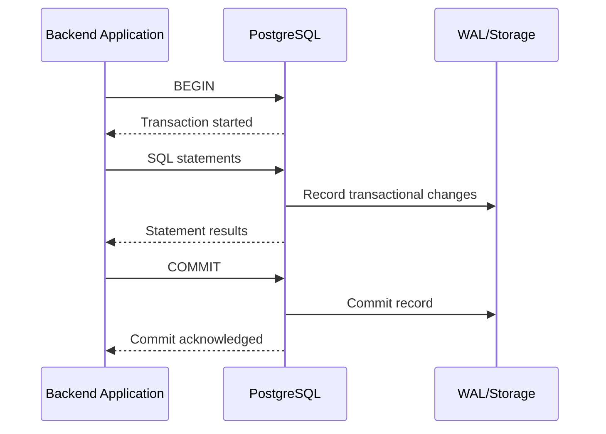
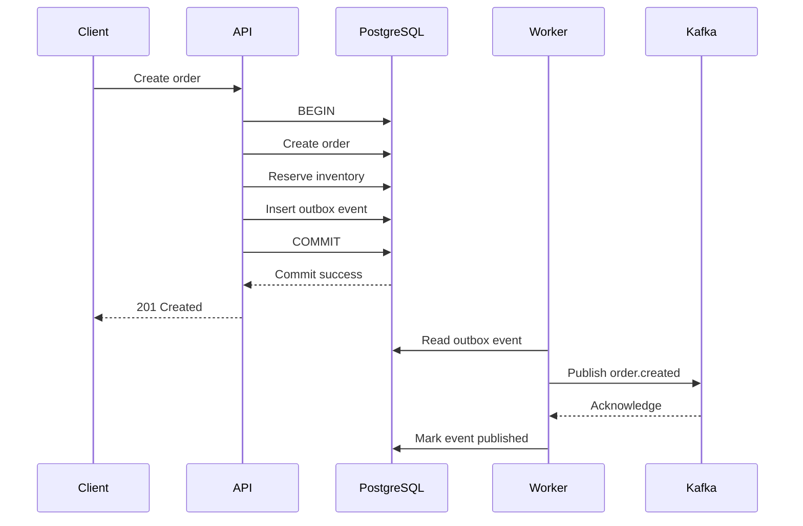

# 18- Transaction vs No Transaction

## Overview

A database transaction groups one or more SQL statements into a unit of work with defined atomicity and consistency behavior.

The important production question is not:

> "Should every database operation use a transaction?"

The better question is:

> "Which operations must succeed or fail together, and what database state is allowed to be observed if the operation fails or runs concurrently?"

A transaction is useful when multiple changes represent one logical state transition:

```text
Create order
    +
Reserve inventory
    +
Create payment record
    ↓
One logical operation
```

Without appropriate transactional boundaries, partial failure can leave inconsistent state:

```text
Order created
    ↓
Inventory reservation succeeds
    ↓
Payment record fails
    ↓
Partial state remains
```

Transactions provide the database-level mechanism for controlling such changes.

However, transactions also have costs. Long-running transactions can:

- Hold locks.
- Delay cleanup of old row versions.
- Increase contention.
- Increase resource usage.
- Reduce throughput.
- Complicate failover and operational recovery.

The goal is therefore **correct transactional boundaries**, not maximum transaction usage.

---

## What Is a Transaction?

A transaction is a database operation boundary in which SQL statements are treated as one logical unit.

A basic transaction looks like:

```sql
BEGIN;

UPDATE accounts
SET balance = balance - 100
WHERE id = 1;

UPDATE accounts
SET balance = balance + 100
WHERE id = 2;

COMMIT;
```

If the transaction fails before commit:

```sql
ROLLBACK;
```

the changes are discarded according to the database's transaction semantics.

Conceptually:

```text
BEGIN
  ↓
Statement 1
  ↓
Statement 2
  ↓
Statement 3
  ↓
COMMIT
```

or:

```text
BEGIN
  ↓
Statement 1
  ↓
Statement 2 fails
  ↓
ROLLBACK
```

---

## Why Transactions Exist

Transactions protect logical state transitions from partial completion.

Consider transferring money:

```text
Account A: -100
Account B: +100
```

These operations must normally represent one logical change.

Without a transaction:

```text
Debit A
    ↓
Application crashes
    ↓
Credit B never happens
```

The system is left in an invalid state.

With a transaction:

```text
BEGIN
  ↓
Debit A
  ↓
Credit B
  ↓
COMMIT
```

either the complete state transition commits or the transaction rolls back.

---

## ACID Properties

Transactions are commonly described using ACID:

| Property | Meaning |
|---|---|
| Atomicity | The transaction's changes are committed as a unit |
| Consistency | Database constraints and defined invariants are preserved |
| Isolation | Concurrent transactions are controlled according to the isolation level |
| Durability | Committed data survives according to the database's durability guarantees |

These properties should not be interpreted as:

```text
Transaction = automatically correct application behavior
```

A transaction cannot automatically prevent business-logic bugs or guarantee distributed consistency across independent systems.

---

## Transaction Lifecycle

A typical PostgreSQL transaction follows:



The exact internal behavior depends on the database engine and configuration, but the important application-level boundary is:

```text
BEGIN → statements → COMMIT/ROLLBACK
```

---

## When a Transaction Is Necessary

Use a transaction when multiple database operations must succeed or fail together.

Typical examples:

- Creating an order and order items.
- Updating inventory and recording the reservation.
- Moving money between accounts.
- Creating related records that must remain consistent.
- Updating multiple tables as one state transition.
- Performing a conditional read-modify-write operation.
- Maintaining a database invariant across multiple statements.

Example:

```sql
BEGIN;

INSERT INTO orders (
    id,
    customer_id,
    status
)
VALUES (
    $1,
    $2,
    'pending'
);

INSERT INTO order_items (
    order_id,
    product_id,
    quantity
)
VALUES (
    $1,
    $3,
    $4
);

COMMIT;
```

If the order is created but the item insert fails, the transaction can roll back the order creation.

---

## When a Transaction May Not Be Necessary

Not every independent read needs an explicit application-managed transaction.

For example:

```sql
SELECT
    id,
    email
FROM customers
WHERE id = $1;
```

A single SQL statement already executes with database-defined transactional semantics.

Similarly, an independent write:

```sql
UPDATE customers
SET last_login_at = now()
WHERE id = $1;
```

may not require a larger explicit transaction.

The key distinction is:

```text
One independent statement
    ↓
Usually no explicit multi-statement transaction required

Multiple dependent statements
    ↓
Consider explicit transaction
```

---

## Single Statements Are Still Transactional

It is incorrect to think:

> "If I don't write `BEGIN`, there is no transaction."

PostgreSQL operates each standalone statement in its own transaction when autocommit is enabled.

For example:

```sql
UPDATE customers
SET last_login_at = now()
WHERE id = $1;
```

is executed as a transaction containing that statement.

Conceptually:

```text
BEGIN
  ↓
UPDATE
  ↓
COMMIT
```

The client may hide these transaction boundaries through autocommit behavior.

---

## Explicit Transaction

An explicit transaction groups multiple statements:

```sql
BEGIN;

UPDATE inventory
SET available_quantity = available_quantity - 1
WHERE product_id = $1
  AND available_quantity > 0;

INSERT INTO order_items (
    order_id,
    product_id,
    quantity
)
VALUES (
    $2,
    $1,
    1
);

COMMIT;
```

This is appropriate when both operations represent one logical state transition.

But the example also demonstrates an important issue:

```text
Was exactly one inventory unit actually reserved?
```

A transaction does not automatically make the business operation correct.

The application should verify the affected row count or use a database constraint/atomic statement that correctly encodes the invariant.

---

## Transaction Boundaries

A transaction boundary should correspond to a meaningful consistency boundary.

Good:

```text
Create order
+
Create order items
+
Reserve inventory
```

Potentially bad:

```text
HTTP request begins
    ↓
Call external payment API
    ↓
Wait 20 seconds
    ↓
Call another service
    ↓
Generate report
    ↓
Database COMMIT
```

The second design creates an unnecessarily long database transaction.

A database transaction should generally be kept as short as practical while still protecting the required invariant.

---

## Long-Running Transactions

Long transactions can cause operational problems in PostgreSQL.

They may:

- Hold locks longer.
- Keep old row versions visible.
- Delay vacuum cleanup.
- Increase table/index bloat.
- Increase contention.
- Consume connection-pool capacity.
- Make failures more expensive.

Avoid:

```python
with transaction.atomic():
    call_external_service()
    perform_large_computation()
    time.sleep(...)
    update_database()
```

Prefer:

```text
Prepare external work
    ↓
Perform external operation
    ↓
Short database transaction
    ↓
Commit state transition
```

The exact design depends on the consistency requirements.

---

## Transactions and Locks

Transactions interact with database locking.

For example:

```sql
BEGIN;

SELECT *
FROM inventory
WHERE product_id = $1
FOR UPDATE;

UPDATE inventory
SET available_quantity = available_quantity - 1
WHERE product_id = $1;

COMMIT;
```

`FOR UPDATE` requests a row-level lock appropriate for protecting the subsequent modification.

The lock is held until the transaction ends.

Therefore:

```text
Long transaction
    ↓
Long lock duration
    ↓
More contention
```

This is one reason transaction duration matters.

---

## Transactions and Isolation

Transaction isolation controls what concurrent transactions can observe.

PostgreSQL provides isolation levels including:

| Isolation level | General behavior |
|---|---|
| Read Committed | Statements see data committed before each statement's snapshot |
| Repeatable Read | Transaction-level snapshot semantics; concurrent anomalies are more restricted |
| Serializable | Enforces serializable behavior and may abort transactions that cannot be safely serialized |

The exact guarantees should be understood before choosing an isolation level.

Do not use the strongest isolation level by default without understanding its performance and retry implications.

---

## Read Committed

PostgreSQL's default isolation level is commonly:

```text
READ COMMITTED
```

Each statement generally gets a snapshot based on data committed before that statement began.

This means two statements in the same transaction can observe different committed states if another transaction commits between them.

For example:

```text
Transaction A
    SELECT count(*)
        ↓
Transaction B commits changes
        ↓
Transaction A
    SELECT count(*)
```

The second statement may see changes the first statement did not.

This matters when application logic assumes the entire transaction sees one fixed snapshot.

---

## Repeatable Read

Repeatable Read provides a transaction-level snapshot in PostgreSQL.

This is useful when a sequence of reads should operate against a consistent view of data.

However, concurrent modifications can still cause serialization failures that the application must handle.

A higher isolation level is not a substitute for understanding:

- Constraints.
- Locks.
- Query predicates.
- Retry behavior.
- Business invariants.

---

## Serializable Transactions

Serializable isolation aims to provide behavior equivalent to some serial execution order.

This can protect complex concurrency invariants, but transactions may fail with serialization errors.

PostgreSQL commonly reports:

```text
SQLSTATE 40001
```

for serialization failures.

Applications should be designed to retry the **entire transaction** when retrying is safe.

Conceptually:

```text
Transaction attempt
    ↓
Serialization failure
    ↓
Rollback
    ↓
Retry complete transaction
```

Do not retry only the failed SQL statement when earlier statements were part of the transaction's logical state.

---

## Deadlocks

Transactions can deadlock when concurrent transactions acquire locks in incompatible orders.

Example:

```text
Transaction A:
lock row 1
    ↓
wait for row 2

Transaction B:
lock row 2
    ↓
wait for row 1
```

PostgreSQL detects deadlocks and aborts one transaction.

A common error is:

```text
SQLSTATE 40P01
```

Preventive techniques include:

- Consistent lock ordering.
- Short transactions.
- Appropriate indexes.
- Avoiding unnecessary locks.
- Avoiding user/external work inside transactions.

Retrying can also be appropriate when the operation is safely retryable.

---

## Transactions and Constraints

Prefer declarative database constraints for invariants whenever possible.

For example:

```sql
CREATE TABLE accounts (
    id bigint PRIMARY KEY,
    balance numeric(19, 4) NOT NULL,
    CONSTRAINT accounts_balance_nonnegative
        CHECK (balance >= 0)
);
```

The database enforces:

```text
balance >= 0
```

regardless of which application path modifies the table.

Transactions and constraints complement each other:

```text
Constraints
    ↓
Define valid states

Transactions
    ↓
Protect multi-step state transitions
```

---

## Atomic SQL vs Multi-Statement Transaction

Sometimes a single SQL statement is better than multiple statements inside a transaction.

Instead of:

```sql
SELECT available_quantity
FROM inventory
WHERE product_id = $1;

UPDATE inventory
SET available_quantity = available_quantity - 1
WHERE product_id = $1;
```

use an atomic conditional update:

```sql
UPDATE inventory
SET available_quantity = available_quantity - 1
WHERE product_id = $1
  AND available_quantity > 0
RETURNING product_id, available_quantity;
```

The application can determine success from the returned row.

This can reduce:

- Round trips.
- Race windows.
- Transaction complexity.

A transaction is not automatically better than a well-designed atomic statement.

---

## Transactions and Python

With a PostgreSQL Python driver, explicit transaction management typically follows the driver's transaction API.

A generic pattern is:

```python
with connection.transaction():
    create_order()
    create_order_items()
    reserve_inventory()
```

The exact API depends on the driver.

The important principle is:

```text
Begin
  ↓
perform dependent database operations
  ↓
commit
```

and:

```text
exception
  ↓
rollback
```

Do not leave transaction state management implicit in complex application workflows.

---

## Django Transactions

Django provides:

```python
from django.db import transaction


@transaction.atomic
def create_order(customer_id, product_id, quantity):
    order = Order.objects.create(
        customer_id=customer_id,
        status="pending",
    )

    OrderItem.objects.create(
        order=order,
        product_id=product_id,
        quantity=quantity,
    )

    return order
```

If an exception causes the atomic block to roll back, database changes within the block are rolled back.

For explicit control:

```python
from django.db import transaction


with transaction.atomic():
    ...
```

Keep the block focused on the database consistency boundary.

---

## Django and External Services

Avoid:

```python
with transaction.atomic():
    order = create_order()
    payment_response = payment_provider.charge(...)
    publish_kafka_event(...)
```

The database transaction cannot atomically include:

- External payment providers.
- Kafka.
- Redis.
- HTTP services.

If the external operation succeeds but the database transaction rolls back, the systems can diverge.

A stronger architecture often uses:

```text
Database transaction
        ↓
Persist business state + outbox event
        ↓
Commit
        ↓
Background publisher
        ↓
Kafka / external service
```

This is the transactional outbox pattern.

---

## Transactional Outbox

A typical pattern is:

```sql
BEGIN;

INSERT INTO orders (...);

INSERT INTO outbox_events (
    event_type,
    aggregate_id,
    payload
)
VALUES (
    'order.created',
    $1,
    $2
);

COMMIT;
```

A worker such as Celery can later publish the event:

```text
PostgreSQL
    ↓
outbox_events
    ↓
Celery worker
    ↓
Kafka
```

This guarantees that the database state and the intent to publish the event are committed together.

It does not make Kafka and PostgreSQL one distributed transaction.

---

## Transactions and Redis

Redis operations are not automatically part of a PostgreSQL transaction.

Avoid assuming:

```text
PostgreSQL COMMIT
+
Redis update
=
atomic operation
```

They are separate systems.

A common pattern is:

```text
PostgreSQL transaction
        ↓
Commit source of truth
        ↓
Invalidate/update Redis
```

If Redis becomes temporarily stale, the application should have a strategy for recovery.

For critical consistency, PostgreSQL should generally remain the authoritative state when it is the system of record.

---

## Transactions and Kafka

Kafka and PostgreSQL have independent transaction systems.

This:

```text
BEGIN PostgreSQL
    ↓
UPDATE database
    ↓
COMMIT PostgreSQL
    ↓
Publish Kafka event
```

can fail between commit and publish.

This is why production systems often use:

```text
PostgreSQL transaction
    ↓
business data + outbox
    ↓
commit
    ↓
publisher
    ↓
Kafka
```

The outbox removes the most dangerous gap between database state and event publication intent.

---

## Transactions and Celery

For asynchronous workflows:

```text
HTTP request
    ↓
DB transaction
    ↓
Commit
    ↓
Queue task
```

be careful about publishing work before the transaction commits.

A worker could consume a task that references database state that is later rolled back.

Django provides:

```python
from django.db import transaction


transaction.on_commit(
    lambda: process_order.delay(order_id)
)
```

This schedules the task only after the surrounding transaction successfully commits.

---

## Transaction Scope in APIs

For a typical REST endpoint:

```text
HTTP request
    ↓
Authentication
    ↓
Authorization
    ↓
Validation
    ↓
Short database transaction
    ↓
Commit
    ↓
HTTP response
```

The transaction should normally cover only the operations requiring atomic database consistency.

Avoid holding a transaction open while:

- Waiting for network calls.
- Processing large files.
- Rendering complex responses.
- Calling slow external APIs.
- Waiting for user input.

---

## Read-Only Transactions

Some workflows benefit from an explicit read-only transaction.

For example:

```sql
BEGIN TRANSACTION READ ONLY;

SELECT ...;
SELECT ...;

COMMIT;
```

This can communicate intent and prevent accidental writes within the transaction.

However, a transaction is not automatically needed for every group of reads.

Use a transaction when the reads require a particular snapshot/isolation behavior or must be coordinated with other statements.

---

## No Transaction for Independent Operations

Suppose an endpoint performs:

```text
GET customer profile
GET recommendations
GET product metadata
```

If these reads are logically independent, forcing them into one long transaction may add unnecessary complexity.

Instead:

```text
Query 1
Query 2
Query 3
```

can execute independently.

This can improve connection utilization and reduce transaction lifetime.

The decision depends on whether a consistent cross-query snapshot is actually required.

---

## Transaction Duration

A useful production metric is transaction duration.

Conceptually:

```text
BEGIN
  ↓
time spent executing SQL
  +
time waiting for locks
  +
time waiting on application behavior
  ↓
COMMIT
```

If transaction duration grows unexpectedly, investigate:

- Slow queries.
- Lock contention.
- Connection pool saturation.
- Application code inside transaction blocks.
- Network calls.
- Large result processing.
- Unexpected retries.

A transaction should not remain open merely because an application request remains open.

---

## Connection Pools and Transactions

Transactions are tied to a database connection/session.

This matters with connection pools.

Conceptually:

```text
Application
    ↓
Pool
    ↓
Connection A
    ↓
BEGIN
    ↓
SQL
    ↓
COMMIT
    ↓
Connection returned to pool
```

A connection with an unfinished transaction must not be returned to the pool for unrelated work.

Connection-pool libraries and frameworks normally manage this, but application-level transaction misuse can still cause:

- Connection leaks.
- Idle transactions.
- Pool exhaustion.
- Cross-request contamination.

---

## Idle Transactions

An especially dangerous state is:

```text
BEGIN
  ↓
Application waits
  ↓
Transaction remains open
```

PostgreSQL can show such sessions through:

```sql
SELECT
    pid,
    usename,
    state,
    xact_start,
    query_start,
    wait_event_type,
    wait_event,
    query
FROM pg_stat_activity
WHERE state IN (
    'idle in transaction',
    'idle in transaction (aborted)'
);
```

Long-lived idle transactions should be investigated aggressively.

---

## Transaction Timeout Configuration

PostgreSQL provides settings such as:

```sql
SET LOCAL statement_timeout = '5s';
```

and:

```sql
SET LOCAL lock_timeout = '1s';
```

These solve different problems.

| Setting | Purpose |
|---|---|
| `statement_timeout` | Limits statement execution duration |
| `lock_timeout` | Limits time waiting to acquire a lock |
| `idle_in_transaction_session_timeout` | Terminates sessions that remain idle inside a transaction |

Timeout values should be selected based on workload rather than copied blindly.

---

## Transaction Failures and Retry

Some failures are transient:

- Serialization failures.
- Deadlocks.
- Temporary connection/network failures.

Retry only operations that are known to be safely retryable.

For example:

```text
Transaction attempt
    ↓
transient failure
    ↓
rollback
    ↓
bounded backoff + jitter
    ↓
complete transaction retry
```

Do not blindly retry every database error.

A retry can duplicate externally visible side effects if the transaction's outcome is uncertain.

---

## Uncertain Commit

A particularly difficult failure occurs when:

```text
Application
    ↓ COMMIT
PostgreSQL
    ↓
commit succeeds
    ↓
network failure
    ↓
application receives no response
```

The application may not know whether the transaction committed.

Blindly retrying can create duplicate effects.

Production systems should use:

- Idempotency keys.
- Unique constraints.
- Durable operation identifiers.
- Reconciliation.
- Transactional outbox patterns where appropriate.

This is an important distinction between:

```text
transaction failure
```

and:

```text
unknown transaction outcome
```

---

## Transactions and Idempotency

Suppose:

```http
POST /payments
Idempotency-Key: abc123
```

The database can enforce uniqueness:

```sql
CREATE UNIQUE INDEX payments_idempotency_key_unique
ON payments (idempotency_key);
```

The transaction can then safely associate:

```text
idempotency key
+
payment record
```

This protects against duplicate application retries more reliably than an in-memory check.

Transactions and idempotency solve different problems but work well together.

---

## Savepoints

Transactions can contain savepoints:

```sql
BEGIN;

INSERT INTO orders (...);

SAVEPOINT before_optional_step;

-- Optional operation

ROLLBACK TO SAVEPOINT before_optional_step;

COMMIT;
```

Savepoints allow partial rollback within a transaction.

They are useful for specific advanced workflows but should not be used to hide poorly designed transactional boundaries.

Most application code should prefer clear transaction scopes over deeply nested savepoint logic.

---

## Transaction vs No Transaction

| Situation | Transaction choice |
|---|---|
| One independent SQL statement | Usually no explicit multi-statement transaction |
| Multiple writes forming one invariant | Transaction |
| Money transfer | Transaction |
| Order + order items | Transaction |
| Independent reads | Usually no explicit transaction |
| Consistent multi-query snapshot required | Transaction |
| External API call | Keep outside DB transaction where possible |
| Kafka publication | Use outbox rather than assuming shared transaction |
| Redis cache update | Usually outside DB transaction |
| Long computation | Usually outside DB transaction |
| Large batch operation | Carefully scoped/batched transactions |
| Concurrency-sensitive state transition | Transaction and/or atomic SQL/locking |
| Serializable workflow | Transaction with retry strategy |

---

## Large Batch Operations

Do not automatically put millions of rows into one transaction:

```sql
BEGIN;

UPDATE huge_table
SET processed = true
WHERE processed = false;

COMMIT;
```

A massive transaction can generate substantial:

- WAL.
- Lock duration.
- Vacuum pressure.
- Replica lag.
- Recovery workload.

For large operations, controlled batching may be better:

```text
Batch 1
  ↓
Commit

Batch 2
  ↓
Commit

Batch 3
  ↓
Commit
```

The correct batch size depends on:

- Row size.
- Write volume.
- WAL capacity.
- Replica lag.
- Lock contention.
- SLA requirements.

---

## Transaction vs Batch Boundary

Be careful not to confuse:

```text
batch
```

with:

```text
atomic business operation
```

If 10,000 records must be updated atomically as one business invariant, splitting into batches changes semantics.

If the operation is an independent background migration, batching may be exactly what is required.

The transaction boundary must follow the consistency requirement.

---

## Transactions and Schema Migrations

Schema changes also have transactional behavior that depends on the database operation.

Some PostgreSQL DDL can run transactionally, while certain operations such as:

```sql
CREATE INDEX CONCURRENTLY
```

cannot run inside a transaction block.

Migration tooling must understand these constraints.

For production deployments:

```text
Schema migration
    ↓
Backward-compatible schema
    ↓
Application rollout
    ↓
Data migration/backfill
    ↓
Contract old schema
```

Do not assume every migration should be wrapped in one giant transaction.

---

## Security Considerations

Transactions do not replace authorization.

For example:

```sql
BEGIN;

UPDATE orders
SET status = 'cancelled'
WHERE id = $1;

COMMIT;
```

is not sufficient if the application failed to verify that the caller owns the order.

Authorization boundaries should be part of the query or transaction logic where appropriate:

```sql
UPDATE orders
SET status = 'cancelled'
WHERE id = $1
  AND tenant_id = $2
  AND status = 'pending';
```

Transactions protect consistency; authorization protects access.

---

## Reliability Considerations

Reliable transactional systems should account for:

- Rollbacks.
- Deadlocks.
- Serialization failures.
- Connection failures.
- Unknown commit outcomes.
- Retry safety.
- Idempotency.
- Lock contention.
- Transaction duration.

A transaction strategy without a failure strategy is incomplete.

---

## High Availability

Transactions interact with HA through:

```text
Primary
  ↓ WAL
Replica
```

Committed changes are written to PostgreSQL's durability machinery and propagated through replication according to the configured architecture.

Long or write-heavy transactions can contribute to:

- WAL growth.
- Replica lag.
- Recovery pressure.

HA design should therefore consider transaction workload, not just database node count.

---

## Disaster Recovery

Transactions provide atomicity, but they do not replace backups or point-in-time recovery.

A production PostgreSQL recovery strategy should include:

- Automated backups.
- WAL archiving where appropriate.
- Point-in-time recovery.
- Restore testing.
- Transaction/application reconciliation after recovery.

For externally visible operations, recovery procedures should account for the possibility that external systems and database state were not committed atomically.

---

## Monitoring

Useful PostgreSQL transaction-related signals include:

```sql
SELECT
    pid,
    usename,
    state,
    xact_start,
    query_start,
    wait_event_type,
    wait_event,
    query
FROM pg_stat_activity
WHERE xact_start IS NOT NULL
ORDER BY xact_start;
```

Monitor:

- Transaction duration.
- Idle-in-transaction sessions.
- Lock waits.
- Deadlocks.
- Serialization failures.
- Rollbacks.
- Connection-pool utilization.
- Long-running queries.
- Replica lag.
- WAL generation.

Application metrics should also expose transaction-related failures and retry counts.

---

## Production Checklist

Before introducing or modifying a transaction boundary, verify:

- [ ] Which operations must succeed or fail together?
- [ ] Which database invariant requires atomicity?
- [ ] Can the logic be expressed as one atomic SQL statement?
- [ ] Is the transaction as short as practical?
- [ ] Are external calls outside the database transaction where possible?
- [ ] Are locks acquired in a consistent order?
- [ ] Is the isolation level appropriate?
- [ ] Are serialization/deadlock retries implemented where needed?
- [ ] Is retry behavior idempotent?
- [ ] Could commit outcome become uncertain?
- [ ] Is the connection safely returned to the pool?
- [ ] Are long-running transactions monitored?
- [ ] Will the transaction generate significant WAL?
- [ ] Could it increase replica lag?
- [ ] Are migration transaction requirements understood?

---

## Common Mistakes

### Wrapping the Entire HTTP Request in a Transaction

This can hold database resources while waiting on unrelated work.

Keep transactions focused.

### Calling External APIs Inside a Transaction

External latency becomes database transaction latency.

Use outbox/saga-style patterns where appropriate.

### Assuming a Transaction Prevents All Race Conditions

Transactions provide isolation according to their isolation level.

Correct concurrency control may still require:

- Atomic SQL.
- Constraints.
- Row locks.
- Serializable isolation.
- Retry logic.

### Using Application Checks Instead of Constraints

This is unsafe:

```text
SELECT whether email exists
        ↓
if not:
    INSERT
```

under concurrency.

Use a unique constraint/index.

### Retrying Only One Statement

After a serialization failure or deadlock, retry the complete transaction.

### Blindly Retrying Unknown Commit Outcomes

The original transaction may already have committed.

Use idempotency and reconciliation.

### Holding Transactions During Large Computations

This increases transaction duration and resource usage.

### Using One Giant Transaction for Huge Backfills

Large transactions can increase WAL, locks, bloat, and replica lag.

### Assuming Redis and PostgreSQL Share a Transaction

They do not.

### Assuming Kafka and PostgreSQL Share a Transaction

They do not without specialized distributed transaction architecture, and the normal backend solution is often a transactional outbox.

### Ignoring Idle Transactions

An application that leaves transactions open can cause serious database health problems.

---

## Interview Traps

### "Every SQL Query Should Be Wrapped in a Transaction"

Incorrect.

Every standalone PostgreSQL statement already executes transactionally under normal autocommit behavior. Explicit transactions are needed when multiple operations must share a transaction boundary or a particular snapshot/isolation behavior.

### "Transactions Make Everything Atomic"

Only the operations participating in the same transaction are atomic relative to that database transaction.

External services remain separate systems.

### "Higher Isolation Is Always Better"

Higher isolation can increase contention and can introduce serialization failures requiring retries.

Choose isolation based on business correctness requirements.

### "Rollback Handles All Failures"

Rollback handles database transaction state, but it cannot automatically undo:

```text
email sent
payment charged
Kafka event published
external API called
```

outside the database transaction.

### "A Transaction Prevents Duplicate Requests"

Not by itself.

Use:

- Idempotency keys.
- Unique constraints.
- Atomic operations.
- Appropriate locking.

### "Long Transactions Are Safer"

Usually the opposite operationally.

Transactions should be long only when the consistency requirement genuinely requires it.

---

## Senior Decision Framework

When deciding between transaction and no explicit transaction, ask:

```text
Are multiple database operations logically one state transition?
        │
        ├── No
        │    ↓
        │  Keep operations independent where appropriate
        │
        └── Yes
             ↓
        Can one atomic SQL statement solve it?
             │
             ├── Yes → Prefer the atomic statement when clearer
             │
             └── No
                  ↓
             Define explicit transaction
                  ↓
             Choose isolation/locking strategy
                  ↓
             Keep transaction short
                  ↓
             Design retry/idempotency behavior
                  ↓
             Monitor production behavior
```

The senior-level goal is not:

```text
maximum transactions
```

or:

```text
minimum transactions
```

It is:

```text
correct consistency boundary
+
minimal transaction duration
+
safe concurrency behavior
+
reliable failure handling
```

---

## Practical Backend Pattern

A production order workflow might look like:



The important boundary is:

```text
Database state
+
event publication intent
```

rather than:

```text
Database transaction
+
Kafka
+
HTTP response
```

This keeps the database transaction short while providing a reliable path toward asynchronous integration.

---

## Key Takeaways

- **Use transactions when multiple database operations form one logical consistency boundary; do not add explicit transactions merely because SQL is being executed.**
- **Keep transactions short and focused: long transactions increase lock duration, connection usage, MVCC cleanup pressure, WAL generation, and contention.**
- **Prefer atomic SQL statements and database constraints when they can express the required invariant more directly than multi-statement application logic.**
- **Transactions do not make PostgreSQL, Redis, Kafka, payment providers, or other external systems atomic; use patterns such as transactional outbox and idempotency for distributed workflows.**
- **Production transaction design must include isolation, locking, deadlock/serialization retries, uncertain commit handling, observability, and failure recovery—not just `BEGIN` and `COMMIT`.**