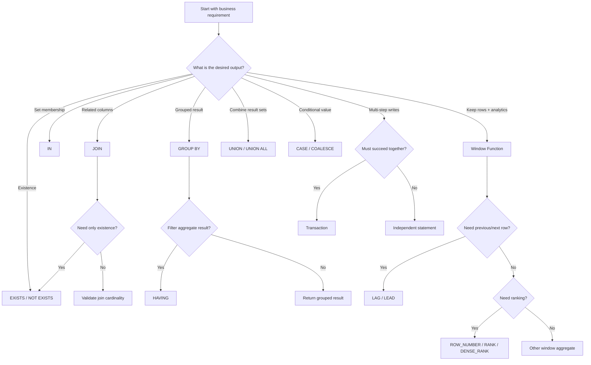

# 19- Choosing the Right SQL Technique

## Overview

SQL provides multiple ways to express the same business requirement:

- `JOIN`
- `EXISTS`
- `IN`
- Subqueries
- CTEs
- `GROUP BY`
- Window functions
- `UNION` / `UNION ALL`
- `CASE` / `COALESCE`
- Views
- Temporary tables
- Transactions
- Indexes
- Atomic `UPDATE` statements

The difficult part at senior level is usually not knowing the syntax. It is choosing the technique that best matches:

- Required result grain.
- Business semantics.
- Cardinality.
- Concurrency requirements.
- Data volume.
- Performance characteristics.
- Maintainability.
- Operational constraints.

Two queries can return the same result on today's dataset while having very different behavior under production workloads.

The core principle is:

> **Choose SQL based on the meaning of the operation first, then validate the implementation with the execution plan and production workload.**

---

## The SQL Decision Mindset

Before writing SQL, answer five questions:

1. **What should one output row represent?**
2. **Am I filtering, combining, aggregating, ranking, transforming, or modifying data?**
3. **Do I need rows, groups, existence, or a derived value?**
4. **What concurrency guarantees are required?**
5. **What will happen when the dataset becomes 10× or 100× larger?**

This prevents many common SQL problems.

For example:

```text
"Find customers who have paid orders"
```

is fundamentally an existence problem.

```sql
SELECT c.id
FROM customers AS c
WHERE EXISTS (
    SELECT 1
    FROM orders AS o
    WHERE o.customer_id = c.id
      AND o.status = 'paid'
);
```

Using a `JOIN` may also work, but it introduces a different cardinality model:

```sql
SELECT c.id
FROM customers AS c
JOIN orders AS o
    ON o.customer_id = c.id
WHERE o.status = 'paid';
```

If a customer has five paid orders, the `JOIN` can produce five rows. `EXISTS` expresses the requirement directly: **does at least one matching row exist?**

---

## SQL Technique Selection Matrix

| Requirement | Usually consider | Why |
|---|---|---|
| Combine related rows | `JOIN` | Relational combination |
| Check whether a related row exists | `EXISTS` | Expresses existence without row multiplication |
| Exclude rows having a relationship | `NOT EXISTS` | Safe relational exclusion |
| Match against a set of values | `IN` | Set membership |
| Reuse a query result within one statement | CTE | Query-local composition |
| Persist reusable query logic | View | Database-level abstraction |
| Store intermediate session data | Temporary table | Materialized intermediate relation |
| Collapse rows into groups | `GROUP BY` | Produces one row per group |
| Keep rows while calculating group-relative values | Window function | Preserves row grain |
| Compare previous/next row | `LAG` / `LEAD` | Positional analysis |
| Assign row positions | `ROW_NUMBER` | Unique row numbering |
| Rank with ties | `RANK` / `DENSE_RANK` | Tie-aware ranking |
| Combine compatible result sets | `UNION` / `UNION ALL` | Vertical composition |
| Conditional business logic | `CASE` | Branching expression |
| Replace `NULL` with fallback | `COALESCE` | NULL fallback |
| Make multiple writes atomic | Transaction | Consistency boundary |
| Enforce uniqueness | Unique constraint/index | Database invariant |
| Optimize access path | Index | Faster retrieval when beneficial |
| Perform atomic state transition | Conditional `UPDATE` | Avoid unnecessary read-modify-write race |

---

## Start With Result Grain

The most important SQL design question is:

> **What does one output row represent?**

Possible grains include:

```text
one row per customer
one row per order
one row per order item
one row per customer per month
one row per product
one row per product per day
```

Suppose the requirement is:

```text
Return one row per customer with total revenue.
```

Use aggregation:

```sql
SELECT
    customer_id,
    SUM(total_amount) AS revenue
FROM orders
WHERE status = 'paid'
GROUP BY customer_id;
```

If the requirement instead is:

```text
Return every order with the customer's total revenue.
```

use a window function:

```sql
SELECT
    id,
    customer_id,
    total_amount,
    SUM(total_amount) OVER (
        PARTITION BY customer_id
    ) AS customer_revenue
FROM orders
WHERE status = 'paid';
```

The difference is not syntax preference.

It is **output grain**.

---

## Filtering vs Combining

When the requirement is:

```text
Return customers that have at least one order.
```

this is primarily filtering based on another relation.

Prefer:

```sql
SELECT c.id
FROM customers AS c
WHERE EXISTS (
    SELECT 1
    FROM orders AS o
    WHERE o.customer_id = c.id
);
```

When the requirement is:

```text
Return customer and order information together.
```

use a `JOIN`:

```sql
SELECT
    c.id AS customer_id,
    c.email,
    o.id AS order_id,
    o.total_amount
FROM customers AS c
JOIN orders AS o
    ON o.customer_id = c.id;
```

A useful distinction is:

```text
Need columns from another table?
    ↓
JOIN

Need to know whether a related row exists?
    ↓
EXISTS
```

---

## JOIN vs EXISTS vs IN

### Use JOIN When You Need Related Data

```sql
SELECT
    o.id,
    c.email
FROM orders AS o
JOIN customers AS c
    ON c.id = o.customer_id;
```

The `JOIN` combines rows.

### Use EXISTS When You Need Existence

```sql
SELECT o.id
FROM orders AS o
WHERE EXISTS (
    SELECT 1
    FROM payments AS p
    WHERE p.order_id = o.id
      AND p.status = 'successful'
);
```

### Use IN When Set Membership Is the Natural Meaning

```sql
SELECT *
FROM orders
WHERE customer_id IN (
    SELECT id
    FROM customers
    WHERE country_code = 'IN'
);
```

For exclusion, `NOT EXISTS` is generally preferable to `NOT IN` when the subquery can contain `NULL`.

```sql
SELECT c.id
FROM customers AS c
WHERE NOT EXISTS (
    SELECT 1
    FROM orders AS o
    WHERE o.customer_id = c.id
);
```

---

## Why NOT IN Can Be Dangerous

Consider:

```sql
WHERE customer_id NOT IN (
    SELECT customer_id
    FROM blocked_customers
);
```

If the subquery contains `NULL`, SQL's three-valued logic can produce unexpected results.

For relational exclusion, this is often clearer:

```sql
WHERE NOT EXISTS (
    SELECT 1
    FROM blocked_customers AS b
    WHERE b.customer_id = c.id
);
```

The technique should be selected based on semantics, not the assumption that one keyword is universally faster.

---

## JOIN vs Subquery

A subquery can represent:

- A scalar value.
- A derived relation.
- An existence check.
- A correlated lookup.

Example:

```sql
SELECT
    c.id,
    (
        SELECT MAX(o.created_at)
        FROM orders AS o
        WHERE o.customer_id = c.id
    ) AS latest_order_at
FROM customers AS c;
```

This can be appropriate when the derived value is naturally scalar.

A join plus aggregation may be clearer when multiple related values are needed:

```sql
SELECT
    c.id,
    MAX(o.created_at) AS latest_order_at
FROM customers AS c
LEFT JOIN orders AS o
    ON o.customer_id = c.id
GROUP BY c.id;
```

Do not mechanically rewrite every subquery as a `JOIN`.

Compare:

- Semantics.
- Cardinality.
- Execution plan.
- Indexes.
- Readability.

---

## GROUP BY vs Window Function

Use `GROUP BY` when the output should contain one row per group:

```sql
SELECT
    customer_id,
    SUM(total_amount) AS revenue
FROM orders
GROUP BY customer_id;
```

Use a window function when the original rows must remain:

```sql
SELECT
    id,
    customer_id,
    total_amount,
    SUM(total_amount) OVER (
        PARTITION BY customer_id
    ) AS customer_revenue
FROM orders;
```

Mental model:

```text
GROUP BY
many rows
    ↓
one row per group

Window function
many rows
    ↓
same rows + calculated context
```

---

## WHERE vs HAVING

Use `WHERE` to filter rows before aggregation:

```sql
SELECT
    customer_id,
    SUM(total_amount) AS revenue
FROM orders
WHERE status = 'paid'
GROUP BY customer_id;
```

Use `HAVING` to filter groups based on aggregate results:

```sql
SELECT
    customer_id,
    SUM(total_amount) AS revenue
FROM orders
WHERE status = 'paid'
GROUP BY customer_id
HAVING SUM(total_amount) >= 10000;
```

The distinction is:

```text
WHERE → row-level predicate

HAVING → group-level predicate
```

Filtering early can also reduce the amount of data that must be grouped, although the optimizer may transform predicates when it is semantically valid.

---

## CASE vs COALESCE

Use `CASE` for conditional logic:

```sql
SELECT
    id,
    CASE
        WHEN total_amount >= 1000 THEN 'high'
        WHEN total_amount >= 500 THEN 'medium'
        ELSE 'low'
    END AS order_segment
FROM orders;
```

Use `COALESCE` for NULL fallback:

```sql
SELECT
    id,
    COALESCE(display_name, email) AS customer_name
FROM customers;
```

Mental model:

```text
CASE
    ↓
Which condition applies?

COALESCE
    ↓
Which non-NULL value should I use?
```

Do not use `COALESCE` when empty strings should also be considered missing:

```sql
COALESCE(display_name, 'Unknown')
```

does not replace:

```text
''
```

with `'Unknown'`.

---

## CTE vs Subquery

Use a CTE when it improves structure or when the query benefits from named intermediate relations:

```sql
WITH paid_orders AS (
    SELECT
        customer_id,
        total_amount
    FROM orders
    WHERE status = 'paid'
)
SELECT
    customer_id,
    SUM(total_amount) AS revenue
FROM paid_orders
GROUP BY customer_id;
```

A subquery may be better when the derived relation is small and local:

```sql
SELECT
    customer_id,
    SUM(total_amount)
FROM (
    SELECT customer_id, total_amount
    FROM orders
    WHERE status = 'paid'
) AS paid_orders
GROUP BY customer_id;
```

In PostgreSQL, eligible CTEs can be inlined by the optimizer. A CTE should therefore not be treated as automatically materialized.

Use:

```sql
WITH expensive_data AS MATERIALIZED (
    ...
)
```

only when deliberate materialization is appropriate.

Use:

```sql
WITH reusable_data AS NOT MATERIALIZED (
    ...
)
```

when explicitly requesting non-materialized behavior where supported.

---

## CTE vs Temporary Table

A CTE is:

```text
Query-local
```

A temporary table is:

```text
Session-local materialized data
```

Use a temporary table when:

- Multiple statements need the same intermediate dataset.
- You need indexes on intermediate data.
- You need to analyze intermediate data.
- The intermediate result is large enough that explicit materialization is useful.

Example:

```sql
CREATE TEMP TABLE active_customers AS
SELECT id
FROM customers
WHERE status = 'active';

CREATE INDEX active_customers_id_idx
    ON active_customers (id);

ANALYZE active_customers;
```

Temporary tables are not durable application state and can interact badly with transaction-pooled database connections when session-level assumptions are made.

---

## View vs CTE

Use a CTE when the logic is needed for one query:

```sql
WITH recent_orders AS (
    ...
)
SELECT ...
```

Use a view when the query abstraction should persist in the database:

```sql
CREATE VIEW customer_order_summary AS
SELECT
    customer_id,
    COUNT(*) AS order_count
FROM orders
GROUP BY customer_id;
```

A normal view stores the query definition, not a cached result.

If stored results are required, consider a materialized view or another derived-data architecture.

---

## Window Function vs Self-Join

For previous-row comparisons, prefer `LAG`:

```sql
SELECT
    customer_id,
    event_time,
    amount,
    LAG(amount) OVER (
        PARTITION BY customer_id
        ORDER BY event_time, id
    ) AS previous_amount
FROM payments;
```

A self-join can express similar logic but is generally more cumbersome for positional analysis.

Use window functions for:

- Previous/next row.
- Ranking.
- Running totals.
- Group-relative calculations.
- Top-N per group.

---

## ROW_NUMBER vs RANK vs DENSE_RANK

Use `ROW_NUMBER` when each row needs a unique position:

```sql
ROW_NUMBER() OVER (
    PARTITION BY customer_id
    ORDER BY created_at DESC, id DESC
)
```

Use `RANK` when tied values share a position and gaps are meaningful.

Use `DENSE_RANK` when tied values share a position but gaps should not occur.

```text
ROW_NUMBER:
1, 2, 3, 4

RANK:
1, 2, 2, 4

DENSE_RANK:
1, 2, 2, 3
```

For deterministic pagination or deduplication, `ROW_NUMBER` generally needs a total ordering, often by adding a unique tie-breaker.

---

## Top-N Per Group

Suppose the requirement is:

```text
Return the three highest-value orders for each customer.
```

A window function directly expresses the requirement:

```sql
WITH ranked_orders AS (
    SELECT
        id,
        customer_id,
        total_amount,
        ROW_NUMBER() OVER (
            PARTITION BY customer_id
            ORDER BY total_amount DESC, id DESC
        ) AS row_number
    FROM orders
)
SELECT
    id,
    customer_id,
    total_amount
FROM ranked_orders
WHERE row_number <= 3;
```

This is fundamentally different from:

```sql
ORDER BY total_amount DESC
LIMIT 3
```

which returns three rows globally.

---

## UNION vs UNION ALL

Use `UNION ALL` when all rows should be preserved:

```sql
SELECT id, email
FROM active_customers

UNION ALL

SELECT id, email
FROM archived_customers;
```

Use `UNION` when duplicate complete result rows should be removed:

```sql
SELECT id, email
FROM source_a

UNION

SELECT id, email
FROM source_b;
```

`UNION` is not a business-identity deduplication mechanism.

It compares complete result rows.

If duplicate business entities need precedence rules, use explicit logic such as `ROW_NUMBER`, `DISTINCT ON` where appropriate, or another identity-based strategy.

---

## Offset vs Keyset Pagination

Offset pagination:

```sql
SELECT
    id,
    created_at,
    total_amount
FROM orders
ORDER BY created_at DESC, id DESC
LIMIT 50
OFFSET 50000;
```

is simple but can become increasingly expensive at large offsets.

Keyset pagination:

```sql
SELECT
    id,
    created_at,
    total_amount
FROM orders
WHERE (created_at, id) < ($1, $2)
ORDER BY created_at DESC, id DESC
LIMIT 50;
```

uses the last row from the previous page as the cursor.

For large APIs, keyset pagination is often a better production choice when the API can use cursor semantics.

The corresponding index should align with the query:

```sql
CREATE INDEX orders_created_at_id_idx
ON orders (created_at DESC, id DESC);
```

---

## Transactions vs Atomic SQL

Suppose inventory must not become negative.

A naïve approach:

```text
SELECT quantity
    ↓
Python checks quantity
    ↓
UPDATE quantity
```

creates a race window.

A better approach may be:

```sql
UPDATE inventory
SET available_quantity = available_quantity - $1
WHERE product_id = $2
  AND available_quantity >= $1
RETURNING product_id, available_quantity;
```

The database performs the state transition atomically.

Use a transaction when several related operations must commit together.

Use atomic SQL when the invariant can be safely expressed in one statement.

Often the best solution combines both:

```text
Transaction
    ↓
Atomic state transition
    ↓
Related writes
    ↓
Commit
```

---

## Index vs Query Rewrite

When a query is slow, do not immediately create an index.

First inspect:

```sql
EXPLAIN (ANALYZE, BUFFERS)
SELECT ...
```

Determine whether the issue is:

- Missing index.
- Incorrect index.
- Poor selectivity.
- Large result set.
- Join cardinality.
- Sort.
- Aggregation.
- Bad estimates.
- Type mismatch.
- Query shape.
- Excessive application-side processing.

An index is an access path, not a guarantee that PostgreSQL will use it.

---

## Composite Index Column Order

Suppose the common query is:

```sql
SELECT *
FROM orders
WHERE tenant_id = $1
  AND status = $2
ORDER BY created_at DESC
LIMIT 50;
```

A candidate index is:

```sql
CREATE INDEX orders_tenant_status_created_idx
ON orders (
    tenant_id,
    status,
    created_at DESC
);
```

Column order matters because a composite index supports particular access patterns.

A useful starting heuristic is:

```text
Equality predicates
    ↓
Range predicates
    ↓
Ordering / tie-breakers
```

But this is not an absolute law. Real workloads, selectivity, tenant skew, query alternatives, and ordering requirements matter.

Always validate with actual plans.

---

## Partial Index vs Full Index

If an API frequently accesses only active records:

```sql
SELECT id
FROM orders
WHERE tenant_id = $1
  AND status = 'pending';
```

a partial index may be useful:

```sql
CREATE INDEX orders_pending_tenant_idx
ON orders (tenant_id, created_at DESC)
WHERE status = 'pending';
```

This can reduce index size and write overhead compared with indexing all rows.

Use a full index when the broader workload requires access to all rows.

The predicate must also align with query semantics for PostgreSQL to use the partial index.

---

## Unique Constraint vs Application Validation

Do not use:

```python
if not user_exists(email):
    create_user(email)
```

as the primary uniqueness guarantee.

Concurrent requests can both observe:

```text
email does not exist
```

and then both insert.

Use:

```sql
CREATE UNIQUE INDEX users_email_unique
ON users (email);
```

and handle the resulting conflict appropriately.

Application validation improves user experience.

The database constraint enforces the invariant.

---

## DISTINCT vs Fixing Cardinality

`DISTINCT` is sometimes useful, but it should not be used as a universal fix for duplicate rows.

Bad reasoning:

```text
JOIN produced duplicates
    ↓
Add DISTINCT
```

First ask:

```text
Why did the JOIN multiply rows?
```

If the requirement is existence:

```sql
WHERE EXISTS (...)
```

may be more correct.

If the requirement is one latest related row:

```sql
ROW_NUMBER() ...
```

or another explicit top-one strategy may be appropriate.

`DISTINCT` should represent actual deduplication semantics, not hide an incorrect join.

---

## SQL Technique by Problem Type

### Filtering

Use:

```text
WHERE
EXISTS
IN
NOT EXISTS
```

depending on whether the predicate concerns the current row or another relation.

### Combining Data

Use:

```text
JOIN
UNION
UNION ALL
```

depending on whether the relationship is horizontal or the datasets are vertically combined.

### Aggregation

Use:

```text
GROUP BY
HAVING
```

when reducing rows into groups.

### Row-Level Analytics

Use:

```text
Window functions
```

when original rows must remain.

### Conditional Transformation

Use:

```text
CASE
COALESCE
NULLIF
```

depending on the required semantics.

### Reusable Query Structure

Use:

```text
CTE
View
Materialized view
Temporary table
```

depending on scope and persistence.

### Data Modification

Use:

```text
INSERT
UPDATE
DELETE
UPSERT
```

and combine them with transactions or atomic predicates when consistency requires it.

---

## Query Technique Decision Tree



---

## Technique Selection by Semantics

| Question | Preferred starting point |
|---|---|
| Do I need columns from another table? | `JOIN` |
| Do I only care whether a related row exists? | `EXISTS` |
| Do I need to exclude matching rows? | `NOT EXISTS` |
| Do I need to test membership in a set? | `IN` |
| Do I need one row per group? | `GROUP BY` |
| Do I need every original row plus group context? | Window function |
| Do I need previous/next row information? | `LAG` / `LEAD` |
| Do I need deterministic top-one selection? | `ROW_NUMBER` or another explicit strategy |
| Do tied values share rank? | `RANK` / `DENSE_RANK` |
| Do I need to combine two result sets? | `UNION` / `UNION ALL` |
| Do I need conditional output? | `CASE` |
| Do I need a NULL fallback? | `COALESCE` |
| Do I need query-local decomposition? | CTE |
| Do I need persistent database abstraction? | View |
| Do I need reusable session-local intermediate data? | Temporary table |
| Do several writes need atomicity? | Transaction |
| Can one conditional write enforce the invariant? | Atomic `UPDATE`/`INSERT` |
| Does the workload need faster access? | Index after plan/workload analysis |

---

## Performance Validation

Choosing a technique semantically is the first step.

Production performance should be validated using actual execution plans.

Use:

```sql
EXPLAIN (ANALYZE, BUFFERS)
SELECT
    ...
FROM ...;
```

Look for:

- Actual vs estimated row counts.
- Sequential scans.
- Index scans.
- Bitmap scans.
- Nested loops.
- Hash joins.
- Merge joins.
- Sort operations.
- Hash aggregation.
- Memory usage.
- Temporary file activity.
- Rows removed by filters.
- Repeated inner-loop work.

A query that looks elegant may still perform poorly at production scale.

---

## Query Plan Before Micro-Optimization

Do not optimize based only on syntax.

For example:

```sql
WHERE EXISTS (...)
```

and:

```sql
WHERE customer_id IN (...)
```

may be transformed by PostgreSQL into similar relational execution strategies.

Likewise:

```sql
JOIN
```

and:

```sql
EXISTS
```

can sometimes produce different or similar plans depending on the query.

The optimizer matters.

Use the actual plan to determine:

```text
Does this query access too many rows?
Does it perform unnecessary work?
Are estimates wrong?
Is an index useful?
Is join cardinality exploding?
```

---

## Production Example: Customer Dashboard

Suppose a customer dashboard needs:

```text
Customer profile
Total paid revenue
Latest order
Whether the customer has an active subscription
Top three recent orders
```

A senior SQL design might combine multiple techniques.

### Customer Profile

```sql
SELECT
    id,
    email,
    display_name
FROM customers
WHERE id = $1;
```

### Revenue

```sql
SELECT
    SUM(total_amount) AS paid_revenue
FROM orders
WHERE customer_id = $1
  AND status = 'paid';
```

### Latest Order

```sql
SELECT
    id,
    created_at,
    total_amount
FROM orders
WHERE customer_id = $1
ORDER BY created_at DESC, id DESC
LIMIT 1;
```

### Active Subscription

```sql
SELECT EXISTS (
    SELECT 1
    FROM subscriptions
    WHERE customer_id = $1
      AND status = 'active'
) AS has_active_subscription;
```

### Recent Orders

```sql
SELECT
    id,
    created_at,
    total_amount
FROM orders
WHERE customer_id = $1
ORDER BY created_at DESC, id DESC
LIMIT 3;
```

The correct design does not require forcing every requirement into one enormous SQL statement.

The correct choice depends on:

- Latency budget.
- Number of round trips.
- Required consistency.
- Indexes.
- Query complexity.
- API architecture.

---

## Combining Techniques

Real production queries often combine several SQL techniques.

Example:

```sql
WITH ranked_orders AS (
    SELECT
        o.id,
        o.customer_id,
        o.total_amount,
        o.created_at,
        ROW_NUMBER() OVER (
            PARTITION BY o.customer_id
            ORDER BY o.created_at DESC, o.id DESC
        ) AS row_number
    FROM orders AS o
    WHERE o.status = 'paid'
)
SELECT
    customer_id,
    id AS latest_order_id,
    total_amount
FROM ranked_orders
WHERE row_number = 1;
```

This combines:

```text
WHERE
    ↓
Window function
    ↓
ROW_NUMBER
    ↓
CTE
    ↓
Filtering derived result
```

The techniques should compose around the business requirement rather than being selected independently.

---

## Django and ORM Translation

The same decision framework applies to Django ORM.

Existence:

```python
from django.db.models import Exists, OuterRef

paid_orders = Order.objects.filter(
    customer_id=OuterRef("pk"),
    status="paid",
)

customers = Customer.objects.annotate(
    has_paid_order=Exists(paid_orders),
)
```

Join-like related filtering:

```python
orders = Order.objects.select_related("customer")
```

Aggregation:

```python
from django.db.models import Sum

customers = Customer.objects.annotate(
    revenue=Sum("orders__total_amount")
)
```

The ORM should not hide SQL reasoning.

A senior backend engineer should understand what relational operation the ORM is generating and inspect SQL/query plans for expensive paths.

---

## FastAPI and SQLAlchemy

With SQLAlchemy, the same relational choices apply:

```python
from sqlalchemy import exists, select

stmt = select(Customer.id).where(
    exists(
        select(Order.id).where(
            Order.customer_id == Customer.id,
            Order.status == "paid",
        )
    )
)
```

The important skill is not memorizing ORM syntax.

It is translating:

```text
business requirement
    ↓
relational operation
    ↓
SQL shape
    ↓
execution plan
```

---

## Transactions in Application Architecture

A typical FastAPI or Django service might use:

```text
HTTP request
    ↓
Validation
    ↓
Authorization
    ↓
Database operation
    ↓
Transaction if required
    ↓
Commit
    ↓
Response
```

For asynchronous processing:

```text
HTTP request
    ↓
Short DB transaction
    ↓
Persist state + outbox
    ↓
Commit
    ↓
Celery/Kafka processing
```

Do not extend database transactions across:

- HTTP calls.
- Kafka publication.
- Redis operations.
- Long-running computation.

---

## Security and SQL Technique Selection

Security requirements should influence query design.

For multi-tenant systems, predicates should preserve tenant boundaries:

```sql
SELECT
    id,
    total_amount
FROM orders
WHERE tenant_id = $1
  AND id = $2;
```

For existence:

```sql
SELECT EXISTS (
    SELECT 1
    FROM orders
    WHERE id = $1
      AND tenant_id = $2
);
```

Do not rely on application code to filter tenant data after fetching unrestricted rows.

Always parameterize values:

```python
cursor.execute(
    """
    SELECT id
    FROM orders
    WHERE tenant_id = %s
      AND id = %s
    """,
    (tenant_id, order_id),
)
```

Do not construct SQL with string interpolation.

---

## Scalability Considerations

A SQL technique that works at 10,000 rows may behave differently at 100 million rows.

Consider:

- Cardinality.
- Selectivity.
- Index size.
- Sort memory.
- Join strategy.
- Aggregation cost.
- Pagination strategy.
- Connection concurrency.
- Replica workload.
- Data distribution.

For large datasets:

```text
Good SQL shape
    +
appropriate indexes
    +
accurate statistics
    +
controlled concurrency
```

is usually more important than choosing a particular SQL keyword based on folklore.

---

## Read Replicas

Read-heavy workloads may use PostgreSQL replicas:

```text
API
 ├── writes → Primary
 └── reads  → Replica
```

But replica lag affects semantics.

For example:

```text
POST creates order
    ↓
GET immediately from replica
    ↓
Order not visible yet
```

SQL technique selection cannot solve replication lag.

The application may need:

- Primary reads after writes.
- Read-your-writes routing.
- Lag-aware routing.
- Stronger consistency where required.

---

## Redis and SQL

Redis is useful for caching or derived read models, but it should not automatically replace a correct SQL query.

A common architecture is:

```text
PostgreSQL
    ↓
Source of truth

Redis
    ↓
Low-latency cache/read model
```

Before adding Redis, determine whether:

- The SQL query is correctly indexed.
- The result is expensive enough to cache.
- Staleness is acceptable.
- Invalidation is manageable.

Caching an incorrectly designed query does not fix the underlying data model.

---

## Kafka and SQL

Kafka is appropriate for event-driven data flows, not as a replacement for relational query semantics.

For example:

```text
PostgreSQL transaction
    ↓
Outbox event
    ↓
Kafka
    ↓
Consumer
    ↓
Derived read model
```

SQL remains appropriate for:

- Transactions.
- Relational constraints.
- Ad hoc relational queries.
- Consistent source-of-truth operations.

Kafka is appropriate for:

- Event distribution.
- Asynchronous processing.
- Stream processing.
- Decoupling services.

---

## Cost Considerations

Poor SQL technique selection can increase infrastructure cost.

Examples:

```text
Unbounded query
    ↓
High CPU
    ↓
Larger database instance
```

or:

```text
Missing index
    ↓
Repeated sequential scans
    ↓
Higher I/O
```

or:

```text
Huge transaction
    ↓
WAL + replica lag
    ↓
Operational scaling pressure
```

Optimization should consider:

- Database CPU.
- Memory.
- Storage.
- I/O.
- Replication traffic.
- Cache efficiency.
- Application connection count.

---

## Common Mistakes

### Choosing SQL Based on Keyword Preference

Example:

```text
"EXISTS is always faster than IN."
```

This is not a reliable rule.

Choose based on semantics and validate the plan.

### Using JOIN for Existence

This can multiply rows unnecessarily.

Use `EXISTS` when only existence matters.

### Using DISTINCT to Hide Join Problems

Fix the cardinality problem instead of masking it.

### Using GROUP BY When Rows Must Be Preserved

Use a window function when row-level detail must remain.

### Using HAVING for Ordinary Row Filters

Push row-level predicates into `WHERE` when semantically valid.

### Assuming CTE Means Materialization

PostgreSQL can inline eligible CTEs.

### Using UNION for Business Deduplication

`UNION` removes duplicate complete result rows, not duplicate business entities.

### Using OFFSET for Very Large Pagination

Consider keyset pagination for large ordered datasets.

### Using Transactions Around External Calls

This can create long database transactions and still does not provide distributed atomicity.

### Adding Indexes Without Measuring

Indexes have write, storage, WAL, vacuum, and maintenance costs.

---

## Production Troubleshooting

When a query is slow, follow a structured process:

```text
Identify slow endpoint/query
        ↓
Capture exact SQL + parameters
        ↓
EXPLAIN (ANALYZE, BUFFERS)
        ↓
Inspect row estimates and actual rows
        ↓
Check join cardinality
        ↓
Check scans/sorts/aggregations
        ↓
Check indexes
        ↓
Check statistics
        ↓
Change query/index
        ↓
Re-measure
```

Do not optimize a simplified query that does not represent the production workload.

---

## Senior SQL Decision Framework

A useful senior-level process is:

### Define the Semantics

Ask:

```text
What does one output row represent?
```

### Identify the Relational Operation

Choose among:

```text
filter
join
existence
aggregation
window analysis
set combination
transformation
modification
```

### Choose the Simplest Correct Technique

Prefer the SQL construct that most directly expresses the requirement.

### Check Cardinality

For every `JOIN`, ask:

```text
How many rows can each side contribute?
```

### Check Concurrency

For writes, ask:

```text
Can two requests execute this simultaneously?
```

If yes, consider:

- Constraints.
- Atomic SQL.
- Transactions.
- Locks.
- Isolation.
- Idempotency.

### Check Scale

Ask:

```text
What happens at 10× the current data?
```

### Inspect the Plan

Use:

```sql
EXPLAIN (ANALYZE, BUFFERS)
```

### Measure in Production

Check:

- Latency.
- CPU.
- I/O.
- Lock waits.
- Connection utilization.
- Error rate.
- Replica lag.

---

## A Practical Decision Checklist

Before finalizing a non-trivial query, ask:

- [ ] What is the required result grain?
- [ ] Is this filtering or joining?
- [ ] Do I need existence or actual related columns?
- [ ] Am I accidentally multiplying rows?
- [ ] Should this be `GROUP BY` or a window function?
- [ ] Should this be `WHERE` or `HAVING`?
- [ ] Is `CASE` or `COALESCE` expressing the actual requirement?
- [ ] Is a CTE improving clarity or introducing unnecessary complexity?
- [ ] Does the query need a persistent view?
- [ ] Would a temporary table provide meaningful reuse?
- [ ] Is `UNION ALL` semantically correct instead of `UNION`?
- [ ] Is pagination appropriate for the expected dataset size?
- [ ] Can an atomic SQL statement replace a read-modify-write sequence?
- [ ] Does the operation require a transaction?
- [ ] Are constraints enforcing important invariants?
- [ ] Does the query have appropriate indexes?
- [ ] Have I checked `EXPLAIN (ANALYZE, BUFFERS)`?
- [ ] Is the query safe under concurrent execution?
- [ ] Does the design work with replicas, caching, and asynchronous processing?

---

## Interview Mental Model

When asked:

> "Which SQL technique would you use?"

Do not immediately answer with syntax.

Structure the reasoning:

```text
1. Define the required result.
2. Define the output grain.
3. Identify the relational operation.
4. Choose the simplest correct SQL construct.
5. Check cardinality and NULL behavior.
6. Consider concurrency for writes.
7. Consider indexes and data volume.
8. Validate with the execution plan.
```

For example:

> "I would use `EXISTS` because the requirement is to determine whether a related row exists, not to return columns from that relation. This avoids expressing unnecessary row multiplication. I would still inspect the execution plan and ensure the correlated predicate is indexed appropriately."

That demonstrates substantially more SQL maturity than:

> "EXISTS is faster."

---

## Key Takeaways

- **Choose SQL techniques from semantics and result grain first: `JOIN` combines data, `EXISTS` tests existence, `GROUP BY` collapses rows, and window functions preserve row-level detail.**
- **Do not rely on SQL folklore such as "`EXISTS` is always faster than `IN`"; validate the actual execution plan, cardinality, indexes, and workload.**
- **For writes, combine the right SQL technique with constraints, atomic statements, transactions, locking, isolation, and idempotency to handle concurrency correctly.**
- **Production SQL decisions must account for scale, connection usage, replication, caching, asynchronous systems, security, observability, and operational cost.**
- **The senior approach is to define the business semantics, choose the simplest correct relational operation, validate cardinality, inspect `EXPLAIN (ANALYZE, BUFFERS)`, and measure the real workload.**