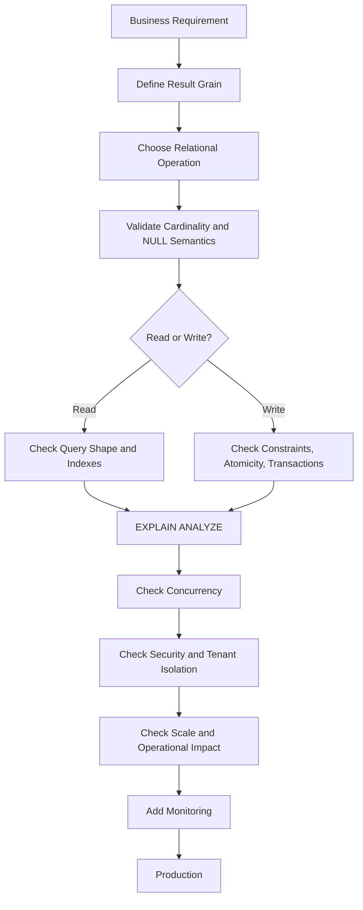

# 20- SQL Decision Making Checklist

## Overview

Writing SQL is only one part of SQL engineering. The harder problem in production systems is deciding **which SQL technique, query shape, constraint, index, transaction boundary, or database feature should be used for a particular requirement**.

A senior backend engineer should be able to move from:

```text
Business requirement
        ↓
Data model
        ↓
Required result / state transition
        ↓
SQL technique
        ↓
Concurrency + correctness
        ↓
Performance
        ↓
Operational behavior
```

rather than starting with a SQL keyword and trying to force the requirement into it.

This checklist provides a repeatable process for designing and reviewing SQL used by backend services, APIs, background workers, migrations, and production data workflows.

---

## The Core SQL Decision Process

Before implementing a non-trivial SQL operation, work through:

```text
1. What does the business requirement mean?
2. What should one output row represent?
3. Is this read, write, aggregation, existence, transformation, or set combination?
4. Which SQL technique expresses that operation most directly?
5. What happens with NULLs and empty results?
6. What is the expected cardinality?
7. What happens under concurrent execution?
8. Does the operation require a transaction?
9. What indexes and constraints support correctness and performance?
10. What happens at production data volume?
11. What does EXPLAIN say?
12. How will the operation be monitored and recovered?
```

The checklist should be applied proportionally. A simple lookup does not require the same analysis as a financial transaction or a 500-million-row migration.

---

## Start With the Business Requirement

Do not start by asking:

```text
Should I use JOIN or EXISTS?
```

Start with:

```text
What exactly must the system do?
```

For example:

> Return customers who have at least one successful payment.

This immediately suggests an existence requirement:

```sql
SELECT c.id
FROM customers AS c
WHERE EXISTS (
    SELECT 1
    FROM payments AS p
    WHERE p.customer_id = c.id
      AND p.status = 'successful'
);
```

Compare that with:

> Return every successful payment together with customer information.

Now a `JOIN` is appropriate:

```sql
SELECT
    p.id AS payment_id,
    p.amount,
    c.id AS customer_id,
    c.email
FROM payments AS p
JOIN customers AS c
    ON c.id = p.customer_id
WHERE p.status = 'successful';
```

The business semantics determine the SQL shape.

---

## Define the Result Grain

Before writing a `JOIN`, aggregation, or window function, define:

> **What does one output row represent?**

Examples:

| Requirement | Output grain |
|---|---|
| Customer directory | One row per customer |
| Order list | One row per order |
| Order details | One row per order item |
| Customer revenue | One row per customer |
| Monthly revenue | One row per month |
| Customer + latest order | One row per customer |
| Top 3 orders per customer | Up to three rows per customer |
| Customer with paid-order existence | One row per customer |

This single decision prevents many SQL bugs.

---

## Result Grain Checklist

Before finalizing a query:

- [ ] Can I describe one output row in one sentence?
- [ ] Does every `JOIN` preserve or intentionally change the grain?
- [ ] Can a one-to-many relationship multiply rows?
- [ ] Does `GROUP BY` produce the required grain?
- [ ] Should I preserve the original rows with a window function?
- [ ] Is `DISTINCT` actually required?
- [ ] Am I accidentally hiding a cardinality problem with `DISTINCT`?

If the answer to the last question is yes, redesign the query.

---

## Choose the Relational Operation

Classify the requirement before choosing syntax.

| Requirement | Starting technique |
|---|---|
| Filter rows | `WHERE` |
| Filter based on related-row existence | `EXISTS` |
| Exclude related rows | `NOT EXISTS` |
| Match a set | `IN` |
| Combine related tables | `JOIN` |
| Collapse rows | `GROUP BY` |
| Filter groups | `HAVING` |
| Preserve rows while calculating context | Window function |
| Compare previous/next rows | `LAG` / `LEAD` |
| Rank rows | `ROW_NUMBER` / `RANK` / `DENSE_RANK` |
| Combine result sets | `UNION` / `UNION ALL` |
| Conditional value | `CASE` |
| NULL fallback | `COALESCE` |
| Query-local decomposition | CTE |
| Persistent query abstraction | View |
| Session-local intermediate data | Temporary table |
| Multiple writes as one unit | Transaction |
| Enforce invariant | Constraint / unique index |
| Optimize access | Index |

This is a starting point, not a rule that every query must follow exactly one technique.

Production queries commonly combine several techniques.

---

## JOIN Decision Checklist

Use `JOIN` when related columns or rows are actually required.

Before using a join, ask:

- [ ] What relationship connects the tables?
- [ ] Is it one-to-one, one-to-many, or many-to-many?
- [ ] How many rows can each side contribute?
- [ ] Do I need `INNER JOIN`, `LEFT JOIN`, or another join type?
- [ ] Can the join multiply rows?
- [ ] Are NULL-preserving semantics required?
- [ ] Are the join columns indexed appropriately?
- [ ] Is the result grain still correct?

Example:

```sql
SELECT
    o.id,
    o.total_amount,
    c.email
FROM orders AS o
JOIN customers AS c
    ON c.id = o.customer_id
WHERE o.status = 'paid';
```

---

## EXISTS Decision Checklist

Use `EXISTS` when the requirement is:

```text
Does at least one matching row exist?
```

Example:

```sql
SELECT c.id
FROM customers AS c
WHERE EXISTS (
    SELECT 1
    FROM orders AS o
    WHERE o.customer_id = c.id
      AND o.status = 'paid'
);
```

Checklist:

- [ ] Do I need only existence?
- [ ] Would a `JOIN` unnecessarily multiply rows?
- [ ] Is the correlation predicate correct?
- [ ] Are tenant/security predicates included?
- [ ] Is the relevant relationship indexed?
- [ ] Have I validated the plan rather than assuming `EXISTS` is faster?

`EXISTS` is a semantic choice first and a performance choice second.

---

## IN Decision Checklist

Use `IN` when membership in a set is the natural requirement.

```sql
SELECT id
FROM orders
WHERE customer_id IN (
    SELECT id
    FROM customers
    WHERE country_code = 'IN'
);
```

Check:

- [ ] Is this genuinely set membership?
- [ ] Can the subquery contain `NULL`?
- [ ] Would `EXISTS` express the relationship more clearly?
- [ ] Is the input list very large?
- [ ] Should a temporary/staging relation be used instead?
- [ ] Have I checked the actual plan?

For negative membership, prefer careful consideration of `NOT EXISTS` because `NOT IN` has important NULL semantics.

---

## GROUP BY Decision Checklist

Use `GROUP BY` when rows should collapse into groups.

```sql
SELECT
    customer_id,
    SUM(total_amount) AS revenue
FROM orders
WHERE status = 'paid'
GROUP BY customer_id;
```

Check:

- [ ] What is the group grain?
- [ ] Which columns define the group?
- [ ] Which values are aggregates?
- [ ] Should row-level details remain?
- [ ] Should aggregate results be filtered with `HAVING`?
- [ ] Could the join happen before aggregation and cause double counting?
- [ ] Is the input dataset reduced before aggregation where appropriate?

---

## Window Function Decision Checklist

Use a window function when the original rows should remain while calculations use neighboring or partitioned rows.

Example:

```sql
SELECT
    id,
    customer_id,
    total_amount,
    SUM(total_amount) OVER (
        PARTITION BY customer_id
    ) AS customer_revenue
FROM orders;
```

Check:

- [ ] Should every original row remain?
- [ ] What is the partition?
- [ ] What is the ordering?
- [ ] Does the window frame matter?
- [ ] Is the ordering deterministic?
- [ ] Do I need `ROW_NUMBER`, `RANK`, `DENSE_RANK`, `LAG`, or `LEAD`?
- [ ] Can the result be filtered only after the window calculation?

---

## WHERE vs HAVING Checklist

Use `WHERE` for row-level predicates:

```sql
WHERE status = 'paid'
```

Use `HAVING` for aggregate/group-level predicates:

```sql
HAVING SUM(total_amount) >= 10000
```

Check:

- [ ] Is the predicate about an individual row?
- [ ] Is it about an aggregate result?
- [ ] Can the predicate be applied before grouping?
- [ ] Does applying it earlier change semantics?
- [ ] Does early filtering significantly reduce aggregation work?

Remember that logical query processing order describes SQL semantics; the optimizer may physically reorder operations when equivalent.

---

## CASE vs COALESCE Checklist

Use `CASE` for conditional business logic:

```sql
CASE
    WHEN status = 'paid' THEN 'complete'
    WHEN status = 'pending' THEN 'processing'
    ELSE 'unknown'
END
```

Use `COALESCE` for NULL fallback:

```sql
COALESCE(display_name, email)
```

Check:

- [ ] Am I evaluating conditions?
- [ ] Am I simply selecting the first non-NULL value?
- [ ] Is empty string different from NULL?
- [ ] Is the expression's resulting data type correct?
- [ ] Would a schema constraint be more appropriate than query-time fallback?

Query-time `COALESCE` does not replace:

```sql
NOT NULL
DEFAULT
CHECK
UNIQUE
FOREIGN KEY
```

when the database itself must enforce an invariant.

---

## CTE Decision Checklist

Use a CTE when named query-local structure improves correctness or readability.

```sql
WITH paid_orders AS (
    SELECT
        customer_id,
        total_amount
    FROM orders
    WHERE status = 'paid'
)
SELECT
    customer_id,
    SUM(total_amount) AS revenue
FROM paid_orders
GROUP BY customer_id;
```

Check:

- [ ] Does the CTE make the query easier to understand?
- [ ] Is the CTE reused?
- [ ] Is recursion required?
- [ ] Is deliberate materialization useful?
- [ ] Could a simpler subquery be clearer?
- [ ] Have I checked the execution plan?

For PostgreSQL, do not assume that every CTE is materialized. Eligible CTEs can be inlined.

---

## View Decision Checklist

Use a view when a query abstraction should persist at the database level.

```sql
CREATE VIEW customer_order_summary AS
SELECT
    customer_id,
    COUNT(*) AS order_count,
    SUM(total_amount) AS revenue
FROM orders
GROUP BY customer_id;
```

Check:

- [ ] Should this abstraction be reusable across queries/applications?
- [ ] Is database-level ownership of the logic appropriate?
- [ ] Will schema changes affect the view?
- [ ] Are permissions/security implications understood?
- [ ] Is a materialized view actually required?

A normal view does not automatically cache its result.

---

## Temporary Table Decision Checklist

Use a temporary table when intermediate data must be materialized and reused within the appropriate session/workflow.

```sql
CREATE TEMP TABLE active_customers AS
SELECT id
FROM customers
WHERE status = 'active';

CREATE INDEX active_customers_id_idx
    ON active_customers (id);

ANALYZE active_customers;
```

Check:

- [ ] Is the intermediate result reused across multiple statements?
- [ ] Is materialization beneficial?
- [ ] Would an index on the temporary table help?
- [ ] Should `ANALYZE` be run?
- [ ] Is the connection/session lifecycle understood?
- [ ] Could connection pooling or transaction pooling invalidate session assumptions?
- [ ] Is the data truly temporary?

Do not use a temporary table as a substitute for durable workflow state.

---

## UNION Decision Checklist

Use `UNION ALL` when all rows should be preserved:

```sql
SELECT id, email
FROM active_customers

UNION ALL

SELECT id, email
FROM archived_customers;
```

Use `UNION` when duplicate complete result rows should be removed.

Check:

- [ ] Should duplicates actually be removed?
- [ ] Are duplicate rows defined by complete row equality?
- [ ] Is business-identity deduplication required instead?
- [ ] Are column types compatible?
- [ ] Does the combined result have deterministic ordering if pagination is required?

Do not use `UNION` as a generic business deduplication strategy.

---

## Pagination Decision Checklist

For small and moderate datasets, offset pagination can be appropriate:

```sql
SELECT
    id,
    created_at
FROM orders
ORDER BY created_at DESC, id DESC
LIMIT 50
OFFSET 1000;
```

For large ordered datasets, consider keyset pagination:

```sql
SELECT
    id,
    created_at
FROM orders
WHERE (created_at, id) < ($1, $2)
ORDER BY created_at DESC, id DESC
LIMIT 50;
```

Check:

- [ ] How large can the offset become?
- [ ] Is the ordering deterministic?
- [ ] Is there a unique tie-breaker?
- [ ] Can a cursor be exposed by the API?
- [ ] Does an aligned index exist?
- [ ] Is the API contract compatible with cursor pagination?

---

## Transaction Decision Checklist

Before adding an explicit transaction, ask:

- [ ] Do multiple database operations form one logical state transition?
- [ ] Must they commit or roll back together?
- [ ] Can a single atomic SQL statement solve the requirement?
- [ ] What isolation level is required?
- [ ] Are locks required?
- [ ] Could transactions deadlock?
- [ ] Could serialization failures occur?
- [ ] Is retry logic required?
- [ ] Is retrying safe and idempotent?
- [ ] Could the commit outcome become uncertain?
- [ ] Is the transaction short enough?
- [ ] Are external network calls outside the transaction?
- [ ] Could the transaction increase replica lag or WAL pressure?

A transaction should protect a consistency boundary, not an entire application request by default.

---

## Atomic Write Checklist

For state transitions such as inventory reservation, first ask whether the operation can be expressed atomically.

Instead of:

```text
SELECT quantity
    ↓
Python checks quantity
    ↓
UPDATE quantity
```

consider:

```sql
UPDATE inventory
SET available_quantity = available_quantity - $1
WHERE product_id = $2
  AND available_quantity >= $1
RETURNING product_id, available_quantity;
```

Check:

- [ ] Can the invariant be expressed in the write predicate?
- [ ] Can the result of the operation be determined from affected rows/`RETURNING`?
- [ ] Is a separate read actually required?
- [ ] Are related writes still required in the same transaction?
- [ ] Is a database constraint needed?

---

## Constraint Decision Checklist

Before implementing application-level validation, ask whether the database should enforce the invariant.

Examples:

```sql
PRIMARY KEY
UNIQUE
FOREIGN KEY
CHECK
NOT NULL
EXCLUDE
```

For uniqueness:

```sql
CREATE UNIQUE INDEX users_email_unique
ON users (email);
```

Check:

- [ ] Can concurrent requests violate the invariant?
- [ ] Should every writer obey the rule?
- [ ] Can the database enforce it declaratively?
- [ ] Does application validation still improve user experience?
- [ ] How should uniqueness violations be translated into API responses?

A database constraint is the authoritative protection for database-level invariants.

---

## Index Decision Checklist

Do not ask:

```text
"Can I add an index?"
```

Ask:

```text
"What access pattern does this index improve?"
```

Check:

- [ ] What query/workload needs the index?
- [ ] What predicates are used?
- [ ] What columns are used for joins?
- [ ] Is ordering important?
- [ ] Is selectivity sufficient?
- [ ] Would a composite index be better?
- [ ] Does column order match the workload?
- [ ] Would a partial index be appropriate?
- [ ] Would an expression index be appropriate?
- [ ] Would `INCLUDE` columns help?
- [ ] What write/storage cost will it introduce?
- [ ] Is there already a redundant index?
- [ ] Have I validated the workload and execution plan?

---

## Composite Index Checklist

For:

```sql
WHERE tenant_id = $1
  AND status = $2
ORDER BY created_at DESC
```

a candidate index might be:

```sql
CREATE INDEX orders_tenant_status_created_idx
ON orders (
    tenant_id,
    status,
    created_at DESC
);
```

Check:

- [ ] Which columns are equality predicates?
- [ ] Which columns are range predicates?
- [ ] Which columns support ordering?
- [ ] Is there a deterministic tie-breaker?
- [ ] Is tenant distribution highly skewed?
- [ ] Can a partial index reduce index size?
- [ ] Are separate indexes actually more useful?
- [ ] What other query patterns need this index?

The "equality before range" rule is a useful starting heuristic, not an absolute law.

---

## NULL Checklist

Before writing a query involving nullable columns, ask:

- [ ] Can the column be `NULL`?
- [ ] What should `NULL` mean?
- [ ] Is `NULL` different from an empty string?
- [ ] Will `NOT IN` encounter NULL?
- [ ] Does a `LEFT JOIN` introduce NULL-extended rows?
- [ ] Can an aggregate return NULL?
- [ ] Should `COALESCE` be used?
- [ ] Should the schema instead use `NOT NULL`?

Remember:

```sql
NULL = NULL
```

does not evaluate to `TRUE`.

Use:

```sql
IS NULL
```

or:

```sql
IS NOT NULL
```

for NULL checks.

---

## JOIN Cardinality Checklist

For every join, explicitly estimate:

```text
Rows before JOIN
        ↓
Expected relationship
        ↓
Rows after JOIN
```

Example:

```text
100 customers
1,000 orders

customers JOIN orders
≈ 1,000 rows
```

If orders join to order items:

```text
1,000 orders
10,000 order items

orders JOIN order_items
≈ 10,000 rows
```

If the query then joins another one-to-many relation, row counts can grow rapidly.

Check:

- [ ] Is the relationship one-to-one?
- [ ] Is it one-to-many?
- [ ] Is it many-to-many?
- [ ] Are duplicate rows expected?
- [ ] Does aggregation happen before or after multiplication?
- [ ] Could pre-aggregation prevent double counting?

---

## Aggregation Checklist

Before aggregating:

- [ ] Is the input grain correct?
- [ ] Can joins duplicate rows?
- [ ] Should filtering happen before aggregation?
- [ ] Are NULL semantics understood?
- [ ] Is `COUNT(*)` or `COUNT(column)` required?
- [ ] Can `SUM()` return NULL for an empty input?
- [ ] Does `HAVING` represent the correct group-level condition?
- [ ] Is the result volume manageable?

Example:

```sql
SELECT
    customer_id,
    COUNT(*) AS order_count,
    COALESCE(SUM(total_amount), 0) AS revenue
FROM orders
WHERE status = 'paid'
GROUP BY customer_id;
```

---

## Window Function Checklist

For a window expression:

```sql
ROW_NUMBER() OVER (
    PARTITION BY customer_id
    ORDER BY created_at DESC, id DESC
)
```

check:

- [ ] Is `PARTITION BY` correct?
- [ ] Is ordering deterministic?
- [ ] Is the frame correct for the function?
- [ ] Is `NULLS FIRST` / `NULLS LAST` relevant?
- [ ] Should ties be preserved?
- [ ] Is `ROW_NUMBER`, `RANK`, or `DENSE_RANK` correct?
- [ ] Is `LAG` / `LEAD` comparing the intended rows?
- [ ] Is the result filtered in an outer query/CTE where required?

---

## Performance Checklist

Before calling SQL production-ready:

- [ ] Is the query bounded?
- [ ] Does it retrieve only required columns?
- [ ] Are predicates selective enough?
- [ ] Are joins using appropriate keys?
- [ ] Are large sorts unavoidable?
- [ ] Is aggregation operating on too many rows?
- [ ] Is pagination bounded?
- [ ] Are indexes appropriate?
- [ ] Are statistics current?
- [ ] Have actual execution plans been inspected?

Use:

```sql
EXPLAIN (ANALYZE, BUFFERS)
SELECT
    ...
FROM ...;
```

For production-sensitive queries, inspect:

```text
Estimated rows
Actual rows
Scan type
Join strategy
Sorts
Memory
Buffers
Rows removed by filters
Execution time
```

---

## Performance Anti-Pattern Checklist

Watch for:

```text
SELECT *
```

when only a few columns are required.

```text
OFFSET 1000000
```

for high-volume APIs.

```text
JOIN + DISTINCT
```

used to hide incorrect cardinality.

```text
SELECT → Python filtering
```

when SQL could perform the filtering.

```text
N queries inside a Python loop
```

when one set-based query could work.

```text
Large transaction
```

for a migration that can safely be batched.

```text
Index every column
```

without considering write and storage costs.

---

## N+1 Query Checklist

Backend ORM code can accidentally create:

```text
1 query for customers
+
N queries for orders
```

Prefer set-based access where appropriate.

In Django:

```python
orders = (
    Order.objects
    .select_related("customer")
    .filter(status="paid")
)
```

For reverse/many-valued relationships, use appropriate prefetching:

```python
customers = Customer.objects.prefetch_related("orders")
```

Always validate generated SQL for high-volume endpoints.

---

## Security Checklist

Every SQL operation should be reviewed for:

- [ ] Parameterized values.
- [ ] Authorization.
- [ ] Tenant isolation.
- [ ] Appropriate database role.
- [ ] Least privilege.
- [ ] Sensitive-column exposure.
- [ ] Safe dynamic SQL.
- [ ] RLS requirements where applicable.
- [ ] Audit requirements.

Safe:

```python
cursor.execute(
    """
    SELECT id, email
    FROM customers
    WHERE id = %s
    """,
    (customer_id,),
)
```

Do not construct SQL values through string concatenation.

Parameterization protects values, but dynamic identifiers such as table or column names require a different safe design.

---

## Multi-Tenant Checklist

For tenant-aware systems:

```sql
SELECT
    id,
    total_amount
FROM orders
WHERE tenant_id = $1
  AND id = $2;
```

Check:

- [ ] Is tenant identity always applied?
- [ ] Can a query accidentally cross tenant boundaries?
- [ ] Is tenant filtering applied before expensive aggregation where appropriate?
- [ ] Does the index support the tenant-aware access pattern?
- [ ] Is RLS appropriate?
- [ ] Does connection pooling preserve tenant context safely?
- [ ] Are background jobs carrying tenant context explicitly?

Security predicates should not depend solely on application-side filtering after unrestricted database reads.

---

## Transaction and Concurrency Checklist

For every write path, ask:

```text
What happens if two requests execute simultaneously?
```

Check:

- [ ] Can both requests read the same old state?
- [ ] Is a unique constraint required?
- [ ] Can an atomic conditional write solve it?
- [ ] Is row locking required?
- [ ] Is transaction isolation sufficient?
- [ ] Could a deadlock occur?
- [ ] Could serialization fail?
- [ ] Is retry safe?
- [ ] Is the operation idempotent?

Example:

```sql
UPDATE inventory
SET available_quantity = available_quantity - 1
WHERE product_id = $1
  AND available_quantity > 0
RETURNING product_id;
```

This is safer than relying on an application-side check followed by an unrestricted update.

---

## API Query Checklist

For a REST or gRPC endpoint, review:

```text
Request
  ↓
Authentication
  ↓
Authorization
  ↓
Validation
  ↓
SQL
  ↓
Database
  ↓
Serialization
  ↓
Response
```

Check:

- [ ] Are request filters validated?
- [ ] Is pagination bounded?
- [ ] Are only required columns selected?
- [ ] Is authorization represented in the query where appropriate?
- [ ] Is tenant filtering applied?
- [ ] Is the query parameterized?
- [ ] Is query latency observable?
- [ ] Is the result size bounded?

---

## Background Job Checklist

For Celery or other workers:

- [ ] Is the query idempotent?
- [ ] Could the task be retried?
- [ ] Is the transaction short?
- [ ] Is batch size controlled?
- [ ] Can multiple workers process the same records?
- [ ] Is row locking required?
- [ ] Would `FOR UPDATE SKIP LOCKED` be appropriate?
- [ ] Could workers starve some records?
- [ ] Is progress durable?
- [ ] Can the job resume after failure?

`SKIP LOCKED` is useful for queue-like workloads but can skip locked work temporarily and should not be treated as a general consistency mechanism.

---

## Large Data Operation Checklist

For backfills, deletes, or updates:

```text
Estimate
    ↓
Test
    ↓
Batch
    ↓
Throttle
    ↓
Observe
    ↓
Resume safely
```

Check:

- [ ] How many rows are affected?
- [ ] How much WAL will be generated?
- [ ] Will indexes amplify write cost?
- [ ] Could replica lag increase?
- [ ] Could locks affect production traffic?
- [ ] Can the operation be batched?
- [ ] Is progress durably tracked?
- [ ] Can it resume after interruption?
- [ ] Is the operation idempotent?
- [ ] Is rollback/recovery practical?

---

## Migration Checklist

Before a production schema change:

- [ ] Is the migration backward compatible?
- [ ] Can old and new application versions coexist?
- [ ] Will the operation lock a large table?
- [ ] Is an index required?
- [ ] Should `CREATE INDEX CONCURRENTLY` be used?
- [ ] Does the migration tool support the required transaction behavior?
- [ ] Is a backfill needed?
- [ ] Can the backfill be batched?
- [ ] Is validation separate from deployment?
- [ ] Is the rollback strategy understood?

For large systems, prefer:

```text
Expand
  ↓
Deploy compatible application
  ↓
Backfill
  ↓
Validate
  ↓
Switch
  ↓
Observe
  ↓
Contract
```

---

## Read Replica Checklist

If reads can go to replicas:

- [ ] Is stale data acceptable?
- [ ] Does the endpoint require read-your-writes behavior?
- [ ] Could replication lag affect the result?
- [ ] Are writes always routed to the primary?
- [ ] Are critical reads routed appropriately?
- [ ] Is replica lag monitored?

Example failure scenario:

```text
POST /orders
    ↓
Primary commits order
    ↓
GET /orders/123
    ↓
Replica has not replayed WAL yet
    ↓
Order appears missing
```

SQL correctness alone cannot eliminate this distributed consistency issue.

---

## Redis Checklist

Before caching a SQL result:

- [ ] Is the SQL query already optimized?
- [ ] Is caching actually necessary?
- [ ] How stale can the data be?
- [ ] How is cache invalidation handled?
- [ ] What happens after Redis eviction?
- [ ] Is PostgreSQL the source of truth?
- [ ] Can stale cache data violate authorization or business rules?

Do not use Redis to compensate for an incorrectly designed query or missing database constraint.

---

## Kafka and Event Checklist

For database-to-event workflows:

- [ ] Must database state and event publication intent be atomic?
- [ ] Is a transactional outbox required?
- [ ] Are events idempotent?
- [ ] Can consumers process duplicates?
- [ ] What happens if Kafka is unavailable?
- [ ] How are failed publications retried?
- [ ] Is event ordering important?

A PostgreSQL transaction does not automatically include Kafka.

---

## Observability Checklist

For important queries, monitor:

| Signal | Why it matters |
|---|---|
| Query latency | Detects slow execution |
| Error rate | Detects correctness/operational failures |
| Rows returned | Detects unexpected result growth |
| Query frequency | Identifies workload concentration |
| Database CPU | Detects compute pressure |
| Database I/O | Detects storage pressure |
| Lock waits | Detects contention |
| Deadlocks | Detects concurrency problems |
| Connection usage | Detects pool/database pressure |
| Replica lag | Detects replication impact |
| WAL generation | Detects write pressure |

Use application-level metrics to identify which endpoint or job is responsible for database load.

---

## High Availability Checklist

For production PostgreSQL workloads:

- [ ] Are writes correctly routed to the primary?
- [ ] Are replicas monitored?
- [ ] Is failover tested?
- [ ] Are connection pools compatible with failover behavior?
- [ ] Are long transactions minimized?
- [ ] Is replication lag monitored?
- [ ] Are backups independent from the primary?
- [ ] Is restore testing performed?
- [ ] Are critical SQL operations safe after retries?

HA is not simply:

```text
Primary + Replica
```

It also requires correct client behavior, failure detection, reconnection, retry, and recovery procedures.

---

## Disaster Recovery Checklist

For important data operations:

- [ ] Are automated backups enabled?
- [ ] Is point-in-time recovery available where required?
- [ ] Are WAL archives protected?
- [ ] Are restores tested?
- [ ] Are recovery objectives defined?
- [ ] Can application state be reconciled after recovery?
- [ ] Are external side effects accounted for?
- [ ] Are destructive migrations preceded by appropriate recovery preparation?

A transaction protects atomicity within its database scope.

It does not replace backups or disaster recovery.

---

## Cost Checklist

Before optimizing or redesigning SQL, consider:

- [ ] Database CPU.
- [ ] Memory.
- [ ] Storage.
- [ ] I/O.
- [ ] WAL volume.
- [ ] Replica traffic.
- [ ] Index storage.
- [ ] Connection count.
- [ ] Cache infrastructure.
- [ ] Operational complexity.

A query optimization that reduces 20 ms of latency but requires a large additional index may not be worthwhile if the query runs only a few times per day.

Workload frequency matters.

---

## Production Review Template

For a significant SQL change, document:

```text
Requirement:
    What business operation does this support?

Result grain:
    What does one row represent?

SQL technique:
    JOIN / EXISTS / GROUP BY / Window / CTE / etc.

Correctness:
    NULL semantics?
    Cardinality?
    Constraints?

Concurrency:
    Concurrent execution behavior?
    Locks?
    Isolation?
    Retry?

Performance:
    Expected row volume?
    Index?
    EXPLAIN plan?

Operational:
    Latency?
    CPU?
    I/O?
    Connection usage?

Reliability:
    Failure behavior?
    Idempotency?
    Recovery?

Security:
    Authorization?
    Tenant isolation?
    Parameterization?

Deployment:
    Migration compatibility?
    Rollback?
    Backfill?

Observability:
    Metrics?
    Logs?
    Alerts?
```

This turns SQL review from subjective style discussion into engineering analysis.

---

## SQL Code Review Checklist

### Correctness

- [ ] Business requirement is accurately represented.
- [ ] Result grain is explicit.
- [ ] JOIN cardinality is understood.
- [ ] NULL behavior is intentional.
- [ ] Empty-result behavior is correct.
- [ ] Aggregations cannot double-count unexpectedly.
- [ ] Ordering is deterministic where required.

### Performance

- [ ] Query is appropriately bounded.
- [ ] No unnecessary columns are selected.
- [ ] Predicates are appropriate.
- [ ] Indexes match actual access patterns.
- [ ] No unnecessary `DISTINCT`.
- [ ] No accidental N+1 behavior.
- [ ] Execution plan has been reviewed.

### Concurrency

- [ ] Race conditions have been considered.
- [ ] Constraints enforce important invariants.
- [ ] Atomic SQL is used where appropriate.
- [ ] Transactions are correctly scoped.
- [ ] Lock ordering is safe.
- [ ] Retry behavior is defined.

### Security

- [ ] Values are parameterized.
- [ ] Authorization is enforced.
- [ ] Tenant boundaries are preserved.
- [ ] Sensitive columns are not unnecessarily exposed.
- [ ] Database privileges are appropriate.

### Operations

- [ ] Query latency is observable.
- [ ] Large operations are bounded or batched.
- [ ] Replica impact is understood.
- [ ] WAL impact is understood.
- [ ] Failure/recovery behavior is documented.

---

## Common Beginner Mistakes

### Picking SQL Syntax Before Defining the Requirement

Bad:

```text
"I'll use JOIN because I know JOIN."
```

Better:

```text
"What relational operation does the requirement represent?"
```

### Treating SQL as Procedural Code

SQL is optimized around sets and relational operations.

Prefer:

```sql
UPDATE orders
SET status = 'expired'
WHERE status = 'pending'
  AND expires_at < now();
```

over fetching thousands of rows into Python and updating them individually.

### Ignoring Result Grain

This leads to:

- Duplicate rows.
- Incorrect counts.
- Double-counted revenue.
- Broken pagination.

### Assuming DISTINCT Fixes Everything

`DISTINCT` can hide an incorrect query design.

### Ignoring NULL Semantics

Especially dangerous with:

```text
NOT IN
LEFT JOIN
aggregates
CASE
COALESCE
```

### Assuming More Indexes Are Always Better

Indexes improve some reads while increasing:

- Storage.
- Write cost.
- WAL.
- Vacuum work.
- Backup size.
- Maintenance complexity.

---

## Common Senior-Level Mistakes

### Over-Optimizing Without Evidence

Do not rewrite a readable query solely because another SQL form looks theoretically faster.

Measure.

### Overusing CTEs

CTEs can improve readability, but excessive decomposition can make query behavior harder to reason about.

### Overusing Transactions

A transaction around an entire request can unnecessarily increase contention.

### Underusing Constraints

Important invariants should not depend solely on application behavior.

### Treating the ORM as a Database Abstraction Boundary

ORM code still produces SQL.

Senior engineers must understand:

```text
Python
    ↓
ORM
    ↓
SQL
    ↓
Planner
    ↓
Execution
```

### Optimizing for One Query

Indexes and schema changes affect the broader workload.

Always consider:

```text
read performance
+
write performance
+
storage
+
replication
+
maintenance
```

---

## Interview Decision Framework

When solving an SQL interview problem, use:

```text
Business requirement
        ↓
Output grain
        ↓
Relational operation
        ↓
SQL technique
        ↓
NULL/cardinality analysis
        ↓
Concurrency if writing
        ↓
Index/performance analysis
        ↓
Execution plan validation
```

For example:

> "I need the latest order for every customer."

Reasoning:

```text
One row per customer
        ↓
Need related order
        ↓
Need one latest row per group
        ↓
Window function / DISTINCT ON / another top-one strategy
        ↓
Deterministic ordering
        ↓
Appropriate index
        ↓
Validate plan
```

A strong answer explains **why** the technique fits the requirement rather than simply providing syntax.

---

## Fast Decision Matrix

| If the requirement says... | Think... |
|---|---|
| "Does any..." | `EXISTS` |
| "Doesn't have any..." | `NOT EXISTS` |
| "Belongs to this set..." | `IN` |
| "Show related..." | `JOIN` |
| "Total per..." | `GROUP BY` |
| "Total alongside every row..." | Window function |
| "Previous/next..." | `LAG` / `LEAD` |
| "Top N per..." | Window function |
| "Combine these datasets..." | `UNION` / `UNION ALL` |
| "If condition..." | `CASE` |
| "Use fallback if NULL..." | `COALESCE` |
| "Reuse this query structure..." | CTE |
| "Expose reusable database query..." | View |
| "Materialize temporary intermediate data..." | Temporary table |
| "All these writes must succeed together..." | Transaction |
| "Never allow duplicates..." | Unique constraint/index |
| "Update only if state permits..." | Atomic conditional write |
| "Make this access path faster..." | Index |
| "Large ordered pagination..." | Keyset pagination |

---

## Final Production Gate

Before shipping a significant SQL change, all of the following should be clear:



A SQL change is ready for production when the team can explain:

```text
Why this technique?
Why this result grain?
Why this transaction boundary?
Why these indexes?
What happens concurrently?
What happens at scale?
What happens when it fails?
How will we know it is unhealthy?
```

If those questions cannot be answered, the SQL is not fully designed yet.

---

## Key Takeaways

- **Start every SQL decision with business semantics and result grain; choose the relational operation before choosing syntax.**
- **Validate cardinality, NULL behavior, concurrency, and constraints before optimizing performance.**
- **Use the simplest correct technique—`EXISTS`, `JOIN`, `GROUP BY`, window functions, atomic writes, transactions, or indexes—based on the actual requirement rather than SQL folklore.**
- **Production SQL must be evaluated beyond query execution: consider security, scale, connection usage, replication, WAL, caching, retries, observability, and recovery.**
- **A senior SQL review should answer why the query is correct, why the technique fits, how it behaves under concurrency and scale, and how its production behavior will be measured.**